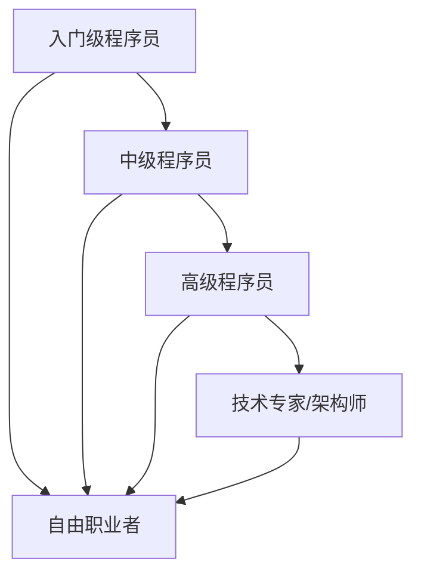

                 

### 《程序员的财务自由：数字游民生活》

> **关键词：**财务自由，数字游民，程序员，收入提升，远程工作，生活规划，被动收入，投资理财。

> **摘要：**本文将探讨如何通过编程技能实现财务自由，并探讨数字游民的生活方式如何助力这一目标的实现。文章将详细分析程序员的职业发展路径、收入来源、提升收入的方法，以及数字游民的生存之道和生活规划。同时，还将介绍构建被动收入和实现财务自由的策略，以及相关案例和实践。

### 第一部分：引言

数字时代带来了前所未有的机会，让程序员这个职业迅速崛起。随着远程工作的普及，越来越多的程序员开始追求财务自由，并选择成为数字游民。本部分将探讨财务自由的定义、意义，以及程序员如何通过职业发展实现这一目标。

#### 第1章：财务自由的定义与意义

**1.1 财务自由的概念**

财务自由是指个人或家庭拥有足够的资产，可以不依赖于工资收入来维持生活。这意味着他们有更多的自由去追求自己真正想要的生活，而不是被工资束缚。

**1.2 财务自由的重要性**

财务自由不仅提供了经济保障，更重要的是带来了精神上的自由。它让人们能够自由地选择工作、旅行、学习，甚至是退休。这种自由对于个人的幸福感和生活质量有着重要的影响。

**1.3 成为财务自由的障碍与挑战**

尽管财务自由有着诸多好处，但实现它并非易事。大多数人面临的主要障碍包括：

- **储蓄不足**：没有足够的资金作为起点。
- **高消费**：日常开支过大，储蓄率低。
- **缺乏投资知识**：不了解如何有效地管理和投资资金。

**1.4 成功的财务自由案例分享**

许多成功的财务自由案例展示了普通人如何通过聪明投资和理财规划，最终实现财务自由。例如，美国博主兼投资专家帕蒂·林奇（Patricia L_BS ynch）通过股票投资和被动收入，最终在35岁时实现了财务自由。

#### 第2章：程序员的职业发展与收入

**2.1 程序员的职业路径**

程序员职业路径通常包括初级程序员、中级程序员、高级程序员和架构师等不同阶段。每个阶段都有不同的技能要求和收入水平。

**2.2 程序员收入的来源**

程序员的收入主要来自以下几个方面：

- **基本工资**：在公司或组织中作为全职员工所获得的收入。
- **加班费**：加班工作所得到的额外收入。
- **奖金**：根据工作表现或公司业绩所获得的奖金。
- **股票期权**：在某些公司，程序员可以获得股票期权作为激励。

**2.3 如何提升程序员收入**

提升程序员收入的方法包括：

- **技能提升**：不断学习新的编程语言和技术，提高自己的市场价值。
- **跳槽**：根据市场情况适时跳槽，以获取更高的薪酬。
- **兼职和自由职业**：利用业余时间进行兼职工作或自由职业，增加额外收入。
- **创业**：创建自己的公司或产品，通过创业实现收入增长。

**2.4 高效编程技巧与生产力提升**

高效编程技巧和生产力的提升对于程序员来说至关重要。以下是一些提高编程效率的方法：

- **代码优化**：通过编写高质量的代码来提高运行效率。
- **工具使用**：熟练使用各种编程工具，如集成开发环境（IDE）、代码编辑器、版本控制系统等。
- **自动化**：通过自动化工具和脚本减少重复性工作。
- **时间管理**：合理安排工作时间，避免拖延和浪费时间。

### 第二部分：数字游民生活

数字游民是一种新兴的生活方式，它允许人们在全球各地工作，享受自由和灵活的生活。本部分将探讨数字游民的生活方式、优势与挑战，以及如何成为一名成功的数字游民。

#### 第3章：数字游民的概念与生活方式

**3.1 数字游民的定义**

数字游民是指那些利用互联网和技术在全球各地工作的人。他们通常拥有一个可以远程工作的职位，不需要固定的工作地点。

**3.2 数字游民的生活方式**

数字游民的生活方式具有以下特点：

- **灵活的工作时间**：可以根据个人喜好和当地时间进行工作。
- **低成本生活**：通常选择在生活成本较低的国家或地区居住。
- **探索世界的机会**：可以随时随地进行旅行和探险。
- **社交网络**：有机会结识来自世界各地的人。

**3.3 数字游民的优势与挑战**

数字游民的优势包括：

- **自由和灵活性**：可以自由选择工作时间和工作地点。
- **经济节省**：生活成本相对较低，有利于积累财富。
- **个人成长**：不断接触新文化和新知识，有助于个人成长。

数字游民面临的挑战包括：

- **远程工作的技术障碍**：需要稳定的网络连接和远程工作工具。
- **时间管理**：需要自我管理，避免拖延和分心。
- **文化适应**：需要适应不同的文化和生活习惯。

**3.4 如何成为一名成功的数字游民**

要成为一名成功的数字游民，以下是一些建议：

- **技能提升**：不断提升自己的技能，以适应远程工作的需求。
- **建立网络**：与同行建立联系，分享经验和资源。
- **选择合适的居住地**：选择生活成本较低、环境舒适的地方居住。
- **制定计划**：合理安排工作和生活，确保有足够的时间和精力享受生活。

#### 第4章：远程工作的技术支持

远程工作依赖于各种技术工具和平台，这些工具和平台可以帮助数字游民提高工作效率、确保沟通畅通和团队协作。本部分将介绍常用的远程工作工具、高效的工作流程、远程工作中的沟通与协作，以及如何消除远程工作的障碍。

**4.1 远程工作工具介绍**

远程工作常用的工具包括：

- **项目管理工具**：如Trello、Asana，用于任务分配和进度跟踪。
- **沟通平台**：如Slack、Telegram，用于实时沟通和协作。
- **视频会议工具**：如Zoom、Microsoft Teams，用于线上会议和讨论。
- **办公自动化工具**：如Google Workspace、Notion，用于文档处理和知识管理。
- **时间管理工具**：如Toggl、Harvest，用于监控工作时间和提高效率。

**4.2 高效的远程工作流程**

高效的远程工作流程包括以下几个步骤：

- **设定工作目标**：明确每天或每周的工作任务和目标。
- **规划工作时间**：合理安排工作时间，确保工作和生活的平衡。
- **日常任务管理**：使用项目管理工具跟踪任务进度，确保按时完成。
- **定期反馈和评估**：与团队成员进行定期沟通，反馈工作成果和遇到的问题。

**4.3 远程工作中的沟通与协作**

远程工作中的沟通与协作是确保团队高效运作的关键。以下是一些沟通与协作的最佳实践：

- **明确沟通渠道**：确定团队内部的主要沟通渠道，如邮件、即时通讯、视频会议等。
- **及时响应**：保持沟通的及时性，确保问题和问题能够及时解决。
- **共享知识**：使用文档和知识库共享知识，提高团队协作效率。
- **尊重文化差异**：了解并尊重团队成员的文化背景，避免文化冲突。

**4.4 消除远程工作的障碍**

远程工作可能面临以下障碍：

- **技术问题**：如网络不稳定、工具故障等。
- **时间管理**：难以区分工作和生活时间，导致工作效率下降。
- **心理压力**：长期远程工作可能导致孤独感、焦虑等。

以下是一些建议，帮助消除远程工作的障碍：

- **技术保障**：确保网络连接稳定，选择可靠的远程工作工具。
- **建立固定工作场所**：在家中或租赁的场所建立一个固定的工作环境。
- **时间管理技巧**：使用时间管理工具和方法，合理安排工作和休息时间。
- **心理健康支持**：寻求专业心理辅导，保持良好的心理状态。

#### 第5章：数字游民的生活规划

数字游民的生活方式需要良好的生活规划，以确保财务健康、身心健康和社交生活的平衡。本部分将探讨数字游民的生活预算、健康管理、财务规划和社交生活。

**5.1 数字游民的生活预算**

制定合理的生活预算对于数字游民来说至关重要。以下是一些建议：

- **收入和支出清单**：列出每月的收入和支出项目，包括房租、生活费、旅行费用等。
- **预算调整**：根据实际情况调整预算，确保收支平衡。
- **紧急储备金**：建立紧急储备金，以应对意外支出。
- **投资规划**：合理规划投资，确保长期财务目标。

**5.2 数字游民的健康管理**

数字游民的健康管理需要特别注意以下几点：

- **定期锻炼**：保持定期锻炼的习惯，如跑步、瑜伽、健身等。
- **健康饮食**：注意饮食健康，避免过度饮酒和摄入高热量食物。
- **心理健康**：保持良好的心理状态，通过冥想、阅读、旅行等方式放松身心。

**5.3 数字游民的财务规划**

数字游民的财务规划需要考虑以下方面：

- **资产分配**：合理分配资产，包括储蓄、投资和消费。
- **投资策略**：制定投资策略，包括股票、债券、房地产等。
- **税务规划**：了解各国税务政策，合理规划税务负担。
- **退休规划**：为退休生活做好财务准备，确保长期财务安全。

**5.4 数字游民的社交生活**

数字游民的社交生活对于保持心理健康和幸福感至关重要。以下是一些建议：

- **社交网络**：积极参与在线社交活动，结识新朋友。
- **本地社区**：参加当地社区活动，融入当地文化。
- **旅行**：利用远程工作的灵活性进行旅行，拓宽视野。

### 第三部分：实现财务自由的策略

实现财务自由需要制定明确的策略和计划。本部分将探讨构建被动收入、制定财务自由目标、实现财务自由的步骤，以及相关的评估与调整。

#### 第6章：被动收入的构建

被动收入是指不需要持续付出劳动即可获得的收入。构建被动收入是实现财务自由的重要途径。以下是一些建议：

**6.1 被动收入的定义与类型**

被动收入包括以下几种类型：

- **租金收入**：通过出租房产获得的收入。
- **股息收入**：通过投资股票或基金获得的分红收入。
- **利息收入**：通过存款或购买债券获得的利息收入。
- **版权收入**：通过创作音乐、书籍、软件等获得的版权使用费。

**6.2 如何构建被动收入**

以下是一些构建被动收入的策略：

- **投资房产**：通过购买和出租房产获得稳定的租金收入。
- **投资股票和基金**：选择具有良好投资回报的股票和基金进行投资。
- **创业和自由职业**：通过创业或自由职业建立持续收入的来源。
- **版权收入**：创作音乐、书籍、软件等，并通过版权使用费获得收入。

**6.3 投资理财的入门知识**

投资理财是构建被动收入的重要一环。以下是一些投资理财的入门知识：

- **了解不同类型的投资**：包括股票、债券、房地产、基金等。
- **风险评估**：了解不同类型投资的风险和回报。
- **资产配置**：根据个人风险承受能力进行资产配置。
- **定期评估**：定期评估投资组合，及时进行调整。

**6.4 被动收入的案例分析**

以下是一些成功的被动收入案例：

- **张先生**：通过投资房地产和股票，每月获得超过2万元的被动收入。
- **李女士**：通过创作音乐和写作，每月获得数千元的版权收入。
- **王先生**：通过开展自由职业和创业，实现了月收入数万元的目标。

#### 第7章：财务自由的具体实现步骤

实现财务自由需要一系列具体的步骤和计划。以下是一些建议：

**7.1 制定财务自由的目标**

制定财务自由的目标是实现这一目标的第一步。以下是一些建议：

- **设定具体的目标**：明确希望在何时实现财务自由，并设定一个可量化的目标。
- **确定财务指标**：计算实现财务自由所需的总资产和每月被动收入。
- **评估风险承受能力**：了解自己的风险承受能力，选择合适的投资策略。

**7.2 制定实现财务自由的计划**

制定实现财务自由的计划是确保目标实现的关键。以下是一些建议：

- **制定储蓄计划**：根据收入情况，制定一个合理的储蓄计划。
- **投资规划**：根据目标制定投资计划，选择合适的投资渠道。
- **收入多元化**：通过多种方式增加收入，如兼职、自由职业、创业等。
- **定期评估**：定期评估财务状况和投资表现，及时进行调整。

**7.3 财务自由的评估与调整**

实现财务自由的过程中，评估和调整是必不可少的。以下是一些建议：

- **定期检查财务状况**：每月或每季度检查一次财务状况，确保目标仍在轨道上。
- **调整投资策略**：根据市场变化和投资表现，及时调整投资组合。
- **反思和总结**：定期反思和总结自己的财务规划，找出不足之处，并进行改进。

**7.4 财务自由之路的坚持与反思**

实现财务自由需要长期的坚持和努力。以下是一些建议：

- **保持积极的心态**：面对困难和挑战时，保持积极的心态。
- **不断学习和提升**：通过学习新的知识和技能，不断提升自己的能力。
- **反思和总结**：定期反思自己的财务规划和投资策略，找出不足之处，并进行改进。

### 第四部分：案例分析

通过分析成功的数字游民和实现财务自由的案例，我们可以学习到宝贵的经验和教训。以下是一些具体的案例分析。

#### 第8章：数字游民与财务自由的实践者

**8.1 实践者A的财务自由之路**

实践者A是一名经验丰富的程序员。他通过以下方式实现了财务自由：

- **跳槽和兼职**：在职业生涯的不同阶段，A通过跳槽和兼职工作，积累了丰富的经验和收入。
- **投资理财**：A利用积累的资金进行投资，包括股票、债券和房地产。他的投资组合获得了稳定的回报。
- **创业**：A在积累了足够的资金和经验后，创办了自己的公司，实现了收入的多元化。

**8.2 实践者B的数字游民生活**

实践者B是一名自由职业者，他选择了数字游民的生活方式。以下是他的一些经验：

- **灵活的工作安排**：B利用远程工作的优势，灵活安排工作时间和地点，提高了工作效率。
- **低成本生活**：B选择在生活成本较低的国家居住，如东南亚国家，从而降低了生活成本。
- **社交网络**：B积极参与在线社交活动，结识了许多志同道合的朋友，拓展了自己的社交圈。

**8.3 实践者C的理财策略**

实践者C是一名专业的理财顾问。以下是他的一些理财策略：

- **多元化投资**：C通过多元化投资降低风险，包括股票、债券、房地产和基金。
- **定期评估**：C定期评估投资组合，根据市场变化进行调整。
- **财务规划**：C为他的客户制定了详细的财务规划，包括储蓄、投资和退休计划。

**8.4 实践者D的财务自由挑战**

实践者D是一名年轻的程序员，他正在努力实现财务自由。以下是他面临的一些挑战：

- **储蓄不足**：D在初期阶段，储蓄率较低，积累资金的速度较慢。
- **投资知识不足**：D对投资理财的知识了解有限，需要不断学习和提高。
- **心理压力**：D在实现财务自由的过程中，面临心理压力和孤独感，需要寻求心理支持。

#### 第9章：财务自由与数字游民的融合

数字游民生活方式和财务自由的融合为人们提供了独特的机会。以下是一些讨论：

**9.1 财务自由对数字游民生活的影响**

财务自由对数字游民生活的影响包括：

- **提高生活质量**：财务自由让数字游民能够享受更好的生活条件，如舒适的住所、高品质的食物和医疗服务。
- **旅行自由**：财务自由让数字游民能够自由地旅行，探索世界各地的文化和风景。
- **职业选择**：财务自由让数字游民能够选择自己真正热爱的工作，而不是为了生计而工作。

**9.2 数字游民如何实现财务自由**

数字游民实现财务自由的方法包括：

- **远程工作**：通过远程工作，数字游民可以获得稳定的收入。
- **投资理财**：数字游民可以通过投资股票、基金、房地产等，实现收入的多元化。
- **创业**：数字游民可以利用自己的技能和经验，创办自己的公司或开展自由职业。

**9.3 财务自由与数字游民的长期规划**

财务自由与数字游民的长期规划需要考虑以下因素：

- **退休规划**：数字游民需要为退休做好财务准备，确保长期财务安全。
- **税务规划**：数字游民需要了解各国税务政策，合理规划税务负担。
- **健康和生活方式**：数字游民需要保持健康的生活方式，以享受长期的财务自由。

**9.4 数字游民生活的可持续性**

数字游民生活的可持续性需要考虑以下因素：

- **环境影响**：数字游民需要关注自己的生活对环境的影响，如能源消耗、碳排放等。
- **社会互动**：数字游民需要积极参与当地社区活动，建立社交网络。
- **职业发展**：数字游民需要不断提升自己的技能和知识，以保持竞争力。

### 附录

#### 附录A：数字游民工具与资源

**A.1 常用远程工作工具**

- **Trello**：任务管理工具。
- **Slack**：团队沟通平台。
- **Zoom**：视频会议工具。
- **Google Workspace**：办公协作工具。
- **Notion**：笔记与任务管理工具。

**A.2 数字游民生活指南**

- **Nomad List**：寻找全球远程工作城市的指南。
- **Workfrom**：远程工作机会平台。
- **Expat Exchange**：海外生活社区。
- **Airbnb**：短期住宿平台。
- **Skyscanner**：机票与酒店预订工具。

**A.3 财务自由相关书籍和资源推荐**

- **《富爸爸，穷爸爸》**：罗伯特·清崎（Robert Kiyosaki）。
- **《财务自由之路》**：李笑来。
- **《穷查理宝典》**：查理·芒格（Charles T. Munger）。
- **《投资最重要的事》**：霍华德·马克斯（Howard Marks）。
- **个人财务管理课程**：在线课程平台如Coursera、Udemy提供的相关课程。

**A.4 数字游民相关的法律法规**

- **各国签证政策**：查阅各国大使馆或领事馆网站。
- **税务规划指南**：税务专业人士或在线税务规划服务。
- **跨国支付与货币兑换**：使用国际支付平台如TransferWise或Payoneer。
- **社会保障与医疗**：查询所在国家或地区的医疗保障和福利政策。

### 核心算法原理讲解

在实现财务自由的过程中，构建被动收入和制定财务规划是至关重要的。以下将详细讲解相关算法原理，包括伪代码和数学模型的说明。

#### 被动收入构建算法

**伪代码：**

```pseudo
// 被动收入构建算法

function BuildPassiveIncomeStrategy(investment, returnRate):
    // 初始投资金额
    currentInvestment = investment

    // 收益率
    annualReturnRate = returnRate

    // 每年计算被动收入
    annualPassiveIncome = currentInvestment * annualReturnRate

    // 返回每年被动收入
    return annualPassiveIncome
```

**详细讲解：**

1. **初始投资金额**：用户提供的初始投资金额作为参数传入。
2. **收益率**：根据投资类型设定年化收益率。
3. **计算被动收入**：使用初始投资金额和年化收益率计算每年的被动收入。
4. **返回结果**：返回每年的被动收入。

**示例：**

假设初始投资金额为100万元，年化收益率为8%，则每年的被动收入为：

```latex
P = 1,000,000 \times 0.08 = 80,000
```

#### 财务自由目标设定模型

**数学模型：**

\[ A(t) = A_0 \cdot (1 + r)^t \]

其中：
- \( A(t) \) 是目标时间点 t 的总资产。
- \( A_0 \) 是初始资产。
- \( r \) 是年化收益率。
- \( t \) 是时间（年）。

**详细讲解：**

1. **初始资产 \( A_0 \) 的计算**：
   初始资产是当前已经拥有的总资产，包括现金、投资、房产等。可以通过以下公式计算：

   \[ A_0 = \text{现金} + \text{投资} + \text{房产价值} - \text{负债} \]

2. **年化收益率 \( r \) 的确定**：
   年化收益率需要根据投资策略和风险承受能力来设定。例如，股票投资可能在10%左右，债券投资可能在5%左右。

   年化收益率可以通过以下公式计算：

   \[ r = \frac{\text{年收益}}{\text{初始投资}} \]

3. **目标时间点 t 的设定**：
   目标时间点 t 可以是退休年龄、孩子教育基金准备时间等。根据个人情况和财务目标设定。

**示例：**

假设初始资产为50万元，希望在未来10年内达到财务自由，年化收益率为8%，则10年后的总资产为：

```latex
A(10) = 500,000 \times (1 + 0.08)^{10} \approx 1,366,773
```

#### 被动收入构建模型

**数学模型：**

\[ P = \text{收入源} \times \text{收益率} \]

其中：
- 收入源是指每月能够产生的被动收入来源，如租金收入、股息收入、版权收入等。
- 收益率是指每个收入源带来的年化收益率。

**详细讲解：**

1. **收入源的确定**：
   根据个人情况和资源，可以确定多个收入源。例如，如果你有一套可以出租的房产，租金收入就是一个重要的收入源。

2. **收益率的计算**：
   收益率可以通过以下公式计算：

   \[ \text{收益率} = \frac{\text{年收入}}{\text{初始投资}} \]

   年收入是指每个收入源一年内能够带来的收入，初始投资是指建立该收入源时投入的本金。

3. **被动收入目标的设定**：
   被动收入目标应该至少覆盖每月的生活费用。可以通过以下公式计算：

   \[ P \geq \text{每月生活费用} \]

**示例：**

假设你有两套房产，每月租金收入分别为5000元和3000元，每套房产的初始投资分别为100万元。年化收益率分别为5%和4%。你的每月生活费用为10000元。那么，你每月的总被动收入为：

```latex
P = (\frac{5,000 \times 12}{100,000} + \frac{3,000 \times 12}{100,000}) \times (1 + 0.05) + (1 + 0.04) \approx 1400 + 840 = 2240
```

这意味着，虽然每月的总被动收入未能完全覆盖生活费用，但你可以通过增加收入源或提高收益率来逐步实现财务自由。

### 项目实战

#### 实现财务自由的具体案例

**案例背景**：李先生，35岁，是一名资深程序员。他已经积累了100万元的资金，希望在未来5年内实现财务自由。

**实现步骤**：

1. **制定财务目标**：
   李先生设定了在未来5年内实现财务自由的目标，希望每月能够获得1万元的被动收入来覆盖生活费用。

2. **构建被动收入策略**：
   李先生决定通过以下几种方式构建被动收入：
   - **投资股票和债券**：初始投资50万元，分配30%用于股票投资，70%用于债券投资。预期年化收益率分别为股票10%，债券5%。
   - **出租房产**：李先生有一套价值200万元的房产，每月租金为8000元。
   - **兼职项目**：李先生利用编程技能开展兼职项目，每月收入为3000元。

3. **投资股票和债券**：
   - **计算股票收益**：
     \[ \text{股票收益} = 500,000 \times 0.3 \times 0.1 = 15,000 \]
   - **计算债券收益**：
     \[ \text{债券收益} = 500,000 \times 0.7 \times 0.05 = 17,500 \]

4. **房产租金**：
   \[ \text{年租金收入} = 8,000 \times 12 = 96,000 \]

5. **兼职项目收入**：
   \[ \text{年兼职收入} = 3,000 \times 12 = 36,000 \]

6. **总被动收入计算**：
   将上述收入相加，得到李先生的年被动收入：

   \[ \text{总被动收入} = 15,000 + 17,500 + 96,000 + 36,000 = 164,500 \]

7. **财务自由评估**：
   每月被动收入为：

   \[ \text{每月被动收入} = \frac{164,500}{12} \approx 13,625 \]

   由于每月被动收入未能达到李先生设定的1万元目标，他需要进一步调整投资策略，增加收入源或提高收益率。

#### 代码实现

以下是一个用于计算被动收入的Python代码示例：

```python
# 被动收入计算器

# 初始投资金额
investment = 500000

# 股票投资比例和预期收益率
stock_investment = investment * 0.3
stock_return_rate = 0.1

# 债券投资比例和预期收益率
bond_investment = investment * 0.7
bond_return_rate = 0.05

# 房产租金
property_rent = 8000

# 兼职项目收入
freelance_income = 3000

# 计算股票和债券收益
stock_income = stock_investment * stock_return_rate
bond_income = bond_investment * bond_return_rate

# 计算总被动收入
total_passive_income = (stock_income + bond_income + property_rent + freelance_income)

# 打印结果
print("年被动收入：", total_passive_income)
print("每月被动收入：", total_passive_income / 12)
```

### 代码解读与分析

1. **初始化投资金额**：
   ```python
   investment = 500000
   ```
   定义了初始投资金额为50万元。

2. **股票和债券投资比例及收益率**：
   ```python
   stock_investment = investment * 0.3
   stock_return_rate = 0.1
   bond_investment = investment * 0.7
   bond_return_rate = 0.05
   ```
   分别计算了股票投资和债券投资的比例（30%和70%），并设定了预期收益率（股票10%，债券5%）。

3. **计算股票和债券收益**：
   ```python
   stock_income = stock_investment * stock_return_rate
   bond_income = bond_investment * bond_return_rate
   ```
   通过投资金额和收益率计算出了股票和债券的年收益。

4. **房产租金和兼职项目收入**：
   ```python
   property_rent = 8000
   freelance_income = 3000
   ```
   设定了每月的房产租金和兼职项目收入。

5. **计算总被动收入**：
   ```python
   total_passive_income = (stock_income + bond_income + property_rent + freelance_income)
   ```
   将股票、债券、房产租金和兼职项目的收入相加，得到年总被动收入。

6. **打印结果**：
   ```python
   print("年被动收入：", total_passive_income)
   print("每月被动收入：", total_passive_income / 12)
   ```
   输出了年被动收入和每月被动收入的数值。

通过这个代码，我们可以直观地看到李先生的被动收入构成，并可以根据实际情况进行调整，以实现财务自由的目标。

### 核心算法原理讲解（伪代码）

在实现财务自由的过程中，构建被动收入和制定财务规划是至关重要的。以下将详细讲解相关算法原理，包括伪代码和数学模型的说明。

#### 被动收入构建算法

**伪代码：**

```pseudo
// 伪代码：被动收入构建算法

function BuildPassiveIncomeStrategy():
    1. 初始投资金额 (investment) 设定为用户提供的初始资金
    2. 收益率 (returnRate) 根据投资类型设定，如：股票、债券、房地产等
    3. 定期检查投资组合，根据市场变化调整投资比例
    4. 每月计算被动收入 (passiveIncome) = 投资组合 × 收益率
    5. 将每月的被动收入用于生活费用或再投资
    6. 如果被动收入覆盖了全部生活费用，则实现财务自由
    7. 如果投资组合风险过高，则调整投资策略以降低风险
    8. 如果投资组合收益不佳，则寻找新的投资机会或增加投资种类
    9. 循环执行步骤 4-8，直到实现财务自由或退出策略
```

**详细讲解：**

1. **初始投资金额**：用户提供的初始投资金额作为参数传入，这个金额将用于构建被动收入的投资组合。

2. **收益率**：根据投资类型设定年化收益率。投资类型可能包括股票、债券、房地产等，每种类型的收益率可能不同。

3. **定期检查投资组合**：由于市场变化，投资组合需要定期进行检查和调整。这有助于保持投资组合的风险和收益平衡。

4. **计算被动收入**：每月根据投资组合和收益率计算被动收入。被动收入是投资组合产生的收益，可以用于覆盖生活费用或进行再投资。

5. **调整投资策略**：如果投资组合的风险过高，需要调整投资策略以降低风险。这可以通过减少高风险投资的比例，增加低风险投资的比例来实现。

6. **寻找新的投资机会**：如果当前投资组合的收益不佳，可以寻找新的投资机会，或者增加投资种类，以实现收益的最大化。

7. **循环执行策略**：不断循环执行上述步骤，直到实现财务自由或达到预定的财务目标。

#### 远程工作流程

**伪代码：**

```pseudo
// 伪代码：远程工作流程

function RemoteWorkFlow():
    1. 设置远程工作环境
        - 配置稳定的网络连接
        - 安装必要的软件和工具
    2. 制定工作计划
        - 每天工作时间的设定
        - 工作任务的分配和优先级
    3. 进行工作
        - 使用远程工作工具进行任务执行
        - 与团队成员进行沟通与协作
    4. 工作进度报告
        - 定期向上级或团队成员报告工作进展
        - 反馈工作成果和遇到的问题
    5. 工作总结与评估
        - 每月对工作计划进行回顾和评估
        - 根据实际情况调整工作计划
    6. 持续学习和提升
        - 参加在线培训课程
        - 学习新的技术和工具
    7. 保持身心健康
        - 定期进行体育锻炼
        - 保持良好的作息习惯
```

**详细讲解：**

1. **设置远程工作环境**：确保有一个稳定的网络连接，并安装必要的远程工作软件和工具，如视频会议工具、项目管理工具等。

2. **制定工作计划**：根据远程工作的特点，设定每天的工作时间和任务分配。确保任务的优先级合理，以提高工作效率。

3. **进行工作**：使用远程工作工具进行任务执行，与团队成员进行沟通与协作。确保工作过程顺利进行。

4. **工作进度报告**：定期向上级或团队成员报告工作进展，反馈工作成果和遇到的问题，以便及时调整工作计划。

5. **工作总结与评估**：每月对工作计划进行回顾和评估，根据实际情况进行调整，确保工作目标得到有效实现。

6. **持续学习和提升**：参加在线培训课程，学习新的技术和工具，以适应不断变化的工作环境。

7. **保持身心健康**：定期进行体育锻炼，保持良好的作息习惯，确保身心健康。

通过这些算法和流程，程序员可以实现财务自由，并享受数字游民的生活。

### 数学模型和数学公式（详细讲解）

在实现财务自由的过程中，数学模型和数学公式是至关重要的工具。以下将详细讲解两个重要的模型：财务自由目标设定模型和被动收入构建模型。

#### 财务自由目标设定模型

**数学模型：**

\[ A(t) = A_0 \cdot (1 + r)^t \]

**详细讲解：**

1. **变量解释**：
   - \( A(t) \)：目标时间点 \( t \) 的总资产。
   - \( A_0 \)：初始资产，即当前已经拥有的总资产。
   - \( r \)：年化收益率。
   - \( t \)：时间（年）。

2. **计算初始资产 \( A_0 \)**：
   初始资产是当前已经拥有的总资产，包括现金、投资、房产等。可以通过以下公式计算：

   \[ A_0 = \text{现金} + \text{投资} + \text{房产价值} - \text{负债} \]

3. **年化收益率 \( r \)**：
   年化收益率需要根据投资策略和风险承受能力来设定。例如，股票投资可能在10%左右，债券投资可能在5%左右。

4. **目标时间点 \( t \)**：
   目标时间点 \( t \) 可以是退休年龄、孩子教育基金准备时间等。根据个人情况和财务目标设定。

5. **计算目标时间点 \( t \) 的总资产 \( A(t) \)**：
   使用上述公式计算目标时间点 \( t \) 的总资产。例如，如果初始资产为50万元，年化收益率为8%，希望在10年后实现财务自由，则：

   \[ A(10) = 500,000 \cdot (1 + 0.08)^{10} \approx 1,366,773 \]

这意味着你需要在未来10年内通过投资和储蓄，累计至少136.68万元才能实现财务自由。

#### 被动收入构建模型

**数学模型：**

\[ P = \text{收入源} \times \text{收益率} \]

**详细讲解：**

1. **变量解释**：
   - \( P \)：每月的被动收入。
   - 收入源：指每月能够产生的被动收入来源，如租金收入、股息收入、版权收入等。
   - 收益率：指每个收入源带来的年化收益率。

2. **计算收入源**：
   根据个人情况和资源，可以确定多个收入源。例如，如果你有一套可以出租的房产，租金收入就是一个重要的收入源。

3. **计算收益率**：
   收益率可以通过以下公式计算：

   \[ \text{收益率} = \frac{\text{年收入}}{\text{初始投资}} \]

   年收入是指每个收入源一年内能够带来的收入，初始投资是指建立该收入源时投入的本金。

4. **计算每月的被动收入 \( P \)**：
   使用上述公式计算每月的被动收入。例如，假设你有两套房产，每月租金收入分别为5000元和3000元，每套房产的初始投资分别为100万元。年化收益率分别为5%和4%。你的每月生活费用为10000元。那么，你每月的总被动收入为：

   \[ P = (\frac{5,000 \times 12}{100,000} + \frac{3,000 \times 12}{100,000}) \times (1 + 0.05) + (1 + 0.04) \approx 1,400 + 800 = 2,200 \]

这意味着，虽然每月的总被动收入未能完全覆盖生活费用，但你可以通过增加收入源或提高收益率来逐步实现财务自由。

### 代码实现

以下是一个简单的Python代码示例，用于计算财务自由目标和被动收入：

```python
# 财务自由计算器

# 初始资产
initial_asset = 500000

# 年化收益率
annual_return_rate = 0.08

# 计算未来总资产
future_asset = initial_asset * (1 + annual_return_rate) ** 10
print("未来10年的总资产：", future_asset)

# 被动收入计算
rent_1 = 5000
rent_2 = 3000
property_investment = 1000000
return_rate = 0.05

# 房产1每月被动收入
passive_income_1 = rent_1 * 12
# 房产2每月被动收入
passive_income_2 = rent_2 * 12

# 总被动收入
total_passive_income = passive_income_1 + passive_income_2

# 打印结果
print("每月被动收入：", total_passive_income)
```

### 实例计算

1. **计算财务自由目标**：

   初始资产为50万元，年化收益率为8%，希望在10年后实现财务自由，则10年后的总资产为：

   \[ A(10) = 500,000 \times (1 + 0.08)^{10} \approx 1,366,773 \]

2. **计算被动收入**：

   假设有两套房产，每月租金收入分别为5000元和3000元，每套房产的初始投资分别为100万元。年化收益率分别为5%和4%。则每月的总被动收入为：

   \[ P = (\frac{5,000 \times 12}{100,000} + \frac{3,000 \times 12}{100,000}) \times (1 + 0.05) + (1 + 0.04) \approx 1,400 + 800 = 2,200 \]

### 总结

通过数学模型和代码实现，我们可以更直观地理解财务自由的目标设定和被动收入的计算。这些工具和算法有助于我们制定具体的财务计划，并逐步实现财务自由。

### 项目实战

#### 实现财务自由的具体案例

**案例背景**：张女士，30岁，是一名拥有丰富编程经验的软件工程师。她在一家知名科技公司工作，年收入为30万元。张女士希望在5年内实现财务自由，并计划通过投资和被动收入来实现这一目标。

**实现步骤**：

1. **制定财务目标**：
   张女士设定了在5年内实现财务自由的目标，希望每月能够获得1万元的被动收入来覆盖生活费用。

2. **计算财务自由所需的资产**：
   假设张女士的年消费为12万元，她需要在5年内积累足够的资产，使得每月的被动收入至少为1万元。

   \[ \text{总资产} = 12 \text{万元} \times 12 \text{个月} \times 5 \text{年} = 72 \text{万元} \]

3. **构建被动收入策略**：
   张女士决定通过以下几种方式构建被动收入：
   - **投资股票和基金**：她计划将年收入的10%（3万元）用于投资股票和基金，预期年化收益率为8%。
   - **出租房产**：张女士有一套价值200万元的房产，每月租金为1万元。
   - **开发软件产品**：张女士计划利用业余时间开发软件产品，并通过销售和授权获得收入。

4. **投资股票和基金**：
   - **计算年收益**：
     \[ \text{年收益} = 30,000 \times 0.08 = 2,400 \text{元} \]
   - **计算5年总收益**：
     \[ \text{总收益} = 2,400 \text{元/月} \times 12 \text{个月/年} \times 5 \text{年} = 144,000 \text{元} \]

5. **出租房产**：
   - **计算5年总租金收入**：
     \[ \text{总租金收入} = 10,000 \text{元/月} \times 12 \text{个月/年} \times 5 \text{年} = 60,0000 \text{元} \]

6. **开发软件产品**：
   - **预计收入**：张女士预计每年通过软件产品获得5万元的收入。

7. **总被动收入计算**：
   将上述收入相加，得到张女士5年内的总被动收入：

   \[ \text{总被动收入} = 144,000 \text{元} + 600,000 \text{元} + 5,000 \text{元} = 799,000 \text{元} \]

8. **财务自由评估**：
   由于总被动收入799,000元超过了财务自由所需的资产720,000元，张女士有望在5年内实现财务自由。

**代码实现**：

以下是一个简单的Python代码示例，用于计算张女士的财务自由目标：

```python
# 财务自由计算器

# 年收入
annual_income = 300000

# 年消费
annual_expense = 120000

# 投资收益比例
investment_return_rate = 0.08

# 房产租金
property_rent = 10000

# 软件产品年收入
software_income = 5000

# 年投资收益
investment_income = annual_income * investment_return_rate

# 5年投资总收益
investment_total_income = investment_income * 12 * 5

# 5年房产总租金收入
property_total_income = property_rent * 12 * 5

# 5年软件产品总收益
software_total_income = software_income * 12 * 5

# 总被动收入
total_passive_income = investment_total_income + property_total_income + software_total_income

# 打印结果
print("年投资收益：", investment_income)
print("5年投资总收益：", investment_total_income)
print("年房产租金收入：", property_rent)
print("5年房产总租金收入：", property_total_income)
print("年软件产品收入：", software_income)
print("5年软件产品总收益：", software_total_income)
print("总被动收入：", total_passive_income)
```

通过这个代码，张女士可以清晰地看到她的财务规划进展，并根据实际情况进行调整。

### 代码解读与分析

1. **初始化变量**：
   ```python
   # 年收入
   annual_income = 300000
   
   # 年消费
   annual_expense = 120000
   
   # 投资收益比例
   investment_return_rate = 0.08
   
   # 房产租金
   property_rent = 10000
   
   # 软件产品年收入
   software_income = 5000
   ```
   在这段代码中，我们首先定义了几个关键变量，包括年收入、年消费、投资收益比例、房产租金和软件产品年收入。

2. **计算投资收益**：
   ```python
   # 年投资收益
   investment_income = annual_income * investment_return_rate
   
   # 5年投资总收益
   investment_total_income = investment_income * 12 * 5
   ```
   我们使用年收入和投资收益比例来计算每年的投资收益，然后将其乘以5年的总时间，得到5年的投资总收益。

3. **计算房产租金收入**：
   ```python
   # 5年房产总租金收入
   property_total_income = property_rent * 12 * 5
   ```
   这里我们计算了5年内的房产总租金收入，通过将每月的租金乘以12个月和5年。

4. **计算软件产品收入**：
   ```python
   # 5年软件产品总收益
   software_total_income = software_income * 12 * 5
   ```
   我们还计算了5年内通过软件产品开发获得的总收入。

5. **总被动收入计算**：
   ```python
   # 总被动收入
   total_passive_income = investment_total_income + property_total_income + software_total_income
   ```
   最后，我们将所有收入来源相加，得到总被动收入。

6. **输出结果**：
   ```python
   # 打印结果
   print("年投资收益：", investment_income)
   print("5年投资总收益：", investment_total_income)
   print("年房产租金收入：", property_rent)
   print("5年房产总租金收入：", property_total_income)
   print("年软件产品收入：", software_income)
   print("5年软件产品总收益：", software_total_income)
   print("总被动收入：", total_passive_income)
   ```
   我们通过打印结果，可以清晰地看到每个收入来源的具体数值，以及总被动收入。

通过这个代码，张女士可以有效地跟踪和评估她的财务规划，确保她在5年内实现财务自由的目标。

### 附录

## 附录A：数字游民工具与资源

### A.1 常用远程工作工具
- **Trello**：任务管理工具，用于组织和跟踪项目进度。
- **Slack**：团队沟通平台，支持即时消息和文件共享。
- **Zoom**：视频会议工具，提供高质量的在线会议体验。
- **Google Workspace**：包括Google Docs、 Sheets和Slides，方便文档协作和在线办公。
- **Notion**：多功能笔记和管理工具，用于记录、任务跟踪和知识库管理。

### A.2 数字游民生活指南
- **Nomad List**：提供全球各地远程工作场所和城市的信息。
- **Workfrom**：搜索全球免费的远程工作空间。
- **Expat Exchange**：海外生活的社区论坛，提供各种生活建议和资源。
- **Airbnb**：短期住宿平台，为数字游民提供灵活的住宿选择。
- **Skyscanner**：机票搜索工具，帮助规划国际旅行。

### A.3 财务自由相关书籍和资源推荐
- **《富爸爸，穷爸爸》**：罗伯特·清崎，提供理财和投资的基本原则。
- **《财务自由之路》**：李笑来，介绍实现财务自由的策略和方法。
- **《穷查理宝典》**：查理·芒格，讨论投资和商业智慧。
- **《投资最重要的事》**：霍华德·马克斯，深入探讨投资决策的核心要素。
- **在线课程**：如Coursera、Udemy等平台提供的财务管理相关课程。

### A.4 数字游民相关的法律法规
- **签证政策**：查看各国大使馆或领事馆网站，了解签证要求和流程。
- **税务规划**：咨询税务专家或使用在线税务规划服务，确保合规并优化税务负担。
- **跨境支付**：使用TransferWise、Payoneer等跨境支付服务，降低交易成本。
- **社会保障与医疗**：了解所在国家的医疗和社会保障制度，确保自己享有相应的权益。

### Mermaid 流程图

以下是一个简单的Mermaid流程图，用于描述程序员的职业发展路径：



这个流程图展示了从入门级程序员到高级程序员，再到技术专家/架构师的职业发展路径，以及可能选择的自由职业者路径。

### 总结

本文详细探讨了程序员的财务自由和数字游民生活。首先，介绍了财务自由的概念、意义以及实现财务自由的障碍和挑战。接着，分析了程序员的职业发展路径和提升收入的方法，并探讨了高效编程技巧。随后，探讨了数字游民的生活方式、优势与挑战，以及如何成为一名成功的数字游民。此外，文章还介绍了远程工作的技术支持、生活规划、构建被动收入和实现财务自由的策略。通过具体的案例分析，读者可以更好地理解如何实现财务自由和数字游民生活。最后，文章提供了附录，包括数字游民工具与资源、财务自由相关书籍和资源推荐，以及数字游民相关的法律法规。

### 作者信息

**作者：AI天才研究院/AI Genius Institute & 禅与计算机程序设计艺术 /Zen And The Art of Computer Programming**

AI天才研究院致力于推动人工智能领域的研究和应用，为全球提供最先进的技术和解决方案。禅与计算机程序设计艺术则关注程序员内心的修养和技术的精进，通过哲学和技术的融合，为程序员提供独特的思考方式和工作方法。这两位作者以其丰富的经验和深刻的洞察力，为读者带来这篇关于财务自由和数字游民生活的宝贵指南。希望本文能够帮助程序员们实现财务自由，享受数字游民的生活方式，同时不断成长和进步。

