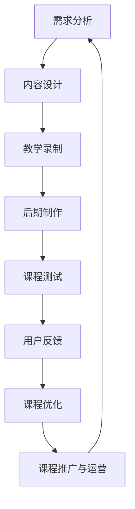

                 

# 《程序员知识付费：打造闭环式课程》

> **关键词：** 知识付费、闭环式课程、课程设计、课程开发、程序员、技术博客

> **摘要：** 本文旨在探讨程序员如何利用知识付费平台，设计和开发闭环式课程。文章首先介绍了知识付费市场背景，然后分析了知识付费平台，并探讨了程序员如何选择合适的平台。接着，文章详细阐述了闭环式课程的设计与开发方法，包括课程内容规划、课程互动与参与度提升策略、课程开发与制作以及课程推广与运营。最后，通过成功案例分析，提供了程序员打造自己的知识付费课程的实战指南。

## 第一部分：知识付费概述

### 第1章：知识付费市场背景

#### 1.1 知识付费的概念与趋势

知识付费是指用户为获取特定领域的专业知识和技能，向知识提供者支付费用的一种商业模式。随着互联网技术的发展和信息的爆炸式增长，用户对个性化、高质量的知识内容需求日益增加，知识付费市场应运而生。

近年来，知识付费市场呈现出以下趋势：

1. **市场规模不断扩大：** 全球知识付费市场规模持续增长，预计到2025年将达到数百亿美元。
2. **用户群体多样化：** 知识付费用户不再局限于专业人士，普通用户也逐渐加入其中。
3. **内容形式多样化：** 从传统的文字、图片到音频、视频等多种形式，知识内容得以更加生动地呈现。
4. **平台化运营：** 知识付费平台如雨后春笋般涌现，为用户和知识提供者提供了便捷的互动渠道。

#### 1.2 知识付费市场的现状分析

当前，知识付费市场主要分为以下几类：

1. **技能培训类：** 包括编程、外语、设计等专业技能培训，此类课程通常以在线视频和文档为主。
2. **知识分享类：** 如知乎Live、喜马拉雅等平台，用户付费购买专家的知识分享。
3. **内容订阅类：** 如得到APP，用户购买会员后可以无限次观看平台上的知识内容。

在知识付费市场上，各大平台竞争激烈，主要玩家包括：

1. **网易云课堂、慕课网：** 以技能培训为主，提供丰富的在线课程。
2. **知乎Live、喜马拉雅：** 强调知识分享，通过音频和直播形式为用户带来高质量内容。
3. **得到APP：** 以内容订阅为主，提供一系列精品课程和专栏。

#### 1.3 程序员在知识付费市场中的角色

程序员在知识付费市场中扮演着重要角色，他们既是知识提供者，也是知识消费者：

1. **知识提供者：** 程序员可以将自己的专业知识、经验和项目实战经验转化为课程内容，通过知识付费平台分享给更多有需要的人。
2. **知识消费者：** 程序员在职业发展中需要不断学习新技术、新工具，知识付费平台为他们提供了丰富的学习资源。

### 第2章：知识付费平台分析

#### 2.1 主流知识付费平台介绍

当前市场上主流的知识付费平台包括以下几类：

1. **技能培训平台：**
   - **网易云课堂**：提供编程、设计、办公软件等技能培训课程。
   - **慕课网**：专注于IT技能培训，包括前端、后端、移动开发等方向。
   - **极客时间**：以知识专栏和音频课程为主，涵盖编程、产品、运营等领域。

2. **知识分享平台：**
   - **知乎Live**：知乎推出的知识分享平台，用户可以通过付费购买专家的直播课程。
   - **喜马拉雅**：提供音频课程，涵盖文学、历史、科技等多个领域。
   - **千聊**：提供直播和音频课程，以教育培训、知识分享为主。

3. **内容订阅平台：**
   - **得到APP**：提供专栏、音频、直播等多种形式的内容，涵盖财经、科技、历史等领域。
   - **在行**：以一对一咨询为主，用户可以通过付费获取专家的个性化建议。
   - **分答**：提供快速问答服务，用户通过付费获取专家的解答。

#### 2.2 平台盈利模式分析

不同知识付费平台的盈利模式有所不同，以下为几种常见的盈利模式：

1. **课程销售：** 平台通过销售课程视频、电子书等知识产品获取收益。
2. **会员订阅：** 用户支付会员费后，可以无限次观看平台上的所有课程。
3. **知识付费直播：** 平台提供直播课程，用户通过付费观看。
4. **内容分成：** 知识提供者根据课程销售情况，从平台获得一定比例的分成收入。
5. **广告推广：** 平台通过广告收入获取盈利，广告形式包括贴片广告、弹窗广告等。

#### 2.3 程序员如何选择合适的平台

程序员在选择知识付费平台时，可以从以下几个方面进行考虑：

1. **课程质量：** 平台上的课程内容是否专业、实用，是否符合自己的学习需求。
2. **课程数量：** 平台提供的课程数量是否丰富，是否涵盖了自己感兴趣的领域。
3. **用户评价：** 平台的用户评价如何，通过用户反馈了解平台的服务质量。
4. **平台口碑：** 平台在行业内的口碑如何，是否具有品牌影响力。
5. **盈利模式：** 平台的盈利模式是否可持续，是否有利于知识提供者获得合理收益。

### 第二部分：闭环式课程设计与开发

#### 第3章：闭环式课程框架

##### 3.1 闭环式课程的概念与特点

闭环式课程是一种基于反馈循环的课程设计模式，旨在通过不断的评估和调整，提高课程质量和学习效果。其核心思想是：

1. **评估：** 对课程内容、教学方法、学习成果等进行评估。
2. **调整：** 根据评估结果对课程进行优化和调整。
3. **反馈：** 将调整后的课程内容和学习成果反馈给用户，形成闭环。

闭环式课程具有以下特点：

1. **动态调整：** 根据用户反馈和学习成果，实时调整课程内容和教学方法。
2. **持续优化：** 通过不断评估和调整，不断提高课程质量和学习效果。
3. **用户参与：** 用户在学习过程中积极参与，提供反馈和建议，对课程改进具有重要作用。

##### 3.2 闭环式课程的构建方法

构建闭环式课程需要遵循以下步骤：

1. **需求分析：** 了解用户的学习需求和目标，明确课程的核心内容和目标。
2. **内容设计：** 根据需求分析，设计课程内容，包括知识点、案例、实践等。
3. **教学评估：** 制定评估标准，对课程内容、教学方法和学习成果进行评估。
4. **调整优化：** 根据评估结果，调整课程内容和教学方法，优化学习体验。
5. **用户反馈：** 收集用户反馈，了解学习效果和课程质量，为下一步调整提供依据。

##### 3.3 闭环式课程的评估与反馈机制

闭环式课程的评估与反馈机制是课程质量保障的关键，具体包括以下几个方面：

1. **评估指标：** 设定课程评估指标，如知识点掌握度、实践能力、用户满意度等。
2. **评估方法：** 采用多种评估方法，如笔试、面试、项目评估等，全面评估学习成果。
3. **反馈渠道：** 提供多种反馈渠道，如在线问卷、面对面交流、邮件等，方便用户表达意见和建议。
4. **反馈处理：** 及时处理用户反馈，针对问题进行整改和优化，确保课程质量持续提升。

### 第4章：课程内容设计

##### 4.1 课程内容规划

课程内容规划是课程设计的关键步骤，需要考虑以下几个方面：

1. **学习目标：** 明确课程的学习目标，为后续内容设计提供指导。
2. **知识点梳理：** 整理课程所需的知识点，确保内容覆盖全面。
3. **内容组织：** 将知识点按照逻辑顺序进行组织，形成完整的学习路径。
4. **实践环节：** 设计实践环节，帮助用户将理论知识应用于实际项目中。

##### 4.2 课程内容组织与呈现

课程内容组织与呈现需要考虑以下几个方面：

1. **结构清晰：** 确保课程内容结构清晰，用户可以轻松理解。
2. **内容多样：** 使用多种形式呈现内容，如文字、图片、视频等，提高学习体验。
3. **交互设计：** 设计互动环节，鼓励用户参与，提高学习积极性。
4. **学习进度：** 设定学习进度，帮助用户合理安排学习时间。

##### 4.3 课程互动与参与度提升策略

提高课程互动与参与度是课程设计的重要目标，以下策略可供参考：

1. **问答环节：** 设置问答环节，鼓励用户提问和回答问题，促进学习交流。
2. **讨论区：** 创建讨论区，让用户在课程结束后继续交流和分享经验。
3. **项目实践：** 设计项目实践任务，让用户将所学知识应用于实际项目中。
4. **竞赛活动：** 组织竞赛活动，激发用户学习兴趣，提高参与度。
5. **积分奖励：** 设定积分奖励机制，鼓励用户积极参与课程互动。

### 第5章：课程开发与制作

##### 5.1 课程开发流程

课程开发流程可以分为以下几个阶段：

1. **需求分析：** 了解用户需求，明确课程目标和学习内容。
2. **内容设计：** 根据需求分析，设计课程内容和学习路径。
3. **教学素材准备：** 准备教学素材，如PPT、视频、文档等。
4. **教学录制：** 进行教学录制，确保教学质量和效果。
5. **后期制作：** 进行剪辑、编辑和美化，提升课程品质。
6. **测试与优化：** 对课程进行测试和优化，确保课程质量。

##### 5.2 教学视频拍摄与剪辑

教学视频拍摄与剪辑需要注意以下几个方面：

1. **拍摄设备：** 选择合适的拍摄设备，确保画面质量。
2. **拍摄环境：** 选择合适的教学环境，确保光线充足、背景简洁。
3. **录制技巧：** 学会正确的录制技巧，如音量控制、画面切换等。
4. **剪辑技巧：** 利用剪辑软件，对视频进行剪辑、添加字幕和特效等。

##### 5.3 教学文档编写与整理

教学文档编写与整理需要注意以下几个方面：

1. **文档结构：** 确保文档结构清晰，便于用户阅读。
2. **内容丰富：** 详细阐述知识点，提供丰富的案例和实践经验。
3. **语言表达：** 使用简洁明了的语言，确保用户易于理解。
4. **格式规范：** 遵循文档编写规范，确保文档格式美观、统一。

### 第6章：课程推广与运营

##### 6.1 课程推广策略

课程推广是课程运营的重要环节，以下策略可供参考：

1. **内容营销：** 通过撰写高质量的技术博客、发布案例和实践经验，吸引潜在用户。
2. **社交媒体推广：** 利用微博、微信公众号、知乎等社交媒体平台，宣传课程亮点和用户评价。
3. **合作推广：** 与其他技术社区、培训机构、企业等合作，共同推广课程。
4. **广告投放：** 在相关平台投放广告，提高课程曝光度。
5. **口碑营销：** 通过用户推荐和好评，形成口碑效应，吸引更多用户。

##### 6.2 用户运营与社区管理

用户运营与社区管理是课程推广的重要保障，以下策略可供参考：

1. **用户画像：** 分析用户需求和行为，制定针对性的运营策略。
2. **用户互动：** 通过问答、讨论区、社群等方式，增强用户互动。
3. **用户成长体系：** 设立用户成长体系，鼓励用户积极参与课程和社区。
4. **内容更新：** 定期更新课程内容和社区动态，保持用户活跃度。
5. **用户反馈：** 及时收集用户反馈，优化课程和社区运营。

##### 6.3 数据分析与课程优化

数据分析是课程优化的重要手段，以下策略可供参考：

1. **用户数据采集：** 收集用户行为数据，如课程访问量、学习时长、问答互动等。
2. **数据可视化：** 利用数据可视化工具，对用户数据进行直观展示。
3. **用户行为分析：** 分析用户行为数据，了解用户需求和学习习惯。
4. **课程优化：** 根据用户行为分析结果，优化课程内容和教学方法。
5. **效果评估：** 对课程优化效果进行评估，确保课程质量持续提升。

### 第7章：成功知识付费案例分析

#### 7.1 案例一：某编程语言在线课程案例分析

**案例背景：**
某编程语言在线课程，以Python为例，面向初学者和进阶者，提供系统化的学习路径。

**成功因素：**
1. **课程内容丰富：** 包括基础知识、高级语法、项目实战等，满足不同层次用户的需求。
2. **互动性强：** 设立问答环节、讨论区，鼓励用户提问和交流，提高参与度。
3. **用户反馈机制：** 收集用户反馈，及时调整课程内容，确保课程质量。

**案例分析：**
该课程通过不断优化和调整，用户满意度持续提升，课程销售量稳步增长，成为平台上的热门课程。

#### 7.2 案例二：某大数据课程案例分析

**案例背景：**
某大数据在线课程，面向希望进入大数据领域的学习者，提供从入门到进阶的系统学习内容。

**成功因素：**
1. **课程内容实用：** 结合实际项目案例，帮助用户将所学知识应用于实际工作中。
2. **师资强大：** 课程由知名大数据专家讲授，具有丰富的行业经验和实战经验。
3. **学习支持：** 提供学习计划和答疑服务，帮助用户解决学习过程中遇到的问题。

**案例分析：**
该课程通过高质量的内容、强大的师资和学习支持，吸引了大量用户，课程口碑和销售量均居行业前列。

#### 7.3 案例三：某人工智能课程案例分析

**案例背景：**
某人工智能在线课程，面向人工智能初学者和从业者，提供从基础知识到实战项目的全面学习内容。

**成功因素：**
1. **课程内容前沿：** 结合最新的研究成果和应用案例，帮助用户了解人工智能的最新发展趋势。
2. **实战性强：** 设计多个实战项目，让用户在实践过程中掌握人工智能的核心技术。
3. **学习资源丰富：** 提供丰富的学习资源，如PPT、代码、参考文献等，方便用户深入学习。

**案例分析：**
该课程凭借前沿的内容、实战项目和丰富的学习资源，吸引了大量人工智能爱好者，课程口碑和销售量持续增长。

### 第8章：程序员实战：打造自己的知识付费课程

#### 8.1 实战一：课程开发实战

**1. 需求分析：**
- 确定课程主题：基于深度学习的图像识别技术
- 确定目标用户：有编程基础的初学者和进阶者

**2. 内容设计：**
- 基础知识：介绍深度学习和神经网络的基本概念
- 技术讲解：讲解卷积神经网络（CNN）的工作原理和应用
- 实践项目：设计一个简单的图像识别项目，帮助用户将理论知识应用于实际

**3. 教学录制：**
- 使用录屏软件录制教学视频
- 优化视频画质和声音效果

**4. 后期制作：**
- 进行视频剪辑、添加字幕和特效
- 制作课程海报和宣传文案

**5. 测试与优化：**
- 在小范围内进行试播，收集用户反馈
- 根据反馈调整课程内容和教学方式

#### 8.2 实战二：课程推广实战

**1. 内容营销：**
- 撰写技术博客，介绍深度学习在图像识别领域的应用
- 发布课程案例，展示用户学习成果

**2. 社交媒体推广：**
- 在微博、微信公众号、知乎等平台发布课程相关内容
- 与技术社区、论坛合作，推广课程

**3. 合作推广：**
- 与其他课程开发者合作，共同推广课程
- 与企业合作，为企业员工提供内部培训

**4. 口碑营销：**
- 邀请学员撰写课程评价
- 鼓励学员在社交媒体上分享学习体验

#### 8.3 实战三：课程运营实战

**1. 用户运营：**
- 建立课程社群，方便用户交流和讨论
- 定期举办线上活动，提高用户活跃度

**2. 数据分析：**
- 收集用户数据，分析用户行为和学习成果
- 根据数据分析结果，优化课程内容和运营策略

**3. 反馈机制：**
- 设立反馈渠道，收集用户意见和建议
- 及时处理用户反馈，优化课程质量和用户体验

### 第9章：工具与资源

#### 9.1 主流知识付费平台推荐

**1. 网易云课堂：**
- 优势：课程丰富，涵盖多个领域
- 推荐课程：编程语言、数据分析、产品设计

**2. 慕课网：**
- 优势：专业性强，课程质量高
- 推荐课程：前端开发、后端开发、人工智能

**3. 得到APP：**
- 优势：内容多样化，涵盖财经、科技、历史等领域
- 推荐课程：知识讲座、音频课程、直播课程

#### 9.2 知识付费工具推荐

**1. PowerPoint：**
- 优势：方便制作幻灯片，适合教学视频录制
- 使用场景：课程内容讲解、案例分析

**2. Adobe Premiere Pro：**
- 优势：专业视频剪辑软件，支持多种视频格式
- 使用场景：视频剪辑、添加特效和字幕

**3. Git：**
- 优势：版本控制工具，方便代码管理和协作
- 使用场景：项目开发、代码托管

#### 9.3 程序员实用资源汇总

**1. GitHub：**
- 优势：代码托管和协作平台，丰富的开源项目
- 使用场景：项目开发、代码分享

**2. Stack Overflow：**
- 优势：技术问答社区，解决编程问题
- 使用场景：技术支持、学习交流

**3. Kaggle：**
- 优势：数据分析竞赛平台，提供大量数据集
- 使用场景：数据分析、机器学习项目

### 第10章：知识付费相关法律法规与注意事项

#### 10.1 知识产权保护

知识付费过程中，知识产权保护至关重要，以下为几点建议：

**1. 课程内容原创性：**
- 确保课程内容的原创性，避免侵权行为。
- 引用他人作品时，注明出处并遵守相关法规。

**2. 版权声明：**
- 在课程简介和页面底部明确声明课程内容的版权信息。
- 告知用户未经授权，禁止复制、传播课程内容。

**3. 合作授权：**
- 与其他知识提供者合作时，明确双方的权利和义务，确保合作内容的合法合规。

#### 10.2 资质认证与标准

**1. 课程质量认证：**
- 获取相关课程质量认证，如ISO 29990、CEET等，提高课程公信力。
- 严格按照认证标准进行课程开发和运营。

**2. 教师资质认证：**
- 对知识提供者进行资质认证，确保教师具备相关领域的专业知识和教学能力。
- 建立教师档案，记录教师资质和教学经验。

#### 10.3 程序员权益保护

**1. 知识产权保护：**
- 程序员在创作课程内容时，应确保自身知识产权得到保护。
- 与平台合作时，明确约定知识产权归属和使用权。

**2. 费用结算：**
- 平台应按约定及时支付课程收益，确保程序员权益。
- 设立费用结算公示机制，透明化费用结算流程。

**3. 用户评价与反馈：**
- 平台应建立完善的用户评价和反馈机制，保护程序员的合法权益。
- 对恶意评价和不当反馈进行及时处理，维护课程质量和程序员声誉。

### 附录

#### 附录A：知识付费相关资源链接

- **知识付费平台：**
  - 网易云课堂：[http://study.163.com/](http://study.163.com/)
  - 慕课网：[http://www.imooc.com/](http://www.imooc.com/)
  - 得到APP：[https://www.getue.cn/](https://www.getue.cn/)

- **编程学习资源：**
  - GitHub：[https://github.com/](https://github.com/)
  - Stack Overflow：[https://stackoverflow.com/](https://stackoverflow.com/)
  - Kaggle：[https://www.kaggle.com/](https://www.kaggle.com/)

#### 附录B：编程学习资料汇总

- **编程语言学习资料：**
  - Python：[https://docs.python.org/3/tutorial/index.html](https://docs.python.org/3/tutorial/index.html)
  - Java：[https://docs.oracle.com/javase/tutorial/](https://docs.oracle.com/javase/tutorial/)
  - C++：[https://www.cplusplus.com/doc/tutorial/](https://www.cplusplus.com/doc/tutorial/)

- **编程工具和框架：**
  - Visual Studio Code：[https://code.visualstudio.com/](https://code.visualstudio.com/)
  - Git：[https://git-scm.com/docs](https://git-scm.com/docs)

#### 附录C：程序员知识付费常见问题解答

**Q：如何选择合适的知识付费平台？**

A：选择合适的知识付费平台，可以从以下几个方面进行考虑：

1. **课程质量：** 查看平台上的课程评价和用户反馈，选择课程质量较高的平台。
2. **课程种类：** 根据自己的学习需求，选择提供相关课程的平台。
3. **平台口碑：** 了解平台在行业内的口碑和影响力，选择知名度较高的平台。
4. **价格优惠：** 比较不同平台的课程价格和优惠活动，选择性价比高的平台。

**Q：如何保护自己的知识产权？**

A：为了保护自己的知识产权，可以采取以下措施：

1. **版权声明：** 在课程简介和页面底部明确声明课程内容的版权信息。
2. **签订合同：** 与平台合作时，签订知识产权保护合同，明确双方的权利和义务。
3. **备案登记：** 将课程内容进行版权备案登记，提高知识产权保护力度。

**Q：如何打造自己的知识付费课程？**

A：打造自己的知识付费课程，可以按照以下步骤进行：

1. **确定主题：** 确定课程的主题和目标用户，明确课程内容和学习目标。
2. **内容设计：** 根据主题和学习目标，设计课程内容和学习路径。
3. **教学录制：** 使用录屏软件录制教学视频，确保教学质量和效果。
4. **后期制作：** 进行视频剪辑、添加字幕和特效，提升课程品质。
5. **推广运营：** 通过内容营销、社交媒体推广、合作推广等方式，提高课程知名度。

### Mermaid 流程图：闭环式课程设计流程



### 核心算法原理讲解：课程内容规划算法

```python
# 伪代码：课程内容规划算法
Algorithm CourseContentPlanning(courseRequirements, availableResources)
    Input: courseRequirements (课程需求), availableResources (可用资源)
    Output: coursePlan (课程规划)

    coursePlan = InitializeEmptyCoursePlan()
    
    // 第1步：课程需求分析
    for each requirement in courseRequirements
        AddRequirementToPlan(coursePlan, requirement)

    // 第2步：资源评估
    for each resource in availableResources
        if resource.isSuitableForCourse(coursePlan)
            AddResourceToCoursePlan(coursePlan, resource)

    // 第3步：课程内容排序
    SortCoursePlanByImportance(coursePlan)

    return coursePlan
```

### 数学模型和数学公式讲解：课程评估模型

$$
\text{Course Evaluation Score} = \frac{\sum_{i=1}^{n} \text{User Feedback} \times \text{Weight}}{n}
$$

**举例说明：**

假设有10个用户对课程进行了评价，每个评价的权重为0.1，计算课程的评估分数。

$$
\text{Course Evaluation Score} = \frac{(4 \times 0.1) + (3 \times 0.1) + (5 \times 0.1) + (2 \times 0.1)}{10} = \frac{1.6 + 0.6 + 0.5 + 0.2}{10} = \frac{2.9}{10} = 0.29
$$

因此，课程的评估分数为0.29。

### 项目实战：课程开发实战

#### 1. 开发环境搭建

- **系统环境：** Ubuntu 20.04
- **开发工具：** Visual Studio Code
- **版本控制：** Git

#### 2. 源代码详细实现

```python
# Python 代码示例：课程内容管理系统

class CourseContent:
    def __init__(self, title, description):
        self.title = title
        self.description = description

    def display_content(self):
        print(f"Title: {self.title}")
        print(f"Description: {self.description}")

class Course:
    def __init__(self, title, content_list):
        self.title = title
        self.content_list = content_list

    def add_content(self, content):
        self.content_list.append(content)

    def display_course(self):
        print(f"Title: {self.title}")
        for content in self.content_list:
            content.display_content()

# 实例化课程对象，添加课程内容，并显示课程内容
course = Course("Python编程基础", [])
content1 = CourseContent("Python基础语法", "介绍Python的基础语法和概念。")
content2 = CourseContent("数据类型和运算符", "详细介绍Python的数据类型和运算符。")
course.add_content(content1)
course.add_content(content2)
course.display_course()

# 输出：
# Title: Python编程基础
# Title: Python基础语法
# Description: 介绍Python的基础语法和概念。
# Title: 数据类型和运算符
# Description: 详细介绍Python的数据类型和运算符。

#### 3. 代码解读与分析

- `CourseContent` 类用于表示课程内容，包含标题和描述。
- `Course` 类用于表示整个课程，包含课程标题和内容列表，并提供添加内容和显示课程内容的方法。

```python
# 代码解读
# 初始化课程对象，并添加内容
course = Course("Python编程基础", [])
content1 = CourseContent("Python基础语法", "介绍Python的基础语法和概念。")
content2 = CourseContent("数据类型和运算符", "详细介绍Python的数据类型和运算符。")
course.add_content(content1)
course.add_content(content2)

# 显示课程内容
course.display_course()

# 输出：
# Title: Python编程基础
# Title: Python基础语法
# Description: 介绍Python的基础语法和概念。
# Title: 数据类型和运算符
# Description: 详细介绍Python的数据类型和运算符。

# 通过实例化 `Course` 和 `CourseContent` 对象，可以创建一个包含多个课程内容的课程，并显示所有课程内容。
```

#### 4. 实际案例与应用

- 利用该课程内容管理系统，可以轻松地添加、管理和展示课程内容，为知识付费课程开发提供一个基础框架。在实际应用中，可以扩展该系统，添加用户管理、课程评估、课程互动等功能。

```python
# 扩展应用：添加用户管理功能

class User:
    def __init__(self, username, email):
        self.username = username
        self.email = email

# 实例化用户对象，并添加到课程内容管理系统
user1 = User("Alice", "alice@example.com")
user2 = User("Bob", "bob@example.com")

# 添加用户到课程
course.add_user(user1)
course.add_user(user2)

# 显示用户信息
course.display_users()

# 输出：
# User: Alice
# Email: alice@example.com
# User: Bob
# Email: bob@example.com

# 通过扩展用户管理功能，可以实现对课程参与用户的管理，进一步丰富知识付费课程的应用场景。
```

### 总结

本文系统地介绍了程序员如何利用知识付费平台，设计和开发闭环式课程。通过分析知识付费市场背景、主流知识付费平台、闭环式课程设计与开发流程，以及成功案例分析，为程序员提供了实战指南。文章还介绍了工具与资源、法律法规与注意事项，以及附录和流程图，帮助程序员更好地打造自己的知识付费课程。

在知识付费时代，程序员不仅可以通过课程分享自己的专业知识，还可以通过课程推广与运营，实现自我价值的提升。希望本文能为广大程序员在知识付费领域的发展提供有益的参考和启示。

### 作者信息

**作者：** AI天才研究院/AI Genius Institute & 禅与计算机程序设计艺术 /Zen And The Art of Computer Programming

AI天才研究院是一支专注于人工智能、编程技术领域的专业团队，致力于通过知识付费平台，为广大程序员提供高质量的技术教程和实践指南。作者以其深厚的专业知识和独特的教学风格，深受读者喜爱。本文为作者在知识付费领域的实战心得和经验总结，希望能为您的编程学习之路带来启示和帮助。

