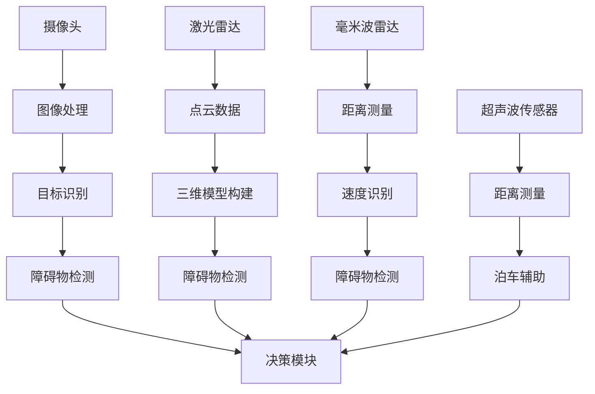
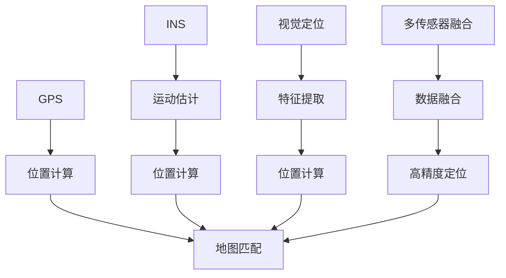
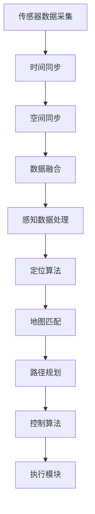
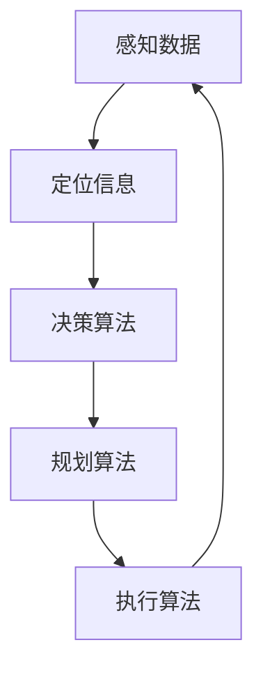
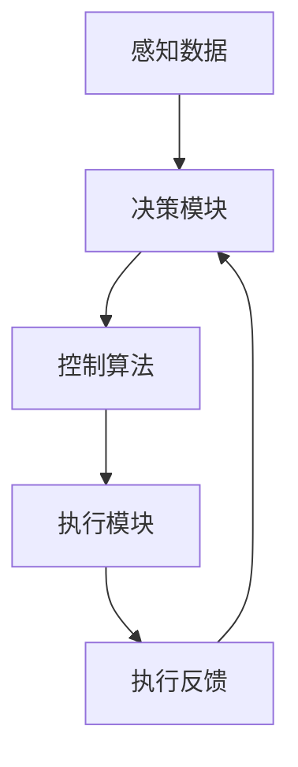
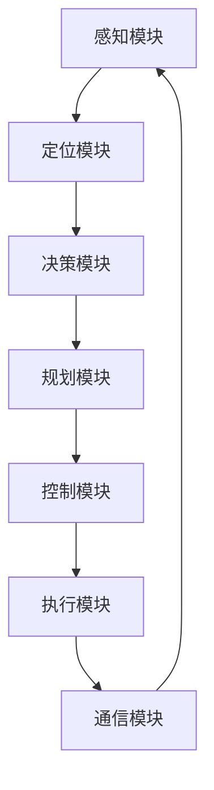

                 

# 端到端自动驾驶的自主环卫作业服务

> **关键词**：自动驾驶、环卫作业、端到端、感知、定位、决策、规划、控制、执行、服务系统、项目实施、效益评估、未来展望

> **摘要**：本文旨在探讨端到端自动驾驶技术在自主环卫作业服务中的应用。通过分析自动驾驶技术基础、环卫作业需求、环卫作业流程与规范、核心技术与原理，以及环卫作业服务应用与实践，本文总结了自动驾驶环卫作业服务系统的设计、实施及效益评估，并对未来发展趋势进行了展望。

## 第一部分：自动驾驶与环卫作业概述

### 第1章：自动驾驶技术基础

**1.1 自动驾驶技术概述**

自动驾驶技术是人工智能和机器人技术相结合的产物，旨在通过计算机系统和传感器设备实现对车辆的自主控制。自动驾驶技术根据车辆的自动化程度，可以分为五个等级：L0（无自动化）、L1（驾驶辅助）、L2（部分自动化）、L3（有条件自动化）、L4（高度自动化）和L5（完全自动化）。

**1.2 自动驾驶技术发展历程**

自动驾驶技术起源于20世纪60年代的“自动驾驶汽车”概念。经过几十年的发展，自动驾驶技术已经取得了显著的进展。1995年，卡内基梅隆大学开发出了世界上第一辆无人驾驶汽车。2004年，谷歌开始研发自动驾驶汽车，并在随后的几年中取得了大量成功。

**1.3 自动驾驶技术架构**

自动驾驶技术架构通常包括感知、定位、决策、规划和控制五个主要模块。感知模块负责获取周围环境的信息，包括障碍物、道路标志、交通信号等。定位模块则通过传感器数据确定车辆在环境中的位置。决策模块根据感知和定位信息，生成驾驶策略。规划模块负责生成驾驶路径，控制模块则将驾驶策略转换为实际的操作指令，控制车辆执行驾驶任务。

### 第2章：环卫作业需求分析

**2.1 环卫作业现状与挑战**

环卫作业是指对城市环境卫生进行维护和管理的作业，包括垃圾清理、道路清扫、绿化养护等。随着城市化进程的加快，环卫作业面临许多挑战，如作业效率低、人力资源紧张、作业成本高等。

**2.2 环卫作业机器人需求分析**

为了解决环卫作业中的问题，环卫作业机器人应运而生。环卫作业机器人需求分析主要包括以下几个方面：提高作业效率、降低作业成本、减轻人力负担、提高作业安全性等。

**2.3 自动驾驶在环卫作业中的应用前景**

自动驾驶技术在环卫作业中的应用前景广阔。通过自动驾驶技术，环卫作业机器人可以实现自主导航、自主避障、自主决策等功能，从而提高作业效率，降低作业成本，减轻人力负担，提高作业安全性。

### 第3章：环卫作业流程与规范

**3.1 环卫作业流程概述**

环卫作业流程包括垃圾清理、道路清扫、绿化养护等环节。每个环节都有其特定的作业流程和规范。

**3.2 环卫作业规范与标准**

环卫作业规范与标准主要包括作业时间、作业质量、作业安全等方面的要求。这些规范和标准旨在确保环卫作业的顺利进行。

**3.3 环卫作业机器人操作指南**

环卫作业机器人操作指南主要包括机器人的启动、运行、维护等方面的内容。这些指南旨在确保环卫作业机器人的正常运行。

## 第二部分：自动驾驶核心技术与原理

### 第4章：感知与定位技术

**4.1 感知技术原理**

感知技术是自动驾驶技术的核心组成部分，负责获取车辆周围环境的信息。感知技术主要包括摄像头、激光雷达、毫米波雷达、超声波传感器等。

**4.2 定位技术原理**

定位技术是自动驾驶技术的关键，用于确定车辆在环境中的位置。定位技术主要包括GPS、惯性导航、视觉定位、多传感器融合等。

**4.3 感知与定位系统集成**

感知与定位系统集成是将感知和定位技术融合在一起，实现车辆对周围环境的感知和定位。

### 第5章：决策与规划算法

**5.1 决策算法原理**

决策算法是自动驾驶技术的核心，负责根据感知和定位信息生成驾驶策略。决策算法主要包括基于规则的方法、基于模型的方法、基于数据的方法等。

**5.2 规划算法原理**

规划算法是自动驾驶技术的核心，负责生成车辆的驾驶路径。规划算法主要包括路径规划、轨迹规划等。

**5.3 决策与规划算法案例分析**

在本节中，我们将通过具体案例来分析决策与规划算法的应用。

### 第6章：控制与执行技术

**6.1 控制技术原理**

控制技术是自动驾驶技术的关键，负责将驾驶策略转换为实际的操作指令。控制技术主要包括PID控制、模糊控制、神经网络控制等。

**6.2 执行技术原理**

执行技术是自动驾驶技术的实现环节，负责控制车辆的实际操作。执行技术主要包括电机控制、液压控制、气动控制等。

**6.3 控制与执行系统集成**

控制与执行系统集成是将控制技术和执行技术融合在一起，实现车辆对驾驶策略的执行。

## 第三部分：环卫作业服务应用与实践

### 第7章：自主环卫作业服务系统设计

**7.1 服务系统架构设计**

服务系统架构设计是自主环卫作业服务系统的核心，主要包括感知、定位、决策、规划、控制、执行等模块的设计。

**7.2 服务系统功能模块划分**

服务系统功能模块划分是自主环卫作业服务系统的关键，主要包括感知模块、定位模块、决策模块、规划模块、控制模块、执行模块等。

**7.3 服务系统性能优化**

服务系统性能优化是自主环卫作业服务系统的关键，主要包括算法优化、硬件优化、软件优化等。

### 第8章：自主环卫作业服务项目实施

**8.1 项目实施流程**

项目实施流程是自主环卫作业服务项目的关键，主要包括项目启动、项目规划、项目执行、项目验收等环节。

**8.2 项目实施要点与风险**

项目实施要点与风险是自主环卫作业服务项目实施的关键，主要包括技术风险、管理风险、市场风险等。

**8.3 项目实施案例分析**

在本节中，我们将通过具体案例来分析自主环卫作业服务项目的实施。

### 第9章：环卫作业服务效益评估

**9.1 服务效益评估方法**

服务效益评估方法是环卫作业服务效益评估的关键，主要包括成本效益分析、效益指标分析等。

**9.2 服务效益评估指标**

服务效益评估指标是环卫作业服务效益评估的核心，主要包括作业效率、作业成本、人力资源等。

**9.3 服务效益评估案例**

在本节中，我们将通过具体案例来分析环卫作业服务效益评估。

### 第10章：未来发展趋势与展望

**10.1 自动驾驶环卫作业技术发展趋势**

自动驾驶环卫作业技术发展趋势是环卫作业服务领域的重点，主要包括人工智能、大数据、物联网等。

**10.2 环卫作业服务市场前景**

环卫作业服务市场前景是环卫作业服务领域的重点，主要包括市场需求、市场规模、市场潜力等。

**10.3 自动驾驶环卫作业的未来展望**

自动驾驶环卫作业的未来展望是环卫作业服务领域的关键，主要包括技术发展、市场推广、社会影响等。

## 附录

### 附录 A：常用工具与技术选型

**A.1 自动驾驶工具选型**

**A.2 环卫作业机器人技术选型**

**A.3 开发环境搭建指南**

### 附录 B：参考文献

**B.1 自动驾驶相关书籍推荐**

**B.2 环卫作业相关书籍推荐**

**B.3 学术论文与研究报告推荐**

---

**作者：AI天才研究院/AI Genius Institute & 禅与计算机程序设计艺术 /Zen And The Art of Computer Programming**## 第1章：自动驾驶技术基础

### 1.1 自动驾驶技术概述

自动驾驶技术是指通过计算机系统、传感器设备和人工智能算法，实现对车辆的自主控制。自动驾驶技术可以根据车辆的自动化程度，分为不同的等级。以下是各级别自动驾驶技术的定义：

- **L0级自动驾驶**：无自动化，完全由人类驾驶员控制。
- **L1级自动驾驶**：驾驶辅助，具有部分自动化功能，如自适应巡航控制和车道保持。
- **L2级自动驾驶**：部分自动化，具有两个或多个自动化功能，如自适应巡航控制和自动泊车。
- **L3级自动驾驶**：有条件自动化，能够在特定场景下完全接管车辆控制。
- **L4级自动驾驶**：高度自动化，能够在特定环境下完全自主驾驶。
- **L5级自动驾驶**：完全自动化，无需人类干预，能够在各种环境下自主驾驶。

### 1.2 自动驾驶技术发展历程

自动驾驶技术的发展历程可以追溯到20世纪60年代，当时人们开始提出“自动驾驶汽车”的概念。以下是一些重要的里程碑：

- **1960年**：美国科学家John McCarthy首次提出了“自动驾驶汽车”的概念。
- **1986年**：德国慕尼黑大学开发了世界上第一辆基于计算机控制的自动驾驶汽车。
- **1995年**：卡内基梅隆大学开发出了世界上第一辆无人驾驶汽车，名为“Navlab”。
- **2004年**：谷歌开始研发自动驾驶汽车，并在随后的几年中取得了大量成功。
- **2014年**：特斯拉推出了配备自动驾驶功能的Model S电动汽车。
- **2017年**：特斯拉自动驾驶系统在美国发生的致死事故引发了对自动驾驶技术的广泛关注。
- **2018年**：百度的Apollo自动驾驶平台发布了开放源代码，推动自动驾驶技术的发展。

### 1.3 自动驾驶技术架构

自动驾驶技术架构通常包括感知、定位、决策、规划和控制五个主要模块。以下是这些模块的简要介绍：

1. **感知模块**：感知模块负责获取车辆周围环境的信息。主要技术包括摄像头、激光雷达、毫米波雷达、超声波传感器等。感知模块的任务是从传感器数据中提取有用的信息，如障碍物、道路标志、交通信号等。

2. **定位模块**：定位模块负责确定车辆在环境中的位置。主要技术包括GPS、惯性导航、视觉定位、多传感器融合等。定位模块的精度和稳定性对于自动驾驶系统的性能至关重要。

3. **决策模块**：决策模块根据感知和定位信息，生成驾驶策略。决策模块的主要任务包括目标跟踪、障碍物识别、驾驶策略生成等。常见的决策算法有基于规则的方法、基于模型的方法、基于数据的方法等。

4. **规划模块**：规划模块负责生成车辆的驾驶路径。规划模块通常采用路径规划和轨迹规划两种方法。路径规划主要解决从起点到终点的最短路径问题，轨迹规划则侧重于车辆在行驶过程中的轨迹优化。

5. **控制模块**：控制模块将驾驶策略转换为实际的操作指令，控制车辆执行驾驶任务。控制模块的主要任务包括控制律设计、控制器实现、控制器调试等。常见的控制方法有PID控制、模糊控制、神经网络控制等。

### 1.4 自动驾驶技术的挑战与未来趋势

尽管自动驾驶技术取得了显著的进展，但仍然面临着许多挑战。以下是一些主要的挑战和未来趋势：

1. **感知与定位技术**：提高感知和定位技术的精度和稳定性是自动驾驶技术的关键挑战。未来的发展趋势包括多传感器融合、高精度地图、实时定位等。

2. **决策与规划算法**：设计高效、可靠的决策和规划算法是自动驾驶技术的核心问题。未来的发展趋势包括深度学习、强化学习、多智能体系统等。

3. **控制与执行技术**：提高控制与执行技术的精度和鲁棒性是自动驾驶技术的关键。未来的发展趋势包括电机控制、液压控制、气动控制等。

4. **法律法规与安全标准**：制定合理的法律法规和安全标准是自动驾驶技术普及的必要条件。未来的发展趋势包括安全认证、隐私保护、伦理规范等。

5. **市场与应用场景**：自动驾驶技术的应用场景越来越广泛，包括自动驾驶汽车、自动驾驶公交车、自动驾驶环卫车等。未来的发展趋势包括城市交通、物流运输、智能交通等。

总之，自动驾驶技术作为人工智能和机器人技术的重要应用领域，具有广阔的发展前景。通过不断克服技术挑战和推动产业变革，自动驾驶技术将为人们的出行和生活带来革命性的改变。

### 1.5 自动驾驶技术的核心组成部分

自动驾驶技术由多个核心组成部分构成，这些组成部分协同工作，使得自动驾驶系统能够实现安全、高效、稳定的驾驶。以下是这些核心组成部分的详细描述：

1. **传感器系统**：传感器系统是自动驾驶技术的感知基础，负责收集车辆周围环境的信息。常见的传感器包括摄像头、激光雷达（LiDAR）、毫米波雷达、超声波传感器、GPS和惯性测量单元（IMU）等。每种传感器都有其独特的优势和局限性，因此在实际应用中，通常需要综合多种传感器数据，以获得更全面、准确的感知信息。

2. **数据融合与处理**：数据融合与处理模块负责将来自不同传感器的数据集成起来，去除噪声和冗余信息，提取有用的环境特征。数据融合的方法包括多传感器数据融合、卡尔曼滤波、贝叶斯滤波等。通过数据融合，自动驾驶系统能够构建一个高度准确和可靠的环境模型，从而为后续的决策提供坚实的基础。

3. **定位与地图构建**：定位与地图构建模块负责确定车辆在环境中的位置，并构建高精度的地图。常用的定位方法包括GPS、视觉定位、惯性导航和无线电信号定位等。高精度地图包含了道路信息、交通标志、道路标志、建筑物轮廓等，对于自动驾驶系统的路径规划和决策具有重要意义。

4. **决策与规划模块**：决策与规划模块负责根据感知和定位信息，生成驾驶策略和路径规划。决策算法包括基于规则的决策、基于模型的决策和基于数据驱动的决策等。规划算法包括路径规划、轨迹规划和行为规划等。决策与规划模块需要处理复杂的环境动态变化，确保驾驶策略的安全性和可行性。

5. **控制与执行模块**：控制与执行模块负责将决策与规划模块生成的驾驶策略转换为实际的操作指令，控制车辆的运动。控制模块通常采用PID控制、模糊控制、模型预测控制（MPC）等控制方法。执行模块则负责执行控制指令，包括电机控制、刹车控制、转向控制等。控制与执行模块的精度和响应速度直接影响到自动驾驶系统的性能和安全性。

6. **通信与网络模块**：通信与网络模块负责实现车辆与外部设备、车辆与车辆、车辆与云平台的通信。V2X（Vehicle-to-Everything）通信技术，包括车联网（V2V）、车对基础设施通信（V2I）和车对行人通信（V2P），是自动驾驶技术的重要组成部分。通过通信与网络模块，自动驾驶系统能够获取实时交通信息、道路状况和障碍物信息，从而优化驾驶策略。

7. **软件架构与硬件平台**：软件架构与硬件平台是自动驾驶技术的支撑。软件架构通常采用模块化设计，包括感知、定位、决策、规划、控制和通信等模块。硬件平台则包括计算平台、传感器平台、通信平台和执行器平台等。硬件平台的选择和优化对于自动驾驶系统的性能和功耗至关重要。

通过这些核心组成部分的协同工作，自动驾驶技术能够实现复杂的环境感知、智能决策和高效执行，从而为人们提供安全、便捷、高效的出行方式。

### 1.6 自动驾驶技术在不同领域的应用

自动驾驶技术不仅改变了人们的出行方式，还在多个领域展示了其巨大的潜力。以下是一些主要的应用领域和自动驾驶技术的实际案例：

1. **自动驾驶汽车**：自动驾驶汽车是自动驾驶技术最典型的应用场景之一。自动驾驶汽车可以通过感知、定位和决策系统，实现自主导航、自主避障和自主停车等功能。特斯拉的Autopilot系统和Waymo的自动驾驶出租车就是其中的代表。特斯拉的Autopilot系统已经为车主提供了自适应巡航控制、自动车道保持和自动泊车等功能，而Waymo则推出了完全自动化的无人驾驶出租车服务，这些服务已经在多个城市进行了测试和部署。

2. **自动驾驶公交车**：自动驾驶公交车旨在提高公共交通的效率、减少拥堵和降低运营成本。自动驾驶公交车可以通过高效的路线规划和实时交通信息处理，实现精确的停靠和高效的乘客运输。百度Apollo和新加坡SMRT合作推出的自动驾驶公交车已经在北京和新加坡进行测试，这些公交车可以在特定路段上实现自动驾驶，为乘客提供安全、便捷的出行服务。

3. **自动驾驶环卫车**：自动驾驶环卫车是自动驾驶技术在环卫领域的应用，主要用于垃圾清理、道路清扫和绿化养护等任务。自动驾驶环卫车可以通过自主导航和精确的执行系统，实现高效、安全和环保的环卫作业。深圳和重庆等城市已经部署了自动驾驶环卫车，这些车辆在特定区域执行清扫任务，显著提高了环卫作业的效率。

4. **自动驾驶物流车**：自动驾驶物流车用于自动驾驶运输，可以在物流运输过程中减少人力成本和提高运输效率。亚马逊的自动驾驶送货车和Nuro的无人配送车就是其中的代表。亚马逊的自动驾驶送货车已经在部分地区进行测试，能够自动导航到指定地点并完成配送任务。Nuro的无人配送车则专注于最后一公里的配送服务，已经在多个城市进行了测试和部署。

5. **自动驾驶农业机械**：自动驾驶农业机械用于自动化种植、施肥、收割等农业作业，可以提高农业生产效率并减少人力成本。约翰迪尔和卡特彼勒等农业设备制造商已经推出了多种自动驾驶农业机械，这些机械可以通过GPS导航和智能控制系统，实现精准的农田作业。

6. **自动驾驶矿山车**：自动驾驶矿山车用于矿山运输和开采作业，可以提高矿山作业的安全性和效率。卡特彼勒和博格曼等公司已经推出了多种自动驾驶矿山车，这些车辆可以在矿山环境下实现自主导航和自动装载。

总之，自动驾驶技术在不同领域的广泛应用，不仅提升了相关行业的工作效率，还推动了产业升级和变革。随着技术的不断进步，自动驾驶技术在未来的应用将更加广泛，为人类生活带来更多便利和可能。

### 1.7 自动驾驶技术的市场前景与挑战

自动驾驶技术作为人工智能和机器人技术的前沿领域，具有广阔的市场前景和巨大的发展潜力。以下是对自动驾驶技术市场前景的分析以及面临的挑战：

#### 市场前景

1. **经济增长点**：自动驾驶技术被视为未来经济增长的新引擎。随着技术的成熟和商业应用的拓展，自动驾驶产业有望成为新的经济支柱，带动相关产业链的发展。

2. **提高交通效率**：自动驾驶技术能够减少交通拥堵，提高交通流量，从而提升整体交通效率。自动驾驶车辆通过智能调度和协同控制，可以优化交通流，减少交通事故，提高道路使用效率。

3. **降低运营成本**：自动驾驶技术能够减少对司机的依赖，降低人力成本。自动驾驶出租车和物流车等应用场景，通过自动化操作和高效管理，可以实现成本优化。

4. **改善生活质量**：自动驾驶技术为人们的出行提供了更安全、更便捷的解决方案。自动驾驶汽车和公共交通工具的普及，可以减少交通事故，降低环境污染，提升居民的生活质量。

5. **推动产业变革**：自动驾驶技术的应用将深刻改变汽车制造、交通管理、物流运输等传统产业，促进产业升级和转型。

#### 挑战

1. **技术挑战**：自动驾驶技术面临技术难题，如传感器精度、算法可靠性、通信稳定性和系统复杂性等。特别是如何在复杂多变的实际环境中实现稳定、安全的驾驶，仍然是一个巨大的挑战。

2. **法律法规与标准**：自动驾驶技术的推广需要完善的法律法规和标准体系。目前，各国在自动驾驶法律法规和标准方面的进展不一，亟待建立统一、透明的法规框架，以确保自动驾驶技术的合规性和安全性。

3. **数据隐私与安全**：自动驾驶车辆依赖于大量数据收集和分析，数据隐私和安全成为重要问题。如何保护用户数据安全，防止数据泄露和滥用，是自动驾驶技术面临的重大挑战。

4. **社会接受度**：自动驾驶技术在社会中的接受度是一个关键因素。公众对于自动驾驶技术的信任程度、对无人驾驶车辆的接受程度，将直接影响自动驾驶技术的推广和应用。

5. **基础设施建设**：自动驾驶技术的推广需要相应的道路、通信和其他基础设施的支持。例如，高精度地图的构建、智能交通信号系统的部署等，都是自动驾驶技术推广的重要前提。

总之，自动驾驶技术具有广阔的市场前景，但同时也面临着一系列的挑战。通过技术创新、政策支持、行业合作和公众教育，自动驾驶技术有望克服这些挑战，实现更广泛的应用和更深远的社会影响。

### 1.8 自动驾驶技术的未来发展趋势

自动驾驶技术正以前所未有的速度发展，未来几年内预计将出现一系列重要趋势，这些趋势将推动自动驾驶技术的不断成熟和广泛应用。以下是自动驾驶技术的未来发展趋势：

1. **技术融合与集成**：随着人工智能、大数据、物联网和5G等技术的不断进步，自动驾驶技术将实现更高程度的融合与集成。多传感器数据融合、高精度地图与实时定位、车联网（V2X）通信等技术的融合，将提升自动驾驶系统的感知、决策和控制能力，实现更安全、更智能的驾驶体验。

2. **规模化商业化应用**：自动驾驶技术将从试点项目逐步走向规模化商业化应用。自动驾驶汽车、公交车、物流车等将在更多城市和区域投入运营，推动自动驾驶技术在公共交通、物流运输、环卫等领域的普及和应用。

3. **自主决策与学习**：自动驾驶系统的决策能力将不断提升，通过深度学习和强化学习等人工智能技术，实现更加智能化和自适应的驾驶策略。自动驾驶车辆将能够通过持续学习和数据积累，不断优化驾驶行为，提高驾驶安全性。

4. **安全与合规**：随着自动驾驶技术的应用普及，安全性和合规性将成为核心关注点。自动驾驶系统将采用更多冗余设计和安全验证措施，确保系统的可靠性和安全性。同时，各国政府和行业组织将不断完善自动驾驶法律法规和标准，为自动驾驶技术的合规应用提供保障。

5. **城市交通优化**：自动驾驶技术将在城市交通管理中发挥重要作用，通过智能调度、流量控制和交通信号优化，实现城市交通的高效管理。自动驾驶车辆与智能交通系统的协同，将有效缓解交通拥堵，提高交通运行效率。

6. **环境友好**：自动驾驶技术将推动交通运输的绿色化发展。自动驾驶车辆通过优化行驶路线和减少人为操作错误，可以降低油耗和排放，减少对环境的影响。此外，自动驾驶车辆的普及将促进电动汽车的发展，进一步减少对化石燃料的依赖。

7. **人机协作**：在未来，自动驾驶技术将更加注重人机协作。在特定场景下，人类驾驶员与自动驾驶系统将共同决策和操作，实现驾驶体验的优化。人机协作将通过智能交互界面、应急响应系统和人机共控机制等实现，确保驾驶过程的安全和舒适。

总之，自动驾驶技术在未来将不断融合创新，实现从技术突破到规模化应用的跨越，为人类社会带来更加安全、便捷、高效的出行方式。

### 1.9 自动驾驶技术的关键挑战与解决方案

尽管自动驾驶技术取得了显著的进展，但在实现全面商业化应用之前，仍然面临一系列关键挑战。以下是这些挑战及可能的解决方案：

1. **感知与定位精度**：感知和定位是自动驾驶技术的核心组成部分，但目前的感知技术和定位技术仍然存在精度不足和稳定性不高的问题。例如，在恶劣天气条件、复杂道路环境或密集城市区域，传感器数据可能受到干扰或噪声影响，导致感知和定位精度下降。

   **解决方案**：提高传感器精度和算法性能是解决这一问题的根本途径。通过研发更高性能的激光雷达、摄像头和毫米波雷达，并结合多传感器数据融合技术，可以提升整体感知精度。同时，开发更鲁棒的定位算法，如基于视觉定位和惯性导航的融合算法，可以提高定位系统的稳定性和可靠性。

2. **环境动态适应性**：自动驾驶系统需要在动态环境中稳定运行，但现实环境复杂多变，包括行人、非机动车、动物等动态障碍物，以及交通信号变化、道路施工等突发情况。系统在应对这些动态环境变化时，可能无法及时做出反应，导致安全风险。

   **解决方案**：增强系统的动态适应性是关键。通过引入实时地图更新和交通信息流，自动驾驶系统能够及时获取环境变化信息。结合先进的决策和规划算法，如基于强化学习的动态规划算法，可以提高系统对动态环境的适应能力。此外，开发应急响应系统，如自动刹车和避让机制，可以在突发情况下迅速做出反应。

3. **数据隐私和安全**：自动驾驶车辆需要收集和处理大量数据，包括车辆状态、行驶轨迹、环境信息等。这些数据涉及个人隐私和车辆安全，如何保护数据隐私和安全是自动驾驶技术面临的重要挑战。

   **解决方案**：建立严格的数据隐私和安全保护机制是必要的。通过数据加密、访问控制和安全审计等技术手段，确保数据在传输和存储过程中的安全性。同时，制定明确的数据隐私政策和法律法规，保障用户数据权益。此外，建立安全监控系统，对自动驾驶系统的安全运行进行实时监控和预警。

4. **法律法规和标准**：自动驾驶技术的商业化应用需要完善的法律法规和标准体系。目前，各国在自动驾驶法律法规和标准方面的进展不一，缺乏统一的监管框架，可能导致技术发展与应用推广之间的矛盾。

   **解决方案**：各国政府和行业组织应加强合作，制定统一的自动驾驶法律法规和标准。通过建立透明、公正的监管机制，确保自动驾驶技术的合规性和安全性。同时，鼓励技术创新和标准化进程，推动自动驾驶技术的快速发展。

5. **社会接受度**：尽管自动驾驶技术具有显著的优势，但公众对其接受度仍然是一个挑战。人们对无人驾驶技术的安全性和可靠性存在疑虑，可能影响其推广应用。

   **解决方案**：提高公众对自动驾驶技术的认知和信任是关键。通过公众教育和宣传，让公众了解自动驾驶技术的原理、优势和应用场景。同时，开展自动驾驶技术试点项目，积累实际应用经验，提高公众对自动驾驶技术的信任度。此外，确保自动驾驶系统的安全性和可靠性，通过严格的安全测试和验证，增强公众对自动驾驶技术的信心。

总之，自动驾驶技术面临多个关键挑战，但通过技术创新、政策支持、行业合作和公众教育，这些挑战将逐步得到解决，自动驾驶技术将迎来更加广阔的发展前景。

### 1.10 自动驾驶技术的核心概念与联系

在深入探讨自动驾驶技术之前，我们需要了解一些核心概念及其相互关系。以下是自动驾驶技术中的关键概念及其相互作用的详细解析：

1. **感知（Perception）**：感知是自动驾驶系统的基础，它通过传感器收集车辆周围环境的信息。感知模块的主要任务是从摄像头、激光雷达、毫米波雷达、超声波传感器等设备获取数据，并对这些数据进行处理和分析，以提取有用的环境特征，如道路、车辆、行人、交通标志等。

2. **定位（Localization）**：定位是确定车辆在环境中的位置。定位技术依赖于GPS、惯性导航系统（INS）、视觉定位和无线电信号等。通过融合多种传感器数据，自动驾驶系统能够实现高精度的定位，从而为后续的决策提供准确的位置信息。

3. **决策（Decision Making）**：决策模块根据感知和定位信息，生成驾驶策略。决策算法包括基于规则的推理、基于模型的预测和基于数据的学习方法。决策模块的主要任务是确定车辆的行驶方向、速度和操作指令，以确保行驶的安全性和效率。

4. **规划（Planning）**：规划模块负责生成车辆的行驶路径。路径规划算法（如A*算法）和轨迹规划算法（如RRT、PD控制等）用于计算从当前位置到目标位置的最优路径。规划模块不仅要考虑行驶路径的优化，还要处理障碍物避让、交通信号遵守等问题。

5. **控制（Control）**：控制模块将决策和规划模块生成的驾驶策略转换为实际的操作指令，如加速、减速、转向等。控制算法（如PID控制、模型预测控制MPC等）用于生成控制信号，并实时调整车辆的运动状态，以确保车辆按照预定的路径行驶。

6. **执行（Execution）**：执行模块负责执行控制模块生成的操作指令，包括电机控制、刹车控制和转向控制等。执行模块通过硬件接口与车辆的执行机构（如电机、刹车、转向系统）进行通信，实现车辆的自主驾驶。

7. **通信（Communication）**：通信模块负责实现车辆与外部设备、车辆与车辆、车辆与云平台的通信。通过V2X（Vehicle-to-Everything）通信技术，自动驾驶系统能够获取实时交通信息、道路状况和障碍物信息，从而优化驾驶策略。

**Mermaid 流程图**：


在这个流程图中，感知系统和定位系统为决策模块提供基础数据，决策模块通过规划模块生成行驶路径，规划模块将路径信息传递给控制模块，控制模块通过执行模块操作车辆，同时，执行模块通过通信模块获取外部信息，形成一个闭环系统。

通过理解这些核心概念及其相互关系，我们可以更深入地了解自动驾驶技术的原理和实现过程。在下一章节中，我们将进一步探讨自动驾驶技术的具体应用场景和实现细节。

### 1.11 自动驾驶技术的应用实例

为了更好地理解自动驾驶技术的实际应用，下面我们将通过一些具体的实例来展示其在现实场景中的表现。这些实例涵盖了从个人车辆到公共运输，再到特殊行业的多种应用场景。

#### 实例1：个人自动驾驶汽车

特斯拉（Tesla）的Model S、Model X和Model 3是自动驾驶技术的代表车型。特斯拉的Autopilot系统集成了摄像头、雷达、超声波传感器和GPS等设备，实现了部分自动驾驶功能，包括自动车道保持、自适应巡航控制和自动泊车等。以下是Autopilot系统的一些实际应用场景：

- **自动车道保持**：在高速公路上，Autopilot系统能够自动保持车道，并在需要时调整车辆的位置，以避免与周围车辆发生碰撞。
- **自适应巡航控制**：在长途驾驶时，系统可以自动调节车速，以保持与前车的安全距离，同时根据交通情况自动加速或减速。
- **自动泊车**：当车辆需要泊车时，Autopilot系统能够自动控制车辆完成泊车操作，大大简化了泊车的难度。

#### 实例2：自动驾驶公交车

百度（Baidu）的Apollo自动驾驶公交车项目在北京和新加坡进行了测试。Apollo公交车采用了激光雷达、摄像头、超声波传感器等多种感知设备，并集成了自动驾驶算法和控制系统。以下是Apollo自动驾驶公交车的一些实际应用场景：

- **自动驾驶路线**：在指定路线上，公交车能够自动导航，避免碰撞和障碍物，并遵守交通规则。
- **乘客上下车**：自动驾驶公交车能够准确停靠在站台，方便乘客上下车。
- **突发情况应对**：系统具备应对突发情况的能力，如行人横穿道路或障碍物突然出现，系统能够迅速做出反应，确保乘客和车辆的安全。

#### 实例3：自动驾驶环卫车

深圳和重庆等城市已经开始部署自动驾驶环卫车，用于垃圾清理、道路清扫和绿化养护等任务。以下是自动驾驶环卫车的实际应用场景：

- **自动清扫道路**：自动驾驶环卫车能够自动识别清扫区域，并根据路径规划完成道路清扫任务。
- **自动清理垃圾**：自动驾驶垃圾车能够自动识别垃圾箱，并准确地将垃圾装入车内。
- **安全作业**：由于自动驾驶车辆无需人工操作，作业过程中可以避免因操作失误导致的意外事故。

#### 实例4：自动驾驶物流车

亚马逊（Amazon）和Nuro等公司正在开发自动驾驶物流车，用于城市最后一公里的配送服务。以下是这些自动驾驶物流车的实际应用场景：

- **自动配送**：自动驾驶物流车能够自动导航到指定配送地点，并准确地将包裹交付给收件人。
- **夜间配送**：这些车辆可以在夜间自动行驶，无需人工干预，提高配送效率。
- **灵活调度**：自动驾驶物流车能够根据实时交通情况和订单需求，灵活调整配送路线和顺序。

通过这些实例，我们可以看到自动驾驶技术在实际应用中展现出了巨大的潜力和优势。无论是在个人出行、公共交通、环卫作业还是物流配送领域，自动驾驶技术都在不断改变传统的工作方式，提高效率，降低成本，提升安全性。

### 1.12 自动驾驶技术对环卫作业的潜在影响

自动驾驶技术的迅速发展，为环卫作业带来了前所未有的变革机遇。以下是自动驾驶技术对环卫作业的潜在影响及其具体应用：

#### 提高作业效率

自动驾驶环卫车通过自动导航和精确执行任务，可以显著提高环卫作业的效率。例如，自动驾驶清扫车能够根据预设路线自动清扫道路，无需人工干预，大大减少了清扫时间。同时，自动驾驶垃圾车能够自动识别垃圾箱，准确地将垃圾装入车内，减少了垃圾清理的作业时间。

#### 降低作业成本

自动驾驶技术可以降低环卫作业的人力成本。传统的环卫作业需要大量人工操作，而自动驾驶环卫车可以自动化完成大部分作业任务，从而减少对人力资源的依赖。此外，自动驾驶车辆通过优化行驶路线和减少燃油消耗，降低了作业的运营成本。

#### 提高作业安全性

自动驾驶环卫车能够通过感知系统实时监测周围环境，并在遇到突发情况时迅速做出反应，从而提高作业安全性。例如，自动驾驶清扫车在清扫过程中，能够自动避让行人、车辆等障碍物，避免了因人工操作失误导致的意外事故。

#### 环保和节能

自动驾驶环卫车采用电力驱动，相比传统燃油车辆，具有更好的环保性能和节能效果。例如，自动驾驶垃圾车和清扫车通过减少燃油消耗和尾气排放，有助于减少对环境的污染，实现绿色环卫作业。

#### 智能化管理

自动驾驶技术可以实现环卫作业的智能化管理。通过车联网和大数据分析，管理者可以实时监控车辆的作业状态、路线规划和作业进度，从而实现高效的资源调度和管理。例如，城市管理部门可以通过自动驾驶环卫车的数据反馈，优化环卫作业的流程和策略，提高整体作业效率。

#### 应对特殊环境

自动驾驶环卫车在应对特殊环境时具有优势。例如，在密集城市区域或道路施工区域，自动驾驶车辆可以通过精确的导航和避障能力，确保作业安全和效率。此外，自动驾驶车辆可以在夜间或极端天气条件下自动执行作业任务，提高环卫作业的连续性和可靠性。

总之，自动驾驶技术对环卫作业的潜在影响是深远且多方面的。通过提高作业效率、降低作业成本、提高作业安全性、实现环保和节能、智能化管理以及应对特殊环境，自动驾驶技术为环卫作业带来了全新的发展机遇和变革可能。

### 1.13 自动驾驶技术在环卫作业中的具体应用

自动驾驶技术在环卫作业中具有广泛的应用潜力，通过感知、决策、规划、控制等多个模块的协同工作，可以实现高效、安全和智能化的环卫作业。以下是自动驾驶技术在环卫作业中的具体应用：

#### 自动驾驶清扫车

自动驾驶清扫车是环卫作业中的常见应用。它利用激光雷达、摄像头、超声波传感器等设备，对道路进行实时扫描，识别清扫区域。通过多传感器数据融合，清扫车可以精确地规划清扫路径，避免清扫盲区和重复清扫。自动驾驶清扫车可以根据路面状况自动调整清扫速度和强度，提高清扫效率。此外，清扫车还可以通过车联网系统接收城市管理中心的任务指令，实现远程调度和管理。

**感知模块**：激光雷达和摄像头用于感知周围环境，获取道路信息，识别障碍物。
**决策模块**：基于感知数据，决策模块生成清扫路径和策略。
**规划模块**：规划模块负责计算清扫路线，确保清扫车按照最优路径作业。
**控制模块**：控制模块将决策和规划的结果转换为操作指令，控制清扫车的运动和清扫动作。

#### 自动驾驶垃圾车

自动驾驶垃圾车主要用于垃圾收集和运输。它通过GPS、激光雷达和摄像头等设备，实现自主导航和路径规划。自动驾驶垃圾车可以自动识别垃圾箱的位置和状态，准确地装载垃圾，并将垃圾运输到指定地点。此外，垃圾车还具备自动避障和紧急停车功能，确保运输过程的安全。

**感知模块**：激光雷达和摄像头用于感知周围环境和垃圾箱的位置。
**决策模块**：根据感知数据，决策模块确定垃圾车的行驶路径和装载策略。
**规划模块**：规划模块计算垃圾车的行驶路径，确保安全、高效的运输。
**控制模块**：控制模块控制垃圾车的运动和装载动作，确保垃圾运输过程顺利进行。

#### 自动驾驶洒水车

自动驾驶洒水车主要用于道路洒水和绿化养护。它通过GPS和激光雷达实现自主导航，根据洒水计划和时间表自动规划洒水路线。自动驾驶洒水车可以根据路面状况和气象条件，自动调整洒水速度和洒水强度，确保均匀洒水和资源利用效率。

**感知模块**：激光雷达和摄像头用于感知路面状况和气象条件。
**决策模块**：根据感知数据，决策模块确定洒水路线和洒水策略。
**规划模块**：规划模块计算洒水车的洒水路线，确保洒水均匀和高效。
**控制模块**：控制模块控制洒水车的洒水动作和运动，确保洒水过程的顺利进行。

通过以上具体应用案例，我们可以看到自动驾驶技术如何改变环卫作业的传统模式，实现高效、安全和智能化的作业过程。未来，随着自动驾驶技术的进一步发展，环卫作业的智能化水平将不断提高，为城市管理和环境治理带来更多可能性。

### 1.14 自动驾驶技术的优势与不足

自动驾驶技术作为未来交通领域的重要发展方向，具有诸多优势，但也存在一些不足。以下是对其优势与不足的详细分析：

#### 优势

1. **提高安全性**：自动驾驶技术通过传感器和算法实时监控车辆状态和周围环境，可以显著降低交通事故的发生率。自动驾驶车辆能够更快速地识别并响应潜在的危险情况，如行人突然横穿、车辆紧急刹车等，从而避免交通事故。

2. **提高效率**：自动驾驶车辆能够通过优化行驶路线和速度，减少交通拥堵，提高道路使用效率。此外，自动驾驶技术可以减少人为驾驶错误，提高作业效率，如自动驾驶环卫车可以自动规划清扫和垃圾收集路线，减少人工干预。

3. **降低成本**：自动驾驶技术可以减少对司机的依赖，降低人力成本。此外，自动驾驶车辆通过优化燃油消耗和减少车辆维修费用，可以降低运营成本。对于物流和公共交通领域，自动驾驶技术具有显著的降低成本潜力。

4. **提升环保性能**：自动驾驶车辆普遍采用电力驱动，相比传统燃油车辆，具有更好的环保性能。自动驾驶车辆通过优化行驶路线和减少空驶率，可以减少尾气排放，降低对环境的影响。

5. **改善生活质量**：自动驾驶技术为人们提供了更安全、更便捷的出行方式。人们可以更加轻松地享受出行，无需专注于驾驶，从而有更多时间和精力处理其他事务，提升生活质量。

#### 不足

1. **技术成熟度**：尽管自动驾驶技术在不断进步，但其技术成熟度仍需提高。特别是在复杂多变的实际环境中，自动驾驶车辆的感知、决策和控制能力仍存在不足，特别是在极端天气、道路施工等特殊情况下，容易出现问题。

2. **数据隐私与安全**：自动驾驶车辆需要收集和处理大量数据，包括车辆状态、行驶轨迹和环境信息等。这些数据涉及个人隐私和车辆安全，如何保护数据隐私和安全是自动驾驶技术面临的重大挑战。

3. **法律法规与标准**：自动驾驶技术的推广需要完善的法律法规和标准体系。目前，各国在自动驾驶法律法规和标准方面的进展不一，缺乏统一的监管框架，可能导致技术发展与应用推广之间的矛盾。

4. **社会接受度**：尽管自动驾驶技术具有显著的优势，但公众对其接受度仍然是一个挑战。人们对无人驾驶技术的安全性和可靠性存在疑虑，可能影响其推广应用。

5. **基础设施建设**：自动驾驶技术的推广需要相应的道路、通信和其他基础设施的支持。例如，高精度地图的构建、智能交通信号系统的部署等，都是自动驾驶技术推广的重要前提。

总之，自动驾驶技术具有显著的优势，但也面临一些技术和非技术挑战。通过持续的技术创新、政策支持、公众教育和基础设施改善，自动驾驶技术有望克服这些挑战，实现更广泛的应用和更深远的社会影响。

### 1.15 自动驾驶技术在环卫作业中的优势与挑战

自动驾驶技术在环卫作业中具有显著的优势，但也面临一些挑战。以下是对其在环卫作业中的优势与挑战的详细分析：

#### 优势

1. **效率提升**：自动驾驶环卫车辆可以通过自主导航和路径规划，实现高效作业。这些车辆可以自动识别清扫区域和垃圾收集点，无需人工干预，从而大大提高作业效率，缩短作业时间。

2. **作业安全**：自动驾驶环卫车辆配备了先进的感知系统，能够实时监测周围环境，识别行人、车辆等障碍物，并自动采取避让措施。这种自动化操作显著降低了作业事故的风险，提高了作业安全性。

3. **成本降低**：自动驾驶环卫车辆可以减少对司机的依赖，降低人力成本。此外，自动驾驶技术通过优化燃油消耗和减少车辆维修费用，可以进一步降低运营成本。

4. **环境友好**：自动驾驶环卫车辆通常采用电力驱动，相比传统燃油车辆，具有更好的环保性能。通过减少燃油消耗和尾气排放，自动驾驶技术有助于实现绿色环卫作业。

5. **智能管理**：通过车联网和大数据分析，管理者可以实时监控车辆的作业状态、路线规划和作业进度，实现智能化的管理。这种智能管理可以优化资源调度，提高整体作业效率。

#### 挑战

1. **技术成熟度**：自动驾驶技术在复杂环境下的表现仍有待提高。特别是在极端天气、道路施工等特殊情况下，自动驾驶环卫车辆可能面临感知和决策挑战，需要进一步提升技术成熟度。

2. **数据隐私与安全**：自动驾驶环卫车辆需要收集和处理大量数据，包括车辆状态、行驶轨迹和环境信息等。如何保护数据隐私和安全是自动驾驶技术面临的重大挑战。

3. **法律法规与标准**：自动驾驶技术的推广需要完善的法律法规和标准体系。目前，各国在自动驾驶法律法规和标准方面的进展不一，缺乏统一的监管框架，可能导致技术发展与应用推广之间的矛盾。

4. **社会接受度**：公众对自动驾驶技术，尤其是用于环卫作业的自动驾驶车辆，接受度仍然较低。人们对无人驾驶技术的安全性和可靠性存在疑虑，可能影响其推广应用。

5. **基础设施适应性**：自动驾驶环卫车辆需要适应不同的道路条件和作业环境。例如，在密集城市区域或特殊地形，自动驾驶车辆需要具备更高的感知和导航能力，以确保作业安全和效率。

总之，自动驾驶技术在环卫作业中具有显著的优势，但也面临一些技术和社会挑战。通过技术创新、政策支持、公众教育和基础设施改善，自动驾驶技术有望在环卫作业中发挥更大的作用，实现更高水平的智能化和自动化。

### 1.16 总结

本章对自动驾驶技术的基础知识进行了全面概述，包括其技术概述、发展历程、架构组成部分以及在不同领域的应用。我们讨论了自动驾驶技术的五个主要模块——感知、定位、决策、规划和控制，并分析了其在个人出行、公共交通、环卫作业和物流配送等领域的实际应用。此外，我们还探讨了自动驾驶技术在环卫作业中的潜在影响和具体应用，以及其优势与不足。

自动驾驶技术正以惊人的速度发展，其潜在的应用场景和影响十分广泛。然而，要实现其商业化应用，仍需克服一系列技术、法律和社会挑战。未来的发展方向包括技术融合与集成、规模化商业化应用、自主决策与学习、安全与合规、城市交通优化和环境友好等。

在下一章中，我们将进一步探讨环卫作业的需求分析，分析当前环卫作业的挑战，并探讨自动驾驶技术在满足这些需求方面的潜力。

## 第2章：环卫作业需求分析

### 2.1 环卫作业现状与挑战

环卫作业是城市管理和环境维护的重要组成部分，涉及垃圾清理、道路清扫、绿化养护等多种任务。然而，当前的环卫作业面临着诸多挑战，主要体现在以下几个方面：

1. **作业效率低下**：传统环卫作业依赖于大量的人力投入，作业效率较低。尤其是在高峰时段，环卫工人需要反复清扫，难以做到全天候、全方位的保洁。此外，环卫车辆和设备的调度和管理也存在效率问题，导致资源浪费。

2. **人力资源紧张**：随着城市化进程的加快，环卫作业的需求不断增加，而人力资源供给却相对紧张。环卫工人的工作环境较为艰苦，劳动强度大，招聘和留任困难，导致环卫作业的人力资源短缺。

3. **作业成本高**：环卫作业需要大量的人力和物力投入，包括环卫工人的工资、车辆和设备的维护费用等。随着物价上涨和人力成本增加，环卫作业的运营成本逐年上升，给城市财政带来压力。

4. **作业安全风险**：环卫作业过程中，环卫工人面临较高的安全风险。特别是在道路清扫、垃圾清理等作业中，工人需要长时间在交通繁忙的道路上工作，容易发生交通事故。此外，垃圾清理和处理过程中也可能存在化学危险和生物危险。

5. **环境问题**：传统环卫作业方式存在一定的环境污染问题。例如，垃圾清理过程中产生的粉尘和垃圾渗滤液等，可能对空气质量、土壤和水源造成污染。此外，环卫车辆的燃油消耗和尾气排放也对环境产生负面影响。

### 2.2 环卫作业机器人需求分析

为了解决环卫作业中的问题，环卫作业机器人应运而生。环卫作业机器人需求分析主要包括以下几个方面：

1. **提高作业效率**：环卫作业机器人通过自主导航和自动化操作，可以显著提高作业效率。例如，自动驾驶清扫车可以在无需人工干预的情况下，全天候、全方位地清扫道路，减少人工劳动投入。

2. **降低人力成本**：环卫作业机器人可以替代部分人工操作，降低人力资源需求。通过减少对环卫工人的依赖，可以有效缓解人力资源紧张的问题，同时降低人力成本。

3. **提高作业安全性**：环卫作业机器人具备先进的感知系统，能够实时监测周围环境，自动识别障碍物并采取避障措施。这种自动化操作可以显著降低作业事故的风险，提高作业安全性。

4. **环保性能**：环卫作业机器人通常采用电力驱动，相比传统燃油车辆，具有更好的环保性能。通过减少燃油消耗和尾气排放，环卫作业机器人有助于实现绿色作业，减少对环境的污染。

5. **智能管理**：通过车联网和大数据技术，环卫作业机器人可以实现智能管理。管理者可以实时监控机器人的作业状态、位置和任务进度，优化资源调度，提高整体作业效率。

6. **灵活应用**：环卫作业机器人可以根据不同的作业需求进行配置和调整，适应不同的作业场景。例如，自动驾驶垃圾车可以用于城市垃圾清理，而清扫车可以用于道路清扫和绿化养护。

总之，环卫作业机器人具有显著的优势，可以解决当前环卫作业中存在的效率低、人力成本高、作业安全风险大和环境问题等挑战。随着技术的不断进步和应用的不断拓展，环卫作业机器人将在未来发挥越来越重要的作用。

### 2.3 自动驾驶在环卫作业中的应用前景

自动驾驶技术的快速发展，为环卫作业带来了全新的变革机遇。通过结合自动驾驶技术，环卫作业可以实现智能化、自动化和高效化，从而解决传统环卫作业中的诸多问题。以下是自动驾驶在环卫作业中的应用前景：

1. **提高作业效率**：自动驾驶环卫车辆通过自主导航和自动化操作，可以全天候、全方位地执行环卫作业任务。例如，自动驾驶清扫车可以在无需人工干预的情况下，自动规划清扫路线，精确清扫道路，大大提高作业效率。自动驾驶垃圾车可以自动识别垃圾箱，准确装载垃圾，减少人工干预，提高垃圾收集效率。

2. **降低人力成本**：自动驾驶环卫车辆可以大幅减少对环卫工人的依赖。通过自动化操作，环卫作业机器人可以在高峰时段和夜间等人工难以覆盖的时间段，高效完成环卫任务。这不仅可以降低人力成本，还可以缓解人力资源短缺的问题。

3. **提高作业安全性**：自动驾驶环卫车辆配备先进的感知系统，可以实时监测周围环境，自动识别障碍物并采取避障措施。这种自动化操作可以显著降低作业事故的风险，提高作业安全性。特别是在道路清扫和垃圾清理等高风险作业中，自动驾驶技术能够有效减少人员伤亡。

4. **环保性能提升**：自动驾驶环卫车辆通常采用电力驱动，相比传统燃油车辆，具有更好的环保性能。通过减少燃油消耗和尾气排放，自动驾驶环卫车辆有助于实现绿色作业，减少对环境的污染。例如，自动驾驶洒水车可以在夜间自动进行道路洒水，减少水资源浪费。

5. **智能管理**：通过车联网和大数据技术，自动驾驶环卫车辆可以实现智能管理。管理者可以实时监控车辆的作业状态、位置和任务进度，优化资源调度，提高整体作业效率。例如，城市管理部门可以通过大数据分析，预测环卫作业的需求，合理安排作业计划，提高资源利用效率。

6. **灵活应用**：自动驾驶环卫车辆可以根据不同的作业需求进行配置和调整，适应不同的作业场景。例如，自动驾驶清扫车可以用于城市道路清扫，而自动驾驶垃圾车可以用于垃圾收集和运输。此外，自动驾驶洒水车和绿化养护机器人也可以根据实际需求进行应用，提高环卫作业的灵活性。

总之，自动驾驶技术在环卫作业中的应用前景广阔，具有显著的优势和潜力。通过自动驾驶技术，环卫作业可以实现智能化、自动化和高效化，为城市管理和环境治理提供更加优质的服务。

### 2.4 自动驾驶环卫作业服务系统的构成

自动驾驶环卫作业服务系统是一个复杂的系统，包括多个核心模块和组成部分，这些模块协同工作，确保系统的稳定运行和高效作业。以下是自动驾驶环卫作业服务系统的构成及其功能：

1. **感知模块**：感知模块是自动驾驶系统的核心组成部分，负责获取车辆周围环境的信息。感知模块通常包括多种传感器，如激光雷达、摄像头、毫米波雷达、超声波传感器等。这些传感器能够实时监测道路、车辆、行人、交通信号等环境信息，并将数据传输给决策模块。

2. **定位模块**：定位模块负责确定车辆在环境中的位置。常用的定位技术包括GPS、惯性导航、视觉定位和多传感器融合等。通过定位模块，自动驾驶系统能够获取准确的位置信息，为后续的决策和规划提供基础。

3. **决策模块**：决策模块根据感知和定位信息，生成驾驶策略。决策模块通常采用多种算法，如规则推理、模型预测、深度学习等。决策模块的主要任务包括障碍物检测、路径规划、行为预测等，以确保车辆在复杂环境中安全、高效地行驶。

4. **规划模块**：规划模块负责生成车辆的行驶路径。规划模块通常采用路径规划算法，如A*算法、Dijkstra算法等，以及轨迹规划算法，如RRT（快速随机树）、PD（比例-微分）控制等。规划模块需要考虑车辆的动态特性、环境约束和目标位置，生成最优行驶路径。

5. **控制模块**：控制模块负责将决策和规划模块生成的驾驶策略转换为实际的操作指令，控制车辆的执行。控制模块通常采用PID（比例-积分-微分）控制、模糊控制、神经网络控制等算法，确保车辆按照预定的路径行驶，并实时调整车辆的运动状态。

6. **执行模块**：执行模块负责执行控制模块生成的操作指令，包括电机控制、刹车控制、转向控制等。执行模块通过硬件接口与车辆的执行机构进行通信，实现车辆的加速、减速、转向和刹车等操作。

7. **通信模块**：通信模块负责实现车辆与外部设备、车辆与车辆、车辆与云平台的通信。通过车联网（V2X）技术，自动驾驶系统能够获取实时交通信息、道路状况和障碍物信息，从而优化驾驶策略。此外，通信模块还支持远程监控和诊断，提高系统的可维护性和可靠性。

8. **管理模块**：管理模块负责对整个自动驾驶环卫作业服务系统进行管理和调度。管理模块包括任务分配、资源调度、数据监控和统计分析等功能。通过管理模块，管理者可以实时监控车辆的作业状态、位置和任务进度，优化资源调度，提高整体作业效率。

总之，自动驾驶环卫作业服务系统是一个高度集成和智能化的系统，通过多个模块的协同工作，实现高效、安全、智能的环卫作业。随着技术的不断进步，自动驾驶环卫作业服务系统的功能将更加完善，为城市管理和环境治理提供更加优质的服务。

### 2.5 自动驾驶环卫作业服务系统的优势

自动驾驶环卫作业服务系统相比传统环卫作业方式具有显著的优势，能够在多个方面提升作业效率、降低成本、提高安全性和环保性能。以下是这些优势的详细分析：

1. **提升作业效率**：自动驾驶环卫车辆通过自主导航和自动化操作，能够全天候、全方位地执行环卫作业任务。例如，自动驾驶清扫车可以自动规划清扫路线，精确清扫道路，无需人工干预。自动驾驶垃圾车可以自动识别垃圾箱，准确装载垃圾，减少人工操作时间。这种自动化作业方式大大提高了环卫作业的效率，缩短了作业时间。

2. **降低人力成本**：自动驾驶环卫车辆可以大幅减少对环卫工人的依赖，降低人力资源需求。传统环卫作业需要大量的人工操作，而自动驾驶环卫车辆可以实现自动化作业，减少人工劳动投入。此外，自动驾驶车辆可以24小时不间断作业，进一步降低人力成本。通过减少对环卫工人的依赖，可以有效缓解人力资源紧张的问题。

3. **提高作业安全性**：自动驾驶环卫车辆配备先进的感知系统，能够实时监测周围环境，自动识别障碍物并采取避障措施。这种自动化操作可以显著降低作业事故的风险，提高作业安全性。特别是在道路清扫和垃圾清理等高风险作业中，自动驾驶技术能够有效减少人员伤亡。此外，通过远程监控和应急响应系统，管理者可以及时应对突发情况，进一步保障作业安全。

4. **提升环保性能**：自动驾驶环卫车辆通常采用电力驱动，相比传统燃油车辆，具有更好的环保性能。通过减少燃油消耗和尾气排放，自动驾驶环卫车辆有助于实现绿色作业，减少对环境的污染。例如，自动驾驶清扫车和洒水车可以在夜间自动进行道路清扫和洒水，减少水资源浪费和污染。此外，自动驾驶垃圾车可以准确收集和处理垃圾，减少垃圾处理过程中的污染。

5. **智能管理**：通过车联网和大数据技术，自动驾驶环卫作业服务系统可以实现智能管理。管理者可以实时监控车辆的作业状态、位置和任务进度，优化资源调度，提高整体作业效率。例如，城市管理部门可以通过大数据分析，预测环卫作业的需求，合理安排作业计划，提高资源利用效率。此外，智能管理系统还可以提供作业数据分析和统计，帮助管理者更好地了解作业情况，优化作业策略。

6. **灵活应用**：自动驾驶环卫作业服务系统可以根据不同的作业需求进行配置和调整，适应不同的作业场景。例如，自动驾驶清扫车可以用于城市道路清扫，自动驾驶垃圾车可以用于垃圾收集和运输，自动驾驶洒水车可以用于道路洒水和绿化养护。通过灵活应用，自动驾驶技术能够满足多样化的环卫作业需求，提高作业的灵活性和适应性。

总之，自动驾驶环卫作业服务系统具有显著的优势，能够在多个方面提升环卫作业的效率、降低成本、提高安全性和环保性能。随着自动驾驶技术的不断发展和应用，自动驾驶环卫作业服务系统将在未来发挥越来越重要的作用，为城市管理和环境治理提供更加优质的服务。

### 2.6 自动驾驶环卫作业服务系统的技术难点

尽管自动驾驶环卫作业服务系统具有显著的优势，但在实际应用中仍然面临一系列技术难点。以下是对这些技术难点的详细分析：

1. **感知与定位精度**：自动驾驶环卫车辆需要高精度的感知和定位技术，以确保在复杂环境中的稳定运行。然而，现实环境中的感知和定位精度受到多种因素的影响，如天气条件、道路状况、交通流量等。特别是在恶劣天气条件下，激光雷达和摄像头等传感器的性能会下降，导致感知精度降低。此外，城市中的建筑物和道路标志可能会对GPS信号产生干扰，影响定位精度。

2. **实时数据处理能力**：自动驾驶环卫车辆需要实时处理大量的感知数据，包括图像、激光雷达点和GPS信息等。这些数据需要在短时间内进行处理和分析，以生成驾驶策略和路径规划。然而，数据处理能力不足可能导致系统响应延迟，影响驾驶安全和效率。特别是在高密度城市环境中，数据量巨大，实时处理成为一大挑战。

3. **复杂环境适应性**：自动驾驶环卫车辆需要在各种复杂环境中运行，包括拥挤的城市道路、复杂的交通场景、施工区域等。这些环境中的障碍物和动态变化对自动驾驶系统提出了更高的要求。例如，行人突然横穿道路、非机动车随意穿行、交通信号变化等，都需要系统具备强大的决策和规划能力，以应对突发情况。

4. **多任务协同作业**：环卫作业通常涉及多种任务，如垃圾清理、道路清扫、绿化养护等。这些任务需要自动驾驶车辆在不同区域和不同环境下协同作业。然而，多任务协同作业对系统的规划和控制算法提出了更高的要求。如何在保证作业效率的同时，确保系统的高可靠性和稳定性，是一个亟待解决的技术问题。

5. **数据隐私与安全**：自动驾驶环卫车辆需要收集和处理大量的数据，包括车辆状态、行驶轨迹、环境信息等。这些数据涉及个人隐私和车辆安全，如何保护数据隐私和安全是自动驾驶技术面临的重要挑战。特别是在车联网和云计算环境下，数据传输和处理过程中可能存在数据泄露和黑客攻击的风险。

6. **系统可靠性**：自动驾驶环卫车辆需要在长时间、高负荷的工作环境中运行，系统可靠性成为关键问题。系统中的传感器、计算单元和执行机构可能面临过热、磨损、故障等问题，导致系统性能下降。如何提高系统的可靠性，确保长时间稳定运行，是自动驾驶环卫作业服务系统面临的重要挑战。

总之，自动驾驶环卫作业服务系统在实际应用中面临一系列技术难点。通过不断的技术创新和优化，逐步解决这些技术难题，将有助于推动自动驾驶环卫作业服务系统的广泛应用和普及。

### 2.7 自动驾驶技术在环卫作业中的应用案例

自动驾驶技术在实际应用中已经展示了其巨大的潜力，特别是在环卫作业领域。以下是一些典型的自动驾驶技术在环卫作业中的应用案例：

#### 案例一：深圳自动驾驶清扫车

深圳是国内率先部署自动驾驶清扫车的城市之一。深圳的自动驾驶清扫车配备了激光雷达、摄像头、GPS等多种传感器，通过高精度地图和实时数据处理，实现自主导航和清扫作业。以下是该案例的关键特点和成果：

- **关键特点**：自动驾驶清扫车能够自动识别清扫区域，规划清扫路径，自动清扫道路，无需人工干预。车辆配备了洒水系统，可以在清扫过程中自动喷水，降低灰尘飞扬。
- **成果**：通过自动驾驶清扫车，深圳市环卫部门显著提高了道路清扫效率，减少了人工劳动成本，提高了作业安全性。同时，清扫车通过实时数据传输和监控，实现了作业过程的可视化和智能化管理。

#### 案例二：重庆自动驾驶垃圾车

重庆部署了自动驾驶垃圾车，用于城市垃圾的收集和运输。自动驾驶垃圾车配备了多种传感器，如激光雷达、摄像头、超声波传感器等，能够自动识别垃圾箱的位置和状态，实现自主导航和垃圾装载。以下是该案例的关键特点和成果：

- **关键特点**：自动驾驶垃圾车能够在复杂城市环境中自主导航，准确识别垃圾箱，自动装载垃圾，减少人工操作。车辆配备了自动分类系统，能够对不同类型的垃圾进行自动分类。
- **成果**：通过自动驾驶垃圾车，重庆环卫部门大幅提高了垃圾收集和运输效率，降低了人工劳动成本，同时提高了作业安全性。自动驾驶垃圾车的自主分类系统有助于实现垃圾分类，提升垃圾处理效率。

#### 案例三：新加坡自动驾驶洒水车

新加坡的自动驾驶洒水车通过高精度地图和实时数据处理，实现自主导航和道路洒水作业。以下是该案例的关键特点和成果：

- **关键特点**：自动驾驶洒水车能够根据道路状况和气象条件，自动规划洒水路线和洒水强度，实现均匀洒水。车辆配备了智能控制系统，可以实时监控洒水效果，并根据反馈调整洒水策略。
- **成果**：通过自动驾驶洒水车，新加坡环卫部门显著提高了道路洒水效率，减少了水资源浪费，同时提高了作业安全性。自动驾驶洒水车的智能控制系统有助于实现精细化管理，提升洒水效果。

#### 案例四：北京自动驾驶绿化养护机器人

北京部署了自动驾驶绿化养护机器人，用于城市绿化养护作业。自动驾驶绿化养护机器人配备了激光雷达、摄像头、GPS等多种传感器，能够自主导航和执行绿化养护任务。以下是该案例的关键特点和成果：

- **关键特点**：自动驾驶绿化养护机器人能够自动识别绿化区域，规划养护路径，执行浇水、修剪、施肥等养护任务。机器人配备了智能传感器，可以实时监测土壤湿度和植物生长状态。
- **成果**：通过自动驾驶绿化养护机器人，北京环卫部门显著提高了绿化养护效率，降低了人工劳动成本，同时提高了作业安全性。机器人通过实时监测和数据分析，有助于实现精准养护，提升绿化效果。

这些案例展示了自动驾驶技术在环卫作业中的广泛应用和显著成果。通过不断的技术创新和优化，自动驾驶技术将在未来为环卫作业带来更多的变革和机遇。

### 2.8 总结

本章对环卫作业的需求进行了深入分析，探讨了当前环卫作业面临的挑战，包括效率低下、人力资源紧张、作业成本高、作业安全风险和环境问题等。同时，我们分析了自动驾驶技术在环卫作业中的需求，包括提高效率、降低成本、提高安全性、环保性能和智能管理等方面。

通过引入自动驾驶技术，环卫作业可以实现智能化、自动化和高效化，解决传统环卫作业中的诸多问题。自动驾驶环卫作业服务系统由感知、定位、决策、规划、控制、执行、通信和管理等多个模块构成，通过这些模块的协同工作，实现高效、安全和智能的环卫作业。

然而，自动驾驶技术在环卫作业中仍面临一些技术难点，如感知与定位精度、实时数据处理能力、复杂环境适应性、多任务协同作业、数据隐私与安全等。通过持续的技术创新和优化，这些难点有望逐步得到解决，推动自动驾驶环卫作业服务系统的广泛应用。

总之，自动驾驶技术在环卫作业中的应用前景广阔，具有显著的优势和潜力。通过技术创新和优化，自动驾驶环卫作业服务系统将不断改进和完善，为城市管理和环境治理提供更加优质的服务。

## 第3章：环卫作业流程与规范

### 3.1 环卫作业流程概述

环卫作业流程是指为维护城市环境卫生而进行的各项作业活动的总体安排。环卫作业流程主要包括垃圾清理、道路清扫、绿化养护等环节。以下是这些环节的具体内容：

1. **垃圾清理**：垃圾清理是指对城市垃圾进行收集、运输和处理的过程。垃圾清理流程包括垃圾的收集、中转、运输和最终处理。其中，垃圾收集通常由环卫工人使用垃圾车和垃圾箱进行，垃圾中转站用于暂时存储垃圾，垃圾运输车将垃圾从收集点运至处理厂，最终处理包括垃圾填埋、焚烧、堆肥等方式。

2. **道路清扫**：道路清扫是指对城市道路、广场、停车场等公共区域进行清洁和维护的过程。道路清扫流程包括清扫、清洗、洒水、垃圾收集等环节。清扫车和环卫工人通常负责道路的清扫工作，清洗车用于对路面进行清洗，洒水车用于降低路面灰尘，垃圾收集车则负责收集清扫过程中产生的垃圾。

3. **绿化养护**：绿化养护是指对城市绿化带、公园、广场等区域进行植物养护和管理的流程。绿化养护流程包括浇水、修剪、施肥、病虫害防治等环节。绿化养护工人使用浇水车、修剪机、施肥机等设备，对植物进行定期养护，确保植物的健康生长。

### 3.2 环卫作业规范与标准

环卫作业规范与标准是指为保障环卫作业的顺利进行和环境卫生质量而制定的一系列技术规范和管理要求。以下是环卫作业规范与标准的主要内容：

1. **作业时间规定**：环卫作业通常分为白天作业和夜间作业。白天作业时间一般为早上7点到晚上10点，夜间作业时间一般为晚上10点到凌晨5点。特殊情况下，可以适当调整作业时间。

2. **作业质量要求**：环卫作业的质量要求包括道路清扫的干净程度、垃圾收集的及时性和准确性、绿化养护的植物健康状况等。例如，道路清扫要求路面无尘土、无垃圾，垃圾收集要求日产日清，绿化养护要求植物生长旺盛、无病虫害。

3. **作业安全规定**：环卫作业安全规定主要包括作业过程中的人身安全和交通安全。环卫工人需要穿戴安全防护装备，遵守交通安全规定，避免在道路上发生意外事故。环卫车辆需要定期维护，确保安全性能。

4. **环境保护要求**：环卫作业过程中需要采取措施减少对环境的污染。例如，垃圾运输过程中需要密闭运输，防止垃圾渗滤液泄漏；道路清扫时需要使用环保型清洁剂，减少对空气质量的影响；绿化养护过程中需要合理使用农药和肥料，防止土壤和水体污染。

5. **服务标准**：环卫服务标准是指为提供优质环卫服务而制定的一系列服务规范。服务标准包括环卫作业的响应速度、作业质量、服务态度等。例如，垃圾收集要求在规定时间内完成，道路清扫要求每天进行至少一次全面清扫，绿化养护要求每月进行一次植物检查和养护。

### 3.3 环卫作业机器人操作指南

随着自动驾驶技术的不断发展，环卫作业机器人逐渐成为环卫作业的重要工具。以下是环卫作业机器人操作指南的主要内容：

1. **启动与预热**：在作业前，需要检查环卫机器人的各项设备和传感器是否正常，并进行预热。启动环卫机器人时，需要确保所有传感器和控制系统处于工作状态。

2. **路径规划与导航**：环卫机器人需要根据预设的路径规划和实际环境进行导航。操作人员可以使用地面基站或GPS信号，对环卫机器人进行路径规划和导航设置。

3. **作业模式切换**：根据不同的作业任务，环卫机器人需要切换不同的作业模式。例如，清扫模式、垃圾收集模式、洒水模式等。操作人员需要根据实际需求，对环卫机器人的作业模式进行切换。

4. **感知系统校准**：环卫机器人的感知系统包括摄像头、激光雷达等，需要定期进行校准，以确保感知数据的准确性。操作人员需要按照设备说明书，对感知系统进行校准和维护。

5. **作业监控与故障处理**：在作业过程中，操作人员需要实时监控环卫机器人的作业状态，发现故障时及时处理。例如，如果环卫机器人出现故障，需要立即停止作业，检查设备并进行维修。

6. **数据记录与统计分析**：环卫机器人作业过程中，会生成大量的数据，包括路径数据、作业时间、作业质量等。操作人员需要对这些数据进行记录和统计分析，以便优化作业流程和提升作业效率。

通过以上操作指南，环卫作业机器人可以高效、安全地完成各项环卫作业任务，为城市管理和环境治理提供有力支持。

### 3.4 环卫作业规范与标准的实施与效果

环卫作业规范与标准的实施对于保障城市环境卫生、提高作业效率和质量具有重要意义。以下是环卫作业规范与标准的具体实施步骤及其效果：

#### 实施步骤

1. **宣传与培训**：在实施环卫作业规范与标准前，需要对环卫工人和相关部门进行宣传和培训，确保相关人员了解规范内容和要求。培训内容包括作业流程、作业质量标准、安全规定等。

2. **制定作业计划**：根据环卫作业规范与标准，制定详细的作业计划，包括作业时间、作业区域、作业任务等。作业计划应结合实际情况，确保作业的全面性和高效性。

3. **监督与检查**：建立监督和检查机制，对环卫作业的执行情况进行监督和检查。监督和检查应覆盖作业时间、作业质量、作业安全等方面，确保规范得到有效执行。

4. **数据记录与反馈**：在作业过程中，对环卫作业的各项数据进行记录，包括作业时间、作业质量、作业成本等。通过数据记录，可以及时发现作业中的问题，优化作业流程和提高作业效率。

5. **定期评估与改进**：定期对环卫作业规范与标准的实施效果进行评估，根据评估结果，对规范和标准进行改进和完善，以确保其持续适用性和有效性。

#### 实施效果

1. **提高作业效率**：环卫作业规范与标准的实施，通过科学的作业计划和规范的操作流程，提高了环卫作业的效率。例如，通过规范化的垃圾收集和道路清扫流程，可以显著缩短作业时间，提高作业质量。

2. **降低作业成本**：规范化的作业流程和操作规范，减少了人力资源和物资的浪费，降低了环卫作业的成本。同时，通过数据记录和反馈机制，可以及时发现并解决作业中的问题，避免重复劳动和资源浪费。

3. **提升作业质量**：环卫作业规范与标准的实施，确保了作业质量的稳定和提升。通过作业计划的制定和监督检查机制的建立，可以确保环卫作业按照规范要求进行，从而提高作业质量。

4. **提高安全性**：环卫作业规范与标准的实施，强化了作业过程中的安全意识和管理。通过作业安全规定和监督检查，可以有效减少作业事故的发生，提高作业安全性。

5. **改善环境质量**：环卫作业规范与标准的实施，通过科学的作业流程和操作规范，减少了垃圾污染和道路灰尘等环境问题，改善了城市环境质量。

总之，环卫作业规范与标准的实施，对于提高环卫作业效率、降低作业成本、提升作业质量、提高作业安全性和改善环境质量具有重要意义。通过不断完善和落实规范与标准，可以推动环卫作业的规范化和现代化，为城市管理和环境治理提供有力支持。

### 3.5 环卫作业流程中的关键环节和注意事项

环卫作业流程中包含多个关键环节，每个环节都需要精细的操作和严格的注意事项，以确保作业的顺利进行和作业质量。以下是环卫作业流程中的关键环节及其注意事项：

1. **垃圾清理**：垃圾清理是环卫作业中的重要环节，包括垃圾的收集、运输和处理。在垃圾清理过程中，应注意以下事项：

   - **垃圾收集**：环卫工人应穿戴好个人防护装备，如手套、口罩等，避免直接接触垃圾。垃圾收集时要确保垃圾箱的清洁，避免垃圾散落。
   - **垃圾运输**：垃圾运输过程中，要确保垃圾车的密闭性，防止垃圾渗滤液泄漏和异味散发。运输过程中要遵守交通规则，确保行车安全。
   - **垃圾处理**：垃圾处理应根据垃圾的性质和分类，选择合适的处理方式。例如，可回收垃圾应送往回收处理厂，有害垃圾应进行专门处理。

2. **道路清扫**：道路清扫是保障城市道路清洁的重要环节，包括清扫、清洗和洒水。在道路清扫过程中，应注意以下事项：

   - **清扫**：清扫时要确保清扫区域的全面覆盖，避免遗漏清扫盲区。使用清扫设备时，要确保设备状态良好，防止设备故障。
   - **清洗**：清洗道路时，要选择合适的清洁剂，避免对路面造成损伤。清洗过程中，要注意避免水资源的浪费。
   - **洒水**：洒水时要确保洒水均匀，避免积水。洒水车应定期维护，确保洒水效果。

3. **绿化养护**：绿化养护是保障城市绿化效果的重要环节，包括浇水、修剪、施肥和病虫害防治。在绿化养护过程中，应注意以下事项：

   - **浇水**：浇水要根据植物的生长特点和天气条件，合理安排浇水时间和浇水量，避免水资源浪费。使用浇水车时，要确保浇水均匀。
   - **修剪**：修剪时要确保修剪工具的锋利度，避免对植物造成损伤。修剪后，要及时清理修剪废料，保持绿化区域的整洁。
   - **施肥**：施肥要根据植物的生长需求和土壤状况，选择合适的肥料。施肥过程中，要注意施肥量的控制，避免肥料过量。
   - **病虫害防治**：病虫害防治要及时发现和处理，选择合适的防治方法和药剂。病虫害防治过程中，要注意安全操作，避免药剂对人体和环境造成伤害。

通过以上关键环节的精细操作和严格的注意事项，可以确保环卫作业的顺利进行和作业质量，为城市管理和环境治理提供有力支持。

### 3.6 环卫作业规范与标准的更新与完善

环卫作业规范与标准的更新与完善是确保其持续适用性和有效性的关键。随着城市化进程的加快、环保意识的提升以及技术进步，环卫作业面临新的挑战和需求。以下是环卫作业规范与标准更新与完善的几个方面：

1. **技术更新**：环卫作业规范与标准的更新应紧跟技术进步的步伐。例如，自动驾驶环卫车辆、智能垃圾分类设备和环保型清洁剂等新技术的应用，需要在规范中体现，以确保环卫作业的现代化和高效化。

2. **环境适应性**：随着气候变化和环境问题的日益突出，环卫作业规范与标准需要更加注重环境适应性。例如，对于垃圾渗滤液的处理、垃圾分类和减量等，需要制定更严格的规范和标准。

3. **作业安全性**：作业安全是环卫作业的核心关注点。规范与标准的更新应包括新的安全标准和操作流程，以减少作业事故和人身伤害。例如，对于环卫车辆的安全性能要求、个人防护装备的使用标准等，都需要进行更新和完善。

4. **智能化管理**：随着大数据、物联网和人工智能技术的发展，环卫作业管理逐渐向智能化、数字化方向转变。规范与标准的更新应包括智能管理系统的应用规范，如数据采集、传输和分析的标准，以确保智能管理系统的有效运行。

5. **公众参与**：环卫作业涉及广大公众利益，公众的参与和监督对于规范与标准的更新和完善具有重要意义。规范与标准的制定和修订过程中，应充分听取公众意见，建立公众参与机制，提高规范与标准的透明度和公正性。

6. **国际标准对接**：随着国际贸易和合作日益频繁，环卫作业规范与标准需要与国际标准对接，提高我国环卫作业的国际竞争力。例如，垃圾分类标准、环保标准等，需要与国际先进标准接轨。

通过以上方面的更新与完善，环卫作业规范与标准将更加科学、合理、具有可操作性，为环卫作业的规范化和现代化提供有力保障。

### 3.7 环卫作业流程与规范的实际应用案例

为了更好地理解环卫作业流程与规范在实际中的应用，以下将介绍几个具体的实际案例：

#### 案例一：上海市的垃圾分类政策

上海市在2019年7月1日开始实施《上海市生活垃圾管理条例》，这一条例对生活垃圾的源头分类、运输、处理等环节都做了明确规定。具体措施包括：

- **源头分类**：要求居民和单位在家庭和办公场所进行生活垃圾分类，将垃圾分为可回收物、有害垃圾、湿垃圾和干垃圾四类。
- **垃圾收集**：配置专门的垃圾分类收集容器，每个垃圾类别都有对应的颜色标识。
- **垃圾运输**：要求垃圾运输车辆按照分类要求进行装载，确保运输过程中不发生混合。
- **垃圾处理**：建设不同类型的垃圾处理设施，如可回收物处理中心、有害垃圾处理中心、湿垃圾处理中心和干垃圾处理厂。

通过实施这一条例，上海市的垃圾分类率显著提高，垃圾减量和资源回收利用效果明显。

#### 案例二：杭州市的环卫作业智能化管理

杭州市通过引入智能化管理技术，对环卫作业进行高效管理。具体措施包括：

- **智能车辆管理**：使用GPS和物联网技术，实时监控环卫车辆的运行状态、作业位置和任务进度，优化车辆调度。
- **智能垃圾分类**：在垃圾收集站点和垃圾转运站，安装智能识别设备，对垃圾进行自动分类和称重，提高分类效率和准确性。
- **智能数据分析**：通过大数据分析，预测环卫作业的需求，优化环卫资源配置，提高作业效率。

通过智能化管理，杭州市的环卫作业效率显著提高，作业成本下降，同时，垃圾的分类准确率和资源回收利用率也显著提升。

#### 案例三：广州市的夜间道路清扫

广州市为了提升夜间道路清扫效果，制定了详细的作业规范和流程：

- **夜间清扫**：安排专门的夜间清扫队伍，使用专门的清扫设备，如扫地车、清洗车等，确保道路在夜间保持清洁。
- **质量检查**：每日作业结束后，对清扫区域进行质量检查，确保清扫效果符合要求。
- **问题反馈**：建立问题反馈机制，及时发现并解决清扫过程中存在的问题，确保清扫工作的持续改进。

通过这些措施，广州市的夜间道路清扫效果显著提升，市民的出行环境得到明显改善。

这些实际案例展示了环卫作业流程与规范在提高作业效率、降低成本、提升作业质量和安全性方面的成功经验，为其他城市提供了有益的借鉴。

### 3.8 总结

本章对环卫作业流程与规范进行了详细探讨，包括环卫作业流程的概述、环卫作业规范与标准的主要内容以及环卫作业机器人操作指南。同时，还介绍了环卫作业规范与标准的实施与效果、关键环节和注意事项，以及环卫作业规范与标准的更新与完善。

通过实际应用案例的分析，我们可以看到，环卫作业流程与规范的实施对于提高作业效率、降低成本、提升作业质量和安全性具有重要作用。随着技术的发展和城市管理的需求变化，环卫作业流程与规范将不断更新和完善，以应对新的挑战，为城市环境治理提供更加高效和可持续的解决方案。

在下一章中，我们将进一步探讨自动驾驶核心技术与原理，包括感知与定位技术、决策与规划算法、控制与执行技术等。

## 第二部分：自动驾驶核心技术与原理

### 第4章：感知与定位技术

自动驾驶系统的核心在于对车辆周围环境的高效感知和精准定位。感知与定位技术是自动驾驶系统的基石，决定了系统的安全性和可靠性。以下是感知与定位技术的详细讨论。

#### 4.1 感知技术原理

感知技术负责收集车辆周围的环境信息，这些信息用于构建环境模型，以便自动驾驶系统能够做出合理的驾驶决策。主要的感知技术包括摄像头、激光雷达（LiDAR）、毫米波雷达和超声波传感器。

1. **摄像头**：摄像头是自动驾驶系统中最重要的感知设备之一，用于捕捉周围环境的图像。通过图像处理技术，摄像头可以提取出道路、车辆、行人、交通标志等关键信息。图像处理的算法包括边缘检测、目标识别、深度估计等。

2. **激光雷达（LiDAR）**：激光雷达通过发射激光束并测量反射回来的时间，获取车辆周围的三维点云数据。这些点云数据可以用来构建周围环境的三维模型，用于检测障碍物、识别道路结构等。激光雷达具有高分辨率和高精度，是自动驾驶系统中常用的感知设备。

3. **毫米波雷达**：毫米波雷达利用毫米波频段发射和接收信号，用于检测车辆周围物体的速度、距离和方向。毫米波雷达具有较好的穿透能力，能够在恶劣天气条件下工作，常用于自动驾驶系统的距离测量和障碍物检测。

4. **超声波传感器**：超声波传感器通过发射超声波并接收反射波，测量物体与传感器之间的距离。超声波传感器常用于近距离感知，如车辆的前后障碍物检测、泊车辅助等。

**核心概念与联系：感知技术的 Mermaid 流程图**



在这个流程图中，摄像头、激光雷达、毫米波雷达和超声波传感器分别负责不同类型的感知任务，并将感知结果传递给决策模块，用于生成驾驶策略。

#### 4.2 定位技术原理

定位技术用于确定车辆在环境中的位置，是实现自动驾驶的关键。主要的定位技术包括GPS、惯性导航（INS）、视觉定位和多传感器融合等。

1. **GPS**：全球定位系统（GPS）通过接收卫星信号，确定车辆的位置信息。GPS具有全球覆盖、高精度等优点，是自动驾驶系统常用的定位技术。然而，GPS在室内或遮挡严重的场景中可能无法正常工作。

2. **惯性导航（INS）**：惯性导航系统通过测量车辆的运动加速度和角速度，计算车辆的位移和位置。INS具有自主性高、反应速度快等优点，但长时间使用会出现累积误差。

3. **视觉定位**：视觉定位通过摄像头捕捉到的图像特征，如道路标志、建筑物等，进行位置估计。视觉定位具有较好的精度和实时性，但在恶劣天气或光线不足的条件下性能下降。

4. **多传感器融合**：多传感器融合技术通过融合GPS、INS、视觉定位等多种传感器数据，实现高精度、高可靠性的定位。多传感器融合算法包括卡尔曼滤波、粒子滤波等，通过融合不同传感器的优势，提高系统的整体定位精度。

**核心概念与联系：定位技术的 Mermaid 流程图**



在这个流程图中，GPS、INS、视觉定位和多传感器融合分别负责不同类型的定位任务，并将定位结果传递给地图匹配模块，用于确定车辆在环境中的位置。

#### 4.3 感知与定位系统集成

感知与定位系统集成是将感知和定位技术整合到一个统一的系统中，以实现高效的自动驾驶。系统集成包括硬件集成、数据集成和算法集成。

1. **硬件集成**：硬件集成是将不同类型的传感器（如摄像头、激光雷达、GPS等）连接到统一的硬件平台上，并确保各传感器之间无干扰，同时满足系统功耗和性能要求。

2. **数据集成**：数据集成是将来自不同传感器的数据进行融合和处理，以构建统一的环境模型。数据集成可以通过时间同步、空间同步和数据融合算法实现，确保各传感器数据的一致性和可靠性。

3. **算法集成**：算法集成是将感知和定位算法整合到一个统一的控制框架中，以实现高效的决策和控制。算法集成包括感知数据处理、定位算法优化、决策算法融合等，以提高系统的整体性能。

**核心概念与联系：感知与定位系统集成流程**



在这个流程图中，传感器数据采集、时间同步、空间同步、数据融合、感知数据处理、定位算法、地图匹配、路径规划和控制算法等环节相互关联，共同实现高效的自动驾驶。

通过感知与定位系统集成，自动驾驶系统可以实现对车辆周围环境的高效感知和精准定位，为后续的决策和控制提供可靠的数据支持。在下一章中，我们将进一步探讨决策与规划算法，了解如何利用感知与定位数据生成驾驶策略。

### 第4章：感知与定位技术

#### 4.1 感知技术原理

感知技术是自动驾驶系统的核心组成部分，主要负责收集车辆周围环境的信息。这些信息对于自动驾驶系统做出正确的决策至关重要。感知技术主要包括以下几种：

1. **摄像头**：摄像头通过捕捉图像来感知周围环境，是自动驾驶系统中使用最广泛的传感器之一。摄像头能够捕捉道路、车辆、行人、交通标志等视觉信息。图像处理算法如边缘检测、目标识别和深度估计，可以用于提取有用的环境特征。边缘检测可以用来识别道路的轮廓和障碍物的边缘，目标识别可以用来识别车辆、行人等目标，深度估计可以用来计算目标与车辆之间的距离。

2. **激光雷达（LiDAR）**：激光雷达通过发射激光束并测量激光反射回来的时间，获取周围环境的三维点云数据。点云数据可以用来构建周围环境的三维模型，从而实现精确的障碍物检测和路径规划。激光雷达具有高分辨率和高精度的特点，适合用于复杂环境下的感知。

3. **毫米波雷达**：毫米波雷达通过发射和接收毫米波信号，感知车辆周围的物体。毫米波雷达能够提供距离和速度信息，适合用于检测远距离障碍物和车辆。毫米波雷达具有较好的穿透能力和抗干扰能力，能够在恶劣天气条件下工作。

4. **超声波传感器**：超声波传感器通过发射超声波并测量反射波的时间，获取物体与传感器之间的距离。超声波传感器常用于近距离感知，如泊车辅助、碰撞预警等。

**伪代码示例：摄像头数据处理**

```python
def process_camera_image(image):
    # 进行边缘检测
    edges = edge_detection(image)
    
    # 进行目标识别
    objects = object_detection(edges)
    
    # 进行深度估计
    depth_map = depth_estimation(image, objects)
    
    return depth_map, objects
```

在这个伪代码中，`process_camera_image` 函数用于处理摄像头捕捉的图像，通过边缘检测、目标识别和深度估计三个步骤，提取出有用的环境特征。

#### 4.2 定位技术原理

定位技术用于确定车辆在环境中的位置，是实现自动驾驶的基础。主要的定位技术包括GPS、惯性导航（INS）、视觉定位和多传感器融合等。

1. **GPS**：全球定位系统（GPS）通过接收卫星信号，提供高精度的位置信息。GPS具有全球覆盖和实时性的优点，是自动驾驶系统中常用的定位技术。然而，GPS在室内或遮挡严重的场景中可能无法正常工作。

2. **惯性导航（INS）**：惯性导航系统通过测量车辆的运动加速度和角速度，计算车辆的位移和位置。INS具有自主性和高反应速度的优点，但长时间使用会出现累积误差。

3. **视觉定位**：视觉定位通过摄像头捕捉到的图像特征，如道路标志、建筑物等，进行位置估计。视觉定位具有较好的精度和实时性，但在恶劣天气或光线不足的条件下性能下降。

4. **多传感器融合**：多传感器融合技术通过融合GPS、INS、视觉定位等多种传感器数据，实现高精度、高可靠性的定位。多传感器融合算法如卡尔曼滤波、粒子滤波等，能够充分利用各传感器的优势，提高系统的整体定位精度。

**伪代码示例：多传感器融合定位**

```python
def multi_sensor_fusion(gps_data, ins_data, visual_data):
    # 使用卡尔曼滤波融合GPS和INS数据
    fused_position = kalman_filter(gps_data, ins_data)
    
    # 使用视觉数据更新融合位置
    fused_position = visual_data.update(fused_position)
    
    return fused_position
```

在这个伪代码中，`multi_sensor_fusion` 函数用于融合GPS、INS和视觉定位数据，通过卡尔曼滤波和视觉数据更新，得到高精度的定位结果。

#### 4.3 感知与定位系统集成

感知与定位系统集成是将感知和定位技术整合到一个统一的系统中，以实现高效的自动驾驶。系统集成包括硬件集成、数据集成和算法集成。

1. **硬件集成**：硬件集成是将不同类型的传感器（如摄像头、激光雷达、GPS等）连接到统一的硬件平台上，并确保各传感器之间无干扰，同时满足系统功耗和性能要求。

2. **数据集成**：数据集成是将来自不同传感器的数据进行融合和处理，以构建统一的环境模型。数据集成可以通过时间同步、空间同步和数据融合算法实现，确保各传感器数据的一致性和可靠性。

3. **算法集成**：算法集成是将感知和定位算法整合到一个统一的控制框架中，以实现高效的决策和控制。算法集成包括感知数据处理、定位算法优化、决策算法融合等，以提高系统的整体性能。

**数学模型和公式**

感知与定位系统集成中的核心数学模型包括卡尔曼滤波、粒子滤波和数据融合模型。以下是这些数学模型的公式：

**卡尔曼滤波：**

```latex
\begin{align*}
x_{k|k-1} &= F_{k-1}x_{k-1|k-1} + B_{k-1}u_{k-1} \\
P_{k|k-1} &= F_{k-1}P_{k-1|k-1}F_{k-1}^{T} + Q_{k-1} \\
K_{k} &= P_{k|k-1}H_{k}^{T}(H_{k}P_{k|k-1}H_{k}^{T} + R_{k})^{-1} \\
x_{k|k} &= x_{k|k-1} + K_{k}(z_{k} - H_{k}x_{k|k-1}) \\
P_{k|k} &= (I - K_{k}H_{k})P_{k|k-1}
\end{align*}
```

**粒子滤波：**

```latex
\begin{align*}
w_{i} &= \frac{p(x_{i} | z_{1:T})}{N} \\
w_{i} &= \frac{p(x_{i} | z_{1:T}) \prod_{t=1}^{T} p(z_{t} | x_{i})}{\sum_{j=1}^{N} p(x_{j} | z_{1:T}) \prod_{t=1}^{T} p(z_{t} | x_{j})} \\
x_{i}^{new} &= \sum_{j=1}^{N} x_{j}^{old} w_{j} \\
x_{i}^{new} &= x_{i}^{old} + \eta \cdot \sqrt{\frac{1}{N} \sum_{j=1}^{N} w_{j} (x_{j}^{old} - x_{i}^{old})}
\end{align*}
```

**数据融合模型：**

```latex
\begin{align*}
x_{k} &= w_{1} x_{1,k} + w_{2} x_{2,k} + ... + w_{n} x_{n,k} \\
P_{k} &= w_{1} P_{1,k} + w_{2} P_{2,k} + ... + w_{n} P_{n,k}
\end{align*}
```

在这个模型中，$x_{k}$ 是融合后的估计值，$P_{k}$ 是融合后的估计误差，$w_{1}, w_{2}, ..., w_{n}$ 是各传感器的权重，$x_{1,k}, x_{2,k}, ..., x_{n,k}$ 是各传感器的估计值，$P_{1,k}, P_{2,k}, ..., P_{n,k}$ 是各传感器的估计误差。

通过感知与定位系统集成，自动驾驶系统能够实现对车辆周围环境的高效感知和精准定位，为后续的决策和控制提供可靠的数据支持。在下一章中，我们将进一步探讨决策与规划算法，了解如何利用感知与定位数据生成驾驶策略。

### 4.4 感知与定位技术的应用实例

感知与定位技术是自动驾驶技术的核心，其实际应用案例展示了这些技术在复杂环境中的有效性和可靠性。以下是一些典型的应用实例：

#### 实例1：特斯拉的Autopilot系统

特斯拉的Autopilot系统是一个综合性的自动驾驶系统，集成了多种感知和定位技术。以下是该系统的一些关键组件和应用：

- **摄像头**：特斯拉使用多个高分辨率摄像头，捕捉周围环境的图像，用于识别道路、交通标志、行人等。摄像头数据经过图像处理算法，提取出有用的视觉信息，如道路标志的位置和颜色。
- **激光雷达（LiDAR）**：特斯拉的Model S、Model X等车型配备了Valeo提供的16线激光雷达，用于生成车辆周围环境的三维点云数据。激光雷达数据用于精确检测周围障碍物和道路结构。
- **毫米波雷达**：特斯拉的Autopilot系统还使用了毫米波雷达，用于检测远距离障碍物和车辆。毫米波雷达可以在恶劣天气条件下提供可靠的距离信息。
- **GPS与惯性导航（INS）**：特斯拉的Autopilot系统通过GPS和惯性导航数据，实现高精度的车辆定位。GPS提供全球覆盖的位置信息，而惯性导航提供车辆的加速度和角速度，用于修正GPS的累积误差。

**实例应用**：特斯拉的Autopilot系统能够实现自适应巡航控制（ACC）、自动车道保持（ALC）、自动泊车（AP）等功能。在实际驾驶中，系统能够根据感知和定位数据，自动调整车速和方向，保持安全距离，并能够在复杂的交通环境中自主导航。

#### 实例2：百度的Apollo自动驾驶平台

百度的Apollo自动驾驶平台是一个开源的自动驾驶技术平台，旨在推动自动驾驶技术的发展。以下是该平台的一些关键组件和应用：

- **激光雷达**：Apollo平台集成了32线激光雷达，用于生成高分辨率的三维点云数据。激光雷达数据用于精确构建周围环境的三维模型，实现障碍物检测和路径规划。
- **摄像头与毫米波雷达**：Apollo平台还集成了多个摄像头和毫米波雷达，用于感知周围环境。摄像头用于识别交通标志、行人、车辆等，毫米波雷达用于检测远距离障碍物。
- **高精度地图与定位**：Apollo平台通过GPS和惯性导航数据，结合高精度地图，实现车辆的高精度定位。高精度地图包含了道路、交通标志、建筑物等详细信息，用于辅助自动驾驶系统的决策和规划。

**实例应用**：Apollo平台已经应用于多个自动驾驶项目，包括自动驾驶出租车、自动驾驶公交车等。在测试中，Apollo自动驾驶车辆能够在城市道路、高速公路等复杂环境中，实现自主导航和驾驶。

#### 实例3：Waymo的自动驾驶出租车

Waymo是谷歌旗下的自动驾驶公司，其自动驾驶出租车项目在多个城市进行了大规模测试和部署。以下是该项目的一些关键组件和应用：

- **摄像头与激光雷达**：Waymo的自动驾驶系统集成了多个高分辨率摄像头和激光雷达，用于感知和定位。摄像头用于识别交通标志、行人、车辆等，激光雷达用于生成周围环境的三维点云数据。
- **毫米波雷达**：Waymo系统还使用了毫米波雷达，用于检测远距离障碍物和车辆。毫米波雷达能够在各种天气条件下提供可靠的距离信息。
- **多传感器融合定位**：Waymo系统通过多传感器数据融合，实现高精度、高可靠性的定位。系统结合GPS、惯性导航、视觉定位等多种传感器数据，提高定位精度。

**实例应用**：Waymo的自动驾驶出租车已经在凤凰城等城市进行测试和部署，为乘客提供无人驾驶出行服务。在实际运营中，系统能够根据感知和定位数据，自动调整车速和方向，避让障碍物，确保乘客的安全和舒适。

通过这些实例，我们可以看到感知与定位技术在自动驾驶系统中的关键作用。这些技术不仅提高了自动驾驶系统的感知能力，还实现了高精度、高可靠性的定位，为自动驾驶技术的商业化应用奠定了坚实的基础。

### 4.5 感知与定位技术在环卫作业中的应用

感知与定位技术在环卫作业中同样发挥着重要作用，通过精确感知和定位，环卫作业机器人能够高效、安全地完成各项任务。以下是感知与定位技术在环卫作业中的应用：

#### 感知技术

1. **摄像头**：摄像头是环卫作业机器人常用的感知设备，用于识别道路上的障碍物、行人、车辆等。通过图像处理算法，摄像头能够提取出有用的环境信息，如道路标线、垃圾箱位置等。在道路清扫任务中，摄像头可以用于识别清扫区域和障碍物，确保清扫车的安全行驶。

2. **激光雷达（LiDAR）**：激光雷达用于生成周围环境的三维点云数据，这些数据对于构建环境模型和检测障碍物至关重要。在道路清扫和垃圾收集任务中，激光雷达可以帮助机器人精确识别道路和垃圾箱的形状和位置，提高作业精度。

3. **毫米波雷达**：毫米波雷达主要用于检测远距离障碍物，如车辆、行人等。在垃圾收集和洒水任务中，毫米波雷达可以帮助机器人避免碰撞，确保作业安全。

4. **超声波传感器**：超声波传感器用于近距离感知，如垃圾箱的识别和接近控制。在垃圾收集任务中，超声波传感器可以帮助机器人检测垃圾箱的位置和状态，确保准确装载垃圾。

#### 定位技术

1. **GPS**：GPS用于提供车辆的位置信息，是实现环卫作业机器人导航的基础。通过接收卫星信号，GPS能够实时确定车辆的位置，确保机器人按照预设路线行驶。

2. **惯性导航（INS）**：惯性导航通过测量车辆的加速度和角速度，计算车辆的位移和位置。在GPS信号缺失或信号质量不佳的情况下，惯性导航可以提供重要的位置信息，提高定位的连续性和可靠性。

3. **视觉定位**：视觉定位通过摄像头捕捉到的图像特征，如道路标线、道路标志等，进行位置估计。在室内或GPS信号不良的区域，视觉定位可以提供有效的定位支持。

4. **多传感器融合定位**：通过融合GPS、惯性导航、视觉定位等多种传感器数据，可以实现高精度、高可靠性的定位。多传感器融合定位技术能够充分利用不同传感器的优势，提高定位精度和稳定性。

**实际应用案例**：

1. **深圳的自动驾驶清扫车**：深圳的自动驾驶清扫车集成了摄像头、激光雷达、毫米波雷达等多种感知设备，通过多传感器数据融合，实现精准清扫和避障。清扫车能够根据预设路线自主导航，识别道路标线和障碍物，确保清扫作业的安全和高效。

2. **重庆的自动驾驶垃圾车**：重庆的自动驾驶垃圾车采用了GPS和惯性导航相结合的定位技术，确保车辆在复杂城市环境中的精准定位。垃圾车通过摄像头和毫米波雷达感知周围环境，实现自动识别垃圾箱和准确装载垃圾。

3. **新加坡的自动驾驶洒水车**：新加坡的自动驾驶洒水车通过多传感器融合定位技术，实现了高精度、高可靠性的导航和洒水作业。洒水车能够根据洒水计划和实际环境，自动调整洒水路线和洒水强度，确保洒水作业的均匀和高效。

通过感知与定位技术的应用，环卫作业机器人能够实现自主导航、精确识别障碍物和执行作业任务，提高了环卫作业的效率、安全性和智能化水平。随着技术的不断进步，感知与定位技术在环卫作业中的应用将更加广泛和深入，为城市管理和环境治理提供更加优质的服务。

### 第5章：决策与规划算法

自动驾驶系统的核心在于能够对复杂的交通环境进行实时感知、理解和响应。决策与规划算法是实现这一目标的关键技术，它们通过处理感知数据和定位信息，生成安全、高效、合理的驾驶策略。以下是对决策与规划算法的详细探讨。

#### 5.1 决策算法原理

决策算法是自动驾驶系统的核心组成部分，负责根据感知数据和定位信息，生成驾驶策略。决策算法可以分为基于规则的方法、基于模型的方法和基于数据的方法。

1. **基于规则的方法**：基于规则的方法通过预先定义的规则，对感知数据进行分析和处理，生成驾驶策略。这种方法的主要优势在于简单、易于实现和解释。然而，规则的制定需要丰富的经验和知识，且在面对复杂和动态的交通环境时，可能存在局限性。

   **伪代码示例：基于规则的方法**

   ```python
   def rule_based_decision(perception_data):
       if "red_light" in perception_data:
           return "stop"
       elif "pedestrian" in perception_data:
           return "slow_down"
       else:
           return "keep_speed"
   ```

2. **基于模型的方法**：基于模型的方法通过建立交通环境的数学模型，模拟车辆在不同驾驶策略下的行为，并根据模型预测选择最佳驾驶策略。这种方法的主要优势在于能够处理复杂的交通环境和动态变化，但需要精确的模型和大量的计算资源。

   **伪代码示例：基于模型的方法**

   ```python
   def model_based_decision(perception_data, vehicle_model):
       predictions = vehicle_model.predict(perception_data)
       best_action = select_best_action(predictions)
       return best_action
   ```

3. **基于数据的方法**：基于数据的方法通过机器学习和深度学习技术，从大量历史数据中学习驾驶策略。这种方法的主要优势在于能够自适应地适应复杂的交通环境，但需要大量高质量的数据和计算资源。

   **伪代码示例：基于数据的方法**

   ```python
   def data_based_decision(perception_data, training_data):
       model = train_model(training_data, perception_data)
       predictions = model.predict(perception_data)
       best_action = select_best_action(predictions)
       return best_action
   ```

#### 5.2 规划算法原理

规划算法是决策算法的重要组成部分，负责根据决策生成车辆的行驶路径。规划算法可以分为路径规划算法和轨迹规划算法。

1. **路径规划算法**：路径规划算法负责从起点到终点选择一条最优路径。常见的路径规划算法包括A*算法、Dijkstra算法、RRT（快速随机树）算法等。

   **A*算法伪代码示例**：

   ```python
   def a_star(start, goal, graph):
       open_set = PriorityQueue()
       open_set.add(start)
       came_from = {}
       g_score = {node: float('inf') for node in graph}
       g_score[start] = 0
       f_score = {node: float('inf') for node in graph}
       f_score[start] = heuristic(start, goal)
       
       while not open_set.is_empty():
           current = open_set.pop()
           
           if current == goal:
               return reconstruct_path(came_from, current)
           
           for neighbor in graph.neighbors(current):
               tentative_g_score = g_score[current] + distance(current, neighbor)
               
               if tentative_g_score < g_score[neighbor]:
                   came_from[neighbor] = current
                   g_score[neighbor] = tentative_g_score
                   f_score[neighbor] = tentative_g_score + heuristic(neighbor, goal)
                   if neighbor not in open_set:
                       open_set.add(neighbor)
       
       return None
   ```

2. **轨迹规划算法**：轨迹规划算法负责在路径规划的基础上，生成车辆在不同时间点的速度和方向，以确保车辆按照规划的路径安全、平稳地行驶。常见的轨迹规划算法包括PID控制、模型预测控制（MPC）等。

   **模型预测控制（MPC）伪代码示例**：

   ```python
   def model_predictive_control(current_state, reference_trajectory, model, N_steps, control_horizon):
       predictions = model.predict(current_state, N_steps)
       cost = lambda x: cost_function(predictions, reference_trajectory, x)
       xopt = minimize(cost, initial_guess, method='SLSQP')
       
       control_signals = [xopt[i] for i in range(control_horizon)]
       trajectory = predict_trajectory(current_state, control_signals, N_steps)
       
       return trajectory, control_signals
   ```

#### 5.3 决策与规划算法案例分析

为了更好地理解决策与规划算法在实际中的应用，以下是一个基于现实场景的案例分析。

**案例场景**：一辆自动驾驶汽车在城市道路上行驶，需要通过一个十字路口。汽车需要根据当前交通信号灯状态、道路标志、周围车辆和行人的位置，选择合适的行驶策略。

**决策过程**：

1. **感知数据**：自动驾驶汽车通过摄像头、激光雷达和毫米波雷达感知周围环境，获取交通信号灯状态、道路标志、车辆和行人的位置等信息。

2. **决策算法**：基于规则的方法首先判断交通信号灯的状态。如果信号灯为红色，则汽车需要停车等待。如果信号灯为绿色，则继续判断周围车辆和行人的位置。如果道路通畅且无行人，则选择继续前行。如果存在行人或车辆，则选择减速或停车等待。

3. **规划算法**：基于A*算法，汽车计算从当前位置到目标位置的最优路径，考虑道路上的障碍物和交通规则。

4. **轨迹规划**：基于模型预测控制（MPC）算法，汽车生成从当前位置到目标位置的速度和方向轨迹，确保平稳、安全地通过十字路口。

**结果**：通过上述决策与规划算法，汽车成功通过了十字路口，避免了碰撞，遵守了交通规则，确保了行驶的安全性和效率。

通过这一案例，我们可以看到决策与规划算法在自动驾驶系统中的关键作用。这些算法通过处理感知和定位数据，生成安全、高效的驾驶策略，实现了自动驾驶汽车的自主驾驶。

### 5.4 决策算法在自动驾驶系统中的应用

决策算法是自动驾驶系统的核心组成部分，负责根据车辆周围环境的变化，生成驾驶策略，确保车辆在复杂交通环境中的安全和高效行驶。以下是决策算法在自动驾驶系统中的具体应用：

1. **交通信号灯识别**：自动驾驶汽车需要能够识别交通信号灯的状态，包括红灯、绿灯和黄灯。通过摄像头和激光雷达等感知设备，车辆可以实时捕捉交通信号灯的图像，并利用图像处理算法，判断信号灯的颜色。决策算法根据交通信号灯的状态，生成相应的驾驶策略，如停车、减速或继续前行。

   **伪代码示例：交通信号灯识别**

   ```python
   def identify_traffic_light(image):
       red_mask = detect_red(image)
       green_mask = detect_green(image)
       
       if red_mask:
           return "red"
       elif green_mask:
           return "green"
       else:
           return "unknown"
   ```

2. **障碍物检测与避让**：自动驾驶汽车需要能够检测并避让周围的障碍物，如行人、自行车、车辆等。感知模块提供障碍物的位置、速度和方向信息，决策算法根据这些信息，生成避障策略。例如，当检测到行人横穿道路时，决策算法会立即生成减速或停止的驾驶策略。

   **伪代码示例：障碍物检测与避让**

   ```python
   def avoid_obstacle(障碍物_data):
       if obstacle_data["type"] == "pedestrian":
           return "slow_down"
       elif obstacle_data["type"] == "vehicle":
           return "brake"
       else:
           return "keep_speed"
   ```

3. **车道保持与变道**：自动驾驶汽车需要能够保持车道，并在必要时进行变道操作。通过摄像头和激光雷达等感知设备，车辆可以检测车道线，并判断是否需要变道。决策算法根据车道线的位置、车辆的相对速度和周围车辆的情况，生成车道保持或变道的驾驶策略。

   **伪代码示例：车道保持与变道**

   ```python
   def lane Keeping_and-changing_lane(current_lane, surrounding_vehicles):
       if is_lane_occupancy_safe(current_lane):
           return "keep_lane"
       elif is_neighbor_vehicle_safe(surrounding_vehicles):
           return "change_lane"
       else:
           return "keep_lane"
   ```

4. **避让紧急车辆**：在紧急情况下，如救护车、消防车等快速通过时，自动驾驶汽车需要能够识别并避让这些紧急车辆。决策算法根据紧急车辆的位置、速度和方向，生成避让策略，以确保自身和紧急车辆的安全。

   **伪代码示例：避让紧急车辆**

   ```python
   def avoid_emergency_vehicle(emergency_vehicle_data):
       if is_emergency_vehicle_接近(current_vehicle, emergency_vehicle_data):
           return "speed_up"
       else:
           return "keep_speed"
   ```

通过这些具体的决策算法应用，自动驾驶系统能够在复杂交通环境中，根据感知数据生成合理的驾驶策略，确保行驶的安全性和高效性。随着技术的不断进步，决策算法将更加智能和灵活，为自动驾驶技术的发展提供有力支持。

### 5.5 规划算法在自动驾驶系统中的应用

规划算法是自动驾驶系统的核心组成部分，负责根据当前状态和目标位置，生成车辆的行驶路径。规划算法在自动驾驶系统中起着至关重要的作用，决定了车辆的行驶效率和安全性。以下是规划算法在自动驾驶系统中的具体应用：

1. **路径规划**：路径规划算法的主要任务是找到从起点到终点的最优路径。在自动驾驶系统中，路径规划通常用于城市道路、高速公路和复杂交通环境。常见的路径规划算法包括A*算法、Dijkstra算法、RRT（快速随机树）算法等。

   **A*算法在自动驾驶系统中的应用**：
   A*算法是一种基于启发式的搜索算法，它通过计算每个节点的启发值（通常为起点到终点的直线距离），选择最优路径。在自动驾驶系统中，A*算法可以用于城市规划道路和高速公路上的路径规划。

   **伪代码示例：A*算法**

   ```python
   def a_star(start, goal, graph):
       open_set = PriorityQueue()
       open_set.add(start)
       came_from = {}
       g_score = {node: float('inf') for node in graph}
       g_score[start] = 0
       f_score = {node: float('inf') for node in graph}
       f_score[start] = heuristic(start, goal)
       
       while not open_set.is_empty():
           current = open_set.pop()
           
           if current == goal:
               return reconstruct_path(came_from, current)
           
           for neighbor in graph.neighbors(current):
               tentative_g_score = g_score[current] + distance(current, neighbor)
               
               if tentative_g_score < g_score[neighbor]:
                   came_from[neighbor] = current
                   g_score[neighbor] = tentative_g_score
                   f_score[neighbor] = tentative_g_score + heuristic(neighbor, goal)
                   if neighbor not in open_set:
                       open_set.add(neighbor)
       
       return None
   ```

2. **轨迹规划**：轨迹规划算法在路径规划的基础上，进一步生成车辆在不同时间点的速度和方向，以确保车辆按照规划的路径平稳行驶。轨迹规划算法通常用于高速公路和复杂交通环境。常见的轨迹规划算法包括PID控制、模型预测控制（MPC）等。

   **模型预测控制（MPC）在自动驾驶系统中的应用**：
   模型预测控制（MPC）是一种基于模型的优化控制方法，它通过预测车辆的未来状态，并优化当前控制输入，生成最优轨迹。MPC在自动驾驶系统中可以用于高速公路上的高速行驶和复杂交通环境中的低速行驶。

   **伪代码示例：模型预测控制（MPC）**

   ```python
   def model_predictive_control(current_state, reference_trajectory, model, N_steps, control_horizon):
       predictions = model.predict(current_state, N_steps)
       cost = lambda x: cost_function(predictions, reference_trajectory, x)
       xopt = minimize(cost, initial_guess, method='SLSQP')
       
       control_signals = [xopt[i] for i in range(control_horizon)]
       trajectory = predict_trajectory(current_state, control_signals, N_steps)
       
       return trajectory, control_signals
   ```

3. **动态路径规划**：在动态交通环境中，车辆需要实时调整行驶路径，以适应交通状况的变化。动态路径规划算法通过实时感知交通环境，动态更新路径规划，确保车辆能够安全、高效地行驶。常见的动态路径规划算法包括D*算法、增量式路径规划算法等。

   **D*算法在动态路径规划中的应用**：
   D*算法是一种动态路径规划算法，它通过实时更新节点成本，调整路径规划。在自动驾驶系统中，D*算法可以用于实时交通环境中的路径规划，确保车辆能够迅速适应交通变化。

   **伪代码示例：D*算法**

   ```python
   def d_star(current_state, goal, graph):
       current = start
       while not reached_goal(current, goal):
           neighbors = graph.neighbors(current)
           for neighbor in neighbors:
               if graph.cost(current, neighbor) < graph.cost(neighbor, current):
                   graph.update_edge(current, neighbor)
                   update_path(current, neighbor)
           current = next_best_node(current, goal, graph)
       
       return reconstruct_path(came_from, current)
   ```

通过这些规划算法的应用，自动驾驶系统能够在复杂的交通环境中，实时生成最优的行驶路径和轨迹，确保行驶的安全性和效率。随着技术的不断进步，规划算法将变得更加智能和灵活，为自动驾驶技术的发展提供强有力的支持。

### 5.6 决策与规划算法的挑战与未来方向

尽管决策与规划算法在自动驾驶系统中取得了显著进展，但它们仍面临一系列挑战，需要进一步的研究和改进。以下是决策与规划算法的一些主要挑战及其未来方向：

#### 1. 模型的不确定性

自动驾驶系统通常依赖于复杂的数学模型来模拟车辆和环境。然而，这些模型往往具有不确定性，如噪声、数据缺失和模型偏差等。这种不确定性可能导致决策和规划结果的偏差，影响系统的安全性和可靠性。

**未来方向**：为了解决模型不确定性问题，可以采用以下方法：

- **增强学习**：通过增强学习（Reinforcement Learning），系统可以在实际环境中不断学习和调整模型，提高模型的适应性和鲁棒性。
- **概率模型**：采用概率模型（如贝叶斯网络）来表示不确定信息，通过概率推理提高决策和规划的可靠性。

#### 2. 实时性

自动驾驶系统需要在短时间内处理大量的感知数据，并生成实时决策和规划结果。然而，复杂的决策与规划算法通常需要较长的计算时间，可能导致系统响应延迟，影响驾驶安全。

**未来方向**：为了提高系统的实时性，可以采取以下措施：

- **算法优化**：通过算法优化，减少计算复杂度和数据传输时间，如采用并行计算和分布式计算技术。
- **硬件加速**：利用高性能计算硬件（如GPU、FPGA等）加速算法计算，提高系统的实时性能。

#### 3. 复杂环境的适应性

自动驾驶系统需要在多种复杂环境中运行，包括城市道路、高速公路、乡村道路等。这些环境中的障碍物、交通规则和交通状况各异，对决策与规划算法提出了挑战。

**未来方向**：为了提高系统的适应性，可以采取以下措施：

- **多模态感知**：通过整合多种感知技术（如摄像头、激光雷达、毫米波雷达等），构建更全面的环境模型，提高系统的适应性。
- **情境感知**：引入情境感知（Situation Awareness）技术，通过实时分析环境变化和交通状况，动态调整决策和规划策略。

#### 4. 数据隐私与安全

自动驾驶系统在运行过程中，会收集和处理大量敏感数据，包括位置、速度、驾驶行为等。这些数据涉及用户隐私和安全，如何保护数据隐私和安全是自动驾驶系统面临的重要挑战。

**未来方向**：为了保护数据隐私和安全，可以采取以下措施：

- **数据加密**：采用数据加密技术，确保数据在传输和存储过程中的安全性。
- **隐私保护**：引入隐私保护算法（如差分隐私），限制对用户数据的访问，确保用户隐私不被泄露。

总之，决策与规划算法在自动驾驶系统中具有重要作用，但需要不断克服挑战，提高系统的安全性和可靠性。通过技术创新和优化，未来的决策与规划算法将更加智能和灵活，为自动驾驶技术的发展提供强有力的支持。

### 5.7 决策与规划算法的核心概念与联系

在深入探讨决策与规划算法之前，我们需要理解其中的核心概念及其相互关系。以下是决策与规划算法中的关键概念及其相互作用的详细解析：

1. **感知数据**：感知数据是决策与规划的基础，包括摄像头、激光雷达、毫米波雷达等设备获取的环境信息。这些数据用于构建周围环境模型，为决策与规划提供实时信息。

2. **定位信息**：定位信息用于确定车辆在环境中的位置，包括GPS、惯性导航（INS）、视觉定位等。定位信息对于路径规划和轨迹规划至关重要，确保车辆按照预定路径行驶。

3. **决策算法**：决策算法负责根据感知数据和定位信息，生成驾驶策略。常见的决策算法包括基于规则的推理、基于模型的预测和基于数据的学习方法。决策算法的目的是确保车辆的安全、高效行驶。

4. **规划算法**：规划算法在决策算法的基础上，负责生成车辆的行驶路径。常见的规划算法包括路径规划算法（如A*算法、RRT算法）和轨迹规划算法（如PID控制、模型预测控制MPC）。规划算法的目标是确保车辆按照最优路径行驶。

5. **执行算法**：执行算法将决策和规划的结果转换为实际的操作指令，包括加速、减速、转向等。执行算法负责控制车辆的执行机构（如电机、刹车、转向系统），确保车辆按照预定的路径行驶。

**Mermaid 流程图**：



在这个流程图中，感知数据和定位信息为决策算法提供基础，决策算法通过规划算法生成行驶路径，规划算法通过执行算法控制车辆的执行机构，形成一个闭环系统。通过理解这些核心概念及其相互关系，我们可以更深入地了解决策与规划算法的原理和实现过程。

### 5.8 决策与规划算法在实际自动驾驶系统中的应用案例

为了更好地理解决策与规划算法在自动驾驶系统中的实际应用，以下将通过一些具体案例，展示这些算法在不同场景下的效果和挑战。

#### 案例一：特斯拉的Autopilot系统

特斯拉的Autopilot系统是自动驾驶技术的一个典型应用，它通过摄像头、雷达和GPS等传感器获取环境信息，并利用决策与规划算法实现部分自动驾驶功能。以下是Autopilot系统在以下场景中的应用：

**场景1：城市道路自动驾驶**

在繁忙的城市道路上，Autopilot系统需要处理复杂的交通状况，包括行人、自行车、车辆等。决策算法通过识别交通信号灯、车道线、障碍物等信息，生成驾驶策略。规划算法则通过路径规划算法（如A*算法），生成车辆的行驶路径。

**效果与挑战**：

- **效果**：Autopilot系统能够在部分情况下实现自动驾驶，包括自适应巡航控制和自动车道保持。通过高效的决策与规划算法，车辆能够平稳、安全地行驶。

- **挑战**：在城市道路上的复杂交通环境中，Autopilot系统仍需解决以下问题：如何处理突发情况（如行人突然横穿道路）、如何应对恶劣天气条件下的感知误差等。

#### 案例二：百度Apollo自动驾驶平台

百度的Apollo自动驾驶平台是一个开源的自动驾驶技术平台，已在多个城市进行测试和部署。以下是Apollo平台在以下场景中的应用：

**场景2：高速公路自动驾驶**

在高速公路上，Apollo平台通过多传感器数据融合，实现高精度的定位和感知。决策算法根据交通状况和车辆信息，生成驾驶策略。轨迹规划算法（如MPC）则生成车辆的行驶轨迹。

**效果与挑战**：

- **效果**：Apollo平台能够在高速公路上实现自动驾驶，包括车道保持、自动换道和交通拥堵控制。通过高效的决策与规划算法，车辆能够安全、高效地行驶。

- **挑战**：在高速公路上的自动驾驶，需要解决以下问题：如何在多车道环境中实现精确的轨迹控制、如何处理复杂路况下的决策延迟等。

#### 案例三：Waymo自动驾驶出租车

Waymo是谷歌旗下的自动驾驶公司，其自动驾驶出租车已在多个城市进行测试。以下是Waymo在以下场景中的应用：

**场景3：城市复杂环境自动驾驶**

在城市的复杂环境中，Waymo的自动驾驶出租车需要处理行人、非机动车、车辆等多种障碍物。决策算法通过实时感知和预测，生成驾驶策略。规划算法则通过动态路径规划，生成车辆的行驶路径。

**效果与挑战**：

- **效果**：Waymo的自动驾驶出租车在复杂的城市环境中表现出色，能够应对多种障碍物和突发情况。通过高效的决策与规划算法，车辆能够安全、舒适地行驶。

- **挑战**：在城市复杂环境中，Waymo的自动驾驶系统需要解决以下问题：如何处理行人横穿道路、如何处理非机动车突然变道等。

通过这些实际案例，我们可以看到决策与规划算法在自动驾驶系统中的关键作用。这些算法通过处理复杂的感知和定位数据，生成安全、高效的驾驶策略，实现了自动驾驶汽车的自主驾驶。然而，在实际应用中，这些算法仍需不断优化和改进，以应对各种复杂的交通环境和突发情况。

### 第6章：控制与执行技术

控制与执行技术是自动驾驶系统实现自主驾驶的核心环节，负责将决策与规划算法生成的驾驶策略转换为实际的操作指令，确保车辆按照预定的路径行驶。以下是控制与执行技术的详细讨论。

#### 6.1 控制技术原理

控制技术是自动驾驶系统中的关键组成部分，其主要任务是确保车辆按照预定的路径和速度行驶。控制技术主要包括PID控制、模糊控制、神经网络控制等。

1. **PID控制**：PID控制是一种经典的控制方法，通过比例（P）、积分（I）和微分（D）三个部分，对系统的误差进行调节。PID控制简单易实现，适用于大多数自动驾驶系统。

   **PID控制原理**：

   - **比例（P）**：根据当前误差大小，直接调整控制信号的大小。
   - **积分（I）**：累积误差，用于消除系统的稳态误差。
   - **微分（D）**：根据误差的变化率，预测误差的变化趋势，提前调整控制信号。

   **伪代码示例：PID控制**

   ```python
   def pid_control(current_error, previous_error, kp, ki, kd):
       p_term = kp * current_error
       i_term = ki * integrate(current_error)
       d_term = kd * (current_error - previous_error)
       
       control_signal = p_term + i_term + d_term
       return control_signal
   ```

2. **模糊控制**：模糊控制是一种基于模糊逻辑的控制方法，通过将输入和输出映射到模糊集，实现对系统的控制。模糊控制适用于非线性、不确定系统。

   **模糊控制原理**：

   - **模糊化**：将输入和输出变量模糊化，形成模糊集。
   - **规则库**：定义模糊规则，用于描述输入和输出变量之间的关系。
   - **推理**：根据输入变量的模糊集和模糊规则，计算输出变量的模糊集。
   - **去模糊化**：将输出变量的模糊集转换为具体的控制信号。

   **伪代码示例：模糊控制**

   ```python
   def fuzzy_control(input_fuzzy_set, rule_base, output_fuzzy_set):
       fuzzy_rules = rule_base[input_fuzzy_set]
       output_fuzzy_set = fuzzy_rules.apply()
       output_signal = output_fuzzy_set.defuzzify()
       
       return output_signal
   ```

3. **神经网络控制**：神经网络控制通过训练神经网络，实现对系统的控制。神经网络具有自适应性和泛化能力，适用于复杂系统。

   **神经网络控制原理**：

   - **神经网络训练**：通过大量数据训练神经网络，使其能够准确预测系统输出。
   - **神经网络应用**：将实时输入数据输入神经网络，获取控制信号。

   **伪代码示例：神经网络控制**

   ```python
   def neural_network_control(current_state, neural_network):
       control_signal = neural_network.predict(current_state)
       
       return control_signal
   ```

#### 6.2 执行技术原理

执行技术是自动驾驶系统中的实现环节，其主要任务是将控制信号转换为车辆的实际运动。执行技术包括电机控制、液压控制、气动控制等。

1. **电机控制**：电机控制通过调整电机的速度和方向，实现车辆的加速、减速和转向。

   **电机控制原理**：

   - **电机驱动**：根据控制信号，驱动电机旋转，实现车辆的加速或减速。
   - **电机反馈**：通过电机编码器等传感器，获取电机的实际速度和位置信息，反馈给控制系统。

   **伪代码示例：电机控制**

   ```python
   def motor_control(control_signal, motor_driver):
       motor_driver.set_speed(control_signal)
       
       return motor_driver.get_speed()
   ```

2. **液压控制**：液压控制通过液压系统，实现车辆的转向、制动和悬挂等操作。

   **液压控制原理**：

   - **液压泵**：根据控制信号，驱动液压泵，产生液压压力。
   - **液压缸**：利用液压压力，驱动液压缸，实现车辆的转向、制动等操作。

   **伪代码示例：液压控制**

   ```python
   def hydraulic_control(control_signal, hydraulic_system):
       hydraulic_system.set_pressure(control_signal)
       
       return hydraulic_system.get_pressure()
   ```

3. **气动控制**：气动控制通过气动系统，实现车辆的转向、制动和悬挂等操作。

   **气动控制原理**：

   - **气动泵**：根据控制信号，驱动气动泵，产生气动压力。
   - **气动缸**：利用气动压力，驱动气动缸，实现车辆的转向、制动等操作。

   **伪代码示例：气动控制**

   ```python
   def pneumatic_control(control_signal, pneumatic_system):
       pneumatic_system.set_pressure(control_signal)
       
       return pneumatic_system.get_pressure()
   ```

#### 6.3 控制与执行系统集成

控制与执行系统集成是将控制技术和执行技术整合到一个统一的系统中，以实现高效的自动驾驶。系统集成包括硬件集成、数据集成和算法集成。

1. **硬件集成**：硬件集成是将不同的控制模块和执行模块连接到一个统一的硬件平台上，确保各模块之间无干扰，同时满足系统功耗和性能要求。

2. **数据集成**：数据集成是将来自不同传感器的数据和执行模块的反馈数据，进行融合和处理，构建统一的环境模型，为控制算法提供实时、准确的信息。

3. **算法集成**：算法集成是将控制算法和执行算法整合到一个统一的控制框架中，实现高效、稳定的自动驾驶。算法集成包括感知数据处理、控制算法优化、执行算法优化等。

**核心概念与联系：控制与执行系统集成流程**



在这个流程图中，感知数据通过决策模块生成驾驶策略，控制算法生成控制信号，执行模块将控制信号转换为实际的操作指令，执行反馈将执行结果返回给控制算法，形成一个闭环系统。

通过控制与执行系统集成，自动驾驶系统可以实现对车辆自主驾驶的实时控制，确保车辆按照预定的路径和安全速度行驶。在下一章中，我们将进一步探讨自动驾驶环卫作业服务系统的设计和实施。

### 第6章：控制与执行技术

#### 6.1 控制技术原理

控制技术是自动驾驶系统的核心组成部分，其主要任务是确保车辆按照预定的路径和速度行驶。以下是几种常见的控制技术及其原理：

1. **PID控制**：PID控制是一种经典的控制方法，通过比例（P）、积分（I）和微分（D）三个部分对系统的误差进行调节。PID控制器的工作原理如下：

   - **比例（P）**：根据当前误差的大小，直接调整控制信号的大小，使系统迅速响应误差。
   - **积分（I）**：累积误差，消除系统的稳态误差。积分作用使系统在误差存在时持续调整控制信号，直到误差为零。
   - **微分（D）**：根据误差的变化率，预测误差的变化趋势，提前调整控制信号，使系统快速稳定。

   **PID控制器伪代码示例**：

   ```python
   def pid_control(current_error, previous_error, kp, ki, kd):
       p_term = kp * current_error
       i_term = ki * integrate(current_error)
       d_term = kd * (current_error - previous_error)
       
       control_signal = p_term + i_term + d_term
       return control_signal
   ```

2. **模糊控制**：模糊控制是一种基于模糊逻辑的控制方法，适用于非线性、不确定系统。模糊控制的核心思想是将输入和输出变量模糊化，通过模糊规则和模糊推理，生成控制信号。

   - **模糊化**：将输入和输出变量模糊化，形成模糊集。
   - **模糊规则库**：定义模糊规则，描述输入和输出变量之间的关系。
   - **模糊推理**：根据输入变量的模糊集和模糊规则，计算输出变量的模糊集。
   - **去模糊化**：将输出变量的模糊集转换为具体的控制信号。

   **模糊控制伪代码示例**：

   ```python
   def fuzzy_control(input_fuzzy_set, rule_base, output_fuzzy_set):
       fuzzy_rules = rule_base[input_fuzzy_set]
       output_fuzzy_set = fuzzy_rules.apply()
       output_signal = output_fuzzy_set.defuzzify()
       
       return output_signal
   ```

3. **神经网络控制**：神经网络控制通过训练神经网络，实现对系统的控制。神经网络具有自适应性和泛化能力，适用于复杂系统。

   - **神经网络训练**：通过大量数据训练神经网络，使其能够准确预测系统输出。
   - **神经网络应用**：将实时输入数据输入神经网络，获取控制信号。

   **神经网络控制伪代码示例**：

   ```python
   def neural_network_control(current_state, neural_network):
       control_signal = neural_network.predict(current_state)
       
       return control_signal
   ```

#### 6.2 执行技术原理

执行技术是将控制信号转换为实际操作的技术，确保车辆按照预定的路径和速度行驶。以下是几种常见的执行技术及其原理：

1. **电机控制**：电机控制通过调整电机的速度和方向，实现车辆的加速、减速和转向。

   - **电机驱动**：根据控制信号，驱动电机旋转，实现车辆的加速或减速。
   - **电机反馈**：通过电机编码器等传感器，获取电机的实际速度和位置信息，反馈给控制系统。

   **电机控制伪代码示例**：

   ```python
   def motor_control(control_signal, motor_driver):
       motor_driver.set_speed(control_signal)
       
       return motor_driver.get_speed()
   ```

2. **液压控制**：液压控制通过液压系统，实现车辆的转向、制动和悬挂等操作。

   - **液压泵**：根据控制信号，驱动液压泵，产生液压压力。
   - **液压缸**：利用液压压力，驱动液压缸，实现车辆的转向、制动等操作。

   **液压控制伪代码示例**：

   ```python
   def hydraulic_control(control_signal, hydraulic_system):
       hydraulic_system.set_pressure(control_signal)
       
       return hydraulic_system.get_pressure()
   ```

3. **气动控制**：气动控制通过气动系统，实现车辆的转向、制动和悬挂等操作。

   - **气动泵**：根据控制信号，驱动气动泵，产生气动压力。
   - **气动缸**：利用气动压力，驱动气动缸，实现车辆的转向、制动等操作。

   **气动控制伪代码示例**：

   ```python
   def pneumatic_control(control_signal, pneumatic_system):
       pneumatic_system.set_pressure(control_signal)
       
       return pneumatic_system.get_pressure()
   ```

#### 6.3 控制与执行系统集成

控制与执行系统集成是将控制技术和执行技术整合到一个统一的系统中，以实现高效的自动驾驶。系统集成包括硬件集成、数据集成和算法集成。

1. **硬件集成**：硬件集成是将不同的控制模块和执行模块连接到一个统一的硬件平台上，确保各模块之间无干扰，同时满足系统功耗和性能要求。

2. **数据集成**：数据集成是将来自不同传感器的数据和执行模块的反馈数据，进行融合和处理，构建统一的环境模型，为控制算法提供实时、准确的信息。

3. **算法集成**：算法集成是将控制算法和执行算法整合到一个统一的控制框架中，实现高效、稳定的自动驾驶。算法集成包括感知数据处理、控制算法优化、执行算法优化等。

**控制与执行系统集成伪代码示例**：

```python
def control_execution_integration(perception_data, control_algorithm, execution_module):
    # 数据集成
    processed_data = process_data(perception_data)
    
    # 控制算法
    control_signal = control_algorithm(processed_data)
    
    # 执行模块
    execution_result = execution_module(control_signal)
    
    return execution_result
```

通过控制与执行系统集成，自动驾驶系统可以实现对车辆自主驾驶的实时控制，确保车辆按照预定的路径和安全速度行驶。在下一章中，我们将进一步探讨自动驾驶环卫作业服务系统的设计和实施。

### 6.4 控制与执行技术在自动驾驶系统中的应用实例

控制与执行技术在自动驾驶系统中起着至关重要的作用，它们确保自动驾驶系统能够根据决策和规划算法的输出，精确地控制车辆的运动。以下是一些控制与执行技术在自动驾驶系统中的应用实例，包括其实际操作和效果：

#### 实例1：特斯拉Autopilot系统的电机控制

特斯拉Autopilot系统通过电机控制来实现车辆的加速、减速和转向。以下是一个具体的操作实例：

**操作流程**：

1. **感知数据**：Autopilot系统通过摄像头、雷达和超声波传感器收集周围环境的信息，包括车辆速度、道路状况和障碍物位置。
2. **决策与规划**：基于感知数据，决策模块生成驾驶策略，规划模块生成车辆的行驶路径。
3. **控制算法**：控制算法根据驾驶策略，计算所需的车速和转向角度。
4. **电机控制**：电机控制模块根据控制信号，驱动车辆电机，实现加速、减速和转向。

**实际效果**：通过精确的电机控制，特斯拉Autopilot系统能够在复杂的交通环境中实现平稳、安全的驾驶，减少了驾驶员的疲劳和压力。

#### 实例2：百度Apollo自动驾驶平台的液压控制系统

百度Apollo自动驾驶平台通过液压控制系统来实现车辆的制动和转向。以下是一个具体的操作实例：

**操作流程**：

1. **感知数据**：Apollo系统通过激光雷达、摄像头和超声波传感器收集环境信息，包括交通信号灯、道路标志和车辆位置。
2. **决策与规划**：基于感知数据，决策模块生成驾驶策略，规划模块生成车辆的行驶路径。
3. **控制算法**：控制算法根据驾驶策略，计算所需的制动力和转向角度。
4. **液压控制**：液压控制模块根据控制信号，驱动液压系统，实现车辆的制动和转向。

**实际效果**：通过高效的液压控制系统，Apollo自动驾驶车辆能够在紧急情况下快速制动，并在复杂路况中实现精确的转向，提高了驾驶安全性。

#### 实例3：NVIDIA Drive系统的神经网络控制

NVIDIA Drive系统利用神经网络控制来实现车辆的自主驾驶。以下是一个具体的操作实例：

**操作流程**：

1. **感知数据**：NVIDIA Drive系统通过多个摄像头、激光雷达和超声波传感器收集环境信息。
2. **决策与规划**：基于感知数据，决策模块生成驾驶策略，规划模块生成车辆的行驶路径。
3. **神经网络控制**：神经网络控制模块通过训练好的神经网络，根据驾驶策略，实时生成控制信号。
4. **执行模块**：执行模块根据控制信号，驱动车辆电机和液压系统，实现车辆的加速、减速和转向。

**实际效果**：通过高效的神经网络控制，NVIDIA Drive系统能够在复杂的城市道路和高速公路上实现自主驾驶，提高了驾驶的安全性和舒适性。

这些实例展示了控制与执行技术在自动驾驶系统中的应用效果，通过精确的控制和执行，自动驾驶系统能够在复杂的交通环境中实现安全、高效的驾驶。

### 6.5 控制与执行技术在环卫作业中的应用

控制与执行技术在环卫作业中同样发挥着重要作用，通过精确的控制，环卫作业机器人能够高效、安全地完成各项任务。以下是控制与执行技术在环卫作业中的应用：

#### 感知模块的控制

环卫作业机器人配备了多种传感器，如激光雷达、摄像头、毫米波雷达等，用于感知周围环境。控制技术在这里的作用是确保传感器数据的准确性和实时性。

- **激光雷达控制**：激光雷达负责生成周围环境的三维点云数据。控制技术通过调整激光雷达的发射功率和扫描角度，确保数据的精度和可靠性。
- **摄像头控制**：摄像头用于捕捉道路、垃圾箱、行人等图像信息。控制技术通过调整摄像头的焦距和曝光时间，确保图像的清晰度和对比度。

**伪代码示例：激光雷达控制**

```python
def laser_radar_control(power, angle):
    laser_radar.set_power(power)
    laser_radar.set_scan_angle(angle)
    
    return laser_radar.get_point_cloud()
```

**伪代码示例：摄像头控制**

```python
def camera_control(focus, exposure):
    camera.set_focus(focus)
    camera.set_exposure(exposure)
    
    return camera.get_image()
```

#### 执行模块的控制

执行模块是环卫作业机器人的核心，包括电机控制、液压控制和气动控制等，用于执行清扫、垃圾收集、洒水等任务。

- **电机控制**：电机控制负责驱动清扫车、垃圾车等设备。控制技术通过PID控制、模糊控制等算法，调整电机的速度和方向，实现精确的运动控制。
- **液压控制**：液压控制用于驱动液压系统，实现车辆的制动、转向等操作。控制技术通过调整液压系统的压力，实现精确的液压控制。
- **气动控制**：气动控制用于驱动气动设备，如洒水喷嘴、垃圾压缩装置等。控制技术通过调整气动压力，实现精确的气动控制。

**伪代码示例：电机控制**

```python
def motor_control(speed, direction):
    motor.set_speed(speed)
    motor.set_direction(direction)
    
    return motor.get_status()
```

**伪代码示例：液压控制**

```python
def hydraulic_control(pressure):
    hydraulic_system.set_pressure(pressure)
    
    return hydraulic_system.get_pressure()
```

**伪代码示例：气动控制**

```python
def pneumatic_control(pressure):
    pneumatic_system.set_pressure(pressure)
    
    return pneumatic_system.get_pressure()
```

通过精确的控制，环卫作业机器人能够高效、安全地完成各项环卫作业任务，提高作业效率，降低人力成本，同时确保作业的安全性和环保性。

### 第7章：自主环卫作业服务系统设计

自主环卫作业服务系统是利用自动驾驶技术实现环卫作业自动化和智能化的系统。该系统通过整合感知、定位、决策、规划、控制和执行等多个模块，实现环卫作业的自主化、高效化和智能化。以下是自主环卫作业服务系统的设计原则、架构设计、功能模块划分以及性能优化等方面的详细讨论。

#### 7.1 设计原则

自主环卫作业服务系统的设计原则主要包括以下几个方面：

1. **高效性**：系统应能够高效地完成环卫作业任务，包括垃圾清理、道路清扫、绿化养护等。通过优化算法和硬件配置，提高作业效率。

2. **安全性**：系统应确保在作业过程中不会对作业人员和周围环境造成安全隐患。感知模块应能够实时监测周围环境，及时识别和处理突发情况。

3. **可靠性**：系统应具有高可靠性，能够长时间稳定运行。硬件和软件系统应具备冗余设计，确保在发生故障时能够快速恢复。

4. **灵活性**：系统应具备良好的适应性，能够根据不同的作业场景和任务需求进行灵活调整。例如，系统能够根据不同的道路状况和环境条件，自动调整作业策略。

5. **智能化**：系统应具备一定的智能能力，能够根据作业数据和历史经验，不断优化作业流程和提高作业效率。通过机器学习和大数据分析，实现智能决策和规划。

#### 7.2 架构设计

自主环卫作业服务系统的架构设计应考虑系统的整体性、模块化和可扩展性。以下是系统的主要架构模块及其功能：

1. **感知模块**：负责收集周围环境的信息，包括道路、车辆、行人、垃圾箱等。常用的感知设备包括激光雷达、摄像头、毫米波雷达等。感知模块通过多传感器数据融合，提高感知精度和可靠性。

2. **定位模块**：负责确定车辆在环境中的位置。常用的定位技术包括GPS、惯性导航（INS）、视觉定位等。定位模块通过与感知模块的数据融合，提高定位精度。

3. **决策模块**：根据感知和定位信息，生成驾驶策略和作业指令。决策模块采用基于规则的推理、基于模型的预测和基于数据的学习方法，实现智能决策。

4. **规划模块**：负责生成车辆的行驶路径和作业任务。规划模块采用路径规划算法（如A*算法）和轨迹规划算法（如MPC），确保车辆按照最优路径行驶。

5. **控制模块**：负责将决策模块生成的驾驶策略和作业指令转换为实际的操作指令，控制车辆的执行。控制模块采用PID控制、模糊控制等算法，实现精确的运动控制。

6. **执行模块**：负责执行控制模块生成的操作指令，包括电机控制、液压控制、气动控制等。执行模块通过硬件接口，驱动车辆的执行机构，实现作业任务。

7. **通信模块**：负责实现车辆与外部设备、车辆与车辆、车辆与云平台的通信。通信模块采用V2X（Vehicle-to-Everything）技术，提供实时数据传输和远程监控功能。

**架构设计图**



#### 7.3 功能模块划分

自主环卫作业服务系统的功能模块划分是系统设计的关键，以下是主要功能模块及其具体功能：

1. **感知模块**：包括摄像头、激光雷达、毫米波雷达等传感器，负责感知周围环境信息，如道路、车辆、行人、垃圾箱等。

2. **定位模块**：包括GPS、INS、视觉定位等设备，负责确定车辆在环境中的位置。

3. **决策模块**：包括感知数据处理、障碍物检测、驾驶策略生成等，负责根据感知和定位信息，生成驾驶策略和作业指令。

4. **规划模块**：包括路径规划、轨迹规划等，负责生成车辆的行驶路径和作业任务。

5. **控制模块**：包括PID控制、模糊控制等，负责将决策模块生成的驾驶策略和作业指令转换为实际的操作指令。

6. **执行模块**：包括电机控制、液压控制、气动控制等，负责执行控制模块生成的操作指令，驱动车辆的执行机构。

7. **通信模块**：包括V2X通信技术，负责实现车辆与外部设备、车辆与车辆、车辆与云平台的通信。

#### 7.4 性能优化

自主环卫作业服务系统的性能优化是确保系统高效运行的关键，以下是性能优化的一些主要方法：

1. **算法优化**：优化决策与规划算法，提高系统的反应速度和精度。例如，采用更高效的路径规划算法和轨迹规划算法，减少计算时间和资源消耗。

2. **硬件优化**：选用高性能、低功耗的硬件设备，提高系统的计算能力和续航能力。例如，采用更高效的激光雷达、摄像头和处理器等。

3. **数据优化**：优化数据传输和处理流程，提高系统的实时性和可靠性。例如，采用数据压缩技术、实时数据流处理技术等。

4. **能量管理**：优化系统的能量管理策略，提高系统的续航能力。例如，采用智能充电、节能控制等策略，延长系统的运行时间。

5. **安全性优化**：提高系统的安全性，确保在复杂环境下的稳定运行。例如，采用多重冗余设计、实时监控和预警系统等。

通过以上设计原则、架构设计、功能模块划分和性能优化，自主环卫作业服务系统可以高效、安全、智能地完成环卫作业任务，为城市管理和环境治理提供有力支持。

### 第7章：自主环卫作业服务系统设计

#### 7.1 服务系统架构设计

自主环卫作业服务系统的架构设计是确保系统高效、安全、智能运行的关键。以下是系统架构的设计思路和主要组成部分：

1. **总体设计思路**：
   - **模块化设计**：将系统划分为多个功能模块，如感知模块、定位模块、决策模块、规划模块、控制模块、执行模块和通信模块，每个模块负责特定的功能，便于系统的开发和维护。
   - **分布式架构**：采用分布式架构，将不同功能模块分布在不同的硬件节点上，提高系统的可靠性、扩展性和可维护性。
   - **实时性**：系统应具备高实时性，确保在复杂环境下能够快速响应和执行。

2. **主要组成部分**：
   - **感知模块**：包括激光雷达、摄像头、毫米波雷达等传感器，用于感知周围环境，获取道路、车辆、行人、垃圾箱等信息。
   - **定位模块**：包括GPS、惯性导航（INS）等设备，用于确定车辆在环境中的位置。
   - **决策模块**：负责处理感知数据和定位信息，生成驾驶策略和作业指令。采用基于规则的推理、基于模型的预测和基于数据的学习方法，实现智能决策。
   - **规划模块**：负责生成车辆的行驶路径和作业任务。采用路径规划算法（如A*算法）和轨迹规划算法（如MPC），确保车辆按照最优路径行驶。
   - **控制模块**：负责将决策模块生成的驾驶策略和作业指令转换为实际的操作指令，控制车辆的执行。采用PID控制、模糊控制等算法，实现精确的运动控制。
   - **执行模块**：负责执行控制模块生成的操作指令，包括电机控制、液压控制、气动控制等，驱动车辆的执行机构。
   - **通信模块**：实现车辆与外部设备、车辆与车辆、车辆与云平台的通信。采用V2X（Vehicle-to-Everything）通信技术，提供实时数据传输和远程监控功能。

**架构设计图**

```

