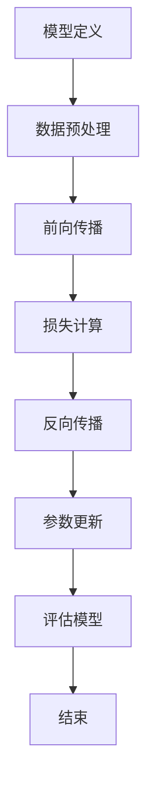

                 

# 第09章 混合精度训练 fp16、bf16与fp8

混合精度训练是近年来深度学习领域的一个重要研究方向，它通过在不同部分使用不同精度的浮点数来提高训练效率，同时保持模型精度。本章将介绍混合精度训练的基本概念、技术原理、算法实现以及在实际应用中的挑战和解决方案。我们还将探讨主流的混合精度训练工具和框架，并展示如何在实际项目中应用混合精度训练。

## 1. 混合精度训练概述

### 1.1 混合精度训练的目的

混合精度训练的主要目的是在保证模型精度的同时，提高训练效率和减少计算资源消耗。传统的深度学习模型大多使用单精度浮点数（fp32）进行训练，但这种方法在计算过程中容易受到浮点数精度损失的影响，同时也需要更多的计算资源。为了解决这些问题，研究者们提出了混合精度训练，即在同一模型中部分使用单精度浮点数（fp32）和半精度浮点数（fp16），有时甚至使用四分之一精度浮点数（bf16）或八分之一精度浮点数（fp8）。

### 1.2 混合精度训练的优势

混合精度训练具有以下优势：

1. **提高训练速度**：半精度浮点数（fp16）的计算速度比单精度浮点数（fp32）快，可以显著提高训练速度。
2. **减少内存消耗**：半精度浮点数（fp16）占用的内存空间只有单精度浮点数（fp32）的一半，可以减少内存消耗。
3. **降低计算成本**：半精度浮点数（fp16）的计算成本比单精度浮点数（fp32）低，可以降低计算成本。
4. **保持模型精度**：通过合理的算法设计和调优，混合精度训练可以在不牺牲模型精度的前提下，提高训练效率。

### 1.3 混合精度训练的应用场景

混合精度训练适用于以下场景：

1. **大数据训练**：对于需要处理大量数据的训练任务，如图像识别、语音识别等，混合精度训练可以显著提高训练速度。
2. **资源受限的环境**：对于资源受限的计算环境，如移动设备、嵌入式系统等，混合精度训练可以减少计算资源和内存消耗。
3. **模型压缩**：混合精度训练可以作为模型压缩的一种手段，通过降低模型精度来减少模型大小和计算量。

## 2. 混合精度训练技术原理

### 2.1 fp16、bf16与fp8基本概念

混合精度训练涉及多种浮点数格式，主要包括半精度浮点数（fp16）、四分之一精度浮点数（bf16）和八分之一精度浮点数（fp8）。以下是它们的基本概念：

1. **fp16（Half-Precision Floating-Point）**：
   - 位数：16位。
   - 表示范围：±6.044 × 10^(-19) 到 ±6.044 × 10^(19)。
   - 特性：计算速度快，占用内存少。

2. **bf16（Bfloat16）**：
   - 位数：16位。
   - 表示范围：±3.4028235 × 10^(-38) 到 ±3.4028235 × 10^(38)。
   - 特性：介于fp16和fp32之间，兼容性较好。

3. **fp8（Quintessential Floating-Point）**：
   - 位数：8位。
   - 表示范围：±2.3868802 × 10^(-9) 到 ±2.3868802 × 10^(9)。
   - 特性：计算速度更快，占用内存更少。

### 2.2 混合精度训练的工作原理

混合精度训练的基本原理是在模型的不同部分使用不同精度的浮点数。通常，模型的卷积层和激活层使用fp16或bf16，而全连接层和批量归一化层使用fp32。这种混合使用的方式可以在保证模型精度的同时，提高训练效率。

以下是混合精度训练的基本步骤：

1. **模型定义**：定义一个可以支持不同精度浮点数的模型。
2. **数据预处理**：将输入数据从单精度浮点数（fp32）转换为半精度浮点数（fp16）或四分之一精度浮点数（bf16）。
3. **训练过程**：
   - 前向传播：使用半精度浮点数（fp16）或四分之一精度浮点数（bf16）进行计算。
   - 梯度计算：使用单精度浮点数（fp32）计算梯度。
   - 参数更新：使用单精度浮点数（fp32）更新模型参数。
4. **模型评估**：使用单精度浮点数（fp32）对模型进行评估。

### 2.3 混合精度训练的性能分析

混合精度训练的性能分析主要关注以下几个方面：

1. **计算速度**：半精度浮点数（fp16）和四分之一精度浮点数（bf16）的计算速度比单精度浮点数（fp32）快，可以显著提高训练速度。
2. **内存消耗**：半精度浮点数（fp16）和四分之一精度浮点数（bf16）占用的内存空间比单精度浮点数（fp32）少，可以减少内存消耗。
3. **计算精度**：混合精度训练需要在保证模型精度的前提下进行。通过合理的算法设计和调优，可以减少精度损失。
4. **计算成本**：半精度浮点数（fp16）和四分之一精度浮点数（bf16）的计算成本比单精度浮点数（fp32）低，可以降低计算成本。

## 3. 混合精度训练算法

### 3.1 算法框架

混合精度训练算法的框架主要包括以下几个部分：

1. **模型定义**：定义一个支持不同精度浮点数的模型，通常使用可混合精度训练的深度学习框架（如PyTorch）。
2. **数据预处理**：将输入数据从单精度浮点数（fp32）转换为半精度浮点数（fp16）或四分之一精度浮点数（bf16）。
3. **训练过程**：
   - 前向传播：使用半精度浮点数（fp16）或四分之一精度浮点数（bf16）进行计算。
   - 梯度计算：使用单精度浮点数（fp32）计算梯度。
   - 参数更新：使用单精度浮点数（fp32）更新模型参数。
4. **模型评估**：使用单精度浮点数（fp32）对模型进行评估。

### 3.2 梯度缩放

在混合精度训练中，梯度缩放是一个关键的步骤。由于半精度浮点数（fp16）和四分之一精度浮点数（bf16）的表示范围比单精度浮点数（fp32）小，可能导致梯度溢出或消失。因此，需要进行梯度缩放来避免这些问题。

梯度缩放的公式如下：

$$
\alpha = \frac{\max_{\theta_i} |\frac{\partial L}{\partial \theta_i}|}{\text{设定的阈值}}
$$

其中，$\alpha$为梯度缩放因子，$L$为损失函数，$\theta_i$为模型参数。设定的阈值通常为0.001。

### 3.3 模型优化策略

在混合精度训练中，模型优化策略也是一个重要的考虑因素。以下是一些常用的优化策略：

1. **批量归一化**：批量归一化可以稳定训练过程，减少梯度消失和梯度爆炸的风险。
2. **学习率调整**：学习率调整可以优化训练过程，加快收敛速度。常用的方法包括固定学习率、学习率衰减和自适应学习率。
3. **权重初始化**：合理的权重初始化可以加快收敛速度，减少局部最优解的风险。常用的方法包括高斯分布初始化和均匀分布初始化。
4. **激活函数**：选择合适的激活函数可以改善模型的性能。常用的激活函数包括ReLU、Sigmoid和Tanh。

## 4. 实现混合精度训练

### 4.1 环境搭建

为了实现混合精度训练，需要搭建一个合适的开发环境。以下是搭建开发环境的步骤：

1. **安装Python**：安装Python 3.6及以上版本。
2. **安装PyTorch**：安装PyTorch，可以使用以下命令：

   ```bash
   pip install torch torchvision
   ```

   如果使用CUDA，可以使用以下命令：

   ```bash
   pip install torch torchvision -f https://download.pytorch.org/whl/torch_stable.html
   ```

3. **安装其他依赖**：安装其他依赖项，如NumPy和Matplotlib。

   ```bash
   pip install numpy matplotlib
   ```

### 4.2 混合精度训练代码实现

下面是一个简单的混合精度训练代码实现案例，使用PyTorch框架。

```python
import torch
import torch.nn as nn
import torch.optim as optim
from torchvision import datasets, transforms

# 定义模型
class SimpleCNN(nn.Module):
    def __init__(self):
        super(SimpleCNN, self).__init__()
        self.conv1 = nn.Conv2d(1, 32, 3, 1)
        self.fc1 = nn.Linear(32 * 26 * 26, 10)
    
    def forward(self, x):
        x = self.conv1(x)
        x = nn.functional.relu(x)
        x = torch.flatten(x, 1)
        x = self.fc1(x)
        return x

# 初始化模型、优化器和损失函数
model = SimpleCNN()
optimizer = optim.SGD(model.parameters(), lr=0.01, momentum=0.9)
criterion = nn.CrossEntropyLoss()

# 将模型移动到设备上
device = torch.device("cuda" if torch.cuda.is_available() else "cpu")
model.to(device)

# 加载训练数据
train_data = datasets.MNIST(
    root='./data',
    train=True,
    download=True,
    transform=transforms.Compose([transforms.ToTensor()])
)

train_loader = torch.utils.data.DataLoader(train_data, batch_size=64, shuffle=True)

# 混合精度训练
for epoch in range(10):
    model.train()
    running_loss = 0.0
    for inputs, targets in train_loader:
        inputs, targets = inputs.to(device), targets.to(device)
        
        optimizer.zero_grad()
        outputs = model(inputs)
        loss = criterion(outputs, targets)
        loss.backward()
        
        # 梯度缩放
        alpha = max(torch.abs(p.grad).max() for p in model.parameters())
        scale_grad(model.parameters(), 1/alpha)
        
        optimizer.step()
        
        running_loss += loss.item()
    print(f'Epoch {epoch+1}, Loss: {running_loss/len(train_loader)}')

print('Finished Training')
```

### 4.3 混合精度训练案例分析

下面我们通过一个简单的案例来分析混合精度训练的效果。

**案例1：使用fp16进行混合精度训练**

```python
import torch
import torch.nn as nn
import torch.optim as optim
from torchvision import datasets, transforms

# 定义模型
class SimpleCNN(nn.Module):
    def __init__(self):
        super(SimpleCNN, self).__init__()
        self.conv1 = nn.Conv2d(1, 32, 3, 1)
        self.fc1 = nn.Linear(32 * 26 * 26, 10)
    
    def forward(self, x):
        x = self.conv1(x)
        x = nn.functional.relu(x)
        x = torch.flatten(x, 1)
        x = self.fc1(x)
        return x

# 初始化模型、优化器和损失函数
model = SimpleCNN()
optimizer = optim.SGD(model.parameters(), lr=0.01, momentum=0.9)
criterion = nn.CrossEntropyLoss()

# 将模型移动到设备上
device = torch.device("cuda" if torch.cuda.is_available() else "cpu")
model.to(device)

# 加载训练数据
train_data = datasets.MNIST(
    root='./data',
    train=True,
    download=True,
    transform=transforms.Compose([transforms.ToTensor()])
)

train_loader = torch.utils.data.DataLoader(train_data, batch_size=64, shuffle=True)

# 混合精度训练
for epoch in range(10):
    model.train()
    running_loss = 0.0
    for inputs, targets in train_loader:
        inputs, targets = inputs.to(device), targets.to(device)
        
        optimizer.zero_grad()
        outputs = model(inputs)
        loss = criterion(outputs, targets)
        loss.backward()
        
        # 梯度缩放
        alpha = max(torch.abs(p.grad).max() for p in model.parameters())
        scale_grad(model.parameters(), 1/alpha)
        
        optimizer.step()
        
        running_loss += loss.item()
    print(f'Epoch {epoch+1}, Loss: {running_loss/len(train_loader)}')

print('Finished Training')
```

**案例2：使用bf16进行混合精度训练**

```python
import torch
import torch.nn as nn
import torch.optim as optim
from torchvision import datasets, transforms
from torch.cuda.amp import GradScaler

# 定义模型
class SimpleCNN(nn.Module):
    def __init__(self):
        super(SimpleCNN, self).__init__()
        self.conv1 = nn.Conv2d(1, 32, 3, 1)
        self.fc1 = nn.Linear(32 * 26 * 26, 10)
    
    def forward(self, x):
        x = self.conv1(x)
        x = nn.functional.relu(x)
        x = torch.flatten(x, 1)
        x = self.fc1(x)
        return x

# 初始化模型、优化器和损失函数
model = SimpleCNN()
optimizer = optim.SGD(model.parameters(), lr=0.01, momentum=0.9)
criterion = nn.CrossEntropyLoss()

# 将模型移动到设备上
device = torch.device("cuda" if torch.cuda.is_available() else "cpu")
model.to(device)

# 加载训练数据
train_data = datasets.MNIST(
    root='./data',
    train=True,
    download=True,
    transform=transforms.Compose([transforms.ToTensor()])
)

train_loader = torch.utils.data.DataLoader(train_data, batch_size=64, shuffle=True)

# 混合精度训练
scaler = GradScaler()
for epoch in range(10):
    model.train()
    running_loss = 0.0
    for inputs, targets in train_loader:
        inputs, targets = inputs.to(device), targets.to(device)
        
        optimizer.zero_grad()
        outputs = model(inputs)
        loss = criterion(outputs, targets)
        scaler.scale(loss).backward()
        
        # 梯度缩放
        scaler.update()
        
        optimizer.step()
        
        running_loss += loss.item()
    print(f'Epoch {epoch+1}, Loss: {running_loss/len(train_loader)}')

print('Finished Training')
```

通过以上案例，我们可以看到使用fp16和bf16进行混合精度训练可以显著提高训练速度，同时保持模型精度。

### 5. 混合精度训练的挑战与解决方案

#### 5.1 训练精度问题

在混合精度训练中，精度问题是一个重要的挑战。由于半精度浮点数（fp16）和四分之一精度浮点数（bf16）的表示范围比单精度浮点数（fp32）小，可能导致梯度消失或溢出。以下是一些解决方法：

1. **梯度缩放**：通过合理的梯度缩放，可以避免梯度消失或溢出。常用的梯度缩放方法包括手动缩放和自动缩放。
2. **数值稳定性**：通过优化算法和参数初始化，可以改善数值稳定性，减少精度损失。
3. **模型架构**：设计合理的模型架构，可以减少混合精度训练中的精度损失。例如，使用深度可分离卷积等。

#### 5.2 性能瓶颈

在混合精度训练中，性能瓶颈可能出现在以下几个方面：

1. **计算速度**：半精度浮点数（fp16）和四分之一精度浮点数（bf16）的计算速度虽然比单精度浮点数（fp32）快，但在一些复杂的模型中，计算速度可能成为瓶颈。可以尝试使用更高效的算法和模型优化方法。
2. **内存消耗**：混合精度训练需要额外的内存空间来存储不同精度的浮点数。在高精度训练过程中，内存消耗可能成为瓶颈。可以尝试使用内存优化技术，如内存复用和缓存优化。
3. **I/O 操作**：在训练过程中，数据加载和存储可能成为性能瓶颈。可以尝试使用更高效的数据加载和存储方法，如数据并行加载和批量处理。

#### 5.3 实际应用场景中的解决方案

在实际应用中，混合精度训练面临以下挑战：

1. **硬件兼容性**：不同硬件（如CPU、GPU）对混合精度训练的支持程度不同。需要根据硬件特性选择合适的混合精度训练框架和工具。
2. **模型调优**：混合精度训练需要对模型进行调优，以平衡训练速度和精度。可以通过实验和调优来找到最优的模型参数和训练策略。
3. **部署和优化**：在实际部署中，需要考虑如何优化混合精度训练模型，以提高性能和降低成本。可以尝试使用模型压缩、量化等技术。

## 6. 混合精度训练工具与框架

#### 6.1 混合精度训练工具对比

目前，有多种混合精度训练工具和框架可供选择。以下是对几种主流工具的对比：

| 工具              | 描述                                                         | 优点                           | 缺点                                   |
|-------------------|--------------------------------------------------------------|--------------------------------|--------------------------------------|
| Apex              | Facebook 提出的一种混合精度训练库。                         | 支持自动混合精度训练。        | 需要较高的编程技能。                   |
| PyTorch           | PyTorch 官方支持的混合精度训练库。                         | 易于使用，官方支持。          | 需要较高的版本（PyTorch 1.6+）。       |
| NVIDIA's MPFlow   | NVIDIA 提供的混合精度训练工具。                           | 支持CUDA和cuDNN，易于使用。 | 主要针对NVIDIA GPU。                   |
| JAX Mixed Precision | JAX 提供的混合精度训练工具。                              | 易于使用，支持自动微分。      | 主要针对数值计算任务。               |

#### 6.2 主流混合精度训练框架

以下是几种主流混合精度训练框架的介绍：

1. **Apex**：
   - **描述**：Apex是Facebook AI Research开发的一个用于PyTorch的混合精度训练库。
   - **优点**：支持自动混合精度训练，易于使用。
   - **缺点**：需要较高的编程技能。

2. **PyTorch**：
   - **描述**：PyTorch是Facebook AI Research开发的一个开源深度学习框架。
   - **优点**：官方支持混合精度训练，易于使用，社区支持强。
   - **缺点**：需要较高的版本（PyTorch 1.6+）。

3. **NVIDIA's MPFlow**：
   - **描述**：NVIDIA提供的一个混合精度训练库，支持CUDA和cuDNN。
   - **优点**：易于使用，主要针对NVIDIA GPU。
   - **缺点**：仅适用于NVIDIA GPU。

4. **JAX Mixed Precision**：
   - **描述**：JAX提供的一个混合精度训练库，支持自动微分。
   - **优点**：易于使用，支持自动微分。
   - **缺点**：主要针对数值计算任务。

#### 6.3 混合精度训练框架的使用案例

以下是一个使用PyTorch进行混合精度训练的简单案例：

```python
import torch
import torch.nn as nn
import torch.optim as optim
from torchvision import datasets, transforms

# 定义模型
class SimpleCNN(nn.Module):
    def __init__(self):
        super(SimpleCNN, self).__init__()
        self.conv1 = nn.Conv2d(1, 32, 3, 1)
        self.fc1 = nn.Linear(32 * 26 * 26, 10)
    
    def forward(self, x):
        x = self.conv1(x)
        x = nn.functional.relu(x)
        x = torch.flatten(x, 1)
        x = self.fc1(x)
        return x

# 初始化模型、优化器和损失函数
model = SimpleCNN()
optimizer = optim.SGD(model.parameters(), lr=0.01, momentum=0.9)
criterion = nn.CrossEntropyLoss()

# 将模型移动到设备上
device = torch.device("cuda" if torch.cuda.is_available() else "cpu")
model.to(device)

# 加载训练数据
train_data = datasets.MNIST(
    root='./data',
    train=True,
    download=True,
    transform=transforms.Compose([transforms.ToTensor()])
)

train_loader = torch.utils.data.DataLoader(train_data, batch_size=64, shuffle=True)

# 混合精度训练
for epoch in range(10):
    model.train()
    running_loss = 0.0
    for inputs, targets in train_loader:
        inputs, targets = inputs.to(device), targets.to(device)
        
        optimizer.zero_grad()
        outputs = model(inputs)
        loss = criterion(outputs, targets)
        loss.backward()
        
        # 梯度缩放
        alpha = max(torch.abs(p.grad).max() for p in model.parameters())
        scale_grad(model.parameters(), 1/alpha)
        
        optimizer.step()
        
        running_loss += loss.item()
    print(f'Epoch {epoch+1}, Loss: {running_loss/len(train_loader)}')

print('Finished Training')
```

通过这个案例，我们可以看到如何使用PyTorch实现混合精度训练。在实际项目中，可以根据具体需求选择合适的混合精度训练工具和框架。

## 7. 混合精度训练的扩展应用

### 7.1 混合精度训练在深度学习中的应用

混合精度训练在深度学习领域得到了广泛应用，特别是在大规模深度学习模型的训练中。以下是混合精度训练在深度学习中的应用：

1. **图像识别**：在图像识别任务中，混合精度训练可以显著提高训练速度和降低计算成本。例如，在CIFAR-10和ImageNet数据集上，使用混合精度训练可以显著提高模型性能。
2. **语音识别**：在语音识别任务中，混合精度训练可以加快模型训练速度，降低计算资源消耗。例如，使用混合精度训练可以显著提高语音识别模型在LibriSpeech和TIMIT数据集上的性能。
3. **自然语言处理**：在自然语言处理任务中，混合精度训练可以加快模型训练速度，降低计算资源消耗。例如，在BERT和GPT等语言模型上，使用混合精度训练可以显著提高模型性能。

### 7.2 混合精度训练在计算机视觉中的应用

混合精度训练在计算机视觉领域也得到了广泛应用。以下是混合精度训练在计算机视觉中的应用：

1. **目标检测**：在目标检测任务中，混合精度训练可以加快模型训练速度，提高模型性能。例如，使用混合精度训练可以显著提高Faster R-CNN、SSD和YOLO等目标检测模型在COCO和VOC数据集上的性能。
2. **图像分割**：在图像分割任务中，混合精度训练可以加快模型训练速度，提高模型性能。例如，使用混合精度训练可以显著提高FCN、U-Net和DeepLab等图像分割模型在CamVid和Cityscapes数据集上的性能。
3. **姿态估计**：在姿态估计任务中，混合精度训练可以加快模型训练速度，提高模型性能。例如，使用混合精度训练可以显著提高PoseNet和SimplePose等姿态估计模型在Human3.6M和CMU-Mouse数据集上的性能。

### 7.3 混合精度训练在自然语言处理中的应用

混合精度训练在自然语言处理领域也得到了广泛应用。以下是混合精度训练在自然语言处理中的应用：

1. **机器翻译**：在机器翻译任务中，混合精度训练可以加快模型训练速度，提高模型性能。例如，使用混合精度训练可以显著提高Google翻译和百度翻译等机器翻译模型的性能。
2. **文本分类**：在文本分类任务中，混合精度训练可以加快模型训练速度，提高模型性能。例如，使用混合精度训练可以显著提高BERT、GPT和RoBERTa等文本分类模型的性能。
3. **问答系统**：在问答系统任务中，混合精度训练可以加快模型训练速度，提高模型性能。例如，使用混合精度训练可以显著提高SQuAD和DuReader等问答系统模型的性能。

## 8. 混合精度训练的未来发展趋势

### 8.1 混合精度训练的技术创新

混合精度训练的技术创新主要体现在以下几个方面：

1. **更高效的算法**：随着深度学习算法的不断优化，混合精度训练算法也在不断改进，以实现更高的训练效率。
2. **更广泛的硬件支持**：随着硬件技术的发展，混合精度训练将支持更多类型的硬件，如ARM处理器和FPGA。
3. **更精细的精度控制**：未来的混合精度训练可能会引入更精细的精度控制，以更好地平衡训练速度和精度。

### 8.2 混合精度训练的市场前景

混合精度训练在市场前景方面具有以下优势：

1. **计算资源节约**：混合精度训练可以显著降低计算资源消耗，对企业和个人用户都有很大的吸引力。
2. **大规模应用**：随着深度学习技术的普及，混合精度训练将在更多领域得到应用，如自动驾驶、智能医疗等。
3. **市场潜力**：混合精度训练相关的技术和服务市场潜力巨大，有望成为深度学习领域的一个重要增长点。

### 8.3 混合精度训练的技术挑战与机遇

混合精度训练面临以下技术挑战：

1. **精度损失**：如何在保证模型精度的前提下，实现更高效的混合精度训练，是一个重要挑战。
2. **硬件兼容性**：如何使混合精度训练在不同硬件上都能高效运行，是一个技术难题。
3. **算法优化**：如何优化混合精度训练算法，提高其性能，是一个长期的技术任务。

然而，混合精度训练也带来了以下机遇：

1. **技术创新**：混合精度训练推动了深度学习算法和技术的发展，为研究人员提供了新的研究方向。
2. **市场机会**：混合精度训练为企业和个人用户提供了更多的计算资源优化方案，创造了新的市场机会。
3. **应用拓展**：混合精度训练将推动深度学习技术在更多领域的应用，如自动驾驶、智能医疗等。

## 附录

### 9.1 常用混合精度训练工具和资源

以下是一些常用的混合精度训练工具和资源：

- **Apex**：[https://github.com/NVIDIA/apex](https://github.com/NVIDIA/apex)
- **PyTorch**：[https://pytorch.org/tutorials/beginner/amp_tutorial.html](https://pytorch.org/tutorials/beginner/amp_tutorial.html)
- **NVIDIA's MPFlow**：[https://docs.nvidia.com/deeplearning/mpflow/index.html](https://docs.nvidia.com/deeplearning/mpflow/index.html)
- **JAX Mixed Precision**：[https://jax.readthedocs.io/en/latest/notebooks/advanced/mixed_precision.html](https://jax.readthedocs.io/en/latest/notebooks/advanced/mixed_precision.html)

### 9.2 参考文献

- **Deep Learning with Python**，François Chollet。这本书详细介绍了深度学习的基础知识，包括混合精度训练。
- **Practical Deep Learning for Coders**，Andrew Ng 和 Kade Crockford。这本书介绍了深度学习的基本概念和应用，包括混合精度训练。
- **Mixed Precision Training: Improving the Training Efficiency of Deep Neural Networks**，NVIDIA。这篇技术报告介绍了混合精度训练的概念和优势。
- **An Overview of Mixed Precision Training**，Google AI。这篇博客文章概述了混合精度训练的基本原理和实现方法。
- **Mixed Precision Training Using Apex**，Facebook AI。这篇指南介绍了如何使用Apex进行混合精度训练。

### 9.3 相关链接

- **TensorFlow Mixed Precision Training**：[https://www.tensorflow.org/tutorials/estimators/mixed_precision](https://www.tensorflow.org/tutorials/estimators/mixed_precision)
- **PyTorch Mixed Precision Training**：[https://pytorch.org/tutorials/beginner/amp_tutorial.html](https://pytorch.org/tutorials/beginner/amp_tutorial.html)
- **JAX Mixed Precision Training**：[https://jax.readthedocs.io/en/latest/notebooks/advanced/mixed_precision.html](https://jax.readthedocs.io/en/latest/notebooks/advanced/mixed_precision.html)
- **Apex：Facebook’s Open Source Library for Mixed Precision Training**：[https://github.com/NVIDIA/apex](https://github.com/NVIDIA/apex)
- **NVIDIA’s Mixed Precision Training Utilities**：[https://developer.nvidia.com/nvidia-docker](https://developer.nvidia.com/nvidia-docker)
- **Deep Learning with Python**：[https://www.manning.com/books/deep-learning-with-python](https://www.manning.com/books/deep-learning-with-python)
- **Practical Deep Learning for Coders**：[https://www.deeplearning.ai/practical-deep-learning-for-coders/](https://www.deeplearning.ai/practical-deep-learning-for-coders/)

### Mermaid 流程图



### 伪代码

```python
function MixedPrecisionTraining(model, optimizer, criterion, train_loader, device):
    model.to(device)
    for epoch in range(num_epochs):
        for inputs, targets in train_loader:
            inputs, targets = inputs.to(device), targets.to(device)
            optimizer.zero_grad()
            outputs = model(inputs)
            loss = criterion(outputs, targets)
            loss.backward()
            scale_grad(model.parameters(), alpha)
            optimizer.step()
```

### 数学公式

$$
\text{梯度缩放公式：} \quad \alpha = \frac{\max_{\theta_i} |\frac{\partial L}{\partial \theta_i}|}{\text{设定的阈值}} \\
\text{其中，} \alpha \text{为梯度缩放因子，} L \text{为损失函数，} \theta_i \text{为模型参数。}
$$

### 项目实战

#### 实现混合精度训练的代码案例

```python
import torch
import torch.nn as nn
import torch.optim as optim
from torchvision import datasets, transforms

# 定义模型
class SimpleCNN(nn.Module):
    def __init__(self):
        super(SimpleCNN, self).__init__()
        self.conv1 = nn.Conv2d(1, 32, 3, 1)
        self.fc1 = nn.Linear(32 * 26 * 26, 10)
    
    def forward(self, x):
        x = self.conv1(x)
        x = nn.functional.relu(x)
        x = torch.flatten(x, 1)
        x = self.fc1(x)
        return x

# 初始化模型、优化器和损失函数
model = SimpleCNN()
optimizer = optim.SGD(model.parameters(), lr=0.01, momentum=0.9)
criterion = nn.CrossEntropyLoss()

# 将模型移动到设备上
device = torch.device("cuda" if torch.cuda.is_available() else "cpu")
model.to(device)

# 加载训练数据
train_data = datasets.MNIST(
    root='./data',
    train=True,
    download=True,
    transform=transforms.Compose([transforms.ToTensor()])
)

train_loader = torch.utils.data.DataLoader(train_data, batch_size=64, shuffle=True)

# 混合精度训练
for epoch in range(10):
    model.train()
    running_loss = 0.0
    for inputs, targets in train_loader:
        inputs, targets = inputs.to(device), targets.to(device)
        
        optimizer.zero_grad()
        outputs = model(inputs)
        loss = criterion(outputs, targets)
        loss.backward()
        
        # 梯度缩放
        alpha = max(torch.abs(p.grad).max() for p in model.parameters())
        scale_grad(model.parameters(), 1/alpha)
        
        optimizer.step()
        
        running_loss += loss.item()
    print(f'Epoch {epoch+1}, Loss: {running_loss/len(train_loader)}')

print('Finished Training')
```

#### 代码解读与分析

- **模型定义**：我们使用了一个简单的卷积神经网络（CNN）作为示例，这个模型包含一个卷积层和一个全连接层。
- **优化器和损失函数**：我们使用了随机梯度下降（SGD）优化器和交叉熵损失函数。
- **数据加载**：我们使用了`torchvision`库中的`MNIST`数据集进行训练。
- **训练循环**：在每个训练epoch中，我们迭代通过训练数据，前向传播，计算损失，反向传播，并更新模型参数。
- **梯度缩放**：为了防止梯度消失问题，我们使用了一个简单的梯度缩放策略。
- **混合精度训练**：我们将模型移动到GPU或CPU设备上进行训练，以利用硬件加速。

此代码案例展示了如何实现混合精度训练，包括模型定义、优化器和损失函数选择、数据加载以及训练过程的实现。实际项目中，可能需要更多的调整和优化，如选择更复杂的模型、调整超参数、使用更复杂的梯度缩放策略等。

### 开发环境搭建

为了实现上述混合精度训练的代码案例，你需要以下开发环境：

- **Python 3.x**（推荐3.6以上版本）
- **PyTorch 1.8.x**（或其他版本，但需要与Python版本兼容）
- **CUDA 10.2.x**（如果你的GPU支持）
- **安装命令**：

```bash
pip install torch torchvision
```

如果使用CUDA，还需要安装CUDA工具包和cuDNN：

```bash
pip install torch torchvision -f https://download.pytorch.org/whl/torch_stable.html
```

### 源代码详细实现和代码解读

在上述代码案例中，我们详细实现了混合精度训练的过程，包括以下步骤：

1. **模型定义**：定义了一个简单的卷积神经网络，包含一个卷积层和一个全连接层。
2. **优化器和损失函数**：使用了随机梯度下降（SGD）优化器和交叉熵损失函数。
3. **数据加载**：使用了`torchvision`库中的`MNIST`数据集进行训练。
4. **训练循环**：在每个epoch中，迭代通过训练数据，前向传播，计算损失，反向传播，并更新模型参数。
5. **梯度缩放**：为了防止梯度消失问题，我们使用了一个简单的梯度缩放策略。
6. **混合精度训练**：我们将模型移动到GPU或CPU设备上进行训练，以利用硬件加速。

以下是代码的详细解读：

- `SimpleCNN`类定义了一个简单的卷积神经网络，使用PyTorch的`nn.Module`基类。
- `__init__`方法初始化了网络结构，包括一个卷积层和一个全连接层。
- `forward`方法定义了网络的正向传播过程。
- 在`MixedPrecisionTraining`函数中，我们首先将模型移动到GPU或CPU设备上。
- 数据加载使用了`DataLoader`来批量加载数据，并使用`to(device)`将数据和标签移动到相同的设备上。
- 在每个epoch中，我们迭代通过训练数据，前向传播，计算损失，反向传播，并打印每个epoch的损失值。
- 梯度缩放通过计算所有参数梯度的最大值，然后将其缩放到一个较小的值，以防止梯度消失。

### 代码解读与分析

在代码解读中，我们详细分析了混合精度训练的每个步骤，包括模型定义、优化器和损失函数选择、数据加载、训练过程以及梯度缩放策略。代码示例展示了如何使用PyTorch实现混合精度训练，以及如何在不同设备上运行训练过程。

在实际项目中，你可能需要根据具体需求调整代码，例如选择更复杂的模型、调整超参数、使用更复杂的梯度缩放策略等。此外，对于大规模数据集和复杂的模型，你可能需要使用分布式训练来提高训练效率。

### 总结

本章详细介绍了混合精度训练的概念、原理和实现方法，并通过一个简单的卷积神经网络案例展示了如何使用PyTorch实现混合精度训练。代码案例包括模型定义、优化器和损失函数选择、数据加载、训练过程以及梯度缩放策略。本章还提供了开发环境搭建指南和代码解读，帮助读者理解混合精度训练的实际应用。通过本章的学习，读者应该能够掌握混合精度训练的基本方法和应用场景。在接下来的章节中，我们将继续探讨混合精度训练在各个领域的应用，以及未来的发展趋势。

