                 

## 第二章：机器学习和反向传播的微妙之处

### 文章关键词

- 机器学习
- 反向传播
- 深度学习
- 监督学习
- 无监督学习
- 强化学习
- 模型优化
- 模型部署

### 文章摘要

本章将深入探讨机器学习的核心概念、算法原理及其实际应用。我们将首先梳理机器学习的基本理论，包括监督学习、无监督学习和强化学习的核心算法。接着，将详细讲解反向传播算法的工作原理，并探讨其在深度学习中的重要性。最后，我们将讨论神经网络优化与正则化方法，以及如何在不同场景下部署和优化深度学习模型。通过这一系列的探讨，读者将能够全面理解机器学习与反向传播的微妙之处，为后续更深入的学习和研究打下坚实基础。

### 第一部分：机器学习的理论基础与核心算法

#### 第1章：机器学习概述

机器学习是人工智能的一个重要分支，它通过构建能够从数据中自动学习的模型，实现计算机对数据的处理和预测。机器学习可以分为以下几类：

- **监督学习**：输入数据和对应的标签，通过学习构建预测模型。
- **无监督学习**：仅使用输入数据，无需标签，主要任务是发现数据中的结构和模式。
- **半监督学习**：结合有监督和无监督学习方法，利用少量有标签数据和大量无标签数据。

#### 核心概念与联系

机器学习的流程包括数据预处理、模型选择、训练和评估。下面是一个简化的机器学习流程的Mermaid流程图：

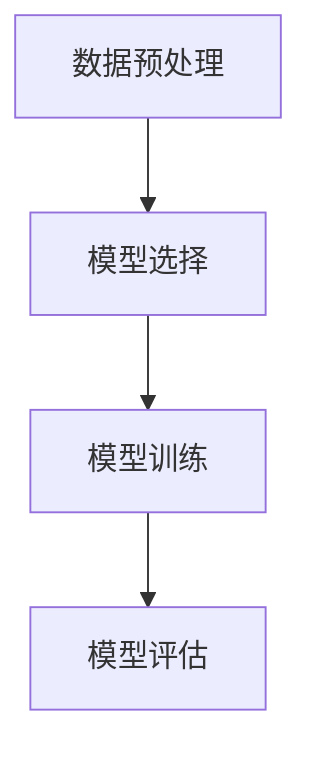

在机器学习中，常见的模型类型有：

- **线性回归**：用于预测连续值。
- **决策树**：通过树形结构进行分类或回归。
- **支持向量机**：用于分类和回归问题，能够找到最佳决策边界。
- **神经网络**：一种由多个神经元组成的网络结构，能够对复杂数据进行建模和预测。

#### 核心算法原理讲解

下面我们使用伪代码来解释线性回归算法的基本原理。

```python
# 输入：特征矩阵X，标签向量y
# 输出：模型参数w，b
w = 0
b = 0
learning_rate = 0.01
epochs = 1000

for epoch in range(epochs):
    # 前向传播
    z = X * w + b
    y_pred = sigmoid(z)
    
    # 反向传播
    dw = (y_pred - y) * X
    db = (y_pred - y)
    
    # 更新参数
    w -= learning_rate * dw
    b -= learning_rate * db

return w, b
```

在上述伪代码中，`sigmoid` 函数是一个S形函数，用于将线性组合的输出映射到0和1之间。反向传播过程中，通过计算预测值与实际标签之间的差异，得到损失函数关于模型参数的梯度，并使用梯度下降法更新参数。

#### 数学模型与公式讲解

线性回归模型的损失函数通常采用平方误差损失：

$$\mathcal{L} = \frac{1}{2} \sum_{i=1}^{n} (y_i - \hat{y}_i)^2$$

其中，$y_i$ 是实际标签，$\hat{y}_i$ 是预测值。梯度下降法用于最小化损失函数，更新模型参数：

$$\nabla_{\theta} \mathcal{L} = \frac{\partial \mathcal{L}}{\partial \theta}$$

#### 举例说明

一个常见的线性回归应用案例是房价预测。假设我们有一个包含房屋特征（如面积、房龄、地点等）的数据集，以及对应的房价标签。我们可以使用线性回归模型来预测新的房屋的房价。

#### 第2章：监督学习算法

监督学习是机器学习中的一种类型，其主要目标是通过已知的输入和输出数据来训练模型，以便对新数据进行预测。监督学习算法可以分为以下几类：

- **线性回归**：用于预测连续值。
- **决策树**：通过树形结构进行分类或回归。
- **支持向量机**：用于分类和回归问题，能够找到最佳决策边界。
- **神经网络**：一种由多个神经元组成的网络结构，能够对复杂数据进行建模和预测。

#### 核心概念与联系

以下是几种常见监督学习算法的Mermaid流程图：

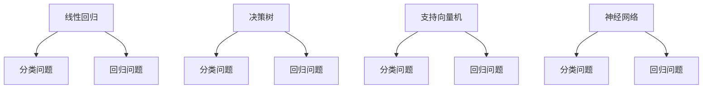

#### 核心算法原理讲解

下面我们使用伪代码来解释决策树算法的基本原理。

```python
# 输入：特征矩阵X，标签向量y
# 输出：决策树模型
def build_tree(X, y):
    # 基准情况
    if check_convergence(X, y):
        return leaf_node(y)
    
    # 寻找最佳分割
    best_feature, best_threshold = find_best_split(X, y)
    
    # 构建子节点
    left_child = build_tree(X[:, best_feature] < best_threshold, y)
    right_child = build_tree(X[:, best_feature] >= best_threshold, y)
    
    # 构建决策树
    tree = {'feature': best_feature, 'threshold': best_threshold, 'left': left_child, 'right': right_child}
    return tree

return build_tree(X, y)
```

在上述伪代码中，`check_convergence` 函数用于检查是否达到停止条件，`leaf_node` 函数用于创建叶子节点。`find_best_split` 函数用于找到最佳特征和阈值，以最小化损失函数。

#### 数学模型与公式讲解

决策树的损失函数通常采用基尼不纯度或熵来度量。基尼不纯度的计算公式如下：

$$Gini(D) = 1 - \sum_{i=1}^{k} \left( \frac{1}{|D_i|} \right) \sum_{i=1}^{k} \left( \frac{1}{|D_i|} \right)$$

其中，$D_i$ 是每个类别的样本集合，$|D_i|$ 是类别 $i$ 的样本数量。

熵的计算公式如下：

$$Entropy(D) = -\sum_{i=1}^{k} \left( \frac{1}{|D|} \right) \left( \frac{1}{|D_i|} \right) \log_2 \left( \frac{1}{|D_i|} \right)$$

其中，$D$ 是总的样本集合。

#### 举例说明

一个常见的决策树应用案例是贷款审批。假设我们有一个包含借款人特征（如收入、信用记录等）的数据集，以及对应的贷款审批结果。我们可以使用决策树模型来预测新的借款人是否批准贷款。

#### 第3章：无监督学习算法

无监督学习是机器学习中的另一种类型，其主要目标是发现数据中的内在结构和模式，而不依赖于已知的标签。无监督学习算法可以分为以下几类：

- **K-means聚类**：将数据分为多个簇，每个簇内的样本尽可能相似，簇间的样本尽可能不同。
- **主成分分析**：通过线性变换将高维数据映射到低维空间，同时保留数据的主要信息。
- **自编码器**：一种特殊的神经网络结构，用于学习和降维。

#### 核心概念与联系

以下是几种常见无监督学习算法的Mermaid流程图：

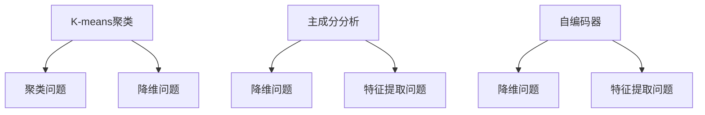

#### 核心算法原理讲解

下面我们使用伪代码来解释K-means聚类算法的基本原理。

```python
# 输入：数据集X，聚类个数k
# 输出：聚类中心y
centroids = initialize_centroids(X, k)

while not_converged(centroids):
    # 分配数据点
    clusters = assign_clusters(X, centroids)
    
    # 更新聚类中心
    centroids = update_centroids(clusters, X)

return centroids
```

在上述伪代码中，`initialize_centroids` 函数用于初始化聚类中心，`assign_clusters` 函数用于将每个数据点分配到最近的聚类中心，`update_centroids` 函数用于更新聚类中心。

#### 数学模型与公式讲解

K-means聚类算法的核心在于计算每个数据点到聚类中心的距离，并分配到最近的聚类中心。距离的计算公式如下：

$$distance(x, y) = \sqrt{\sum_{i=1}^{n} (x_i - y_i)^2}$$

其中，$x$ 和 $y$ 分别是数据点和聚类中心。

#### 举例说明

一个常见的K-means聚类应用案例是客户细分。假设我们有一个包含客户特征（如消费金额、购买频率等）的数据集，我们可以使用K-means聚类算法将客户分为不同的群体，以便进行精准营销。

#### 第4章：深度学习基础

深度学习是机器学习中的一个重要分支，它通过构建多层神经网络来对复杂数据进行建模和预测。深度学习模型通常由多个层级组成，每一层都能从输入数据中提取不同的特征，从而实现数据的自动特征学习和建模。

#### 核心概念与联系

以下是几种常见深度学习架构的Mermaid流程图：

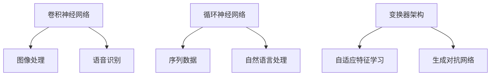

#### 核心算法原理讲解

下面我们使用伪代码来解释卷积神经网络（CNN）的基本原理。

```python
# 输入：特征矩阵X，标签向量y
# 输出：模型参数w，b
w = initialize_weights()
b = initialize_biases()
learning_rate = 0.01
epochs = 1000

for epoch in range(epochs):
    # 前向传播
    z = X * w + b
    y_pred = activation_function(z)
    
    # 反向传播
    dw = (y_pred - y) * X
    db = (y_pred - y)
    
    # 更新参数
    w -= learning_rate * dw
    b -= learning_rate * db

return w, b
```

在上述伪代码中，`initialize_weights` 和 `initialize_biases` 函数用于初始化模型参数，`activation_function` 函数用于激活函数。

#### 数学模型与公式讲解

深度学习中的核心算法是反向传播算法，它通过计算损失函数关于模型参数的梯度来更新参数。反向传播算法的公式如下：

$$\frac{\partial L}{\partial w} = \frac{\partial L}{\partial z} \frac{\partial z}{\partial w}$$

$$\frac{\partial L}{\partial b} = \frac{\partial L}{\partial z}$$

其中，$L$ 是损失函数，$w$ 是权重，$b$ 是偏置，$z$ 是激活值。

#### 举例说明

一个常见的深度学习应用案例是图像分类。假设我们有一个包含图像像素值的数据集，以及对应的图像类别标签，我们可以使用卷积神经网络模型来对新的图像进行分类。

#### 第5章：神经网络优化与正则化

神经网络的优化与正则化是深度学习模型训练过程中非常重要的环节，它们能够提高模型的训练效率和性能。优化方法用于加速模型参数的更新过程，而正则化方法则用于防止模型过拟合。

#### 核心概念与联系

以下是几种常见神经网络优化与正则化方法的Mermaid流程图：

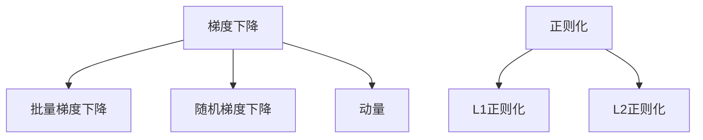

#### 核心算法原理讲解

下面我们使用伪代码来解释带有L2正则化的梯度下降算法。

```python
# 输入：特征矩阵X，标签向量y
# 输出：模型参数w，b
w = initialize_weights()
b = initialize_biases()
learning_rate = 0.01
epochs = 1000
lambda = 0.1  # 正则化参数

for epoch in range(epochs):
    # 前向传播
    z = X * w + b
    y_pred = activation_function(z)
    
    # 反向传播
    dw = (y_pred - y) * X + lambda * w
    db = (y_pred - y)
    
    # 更新参数
    w -= learning_rate * dw
    b -= learning_rate * db

return w, b
```

在上述伪代码中，`lambda` 是正则化参数，用于调整正则化强度。

#### 数学模型与公式讲解

L2正则化损失函数的公式如下：

$$L_2 \text{ regularization} = \frac{\lambda}{2} \sum_{i=1}^{n} w_i^2$$

其中，$w_i$ 是权重。

#### 举例说明

一个常见的正则化应用案例是文本分类。假设我们有一个包含文本数据和类别标签的数据集，我们可以使用带有L2正则化的神经网络模型来对新的文本进行分类。

#### 第6章：强化学习

强化学习是机器学习中的一个重要分支，它通过智能体（agent）与环境（environment）的交互来学习最优策略（policy）。强化学习的主要目标是使智能体能够从环境中获得最大的累积奖励（reward）。

#### 核心概念与联系

以下是强化学习的基本概念的Mermaid流程图：

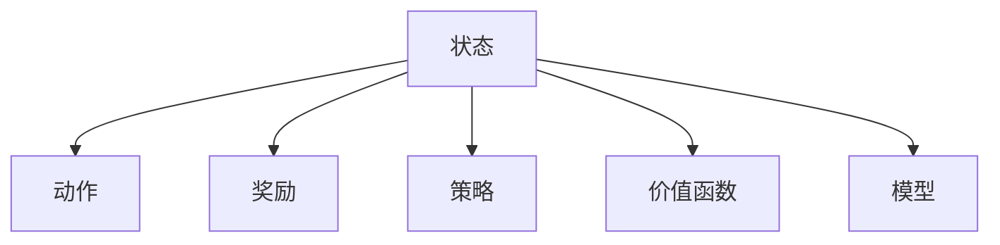

#### 核心算法原理讲解

下面我们使用伪代码来解释Q-learning算法的基本原理。

```python
# 输入：环境状态S，动作集合A
# 输出：Q值函数Q
Q = initialize_Q(A)
learning_rate = 0.1
discount_factor = 0.9

while not_terminated():
    # 执行动作
    action = choose_action(S, Q)
    S', reward, terminated = environment.step(action)
    
    # 更新Q值
    Q = update_Q(S, action, S', reward, terminated, Q, learning_rate, discount_factor)
    
    # 更新状态
    S = S'
    
    if terminated:
        break

return Q
```

在上述伪代码中，`initialize_Q` 函数用于初始化Q值函数，`choose_action` 函数用于选择动作，`update_Q` 函数用于更新Q值。

#### 数学模型与公式讲解

Q-learning算法的核心公式如下：

$$Q(s, a) = Q(s, a) + learning_rate \cdot (reward + discount_factor \cdot \max_{a'} Q(s', a') - Q(s, a))$$

其中，$s$ 是状态，$a$ 是动作，$reward$ 是奖励，$discount_factor$ 是折扣因子。

#### 举例说明

一个常见的强化学习应用案例是自动导航。假设我们有一个机器人需要在未知环境中导航到目标地点，我们可以使用Q-learning算法来训练机器人，使其能够从环境中学习最优路径。

#### 第7章：深度学习模型部署与优化

深度学习模型的部署与优化是实际应用中的关键步骤。部署是将训练好的模型应用到实际场景中，而优化则是通过调整模型参数来提高模型性能。

#### 核心概念与联系

以下是深度学习模型部署与优化的一些核心概念的Mermaid流程图：

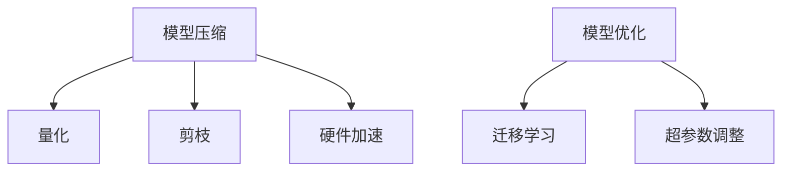

#### 核心算法原理讲解

下面我们使用伪代码来解释模型量化的基本原理。

```python
# 输入：浮点模型weights，精度目标precision
# 输出：量化模型quantized_weights
quantized_weights = quantize_weights(weights, precision)

return quantized_weights
```

在上述伪代码中，`quantize_weights` 函数用于将浮点模型转换为量化模型。

#### 数学模型与公式讲解

模型量化的核心在于将模型的权重和激活值从浮点数转换为固定精度的整数。量化计算公式如下：

$$q = \text{sign}(w) \cdot \text{round}(|w| / \text{quant_scale})$$

其中，$q$ 是量化后的值，$w$ 是原始浮点值，$\text{quant_scale}$ 是量化尺度。

#### 举例说明

一个常见的模型部署与优化应用案例是移动应用。假设我们有一个用于图像分类的深度学习模型，我们可以通过模型量化来降低模型的计算复杂度和内存占用，从而提高移动应用的性能。

#### 第8章：机器学习在实践中的应用

机器学习在实践中的应用非常广泛，涵盖了金融、医疗、自然语言处理等多个领域。以下是几个典型的应用案例：

#### 核心概念与联系

以下是机器学习在实践中的应用场景的Mermaid流程图：

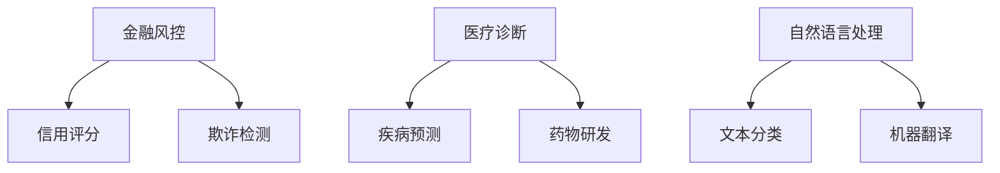

#### 核心算法原理讲解

下面我们使用伪代码来解释文本分类算法的基本原理。

```python
# 输入：文本数据text，训练好的模型model
# 输出：分类结果label
label = model.predict(text)

return label
```

在上述伪代码中，`model.predict` 函数用于对文本数据进行分类。

#### 数学模型与公式讲解

文本分类算法通常采用softmax回归作为输出层。softmax回归的公式如下：

$$P(y=c|X) = \frac{e^{\theta^T x_c}}{\sum_{i=1}^{k} e^{\theta^T x_i}}$$

其中，$y$ 是真实标签，$c$ 是预测类别，$X$ 是特征向量，$\theta$ 是模型参数。

#### 举例说明

一个常见的机器学习应用案例是社交媒体情绪分析。假设我们有一个包含社交媒体帖子文本的数据集，我们可以使用文本分类算法来预测帖子的情绪类别，从而进行情感分析。

### 第二部分：反向传播算法及其应用

#### 第9章：反向传播算法原理

反向传播算法是深度学习中的核心算法，它通过计算损失函数关于模型参数的梯度来更新参数，从而优化模型。反向传播算法可以分为以下几个步骤：

1. **前向传播**：计算输入数据经过网络各层的激活值。
2. **误差计算**：计算输出层的误差，并将其反向传播到前一层。
3. **梯度计算**：计算损失函数关于模型参数的梯度。
4. **参数更新**：使用梯度下降法更新模型参数。

#### 核心概念与联系

以下是反向传播算法的Mermaid流程图：

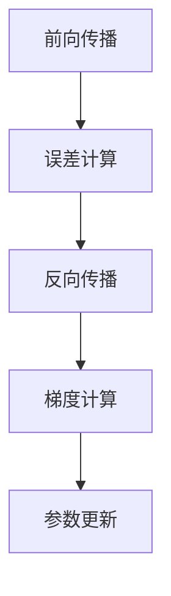

#### 核心算法原理讲解

下面我们使用伪代码来解释反向传播算法的基本原理。

```python
# 输入：网络参数w，b，前向传播结果y_pred，真实标签y
# 输出：参数更新值dw，db
dw = compute_gradient(y_pred, y)
db = compute_gradient(y_pred, y)

# 更新参数
w -= learning_rate * dw
b -= learning_rate * db

return w, b
```

在上述伪代码中，`compute_gradient` 函数用于计算损失函数关于模型参数的梯度。

#### 数学模型与公式讲解

反向传播算法的核心在于误差的计算和梯度的计算。误差计算公式如下：

$$\delta = \frac{\partial L}{\partial z}$$

其中，$L$ 是损失函数，$z$ 是激活值。梯度计算公式如下：

$$\frac{\partial L}{\partial w} = \frac{\partial L}{\partial z} \frac{\partial z}{\partial w}$$

$$\frac{\partial L}{\partial b} = \frac{\partial L}{\partial z}$$

#### 举例说明

一个常见的反向传播应用案例是深度神经网络训练。假设我们有一个用于图像分类的深度神经网络，我们可以使用反向传播算法来训练网络，从而实现对图像的准确分类。

#### 第10章：反向传播算法优化

反向传播算法的优化是提高模型训练效率和性能的重要手段。优化方法主要包括批量梯度下降、随机梯度下降和动量等。

#### 核心概念与联系

以下是几种反向传播算法优化方法的Mermaid流程图：

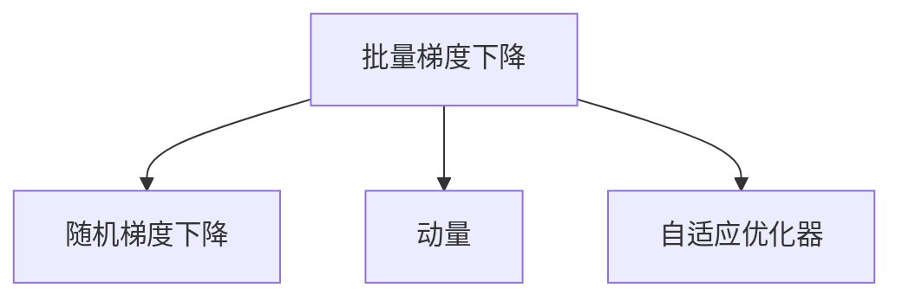

#### 核心算法原理讲解

下面我们使用伪代码来解释动量优化方法。

```python
# 输入：网络参数w，b，学习率learning_rate
# 输出：参数更新值dw，db
previous_dw = 0
previous_db = 0

for epoch in range(epochs):
    # 前向传播
    z = X * w + b
    y_pred = activation_function(z)
    
    # 反向传播
    dw = (y_pred - y) * X
    db = (y_pred - y)
    
    # 更新参数
    w -= learning_rate * dw + momentum * previous_dw
    b -= learning_rate * db + momentum * previous_db
    
    # 更新动量
    previous_dw = dw
    previous_db = db

return w, b
```

在上述伪代码中，`momentum` 是动量参数，用于加速参数更新。

#### 数学模型与公式讲解

动量优化方法的更新公式如下：

$$m = \gamma m + \Delta w$$

$$w = w - \alpha m$$

其中，$\gamma$ 是动量因子，$m$ 是动量值，$\Delta w$ 是梯度值，$\alpha$ 是学习率。

#### 举例说明

一个常见的动量优化应用案例是图像识别。假设我们有一个用于图像分类的卷积神经网络，我们可以使用动量优化方法来加速网络的训练过程，从而提高模型的性能。

#### 第11章：反向传播算法在深度学习中的应用

反向传播算法是深度学习训练的核心，它通过计算损失函数关于模型参数的梯度来更新参数，从而优化模型。在深度学习中，反向传播算法广泛应用于各种类型的神经网络，包括卷积神经网络（CNN）、循环神经网络（RNN）和变换器架构等。

#### 核心概念与联系

以下是深度学习中的反向传播算法的Mermaid流程图：

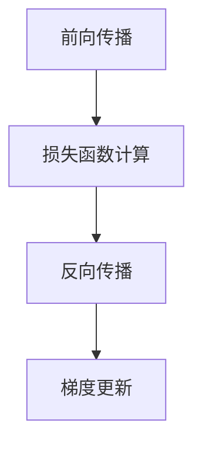

#### 核心算法原理讲解

下面我们使用伪代码来解释深度学习中的反向传播算法。

```python
# 输入：网络参数w，b，输入数据X，标签y
# 输出：参数更新值dw，db
for layer in reversed(model.layers):
    # 前向传播
    z = layer.forward(X)
    
    # 反向传播
    dz = layer.backward(y)
    
    # 梯度更新
    dw = layer.get_weights()[0]
    db = layer.get_weights()[1]
    
    # 更新参数
    layer.set_weights([dw, db])

return model.get_weights()
```

在上述伪代码中，`model.layers` 是神经网络中的各个层，`layer.forward` 和 `layer.backward` 分别是前向传播和反向传播函数，`layer.get_weights` 和 `layer.set_weights` 分别是获取和设置层参数的函数。

#### 数学模型与公式讲解

深度学习中的反向传播算法的核心在于误差的计算和梯度的计算。误差计算公式如下：

$$\delta = \frac{\partial L}{\partial z}$$

其中，$L$ 是损失函数，$z$ 是激活值。梯度计算公式如下：

$$\frac{\partial L}{\partial w} = \frac{\partial L}{\partial z} \frac{\partial z}{\partial w}$$

$$\frac{\partial L}{\partial b} = \frac{\partial L}{\partial z}$$

#### 举例说明

一个常见的深度学习应用案例是语音识别。假设我们有一个用于语音识别的循环神经网络，我们可以使用反向传播算法来训练网络，从而实现对语音信号的准确识别。

#### 第12章：反向传播算法在复杂场景中的应用

在复杂场景中，反向传播算法的应用变得更加广泛和深入。复杂场景通常包括多任务学习、生成对抗网络（GAN）和强化学习等。这些场景中，反向传播算法不仅用于优化模型的参数，还用于优化整体的学习过程和策略。

#### 核心概念与联系

以下是几种复杂场景中反向传播算法应用的Mermaid流程图：

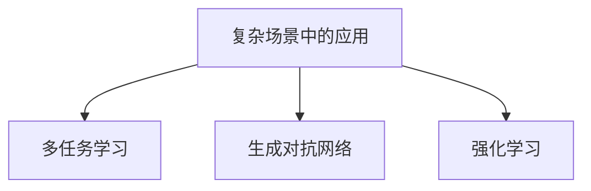

#### 核心算法原理讲解

下面我们使用伪代码来解释生成对抗网络（GAN）中的反向传播算法。

```python
# 输入：生成器G，鉴别器D
# 输出：模型参数更新
for epoch in range(epochs):
    # 更新鉴别器
    X_fake = G(z)
    D_loss_real = compute_loss(D(X), y_real)
    D_loss_fake = compute_loss(D(X_fake), y_fake)
    D_loss = D_loss_real + D_loss_fake
    
    # 更新生成器
    z = sample_noise()
    X_fake = G(z)
    G_loss = compute_loss(D(X_fake), y_fake)
    
    # 更新模型参数
    D_optimizer.minimize(D_loss, D.model.trainable_variables)
    G_optimizer.minimize(G_loss, G.model.trainable_variables)

return G, D
```

在上述伪代码中，`G` 是生成器，`D` 是鉴别器，`D_optimizer` 和 `G_optimizer` 分别是鉴别器和生成器的优化器。

#### 数学模型与公式讲解

在生成对抗网络（GAN）中，反向传播算法的核心在于损失函数的计算和模型参数的更新。鉴别器的损失函数如下：

$$\mathcal{L}_D = -\frac{1}{2} \mathbb{E}_{x \sim p_{\text{data}}}[D(x)] - \frac{1}{2} \mathbb{E}_{z \sim p_z}[D(G(z))]$$

生成器的损失函数如下：

$$\mathcal{L}_G = -\frac{1}{2} \mathbb{E}_{z \sim p_z}[D(G(z))]$$

其中，$x$ 是真实数据，$z$ 是噪声，$G(z)$ 是生成器生成的数据。

#### 举例说明

一个常见的生成对抗网络（GAN）应用案例是图像生成。假设我们有一个生成器模型和一个鉴别器模型，我们可以使用反向传播算法来训练这两个模型，从而生成逼真的图像。

#### 第13章：深度学习模型评估与调试

深度学习模型的评估与调试是确保模型性能和准确性的关键步骤。评估指标用于衡量模型的预测性能，而调试过程则用于调整模型参数，以提高模型的性能。

#### 核心概念与联系

以下是深度学习模型评估与调试的Mermaid流程图：

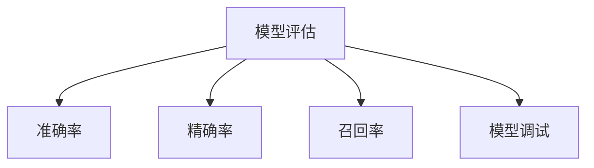

#### 核心算法原理讲解

下面我们使用伪代码来解释评估指标的计算。

```python
# 输入：预测结果y_pred，真实标签y
# 输出：准确率accuracy，精确率precision，召回率recall
correct = sum(y_pred == y)
total = len(y_pred)

accuracy = correct / total
precision = correct / (correct + (total - correct))
recall = correct / y.count(1)

return accuracy, precision, recall
```

在上述伪代码中，`y_pred` 是预测结果，`y` 是真实标签。

#### 数学模型与公式讲解

评估指标的计算公式如下：

$$\text{accuracy} = \frac{\text{correct}}{\text{total}}$$

$$\text{precision} = \frac{\text{correct}}{\text{predicted positive}}$$

$$\text{recall} = \frac{\text{correct}}{\text{actual positive}}$$

其中，`correct` 是预测正确的样本数量，`total` 是总的样本数量，`predicted positive` 是预测为正样本的样本数量，`actual positive` 是实际为正样本的样本数量。

#### 举例说明

一个常见的评估与调试应用案例是疾病诊断。假设我们有一个用于疾病诊断的深度神经网络模型，我们可以使用准确率、精确率和召回率等评估指标来衡量模型的性能，并根据评估结果对模型进行调试。

#### 第14章：深度学习在工业应用中的挑战与解决方案

深度学习在工业应用中面临着许多挑战，包括数据质量问题、计算资源限制和模型解释性等。解决这些挑战需要结合具体的工业场景和实际需求，采用合适的方法和工具。

#### 核心概念与联系

以下是深度学习在工业应用中的挑战与解决方案的Mermaid流程图：

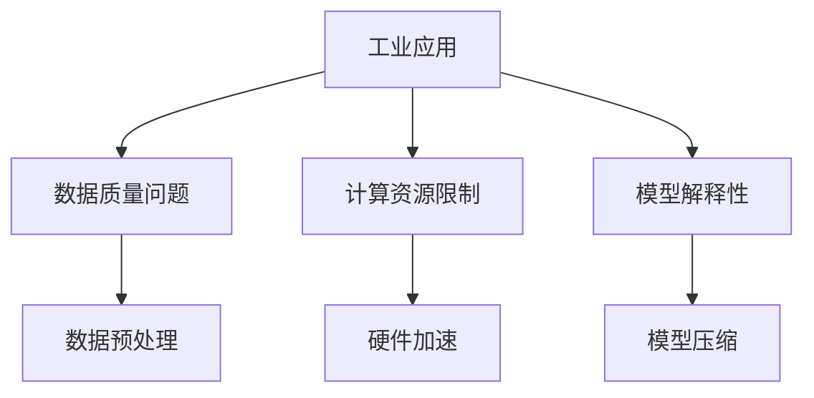

#### 核心算法原理讲解

下面我们使用伪代码来解释数据预处理的方法。

```python
# 输入：原始数据data
# 输出：预处理数据processed_data
processed_data = preprocess_data(data)

return processed_data
```

在上述伪代码中，`preprocess_data` 函数用于对原始数据进行标准化、缺失值填充等处理。

#### 数学模型与公式讲解

数据预处理的核心在于对数据进行标准化，公式如下：

$$x_{\text{standardized}} = \frac{x - \mu}{\sigma}$$

其中，$x$ 是原始数据，$\mu$ 是均值，$\sigma$ 是标准差。

#### 举例说明

一个常见的工业应用案例是智能制造。假设我们有一个包含生产过程数据的深度学习模型，为了提高模型的性能和稳定性，我们需要对数据进行预处理，包括数据清洗、缺失值填充和标准化等操作。

#### 第15章：未来展望与趋势

深度学习作为人工智能的重要分支，正不断推动技术的进步和应用的创新。未来，深度学习将在以下几个方面展现出广阔的发展前景：

1. **神经网络结构创新**：随着计算能力和算法技术的发展，新的神经网络结构将不断涌现，以提高模型的性能和效率。
2. **迁移学习与元学习**：迁移学习和元学习将使得模型能够更快地适应新的任务，减少训练时间和计算资源的需求。
3. **深度学习在边缘计算中的应用**：边缘计算将使得深度学习模型能够在移动设备和嵌入式系统中运行，实现实时处理和智能决策。

#### 核心概念与联系

以下是深度学习未来展望与趋势的Mermaid流程图：

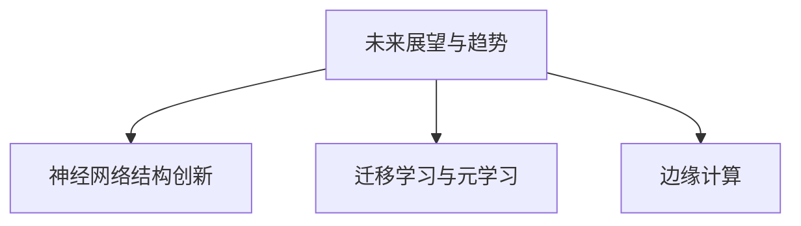

#### 核心算法原理讲解

下面我们使用伪代码来解释迁移学习的原理。

```python
# 输入：源任务模型source_model，目标任务数据target_data
# 输出：目标任务模型target_model
target_model = fine_tune_model(source_model, target_data)

return target_model
```

在上述伪代码中，`fine_tune_model` 函数用于将源任务模型应用于目标任务数据，并进行微调。

#### 数学模型与公式讲解

迁移学习的核心在于共享和调整模型参数，公式如下：

$$\mathcal{L} = \mathcal{L}_{\text{source}} + \lambda \mathcal{L}_{\text{target}}$$

其中，$\mathcal{L}_{\text{source}}$ 是源任务的损失函数，$\mathcal{L}_{\text{target}}$ 是目标任务

### 附录

#### 附录A：常用深度学习框架与工具

深度学习框架和工具是深度学习研究和应用的重要基础，以下是几种常用的深度学习框架和工具：

1. **TensorFlow**：由谷歌开发，具有丰富的API和广泛的社区支持。
2. **PyTorch**：由Facebook开发，具有动态计算图和强大的Python接口。
3. **Keras**：是一个高层次的深度学习API，可以与TensorFlow和PyTorch兼容。

#### 核心算法原理讲解

下面我们使用伪代码来解释TensorFlow模型构建的基本原理。

```python
import tensorflow as tf

# 定义模型
model = tf.keras.Sequential([
    tf.keras.layers.Dense(64, activation='relu', input_shape=(input_shape)),
    tf.keras.layers.Dense(64, activation='relu'),
    tf.keras.layers.Dense(1, activation='sigmoid')
])

# 编译模型
model.compile(optimizer='adam', loss='binary_crossentropy', metrics=['accuracy'])

# 训练模型
model.fit(X_train, y_train, epochs=epochs, batch_size=batch_size)

# 预测
predictions = model.predict(X_test)

return model, predictions
```

在上述伪代码中，`Dense` 层是全连接层，`Sequential` 模型是序列模型，`compile` 函数用于编译模型，`fit` 函数用于训练模型，`predict` 函数用于预测。

#### 数学模型与公式讲解

深度学习中的核心数学模型包括：

- **损失函数**：用于衡量模型预测值与真实值之间的差距，如均方误差（MSE）和交叉熵（Cross-Entropy）。
- **优化算法**：用于更新模型参数，如梯度下降（Gradient Descent）和Adam优化器。

损失函数的公式如下：

$$\mathcal{L} = \frac{1}{2} \sum_{i=1}^{n} (y_i - \hat{y}_i)^2$$

优化算法的更新公式如下：

$$w = w - \alpha \cdot \nabla_w \mathcal{L}$$

其中，$w$ 是模型参数，$\alpha$ 是学习率，$\nabla_w \mathcal{L}$ 是损失函数关于模型参数的梯度。

#### 举例说明

一个常见的深度学习应用案例是语音识别。假设我们有一个包含音频信号和文本标签的数据集，我们可以使用深度学习框架（如TensorFlow或PyTorch）来训练一个语音识别模型，从而实现对语音信号的准确识别。

