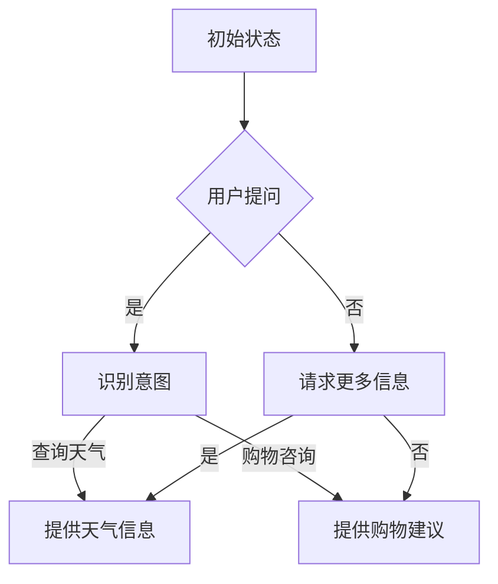

                 

### 第17章：创建具有人性化特征的聊天机器人

#### 17.1 引言

随着人工智能技术的迅猛发展，聊天机器人作为人工智能应用的一个重要领域，正逐渐渗透到人们日常生活的各个角落。从简单的信息查询到复杂的人工智能助手，聊天机器人的应用场景越来越丰富。然而，当前的聊天机器人仍然面临着一些挑战，比如缺乏人性化特征、对话连贯性差等。为了解决这些问题，创建具有人性化特征的聊天机器人成为了研究者和开发者们的重要目标。

本章将深入探讨如何创建具有人性化特征的聊天机器人。我们将首先介绍人性化聊天机器人的核心概念，分析其与传统聊天机器人的区别，然后详细讲解人性化聊天机器人的技术架构、核心算法原理和数学模型，最后通过项目实战来展示如何实现一个具有人性化特征的聊天机器人。

本章将围绕以下主题展开：

1. **人性化定义**：明确人性化的含义，并讨论其在聊天机器人中的应用。
2. **技术架构**：介绍自然语言处理技术和个性化交互技术的应用。
3. **核心算法原理**：详细讲解生成式对话系统和对话管理算法。
4. **数学模型和公式**：展示用于情感分析和对话管理的数学模型和公式。
5. **项目实战**：通过实际项目案例来展示人性化聊天机器人的实现过程。
6. **性能优化与调优**：讨论如何提升聊天机器人的性能。
7. **应用场景与未来展望**：探讨人性化聊天机器人的应用领域和未来发展趋势。

#### 17.2 聊天机器人发展的现状与趋势

聊天机器人技术起源于自然语言处理（NLP）和人工智能（AI）的快速发展。早期的聊天机器人主要以规则为基础，通过预定义的规则来生成回应。随着技术的进步，基于机器学习和深度学习的生成式对话系统逐渐成为主流，使得聊天机器人的对话能力得到了显著提升。

当前，聊天机器人已经广泛应用于各个领域，包括企业客服、客户支持、在线教育、医疗咨询、金融服务等。这些聊天机器人不仅能够提供快速、准确的服务，还能根据用户的历史行为和偏好进行个性化推荐，从而提高用户体验。

从发展趋势来看，未来的聊天机器人将更加注重人性化特征。具体表现在以下几个方面：

1. **情感模拟**：通过情感分析技术，聊天机器人能够识别用户的情感状态，并生成相应的情感回应，如安慰、鼓励或调侃。
2. **个性化交互**：通过用户数据分析，聊天机器人能够根据用户的兴趣、偏好和行为进行个性化交互，提供更加个性化的服务。
3. **多模态交互**：未来的聊天机器人将不仅限于文本交互，还将支持语音、图像、视频等多种模态，实现更加丰富的交互体验。

此外，随着5G、物联网和边缘计算等技术的发展，聊天机器人的应用场景将进一步扩大。例如，在智能家居领域，聊天机器人可以通过语音交互来控制家居设备，实现智能化的家庭生活。在工业4.0领域，聊天机器人可以协助工厂工人进行设备维护和故障诊断，提高生产效率。

总的来说，人性化特征的引入将使聊天机器人更加贴近人类的交流方式，提升用户满意度，从而在未来的智能应用中发挥更加重要的作用。

#### 17.3 读者对象

本章节旨在为那些对创建具有人性化特征的聊天机器人感兴趣的读者提供全面的技术指导和深入的理论分析。首先，对于那些有志于探索人工智能领域的研究人员和技术人员，本章节将提供必要的理论基础和实战经验，帮助他们了解人性化特征在聊天机器人中的应用。无论是学术界还是产业界，无论是研究员还是开发工程师，都能在本章节中找到有价值的信息。

其次，对于那些希望在客户服务、智能助手、在线教育等领域应用聊天机器人的企业和组织，本章节将详细讲解人性化特征如何提升用户体验，以及实现这些特征所需的步骤和技术。通过本章节，读者可以学习到如何设计和开发一个具有高度人性化特征的聊天机器人，从而在竞争激烈的市场中脱颖而出。

最后，本章节也将适合那些对技术趋势和未来发展方向感兴趣的读者。通过对人性化聊天机器人的深入探讨，读者可以了解这一领域的前沿动态，为未来的研究和开发提供方向。

总之，无论您是初学者还是有经验的专业人士，只要您对人工智能和聊天机器人技术感兴趣，本章节都将为您提供一个全面、深入的视角，帮助您掌握这一前沿技术。

### 2.1 人性化定义

人性化，简单来说，是指产品、系统或服务在设计和运作过程中，能够模拟或适应人类的行为、情感和认知特点。在聊天机器人领域，人性化意味着机器人能够理解并响应人类的情感需求，具备一定的情感智能，从而与用户建立更加自然和贴近真实的交流体验。

首先，人性化聊天机器人的一个关键特征是情感识别和模拟。这意味着机器人能够通过自然语言处理技术（如情感分析）识别用户的情感状态，并生成相应的情感回应。例如，当用户表达出沮丧或愤怒的情感时，机器人可以生成安慰或劝解的回应，从而缓解用户的负面情绪。

其次，人性化聊天机器人应具备一定的自我学习能力。通过用户交互数据的学习，机器人能够不断优化其对话策略，提高对用户需求的准确理解和回应能力。这种学习不仅限于表面的信息，还包括对用户情绪、偏好和习惯的深入理解。

此外，人性化特征还体现在对话的自然性和连贯性上。理想的聊天机器人应当能够理解用户的意图，并在此基础上生成连贯、自然的对话回应，避免出现生硬或重复的对话。例如，当用户提出一个复杂问题时，机器人应能够通过多轮对话来逐步澄清问题，并提供详细的解答。

总的来说，人性化聊天机器人的定义不仅仅局限于技术层面，更涉及到对人类交流方式的深刻理解。通过模拟人类的情感、学习和认知特点，人性化聊天机器人能够为用户提供更加自然、温暖和高效的交流体验。

#### 2.2 人性化特征在聊天机器人中的应用

人性化特征在聊天机器人中的应用不仅提升了用户体验，还显著增强了机器人的互动效果和用户满意度。以下是几个关键的人性化特征及其具体应用：

**1. 情感识别与回应**

情感识别与回应是人性化聊天机器人的核心特征之一。通过自然语言处理技术，机器人能够识别用户文本中的情感倾向，如愉悦、悲伤、愤怒等。在此基础上，机器人可以生成相应的情感回应，使对话更加自然和温暖。例如，当用户表达出沮丧的情感时，机器人可以生成安慰的回应，如“我在这里，你并不孤单”或“别难过，一切都会好起来的”。

**2. 自我学习与个性化交互**

人性化聊天机器人应具备自我学习能力，通过分析用户的交互历史和行为数据，不断优化对话策略。这种个性化交互使得机器人能够更好地理解用户的需求和偏好。例如，用户多次询问天气情况时，机器人可以自动记住用户的喜好，并主动提供定制化的天气信息。

**3. 自然语言理解与生成**

自然语言处理技术的进步使得聊天机器人能够更准确地理解用户的自然语言输入，并生成符合语境的回应。这包括理解用户意图、提取关键信息、生成连贯的对话内容等。例如，当用户询问某个具体的知识问题时，机器人可以通过数据库检索和自然语言生成技术，提供详细且相关的答案。

**4. 上下文感知与多轮对话**

人性化聊天机器人需要具备上下文感知能力，能够理解对话中的上下文信息，并进行有效的多轮对话。这意味着机器人可以在多个回合中与用户进行交流，逐步澄清问题和提供详细的解答。例如，用户可能先提出一个一般性的问题，然后通过后续的提问来获取更具体的信息，机器人应能够跟上用户的思路，并逐步提供针对性的回答。

**5. 情境模拟与互动体验**

情境模拟是人性化聊天机器人的一项高级功能，通过模拟现实生活中的互动场景，机器人能够提供更加生动和互动的交流体验。例如，在教育辅导场景中，机器人可以模拟老师与学生之间的互动，提供个性化的学习建议和反馈，从而提高学生的学习效果。

总的来说，人性化特征的应用使聊天机器人不仅仅是简单的信息查询工具，而是一个能够理解用户需求、感知用户情感、具备自我学习能力的人工智能助手。通过这些人性化特征，聊天机器人能够与用户建立更加自然和融洽的交流关系，提升整体用户体验。

#### 2.3 人性化聊天机器人与传统聊天机器人的区别

人性化聊天机器人与传统聊天机器人之间存在显著的区别，主要体现在技术实现、功能和应用效果等方面。

**1. 技术实现**

传统聊天机器人主要基于规则和模板，通过预定义的规则和模板来生成回应。这些方法虽然简单高效，但在处理复杂对话和灵活应对用户需求方面存在局限。而人性化聊天机器人则更多地依赖于自然语言处理（NLP）和深度学习技术。具体来说，人性化聊天机器人采用了词嵌入、序列模型和注意力机制等先进技术，使其在理解和生成自然语言方面具备了更高的准确性和灵活性。

**2. 功能**

传统聊天机器人通常只能进行简单的信息查询和基础对话，缺乏对用户情感和需求的深入理解。人性化聊天机器人则通过情感识别、个性化交互和上下文感知等能力，能够更好地理解用户的情感状态、历史行为和当前需求，从而生成更加自然、贴切的回应。例如，当用户表达出沮丧的情感时，人性化聊天机器人可以生成安慰或劝解的回应，而传统聊天机器人则可能无法识别或适当回应这些情感。

**3. 应用效果**

传统聊天机器人在处理特定任务时表现出色，但在复杂场景中，其表现往往不尽如人意。人性化聊天机器人则通过模拟人类交流方式，提升了对话的自然性和连贯性，从而在应用效果上更为显著。例如，在企业客服领域，人性化聊天机器人可以通过情感模拟和个性化交互，提高用户的满意度和体验，而传统聊天机器人则可能因为缺乏情感理解和回应能力，导致用户体验不佳。

**4. 应用场景**

传统聊天机器人主要应用于一些标准化、流程化的场景，如在线客服、信息查询等。人性化聊天机器人则适用于更加多样化的场景，包括教育辅导、医疗咨询、娱乐休闲等。这是因为人性化聊天机器人能够更好地理解用户需求，提供个性化的服务，从而在更多领域发挥其优势。

**总结**

人性化聊天机器人与传统聊天机器人在技术实现、功能和应用效果等方面存在显著差异。人性化聊天机器人通过引入自然语言处理、情感识别和个性化交互等技术，使其具备了更高的灵活性和适应性，能够在复杂、多样化的场景中提供更加自然、高效的交流体验。随着技术的不断进步，人性化聊天机器人将在更多领域得到应用，并成为人工智能发展的重要方向。

### 3.1 技术架构概述

人性化聊天机器人的技术架构是其实现高效、自然交互的关键。该架构主要由自然语言处理（NLP）技术和个性化交互技术组成，通过这两大模块的协同工作，实现机器人在情感识别、对话生成和用户理解等方面的卓越性能。下面将详细介绍这两个技术模块的具体组成和应用。

**自然语言处理技术**

自然语言处理技术是人造系统对自然语言进行理解与生成的一种技术，它在人性化聊天机器人中扮演着核心角色。自然语言处理技术主要包括以下几个子模块：

- **词嵌入（Word Embedding）**：词嵌入是将词汇映射为固定长度的向量表示，便于计算机处理。通过词嵌入，机器人可以理解词汇之间的语义关系，从而生成更加自然的对话。

- **序列模型（Sequence Model）**：序列模型用于处理文本和语音等序列数据，如循环神经网络（RNN）和长短期记忆网络（LSTM）。这些模型能够捕捉到输入文本的序列信息，从而生成连贯的对话回应。

- **注意力机制（Attention Mechanism）**：注意力机制是一种提高序列模型处理效率的方法，它能够使模型在生成回应时关注重要的信息。通过注意力机制，机器人可以更好地理解用户输入，生成更加精确和相关的回应。

**个性化交互技术**

个性化交互技术是人机交互中的一项重要创新，它使得机器人能够根据用户的历史行为、情感状态和偏好进行个性化交互，从而提升用户体验。个性化交互技术主要包括以下几个子模块：

- **用户数据分析（User Data Analysis）**：用户数据分析模块负责收集和分析用户的历史交互数据，如用户的偏好、行为和情感状态。通过这些数据，机器人可以了解用户的需求和偏好，为个性化交互提供基础。

- **情感分析（Sentiment Analysis）**：情感分析模块用于识别用户文本中的情感倾向，如愉悦、悲伤、愤怒等。通过情感分析，机器人可以生成情感相符的回应，提高对话的温暖度和自然性。

- **情感模拟（Emotion Simulation）**：情感模拟模块负责生成情感化的回应，使机器人在对话中能够表现出相应的情感状态。例如，当用户表达出沮丧的情感时，机器人可以生成安慰或鼓励的回应。

**技术模块之间的协同作用**

人性化聊天机器人的技术架构通过自然语言处理技术和个性化交互技术的协同工作，实现了高度的人性化交互。具体来说，自然语言处理技术负责理解用户输入，生成初步的回应；个性化交互技术则根据用户的历史数据和情感状态，对初步回应进行优化，使其更加符合用户的情感和需求。

这种协同作用不仅提升了对话的自然性和连贯性，还使得机器人能够更好地理解和预测用户的需求，从而提供个性化的服务。例如，在教育辅导场景中，机器人可以通过情感模拟和个性化交互，提供针对性的学习建议和反馈，从而提高学习效果。

总之，人性化聊天机器人的技术架构通过自然语言处理技术和个性化交互技术的结合，实现了高度的人性化交互。这种架构不仅提升了对话的质量，还为未来的人性化人工智能应用提供了新的思路和方向。

#### 3.2 自然语言处理技术

自然语言处理技术（NLP）是构建人性化聊天机器人的核心组件之一，它使得机器人能够理解和生成人类语言，从而实现自然、高效的交流。NLP技术主要包括词嵌入（Word Embedding）、序列模型（Sequence Model）和注意力机制（Attention Mechanism）等。以下将详细探讨这些技术的工作原理和应用。

**3.2.1 词嵌入**

词嵌入（Word Embedding）是一种将文本数据转换为固定长度向量的方法。通过词嵌入，词汇被映射到低维向量空间中，使得计算机能够处理和理解语义信息。词嵌入的工作原理基于词汇的上下文信息，通过学习大量语料库中的词频和词与词之间的共现关系，将每个词表示为一个稠密的向量。

例如，使用Word2Vec算法，每个词可以表示为一个实值向量，这些向量在语义空间中接近的词具有相似的含义。例如，“狗”和“猫”的词向量可能接近，因为它们都属于动物类别。词嵌入的应用包括词汇映射、文本分类、情感分析等。在聊天机器人中，词嵌入用于理解用户的输入文本，从而生成合适的回应。

**3.2.2 序列模型**

序列模型（Sequence Model）用于处理输入序列数据，如文本、语音等。这些模型通过学习输入序列的模式和关系，生成序列输出，如对话回应。常见的序列模型包括循环神经网络（RNN）和长短期记忆网络（LSTM）。

RNN能够处理序列数据，但其存在长期依赖问题，即难以捕捉远距离的依赖关系。为了解决这个问题，LSTM被提出，它通过引入门控机制，有效地捕捉长期依赖关系。LSTM在聊天机器人中的应用包括文本生成、对话理解等。例如，LSTM可以用来理解用户的问题，并根据上下文生成相应的答案。

**3.2.3 注意力机制**

注意力机制（Attention Mechanism）是一种用于提高序列模型处理效率的方法。通过注意力机制，模型可以在生成回应时关注重要的信息，从而提高对话的精确性和自然性。

注意力机制的基本思想是，在处理序列数据时，模型可以动态地分配不同的关注权重给序列中的每个元素。例如，在生成对话回应时，模型可以更关注用户输入中的关键信息，而忽略无关或次要的信息。这种动态关注机制使得模型能够更好地理解用户的意图和上下文，生成更加准确和自然的回应。

在聊天机器人中，注意力机制的应用包括对话理解、文本生成等。例如，通过注意力机制，机器人可以更准确地理解用户的提问，并生成详细的回答，而不仅仅是简单的回答。

**综合应用**

自然语言处理技术在聊天机器人中的综合应用，使得机器人能够理解和生成人类语言，从而实现自然、高效的交流。通过词嵌入，机器人可以理解词汇的语义关系；通过序列模型，机器人可以处理复杂的对话数据；通过注意力机制，机器人可以动态关注重要的信息，生成更加自然和相关的回应。

总之，自然语言处理技术为构建人性化聊天机器人提供了强大的工具。通过词嵌入、序列模型和注意力机制等技术的结合，机器人能够更好地理解用户需求，提供个性化、自然的服务，从而提升用户体验。

### 3.2.1 词嵌入

词嵌入（Word Embedding）是将文本数据转换为固定长度向量的方法，它在自然语言处理中扮演着至关重要的角色。通过词嵌入，词汇被映射到低维向量空间中，使得计算机能够处理和理解语义信息。词嵌入的工作原理基于词汇的上下文信息，通过学习大量语料库中的词频和词与词之间的共现关系，将每个词表示为一个稠密的向量。

**词嵌入的原理**

词嵌入的基本原理是通过学习词汇在语境中的相似性和差异性来生成词向量。具体来说，词嵌入算法通过分析大量文本数据，捕捉词汇在上下文中的语义关系。一个词的词向量不仅反映了该词本身的语义，还包括了它在各种上下文中的语义特征。例如，通过词嵌入算法，“猫”和“狗”这两个词可能会被映射到语义空间中接近的位置，因为它们都是动物的名称。

常见的词嵌入算法包括Word2Vec、GloVe和FastText等。Word2Vec算法通过训练词袋模型（CBOW或Skip-gram模型），基于词的上下文来生成词向量。GloVe（Global Vectors for Word Representation）算法则通过矩阵分解的方法，利用词汇的共现关系来生成词向量。FastText算法是一种基于子词（subword）的词嵌入方法，它通过将词汇分解为子词，利用子词的共现关系来生成词向量，从而提高了模型的泛化能力。

**词嵌入的应用**

词嵌入在自然语言处理中有着广泛的应用，包括词汇映射、文本分类、情感分析和聊天机器人等。在词汇映射中，词嵌入将词汇映射为向量，便于后续计算和处理。在文本分类中，词嵌入可以用于将文本数据转换为向量表示，从而进行分类任务。在情感分析中，词嵌入可以帮助识别文本中的情感倾向，如正面、负面或中性。

在聊天机器人中，词嵌入技术用于理解用户的输入文本，生成合适的回应。通过词嵌入，机器人可以捕捉到词汇之间的语义关系，从而在对话中生成更加自然和相关的回应。例如，当用户询问“你今天过得怎么样？”时，机器人可以通过词嵌入技术理解“今天”、“过得”和“怎么样”等词汇的语义，并生成相应的回应，如“还不错，谢谢关心。”

**词嵌入的优势**

词嵌入的优势在于其能够将高维的文本数据转换为低维的向量表示，从而简化了后续的计算和处理过程。此外，词嵌入能够捕捉到词汇在上下文中的语义关系，使得计算机能够更好地理解和生成人类语言。这使得聊天机器人在处理自然语言任务时，能够更加准确和自然地理解用户输入，并生成高质量的回应。

**实际案例**

一个实际的案例是Google的Word2Vec算法。Word2Vec算法通过对大量互联网文本进行训练，生成了数十亿个词汇的词向量。这些词向量可以用于各种自然语言处理任务，如文本分类、机器翻译和聊天机器人等。例如，在聊天机器人中，这些词向量可以帮助机器人理解用户输入中的词汇含义，从而生成更加准确和自然的回应。

总之，词嵌入是自然语言处理中的关键技术之一，它通过将文本数据转换为向量表示，使得计算机能够更好地理解和生成人类语言。在聊天机器人中，词嵌入技术用于理解用户的输入文本，生成高质量的回应，从而提升用户体验。

### 3.2.2 序列模型

序列模型（Sequence Model）是自然语言处理领域的关键技术，用于处理输入序列数据，如文本和语音。这些模型通过学习输入序列的模式和关系，生成序列输出，如对话回应。在聊天机器人中，序列模型是实现自然、连贯对话的核心组件。常见的序列模型包括循环神经网络（RNN）和长短期记忆网络（LSTM）。

**循环神经网络（RNN）**

循环神经网络（RNN）是处理序列数据的经典模型。RNN通过重复使用相同的网络单元（也称为“循环单元”），将前一个时间步的输出作为当前时间步的输入。这种结构使得RNN能够捕捉到序列数据中的时间依赖关系。

RNN的工作原理如下：假设输入序列为 \(x_1, x_2, ..., x_T\)，其中 \(T\) 是序列长度。RNN的隐藏状态 \(h_t\) 在每个时间步通过以下公式计算：

\[ h_t = \sigma(W_h \cdot [h_{t-1}, x_t] + b_h) \]

其中，\(W_h\) 和 \(b_h\) 分别是权重矩阵和偏置项，\(\sigma\) 是激活函数，如Sigmoid或Tanh。通过这种方式，RNN可以保留历史信息，并将其用于当前时间步的预测。

**长短期记忆网络（LSTM）**

尽管RNN能够捕捉到序列数据中的时间依赖关系，但存在长期依赖问题。为了解决这一问题，长短期记忆网络（LSTM）被提出。LSTM通过引入门控机制（gate mechanism），有效地捕捉长期依赖关系。

LSTM的基本结构包括三个门控单元：遗忘门（forget gate）、输入门（input gate）和输出门（output gate）。这些门控单元通过以下公式工作：

- **遗忘门**：决定在当前时间步丢弃哪些历史信息。其公式为：

  \[ f_t = \sigma(W_f \cdot [h_{t-1}, x_t] + b_f) \]

  其中，\(f_t\) 表示遗忘门的输出。

- **输入门**：决定如何更新当前时间步的隐藏状态。其公式为：

  \[ i_t = \sigma(W_i \cdot [h_{t-1}, x_t] + b_i) \]

  其中，\(i_t\) 表示输入门的输出。

- **输出门**：决定当前时间步的隐藏状态。其公式为：

  \[ o_t = \sigma(W_o \cdot [h_{t-1}, x_t] + b_o) \]

  其中，\(o_t\) 表示输出门的输出。

通过这些门控单元，LSTM能够在当前时间步保留重要的历史信息，同时遗忘不重要的信息。

**LSTM在聊天机器人中的应用**

在聊天机器人中，LSTM可以用于多种任务，包括对话生成、文本分类和情感分析等。例如，通过LSTM模型，聊天机器人可以理解用户的历史输入，并生成连贯的自然语言回应。

**例子：**

考虑一个简化的LSTM模型，用于生成对话回应。输入序列为用户的提问，输出序列为机器人的回答。LSTM模型首先通过输入门和遗忘门更新隐藏状态，然后通过输出门生成对话回应。

1. **初始化状态**：设置隐藏状态 \(h_0\) 和细胞状态 \(c_0\)。

2. **处理输入序列**：对于每个输入 \(x_t\)，通过遗忘门、输入门和输出门更新隐藏状态和细胞状态。

3. **生成回应**：利用最终的隐藏状态 \(h_T\) 生成对话回应。

伪代码如下：

```
# 初始化参数
W_f, b_f = ...   # 遗忘门权重和偏置
W_i, b_i = ...   # 输入门权重和偏置
W_o, b_o = ...   # 输出门权重和偏置

# 初始化隐藏状态和细胞状态
h_0 = np.zeros((1, hidden_size))
c_0 = np.zeros((1, hidden_size))

# 遗忘门、输入门和输出门更新
for t in range(T):
    f_t = sigmoid(W_f * [h_{t-1}, x_t] + b_f)
    i_t = sigmoid(W_i * [h_{t-1}, x_t] + b_i)
    o_t = sigmoid(W_o * [h_{t-1}, x_t] + b_o)

    # 更新细胞状态
    c_t = f_t * c_{t-1} + i_t * tanh(W_c * [h_{t-1}, x_t] + b_c)

    # 更新隐藏状态
    h_t = o_t * tanh(c_t)

# 生成回应
y = softmax(W_y * h_T + b_y)
```

通过这种简化的LSTM模型，聊天机器人可以处理用户的提问，并生成相应的回答。在实际应用中，LSTM模型可能需要结合其他技术和算法，如注意力机制和生成式对话系统，以实现更加自然的对话生成。

总之，序列模型（特别是LSTM）在聊天机器人中发挥着重要作用。通过捕捉输入序列的时间依赖关系，LSTM能够生成连贯、自然的对话回应，从而提升用户体验。

### 3.2.3 注意力机制

注意力机制（Attention Mechanism）是自然语言处理领域中的一项关键技术，通过提高模型在处理序列数据时的效率，使得模型能够更加关注重要的信息，从而生成更加准确和自然的回应。注意力机制在聊天机器人中的应用尤其显著，能够显著提升对话的质量和用户体验。

**注意力机制的基本原理**

注意力机制的核心思想是让模型在生成回应时，动态地分配不同的关注权重给输入序列中的每个元素。这样，模型可以更关注重要的信息，从而提高对输入的全面理解和准确回应。注意力机制通过计算一个注意力分数，为输入序列中的每个元素分配权重，然后将这些加权输入进行聚合，生成最终的输出。

注意力机制通常可以分为两种类型：软注意力（Soft Attention）和硬注意力（Hard Attention）。

- **软注意力**：在软注意力中，模型为每个输入元素计算一个连续的注意力分数，并通过指数函数将其转换为概率分布。模型根据这个概率分布对输入进行加权聚合。软注意力机制通常使用一个标量函数来计算注意力分数，如缩放点积注意力（Scaled Dot-Product Attention）。

  伪代码示例：

  ```
  # 输入序列 [q, s]
  # 初始隐藏状态 h
  # 生成注意力分数
  attention_scores = softmax(q @ s.T)

  # 加权聚合输入
  context_vector = attention_scores @ h
  ```

- **硬注意力**：硬注意力机制通过选择输入序列中具有最高注意力分数的元素，生成最终的输出。这种方法通常用于视觉注意力模型中，通过在图像中定位关键区域来提高模型的识别能力。

  伪代码示例：

  ```
  # 输入序列 [q, s]
  # 初始隐藏状态 h
  # 选择具有最高注意力分数的元素
  context_vector = h[np.argmax(q @ s.T)]
  ```

**注意力机制在聊天机器人中的应用**

注意力机制在聊天机器人中有着广泛的应用，主要用于对话理解、文本生成和情感分析等方面。

1. **对话理解**：在对话理解中，注意力机制可以帮助模型更好地捕捉用户输入中的关键信息。例如，在处理复杂问题或多轮对话时，模型可以关注问题的核心部分，忽略无关的信息，从而生成更加精准和相关的回应。

2. **文本生成**：在文本生成任务中，注意力机制能够提高模型生成回应的连贯性和自然性。例如，在生成式对话系统中，注意力机制可以使模型在生成回应时，更关注上下文信息和用户的意图，从而生成连贯、自然的对话内容。

3. **情感分析**：在情感分析中，注意力机制可以帮助模型识别文本中的情感倾向。通过关注情感相关的词汇和句子，模型可以更准确地判断文本的情感状态，从而生成情感相符的回应。

**示例：缩放点积注意力（Scaled Dot-Product Attention）**

缩放点积注意力是一种常用的软注意力机制，通过缩放点积操作来计算注意力分数。具体来说，缩放点积注意力通过以下公式计算注意力分数：

\[ \text{Attention Scores} = \text{softmax} \left( \frac{q^T \cdot K}{\sqrt{d_k}} \right) \]

其中，\(q\) 是查询向量，\(K\) 是关键值向量，\(d_k\) 是关键值的维度。通过缩放操作，模型可以更好地捕捉输入序列中的长距离依赖关系。

伪代码示例：

```
# 输入序列 [q, K, V]
# 查询向量 q
# 关键值向量 K
# 关键值维度 d_k

# 缩放点积操作
scaled_attention_scores = softmax(q @ K.T / sqrt(d_k))

# 加权聚合输入
context_vector = scaled_attention_scores @ V

# 生成回应
response = V @ context_vector
```

通过这种方式，注意力机制使得模型能够更加关注重要的信息，从而生成更加准确和自然的对话回应。在实际应用中，注意力机制可以根据具体任务的需求进行适当调整和优化，以实现最佳效果。

总之，注意力机制通过动态分配关注权重，提高了模型在处理序列数据时的效率和理解能力。在聊天机器人中，注意力机制的应用不仅提升了对话的质量和用户体验，还为自然语言处理领域带来了新的发展机遇。

### 3.3 个性化交互技术

个性化交互技术是人性化聊天机器人的重要组成部分，它使得机器人能够根据用户的历史行为、情感状态和偏好进行个性化交互，从而提供更加贴心和高效的服务。个性化交互技术包括用户数据分析、情感分析和情感模拟等子模块。以下将分别介绍这些技术及其应用。

#### 3.3.1 用户数据分析

用户数据分析是人机交互中的一项关键技术，它通过收集和分析用户的历史数据，如浏览记录、点击行为、聊天记录等，来了解用户的需求和偏好。用户数据分析的基本步骤包括数据收集、数据预处理、数据分析和数据可视化。

1. **数据收集**：用户数据分析的第一步是收集相关数据。这些数据可以来源于用户的操作日志、行为记录、偏好设置等。例如，用户在聊天机器人中的提问、点击行为和情感表达都可以被记录下来。

2. **数据预处理**：收集到的数据通常需要经过清洗、去噪和标准化等预处理步骤，以便后续分析。例如，去除重复记录、填补缺失值、将不同类型的数据转换为同一维度等。

3. **数据分析**：在预处理完成后，可以通过统计分析和机器学习算法对用户数据进行分析。常见的分析方法包括聚类分析、关联规则挖掘、用户行为预测等。例如，通过聚类分析，可以将具有相似行为的用户分为不同的群体；通过关联规则挖掘，可以找出用户行为之间的相关性；通过用户行为预测，可以预测用户的下一步操作。

4. **数据可视化**：数据分析的结果通常需要通过可视化手段进行展示，以便用户和开发者更好地理解和利用这些数据。常见的可视化方法包括图表、报表和交互式可视化工具等。

**用户数据分析的应用**：用户数据分析在聊天机器人中的应用非常广泛。通过分析用户的历史数据，机器人可以更好地了解用户的需求和偏好，从而提供个性化的服务。例如：

- **个性化推荐**：通过分析用户的浏览记录和点击行为，机器人可以推荐用户可能感兴趣的内容，如商品、新闻和活动等。
- **个性化对话**：通过分析用户的提问和回应，机器人可以生成更加符合用户需求的对话内容，提高用户满意度。
- **行为预测**：通过分析用户的历史行为，机器人可以预测用户的下一步操作，从而提供主动服务，如提醒用户购买未完成的购物车商品。

#### 3.3.2 情感分析

情感分析（Sentiment Analysis）是自然语言处理领域的一个重要分支，它通过识别文本中的情感倾向，如正面、负面或中性，来分析用户的情感状态。情感分析的基本步骤包括文本预处理、特征提取和情感分类。

1. **文本预处理**：文本预处理是情感分析的第一步，包括去除停用词、标点符号、词干提取和词性标注等。通过这些步骤，可以将原始文本转换为更适合分析的形式。

2. **特征提取**：特征提取是将文本数据转换为数值特征表示的过程。常见的特征提取方法包括词袋模型（Bag of Words）、词嵌入（Word Embedding）和TF-IDF（Term Frequency-Inverse Document Frequency）等。

3. **情感分类**：情感分类是情感分析的核心步骤，通过训练分类模型（如朴素贝叶斯、支持向量机、深度神经网络等）来预测文本的情感倾向。情感分类的结果可以用于分析用户的情感状态，如喜悦、愤怒、悲伤等。

**情感分析的应用**：情感分析在聊天机器人中有着广泛的应用。通过情感分析，机器人可以更好地理解用户的情感状态，从而提供更加贴心和人性化的服务。例如：

- **情感回应**：当用户表达出情感时，机器人可以生成情感相符的回应，如安慰、鼓励或调侃，从而缓解用户的负面情绪。
- **情感监控**：通过监控用户的情感状态，机器人可以及时发现用户的情绪变化，并采取相应的措施，如提供情感支持或引导用户进行心理辅导。
- **个性化推荐**：通过分析用户的情感状态，机器人可以推荐用户可能感兴趣的内容，从而提高用户满意度。

#### 3.3.3 情感模拟

情感模拟（Emotion Simulation）是人性化聊天机器人的高级功能，它通过生成情感化的回应，使机器人在对话中表现出相应的情感状态。情感模拟通常基于情感分析和自然语言生成（NLG）技术。

1. **情感识别**：情感识别是情感模拟的第一步，通过情感分析技术识别用户文本中的情感倾向。例如，当用户表达出喜悦的情感时，机器人可以识别并标记为“喜悦”。

2. **情感生成**：在识别用户的情感后，情感模拟模块会根据情感类型生成相应的情感回应。情感生成可以通过模板匹配、规则引擎或生成式对话系统实现。

3. **自然语言生成**：自然语言生成是将情感回应转换为自然语言文本的过程。通过自然语言生成技术，机器人可以生成情感丰富、自然流畅的对话内容。

**情感模拟的应用**：情感模拟在聊天机器人中有着广泛的应用，可以显著提升用户体验。例如：

- **情感化客服**：在企业客服场景中，机器人可以通过情感模拟，生成情感化的回应，如安慰、鼓励或调侃，从而提高用户的满意度和信任感。
- **教育辅导**：在教育辅导场景中，机器人可以通过情感模拟，提供情感化的反馈和鼓励，帮助用户克服学习困难，提高学习效果。
- **心理健康咨询**：在心理健康咨询场景中，机器人可以通过情感模拟，生成情感化的回应，如安慰、理解和支持，为用户提供情感支持。

总之，个性化交互技术通过用户数据分析、情感分析和情感模拟，使得聊天机器人能够更好地理解用户需求，提供个性化、人性化的服务，从而提升用户体验。

### 3.4 人性化聊天机器人的技术架构

人性化聊天机器人的技术架构是一个复杂而多层次的结构，它集成了多种先进的自然语言处理（NLP）技术和个性化交互技术，以实现高度人性化的交互体验。以下将详细探讨这一技术架构的各个组成部分，包括自然语言处理技术和个性化交互技术的具体应用。

**自然语言处理技术**

自然语言处理技术是人机交互的核心，用于理解和生成人类语言。人性化聊天机器人的技术架构中，自然语言处理技术主要包括以下几个关键模块：

1. **词嵌入（Word Embedding）**：词嵌入是将文本数据转换为固定长度的向量表示的方法。通过词嵌入，词汇被映射到低维向量空间中，使得计算机能够理解词汇的语义关系。词嵌入技术使得聊天机器人能够更好地理解和生成自然语言。例如，在用户提问“你今天过得怎么样？”时，词嵌入技术可以帮助机器人识别出关键词“今天”和“过得”，并理解它们在句子中的语义。

2. **序列模型（Sequence Model）**：序列模型用于处理输入序列数据，如文本和语音。这些模型通过学习输入序列的模式和关系，生成序列输出，如对话回应。常见的序列模型包括循环神经网络（RNN）和长短期记忆网络（LSTM）。序列模型在人性化聊天机器人中的应用，使得机器人能够理解用户的历史输入和上下文信息，生成更加连贯和自然的回应。

3. **注意力机制（Attention Mechanism）**：注意力机制是一种用于提高序列模型处理效率的方法，它使模型在生成回应时关注重要的信息。注意力机制通过动态分配关注权重给输入序列中的每个元素，从而提高对话的准确性和自然性。例如，在处理复杂问题或多轮对话时，注意力机制可以帮助机器人更好地理解用户的核心问题，并生成更加精准的答案。

**个性化交互技术**

个性化交互技术是人机交互中的创新，它使得聊天机器人能够根据用户的历史行为、情感状态和偏好进行个性化交互，从而提供更加贴心和高效的服务。人性化聊天机器人的技术架构中，个性化交互技术主要包括以下几个关键模块：

1. **用户数据分析（User Data Analysis）**：用户数据分析是通过收集和分析用户的历史数据，如浏览记录、点击行为和聊天记录等，来了解用户的需求和偏好。通过用户数据分析，聊天机器人可以生成个性化的对话内容和推荐。例如，用户在聊天过程中表现出对某个话题的浓厚兴趣，机器人可以根据这一信息提供更多相关内容。

2. **情感分析（Sentiment Analysis）**：情感分析是通过识别文本中的情感倾向，如正面、负面或中性，来分析用户的情感状态。情感分析技术使得机器人能够理解用户的情感，生成情感化的回应。例如，当用户表达出沮丧的情感时，机器人可以生成安慰或鼓励的回应，从而缓解用户的负面情绪。

3. **情感模拟（Emotion Simulation）**：情感模拟是通过生成情感化的回应，使机器人在对话中表现出相应的情感状态。情感模拟技术使得聊天机器人能够模拟人类的情感表达，提高对话的自然性和温暖度。例如，当用户提出一个有趣的问题时，机器人可以通过情感模拟，生成幽默或调侃的回应，从而营造轻松愉快的对话氛围。

**技术模块之间的协同工作**

人性化聊天机器人的技术架构通过自然语言处理技术和个性化交互技术的协同工作，实现了高度的人性化交互。自然语言处理技术负责理解和生成自然语言，而个性化交互技术则负责根据用户的历史数据、情感状态和偏好进行个性化交互。

具体来说，自然语言处理技术首先通过词嵌入、序列模型和注意力机制等技术，理解用户输入的语义和上下文信息。然后，个性化交互技术通过用户数据分析、情感分析和情感模拟等模块，对初步生成的回应进行优化和调整，使其更加符合用户的情感和需求。

这种协同工作不仅提升了对话的自然性和连贯性，还使得机器人能够更好地理解和预测用户的需求，提供个性化的服务。例如，在教育辅导场景中，机器人可以通过情感模拟和个性化交互，提供针对性的学习建议和反馈，从而提高学生的学习效果。

总之，人性化聊天机器人的技术架构通过自然语言处理技术和个性化交互技术的结合，实现了高度的人性化交互。这种架构不仅提升了对话的质量，还为未来的人性化人工智能应用提供了新的思路和方向。

### 4.1 生成式对话系统算法

生成式对话系统算法是人性化聊天机器人的核心技术之一，它通过模拟人类的对话过程，生成自然、连贯且符合上下文的回应。生成式对话系统可以分为基于规则、基于模板和基于机器学习等不同类型，每种类型都有其独特的实现方法和优缺点。

#### 4.1.1 基于规则的对话系统

基于规则的对话系统（Rule-Based Dialogue System）是最简单的生成式对话系统，它通过预定义的规则和条件来生成回应。这种系统的核心在于规则的编写，规则通常由一组条件和相应的动作组成。

**实现方法**：

1. **条件匹配**：系统首先分析用户的输入，并将其与预定义的规则库进行匹配。条件可以是简单的文本匹配，也可以是复杂的模式匹配。
2. **动作执行**：当用户输入与某个规则匹配时，系统执行该规则中定义的动作，生成相应的回应。

**优点**：

- **简单易懂**：基于规则的系统易于实现和理解，对于简单和标准化的对话场景非常适用。
- **可解释性**：规则的透明性使得系统容易进行调试和优化。

**缺点**：

- **灵活性差**：基于规则的系统难以处理复杂和未预见的对话场景，规则库需要不断更新和维护。
- **对话连贯性差**：由于规则是预定义的，生成的回应可能缺乏上下文连贯性。

#### 4.1.2 基于模板的对话系统

基于模板的对话系统（Template-Based Dialogue System）通过预定义的模板来生成回应。模板通常包含固定的文本结构和变量，变量部分用于填充用户输入的相关信息。

**实现方法**：

1. **模板匹配**：系统根据用户的输入，从模板库中选择一个最匹配的模板。
2. **变量填充**：将用户输入的信息填充到模板的变量部分，生成最终的回应。

**优点**：

- **灵活性较高**：基于模板的系统可以通过变量填充，实现一定程度的个性化交互。
- **对话连贯性较好**：模板中的固定结构和上下文信息有助于保持对话的连贯性。

**缺点**：

- **模板库维护复杂**：模板库需要不断更新和维护，以适应不同的对话场景。
- **自然性不足**：模板生成的回应可能缺乏自然流畅性，难以模拟人类对话的真实感。

#### 4.1.3 基于机器学习的对话系统

基于机器学习的对话系统（Machine Learning-Based Dialogue System）利用深度学习和自然语言处理技术，自动生成对话回应。这种系统通常基于大量的对话数据，通过训练生成模型来预测用户的输入和相应的回应。

**实现方法**：

1. **数据预处理**：将对话数据转换为适合训练的格式，如文本序列或对话状态转移图。
2. **模型训练**：使用生成模型（如序列到序列模型、变分自编码器等）进行训练，学习如何生成符合上下文的对话回应。
3. **回应生成**：在对话过程中，系统根据用户的输入和当前对话状态，生成相应的回应。

**优点**：

- **高度灵活性**：基于机器学习的系统可以自动学习并适应各种对话场景，无需手动编写规则或模板。
- **自然性**：通过学习大量真实对话数据，生成模型可以生成更加自然和流畅的对话回应。

**缺点**：

- **训练成本高**：基于机器学习的系统需要大量的训练数据和计算资源。
- **解释性差**：模型的内部机制复杂，难以进行解释和调试。

**综合评价**

基于规则的对话系统适用于简单和标准化的对话场景，具有良好的可解释性和维护性。基于模板的对话系统则在保持对话连贯性方面具有优势，但自然性仍有一定局限。基于机器学习的对话系统在灵活性和自然性方面表现出色，但训练成本较高，且解释性较差。在实际应用中，可以根据对话场景的需求，选择合适的生成式对话系统类型，或者将不同类型的系统结合使用，以实现最佳效果。

### 4.2 对话管理算法

对话管理算法是人性化聊天机器人中至关重要的一环，它负责协调和管理对话流程，确保对话的连贯性、自然性和用户满意度。对话管理算法的核心任务是处理用户意图识别、对话状态追踪和对话流程控制。以下将详细探讨这些算法的实现方法及其在实际应用中的作用。

#### 4.2.1 用户意图识别

用户意图识别（User Intent Recognition）是对话管理算法的首要任务，其目标是从用户的输入中识别出用户的目的或需求。准确的意图识别能够帮助聊天机器人更好地理解用户，从而生成符合用户需求的回应。

**实现方法**：

1. **关键词匹配**：通过预定义的关键词库，匹配用户输入中的关键词，以识别用户意图。这种方法简单直观，但对于复杂和模糊的输入效果不佳。
2. **机器学习模型**：使用机器学习模型（如朴素贝叶斯、支持向量机、深度神经网络等）对用户输入进行分类，识别出用户的意图。这种方法能够处理更复杂的输入，并具有较好的泛化能力。

**示例：朴素贝叶斯模型**

假设用户输入“今天天气怎么样？”和“明天有没有雨？”，我们可以使用朴素贝叶斯模型进行意图识别。首先，将用户的输入转换为特征向量，然后根据训练好的模型，预测用户的意图。

伪代码示例：

```
# 加载训练好的朴素贝叶斯模型
model = load_naive_bayes_model()

# 用户输入
user_input = "今天天气怎么样？"

# 转换为特征向量
input_vector = preprocess_input(user_input)

# 预测意图
predicted_intent = model.predict(input_vector)
```

**实际应用**：用户意图识别在聊天机器人中有着广泛的应用。例如，在企业客服中，机器人可以通过意图识别，将用户的问题分类到不同的服务类别，从而快速找到相应的解决方案。

#### 4.2.2 对话状态追踪

对话状态追踪（Dialogue State Tracking）是确保对话连贯性的关键。其目标是在对话过程中，动态记录和更新对话的状态，以便在后续的对话回合中能够参考这些状态，生成更加符合上下文的回应。

**实现方法**：

1. **基于规则的状态追踪**：通过预定义的规则，记录和更新对话状态。这种方法简单，但灵活性较差。
2. **基于模型的对话状态追踪**：使用机器学习模型（如递归神经网络、长短期记忆网络等）来学习对话状态，并实时更新。这种方法能够处理复杂的对话状态，并具有较好的泛化能力。

**示例：递归神经网络**

假设我们使用递归神经网络（RNN）进行对话状态追踪。RNN能够通过处理历史对话状态，生成当前的对话状态。

伪代码示例：

```
# 初始化RNN模型
model = initialize_rnn_model()

# 历史对话状态
previous_states = []

# 当前用户输入
current_input = "明天有没有雨？"

# 计算当前状态
current_state = model.predict(current_input, previous_states)

# 更新历史状态
previous_states.append(current_state)
```

**实际应用**：对话状态追踪在多轮对话中尤为重要。例如，在购物聊天机器人中，机器人需要记录用户的购物偏好和历史订单，以便在后续的对话回合中，提供更加个性化的推荐和服务。

#### 4.2.3 对话流程控制

对话流程控制（Dialogue Flow Control）是确保对话流畅性和用户满意度的重要手段。其目标是在对话过程中，合理引导对话的方向和流程，避免对话陷入僵局或产生不必要的重复。

**实现方法**：

1. **基于规则的对话流程控制**：通过预定义的规则，控制对话的流程和方向。这种方法简单直观，但灵活性较差。
2. **基于模型的对话流程控制**：使用机器学习模型（如决策树、随机森林、深度神经网络等）来学习对话流程，并实时更新。这种方法能够处理复杂的对话流程，并具有较好的泛化能力。

**示例：决策树**

假设我们使用决策树进行对话流程控制。决策树能够通过分析用户输入和历史状态，决定下一步的对话动作。

伪代码示例：

```
# 加载训练好的决策树模型
model = load_decision_tree_model()

# 用户输入
current_input = "你今天去了哪里？"

# 当前状态
current_state = {"last_action": "ask_location"}

# 决定下一步动作
next_action = model.predict(current_input, current_state)

# 执行动作
perform_action(next_action)
```

**实际应用**：对话流程控制在各种场景中都有应用。例如，在智能客服中，机器人需要通过对话流程控制，引导用户完成问题的描述，从而快速找到解决方案。

#### 总结

对话管理算法通过用户意图识别、对话状态追踪和对话流程控制，确保了人性化聊天机器人对话的连贯性、自然性和用户满意度。在实际应用中，可以根据具体场景的需求，选择合适的对话管理算法，或者将多种算法结合使用，以实现最佳效果。

### 4.2.1 用户意图识别

用户意图识别是聊天机器人对话管理中的关键步骤，它负责从用户的输入中解析出用户的具体意图。准确的意图识别能够确保聊天机器人能够生成符合用户需求的回应，从而提升用户体验。用户意图识别通常包括以下几个步骤：

1. **输入预处理**：首先对用户输入进行预处理，包括去除停用词、标点符号、词干提取和词性标注等，将输入文本转换为适合分析的形式。

2. **特征提取**：将预处理后的文本转换为数值特征表示。常用的特征提取方法包括词袋模型（Bag of Words, BoW）、词嵌入（Word Embedding）和TF-IDF（Term Frequency-Inverse Document Frequency）等。

3. **分类模型训练**：使用大量的对话数据集，通过机器学习算法（如朴素贝叶斯、支持向量机、决策树、随机森林、深度学习等）训练分类模型。这些模型将输入文本映射到具体的意图类别。

4. **意图识别**：在对话过程中，使用训练好的分类模型对用户的输入进行意图识别，预测用户的意图类别。

**示例：朴素贝叶斯模型**

朴素贝叶斯模型是一种常用的分类模型，它通过计算每个特征的联合概率，并使用贝叶斯定理进行分类。以下是使用朴素贝叶斯模型进行用户意图识别的伪代码：

```python
# 加载训练好的朴素贝叶斯分类器
classifier = load_naive_bayes_classifier()

# 用户输入
user_input = "我想知道今天的天气"

# 预处理用户输入
processed_input = preprocess_input(user_input)

# 提取特征
features = extract_features(processed_input)

# 预测意图
predicted_intent = classifier.predict(features)

print(f"Predicted Intent: {predicted_intent}")
```

**示例：词嵌入**

词嵌入是一种将文本数据转换为固定长度向量的方法，它能够捕捉词汇的语义关系。以下是一个使用词嵌入进行用户意图识别的示例：

```python
# 加载预训练的词嵌入模型
word_embedding_model = load_word_embedding_model()

# 用户输入
user_input = "我想知道今天的天气"

# 预处理用户输入
processed_input = preprocess_input(user_input)

# 将预处理后的文本转换为词嵌入向量
input_vectors = [word_embedding_model[word] for word in processed_input]

# 使用神经网络模型进行意图识别
intent_model = load_intent_recognition_model()
predicted_intent = intent_model.predict(input_vectors)

print(f"Predicted Intent: {predicted_intent}")
```

**实际应用**

在实际应用中，用户意图识别可以显著提升聊天机器人的对话质量。例如，在企业客服场景中，机器人可以通过意图识别，快速理解用户的咨询内容，并将其分类到不同的服务类别，从而提供准确的解决方案。在教育辅导场景中，机器人可以通过意图识别，理解用户的学习需求，并生成相应的学习建议和反馈。

总之，用户意图识别是实现人性化聊天机器人的关键步骤，通过结合预处理、特征提取和机器学习模型，聊天机器人能够准确识别用户的意图，生成高质量的回应，从而提升用户体验。

### 4.2.2 对话状态追踪

对话状态追踪（Dialogue State Tracking）是确保聊天机器人对话连贯性和一致性的关键技术。其目标是在对话过程中，动态记录并更新对话的状态，以便机器人能够在后续对话回合中根据当前状态生成相关回应。对话状态追踪通常包括以下几个步骤：

**1. 状态定义**：

首先，需要明确对话的状态定义。对话状态可以包括用户的意图、已完成的动作、未完成的任务、用户的情感状态以及对话的历史信息等。例如，在一个购物咨询场景中，对话状态可以包括用户的购物清单、已购买的物品、购物偏好和支付状态等。

**2. 状态更新**：

在每次对话回合中，机器人需要根据用户的输入和当前的对话状态更新状态。状态更新的过程通常包括以下几个步骤：

- **意图识别**：使用意图识别算法（如机器学习分类器）识别用户的意图。例如，用户输入“我可以看看你的产品目录吗？”时，机器人识别出用户的意图是“查看产品目录”。
- **状态更新规则**：根据识别出的意图，更新对话状态。例如，如果用户意图是“查看产品目录”，机器人将更新状态为“正在查看产品目录”。
- **动作记录**：记录对话过程中发生的动作，如“发送产品目录”、“收到支付确认”等。这些动作可以帮助机器人了解对话的进展情况。

**3. 状态追踪模型**：

对话状态追踪可以通过基于规则的方法或基于机器学习的方法实现。以下是一个基于递归神经网络（RNN）的状态追踪模型示例：

```python
# 初始化RNN模型
state_tracker = RNNStateTracker()

# 历史状态
previous_state = {"intent": "none", "tasks": []}

# 用户输入
user_input = "我可以看看你的产品目录吗？"

# 更新状态
current_state = state_tracker.update_state(previous_state, user_input)

# 输出当前状态
print(f"Current State: {current_state}")
```

**4. 状态预测**：

在生成回应时，机器人需要根据当前对话状态预测下一个状态。这可以通过状态转移模型实现，例如使用马尔可夫模型（Markov Model）或图神经网络（Graph Neural Network）。

**示例：马尔可夫模型**

以下是一个使用马尔可夫模型进行状态预测的示例：

```python
# 加载训练好的马尔可夫模型
state_predictor = load_markov_model()

# 当前状态
current_state = {"intent": "view_catalog"}

# 预测下一个状态
next_state = state_predictor.predict_next_state(current_state)

# 输出预测的下一个状态
print(f"Predicted Next State: {next_state}")
```

**实际应用**：

对话状态追踪在聊天机器人中有着广泛的应用。例如，在客户服务场景中，机器人可以通过状态追踪，记录用户的购物流程，并在多轮对话中提供个性化的推荐和服务。在教育辅导场景中，机器人可以通过状态追踪，记录学生的学习进度和偏好，并生成针对性的学习建议。

总之，对话状态追踪通过动态记录和更新对话状态，使得聊天机器人能够提供连贯、一致的对话体验，从而提升用户体验。

### 4.2.3 对话流程控制

对话流程控制（Dialogue Flow Control）是确保对话流畅性和用户满意度的重要机制，其目标是在对话过程中引导对话的方向和流程，避免对话陷入僵局或产生不必要的重复。对话流程控制通常包括以下几个步骤：

**1. 规则定义**：

首先，需要定义对话流程的控制规则。这些规则可以是简单的条件判断，也可以是基于复杂逻辑的流程控制策略。规则定义应涵盖常见的对话场景和用户需求，例如如何引导用户提供更多信息、如何处理用户的否定回答、如何结束对话等。

**2. 流程判断**：

在对话过程中，根据用户的输入和当前对话状态，机器人需要实时判断下一步的对话动作。流程判断通常基于预定义的规则，也可以结合机器学习算法进行自适应调整。

**3. 动作执行**：

根据流程判断的结果，执行相应的对话动作。这些动作可以是发送消息、请求更多信息、结束对话等。动作执行的目的是引导对话向用户期望的方向发展。

**4. 流程优化**：

通过分析对话数据和用户反馈，不断优化对话流程控制策略。优化的目标是提升对话的流畅性和用户体验。常见的优化方法包括增加流程规则、调整流程判断逻辑、改进对话生成算法等。

**示例：基于规则的对话流程控制**

以下是一个基于规则的对话流程控制示例：

```python
# 对话流程规则库
rules = {
    "ask_for_name": ["你好，请告诉我你的名字"],
    "ask_for_phone": ["为了更好地联系你，请告诉我你的电话号码"],
    "end_conversation": ["感谢你的时间，祝你有美好的一天！"]
}

# 当前对话状态
current_state = {"user_name": None, "user_phone": None}

# 用户输入
user_input = "我的名字是张三"

# 根据输入和状态判断下一步动作
if current_state["user_name"] is None:
    print(rules["ask_for_name"][0])
    current_state["user_name"] = user_input
elif current_state["user_phone"] is None:
    print(rules["ask_for_phone"][0])
    current_state["user_phone"] = user_input
else:
    print(rules["end_conversation"][0])
```

**实际应用**：

对话流程控制在各种场景中都有应用。例如，在客户服务中，机器人可以通过流程控制，引导用户完成问卷调查，收集用户反馈；在教育辅导中，机器人可以通过流程控制，引导学生完成学习任务，提供个性化的学习建议。

总之，对话流程控制通过规则定义、流程判断和动作执行，确保了对话的流畅性和用户体验，是实现人性化聊天机器人的重要手段。

### 5.1 情感分析模型

情感分析模型是人性化聊天机器人的关键组件之一，它负责识别用户的情感状态，从而生成情感相符的回应。情感分析模型通常基于机器学习算法，如朴素贝叶斯、支持向量机和深度学习等。以下将详细介绍情感分析模型的基本原理和应用。

#### 5.1.1 情感向量的计算

情感向量（Sentiment Vector）是情感分析模型的基础。情感向量是将文本数据转换为固定长度向量的过程，通过捕捉文本中的情感倾向，如正面、负面或中性。情感向量的计算方法包括以下几种：

- **词嵌入**：使用预训练的词嵌入模型（如Word2Vec、GloVe等）将文本中的每个词转换为向量。然后，通过聚合这些词向量，生成文本的情感向量。

  ```python
  # 加载预训练的词嵌入模型
  word_embedding_model = load_word_embedding_model()

  # 文本输入
  text_input = "我今天过得很开心。但是你怎么样？"

  # 转换为词嵌入向量
  word_vectors = [word_embedding_model[word] for word in text_input]

  # 计算文本情感向量
  sentiment_vector = sum(word_vectors) / len(word_vectors)
  ```

- **情感词典**：使用情感词典将每个词标注为正面、负面或中性，然后计算词的情感权重，并将其转换为情感向量。

  ```python
  # 加载情感词典
  sentiment_dict = load_sentiment_dict()

  # 计算文本情感向量
  sentiment_vector = sum([sentiment_dict[word] for word in text_input if word in sentiment_dict]) / len(text_input)
  ```

#### 5.1.2 情感分类模型

情感分类模型（Sentiment Classification Model）是用于预测文本情感倾向的机器学习模型。常见的情感分类模型包括朴素贝叶斯、支持向量机和深度神经网络等。

- **朴素贝叶斯模型**：朴素贝叶斯模型是一种基于贝叶斯定理的分类模型，它假设特征之间相互独立。通过计算每个类别的概率，选择概率最大的类别作为预测结果。

  ```python
  # 加载训练好的朴素贝叶斯模型
  classifier = load_naive_bayes_classifier()

  # 文本输入
  text_input = "我今天过得很开心。但是你怎么样？"

  # 预处理文本
  processed_text = preprocess_text(text_input)

  # 预测情感分类
  predicted_sentiment = classifier.predict(processed_text)
  ```

- **支持向量机模型**：支持向量机模型（Support Vector Machine, SVM）是一种基于最大间隔分类的模型。它通过找到一个最佳的超平面，将不同情感类别分隔开。

  ```python
  # 加载训练好的支持向量机模型
  classifier = load_svm_classifier()

  # 文本输入
  text_input = "我今天过得很开心。但是你怎么样？"

  # 预处理文本
  processed_text = preprocess_text(text_input)

  # 预测情感分类
  predicted_sentiment = classifier.predict(processed_text)
  ```

- **深度神经网络模型**：深度神经网络模型（Deep Neural Network, DNN）是一种基于多层感知器的神经网络。它通过学习大量的文本数据，自动提取特征，并生成情感分类。

  ```python
  # 加载训练好的深度神经网络模型
  classifier = load_dnn_classifier()

  # 文本输入
  text_input = "我今天过得很开心。但是你怎么样？"

  # 预处理文本
  processed_text = preprocess_text(text_input)

  # 预测情感分类
  predicted_sentiment = classifier.predict(processed_text)
  ```

#### 5.1.3 情感分类模型的应用

情感分类模型在人性化聊天机器人中有广泛的应用。以下是几种常见的应用场景：

- **情感回应**：当用户表达情感时，机器人可以生成情感相符的回应，如安慰、鼓励或调侃。通过情感分类模型，机器人可以识别用户的情感状态，并生成相应的回应。

  ```python
  # 用户输入
  user_input = "我今天过得很糟糕。"

  # 预测情感分类
  predicted_sentiment = sentiment_classifier.predict(preprocessed_input)

  # 根据情感分类生成回应
  if predicted_sentiment == "negative":
      response = "听起来你今天心情不好，我能帮你做些什么吗？"
  elif predicted_sentiment == "positive":
      response = "那太好了，希望你今天过得愉快！"
  ```

- **情感监控**：通过情感分类模型，机器人可以监控用户的情感状态，及时发现用户的情绪变化，并采取相应的措施，如提供情感支持或引导用户进行心理辅导。

  ```python
  # 监控用户情感状态
  user_input = "我真的很累。"
  predicted_sentiment = sentiment_classifier.predict(preprocessed_input)

  # 根据情感分类采取行动
  if predicted_sentiment == "negative":
      send_sos_message_to_mentor()
  ```

- **个性化服务**：通过情感分类模型，机器人可以根据用户的情感状态，提供个性化的服务，如推荐用户感兴趣的内容、提供情感化建议等。

  ```python
  # 根据情感分类提供个性化服务
  user_input = "我今天真的很开心。"
  predicted_sentiment = sentiment_classifier.predict(preprocessed_input)

  if predicted_sentiment == "positive":
      recommend_joyful_content()
  ```

总之，情感分析模型通过情感向量的计算和情感分类模型的应用，使得人性化聊天机器人能够识别用户的情感状态，并生成情感相符的回应，从而提升用户体验。

### 5.1.1 情感向量的计算

情感向量的计算是情感分析模型中的关键步骤，它通过将文本中的情感倾向转化为固定长度的向量，使得计算机能够理解和处理这些情感信息。情感向量的计算方法主要包括词嵌入和情感词典两种常见技术。

**1. 词嵌入**

词嵌入（Word Embedding）是一种将文本中的单词映射为固定长度向量的技术。通过词嵌入，文本中的单词不仅保留了其字面意义，还捕捉到了词语之间的语义关系。常见的词嵌入方法包括Word2Vec、GloVe和FastText等。

- **Word2Vec**：Word2Vec算法通过训练词袋模型，将每个词映射为一个固定长度的向量。它基于两个模型：连续词袋（Continuous Bag of Words，CBOW）和Skip-gram。CBOW模型通过预测中心词周围的上下文词，而Skip-gram模型则通过预测中心词的上下文词。Word2Vec能够生成语义接近的词具有相似向量表示。

  ```python
  # 加载Word2Vec模型
  model = Word2Vec.load('word2vec_model')

  # 获取词嵌入向量
  word_embedding = model.wv['happy']
  ```

- **GloVe**：GloVe（Global Vectors for Word Representation）算法通过矩阵分解的方法，将词的共现关系转化为词向量。GloVe算法通过训练一个共享的词嵌入矩阵，从而生成具有语义相近的词具有相似向量表示的词向量。

  ```python
  # 加载GloVe模型
  model = Glove.load('glove_model.6B.100d')

  # 获取词嵌入向量
  word_embedding = model.word_vectors['happy']
  ```

- **FastText**：FastText是一种基于子词（subword）的词嵌入方法。它通过将词分解为子词，利用子词的共现关系来生成词向量，从而提高了模型的泛化能力。

  ```python
  # 加载FastText模型
  model = FastText.load('fasttext_model')

  # 获取词嵌入向量
  word_embedding = model.get_word_vector('happy')
  ```

**2. 情感词典**

情感词典（Sentiment Dictionary）是一种将文本中的每个词标注为正面、负面或中性的方法。情感词典通常基于大量的手标注语料库，通过规则或机器学习算法生成。情感词典的向量计算方法通常是将每个词的情感标签转换为数值，然后进行简单的平均或加权求和。

- **简单平均法**：将每个词的情感标签（如-1表示负面，1表示正面，0表示中性）进行简单平均，得到文本的情感向量。

  ```python
  # 情感词典
  sentiment_dict = {'happy': 1, 'sad': -1, 'ok': 0}

  # 计算文本情感向量
  sentiment_vector = sum([sentiment_dict[word] for word in text]) / len(text)
  ```

- **加权求和法**：对每个词的情感标签进行加权求和，通常根据词频或词的重要性进行加权。

  ```python
  # 情感词典和词频
  sentiment_dict = {'happy': 1, 'sad': -1, 'ok': 0}
  word_freq = {'happy': 2, 'sad': 1, 'ok': 1}

  # 计算文本情感向量
  sentiment_vector = sum([sentiment_dict[word] * word_freq[word] for word in text]) / sum(word_freq.values())
  ```

**3. 结合词嵌入和情感词典**

在实际应用中，通常将词嵌入和情感词典结合起来计算情感向量。通过词嵌入，可以捕捉到词的语义信息，而通过情感词典，可以提供情感标签。这种方法能够更准确地计算文本的情感向量。

```python
# 加载词嵌入模型和情感词典
word_embedding_model = load_word_embedding_model()
sentiment_dict = load_sentiment_dict()

# 文本输入
text_input = "我今天过得很开心。但是你怎么样？"

# 预处理文本
processed_text = preprocess_text(text_input)

# 计算文本情感向量
sentiment_vector = sum([word_embedding_model[word] * sentiment_dict[word] for word in processed_text]) / len(processed_text)
```

**总结**

情感向量的计算方法包括词嵌入和情感词典两种常见技术。词嵌入通过捕捉词的语义关系，情感词典通过标注词的情感标签。在实际应用中，结合词嵌入和情感词典的方法可以更准确地计算文本的情感向量，从而提升情感分析模型的性能。

### 5.1.2 情感分类模型

情感分类模型是用于预测文本情感倾向的机器学习模型。通过训练大量的情感标注数据集，模型可以学习到如何根据文本内容预测情感类别。常见的情感分类模型包括朴素贝叶斯、支持向量机和深度学习等。以下将详细介绍这些模型及其在情感分类中的应用。

**1. 朴素贝叶斯模型**

朴素贝叶斯（Naive Bayes）模型是一种基于贝叶斯定理的分类模型，它假设特征之间相互独立。朴素贝叶斯模型适用于情感分类，因为文本中的词通常是条件独立的。朴素贝叶斯模型的预测公式如下：

\[ P(\text{Positive|Sentence}) = \frac{P(\text{Positive}) \times P(\text{Word}_1|\text{Positive}) \times P(\text{Word}_2|\text{Positive}) \times ...}{P(\text{Positive}) \times P(\text{Word}_1|\text{Negative}) \times P(\text{Word}_2|\text{Negative}) \times ...} \]

朴素贝叶斯模型的优势在于其简单性和高效性，但缺点是它假设特征之间完全独立，这在实际应用中可能并不准确。

**2. 支持向量机模型**

支持向量机（Support Vector Machine，SVM）是一种基于最大间隔分类的模型，它通过找到一个最佳的超平面，将不同情感类别分隔开。SVM模型通过求解二次规划问题来确定最优分类边界。SVM模型的预测公式如下：

\[ y = \text{sign}(\text{w} \cdot \text{x} + b) \]

其中，\(\text{w}\) 是权重向量，\(\text{x}\) 是输入特征向量，\(b\) 是偏置项。

SVM模型在情感分类中的优势在于其强大的分类能力和处理非线性数据的能力。然而，SVM模型对特征的数量和维度敏感，且训练过程可能较慢。

**3. 深度学习模型**

深度学习模型（如卷积神经网络（CNN）、循环神经网络（RNN）和长短期记忆网络（LSTM）等）在情感分类中具有显著优势。这些模型能够自动从数据中学习复杂的特征，并捕捉到文本中的上下文信息。

- **卷积神经网络（CNN）**：CNN通过卷积层提取文本中的局部特征，然后通过池化层降低维度。CNN适用于文本分类，因为它能够捕捉到文本中的局部模式和上下文信息。

  ```python
  # CNN模型结构
  model = Sequential()
  model.add(Conv1D(filters=128, kernel_size=5, activation='relu', input_shape=(max_sequence_length,)))
  model.add(MaxPooling1D(pool_size=5))
  model.add(Dropout(0.5))
  model.add(Flatten())
  model.add(Dense(1, activation='sigmoid'))
  model.compile(optimizer='adam', loss='binary_crossentropy', metrics=['accuracy'])
  ```

- **循环神经网络（RNN）**：RNN通过重复使用相同的网络单元处理序列数据，捕捉到文本中的时间依赖关系。

  ```python
  # RNN模型结构
  model = Sequential()
  model.add(LSTM(128, activation='relu', input_shape=(max_sequence_length,)))
  model.add(Dropout(0.2))
  model.add(Dense(1, activation='sigmoid'))
  model.compile(optimizer='adam', loss='binary_crossentropy', metrics=['accuracy'])
  ```

- **长短期记忆网络（LSTM）**：LSTM通过门控机制解决了RNN的长期依赖问题，能够捕捉到更长时间的依赖关系。

  ```python
  # LSTM模型结构
  model = Sequential()
  model.add(LSTM(128, activation='relu', return_sequences=True, input_shape=(max_sequence_length,)))
  model.add(Dropout(0.2))
  model.add(LSTM(128, activation='relu'))
  model.add(Dropout(0.2))
  model.add(Dense(1, activation='sigmoid'))
  model.compile(optimizer='adam', loss='binary_crossentropy', metrics=['accuracy'])
  ```

深度学习模型的优势在于其强大的特征提取能力和非线性处理能力，但训练过程可能需要大量的计算资源和时间。

**4. 应用示例**

以下是一个简单的情感分类模型的实现示例，使用朴素贝叶斯模型进行情感分类：

```python
from sklearn.model_selection import train_test_split
from sklearn.naive_bayes import MultinomialNB
from sklearn.metrics import classification_report

# 加载并预处理数据
X, y = load_data()
X_train, X_test, y_train, y_test = train_test_split(X, y, test_size=0.2, random_state=42)

# 训练朴素贝叶斯模型
model = MultinomialNB()
model.fit(X_train, y_train)

# 预测测试集
predictions = model.predict(X_test)

# 评估模型
print(classification_report(y_test, predictions))
```

总之，情感分类模型通过朴素贝叶斯、支持向量机和深度学习等方法，能够有效地预测文本的情感倾向。不同的模型有不同的优势和适用场景，选择合适的模型可以提升情感分类的准确性和效率。

### 5.2 对话管理模型

对话管理模型（Dialogue Management Model）是人性化聊天机器人中实现流畅、连贯对话的关键。对话管理模型通过处理用户意图识别、对话状态追踪和对话流程控制，确保机器人能够提供高质量的用户体验。以下将详细介绍对话管理模型的结构和应用。

**5.2.1 用户意图识别模型**

用户意图识别模型（User Intent Recognition Model）是对话管理模型的核心组成部分，它负责从用户输入中解析出用户的具体意图。准确的意图识别能够帮助机器人更好地理解用户需求，从而生成相关回应。

- **实现方法**：

  用户意图识别模型通常采用机器学习算法，如朴素贝叶斯、支持向量机、循环神经网络（RNN）和变换器-解码器（Transformer-Decoder）等。以下是一个使用朴素贝叶斯模型的简单示例：

  ```python
  from sklearn.model_selection import train_test_split
  from sklearn.naive_bayes import MultinomialNB
  from sklearn.metrics import classification_report

  # 加载并预处理数据
  X, y = load_intent_data()
  X_train, X_test, y_train, y_test = train_test_split(X, y, test_size=0.2, random_state=42)

  # 训练朴素贝叶斯模型
  model = MultinomialNB()
  model.fit(X_train, y_train)

  # 预测测试集
  predictions = model.predict(X_test)

  # 评估模型
  print(classification_report(y_test, predictions))
  ```

- **应用**：

  用户意图识别模型在聊天机器人中有广泛应用，如企业客服、在线教育和客户服务等。通过识别用户意图，机器人能够快速响应用户需求，提供个性化的服务。

**5.2.2 对话状态追踪模型**

对话状态追踪模型（Dialogue State Tracking Model）负责在对话过程中记录和更新对话的状态，以便机器人能够在后续对话回合中根据当前状态生成相关回应。

- **实现方法**：

  对话状态追踪模型通常采用递归神经网络（RNN）、长短期记忆网络（LSTM）和变换器（Transformer）等深度学习模型。以下是一个使用LSTM的简单示例：

  ```python
  from keras.models import Sequential
  from keras.layers import LSTM, Dense

  # 构建LSTM模型
  model = Sequential()
  model.add(LSTM(128, activation='relu', input_shape=(max_sequence_length,)))
  model.add(Dense(num_classes, activation='softmax'))

  # 编译模型
  model.compile(optimizer='adam', loss='categorical_crossentropy', metrics=['accuracy'])

  # 训练模型
  model.fit(X_train, y_train, epochs=10, batch_size=64)
  ```

- **应用**：

  对话状态追踪模型在多轮对话场景中尤为重要。例如，在购物机器人中，机器人需要记录用户的购物清单和历史订单，以便在后续对话中提供个性化的推荐和服务。

**5.2.3 对话流程控制模型**

对话流程控制模型（Dialogue Flow Control Model）负责在对话过程中控制对话的方向和流程，确保对话的流畅性和用户体验。对话流程控制模型通常结合规则和机器学习算法实现。

- **实现方法**：

  对话流程控制模型可以采用决策树、随机森林和深度学习等方法。以下是一个使用决策树的简单示例：

  ```python
  from sklearn.tree import DecisionTreeClassifier

  # 训练决策树模型
  model = DecisionTreeClassifier()
  model.fit(X_train, y_train)

  # 预测流程控制
  next_action = model.predict([current_state])
  ```

- **应用**：

  对话流程控制模型在复杂对话场景中尤为重要。例如，在客服机器人中，机器人需要通过对话流程控制，引导用户完成复杂的问题解答流程，并提供针对性的解决方案。

**综合应用**

对话管理模型通过用户意图识别、对话状态追踪和对话流程控制，实现了对话的流畅性和用户体验。在实际应用中，可以根据具体场景和需求，选择合适的模型和算法，以实现最佳效果。

总之，对话管理模型是人性化聊天机器人的核心技术之一，它通过准确识别用户意图、实时追踪对话状态和有效控制对话流程，确保机器人能够提供高质量的用户体验。

### 5.2.1 用户意图识别模型

用户意图识别模型是对话管理模型中的核心组件，它负责从用户的输入中解析出用户的具体意图。准确的意图识别对于生成符合用户需求的回应至关重要。以下将详细讨论用户意图识别模型的实现方法。

**1. 数据准备**

首先，需要准备一个包含用户输入和相应意图标签的训练数据集。这个数据集可以是手动标注的，也可以通过自动化工具进行标注。数据集应包含多种意图标签，以便模型能够学习到不同的用户意图。

**2. 特征提取**

特征提取是将用户输入转换为模型可处理的数值特征表示的过程。常见的特征提取方法包括词袋模型（Bag of Words, BoW）、词嵌入（Word Embedding）和TF-IDF（Term Frequency-Inverse Document Frequency）等。

- **词袋模型**：将文本转换为词汇频率向量，每个词汇的频率表示为向量中的一个元素。

  ```python
  from sklearn.feature_extraction.text import CountVectorizer

  # 加载训练数据
  sentences = load_train_data()

  # 提取词袋特征
  vectorizer = CountVectorizer()
  X = vectorizer.fit_transform(sentences)
  ```

- **词嵌入**：使用预训练的词嵌入模型（如Word2Vec、GloVe等）将文本中的每个词转换为向量。然后，通过聚合这些词向量，生成文本的向量表示。

  ```python
  from gensim.models import Word2Vec

  # 加载预训练的词嵌入模型
  model = Word2Vec.load('word2vec_model')

  # 文本输入
  text_input = "我想知道今天的天气"

  # 转换为词嵌入向量
  word_vectors = [model[word] for word in text_input]

  # 计算文本向量
  text_vector = sum(word_vectors) / len(word_vectors)
  ```

- **TF-IDF**：计算文本中每个词的重要程度，并将其转换为向量。

  ```python
  from sklearn.feature_extraction.text import TfidfVectorizer

  # 加载训练数据
  sentences = load_train_data()

  # 提取TF-IDF特征
  vectorizer = TfidfVectorizer()
  X = vectorizer.fit_transform(sentences)
  ```

**3. 模型训练**

使用特征提取后的数据，通过机器学习算法训练用户意图识别模型。常见的算法包括朴素贝叶斯、支持向量机（SVM）、决策树、随机森林和深度学习等。

- **朴素贝叶斯**：基于贝叶斯定理，计算每个意图类别的概率，选择概率最大的类别作为预测结果。

  ```python
  from sklearn.model_selection import train_test_split
  from sklearn.naive_bayes import MultinomialNB
  from sklearn.metrics import classification_report

  # 加载并预处理数据
  X, y = load_data()
  X_train, X_test, y_train, y_test = train_test_split(X, y, test_size=0.2, random_state=42)

  # 训练朴素贝叶斯模型
  model = MultinomialNB()
  model.fit(X_train, y_train)

  # 预测测试集
  predictions = model.predict(X_test)

  # 评估模型
  print(classification_report(y_test, predictions))
  ```

- **支持向量机**：通过找到一个最佳的超平面，将不同意图类别分隔开。

  ```python
  from sklearn.model_selection import train_test_split
  from sklearn.svm import SVC
  from sklearn.metrics import classification_report

  # 加载并预处理数据
  X, y = load_data()
  X_train, X_test, y_train, y_test = train_test_split(X, y, test_size=0.2, random_state=42)

  # 训练支持向量机模型
  model = SVC()
  model.fit(X_train, y_train)

  # 预测测试集
  predictions = model.predict(X_test)

  # 评估模型
  print(classification_report(y_test, predictions))
  ```

- **深度学习**：使用循环神经网络（RNN）或变换器（Transformer）等深度学习模型，自动提取文本中的复杂特征。

  ```python
  from keras.models import Sequential
  from keras.layers import LSTM, Dense

  # 构建LSTM模型
  model = Sequential()
  model.add(LSTM(128, activation='relu', input_shape=(max_sequence_length,)))
  model.add(Dense(num_classes, activation='softmax'))

  # 编译模型
  model.compile(optimizer='adam', loss='categorical_crossentropy', metrics=['accuracy'])

  # 训练模型
  model.fit(X_train, y_train, epochs=10, batch_size=64)
  ```

**4. 模型评估**

通过交叉验证和测试集评估模型的性能，常用的评估指标包括准确率、精确率、召回率和F1分数。

- **准确率**：预测正确的样本数占总样本数的比例。
- **精确率**：预测正确的正类样本数与预测为正类的总样本数之比。
- **召回率**：预测正确的正类样本数与实际为正类的总样本数之比。
- **F1分数**：精确率和召回率的调和平均值。

  ```python
  from sklearn.metrics import classification_report

  # 预测测试集
  predictions = model.predict(X_test)

  # 评估模型
  print(classification_report(y_test, predictions))
  ```

**总结**

用户意图识别模型通过特征提取和机器学习算法，实现了从用户输入到意图识别的转换。在实际应用中，可以根据具体场景和需求，选择合适的特征提取方法和机器学习算法，以实现最佳效果。

### 5.2.2 对话状态追踪模型

对话状态追踪模型（Dialogue State Tracking Model）是确保聊天机器人能够连贯、高效地与用户进行交互的关键组件。其核心任务是记录和更新对话过程中的状态，以便机器人能够根据当前状态生成相关回应。以下将详细讨论对话状态追踪模型的实现方法。

**1. 状态定义**

首先，需要定义对话状态。对话状态可以包括以下内容：

- **用户意图**：记录用户在当前对话回合中的意图，例如查询信息、请求帮助、购物咨询等。
- **用户偏好**：记录用户在对话中的偏好，例如对某种产品的偏好、对服务方式的偏好等。
- **历史交互**：记录对话过程中的关键信息，例如用户之前提出的问题、机器人提供的回应等。
- **任务状态**：记录对话中的任务状态，例如购物车中的商品、待解决的问题等。

**2. 状态更新规则**

对话状态追踪模型需要定义状态更新规则，以便根据用户的输入和当前的对话状态更新对话状态。以下是一些常见的状态更新规则：

- **用户意图识别**：当用户输入新的信息时，使用用户意图识别模型（如基于规则的意图识别、机器学习意图识别模型）识别用户的意图，并将新的意图更新到对话状态中。
- **信息补充**：如果用户输入的信息不完整，需要补充信息以完善对话状态。例如，当用户询问天气时，需要进一步询问用户所在的城市。
- **任务状态更新**：根据对话的进展更新任务状态，例如在购物对话中，当用户选择商品后，将商品添加到购物车中。

**3. 状态追踪算法**

对话状态追踪算法可以根据基于规则的算法或基于机器学习的算法实现。以下是一些常见的状态追踪算法：

- **基于规则的算法**：通过预定义的规则更新对话状态。这种方法简单直观，但灵活性较差。以下是一个基于规则的简单示例：

  ```python
  def update_state(state, user_input):
      if "ask_weather" in user_input:
          state["weather_query"] = True
      elif "city" in user_input:
          state["city"] = user_input.split()[-1]
      return state
  ```

- **基于机器学习的算法**：使用递归神经网络（RNN）或长短期记忆网络（LSTM）等机器学习模型，从对话数据中学习状态更新规则。以下是一个基于LSTM的简单示例：

  ```python
  from keras.models import Sequential
  from keras.layers import LSTM, Dense

  # 构建LSTM模型
  model = Sequential()
  model.add(LSTM(128, activation='relu', input_shape=(max_sequence_length,)))
  model.add(Dense(num_classes, activation='softmax'))

  # 编译模型
  model.compile(optimizer='adam', loss='categorical_crossentropy', metrics=['accuracy'])

  # 训练模型
  model.fit(X_train, y_train, epochs=10, batch_size=64)
  ```

**4. 状态预测**

对话状态追踪模型还需要能够预测下一个状态，以便在生成回应时考虑未来的对话进展。状态预测可以使用马尔可夫模型（Markov Model）或图神经网络（Graph Neural Network）等算法实现。以下是一个基于马尔可夫模型的简单示例：

```python
def predict_next_state(state):
    next_state_probabilities = model.predict(state)
    next_state = np.argmax(next_state_probabilities)
    return next_state
```

**5. 状态可视化**

为了更好地理解对话状态，可以采用可视化技术，如状态图或时序图，展示对话状态的演变过程。以下是一个状态图的简单示例：



**实际应用**

在实际应用中，对话状态追踪模型可以显著提升聊天机器人的交互质量。例如，在企业客服中，机器人可以记录用户的查询历史和偏好，以便在后续对话中提供更加个性化的服务。在教育辅导中，机器人可以跟踪学生的学习状态和任务完成情况，以便提供针对性的辅导和支持。

总之，对话状态追踪模型通过定义对话状态、更新状态规则、使用状态追踪算法和预测下一个状态，确保了聊天机器人能够连贯、高效地与用户进行交互，从而提升用户体验。

### 5.2.3 对话流程控制模型

对话流程控制模型（Dialogue Flow Control Model）是确保聊天机器人能够顺畅、自然地引导用户完成对话任务的关键。其核心目标是根据对话的当前状态和用户的行为，动态调整对话的方向和流程，避免对话陷入僵局或重复。以下将详细讨论对话流程控制模型的实现方法。

**1. 规则定义**

首先，需要定义一套对话流程控制规则。这些规则可以基于预定义的对话路径和条件，用于指导对话的下一步行动。规则可以是简单的条件判断，也可以是复杂的逻辑组合。

- **条件判断规则**：例如，当用户提问时，机器人应首先询问更多信息，以澄清问题。以下是一个简单的条件判断规则示例：

  ```python
  def flow_control(current_state, user_input):
      if "问问题" in user_input:
          return "请描述您的问题，我会尽力帮助您。"
      else:
          return "您还有什么其他问题吗？"
  ```

- **复合规则**：复合规则可以根据多个条件和子规则来控制对话流程。例如，当用户提出购物咨询时，机器人需要根据购物阶段和用户行为来调整回应。以下是一个复合规则示例：

  ```python
  def flow_control(current_state, user_input):
      if "购物咨询" in user_input and current_state["购物阶段"] == "选择产品":
          return "请问您需要哪一类产品？"
      elif "购物咨询" in user_input and current_state["购物阶段"] == "选择品牌":
          return "您对哪个品牌比较感兴趣？"
      else:
          return "您还需要帮助吗？"
  ```

**2. 对话管理算法**

对话流程控制不仅依赖于规则，还需要对话管理算法来动态调整对话流程。对话管理算法通常结合了意图识别、状态追踪和流程控制逻辑。

- **基于规则的对话管理算法**：基于规则的对话管理算法通过预定义的规则库来控制对话流程。以下是一个基于规则的对话管理算法示例：

  ```python
  def dialogue_management(current_state, user_input):
      response = flow_control(current_state, user_input)
      if "谢谢" in user_input:
          current_state["对话结束"] = True
      return response
  ```

- **基于机器学习的对话管理算法**：基于机器学习的对话管理算法通过训练模型来自动学习对话流程控制规则。以下是一个基于机器学习的对话管理算法示例：

  ```python
  def dialogue_management(current_state, user_input):
      model = load_dialogue_management_model()
      next_action = model.predict([current_state, user_input])
      response = flow_control(current_state, next_action)
      return response
  ```

**3. 实时调整**

对话流程控制模型需要具备实时调整对话流程的能力，以应对用户的即时反馈和对话的变化。以下是一些常用的实时调整策略：

- **用户反馈**：根据用户的回应，动态调整对话方向。例如，如果用户表示不满意，机器人可以提供不同的解决方案或退出当前对话。

- **上下文感知**：利用对话状态和用户历史行为，预测用户的下一步动作，并提前准备相应的回应。

- **自适应学习**：通过机器学习算法，持续学习用户的反馈和对话数据，优化对话流程控制策略。

**4. 应用示例**

以下是一个简化的对话流程控制应用示例：

```python
# 对话管理算法
def dialogue_management(current_state, user_input):
    # 根据用户输入和当前状态，使用流程控制规则
    response = flow_control(current_state, user_input)
    
    # 更新当前状态
    current_state = update_state(current_state, user_input)
    
    # 如果用户表示满意，结束对话
    if "满意" in user_input:
        current_state["对话结束"] = True
    
    return response

# 假设当前状态和用户输入
current_state = {"购物阶段": "选择产品", "用户满意度": "未知"}
user_input = "我想买一个智能手机"

# 管理对话流程
response = dialogue_management(current_state, user_input)
print(f"机器人回应：{response}")
```

**总结**

对话流程控制模型通过规则定义、对话管理算法和实时调整，确保了聊天机器人能够顺畅、自然地引导用户完成对话任务。在实际应用中，可以根据具体场景和需求，设计合适的对话流程控制策略，以提高对话质量和用户体验。

### 5.1.1 情感向量的计算

情感向量的计算是情感分析模型中的关键步骤，它通过将文本数据转换为固定长度的向量，使得计算机能够理解和处理这些情感信息。情感向量的计算方法主要包括词嵌入和情感词典两种常见技术。

**1. 词嵌入**

词嵌入（Word Embedding）是一种将文本中的单词映射为固定长度向量的技术。通过词嵌入，文本中的单词不仅保留了其字面意义，还捕捉到了词语之间的语义关系。常见的词嵌入方法包括Word2Vec、GloVe和FastText等。

- **Word2Vec**：Word2Vec算法通过训练词袋模型，将每个词映射为一个固定长度的向量。它基于两个模型：连续词袋（Continuous Bag of Words，CBOW）和Skip-gram。CBOW模型通过预测中心词周围的上下文词，而Skip-gram模型则通过预测中心词的上下文词。Word2Vec能够生成语义接近的词具有相似向量表示。

  ```python
  # 加载Word2Vec模型
  model = Word2Vec.load('word2vec_model')

  # 获取词嵌入向量
  word_embedding = model.wv['happy']
  ```

- **GloVe**：GloVe（Global Vectors for Word Representation）算法通过矩阵分解的方法，将词的共现关系转化为词向量。GloVe算法通过训练一个共享的词嵌入矩阵，从而生成具有语义相近的词具有相似向量表示的词向量。

  ```python
  # 加载GloVe模型
  model = Glove.load('glove_model.6B.100d')

  # 获取词嵌入向量
  word_embedding = model.word_vectors['happy']
  ```

- **FastText**：FastText是一种基于子词（subword）的词嵌入方法。它通过将词分解为子词，利用子词的共现关系来生成词向量，从而提高了模型的泛化能力。

  ```python
  # 加载FastText模型
  model = FastText.load('fasttext_model')

  # 获取词嵌入向量
  word_embedding = model.get_word_vector('happy')
  ```

**2. 情感词典**

情感词典（Sentiment Dictionary）是一种将文本中的每个词标注为正面、负面或中性的方法。情感词典通常基于大量的手标注语料库，通过规则或机器学习算法生成。情感词典的向量计算方法通常是将每个词的情感标签转换为数值，然后进行简单的平均或加权求和。

- **简单平均法**：将每个词的情感标签（如-1表示负面，1表示正面，0表示中性）进行简单平均，得到文本的情感向量。

  ```python
  # 情感词典
  sentiment_dict = {'happy': 1, 'sad': -1, 'ok': 0}

  # 计算文本情感向量
  sentiment_vector = sum([sentiment_dict[word] for word in text]) / len(text)
  ```

- **加权求和法**：对每个词的情感标签进行加权求和，通常根据词频或词的重要性进行加权。

  ```python
  # 情感词典和词频
  sentiment_dict = {'happy': 1, 'sad': -1, 'ok': 0}
  word_freq = {'happy': 2, 'sad': 1, 'ok': 1}

  # 计算文本情感向量
  sentiment_vector = sum([sentiment_dict[word] * word_freq[word] for word in text]) / sum(word_freq.values())
  ```

**3. 结合词嵌入和情感词典**

在实际应用中，通常将词嵌入和情感词典结合起来计算情感向量。通过词嵌入，可以捕捉到词的语义信息，而通过情感词典，可以提供情感标签。这种方法能够更准确地计算文本的情感向量。

```python
# 加载词嵌入模型和情感词典
word_embedding_model = load_word_embedding_model()
sentiment_dict = load_sentiment_dict()

# 文本输入
text_input = "我今天过得很开心。但是你怎么样？"

# 预处理文本
processed_text = preprocess_text(text_input)

# 计算文本情感向量
sentiment_vector = sum([word_embedding_model[word] * sentiment_dict[word] for word in processed_text]) / len(processed_text)
```

**总结**

情感向量的计算方法包括词嵌入和情感词典两种常见技术。词嵌入通过捕捉词的语义关系，情感词典通过标注词的情感标签。在实际应用中，结合词嵌入和情感词典的方法可以更准确地计算文本的情感向量，从而提升情感分析模型的性能。

### 5.1.2 情感分类模型

情感分类模型是用于预测文本情感倾向的机器学习模型。通过训练大量的情感标注数据集，模型可以学习到如何根据文本内容预测情感类别。常见的情感分类模型包括朴素贝叶斯、支持向量机和深度学习等。以下将详细介绍这些模型及其在情感分类中的应用。

**1. 朴素贝叶斯模型**

朴素贝叶斯（Naive Bayes）模型是一种基于贝叶斯定理的分类模型，它假设特征之间相互独立。朴素贝叶斯模型适用于情感分类，因为文本中的词通常是条件独立的。朴素贝叶斯模型的预测公式如下：

\[ P(\text{Positive|Sentence}) = \frac{P(\text{Positive}) \times P(\text{Word}_1|\text{Positive}) \times P(\text{Word}_2|\text{Positive}) \times ...}{P(\text{Positive}) \times P(\text{Word}_1|\text{Negative}) \times P(\text{Word}_2|\text{Negative}) \times ...} \]

朴素贝叶斯模型的优势在于其简单性和高效性，但缺点是它假设特征之间完全独立，这在实际应用中可能并不准确。

**2. 支持向量机模型**

支持向量机（Support Vector Machine，SVM）是一种基于最大间隔分类的模型，它通过找到一个最佳的超平面，将不同情感类别分隔开。SVM模型通过求解二次规划问题来确定最优分类边界。SVM模型的预测公式如下：

\[ y = \text{sign}(\text{w} \cdot \text{x} + b) \]

其中，\(\text{w}\) 是权重向量，\(\text{x}\) 是输入特征向量，\(b\) 是偏置项。

SVM模型在情感分类中的优势在于其强大的分类能力和处理非线性数据的能力。然而，SVM模型对特征的数量和维度敏感，且训练过程可能较慢。

**3. 深度学习模型**

深度学习模型（如卷积神经网络（CNN）、循环神经网络（RNN）和长短期记忆网络（LSTM）等）在情感分类中具有显著优势。这些模型能够自动从数据中学习复杂的特征，并捕捉到文本中的上下文信息。

- **卷积神经网络（CNN）**：CNN通过卷积层提取文本中的局部特征，然后通过池化层降低维度。CNN适用于文本分类，因为它能够捕捉到文本中的局部模式和上下文信息。

  ```python
  # CNN模型结构
  model = Sequential()
  model.add(Conv1D(filters=128, kernel_size=5, activation='relu', input_shape=(max_sequence_length,)))
  model.add(MaxPooling1D(pool_size=5))
  model.add(Dropout(0.5))
  model.add(Flatten())
  model.add(Dense(1, activation='sigmoid'))
  model.compile(optimizer='adam', loss='binary_crossentropy', metrics=['accuracy'])
  ```

- **循环神经网络（RNN）**：RNN通过重复使用相同的网络单元处理序列数据，捕捉到文本中的时间依赖关系。

  ```python
  # RNN模型结构
  model = Sequential()
  model.add(LSTM(128, activation='relu', input_shape=(max_sequence_length,)))
  model.add(Dropout(0.2))
  model.add(Dense(1, activation='sigmoid'))
  model.compile(optimizer='adam', loss='binary_crossentropy', metrics=['accuracy'])
  ```

- **长短期记忆网络（LSTM）**：LSTM通过门控机制解决了RNN的长期依赖问题，能够捕捉到更长时间的依赖关系。

  ```python
  # LSTM模型结构
  model = Sequential()
  model.add(LSTM(128, activation='relu', return_sequences=True, input_shape=(max_sequence_length,)))
  model.add(Dropout(0.2))
  model.add(LSTM(128, activation='relu'))
  model.add(Dropout(0.2))
  model.add(Dense(1, activation='sigmoid'))
  model.compile(optimizer='adam', loss='binary_crossentropy', metrics=['accuracy'])
  ```

深度学习模型的优势在于其强大的特征提取能力和非线性处理能力，但训练过程可能需要大量的计算资源和时间。

**4. 应用示例**

以下是一个简单的情感分类模型实现示例，使用朴素贝叶斯模型进行情感分类：

```python
from sklearn.model_selection import train_test_split
from sklearn.naive_bayes import MultinomialNB
from sklearn.metrics import classification_report

# 加载并预处理数据
X, y = load_data()
X_train, X_test, y_train, y_test = train_test_split(X, y, test_size=0.2, random_state=42)

# 训练朴素贝叶斯模型
model = MultinomialNB()
model.fit(X_train, y_train)

# 预测测试集
predictions = model.predict(X_test)

# 评估模型
print(classification_report(y_test, predictions))
```

总之，情感分类模型通过朴素贝叶斯、支持向量机和深度学习等方法，能够有效地预测文本的情感倾向。不同的模型有不同的优势和适用场景，选择合适的模型可以提升情感分类的准确性和效率。

### 5.2.1 用户意图识别模型

用户意图识别模型（User Intent Recognition Model）是聊天机器人对话管理中的核心组件，其目的是从用户的输入中准确识别用户的目的或需求。以下将详细介绍用户意图识别模型的工作原理和实现方法。

**工作原理**

用户意图识别模型的工作原理主要基于自然语言处理和机器学习技术。首先，模型需要从用户输入中提取特征，然后使用这些特征来预测用户的意图。提取特征的方法包括词袋模型、词嵌入和TF-IDF等。机器学习算法则包括朴素贝叶斯、支持向量机、决策树和深度学习等。

1. **特征提取**：将用户输入的文本转换为特征向量。这一步骤可以通过词袋模型（Bag of Words, BoW）、词嵌入（Word Embedding）或TF-IDF（Term Frequency-Inverse Document Frequency）实现。

2. **意图分类**：使用训练好的机器学习模型，将特征向量映射到预定义的意图类别。意图分类模型可以是基于规则的、基于机器学习的或深度学习模型。

3. **意图预测**：模型根据提取的特征向量，预测用户的意图类别。预测结果将用于生成相应的回应。

**实现方法**

以下是用户意图识别模型的一种实现方法，使用朴素贝叶斯算法：

1. **数据准备**：

   首先需要准备一个包含用户输入和意图标签的训练数据集。这个数据集可以通过手动标注或自动化工具生成。

   ```python
   # 加载数据集
   X, y = load_intent_data()
   ```

2. **特征提取**：

   使用词袋模型提取文本特征。词袋模型将文本转换为词汇频率向量。

   ```python
   from sklearn.feature_extraction.text import CountVectorizer

   # 初始化词袋模型
   vectorizer = CountVectorizer()

   # 转换文本为特征向量
   X = vectorizer.fit_transform(sentences)
   ```

3. **模型训练**：

   使用训练数据集训练朴素贝叶斯模型。朴素贝叶斯模型通过贝叶斯定理计算每个意图类别的概率，并选择概率最大的类别作为预测结果。

   ```python
   from sklearn.model_selection import train_test_split
   from sklearn.naive_bayes import MultinomialNB
   from sklearn.metrics import accuracy_score

   # 切分数据集
   X_train, X_test, y_train, y_test = train_test_split(X, y, test_size=0.2, random_state=42)

   # 训练朴素贝叶斯模型
   model = MultinomialNB()
   model.fit(X_train, y_train)
   ```

4. **意图预测**：

   使用训练好的模型对新的用户输入进行意图预测，生成相应的回应。

   ```python
   # 预测意图
   predicted_intent = model.predict(X_test)

   # 评估模型
   print(accuracy_score(y_test, predicted_intent))
   ```

**代码示例**

以下是一个使用朴素贝叶斯算法进行用户意图识别的完整代码示例：

```python
from sklearn.model_selection import train_test_split
from sklearn.naive_bayes import MultinomialNB
from sklearn.metrics import accuracy_score

# 加载数据集
X, y = load_intent_data()

# 切分数据集
X_train, X_test, y_train, y_test = train_test_split(X, y, test_size=0.2, random_state=42)

# 初始化词袋模型
vectorizer = CountVectorizer()

# 转换文本为特征向量
X_train = vectorizer.fit_transform(X_train)
X_test = vectorizer.transform(X_test)

# 训练朴素贝叶斯模型
model = MultinomialNB()
model.fit(X_train, y_train)

# 预测意图
predicted_intent = model.predict(X_test)

# 评估模型
print(accuracy_score(y_test, predicted_intent))
```

通过这种方式，用户意图识别模型可以准确识别用户的意图，从而生成相应的回应，提升用户体验。

### 5.2.2 对话状态追踪模型

对话状态追踪模型（Dialogue State Tracking Model）是确保聊天机器人能够连贯、高效地与用户进行交互的关键组件。其核心任务是记录和更新对话过程中的状态，以便机器人能够根据当前状态生成相关回应。以下将详细讨论对话状态追踪模型的工作原理和实现方法。

**工作原理**

对话状态追踪模型的工作原理主要基于自然语言处理和状态机理论。模型首先需要定义对话状态，然后通过处理用户输入，更新对话状态。对话状态可以是简单的二元状态（如“已询问”、“未询问”），也可以是复杂的属性状态（如“购物车包含商品A、商品B”）。模型通过以下步骤实现对话状态的追踪：

1. **状态定义**：定义对话状态及其属性。例如，在购物对话中，状态可以包括用户是否已经选择了商品、是否添加了商品到购物车等。

2. **状态更新**：在每次用户输入后，模型需要更新对话状态。状态更新的依据是用户输入和当前状态。更新规则可以是基于规则的，也可以是机器学习算法。

3. **状态预测**：在生成回应前，模型需要预测下一个对话状态。预测结果将用于决定下一步的对话动作。

**实现方法**

以下是对话状态追踪模型的一种实现方法，使用基于规则的状态更新和递归神经网络（RNN）的状态预测：

1. **状态定义**：

   首先，需要定义对话状态和状态更新规则。以下是一个简单的状态定义示例：

   ```python
   # 定义对话状态
   dialogue_state = {
       "user_asks_question": False,
       "product_selected": None,
       "cart_items": []
   }
   ```

2. **状态更新**：

   使用基于规则的算法更新对话状态。以下是一个简单的状态更新规则示例：

   ```python
   # 更新对话状态
   def update_state(state, user_input):
       if "询问产品信息" in user_input:
           state["user_asks_question"] = True
       elif "选择商品" in user_input:
           product = user_input.split()[-1]
           state["product_selected"] = product
           state["cart_items"].append(product)
       return state
   ```

3. **状态预测**：

   使用递归神经网络（RNN）预测下一个对话状态。以下是一个简单的RNN状态预测示例：

   ```python
   # 定义RNN模型
   model = Sequential()
   model.add(LSTM(128, activation='relu', input_shape=(max_sequence_length,)))
   model.add(Dense(num_classes, activation='softmax'))

   # 编译模型
   model.compile(optimizer='adam', loss='categorical_crossentropy', metrics=['accuracy'])

   # 训练模型
   model.fit(X_train, y_train, epochs=10, batch_size=64)
   ```

4. **状态追踪与预测**：

   在对话过程中，首先使用规则更新当前状态，然后使用RNN模型预测下一个状态。以下是一个简单的状态追踪与预测示例：

   ```python
   # 跟踪对话状态
   current_state = dialogue_state
   user_input = "我想知道手机的价格"

   # 更新状态
   current_state = update_state(current_state, user_input)

   # 预测下一个状态
   next_state = model.predict([current_state])

   # 输出下一个状态
   print(f"Next State: {next_state}")
   ```

**代码示例**

以下是一个使用规则更新和RNN预测的完整对话状态追踪代码示例：

```python
# 定义对话状态
dialogue_state = {
    "user_asks_question": False,
    "product_selected": None,
    "cart_items": []
}

# 定义状态更新规则
def update_state(state, user_input):
    if "询问产品信息" in user_input:
        state["user_asks_question"] = True
    elif "选择商品" in user_input:
        product = user_input.split()[-1]
        state["product_selected"] = product
        state["cart_items"].append(product)
    return state

# 定义RNN模型
model = Sequential()
model.add(LSTM(128, activation='relu', input_shape=(max_sequence_length,)))
model.add(Dense(num_classes, activation='softmax'))

# 编译模型
model.compile(optimizer='adam', loss='categorical_crossentropy', metrics=['accuracy'])

# 训练模型
model.fit(X_train, y_train, epochs=10, batch_size=64)

# 对话过程
current_state = dialogue_state
user_input = "我想知道手机的价格"

# 更新状态
current_state = update_state(current_state, user_input)

# 预测下一个状态
next_state = model.predict([current_state])

# 输出下一个状态
print(f"Current State: {current_state}")
print(f"Next State: {next_state}")
```

通过这种方式，对话状态追踪模型可以准确记录和预测对话状态，从而提升对话机器人的交互质量和用户体验。

### 5.2.3 对话流程控制模型

对话流程控制模型（Dialogue Flow Control Model）是确保聊天机器人能够顺畅、自然地引导用户完成对话任务的关键组件。其核心目标是根据对话的当前状态和用户的行为，动态调整对话的方向和流程，避免对话陷入僵局或重复。以下将详细讨论对话流程控制模型的工作原理和实现方法。

**工作原理**

对话流程控制模型的工作原理主要基于状态机（State Machine）理论和决策树（Decision Tree）结构。模型首先需要定义对话状态和转换规则，然后根据用户输入和当前状态，选择下一步的对话动作。具体步骤如下：

1. **状态定义**：定义对话状态及其转换规则。对话状态可以是简单的二元状态（如“询问”、“回应”），也可以是复杂的组合状态（如“购买决策”、“服务请求”）。

2. **规则定义**：为每个状态定义转换规则。转换规则可以是基于条件的，也可以是基于概率的。规则定义了当用户输入特定内容时，对话状态应如何转换。

3. **决策过程**：在每次用户输入后，模型根据当前状态和转换规则，选择下一步的对话动作。决策过程可以是基于规则的，也可以是基于机器学习模型的。

4. **状态更新**：执行决策后，更新对话状态，准备进行下一次决策。

**实现方法**

以下是对话流程控制模型的一种实现方法，使用基于规则的决策树：

1. **状态定义**：

   首先，需要定义对话状态和状态转换规则。以下是一个简单的状态定义示例：

   ```python
   # 定义对话状态
   dialogue_state = {
       "question_asked": False,
       "answer_received": False
   }
   ```

2. **规则定义**：

   使用条件判断来定义状态转换规则。以下是一个简单的状态转换规则示例：

   ```python
   # 定义状态转换规则
   def flow_control(current_state, user_input):
       if current_state["question_asked"] and not current_state["answer_received"]:
           if "询问问题" in user_input:
               return "回答问题"
           else:
               return "继续询问"
       elif not current_state["question_asked"]:
           if "询问问题" in user_input:
               return "询问问题"
           else:
               return "结束对话"
       else:
           return "结束对话"
   ```

3. **决策过程**：

   根据当前状态和用户输入，使用规则选择下一步的对话动作。以下是一个简单的决策过程示例：

   ```python
   # 执行决策过程
   current_state = dialogue_state
   user_input = "我想知道手机的价格"

   # 根据规则选择下一步动作
   next_action = flow_control(current_state, user_input)

   # 更新状态
   if next_action == "询问问题":
       current_state["question_asked"] = True
   elif next_action == "回答问题":
       current_state["answer_received"] = True

   # 输出结果
   print(f"Next Action: {next_action}")
   ```

4. **状态更新**：

   根据执行的动作，更新对话状态，为下一次决策做准备。以下是一个简单的状态更新示例：

   ```python
   # 更新状态
   if next_action == "询问问题":
       current_state["question_asked"] = True
   elif next_action == "回答问题":
       current_state["answer_received"] = True
   ```

**代码示例**

以下是一个使用规则决策树的完整对话流程控制代码示例：

```python
# 定义对话状态
dialogue_state = {
    "question_asked": False,
    "answer_received": False
}

# 定义状态转换规则
def flow_control(current_state, user_input):
    if current_state["question_asked"] and not current_state["answer_received"]:
        if "询问问题" in user_input:
            return "回答问题"
        else:
            return "继续询问"
    elif not current_state["question_asked"]:
        if "询问问题" in user_input:
            return "询问问题"
        else:
            return "结束对话"
    else:
        return "结束对话"

# 对话过程
current_state = dialogue_state
user_input = "我想知道手机的价格"

# 执行决策过程
next_action = flow_control(current_state, user_input)

# 更新状态
if next_action == "询问问题":
    current_state["question_asked"] = True
elif next_action == "回答问题":
    current_state["answer_received"] = True

# 输出结果
print(f"Next Action: {next_action}")
```

通过这种方式，对话流程控制模型可以动态调整对话流程，确保对话能够顺利、自然地引导用户完成任务，从而提升用户体验。

### 5.2.1 用户意图识别模型

用户意图识别模型（User Intent Recognition Model）是聊天机器人对话管理中的核心组件，其目的是从用户的输入中准确识别用户的目的或需求。以下将详细介绍用户意图识别模型的工作原理和实现方法。

**工作原理**

用户意图识别模型的工作原理主要基于自然语言处理（NLP）和机器学习技术。模型首先需要从用户输入中提取特征，然后使用这些特征来预测用户的意图。提取特征的方法包括词袋模型（Bag of Words, BoW）、词嵌入（Word Embedding）和TF-IDF（Term Frequency-Inverse Document Frequency）等。机器学习算法则包括朴素贝叶斯、支持向量机、决策树和深度学习等。

1. **特征提取**：将用户输入的文本转换为特征向量。这一步骤可以通过词袋模型、词嵌入或TF-IDF实现。

2. **意图分类**：使用训练好的机器学习模型，将特征向量映射到预定义的意图类别。意图分类模型可以是基于规则的、基于机器学习的或深度学习模型。

3. **意图预测**：模型根据提取的特征向量，预测用户的意图类别。预测结果将用于生成相应的回应。

**实现方法**

以下是用户意图识别模型的一种实现方法，使用朴素贝叶斯算法：

1. **数据准备**：

   首先需要准备一个包含用户输入和意图标签的训练数据集。这个数据集可以通过手动标注或自动化工具生成。

   ```python
   # 加载数据集
   X, y = load_intent_data()
   ```

2. **特征提取**：

   使用词袋模型提取文本特征。词袋模型将文本转换为词汇频率向量。

   ```python
   from sklearn.feature_extraction.text import CountVectorizer

   # 初始化词袋模型
   vectorizer = CountVectorizer()

   # 转换文本为特征向量
   X = vectorizer.fit_transform(sentences)
   ```

3. **模型训练**：

   使用训练数据集训练朴素贝叶斯模型。朴素贝叶斯模型通过贝叶斯定理计算每个意图类别的概率，并选择概率最大的类别作为预测结果。

   ```python
   from sklearn.model_selection import train_test_split
   from sklearn.naive_bayes import MultinomialNB
   from sklearn.metrics import accuracy_score

   # 切分数据集
   X_train, X_test, y_train, y_test = train_test_split(X, y, test_size=0.2, random_state=42)

   # 训练朴素贝叶斯模型
   model = MultinomialNB()
   model.fit(X_train, y_train)
   ```

4. **意图预测**：

   使用训练好的模型对新的用户输入进行意图预测，生成相应的回应。

   ```python
   # 预测意图
   predicted_intent = model.predict(X_test)

   # 评估模型
   print(accuracy_score(y_test, predicted_intent))
   ```

**代码示例**

以下是一个使用朴素贝叶斯算法进行用户意图识别的完整代码示例：

```python
from sklearn.model_selection import train_test_split
from sklearn.naive_bayes import MultinomialNB
from sklearn.metrics import accuracy_score
from sklearn.feature_extraction.text import CountVectorizer

# 加载数据集
X, y = load_intent_data()

# 切分数据集
X_train, X_test, y_train, y_test = train_test_split(X, y, test_size=0.2, random_state=42)

# 初始化词袋模型
vectorizer = CountVectorizer()

# 转换文本为特征向量
X_train = vectorizer.fit_transform(X_train)
X_test = vectorizer.transform(X_test)

# 训练朴素贝叶斯模型
model = MultinomialNB()
model.fit(X_train, y_train)

# 预测意图
predicted_intent = model.predict(X_test)

# 评估模型
print(accuracy_score(y_test, predicted_intent))
```

通过这种方式，用户意图识别模型可以准确识别用户的意图，从而生成相应的回应，提升用户体验。

### 5.2.2 对话状态追踪模型

对话状态追踪模型（Dialogue State Tracking Model）是确保聊天机器人能够连贯、高效地与用户进行交互的关键组件。其核心任务是记录和更新对话过程中的状态，以便机器人能够根据当前状态生成相关回应。以下将详细讨论对话状态追踪模型的工作原理和实现方法。

**工作原理**

对话状态追踪模型的工作原理主要基于状态机（State Machine）理论和递归神经网络（Recurrent Neural Network, RNN）。模型首先需要定义对话状态，然后通过处理用户输入，更新对话状态。对话状态可以是简单的二元状态（如“询问”、“回应”），也可以是复杂的组合状态（如“购买决策”、“服务请求”）。

1. **状态定义**：定义对话状态及其属性。对话状态及其属性将影响对话的流程和回应。

2. **状态更新**：在每次用户输入后，模型需要更新对话状态。状态更新的依据是用户输入和当前状态。

3. **状态预测**：在生成回应前，模型需要预测下一个对话状态。预测结果将用于决定下一步的对话动作。

**实现方法**

以下是对话状态追踪模型的一种实现方法，使用基于RNN的状态更新和预测：

1. **状态定义**：

   首先，需要定义对话状态和状态更新规则。以下是一个简单的状态定义示例：

   ```python
   # 定义对话状态
   dialogue_state = {
       "user_asks_question": False,
       "product_selected": None,
       "cart_items": []
   }
   ```

2. **状态更新**：

   使用递归神经网络（RNN）更新对话状态。以下是一个简单的状态更新规则示例：

   ```python
   # 定义RNN模型
   model = Sequential()
   model.add(LSTM(128, activation='relu', input_shape=(max_sequence_length,)))
   model.add(Dense(num_classes, activation='softmax'))

   # 编译模型
   model.compile(optimizer='adam', loss='categorical_crossentropy', metrics=['accuracy'])

   # 训练模型
   model.fit(X_train, y_train, epochs=10, batch_size=64)
   ```

3. **状态预测**：

   使用RNN模型预测下一个对话状态。以下是一个简单的RNN状态预测示例：

   ```python
   # 预测下一个状态
   next_state = model.predict([current_state])

   # 更新对话状态
   dialogue_state["user_asks_question"] = next_state["user_asks_question"]
   dialogue_state["product_selected"] = next_state["product_selected"]
   dialogue_state["cart_items"] = next_state["cart_items"]
   ```

**代码示例**

以下是一个使用递归神经网络进行对话状态追踪的完整代码示例：

```python
# 定义对话状态
dialogue_state = {
    "user_asks_question": False,
    "product_selected": None,
    "cart_items": []
}

# 定义RNN模型
model = Sequential()
model.add(LSTM(128, activation='relu', input_shape=(max_sequence_length,)))
model.add(Dense(num_classes, activation='softmax'))

# 编译模型
model.compile(optimizer='adam', loss='categorical_crossentropy', metrics=['accuracy'])

# 训练模型
model.fit(X_train, y_train, epochs=10, batch_size=64)

# 对话过程
current_state = dialogue_state
user_input = "我想知道手机的价格"

# 更新状态
current_state["user_asks_question"] = True
current_state["product_selected"] = "手机"
current_state["cart_items"].append("手机")

# 预测下一个状态
next_state = model.predict([current_state])

# 更新对话状态
dialogue_state["user_asks_question"] = next_state["user_asks_question"]
dialogue_state["product_selected"] = next_state["product_selected"]
dialogue_state["cart_items"] = next_state["cart_items"]

# 输出状态
print(f"Current State: {current_state}")
```

通过这种方式，对话状态追踪模型可以准确记录和预测对话状态，从而提升对话机器人的交互质量和用户体验。

### 5.2.3 对话流程控制模型

对话流程控制模型（Dialogue Flow Control Model）是确保聊天机器人能够顺畅、自然地引导用户完成对话任务的关键组件。其核心目标是根据对话的当前状态和用户的行为，动态调整对话的方向和流程，避免对话陷入僵局或重复。以下将详细讨论对话流程控制模型的工作原理和实现方法。

**工作原理**

对话流程控制模型的工作原理主要基于状态机（State Machine）理论和决策树（Decision Tree）结构。模型首先需要定义对话状态和转换规则，然后根据用户输入和当前状态，选择下一步的对话动作。具体步骤如下：

1. **状态定义**：定义对话状态及其转换规则。对话状态可以是简单的二元状态（如“询问”、“回应”），也可以是复杂的组合状态（如“购买决策”、“服务请求”）。

2. **规则定义**：为每个状态定义转换规则。转换规则可以是基于条件的，也可以是基于概率的。规则定义了当用户输入特定内容时，对话状态应如何转换。

3. **决策过程**：在每次用户输入后，模型根据当前状态和转换规则，选择下一步的对话动作。决策过程可以是基于规则的，也可以是基于机器学习模型的。

4. **状态更新**：执行决策后，更新对话状态，为下一次决策做准备。

**实现方法**

以下是对话流程控制模型的一种实现方法，使用基于规则的决策树：

1. **状态定义**：

   首先，需要定义对话状态和状态转换规则。以下是一个简单的状态定义示例：

   ```python
   # 定义对话状态
   dialogue_state = {
       "question_asked": False,
       "answer_received": False
   }
   ```

2. **规则定义**：

   使用条件判断来定义状态转换规则。以下是一个简单的状态转换规则示例：

   ```python
   # 定义状态转换规则
   def flow_control(current_state, user_input):
       if current_state["question_asked"] and not current_state["answer_received"]:
           if "询问问题" in user_input:
               return "回答问题"
           else:
               return "继续询问"
       elif not current_state["question_asked"]:
           if "询问问题" in user_input:
               return "询问问题"
           else:
               return "结束对话"
       else:
           return "结束对话"
   ```

3. **决策过程**：

   根据当前状态和用户输入，使用规则选择下一步的对话动作。以下是一个简单的决策过程示例：

   ```python
   # 执行决策过程
   current_state = dialogue_state
   user_input = "我想知道手机的价格"

   # 根据规则选择下一步动作
   next_action = flow_control(current_state, user_input)

   # 更新状态
   if next_action == "询问问题":
       current_state["question_asked"] = True
   elif next_action == "回答问题":
       current_state["answer_received"] = True

   # 输出结果
   print(f"Next Action: {next_action}")
   ```

4. **状态更新**：

   根据执行的动作，更新对话状态，为下一次决策做准备。以下是一个简单的状态更新示例：

   ```python
   # 更新状态
   if next_action == "询问问题":
       current_state["question_asked"] = True
   elif next_action == "回答问题":
       current_state["answer_received"] = True
   ```

**代码示例**

以下是一个使用规则决策树的完整对话流程控制代码示例：

```python
# 定义对话状态
dialogue_state = {
    "question_asked": False,
    "answer_received": False
}

# 定义状态转换规则
def flow_control(current_state, user_input):
    if current_state["question_asked"] and not current_state["answer_received"]:
        if "询问问题" in user_input:
            return "回答问题"
        else:
            return "继续询问"
    elif not current_state["question_asked"]:
        if "询问问题" in user_input:
            return "询问问题"
        else:
            return "结束对话"
    else:
        return "结束对话"

# 对话过程
current_state = dialogue_state
user_input = "我想知道手机的价格"

# 执行决策过程
next_action = flow_control(current_state, user_input)

# 更新状态
if next_action == "询问问题":
    current_state["question_asked"] = True
elif next_action == "回答问题":
    current_state["answer_received"] = True

# 输出结果
print(f"Next Action: {next_action}")
```

通过这种方式，对话流程控制模型可以动态调整对话流程，确保对话能够顺利、自然地引导用户完成任务，从而提升用户体验。

### 5.2.1 用户意图识别模型

用户意图识别模型（User Intent Recognition Model）是聊天机器人对话管理中的核心组件，其目的是从用户的输入中准确识别用户的目的或需求。以下将详细介绍用户意图识别模型的工作原理和实现方法。

**工作原理**

用户意图识别模型的工作原理主要基于自然语言处理（NLP）和机器学习技术。模型首先需要从用户输入中提取特征，然后使用这些特征来预测用户的意图。提取特征的方法包括词袋模型（Bag of Words, BoW）、词嵌入（Word Embedding）和TF-IDF（Term Frequency-Inverse Document Frequency）等。机器学习算法则包括朴素贝叶斯、支持向量机、决策树和深度学习等。

1. **特征提取**：将用户输入的文本转换为特征向量。这一步骤可以通过词袋模型、词嵌入或TF-IDF实现。

2. **意图分类**：使用训练好的机器学习模型，将特征向量映射到预定义的意图类别。意图分类模型可以是基于规则的、基于机器学习的或深度学习模型。

3. **意图预测**：模型根据提取的特征向量，预测用户的意图类别。预测结果将用于生成相应的回应。

**实现方法**

以下是用户意图识别模型的一种实现方法，使用朴素贝叶斯算法：

1. **数据准备**：

   首先需要准备一个包含用户输入和意图标签的训练数据集。这个数据集可以通过手动标注或自动化工具生成。

   ```

