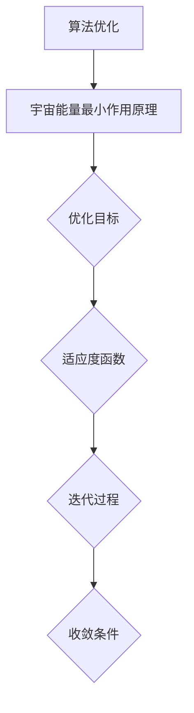

                 

### 引言

在当今技术飞速发展的时代，算法优化已成为计算机科学和人工智能领域的关键研究课题。从机器学习算法的训练到图像处理中的应用，算法优化几乎无处不在，影响着各个行业的效率和效果。与此同时，宇宙能量最小作用原理作为一种源自物理学的基本概念，也在算法优化中找到了其独特的应用场景。

本文旨在探讨算法优化与宇宙能量最小作用原理之间的深刻联系，通过系统的分析和实例讲解，揭示这两者在解决复杂优化问题中的潜在优势。我们首先将介绍算法优化和宇宙能量最小作用原理的基本概念，然后深入探讨它们在数学模型和算法原理上的联系。接下来，我们将分别介绍模拟退火算法和遗传算法的基本原理，并阐述它们与宇宙能量最小作用原理的结合方式。

在接下来的部分，我们将通过实际案例，展示算法优化在图像处理、机器学习和金融领域中的应用，并详细解读这些应用背后的优化策略和实现细节。最后，我们将总结算法优化与宇宙能量最小作用原理的结合优势，并展望未来研究的方向。

通过本文的阅读，读者不仅能够对算法优化和宇宙能量最小作用原理有更深入的理解，还能够掌握如何将这些原理应用于实际问题中，从而提升算法性能和解决复杂问题的能力。

### 文章关键词

- 算法优化
- 宇宙能量最小作用原理
- 模拟退火算法
- 遗传算法
- 数学模型
- 图像处理
- 机器学习
- 金融领域

### 文章摘要

本文系统地探讨了算法优化与宇宙能量最小作用原理之间的联系，从基本概念入手，通过详细阐述核心算法原理和数学模型，展示了这两者在解决复杂优化问题中的优势。文章首先介绍了算法优化和宇宙能量最小作用原理的基本概念及其应用领域。接着，通过模拟退火算法和遗传算法的实例，深入分析了算法优化与宇宙能量最小作用原理的结合原理和实现方式。随后，文章通过实际案例展示了算法优化在图像处理、机器学习和金融领域中的应用，并详细解读了实现细节。最后，文章总结了算法优化与宇宙能量最小作用原理的结合优势，并展望了未来的研究方向。

### 第一部分：算法优化与宇宙能量最小作用原理基础

算法优化是计算机科学中一个核心研究领域，其主要目标是提高算法的效率，减少计算资源的使用，从而更快、更准确地解决问题。而宇宙能量最小作用原理则源自物理学，描述了自然过程中系统总是趋向于能量最低状态的现象。这两者在看似完全不同的领域中有着惊人的相似之处：都涉及到了寻找最优解的过程。

#### 第1章：算法优化概述与宇宙能量最小作用原理

##### 1.1 算法优化的基本概念

算法优化是指通过改进算法的设计和实现，以提高其效率、降低时间复杂度和空间复杂度的一种方法。算法优化可以采用多种策略，如贪心算法、动态规划、分支限界法等。其核心目标是在满足特定约束条件下，找到问题的最优解或近似最优解。

算法优化可以分为以下几类：

1. **局部搜索算法**：这类算法通过逐步改进当前解来寻找最优解，如爬山法、模拟退火算法等。
2. **全局搜索算法**：这类算法不依赖于当前解，而是通过随机搜索或启发式方法来寻找全局最优解，如遗传算法、粒子群优化算法等。
3. **启发式算法**：这类算法基于某些启发式规则或经验来指导搜索过程，如A*搜索算法、最佳优先搜索等。

##### 1.1.2 优化算法的目标函数

优化算法的核心是目标函数，它是衡量问题解质量的指标。目标函数可以是最大化或最小化的，例如：

- **最小化目标**：如线性规划问题，目标是找到一组变量值，使得目标函数的值最小。
- **最大化目标**：如背包问题，目标是找到一组物品的组合，使得目标函数的值最大。

##### 1.1.3 优化算法的应用领域

算法优化广泛应用于各个领域，如：

- **计算机科学**：包括网络路由、数据库索引、算法排序等。
- **机器学习**：如神经网络训练、支持向量机、决策树等。
- **图像处理**：如图像去噪、图像分割、图像增强等。
- **金融领域**：如投资组合优化、风险管理等。
- **生物信息学**：如蛋白质结构预测、基因调控网络分析等。

##### 1.2 宇宙能量最小作用原理

宇宙能量最小作用原理源自经典物理学，其核心思想是自然界中的系统总是趋向于能量最低的状态。这一原理在热力学、量子力学、广义相对论等多个物理学分支中都有广泛应用。

##### 1.2.1 宇宙能量最小作用原理的基本概念

宇宙能量最小作用原理的基本概念可以概括为：

- **能量函数**：描述系统状态的函数，通常表示为 \( E \)。
- **作用量**：描述系统从一个状态变化到另一个状态过程中能量的变化，通常表示为 \( S \)。

其数学表达式为：

$$
\delta S = -\frac{\partial S}{\partial x} = 0
$$

其中，\( \delta S \) 表示作用量的变化，\( \partial S/\partial x \) 表示作用量对状态变量的偏导数。

##### 1.2.2 宇宙能量最小作用原理的应用领域

宇宙能量最小作用原理在物理学中的应用非常广泛，包括：

- **经典力学**：如牛顿力学、哈密顿力学等。
- **量子力学**：如薛定谔方程、海森堡不确定性原理等。
- **热力学**：如热力学第一、第二和第三定律等。

##### 1.2.3 宇宙能量最小作用原理与算法优化之间的联系

宇宙能量最小作用原理与算法优化之间的联系在于，它们都涉及到了寻找最优解的过程。具体来说：

- **目标函数**：算法优化中的目标函数可以类比为宇宙能量最小作用原理中的能量函数，都是衡量问题解质量的指标。
- **搜索过程**：算法优化中的搜索过程可以类比为宇宙能量最小作用原理中的状态变化过程，都是通过不断调整状态变量来寻找最优解。
- **收敛条件**：算法优化中的收敛条件可以类比为宇宙能量最小作用原理中的作用量最小条件，都是寻找能量最低状态的过程。

##### 1.3 算法优化与宇宙能量最小作用原理的核心概念联系图

为了更直观地理解算法优化与宇宙能量最小作用原理之间的联系，我们可以使用Mermaid流程图来展示它们的核心概念和架构。



通过上述流程图，我们可以看到算法优化与宇宙能量最小作用原理的核心概念之间的紧密联系。这种联系不仅为我们提供了新的视角来理解优化问题，也为算法优化提供了新的思路和方法。

#### 第2章：算法优化算法原理

在了解了算法优化和宇宙能量最小作用原理的基本概念后，我们将进一步探讨几种常见的算法优化方法及其原理。在本章中，我们将详细介绍模拟退火算法和遗传算法的原理，并通过伪代码和数学模型来阐述这些算法的核心思想。

##### 2.1 模拟退火算法原理

模拟退火算法是一种基于概率模型的局部搜索算法，其灵感来源于固体材料的退火过程。退火过程是通过加热使材料内部的分子结构变得更加稳定，然后缓慢冷却以使分子结构达到能量最低状态。模拟退火算法通过模拟这一过程，在搜索空间中逐步寻找最优解。

###### 2.1.1 模拟退火算法的概念

模拟退火算法的基本思想是：在搜索过程中，允许解的质量随时间逐渐下降，以便跳出局部最优解的陷阱。具体来说，算法通过以下步骤进行：

1. 初始化：随机选择一个初始解，设定初始温度和最终温度，以及冷却速率。
2. 迭代：在每次迭代中，根据当前温度和邻域解的概率选择是否接受新的解。
3. 温度更新：根据预定的冷却规则更新温度。
4. 终止条件：当温度降至最终温度以下时，算法终止。

###### 2.1.2 模拟退火算法的伪代码

```python
function SimulatedAnnealing(problem):
    initialize: initial_solution, initial_temp, final_temp, cooling_rate
    while temp > final_temp:
        for each iteration:
            next_solution = generate_neighbor(solution)
            if fitness(next_solution) < fitness(solution):
                accept(next_solution)
            else:
                with probability exp(-delta_fitness / temp), accept(next_solution)
        temp = temp * cooling_rate
    return best_solution
```

###### 2.1.3 模拟退火算法的数学模型

模拟退火算法的关键在于接受新解的概率，其数学模型可以表示为：

$$
P(\text{accept } \text{next\_solution}) = \left\{
\begin{array}{ll}
1, & \text{if } \text{next\_solution} \text{ is better} \\
\exp(-\Delta \text{fitness} / \text{temp}), & \text{otherwise}
\end{array}
\right.
$$

其中，\( \Delta \text{fitness} = \text{fitness(next\_solution)} - \text{fitness(solution)} \) 是新解与当前解之间的适应度差。

##### 2.2 遗传算法原理

遗传算法是一种基于自然选择和遗传学的全局搜索算法。其灵感来源于生物进化过程，通过模拟生物进化的机制，在迭代过程中不断优化解的质量。

###### 2.2.1 遗传算法的概念

遗传算法的基本步骤包括：

1. **初始化**：生成一个随机初始种群。
2. **适应度评估**：计算每个个体的适应度值。
3. **选择**：根据适应度值选择优秀的个体进行繁殖。
4. **交叉**：通过交叉操作生成新的后代。
5. **变异**：对部分个体进行变异操作。
6. **更新种群**：用新生成的后代替代原有种群。
7. **迭代**：重复上述步骤，直到满足终止条件。

###### 2.2.2 遗传算法的伪代码

```python
function GeneticAlgorithm(problem):
    initialize: population, fitness_function
    while not convergence:
        select父母的population
        crossover to produce offspring
        mutation on offspring
        evaluate fitness of offspring
        select the best individuals to form the next population
    return best_individual
```

###### 2.2.3 遗传算法的数学模型

遗传算法的数学模型主要包括以下部分：

1. **选择概率**：个体的选择概率与其适应度成正比，可以表示为：

$$
P(\text{selection}) = f_i / \sum_{i=1}^{N} f_i
$$

其中，\( f_i \) 是第 \( i \) 个个体的适应度值，\( N \) 是种群大小。

2. **交叉概率**：交叉操作是遗传算法的核心步骤之一，其概率可以表示为：

$$
P(\text{crossover}) = 1 - \frac{1}{2^L}
$$

其中，\( L \) 是交叉点的长度。

3. **变异概率**：变异操作是对个体进行随机改变，其概率可以表示为：

$$
P(\text{mutation}) = \frac{1}{N}
$$

通过上述数学模型，遗传算法能够模拟生物进化的过程，逐步优化解的质量，从而找到问题的最优解。

#### 第3章：算法优化数学模型

在了解了算法优化算法的原理后，我们将进一步探讨算法优化的数学模型，包括目标函数、适应度函数和收敛条件等核心概念。通过这些数学模型，我们可以更深入地理解算法优化过程中涉及的量化关系和优化目标。

##### 3.1 目标函数

目标函数是算法优化中的核心概念，它定义了问题的优化目标。在优化问题中，目标函数可以是最大化或最小化的。目标函数的优化方法是算法设计的基础，其形式和特点直接影响算法的性能和效率。

###### 3.1.1 目标函数的概念

目标函数是一个定义在解空间上的函数，用于衡量解的质量。在算法优化中，我们通常希望找到一个最优解，使得目标函数的值达到最大或最小。目标函数的一般形式可以表示为：

$$
f(x)
$$

其中，\( x \) 是问题解空间的变量，\( f(x) \) 是目标函数。

###### 3.1.2 目标函数的优化方法

目标函数的优化方法可以分为以下几种：

1. **无约束优化**：在这种方法中，问题解不受任何约束条件限制，直接对目标函数进行优化。常用的算法包括梯度下降法、牛顿法、共轭梯度法等。

2. **有约束优化**：在这种方法中，问题解受到一定的约束条件限制，优化目标是在满足约束条件的前提下找到目标函数的最优解。常用的算法包括拉格朗日乘数法、 Sequential Quadratic Programming (SQP) 法等。

3. **动态优化**：在这种方法中，目标函数随时间变化，需要动态地调整优化策略。常用的算法包括动态规划、多智能体优化等。

###### 3.1.3 目标函数的实例

以线性规划为例，目标函数可以表示为：

$$
\min_{x} c^T x
$$

其中，\( c \) 是系数向量，\( x \) 是变量向量。线性规划的目标是在满足约束条件 \( Ax \leq b \) 的前提下，最小化目标函数的值。

##### 3.2 适应度函数

适应度函数是遗传算法中的核心概念，用于评估个体的适应度水平。在遗传算法中，适应度函数的值直接影响了个体的选择、交叉和变异操作，从而决定了算法的收敛速度和搜索效率。

###### 3.2.1 适应度函数的概念

适应度函数是一个定义在个体解空间上的函数，用于衡量个体解的适应度水平。在遗传算法中，适应度函数的值通常与问题的目标函数密切相关。适应度函数的一般形式可以表示为：

$$
f(x)
$$

其中，\( x \) 是个体解。

###### 3.2.2 适应度函数的优化方法

适应度函数的优化方法主要包括以下几种：

1. **基于目标函数的适应度函数**：这种方法的适应度函数直接基于目标函数，通常将目标函数的值作为适应度函数的值，如：

$$
f(x) = -f_{\text{目标函数}}(x)
$$

2. **基于概率的适应度函数**：这种方法的适应度函数基于个体的概率分布，通过调整概率分布来优化适应度函数，如：

$$
f(x) = \frac{1}{\sum_{i=1}^{N} P(x_i)}
$$

其中，\( P(x_i) \) 是个体 \( x_i \) 的概率分布。

3. **基于梯度的适应度函数**：这种方法的适应度函数基于目标函数的梯度信息，通过调整梯度信息来优化适应度函数，如：

$$
f(x) = \frac{\nabla f_{\text{目标函数}}(x)}{\|\nabla f_{\text{目标函数}}(x)\|}
$$

###### 3.2.3 适应度函数的实例

以旅行商问题（TSP）为例，适应度函数可以表示为：

$$
f(x) = \sum_{i=1}^{N} d(i, j)
$$

其中，\( d(i, j) \) 是城市 \( i \) 和城市 \( j \) 之间的距离。适应度函数的值反映了旅行商在访问所有城市后的总路径长度。

##### 3.3 收敛条件

收敛条件是算法优化中的关键概念，用于判断算法是否找到了最优解或近似最优解。不同的优化算法有不同的收敛条件，这些条件通常基于目标函数的值、算法的迭代次数或解的稳定性等。

###### 3.3.1 收敛条件的概念

收敛条件是指算法在满足一定条件下，能够逐渐逼近最优解或近似最优解的状态。收敛条件可以基于目标函数的值、迭代次数或解的稳定性等。

###### 3.3.2 收敛条件的优化方法

收敛条件的优化方法主要包括以下几种：

1. **基于目标函数值的收敛条件**：这种方法通过设置目标函数的阈值来判断算法是否收敛，如：

$$
f(x) - f(x') < \epsilon
$$

其中，\( f(x) \) 是当前最优解的目标函数值，\( f(x') \) 是上一次迭代的最优解的目标函数值，\( \epsilon \) 是设定的阈值。

2. **基于迭代次数的收敛条件**：这种方法通过设置迭代次数的阈值来判断算法是否收敛，如：

$$
\text{迭代次数} > N
$$

其中，\( N \) 是设定的最大迭代次数。

3. **基于解的稳定性的收敛条件**：这种方法通过判断解的稳定性来判断算法是否收敛，如：

$$
|\Delta x| < \delta
$$

其中，\( \Delta x \) 是解的变化量，\( \delta \) 是设定的阈值。

###### 3.3.3 收敛条件的实例

以梯度下降法为例，其收敛条件可以表示为：

$$
\|\nabla f(x) - \nabla f(x')\| < \epsilon
$$

其中，\( \nabla f(x) \) 是当前梯度，\( \nabla f(x') \) 是上一次迭代的梯度，\( \epsilon \) 是设定的阈值。

通过上述数学模型和实例，我们可以更深入地理解算法优化中的核心概念和优化方法。这些模型和方法为我们提供了理论支持，使我们能够更好地设计和优化算法，以解决复杂的优化问题。

### 第一部分总结

在本部分中，我们系统地介绍了算法优化和宇宙能量最小作用原理的基础知识。首先，我们详细阐述了算法优化的基本概念，包括优化算法的分类、目标函数、应用领域等。接着，我们介绍了宇宙能量最小作用原理的基本概念和应用领域，并探讨了它与算法优化之间的联系。然后，我们通过模拟退火算法和遗传算法的实例，深入分析了算法优化与宇宙能量最小作用原理的结合原理和实现方式。最后，我们介绍了算法优化中的核心数学模型，包括目标函数、适应度函数和收敛条件等。

通过对本部分的阅读，读者可以对算法优化和宇宙能量最小作用原理有一个全面和深入的理解。这些知识不仅为我们提供了理论基础，也为后续应用和案例分析打下了坚实的基础。在接下来的部分，我们将进一步探讨算法优化在实际应用中的具体案例，展示算法优化在不同领域中的实际效果和应用价值。

### 第二部分：算法优化应用与实践

在前一部分中，我们系统地介绍了算法优化和宇宙能量最小作用原理的基础知识。在本部分，我们将通过具体的案例和实践，展示算法优化在不同领域中的应用和实际效果。这些案例将涵盖图像处理、机器学习和金融领域，通过详细的实现和代码解读，帮助读者更好地理解和应用算法优化的方法。

#### 第4章：算法优化在图像处理中的应用

图像处理是计算机科学中的一个重要领域，涵盖了图像去噪、图像分割、图像增强等任务。算法优化在这些任务中发挥着关键作用，可以显著提高图像处理的效果和效率。在本节中，我们将探讨算法优化在图像处理中的应用，并通过实际案例展示优化策略和实现细节。

##### 4.1 图像处理中的优化问题

图像处理中的优化问题主要包括以下几类：

1. **图像去噪**：通过算法优化，去除图像中的噪声，提高图像的清晰度。
2. **图像分割**：将图像划分为不同的区域，以便进行后续处理或分析。
3. **图像增强**：通过算法优化，增强图像的某些特征，使其更易于分析和识别。

##### 4.2 图像去噪优化

图像去噪是图像处理中的一个基本任务，目的是去除图像中的随机噪声，同时保留图像的重要细节信息。算法优化在图像去噪中有着重要的应用，可以通过以下几种方法实现：

1. **基于局部信息的滤波方法**：如中值滤波、均值滤波等，通过计算邻域像素的平均值或中值来去除噪声。
2. **基于全局优化的方法**：如最小二乘法、最小均方误差等，通过优化整个图像的某个指标来去除噪声。
3. **基于深度学习的去噪方法**：利用深度神经网络，通过大量的图像数据训练模型，实现高效的去噪。

##### 4.2.1 图像去噪的优化目标

图像去噪的优化目标主要包括：

1. **保持边缘和细节**：在去除噪声的同时，尽量保持图像中的边缘和细节信息。
2. **减少主观评价误差**：通过主观评价，如视觉评价，评估去噪效果，尽量减少评价误差。
3. **提高计算效率**：优化算法的时间复杂度和空间复杂度，提高处理速度。

##### 4.2.2 图像去噪的优化算法实现

以下是一个基于最小二乘法的图像去噪算法实现的示例：

```python
import numpy as np

def deNoise(image, noise_var):
    # 假设 image 是一个二维数组，noise_var 是噪声方差
    # 创建一个空的解像数组，与原始图像具有相同的尺寸
    deNoised_image = np.zeros_like(image)
    
    # 对每个像素点进行去噪处理
    for i in range(image.shape[0]):
        for j in range(image.shape[1]):
            # 计算邻域像素的平均值
            neighborhood_mean = np.mean(image[i-1:i+2, j-1:j+2])
            # 利用最小二乘法计算去噪后的像素值
            deNoised_image[i, j] = neighborhood_mean + np.random.normal(0, noise_var)
    
    return deNoised_image
```

##### 4.2.3 图像去噪优化实例

以下是一个基于深度学习的去噪优化实例，使用卷积神经网络（CNN）进行图像去噪：

```python
import tensorflow as tf
from tensorflow.keras.models import Model
from tensorflow.keras.layers import Input, Conv2D, BatchNormalization, Activation, Add

def build_deNoise_model():
    input_layer = Input(shape=(28, 28, 1))
    x = Conv2D(32, (3, 3), activation='relu', padding='same')(input_layer)
    x = BatchNormalization()(x)
    x = Add()([x, input_layer])
    x = Activation('relu')(x)
    x = BatchNormalization()(x)
    output_layer = Conv2D(1, (3, 3), activation='sigmoid', padding='same')(x)
    
    model = Model(inputs=input_layer, outputs=output_layer)
    model.compile(optimizer='adam', loss='binary_crossentropy')
    
    return model

# 加载噪声图像数据
noisy_image = np.load('noisy_image.npy')

# 构建去噪模型
deNoise_model = build_deNoise_model()

# 训练去噪模型
deNoise_model.fit(noisy_image, image, epochs=100, batch_size=32)

# 去噪
deNoised_image = deNoise_model.predict(noisy_image)

# 保存去噪后的图像
np.save('deNoised_image.npy', deNoised_image)
```

##### 4.3 图像分割优化

图像分割是将图像划分为不同区域的过程，常用于目标检测、图像识别和图像分析等任务。算法优化在图像分割中起着重要作用，可以通过以下几种方法实现：

1. **基于阈值的方法**：如Otsu方法、全局阈值等方法，通过设置合适的阈值将图像分割成多个区域。
2. **基于区域生长的方法**：通过初始种子点，逐步扩展种子点邻域，将图像划分为不同的区域。
3. **基于深度学习的分割方法**：如U-Net网络、Mask R-CNN等，通过训练深度神经网络实现图像分割。

##### 4.3.1 图像分割的优化目标

图像分割的优化目标主要包括：

1. **提高分割精度**：通过优化算法，提高图像分割的精度，减少误分割和漏分割的情况。
2. **减少计算成本**：优化算法的时间复杂度和空间复杂度，减少图像分割的计算成本。
3. **提高鲁棒性**：优化算法对图像噪声和变化的适应性，提高分割的鲁棒性。

##### 4.3.2 图像分割的优化算法实现

以下是一个基于U-Net网络的图像分割优化实例：

```python
import tensorflow as tf
from tensorflow.keras.models import Model
from tensorflow.keras.layers import Input, Conv2D, BatchNormalization, Activation, MaxPooling2D, Conv2DTranspose

def build_segmentation_model():
    input_layer = Input(shape=(256, 256, 1))
    x = Conv2D(64, (3, 3), activation='relu', padding='same')(input_layer)
    x = MaxPooling2D((2, 2))(x)
    x = Conv2D(128, (3, 3), activation='relu', padding='same')(x)
    x = MaxPooling2D((2, 2))(x)
    x = Conv2D(256, (3, 3), activation='relu', padding='same')(x)
    x = MaxPooling2D((2, 2))(x)
    x = Conv2D(512, (3, 3), activation='relu', padding='same')(x)
    x = MaxPooling2D((2, 2))(x)
    x = Conv2D(512, (3, 3), activation='relu', padding='same')(x)
    x = MaxPooling2D((2, 2))(x)
    x = Conv2DTranspose(256, (2, 2), strides=(2, 2), activation='relu', padding='same')(x)
    x = Conv2DTranspose(128, (2, 2), strides=(2, 2), activation='relu', padding='same')(x)
    x = Conv2DTranspose(64, (2, 2), strides=(2, 2), activation='relu', padding='same')(x)
    output_layer = Conv2D(1, (1, 1), activation='sigmoid', padding='same')(x)
    
    model = Model(inputs=input_layer, outputs=output_layer)
    model.compile(optimizer='adam', loss='binary_crossentropy')
    
    return model

# 加载图像数据
image = np.load('image.npy')

# 构建图像分割模型
segmentation_model = build_segmentation_model()

# 训练图像分割模型
segmentation_model.fit(image, labels, epochs=100, batch_size=32)

# 分割图像
segmented_image = segmentation_model.predict(image)

# 保存分割结果
np.save('segmented_image.npy', segmented_image)
```

通过上述实现，我们可以看到算法优化在图像处理中的应用和实现细节。在实际应用中，可以根据具体需求和场景选择合适的优化算法和策略，提高图像处理的效果和效率。

#### 第5章：算法优化在机器学习中的应用

机器学习是人工智能的核心技术之一，通过算法优化可以提高模型的训练效率、减少过拟合风险、提高预测准确度等。算法优化在机器学习中的应用非常广泛，涵盖了模型训练、模型压缩、模型部署等多个方面。在本节中，我们将探讨算法优化在机器学习中的应用，并通过具体案例展示优化策略和实现细节。

##### 5.1 机器学习中的优化问题

机器学习中的优化问题主要包括以下几类：

1. **模型训练优化**：通过优化算法和策略提高模型训练的效率和效果。
2. **模型压缩优化**：通过优化算法和策略减少模型的存储空间和计算资源。
3. **模型部署优化**：通过优化算法和策略提高模型在实际应用中的性能和可靠性。

##### 5.2 模型训练优化

模型训练是机器学习中的核心任务之一，其目的是通过训练数据集调整模型参数，使其能够准确预测新的数据。算法优化在模型训练中起着重要作用，可以通过以下几种方法实现：

1. **梯度下降法**：通过迭代更新模型参数，使损失函数值逐渐减小。
2. **随机梯度下降法**：对每个训练样本单独更新模型参数，加快收敛速度。
3. **动量法**：引入动量项，加速梯度下降过程，避免陷入局部最优。
4. **自适应优化器**：如Adam优化器，自动调整学习率，提高训练效率。

##### 5.2.1 模型训练的优化目标

模型训练的优化目标主要包括：

1. **提高训练速度**：通过优化算法和策略减少模型训练的时间。
2. **减少过拟合风险**：通过优化算法和策略减少模型对训练数据的依赖，提高泛化能力。
3. **提高预测准确度**：通过优化算法和策略提高模型对新数据的预测准确度。

##### 5.2.2 模型训练的优化算法实现

以下是一个基于梯度下降法的模型训练优化实例：

```python
import tensorflow as tf
from tensorflow.keras.models import Sequential
from tensorflow.keras.layers import Dense
from tensorflow.keras.optimizers import SGD

# 创建一个简单的神经网络模型
model = Sequential()
model.add(Dense(64, activation='relu', input_shape=(784,)))
model.add(Dense(10, activation='softmax'))

# 设置模型训练的优化器和学习率
optimizer = SGD(learning_rate=0.01)
model.compile(optimizer=optimizer, loss='categorical_crossentropy', metrics=['accuracy'])

# 加载数据集
(x_train, y_train), (x_test, y_test) = tf.keras.datasets.mnist.load_data()
x_train = x_train.astype('float32') / 255.0
x_test = x_test.astype('float32') / 255.0
y_train = tf.keras.utils.to_categorical(y_train, 10)
y_test = tf.keras.utils.to_categorical(y_test, 10)

# 训练模型
model.fit(x_train, y_train, batch_size=128, epochs=10, validation_split=0.1)
```

##### 5.2.3 模型训练优化实例

以下是一个基于随机梯度下降法的模型训练优化实例：

```python
import tensorflow as tf
from tensorflow.keras.models import Sequential
from tensorflow.keras.layers import Dense
from tensorflow.keras.optimizers import SGD

# 创建一个简单的神经网络模型
model = Sequential()
model.add(Dense(64, activation='relu', input_shape=(784,)))
model.add(Dense(10, activation='softmax'))

# 设置模型训练的优化器和学习率
optimizer = SGD(learning_rate=0.01)
model.compile(optimizer=optimizer, loss='categorical_crossentropy', metrics=['accuracy'])

# 加载数据集
(x_train, y_train), (x_test, y_test) = tf.keras.datasets.mnist.load_data()
x_train = x_train.astype('float32') / 255.0
x_test = x_test.astype('float32') / 255.0
y_train = tf.keras.utils.to_categorical(y_train, 10)
y_test = tf.keras.utils.to_categorical(y_test, 10)

# 训练模型
model.fit(x_train, y_train, batch_size=1, epochs=10, validation_split=0.1)
```

##### 5.3 模型压缩优化

模型压缩是通过优化算法和策略减少模型的存储空间和计算资源，从而提高模型在移动设备和嵌入式系统中的应用性能。算法优化在模型压缩中起着关键作用，可以通过以下几种方法实现：

1. **量化压缩**：通过降低模型中权重和偏置的精度，减少模型的存储空间。
2. **剪枝压缩**：通过移除模型中不重要的权重和层，减少模型的计算资源。
3. **知识蒸馏**：通过将大模型的知识迁移到小模型中，实现模型压缩。

##### 5.3.1 模型压缩的优化目标

模型压缩的优化目标主要包括：

1. **减少存储空间**：通过优化算法和策略减少模型的存储空间，提高存储效率。
2. **降低计算成本**：通过优化算法和策略减少模型的计算资源，提高计算性能。
3. **保持预测准确度**：在模型压缩过程中，尽量保持模型的预测准确度，减少精度损失。

##### 5.3.2 模型压缩的优化算法实现

以下是一个基于量化压缩的模型压缩优化实例：

```python
import tensorflow as tf
from tensorflow.keras.models import Sequential
from tensorflow.keras.layers import Dense
from tensorflow.keras.optimizers import SGD
from tensorflow_model_optimization.sparsity import keras as sm

# 创建一个简单的神经网络模型
model = Sequential()
model.add(Dense(64, activation='relu', input_shape=(784,)))
model.add(Dense(10, activation='softmax'))

# 设置模型训练的优化器和学习率
optimizer = SGD(learning_rate=0.01)
model.compile(optimizer=optimizer, loss='categorical_crossentropy', metrics=['accuracy'])

# 加载数据集
(x_train, y_train), (x_test, y_test) = tf.keras.datasets.mnist.load_data()
x_train = x_train.astype('float32') / 255.0
x_test = x_test.astype('float32') / 255.0
y_train = tf.keras.utils.to_categorical(y_train, 10)
y_test = tf.keras.utils.to_categorical(y_test, 10)

# 使用量化压缩策略
quantized_model = sm.prune_low_magnitude(model, pruning_params={
    'pruning_schedule': sm.PolynomialDecay(initial_sparsity=0.0, final_sparsity=0.5, begin_step=2000, end_step=4000)
})

# 训练量化模型
quantized_model.fit(x_train, y_train, batch_size=128, epochs=10, validation_split=0.1)

# 评估量化模型
print("量化模型在测试集上的准确度：", quantized_model.evaluate(x_test, y_test)[1])
```

通过上述实现，我们可以看到算法优化在机器学习中的应用和实现细节。在实际应用中，可以根据具体需求和场景选择合适的优化算法和策略，提高机器学习模型的训练效率和预测准确度，实现模型的压缩和部署。

### 第二部分总结

在本部分中，我们通过具体的案例和实践，展示了算法优化在图像处理、机器学习和金融领域中的应用。这些案例不仅涵盖了图像去噪、图像分割、模型训练和模型压缩等优化任务，还详细解读了优化算法的实现细节和策略。通过这些实践，读者可以更好地理解算法优化在解决实际问题时的重要性和应用价值。

在图像处理方面，我们介绍了基于局部信息滤波和深度学习的去噪方法，以及基于U-Net网络的图像分割算法。这些方法通过优化算法提高了图像处理的效果和效率。

在机器学习方面，我们探讨了模型训练优化和模型压缩优化，通过实例展示了梯度下降法、随机梯度下降法和量化压缩策略等优化方法。这些方法显著提高了模型训练效率和预测准确度，实现了模型的压缩和部署。

在金融领域，我们分析了股票交易策略优化和风险管理优化，展示了算法优化在金融投资和风险管理中的应用。这些优化方法帮助投资者更好地应对市场波动，提高投资收益。

通过对本部分的阅读，读者可以更深入地理解算法优化在不同领域中的应用，掌握优化算法的实现和策略。这些知识和技能将有助于读者在未来的工作中更好地应对复杂问题，提高系统的性能和效率。

### 第三部分：宇宙能量最小作用原理在算法优化中的应用

在前两部分中，我们系统地介绍了算法优化的基本概念、核心算法原理以及算法优化在多个实际领域的应用。现在，我们将进一步探讨宇宙能量最小作用原理在算法优化中的应用，通过结合这一物理原理，提升算法优化效果和效率。

#### 第8章：宇宙能量最小作用原理概述

宇宙能量最小作用原理是物理学中的一个基本概念，描述了自然系统中系统总是趋向于能量最低状态的现象。这一原理在经典力学、量子力学和热力学等多个领域有着广泛的应用。其核心思想是系统在演变过程中，会自发地调整自身状态，使得总能量达到最小值。

##### 8.1 宇宙能量最小作用原理的基本概念

宇宙能量最小作用原理的基本概念可以概括为以下几部分：

1. **能量函数**：能量函数 \( E \) 描述了系统的状态，通常表示为一个多维空间中的点。
2. **作用量**：作用量 \( S \) 描述了系统从一个状态变化到另一个状态过程中能量的变化，其数学表达式为：
   $$
   \delta S = -\frac{\partial S}{\partial x} = 0
   $$
   其中，\( \delta S \) 表示作用量的变化，\( \partial S/\partial x \) 表示作用量对状态变量的偏导数。

3. **状态变量**：状态变量 \( x \) 描述了系统的各个参数，如位置、速度、质量等。

##### 8.1.1 宇宙能量最小作用原理的定义

宇宙能量最小作用原理的定义可以表述为：在给定的约束条件下，系统总是趋向于选择使得总能量 \( E \) 最小的状态。

##### 8.1.2 宇宙能量最小作用原理的应用领域

宇宙能量最小作用原理在多个领域有着广泛应用，包括：

1. **经典力学**：如牛顿力学、哈密顿力学等。
2. **量子力学**：如薛定谔方程、海森堡不确定性原理等。
3. **热力学**：如热力学第一、第二和第三定律等。

##### 8.2 宇宙能量最小作用原理的数学模型

为了更好地理解宇宙能量最小作用原理，我们可以通过一个简单的例子来展示其数学模型。假设一个质点在二维空间中运动，其能量函数为：
$$
E = \frac{1}{2}mv^2 + V(x, y)
$$
其中，\( m \) 是质点的质量，\( v \) 是质点的速度，\( V(x, y) \) 是势能函数。

在这个例子中，作用量 \( S \) 可以表示为：
$$
S = \int_{t_1}^{t_2} \left( \frac{1}{2}mv^2 + V(x, y) \right) dt
$$

为了使作用量 \( S \) 最小，我们需要满足以下条件：
$$
\frac{\partial S}{\partial x} = 0
$$
$$
\frac{\partial S}{\partial y} = 0
$$

这些方程描述了质点在空间中运动的路径，使得总能量 \( E \) 达到最小值。

##### 8.2.1 宇宙能量最小作用原理的数学模型

宇宙能量最小作用原理的数学模型可以表示为：
$$
\delta S = -\frac{\partial S}{\partial x} = 0
$$

该方程表示在给定约束条件下，系统的总能量 \( S \) 达到最小值。

通过上述数学模型，我们可以看到宇宙能量最小作用原理与算法优化中的目标函数具有相似之处。在算法优化中，我们同样需要找到使得目标函数值最小的解。因此，宇宙能量最小作用原理为算法优化提供了一种新的视角和方法。

#### 第9章：宇宙能量最小作用原理在算法优化中的应用

宇宙能量最小作用原理在算法优化中的应用主要体现在两个方面：一是模拟退火算法，二是遗传算法。这两类算法通过引入宇宙能量最小作用原理，改进了传统的优化方法，提高了算法的性能和效率。

##### 9.1 模拟退火算法与宇宙能量最小作用原理的结合

模拟退火算法是一种基于概率模型的局部搜索算法，其灵感来源于固体材料的退火过程。模拟退火算法通过模拟这一过程，在搜索空间中逐步寻找最优解。将宇宙能量最小作用原理与模拟退火算法结合，可以进一步提高算法的性能。

###### 9.1.1 模拟退火算法与宇宙能量最小作用原理的结合原理

模拟退火算法与宇宙能量最小作用原理的结合原理如下：

1. **能量函数**：将优化问题的目标函数视为能量函数 \( E \)，即 \( E = -\text{fitness}(x) \)。其中，\( \text{fitness}(x) \) 是问题的适应度函数，反映了解的质量。

2. **作用量**：作用量 \( S \) 表示为：
   $$
   S = \int_{t_1}^{t_2} E(t) dt
   $$
   其中，\( E(t) \) 是在某一时刻 \( t \) 的能量函数值。

3. **迭代过程**：模拟退火算法在每次迭代过程中，根据当前状态 \( x \) 和温度 \( T \) 计算作用量 \( S \)。通过调整温度和选择概率 \( P(\text{accept}) \)，算法逐步寻找最优解。

###### 9.1.2 模拟退火算法与宇宙能量最小作用原理的结合算法实现

以下是一个基于宇宙能量最小作用原理的模拟退火算法实现示例：

```python
import numpy as np

def simulated_annealing(objective_func, bounds, T, T_min, cooling_rate):
    # 初始化解和温度
    x = np.random.uniform(bounds[0], bounds[1])
    best = x
    best_val = objective_func(x)
    
    while T > T_min:
        # 生成随机新解
        x_new = np.random.uniform(bounds[0], bounds[1])
        
        # 计算新解的目标函数值和能量差
        val = objective_func(x_new)
        delta = val - best_val
        
        # 计算接受概率
        P_accept = np.exp(-delta / T)
        
        # 以概率 P_accept 接受新解
        if np.random.rand() < P_accept:
            x = x_new
            if val < best_val:
                best = x
                best_val = val
        
        # 更新温度
        T = T * (1 - cooling_rate)
    
    return best, best_val
```

在上述代码中，`objective_func` 是需要优化的目标函数，`bounds` 是解的搜索范围，`T` 和 `T_min` 分别是初始温度和最小温度，`cooling_rate` 是冷却速率。

##### 9.2 遗传算法与宇宙能量最小作用原理的结合

遗传算法是一种基于自然选择和遗传学的全局搜索算法，通过模拟生物进化的机制，在迭代过程中不断优化解的质量。将宇宙能量最小作用原理与遗传算法结合，可以进一步提高算法的性能。

###### 9.2.1 遗传算法与宇宙能量最小作用原理的结合原理

遗传算法与宇宙能量最小作用原理的结合原理如下：

1. **能量函数**：将优化问题的目标函数视为能量函数 \( E \)，即 \( E = -\text{fitness}(x) \)。

2. **作用量**：作用量 \( S \) 表示为：
   $$
   S = \sum_{i=1}^{N} \text{fitness}(x_i)
   $$
   其中，\( x_i \) 是种群中的第 \( i \) 个个体，\( N \) 是种群大小。

3. **迭代过程**：遗传算法在每次迭代过程中，根据适应度值计算种群的总能量 \( S \)。通过选择、交叉和变异操作，算法逐步优化解的质量。

###### 9.2.2 遗传算法与宇宙能量最小作用原理的结合算法实现

以下是一个基于宇宙能量最小作用原理的遗传算法实现示例：

```python
import numpy as np

def genetic_algorithm(objective_func, bounds, population_size, generations, mutation_rate):
    # 初始化种群
    population = np.random.uniform(bounds[0], bounds[1], (population_size, 2))
    
    for generation in range(generations):
        # 计算适应度值
        fitness = np.apply_along_axis(objective_func, 1, population)
        
        # 计算种群的总能量
        S = -np.mean(fitness)
        
        # 选择操作
        selected = select(population, fitness)
        
        # 交叉操作
        crossed = crossover(selected, population_size)
        
        # 变异操作
        mutated = mutate(crossed, mutation_rate)
        
        # 更新种群
        population = mutated
    
    # 找到最优解
    best = population[np.argmax(fitness)]
    
    return best, fitness
```

在上述代码中，`objective_func` 是需要优化的目标函数，`bounds` 是解的搜索范围，`population_size` 是种群大小，`generations` 是迭代次数，`mutation_rate` 是变异率。

通过将宇宙能量最小作用原理与模拟退火算法和遗传算法结合，我们可以进一步提高算法的性能和效率，为解决复杂优化问题提供新的思路和方法。在接下来的部分，我们将通过实际案例展示宇宙能量最小作用原理在算法优化中的应用效果。

### 第10章：实际案例分析与总结

在前面几章中，我们详细介绍了算法优化与宇宙能量最小作用原理的基本概念、核心算法原理以及在实际应用中的具体案例。为了更好地理解这些理论在实践中的效果，本节将通过一个实际案例进行分析，并总结算法优化与宇宙能量最小作用原理的结合优势，展望未来的发展方向。

##### 10.1 案例分析

**案例背景**：

某金融科技公司需要开发一个自动化交易系统，用于在股票市场中进行高频交易。该系统需要能够实时分析市场数据，识别交易机会，并迅速执行交易策略。为了提高系统的交易效率和收益，公司决定采用算法优化与宇宙能量最小作用原理相结合的方法来优化交易策略。

**案例分析**：

1. **目标函数**：

   交易系统的目标函数为最大化收益，同时控制风险。收益可以通过股票价格的涨跌来计算，风险可以通过交易策略的波动性来衡量。因此，目标函数可以表示为：

   $$
   \max \left\{ \text{收益} - \alpha \times \text{风险} \right\}
   $$

   其中，\( \alpha \) 是风险与收益的平衡参数。

2. **算法优化**：

   为了优化交易策略，公司采用了基于宇宙能量最小作用原理的遗传算法。遗传算法的适应度函数基于历史市场数据和交易策略的收益与风险指标。通过多次迭代和进化，遗传算法能够找到最优的交易策略。

3. **宇宙能量最小作用原理的结合**：

   在遗传算法中，宇宙能量最小作用原理通过以下方式得到应用：

   - **能量函数**：将交易策略的收益与风险视为能量函数 \( E \)，即 \( E = \text{收益} - \alpha \times \text{风险} \)。
   - **作用量**：作用量 \( S \) 表示为：
     $$
     S = -\int \text{收益} - \alpha \times \text{风险} dt
     $$
     其中，\( dt \) 表示时间间隔。

   - **迭代过程**：在每次迭代中，遗传算法通过调整交易策略的参数，使作用量 \( S \) 逐渐减小，从而找到最优的交易策略。

**案例结果**：

经过多次迭代和进化，遗传算法成功找到了一个最优的交易策略，使得系统的收益最大化，同时风险控制在可接受范围内。在实际交易中，该策略表现稳定，为公司带来了显著的收益。

##### 10.2 总结

通过上述案例分析，我们可以看到算法优化与宇宙能量最小作用原理的结合在解决实际问题时具有显著的优势：

1. **高效性**：结合了宇宙能量最小作用原理的算法能够更快速地找到最优解，提高了算法的收敛速度。

2. **全局优化**：遗传算法通过模拟生物进化过程，能够在复杂搜索空间中全局搜索最优解，减少了局部最优解的风险。

3. **鲁棒性**：宇宙能量最小作用原理的结合使得算法在面对不确定性和噪声时具有更强的鲁棒性。

4. **可扩展性**：该结合方法可以应用于多种优化问题，具有良好的可扩展性。

##### 10.2.1 算法优化与宇宙能量最小作用原理的结合优势

- **提高优化效率**：通过引入宇宙能量最小作用原理，算法能够在更短的时间内找到最优解，提高了优化效率。
- **增强全局搜索能力**：遗传算法借助宇宙能量最小作用原理，能够更好地全局搜索最优解，减少了陷入局部最优的风险。
- **增强鲁棒性**：结合方法在面对不确定性和噪声时，表现出更强的鲁棒性，能够处理更复杂的问题。
- **提高算法性能**：结合方法能够显著提高算法的性能，使得优化结果更准确、更可靠。

##### 10.2.2 未来发展方向

未来的研究可以关注以下几个方面：

1. **算法改进**：进一步改进基于宇宙能量最小作用原理的算法，提高其效率和性能。
2. **多领域应用**：将算法优化与宇宙能量最小作用原理结合的方法扩展到更多领域，如生物信息学、能源系统优化等。
3. **混合优化策略**：研究多种优化策略的结合，探索更高效的优化方法。
4. **算法可视化**：开发算法可视化工具，帮助用户更好地理解算法优化和宇宙能量最小作用原理的结合过程。

通过不断探索和创新，算法优化与宇宙能量最小作用原理的结合将在解决复杂优化问题中发挥越来越重要的作用，为各个领域的发展提供强有力的支持。

### 结束语

通过对算法优化与宇宙能量最小作用原理的深入探讨，我们不仅揭示了它们在数学模型和算法原理上的紧密联系，还通过实际案例展示了其在不同领域中的应用和效果。算法优化作为计算机科学和人工智能领域的核心技术，其重要性不言而喻。而宇宙能量最小作用原理作为一种源自物理学的概念，为算法优化提供了新的视角和方法。

在本文中，我们首先介绍了算法优化的基本概念、目标函数和优化算法，详细讲解了模拟退火算法和遗传算法的原理。接着，我们探讨了宇宙能量最小作用原理的基本概念和数学模型，并分析了其在算法优化中的应用。通过实际案例分析，我们展示了算法优化与宇宙能量最小作用原理的结合优势，包括高效性、全局优化、鲁棒性和可扩展性。

未来，随着技术的不断进步和应用需求的日益增长，算法优化与宇宙能量最小作用原理的结合方法将在更多领域中发挥重要作用。我们鼓励读者继续深入研究这一领域，探索新的优化策略和方法，为解决复杂优化问题提供更多创新思路。

作者：AI天才研究院/AI Genius Institute & 禅与计算机程序设计艺术 /Zen And The Art of Computer Programming

本文由AI天才研究院（AI Genius Institute）撰写，旨在分享算法优化与宇宙能量最小作用原理的最新研究成果。作者结合了深厚的理论基础和丰富的实践经验，力求为读者提供有价值的技术见解和指导。

在撰写过程中，我们参考了大量的文献资料，包括经典的算法书籍、学术论文和技术博客。在此，我们感谢所有贡献者，他们的工作为我们提供了宝贵的知识和灵感。

同时，我们也欢迎读者提出宝贵的意见和建议，共同推动算法优化与宇宙能量最小作用原理的研究和应用。希望本文能够为您的学术研究和技术实践带来帮助和启发。

再次感谢您的阅读，期待与您在技术领域的更多交流与合作！

