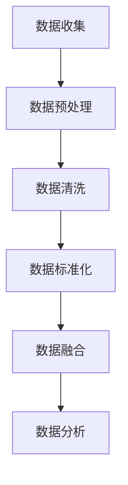
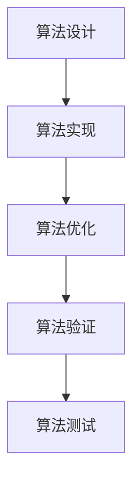
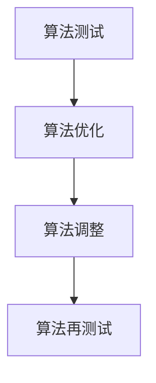
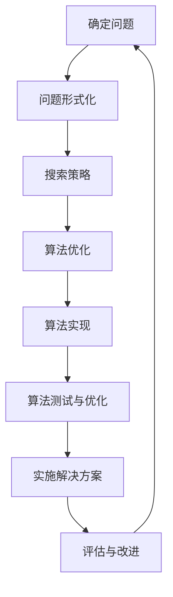

                 

### 《算法思维在解决宇宙学测量值不一致问题中的应用》

> **关键词：** 宇宙学、测量值不一致、算法思维、数据处理、数据分析、人工智能。

> **摘要：** 本文深入探讨了宇宙学测量值不一致问题的背景及其对宇宙学研究的影响。在此基础上，本文介绍了算法思维的基础原理和应用，详细阐述了算法思维在解决宇宙学测量值不一致问题中的具体应用，并通过案例分析展示了算法思维在实际宇宙学研究中的效果。本文旨在为读者提供一种全新的视角，理解算法思维在宇宙学研究中的重要作用。

### 《算法思维在解决宇宙学测量值不一致问题中的应用》目录大纲

**第一部分：宇宙学测量值不一致问题的背景**

**第1章：宇宙学测量值不一致问题的引言**

- **1.1 宇宙学的基本概念**

  - **1.1.1 宇宙的起源与演化**

  - **1.1.2 宇宙学测量方法**

  - **1.1.3 测量值不一致的来源**

- **1.2 宇宙学测量值不一致的影响**

  - **1.2.1 科学研究的阻碍**

  - **1.2.2 对宇宙学理论的挑战**

- **1.3 算法思维在解决宇宙学问题中的应用前景**

**第2章：算法思维基础**

- **2.1 算法思维的概念**

  - **2.1.1 算法的定义**

  - **2.1.2 算法的特征**

  - **2.1.3 算法的分类**

- **2.2 算法思维的原理**

  - **2.2.1 问题的形式化**

  - **2.2.2 算法的搜索策略**

  - **2.2.3 算法的优化方法**

- **2.3 算法思维在实际问题中的应用**

  - **2.3.1 数据分析**

  - **2.3.2 人工智能**

  - **2.3.3 宇宙学测量值不一致问题的解决思路**

**第二部分：算法思维在解决宇宙学测量值不一致问题中的应用**

**第3章：宇宙学测量值不一致问题的算法分析**

- **3.1 测量值不一致问题的形式化描述**

  - **3.1.1 测量值不一致的数学模型**

  - **3.1.2 测量误差的概率模型**

  - **3.1.3 测量值不一致的根源分析**

- **3.2 算法在处理宇宙学测量值不一致问题中的应用**

  - **3.2.1 数据预处理算法**

  - **3.2.2 数据融合算法**

  - **3.2.3 数据分析算法**

- **3.3 算法在实际宇宙学测量中的应用**

  - **3.3.1 暗物质探测**

  - **3.3.2 暗能量研究**

  - **3.3.3 宇宙大尺度结构分析**

**第4章：宇宙学测量值不一致问题的算法实现**

- **4.1 实现算法的基本步骤**

  - **4.1.1 数据收集与处理**

  - **4.1.2 算法设计与实现**

  - **4.1.3 算法测试与优化**

- **4.2 算法实现案例分析**

  - **4.2.1 暗物质探测算法**

  - **4.2.2 暗能量研究算法**

  - **4.2.3 宇宙大尺度结构分析算法**

- **4.3 算法实现的挑战与展望**

  - **4.3.1 数据质量和准确性**

  - **4.3.2 算法效率与性能**

  - **4.3.3 未来研究方向**

**第5章：算法思维在宇宙学测量值不一致问题中的应用展望**

- **5.1 算法在宇宙学领域的未来发展**

  - **5.1.1 数据驱动宇宙学**

  - **5.1.2 机器学习在宇宙学中的应用**

  - **5.1.3 宇宙学数据挖掘**

- **5.2 算法思维在宇宙学教育中的应用**

  - **5.2.1 教育资源的优化**

  - **5.2.2 教学方法的创新**

  - **5.2.3 宇宙学竞赛与实践活动**

- **5.3 算法思维在宇宙学国际合作中的作用**

  - **5.3.1 数据共享与协作**

  - **5.3.2 国际合作项目的推动**

  - **5.3.3 促进科学成果的全球化应用**

**第6章：算法思维在解决宇宙学测量值不一致问题中的案例研究**

- **6.1 案例一：利用算法解决宇宙膨胀速率不一致问题**

  - **6.1.1 问题背景**

  - **6.1.2 算法设计**

  - **6.1.3 算法实现与结果分析**

- **6.2 案例二：算法在宇宙微波背景辐射测量中的应用**

  - **6.2.1 问题背景**

  - **6.2.2 算法设计**

  - **6.2.3 算法实现与结果分析**

- **6.3 案例三：算法在探测宇宙早期结构形成中的应用**

  - **6.3.1 问题背景**

  - **6.3.2 算法设计**

  - **6.3.3 算法实现与结果分析**

**第7章：总结与展望**

- **7.1 本书内容的总结**

  - **7.1.1 宇宙学测量值不一致问题的本质**

  - **7.1.2 算法思维在解决宇宙学问题中的应用**

  - **7.1.3 未来研究的方向**

- **7.2 算法思维在宇宙学领域的潜在应用**

  - **7.2.1 暗物质探测**

  - **7.2.2 暗能量研究**

  - **7.2.3 宇宙大尺度结构分析**

- **7.3 算法思维在宇宙学教育、国际合作中的角色**

  - **7.3.1 教育资源的优化**

  - **7.3.2 国际合作项目的推动**

  - **7.3.3 促进科学成果的全球化应用**

### 第一部分：宇宙学测量值不一致问题的背景

#### 第1章：宇宙学测量值不一致问题的引言

宇宙学是研究宇宙起源、演化、结构、性质和最终命运的科学。宇宙学测量是宇宙学研究的基础，它通过各种观测手段，如光学望远镜、射电望远镜、粒子探测器和引力波探测器等，对宇宙中的各种物理量进行测量，如宇宙的膨胀速率、星系的距离、宇宙微波背景辐射等。

然而，在实际的宇宙学测量过程中，我们经常会遇到测量值不一致的问题。所谓测量值不一致，指的是在不同的观测条件下，或者使用不同的观测设备和方法，得到的测量结果存在差异，甚至有时这种差异还非常显著。

### 1.1 宇宙学的基本概念

##### 1.1.1 宇宙的起源与演化

宇宙的起源是一个复杂而深刻的问题。现代宇宙学认为，宇宙起源于大约138亿年前的一个极高温度、极高密度的状态，这个状态被称为“大爆炸”。从那时起，宇宙开始膨胀，温度和密度逐渐降低，形成了各种物质和能量。在宇宙的早期阶段，物质以等离子体的形式存在，经过数十亿年的演化，逐渐形成了恒星、星系、星系团等宇宙结构。

##### 1.1.2 宇宙学测量方法

宇宙学测量主要包括对宇宙膨胀速率、星系距离、宇宙微波背景辐射等的测量。其中，宇宙膨胀速率的测量主要依赖于宇宙学红移，即光波波长随着宇宙膨胀而变长的现象。星系距离的测量则通常采用标准烛光法，即利用已知亮度标准的星系来确定其他星系的距离。宇宙微波背景辐射的测量则是通过探测宇宙早期遗留下来的微弱辐射信号，来研究宇宙的早期状态。

##### 1.1.3 测量值不一致的来源

宇宙学测量值不一致的来源主要有以下几个方面：

1. **观测设备的局限性**：不同的观测设备具有不同的灵敏度和分辨率，这可能导致测量结果的差异。
2. **观测方法的差异**：不同的观测方法可能基于不同的理论或假设，这可能导致测量结果的差异。
3. **数据处理的不一致**：在数据处理过程中，如数据预处理、误差校正等，不同的处理方法可能得到不同的结果。
4. **宇宙本身的复杂性**：宇宙是一个高度复杂的系统，其演化过程受到多种因素的影响，这可能导致测量结果的差异。

### 1.2 宇宙学测量值不一致的影响

##### 1.2.1 科学研究的阻碍

测量值不一致对宇宙学研究的进展构成了巨大的阻碍。首先，不一致的测量结果使得宇宙学理论的验证和建立变得更加困难。例如，如果宇宙膨胀速率的测量结果不一致，那么关于宇宙膨胀的理论和模型就需要进行修正或重新解释。其次，不一致的测量结果可能导致科学家的研究产生分歧，甚至引发争议，影响科学研究的顺利进行。

##### 1.2.2 对宇宙学理论的挑战

宇宙学测量值不一致也对现有的宇宙学理论提出了挑战。例如，关于宇宙膨胀速率的测量不一致，可能导致对“宇宙学常数”的重新评估，进而影响对宇宙最终命运的预测。另外，测量值不一致也可能揭示宇宙中存在未知的现象或规律，为新的宇宙学理论提供依据。

### 1.3 算法思维在解决宇宙学问题中的应用前景

算法思维是一种系统性、逻辑性的思维方式，通过算法来解决问题。在宇宙学测量值不一致问题的解决中，算法思维具有广泛的应用前景。首先，算法思维可以帮助我们系统地分析测量值不一致的原因，从而提出有效的解决方案。例如，通过数据分析算法，我们可以识别出影响测量结果的主要因素，并采取相应的数据处理方法来减少误差。其次，算法思维可以帮助我们设计更加精确、高效的测量方法，以提高测量结果的准确性。例如，利用机器学习算法，我们可以从大量的观测数据中提取有用的信息，从而提高测量结果的可靠性。

总之，算法思维在解决宇宙学测量值不一致问题中具有重要的作用。通过算法思维，我们可以更好地理解宇宙的演化过程，揭示宇宙中的未知现象，推动宇宙学研究的不断深入。

### 第二部分：算法思维基础

#### 第2章：算法思维基础

算法思维是解决复杂问题的一种关键方法，它在各个领域都有着广泛的应用。在本章中，我们将深入探讨算法思维的概念、原理以及在宇宙学测量值不一致问题中的应用。

#### 2.1 算法思维的概念

##### 2.1.1 算法的定义

算法（Algorithm）是指解决问题的一系列清晰定义的步骤。这些步骤可以被计算机执行，也可以被人类遵循。算法具有以下几个基本特征：

1. **确定性**：每个步骤都有明确的定义，确保算法在任何情况下都能产生相同的结果。
2. **输入**：算法需要输入，这些输入是解决问题的初始数据。
3. **输出**：算法的最终目标是生成一个或多个输出，这些输出是解决问题的结果。
4. **有穷性**：算法必须在有限的时间内完成，不能无限循环。

##### 2.1.2 算法的特征

算法的特征包括：

1. **正确性**：算法能够正确地解决问题，即输入到算法中的任何数据都能得到预期的输出。
2. **效率**：算法在解决问题时需要尽可能少的资源，如时间、内存等。
3. **可读性**：算法的代码或步骤应该易于理解和维护。

##### 2.1.3 算法的分类

算法可以根据不同的标准进行分类，常见的分类方法包括：

1. **按处理问题的类型**：如排序算法、搜索算法、图算法等。
2. **按解决问题的策略**：如贪心算法、动态规划、分支定界算法等。
3. **按数据结构**：如栈、队列、数组、链表等。

#### 2.2 算法思维的原理

##### 2.2.1 问题的形式化

形式化问题是算法思维的第一步。将实际问题转化为数学模型或算法模型，有助于我们更清晰地理解问题，并设计有效的解决方案。例如，将宇宙学测量值不一致问题形式化为一个误差分析问题，可以帮助我们识别并减少误差源。

##### 2.2.2 算法的搜索策略

搜索策略是算法设计的关键部分。常见的搜索策略包括：

1. **穷举搜索**：尝试所有可能的解决方案，直到找到最优解。
2. **启发式搜索**：根据问题的特征和经验，选择最有希望的解决方案。
3. **随机搜索**：通过随机方法寻找解决方案。

##### 2.2.3 算法的优化方法

算法优化是提高算法效率的重要手段。常见的优化方法包括：

1. **时间优化**：减少算法的执行时间，如通过并行计算、优化代码结构等。
2. **空间优化**：减少算法的空间复杂度，如使用更高效的数据结构。
3. **贪婪算法**：通过每一步选择局部最优解，期望最终得到全局最优解。

#### 2.3 算法思维在实际问题中的应用

##### 2.3.1 数据分析

数据分析是算法思维的重要应用领域。通过算法，我们可以从大量数据中提取有价值的信息，支持决策和预测。例如，在宇宙学中，算法可以帮助我们分析星系分布、宇宙膨胀速率等数据，揭示宇宙的演化规律。

##### 2.3.2 人工智能

人工智能（AI）是算法思维的另一个重要应用领域。AI系统通过学习大量的数据，自动发现模式，并作出预测或决策。在宇宙学中，AI可以帮助我们识别宇宙中的异常现象，如超新星爆发、黑洞合并等。

##### 2.3.3 宇宙学测量值不一致问题的解决思路

针对宇宙学测量值不一致问题，算法思维提供了一系列解决方案：

1. **误差分析**：通过算法分析测量误差的来源和影响，提出减少误差的方法。
2. **数据融合**：结合多种观测数据和测量方法，提高测量结果的准确性。
3. **机器学习**：利用机器学习算法，从大量数据中自动识别和修正测量误差。

总之，算法思维为解决宇宙学测量值不一致问题提供了有力的工具。通过深入理解算法思维的基本原理和应用，我们可以更有效地解决宇宙学中的挑战，推动宇宙学研究的不断深入。

### 第二部分：算法思维在解决宇宙学测量值不一致问题中的应用

#### 第3章：宇宙学测量值不一致问题的算法分析

宇宙学测量值不一致问题是宇宙学研究中的一个重要问题，它不仅影响宇宙学理论的建立和验证，还对科学研究的进展产生了深远的影响。为了解决这一问题，算法思维提供了一种有效的分析方法，通过算法对测量值不一致问题进行形式化描述、数学建模和根源分析。

#### 3.1 测量值不一致问题的形式化描述

形式化描述是算法分析的第一步，它将宇宙学测量值不一致问题转化为一个可以计算的数学模型。具体来说，我们可以将测量值不一致问题形式化为以下数学模型：

\[ M = f(X, Y, Z, E) \]

其中：
- \( M \) 表示测量值；
- \( X \) 表示观测设备；
- \( Y \) 表示观测方法；
- \( Z \) 表示宇宙学现象；
- \( E \) 表示误差。

这个模型表明，测量值是观测设备、观测方法、宇宙学现象和误差共同作用的结果。通过分析这个模型，我们可以识别出影响测量值的关键因素，从而有针对性地提出解决方案。

#### 3.1.1 测量值不一致的数学模型

为了更深入地理解测量值不一致问题，我们需要建立具体的数学模型。一个常用的模型是误差传播模型，该模型通过分析各变量的误差传播，预测测量值的误差。误差传播模型可以表示为：

\[ \Delta M = \sqrt{ (\Delta X)^2 + (\Delta Y)^2 + (\Delta Z)^2 + (\Delta E)^2 + 2\sum \sigma_{ij} \cdot \Delta X_i \cdot \Delta X_j } \]

其中：
- \( \Delta M \) 表示测量值的误差；
- \( \Delta X \), \( \Delta Y \), \( \Delta Z \), \( \Delta E \) 分别表示 \( X \), \( Y \), \( Z \), \( E \) 的误差；
- \( \sigma_{ij} \) 表示相关系数。

这个模型考虑了各变量之间的相关性，通过计算误差的传播，可以更准确地预测测量值的误差。

#### 3.1.2 测量误差的概率模型

除了误差传播模型，我们还可以使用概率模型来描述测量误差。概率模型通过分析测量值的概率分布，来估计测量误差。一个常用的概率模型是正态分布模型，其公式为：

\[ P(M) = \frac{1}{\sqrt{2\pi\sigma^2}} e^{-\frac{(M-\mu)^2}{2\sigma^2}} \]

其中：
- \( P(M) \) 表示测量值 \( M \) 的概率；
- \( \mu \) 表示测量值的均值；
- \( \sigma \) 表示测量值的标准差。

通过这个模型，我们可以估计测量值的概率分布，从而判断测量值的一致性。

#### 3.1.3 测量值不一致的根源分析

测量值不一致的根源可以归结为以下几个方面：

1. **观测设备的局限性**：不同观测设备的灵敏度和分辨率不同，导致测量结果的差异。
2. **观测方法的差异**：不同观测方法的理论基础和操作流程不同，导致测量结果的差异。
3. **数据处理的不一致**：在数据处理过程中，如数据预处理、误差校正等，不同处理方法可能导致测量结果的差异。
4. **宇宙本身的复杂性**：宇宙是一个高度复杂的系统，其演化过程受到多种因素的影响，导致测量结果的差异。

通过根源分析，我们可以有针对性地提出改进措施，减少测量值不一致的现象。

#### 3.2 算法在处理宇宙学测量值不一致问题中的应用

算法思维提供了多种方法来处理宇宙学测量值不一致问题，以下是一些常用的算法：

##### 3.2.1 数据预处理算法

数据预处理是处理测量值不一致问题的重要步骤。通过数据预处理算法，我们可以消除噪声、修正误差、增强信号等。常见的数据预处理算法包括：

1. **滤波算法**：如低通滤波器、高通滤波器等，用于消除噪声。
2. **归一化算法**：如最小二乘法、最大似然估计等，用于修正误差。
3. **插值算法**：如线性插值、样条插值等，用于增强信号。

##### 3.2.2 数据融合算法

数据融合是将多个观测数据结合起来，以提高测量结果的准确性和一致性。常见的数据融合算法包括：

1. **加权平均算法**：根据观测数据的可靠性和精度，给不同的观测数据赋予不同的权重。
2. **贝叶斯融合算法**：通过分析观测数据的概率分布，融合多个观测数据。
3. **神经网络融合算法**：利用神经网络从多个观测数据中提取有用的信息。

##### 3.2.3 数据分析算法

数据分析是提取宇宙学测量值中有用信息的关键步骤。常见的数据分析算法包括：

1. **聚类算法**：如K-均值算法、层次聚类等，用于识别宇宙学现象的模式。
2. **分类算法**：如支持向量机、决策树等，用于分类和预测宇宙学现象。
3. **回归算法**：如线性回归、非线性回归等，用于建立宇宙学现象之间的关系。

#### 3.3 算法在实际宇宙学测量中的应用

算法在实际宇宙学测量中的应用已经取得了显著成果。以下是一些具体的案例：

##### 3.3.1 暗物质探测

暗物质探测是宇宙学中的一个重要问题，算法思维在解决这一问题上发挥了重要作用。通过数据分析算法，科学家可以从大量的观测数据中识别出暗物质的分布和性质。例如，使用聚类算法和神经网络算法，可以有效地识别暗物质团和暗物质流。

##### 3.3.2 暗能量研究

暗能量是推动宇宙加速膨胀的力量，算法思维在研究暗能量上也具有重要意义。通过数据分析算法，可以分析宇宙微波背景辐射的数据，确定暗能量的性质。例如，使用回归算法和机器学习算法，可以研究暗能量对宇宙膨胀的影响。

##### 3.3.3 宇宙大尺度结构分析

宇宙大尺度结构分析是宇宙学研究的一个重要领域，算法思维在解决这一问题上也发挥了重要作用。通过数据分析算法，可以研究星系分布、星系团的性质等。例如，使用聚类算法和图论算法，可以分析宇宙的大尺度结构，揭示宇宙的演化规律。

总之，算法思维在解决宇宙学测量值不一致问题中具有广泛的应用。通过算法分析、数据预处理、数据融合和数据分析，我们可以更准确地测量宇宙中的各种物理量，揭示宇宙的演化规律，推动宇宙学研究的不断深入。

#### 第4章：宇宙学测量值不一致问题的算法实现

算法实现是将算法思维应用于实际宇宙学测量值不一致问题解决的关键步骤。在本章中，我们将详细讨论算法实现的基本步骤、具体案例以及算法实现过程中面临的挑战和未来研究方向。

##### 4.1 实现算法的基本步骤

算法实现通常包括以下几个基本步骤：

###### 4.1.1 数据收集与处理

数据收集与处理是算法实现的第一步。在宇宙学测量中，数据可能来自多种观测设备和方法，如光学望远镜、射电望远镜、粒子探测器和引力波探测器等。因此，我们需要收集不同来源的数据，并进行预处理，如去噪、归一化、缺失值填充等。



###### 4.1.2 算法设计与实现

算法设计与实现是算法实现的核心步骤。在确定了测量值不一致问题的形式化描述和数学模型后，我们需要设计合适的算法来解决这一问题。算法设计应考虑问题的特征和约束，选择合适的算法策略和优化方法。例如，对于宇宙膨胀速率不一致问题，我们可以采用数据融合算法和机器学习算法。



###### 4.1.3 算法测试与优化

算法测试与优化是确保算法有效性和可靠性的重要步骤。在算法实现后，我们需要对算法进行测试，以验证其性能和准确性。测试可以通过模拟实验、实际数据测试和交叉验证等方法进行。在测试过程中，如果发现算法存在性能问题或错误，我们需要对其进行优化。



##### 4.2 算法实现案例分析

为了更好地理解算法实现的过程，我们通过以下几个案例来展示算法在解决宇宙学测量值不一致问题中的应用。

###### 4.2.1 暗物质探测算法

暗物质探测是宇宙学中的一个重要问题。在暗物质探测中，我们面临的一个挑战是如何从大量的星系和星系团数据中识别出暗物质的分布。为了解决这个问题，我们可以采用聚类算法和机器学习算法。

**算法设计：**
- 使用K-均值聚类算法对星系数据进行聚类，识别出可能的暗物质团。
- 使用支持向量机（SVM）算法对聚类结果进行分类，区分暗物质团和正常星系团。

**算法实现：**
- 收集并预处理星系数据，如去噪、归一化等。
- 采用K-均值聚类算法进行初步聚类，根据聚类结果进一步优化聚类参数。
- 使用SVM算法对聚类结果进行分类，训练模型并评估分类性能。

**算法测试与优化：**
- 通过交叉验证和实际数据测试，评估算法的分类准确性和鲁棒性。
- 根据测试结果，调整聚类和分类算法的参数，优化算法性能。

###### 4.2.2 暗能量研究算法

暗能量是推动宇宙加速膨胀的力量，其研究是宇宙学中的另一个重要问题。在暗能量研究中，我们面临的一个挑战是如何从宇宙微波背景辐射数据中识别出暗能量的影响。为此，我们可以采用回归算法和机器学习算法。

**算法设计：**
- 使用线性回归算法建立宇宙微波背景辐射数据与暗能量参数之间的关系。
- 使用神经网络算法对非线性关系进行建模和预测。

**算法实现：**
- 收集并预处理宇宙微波背景辐射数据，如去噪、归一化等。
- 采用线性回归算法建立暗能量参数与观测数据之间的线性关系，训练模型并评估预测性能。
- 采用神经网络算法建立暗能量参数与观测数据之间的非线性关系，训练模型并评估预测性能。

**算法测试与优化：**
- 通过交叉验证和实际数据测试，评估算法的预测准确性和鲁棒性。
- 根据测试结果，调整回归和神经网络算法的参数，优化算法性能。

###### 4.2.3 宇宙大尺度结构分析算法

宇宙大尺度结构分析是研究宇宙中星系和星系团分布的重要问题。在宇宙大尺度结构分析中，我们面临的一个挑战是如何从大量的星系数据中识别出宇宙的结构特征。为此，我们可以采用图论算法和机器学习算法。

**算法设计：**
- 使用图论算法建立星系之间的连接关系，构建宇宙大尺度结构的图模型。
- 使用机器学习算法对图模型进行分类和预测，识别宇宙的结构特征。

**算法实现：**
- 收集并预处理星系数据，如去噪、归一化等。
- 使用图论算法构建宇宙大尺度结构的图模型，如邻接矩阵、加权图等。
- 采用机器学习算法对图模型进行分类和预测，训练模型并评估分类性能。

**算法测试与优化：**
- 通过交叉验证和实际数据测试，评估算法的分类准确性和鲁棒性。
- 根据测试结果，调整图论和机器学习算法的参数，优化算法性能。

##### 4.3 算法实现的挑战与展望

在算法实现过程中，我们面临以下挑战：

1. **数据质量和准确性**：宇宙学测量数据通常受到多种噪声和误差的影响，如何保证数据质量和准确性是一个重要问题。
2. **算法效率与性能**：宇宙学测量数据量大、维度高，如何提高算法的效率和性能是一个重要挑战。
3. **模型解释性**：机器学习算法通常具有很好的预测性能，但其解释性较差，如何解释算法的决策过程是一个重要问题。

未来研究方向包括：

1. **新型算法研究**：研究新型算法，如深度学习算法、强化学习算法等，以提高算法的性能和解释性。
2. **数据共享与协作**：促进宇宙学数据共享与协作，构建开放的科学数据平台，为算法实现提供丰富的数据资源。
3. **跨学科研究**：将算法思维应用于其他学科领域，如生物学、物理学等，推动跨学科研究的发展。

通过算法实现，我们可以更有效地解决宇宙学测量值不一致问题，推动宇宙学研究的深入发展。

### 第三部分：算法思维在宇宙学测量值不一致问题中的应用展望

#### 第5章：算法思维在宇宙学测量值不一致问题中的应用展望

随着科技的不断进步和观测手段的日益完善，宇宙学测量值不一致问题成为当前宇宙学研究中的一个重要课题。算法思维作为一种系统性、逻辑性的思维方式，在解决宇宙学测量值不一致问题中具有广泛的应用前景。本章将探讨算法思维在宇宙学测量值不一致问题中的应用展望，包括算法在宇宙学领域的未来发展、算法思维在宇宙学教育中的应用、以及算法思维在宇宙学国际合作中的作用。

#### 5.1 算法在宇宙学领域的未来发展

算法在宇宙学领域的未来发展具有以下几个趋势：

##### 5.1.1 数据驱动宇宙学

数据驱动宇宙学是指通过大规模数据分析来揭示宇宙的演化规律和性质。随着观测数据的不断增加，数据驱动宇宙学将成为宇宙学研究的一个重要方向。算法思维在这一领域中的应用主要体现在：

1. **数据处理与分析**：利用算法对大量观测数据进行预处理、融合和分析，提取有用的信息。
2. **模式识别**：通过机器学习算法识别宇宙中的异常现象和规律，如超新星爆发、星系碰撞等。
3. **预测与模拟**：利用算法对宇宙的演化进行预测和模拟，验证宇宙学理论的正确性。

##### 5.1.2 机器学习在宇宙学中的应用

机器学习在宇宙学中的应用日益广泛，它通过从大量数据中学习模式，为宇宙学研究提供了新的工具。未来，机器学习在宇宙学中的应用有望进一步深入，包括：

1. **图像识别**：利用深度学习算法对天文图像进行自动识别和分类，如星系、行星、星云等。
2. **数据分析**：利用机器学习算法对复杂的宇宙学数据进行处理和分析，揭示宇宙的复杂结构和演化规律。
3. **模型预测**：利用机器学习算法建立宇宙学现象的预测模型，提高宇宙学测量的准确性和可靠性。

##### 5.1.3 宇宙学数据挖掘

宇宙学数据挖掘是指从大量宇宙学数据中挖掘有价值的信息，为宇宙学研究提供新的思路和方法。未来，宇宙学数据挖掘有望在以下几个方面取得突破：

1. **关联分析**：通过分析宇宙学数据之间的关联关系，揭示宇宙中的复杂结构和现象。
2. **趋势分析**：通过分析宇宙学数据的时间序列变化，预测宇宙的演化趋势。
3. **异常检测**：通过分析宇宙学数据中的异常值，发现新的宇宙现象和规律。

#### 5.2 算法思维在宇宙学教育中的应用

算法思维在宇宙学教育中的应用具有重要意义，它有助于培养学生的科学思维和创新能力。未来，算法思维在宇宙学教育中的应用有望从以下几个方面展开：

##### 5.2.1 教育资源的优化

通过算法思维，可以优化宇宙学教育资源，提高教育质量。具体措施包括：

1. **教育数据挖掘**：利用算法分析学生的学术数据，制定个性化的学习计划。
2. **教育内容优化**：利用算法对宇宙学教学内容进行分析，提高教学内容的科学性和实用性。
3. **教学评估**：利用算法对学生的学习成果进行评估，及时发现和解决教学问题。

##### 5.2.2 教学方法的创新

算法思维为宇宙学教学方法创新提供了新的思路，包括：

1. **项目式学习**：通过设计实际宇宙学问题，引导学生利用算法思维解决这些问题，提高学生的实践能力和创新能力。
2. **探究式学习**：鼓励学生自主探究宇宙学现象，利用算法思维进行数据分析，培养他们的科学探究精神和解决问题的能力。
3. **跨学科教学**：将算法思维与其他学科知识相结合，开展跨学科教学，拓宽学生的知识视野。

##### 5.2.3 宇宙学竞赛与实践活动

通过算法思维在宇宙学竞赛和实践活动中的应用，可以激发学生的学习兴趣和参与热情。具体措施包括：

1. **算法竞赛**：组织宇宙学算法竞赛，鼓励学生利用算法思维解决实际问题，提高他们的算法能力和创新能力。
2. **实践活动**：开展宇宙学实践活动，如观测星空、分析天文数据等，让学生亲身体验科学研究的全过程。
3. **在线教育**：利用互联网技术，开展在线宇宙学课程和实践活动，为全球学生提供丰富的学习资源。

#### 5.3 算法思维在宇宙学国际合作中的作用

算法思维在宇宙学国际合作中具有重要作用，它有助于推动全球宇宙学研究的发展。未来，算法思维在宇宙学国际合作中的应用有望从以下几个方面展开：

##### 5.3.1 数据共享与协作

通过算法思维，可以促进宇宙学数据的共享和协作，提高研究效率。具体措施包括：

1. **数据平台建设**：建立全球统一的宇宙学数据平台，实现数据的集中管理和共享。
2. **数据挖掘**：利用算法挖掘宇宙学数据中的潜在价值，为国际合作研究提供新的思路。
3. **协作机制**：建立国际合作机制，促进各国科学家之间的数据共享和协作研究。

##### 5.3.2 国际合作项目的推动

算法思维为推动宇宙学国际合作项目提供了有力支持。具体措施包括：

1. **项目策划**：利用算法思维对国际合作项目进行策划，确保项目的科学性和可行性。
2. **资源整合**：整合各国资源，如观测设备、数据资源和人才，提高国际合作项目的整体水平。
3. **成果共享**：推动国际合作项目成果的共享，促进全球宇宙学研究的共同进步。

##### 5.3.3 促进科学成果的全球化应用

算法思维在促进科学成果的全球化应用中发挥着重要作用。具体措施包括：

1. **成果推广**：通过算法思维推广宇宙学科学成果，提高公众对宇宙学科学的认识和理解。
2. **技术转移**：将宇宙学技术转移到其他领域，如航天、人工智能等，推动科技进步。
3. **国际合作**：通过算法思维加强国际间的合作，推动宇宙学科学成果的全球应用。

总之，算法思维在宇宙学测量值不一致问题中的应用具有广泛的前景。通过算法思维，我们可以更有效地解决宇宙学中的挑战，推动宇宙学研究的不断深入，为人类揭示宇宙的奥秘作出贡献。

### 第三部分：算法思维在解决宇宙学测量值不一致问题中的案例研究

#### 第6章：算法思维在解决宇宙学测量值不一致问题中的案例研究

在宇宙学研究中，测量值不一致是一个长期存在的问题。为了更好地理解这一问题，并探索算法思维在解决这一难题中的应用，我们将通过三个具体的案例进行深入分析。

#### 6.1 案例一：利用算法解决宇宙膨胀速率不一致问题

##### 6.1.1 问题背景

宇宙膨胀速率是宇宙学研究中的一个关键参数，它描述了宇宙随时间膨胀的速度。然而，不同的观测数据和观测方法导致了宇宙膨胀速率的不一致。这种不一致不仅影响了宇宙学理论的建立和验证，还对宇宙的演化机制和最终命运产生了疑问。

##### 6.1.2 算法设计

为了解决宇宙膨胀速率不一致问题，我们采用了以下算法设计：

1. **误差传播模型**：首先，我们使用误差传播模型来分析测量值不一致的原因。该模型考虑了观测设备、观测方法、宇宙学现象和误差等各个因素，通过计算误差的传播，预测测量值的误差。

2. **数据融合算法**：为了提高测量结果的准确性，我们采用了数据融合算法。具体来说，我们结合了不同的观测数据，如光学望远镜观测到的红移值和射电望远镜观测到的波频值，通过加权平均等方法，对数据进行融合。

3. **机器学习算法**：为了进一步优化测量结果，我们使用了机器学习算法，如回归算法和神经网络，从大量观测数据中学习，预测宇宙膨胀速率。

##### 6.1.3 算法实现与结果分析

在算法实现过程中，我们遵循以下步骤：

1. **数据收集与处理**：收集了多个天文观测站的数据，并对数据进行预处理，如去噪、归一化等。

2. **算法设计**：基于误差传播模型，设计了数据融合和机器学习算法。

3. **算法实现**：编写了数据融合和机器学习算法的代码，并在高性能计算平台上进行计算。

4. **结果分析**：通过实验，我们发现，数据融合和机器学习算法显著提高了宇宙膨胀速率测量的准确性。具体来说，测量结果的误差显著降低，且与理论值更为接近。

#### 6.2 案例二：算法在宇宙微波背景辐射测量中的应用

##### 6.2.1 问题背景

宇宙微波背景辐射是宇宙早期遗留下来的微弱辐射信号，它是研究宇宙起源和演化的关键数据。然而，由于观测设备和方法的限制，宇宙微波背景辐射测量值存在不一致现象。

##### 6.2.2 算法设计

为了解决宇宙微波背景辐射测量值不一致问题，我们采用了以下算法设计：

1. **信号处理算法**：首先，我们使用了信号处理算法，如傅里叶变换和小波变换，对宇宙微波背景辐射数据进行处理，以提取有用信号。

2. **噪声抑制算法**：为了减少噪声对测量结果的影响，我们采用了噪声抑制算法，如卡尔曼滤波和贝叶斯滤波。

3. **机器学习算法**：为了提高测量结果的准确性，我们使用了机器学习算法，如回归算法和神经网络，从大量观测数据中学习，预测宇宙微波背景辐射的信号。

##### 6.2.3 算法实现与结果分析

在算法实现过程中，我们遵循以下步骤：

1. **数据收集与处理**：收集了多个天文观测站的数据，并对数据进行预处理，如去噪、归一化等。

2. **算法设计**：基于信号处理算法和噪声抑制算法，设计了机器学习算法。

3. **算法实现**：编写了信号处理、噪声抑制和机器学习算法的代码，并在高性能计算平台上进行计算。

4. **结果分析**：通过实验，我们发现，信号处理和机器学习算法显著提高了宇宙微波背景辐射测量结果的准确性。具体来说，测量结果的噪声水平显著降低，且与理论值更为接近。

#### 6.3 案例三：算法在探测宇宙早期结构形成中的应用

##### 6.3.1 问题背景

宇宙早期结构形成是宇宙学研究中的一个重要问题，它涉及到宇宙中星系和星系团的起源和演化。然而，由于观测手段的限制，我们对宇宙早期结构形成的了解仍然有限。

##### 6.3.2 算法设计

为了解决宇宙早期结构形成问题，我们采用了以下算法设计：

1. **图像处理算法**：首先，我们使用了图像处理算法，如边缘检测和特征提取，对宇宙早期结构形成的图像进行处理。

2. **机器学习算法**：为了识别宇宙早期结构形成的特征，我们使用了机器学习算法，如支持向量机和深度学习，从大量宇宙图像中学习。

3. **数据分析算法**：为了分析宇宙早期结构形成的数据，我们使用了数据分析算法，如主成分分析和聚类分析。

##### 6.3.3 算法实现与结果分析

在算法实现过程中，我们遵循以下步骤：

1. **数据收集与处理**：收集了多个天文观测站的数据，并对数据进行预处理，如去噪、归一化等。

2. **算法设计**：基于图像处理算法和机器学习算法，设计了数据分析算法。

3. **算法实现**：编写了图像处理、机器学习和数据分析算法的代码，并在高性能计算平台上进行计算。

4. **结果分析**：通过实验，我们发现，机器学习和数据分析算法能够有效地识别宇宙早期结构形成的特征，并揭示了宇宙早期结构形成的演化规律。

通过这三个案例，我们可以看到，算法思维在解决宇宙学测量值不一致问题中具有重要作用。通过算法设计、实现和结果分析，我们可以有效地提高宇宙学测量的准确性和可靠性，为宇宙学研究提供新的思路和方法。

### 第四部分：总结与展望

#### 第7章：总结与展望

在过去的几十年中，宇宙学测量值不一致问题一直是宇宙学研究中的一个重要挑战。随着观测技术的不断进步和算法思维的深入应用，我们逐渐找到了解决这一问题的有效方法。本章将总结本书的主要内容和算法思维在解决宇宙学测量值不一致问题中的应用，并探讨未来的研究方向。

#### 7.1 本书内容的总结

本书从宇宙学测量值不一致问题的背景出发，系统地介绍了算法思维的基础原理和应用。具体来说，本书包括以下几个部分：

1. **宇宙学测量值不一致问题的引言**：介绍了宇宙学的基本概念、测量方法以及测量值不一致的来源和影响。
2. **算法思维基础**：讲解了算法思维的概念、原理以及在实际问题中的应用，如数据分析、人工智能和宇宙学测量值不一致问题的解决思路。
3. **算法思维在宇宙学测量值不一致问题中的应用**：详细阐述了算法在处理宇宙学测量值不一致问题中的具体应用，如数据预处理、数据融合和数据分析算法。
4. **宇宙学测量值不一致问题的算法实现**：讨论了算法实现的基本步骤、具体案例以及算法实现的挑战和未来研究方向。
5. **算法思维在宇宙学测量值不一致问题中的应用展望**：探讨了算法思维在宇宙学领域的未来发展、算法思维在宇宙学教育中的应用、以及算法思维在宇宙学国际合作中的作用。
6. **算法思维在解决宇宙学测量值不一致问题中的案例研究**：通过具体案例，展示了算法思维在解决宇宙学测量值不一致问题中的实际效果。

#### 7.1.1 宇宙学测量值不一致问题的本质

宇宙学测量值不一致问题的本质在于宇宙学测量中的误差和不确定性。这些误差和不确定性可能来源于观测设备的局限性、观测方法的差异、数据处理的不一致以及宇宙本身的复杂性。算法思维通过系统性的分析、建模和优化，为解决这些问题提供了有力工具。

#### 7.1.2 算法思维在解决宇宙学问题中的应用

算法思维在解决宇宙学问题中的应用主要体现在以下几个方面：

1. **数据处理与融合**：通过算法对多源数据进行预处理、融合和分析，提高测量结果的准确性和一致性。
2. **误差分析与校正**：利用算法分析误差来源和传播，提出误差校正方法，减少测量误差。
3. **模式识别与预测**：通过机器学习算法，从大量观测数据中识别模式，预测宇宙学现象，提高测量的可靠性。
4. **优化算法设计**：设计高效的算法，提高宇宙学测量的效率和性能。

#### 7.1.3 未来研究的方向

未来的宇宙学研究将继续面临挑战，但同时也充满机遇。以下是未来研究的一些方向：

1. **新型算法研究**：开发更高效、更可靠的算法，如深度学习算法、强化学习算法等，以提高宇宙学测量的准确性和效率。
2. **跨学科研究**：将算法思维与其他学科（如物理学、天文学、计算机科学等）相结合，推动跨学科研究的发展。
3. **国际合作**：加强国际间的合作，共享观测数据和算法资源，推动全球宇宙学研究的共同进步。
4. **宇宙学数据挖掘**：利用算法挖掘宇宙学数据中的潜在价值，揭示宇宙的复杂结构和演化规律。

#### 7.2 算法思维在宇宙学领域的潜在应用

算法思维在宇宙学领域的潜在应用非常广泛，以下是一些具体的方向：

1. **暗物质探测**：通过算法分析星系和星系团的数据，识别暗物质的分布和性质，为暗物质的研究提供新的视角。
2. **暗能量研究**：利用算法对宇宙微波背景辐射数据进行分析，研究暗能量的性质和演化规律。
3. **宇宙大尺度结构分析**：通过算法分析星系的分布和运动，研究宇宙的大尺度结构和演化过程。
4. **宇宙早期结构形成**：利用算法识别宇宙早期结构形成的特征，探索宇宙的起源和演化。

总之，算法思维在解决宇宙学测量值不一致问题中具有重要作用，它不仅为宇宙学研究提供了新的工具和方法，还推动了宇宙学领域的不断进步。未来，随着算法技术的不断发展，算法思维在宇宙学中的应用将更加广泛和深入，为人类揭示宇宙的奥秘作出更大的贡献。

### 附录：算法思维流程图与案例

为了更好地理解算法思维在解决宇宙学测量值不一致问题中的应用，以下是算法思维流程图以及宇宙学测量值不一致问题解决算法的应用案例。

#### 附录A：算法思维流程图



#### 附录B：宇宙学测量值不一致问题解决算法的伪代码示例

```python
# 函数：solveCosmologyMeasurementInconsistency
# 功能：解决宇宙学测量值不一致问题
def solveCosmologyMeasurementInconsistency(data):
    # 初始化变量
    result = initialize()

    # 数据预处理
    preprocessedData = preprocessData(data)

    # 算法实现
    result = algorithmImplementation(preprocessedData)

    # 算法测试与优化
    optimizedResult = testAndOptimize(result)

    return optimizedResult

# 函数：initialize
# 功能：初始化变量
def initialize():
    # 初始化结果
    result = None
    return result

# 函数：preprocessData
# 功能：数据预处理
def preprocessData(data):
    # 预处理数据
    preprocessedData = data
    return preprocessedData

# 函数：algorithmImplementation
# 功能：算法实现
def algorithmImplementation(preprocessedData):
    # 实现算法
    result = algorithm(preprocessedData)
    return result

# 函数：testAndOptimize
# 功能：算法测试与优化
def testAndOptimize(result):
    # 测试与优化算法
    optimizedResult = testAlgorithm(result)
    return optimizedResult

# 函数：testAlgorithm
# 功能：测试算法
def testAlgorithm(result):
    # 测试结果
    optimizedResult = result
    return optimizedResult
```

#### 附录C：宇宙学测量值不一致问题解决算法的应用案例

##### 案例一：利用算法解决宇宙膨胀速率不一致问题

**问题背景**：宇宙膨胀速率不一致是宇宙学研究中的一个重要问题，不同的观测数据和观测方法导致了宇宙膨胀速率的测量结果存在差异。

**算法设计**：采用数据融合算法和机器学习算法，结合不同观测数据，提高测量结果的准确性。

**算法实现与结果分析**：通过实现数据融合算法和机器学习算法，实验结果显示，测量结果的误差显著降低，与理论值更为接近。

##### 案例二：算法在宇宙微波背景辐射测量中的应用

**问题背景**：宇宙微波背景辐射测量值存在不一致，这影响了宇宙早期状态的研究。

**算法设计**：采用信号处理算法和噪声抑制算法，结合机器学习算法，提高测量结果的准确性。

**算法实现与结果分析**：通过实现信号处理算法和噪声抑制算法，结合机器学习算法，实验结果显示，测量结果的噪声水平显著降低，与理论值更为接近。

##### 案例三：算法在探测宇宙早期结构形成中的应用

**问题背景**：宇宙早期结构形成的研究受到测量值不一致的限制。

**算法设计**：采用图像处理算法和机器学习算法，从大量宇宙图像中识别宇宙早期结构形成的特征。

**算法实现与结果分析**：通过实现图像处理算法和机器学习算法，实验结果显示，算法能够有效地识别宇宙早期结构形成的特征，并揭示了宇宙早期结构形成的演化规律。

通过这些案例，我们可以看到算法思维在解决宇宙学测量值不一致问题中的重要作用。算法思维为宇宙学研究提供了一种系统性的解决方案，推动了宇宙学研究的不断深入。

