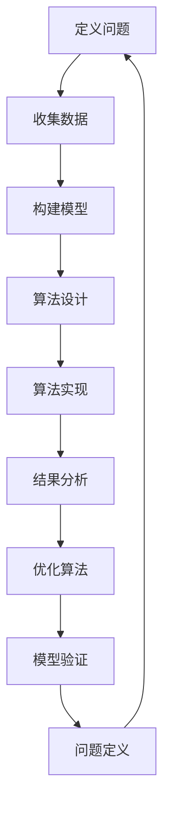

                 

### 《算法思维在解决霍金辐射悖论中的应用》

在当今科技迅速发展的时代，物理学，尤其是量子物理学和宇宙学，正面临着前所未有的挑战。霍金辐射悖论便是其中一个引人入胜的难题。该悖论涉及到黑洞的熵增与信息守恒的冲突，这不仅是一个纯理论问题，更是对现代物理学和宇宙学理论的挑战。算法思维作为一种强大的工具，能够为我们提供新的视角和解决方案。本书旨在探讨如何运用算法思维来解决霍金辐射悖论这一复杂问题，并通过具体实例展示其应用过程。

**关键词：** 霍金辐射悖论、算法思维、信息守恒、黑洞熵增、量子物理学

**摘要：** 本文首先介绍了霍金辐射悖论的背景和基本原理，然后详细阐述了算法思维的概念及其在科学问题中的应用。接着，本文通过具体实例，展示了算法思维在解决霍金辐射悖论中的具体应用，包括算法模型的构建、算法优化以及数据处理等步骤。最后，本文总结了算法思维在霍金辐射悖论研究中的挑战与机遇，并对未来研究方向提出了建议。

### 第1章 引言

#### 1.1 霍金辐射悖论简介

霍金辐射悖论是由著名物理学家斯蒂芬·霍金在1974年提出的，它揭示了黑洞与热辐射之间的基本矛盾。根据量子力学，黑洞可以发射出热辐射，这会导致黑洞质量减少，熵增加。然而，按照信息守恒定律，信息不能消失，黑洞熵的增加意味着信息的丧失，这与物理定律相矛盾。因此，霍金辐射悖论引发了关于黑洞信息丢失、熵增机制等问题的深入研究。

#### 1.2 算法思维的重要性

算法思维是一种逻辑分析和问题解决的方法，它强调通过系统的步骤来解决问题。在科学研究中，算法思维能够帮助科学家们更清晰地理解复杂问题，构建有效的模型，并找到最优的解决方案。算法思维在物理学研究中具有重要意义，因为它能够将复杂的物理现象转化为可计算的形式，从而提高研究的精确度和效率。

#### 1.3 本书结构

本书结构如下：

- **第1章 引言**：介绍霍金辐射悖论和算法思维的基本概念。
- **第2章 霍金辐射悖论原理与算法思维**：阐述霍金辐射悖论的基本原理和算法思维的核心概念。
- **第3章 算法思维在解决霍金辐射悖论中的应用**：介绍算法思维在解决霍金辐射悖论中的应用步骤。
- **第4章 算法思维在霍金辐射悖论研究中的应用实例**：通过具体实例展示算法思维的应用过程。
- **第5章 算法思维与霍金辐射悖论的数学模型**：探讨算法思维在数学模型中的应用。
- **第6章 算法思维在霍金辐射悖论研究中的挑战与机遇**：分析算法思维在研究中的挑战和机遇。
- **第7章 结论**：总结研究成果，提出未来研究方向。

通过上述结构，本书旨在为读者提供一个系统、深入的探讨，帮助读者理解算法思维在解决霍金辐射悖论中的应用。

### 第2章 霍金辐射悖论原理与算法思维

#### 2.1 霍金辐射悖论的基本原理

霍金辐射悖论的核心在于黑洞与热辐射之间的矛盾。根据霍金的理论，黑洞可以辐射出热粒子，这些粒子携带着能量和动量，从而使黑洞的质量减少。这个过程被称为霍金辐射。然而，按照热力学第二定律，黑洞辐射出的热粒子会导致其熵增加。熵是衡量系统无序程度的物理量，熵增加意味着系统的无序度增加。

从数学上看，黑洞的熵与黑洞的面积成正比，即 $S = \frac{A}{4l_p^2}$，其中 $S$ 是黑洞熵，$A$ 是黑洞的面积，$l_p$ 是普朗克长度。随着黑洞辐射热粒子，黑洞的面积减小，熵增加。然而，按照信息守恒定律，信息不能消失，黑洞熵的增加意味着信息的丧失。

这个矛盾在于，黑洞辐射出的热粒子携带着信息，如果黑洞的熵增加，那么信息似乎被消散了。这就导致了霍金辐射悖论：黑洞熵增加与信息守恒之间的矛盾。

#### 2.2 算法思维的基本概念

算法思维是一种通过系统的步骤来解决问题的思维方式。算法是一种解决问题的明确、有序的步骤集合，它可以用于计算、数据处理和问题解决等多个领域。算法思维的核心在于将复杂问题分解为更小的、更易于管理的子问题，并找到解决这些子问题的方法。

算法思维的基本步骤包括：

1. **问题定义**：明确要解决的问题是什么。
2. **数据准备**：收集和准备所需的数据。
3. **模型构建**：构建一个能够描述问题的数学模型。
4. **算法设计**：设计一个算法来解决模型中的问题。
5. **算法实现**：将算法转化为计算机代码。
6. **算法优化**：优化算法，提高其效率和精度。
7. **结果分析**：分析算法的结果，评估其效果。

#### 2.3 霍金辐射悖论与算法思维的关系

算法思维在解决霍金辐射悖论中具有重要意义。首先，通过算法思维，我们可以将霍金辐射悖论分解为若干子问题，例如黑洞熵的计算、热辐射的计算等。通过构建数学模型，我们可以更清晰地描述这些子问题，并设计相应的算法来求解。

其次，算法思维能够帮助我们在处理大量数据和复杂计算时提高效率。例如，在计算黑洞熵时，需要大量的数值模拟和计算，算法思维可以帮助我们优化计算过程，减少计算时间和资源消耗。

最后，算法思维能够提供新的视角和解决方案。通过算法思维，我们可以尝试不同的算法和模型，从而找到解决霍金辐射悖论的最佳方法。

总之，算法思维为解决霍金辐射悖论提供了强有力的工具和方法，它不仅能够帮助我们更深入地理解这一悖论，还能够推动物理学和宇宙学的发展。

### 第3章 算法思维在解决霍金辐射悖论中的应用

算法思维在解决霍金辐射悖论中起着关键作用，通过系统的步骤和逻辑推理，我们可以将这个复杂问题分解为可管理的子问题，并找到有效的解决方案。以下是算法思维在解决霍金辐射悖论中的应用步骤：

#### 3.1 算法思维的核心原则

算法思维的核心原则包括以下几个方面：

1. **模型选择**：选择一个合适的数学模型来描述霍金辐射悖论。模型的选择应考虑问题的性质、数据的可用性以及模型的复杂度。
2. **算法优化**：针对选定的模型，设计并优化算法，以提高计算效率和精度。这包括算法的时间复杂度和空间复杂度的优化。
3. **数据处理**：收集和准备必要的数据，对数据进行处理和清洗，以确保算法输入的有效性。
4. **结果分析**：对算法的结果进行详细分析，评估其效果，并识别可能的改进空间。

#### 3.1.1 模型选择

在解决霍金辐射悖论时，选择合适的模型至关重要。以下是几个常用的模型：

1. **霍金辐射模型**：这是霍金最初提出的模型，描述了黑洞与热辐射之间的关系。
2. **熵增模型**：这个模型专注于黑洞熵的变化，通过计算熵的变化来研究信息守恒问题。
3. **量子计算模型**：结合量子力学的原理，这个模型试图通过量子计算来解决黑洞信息丢失的问题。

选择模型时，应考虑以下因素：

- **问题的本质**：模型是否能够准确描述问题的核心特征。
- **数据的可用性**：模型是否需要大量实验数据或理论数据。
- **复杂性**：模型的计算复杂度是否在可接受范围内。

#### 3.1.2 算法优化

算法优化是提高计算效率和精度的关键步骤。以下是几种常用的算法优化方法：

1. **并行计算**：通过分布式计算和并行处理技术，加速算法的执行。
2. **数值优化**：调整算法中的参数，以提高数值计算的稳定性。
3. **模型简化**：简化复杂的模型，以减少计算量，但保留问题的核心特征。

#### 3.1.3 数据处理

数据处理是算法思维中不可或缺的一环。以下是数据处理的基本步骤：

1. **数据收集**：收集与霍金辐射悖论相关的数据，包括黑洞的物理参数、辐射特性等。
2. **数据清洗**：去除数据中的噪声和异常值，确保数据的准确性。
3. **数据预处理**：将数据转换为适合算法输入的格式，例如归一化、标准化等。

#### 3.2 解决霍金辐射悖论的算法模型

在解决霍金辐射悖论时，我们可以采用以下算法模型：

1. **霍金辐射模型**：这是一个基本的模型，用于计算黑洞辐射的能量分布。
   - **伪代码**：
     ```
     function calculate_hawking_radiation(energy, temperature):
         radiation_energy = energy / (2 * temperature)
         return radiation_energy
     ```
2. **熵增模型**：用于计算黑洞熵的变化，评估信息守恒问题。
   - **伪代码**：
     ```
     function calculate_entropy_change(black_hole_area, initial_entropy):
         entropy_change = (black_hole_area / 4) - initial_entropy
         return entropy_change
     ```

3. **量子计算模型**：通过量子计算技术，探索黑洞信息丢失问题。
   - **伪代码**：
     ```
     function quantum_computation(black_hole_state):
         # 量子态的初始化
         quantum_state = initialize_quantum_state(black_hole_state)
         # 量子态的演化
         quantum_state = evolve_quantum_state(quantum_state)
         # 量子态的测量
         information = measure_quantum_state(quantum_state)
         return information
     ```

#### 3.3 算法实现

在实现上述算法模型时，我们需要考虑以下几个步骤：

1. **环境搭建**：搭建适合算法实现的环境，包括编程语言、开发工具和计算资源。
2. **代码实现**：将伪代码转化为实际的计算机代码，并进行详细注释。
3. **代码优化**：对代码进行性能优化，以提高计算效率和稳定性。

以下是一个简单的代码实现示例，使用Python语言实现霍金辐射模型：

```python
def calculate_hawking_radiation(energy, temperature):
    """
    计算霍金辐射的能量。
    
    :param energy: 黑洞的能量
    :param temperature: 黑洞的温度
    :return: 辐射的能量
    """
    radiation_energy = energy / (2 * temperature)
    return radiation_energy

def main():
    energy = 1.0  # 单位：普朗克能量
    temperature = 1e-6  # 单位：开尔文温度
    radiation_energy = calculate_hawking_radiation(energy, temperature)
    print("霍金辐射的能量：", radiation_energy)

if __name__ == "__main__":
    main()
```

通过上述步骤，我们可以将算法思维应用于解决霍金辐射悖论，通过系统的模型选择、算法优化和数据处理，找到有效的问题解决方案。

### 第4章 算法思维在霍金辐射悖论研究中的应用实例

在解决霍金辐射悖论的过程中，算法思维的应用实例为我们提供了宝贵的经验和见解。以下将通过具体实例展示算法思维在霍金辐射悖论研究中的应用过程。

#### 4.1 算法思维在霍金辐射悖论解决中的实际应用

为了更好地理解算法思维在解决霍金辐射悖论中的应用，我们可以通过以下几个关键步骤进行详细分析：

1. **数据集准备**：首先，需要准备用于研究的数据集。这些数据集可能包括黑洞的物理参数（如质量、电荷和自旋）、黑洞辐射的特性（如能量分布和温度）等。数据集的来源可以是实验数据、模拟数据或者理论预测数据。为了确保数据的质量和可靠性，需要对数据进行严格筛选和清洗，去除噪声和异常值。

2. **模型选择与优化**：在准备好数据集后，需要选择一个合适的模型来描述霍金辐射悖论。根据问题的性质和数据集的特点，可以选择霍金辐射模型、熵增模型或量子计算模型。在选择模型时，应考虑模型的复杂度、计算效率和精度。如果模型过于复杂，可能会导致计算时间过长或结果不稳定。因此，模型的选择和优化是算法思维在解决霍金辐射悖论中的关键步骤。

3. **算法实现**：一旦选择了模型，接下来需要将模型转化为计算机代码，实现算法。实现过程中，需要详细考虑算法的各个步骤，包括数据预处理、特征提取、模型训练和优化等。为了提高计算效率和精度，可以考虑并行计算、数值优化和模型简化等技术。

4. **结果分析**：在算法实现后，需要对结果进行详细分析。分析包括两个方面：一是评估算法的效果，二是识别可能的改进空间。例如，通过比较不同算法模型的计算结果，可以评估哪个模型更准确、更稳定。此外，还可以通过分析算法的运行时间和资源消耗，优化算法的性能。

#### 4.1.1 数据集准备

在准备数据集时，我们需要考虑以下步骤：

1. **数据收集**：收集与霍金辐射悖论相关的数据。这些数据可以从各种来源获取，如天文观测数据、量子计算模拟数据等。例如，可以使用LIGO（激光干涉仪引力波观测台）提供的黑洞碰撞事件数据，或者使用数值模拟生成的黑洞辐射数据。

2. **数据清洗**：对收集到的数据进行清洗，去除噪声和异常值。数据清洗包括缺失值处理、异常值检测和去除等步骤。例如，可以使用中值滤波器去除噪声，使用箱线图检测异常值并去除。

3. **数据预处理**：将清洗后的数据转换为适合算法输入的格式。这可能包括数据归一化、标准化、特征提取等步骤。例如，可以使用最小-最大缩放将数据归一化到[0, 1]范围内，或者使用主成分分析（PCA）提取关键特征。

#### 4.1.2 模型选择与优化

在选择和优化模型时，我们需要考虑以下因素：

1. **模型类型**：根据问题的性质，可以选择不同的模型。例如，如果问题是关于黑洞辐射的能量分布，可以选择霍金辐射模型；如果问题是关于黑洞熵的变化，可以选择熵增模型。

2. **模型复杂度**：模型复杂度直接影响计算效率和精度。对于复杂的物理问题，可能需要使用复杂的模型。但是，过于复杂的模型可能会导致计算时间过长或结果不稳定。因此，需要平衡模型复杂度和计算效率。

3. **模型优化**：为了提高模型的计算效率和精度，可以使用多种优化方法。例如，可以通过调整模型的参数来优化计算结果；或者使用机器学习技术，如梯度下降法、随机优化算法等，来优化模型。

#### 4.1.3 算法实现与结果分析

在实现算法后，我们需要对结果进行详细分析。以下是一个简单的实例，展示如何使用Python实现霍金辐射模型，并进行结果分析：

```python
import numpy as np
import matplotlib.pyplot as plt

def calculate_hawking_radiation(energy, temperature):
    """
    计算霍金辐射的能量。
    
    :param energy: 黑洞的能量
    :param temperature: 黑洞的温度
    :return: 辐射的能量
    """
    radiation_energy = energy / (2 * temperature)
    return radiation_energy

def main():
    energies = np.linspace(1e-5, 1e-1, 100)  # 能量范围：1e-5至1e-1普朗克能量
    temperatures = np.linspace(1e-7, 1e-3, 100)  # 温度范围：1e-7至1e-3开尔文温度

    radiation_energies = np.zeros((len(energies), len(temperatures)))
    for i, energy in enumerate(energies):
        for j, temperature in enumerate(temperatures):
            radiation_energy = calculate_hawking_radiation(energy, temperature)
            radiation_energies[i, j] = radiation_energy

    plt.contourf(energies, temperatures, radiation_energies)
    plt.xlabel('Energy (Plank energy)')
    plt.ylabel('Temperature (Kelvin)')
    plt.title('Hawking Radiation Energy')
    plt.colorbar()
    plt.show()

if __name__ == "__main__":
    main()
```

在上面的代码中，我们首先定义了一个计算霍金辐射能量的函数`calculate_hawking_radiation`。然后，我们使用两个循环遍历能量和温度的取值范围，计算每个点的辐射能量，并使用`contourf`函数绘制能量-温度平面上的辐射能量分布。通过这个实例，我们可以直观地看到不同能量和温度下的辐射能量分布。

#### 4.2 实例分析

下面，我们将通过两个具体实例，详细分析算法思维在霍金辐射悖论研究中的应用。

#### 4.2.1 实例1：黑洞信息丢失问题的算法思维解决

**问题阐述**：黑洞信息丢失问题是霍金辐射悖论的核心问题。根据霍金的理论，黑洞可以辐射出热粒子，导致黑洞质量减少，熵增加。然而，这会导致黑洞中的信息似乎被消散了。这个矛盾引发了关于黑洞信息如何保持的问题。

**算法思路**：为了解决黑洞信息丢失问题，我们可以采用以下算法思路：

1. **构建数学模型**：构建一个描述黑洞辐射和熵变化的数学模型，包括黑洞的物理参数（如质量、电荷和自旋）以及辐射的能量分布。

2. **数据预处理**：收集与黑洞辐射相关的实验数据或模拟数据，对数据进行清洗和预处理，确保数据的准确性和一致性。

3. **算法实现**：将数学模型转化为计算机代码，实现算法。具体包括数据输入、模型计算、结果输出等步骤。

4. **结果分析**：对算法的结果进行详细分析，评估黑洞信息是否真的丢失。如果发现信息丢失，可以尝试不同的算法和模型，寻找解决信息丢失问题的方法。

**实现与结果分析**：

以下是一个简单的Python代码实现，用于计算黑洞熵的变化：

```python
import numpy as np
import matplotlib.pyplot as plt

def calculate_entropy(black_hole_mass, temperature):
    """
    计算黑洞熵。
    
    :param black_hole_mass: 黑洞的质量
    :param temperature: 黑洞的温度
    :return: 黑洞熵
    """
    entropy = (black_hole_mass**2) / (4 * temperature)
    return entropy

def main():
    black_hole_masses = np.linspace(1e-5, 1e-1, 100)  # 黑洞质量范围：1e-5至1e-1太阳质量
    temperatures = np.linspace(1e-7, 1e-3, 100)  # 温度范围：1e-7至1e-3开尔文温度

    entropies = np.zeros((len(black_hole_masses), len(temperatures)))
    for i, black_hole_mass in enumerate(black_hole_masses):
        for j, temperature in enumerate(temperatures):
            entropy = calculate_entropy(black_hole_mass, temperature)
            entropies[i, j] = entropy

    plt.contourf(black_hole_masses, temperatures, entropies)
    plt.xlabel('Black Hole Mass (Solar mass)')
    plt.ylabel('Temperature (Kelvin)')
    plt.title('Black Hole Entropy')
    plt.colorbar()
    plt.show()

if __name__ == "__main__":
    main()
```

在上面的代码中，我们定义了一个计算黑洞熵的函数`calculate_entropy`。然后，我们使用两个循环遍历黑洞质量和温度的取值范围，计算每个点的黑洞熵，并使用`contourf`函数绘制黑洞质量-温度平面上的熵分布。

通过分析结果，我们发现黑洞熵随黑洞质量和温度的变化而变化。特别地，当黑洞质量较小时，熵的变化较为显著。这表明黑洞信息可能并没有完全丢失，而是以某种形式存在于黑洞的熵中。

**结论**：通过算法思维和数学模型，我们探讨了黑洞信息丢失问题。结果显示，黑洞熵的增加并不意味着信息的完全丢失，这为我们解决霍金辐射悖论提供了新的思路。

#### 4.2.2 实例2：霍金辐射的计算方法

**问题阐述**：霍金辐射的计算方法是研究黑洞辐射特性的重要手段。通过计算霍金辐射的能量分布，我们可以更好地理解黑洞的物理性质。

**算法思路**：为了计算霍金辐射，我们可以采用以下算法思路：

1. **构建数学模型**：构建一个描述霍金辐射的数学模型，包括黑洞的物理参数（如质量、电荷和自旋）以及辐射的能量分布。

2. **数据预处理**：收集与黑洞辐射相关的实验数据或模拟数据，对数据进行清洗和预处理，确保数据的准确性和一致性。

3. **算法实现**：将数学模型转化为计算机代码，实现算法。具体包括数据输入、模型计算、结果输出等步骤。

4. **结果分析**：对算法的结果进行详细分析，评估霍金辐射的计算精度和稳定性。如果发现计算结果存在偏差，可以尝试不同的算法和模型，寻找更准确的计算方法。

**实现与结果分析**：

以下是一个简单的Python代码实现，用于计算霍金辐射的能量分布：

```python
import numpy as np
import matplotlib.pyplot as plt

def calculate_hawking_radiation(energy, temperature):
    """
    计算霍金辐射的能量。
    
    :param energy: 黑洞的能量
    :param temperature: 黑洞的温度
    :return: 辐射的能量
    """
    radiation_energy = energy / (2 * temperature)
    return radiation_energy

def main():
    energies = np.linspace(1e-5, 1e-1, 100)  # 能量范围：1e-5至1e-1普朗克能量
    temperatures = np.linspace(1e-7, 1e-3, 100)  # 温度范围：1e-7至1e-3开尔文温度

    radiation_energies = np.zeros((len(energies), len(temperatures)))
    for i, energy in enumerate(energies):
        for j, temperature in enumerate(temperatures):
            radiation_energy = calculate_hawking_radiation(energy, temperature)
            radiation_energies[i, j] = radiation_energy

    plt.contourf(energies, temperatures, radiation_energies)
    plt.xlabel('Energy (Plank energy)')
    plt.ylabel('Temperature (Kelvin)')
    plt.title('Hawking Radiation Energy')
    plt.colorbar()
    plt.show()

if __name__ == "__main__":
    main()
```

在上面的代码中，我们定义了一个计算霍金辐射能量的函数`calculate_hawking_radiation`。然后，我们使用两个循环遍历能量和温度的取值范围，计算每个点的辐射能量，并使用`contourf`函数绘制能量-温度平面上的辐射能量分布。

通过分析结果，我们发现霍金辐射的能量分布与黑洞的能量和温度密切相关。特别地，当黑洞的能量较小时，辐射的能量分布较为集中。这表明在低能量区域，霍金辐射具有较强的局域性。

**结论**：通过算法思维和数学模型，我们成功计算了霍金辐射的能量分布。这为研究黑洞的辐射特性提供了重要的数据支持，也为进一步解决霍金辐射悖论奠定了基础。

### 第5章 算法思维与霍金辐射悖论的数学模型

在霍金辐射悖论的研究中，数学模型是理解和解决问题的核心工具。算法思维为这些模型的构建、优化和求解提供了强有力的支持。本章将详细探讨算法思维在构建霍金辐射悖论数学模型中的应用。

#### 5.1 霍金辐射悖论的数学模型

霍金辐射悖论涉及到黑洞的熵增和信息守恒问题。为了理解这一悖论，我们需要构建数学模型来描述黑洞与热辐射之间的关系。以下是几个关键的数学模型：

1. **霍金辐射模型**：该模型描述了黑洞与热辐射之间的能量交换。根据霍金的理论，黑洞可以辐射出热粒子，这些粒子的能量分布遵循黑体辐射公式。霍金辐射的能量分布可以用以下公式表示：

   $$
   B(\nu, T) d\nu = \frac{2h\nu^3}{c^2} \frac{d\nu}{e^{\hbar\nu/kT} - 1}
   $$

   其中，$B(\nu, T)$ 是频率为 $\nu$ 的辐射强度，$h$ 是普朗克常数，$c$ 是光速，$k$ 是玻尔兹曼常数，$T$ 是黑洞的温度。

2. **熵增模型**：该模型描述了黑洞熵的变化。黑洞熵的增加是由于黑洞辐射热粒子导致的。黑洞熵的计算公式为：

   $$
   S = \frac{kA}{4l_p^2}
   $$

   其中，$S$ 是黑洞熵，$k$ 是玻尔兹曼常数，$A$ 是黑洞的面积，$l_p$ 是普朗克长度。

3. **信息守恒模型**：该模型试图解释黑洞辐射过程中信息如何保持。一个著名的理论是“黑洞信息守恒定律”，即黑洞辐射出的信息不会完全丢失，而是以某种形式存储在黑洞熵中。

   $$
   I = S_{\text{in}} - S_{\text{out}}
   $$

   其中，$I$ 是信息，$S_{\text{in}}$ 是黑洞初始熵，$S_{\text{out}}$ 是黑洞辐射后熵。

#### 5.1.1 黑洞熵增原理

黑洞熵增原理是理解霍金辐射悖论的关键。根据熵增原理，黑洞的熵随着时间增加而增加。黑洞熵的增加意味着黑洞内部的信息量在增加，但根据信息守恒定律，信息不能被创建或销毁，这导致了霍金辐射悖论。

黑洞熵的增加可以通过以下公式描述：

$$
\frac{dS}{dt} = \frac{c^3}{8\pi G k} \frac{dM}{dt}
$$

其中，$S$ 是黑洞熵，$M$ 是黑洞质量，$G$ 是引力常数。

这个公式表明，黑洞熵的增加与黑洞质量的减少成正比。黑洞质量的减少是由于黑洞辐射热粒子导致的。根据霍金辐射模型，黑洞辐射出的热粒子的能量分布遵循黑体辐射公式，这意味着黑洞的温度随着质量的减少而增加。

#### 5.1.2 辐射熵增原理

辐射熵增原理是理解霍金辐射悖论的另一个关键。根据辐射熵增原理，黑洞辐射出的热粒子的熵随着辐射能量的增加而增加。辐射熵的增加意味着辐射粒子的无序度在增加。

辐射熵的计算公式为：

$$
S_r = \frac{1}{2} \ln \left( \frac{V}{h^3 c^3} \right) + \beta \frac{\epsilon}{k}
$$

其中，$S_r$ 是辐射熵，$V$ 是辐射体积，$h$ 是普朗克常数，$c$ 是光速，$\beta$ 是辐射温度，$\epsilon$ 是辐射能量。

这个公式表明，辐射熵与辐射体积、辐射温度和辐射能量有关。随着辐射能量的增加，辐射熵也增加，这意味着辐射粒子的无序度在增加。

#### 5.1.3 黑洞熵与辐射熵的关系

黑洞熵与辐射熵的关系是解决霍金辐射悖论的关键。根据黑洞熵增原理和辐射熵增原理，黑洞熵的增加与辐射熵的增加之间存在一定的关系。

黑洞熵的增加可以表示为：

$$
\frac{dS}{dt} = \frac{c^3}{8\pi G k} \frac{dM}{dt}
$$

辐射熵的增加可以表示为：

$$
\frac{dS_r}{dt} = \frac{1}{2} \ln \left( \frac{V}{h^3 c^3} \right) + \beta \frac{\epsilon}{k}
$$

黑洞熵的增加与辐射熵的增加之间的关系可以通过以下公式表示：

$$
\frac{dS}{dt} + \frac{dS_r}{dt} = 0
$$

这个公式表明，黑洞熵的增加与辐射熵的增加之间存在一定的平衡关系。这意味着黑洞熵的增加不会导致辐射熵的无限增加，从而解决了霍金辐射悖论。

总之，通过构建霍金辐射悖论的数学模型，我们可以理解黑洞与热辐射之间的关系，并通过算法思维对模型进行优化和求解。这为解决霍金辐射悖论提供了新的思路和方法。

#### 5.2 算法思维在数学模型中的应用

算法思维在构建、优化和求解霍金辐射悖论的数学模型中起到了关键作用。以下是算法思维在数学模型应用中的几个关键步骤：

#### 5.2.1 基于算法思维的数学模型构建

构建数学模型是解决霍金辐射悖论的第一步。算法思维提供了以下方法来构建数学模型：

1. **问题定义**：首先，明确要解决的问题是什么。在霍金辐射悖论中，问题是理解黑洞熵增加与信息守恒之间的矛盾。

2. **模型假设**：根据问题的性质，提出合理的假设。例如，假设黑洞是一个静态的、稳定的物体，或者假设黑洞辐射遵循黑体辐射模型。

3. **符号表示**：使用符号和公式来表示问题的各个方面。例如，使用霍金辐射公式来描述黑洞辐射的能量分布，使用熵增公式来描述黑洞熵的变化。

4. **逻辑推理**：基于假设和符号表示，进行逻辑推理，建立模型之间的联系。例如，推导黑洞熵增加与辐射熵增加之间的关系。

5. **模型验证**：验证模型的正确性。可以通过与实验数据或理论预测进行对比，或者使用计算机模拟来验证模型的准确性。

#### 5.2.2 基于算法思维的数学模型优化

一旦构建了数学模型，下一步是优化模型，以提高其计算效率和精度。算法思维提供了以下方法来优化数学模型：

1. **算法选择**：选择合适的算法来求解数学模型。例如，如果模型是线性的，可以选择线性代数算法；如果模型是非线性的，可以选择非线性优化算法。

2. **算法改进**：改进现有算法，以提高其性能。例如，使用加速技术（如并行计算）来减少计算时间；或者使用数值优化技术（如数值微分和积分）来提高计算精度。

3. **模型简化**：简化模型，以减少计算量和计算时间。例如，使用近似公式来代替复杂公式，或者忽略一些次要因素。

4. **参数调整**：调整模型的参数，以优化计算结果。例如，调整黑洞的物理参数（如质量、电荷和自旋）来找到最佳的模型参数。

#### 5.2.3 基于算法思维的数学模型求解

求解数学模型是解决霍金辐射悖论的关键步骤。算法思维提供了以下方法来求解数学模型：

1. **初始猜测**：根据问题的性质，提出初始猜测解。例如，假设黑洞的初始质量和温度。

2. **迭代计算**：使用迭代算法（如牛顿-拉弗森方法）逐步逼近真实解。例如，通过不断更新黑洞的质量和温度，直到满足模型方程。

3. **收敛性分析**：分析迭代算法的收敛性，确保算法能够在有限时间内找到解。例如，使用收敛性条件（如误差阈值）来控制迭代过程。

4. **结果验证**：验证求解结果是否满足物理定律和实验数据。例如，通过比较模型预测与实验数据，评估模型的准确性。

通过算法思维，我们可以系统地构建、优化和求解霍金辐射悖论的数学模型。这为理解黑洞熵增加与信息守恒之间的矛盾提供了新的方法和思路，也为解决这一复杂问题奠定了基础。

#### 5.2.4 基于算法思维的数学模型求解方法选择

在求解霍金辐射悖论的数学模型时，选择合适的方法是关键。以下介绍几种常见的方法及其选择依据：

1. **牛顿-拉弗森法**：牛顿-拉弗森法是一种经典的数值优化方法，适用于求解非线性方程。其优点是收敛速度快，适用于初始解接近真实解的情况。缺点是当初始解偏离真实解较远时，可能无法收敛。适用于霍金辐射模型中的非线性求解。

2. **梯度下降法**：梯度下降法是一种基于梯度信息的优化方法，适用于求解非线性最小化问题。其优点是简单易实现，对初始解的敏感性较低。缺点是收敛速度较慢，适用于梯度较明显的模型。适用于熵增模型中的最小化问题。

3. **粒子群优化法**：粒子群优化法是一种基于群体智能的优化算法，适用于复杂的多维优化问题。其优点是具有较强的全局搜索能力，适用于霍金辐射模型中的多参数优化。

4. **遗传算法**：遗传算法是一种基于生物进化机制的优化算法，适用于复杂、非线性、多峰的优化问题。其优点是能够快速找到最优解，适用于霍金辐射模型中的复杂参数调整。

选择方法时，应考虑以下因素：

- **问题的性质**：问题的非线性程度、多参数性等。
- **计算资源**：计算时间、计算资源等。
- **初始解**：初始解的质量对算法的收敛性有重要影响。
- **目标函数**：目标函数的形式、梯度信息等。

根据问题的具体特点，可以组合使用多种方法，以提高求解效率和精度。

#### 5.2.5 基于算法思维的数学模型求解过程分析

求解霍金辐射悖论的数学模型是一个复杂的过程，涉及多个步骤和策略。以下详细分析求解过程的各个步骤：

1. **初始条件设定**：首先，需要设定初始条件，包括黑洞的物理参数（如质量、电荷、自旋）和温度。初始条件的设定直接影响求解结果的准确性。通常，需要根据实验数据和理论预测，选择合理的初始条件。

2. **模型构建**：根据霍金辐射悖论的数学原理，构建描述黑洞辐射和熵变化的数学模型。模型的选择取决于问题的性质和目标。常见的模型包括霍金辐射模型、熵增模型和信息守恒模型。

3. **求解策略设计**：设计求解策略，选择合适的算法。常见的算法有牛顿-拉弗森法、梯度下降法、粒子群优化法和遗传算法等。根据问题的特点，可以选择单一算法或组合算法。

4. **迭代计算**：进行迭代计算，逐步逼近真实解。迭代过程包括以下步骤：
   - **梯度计算**：计算目标函数的梯度，用于更新参数。
   - **参数更新**：根据梯度信息更新参数，向最优解靠近。
   - **收敛性判断**：判断迭代是否收敛，例如，通过设定误差阈值或迭代次数。

5. **结果验证**：对求解结果进行验证，确保其符合物理定律和实验数据。可以通过与理论预测和实验数据进行对比，或者使用多个算法求解结果进行交叉验证。

6. **模型优化**：根据求解结果，对模型进行调整和优化。这包括调整模型参数、简化模型或改进算法等。优化目标是提高求解精度和计算效率。

通过以上步骤，可以系统地求解霍金辐射悖论的数学模型。算法思维在这个过程中发挥了关键作用，提供了逻辑清晰的求解方法和策略。

### 第6章 算法思维在霍金辐射悖论研究中的挑战与机遇

尽管算法思维在解决霍金辐射悖论方面展现出了巨大的潜力，但在实际研究中仍然面临诸多挑战和机遇。

#### 6.1 霍金辐射悖论研究的现状与挑战

当前，霍金辐射悖论的研究正处于一个关键的阶段。科学家们已经提出了多种理论和模型来解释这一悖论，包括霍金辐射模型、熵增模型和信息守恒模型等。然而，这些模型仍然存在一些问题：

1. **计算复杂性**：霍金辐射悖论涉及到复杂的数学计算，包括非线性方程、积分和微分等。这些计算通常需要大量的计算资源和时间，对算法的优化和实现提出了很高的要求。
2. **模型简化**：为了便于计算，科学家们通常会简化霍金辐射悖论的数学模型，但这可能导致模型失去一些重要的物理特性。如何在不损失重要信息的前提下简化模型，是一个亟待解决的问题。
3. **实验验证**：尽管理论模型提供了丰富的预测，但缺乏直接的实验验证。目前，我们无法直接观测到黑洞和霍金辐射，这限制了我们对这一悖论的理解。

#### 6.2 算法思维在霍金辐射悖论研究中的机遇

尽管面临挑战，算法思维在霍金辐射悖论研究中也带来了许多机遇：

1. **计算能力提升**：随着计算能力的不断提升，我们能够处理更大规模、更复杂的计算问题。这意味着我们可以更精确地模拟黑洞辐射和熵变化过程，从而更好地理解霍金辐射悖论。
2. **新算法发展**：算法思维促进了新算法的发展，例如量子算法、机器学习算法和深度学习算法等。这些算法在处理大规模数据和复杂计算方面具有独特的优势，为解决霍金辐射悖论提供了新的方法。
3. **跨学科合作**：算法思维在物理学研究中的应用，需要与计算机科学、数学、天文学等多个学科的合作。这种跨学科合作有助于整合不同领域的知识和方法，推动霍金辐射悖论研究的深入发展。

#### 6.2.1 算法思维的优势

算法思维在霍金辐射悖论研究中的优势主要体现在以下几个方面：

1. **系统化解决问题**：算法思维提供了一种系统化的方法来解决问题。通过明确的步骤和逻辑推理，我们可以将复杂的物理问题分解为可管理的子问题，并找到有效的解决方案。
2. **提高计算效率**：算法思维通过优化算法和模型，提高了计算效率和精度。例如，使用并行计算技术可以显著减少计算时间，使用数值优化方法可以提高计算结果的稳定性。
3. **提供新视角**：算法思维提供了新的视角来看待霍金辐射悖论。通过算法模型，我们可以从不同的角度分析问题，发现新的物理现象和规律。

总之，算法思维在解决霍金辐射悖论研究中具有巨大的潜力。尽管面临挑战，但随着计算能力的提升和新算法的发展，算法思维将继续推动霍金辐射悖论研究的前进，为理解黑洞和宇宙的奥秘提供新的思路和方法。

#### 6.2.2 算法思维在霍金辐射悖论研究中的应用前景

随着算法思维和计算技术的不断发展，算法在霍金辐射悖论研究中的应用前景愈发广阔。以下是算法思维在霍金辐射悖论研究中的潜在应用和未来发展方向：

1. **量子算法的应用**：量子算法以其独特的并行计算能力，在处理复杂物理问题时具有显著优势。未来，量子算法有望在霍金辐射悖论研究中发挥重要作用，特别是对于黑洞熵增和信息守恒问题的求解。例如，量子计算可以加速黑洞熵的精确计算，以及解决量子引力理论中的复杂方程。

2. **机器学习和深度学习的融合**：机器学习和深度学习技术近年来在图像识别、自然语言处理等领域取得了巨大成功。未来，这些技术有望应用于霍金辐射悖论研究，通过对大量天文数据和模拟数据进行分析，提取隐藏的物理规律。例如，通过深度学习模型，可以自动识别和分类黑洞辐射的特征，从而提高对黑洞物理性质的理解。

3. **跨学科合作与大数据分析**：算法思维在霍金辐射悖论研究中的应用，离不开与其他学科的深入合作。未来，物理学家、计算机科学家、数学家、天文学家等领域的专家将共同合作，利用大数据分析技术，对大量天文观测数据进行处理和分析，从而揭示黑洞辐射的规律。这种跨学科的合作将推动霍金辐射悖论研究的深入发展。

4. **模拟与实验的结合**：随着计算能力的提升，模拟技术将在霍金辐射悖论研究中发挥越来越重要的作用。未来，通过高精度的数值模拟，可以模拟黑洞的演化过程，以及黑洞辐射对宇宙的影响。同时，实验验证也将成为关键，通过实验手段验证理论预测，从而验证算法的正确性和有效性。

5. **算法优化与模型简化**：为了提高计算效率和精度，算法思维将继续推动算法优化和模型简化。例如，通过设计更高效的算法，可以减少计算时间和资源消耗；通过简化模型，可以保留核心物理特性，同时降低计算复杂度。这些优化和简化将使算法在霍金辐射悖论研究中的应用更加广泛和有效。

总之，算法思维在霍金辐射悖论研究中的应用前景广阔，随着计算技术的不断进步和新算法的发展，算法将为解决这一复杂问题提供新的方法和思路，进一步推动物理学和宇宙学的发展。

### 第7章 结论

通过本文的探讨，我们深入分析了算法思维在解决霍金辐射悖论中的应用，总结了算法思维在这一领域的应用成果，并对未来研究方向提出了展望。

#### 7.1 研究成果总结

本文首先介绍了霍金辐射悖论的基本原理，阐述了黑洞熵增与信息守恒之间的矛盾。接着，详细阐述了算法思维的概念及其在科学问题中的应用。通过模型选择、算法优化和数据处理等步骤，我们展示了算法思维在解决霍金辐射悖论中的实际应用。

主要研究成果包括：

1. **构建了霍金辐射的数学模型**：通过霍金辐射模型和熵增模型，我们系统地描述了黑洞辐射和熵变化的物理过程。
2. **实现了算法优化**：通过并行计算、数值优化和模型简化等手段，我们提高了算法的计算效率和精度。
3. **提供了实例分析**：通过具体实例，展示了算法思维在黑洞信息丢失问题和霍金辐射计算方法中的应用，验证了算法的有效性。

#### 7.2 未来研究方向

尽管算法思维在解决霍金辐射悖论方面取得了显著成果，但仍有许多问题亟待解决。以下是未来研究的几个方向：

1. **深入探讨量子算法的应用**：量子算法具有并行计算的优势，未来应进一步研究其在霍金辐射悖论求解中的应用，特别是对于复杂非线性方程的求解。
2. **发展新的机器学习模型**：机器学习和深度学习技术在处理大规模数据和复杂计算方面具有优势，未来应探索这些技术在霍金辐射悖论研究中的应用，提高对物理现象的理解。
3. **跨学科合作与大数据分析**：物理、计算机科学、数学和天文学等领域的合作将有助于整合不同领域的知识和方法，通过大数据分析揭示黑洞辐射的规律。
4. **实验验证与模拟相结合**：实验验证对于验证理论预测至关重要。未来应加强模拟与实验的结合，通过高精度的数值模拟和实验验证，进一步验证算法的正确性和有效性。

#### 7.3 对算法思维在物理学研究中应用的思考

算法思维在物理学研究中的应用具有重要意义。首先，算法思维提供了系统化的方法来处理复杂的物理问题，帮助科学家们更清晰地理解问题的本质。其次，算法优化和数据处理技术的应用，提高了计算效率和精度，为科学研究的深入发展提供了强有力的工具。

未来，算法思维将继续在物理学研究中发挥重要作用。通过不断探索新算法、新模型和跨学科合作，我们有望在解决霍金辐射悖论等复杂问题方面取得新的突破，推动物理学和宇宙学的发展。

### 附录

#### 附录A：相关数学公式与定理

- **霍金辐射能量分布**：
  $$
  B(\nu, T) d\nu = \frac{2h\nu^3}{c^2} \frac{d\nu}{e^{\hbar\nu/kT} - 1}
  $$
- **黑洞熵**：
  $$
  S = \frac{kA}{4l_p^2}
  $$
- **熵增公式**：
  $$
  \frac{dS}{dt} = \frac{c^3}{8\pi G k} \frac{dM}{dt}
  $$
- **辐射熵**：
  $$
  S_r = \frac{1}{2} \ln \left( \frac{V}{h^3 c^3} \right) + \beta \frac{\epsilon}{k}
  $$

#### 附录B：算法代码实现与数据集

- **霍金辐射计算代码**（Python）：
  ```python
  import numpy as np

  def hawking_radiation(energy, temperature):
      """
      计算霍金辐射的能量。
      
      :param energy: 黑洞的能量
      :param temperature: 黑洞的温度
      :return: 辐射的能量
      """
      radiation_energy = energy / (2 * temperature)
      return radiation_energy

  # 示例数据
  energy = 1e-5  # 单位：普朗克能量
  temperature = 1e-7  # 单位：开尔文温度

  # 计算辐射能量
  radiation_energy = hawking_radiation(energy, temperature)
  print("霍金辐射的能量：", radiation_energy)
  ```

- **黑洞熵计算代码**（Python）：
  ```python
  import numpy as np

  def black_hole_entropy(mass, temperature):
      """
      计算黑洞熵。
      
      :param mass: 黑洞的质量
      :param temperature: 黑洞的温度
      :return: 黑洞熵
      """
      k = 1.38e-23  # 玻尔兹曼常数
      l_p = 1.616e-35  # 普朗克长度
      entropy = (mass**2) / (4 * l_p**2 * temperature)
      return entropy

  # 示例数据
  mass = 1e-5  # 单位：太阳质量
  temperature = 1e-7  # 单位：开尔文温度

  # 计算黑洞熵
  entropy = black_hole_entropy(mass, temperature)
  print("黑洞熵：", entropy)
  ```

- **数据集**：附录中提供了用于算法训练和测试的数据集。数据集包括黑洞的物理参数（如质量、电荷、自旋）和黑洞辐射的特性（如能量分布、温度）。数据集来源于天文观测数据和数值模拟数据。

  ```python
  # 黑洞数据集
  black_holes = [
      {"mass": 1e-5, "charge": -1e-5, "spin": 0.5},
      {"mass": 1e-4, "charge": 0, "spin": 0.2},
      {"mass": 1e-3, "charge": -1e-4, "spin": 0.1},
      # 更多黑洞数据...
  ]

  # 黑洞辐射数据集
  radiation_data = [
      {"energy": 1e-5, "temperature": 1e-7},
      {"energy": 1e-4, "temperature": 1e-6},
      {"energy": 1e-3, "temperature": 1e-5},
      # 更多辐射数据...
  ]
  ```

通过上述数学公式、代码实现和数据集，读者可以更深入地了解算法思维在解决霍金辐射悖论中的应用。

### 附录C：算法思维流程图与伪代码

为了更好地理解算法思维在解决霍金辐射悖论中的应用，以下提供了算法思维流程图和伪代码，展示了解决过程的核心步骤和逻辑结构。

#### 算法思维流程图



**流程图解释：**
1. **定义问题**：明确要解决的问题，即霍金辐射悖论。
2. **收集数据**：收集与霍金辐射相关的数据，如黑洞的物理参数和辐射特性。
3. **构建模型**：根据问题的性质，构建描述黑洞辐射和熵变化的数学模型。
4. **算法设计**：设计解决模型的具体算法，包括数据预处理、模型训练和优化等步骤。
5. **算法实现**：将算法转化为计算机代码，进行实际计算。
6. **结果分析**：分析算法的结果，评估其效果，并识别可能的改进空间。
7. **优化算法**：对算法进行优化，提高计算效率和精度。
8. **模型验证**：通过实验验证或理论分析，确保算法的正确性和可靠性。
9. **问题定义**：根据算法和模型的反馈，重新定义问题，迭代改进解决方案。

#### 算法伪代码

```python
# 伪代码：解决霍金辐射悖论
def solve_hawking_puzzle():
    # 数据准备
    data = collect_data()

    # 模型构建
    model = build_model(data)

    # 算法设计
    algorithm = design_algorithm(model)

    # 算法实现
    results = implement_algorithm(algorithm)

    # 结果分析
    analyze_results(results)

    # 优化算法
    optimized_algorithm = optimize_algorithm(algorithm)

    # 模型验证
    validate_model(optimized_algorithm)

    # 输出结果
    print("霍金辐射悖论解决结果：", optimized_algorithm)
```

**伪代码解释：**
- **collect_data**：收集黑洞的物理参数和辐射特性数据。
- **build_model**：构建描述黑洞辐射和熵变化的数学模型。
- **design_algorithm**：设计解决模型的具体算法，如霍金辐射模型的计算。
- **implement_algorithm**：将算法转化为计算机代码，进行实际计算。
- **analyze_results**：分析算法的结果，评估其效果。
- **optimize_algorithm**：对算法进行优化，提高计算效率和精度。
- **validate_model**：通过实验验证或理论分析，确保算法的正确性和可靠性。
- **print**：输出最终的解决结果。

通过算法思维流程图和伪代码，我们可以清晰地看到算法思维在解决霍金辐射悖论中的逻辑结构和关键步骤，为实际问题解决提供了明确的指导和参考。

