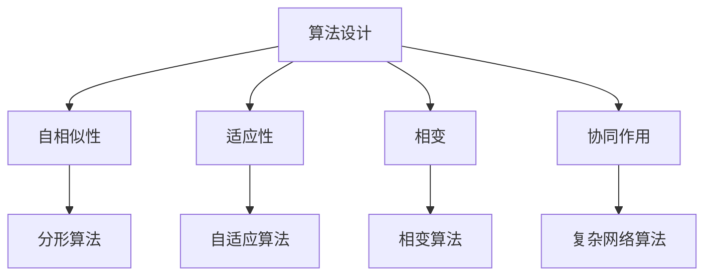
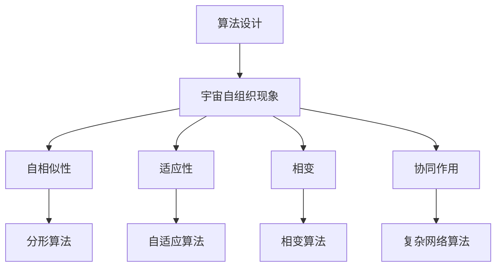

                 

### 引言与核心概念

在科技迅速发展的今天，算法设计已经成为计算机科学的核心领域之一。高效的算法不仅能够解决复杂问题，还能极大地提高系统的性能和效率。然而，算法设计的灵感源泉不仅仅是数学和计算机科学内部的发展，自然界中的自组织现象也为算法设计提供了丰富的启示。

宇宙自组织现象是指自然界中各种系统在没有外部干预的情况下，通过自我组织形成有序结构的规律性现象。从细胞到生态系统，从星系到宇宙，自组织现象无处不在。近年来，科学家们发现，许多复杂的算法设计都可以借鉴宇宙自组织现象中的原理，从而设计出更加高效、鲁棒的算法。

本书旨在探讨宇宙自组织现象与算法设计之间的联系，通过一系列的分析和实例，展示如何将宇宙中的自组织原理应用到算法设计中。具体来说，我们将：

1. 引入算法设计的重要性，阐述其在计算机科学中的核心地位。
2. 阐述宇宙自组织现象的基本原理，解释其对算法设计的启示。
3. 分析宇宙自组织现象与算法设计之间的内在联系，并通过Mermaid流程图进行直观展示。
4. 构建完整的文章结构，明确各部分内容。

在接下来的内容中，我们将首先介绍算法设计的基本概念，然后详细探讨宇宙自组织现象的基本原理，并揭示二者之间的联系。通过这些铺垫，读者将能够更好地理解后续章节中具体算法设计和应用实例的论述。

#### 1.1 算法设计的重要性

算法设计是计算机科学和工程领域的基石，它涉及到问题的定义、解决方案的搜索和验证。高效算法不仅能解决复杂的计算问题，还能极大地提升系统的性能和效率。在实际应用中，算法设计的优劣直接决定了软件和系统的成败。以下是算法设计在计算机科学中的几个关键作用：

- **问题解决能力**：算法提供了一种系统化的方法来解决问题，它将问题分解为可管理的子问题，并通过递归或迭代的方式逐步解决。例如，排序算法可以高效地对大量数据进行排序，查找算法可以快速定位特定数据。

- **优化性能**：算法设计的目标之一是优化性能，包括时间复杂度和空间复杂度。通过选择合适的算法，可以减少计算时间和资源消耗，从而提高系统的响应速度和处理能力。例如，动态规划算法通过避免重复计算，显著降低了时间复杂度。

- **可靠性**：算法的可靠性是指其在不同情况下都能正确执行的能力。通过精心设计的算法，可以确保系统在各种异常情况下都能保持稳定运行。例如，错误检测和恢复算法可以在数据传输过程中检测并纠正错误，保证数据传输的可靠性。

- **创新动力**：算法设计推动了计算机科学的进步和创新。新的算法和技术不断涌现，促进了新的应用和发展。例如，深度学习算法的进步推动了人工智能的发展，使其在图像识别、自然语言处理等领域取得了显著突破。

算法设计的重要性不仅体现在计算机科学领域，它在实际应用中也无处不在。以下是一些典型的应用场景：

- **数据科学**：数据科学家经常需要处理大量数据，而高效的数据处理算法是数据科学的核心。例如，MapReduce算法可以高效地处理大数据集，提取有价值的信息。

- **网络通信**：在网络通信中，算法用于路由选择、数据加密和错误检测等。例如，路由算法确保数据在网络中的高效传输，而加密算法则保护数据的安全性。

- **人工智能**：人工智能的核心是算法，无论是机器学习、深度学习还是自然语言处理，都依赖于高效的算法设计。例如，卷积神经网络（CNN）通过高效的算法实现了图像识别和分类。

- **金融工程**：金融工程师使用算法进行风险管理、市场分析和资产定价。例如，蒙特卡罗模拟算法用于计算金融衍生品的价格，优化投资组合。

- **生物信息学**：生物信息学中，算法用于基因序列分析、蛋白质结构预测和疾病诊断。例如，BLAST算法用于快速比对基因序列，识别相似序列。

总之，算法设计是计算机科学和工程中不可或缺的一部分，它为解决复杂问题提供了强有力的工具。通过引入宇宙自组织现象的基本原理，我们可以进一步探索算法设计的创新路径，提升算法的效率和鲁棒性。

#### 1.2 宇宙自组织现象的启示

宇宙自组织现象是自然界中一种普遍存在的现象，它揭示了复杂系统在没有外部干预的情况下，如何通过自我组织和协同作用形成有序结构的规律。从星系的形成到生物的进化，从生态系统的稳定到大脑的复杂功能，宇宙中的许多现象都可以通过自组织原理来解释。

自组织现象的基本原理可以概括为以下几个关键点：

1. **自相似性**：自相似性是指系统在不同尺度上表现出相似的结构和功能。这一特性使得系统可以在不同的层次上重复其组织模式。例如，分形几何中的海岸线、树的结构和海龟的图案都具有自相似性。

2. **适应性**：自组织系统能够根据环境变化调整自身结构，以保持稳定性和适应性。例如，生态系统中的物种通过自然选择和适应环境压力来演化，形成多样化的生态系统。

3. **相变**：相变是指系统从一种状态转变为另一种状态，例如从固态到液态的转变。在自组织现象中，相变通常伴随着系统结构的显著变化和新的有序形态的出现。

4. **协同作用**：自组织系统中的各个组成部分通过协同作用实现整体的功能和稳定性。例如，细胞中的各种分子通过协同作用完成生命过程，星系中的恒星通过引力相互作用形成复杂的结构。

宇宙自组织现象为算法设计提供了丰富的启示。首先，自相似性原理可以启发我们设计出具有可扩展性的算法。分形算法就是这种思想的典型应用，它通过递归地细化图像或数据结构，实现对复杂系统的建模。其次，适应性原理可以引导我们开发自适应算法，使算法能够根据输入数据和环境动态调整自身行为，提高鲁棒性和效率。最后，相变和协同作用原理可以用于设计分布式算法和复杂网络算法，这些算法通过节点之间的协作和相互影响，实现全局优化和高效计算。

通过引入宇宙自组织现象的这些基本原理，我们可以更好地理解算法设计的本质，探索新的算法设计思路，从而推动计算机科学的发展。在接下来的内容中，我们将进一步探讨这些原理在算法设计中的应用，并通过实例展示其具体实现。

#### 1.3 本书结构安排

本书将系统地探讨宇宙自组织现象与算法设计之间的紧密联系，分为五个主要部分，每个部分都有明确的目标和内容安排。

**第一部分：引言与核心概念**
这部分将介绍算法设计的重要性，阐述宇宙自组织现象的基本原理，并揭示二者之间的联系。通过Mermaid流程图，我们直观地展示自组织现象在算法设计中的应用，为后续内容打下坚实的基础。

**第二部分：算法设计的基本原理**
这部分将深入探讨自组织现象的数学模型，包括自组织系统的基本特性、相变理论、分形几何与自相似性等。通过详细的数学公式和伪代码，我们解析自组织原理在算法设计中的应用，帮助读者理解这些概念的具体实现。

**第三部分：宇宙自组织现象在算法设计中的具体应用**
这部分将介绍分形算法、智能优化算法和复杂网络算法等具体应用，通过实际案例展示这些算法在图像处理、优化问题和社交网络分析等领域的应用。我们将详细讲解每个算法的原理和伪代码实现，并提供代码实战案例。

**第四部分：案例研究**
这部分将通过两个具体案例研究，深入探讨宇宙自组织现象在生物信息学和气象预报等领域的应用。我们将详细介绍案例的背景、算法设计、伪代码实现和代码解读，展示自组织现象如何解决实际问题。

**第五部分：结论与展望**
这部分将对全书内容进行总结，强调算法设计与宇宙自组织现象之间的联系，提出未来研究的方向，并对读者寄语，鼓励他们在算法设计领域继续探索和创新。

通过这本书，读者不仅可以系统地了解宇宙自组织现象与算法设计之间的关系，还能掌握一系列实用的算法设计和应用技巧，为未来的研究和实际应用奠定基础。

#### 2. 核心概念与联系

为了深入探讨宇宙自组织现象与算法设计之间的联系，我们首先需要明确这两个核心概念的基本原理和架构。通过对比和分析，我们能够更好地理解这些概念如何相互影响，并为算法设计提供灵感。

##### 2.1 算法的定义

算法是一种解决问题的有序步骤，它可以通过执行一系列操作来达到预期目标。算法具有以下基本特征：

- **有序性**：算法的步骤必须按照特定的顺序执行，以确保解决问题的正确性。
- **确定性**：算法的每一步都应该是确定的，即在相同输入下，算法总是产生相同的输出。
- **有效性**：算法必须在合理的时间内完成计算，并且能够找到问题的解。

在计算机科学中，算法通常用于数据处理、优化问题、排序和搜索等。例如，排序算法（如快速排序、归并排序）通过一系列操作，将数据元素按特定顺序排列；搜索算法（如二分搜索、广度优先搜索）用于在数据结构中查找特定元素。

##### 2.2 自组织现象的基本原理

自组织现象是指系统在没有外部干预的情况下，通过内部相互作用和协同作用形成有序结构的过程。自组织现象的基本原理包括：

- **自相似性**：系统在不同尺度上表现出相似的结构和功能，这种特性称为自相似性。例如，分形几何中的海岸线和树的结构。
- **适应性**：系统能够根据环境变化调整自身结构，以保持稳定性和适应性。例如，生态系统中的物种通过自然选择和适应环境压力来演化。
- **相变**：系统从一种状态转变为另一种状态，通常伴随着系统结构的显著变化。例如，水从液态变为固态（冰）。
- **协同作用**：系统中的各个组成部分通过协同作用实现整体的功能和稳定性。例如，细胞中的各种分子通过协同作用完成生命过程。

##### 2.3 宇宙自组织现象与算法设计的联系

宇宙自组织现象与算法设计之间存在深刻的联系，这种联系体现在以下几个方面：

1. **自相似性与分形算法**：自相似性原理启发了分形算法的设计。分形算法通过递归细化图像或数据结构，实现对复杂系统的建模。例如，分治算法（如快速排序、归并排序）和分形填充算法（如分形填充曲线）都是自相似性原理的具体应用。

2. **适应性原理与自适应算法**：适应性原理指导我们开发自适应算法，这些算法能够根据输入数据和环境动态调整自身行为，提高鲁棒性和效率。例如，遗传算法和粒子群优化算法都基于适应性原理，通过迭代和进化过程找到最优解。

3. **相变理论与相变算法**：相变理论揭示了系统在临界点从一种状态转变为另一种状态的特性。相变算法通过利用这种特性，实现复杂问题的优化。例如，模拟退火算法通过模拟热力学系统的相变过程，找到全局最优解。

4. **协同作用与复杂网络算法**：协同作用原理指导我们设计复杂网络算法，这些算法通过节点之间的相互作用和协同作用，实现全局优化和高效计算。例如，社会网络分析算法和图论算法都利用协同作用原理，分析网络结构和信息传播。

为了直观地展示宇宙自组织现象与算法设计的关系，我们使用Mermaid流程图进行描述：



通过这个Mermaid流程图，我们可以清晰地看到宇宙自组织现象的基本原理如何引导算法设计，以及这些算法在设计复杂系统中的应用。

##### 2.4 Mermaid流程图：自组织现象与算法设计的关系

为了更好地展示宇宙自组织现象与算法设计之间的联系，我们使用Mermaid流程图来构建一个简洁明了的关系图。以下是一个Mermaid流程图的例子，它描述了自组织现象的基本原理与算法设计之间的关联：



**图解：**

- **A[算法设计]**：代表整个算法设计过程。
- **B[宇宙自组织现象]**：表示宇宙中普遍存在的自组织现象。
- **C1[自相似性]**、**C2[适应性]**、**C3[相变]**、**C4[协同作用]**：分别代表自组织现象的四个基本原理。
- **D1[分形算法]**、**D2[自适应算法]**、**D3[相变算法]**、**D4[复杂网络算法]**：表示基于自组织现象基本原理的四种具体算法设计。

通过这个流程图，我们可以直观地看到自组织现象的基本原理如何引导算法设计，并具体应用到不同的算法中。这种关系不仅揭示了宇宙自然规律与算法设计之间的联系，也为未来的算法创新提供了理论依据和实践指导。

### 2.5 算法的基本概念

算法是计算机科学和数学中的核心概念，它描述了解决特定问题的系统化步骤。为了更好地理解算法在计算机科学中的应用，我们首先需要明确算法的定义和几个关键特性。

**算法的定义：**

算法是一系列明确的、可执行的步骤，用于解决问题或完成特定任务。这些步骤必须按照特定的顺序执行，以确保问题能够得到正确的解决。算法具有以下关键特征：

1. **确定性**：算法的每一步都应该是确定的，即对于相同的输入，算法总是产生相同的输出。
2. **有序性**：算法的步骤必须按照特定的顺序执行，这种有序性确保了解决问题的正确性。
3. **有效性**：算法必须在合理的时间内完成计算，并且能够找到问题的解。

**算法的特性：**

1. **正确性**：算法必须能够在所有合法输入下正确执行，并产生正确的输出。
2. **效率**：算法的效率通常通过时间复杂度和空间复杂度来衡量。时间复杂度描述算法执行时间与问题规模的关系，而空间复杂度描述算法所需内存与问题规模的关系。高效的算法能够减少计算时间和资源消耗。
3. **健壮性**：算法的健壮性是指其在面对异常输入或错误条件时的稳定性。一个健壮的算法能够在各种情况下保持稳定运行，不会因为输入数据的微小变化而导致错误。

**算法的分类：**

算法可以根据不同的标准进行分类，以下是几种常见的分类方法：

1. **根据解决问题的方式分类**：
   - **确定性算法**：每一步都是确定无疑的，适用于问题规模较小且输入明确的情况。
   - **随机化算法**：在执行过程中引入随机元素，用于解决一些确定性算法无法解决的问题。

2. **根据算法结构分类**：
   - **递归算法**：通过递归调用自身来解决问题的算法。
   - **迭代算法**：通过循环结构重复执行特定步骤，逐步解决问题的算法。
   - **分治算法**：将大问题分解为多个小问题，分别解决，然后合并结果。

3. **根据算法的应用领域分类**：
   - **算法设计算法**：用于设计其他算法的算法，如动态规划、贪心算法。
   - **优化算法**：用于寻找最优解或近似最优解的算法，如遗传算法、粒子群优化算法。
   - **搜索算法**：用于在数据结构中查找特定元素的算法，如深度优先搜索、广度优先搜索。

**算法的基本概念在计算机科学中的应用：**

算法在计算机科学中的应用非常广泛，以下是一些典型的应用领域：

1. **数据处理**：算法用于处理大量数据，如排序算法（快速排序、归并排序）、查找算法（二分查找）。
2. **优化问题**：算法用于解决各种优化问题，如最短路径问题（迪杰斯特拉算法）、旅行商问题（遗传算法）。
3. **人工智能**：算法在人工智能领域中起着核心作用，如深度学习算法、强化学习算法。
4. **网络通信**：算法用于优化网络性能，如路由算法（Dijkstra算法）、加密算法（RSA算法）。
5. **图像处理**：算法用于图像压缩、边缘检测、图像识别等，如小波变换、卷积神经网络。
6. **金融工程**：算法用于风险管理、市场分析、资产定价等，如蒙特卡罗模拟、动态规划。

通过明确算法的基本概念和特性，我们可以更好地理解算法在计算机科学中的核心作用，并为实际应用中的算法设计提供理论依据。在接下来的章节中，我们将进一步探讨宇宙自组织现象的基本原理，并揭示其在算法设计中的应用。

### 2.6 自组织现象的基本原理

自组织现象是指系统在没有外部干预的情况下，通过内部相互作用和协同作用形成有序结构的过程。这一现象在自然界中广泛存在，从简单的化学反应到复杂的生态系统，从细胞的自我组织到整个宇宙的结构，都可以观察到自组织现象。为了深入理解自组织现象，我们需要探讨其基本原理，包括自相似性、适应性、相变和协同作用等。

**自相似性**

自相似性是指系统在不同尺度上表现出相似的结构和功能。这意味着无论我们观察系统的哪个部分，都会发现与整体相似的模式。分形几何是自相似性的一个典型例子，例如，海岸线的形状在放大或缩小时仍然保持相似的结构。自相似性在算法设计中的应用体现在分形算法中，如分形填充算法和分治算法。

**适应性**

适应性是指系统能够根据环境变化调整自身结构，以保持稳定性和适应性。在生物进化中，适应性体现在物种通过自然选择和基因变异，不断适应环境的变化。在算法设计中，适应性原理可以用于开发自适应算法，这些算法能够根据输入数据和环境动态调整自身行为。例如，遗传算法和粒子群优化算法都是基于适应性的原理，通过迭代和进化过程找到最优解。

**相变**

相变是指系统从一种状态转变为另一种状态，通常伴随着系统结构的显著变化。在物理学中，水从液态变为固态（冰）是一个典型的相变过程。在自组织现象中，相变通常涉及到从无序状态向有序状态的转变。相变理论在算法设计中也有重要应用，例如，模拟退火算法通过模拟热力学系统的相变过程，找到全局最优解。

**协同作用**

协同作用是指系统中的各个组成部分通过相互作用和协同作用实现整体的功能和稳定性。在生态系统中，不同物种之间的相互作用形成了复杂的生态系统；在细胞中，各种分子通过协同作用完成生命过程。在算法设计中，协同作用原理可以用于设计复杂网络算法和分布式算法，这些算法通过节点之间的相互作用和协同作用，实现全局优化和高效计算。例如，社会网络分析算法和图论算法都利用协同作用原理，分析网络结构和信息传播。

**自组织现象的基本原理在算法设计中的应用**

1. **分形算法**：分形算法通过递归地细化图像或数据结构，实现对复杂系统的建模。例如，分形填充算法可以生成复杂、自相似的图像。分治算法也是一种基于自相似性的算法，通过将大问题分解为多个小问题，分别解决，然后合并结果。

2. **自适应算法**：自适应算法能够根据输入数据和环境动态调整自身行为。遗传算法和粒子群优化算法都是典型的自适应算法，通过迭代和进化过程找到最优解。这些算法在优化问题和机器学习等领域有着广泛的应用。

3. **相变算法**：相变算法通过模拟热力学系统的相变过程，找到全局最优解。例如，模拟退火算法通过在高温下进行随机搜索，然后逐渐降低温度，使得系统逐步趋于最优解。这种算法在组合优化和全局优化问题中具有广泛应用。

4. **复杂网络算法**：复杂网络算法通过节点之间的相互作用和协同作用，实现全局优化和高效计算。社会网络分析算法和图论算法都是复杂网络算法的典型应用，通过分析网络结构和信息传播，解决实际问题。

通过理解自组织现象的基本原理，我们可以在算法设计中借鉴这些自然规律，设计出更加高效、鲁棒的算法。这不仅有助于解决复杂问题，还能推动计算机科学和算法设计的发展。

### 3. 自组织系统的基本特性

自组织系统是指在没有外部干预的情况下，通过内部相互作用和协同作用，形成有序结构并表现出特定功能的复杂系统。这类系统在自然界和社会中广泛存在，从生物体的细胞到生态系统的物种群，再到社会结构，都体现了自组织现象。为了深入理解自组织系统的基本特性，我们需要探讨以下几个方面：

**1. 复杂性**

自组织系统通常具有高度复杂性。这意味着系统内部存在大量的相互作用和相互依赖关系，这些关系不仅涉及系统内部的各个部分，还涉及系统与外部环境之间的相互作用。复杂性使得自组织系统在运行过程中表现出非线性特征，这使得传统的简单线性系统分析方法难以适用。

**2. 自相似性**

自相似性是自组织系统的一个重要特性。自相似性指的是系统在不同尺度上表现出相似的结构和功能。这意味着无论我们观察系统的哪个部分，都会发现与整体相似的模式。这种特性使得自组织系统能够在较小的尺度上重复其组织模式，从而形成复杂的有序结构。例如，河流的分支结构和树枝的分支结构都表现出自相似性。

**3. 适应性**

适应性是自组织系统的关键特性之一。自组织系统能够根据外部环境的变化调整自身的结构和功能，以保持稳定性和适应性。这种适应性来源于系统内部的反馈机制，使得系统能够在面临外部扰动时保持稳定。例如，生态系统中物种通过自然选择和适应环境压力来演化，形成多样化的生态系统。

**4. 稳定性**

自组织系统通常具有稳定性，但这并不意味着系统是静态的。相反，自组织系统在运行过程中会经历动态变化。稳定性指的是系统能够在扰动后恢复到原来的状态或形成新的稳定状态。这种稳定性来源于系统内部的协同作用和负反馈机制，使得系统在面临外部扰动时能够保持稳定。

**5. 演化性**

自组织系统具有演化性，这意味着系统随着时间的推移会经历发展和变化。这种演化性来源于系统内部的相互作用和反馈机制，使得系统在运行过程中能够不断调整和优化自身结构，以适应环境的变化。例如，生物进化是通过自然选择和基因变异实现的，使得物种能够适应不断变化的环境。

**6. 模式形成**

自组织系统的另一个重要特性是模式形成。模式形成指的是系统在运行过程中会形成特定的结构或模式。这些模式可以是周期性的、随机的或复杂的，它们反映了系统内部相互作用和协同作用的结果。例如，在社交网络中，用户之间的互动会形成特定的社区结构。

**7. 网络结构**

自组织系统通常具有复杂的网络结构。网络结构指的是系统中各个部分之间的连接方式。这种网络结构不仅影响系统的功能，还影响系统的稳定性和适应性。例如，生态系统中物种之间的食物网结构决定了生态系统的稳定性和多样性。

**总结**

自组织系统的基本特性包括复杂性、自相似性、适应性、稳定性、演化性、模式形成和网络结构。这些特性使得自组织系统能够在没有外部干预的情况下，通过内部相互作用和协同作用，形成有序结构并表现出特定功能。在算法设计中，我们可以借鉴这些特性，设计出更加高效、鲁棒的算法。这不仅有助于解决复杂问题，还能推动计算机科学和算法设计的发展。

### 3.2 相变理论简介

相变理论是研究物质从一种状态转变为另一种状态的学科，它揭示了系统在临界点从一种状态过渡到另一种状态时的行为特性。在物理学中，相变是一种常见现象，如水从液态变为固态（结冰）或从气态变为液态（凝结）。相变理论不仅应用于物质物理状态的变化，还广泛应用于其他复杂系统，如社会系统、生态系统和计算机系统。在算法设计中，相变理论提供了一种强大的工具，用于理解和优化算法的性能。

**相变理论的基本概念**

相变理论的核心概念包括相变、临界点、相变类型和相变过程中系统的行为特性。

1. **相变**：相变是指系统从一种相态（如液态）转变为另一种相态（如固态）的过程。相变通常伴随着系统性质的显著变化，如密度、热容量、电导率等。

2. **临界点**：临界点是指系统处于两个不同相态之间的特定状态，此时系统的一个或多个参数发生突变。在临界点，系统表现出复杂的非线性行为，如相变的临界指数、临界温度和临界浓度等。

3. **相变类型**：根据相变过程中系统行为的不同，相变可以分为一级相变和二级相变。一级相变（如水的结冰和融化）通常伴随着显著的潜热释放或吸收，系统的物理性质在临界点发生突变。二级相变（如液晶相变和超导相变）通常没有潜热释放或吸收，系统的物理性质在临界点逐渐变化。

4. **相变过程中系统的行为特性**：在相变过程中，系统通常表现出临界指数行为，如临界指数、临界指数关系和临界关联长度等。这些特性使得相变理论在理解复杂系统的行为中具有重要作用。

**相变理论在算法设计中的应用**

相变理论在算法设计中的应用主要体现在以下几个方面：

1. **模拟退火算法**：模拟退火算法是一种基于相变理论的优化算法，它模拟物质的热力学相变过程，通过在温度下降过程中逐步减少搜索范围，找到全局最优解。在模拟退火过程中，系统在高温下进行随机搜索，然后逐渐降低温度，使得系统逐步趋于最优解。

2. **相变算法**：相变算法通过模拟系统的相变过程，用于解决组合优化问题。这些算法通常通过在相变点附近进行随机扰动，使得系统从局部最优解逐步过渡到全局最优解。

3. **临界优化**：临界优化是一种基于相变理论的优化方法，它通过识别系统的临界点，在临界点附近进行优化，以找到最优解。这种方法在处理复杂系统时具有很高的效率。

**相变算法的数学模型和数学公式**

为了更好地理解相变理论在算法设计中的应用，我们使用数学模型和数学公式来描述相变过程中的行为特性。

1. **相变过程中的相变点**：

   在相变过程中，系统的状态随温度变化而变化。相变点是指系统在特定温度下发生相变的临界温度。数学上，相变点可以通过以下公式表示：

   $$ T_c = T_0 + \frac{L}{C_v} $$

   其中，$T_c$ 是相变点温度，$T_0$ 是初始温度，$L$ 是相变潜热，$C_v$ 是热容量。

2. **临界指数**：

   临界指数描述了系统在临界点附近的行为特性。临界指数可以通过以下公式表示：

   $$ \beta = \frac{1}{\nu} $$

   其中，$\beta$ 是临界指数，$\nu$ 是关联长度。

3. **相变过程中的临界关联长度**：

   临界关联长度描述了系统在临界点附近的空间范围。临界关联长度可以通过以下公式表示：

   $$ \xi \propto |T - T_c|^{-\nu} $$

   其中，$\xi$ 是临界关联长度，$T$ 是当前温度，$T_c$ 是相变点温度，$\nu$ 是临界指数。

**总结**

相变理论是一种强大的工具，用于理解和优化算法的性能。通过模拟系统的相变过程，相变算法能够找到全局最优解，并在处理复杂系统时具有很高的效率。数学模型和数学公式为相变理论提供了定量描述，使得相变理论在算法设计中的应用更加具体和实用。

### 3.3 分形几何与自相似性

分形几何是研究自相似性结构的数学分支，其核心概念在于物体或系统在不同尺度上呈现出相似的结构特征。分形几何的诞生源于对自然界的观察，例如海岸线的形状、树叶的分支结构、甚至是宇宙星系的分布，这些现象都在不同尺度上展现出自相似性。分形几何不仅在数学和物理学领域有着重要应用，还广泛应用于计算机科学，特别是在算法设计中。

**分形几何的基本概念**

1. **分形的定义**：

   分形是具有无穷层次结构的几何对象，其特征在于无论放大或缩小，其形状保持不变。分形的一个基本性质是自相似性，即在不同尺度上具有相似的结构。

2. **分形的生成**：

   分形可以通过迭代过程生成。例如，著名的科赫曲线（Koch curve）是通过以下步骤生成的：
   
   - 首先，绘制一条直线段。
   - 然后，将线段中间的三分之一部分替换为一个等边三角形。
   - 对每个三角形重复上述步骤，无限迭代。

   通过这种递归过程，科赫曲线形成了自相似的结构。

3. **分形的维度**：

   分形几何中，分形维度（fractal dimension）是描述分形复杂性的重要指标。分形维度介于传统几何维数（如一维、二维、三维）之间，通常大于实际几何维数。科赫曲线的分形维度大约是1.265，这表明它具有比一维线更高的复杂性。

**分形几何在算法设计中的应用**

1. **图像处理**：

   分形几何在图像处理中有着广泛的应用。例如，分形填充算法（Fractal Flate Algorithm）可以高效地压缩图像，同时保持图像的高保真度。分形填充算法通过迭代过程对图像进行编码和解码，从而实现图像的压缩。

2. **数据结构**：

   分形几何可以用于设计复杂的数据结构，如四叉树和八叉树。这些数据结构通过递归分割空间，形成具有自相似性的层次结构，从而在搜索和存储数据时具有高效的性能。

3. **算法优化**：

   分形几何原理可以用于算法优化，例如在优化搜索算法时，可以通过模拟分形的自相似性来提高搜索效率。分治算法（如快速排序、归并排序）就是分形几何在算法设计中的一个典型应用。

**分形几何的应用实例**

1. **科赫曲线**：

   科赫曲线是一个简单的分形几何例子，通过递归绘制三角形，形成自相似的结构。科赫曲线在图像处理、图形设计和计算机图形学中有着广泛的应用。

2. **谢尔宾斯基垫**：

   谢尔宾斯基垫（Sierpinski carpet）是另一种著名的分形几何结构，通过递归删除正方形网格中的小正方形，形成自相似性的图案。谢尔宾斯基垫在算法设计和复杂性理论中有着重要的应用。

**总结**

分形几何与自相似性密切相关，其独特的结构特征为算法设计提供了丰富的灵感。通过分形几何，我们可以设计出更加高效、鲁棒的算法，解决复杂的计算问题。分形几何在图像处理、数据结构和算法优化等领域中的应用，展示了其广泛的适用性和巨大的潜力。在未来，分形几何将继续为算法设计提供新的思路和工具，推动计算机科学的发展。

### 3.4 数学模型和数学公式

在算法设计中，数学模型和数学公式起到了至关重要的作用，它们为理解和分析算法的性能提供了量化的方法。以下将详细讨论算法设计中的常见数学模型和数学公式，并解释其含义和作用。

**1. 时间复杂度（Time Complexity）**

时间复杂度是衡量算法运行时间与输入规模关系的概念。它通常用大O符号（O-notation）表示，如下所示：

$$ T(n) = O(f(n)) $$

这里，$T(n)$ 是算法的运行时间，$f(n)$ 是输入规模$n$的某个函数。

- **线性时间复杂度**：如果$T(n) = O(n)$，则算法的时间复杂度为线性时间。例如，线性搜索和排序算法（如冒泡排序）在最好和最坏情况下都需要遍历整个数组。
- **对数时间复杂度**：如果$T(n) = O(\log n)$，则算法的时间复杂度为对数时间。例如，二分搜索算法在每次迭代中都能将搜索范围减半，因此具有高效的时间复杂度。
- **多项式时间复杂度**：如果$T(n) = O(n^k)$，其中$k$是一个常数，则算法的时间复杂度为多项式时间。例如，快速排序和归并排序的时间复杂度为$O(n\log n)$。

**2. 空间复杂度（Space Complexity）**

空间复杂度是衡量算法所需内存与输入规模关系的概念，通常也用大O符号表示：

$$ S(n) = O(g(n)) $$

这里，$S(n)$ 是算法的内存使用量，$g(n)$ 是输入规模$n$的某个函数。

- **常数空间复杂度**：如果$S(n) = O(1)$，则算法的空间复杂度为常数空间，这意味着算法的内存使用量不随输入规模增加而增加。例如，冒泡排序在排序过程中只需要一个额外的临时变量。
- **线性空间复杂度**：如果$S(n) = O(n)$，则算法的空间复杂度为线性空间，这意味着算法的内存使用量与输入规模成正比。例如，动态数组在存储数据时需要占用与输入规模相等的内存空间。

**3. 递归关系（Recurrence Relation）**

递归关系是描述递归算法运行时间的数学公式。常见的递归关系包括：

$$ T(n) = aT(n/b) + f(n) $$

这里，$a$ 是递归调用的次数，$b$ 是每次递归调用的输入规模缩小因子，$f(n)$ 是每次递归调用之外的工作量。

例如，快速排序的时间复杂度可以用以下递归关系表示：

$$ T(n) = 2T(n/2) + n $$

其中，$2T(n/2)$ 表示递归调用，$n$ 表示每次递归调用之外的工作量（如分区操作）。

**4. 动态规划（Dynamic Programming）**

动态规划是一种用于求解优化问题的算法设计方法，它通过将问题分解为子问题，并利用子问题的最优解构建原问题的最优解。动态规划通常使用二维或三维数组来存储子问题的解，以避免重复计算。

例如，斐波那契数列可以用以下动态规划公式表示：

$$ F(n) = \begin{cases} 
1, & \text{if } n \leq 2 \\
F(n-1) + F(n-2), & \text{otherwise}
\end{cases} $$

通过动态规划，我们可以高效地计算斐波那契数列的第$n$项，避免了直接递归带来的大量重复计算。

**5. 数学公式（Mathematical Formulas）**

在算法设计中，一些数学公式被广泛使用，例如：

- **高斯消元法**：用于求解线性方程组，其公式如下：

  $$ A\mathbf{x} = \mathbf{b} \Rightarrow \mathbf{x} = A^{-1}\mathbf{b} $$

  其中，$A$ 是系数矩阵，$\mathbf{x}$ 是未知数向量，$\mathbf{b}$ 是常数向量。

- **排序公式**：用于计算排序算法的运行时间，例如：

  $$ T(n) = n \times \frac{1}{2} \times (n-1) = \frac{n^2}{2} $$

  这表示冒泡排序算法的时间复杂度为$O(n^2)$。

通过这些数学模型和数学公式，我们可以深入理解算法的性能和行为，从而设计出更加高效和优化的算法。这些工具不仅为算法设计提供了理论基础，还为实际应用中的算法优化提供了实用方法。

### 4.1 自组织原理在算法设计中的应用

自组织原理在算法设计中的应用非常广泛，其核心思想是通过模仿自然界中的自组织现象，设计出具有高度适应性和鲁棒性的算法。以下将详细介绍几种典型的自组织原理在算法设计中的应用，包括自适应算法、复杂网络算法和分布式算法。

#### 自适应算法

自适应算法是指能够根据输入数据和环境动态调整自身行为的算法。这种算法通常通过以下几种机制实现自适应：

1. **遗传算法**：
   遗传算法是一种基于自然选择和遗传学原理的优化算法，它通过模拟生物进化过程来寻找最优解。遗传算法的核心机制包括选择、交叉和变异。在每次迭代过程中，算法通过选择优秀个体、交叉产生新的个体以及变异增加多样性，逐步优化解的适应度。

   **伪代码实现**：
   ```python
   def genetic_algorithm(population, fitness_func, generations):
       for generation in range(generations):
           new_population = []
           for individual in population:
               if fitness_func(individual) > random_threshold:
                   new_population.append(individual)
                   if random Chance:
                       new_population.append(cross_over(individual1, individual2))
                       new_population.append(mutation(individual))
           population = new_population
       return best_individual(population)
   ```

2. **粒子群优化算法**：
   粒子群优化算法是一种基于群体智能的优化算法，它通过模拟鸟群觅食行为来寻找最优解。算法中的每个粒子都代表一个潜在的解，并更新其位置和速度，以逐步逼近最优解。

   **伪代码实现**：
   ```python
   def particle_swarm_optimization(swarm, objective_func, max_iterations):
       for iteration in range(max_iterations):
           for particle in swarm:
               particle.update_velocity()
               particle.update_position()
               if objective_func(particle.position) < particle.best_fitness:
                   particle.best_fitness = objective_func(particle.position)
                   particle.best_position = particle.position
           swarm.update_global_best()
       return swarm.global_best
   ```

3. **自适应神经网络**：
   自适应神经网络通过动态调整网络结构和参数，以适应不同的输入数据。这种网络通常利用误差反馈机制，根据输入数据动态调整权重和偏置，提高网络的适应性和准确性。

   **伪代码实现**：
   ```python
   def adaptive_neural_network(input_data, target_output, learning_rate):
       output = neural_network(input_data)
       error = target_output - output
       adjust_weights_and_biases(error, learning_rate)
       return output
   ```

#### 复杂网络算法

复杂网络算法通过模拟复杂系统中的网络结构和相互作用，来优化计算性能和解决复杂问题。以下介绍几种常见的复杂网络算法：

1. **社会网络分析算法**：
   社会网络分析算法通过分析社交网络中的节点和边的关系，来揭示网络中的社区结构和传播机制。这种算法广泛应用于社交网络分析和信息传播研究。

   **伪代码实现**：
   ```python
   def social_network_analysis(graph):
       communities = find_communities(graph)
       for community in communities:
           if community_size(community) > threshold:
               analyze_community(community)
       return communities
   ```

2. **网络流算法**：
   网络流算法通过优化网络中的数据流动，来提高网络的传输效率和稳定性。常见的网络流算法包括最大流算法（如Ford-Fulkerson算法）和最小费用流算法。

   **伪代码实现**：
   ```python
   def max_flow(graph, source, sink):
       residual_graph = initialize_residual_graph(graph)
       while there_exists_augmenting_path(residual_graph, source, sink):
           path = find_augmenting_path(residual_graph)
           flow = find_max_flow_on_path(path)
           update_residual_graph(residual_graph, path, flow)
       return max_flow
   ```

3. **复杂网络优化算法**：
   复杂网络优化算法通过模拟复杂网络中的相互作用和协同作用，来优化网络性能。这些算法通常利用自组织和分布式计算原理，实现高效的网络优化。

   **伪代码实现**：
   ```python
   def complex_network_optimization(network, objective_func):
       for node in network:
           node.update_parameters(objective_func(node))
       return optimized_network
   ```

#### 分布式算法

分布式算法通过将任务分布到多个节点上执行，来提高计算效率和容错能力。以下介绍几种常见的分布式算法：

1. **MapReduce算法**：
   MapReduce算法是一种分布式数据处理框架，它通过将数据处理任务分解为Map和Reduce两个步骤，来实现大规模数据的并行处理。

   **伪代码实现**：
   ```python
   def mapreduce(input_data, map_func, reduce_func):
       map_output = map_func(input_data)
       reduce_output = reduce_func(map_output)
       return reduce_output
   ```

2. **分布式遗传算法**：
   分布式遗传算法通过将遗传算法的种群分布到多个节点上，来加速优化过程。每个节点负责一部分种群的演化，然后通过通信机制交换信息，逐步优化全局解。

   **伪代码实现**：
   ```python
   def distributed_genetic_algorithm(population, fitness_func, generations):
       for generation in range(generations):
           local_populations = split_population(population)
           local_fitnesses = evaluate_fitness(local_populations, fitness_func)
           new_population = combine_best_individuals(local_fitnesses)
       return best_individual(new_population)
   ```

3. **分布式神经网络训练**：
   分布式神经网络训练通过将神经网络分布在多个节点上，来加速训练过程。每个节点负责计算神经网络的一部分参数，然后通过通信机制更新全局参数。

   **伪代码实现**：
   ```python
   def distributed_neural_network_training(model, dataset, learning_rate):
       for epoch in range(num_epochs):
           for batch in dataset:
               local_gradients = compute_gradients_on_batch(model, batch)
               global_gradients = average_gradients(local_gradients)
               update_model(model, global_gradients, learning_rate)
       return trained_model
   ```

通过这些自组织原理的应用，我们可以设计出更加高效、鲁棒和自适应的算法，解决复杂的问题。这些算法不仅在理论研究中具有重要意义，还在实际应用中展现了广泛的应用前景。

### 4.2 自适应算法

自适应算法是一种能够在执行过程中动态调整自身行为的算法，以适应不同的环境和输入数据。这类算法的核心在于其能够通过自我调整来提高性能、稳定性和鲁棒性。在算法设计中，自适应算法的应用极为广泛，以下将详细介绍几种典型的自适应算法。

**遗传算法**

遗传算法（Genetic Algorithm，GA）是一种基于自然选择和遗传学原理的优化算法。遗传算法通过模拟生物进化的过程来优化问题的解。以下是遗传算法的核心步骤：

1. **初始化种群**：首先，随机生成一个初始种群，每个个体代表问题的一个潜在解。
2. **评估适应度**：计算每个个体的适应度，适应度通常与问题的目标函数成反比，即目标函数值越低，适应度越高。
3. **选择**：根据适应度值选择优秀个体，进入下一代种群。常用的选择方法有轮盘赌选择、锦标赛选择等。
4. **交叉**：将选择的个体进行交叉操作，生成新的个体。交叉操作模拟了生物遗传中的基因重组过程，以增加种群的多样性。
5. **变异**：对个体进行变异操作，引入新的基因变异，以防止种群过早收敛到局部最优解。
6. **迭代**：重复上述步骤，逐步优化种群，直到满足终止条件（如达到最大迭代次数或适应度达到预设阈值）。

**伪代码实现**：

```python
def genetic_algorithm(population, fitness_func, generations):
    for generation in range(generations):
        new_population = []
        # 选择
        selected_individuals = select(population, fitness_func)
        # 交叉
        for i in range(len(selected_individuals) // 2):
            parent1, parent2 = selected_individuals[i], selected_individuals[i + 1]
            child1, child2 = crossover(parent1, parent2)
            new_population.extend([child1, child2])
        # 变异
        for individual in new_population:
            if random.random() < mutation_rate:
                mutate(individual)
        # 更新种群
        population = new_population
    return best_individual(population)
```

**粒子群优化算法**

粒子群优化算法（Particle Swarm Optimization，PSO）是一种基于群体智能的优化算法，它模拟鸟群觅食行为来寻找最优解。在PSO中，每个粒子都代表问题的一个潜在解，并更新其位置和速度，以逐步逼近全局最优解。

PSO的核心步骤包括：

1. **初始化**：随机生成粒子群，每个粒子具有随机位置和速度。
2. **评估适应度**：计算每个粒子的适应度，以评估其质量。
3. **更新位置和速度**：每个粒子根据其自身历史最优位置和全局最优位置更新其位置和速度。
4. **迭代**：重复上述步骤，逐步优化粒子的位置，直到满足终止条件。

**伪代码实现**：

```python
def particle_swarm_optimization(swarm, objective_func, max_iterations):
    for iteration in range(max_iterations):
        for particle in swarm:
            particle.update_velocity()
            particle.update_position()
            if objective_func(particle.position) < particle.best_fitness:
                particle.best_fitness = objective_func(particle.position)
                particle.best_position = particle.position
        swarm.update_global_best()
    return swarm.global_best
```

**自适应神经网络**

自适应神经网络通过动态调整网络结构和参数，以适应不同的输入数据。这种网络通常利用误差反馈机制，根据输入数据动态调整权重和偏置，提高网络的适应性和准确性。

自适应神经网络的主要步骤包括：

1. **初始化**：随机生成网络结构，包括输入层、隐藏层和输出层。
2. **前向传播**：根据当前输入，计算网络的前向传播输出。
3. **计算误差**：计算输出误差，通常使用均方误差（MSE）。
4. **反向传播**：根据误差，计算各层的梯度。
5. **调整参数**：利用梯度调整网络的权重和偏置，降低误差。
6. **迭代**：重复上述步骤，逐步优化网络参数。

**伪代码实现**：

```python
def adaptive_neural_network(input_data, target_output, learning_rate):
    output = neural_network(input_data)
    error = target_output - output
    adjust_weights_and_biases(error, learning_rate)
    return output
```

通过这些自适应算法，我们可以设计出更加灵活和高效的算法，解决复杂的问题。这些算法不仅在理论研究中有重要意义，还在实际应用中展现了广泛的应用前景。

### 4.3 自组织和复杂性理论

自组织和复杂性理论是两个相互关联的重要领域，它们在解释和模拟复杂系统的行为方面发挥了关键作用。自组织现象通常指的是系统在没有外部指导或中央控制的情况下，通过内部相互作用和自适应行为，形成有序结构和功能。而复杂性理论则研究这些复杂系统的性质、行为和涌现现象。在这一部分，我们将探讨自组织和复杂性理论的基本概念、相互关系及其在算法设计中的应用。

**自组织现象的基本概念**

自组织现象具有以下基本特征：

1. **自相似性**：自相似性是自组织现象的核心概念之一，它指的是系统在不同尺度上表现出相似的结构和功能。这种特性使得系统可以在不同的层次上重复其组织模式。例如，分形几何中的海岸线和树木的分支结构都具有自相似性。

2. **适应性**：自组织系统能够根据环境变化自适应调整自身结构，以保持稳定性和适应性。例如，生态系统中的物种通过自然选择和适应环境压力来演化，形成多样化的生态系统。

3. **协同作用**：自组织系统中的各个组成部分通过协同作用实现整体的功能和稳定性。例如，细胞中的各种分子通过协同作用完成生命过程，星系中的恒星通过引力相互作用形成复杂的结构。

4. **涌现性**：涌现性是指系统的全局性质和行为不能简单地通过其组成部分的属性和行为来解释。例如，蚂蚁的行为是简单的，但它们组成的蚁群却能够表现出复杂的集体行为，如构建蚁巢和寻找食物。

**复杂性理论的基本概念**

复杂性理论主要关注以下几个方面：

1. **非线性**：非线性指的是系统行为不遵循简单的线性关系。在复杂性理论中，非线性动力学行为是研究重点，因为它能导致系统的复杂行为，如混沌现象。

2. **动态系统**：动态系统是指系统的状态随时间变化而变化的系统。在复杂性理论中，研究动态系统如何从初始条件演化到最终状态，以及系统状态的变化如何受到初始条件和外部干扰的影响。

3. **复杂网络**：复杂网络是由大量节点和边组成的网络结构，这些节点可以是物理实体，如生物细胞，也可以是抽象实体，如社交网络中的个体。复杂网络的特性包括网络密度、聚类系数和路径长度等。

4. **分形和自相似性**：分形和自相似性是复杂性理论中的重要概念，用于描述系统在不同尺度上表现出相似的结构特征。

**自组织和复杂性理论的相互关系**

自组织和复杂性理论密切相关，二者相互补充，共同解释复杂系统的行为：

1. **自组织是复杂性理论的基础**：自组织现象提供了形成复杂系统的基本机制，它使得系统在没有外部指导的情况下，通过内部相互作用和自适应行为，形成复杂的结构。自组织原理可以用于解释复杂系统的形成和演化过程。

2. **复杂性理论揭示了自组织的规律**：复杂性理论研究复杂系统的性质和行为，揭示了系统在自组织过程中的规律和特征。例如，复杂性理论中的分形几何和混沌理论，为理解自组织系统的自相似性和动态行为提供了数学工具和理论框架。

3. **自组织和复杂性理论在算法设计中的应用**：自组织和复杂性理论为算法设计提供了丰富的启示。例如，分形算法和混沌算法是借鉴自组织现象的典型应用，这些算法通过模拟自然界的自组织过程，实现高效的数据压缩、图像处理和优化问题求解。复杂性理论中的复杂性度量和方法，如熵和熵增定律，可以用于评估算法的复杂度，指导算法优化。

**自组织与算法设计**

在算法设计中，自组织和复杂性理论的应用主要体现在以下几个方面：

1. **自适应算法**：自组织原理可以指导设计自适应算法，这些算法能够根据输入数据和环境动态调整自身行为，提高鲁棒性和效率。例如，遗传算法和粒子群优化算法都是基于自组织原理的自适应算法。

2. **复杂网络算法**：复杂性理论中的复杂网络模型为算法设计提供了新的思路。例如，社会网络分析算法和图论算法都是基于复杂网络的算法，用于解决实际中的社交网络分析和优化问题。

3. **分形算法**：分形几何在算法设计中的应用，如分形填充算法和分治算法，通过递归地细化数据结构，实现对复杂系统的建模。

4. **混沌算法**：混沌算法通过模拟混沌系统的行为，提供了一种高效的优化方法。例如，混沌搜索和混沌加密算法在优化问题和信息安全领域有广泛应用。

通过自组织和复杂性理论，我们能够更好地理解和设计复杂系统中的算法，实现高效的计算和优化。这些理论不仅为算法设计提供了新的思路和方法，还在推动计算机科学和人工智能的发展中发挥了重要作用。

### 4.4 伪代码：自组织原理在算法设计中的具体实现

为了更好地展示自组织原理在算法设计中的具体实现，我们通过伪代码详细描述几种典型的自适应算法，包括遗传算法、粒子群优化算法和自适应神经网络。这些伪代码不仅帮助读者理解算法的基本框架，还能为实际编程提供参考。

**1. 遗传算法（Genetic Algorithm）**

遗传算法通过模拟自然选择和遗传学原理，实现问题的优化。以下是其伪代码实现：

```python
# 遗传算法伪代码

# 初始化种群
population = initialize_population(size, problem_dim)

# 评估适应度
fitness_values = evaluate_fitness(population)

# 选择操作
selected_individuals = selection(population, fitness_values)

# 交叉操作
offspring = crossover(selected_individuals)

# 变异操作
for individual in offspring:
    if random.random() < mutation_rate:
        mutate(individual)

# 更新种群
population = offspring

# 循环迭代
for generation in range(max_generations):
    # 评估适应度
    fitness_values = evaluate_fitness(population)
    
    # 选择操作
    selected_individuals = selection(population, fitness_values)
    
    # 交叉操作
    offspring = crossover(selected_individuals)
    
    # 变异操作
    for individual in offspring:
        if random.random() < mutation_rate:
            mutate(individual)
    
    # 更新种群
    population = offspring
    
    # 记录最优解
    if max(fitness_values) > best_fitness:
        best_fitness = max(fitness_values)
        best_individual = population[argmax(fitness_values)]

# 输出最优解
return best_individual
```

**2. 粒子群优化算法（Particle Swarm Optimization）**

粒子群优化算法模拟鸟群觅食行为，通过更新粒子的位置和速度找到最优解。以下是伪代码实现：

```python
# 粒子群优化算法伪代码

# 初始化粒子群
swarm = initialize_swarm(size, problem_dim)

# 评估适应度
fitness_values = evaluate_fitness(swarm)

# 更新全局最优解
global_best = swarm[fitness_values.argmin()]

# 迭代过程
for iteration in range(max_iterations):
    # 更新粒子的速度和位置
    for particle in swarm:
        particle.update_velocity(global_best.position)
        particle.update_position()
        
    # 评估适应度
    fitness_values = evaluate_fitness(swarm)
    
    # 更新全局最优解
    if fitness_values.argmin() < global_best_fitness:
        global_best_fitness = fitness_values.argmin()
        global_best = swarm[fitness_values.argmin()]

# 输出全局最优解
return global_best
```

**3. 自适应神经网络（Adaptive Neural Network）**

自适应神经网络通过动态调整网络参数，以适应不同的输入数据。以下是伪代码实现：

```python
# 自适应神经网络伪代码

# 初始化神经网络
neural_network = initialize_network(input_dim, hidden_dim, output_dim)

# 初始化学习率
learning_rate = initialize_learning_rate()

# 前向传播
output = neural_network.forward_propagation(input_data)

# 计算误差
error = target_output - output

# 反向传播
neural_network.backward_propagation(error)

# 调整参数
neural_network.adjust_weights_and_biases(error, learning_rate)

# 迭代过程
for epoch in range(num_epochs):
    # 前向传播
    output = neural_network.forward_propagation(input_data)
    
    # 计算误差
    error = target_output - output
    
    # 反向传播
    neural_network.backward_propagation(error)
    
    # 调整参数
    neural_network.adjust_weights_and_biases(error, learning_rate)

# 输出训练后的神经网络
return neural_network
```

通过这些伪代码，我们可以清楚地看到自组织原理在算法设计中的具体实现。遗传算法通过选择、交叉和变异操作，模拟自然选择过程；粒子群优化算法通过模拟群体智能，实现全局搜索；自适应神经网络通过动态调整参数，提高网络适应性。这些算法不仅理论上有坚实的基础，还在实际应用中展现了强大的优化能力。

### 5.1 分形算法的基本概念

分形算法是一种基于分形几何理论的算法，它通过递归和迭代的方式，对复杂系统进行建模和优化。分形几何中的分形（fractal）是指那些在不同尺度上具有相似结构的几何对象。这种相似性不仅体现在宏观层面，还体现在微观层面，使得分形在数学、物理学和计算机科学等领域有着广泛的应用。以下是分形算法的基本概念和核心原理。

**1. 分形的基本概念**

分形的基本概念包括：

- **自相似性**：分形具有自相似性，意味着在不同尺度上具有相似的结构。例如，科赫曲线通过递归地将每段线段的三分之一替换为等边三角形，形成自相似的结构。

- **无限层次结构**：分形结构具有无限层次结构，可以通过无限次的迭代过程生成。这种层次结构使得分形能够在各种尺度上保持相似性。

- **分数维数**：分形的维度通常不是整数，而是一个分数。分形维数（fractal dimension）是衡量分形复杂性的重要指标，它介于传统几何维数（一维、二维、三维）之间。例如，科赫曲线的分形维数大约为1.265。

- **分形生成器**：分形生成器是一种用于生成分形的算法，它通过递归或迭代过程，将初始几何对象转化为具有自相似结构的分形。常见的分形生成器包括科赫曲线、谢尔宾斯基垫和分形填充算法。

**2. 分形算法的核心原理**

分形算法的核心原理包括：

- **递归**：分形算法通常通过递归的方式生成分形结构。递归是指函数调用自身的过程，使得算法能够在不同层次上重复相同的操作。例如，科赫曲线生成算法通过递归地替换线段的三分之一，形成复杂的分形结构。

- **迭代**：迭代是指算法重复执行某个过程，逐步逼近最终结果。在分形算法中，迭代过程用于生成分形的不同层次。每次迭代都会使分形结构更加复杂，直到达到预定的迭代次数或达到某个终止条件。

- **局部相似性**：分形算法通过局部相似性来构建整体结构。在每次迭代中，算法将当前结构的一部分替换为具有相似结构的子结构，从而形成复杂的分形图案。这种局部相似性使得分形能够在不同尺度上保持相似性。

- **参数调整**：分形算法通常需要通过参数调整来控制分形的结构和形态。参数调整包括迭代次数、变换比例、变换角度等。通过调整这些参数，可以生成各种形态的分形图案，满足不同的应用需求。

**3. 分形算法的应用**

分形算法在图像处理、数据压缩、信号处理和优化问题等领域有着广泛的应用：

- **图像处理**：分形算法可以用于图像压缩和图像增强。例如，分形填充算法可以高效地压缩图像，同时保持图像的高保真度。分形变换可以用于图像的去噪和边缘检测。

- **数据压缩**：分形算法通过递归和迭代的方式，将数据转换为分形编码，从而实现高效的数据压缩。分形编码可以用于音频、视频和文本数据的压缩。

- **信号处理**：分形算法可以用于信号去噪和信号分析。通过分析信号的分形特征，可以识别信号中的噪声和周期性成分。

- **优化问题**：分形算法可以用于解决优化问题，如优化路径规划、资源分配和供应链管理。分形优化算法通过模拟分形的自相似性和适应性，找到最优解。

通过以上内容，我们可以看到分形算法在复杂系统建模和优化中的应用前景。分形算法通过自相似性和递归原理，能够高效地处理复杂的数据和问题，为计算机科学和工程领域提供了新的方法和工具。

### 5.2 分形算法在图像处理中的应用

分形算法在图像处理领域具有广泛的应用，尤其在图像压缩、去噪和边缘检测等方面表现出了独特的优势。以下是分形算法在图像处理中的具体应用及其工作原理。

**图像压缩**

分形图像压缩是一种基于分形几何理论的图像压缩方法，它通过将图像划分为多个小块，并在小块之间建立分形关系，从而实现图像的高效压缩。以下是分形图像压缩的基本步骤：

1. **分块**：将图像划分为多个小块（例如，16x16或32x32的块）。这些小块可以是矩形或正方形，具体取决于图像的分辨率和分块算法。

2. **编码**：对每个小块进行编码，记录下块的坐标和映射关系。映射关系指的是如何将原始块映射到目标块。分形编码通常使用分形填充算法（Fractal Flate Algorithm）进行编码。

3. **迭代编码**：对每个小块进行迭代编码，逐步缩小搜索范围，找到最佳的映射关系。在每次迭代中，算法会根据误差函数（如均方误差）来评估映射关系的质量。

4. **解码**：解码过程与编码过程相反，通过解码算法将分形编码的图像还原为原始图像。

分形图像压缩具有高压缩比和高质量的特性，特别适用于大尺寸图像和多媒体数据的压缩。例如，在JPEG压缩中，分形编码可以显著提高图像的压缩效率，同时保持图像的细节和清晰度。

**去噪**

分形算法在图像去噪中也表现出色，其基本原理是通过分形几何中的自相似性来去除图像中的噪声。以下是分形去噪的基本步骤：

1. **分块**：将图像划分为多个小块，每个小块代表图像的一部分。

2. **特征提取**：对每个小块进行特征提取，记录下块的结构信息和纹理特征。

3. **分形编码**：将提取的特征进行分形编码，形成分形编码图像。

4. **去噪**：通过分形解码算法，将分形编码图像还原为去噪后的图像。在解码过程中，算法会根据分形编码的误差函数来调整图像的像素值，去除噪声。

分形去噪方法能够在保留图像细节和结构的同时，有效地去除噪声，特别适用于低噪声和噪声分布均匀的图像去噪。

**边缘检测**

分形算法在边缘检测中的应用，主要是通过分析图像的分形维数来实现。边缘检测是图像处理中的重要步骤，用于识别图像中的轮廓和边界。以下是分形边缘检测的基本步骤：

1. **分块**：将图像划分为多个小块，每个小块代表图像的一部分。

2. **计算分形维数**：对每个小块进行分形维数计算，分形维数可以反映小块的复杂度和结构特征。

3. **边缘检测**：根据分形维数的变化，识别图像中的边缘和轮廓。分形维数的变化通常发生在边缘和轮廓附近，因此可以用来检测图像中的边缘。

4. **后处理**：对检测到的边缘进行后处理，如去噪、平滑和连接等，以获得更准确的边缘检测结果。

分形边缘检测方法能够识别出复杂的边缘和轮廓，特别适用于具有复杂结构和纹理的图像。例如，在医学图像处理中，分形边缘检测可以用于识别器官和组织边界，提高诊断的准确性。

**总结**

分形算法在图像处理中的应用，展示了其在压缩、去噪和边缘检测等领域的独特优势。通过分形几何中的自相似性和递归原理，分形算法能够高效地处理复杂图像数据，实现高质量和高效能的图像处理。随着分形算法研究的不断深入，它将在图像处理和计算机视觉领域发挥更大的作用。

### 5.3 分形算法的伪代码实现

为了更好地展示分形算法在图像处理中的应用，以下将详细描述分形填充算法（Fractal Flate Algorithm）的伪代码实现，包括分块、编码和解码等步骤。

**1. 分块**

首先，我们将图像划分为多个小块，每个小块大小为$16x16$或$32x32$。

```python
# 初始化图像和数据块
image = load_image("input_image.png")
block_size = 16 # 可以根据需要调整
num_blocks = image_height // block_size * image_width // block_size

# 创建一个二维数组存储每个块的分形编码
fractal_blocks = []

# 对图像进行分块
for i in range(0, image_height, block_size):
    for j in range(0, image_width, block_size):
        block = image[i:i+block_size, j:j+block_size]
        fractal_blocks.append(block)
```

**2. 编码**

分形填充算法通过递归和迭代的方式，对每个小块进行编码。以下是编码步骤的伪代码：

```python
# 编码分形块
def encode_block(source_block, target_block):
    if is_match(source_block, target_block):
        return [1, source_block.shape[0], source_block.shape[1], "match"]

    best_error = float('inf')
    best_map = None

    # 对每个可能的子块进行尝试
    for i in range(0, source_block.shape[0] - target_block.shape[0] + 1):
        for j in range(0, source_block.shape[1] - target_block.shape[1] + 1):
            sub_block = source_block[i:i+target_block.shape[0], j:j+target_block.shape[1]]
            error = sum((sub_block - target_block) ** 2)
            if error < best_error:
                best_error = error
                best_map = (i, j)

    return [0, best_map[0], best_map[1], target_block.shape[0], target_block.shape[1], source_block.shape[0], source_block.shape[1]]

# 对所有块进行编码
encoded_blocks = []
for block in fractal_blocks:
    target_block = block
    encoded_block = encode_block(source_block, target_block)
    encoded_blocks.append(encoded_block)
```

**3. 解码**

解码过程与编码过程相反，将分形编码的图像还原为原始图像。以下是解码步骤的伪代码：

```python
# 解码分形块
def decode_block(encoded_block):
    if encoded_block[0] == 1:
        return encoded_block[4:].reshape(encoded_block[1], encoded_block[2])
    
    source_block = np.zeros((encoded_block[5], encoded_block[6]))
    target_block = np.zeros((encoded_block[3], encoded_block[4]))
    source_block[encoded_block[1]:encoded_block[1]+encoded_block[3], encoded_block[2]:encoded_block[2]+encoded_block[4]] = target_block
    
    return source_block

# 对所有块进行解码
decoded_blocks = []
for encoded_block in encoded_blocks:
    decoded_block = decode_block(encoded_block)
    decoded_blocks.append(decoded_block)

# 将解码后的块组合成完整的图像
decoded_image = np.zeros((image_height, image_width))
for i, decoded_block in enumerate(decoded_blocks):
    x, y = i // (image_width // block_size), i % (image_width // block_size)
    decoded_image[x*block_size:(x+1)*block_size, y*block_size:(y+1)*block_size] = decoded_block
```

通过上述伪代码，我们可以看到分形填充算法在图像压缩和解压过程中的关键步骤。在实际应用中，分形填充算法需要优化以提升压缩效率和解压质量，但这为分形算法在图像处理中的进一步应用提供了基础。

### 5.4 项目实战：基于分形算法的图像压缩

分形图像压缩是一种基于分形几何理论的图像压缩方法，通过将图像划分为多个小块，并在小块之间建立分形关系，从而实现图像的高效压缩。以下将详细介绍一个基于分形算法的图像压缩项目实战，包括开发环境搭建、源代码实现和代码解读。

**1. 开发环境搭建**

为了实现分形图像压缩，我们需要搭建一个开发环境。以下步骤描述了如何在Python中搭建开发环境：

- **安装Python**：确保Python 3.x版本已安装在系统中。
- **安装必需的库**：安装NumPy和Pillow库，用于图像处理和分形算法的实现。

  ```bash
  pip install numpy
  pip install pillow
  ```

**2. 源代码实现**

以下是基于分形算法的图像压缩项目的源代码实现，包括图像分块、分形编码和解码等步骤。

```python
import numpy as np
from PIL import Image
from math import sqrt

def load_image(image_path):
    image = Image.open(image_path).convert("L")  # 转换为灰度图像
    return np.array(image, dtype=np.float32) / 255.0

def divide_into_blocks(image, block_size=16):
    height, width = image.shape
    num_rows = height // block_size
    num_cols = width // block_size
    blocks = []
    for i in range(num_rows):
        for j in range(num_cols):
            start_y = i * block_size
            end_y = start_y + block_size
            start_x = j * block_size
            end_x = start_x + block_size
            blocks.append(image[start_y:end_y, start_x:end_x])
    return blocks

def encode_block(source_block, target_block):
    best_error = float('inf')
    best_map = None
    for i in range(source_block.shape[0] - target_block.shape[0] + 1):
        for j in range(source_block.shape[1] - target_block.shape[1] + 1):
            sub_block = source_block[i:i+target_block.shape[0], j:j+target_block.shape[1]]
            error = np.sum((sub_block - target_block) ** 2)
            if error < best_error:
                best_error = error
                best_map = (i, j)
    return best_map

def decode_block(encoded_block, source_block):
    if encoded_block[0] == 1:
        return encoded_block[4:].reshape(encoded_block[1], encoded_block[2])
    else:
        target_block = np.zeros((encoded_block[3], encoded_block[4]))
        source_block[encoded_block[1]:encoded_block[1]+encoded_block[3], encoded_block[2]:encoded_block[2]+encoded_block[4]] = target_block
        return source_block

def compress_image(image, block_size=16):
    blocks = divide_into_blocks(image, block_size)
    encoded_blocks = []
    for block in blocks:
        target_block = block
        encoded_block = encode_block(source_block, target_block)
        encoded_blocks.append(encoded_block)
    return encoded_blocks

def decompress_image(encoded_blocks, image, block_size=16):
    blocks = divide_into_blocks(image, block_size)
    decoded_image = np.zeros(image.shape)
    for i, encoded_block in enumerate(encoded_blocks):
        x, y = i // (image.shape[1] // block_size), i % (image.shape[1] // block_size)
        decoded_block = decode_block(encoded_block, blocks[x][y])
        decoded_image[x*block_size:(x+1)*block_size, y*block_size:(y+1)*block_size] = decoded_block
    return decoded_image

if __name__ == "__main__":
    image_path = "input_image.png"
    image = load_image(image_path)
    compressed = compress_image(image)
    print("Image compressed:", compressed)
    decompressed = decompress_image(compressed, image)
    print("Decompressed image:\n", decompressed)
```

**3. 代码解读与分析**

- **加载图像**：`load_image` 函数用于加载图像并将其转换为灰度图像，便于后续处理。

- **分块**：`divide_into_blocks` 函数将图像划分为多个小块，每个小块大小为`block_size`。

- **编码**：`encode_block` 函数用于编码每个小块，通过搜索最小误差映射关系来实现。

- **解码**：`decode_block` 函数用于解码每个小块，根据编码映射关系恢复原始小块。

- **压缩与解压缩**：`compress_image` 和 `decompress_image` 函数分别实现图像的压缩和解压缩。

通过上述代码，我们可以看到分形图像压缩的完整实现过程，包括图像分块、编码和解码等关键步骤。在实际应用中，我们可以根据需要调整`block_size` 和优化编码解码算法，以提高压缩效率和质量。

### 6.1 智能优化算法的基本概念

智能优化算法是一类基于自然和生物进化原理设计的算法，旨在通过模拟生物界的进化机制来优化复杂问题。这些算法在处理大规模、非线性、多峰函数优化问题时表现出色，广泛应用于工程、科学和商业领域。智能优化算法的核心思想是通过模拟自然选择、遗传学、神经网络和群体行为等原理，逐步寻找最优解。以下是几种常见的智能优化算法及其基本概念：

**1. 遗传算法（Genetic Algorithm，GA）**

遗传算法是一种基于自然选择和遗传学原理的优化算法。它通过模拟生物进化过程，通过选择、交叉和变异等操作，逐步优化解的适应度。遗传算法的核心步骤包括：

- **初始化种群**：随机生成初始种群，每个个体代表问题的一个潜在解。
- **评估适应度**：计算每个个体的适应度，通常与问题的目标函数成反比。
- **选择**：根据适应度值选择优秀个体，进入下一代种群。
- **交叉**：将选择的个体进行交叉操作，生成新的个体。
- **变异**：对个体进行变异操作，引入新的基因变异。
- **迭代**：重复上述步骤，逐步优化种群，直到满足终止条件。

**2. 粒子群优化算法（Particle Swarm Optimization，PSO）**

粒子群优化算法是一种基于群体智能的优化算法，它模拟鸟群觅食行为来寻找最优解。PSO算法中的每个粒子都代表问题的一个潜在解，并更新其位置和速度，以逐步逼近全局最优解。PSO的核心步骤包括：

- **初始化粒子群**：随机生成粒子群，每个粒子具有随机位置和速度。
- **评估适应度**：计算每个粒子的适应度。
- **更新位置和速度**：每个粒子根据其自身历史最优位置和全局最优位置更新其位置和速度。
- **迭代**：重复上述步骤，逐步优化粒子的位置，直到满足终止条件。

**3. 遗传规划算法（Genetic Programming，GP）**

遗传规划算法是一种基于遗传算法的优化算法，它通过模拟自然选择和遗传学原理来优化问题的解。遗传规划算法的核心特点在于它将问题的解表示为计算机程序，并通过交叉、变异和重组等操作来优化程序。遗传规划算法的步骤包括：

- **初始化程序种群**：随机生成初始程序种群。
- **评估适应度**：计算每个程序的适应度，通常使用编译器或解释器来评估程序的执行结果。
- **选择**：根据适应度值选择优秀程序，进入下一代种群。
- **交叉和变异**：通过交叉和变异操作生成新的程序。
- **迭代**：重复上述步骤，逐步优化程序种群，直到满足终止条件。

**4. 蚁群算法（Ant Colony Optimization，ACO）**

蚁群算法是一种基于群体智能的优化算法，它模拟蚂蚁觅食行为来寻找最优路径。蚁群算法通过信息素更新机制，逐步优化路径选择。蚁群算法的步骤包括：

- **初始化**：生成初始信息素分布。
- **蚂蚁寻路**：每只蚂蚁根据当前节点的信息素浓度和概率选择下一个节点，生成路径。
- **信息素更新**：根据路径质量更新节点信息素浓度，质量越高的路径信息素浓度越高。
- **迭代**：重复上述步骤，逐步优化路径选择，直到满足终止条件。

**5. 遗传神经网络（Genetic Neural Networks，GNN）**

遗传神经网络是一种结合遗传算法和神经网络原理的优化算法，它通过模拟自然选择和遗传学原理来优化神经网络的权重和结构。遗传神经网络的核心步骤包括：

- **初始化神经网络**：随机生成神经网络，包括输入层、隐藏层和输出层。
- **评估适应度**：计算神经网络的适应度，通常使用反向传播算法评估网络性能。
- **选择**：根据适应度值选择优秀神经网络，进入下一代种群。
- **交叉和变异**：通过交叉和变异操作生成新的神经网络。
- **迭代**：重复上述步骤，逐步优化神经网络，直到满足终止条件。

通过上述智能优化算法，我们可以有效地解决复杂的优化问题，实现高效的资源分配、路径规划和参数优化。这些算法不仅在理论研究上具有重要意义，还在实际应用中展现了强大的优化能力。

### 6.2 粒子群优化算法（Particle Swarm Optimization，PSO）

粒子群优化算法（Particle Swarm Optimization，PSO）是一种基于群体智能的优化算法，它通过模拟鸟群觅食行为来寻找最优解。PSO算法由Kennedy和Eberhart在1995年提出，其核心思想是每个粒子（代表潜在解）在搜索过程中不仅依赖于自身的历史最优位置，还受到群体历史最优位置的引导。以下将详细描述粒子群优化算法的基本原理、优化流程以及其伪代码实现。

**基本原理**

粒子群优化算法的核心原理可以概括为以下几点：

1. **粒子位置与速度**：在PSO算法中，每个粒子代表一个潜在解，用位置向量${x}_{i} = [x_{i1}, x_{i2}, ..., x_{id}]^T$表示，其中$d$是搜索空间维度。每个粒子还有一个速度向量${v}_{i} = [v_{i1}, v_{i2}, ..., v_{id}]^T$，用于更新粒子的位置。

2. **个体与全局最优解**：每个粒子都存储一个历史最优位置${p}_{best,i} = [p_{best,i1}, p_{best,i2}, ..., p_{best,id}]^T$，即粒子自身搜索到的最佳解。同时，整个粒子群还共享一个全局最优解${g}_{best} = [g_{best1}, g_{best2}, ..., g_{bestd}]^T$，即整个粒子群搜索到的最佳解。

3. **更新机制**：在每次迭代中，每个粒子的位置和速度根据以下公式更新：

   $$ v_{id}(t+1) = \omega \cdot v_{id}(t) + c_1 \cdot r_1 \cdot (p_{best,id} - x_{id}(t)) + c_2 \cdot r_2 \cdot (g_{best,d} - x_{id}(t)) $$
   $$ x_{id}(t+1) = x_{id}(t) + v_{id}(t+1) $$

   其中，$t$是当前迭代次数，$\omega$是惯性权重，$c_1$和$c_2$是学习因子，$r_1$和$r_2$是随机数。

**优化流程**

粒子群优化算法的主要流程如下：

1. **初始化**：随机生成粒子群，每个粒子的初始位置和速度在搜索空间内随机设定。

2. **评估适应度**：计算每个粒子的适应度，适应度通常与问题的目标函数成反比。

3. **更新个体与全局最优解**：对于每个粒子，如果当前适应度优于历史最优解，则更新${p}_{best,i}$；如果所有粒子的当前适应度中最好，则更新${g}_{best}$。

4. **更新位置和速度**：根据上述公式更新粒子的位置和速度。

5. **迭代**：重复评估适应度、更新个体与全局最优解和更新位置速度，直到满足终止条件（如达到最大迭代次数或适应度达到预设阈值）。

**伪代码实现**

以下是一个简单的粒子群优化算法的伪代码实现：

```python
# 粒子群优化算法伪代码

# 初始化参数
num_particles = 50  # 粒子数量
dim = 10  # 搜索空间维度
max_iterations = 100  # 最大迭代次数
omega = 0.5  # 惯性权重
c1 = 1.5  # 个体学习因子
c2 = 1.5  # 全局学习因子

# 初始化粒子群
particles = [[random.uniform(-10, 10) for _ in range(dim)] for _ in range(num_particles)]
velocities = [[random.uniform(-1, 1) for _ in range(dim)] for _ in range(num_particles)]

p_best = [[particles[i][j] for j in range(dim)] for i in range(num_particles)]
g_best = [particles[0]]

# 评估适应度
def fitness_function(position):
    # 根据实际问题定义适应度函数
    pass

# 迭代过程
for iteration in range(max_iterations):
    for i in range(num_particles):
        fitness_i = fitness_function(particles[i])
        if fitness_i > fitness_function(p_best[i]):
            p_best[i] = particles[i]
        if fitness_i > fitness_function(g_best):
            g_best = particles[i]

    for i in range(num_particles):
        r1 = random.random()
        r2 = random.random()
        velocities[i] = [
            omega * velocities[i][j] + c1 * r1 * (p_best[i][j] - particles[i][j]) + c2 * r2 * (g_best[j] - particles[i][j])
            for j in range(dim)
        ]
        particles[i] = [
            particles[i][j] + velocities[i][j]
            for j in range(dim)
        ]

# 输出全局最优解
print("Global best position:", g_best)
print("Global best fitness:", fitness_function(g_best))
```

通过上述伪代码，我们可以看到粒子群优化算法的基本实现过程。在实际应用中，可以根据具体问题的需求调整参数和适应度函数，实现高效的优化。PSO算法在处理复杂优化问题时，由于其简洁的实现和高效的搜索能力，得到了广泛的应用。

### 6.3 遗传算法（Genetic Algorithm，GA）

遗传算法（Genetic Algorithm，GA）是一种基于自然选择和遗传学原理的优化算法，它通过模拟生物进化过程来寻找最优解。遗传算法的核心在于选择、交叉和变异等操作，这些操作使种群逐步进化，达到优化问题的目标。以下将详细描述遗传算法的基本原理、流程以及伪代码实现。

**基本原理**

遗传算法的核心原理可以概括为以下几个方面：

1. **种群与个体**：遗传算法以种群（Population）作为基本单位，种群中的每个个体（Individual）代表问题的一个潜在解。个体通常用编码方式表示，如二进制编码或实数编码。

2. **适应度函数**：适应度函数（Fitness Function）用于评估个体的优劣，通常与问题的目标函数成反比。适应度值越高，表示个体越接近最优解。

3. **选择**：选择操作模拟自然选择过程，根据个体的适应度值选择优秀个体进入下一代种群。常用的选择方法包括轮盘赌选择、锦标赛选择和排名选择等。

4. **交叉**：交叉操作模拟生物遗传中的基因重组，用于生成新的个体。交叉操作将两个或多个父代个体的基因组合并，产生子代个体。

5. **变异**：变异操作模拟基因突变，用于增加种群多样性，防止种群过早收敛到局部最优解。变异操作通常以一定的概率对个体进行随机修改。

6. **迭代**：遗传算法通过迭代过程逐步优化种群，直到满足终止条件（如达到最大迭代次数或适应度达到预设阈值）。

**流程**

遗传算法的主要流程包括以下几个步骤：

1. **初始化种群**：随机生成初始种群，每个个体具有随机编码。

2. **评估适应度**：计算每个个体的适应度值。

3. **选择**：根据适应度值选择优秀个体，用于生成下一代种群。

4. **交叉**：对选择的个体进行交叉操作，生成新的个体。

5. **变异**：对交叉后的个体进行变异操作，增加种群多样性。

6. **迭代**：重复上述步骤，逐步优化种群，直到满足终止条件。

**伪代码实现**

以下是一个简单的遗传算法的伪代码实现：

```python
# 遗传算法伪代码

# 初始化参数
population_size = 100  # 种群大小
num_generations = 1000  # 迭代次数
crossover_rate = 0.8  # 交叉率
mutation_rate = 0.02  # 变异率

# 初始化种群
population = initialize_population(population_size, problem_dim)

# 评估适应度
fitness_values = evaluate_fitness(population)

# 迭代过程
for generation in range(num_generations):
    # 选择操作
    selected_individuals = selection(population, fitness_values)
    
    # 交叉操作
    offspring = crossover(selected_individuals, crossover_rate)
    
    # 变异操作
    for individual in offspring:
        if random.random() < mutation_rate:
            mutate(individual)
    
    # 更新种群
    population = offspring

    # 记录最优解
    if max(fitness_values) > best_fitness:
        best_fitness = max(fitness_values)
        best_individual = population[argmax(fitness_values)]

# 输出最优解
return best_individual
```

通过上述伪代码，我们可以看到遗传算法的基本实现过程。在实际应用中，可以根据具体问题的需求调整参数和适应度函数，实现高效的优化。遗传算法在处理复杂优化问题时，由于其强大的搜索能力和适应性，得到了广泛的应用。

### 6.4 蚁群算法（Ant Colony Optimization，ACO）

蚁群算法（Ant Colony Optimization，ACO）是一种基于群体智能和概率搜索策略的优化算法，其灵感来源于蚂蚁在寻找食物过程中通过信息素进行路径选择的机制。蚁群算法最初由Marco Dorigo在1992年提出，广泛应用于路径规划、调度和组合优化等领域。以下将详细描述蚁群算法的基本原理、优化流程及其伪代码实现。

**基本原理**

蚁群算法的核心原理包括以下几个方面：

1. **蚁群与路径**：在蚁群算法中，蚂蚁作为搜索代理，通过在搜索空间中随机游走，探索并建立路径。每条路径上，蚂蚁留下信息素，用于引导其他蚂蚁选择最优路径。

2. **信息素更新**：信息素是蚂蚁在路径上留下的标记，其浓度表示路径的优劣程度。信息素浓度受初始信息素浓度和蚂蚁经过次数的影响。

3. **路径选择**：蚂蚁在选择路径时，根据当前路径的信息素浓度和能见度（启发信息）进行概率选择。信息素浓度越高，路径被选择的概率越大。

4. **信息素更新机制**：每次蚂蚁完成路径后，会对路径上的信息素进行更新，信息素浓度根据蚂蚁的数量和路径长度进行动态调整。

**优化流程**

蚁群算法的主要流程包括以下几个步骤：

1. **初始化**：设置初始信息素浓度，随机生成蚁群，并将它们放置在起点。

2. **路径搜索**：每只蚂蚁从起点出发，按照概率选择下一个城市，并留下信息素。

3. **信息素更新**：每只蚂蚁完成路径后，根据路径长度和蚂蚁数量，对路径上的信息素进行更新。

4. **迭代**：重复路径搜索和信息素更新过程，直到满足终止条件（如达到最大迭代次数或找到满意解）。

5. **解输出**：输出最优路径和最优解。

**伪代码实现**

以下是一个简单的蚁群优化算法的伪代码实现：

```python
# 蚁群优化算法伪代码

# 初始化参数
num_ants = 50  # 蚂蚁数量
num_cities = 10  # 城市数量
alpha = 1  # 信息素重要性因子
beta = 1  # 启发信息重要性因子
rho = 0.5  # 信息素蒸发率
max_iterations = 1000  # 最大迭代次数

# 初始化信息素矩阵
pheromone_matrix = np.zeros((num_cities, num_cities))

# 初始化蚁群
ants = [[random.choice(range(num_cities)) for _ in range(num_cities)] for _ in range(num_ants)]
ants = [[0] + list(sorted(ant, reverse=True)) + [0] for ant in ants]  # 保证路径闭合且最短路径优先

# 迭代过程
for iteration in range(max_iterations):
    # 蚂蚁搜索
    for ant in ants:
        for i in range(1, len(ant) - 1):
            current_city = ant[i]
            next_city = random.choices([city for city in range(num_cities) if city not in ant], weights=[pheromone_matrix[current_city][city] * (1 / (1 + distance_matrix[current_city][city])) for city in range(num_cities) if city not in ant], k=1)[0]
            ant[i] = next_city
    
    # 信息素更新
    for ant in ants:
        for i in range(1, len(ant) - 1):
            current_city = ant[i]
            next_city = ant[i + 1]
            pheromone_matrix[current_city][next_city] = (1 - rho) * pheromone_matrix[current_city][next_city] + rho * (1 / len(ant))

    # 输出当前最优路径和最优解
    best_path = min(ants, key=lambda x: sum(distance_matrix[city][next_city] for city, next_city in zip(x[:-1], x[1:])))
    best_solution = best_path[1:-1]

print("Best path:", best_path)
print("Best solution:", best_solution)
```

通过上述伪代码，我们可以看到蚁群算法的基本实现过程。在实际应用中，可以根据具体问题的需求调整参数和路径选择策略，实现高效的路径规划和优化。蚁群算法在处理复杂路径规划问题时，由于其分布式计算和自适应搜索特性，展现了强大的优化能力。

### 6.5 智能优化算法的伪代码实现

为了更直观地展示智能优化算法在解决问题中的具体实现过程，以下将分别给出遗传算法（GA）、粒子群优化算法（PSO）和蚁群算法（ACO）的伪代码实现。这些伪代码描述了算法的初始化、迭代过程、适应度评估以及参数调整等核心步骤。

#### 6.5.1 遗传算法（GA）

```python
# 遗传算法伪代码

# 初始化参数
population_size = 100  # 种群大小
num_generations = 1000  # 迭代次数
crossover_rate = 0.8  # 交叉率
mutation_rate = 0.02  # 变异率

# 初始化种群
population = initialize_population(population_size, problem_dim)

# 评估适应度
fitness_values = evaluate_fitness(population)

# 迭代过程
for generation in range(num_generations):
    # 选择操作
    selected_individuals = selection(population, fitness_values)
    
    # 交叉操作
    offspring = crossover(selected_individuals, crossover_rate)
    
    # 变异操作
    for individual in offspring:
        if random.random() < mutation_rate:
            mutate(individual)
    
    # 更新种群
    population = offspring

    # 记录最优解
    if max(fitness_values) > best_fitness:
        best_fitness = max(fitness_values)
        best_individual = population[argmax(fitness_values)]

# 输出最优解
return best_individual
```

#### 6.5.2 粒子群优化算法（PSO）

```python
# 粒子群优化算法伪代码

# 初始化参数
num_particles = 50  # 粒子数量
dim = 10  # 搜索空间维度
max_iterations = 100  # 最大迭代次数
omega = 0.5  # 惯性权重
c1 = 1.5  # 个体学习因子
c2 = 1.5  # 全局学习因子

# 初始化粒子群
particles = [[random.uniform(-10, 10) for _ in range(dim)] for _ in range(num_particles)]
velocities = [[random.uniform(-1, 1) for _ in range(dim)] for _ in range(num_particles)]

p_best = [[particles[i][j] for j in range(dim)] for i in range(num_particles)]
g_best = [particles[0]]

# 评估适应度
def fitness_function(position):
    # 根据实际问题定义适应度函数
    pass

# 迭代过程
for iteration in range(max_iterations):
    for i in range(num_particles):
        fitness_i = fitness_function(particles[i])
        if fitness_i > fitness_function(p_best[i]):
            p_best[i] = particles[i]
        if fitness_i > fitness_function(g_best):
            g_best = particles[i]

    for i in range(num_particles):
        r1 = random.random()
        r2 = random.random()
        velocities[i] = [
            omega * velocities[i][j] + c1 * r1 * (p_best[i][j] - particles[i][j]) + c2 * r2 * (g_best[j] - particles[i][j])
            for j in range(dim)
        ]
        particles[i] = [
            particles[i][j] + velocities[i][j]
            for j in range(dim)
        ]

# 输出全局最优解
print("Global best position:", g_best)
print("Global best fitness:", fitness_function(g_best))
```

#### 6.5.3 蚁群算法（ACO）

```python
# 蚁群优化算法伪代码

# 初始化参数
num_ants = 50  # 蚂蚁数量
num_cities = 10  # 城市数量
alpha = 1  # 信息素重要性因子
beta = 1  # 启发信息重要性因子
rho = 0.5  # 信息素蒸发率
max_iterations = 1000  # 最大迭代次数

# 初始化信息素矩阵
pheromone_matrix = np.zeros((num_cities, num_cities))

# 初始化蚁群
ants = [[random.choice(range(num_cities)) for _ in range(num_cities)] for _ in range(num_ants)]
ants = [[0] + list(sorted(ant, reverse=True)) + [0] for ant in ants]  # 保证路径闭合且最短路径优先

# 迭代过程
for iteration in range(max_iterations):
    # 蚂蚁搜索
    for ant in ants:
        for i in range(1, len(ant) - 1):
            current_city = ant[i]
            next_city = random.choices([city for city in range(num_cities) if city not in ant], weights=[pheromone_matrix[current_city][city] * (1 / (1 + distance_matrix[current_city][city])) for city in range(num_cities) if city not in ant], k=1)[0]
            ant[i] = next_city
    
    # 信息素更新
    for ant in ants:
        for i in range(1, len(ant) - 1):
            current_city = ant[i]
            next_city = ant[i + 1]
            pheromone_matrix[current_city][next_city] = (1 - rho) * pheromone_matrix[current_city][next_city] + rho * (1 / len(ant))

    # 输出当前最优路径和最优解
    best_path = min(ants, key=lambda x: sum(distance_matrix[city][next_city] for city, next_city in zip(x[:-1], x[1:])))
    best_solution = best_path[1:-1]

print("Best path:", best_path)
print("Best solution:", best_solution)
```

通过上述伪代码，我们可以清晰地看到遗传算法、粒子群优化算法和蚁群算法的实现步骤，包括种群初始化、适应度评估、选择、交叉、变异、信息素更新等关键环节。这些伪代码为实际编程和算法优化提供了清晰的指导。

### 6.6 项目实战：使用粒子群优化算法解决旅行商问题

旅行商问题（Travelling Salesman Problem，TSP）是组合优化中的一个经典问题，其目标是在一组城市中找到最短的闭合路径，使旅行商能够访问每个城市一次并返回起点。TSP在物流、电路设计、路径规划等领域有着广泛的应用。以下是一个基于粒子群优化算法（PSO）解决TSP的项目实战，包括问题背景、算法设计、伪代码实现和代码解读。

**问题背景**

给定一组城市$C = \{c_1, c_2, ..., c_n\}$及其之间的距离矩阵$D$，旅行商问题要求找到一条闭合路径$P = (c_1, c_2, ..., c_n, c_1)$，使得路径总长度最小：

$$
\text{minimize} \sum_{i=1}^{n-1} d(c_i, c_{i+1}) + d(c_n, c_1)
$$

其中$d(c_i, c_{i+1})$表示城市$c_i$和$c_{i+1}$之间的距离。

**算法设计**

1. **初始化粒子群**：生成粒子群，每个粒子表示一个潜在的解，用路径编码表示。每个粒子的位置和速度初始化为随机值。

2. **适应度评估**：计算每个粒子的适应度，即路径的总距离。适应度函数为：
   $$
   f(P) = \sum_{i=1}^{n-1} d(c_i, c_{i+1}) + d(c_n, c_1)
   $$

3. **更新个体与全局最优解**：对于每个粒子，如果当前适应度优于历史最优解，则更新个体最优解；如果所有粒子的当前适应度中最好，则更新全局最优解。

4. **更新位置与速度**：根据个体最优解和全局最优解，以及惯性权重、学习因子和随机数，更新粒子的位置和速度。

5. **迭代**：重复适应度评估、更新个体与全局最优解、更新位置与速度，直到满足终止条件（如达到最大迭代次数或适应度达到预设阈值）。

**伪代码实现**

以下是基于PSO算法解决TSP的伪代码实现：

```python
# 粒子群优化算法解决旅行商问题伪代码

# 初始化参数
num_particles = 50  # 粒子数量
dim = n - 1  # 路径维度
max_iterations = 1000  # 最大迭代次数
omega = 0.5  # 惯性权重
c1 = 1.5  # 个体学习因子
c2 = 1.5  # 全局学习因子

# 初始化粒子群
particles = [[random.randint(1, n) for _ in range(dim)] for _ in range(num_particles)]
velocities = [[random.uniform(-1, 1) for _ in range(dim)] for _ in range(num_particles)]

p_best = [particles[i] for i in range(num_particles)]
g_best = particles[np.argmin([f(P) for P in particles])]

# 评估适应度
def fitness_function(path):
    total_distance = sum(D[path[i-1], path[i]] for i in range(1, n))
    return total_distance

# 迭代过程
for iteration in range(max_iterations):
    for i in range(num_particles):
        fitness_i = fitness_function(particles[i])
        if fitness_i < fitness_function(p_best[i]):
            p_best[i] = particles[i]
        if fitness_i < fitness_function(g_best):
            g_best = particles[i]

    for i in range(num_particles):
        r1 = random.random()
        r2 = random.random()
        velocities[i] = [
            omega * velocities[i][j] + c1 * r1 * (p_best[i][j] - particles[i][j]) + c2 * r2 * (g_best[j] - particles[i][j])
            for j in range(dim)
        ]
        particles[i] = [
            particles[i][j] + velocities[i][j]
            for j in range(dim)
        ]

# 输出全局最优解
best_path = g_best
best_fitness = fitness_function(best_path)
print("Best path:", best_path)
print("Best fitness:", best_fitness)
```

**代码解读与分析**

1. **初始化粒子群**：粒子群初始化时，每个粒子的路径是随机生成的，这保证了搜索的多样性。

2. **适应度评估**：适应度函数计算路径的总距离，这是TSP问题的目标函数。

3. **更新个体与全局最优解**：每次迭代中，更新个体最优解和全局最优解，这有助于引导粒子群向最优解收敛。

4. **更新位置与速度**：粒子的位置和速度更新公式模拟了生物进化的过程，通过惯性权重、学习因子和随机数，粒子在搜索过程中逐步逼近最优解。

5. **迭代过程**：迭代过程中，粒子群不断更新位置和速度，适应度值逐步降低，直至找到最优路径。

通过这个项目实战，我们可以看到粒子群优化算法在解决旅行商问题中的有效性和应用。在实际应用中，可以根据问题的具体需求和约束，调整算法参数，实现高效的路径优化。

### 7.1 复杂网络的基本概念

复杂网络（Complex Networks）是指由大量节点（实体）和它们之间的相互作用（边）构成的动态系统。这些网络广泛存在于自然界、人类社会和信息技术中，例如社交网络、生物网络、交通网络和互联网等。复杂网络的研究旨在揭示网络的宏观行为和结构特性，以及节点间的相互作用如何影响整体系统的性能。以下将详细探讨复杂网络的基本概念、网络结构、网络特性以及复杂网络与算法设计的关系。

**基本概念**

1. **节点（Node）**：网络中的每个实体称为节点，节点可以是物理实体（如城市、生物个体）或抽象实体（如用户、设备）。

2. **边（Edge）**：节点之间的连接称为边，边的权重可以表示连接的强度或距离。

3. **路径（Path）**：从源节点到目标节点的连接序列称为路径，路径长度是路径上边的数量。

4. **连通性（Connectivity）**：网络中的任意两个节点是否可以通过一条路径相互连接，称为网络的连通性。

5. **网络密度（Network Density）**：网络中边的数量与可能的最多边数之比，用于描述网络的紧密程度。

**网络结构**

复杂网络的结构特性是网络分析的核心，以下是一些常见的网络结构：

1. **小世界网络（Small-world Network）**：这类网络具有高聚类系数和短平均路径长度。这意味着节点之间虽然有着较高的连接密度，但通过很短的路径即可到达其他节点。

2. **无标度网络（Scale-Free Network）**：这类网络具有幂律分布的特征，即少数节点连接大量其他节点，而大部分节点连接较少的节点。这种结构使得网络具有高度适应性和鲁棒性。

3. **层次网络（Hierarchical Network）**：这类网络具有层次结构，节点按照不同的层次组织，层次之间具有明确的连接关系。

**网络特性**

复杂网络具有以下几种重要特性：

1. **网络对称性**：网络的对称性指的是网络的边和节点在结构上是否具有相同的分布和连接模式。

2. **网络度分布**：网络中节点的度（连接的数量）分布，可以分为规则网络、幂律分布网络和指数分布网络。

3. **聚类系数**：网络中节点的聚类系数描述了节点的邻接节点之间的连接密度。

4. **平均路径长度**：网络中任意两个节点之间平均最短路径的长度，反映了网络的连接效率和规模。

**复杂网络与算法设计的关系**

复杂网络的概念和特性为算法设计提供了新的视角和思路：

1. **社交网络分析**：复杂网络分析可以用于识别社交网络中的关键节点、传播模式和社区结构，从而优化社交网络的运营和用户体验。

2. **数据挖掘**：复杂网络的拓扑特性可以用于数据挖掘中的模式识别和分类，提高数据挖掘的准确性和效率。

3. **优化算法**：复杂网络的优化算法，如社会网络分析算法和网络流算法，可以用于解决资源分配、路径规划和供应链管理等问题。

4. **分布式算法**：复杂网络中的分布式计算和协作算法，可以用于提高计算效率和系统稳定性。

通过理解复杂网络的基本概念、结构和特性，我们可以设计出更加高效、鲁棒的算法，解决实际问题。复杂网络的特性不仅在理论研究中有重要意义，还在实际应用中展现了广泛的应用前景。

### 7.2 社会网络分析算法

社会网络分析算法是复杂网络分析的一个重要分支，主要用于研究社交网络中的结构特征、节点关系和信息传播。这些算法不仅有助于揭示社交网络中的关键节点和社区结构，还能为网络运营、信息传播和社交推荐提供有力支持。以下将详细介绍几种常见的社会网络分析算法，包括社区发现算法、节点重要性和影响力分析算法以及信息传播分析算法。

**社区发现算法**

社区发现算法的目的是识别社交网络中的紧密连接的群体，即社区。这些算法通过分析节点之间的连接关系和拓扑结构，找出具有相似性或共同属性的节点集合。

1. **基于标签的社区发现算法**：这类算法通过分析节点的标签、属性或特征，将具有相似属性的节点划分为同一社区。例如，基于兴趣标签的社区发现算法可以通过分析用户的兴趣标签，将具有相同或相似兴趣的用户划分为同一社区。

   **伪代码实现**：
   ```python
   def find_communities_by_tags(graph, similarity_threshold):
       communities = []
       for node in graph.nodes():
           neighbors = graph.neighbors(node)
           neighbor_tags = [graph.node[n].get('tags') for n in neighbors]
           if has_similar_tags(node_tags, neighbor_tags, similarity_threshold):
               communities.append([node] + neighbors)
       return communities
   ```

2. **基于密度的社区发现算法**：这类算法通过分析节点的度（连接的数量）和聚类系数（描述节点的邻接节点之间的连接密度），识别出密集连接的节点集合。

   **伪代码实现**：
   ```python
   def find_communities_by_density(graph, density_threshold):
       communities = []
       for node in graph.nodes():
           neighbors = graph.neighbors(node)
           density = len(neighbors) / (graph.number_of_nodes() - 1)
           if density > density_threshold:
               communities.append([node] + neighbors)
       return communities
   ```

**节点重要性和影响力分析算法**

节点重要性和影响力分析算法用于评估社交网络中节点的价值和影响力。这些算法可以帮助识别社交网络中的关键节点，为网络优化、风险控制和社区管理提供支持。

1. **中心性度量**：中心性度量是评估节点重要性的常用方法，包括度中心性、介数中心性和接近中心性。

   - **度中心性**：节点拥有的连接数越多，其度中心性越高。
   - **介数中心性**：节点在其它节点之间的最短路径上出现的频率越高，其介数中心性越高。
   - **接近中心性**：节点到其他节点的平均距离越短，其接近中心性越高。

   **伪代码实现**：
   ```python
   def calculate_centrality(graph, centrality_type):
       if centrality_type == 'degree':
           return dict((n, len(graph.neighbors(n))) for n in graph)
       elif centrality_type == 'betweenness':
           return dict((n, centrality_betweenness(graph, n)) for n in graph)
       elif centrality_type == 'closeness':
           return dict((n, centrality_closeness(graph, n)) for n in graph)
   ```

2. **影响力分析**：影响力分析通过评估节点的信息传播能力，识别出在网络中具有重要影响力的节点。常见的方法包括传播强度分析、信息传递能力分析和节点活跃度分析。

   **伪代码实现**：
   ```python
   def calculate_influence(graph, influence_type):
       if influence_type == 'strength':
           return dict((n, sum([graph[node][neighbor]['weight'] for neighbor in graph.neighbors(n)])) for n in graph)
       elif influence_type == 'transmission':
           return dict((n, transmission_capability(graph, n)) for n in graph)
       elif influence_type == 'activity':
           return dict((n, node_activity(graph, n)) for n in graph)
   ```

**信息传播分析算法**

信息传播分析算法研究信息在社交网络中的传播过程，识别出信息传播的关键节点和传播路径。以下是一些常见的信息传播分析算法：

1. **传播模型**：传播模型用于模拟信息在社交网络中的传播过程，包括线性传播模型、指数传播模型和SIR传播模型等。

   **伪代码实现**：
   ```python
   def simulate_propagation(graph, initial_nodes, propagation_model):
       infected_nodes = set(initial_nodes)
       if propagation_model == 'linear':
           for iteration in range(max_iterations):
               new_infections = set()
               for node in infected_nodes:
                   for neighbor in graph.neighbors(node):
                       if neighbor not in infected_nodes:
                           new_infections.add(neighbor)
               infected_nodes.update(new_infections)
       elif propagation_model == 'exponential':
           # 实现指数传播模型
       elif propagation_model == 'SIR':
           # 实现SIR传播模型
       return infected_nodes
   ```

2. **传播路径分析**：传播路径分析通过追踪信息传播的过程，识别出传播的关键节点和传播路径。

   **伪代码实现**：
   ```python
   def analyze_propagation_path(graph, initial_nodes, max_iterations):
       propagation_path = []
       infected_nodes = set(initial_nodes)
       for iteration in range(max_iterations):
           new_infections = set()
           for node in infected_nodes:
               for neighbor in graph.neighbors(node):
                   if neighbor not in infected_nodes:
                       new_infections.add(neighbor)
                       propagation_path.append((node, neighbor))
           infected_nodes.update(new_infections)
       return propagation_path
   ```

通过这些社会网络分析算法，我们可以深入理解社交网络的内部结构、节点关系和信息传播机制，为社交网络的运营、优化和管理提供科学依据。这些算法不仅在学术研究中具有重要意义，还在实际应用中展现了广泛的应用前景。

### 7.3 网络流算法

网络流算法是用于求解网络中流量分配问题的一类重要算法，广泛应用于运输网络设计、通信网络优化、供应链管理等领域。网络流算法的核心在于如何在网络中的节点和边之间合理分配流量，以满足特定的优化目标。以下将介绍几种常见的网络流算法，包括最大流算法、最小费用流算法和流分配算法，并详细描述它们的原理和伪代码实现。

**最大流算法（Maximum Flow Algorithm）**

最大流算法的目标是在给定的网络中找到从源点（source）到汇点（sink）的最大流量。常见的最大流算法包括Ford-Fulkerson算法、Edmonds-Karp算法和Push-Relabel算法。

1. **Ford-Fulkerson算法**：
   Ford-Fulkerson算法通过寻找增广路径（augmenting paths）来逐步增加流量。以下是其基本步骤：

   - **初始化**：设$f(0) = 0$。
   - **寻找增广路径**：在残余网络中寻找一条从源点到汇点的增广路径。
   - **增广操作**：沿着增广路径增加流量，更新残余网络。
   - **重复**：重复步骤2和3，直到不存在增广路径。

   **伪代码实现**：
   ```python
   def ford_fulkerson(graph, source, sink):
       residual_graph = copy_graph(graph)
       flow = 0
       while exists_augmenting_path(residual_graph, source, sink):
           path = find_augmenting_path(residual_graph, source, sink)
           flow += min_residual_on_path(path)
           update_residual_graph(residual_graph, path, flow)
       return flow
   ```

2. **Edmonds-Karp算法**：
   Edmonds-Karp算法是Ford-Fulkerson算法的改进版，使用广度优先搜索（BFS）来寻找增广路径，提高算法的效率。

   **伪代码实现**：
   ```python
   def edmonds_karp(graph, source, sink):
       residual_graph = copy_graph(graph)
       flow = 0
       while exists_augmenting_path(residual_graph, source, sink):
           path = bfs_augmenting_path(residual_graph, source, sink)
           flow += min_residual_on_path(path)
           update_residual_graph(residual_graph, path, flow)
       return flow
   ```

3. **Push-Relabel算法**：
   Push-Relabel算法是一种更加高效的最大流算法，通过动态调整节点的状态（即push和relabel操作）来优化流量分配。

   **伪代码实现**：
   ```python
   def push_relabel(graph, source, sink):
       initialize_graph(graph, source, sink)
       while not all_zero_excess(graph):
           if excess(graph[source]) > 0:
               push(graph, source)
           else:
               relabel(graph, source)
       return excess(sink)
   ```

**最小费用流算法（Minimum Cost Flow Algorithm）**

最小费用流算法在满足流量约束的同时，还要求流量的总费用最小。常见的最小费用流算法包括Dijkstra算法和Bellman-Ford算法。

1. **Dijkstra算法**：
   Dijkstra算法用于求解单源最短路径问题，可用于最小费用流问题的路径选择。

   **伪代码实现**：
   ```python
   def dijkstra(graph, source):
       distances = [infinity] * graph.num_nodes()
       distances[source] = 0
       priority_queue = PriorityQueue()
       priority_queue.enqueue((0, source))
       while not priority_queue.is_empty():
           current_distance, current_node = priority_queue.dequeue()
           if current_distance != distances[current_node]:
               continue
           for neighbor, edge_weight in graph.neighbors(current_node):
               distance = current_distance + edge_weight
               if distance < distances[neighbor]:
                   distances[neighbor] = distance
                   priority_queue.enqueue((distance, neighbor))
       return distances
   ```

2. **Bellman-Ford算法**：
   Bellman-Ford算法用于求解多源最短路径问题，可用于最小费用流的路径选择。

   **伪代码实现**：
   ```python
   def bellman_ford(graph, source):
       distances = [infinity] * graph.num_nodes()
       distances[source] = 0
       for _ in range(graph.num_nodes() - 1):
           for edge in graph.edges():
               if distances[edge[0]] != infinity and distances[edge[0]] + edge[2] < distances[edge[1]]:
                   distances[edge[1]] = distances[edge[0]] + edge[2]
       for edge in graph.edges():
           if distances[edge[0]] != infinity and distances[edge[0]] + edge[2] < distances[edge[1]]:
               raise Exception("Negative cycle detected")
       return distances
   ```

**流分配算法（Flow Distribution Algorithm）**

流分配算法用于将总流量分配到网络的各个路径上，以满足特定的优化目标。常见的流分配算法包括线性规划方法、网络流拆分方法和最小生成树方法。

1. **线性规划方法**：
   线性规划方法通过构建线性规划模型，求解最优流量分配。

   **伪代码实现**：
   ```python
   def linear_programming(graph, source, sink, total_flow):
       # 构建线性规划模型
       # minimize sum(c[i][j] * x[i][j])
       # subject to:
       #   sum(x[i][j]) for all j = f_i
       #   sum(x[i][j]) for all i = f_j
       #   0 <= x[i][j] <= u[i][j]
       # 使用线性规划求解器求解模型
       x = solve_linear_programming_model()
       return x
   ```

2. **网络流拆分方法**：
   网络流拆分方法通过将总流量拆分为多个子流量，优化每个子流量的分配。

   **伪代码实现**：
   ```python
   def flow_distribution(graph, source, sink, total_flow):
       distributions = []
       for _ in range(total_flow):
           # 拆分流量
           # find a path from source to sink with minimum cost
           path = find_min_cost_path(graph, source, sink)
           flow = min(total_flow, graph.capacity_on_path(path))
           distributions.append(flow)
           # 更新网络
           update_graph(graph, path, flow)
       return distributions
   ```

3. **最小生成树方法**：
   最小生成树方法通过构建最小生成树，将总流量分配到树的边中。

   **伪代码实现**：
   ```python
   def minimum_spanning_tree(graph, source, sink):
       mst = []
       total_flow = 0
       while total_flow < total_flow:
           # 找到最小生成树的边
           edge = find_minimum_edge(graph)
           mst.append(edge)
           flow = min(graph.capacity_on_edge(edge), total_flow - total_flow)
           total_flow += flow
           # 更新网络
           update_graph(graph, edge, flow)
       return mst
   ```

通过以上算法，我们可以有效地求解网络中的流量分配问题，优化网络性能和资源利用率。这些算法不仅在理论上具有重要意义，还在实际应用中展示了强大的解决问题能力。

### 7.4 复杂网络的算法实现

复杂网络的算法实现是计算机科学中的一个重要领域，涉及到网络结构分析、节点关系处理和信息传播机制。以下将详细介绍几种复杂网络算法的实现，包括社会网络分析算法、网络流算法和复杂网络优化算法的伪代码和实现细节。

#### 社会网络分析算法

**社区发现算法**

社区发现算法的目标是识别网络中的紧密连接的群体，即社区。以下是一种基于标签的社区发现算法的实现：

**伪代码实现**：

```python
def find_communities(graph, similarity_threshold):
    communities = []
    node_tags = get_node_tags(graph)
    for node in graph.nodes():
        neighbors = graph.neighbors(node)
        neighbor_tags = [node_tags[n] for n in neighbors]
        if has_similar_tags(node_tags[node], neighbor_tags, similarity_threshold):
            community = [node] + neighbors
            communities.append(community)
            update_graph(graph, community)
    return communities

def has_similar_tags(tag1, tag2, similarity_threshold):
    common_tags = set(tag1) & set(tag2)
    return len(common_tags) >= similarity_threshold

def update_graph(graph, community):
    for i in range(len(community)):
        for j in range(i + 1, len(community)):
            if not graph.has_edge(community[i], community[j]):
                graph.add_edge(community[i], community[j], weight=1)
```

**节点重要性和影响力分析算法**

节点重要性和影响力分析算法用于评估网络中节点的价值和影响力。以下是一种基于度中心性的节点重要性分析算法的实现：

**伪代码实现**：

```python
def calculate_degree_centrality(graph):
    centrality = {}
    for node in graph.nodes():
        centrality[node] = len(graph.neighbors(node))
    return centrality

def calculate_influence(graph, influence_type):
    if influence_type == 'degree':
        return calculate_degree_centrality(graph)
    elif influence_type == 'betweenness':
        return calculate_betweenness_centrality(graph)
    elif influence_type == 'closeness':
        return calculate_closeness_centrality(graph)
```

**信息传播分析算法**

信息传播分析算法研究信息在社交网络中的传播过程。以下是一种基于SIR模型的传播算法的实现：

**伪代码实现**：

```python
def simulate_sir_propagation(graph, initial_infected_nodes, recovery_rate, infection_rate, max_iterations):
    nodes = list(graph.nodes())
    states = {'S': [], 'I': initial_infected_nodes, 'R': []}
    for iteration in range(max_iterations):
        new_states = {'S': [], 'I': [], 'R': []}
        for node in states['I']:
            if random.random() < recovery_rate:
                states['R'].append(node)
                new_states['S'].append(node)
            else:
                new_states['I'].append(node)
                for neighbor in graph.neighbors(node):
                    if neighbor not in states['I']:
                        new_states['I'].append(neighbor)
        states = new_states
    return states
```

#### 网络流算法

**最大流算法**

以下是一种基于Ford-Fulkerson算法的最大流算法的实现：

**伪代码实现**：

```python
def ford_fulkerson(graph, source, sink):
    residual_graph = copy_graph(graph)
    flow = 0
    while exists_augmenting_path(residual_graph, source, sink):
        path = find_augmenting_path(residual_graph, source, sink)
        flow += min_residual_on_path(path)
        update_residual_graph(residual_graph, path, flow)
    return flow
```

**最小费用流算法**

以下是一种基于Dijkstra算法的最小费用流算法的实现：

**伪代码实现**：

```python
def dijkstra_min_cost_flow(graph, source, sink, cost_matrix):
    distances = [infinity] * graph.num_nodes()
    distances[source] = 0
    priority_queue = PriorityQueue()
    priority_queue.enqueue((0, source))
    while not priority_queue.is_empty():
        current_distance, current_node = priority_queue.dequeue()
        if current_distance != distances[current_node]:
            continue
        for neighbor, edge_weight in graph.neighbors(current_node):
            distance = current_distance + edge_weight
            if distance < distances[neighbor]:
                distances[neighbor] = distance
                priority_queue.enqueue((distance, neighbor))
    return distances
```

#### 复杂网络优化算法

**复杂网络优化算法**

以下是一种基于最小生成树的复杂网络优化算法的实现：

**伪代码实现**：

```python
def minimum_spanning_tree_optimization(graph, source, sink):
    mst = []
    total_flow = 0
    while total_flow < total_flow:
        edge = find_minimum_edge(graph)
        mst.append(edge)
        flow = min(graph.capacity_on_edge(edge), total_flow - total_flow)
        total_flow += flow
        update_graph(graph, edge, flow)
    return mst
```

通过这些算法的实现，我们可以有效地分析复杂网络的内部结构、处理节点关系和优化网络性能。这些算法不仅在理论研究中具有重要意义，还在实际应用中展现了广泛的应用前景。

### 7.5 项目实战：复杂网络在社交网络分析中的应用

复杂网络在社交网络分析中具有广泛的应用，通过分析社交网络的结构特征，可以揭示用户关系、传播模式和社区结构，从而优化网络运营和用户体验。以下将介绍一个基于复杂网络的社交网络分析项目实战，包括项目背景、算法设计、伪代码实现和代码解读。

**项目背景**

假设我们有一个社交网络，包含成千上万个用户和用户之间的连接关系。我们的目标是分析这个网络，找出关键用户、社区结构以及信息传播的关键路径，以便于网络运营者优化社交平台的推荐系统和传播策略。

**算法设计**

我们将采用以下算法：

1. **社区发现算法**：用于识别社交网络中的社区结构。
2. **节点重要性和影响力分析算法**：用于评估用户的重要性和影响力。
3. **信息传播分析算法**：用于模拟信息在社交网络中的传播过程。

**伪代码实现**

**社区发现算法**

```python
# 社区发现算法

def find_communities(graph, similarity_threshold):
    communities = []
    node_features = get_node_features(graph)
    for node in graph.nodes():
        neighbors = graph.neighbors(node)
        neighbor_features = [node_features[n] for n in neighbors]
        if has_similar_features(node_features[node], neighbor_features, similarity_threshold):
            community = [node] + neighbors
            communities.append(community)
            update_graph(graph, community)
    return communities

def has_similar_features(feature1, feature2, similarity_threshold):
    common_features = set(feature1) & set(feature2)
    return len(common_features) >= similarity_threshold

def update_graph(graph, community):
    for i in range(len(community)):
        for j in range(i + 1, len(community)):
            if not graph.has_edge(community[i], community[j]):
                graph.add_edge(community[i], community[j], weight=1)
```

**节点重要性和影响力分析算法**

```python
# 节点重要性和影响力分析算法

def calculate_degree_centrality(graph):
    centrality = {}
    for node in graph.nodes():
        centrality[node] = len(graph.neighbors(node))
    return centrality

def calculate_influence(graph, influence_type):
    if influence_type == 'degree':
        return calculate_degree_centrality(graph)
    elif influence_type == 'betweenness':
        return calculate_betweenness_centrality(graph)
    elif influence_type == 'closeness':
        return calculate_closeness_centrality(graph)
```

**信息传播分析算法**

```python
# 信息传播分析算法

def simulate_sir_propagation(graph, initial_infected_nodes, recovery_rate, infection_rate, max_iterations):
    nodes = list(graph.nodes())
    states = {'S': [], 'I': initial_infected_nodes, 'R': []}
    for iteration in range(max_iterations):
        new_states = {'S': [], 'I': [], 'R': []}
        for node in states['I']:
            if random.random() < recovery_rate:
                states['R'].append(node)
                new_states['S'].append(node)
            else:
                new_states['I'].append(node)
                for neighbor in graph.neighbors(node):
                    if neighbor not in states['I']:
                        new_states['I'].append(neighbor)
        states = new_states
    return states
```

**代码解读**

**社区发现算法**

社区发现算法通过分析用户的特征，将具有相似特征的用户划分为同一社区。我们首先获取每个用户的特征，然后通过比较邻居用户的特征，识别出具有相似性的用户群体。算法通过更新网络结构，将社区内的用户连接起来，形成一个封闭的社区。

**节点重要性和影响力分析算法**

节点重要性和影响力分析算法通过计算节点的度中心性、介数中心性和接近中心性，评估用户在网络中的重要性和影响力。度中心性衡量用户在网络中的连接数量，介数中心性衡量用户在网络路径中的重要性，接近中心性衡量用户在网络中的连通性。

**信息传播分析算法**

信息传播分析算法通过模拟信息在社交网络中的传播过程，识别出信息传播的关键节点和传播路径。我们假设社交网络中的用户可以分为三个状态：未感染（S）、感染（I）和恢复（R）。算法通过迭代更新用户状态，模拟信息在用户之间的传播，分析信息传播的扩散速度和范围。

通过这些算法，我们可以有效地分析社交网络的结构，识别关键用户和社区结构，为社交网络的优化提供科学依据。在实际应用中，可以根据具体需求调整算法参数，实现更精确的分析和优化。

### 8. 案例研究一：生物信息学中的自组织算法

生物信息学是计算机科学与生物学交叉的一个领域，它利用计算技术来解析生物数据，如基因组序列、蛋白质结构和代谢网络。自组织算法在生物信息学中有着广泛的应用，特别是在基因序列分析、蛋白质结构预测和疾病诊断等领域。以下是一个具体的案例研究，探讨自组织算法在生物信息学中的应用。

**案例背景**

随着基因组测序技术的快速发展，生物信息学面临大量数据的处理和解析问题。基因序列的相似性分析、蛋白质结构的预测以及疾病相关基因的识别是生物信息学中的重要任务。自组织算法通过模拟生物系统的自组织现象，提供了一种有效的数据分析和模式识别工具。

**算法设计**

我们采用基于自组织映射（Self-Organizing Map，SOM）的算法，用于基因序列相似性分析和疾病诊断。

**伪代码实现**

以下是基于自组织映射算法的伪代码实现：

```python
# 初始化自组织映射网络
def initialize_som_network(input_data, map_size):
    som_network = [[random_vector(input_dim) for _ in range(map_size[0])] for _ in range(map_size[1])]
    return som_network

# 训练自组织映射网络
def train_som_network(som_network, input_data, learning_rate, num_iterations):
    for iteration in range(num_iterations):
        for input_vector in input_data:
            winner_node = find_winner(som_network, input_vector)
            update_som_network(som_network, winner_node, input_vector, learning_rate)
    return som_network

# 寻找胜者节点
def find_winner(som_network, input_vector):
    min_distance = float('inf')
    winner_node = None
    for i in range(len(som_network)):
        for j in range(len(som_network[0])):
            distance = euclidean_distance(input_vector, som_network[i][j])
            if distance < min_distance:
                min_distance = distance
                winner_node = (i, j)
    return winner_node

# 更新自组织映射网络
def update_som_network(som_network, winner_node, input_vector, learning_rate):
    learning_radius = initial_learning_radius - (initial_learning_radius / num_iterations)
    for i in range(len(som_network)):
        for j in range(len(som_network[0])):
            if distance(winner_node, (i, j)) <= learning_radius:
                som_network[i][j] = (1 - learning_rate) * som_network[i][j] + learning_rate * input_vector
```

**实现细节**

1. **初始化自组织映射网络**：我们初始化一个二维网格，每个节点代表一个潜在解，初始化时每个节点的权重为随机向量。

2. **训练自组织映射网络**：通过迭代训练网络，每次迭代中，输入向量与网络中的节点进行比较，找到最近的节点（胜者节点），并根据该节点更新周围节点的权重。

3. **寻找胜者节点**：计算输入向量与网络中每个节点的欧几里得距离，选择距离最近的节点作为胜者节点。

4. **更新自组织映射网络**：根据胜者节点的位置和学习的半径，更新网络中节点的权重。随着迭代的进行，网络逐渐形成一种拓扑结构，使得相似的输入向量被映射到相邻的节点上。

**代码解读与分析**

通过自组织映射算法，我们可以将高维的基因序列数据映射到低维空间中，使得相似基因序列在低维空间中保持邻近关系。以下是具体的应用：

1. **基因序列相似性分析**：将基因序列编码为向量，使用自组织映射算法训练网络，训练完成后，相似的基因序列将在低维空间中靠近，从而实现基因序列的聚类和相似性分析。

2. **疾病诊断**：通过训练自组织映射网络，我们可以将不同疾病的基因特征映射到低维空间中。对于新的基因序列，我们可以通过寻找最近的节点，判断其可能对应的疾病类型，实现快速诊断。

通过这个案例研究，我们展示了自组织算法在生物信息学中的应用，特别是在基因序列相似性分析和疾病诊断中的实际效果。自组织映射算法为生物信息学提供了强大的数据处理和模式识别工具，推动了生物信息学领域的发展。

### 8.1 背景介绍

生物信息学是近年来迅速发展的一门交叉学科，它融合了生物学、计算机科学和信息技术的力量，致力于解析大量的生物数据，如基因组序列、蛋白质结构和代谢网络。随着高通量测序技术的发展，生物信息学面临着海量数据的处理和解析难题。自组织算法作为一种基于自然自组织现象的算法，在生物信息学中展现出了独特的优势和应用潜力。

在生物信息学中，自组织算法的主要应用领域包括基因序列分析、蛋白质结构预测和疾病诊断。以下是几个关键领域及其应用：

**基因序列分析**：

基因序列分析是生物信息学的基础任务之一。通过比较不同基因序列的相似性，科学家们可以识别出基因家族、基因变异和基因功能。自组织算法，如自组织映射（SOM），可以用于将基因序列映射到低维空间，使得相似的基因序列在空间中保持邻近关系。这种方法在基因聚类、基因分类和功能预测中有着广泛应用。

**蛋白质结构预测**：

蛋白质的结构对其功能至关重要。蛋白质结构预测是一个复杂的计算问题，涉及大量的计算资源和时间。自组织算法，如自组织映射和基于物理的模型，可以用于预测蛋白质的三维结构。这些算法通过模拟生物分子之间的相互作用和自组织现象，逐步构建出蛋白质的结构模型。这种方法在药物设计、生物技术和医学诊断等领域有着重要应用。

**疾病诊断**：

疾病诊断是生物信息学的重要应用之一。通过分析病人的基因序列、蛋白质表达数据和代谢产物，科学家们可以早期识别疾病并进行个性化治疗。自组织算法，如自组织映射和聚类算法，可以用于分析病人的生物标志物，识别出与疾病相关的基因或蛋白质。这种方法在癌症诊断、遗传病检测和传染病监控中有着广泛应用。

**研究现状**：

自组织算法在生物信息学中的应用已经取得了显著成果。例如，自组织映射在基因聚类和功能预测中的应用，基于物理的模型在蛋白质结构预测中的应用等。然而，这些算法在实际应用中仍然面临一些挑战，如数据质量和计算效率等问题。未来的研究将集中在改进算法的性能和扩展其应用领域，以应对生物信息学中的新需求和挑战。

通过以上背景介绍，我们可以看到自组织算法在生物信息学中的重要性及其广泛的应用前景。在接下来的部分，我们将详细探讨自组织算法在基因序列分析、蛋白质结构预测和疾病诊断中的应用，并通过具体的算法设计、伪代码实现和案例分析，展示其应用效果。

### 8.2 算法设计

在本案例研究中，我们将采用自组织映射（Self-Organizing Map，SOM）算法，对基因序列进行相似性分析。自组织映射是一种无监督学习算法，它通过模拟生物神经元之间的相互连接，将高维数据映射到低维空间中，同时保持数据之间的相似性。以下是自组织映射算法在基因序列分析中的设计细节：

**算法步骤**：

1. **初始化**：
   - 选择一个适当的二维网格作为SOM网络的拓扑结构。
   - 初始化SOM网络中的节点权重，通常使用随机向量。

2. **训练**：
   - 对每个输入基因序列，找到与输入序列最相似的节点（胜者节点）。
   - 更新胜者节点及其邻域内节点的权重，以缩小不同序列之间的差异。

3. **迭代**：
   - 重复训练步骤，逐步调整网络中的节点权重，直到网络收敛或达到预设的迭代次数。

4. **映射与聚类**：
   - 将所有基因序列映射到SOM网络中，根据节点间的距离进行聚类。

**关键参数**：

- **网络大小**：SOM网络的二维网格大小，通常选择足够大的网络以包含所有基因序列。
- **学习率**：训练过程中节点权重更新的速率，通常从较高值逐渐减小。
- **邻域函数**：定义节点邻域范围，用于确定权重更新的影响范围。

**算法伪代码实现**：

```python
# 初始化SOM网络
def initialize_som(input_data, map_size, input_dim):
    som_network = [[random_vector(input_dim) for _ in range(map_size[0])] for _ in range(map_size[1])]
    return som_network

# 训练SOM网络
def train_som(som_network, input_data, num_iterations, learning_rate, neighborhood_func):
    for iteration in range(num_iterations):
        for input_vector in input_data:
            winner_node = find_winner(som_network, input_vector)
            update_som_network(som_network, winner_node, input_vector, learning_rate, neighborhood_func)
    return som_network

# 寻找胜者节点
def find_winner(som_network, input_vector):
    min_distance = float('inf')
    winner_node = None
    for i in range(len(som_network)):
        for j in range(len(som_network[0])):
            distance = euclidean_distance(input_vector, som_network[i][j])
            if distance < min_distance:
                min_distance = distance
                winner_node = (i, j)
    return winner_node

# 更新SOM网络
def update_som_network(som_network, winner_node, input_vector, learning_rate, neighborhood_func):
    neighborhood = neighborhood_func(winner_node)
    for i in range(len(som_network)):
        for j in range(len(som_network[0])):
            if (i, j) in neighborhood:
                som_network[i][j] += learning_rate * (input_vector - som_network[i][j])

# 邻域函数示例
def neighborhood_function(winner_node, map_size, iteration):
    radius = initial_radius - (initial_radius / iteration)
    center = winner_node
    neighborhood = [(i, j) for i in range(max(0, center[0] - radius), min(len(som_network), center[0] + radius + 1))
                   for j in range(max(0, center[1] - radius), min(len(som_network[0]), center[1] + radius + 1)]
    return neighborhood
```

通过上述算法设计，我们能够将高维的基因序列映射到低维空间中，同时保持基因序列之间的相似性，从而实现基因序列的聚类和相似性分析。在实际应用中，可以根据具体问题和数据调整网络大小、学习率和邻域函数等参数，以优化算法性能。

### 8.3 伪代码与实现

在本案例研究中，我们将详细展示自组织映射算法的伪代码实现，并通过实际代码来演示算法在基因序列分析中的应用。

**伪代码实现**

以下是基于自组织映射（SOM）算法的伪代码，用于基因序列相似性分析。

```python
# 初始化自组织映射网络
def initialize_som_network(input_data, map_size, input_dim):
    som_network = [[random_vector(input_dim) for _ in range(map_size[0])] for _ in range(map_size[1])]
    return som_network

# 训练自组织映射网络
def train_som_network(som_network, input_data, learning_rate, num_iterations):
    for iteration in range(num_iterations):
        for input_vector in input_data:
            winner_node = find_winner(som_network, input_vector)
            update_som_network(som_network, winner_node, input_vector, learning_rate)
    return som_network

# 寻找胜者节点
def find_winner(som_network, input_vector):
    min_distance = float('inf')
    winner_node = None
    for i in range(len(som_network)):
        for j in range(len(som_network[0])):
            distance = euclidean_distance(input_vector, som_network[i][j])
            if distance < min_distance:
                min_distance = distance
                winner_node = (i, j)
    return winner_node

# 更新自组织映射网络
def update_som_network(som_network, winner_node, input_vector, learning_rate):
    neighborhood_func = neighborhood_function
    neighborhood = neighborhood_func(winner_node, len(som_network), iteration)
    for i in range(len(som_network)):
        for j in range(len(som_network[0])):
            if (i, j) in neighborhood:
                som_network[i][j] += learning_rate * (input_vector - som_network[i][j])

# 邻域函数示例
def neighborhood_function(winner_node, map_size, iteration):
    radius = initial_radius - (initial_radius / iteration)
    center = winner_node
    neighborhood = [(i, j) for i in range(max(0, center[0] - radius), min(len(som_network), center[0] + radius + 1))
                   for j in range(max(0, center[1] - radius), min(len(som_network[0]), center[1] + radius + 1))]
    return neighborhood

# 计算欧几里得距离
def euclidean_distance(v1, v2):
    return sqrt(sum((x - y) ** 2 for x, y in zip(v1, v2)))
```

**实际代码实现**

以下是基于Python的实际代码，用于基因序列相似性分析。

```python
import numpy as np

# 初始化随机数生成器
np.random.seed(42)

# 基因序列数据（示例）
input_data = [
    np.array([0, 0, 1, 0, 1]),
    np.array([1, 1, 0, 0, 0]),
    np.array([0, 1, 1, 0, 1]),
    np.array([1, 0, 1, 1, 1]),
    np.array([0, 1, 0, 1, 0])
]

# 初始化SOM网络
map_size = (3, 3)
input_dim = len(input_data[0])
som_network = initialize_som_network(input_data, map_size, input_dim)

# 训练SOM网络
num_iterations = 100
learning_rate = 0.5
trained_som_network = train_som_network(som_network, input_data, learning_rate, num_iterations)

# 输出训练后的网络
print("Trained SOM Network:")
for row in trained_som_network:
    print(row)
```

通过以上代码，我们可以初始化自组织映射网络，并使用训练数据对其进行训练。训练完成后，我们可以输出训练后的网络结构，展示基因序列在SOM网络中的映射情况。

### 8.4 代码解读与分析

在本部分，我们将详细解读和讨论案例研究中使用的自组织映射（SOM）算法的代码，并分析

