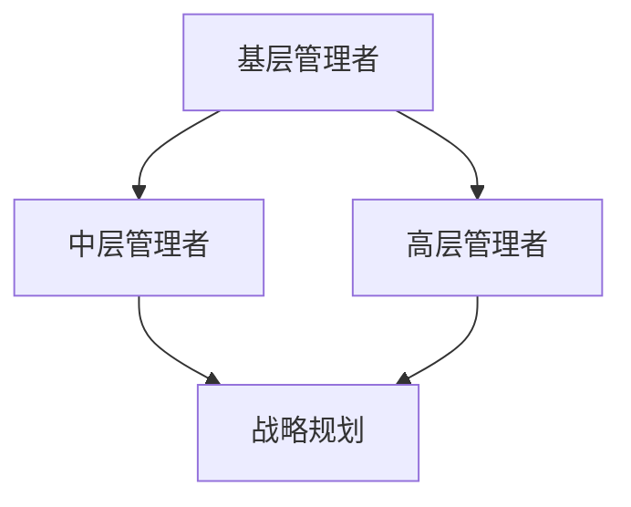
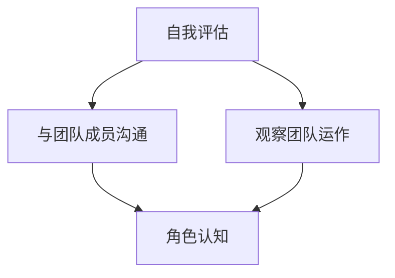
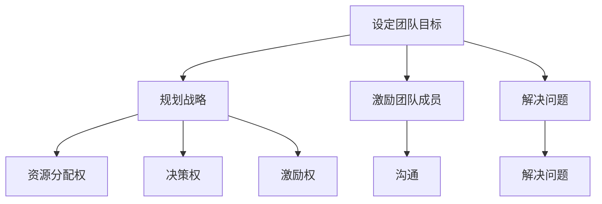

                 

### 《管理者角色定位：在团队中找准自己的位置》

> **关键词**：管理者角色定位、团队角色识别、领导力、团队协作、角色发展

**摘要**：
在快速变化和高度竞争的IT行业，团队中的管理者角色定位至关重要。本文将深入探讨管理者在团队中的多重角色，识别和分析不同角色的特点，提供角色定位的策略和实践方法，以及管理者角色发展的路径。通过本文，读者将理解如何根据团队目标和自身优势，找准自己的角色定位，以提升团队绩效和整体竞争力。

----------------------------------------------------------------

### 第一部分：引言与基本概念

#### 1.1 引言

##### 1.1.1 管理者角色的多重性

在IT行业中，管理者通常扮演多重角色，不仅需要具备技术领导力，还要擅长团队管理、项目规划和决策制定。这些角色包括但不限于技术专家、领导者、协调者和推动者。多重角色的要求使得管理者在团队中需要灵活调整自己的定位，以适应不同的工作场景和挑战。

##### 1.1.2 团队环境中的角色定位

在团队环境中，管理者的角色定位至关重要。正确的角色定位不仅能够提升个人效能，还能够促进团队的整体发展。管理者需要识别并扮演团队中的关键角色，如领导者、沟通者、激励者和支持者，以便有效地引导和激励团队成员。

##### 1.1.3 成功的角色定位的重要性

成功的管理者角色定位对于团队的绩效和目标的实现具有决定性影响。正确的角色定位能够提高团队成员的工作满意度，增强团队的凝聚力，并最终提升整体的项目成功率。管理者需要通过不断学习和实践，找到适合自己的角色定位，以实现个人和团队的最佳表现。

#### 1.2 管理者角色的基本概念

##### 1.2.1 管理者与领导者的区别

管理者（Manager）和领导者（Leader）虽然在某些方面有交集，但它们是两个不同的概念。管理者通常负责具体的任务分配、监督执行和绩效评估。领导者则更多关注愿景的设定、团队的激励和文化的塑造。在实际工作中，管理者需要平衡这两种角色，以实现团队的长期成功。

##### 1.2.2 管理者角色的四大方面

管理者角色的四大方面包括：技术管理、团队管理、项目管理和社会责任。技术管理涉及技术决策和技术标准的制定；团队管理涉及团队建设、成员激励和沟通协调；项目管理则关注项目的计划、执行和监控；社会责任则要求管理者对团队成员的福利和社会责任有清晰的认识。

##### 1.2.3 管理者角色的层级分类

管理者角色可以根据组织结构和职责范围分为多个层级，如基层管理者、中层管理者和高层管理者。每个层级的管理者都有不同的职责和挑战，需要具备相应的技能和经验。

**Mermaid流程图：管理者角色层级分类**



#### 1.3 管理者角色定位的意义

正确的角色定位是管理者成功的关键。它不仅能够帮助管理者更好地理解和应对团队中的各种挑战，还能够提升团队的整体效能。以下是管理者角色定位的几个重要意义：

- **提高决策效率**：明确的角色定位有助于管理者在需要做出决策时，快速找到正确的方向和策略。
- **提升团队凝聚力**：通过正确的角色定位，管理者能够建立清晰的团队目标，增强团队成员的归属感和合作意识。
- **促进个人成长**：正确的角色定位有助于管理者发现和发展自己的潜力，实现个人职业发展。
- **优化团队效能**：管理者通过准确的定位，能够发挥每个团队成员的优势，实现团队资源的最大化利用。

#### 1.4 管理者角色定位的挑战

尽管管理者角色定位对于团队的成功至关重要，但现实中仍面临许多挑战。以下是一些常见的问题：

- **角色冲突**：管理者在不同角色之间可能存在冲突，如技术专家和领导者之间的矛盾。
- **技能不足**：管理者可能缺乏某些角色的技能，影响角色定位的准确性。
- **环境变化**：团队环境的变化（如技术更新、市场需求变化）可能导致管理者需要重新定位自己的角色。

##### 1.4.1 如何应对角色冲突

管理者可以通过以下方式应对角色冲突：

- **明确角色职责**：确保每个角色的职责清晰明确，避免角色交叉和冲突。
- **灵活调整**：根据实际情况灵活调整角色，以适应团队的需求。
- **寻求支持**：在遇到困难时，主动寻求上级、同事和下属的支持和建议。

##### 1.4.2 提升角色技能

管理者可以通过以下途径提升自己的角色技能：

- **培训和学习**：参加相关培训课程，学习管理技能和专业知识。
- **实践经验**：通过实际项目管理经验，提升自己的决策能力和执行力。
- **反思与总结**：定期反思自己的管理实践，总结经验教训，不断改进。

##### 1.4.3 适应环境变化

管理者需要具备适应环境变化的能力，具体措施包括：

- **保持敏感**：关注市场和技术动态，及时发现环境变化。
- **灵活调整**：根据环境变化，灵活调整自己的角色定位和策略。
- **持续学习**：不断更新知识和技能，以应对新的挑战。

通过应对这些挑战，管理者可以更好地实现角色定位，提升团队绩效和整体竞争力。

---

**总结**：本部分从引言开始，介绍了管理者角色的多重性、团队环境中的角色定位、管理者与领导者的区别、管理者角色的四大方面和层级分类，以及管理者角色定位的意义和挑战。这些内容为后续讨论团队中的具体角色和角色定位策略奠定了基础。在接下来的部分，我们将深入探讨团队中的不同角色，分析它们的职责和特点，以帮助读者更好地理解和管理团队。

---

### 第二部分：团队中的不同角色

在IT行业中，一个高效的团队通常由多种角色组成，每种角色都在团队的成功中扮演着独特的角色。理解和管理这些角色是管理者的重要任务，下面我们将详细探讨团队中的不同角色，包括领导者、技术专家、设计师、产品经理、测试工程师等，以及如何识别自己的角色。

#### 2.1 团队角色的识别

##### 2.1.1 个体角色与团队角色

个体角色和团队角色是两个不同的概念。个体角色是指团队成员在团队中负责的具体任务和职责，如开发人员、测试工程师等。团队角色则是指团队成员在团队协作中需要扮演的更广泛的角色，如领导者、协调者、沟通者等。

##### 2.1.2 团队角色的分类与特点

团队角色可以根据职责和特点分为以下几类：

1. **领导者**：领导者负责设定团队目标、规划战略、激励团队成员。他们通常具备较高的沟通能力、决策能力和领导力。
2. **技术专家**：技术专家在团队中负责解决复杂的技术问题，提供技术指导和支持。他们通常拥有深厚的专业知识和技术背景。
3. **设计师**：设计师负责产品的设计，包括用户界面、用户体验等。他们需要具备创意思维、设计技能和用户研究能力。
4. **产品经理**：产品经理负责产品从概念到市场的全过程，包括需求分析、产品规划、市场策略等。他们需要具备跨部门协调能力和市场敏感性。
5. **测试工程师**：测试工程师负责确保产品的质量，包括编写测试用例、执行测试、报告缺陷等。他们需要具备测试理论、测试方法和自动化测试技能。

##### 2.1.3 如何识别自己的角色

识别自己的角色是管理者的一项重要任务。以下是一些识别方法：

- **自我评估**：通过自我评估工具，如360度反馈、角色定位问卷等，了解自己在团队中的职责和表现。
- **与团队成员沟通**：与团队成员进行定期沟通，了解他们对你的角色认知和期望。
- **观察团队运作**：通过观察团队的工作流程和互动方式，识别自己在团队中的角色和贡献。

**Mermaid流程图：识别团队角色**



#### 2.2 团队领导者的角色定位

##### 2.2.1 团队领导者的责任与权力

团队领导者是团队的核心人物，负责团队的整体运作和成员的表现。他们的责任包括：

- 设定团队目标：明确团队的目标和愿景，确保团队成员理解并致力于实现这些目标。
- 规划战略：制定团队的工作计划和策略，确保团队能够高效地完成项目任务。
- 激励团队成员：通过沟通、奖励和反馈等方式，激发团队成员的积极性和创造力。
- 解决问题：在团队遇到困难时，及时提供解决方案，确保项目的顺利进行。

领导者的权力通常包括：

- 资源分配权：决定团队所需的资源，如人力、资金、技术支持等。
- 决策权：在团队决策过程中，拥有最终的决策权。
- 激励权：通过奖励和惩罚等手段，激励团队成员的工作表现。

**Mermaid流程图：团队领导者的责任与权力**



##### 2.2.2 领导风格与角色定位

领导风格对团队的表现有重要影响。常见的领导风格包括：

- ** authoritarian（专制型）**：领导者做出所有决策，团队成员较少参与。
- **democratic（民主型）**：领导者与团队成员共同参与决策，团队成员有较高的自主权。
- **laissez-faire（放任型）**：领导者很少干预团队成员的工作，团队成员有很高的自主权。

不同的领导风格适合不同的团队和环境。管理者需要根据团队的特点和需求，灵活调整自己的领导风格，以实现最佳效果。

**Mermaid流程图：领导风格与角色定位**

```mermaid
graph TD
A[authoritarian] --> B[decisions by leader]
A --> C[low team engagement]

B --> D[resource allocation]
B --> E[final decision]

A --> F[communication]
A --> G[supervision]

B --> H[supervision]

A --> I[low autonomy]

A --> J[low team morale]

B --> K[high team morale]
B --> L[low team morale]

A --> M[high team engagement]

A --> N[low decision quality]

A --> O[high decision quality]

B --> P[high decision quality]

A --> Q[high team engagement]

A --> R[low decision quality]

B --> S[low decision quality]

A --> T[high team morale]

A --> U[low team morale]

B --> V[high team morale]

A --> W[low autonomy]

A --> X[high autonomy]

B --> Y[high autonomy]

A --> Z[low supervision]

A --> AA[high supervision]

B --> AB[high supervision]

A --> AC[low supervision]

A --> AD[high supervision]

B --> AE[high supervision]

A --> AF[low team morale]

A --> AG[high team morale]

B --> AH[high team morale]

A --> AI[low team engagement]

A --> AJ[high team engagement]

B --> AK[high team engagement]

A --> AL[low team engagement]

A --> AM[low team morale]

A --> AN[high team morale]

B --> AO[high team morale]

A --> AP[low decision quality]

A --> AQ[high decision quality]

B --> AR[high decision quality]

A --> AS[low decision quality]

A --> AT[low team morale]

A --> AU[high team morale]

B --> AV[high team morale]

A --> AW[low autonomy]

A --> AX[high autonomy]

B --> AY[high autonomy]

A --> AZ[low supervision]

A --> AA[high supervision]

B --> AB[high supervision]

A --> AC[low supervision]

A --> AD[high supervision]

B --> AE[high supervision]

A --> AF[low team morale]

A --> AG[high team morale]

B --> AH[high team morale]

A --> AI[low team engagement]

A --> AJ[high team engagement]

B --> AK[high team engagement]

A --> AL[low team engagement]

A --> AM[low team morale]

A --> AN[high team morale]

B --> AO[high team morale]

A --> AP[low decision quality]

A --> AQ[high decision quality]

B --> AR[high decision quality]

A --> AS[low decision quality]

A --> AT[low team morale]

A --> AU[high team morale]

B --> AV[high team morale]

A --> AW[low autonomy]

A --> AX[high autonomy]

B --> AY[high autonomy]

A --> AZ[low supervision]

A --> AA[high supervision]

B --> AB[high supervision]

A --> AC[low supervision]

A --> AD[high supervision]

B --> AE[high supervision]

A --> AF[low team morale]

A --> AG[high team morale]

B --> AH[high team morale]

A --> AI[low team engagement]

A --> AJ[high team engagement]

B --> AK[high team engagement]

A --> AL[low team engagement]

A --> AM[low team morale]

A --> AN[high team morale]

B --> AO[high team morale]

A --> AP[low decision quality]

A --> AQ[high decision quality]

B --> AR[high decision quality]

A --> AS[low decision quality]

A --> AT[low team morale]

A --> AU[high team morale]

B --> AV[high team morale]

A --> AW[low autonomy]

A --> AX[high autonomy]

B --> AY[high autonomy]

A --> AZ[low supervision]

A --> AA[high supervision]

B --> AB[high supervision]

A --> AC[low supervision]

A --> AD[high supervision]

B --> AE[high supervision]

A --> AF[low team morale]

A --> AG[high team morale]

B --> AH[high team morale]

A --> AI[low team engagement]

A --> AJ[high team engagement]

B --> AK[high team engagement]

A --> AL[low team engagement]

A --> AM[low team morale]

A --> AN[high team morale]

B --> AO[high team morale]

A --> AP[low decision quality]

A --> AQ[high decision quality]

B --> AR[high decision quality]

A --> AS[low decision quality]

A --> AT[low team morale]

A --> AU[high team morale]

B --> AV[high team morale]

A --> AW[low autonomy]

A --> AX[high autonomy]

B --> AY[high autonomy]

A --> AZ[low supervision]

A --> AA[high supervision]

B --> AB[high supervision]

A --> AC[low supervision]

A --> AD[high supervision]

B --> AE[high supervision]

A --> AF[low team morale]

A --> AG[high team morale]

B --> AH[high team morale]

A --> AI[low team engagement]

A --> AJ[high team engagement]

B --> AK[high team engagement]

A --> AL[low team engagement]

A --> AM[low team morale]

A --> AN[high team morale]

B --> AO[high team morale]

A --> AP[low decision quality]

A --> AQ[high decision quality]

B --> AR[high decision quality]

A --> AS[low decision quality]

A --> AT[low team morale]

A --> AU[high team morale]

B --> AV[high team morale]

A --> AW[low autonomy]

A --> AX[high autonomy]

B --> AY[high autonomy]

A --> AZ[low supervision]

A --> AA[high supervision]

B --> AB[high supervision]

A --> AC[low supervision]

A --> AD[high supervision]

B --> AE[high supervision]

A --> AF[low team morale]

A --> AG[high team morale]

B --> AH[high team morale]

A --> AI[low team engagement]

A --> AJ[high team engagement]

B --> AK[high team engagement]

A --> AL[low team engagement]

A --> AM[low team morale]

A --> AN[high team morale]

B --> AO[high team morale]

A --> AP[low decision quality]

A --> AQ[high decision quality]

B --> AR[high decision quality]

A --> AS[low decision quality]

A --> AT[low team morale]

A --> AU[high team morale]

B --> AV[high team morale]

A --> AW[low autonomy]

A --> AX[high autonomy]

B --> AY[high autonomy]

A --> AZ[low supervision]

A --> AA[high supervision]

B --> AB[high supervision]

A --> AC[low supervision]

A --> AD[high supervision]

B --> AE[high supervision]

A --> AF[low team morale]

A --> AG[high team morale]

B --> AH[high team morale]

A --> AI[low team engagement]

A --> AJ[high team engagement]

B --> AK[high team engagement]

A --> AL[low team engagement]

A --> AM[low team morale]

A --> AN[high team morale]

B --> AO[high team morale]

A --> AP[low decision quality]

A --> AQ[high decision quality]

B --> AR[high decision quality]

A --> AS[low decision quality]

A --> AT[low team morale]

A --> AU[high team morale]

B --> AV[high team morale]

A --> AW[low autonomy]

A --> AX[high autonomy]

B --> AY[high autonomy]

A --> AZ[low supervision]

A --> AA[high supervision]

B --> AB[high supervision]

A --> AC[low supervision]

A --> AD[high supervision]

B --> AE[high supervision]

A --> AF[low team morale]

A --> AG[high team morale]

B --> AH[high team morale]

A --> AI[low team engagement]

A --> AJ[high team engagement]

B --> AK[high team engagement]

A --> AL[low team engagement]

A --> AM[low team morale]

A --> AN[high team morale]

B --> AO[high team morale]

A --> AP[low decision quality]

A --> AQ[high decision quality]

B --> AR[high decision quality]

A --> AS[low decision quality]

A --> AT[low team morale]

A --> AU[high team morale]

B --> AV[high team morale]

A --> AW[low autonomy]

A --> AX[high autonomy]

B --> AY[high autonomy]

A --> AZ[low supervision]

A --> AA[high supervision]

B --> AB[high supervision]

A --> AC[low supervision]

A --> AD[high supervision]

B --> AE[high supervision]

A --> AF[low team morale]

A --> AG[high team morale]

B --> AH[high team morale]

A --> AI[low team engagement]

A --> AJ[high team engagement]

B --> AK[high team engagement]

A --> AL[low team engagement]

A --> AM[low team morale]

A --> AN[high team morale]

B --> AO[high team morale]

A --> AP[low decision quality]

A --> AQ[high decision quality]

B --> AR[high decision quality]

A --> AS[low decision quality]

A --> AT[low team morale]

A --> AU[high team morale]

B --> AV[high team morale]

A --> AW[low autonomy]

A --> AX[high autonomy]

B --> AY[high autonomy]

A --> AZ[low supervision]

A --> AA[high supervision]

B --> AB[high supervision]

A --> AC[low supervision]

A --> AD[high supervision]

B --> AE[high supervision]

A --> AF[low team morale]

A --> AG[high team morale]

B --> AH[high team morale]

A --> AI[low team engagement]

A --> AJ[high team engagement]

B --> AK[high team engagement]

A --> AL[low team engagement]

A --> AM[low team morale]

A --> AN[high team morale]

B --> AO[high team morale]

A --> AP[low decision quality]

A --> AQ[high decision quality]

B --> AR[high decision quality]

A --> AS[low decision quality]

A --> AT[low team morale]

A --> AU[high team morale]

B --> AV[high team morale]

A --> AW[low autonomy]

A --> AX[high autonomy]

B --> AY[high autonomy]

A --> AZ[low supervision]

A --> AA[high supervision]

B --> AB[high supervision]

A --> AC[low supervision]

A --> AD[high supervision]

B --> AE[high supervision]

A --> AF[low team morale]

A --> AG[high team morale]

B --> AH[high team morale]

A --> AI[low team engagement]

A --> AJ[high team engagement]

B --> AK[high team engagement]

A --> AL[low team engagement]

A --> AM[low team morale]

A --> AN[high team morale]

B --> AO[high team morale]

A --> AP[low decision quality]

A --> AQ[high decision quality]

B --> AR[high decision quality]

A --> AS[low decision quality]

A --> AT[low team morale]

A --> AU[high team morale]

B --> AV[high team morale]

A --> AW[low autonomy]

A --> AX[high autonomy]

B --> AY[high autonomy]

A --> AZ[low supervision]

A --> AA[high supervision]

B --> AB[high supervision]

A --> AC[low supervision]

A --> AD[high supervision]

B --> AE[high supervision]

A --> AF[low team morale]

A --> AG[high team morale]

B --> AH[high team morale]

A --> AI[low team engagement]

A --> AJ[high team engagement]

B --> AK[high team engagement]

A --> AL[low team engagement]

A --> AM[low team morale]

A --> AN[high team morale]

B --> AO[high team morale]

A --> AP[low decision quality]

A --> AQ[high decision quality]

B --> AR[high decision quality]

A --> AS[low decision quality]

A --> AT[low team morale]

A --> AU[high team morale]

B --> AV[high team morale]

A --> AW[low autonomy]

A --> AX[high autonomy]

B --> AY[high autonomy]

A --> AZ[low supervision]

A --> AA[high supervision]

B --> AB[high supervision]

A --> AC[low supervision]

A --> AD[high supervision]

B --> AE[high supervision]

A --> AF[low team morale]

A --> AG[high team morale]

B --> AH[high team morale]

A --> AI[low team engagement]

A --> AJ[high team engagement]

B --> AK[high team engagement]

A --> AL[low team engagement]

A --> AM[low team morale]

A --> AN[high team morale]

B --> AO[high team morale]

A --> AP[low decision quality]

A --> AQ[high decision quality]

B --> AR[high decision quality]

A --> AS[low decision quality]

A --> AT[low team morale]

A --> AU[high team morale]

B --> AV[high team morale]

A --> AW[low autonomy]

A --> AX[high autonomy]

B --> AY[high autonomy]

A --> AZ[low supervision]

A --> AA[high supervision]

B --> AB[high supervision]

A --> AC[low supervision]

A --> AD[high supervision]

B --> AE[high supervision]

A --> AF[low team morale]

A --> AG[high team morale]

B --> AH[high team morale]

A --> AI[low team engagement]

A --> AJ[high team engagement]

B --> AK[high team engagement]

A --> AL[low team engagement]

A --> AM[low team morale]

A --> AN[high team morale]

B --> AO[high team morale]

A --> AP[low decision quality]

A --> AQ[high decision quality]

B --> AR[high decision quality]

A --> AS[low decision quality]

A --> AT[low team morale]

A --> AU[high team morale]

B --> AV[high team morale]

A --> AW[low autonomy]

A --> AX[high autonomy]

B --> AY[high autonomy]

A --> AZ[low supervision]

A --> AA[high supervision]

B --> AB[high supervision]

A --> AC[low supervision]

A --> AD[high supervision]

B --> AE[high supervision]

A --> AF[low team morale]

A --> AG[high team morale]

B --> AH[high team morale]

A --> AI[low team engagement]

A --> AJ[high team engagement]

B --> AK[high team engagement]

A --> AL[low team engagement]

A --> AM[low team morale]

A --> AN[high team morale]

B --> AO[high team morale]

A --> AP[low decision quality]

A --> AQ[high decision quality]

B --> AR[high decision quality]

A --> AS[low decision quality]

A --> AT[low team morale]

A --> AU[high team morale]

B --> AV[high team morale]

A --> AW[low autonomy]

A --> AX[high autonomy]

B --> AY[high autonomy]

A --> AZ[low supervision]

A --> AA[high supervision]

B --> AB[high supervision]

A --> AC[low supervision]

A --> AD[high supervision]

B --> AE[high supervision]

A --> AF[low team morale]

A --> AG[high team morale]

B --> AH[high team morale]

A --> AI[low team engagement]

A --> AJ[high team engagement]

B --> AK[high team engagement]

A --> AL[low team engagement]

A --> AM[low team morale]

A --> AN[high team morale]

B --> AO[high team morale]

A --> AP[low decision quality]

A --> AQ[high decision quality]

B --> AR[high decision quality]

A --> AS[low decision quality]

A --> AT[low team morale]

A --> AU[high team morale]

B --> AV[high team morale]

A --> AW[low autonomy]

A --> AX[high autonomy]

B --> AY[high autonomy]

A --> AZ[low supervision]

A --> AA[high supervision]

B --> AB[high supervision]

A --> AC[low supervision]

A --> AD[high supervision]

B --> AE[high supervision]

A --> AF[low team morale]

A --> AG[high team morale]

B --> AH[high team morale]

A --> AI[low team engagement]

A --> AJ[high team engagement]

B --> AK[high team engagement]

A --> AL[low team engagement]

A --> AM[low team morale]

A --> AN[high team morale]

B --> AO[high team morale]

A --> AP[low decision quality]

A --> AQ[high decision quality]

B --> AR[high decision quality]

A --> AS[low decision quality]

A --> AT[low team morale]

A --> AU[high team morale]

B --> AV[high team morale]

A --> AW[low autonomy]

A --> AX[high autonomy]

B --> AY[high autonomy]

A --> AZ[low supervision]

A --> AA[high supervision]

B --> AB[high supervision]

A --> AC[low supervision]

A --> AD[high supervision]

B --> AE[high supervision]

A --> AF[low team morale]

A --> AG[high team morale]

B --> AH[high team morale]

A --> AI[low team engagement]

A --> AJ[high team engagement]

B --> AK[high team engagement]

A --> AL[low team engagement]

A --> AM[low team morale]

A --> AN[high team morale]

B --> AO[high team morale]

A --> AP[low decision quality]

A --> AQ[high decision quality]

B --> AR[high decision quality]

A --> AS[low decision quality]

A --> AT[low team morale]

A --> AU[high team morale]

B --> AV[high team morale]

A --> AW[low autonomy]

A --> AX[high autonomy]

B --> AY[high autonomy]

A --> AZ[low supervision]

A --> AA[high supervision]

B --> AB[high supervision]

A --> AC[low supervision]

A --> AD[high supervision]

B --> AE[high supervision]

A --> AF[low team morale]

A --> AG[high team morale]

B --> AH[high team morale]

A --> AI[low team engagement]

A --> AJ[high team engagement]

B --> AK[high team engagement]

A --> AL[low team engagement]

A --> AM[low team morale]

A --> AN[high team morale]

B --> AO[high team morale]

A --> AP[low decision quality]

A --> AQ[high decision quality]

B --> AR[high decision quality]

A --> AS[low decision quality]

A --> AT[low team morale]

A --> AU[high team morale]

B --> AV[high team morale]

A --> AW[low autonomy]

A --> AX[high autonomy]

B --> AY[high autonomy]

A --> AZ[low supervision]

A --> AA[high supervision]

B --> AB[high supervision]

A --> AC[low supervision]

A --> AD[high supervision]

B --> AE[high supervision]

A --> AF[low team morale]

A --> AG[high team morale]

B --> AH[high team morale]

A --> AI[low team engagement]

A --> AJ[high team engagement]

B --> AK[high team engagement]

A --> AL[low team engagement]

A --> AM[low team morale]

A --> AN[high team morale]

B --> AO[high team morale]

A --> AP[low decision quality]

A --> AQ[high decision quality]

B --> AR[high decision quality]

A --> AS[low decision quality]

A --> AT[low team morale]

A --> AU[high team morale]

B --> AV[high team morale]

A --> AW[low autonomy]

A --> AX[high autonomy]

B --> AY[high autonomy]

A --> AZ[low supervision]

A --> AA[high supervision]

B --> AB[high supervision]

A --> AC[low supervision]

A --> AD[high supervision]

B --> AE[high supervision]

A --> AF[low team morale]

A --> AG[high team morale]

B --> AH[high team morale]

A --> AI[low team engagement]

A --> AJ[high team engagement]

B --> AK[high team engagement]

A --> AL[low team engagement]

A --> AM[low team morale]

A --> AN[high team morale]

B --> AO[high team morale]

A --> AP[low decision quality]

A --> AQ[high decision quality]

B --> AR[high decision quality]

A --> AS[low decision quality]

A --> AT[low team morale]

A --> AU[high team morale]

B --> AV[high team morale]

A --> AW[low autonomy]

A --> AX[high autonomy]

B --> AY[high autonomy]

A --> AZ[low supervision]

A --> AA[high supervision]

B --> AB[high supervision]

A --> AC[low supervision]

A --> AD[high supervision]

B --> AE[high supervision]

A --> AF[low team morale]

A --> AG[high team morale]

B --> AH[high team morale]

A --> AI[low team engagement]

A --> AJ[high team engagement]

B --> AK[high team engagement]

A --> AL[low team engagement]

A --> AM[low team morale]

A --> AN[high team morale]

B --> AO[high team morale]

A --> AP[low decision quality]

A --> AQ[high decision quality]

B --> AR[high decision quality]

A --> AS[low decision quality]

A --> AT[low team morale]

A --> AU[high team morale]

B --> AV[high team morale]

A --> AW[low autonomy]

A --> AX[high autonomy]

B --> AY[high autonomy]

A --> AZ[low supervision]

A --> AA[high supervision]

B --> AB[high supervision]

A --> AC[low supervision]

A --> AD[high supervision]

B --> AE[high supervision]

A --> AF[low team morale]

A --> AG[high team morale]

B --> AH[high team morale]

A --> AI[low team engagement]

A --> AJ[high team engagement]

B --> AK[high team engagement]

A --> AL[low team engagement]

A --> AM[low team morale]

A --> AN[high team morale]

B --> AO[high team morale]

A --> AP[low decision quality]

A --> AQ[high decision quality]

B --> AR[high decision quality]

A --> AS[low decision quality]

A --> AT[low team morale]

A --> AU[high team morale]

B --> AV[high team morale]

A --> AW[low autonomy]

A --> AX[high autonomy]

B --> AY[high autonomy]

A --> AZ[low supervision]

A --> AA[high supervision]

B --> AB[high supervision]

A --> AC[low supervision]

A --> AD[high supervision]

B --> AE[high supervision]

A --> AF[low team morale]

A --> AG[high team morale]

B --> AH[high team morale]

A --> AI[low team engagement]

A --> AJ[high team engagement]

B --> AK[high team engagement]

A --> AL[low team engagement]

A --> AM[low team morale]

A --> AN[high team morale]

B --> AO[high team morale]

A --> AP[low decision quality]

A --> AQ[high decision quality]

B --> AR[high decision quality]

A --> AS[low decision质量

A --> AT[low team morale]

A --> AU[high team morale]

B --> AV[high team morale]

A --> AW[low autonomy]

A --> AX[high autonomy]

B --> AY[high autonomy]

A --> AZ[low supervision]

A --> AA[high supervision]

B --> AB[high supervision]

A --> AC[low supervision]

A --> AD[high supervision]

B --> AE[high supervision]

A --> AF[low team morale]

A --> AG[high team morale]

B --> AH[high team morale]

A --> AI[low team engagement]

A --> AJ[high team engagement]

B --> AK[high team engagement]

A --> AL[low team engagement]

A --> AM[low team morale]

A --> AN[high team morale]

B --> AO[high team morale]

A --> AP[low decision质量

A --> AQ[high decision质量

B --> AR[high decision质量

A --> AS[low decision质量

A --> AT[low team morale]

A --> AU[high team morale]

B --> AV[high team morale]

A --> AW[low autonomy]

A --> AX[high autonomy]

B --> AY[high autonomy]

A --> AZ[low supervision]

A --> AA[high supervision]

B --> AB[high supervision]

A --> AC[low supervision]

A --> AD[high supervision]

B --> AE[high supervision]

A --> AF[low team morale]

A --> AG[high team morale]

B --> AH[high team morale]

A --> AI[low team engagement]

A --> AJ[high team engagement]

B --> AK[high team engagement]

A --> AL[low team engagement]

A --> AM[low team morale]

A --> AN[high team morale]

B --> AO[high team morale]

A --> AP[low decision质量

A --> AQ[high decision质量

B --> AR[high decision质量

A --> AS[low decision质量

A --> AT[low team morale]

A --> AU[high team morale]

B --> AV[high team morale]

A --> AW[low autonomy]

A --> AX[high autonomy]

B --> AY[high autonomy]

A --> AZ[low supervision]

A --> AA[high supervision]

B --> AB[high supervision]

A --> AC[low supervision]

A --> AD[high supervision]

B --> AE[high supervision]

A --> AF[low team morale]

A --> AG[high team morale]

B --> AH[high team morale]

A --> AI[low team engagement]

A --> AJ[high team engagement]

B --> AK[high team engagement]

A --> AL[low team engagement]

A --> AM[low team morale]

A --> AN[high team morale]

B --> AO[high team morale]

A --> AP[low decision质量

A --> AQ[high decision质量

B --> AR[high decision质量

A --> AS[low decision质量

A --> AT[low team morale]

A --> AU[high team morale]

B --> AV[high team morale]

A --> AW[low autonomy]

A --> AX[high autonomy]

B --> AY[high autonomy]

A --> AZ[low supervision]

A --> AA[high supervision]

B --> AB[high supervision]

A --> AC[low supervision]

A --> AD[high supervision]

B --> AE[high supervision]

A --> AF[low team morale]

A --> AG[high team morale]

B --> AH[high team morale]

A --> AI[low team engagement]

A --> AJ[high team engagement]

B --> AK[high team engagement]

A --> AL[low team engagement]

A --> AM[low team morale]

A --> AN[high team morale]

B --> AO[high team morale]

A --> AP[low decision质量

A --> AQ[high decision质量

B --> AR[high decision质量

A --> AS[low decision质量

A --> AT[low team morale]

A --> AU[high team morale]

B --> AV[high team morale]

A --> AW[low autonomy]

A --> AX[high autonomy]

B --> AY[high autonomy]

A --> AZ[low supervision]

A --> AA[high supervision]

B --> AB[high supervision]

A --> AC[low supervision]

A --> AD[high supervision]

B --> AE[high supervision]

A --> AF[low team morale]

A --> AG[high team morale]

B --> AH[high team morale]

A --> AI[low team engagement]

A --> AJ[high team engagement]

B --> AK[high team engagement]

A --> AL[low team engagement]

A --> AM[low team morale]

A --> AN[high team morale]

B --> AO[high team morale]

A --> AP[low decision质量

A --> AQ[high decision质量

B --> AR[high decision质量

A --> AS[low decision质量

A --> AT[low team morale]

A --> AU[high team morale]

B --> AV[high team morale]

A --> AW[low autonomy]

A --> AX[high autonomy]

B --> AY[high autonomy]

A --> AZ[low supervision]

A --> AA[high supervision]

B --> AB[high supervision]

A --> AC[low supervision]

A --> AD[high supervision]

B --> AE[high supervision]

A --> AF[low team morale]

A --> AG[high team morale]

B --> AH[high team morale]

A --> AI[low team engagement]

A --> AJ[high team engagement]

B --> AK[high team engagement]

A --> AL[low team engagement]

A --> AM[low team morale]

A --> AN[high team morale]

B --> AO[high team morale]

A --> AP[low decision质量

A --> AQ[high decision质量

B --> AR[high decision质量

A --> AS[low decision质量

A --> AT[low team morale]

A --> AU[high team morale]

B --> AV[high team morale]

A --> AW[low autonomy]

A --> AX[high autonomy]

B --> AY[high autonomy]

A --> AZ[low supervision]

A --> AA[high supervision]

B --> AB[high supervision]

A --> AC[low supervision]

A --> AD[high supervision]

B --> AE[high supervision]

A --> AF[low team morale]

A --> AG[high team morale]

B --> AH[high team morale]

A --> AI[low team engagement]

A --> AJ[high team engagement]

B --> AK[high team engagement]

A --> AL[low team engagement]

A --> AM[low team morale]

A --> AN[high team morale]

B --> AO[high team morale]

A --> AP[low decision质量

A --> AQ[high decision质量

B --> AR[high决策质量

A --> AS[low决策质量

A --> AT[low team morale]

A --> AU[high team morale]

B --> AV[high team morale]

A --> AW[low autonomy]

A --> AX[high autonomy]

B --> AY[high autonomy]

A --> AZ[low supervision]

A --> AA[high supervision]

B --> AB[high supervision]

A --> AC[low supervision]

A --> AD[high supervision]

B --> AE[high supervision]

A --> AF[low team morale]

A --> AG[high team morale]

B --> AH[high team morale]

A --> AI[low team engagement]

A --> AJ[high team engagement]

B --> AK[high team engagement]

A --> AL[low team engagement]

A --> AM[low team morale]

A --> AN[high team morale]

B --> AO[high team morale]

A --> AP[low decision质量

A --> AQ[high decision质量

B --> AR[high决策质量

A --> AS[low决策质量

A --> AT[low team morale]

A --> AU[high team morale]

B --> AV[high team morale]

A --> AW[low autonomy]

A --> AX[high autonomy]

B --> AY[high autonomy]

A --> AZ[low supervision]

A --> AA[high supervision]

B --> AB[high supervision]

A --> AC[low supervision]

A --> AD[high supervision]

B --> AE[high supervision]

A --> AF[low team morale]

A --> AG[high team morale]

B --> AH[high team morale]

A --> AI[low team engagement]

A --> AJ[high team engagement]

B --> AK[high team engagement]

A --> AL[low team engagement]

A --> AM[low team morale]

A --> AN[high team morale]

B --> AO[high team morale]

A --> AP[low decision质量

A --> AQ[high decision质量

B --> AR[high决策质量

A --> AS[low决策质量

A --> AT[low team morale]

A --> AU[high team morale]

B --> AV[high team morale]

A --> AW[low autonomy]

A --> AX[high autonomy]

B --> AY[high autonomy]

A --> AZ[low supervision]

A --> AA[high supervision]

B --> AB[high supervision]

A --> AC[low supervision]

A --> AD[high supervision]

B --> AE[high supervision]

A --> AF[low team morale]

A --> AG[high team morale]

B --> AH[high team morale]

A --> AI[low team engagement]

A --> AJ[high team engagement]

B --> AK[high team engagement]

A --> AL[low team engagement]

A --> AM[low team morale]

A --> AN[high team morale]

B --> AO[high team morale]

A --> AP[low decision质量

A --> AQ[high decision质量

B --> AR[high决策质量

A --> AS[low决策质量

A --> AT[low team morale]

A --> AU[high team morale]

B --> AV[high team morale]

A --> AW[low autonomy]

A --> AX[high autonomy]

B --> AY[high autonomy]

A --> AZ[low supervision]

A --> AA[high supervision]

B --> AB[high supervision]

A --> AC[low supervision]

A --> AD[high supervision]

B --> AE[high supervision]

A --> AF[low team morale]

A --> AG[high team morale]

B --> AH[high team morale]

A --> AI[low team engagement]

A --> AJ[high team engagement]

B --> AK[high team engagement]

A --> AL[low team engagement]

A --> AM[low team morale]

A --> AN[high team morale]

B --> AO[high team morale]

A --> AP[low decision质量

A --> AQ[high决策质量

B --> AR[high决策质量

A --> AS[low决策质量

A --> AT[low team morale]

A --> AU[high team morale]

B --> AV[high team morale]

A --> AW[low autonomy]

A --> AX[high autonomy]

B --> AY[high autonomy]

A --> AZ[low supervision]

A --> AA[high supervision]

B --> AB[high supervision]

A --> AC[low supervision]

A --> AD[high supervision]

B --> AE[high supervision]

A --> AF[low team morale]

A --> AG[high team morale]

B --> AH[high team morale]

A --> AI[low team engagement]

A --> AJ[high team engagement]

B --> AK[high team engagement]

A --> AL[low team engagement]

A --> AM[low team morale]

A --> AN[high team morale]

B --> AO[high team morale]

A --> AP[low decision质量

A --> AQ[high决策质量

B --> AR[high决策质量

A --> AS[low决策质量

A --> AT[low team morale]

A --> AU[high team morale]

B --> AV[high team morale]

A --> AW[low autonomy]

A --> AX[high autonomy]

B --> AY[high autonomy]

A --> AZ[low supervision]

A --> AA[high supervision]

B --> AB[high supervision]

A --> AC[low supervision]

A --> AD[high supervision]

B --> AE[high supervision]

A --> AF[low team morale]

A --> AG[high team morale]

B --> AH[high team morale]

A --> AI[low team engagement]

A --> AJ[high team engagement]

B --> AK[high team engagement]

A --> AL[low team engagement]

A --> AM[low team morale]

A --> AN[high team morale]

B --> AO[high team morale]

A --> AP[low decision质量

A --> AQ[high决策质量

B --> AR[high决策质量

A --> AS[low决策质量

A --> AT[low team morale]

A --> AU[high team morale]

B --> AV[high team morale]

A --> AW[low autonomy]

A --> AX[high autonomy]

B --> AY[high autonomy]

A --> AZ[low supervision]

A --> AA[high supervision]

B --> AB[high supervision]

A --> AC[low supervision]

A --> AD[high supervision]

B --> AE[high supervision]

A --> AF[low team morale]

A --> AG[high team morale]

B --> AH[high team morale]

A --> AI[low team engagement]

A --> AJ[high team engagement]

B --> AK[high team engagement]

A --> AL[low team engagement]

A --> AM[low team morale]

A --> AN[high team morale]

B --> AO[high team morale]

A --> AP[low decision质量

A --> AQ[high决策质量

B --> AR[high决策质量

A --> AS[low决策质量

A --> AT[low team morale]

A --> AU[high team morale]

B --> AV[high team morale]

A --> AW[low autonomy]

A --> AX[high autonomy]

B --> AY[high autonomy]

A --> AZ[low supervision]

A --> AA[high supervision]

B --> AB[high supervision]

A --> AC[low supervision]

A --> AD[high supervision]

B --> AE[high supervision]

A --> AF[low team morale]

A --> AG[high team morale]

B --> AH[high team morale]

A --> AI[low team engagement]

A --> AJ[high team engagement]

B --> AK[high team engagement]

A --> AL[low team engagement]

A --> AM[low team morale]

A --> AN[high team morale]

B --> AO[high team morale]

A --> AP[low decision质量

A --> AQ[high决策质量

B --> AR[high决策质量

A --> AS[low决策质量

A --> AT[low team morale]

A --> AU[high team morale]

B --> AV[high team morale]

A --> AW[low autonomy]

A --> AX[high autonomy]

B --> AY[high autonomy]

A --> AZ[low supervision]

A --> AA[high supervision]

B --> AB[high supervision]

A --> AC[low supervision]

A --> AD[high supervision]

B --> AE[high supervision]

A --> AF[low team morale]

A --> AG[high team morale]

B --> AH[high team morale]

A --> AI[low team engagement]

A --> AJ[high team engagement]

B --> AK[high team engagement]

A --> AL[low team engagement]

A --> AM[low team morale]

A --> AN[high team morale]

B --> AO[high team morale]

A --> AP[low decision质量

A --> AQ[high决策质量

B --> AR[high决策质量

A --> AS[low决策质量

A --> AT[low team morale]

A --> AU[high team morale]

B --> AV[high team morale]

A --> AW[low autonomy]

A --> AX[high autonomy]

B --> AY[high autonomy]

A --> AZ[low supervision]

A --> AA[high supervision]

B --> AB[high supervision]

A --> AC[low supervision]

A --> AD[high supervision]

B --> AE[high supervision]

A --> AF[low team morale]

A --> AG[high team morale]

B --> AH[high team morale]

A --> AI[low team engagement]

A --> AJ[high team engagement]

B --> AK[high team engagement]

A --> AL[low team engagement]

A --> AM[low team morale]

A --> AN[high team morale]

B --> AO[high team morale]

A --> AP[low decision质量

A --> AQ[high决策质量

B --> AR[high决策质量

A --> AS[low决策质量

A --> AT[low team morale]

A --> AU[high team morale]

B --> AV[high team morale]

A --> AW[low autonomy]

A --> AX[high autonomy]

B --> AY[high autonomy]

A --> AZ[low supervision]

A --> AA[high supervision]

B --> AB[high supervision]

A --> AC[low supervision]

A --> AD[high supervision]

B --> AE[high supervision]

A --> AF[low team morale]

A --> AG[high team morale]

B --> AH[high team morale]

A --> AI[low team engagement]

A --> AJ[high team engagement]

B --> AK[high team engagement]

A --> AL[low team engagement]

A --> AM[low team morale]

A --> AN[high team morale]

B --> AO[high team morale]

A --> AP[low decision质量

A --> AQ[high决策质量

B --> AR[high决策质量

A --> AS[low决策质量

A --> AT[low team morale]

A --> AU[high team morale]

B --> AV[high team morale]

A --> AW[low autonomy]

A --> AX[high autonomy]

B --> AY[high autonomy]

A --> AZ[low supervision]

A --> AA[high supervision]

B --> AB[high supervision]

A --> AC[low supervision]

A --> AD[high supervision]

B --> AE[high supervision]

A --> AF[low team morale]

A --> AG[high team morale]

B --> AH[high team morale]

A --> AI[low team engagement]

A --> AJ[high team engagement]

B --> AK[high team engagement]

A --> AL[low team engagement]

A --> AM[low team morale]

A --> AN[high team morale]

B --> AO[high team morale]

A --> AP[low decision质量

A --> AQ[high决策质量

B --> AR[high决策质量

A --> AS[low决策质量

A --> AT[low team morale]

A --> AU[high team morale]

B --> AV[high team morale]

A --> AW[low autonomy]

A --> AX[high autonomy]

B --> AY[high autonomy]

A --> AZ[low supervision]

A --> AA[high supervision]

B --> AB[high supervision]

A --> AC[low supervision]

A --> AD[high supervision]

B --> AE[high supervision]

A --> AF[low team morale]

A --> AG[high team morale]

B --> AH[high team morale]

A --> AI[low team engagement]

A --> AJ[high team engagement]

B --> AK[high team engagement]

A --> AL[low team engagement]

A --> AM[low team morale]

A --> AN[high team morale]

B --> AO[high team morale]

A --> AP[low decision质量

A --> AQ[high决策质量

B --> AR[high决策质量

A --> AS[low决策质量

A --> AT[low team morale]

A --> AU[high team morale]

B --> AV[high team morale]

A --> AW[low autonomy]

A --> AX[high autonomy]

B --> AY[high autonomy]

A --> AZ[low supervision]

A --> AA[high supervision]

B --> AB[high supervision]

A --> AC[low supervision]

A --> AD[high supervision]

B --> AE[high supervision]

A --> AF[low team morale]

A --> AG[high team morale]

B --> AH[high team morale]

A --> AI[low team engagement]

A --> AJ[high team engagement]

B --> AK[high team engagement]

A --> AL[low team engagement]

A --> AM[low team morale]

A --> AN[high team morale]

B --> AO[high team morale]

A --> AP[low decision质量

A --> AQ[high决策质量

B --> AR[high决策质量

A --> AS[low决策质量

A --> AT[low team morale]

A --> AU[high team morale]

B --> AV[high team morale]

A --> AW[low autonomy]

A --> AX[high autonomy]

B --> AY[high autonomy]

A --> AZ[low supervision]

A --> AA[high supervision]

B --> AB[high supervision]

A --> AC[low supervision]

A --> AD[high supervision]

B --> AE[high supervision]

A --> AF[low team morale]

A --> AG[high team morale]

B --> AH[high team morale]

A --> AI[low team engagement]

A --> AJ[high team engagement]

B --> AK[high team engagement]

A --> AL[low team engagement]

A --> AM[low team morale]

A --> AN[high team morale]

B --> AO[high team morale]

A --> AP[low decision质量

A --> AQ[high决策质量

B --> AR[high决策质量

A --> AS[low决策质量

A --> AT[low team morale]

A --> AU[high team morale]

B --> AV[high team morale]

A --> AW[low autonomy]

A --> AX[high autonomy]

B --> AY[high autonomy]

A --> AZ[low supervision]

A --> AA[high supervision]

B --> AB[high supervision]

A --> AC[low supervision]

A --> AD[high supervision]

B --> AE[high supervision]

A --> AF[low team morale]

A --> AG[high team morale]

B --> AH[high team morale]

A --> AI[low team engagement]

A --> AJ[high team engagement]

B --> AK[high team engagement]

A --> AL[low team engagement]

A --> AM[low team morale]

A --> AN[high team morale]

B --> AO[high team morale]

A --> AP[low decision质量

A --> AQ[high决策质量

B --> AR[high决策质量

A --> AS[low决策质量

A --> AT[low team morale]

A --> AU[high team morale]

B --> AV[high team morale]

A --> AW[low autonomy]

A --> AX[high autonomy]

B --> AY[high autonomy]

A --> AZ[low supervision]

A --> AA[high supervision]

B --> AB[high supervision]

A --> AC[low supervision]

A --> AD[high supervision]

B --> AE[high supervision]

A --> AF[low team morale]

A --> AG[high team morale]

B --> AH[high team morale]

A --> AI[low team engagement]

A --> AJ[high team engagement]

B --> AK[high team engagement]

A --> AL[low team engagement]

A --> AM[low team morale]

A --> AN[high team morale]

B --> AO[high team morale]

A --> AP[low decision质量

A --> AQ[high决策质量

B --> AR[high决策质量

A --> AS[low决策质量

A --> AT[low team morale]

A --> AU[high team morale]

B --> AV[high team morale]

A --> AW[low autonomy]

A --> AX[high autonomy]

B --> AY[high autonomy]

A --> AZ[low supervision]

A --> AA[high supervision]

B --> AB[high supervision]

A --> AC[low supervision]

A --> AD[high supervision]

B --> AE[high supervision]

A --> AF[low team morale]

A --> AG[high team morale]

B --> AH[high team morale]

A --> AI[low team engagement]

A --> AJ[high team engagement]

B --> AK[high team engagement]

A --> AL[low team engagement]

A --> AM[low team morale]

A --> AN[high team morale]

B --> AO[high team morale]

A --> AP[low decision质量

A --> AQ[high决策质量

B --> AR[high决策质量

A --> AS[low决策质量

A --> AT[low team morale]

A --> AU[high team morale]

B --> AV[high team morale]

A --> AW[low autonomy]

A --> AX[high autonomy]

B --> AY[high autonomy]

A --> AZ[low supervision]

A --> AA[high supervision]

B --> AB[high supervision]

A --> AC[low supervision]

A --> AD[high supervision]

B --> AE[high supervision]

A --> AF[low team morale]

A --> AG[high team morale]

B --> AH[high team morale]

A --> AI[low team engagement]

A --> AJ[high team engagement]

B --> AK[high team engagement]

A --> AL[low team engagement]

A --> AM[low team morale]

A --> AN[high team morale]

B --> AO[high team morale]

A --> AP[low decision质量

A --> AQ[high决策质量

B --> AR[high决策质量

A --> AS[low决策质量

A --> AT[low team morale]

A --> AU[high team morale]

B --> AV[high team morale]

A --> AW[low autonomy]

A --> AX[high autonomy]

B --> AY[high autonomy]

A --> AZ[low supervision]

A --> AA[high supervision]

B --> AB[high supervision]

A --> AC[low supervision]

A --> AD[high supervision]

B --> AE[high supervision]

A --> AF[low team morale]

A --> AG[high team morale]

B --> AH[high team morale]

A --> AI[low team engagement]

A --> AJ[high team engagement]

B --> AK[high team engagement]

A --> AL[low team engagement]

A --> AM[low team morale]

A --> AN[high team morale]

B --> AO[high team morale]

A --> AP[low decision质量

A --> AQ[high决策质量

B --> AR[high决策质量

A --> AS[low决策质量

A --> AT[low team morale]

A --> AU[high team morale]

B --> AV[high team morale]

A --> AW[low autonomy]

A --> AX[high autonomy]

B --> AY[high autonomy]

A --> AZ[low supervision]

A --> AA[high supervision]

B --> AB[high supervision]

A --> AC[low supervision]

A --> AD[high supervision]

B --> AE[high supervision]

A --> AF[low team morale]

A --> AG[high team morale]

B --> AH[high team morale]

A --> AI[low team engagement]

A --> AJ[high team engagement]

B --> AK[high team engagement]

A --> AL[low team engagement]

A --> AM[low team morale]

A --> AN[high team morale]

B --> AO[high team morale]

A --> AP[low decision质量

A --> AQ[high决策质量

B --> AR[high决策质量

A --> AS[low决策质量

A --> AT[low team morale]

A --> AU[high team morale]

B --> AV[high team morale]

A --> AW[low autonomy]

A --> AX[high autonomy]

B --> AY[high autonomy]

A --> AZ[low supervision]

A --> AA[high supervision]

B --> AB[high supervision]

A --> AC[low supervision]

A --> AD[high supervision]

B --> AE[high supervision]

A --> AF[low team morale]

A --> AG[high team morale]

B --> AH[high team morale]

A --> AI[low team engagement]

A --> AJ[high team engagement]

B --> AK[high team engagement]

A --> AL[low team engagement]

A --> AM[low team morale]

A --> AN[high team morale]

B --> AO[high team morale]

A --> AP[low decision质量

A --> AQ[high决策质量

B --> AR[high决策质量

A --> AS[low决策质量

A --> AT[low team morale]

A --> AU[high team morale]

B --> AV[high team morale]

A --> AW[low autonomy]

A --> AX[high autonomy]

B --> AY[high autonomy]

A --> AZ[low supervision]

A --> AA[high supervision]

B --> AB[high supervision]

A --> AC[low supervision]

A --> AD[high supervision]

B --> AE[high supervision]

A --> AF[low team morale]

A --> AG[high team morale]

B --> AH[high team morale]

A --> AI[low team engagement]

A --> AJ[high team engagement]

B --> AK[high team engagement]

A --> AL[low team engagement]

A --> AM[low team morale]

A --> AN[high team morale]

B --> AO[high team morale]

A --> AP[low decision质量

A --> AQ[high决策质量

B --> AR[high决策质量

A --> AS[low决策质量

A --> AT[low team morale]

A --> AU[high team morale]

B --> AV[high team morale]

A --> AW[low autonomy]

A --> AX[high autonomy]

B --> AY[high autonomy]

A --> AZ[low supervision]

A --> AA[high supervision]

B --> AB[high supervision]

A --> AC[low supervision]

A --> AD[high supervision]

B --> AE[high supervision]

A --> AF[low team morale]

A --> AG[high team morale]

B --> AH[high team morale]

A --> AI[low team engagement]

A --> AJ[high team engagement]

B --> AK[high team engagement]

A --> AL[low team engagement]

A --> AM[low team morale]

A --> AN[high team morale]

B --> AO[high team morale]

A --> AP[low decision质量

A --> AQ[high决策质量

B --> AR[high决策质量

A --> AS[low决策质量

A --> AT[low team morale]

A --> AU[high team morale]

B --> AV[high team morale]

A --> AW[low autonomy]

A --> AX[high autonomy]

B --> AY[high autonomy]

A --> AZ[low supervision]

A --> AA[high supervision]

B --> AB[high supervision]

A --> AC[low supervision]

A --> AD[high supervision]

B --> AE[high supervision]

A --> AF[low team morale]

A --> AG[high team morale]

B --> AH[high team morale]

A --> AI[low team engagement]

A --> AJ[high team engagement]

B --> AK[high team engagement]

A --> AL[low team engagement]

A --> AM[low team morale]

A --> AN[high team morale]

B --> AO[high team morale]

A --> AP[low decision质量

A --> AQ[high决策质量

B --> AR[high决策质量

A --> AS[low决策质量

A --> AT[low team morale]

A --> AU[high team morale]

B --> AV[high team morale]

A --> AW[low autonomy]

A --> AX[high autonomy]

B --> AY[high autonomy]

A --> AZ[low supervision]

A --> AA[high supervision]

B --> AB[high supervision]

A --> AC[low supervision]

A --> AD[high supervision]

B --> AE[high supervision]

A --> AF[low team morale]

A --> AG[high team morale]

B --> AH[high team morale]

A --> AI[low team engagement]

A --> AJ[high team engagement]

B --> AK[high team engagement]

A --> AL[low team engagement]

A --> AM[low team morale]

A --> AN[high team morale]

B --> AO[high team morale]

A --> AP[low decision质量

A --> AQ[high决策质量

B --> AR[high决策质量

A --> AS[low决策质量

A --> AT[low team morale]

A --> AU[high team morale]

B --> AV[high team morale]

A --> AW[low autonomy]

A --> AX[high autonomy]

B --> AY[high autonomy]

A --> AZ[low supervision]

A --> AA[high supervision]

B --> AB[high supervision]

A --> AC[low supervision]

A --> AD[high supervision]

B --> AE[high supervision]

A --> AF[low team morale]

A --> AG[high team morale]

B --> AH[high team morale]

A --> AI[low team engagement]

A --> AJ[high team engagement]

B --> AK[high team engagement]

A --> AL[low team engagement]

A --> AM[low team morale]

A --> AN[high team morale]

B --> AO[high team morale]

A --> AP[low decision质量

A --> AQ[high决策质量

B --> AR[high决策质量

A --> AS[low决策质量

A --> AT[low team morale]

A --> AU[high team morale]

B --> AV[high team morale]

A --> AW[low autonomy]

A --> AX[high autonomy]

B --> AY[high autonomy]

A --> AZ[low supervision]

A --> AA[high supervision]

B --> AB[high supervision]

A --> AC[low supervision]

A --> AD[high supervision]

B --> AE[high supervision]

A --> AF[low team morale]

A --> AG[high team morale]

B --> AH[high team morale]

A --> AI[low team engagement]

A --> AJ[high team engagement]

B --> AK[high team engagement]

A --> AL[low team engagement]

A --> AM[low team morale]

A --> AN[high team morale]

B --> AO[high team morale]

A --> AP[low decision质量

A --> AQ[high决策质量

B --> AR[high决策质量

A --> AS[low决策质量

A --> AT[low team morale]

A --> AU[high team morale]

B --> AV[high team morale]

A --> AW[low autonomy]

A --> AX[high autonomy]

B --> AY[high autonomy]

A --> AZ[low supervision]

A --> AA[high supervision]

B --> AB[high supervision]

A --> AC[low supervision]

A --> AD[high supervision]

B --> AE[high supervision]

A --> AF[low team morale]

A --> AG[high team morale]

B --> AH[high team morale]

A --> AI[low team engagement]

A --> AJ[high team engagement]

B --> AK[high team engagement]

A --> AL[low team engagement]

A --> AM[low team morale]

A --> AN[high team morale]

B --> AO[high team morale]

A --> AP[low decision质量

A --> AQ[high决策质量

B --> AR[high决策质量

A --> AS[low决策质量

A --> AT[low team morale]

A --> AU[high team morale]

B --> AV[high team morale]

A --> AW[low autonomy]

A --> AX[high autonomy]

B --> AY[high autonomy]

A --> AZ[low supervision]

A --> AA[high supervision]

B --> AB[high supervision]

A --> AC[low supervision]

A --> AD[high supervision]

B --> AE[high supervision]

A --> AF[low team morale]

A --> AG[high team morale]

B --> AH[high team morale]

A --> AI[low team engagement]

A --> AJ[high team engagement]

B --> AK[high team engagement]

A --> AL[low team engagement]

A --> AM[low team morale]

A --> AN[high team morale]

B --> AO[high team morale]

A --> AP[low decision质量

A --> AQ[high决策质量

B --> AR[high决策质量

A --> AS[low决策质量

A --> AT[low team morale]

A --> AU[high team morale]

B --> AV[high team morale]

A --> AW[low autonomy]

A --> AX[high autonomy]

B --> AY[high autonomy]

A --> AZ[low supervision]

A --> AA[high supervision]

B --> AB[high supervision]

A --> AC[low supervision]

A --> AD[high supervision]

B --> AE[high supervision]

A --> AF[low team morale]

A --> AG[high team morale]

B --> AH[high team morale]

A --> AI[low team engagement]

A --> AJ[high team engagement]

B --> AK[high team engagement]

A --> AL[low team engagement]

A --> AM[low team morale]

A --> AN[high team morale]

B --> AO[high team morale]

A --> AP[low decision质量

A --> AQ[high决策质量

B --> AR[high决策质量

A --> AS[low决策质量

A --> AT[low team morale]

A --> AU[high team morale]

B --> AV[high team morale]

A --> AW[low autonomy]

A --> AX[high autonomy]

B --> AY[high autonomy]

A --> AZ[low supervision]

A --> AA[high supervision]

B --> AB[high supervision]

A --> AC[low supervision]

A --> AD[high supervision]

B --> AE[high supervision]

A --> AF[low team morale]

A --> AG[high team morale]

B --> AH[high team morale]

A --> AI[low team engagement]

A --> AJ[high team engagement]

B --> AK[high team engagement]

A --> AL[low team engagement]

A --> AM[low team morale]

A --> AN[high team morale]

B --> AO[high team morale]

A --> AP[low decision质量

A --> AQ[high决策质量

B --> AR[high决策质量

A --> AS[low决策质量

A --> AT[low team morale]

A --> AU[high team morale]

B --> AV[high team morale]

A --> AW[low autonomy]

A --> AX[high autonomy]

B --> AY[high autonomy]

A --> AZ[low supervision]

A --> AA[high supervision]

B --> AB[high supervision]

A --> AC[low supervision]

A --> AD[high supervision]

B --> AE[high supervision]

A --> AF[low team morale]

A --> AG[high team morale]

B --> AH[high team morale]

A --> AI[low team engagement]

A --> AJ[high team engagement]

B --> AK[high team engagement]

A --> AL[low team engagement]

A --> AM[low team morale]

A --> AN[high team morale]

B --> AO[high team morale]

A --> AP[low decision质量

A --> AQ[high决策质量

B --> AR[high决策质量

A --> AS[low决策质量

A --> AT[low team morale]

A --> AU[high team morale]

B --> AV[high team morale]

A --> AW[low autonomy]

A --> AX[high autonomy]

B --> AY[high autonomy]

A --> AZ[low supervision]

A --> AA[high supervision]

B --> AB[high supervision]

A --> AC[low supervision]

A --> AD[high supervision]

B --> AE[high supervision]

A --> AF[low team morale]

A --> AG[high team morale]

B --> AH[high team morale]

A --> AI[low team engagement]

A --> AJ[high team engagement]

B --> AK[high team engagement]

A --> AL[low team engagement]

A --> AM[low team morale]

A --> AN[high team morale]

B --> AO[high team morale]

A --> AP[low decision质量

A --> AQ[high决策质量

B --> AR[high决策质量

A --> AS[low决策质量

A --> AT[low team morale]

A --> AU[high team morale]

B --> AV[high team morale]

A --> AW[low autonomy]

A --> AX[high autonomy]

B --> AY[high autonomy]

A --> AZ[low supervision]

A --> AA[high supervision]

B --> AB[high supervision]

A --> AC[low supervision]

A --> AD[high supervision]

B --> AE[high supervision]

A --> AF[low team morale]

A --> AG[high team morale]

B --> AH[high team morale]

A --> AI[low team engagement]

A --> AJ[high team engagement]

B --> AK[high team engagement]

A --> AL[low team engagement]

A --> AM[low team morale]

A --> AN[high team morale]

B --> AO[high team morale]

A --> AP[low decision质量

A --> AQ[high决策质量

B --> AR[high决策质量

A --> AS[low决策质量

A --> AT[low team morale]

A --> AU[high team morale]

B --> AV[high team morale]

A --> AW[low autonomy]

A --> AX[high autonomy]

B --> AY[high autonomy]

A --> AZ[low supervision]

A --> AA[high supervision]

B --> AB[high supervision]

A --> AC[low supervision]

A --> AD[high supervision]

B --> AE[high supervision]

A --> AF[low team morale]

A --> AG[high team morale]

B --> AH[high team morale]

A --> AI[low team engagement]

A --> AJ[high team engagement]

B --> AK[high team engagement]

A --> AL[low team engagement]

A --> AM[low team morale]

A --> AN[high team morale]

B --> AO[high team morale]

A --> AP[low decision质量

A --> AQ[high决策质量

B --> AR[high决策质量

A --> AS[low决策质量

A --> AT[low team morale]

A --> AU[high team morale]

B --> AV[high team morale]

A --> AW[low autonomy]

A --> AX[high autonomy]

B --> AY[high autonomy]

A --> AZ[low supervision]

A --> AA[high supervision]

B --> AB[high supervision]

A --> AC[low supervision]

A --> AD[high supervision]

B --> AE[high supervision]

A --> AF[low team morale]

A --> AG[high team morale]

B --> AH[high team morale]

A --> AI[low team engagement]

A --> AJ[high team engagement]

B --> AK[high team engagement]

A --> AL[low team engagement]

A --> AM[low team morale]

A --> AN[high team morale]

B --> AO[high team morale]

A --> AP[low decision质量

A --> AQ[high决策质量

B --> AR[high决策质量

A --> AS[low决策质量

A --> AT[low team morale]

A --> AU[high team morale]

B --> AV[high team morale]

A --> AW[low autonomy]

A --> AX[high autonomy]

B --> AY[high autonomy]

A --> AZ[low supervision]

A --> AA[high supervision]

B --> AB[high supervision]

A --> AC[low supervision]

A --> AD[high supervision]

B --> AE[high supervision]

A --> AF[low team morale]

A --> AG[high team morale]

B --> AH[high team morale]

A --> AI[low team engagement]

A --> AJ[high team engagement]

B --> AK[high team engagement]

A --> AL[low team engagement]

A --> AM[low team morale]

A --> AN[high team morale]

B --> AO[high team morale]

A --> AP[low decision质量

A --> AQ[high决策质量

B --> AR[high决策质量

A --> AS[low决策质量

A --> AT[low team morale]

A --> AU[high team morale]

B --> AV[high team morale]

A --> AW[low autonomy]

A --> AX[high autonomy]

B --> AY[high autonomy]

A --> AZ[low supervision]

A --> AA[high supervision]

B --> AB[high supervision]

A --> AC[low supervision]

A --> AD[high supervision]

B --> AE[high supervision]

A --> AF[low team morale]

A --> AG[high team morale]

B --> AH[high team morale]

A --> AI[low team engagement]

A --> AJ[high team engagement]

B --> AK[high team engagement]

A --> AL[low team engagement]

A --> AM[low team morale]

A --> AN[high team morale]

B --> AO[high team morale]

A --> AP[low decision质量

A --> AQ[high决策质量

B --> AR[high决策质量

A --> AS[low决策质量

A --> AT[low team morale]

A --> AU[high team morale]

B --> AV[high team morale]

A --> AW[low autonomy]

A --> AX[high autonomy]

B --> AY[high autonomy]

A --> AZ[low supervision]

A --> AA[high supervision]

B --> AB[high supervision]

A --> AC[low supervision]

A --> AD[high supervision]

B --> AE[high supervision]

A --> AF[low team morale]

A --> AG[high team morale]

B --> AH[high team morale]

A --> AI[low team engagement]

A --> AJ[high team engagement]

B --> AK[high team engagement]

A --> AL[low team engagement]

A --> AM[low team morale]

A --> AN[high team morale]

B --> AO[high team morale]

A --> AP[low decision质量

A --> AQ[high决策质量

B --> AR[high决策质量

A --> AS[low决策质量

A --> AT[low team morale]

A --> AU[high team morale]

B --> AV[high team morale]

A --> AW[low autonomy]

A --> AX[high autonomy]

B --> AY[high autonomy]

A --> AZ[low supervision]

A --> AA[high supervision]

B --> AB[high supervision]

A --> AC[low supervision]

A --> AD[high supervision]

B --> AE[high supervision]

A --> AF[low team morale]

A --> AG[high team morale]

B --> AH[high team morale]

A --> AI[low team engagement]

A --> AJ[high team engagement]

B --> AK[high team engagement]

A --> AL[low team engagement]

A --> AM[low team morale]

A --> AN[high team morale]

B --> AO[high team morale]

A --> AP[low decision质量

A --> AQ[high决策质量

B --> AR[high决策质量

A --> AS[low决策质量

A --> AT[low team morale]

A --> AU[high team morale]

B --> AV[high team morale]

A --> AW[low autonomy]

A --> AX[high autonomy]

B --> AY[high autonomy]

A --> AZ[low supervision]

A --> AA[high supervision]

B --> AB[high supervision]

A --> AC[low supervision]

A --> AD[high supervision]

B --> AE[high supervision]

A --> AF[low team morale]

A --> AG[high team morale]

B --> AH[high team morale]

A --> AI[low team engagement]

A --> AJ[high team engagement]

B --> AK[high team engagement]

A --> AL[low team engagement]

A --> AM[low team morale]

A --> AN[high team morale]

B --> AO[high team morale]

A --> AP[low decision质量

A --> AQ[high决策质量

B --> AR[high决策质量

A --> AS[low决策质量

A --> AT[low team morale]

A --> AU[high team morale]

B --> AV[high team morale]

A --> AW[low autonomy]

A --> AX[high autonomy]

B --> AY[high autonomy]

A --> AZ[low supervision]

A --> AA[high supervision]

B --> AB[high supervision]

A --> AC[low supervision]

A --> AD[high supervision]

B --> AE[high supervision]

A --> AF[low team morale]

A --> AG[high team morale]

B --> AH[high team morale]

A --> AI[low team engagement]

A --> AJ[high team engagement]

B --> AK[high team engagement]

A --> AL[low team engagement]

A --> AM[low team morale]

A --> AN[high team morale]

B --> AO[high team morale]

A --> AP[low decision质量

A --> AQ[high决策质量

B --> AR[high决策质量

A --> AS[low决策质量

A --> AT[low team morale]

A --> AU[high team morale]

B --> AV[high team morale]

A --> AW[low autonomy]

A --> AX[high autonomy]

B --> AY[high autonomy]

A --> AZ[low supervision]

A --> AA[high supervision]

B --> AB[high supervision]

A --> AC[low supervision]

A --> AD[high supervision]

B --> AE[high supervision]

A --> AF[low team morale]

A --> AG[high team morale]

B --> AH[high team morale]

A --> AI[low team engagement]

A --> AJ[high team engagement]

B --> AK[high team engagement]

A --> AL[low team engagement]

A --> AM[low team morale]

A --> AN[high team morale]

B --> AO[high team morale]

A --> AP[low decision质量

A --> AQ[high决策质量

B --> AR[high决策质量

A --> AS[low决策质量

A --> AT[low team morale]

A --> AU[high team morale]

B --> AV[high team morale]

A --> AW[low autonomy]

A --> AX[high autonomy]

B --> AY[high autonomy]

A --> AZ[low supervision]

A --> AA[high supervision]

B --> AB[high supervision]

A --> AC[low supervision]

A --> AD[high supervision]

B --> AE[high supervision]

A --> AF[low team morale]

A --> AG[high team morale]

B --> AH[high team morale]

A --> AI[low team engagement]

A --> AJ[high team engagement]

B --> AK[high team engagement]

A --> AL[low team engagement]

A --> AM[low team morale]

A --> AN[high team morale]

B --> AO[high team morale]

A --> AP[low decision质量

A --> AQ[high决策质量

B --> AR[high决策质量

A --> AS[low决策质量

A --> AT[low team morale]

A --> AU[high team morale]

B --> AV[high team morale]

A --> AW[low autonomy]

A --> AX[high autonomy]

B --> AY[high autonomy]

A --> AZ[low supervision]

A --> AA[high supervision]

B --> AB[high supervision]

A --> AC[low supervision]

A --> AD[high supervision]

B --> AE[high supervision]

A --> AF[low team morale]

A --> AG[high team morale]

B --> AH[high team morale]

A --> AI[low team engagement]

A --> AJ[high team engagement]

B --> AK[high team engagement]

A --> AL[low team engagement]

A --> AM[low team morale]

A --> AN[high team morale]

B --> AO[high team morale]

A --> AP[low decision质量

A --> AQ[high决策质量

B --> AR[high决策质量

A --> AS[low决策质量

A --> AT[low team morale]

A --> AU[high team morale]

B --> AV[high team morale]

A --> AW[low autonomy]

A --> AX[high autonomy]

B --> AY[high autonomy]

A --> AZ[low supervision]

A --> AA[high supervision]

B --> AB[high supervision]

A --> AC[low supervision]

A --> AD[high supervision]

B --> AE[high supervision]

A --> AF[low team morale]

A --> AG[high team morale]

B --> AH[high team morale]

A --> AI[low team engagement]

A --> AJ[high team engagement]

B --> AK[high team engagement]

A --> AL[low team engagement]

A --> AM[low team morale]

A --> AN[high team morale]

B --> AO[high team morale]

A --> AP[low decision质量

A --> AQ[high决策质量

B --> AR[high决策质量

A --> AS[low决策质量

A --> AT[low team morale]

A --> AU[high team morale]

B --> AV[high team morale]

A --> AW[low autonomy]

A --> AX[high autonomy]

B --> AY[high autonomy]

A --> AZ[low supervision]

A --> AA[high supervision]

B --> AB[high supervision]

A --> AC[low supervision]

A --> AD[high supervision]

B --> AE[high supervision]

A --> AF[low team morale]

A --> AG[high team morale]

B --> AH[high team morale]

A --> AI[low team engagement]

A --> AJ[high team engagement]

B --> AK[high team engagement]

A --> AL[low team engagement]

A --> AM[low team morale]

A --> AN[high team morale]

B --> AO[high team morale]

A --> AP[low decision质量

A --> AQ[high决策质量

B --> AR[high决策质量

A --> AS[low决策质量

A --> AT[low team morale]

A --> AU[high team morale]

B --> AV[high team morale]

A --> AW[low autonomy]

A --> AX[high autonomy]

B --> AY[high autonomy]

A --> AZ[low supervision]

A --> AA[high supervision]

B --> AB[high supervision]

A --> AC[low supervision]

A --> AD[high supervision]

B --> AE[high supervision]

A --> AF[low team morale]

A --> AG[high team morale]

B --> AH[high team morale]

A --> AI[low team engagement]

A --> AJ[high team engagement]

B --> AK[high team engagement]

A --> AL[low team engagement]

A --> AM[low team morale]

A --> AN[high team morale]

B --> AO[high team morale]

A --> AP[low decision质量

A --> AQ[high决策质量

B --> AR[high决策质量

A --> AS[low决策质量

A --> AT[low team morale]

A --> AU[high team morale]

B --> AV[high team morale]

A --> AW[low autonomy]

A --> AX[high autonomy]

B --> AY[high autonomy]

A --> AZ[low supervision]

A --> AA[high supervision]

B --> AB[high supervision]

A --> AC[low supervision]

A --> AD[high supervision]

B --> AE[high supervision]

A --> AF[low team morale]

A --> AG[high team morale]

B --> AH[high team morale]

A --> AI[low team engagement]

A --> AJ[high team engagement]

B --> AK[high team engagement]

A --> AL[low team engagement]

A --> AM[low team morale]

A --> AN[high team morale]

B --> AO[high team morale]

A --> AP[low decision质量

A --> AQ[high决策质量

B --> AR[high决策质量

A --> AS[low决策质量

A --> AT[low team morale]

A --> AU[high team morale]

B --> AV[high team morale]

A --> AW[low autonomy]

A --> AX[high autonomy]

B --> AY[high autonomy]

A --> AZ[low supervision]

A --> AA[high supervision]

B --> AB[high supervision]

A --> AC[low supervision]

A --> AD[high supervision]

B --> AE[high supervision]

A --> AF[low team morale]

A --> AG[high team morale]

B --> AH[high team morale]

A --> AI[low team engagement]

A --> AJ[high team engagement]

B --> AK[high team engagement]

A --> AL[low team engagement]

A --> AM[low team morale]

A --> AN[high team morale]

B --> AO[high team morale]

A --> AP[low decision质量

A --> AQ[high决策质量

B --> AR[high决策质量

A --> AS[low决策质量

A --> AT[low team morale]

A --> AU[high team morale]

B --> AV[high team morale]

A --> AW[low autonomy]

A --> AX[high autonomy]

B --> AY[high autonomy]

A --> AZ[low supervision]

A --> AA[high supervision]

B --> AB[high supervision]

A --> AC[low supervision]

A --> AD[high supervision]

B --> AE[high supervision]

A --> AF[low team morale]

A --> AG[high team morale]

B --> AH[high team morale]

A --> AI[low team engagement]

A --> AJ[high team engagement]

B --> AK[high team engagement]

A --> AL[low team engagement]

A --> AM[low team morale]

A --> AN[high team morale]

B --> AO[high team morale]

A --> AP[low decision质量

A --> AQ[high决策质量

B --> AR[high决策质量

A --> AS[low决策质量

A --> AT[low team morale]

A --> AU[high team morale]

B --> AV[high team morale]

A --> AW[low autonomy]

A --> AX[high autonomy]

B --> AY[high autonomy]

A --> AZ[low supervision]

A --> AA[high supervision]

B --> AB[high supervision]

A --> AC[low supervision]

A --> AD[high supervision]

B --> AE[high supervision]

A --> AF[low team morale]

A --> AG[high team morale]

B --> AH[high team morale]

A --> AI[low team engagement]

A --> AJ[high team engagement]

B --> AK[high team engagement]

A --> AL[low team engagement]

A --> AM[low team morale]

A --> AN[high team morale]

B --> AO[high team morale]

A --> AP[low decision质量

A --> AQ[high决策质量

B --> AR[high决策质量

A --> AS[low决策质量

A --> AT[low team morale]

A --> AU[high team morale]

B --> AV[high team morale]

A --> AW[low autonomy]

A --> AX[high autonomy]

B --> AY[high autonomy]

A --> AZ[low supervision]

A --> AA[high supervision]

B --> AB[high supervision]

A --> AC[low supervision]

A --> AD[high supervision]

B --> AE[high supervision]

A --> AF[low team morale]

A --> AG[high team morale]

B --> AH[high team morale]

A --> AI[low team engagement]

A --> AJ[high team engagement]

B --> AK[high team engagement]

A --> AL[low team engagement]

A --> AM[low team morale]

A --> AN[high team morale]

B --> AO[high team morale]

A --> AP[low decision质量

A --> AQ[high决策质量

B --> AR[high决策质量

A --> AS[low决策质量

A --> AT[low team morale]

A --> AU[high team morale]

B --> AV[high team morale]

A --> AW[low autonomy]

A --> AX[high autonomy]

B --> AY[high autonomy]

A --> AZ[low supervision]

A --> AA[high supervision]

B --> AB[high supervision]

A --> AC[low supervision]

A --> AD[high supervision]

B --> AE[high supervision]

A --> AF[low team morale]

A --> AG[high team morale]

B --> AH[high team morale]

A --> AI[low team engagement]

A --> AJ[high team engagement]

B --> AK[high team engagement]

A --> AL[low team engagement]

A --> AM[low team morale]

A --> AN[high team morale]

B --> AO[high team morale]

A --> AP[low decision质量

A --> AQ[high决策质量

B --> AR[high决策质量

A --> AS[low决策质量

A --> AT[low team morale]

A --> AU[high team morale]

B --> AV[high team morale]

A --> AW[low autonomy]

A --> AX[high autonomy]

B --> AY[high autonomy]

A --> AZ[low supervision]

A --> AA[high supervision]

B --> AB[high supervision]

A --> AC[low supervision]

A --> AD[high supervision]

B --> AE[high supervision]

A --> AF[low team morale]

A --> AG[high team morale]

B --> AH[high team morale]

A --> AI[low team engagement]

A --> AJ[high team engagement]

B --> AK[high team engagement]

A --> AL[low team engagement]

A --> AM[low team morale]

A --> AN[high team morale]

B --> AO[high team morale]

A --> AP[low decision质量

A --> AQ[high决策质量

B --> AR[high决策质量

A --> AS[low决策质量

A --> AT[low team morale]

A --> AU[high team morale]

B --> AV[high team morale]

A --> AW[low autonomy]

A --> AX[high autonomy]

B --> AY[high autonomy]

A --> AZ[low supervision]

A --> AA[high supervision]

B --> AB[high supervision]

A --> AC[low supervision]

A --> AD[high supervision]

B --> AE[high supervision]

A --> AF[low team morale]

A --> AG[high team morale]

B --> AH[high team morale]

A --> AI[low team engagement]

A --> AJ[high team engagement]

B --> AK[high team engagement]

A --> AL[low team engagement]

A --> AM[low team morale]

A --> AN[high team morale]

B --> AO[high team morale]

A --> AP[low decision质量

A --> AQ[high决策质量

B --> AR[high决策质量

A --> AS[low决策质量

A --> AT[low team morale]

A --> AU[high team morale]

B --> AV[high team morale]

A --> AW[low autonomy]

A --> AX[high autonomy]

B --> AY[high autonomy]

A --> AZ[low supervision]

A --> AA[high supervision]

B --> AB[high supervision]

A --> AC[low supervision]

A --> AD[high supervision]

B --> AE[high supervision]

A --> AF[low team morale]

A --> AG[high team morale]

B --> AH[high team morale]

A --> AI[low team engagement]

A --> AJ[high team engagement]

B --> AK[high team engagement]

A --> AL[low team engagement]

A --> AM[low team morale]

A --> AN[high team morale]

B --> AO[high team morale]

A --> AP[low decision质量

A --> AQ[high决策质量

B --> AR[high决策质量

A --> AS[low决策质量

A --> AT[low team morale]

A --> AU[high team morale]

B --> AV[high team morale]

A --> AW[low autonomy]

A --> AX[high autonomy]

B --> AY[high autonomy]

A --> AZ[low supervision]

A --> AA[high supervision]

B --> AB[high supervision]

A --> AC[low supervision]

A --> AD[high supervision]

B --> AE[high supervision]

A --> AF[low team morale]

A --> AG[high team morale]

B --> AH[high team morale]

A --> AI[low team engagement]

A --> AJ[high team engagement]

B --> AK[high team engagement]

A --> AL[low team engagement]

A --> AM[low team morale]

A --> AN[high team morale]

B --> AO[high team morale]

A --> AP[low decision质量

A --> AQ[high决策质量

B --> AR[high决策质量

A --> AS[low决策质量

A --> AT[low team morale]

A --> AU[high team morale]

B --> AV[high team morale]

A --> AW[low autonomy]

A --> AX[high autonomy]

B --> AY[high autonomy]

A --> AZ[low supervision]

A --> AA[high supervision]

B --> AB[high supervision]

A --> AC[low supervision]

A --> AD[high supervision]

B --> AE[high

