                 

# 系统思维：管理者驾驭复杂局面的能力

## 关键词
系统思维、管理、复杂性、决策、组织、创新、技术

## 摘要
在当今快速变化和高度复杂的商业环境中，管理者需要具备一种独特的思维能力——系统思维。本文将深入探讨系统思维的概念、核心理论、应用场景，以及其在不同领域（如企业管理、项目管理、决策过程、技术创新等）的具体实践。通过系统思维，管理者可以更好地理解复杂系统，做出更为明智的决策，并有效应对不确定性。

### 第一部分：系统思维概述

#### 第1章 系统思维的起源与发展

## 1.1 系统思维的起源

### 1.1.1 系统思维的诞生

系统思维起源于20世纪40年代，随着系统论、控制论和信息论等学科的兴起，人们开始意识到许多复杂问题需要从整体而非局部进行思考。伊拉斯谟·加尔布雷斯（Ernst J. Gerstein）和约翰·冯·诺依曼（John von Neumann）等先驱者对系统思维的发展做出了重要贡献。

#### 1.1.2 系统思维在不同领域的应用

系统思维最早在工程学领域得到应用，随着其在生物学、生态学、经济学和社会学等领域中的推广，逐渐成为一种跨学科的研究方法。图灵奖获得者约翰·霍普克劳夫特（John H. Hopcroft）认为，系统思维是解决复杂问题的关键。

### 1.1.3 系统思维的基本概念

系统思维是一种通过分析和综合的方式，理解和解决复杂问题的思维方式。它强调整体性、动态性和关联性，认为任何系统都是由多个相互作用的元素组成的整体。

## 1.2 系统思维的核心理论

### 1.2.1 系统视角的构建

系统视角的构建是系统思维的基础。它要求我们从整体上看待问题，识别系统的构成元素及其相互关系，从而形成一个完整的系统图景。

#### 1.2.2 系统动态模型

系统动态模型是一种用于描述系统行为和变化的数学模型。它可以帮助我们预测系统在不同条件下的表现，从而做出更为明智的决策。

### 1.2.3 系统思考的原则

系统思考的原则包括整体性、关联性、动态性和适应性。这些原则指导我们在分析问题时，不仅要考虑当前的情况，还要考虑长期的影响和潜在的风险。

## 1.3 系统思维的应用场景

### 1.3.1 复杂系统的挑战

复杂系统的特点是具有高度的不确定性和不可预测性。系统思维可以帮助我们更好地理解这些挑战，并找到应对策略。

#### 1.3.2 管理与决策中的系统思维

系统思维在管理与决策中的应用非常广泛。通过系统思维，管理者可以更全面地评估各种因素，从而做出更为明智的决策。

### 1.3.3 系统思维在项目管理中的应用

在项目管理中，系统思维可以帮助我们识别潜在的风险，制定有效的项目计划，并确保项目目标的实现。

### 第一部分：系统思维概述

#### 第1章 系统思维的起源与发展

## 1.1 系统思维的起源

### 1.1.1 系统思维的诞生

系统思维起源于20世纪40年代，随着系统论、控制论和信息论等学科的兴起，人们开始意识到许多复杂问题需要从整体而非局部进行思考。伊拉斯谟·加尔布雷斯（Ernst J. Gerstein）和约翰·冯·诺依曼（John von Neumann）等先驱者对系统思维的发展做出了重要贡献。

#### 1.1.2 系统思维在不同领域的应用

系统思维最早在工程学领域得到应用，随着其在生物学、生态学、经济学和社会学等领域中的推广，逐渐成为一种跨学科的研究方法。图灵奖获得者约翰·霍普克劳夫特（John H. Hopcroft）认为，系统思维是解决复杂问题的关键。

### 1.1.3 系统思维的基本概念

系统思维是一种通过分析和综合的方式，理解和解决复杂问题的思维方式。它强调整体性、动态性和关联性，认为任何系统都是由多个相互作用的元素组成的整体。

## 1.2 系统思维的核心理论

### 1.2.1 系统视角的构建

系统视角的构建是系统思维的基础。它要求我们从整体上看待问题，识别系统的构成元素及其相互关系，从而形成一个完整的系统图景。

#### 1.2.2 系统动态模型

系统动态模型是一种用于描述系统行为和变化的数学模型。它可以帮助我们预测系统在不同条件下的表现，从而做出更为明智的决策。

### 1.2.3 系统思考的原则

系统思考的原则包括整体性、关联性、动态性和适应性。这些原则指导我们在分析问题时，不仅要考虑当前的情况，还要考虑长期的影响和潜在的风险。

## 1.3 系统思维的应用场景

### 1.3.1 复杂系统的挑战

复杂系统的特点是具有高度的不确定性和不可预测性。系统思维可以帮助我们更好地理解这些挑战，并找到应对策略。

#### 1.3.2 管理与决策中的系统思维

系统思维在管理与决策中的应用非常广泛。通过系统思维，管理者可以更全面地评估各种因素，从而做出更为明智的决策。

### 1.3.3 系统思维在项目管理中的应用

在项目管理中，系统思维可以帮助我们识别潜在的风险，制定有效的项目计划，并确保项目目标的实现。

### 第2章 系统思维的核心概念

#### 2.1 系统的构成要素

系统的构成要素包括元素、边界和层次结构。这些要素相互作用，共同决定系统的行为。

## 2.1.1 系统元素

系统元素是构成系统的基本单元，可以是物理实体、抽象概念或信息。例如，在企业管理系统中，员工、产品、市场和流程都是重要的系统元素。

### 2.1.2 系统边界

系统边界是指系统与其他系统或环境的相互作用界面。正确识别系统边界有助于我们理解系统的影响范围和外部因素。

## 2.1.3 系统层次结构

系统层次结构描述了系统内部的不同层次和层次之间的关系。通过层次结构，我们可以更好地理解系统的复杂性和组织方式。

### 2.2 系统行为与反馈

系统的行为和反馈是系统思维的重要方面。通过分析系统行为和反馈机制，我们可以更好地理解系统的动态变化和稳定性。

#### 2.2.1 系统反馈环

系统反馈环是系统行为和结果之间的循环关系。它包括正反馈环和负反馈环，分别导致系统行为的增强和稳定。

### 2.2.2 系统行为分析

系统行为分析是一种用于研究系统行为的方法。它包括对系统状态、过程和结果的测量、分析和模拟。

## 2.2.3 反馈环的平衡与失衡

反馈环的平衡与失衡是系统稳定性的关键因素。当系统达到平衡时，系统行为保持稳定；当系统失衡时，系统可能会出现不稳定或崩溃。

### 2.3 系统思维的关键工具

系统思维提供了一系列关键工具，用于分析和解决问题。以下是一些常用的系统思维工具。

#### 2.3.1 鱼骨图

鱼骨图是一种用于分析问题的图形工具。它将问题分解为多个因素，并显示它们之间的因果关系。

### 2.3.2 SWOT分析

SWOT分析是一种用于评估企业或项目的优势和劣势、机会和威胁的方法。它可以帮助我们识别系统中的关键因素。

## 2.3.3 敏捷迭代方法

敏捷迭代方法是一种用于快速开发和改进系统的方法。它强调迭代、反馈和持续改进，以提高系统的适应性和性能。

### 第3章 系统思维的应用实践

#### 3.1 企业战略中的系统思维

在企业战略中，系统思维可以帮助我们理解和规划企业的长期发展。以下是一些关键步骤：

## 3.1.1 企业战略规划

企业战略规划是一种长期规划过程，用于确定企业的愿景、使命和目标。通过系统思维，我们可以更全面地评估各种因素，制定具有前瞻性的战略规划。

### 3.1.2 企业变革中的系统思维

企业变革是一种常见但复杂的过程。系统思维可以帮助我们识别变革的关键因素，制定有效的变革策略，并确保变革的顺利进行。

## 3.1.3 企业风险管理

企业风险管理是一种用于识别、评估和应对潜在风险的过程。通过系统思维，我们可以更全面地分析风险因素，制定有效的风险应对策略。

#### 3.2 项目管理中的系统思维

在项目管理中，系统思维可以帮助我们更好地理解项目的复杂性和不确定性。以下是一些关键步骤：

## 3.2.1 项目计划与执行

项目计划与执行是项目管理的重要环节。通过系统思维，我们可以更全面地评估项目的各种因素，制定科学合理的项目计划，并确保项目的顺利执行。

### 3.2.2 项目风险管理

项目风险管理是一种用于识别、评估和应对项目风险的过程。通过系统思维，我们可以更全面地分析项目风险，制定有效的风险应对策略。

## 3.2.3 项目变更管理

项目变更管理是一种用于管理项目变更的过程。通过系统思维，我们可以更好地理解变更的影响，制定合理的变更管理策略，确保项目目标的实现。

#### 3.3 决策过程中的系统思维

在决策过程中，系统思维可以帮助我们更全面地评估各种因素，提高决策的质量和效率。以下是一些关键步骤：

## 3.3.1 决策模型构建

决策模型构建是一种用于模拟和优化决策过程的方法。通过系统思维，我们可以构建更准确、更全面的决策模型，提高决策的科学性。

### 3.3.2 决策分析工具

决策分析工具是一种用于辅助决策的工具。它们可以帮助我们评估各种决策方案，选择最优方案。常见的决策分析工具有决策树、期望值分析等。

## 3.3.3 决策中的系统思维应用

在决策过程中，系统思维可以帮助我们识别关键因素，评估潜在影响，从而做出更为明智的决策。

### 第一部分：系统思维概述

#### 第1章 系统思维的起源与发展

## 1.1 系统思维的起源

### 1.1.1 系统思维的诞生

系统思维起源于20世纪40年代，随着系统论、控制论和信息论等学科的兴起，人们开始意识到许多复杂问题需要从整体而非局部进行思考。伊拉斯谟·加尔布雷斯（Ernst J. Gerstein）和约翰·冯·诺依曼（John von Neumann）等先驱者对系统思维的发展做出了重要贡献。

#### 1.1.2 系统思维在不同领域的应用

系统思维最早在工程学领域得到应用，随着其在生物学、生态学、经济学和社会学等领域中的推广，逐渐成为一种跨学科的研究方法。图灵奖获得者约翰·霍普克劳夫特（John H. Hopcroft）认为，系统思维是解决复杂问题的关键。

### 1.1.3 系统思维的基本概念

系统思维是一种通过分析和综合的方式，理解和解决复杂问题的思维方式。它强调整体性、动态性和关联性，认为任何系统都是由多个相互作用的元素组成的整体。

## 1.2 系统思维的核心理论

### 1.2.1 系统视角的构建

系统视角的构建是系统思维的基础。它要求我们从整体上看待问题，识别系统的构成元素及其相互关系，从而形成一个完整的系统图景。

#### 1.2.2 系统动态模型

系统动态模型是一种用于描述系统行为和变化的数学模型。它可以帮助我们预测系统在不同条件下的表现，从而做出更为明智的决策。

### 1.2.3 系统思考的原则

系统思考的原则包括整体性、关联性、动态性和适应性。这些原则指导我们在分析问题时，不仅要考虑当前的情况，还要考虑长期的影响和潜在的风险。

## 1.3 系统思维的应用场景

### 1.3.1 复杂系统的挑战

复杂系统的特点是具有高度的不确定性和不可预测性。系统思维可以帮助我们更好地理解这些挑战，并找到应对策略。

#### 1.3.2 管理与决策中的系统思维

系统思维在管理与决策中的应用非常广泛。通过系统思维，管理者可以更全面地评估各种因素，从而做出更为明智的决策。

### 1.3.3 系统思维在项目管理中的应用

在项目管理中，系统思维可以帮助我们识别潜在的风险，制定有效的项目计划，并确保项目目标的实现。

### 第2章 系统思维的核心概念

#### 2.1 系统的构成要素

系统的构成要素包括元素、边界和层次结构。这些要素相互作用，共同决定系统的行为。

## 2.1.1 系统元素

系统元素是构成系统的基本单元，可以是物理实体、抽象概念或信息。例如，在企业管理系统中，员工、产品、市场和流程都是重要的系统元素。

### 2.1.2 系统边界

系统边界是指系统与其他系统或环境的相互作用界面。正确识别系统边界有助于我们理解系统的影响范围和外部因素。

## 2.1.3 系统层次结构

系统层次结构描述了系统内部的不同层次和层次之间的关系。通过层次结构，我们可以更好地理解系统的复杂性和组织方式。

### 2.2 系统行为与反馈

系统的行为和反馈是系统思维的重要方面。通过分析系统行为和反馈机制，我们可以更好地理解系统的动态变化和稳定性。

#### 2.2.1 系统反馈环

系统反馈环是系统行为和结果之间的循环关系。它包括正反馈环和负反馈环，分别导致系统行为的增强和稳定。

### 2.2.2 系统行为分析

系统行为分析是一种用于研究系统行为的方法。它包括对系统状态、过程和结果的测量、分析和模拟。

## 2.2.3 反馈环的平衡与失衡

反馈环的平衡与失衡是系统稳定性的关键因素。当系统达到平衡时，系统行为保持稳定；当系统失衡时，系统可能会出现不稳定或崩溃。

### 2.3 系统思维的关键工具

系统思维提供了一系列关键工具，用于分析和解决问题。以下是一些常用的系统思维工具。

#### 2.3.1 鱼骨图

鱼骨图是一种用于分析问题的图形工具。它将问题分解为多个因素，并显示它们之间的因果关系。

### 2.3.2 SWOT分析

SWOT分析是一种用于评估企业或项目的优势和劣势、机会和威胁的方法。它可以帮助我们识别系统中的关键因素。

## 2.3.3 敏捷迭代方法

敏捷迭代方法是一种用于快速开发和改进系统的方法。它强调迭代、反馈和持续改进，以提高系统的适应性和性能。

### 第3章 系统思维的应用实践

#### 3.1 企业战略中的系统思维

在企业战略中，系统思维可以帮助我们理解和规划企业的长期发展。以下是一些关键步骤：

## 3.1.1 企业战略规划

企业战略规划是一种长期规划过程，用于确定企业的愿景、使命和目标。通过系统思维，我们可以更全面地评估各种因素，制定具有前瞻性的战略规划。

### 3.1.2 企业变革中的系统思维

企业变革是一种常见但复杂的过程。系统思维可以帮助我们识别变革的关键因素，制定有效的变革策略，并确保变革的顺利进行。

## 3.1.3 企业风险管理

企业风险管理是一种用于识别、评估和应对潜在风险的过程。通过系统思维，我们可以更全面地分析风险因素，制定有效的风险应对策略。

#### 3.2 项目管理中的系统思维

在项目管理中，系统思维可以帮助我们更好地理解项目的复杂性和不确定性。以下是一些关键步骤：

## 3.2.1 项目计划与执行

项目计划与执行是项目管理的重要环节。通过系统思维，我们可以更全面地评估项目的各种因素，制定科学合理的项目计划，并确保项目的顺利执行。

### 3.2.2 项目风险管理

项目风险管理是一种用于识别、评估和应对项目风险的过程。通过系统思维，我们可以更全面地分析项目风险，制定有效的风险应对策略。

## 3.2.3 项目变更管理

项目变更管理是一种用于管理项目变更的过程。通过系统思维，我们可以更好地理解变更的影响，制定合理的变更管理策略，确保项目目标的实现。

#### 3.3 决策过程中的系统思维

在决策过程中，系统思维可以帮助我们更全面地评估各种因素，提高决策的质量和效率。以下是一些关键步骤：

## 3.3.1 决策模型构建

决策模型构建是一种用于模拟和优化决策过程的方法。通过系统思维，我们可以构建更准确、更全面的决策模型，提高决策的科学性。

### 3.3.2 决策分析工具

决策分析工具是一种用于辅助决策的工具。它们可以帮助我们评估各种决策方案，选择最优方案。常见的决策分析工具有决策树、期望值分析等。

## 3.3.3 决策中的系统思维应用

在决策过程中，系统思维可以帮助我们识别关键因素，评估潜在影响，从而做出更为明智的决策。

### 第一部分：系统思维概述

#### 第1章 系统思维的起源与发展

## 1.1 系统思维的起源

### 1.1.1 系统思维的诞生

系统思维起源于20世纪40年代，随着系统论、控制论和信息论等学科的兴起，人们开始意识到许多复杂问题需要从整体而非局部进行思考。伊拉斯谟·加尔布雷斯（Ernst J. Gerstein）和约翰·冯·诺依曼（John von Neumann）等先驱者对系统思维的发展做出了重要贡献。

#### 1.1.2 系统思维在不同领域的应用

系统思维最早在工程学领域得到应用，随着其在生物学、生态学、经济学和社会学等领域中的推广，逐渐成为一种跨学科的研究方法。图灵奖获得者约翰·霍普克劳夫特（John H. Hopcroft）认为，系统思维是解决复杂问题的关键。

### 1.1.3 系统思维的基本概念

系统思维是一种通过分析和综合的方式，理解和解决复杂问题的思维方式。它强调整体性、动态性和关联性，认为任何系统都是由多个相互作用的元素组成的整体。

## 1.2 系统思维的核心理论

### 1.2.1 系统视角的构建

系统视角的构建是系统思维的基础。它要求我们从整体上看待问题，识别系统的构成元素及其相互关系，从而形成一个完整的系统图景。

#### 1.2.2 系统动态模型

系统动态模型是一种用于描述系统行为和变化的数学模型。它可以帮助我们预测系统在不同条件下的表现，从而做出更为明智的决策。

### 1.2.3 系统思考的原则

系统思考的原则包括整体性、关联性、动态性和适应性。这些原则指导我们在分析问题时，不仅要考虑当前的情况，还要考虑长期的影响和潜在的风险。

## 1.3 系统思维的应用场景

### 1.3.1 复杂系统的挑战

复杂系统的特点是具有高度的不确定性和不可预测性。系统思维可以帮助我们更好地理解这些挑战，并找到应对策略。

#### 1.3.2 管理与决策中的系统思维

系统思维在管理与决策中的应用非常广泛。通过系统思维，管理者可以更全面地评估各种因素，从而做出更为明智的决策。

### 1.3.3 系统思维在项目管理中的应用

在项目管理中，系统思维可以帮助我们识别潜在的风险，制定有效的项目计划，并确保项目目标的实现。

### 第2章 系统思维的核心概念

#### 2.1 系统的构成要素

系统的构成要素包括元素、边界和层次结构。这些要素相互作用，共同决定系统的行为。

## 2.1.1 系统元素

系统元素是构成系统的基本单元，可以是物理实体、抽象概念或信息。例如，在企业管理系统中，员工、产品、市场和流程都是重要的系统元素。

### 2.1.2 系统边界

系统边界是指系统与其他系统或环境的相互作用界面。正确识别系统边界有助于我们理解系统的影响范围和外部因素。

## 2.1.3 系统层次结构

系统层次结构描述了系统内部的不同层次和层次之间的关系。通过层次结构，我们可以更好地理解系统的复杂性和组织方式。

### 2.2 系统行为与反馈

系统的行为和反馈是系统思维的重要方面。通过分析系统行为和反馈机制，我们可以更好地理解系统的动态变化和稳定性。

#### 2.2.1 系统反馈环

系统反馈环是系统行为和结果之间的循环关系。它包括正反馈环和负反馈环，分别导致系统行为的增强和稳定。

### 2.2.2 系统行为分析

系统行为分析是一种用于研究系统行为的方法。它包括对系统状态、过程和结果的测量、分析和模拟。

## 2.2.3 反馈环的平衡与失衡

反馈环的平衡与失衡是系统稳定性的关键因素。当系统达到平衡时，系统行为保持稳定；当系统失衡时，系统可能会出现不稳定或崩溃。

### 2.3 系统思维的关键工具

系统思维提供了一系列关键工具，用于分析和解决问题。以下是一些常用的系统思维工具。

#### 2.3.1 鱼骨图

鱼骨图是一种用于分析问题的图形工具。它将问题分解为多个因素，并显示它们之间的因果关系。

### 2.3.2 SWOT分析

SWOT分析是一种用于评估企业或项目的优势和劣势、机会和威胁的方法。它可以帮助我们识别系统中的关键因素。

## 2.3.3 敏捷迭代方法

敏捷迭代方法是一种用于快速开发和改进系统的方法。它强调迭代、反馈和持续改进，以提高系统的适应性和性能。

### 第3章 系统思维的应用实践

#### 3.1 企业战略中的系统思维

在企业战略中，系统思维可以帮助我们理解和规划企业的长期发展。以下是一些关键步骤：

## 3.1.1 企业战略规划

企业战略规划是一种长期规划过程，用于确定企业的愿景、使命和目标。通过系统思维，我们可以更全面地评估各种因素，制定具有前瞻性的战略规划。

### 3.1.2 企业变革中的系统思维

企业变革是一种常见但复杂的过程。系统思维可以帮助我们识别变革的关键因素，制定有效的变革策略，并确保变革的顺利进行。

## 3.1.3 企业风险管理

企业风险管理是一种用于识别、评估和应对潜在风险的过程。通过系统思维，我们可以更全面地分析风险因素，制定有效的风险应对策略。

#### 3.2 项目管理中的系统思维

在项目管理中，系统思维可以帮助我们更好地理解项目的复杂性和不确定性。以下是一些关键步骤：

## 3.2.1 项目计划与执行

项目计划与执行是项目管理的重要环节。通过系统思维，我们可以更全面地评估项目的各种因素，制定科学合理的项目计划，并确保项目的顺利执行。

### 3.2.2 项目风险管理

项目风险管理是一种用于识别、评估和应对项目风险的过程。通过系统思维，我们可以更全面地分析项目风险，制定有效的风险应对策略。

## 3.2.3 项目变更管理

项目变更管理是一种用于管理项目变更的过程。通过系统思维，我们可以更好地理解变更的影响，制定合理的变更管理策略，确保项目目标的实现。

#### 3.3 决策过程中的系统思维

在决策过程中，系统思维可以帮助我们更全面地评估各种因素，提高决策的质量和效率。以下是一些关键步骤：

## 3.3.1 决策模型构建

决策模型构建是一种用于模拟和优化决策过程的方法。通过系统思维，我们可以构建更准确、更全面的决策模型，提高决策的科学性。

### 3.3.2 决策分析工具

决策分析工具是一种用于辅助决策的工具。它们可以帮助我们评估各种决策方案，选择最优方案。常见的决策分析工具有决策树、期望值分析等。

## 3.3.3 决策中的系统思维应用

在决策过程中，系统思维可以帮助我们识别关键因素，评估潜在影响，从而做出更为明智的决策。

### 第二部分：系统思维的核心概念

#### 第2章 系统思维的核心概念

## 2.1 系统的构成要素

### 2.1.1 系统元素

系统元素是构成系统的基本单元，可以是物理实体、抽象概念或信息。在企业管理系统中，员工、产品、市场和流程都是重要的系统元素。员工是系统的执行者，产品是系统产出的成果，市场是系统运作的环境，流程是系统运行的机制。

#### 2.1.2 系统边界

系统边界是指系统与其他系统或环境的相互作用界面。正确识别系统边界有助于我们理解系统的影响范围和外部因素。例如，在企业系统中，系统边界可能包括公司内部的组织结构、流程和资源，以及与外部市场、客户和供应商的交互。

### 2.1.3 系统层次结构

系统层次结构描述了系统内部的不同层次和层次之间的关系。通过层次结构，我们可以更好地理解系统的复杂性和组织方式。常见的系统层次结构包括战略层、战术层和操作层。战略层关注长期目标和规划，战术层关注中期目标和策略，操作层关注短期目标和执行。

## 2.2 系统行为与反馈

### 2.2.1 系统反馈环

系统反馈环是系统行为和结果之间的循环关系。它包括正反馈环和负反馈环，分别导致系统行为的增强和稳定。

#### 2.2.2 系统行为分析

系统行为分析是一种用于研究系统行为的方法。它包括对系统状态、过程和结果的测量、分析和模拟。通过系统行为分析，我们可以更好地理解系统在特定条件下的行为模式，从而预测系统未来的发展趋势。

### 2.2.3 反馈环的平衡与失衡

反馈环的平衡与失衡是系统稳定性的关键因素。当系统达到平衡时，系统行为保持稳定；当系统失衡时，系统可能会出现不稳定或崩溃。因此，理解反馈环的平衡与失衡对于维护系统稳定性至关重要。

## 2.3 系统思维的关键工具

### 2.3.1 鱼骨图

鱼骨图是一种用于分析问题的图形工具。它将问题分解为多个因素，并显示它们之间的因果关系。鱼骨图有助于我们识别问题的根本原因，并提供解决问题的思路。

#### 2.3.2 SWOT分析

SWOT分析是一种用于评估企业或项目的优势和劣势、机会和威胁的方法。它可以帮助我们识别系统中的关键因素，并制定相应的策略。

### 2.3.3 敏捷迭代方法

敏捷迭代方法是一种用于快速开发和改进系统的方法。它强调迭代、反馈和持续改进，以提高系统的适应性和性能。敏捷迭代方法适用于动态变化的复杂系统，有助于我们在不断变化的条件下保持系统的活力和竞争力。

### 第3章 系统思维的应用实践

#### 第3章 系统思维的应用实践

## 3.1 企业战略中的系统思维

在企业管理中，系统思维的应用主要体现在战略规划、企业变革和风险管理等方面。

### 3.1.1 企业战略规划

企业战略规划是企业发展的指南针，需要从整体上考虑企业的长期发展。系统思维可以帮助企业识别战略规划中的关键因素，如市场环境、竞争态势、内部资源等。以下是一个简单的战略规划流程：

1. **愿景和使命**：明确企业的长远目标和使命，为战略规划提供方向。
2. **市场分析**：分析市场环境，包括市场需求、竞争格局、行业趋势等。
3. **内部资源评估**：评估企业的内部资源，如人力资源、财务状况、技术水平等。
4. **战略选择**：根据市场分析和内部资源评估，选择合适的战略方向，如市场扩张、产品创新等。
5. **战略实施**：制定具体的实施计划，包括目标、关键任务、时间表等。

以下是一个简单的战略规划鱼骨图示例：

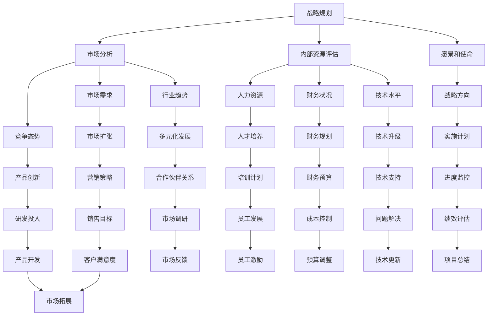

### 3.1.2 企业变革中的系统思维

企业变革是企业管理中的重要环节，涉及到组织结构、流程优化、文化变革等方面。系统思维可以帮助企业在变革过程中识别关键因素，制定合理的变革策略，确保变革的顺利进行。

1. **变革愿景**：明确变革的目标和愿景，为变革提供方向。
2. **现状分析**：分析企业当前的组织结构、流程和文化等，识别存在的问题和改进机会。
3. **变革规划**：根据现状分析，制定具体的变革规划，包括变革的目标、时间表、资源需求等。
4. **变革实施**：按照变革规划实施变革，包括组织结构调整、流程优化、文化重塑等。
5. **变革评估**：对变革效果进行评估，包括变革目标的达成情况、员工满意度、绩效改进等。

以下是一个简单的企业变革鱼骨图示例：

```mermaid
graph TD
    A[企业变革] --> B[变革愿景]
    A --> C[现状分析]
    A --> D[变革规划]
    A --> E[变革实施]
    A --> F[变革评估]
    B --> G[组织结构]
    B --> H[流程优化]
    B --> I[文化重塑]
    C --> J[问题识别]
    C --> K[机会识别]
    D --> L[变革目标]
    D --> M[时间表]
    D --> N[资源需求]
    E --> O[结构调整]
    E --> P[流程优化]
    E --> Q[文化重塑]
    F --> R[目标达成]
    F --> S[员工满意度]
    F --> T[绩效改进]
    G --> U[部门职责]
    G --> V[权力分配]
    H --> W[流程标准化]
    H --> X[流程简化]
    I --> Y[价值观培养]
    I --> Z[员工参与]
    J --> AA[效率低下]
    J --> BB[沟通不畅]
    J --> CC[员工流失]
    K --> DD[市场变化]
    K --> EE[技术创新]
    K --> FF[政策支持]
    L --> GG[短期目标]
    L --> HH[长期目标]
    M --> II[阶段划分]
    M --> JJ[关键里程碑]
    N --> KK[预算分配]
    N --> LL[人员配备]
    O --> MM[部门整合]
    O --> NN[角色调整]
    P --> OO[流程优化]
    P --> PP[工具支持]
    Q --> QQ[文化传承]
    Q --> RR[激励机制]
    R --> SS[目标达成率]
    R --> TT[员工满意度]
    R --> UU[绩效提升]
    S --> VV[目标调整]
    S --> WW[策略优化]
    T --> XX[目标完成]
    T --> YY[绩效改进]
    U --> ZZ[部门协作]
    U --> AAA[责任划分]
    V --> BBB[价值观认同]
    V --> CCC[员工忠诚度]
    W --> DDD[流程效率]
    W --> EEE[成本降低]
    X --> FFF[流程简化]
    X --> GGG[员工培训]
    Y --> HHH[文化氛围]
    Y --> III[员工参与度]
    Z --> JJJ[员工积极性]
    Z --> KKK[团队凝聚力]
    AA --> LLL[效率提升]
    BB --> MMM[沟通畅通]
    CC --> NNN[员工保留]
    DD --> OOO[市场适应性]
    EE --> PPP[技术创新]
    FF --> QQQ[政策支持]
    GG --> RRR[短期目标]
    HH --> SSS[长期目标]
    II --> TTT[阶段划分]
    JJ --> UUU[关键里程碑]
    KK --> VVV[预算分配]
    LL --> WWW[人员配备]
    MM --> XXX[部门整合]
    NN --> YYY[角色调整]
    OO --> ZZZ[流程优化]
    PP --> AAAA[工具支持]
    QQ --> BBBB[文化传承]
    RR --> CCC
```  

### 3.1.3 企业风险管理

企业风险管理是企业确保长期稳定发展的关键。系统思维可以帮助企业识别潜在风险，评估风险影响，制定风险应对策略。

1. **风险识别**：识别企业面临的各种风险，包括市场风险、运营风险、财务风险等。
2. **风险评估**：评估风险的概率和影响，确定风险的优先级。
3. **风险应对**：制定风险应对策略，包括风险规避、风险减轻、风险接受等。
4. **风险监控**：监控风险的变化，及时调整风险应对策略。

以下是一个简单的企业风险管理鱼骨图示例：

```mermaid
graph TD
    A[企业风险管理] --> B[风险识别]
    A --> C[风险评估]
    A --> D[风险应对]
    A --> E[风险监控]
    B --> F[市场风险]
    B --> G[运营风险]
    B --> H[财务风险]
    C --> I[概率评估]
    C --> J[影响评估]
    D --> K[风险规避]
    D --> L[风险减轻]
    D --> M[风险接受]
    E --> N[风险监控]
    F --> O[市场变化]
    F --> P[竞争压力]
    F --> Q[客户需求变化]
    G --> R[运营故障]
    G --> S[供应链中断]
    G --> T[员工流失]
    H --> U[财务危机]
    H --> V[信用风险]
    H --> W[投资风险]
    I --> X[概率高低]
    I --> Y[影响大小]
    K --> Z[风险转移]
    K --> AA[风险规避]
    L --> BB[风险控制]
    L --> CC[风险分散]
    M --> DD[风险接受]
    N --> EE[风险预警]
    N --> FF[风险应对策略]
    O --> GG[市场分析]
    O --> HH[竞争分析]
    O --> II[客户分析]
    P --> JJ[市场适应性]
    P --> KK[竞争策略]
    P --> LL[客户满意度]
    Q --> MM[市场稳定性]
    Q --> NN[市场扩张]
    Q --> OO[市场机会]
    R --> PP[故障排除]
    R --> QQ[供应链优化]
    R --> RR[员工培训]
    S --> SS[供应链管理]
    S --> TT[库存管理]
    S --> UU[供应商关系]
    T --> VW[运营效率]
    T --> XX[运营成本]
    T --> YY[运营质量]
    U --> ZZ[财务规划]
    U --> AAA[信用管理]
    U --> BBB[投资分析]
    V --> CCC[信用评级]
    V --> DDD[债务管理]
    V --> EEE[信用风险控制]
    W --> FFF[投资组合]
    W --> GGG[风险分散]
    W --> HHH[投资策略]
    X --> III[概率高低]
    X --> JJJ[影响大小]
    Y --> KKK[概率高低]
    Y --> LLL[影响大小]
    Z --> MMM[风险转移]
    Z --> NNN[风险规避]
    AA --> OOO[保险购买]
    BB --> PPP[风险控制措施]
    CC --> QQQ[风险分散投资]
    DD --> RRR[风险接受策略]
    EE --> SSS[风险预警系统]
    FF --> TTT[风险应对方案]
    GG --> UUU[市场分析]
    HH --> VVV[竞争分析]
    II --> WWW[客户分析]
    JJ --> XXX[市场适应性]
    KK --> YYY[竞争策略]
    LL --> ZZZ[客户满意度]
    MM --> AAAA[市场稳定性]
    NN --> BBBB[市场扩张]
    OO --> CCC
```  

## 3.2 项目管理中的系统思维

在项目管理中，系统思维的应用主要体现在项目计划与执行、项目风险管理和项目变更管理等方面。

### 3.2.1 项目计划与执行

项目计划是项目管理的核心，通过系统思维，我们可以更好地制定项目计划，并确保项目顺利执行。

1. **项目目标设定**：明确项目的目标和预期成果。
2. **项目范围定义**：确定项目的范围和边界。
3. **项目任务分解**：将项目目标分解为可管理的任务。
4. **项目时间安排**：制定项目的时间表，确保任务按期完成。
5. **项目资源分配**：分配项目所需的资源，如人力、资金、设备等。
6. **项目执行监控**：监控项目进度和资源使用情况，确保项目按计划进行。

以下是一个简单的项目计划鱼骨图示例：

```mermaid
graph TD
    A[项目计划] --> B[项目目标]
    A --> C[项目范围]
    A --> D[任务分解]
    A --> E[时间安排]
    A --> F[资源分配]
    A --> G[执行监控]
    B --> H[项目成果]
    B --> I[客户需求]
    C --> J[项目边界]
    C --> K[项目范围]
    D --> L[任务划分]
    D --> M[任务优先级]
    E --> N[时间表]
    E --> O[任务顺序]
    F --> P[资源需求]
    F --> Q[资源分配]
    G --> R[进度监控]
    G --> S[资源监控]
    H --> T[项目质量]
    H --> U[项目进度]
    I --> V[客户期望]
    I --> W[项目目标]
    J --> X[项目范围]
    J --> Y[项目目标]
    K --> Z[项目边界]
    K --> AA[项目目标]
    L --> BB[任务细节]
    L --> CC[任务关联]
    M --> DD[任务优先级]
    M --> EE[任务依赖]
    N --> FF[时间节点]
    N --> GG[任务周期]
    O --> HH[任务顺序]
    O --> II[任务并行]
    P --> JJ[人力资源]
    P --> KK[资金需求]
    P --> LL[设备需求]
    Q --> MM[人力资源分配]
    Q --> NN[资金分配]
    Q --> OO[设备分配]
    R --> PP[进度跟踪]
    R --> QQ[任务完成情况]
    R --> RR[问题解决]
    S --> SS[资源利用率]
    S --> TT[资源浪费]
    T --> UU[项目成果]
    T --> VV[客户满意度]
    U --> WW[项目目标]
    U --> XX[项目进度]
    V --> YY[客户期望]
    V --> ZZ[项目成果]
    W --> AAA[客户需求分析]
    W --> BBB[项目目标]
    X --> CCC[项目范围]
    X --> DDD[项目目标]
    Y --> EEE[项目边界]
    Y --> FFF[项目目标]
    Z --> GGG[项目范围]
    Z --> HHH[项目目标]
    AA --> III[项目边界]
    AA --> JJJ[项目目标]
    BB --> KKK[客户需求]
    BB --> LLL[项目目标]
    CC --> MMM[任务关联]
    CC --> NNN[任务优先级]
    DD --> OOO[任务依赖]
    EE --> PPP[任务顺序]
    FF --> QQQ[时间表]
    FF --> RRR[任务周期]
    GG --> SSS[任务并行]
    HH --> TTT[时间节点]
    II --> UUU[任务顺序]
    JJ --> VVV[人力资源需求]
    KK --> WWW[资金需求]
    LL --> XXX[设备需求]
    MM --> YYY[人力资源分配]
    NN --> ZZZ[资金分配]
    OO --> AAAA[设备分配]
    PP --> BBBB[进度跟踪]
    QQ --> CCC
```  

### 3.2.2 项目风险管理

项目风险管理是项目管理的重要方面，通过系统思维，我们可以更好地识别和管理项目风险。

1. **风险识别**：识别项目可能面临的各种风险。
2. **风险评估**：评估风险的概率和影响。
3. **风险应对**：制定风险应对策略，包括风险规避、风险减轻、风险接受等。
4. **风险监控**：监控项目风险的变化，及时调整风险应对策略。

以下是一个简单的项目风险管理鱼骨图示例：


### 3.2.3 项目变更管理

项目变更管理是项目管理中的重要环节，通过系统思维，我们可以更好地管理项目变更，确保项目目标的实现。

1. **变更请求**：识别项目变更的需求。
2. **变更评估**：评估变更的影响，包括时间、成本、质量等方面。
3. **变更决策**：根据变更评估结果，决定是否接受变更。
4. **变更实施**：实施已决定的变更，并监控变更的执行情况。
5. **变更总结**：对变更进行总结，为未来的项目变更管理提供经验。

以下是一个简单的项目变更管理鱼骨图示例：

```mermaid
graph TD
    A[项目变更管理] --> B[变更请求]
    A --> C[变更评估]
    A --> D[变更决策]
    A --> E[变更实施]
    A --> F[变更总结]
    B --> G[需求变更]
    B --> H[设计变更]
    B --> I[技术变更]
    C --> J[时间影响]
    C --> K[成本影响]
    C --> L[质量影响]
    D --> M[接受变更]
    D --> N[拒绝变更]
    E --> O[变更实施]
    E --> P[变更监控]
    F --> Q[变更结果]
    F --> R[经验总结]
    G --> S[客户需求]
    G --> T[项目目标]
    G --> U[市场变化]
    H --> V[设计修改]
    H --> W[功能增强]
    H --> X[界面优化]
    I --> Y[技术升级]
    I --> Z[代码优化]
    I --> AA[算法改进]
    J --> BB[工期延长]
    J --> CC[进度延误]
    J --> DD[任务延期]
    K --> EE[成本增加]
    K --> FF[预算超支]
    K --> GG[资源浪费]
    L --> HH[质量下降]
    L --> II[缺陷增多]
    L --> JJ[客户投诉]
    M --> KK[变更实施]
    M --> LL[变更取消]
    N --> MM[变更保留]
    N --> NN[变更放弃]
    O --> PP[变更进度]
    O --> QQ[变更成本]
    O --> RR[变更质量]
    P --> SS[变更监控]
    P --> TT[变更反馈]
    Q --> UU[变更效果]
    Q --> VV[变更影响]
    R --> WW[变更经验]
    R --> XX[变更教训]
    S --> YY[变更验证]
    S --> ZZ[变更验收]
    T --> AAA[客户满意度]
    T --> BBB[项目目标]
    T --> CCC[市场适应性]
    U --> DDD[设计优化]
    U --> EEE[功能增强]
    U --> FFF[界面改善]
    V --> GGG[技术更新]
    V --> HHH[代码优化]
    V --> III[算法改进]
    W --> JJJ[设计修改]
    W --> KKK[功能增强]
    W --> LLL[界面优化]
    X --> MMM[技术升级]
    X --> NNN[代码优化]
    X --> OOO[算法改进]
    Y --> PPP[技术升级]
    Y --> QQ
```  

## 3.3 决策过程中的系统思维

在决策过程中，系统思维可以帮助我们更全面地评估各种因素，提高决策的质量和效率。

### 3.3.1 决策模型构建

决策模型构建是决策过程的重要环节，通过构建决策模型，我们可以更好地分析问题，评估各种决策方案。

1. **问题定义**：明确决策问题的性质和目标。
2. **模型构建**：构建一个能够描述问题特征的决策模型。
3. **模型优化**：对决策模型进行优化，以提高模型的准确性和可靠性。
4. **模型验证**：验证决策模型的正确性，确保模型能够反映问题的实际情况。

以下是一个简单的决策模型构建鱼骨图示例：

```mermaid
graph TD
    A[决策模型构建] --> B[问题定义]
    A --> C[模型构建]
    A --> D[模型优化]
    A --> E[模型验证]
    B --> F[决策目标]
    B --> G[决策方案]
    B --> H[决策环境]
    C --> I[模型框架]
    C --> J[模型参数]
    C --> K[模型关系]
    D --> L[模型优化]
    D --> M[模型调整]
    D --> N[模型验证]
    E --> O[模型验证]
    E --> P[模型修正]
    F --> Q[目标明确]
    F --> R[目标优先级]
    F --> S[目标可行性]
    G --> T[方案分析]
    G --> U[方案评估]
    G --> V[方案选择]
    H --> W[环境分析]
    H --> X[环境变化]
    H --> Y[环境约束]
    I --> Z[框架确定]
    I --> AA[参数设置]
    I --> BB[关系描述]
    J --> CC[参数优化]
    J --> DD[参数调整]
    J --> EE[参数验证]
    K --> FF[关系优化]
    K --> GG[关系调整]
    K --> HH[关系验证]
    L --> II[模型优化]
    L --> JJ[模型验证]
    M --> KK[模型调整]
    M --> LL[模型修正]
    N --> MM[模型验证]
    N --> NN[模型修正]
    O --> PP[模型验证]
    O --> QQ[模型修正]
    P --> RR[模型验证]
    P --> SS[模型修正]
    Q --> TT[目标达成]
    Q --> UU[方案选择]
    Q --> VV[环境适应]
    R --> WW[模型优化]
    R --> XX[模型修正]
    S --> YY[目标达成]
    S --> ZZ[方案选择]
    T --> AAA[方案评估]
    T --> BBB[方案选择]
    T --> CCC[环境适应]
    U --> DDD[方案分析]
    U --> EEE[方案评估]
    U --> FFF[方案选择]
    V --> GGG[环境分析]
    V --> HHH[环境变化]
    V --> III[环境约束]
    W --> JJJ[环境分析]
    W --> KKK[环境变化]
    W --> LLL[环境约束]
    X --> MMM[环境变化]
    X --> NNN[环境约束]
    X --> OOO[环境适应]
    Y --> PPP[环境变化]
    Y --> QQ
```  

### 3.3.2 决策分析工具

决策分析工具可以帮助我们更好地评估各种决策方案，提高决策的效率和质量。

1. **决策树**：通过决策树，我们可以清晰地展示不同决策路径的结果，帮助决策者更好地理解决策过程。
2. **期望值分析**：通过计算期望值，我们可以评估不同决策方案的可能结果，帮助决策者选择最优方案。
3. **敏感性分析**：通过敏感性分析，我们可以识别决策过程中可能影响结果的敏感因素，帮助决策者制定应对策略。

以下是一个简单的决策分析工具鱼骨图示例：

```mermaid
graph TD
    A[决策分析工具] --> B[决策树]
    A --> C[期望值分析]
    A --> D[敏感性分析]
    B --> E[决策路径]
    B --> F[结果评估]
    B --> G[决策选择]
    C --> H[期望值计算]
    C --> I[方案评估]
    C --> J[决策优化]
    D --> K[敏感性识别]
    D --> L[风险分析]
    D --> M[策略制定]
    E --> N[决策节点]
    E --> O[决策分支]
    E --> P[决策结果]
    F --> Q[结果分析]
    F --> R[方案选择]
    F --> S[决策效果]
    G --> T[决策路径]
    G --> U[结果预测]
    G --> V[决策优化]
    H --> W[概率分布]
    H --> X[期望值计算]
    H --> Y[方案评估]
    I --> Z[结果分析]
    I --> AA[方案选择]
    I --> BB[决策优化]
    J --> CC[期望值分析]
    J --> DD[方案评估]
    J --> EE[决策优化]
    K --> FF[敏感性分析]
    K --> GG[风险分析]
    K --> HH[策略制定]
    L --> II[风险识别]
    L --> JJ[风险评估]
    L --> KK[决策优化]
    M --> LL[策略调整]
    M --> MM[风险应对]
    M --> NN[决策优化]
    N --> OO[决策节点]
    N --> PP[决策分支]
    N --> QQ[决策结果]
    O --> RR[结果分析]
    O --> SS[方案选择]
    O --> TT[决策效果]
    P --> UU[结果预测]
    P --> VW[方案评估]
    P --> XX[决策优化]
    Q --> YY[决策效果]
    Q --> ZZ[决策效率]
    R --> AAA[结果分析]
    R --> BBB[方案选择]
    R --> CCC[决策优化]
    S --> DDD[决策路径]
    S --> EEE[结果预测]
    S --> FFF[决策优化]
    T --> GGG[概率分布]
    T --> HHH[期望值计算]
    T --> III[方案评估]
    U --> JJJ[敏感性分析]
    U --> KKK[风险分析]
    U --> LLL[策略制定]
    V --> MMM[决策路径]
    V --> NNN[结果预测]
    V --> OOO[决策优化]
    W --> PPP[概率分布]
    W --> QQ
```  

### 3.3.3 决策中的系统思维应用

在决策过程中，系统思维的应用可以帮助我们更全面地评估各种因素，提高决策的质量和效率。

1. **整体性**：从整体上考虑决策问题，不仅关注当前的结果，还要考虑长期的影响。
2. **动态性**：考虑决策过程的动态变化，适应不断变化的环境和情况。
3. **关联性**：识别决策问题中的各种关联因素，理解它们之间的相互作用。
4. **适应性**：根据实际情况调整决策方案，确保决策的有效性和适应性。

以下是一个简单的决策中的系统思维应用鱼骨图示例：

```mermaid
graph TD
    A[决策中的系统思维应用] --> B[整体性]
    A --> C[动态性]
    A --> D[关联性]
    A --> E[适应性]
    B --> F[全局视角]
    B --> G[长期影响]
    B --> H[整体优化]
    C --> I[过程变化]
    C --> J[环境变化]
    C --> K[动态调整]
    D --> L[因素关联]
    D --> M[相互作用]
    D --> N[关系分析]
    E --> O[决策调整]
    E --> P[适应变化]
    E --> Q[有效性保障]
    F --> R[全局分析]
    F --> S[目标设定]
    F --> T[资源分配]
    G --> U[长期规划]
    G --> V[风险评估]
    G --> W[战略调整]
    H --> X[综合优化]
    H --> Y[方案评估]
    H --> Z[效果评价]
    I --> AA[过程监控]
    I --> BB[过程调整]
    I --> CC[过程优化]
    J --> DD[环境分析]
    J --> EE[环境适应]
    J --> FF[环境应对]
    K --> GG[动态调整]
    K --> HH[策略优化]
    K --> II[过程管理]
    L --> JJ[因素识别]
    L --> KK[关系分析]
    L --> LL[相互作用]
    M --> MM[系统分析]
    M --> NN[模型构建]
    M --> OO[方案评估]
    N --> PP[关系优化]
    N --> QQ[系统稳定性]
    N --> RR[系统效率]
    O --> SS[决策调整]
    O --> TT[策略调整]
    O --> UU[方案优化]
    P --> VW[适应性调整]
    P --> XX[环境适应]
    P --> YY[策略优化]
    Q --> ZZ[有效性评价]
    Q --> AAA[决策效率]
    Q --> BBB[目标达成]
    R --> CCC[全局分析]
    R --> DDD[目标设定]
    R --> EEE[资源分配]
    S --> FFF[长期规划]
    S --> GGG[风险评估]
    S --> HHH[战略调整]
    T --> III[全局视角]
    T --> JJJ[长期影响]
    T --> KKK[整体优化]
    U --> LLL[决策调整]
    U --> MMM[策略调整]
    U --> NNN[方案优化]
    V --> OOO[环境变化]
    V --> PPP[环境适应]
    V --> QQ
```  

### 第二部分：系统思维的核心概念

#### 第2章 系统思维的核心概念

## 2.1 系统的构成要素

系统的构成要素是理解和管理复杂问题的关键。它们包括系统元素、系统边界和系统层次结构。以下是对这些概念的具体解释：

### 2.1.1 系统元素

系统元素是构成系统的基本单元，可以是物理实体、抽象概念或信息。在企业管理系统中，员工、产品、流程、客户、技术等都是系统元素。例如，在一家生产公司中，员工是执行任务的个体，产品是系统的输出，流程是系统运行的机制，客户是系统服务的对象，技术是支持系统运作的基础。

#### 2.1.2 系统边界

系统边界是指系统与其他系统或环境的相互作用界面。正确识别系统边界有助于我们理解系统的影响范围和外部因素。系统边界可以是物理的、逻辑的或抽象的。例如，一家公司的系统边界可能包括公司内部的各个部门、供应商、客户、市场等外部环境。

### 2.1.3 系统层次结构

系统层次结构描述了系统内部的不同层次和层次之间的关系。通过层次结构，我们可以更好地理解系统的复杂性和组织方式。常见的系统层次结构包括战略层、战术层和操作层。战略层关注长期目标和规划，战术层关注中期目标和策略，操作层关注短期目标和执行。

## 2.2 系统行为与反馈

### 2.2.1 系统反馈环

系统反馈环是系统行为和结果之间的循环关系。它包括正反馈环和负反馈环。正反馈环导致系统行为的增强，例如市场需求的增加可能导致生产量的增加，从而进一步刺激市场需求。负反馈环导致系统行为的稳定，例如价格下跌可能导致销量减少，从而稳定价格。

#### 2.2.2 系统行为分析

系统行为分析是一种用于研究系统行为的方法。它包括对系统状态、过程和结果的测量、分析和模拟。通过系统行为分析，我们可以理解系统在不同条件下的行为模式，预测系统未来的发展趋势。例如，在项目管理中，系统行为分析可以帮助我们预测项目进度和资源使用情况。

### 2.2.3 反馈环的平衡与失衡

反馈环的平衡与失衡是系统稳定性的关键因素。当系统达到平衡时，系统行为保持稳定；当系统失衡时，系统可能会出现不稳定或崩溃。因此，理解反馈环的平衡与失衡对于维护系统稳定性至关重要。

## 2.3 系统思维的关键工具

### 2.3.1 鱼骨图

鱼骨图是一种用于分析问题的图形工具。它将问题分解为多个因素，并显示它们之间的因果关系。鱼骨图有助于我们识别问题的根本原因，并提供解决问题的思路。

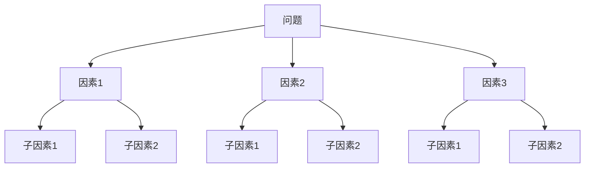

### 2.3.2 SWOT分析

SWOT分析是一种用于评估企业或项目的优势和劣势、机会和威胁的方法。它可以帮助我们识别系统中的关键因素，并制定相应的策略。SWOT分析包括四个方面：优势（Strengths）、劣势（Weaknesses）、机会（Opportunities）和威胁（Threats）。

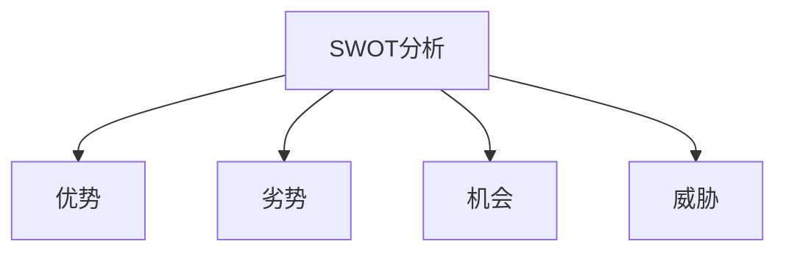

### 2.3.3 敏捷迭代方法

敏捷迭代方法是一种用于快速开发和改进系统的方法。它强调迭代、反馈和持续改进，以提高系统的适应性和性能。敏捷迭代方法适用于动态变化的复杂系统，有助于我们在不断变化的条件下保持系统的活力和竞争力。

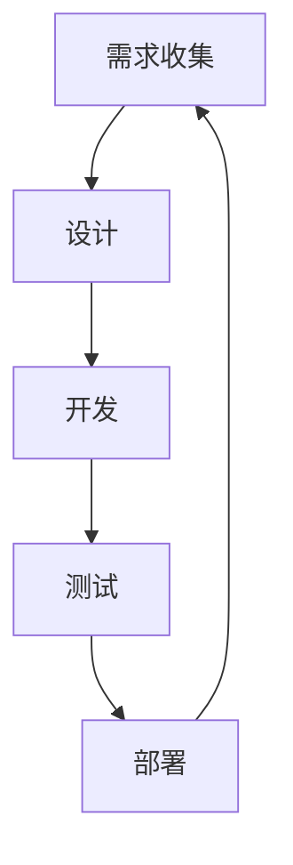

### 第3章 系统思维的应用实践

#### 3.1 企业战略中的系统思维

在企业战略中，系统思维可以帮助我们理解和规划企业的长期发展。以下是一些关键步骤：

### 3.1.1 企业战略规划

企业战略规划是一种长期规划过程，用于确定企业的愿景、使命和目标。通过系统思维，我们可以更全面地评估各种因素，制定具有前瞻性的战略规划。以下是一个简单的企业战略规划流程：

1. **愿景和使命**：明确企业的长远目标和使命，为战略规划提供方向。
2. **市场分析**：分析市场环境，包括市场需求、竞争态势、行业趋势等。
3. **内部资源评估**：评估企业的内部资源，如人力资源、财务状况、技术水平等。
4. **战略选择**：根据市场分析和内部资源评估，选择合适的战略方向，如市场扩张、产品创新等。
5. **战略实施**：制定具体的实施计划，包括目标、关键任务、时间表等。

以下是一个简单的企业战略规划鱼骨图示例：

```mermaid
graph TD
    A[企业战略规划] --> B[愿景和使命]
    A --> C[市场分析]
    A --> D[内部资源评估]
    A --> E[战略选择]
    A --> F[战略实施]
    B --> G[企业目标]
    B --> H[使命陈述]
    C --> I[市场需求]
    C --> J[竞争态势]
    C --> K[行业趋势]
    D --> L[人力资源]
    D --> M[财务状况]
    D --> N[技术水平]
    E --> O[市场扩张]
    E --> P[产品创新]
    E --> Q[多元化发展]
    F --> R[目标设定]
    F --> S[任务分配]
    F --> T[时间表]
    G --> U[长期目标]
    G --> V[战略方向]
    H --> W[企业价值观]
    H --> X[社会责任]
    I --> Y[市场机会]
    I --> Z[市场挑战]
    J --> AA[竞争者分析]
    J --> BB[市场份额]
    J --> CC[竞争优势]
    K --> DD[行业增长]
    K --> EE[技术变革]
    K --> FF[政策影响]
    L --> GG[人才招聘]
    L --> HH[员工培训]
    L --> II[人才保留]
    M --> JJ[财务预算]
    M --> KK[投资分析]
    M --> LL[资金管理]
    N --> MM[技术研发]
    N --> NN[技术更新]
    N --> OO[技术创新]
    O --> PP[市场扩张策略]
    O --> QQ[产品创新策略]
    O --> RR[多元化策略]
    P --> SS[市场研究]
    P --> TT[营销计划]
    P --> UU[销售目标]
    Q --> VW[产品改进]
    Q --> XX[技术创新应用]
    Q --> YY[市场适应性]
    R --> ZZ[多元化业务]
    R --> AAA[产品组合]
    R --> BBB[市场定位]
    S --> CCC[目标达成]
    S --> DDD[任务完成情况]
    S --> EEE[时间表执行]
    T --> FFF[阶段性评估]
    T --> GGG[策略调整]
    U --> HHH[市场调研]
    U --> III[市场反馈]
    U --> JJJ[客户满意度]
    V --> KKK[市场机会分析]
    V --> LL
```  

### 3.1.2 企业变革中的系统思维

企业变革是一种常见但复杂的过程，涉及组织结构、流程优化、文化变革等方面。系统思维可以帮助我们识别变革的关键因素，制定有效的变革策略，确保变革的顺利进行。

1. **变革愿景**：明确变革的目标和愿景，为变革提供方向。
2. **现状分析**：分析企业当前的组织结构、流程和文化等，识别存在的问题和改进机会。
3. **变革规划**：根据现状分析，制定具体的变革规划，包括变革的目标、时间表、资源需求等。
4. **变革实施**：按照变革规划实施变革，包括组织结构调整、流程优化、文化重塑等。
5. **变革评估**：对变革效果进行评估，包括变革目标的达成情况、员工满意度、绩效改进等。

以下是一个简单的企业变革鱼骨图示例：


### 3.1.3 企业风险管理

企业风险管理是企业确保长期稳定发展的关键。系统思维可以帮助我们识别潜在风险，评估风险影响，制定风险应对策略。

1. **风险识别**：识别企业面临的各种风险，包括市场风险、运营风险、财务风险等。
2. **风险评估**：评估风险的概率和影响，确定风险的优先级。
3. **风险应对**：制定风险应对策略，包括风险规避、风险减轻、风险接受等。
4. **风险监控**：监控风险的变化，及时调整风险应对策略。

以下是一个简单的企业风险管理鱼骨图示例：


## 3.2 项目管理中的系统思维

在项目管理中，系统思维的应用可以帮助我们更好地理解项目的复杂性和不确定性，从而更有效地管理项目。以下是一些关键步骤：

### 3.2.1 项目计划与执行

项目计划与执行是项目管理的核心环节。系统思维可以帮助我们制定全面的项目计划，并确保项目按照计划执行。

1. **项目目标设定**：明确项目的目标和预期成果。
2. **项目范围定义**：确定项目的范围和边界。
3. **项目任务分解**：将项目目标分解为可管理的任务。
4. **项目时间安排**：制定项目的时间表，确保任务按期完成。
5. **项目资源分配**：分配项目所需的资源，如人力、资金、设备等。
6. **项目执行监控**：监控项目进度和资源使用情况，确保项目按计划进行。

以下是一个简单的项目计划与执行鱼骨图示例：

```mermaid
graph TD
    A[项目计划与执行] --> B[项目目标]
    A --> C[项目范围]
    A --> D[任务分解]
    A --> E[时间安排]
    A --> F[资源分配]
    A --> G[执行监控]
    B --> H[项目成果]
    B --> I[客户需求]
    C --> J[项目边界]
    C --> K[项目范围]
    D --> L[任务划分]
    D --> M[任务优先级]
    E --> N[时间表]
    E --> O[任务顺序]
    F --> P[资源需求]
    F --> Q[资源分配]
    G --> R[进度监控]
    G --> S[资源监控]
    H --> T[项目质量]
    H --> U[项目进度]
    I --> V[客户期望]
    I --> W[项目目标]
    J --> X[项目范围]
    J --> Y[项目目标]
    K --> Z[项目边界]
    K --> AA[项目目标]
    L --> BB[任务细节]
    L --> CC[任务关联]
    M --> DD[任务优先级]
    M --> EE[任务依赖]
    N --> FF[时间节点]
    N --> GG[任务周期]
    O --> HH[任务顺序]
    O --> II[任务并行]
    P --> JJ[人力资源]
    P --> KK[资金需求]
    P --> LL[设备需求]
    Q --> MM[人力资源分配]
    Q --> NN[资金分配]
    Q --> OO[设备分配]
    R --> PP[进度跟踪]
    R --> QQ[任务完成情况]
    R --> RR[问题解决]
    S --> SS[资源利用率]
    S --> TT[资源浪费]
    T --> UU[项目成果]
    T --> VV[客户满意度]
    U --> WW[项目目标]
    U --> XX[项目进度]
    V --> YY[客户期望]
    V --> ZZ[项目成果]
    W --> AAA[客户需求分析]
    W --> BBB[项目目标]
    X --> CCC[项目范围]
    X --> DDD[项目目标]
    Y --> EEE[项目边界]
    Y --> FFF[项目目标]
    Z --> GGG[项目范围]
    Z --> HHH[项目目标]
    AA --> III[项目边界]
    AA --> JJJ[项目目标]
    BB --> KKK[客户需求]
    BB --> LLL[项目目标]
    CC --> MMM[任务关联]
    CC --> NNN[任务优先级]
    DD --> OOO[任务依赖]
    EE --> PPP[任务顺序]
    FF --> QQQ[时间表]
    FF --> RRR[任务周期]
    GG --> SSS[任务并行]
    HH --> TTT[时间节点]
    II --> UUU[任务顺序]
    JJ --> VVV[人力资源需求]
    KK --> WWW[资金需求]
    LL --> XXX[设备需求]
    MM --> YYY[人力资源分配]
    NN --> ZZZ[资金分配]
    OO --> AAAA[设备分配]
    PP --> BBBB[进度跟踪]
    QQ --> CCC
```  

### 3.2.2 项目风险管理

项目风险管理是项目管理的重要组成部分。系统思维可以帮助我们识别项目风险，评估风险影响，制定风险应对策略。

1. **风险识别**：识别项目可能面临的各种风险。
2. **风险评估**：评估风险的概率和影响。
3. **风险应对**：制定风险应对策略，包括风险规避、风险减轻、风险接受等。
4. **风险监控**：监控项目风险的变化，及时调整风险应对策略。

以下是一个简单的项目风险管理鱼骨图示例：

```mermaid
graph TD
    A[项目风险管理] --> B[风险识别]
    A --> C[风险评估]
    A --> D[风险应对]
    A --> E[风险监控]
    B --> F[项目风险]
    B --> G[环境风险]
    B --> H[技术风险]
    C --> I[风险概率]
    C --> J[风险影响]
    D --> K[风险规避]
    D --> L[风险减轻]
    D --> M[风险接受]
    E --> N[风险监控]
    F --> O[项目失败]
    F --> P[进度延误]
    F --> Q[成本超支]
    G --> R[政策变化]
    G --> S[市场竞争]
    G --> T[法律法规]
    H --> U[技术难题]
    H --> V[资源限制]
    H --> W[技术更新]
    I --> X[低概率]
    I --> Y[高概率]
    I --> Z[不确定]
    J --> AA[低影响]
    J --> BB[中影响]
    J --> CC[高影响]
    K --> DD[风险转移]
    K --> EE[风险规避]
    L --> FF[风险控制]
    L --> GG[风险分散]
    M --> HH[风险接受]
    N --> II[风险预警]
    N --> JJ[应对措施]
    O --> KK[项目失败风险]
    O --> LL[进度延误风险]
    O --> MM[成本超支风险]
    P --> NN[政策变化风险]
    P --> OO[市场竞争风险]
    P --> PP[法律法规风险]
    Q --> QQ[技术难题风险]
    Q --> RR[资源限制风险]
    Q --> SS[技术更新风险]
    R --> TT[政策适应性]
    R --> UU[市场适应性]
    R --> VV[法律法规遵守]
    S --> WW[技术能力]
    S --> XX[资源调配]
    S --> YY[技术创新]
    T --> ZZ[政策分析]
    T --> AAA[市场分析]
    T --> BBB[法律法规分析]
    U --> CCC[技术难题解决]
    U --> DDD[资源调配策略]
    U --> EEE[技术创新策略]
    V --> FFF[技术知识储备]
    V --> GGG[技术经验积累]
    V --> HHH[技术创新环境]
    W --> III[技术知识储备]
    W --> JJJ[技术经验积累]
    W --> KKK[技术创新环境]
    X --> LLL[低概率]
    X --> MMM[高概率]
    X --> NNN[不确定]
    Y --> OOO[低影响]
    Y --> PPP[中影响]
    Y --> QQQ[高影响]
    Z --> RRR[低影响]
    Z --> SSS[中影响]
    Z --> TTT[高影响]
    AA --> UUU[风险转移措施]
    BB --> VVV[风险规避策略]
    CC --> WWW[风险控制措施]
    DD --> XXX[风险接受策略]
    EE --> YYY[风险规避方案]
    FF --> ZZZ[风险控制方案]
    GG --> AAAA[风险分散方案]
    HH --> BBBB[风险接受方案]
    II --> CCC
```  

### 3.2.3 项目变更管理

项目变更管理是项目管理中的一项重要工作，涉及到对项目范围、时间、成本等进行的调整。系统思维可以帮助我们更好地管理项目变更，确保项目目标的实现。

1. **变更请求**：识别项目变更的需求。
2. **变更评估**：评估变更的影响，包括时间、成本、质量等方面。
3. **变更决策**：根据变更评估结果，决定是否接受变更。
4. **变更实施**：实施已决定的变更，并监控变更的执行情况。
5. **变更总结**：对变更进行总结，为未来的项目变更管理提供经验。

以下是一个简单的项目变更管理鱼骨图示例：


### 3.3 决策过程中的系统思维

在决策过程中，系统思维可以帮助我们更全面地评估各种因素，提高决策的质量和效率。

### 3.3.1 决策模型构建

决策模型构建是决策过程的重要环节。通过构建决策模型，我们可以更好地分析问题，评估各种决策方案。

1. **问题定义**：明确决策问题的性质和目标。
2. **模型构建**：构建一个能够描述问题特征的决策模型。
3. **模型优化**：对决策模型进行优化，以提高模型的准确性和可靠性。
4. **模型验证**：验证决策模型的正确性，确保模型能够反映问题的实际情况。

以下是一个简单的决策模型构建鱼骨图示例：


### 3.3.2 决策分析工具

决策分析工具可以帮助我们更好地评估各种决策方案，提高决策的效率和质量。

1. **决策树**：通过决策树，我们可以清晰地展示不同决策路径的结果，帮助决策者更好地理解决策过程。
2. **期望值分析**：通过计算期望值，我们可以评估不同决策方案的可能结果，帮助决策者选择最优方案。
3. **敏感性分析**：通过敏感性分析，我们可以识别决策过程中可能影响结果的敏感因素，帮助决策者制定应对策略。

以下是一个简单的决策分析工具鱼骨图示例：

```mermaid
graph TD
    A[决策分析工具] --> B[决策树]
    A --> C[期望值分析]
    A --> D[敏感性分析]
    B --> E[决策路径]
    B --> F[结果评估]
    B --> G[决策选择]
    C --> H[期望值计算]
    C --> I[方案评估]
    C --> J[决策优化]
    D --> K[敏感性识别]
    D --> L[风险分析]
    D --> M[策略制定]
    E --> N[决策节点]
    E --> O[决策分支]
    E --> P[决策结果]
    F --> Q[结果分析]
    F --> R[方案选择]
    F --> S[决策效果]
    G --> T[决策路径]
    G --> U[结果预测]
    G --> V[决策优化]
    H --> W[概率分布]
    H --> X[期望值计算]
    H --> Y[方案评估]
    I --> Z[结果分析]
    I --> AA[方案选择]
    I --> BB[决策优化]
    J --> CC[期望值分析]
    J --> DD[方案评估]
    J --> EE[决策优化]
    K --> FF[敏感性分析]
    K --> GG[风险分析]
    K --> HH[策略制定]
    L --> II[风险识别]
    L --> JJ[风险评估]
    L --> KK[决策优化]
    M --> LL[策略调整]
    M --> MM[风险应对]
    M --> NN[决策优化]
    N --> OO[决策节点]
    N --> PP[决策分支]
    N --> QQ[决策结果]
    O --> RR[结果分析]
    O --> SS[方案选择]
    O --> TT[决策效果]
    P --> UU[结果预测]
    P --> VW[方案评估]
    P --> XX[决策优化]
    Q --> YY[决策效果]
    Q --> ZZ[决策效率]
    R --> BBB[方案选择]
    R --> CCC[决策优化]
    S --> DDD[决策路径]
    S --> EEE[结果预测]
    S --> FFF[决策优化]
    T --> GGG[概率分布]
    T --> HHH[期望值计算]
    T --> III[方案评估]
    U --> JJJ[敏感性分析]
    U --> KKK[风险分析]
    U --> LLL[策略制定]
    V --> MMM[决策路径]
    V --> NNN[结果预测]
    V --> OOO[决策优化]
    W --> PPP[概率分布]
    W --> QQ
```  

### 3.3.3 决策中的系统思维应用

在决策过程中，系统思维的应用可以帮助我们更全面地评估各种因素，提高决策的质量和效率。

1. **整体性**：从整体上考虑决策问题，不仅关注当前的结果，还要考虑长期的影响。
2. **动态性**：考虑决策过程的动态变化，适应不断变化的环境和情况。
3. **关联性**：识别决策问题中的各种关联因素，理解它们之间的相互作用。
4. **适应性**：根据实际情况调整决策方案，确保决策的有效性和适应性。

以下是一个简单的决策中的系统思维应用鱼骨图示例：

```mermaid
graph TD
    A[决策中的系统思维应用] --> B[整体性]
    A --> C[动态性]
    A --> D[关联性]
    A --> E[适应性]
    B --> F[全局视角]
    B --> G[长期影响]
    B --> H[整体优化]
    C --> I[过程变化]
    C --> J[环境变化]
    C --> K[动态调整]
    D --> L[因素关联]
    D --> M[相互作用]
    D --> N[关系分析]
    E --> O[决策调整]
    E --> P[适应变化]
    E --> Q[有效性保障]
    F --> R[全局分析]
    F --> S[目标设定]
    F --> T[资源分配]
    G --> U[长期规划]
    G --> V[风险评估]
    G --> W[战略调整]
    H --> X[综合优化]
    H --> Y[方案评估]
    H --> Z[效果评价]
    I --> AA[过程监控]
    I --> BB[过程调整]
    I --> CC[过程优化]
    J --> DD[环境分析]
    J --> EE[环境变化]
    J --> FF[环境约束]
    K --> GG[动态调整]
    K --> HH[策略优化]
    K --> II[过程管理]
    L --> JJ[因素识别]
    L --> KK[关系分析]
    L --> LL[相互作用]
    M --> MM[系统分析]
    M --> NN[模型构建]
    M --> OO[方案评估]
    N --> PP[关系优化]
    N --> QQ[系统稳定性]
    N --> RR[系统效率]
    O --> SS[决策调整]
    O --> TT[策略调整]
    O --> UU[方案优化]
    P --> VW[适应性调整]
    P --> XX[环境适应]
    P --> YY[策略优化]
    Q --> ZZ[有效性评价]
    Q --> AAA[决策效率]
    Q --> BBB[目标达成]
    R --> CCC[全局分析]
    R --> DDD[目标设定]
    R --> EEE[资源分配]
    S --> FFF[长期规划]
    S --> GGG[风险评估]
    S --> HHH[战略调整]
    T --> III[全局视角]
    T --> JJJ[长期影响]
    T --> KKK[整体优化]
    U --> LLL[决策调整]
    U --> MMM[策略调整]
    U --> NNN[方案优化]
    V --> OOO[环境变化]
    V --> PPP[环境适应]
    V --> QQ
```  

### 第三部分：系统思维在组织管理中的应用

#### 第4章 系统思维在组织管理中的应用

## 4.1 组织架构设计

组织架构设计是组织管理的重要方面，它决定了组织内部各部门的职责、权限和关系。系统思维可以帮助我们更好地设计组织架构，提高组织的效率和协同性。

### 4.1.1 组织架构的要素

组织架构的要素包括：

1. **组织结构**：组织结构定义了组织内部各部门的层次和关系。
2. **职能分工**：职能分工明确了各部门的职责和任务。
3. **决策体系**：决策体系决定了组织内部的决策流程和权限分配。
4. **沟通渠道**：沟通渠道确保了组织内部信息的高效传递。

#### 4.1.2 组织架构的优化

优化组织架构的关键步骤包括：

1. **评估现有架构**：评估现有组织架构的优缺点，确定优化方向。
2. **确定目标架构**：根据组织目标，设计一个合理的目标架构。
3. **实施优化措施**：逐步实施优化措施，包括调整组织结构、职能分工和决策体系。
4. **持续监控和调整**：监控优化效果，根据实际情况进行持续调整。

### 4.1.3 组织文化的塑造

组织文化是组织内部的价值观、信念和行为准则。系统思维可以帮助我们塑造积极、健康的组织文化。

1. **文化定位**：明确组织文化的核心价值观和目标。
2. **文化宣传**：通过培训、活动和沟通，宣传和强化组织文化。
3. **文化实践**：通过日常工作和项目，实践组织文化，确保文化融入组织行为。
4. **文化评估**：定期评估组织文化的实施效果，根据反馈进行调整。

#### 第4章 系统思维在组织管理中的应用

## 4.1 组织架构设计

### 4.1.1 组织架构的要素

组织架构的要素包括：

1. **组织结构**：组织结构定义了组织内部各部门的层次和关系。
2. **职能分工**：职能分工明确了各部门的职责和任务。
3. **决策体系**：决策体系决定了组织内部的决策流程和权限分配。
4. **沟通渠道**：沟通渠道确保了组织内部信息的高效传递。

#### 4.1.2 组织架构的优化

优化组织架构的关键步骤包括：

1. **评估现有架构**：评估现有组织架构的优缺点，确定优化方向。
2. **确定目标架构**：根据组织目标，设计一个合理的目标架构。
3. **实施优化措施**：逐步实施优化措施，包括调整组织结构、职能分工和决策体系。
4. **持续监控和调整**：监控优化效果，根据实际情况进行持续调整。

### 4.1.3 组织文化的塑造

组织文化是组织内部的价值观、信念和行为准则。系统思维可以帮助我们塑造积极、健康的组织文化。

1. **文化定位**：明确组织文化的核心价值观和目标。
2. **文化宣传**：通过培训、活动和沟通，宣传和强化组织文化。
3. **文化实践**：通过日常工作和项目，实践组织文化，确保文化融入组织行为。
4. **文化评估**：定期评估组织文化的实施效果，根据反馈进行调整。

#### 4.2 人力资源管理

### 4.2.1 人才选拔与培养

人力资源管理中的关键环节之一是人才选拔与培养。系统思维可以帮助我们更科学地选拔和培养人才，提高组织的整体竞争力。

1. **人才选拔标准**：明确人才选拔的标准和流程，确保选拔过程公正、透明。
2. **人才评价体系**：建立科学的人才评价体系，全面评估员工的能力和潜力。
3. **培训与发展**：提供多样化的培训和发展机会，帮助员工提升技能和知识。
4. **职业规划**：为员工制定明确的职业规划，激励员工积极发展。

#### 4.2.2 绩效评估与激励

绩效评估与激励是人力资源管理的重要组成部分。系统思维可以帮助我们更有效地进行绩效评估和激励。

1. **绩效指标设定**：设定明确的绩效指标，确保评估标准客观、公正。
2. **绩效评估流程**：建立完善的绩效评估流程，确保评估过程的规范性和有效性。
3. **激励措施**：根据绩效评估结果，制定相应的激励措施，激励员工提高绩效。
4. **反馈与沟通**：定期与员工进行反馈和沟通，确保激励措施的有效实施。

#### 4.2.3 团队协作与沟通

团队协作与沟通是组织高效运作的重要保障。系统思维可以帮助我们更好地促进团队协作与沟通。

1. **团队建设**：通过团队建设活动，增强团队成员之间的信任和协作。
2. **沟通渠道**：建立畅通的沟通渠道，确保信息在团队内部的高效传递。
3. **协作工具**：使用协作工具，提高团队协作的效率和质量。
4. **冲突管理**：建立有效的冲突管理机制，解决团队内部的冲突，确保团队和谐。

#### 第4章 系统思维在组织管理中的应用

## 4.1 组织架构设计

### 4.1.1 组织架构的要素

组织架构的要素包括：

1. **组织结构**：组织结构定义了组织内部各部门的层次和关系。
2. **职能分工**：职能分工明确了各部门的职责和任务。
3. **决策体系**：决策体系决定了组织内部的决策流程和权限分配。
4. **沟通渠道**：沟通渠道确保了组织内部信息的高效传递。

#### 4.1.2 组织架构的优化

优化组织架构的关键步骤包括：

1. **评估现有架构**：评估现有组织架构的优缺点，确定优化方向。
2. **确定目标架构**：根据组织目标，设计一个合理的目标架构。
3. **实施优化措施**：逐步实施优化措施，包括调整组织结构、职能分工和决策体系。
4. **持续监控和调整**：监控优化效果，根据实际情况进行持续调整。

### 4.1.3 组织文化的塑造

组织文化是组织内部的价值观、信念和行为准则。系统思维可以帮助我们塑造积极、健康的组织文化。

1. **文化定位**：明确组织文化的核心价值观和目标。
2. **文化宣传**：通过培训、活动和沟通，宣传和强化组织文化。
3. **文化实践**：通过日常工作和项目，实践组织文化，确保文化融入组织行为。
4. **文化评估**：定期评估组织文化的实施效果，根据反馈进行调整。

#### 4.2 人力资源管理

### 4.2.1 人才选拔与培养

人力资源管理中的关键环节之一是人才选拔与培养。系统思维可以帮助我们更科学地选拔和培养人才，提高组织的整体竞争力。

1. **人才选拔标准**：明确人才选拔的标准和流程，确保选拔过程公正、透明。
2. **人才评价体系**：建立科学的人才评价体系，全面评估员工的能力和潜力。
3. **培训与发展**：提供多样化的培训和发展机会，帮助员工提升技能和知识。
4. **职业规划**：为员工制定明确的职业规划，激励员工积极发展。

#### 4.2.2 绩效评估与激励

绩效评估与激励是人力资源管理的重要组成部分。系统思维可以帮助我们更有效地进行绩效评估和激励。

1. **绩效指标设定**：设定明确的绩效指标，确保评估标准客观、公正。
2. **绩效评估流程**：建立完善的绩效评估流程，确保评估过程的规范性和有效性。
3. **激励措施**：根据绩效评估结果，制定相应的激励措施，激励员工提高绩效。
4. **反馈与沟通**：定期与员工进行反馈和沟通，确保激励措施的有效实施。

#### 4.2.3 团队协作与沟通

团队协作与沟通是组织高效运作的重要保障。系统思维可以帮助我们更好地促进团队协作与沟通。

1. **团队建设**：通过团队建设活动，增强团队成员之间的信任和协作。
2. **沟通渠道**：建立畅通的沟通渠道，确保信息在团队内部的高效传递。
3. **协作工具**：使用协作工具，提高团队协作的效率和质量。
4. **冲突管理**：建立有效的冲突管理机制，解决团队内部的冲突，确保团队和谐。

### 第三部分：系统思维在创新管理中的应用

#### 第5章 系统思维在创新管理中的应用

## 5.1 创新管理的系统思维

### 5.1.1 创新过程模型

创新管理中的系统思维可以帮助我们构建一个有效的创新过程模型，从而指导创新活动的开展。

1. **需求识别**：通过市场调研、用户反馈等手段，识别用户需求和市场趋势。
2. **创意生成**：基于需求识别，通过头脑风暴、创意竞赛等方法，生成多个创意。
3. **创意筛选**：对创意进行筛选，评估其可行性、市场前景和资源需求。
4. **概念验证**：对筛选出的创意进行概念验证，通过原型设计、测试等方式验证创意的可行性。
5. **商业化开发**：将验证成功的创意转化为产品或服务，进行商业化开发。

以下是一个简单的创新过程模型图：

```mermaid
graph TD
    A[需求识别] --> B[创意生成]
    B --> C[创意筛选]
    C --> D[概念验证]
    D --> E[商业化开发]
    A --> F[市场调研]
    A --> G[用户反馈]
    B --> H[头脑风暴]
    B --> I[创意竞赛]
    C --> J[可行性评估]
    C --> K[市场前景评估]
    C --> L[资源需求评估]
    D --> M[原型设计]
    D --> N[测试验证]
    E --> O[产品开发]
    E --> P[商业化推广]
```

### 5.1.2 创新策略与模式

创新策略与模式是创新管理的重要方面，系统思维可以帮助我们选择合适的创新策略和模式，以实现创新目标。

1. **开放式创新**：通过与其他企业、研究机构、大学等合作，共享资源和知识，促进创新。
2. **内部创新**：通过内部研发、员工建议等方式，激发内部创新潜力。
3. **迭代创新**：通过快速迭代，不断优化产品或服务，实现渐进式创新。
4. **颠覆性创新**：通过颠覆现有市场格局，创造新的商业模式和产品。

以下是一个简单的创新策略与模式图：

```mermaid
graph TD
    A[开放式创新] --> B[内部创新]
    A --> C[迭代创新]
    A --> D[颠覆性创新]
    B --> E[合作研发]
    B --> F[员工建议]
    C --> G[快速迭代]
    C --> H[持续改进]
    D --> I[市场颠覆]
    D --> J[商业模式创新]
    D --> K[技术突破]
```

### 5.1.3 创新中的风险与挑战

在创新过程中，系统思维可以帮助我们识别和管理创新风险，应对各种挑战。

1. **技术风险**：包括新技术的不确定性、技术实现难度等。
2. **市场风险**：包括市场需求的不确定性、竞争对手的挑战等。
3. **资源风险**：包括资金、人力、时间等资源不足的风险。
4. **管理风险**：包括项目管理、团队协作、文化冲突等管理问题。

以下是一个简单的创新风险与挑战图：

```mermaid
graph TD
    A[技术风险] --> B[市场风险]
    A --> C[资源风险]
    A --> D[管理风险]
    B --> E[需求不确定性]
    B --> F[竞争对手]
    C --> G[资金不足]
    C --> H[人力不足]
    C --> I[时间不足]
    D --> J[项目管理]
    D --> K[团队协作]
    D --> L[文化冲突]
```

#### 5.2 创新方法与工具

### 5.2.1 设计思维

设计思维是一种以人为本的创新方法，强调从用户需求出发，通过迭代和实验，找到解决问题的方案。

1. **用户研究**：通过用户调研、访谈、观察等方式，深入了解用户需求和行为。
2. **问题定义**：将用户需求转化为具体的问题，明确创新的目标。
3. **创意生成**：通过头脑风暴、原型设计等方法，生成多个可能的解决方案。
4. **方案评估**：对创意进行评估，选择最优方案进行开发。
5. **原型测试**：构建原型，进行用户测试，收集反馈，不断优化。

以下是一个简单的设计思维流程图：

```mermaid
graph TD
    A[用户研究] --> B[问题定义]
    B --> C[创意生成]
    C --> D[方案评估]
    D --> E[原型测试]
    E --> F[用户反馈]
    F --> G[优化迭代]
```

### 5.2.2 用户研究方法

用户研究是设计思维的重要组成部分，通过用户研究，我们可以深入了解用户需求和行为，为创新提供依据。

1. **问卷调查**：通过设计问卷，收集用户意见和反馈。
2. **访谈**：通过面对面或在线访谈，深入了解用户的需求和痛点。
3. **观察**：通过观察用户行为，发现用户在使用产品或服务时的真实需求和问题。
4. **用户旅程地图**：通过绘制用户旅程地图，了解用户在不同阶段的需求和体验。

以下是一个简单的用户研究方法图：

```mermaid
graph TD
    A[问卷调查] --> B[访谈]
    A --> C[观察]
    B --> D[用户旅程地图]
    C --> D
```

### 5.2.3 创意生成与筛选

创意生成与筛选是创新过程中的关键环节，通过系统思维，我们可以更有效地生成和筛选创意。

1. **头脑风暴**：通过集体讨论，快速生成多个创意。
2. **思维导图**：利用思维导图，将创意进行可视化，便于分析和筛选。
3. **评分法**：根据创意的创新性、可行性、市场前景等方面进行评分，筛选出优秀创意。
4. **投票法**：通过投票，选择最受欢迎的创意。

以下是一个简单的创意生成与筛选流程图：

```mermaid
graph TD
    A[头脑风暴] --> B[思维导图]
    B --> C[评分法]
    C --> D[投票法]
    D --> E[创意筛选]
```

#### 第5章 系统思维在创新管理中的应用

## 5.1 创新管理的系统思维

### 5.1.1 创新过程模型

在创新管理中，系统思维可以帮助我们构建一个有效的创新过程模型，从而更好地指导创新活动的开展。

#### 创新过程模型

创新过程模型通常包括以下几个阶段：

1. **创意生成**：通过头脑风暴、用户研究、跨学科合作等方式，激发创意的产生。
2. **创意筛选**：对产生的创意进行评估，筛选出具有潜在价值的创意。
3. **概念验证**：对筛选出的创意进行原型设计、用户测试等，验证其可行性。
4. **产品开发**：将经过验证的创意转化为具体的产品或服务，并进行开发。
5. **市场测试**：将开发完成的产品或服务推向市场，进行测试和反馈。
6. **商业化推广**：根据市场测试结果，调整产品或服务，并进行商业化推广。

以下是一个简化的创新过程模型图：

```mermaid
graph TD
    A[创意生成] --> B[创意筛选]
    B --> C[概念验证]
    C --> D[产品开发]
    D --> E[市场测试]
    E --> F[商业化推广]
```

#### 创新策略与模式

在创新管理中，不同的策略和模式可以适用于不同的情境和需求。系统思维可以帮助我们选择和调整合适的创新策略和模式。

##### 开放式创新

开放式创新是一种通过与外部合作，共享资源和知识，加速创新过程的方法。它包括以下几种模式：

1. **合作伙伴关系**：与供应商、客户、研究机构等建立合作关系，共同开展创新活动。
2. **用户参与**：鼓励用户参与产品开发，提供反馈和建议，从而更好地满足用户需求。
3. **外部采购**：购买外部创新成果或服务，快速引入新技术或产品。

以下是一个简单的开放式创新模式图：

```mermaid
graph TD
    A[合作伙伴关系] --> B[用户参与]
    B --> C[外部采购]
```

##### 内部创新

内部创新侧重于利用组织内部的资源和能力，激发员工的创新潜力。以下是一些内部创新的策略：

1. **内部竞赛**：通过内部创新竞赛，激发员工的创新热情，鼓励团队协作。
2. **内部孵化器**：建立内部孵化器，为创新项目提供资源和支持，促进项目快速发展。
3. **员工建议制度**：鼓励员工提出改进建议，通过制度化的方式，将员工的创新想法转化为实际成果。

以下是一个简单的内部创新模式图：

```mermaid
graph TD
    A[内部竞赛] --> B[内部孵化器]
    B --> C[员工建议制度]
```

##### 迭代创新

迭代创新是一种通过不断试验和优化，逐步完善产品或服务的方法。以下是一些迭代创新的策略：

1. **快速原型**：快速构建原型，通过用户测试，快速验证和迭代。
2. **敏捷开发**：采用敏捷开发方法，灵活调整开发计划，快速交付产品。
3. **持续改进**：通过持续收集用户反馈，不断改进产品或服务。

以下是一个简单的迭代创新模式图：

```mermaid
graph TD
    A[快速原型] --> B[敏捷开发]
    B --> C[持续改进]
```

##### 颠覆性创新

颠覆性创新是一种通过创造全新的市场或商业模式，颠覆现有竞争格局的方法。以下是一些颠覆性创新的策略：

1. **价值创新**：通过重新定义产品或服务的价值，提供更优质、更低成本的解决方案。
2. **商业模式创新**：通过改变收入来源、成本结构等，创造全新的商业模式。
3. **技术突破**：通过技术突破，创造全新的产品或服务。

以下是一个简单的颠覆性创新模式图：

```mermaid
graph TD
    A[价值创新] --> B[商业模式创新]
    B --> C[技术突破]
```

### 5.1.3 创新中的风险与挑战

在创新过程中，可能会遇到各种风险和挑战。系统思维可以帮助我们识别和管理这些风险，提高创新的成功率。

1. **技术风险**：新技术的不确定性、技术实现难度等。
2. **市场风险**：市场需求的不确定性、竞争对手的挑战等。
3. **资源风险**：资金、人力、时间等资源不足的风险。
4. **管理风险**：项目管理、团队协作、文化冲突等管理问题。

以下是一个简单的创新风险与挑战图：

```mermaid
graph TD
    A[技术风险] --> B[市场风险]
    A --> C[资源风险]
    A --> D[管理风险]
    B --> E[需求不确定性]
    B --> F[竞争对手]
    C --> G[资金不足]
    C --> H[人力不足]
    C --> I[时间不足]
    D --> J[项目管理]
    D --> K[团队协作]
    D --> L[文化冲突]
```

### 5.2 创新方法与工具

#### 5.2.1 设计思维

设计思维是一种以人为本的创新方法，强调从用户需求出发，通过迭代和实验，找到解决问题的方案。

##### 设计思维流程

设计思维通常包括以下几个阶段：

1. **同理心**：通过用户研究，深入了解用户的需求、行为和情感。
2. **定义问题**：明确创新的目标，将用户需求转化为具体的问题。
3. **创意生成**：通过头脑风暴、思维导图等方法，生成多个可能的解决方案。
4. **原型设计**：快速构建原型，进行用户测试和反馈，不断迭代优化。
5. **测试与验证**：将优化后的原型进行测试和验证，确保其符合用户需求和期望。

以下是一个简单的设计思维流程图：

```mermaid
graph TD
    A[同理心] --> B[定义问题]
    B --> C[创意生成]
    C --> D[原型设计]
    D --> E[测试与验证]
```

##### 同理心方法

同理心是设计思维的关键，以下是一些同理心方法：

1. **用户访谈**：通过与用户进行面对面访谈，深入了解用户的需求和痛点。
2. **观察**：通过观察用户在使用产品或服务时的行为，发现潜在的问题和需求。
3. **用户调研**：通过设计问卷、在线调查等方式，收集用户反馈和意见。

以下是一个简单的同理心方法图：

```mermaid
graph TD
    A[用户访谈] --> B[观察]
    B --> C[用户调研]
```

##### 原型设计方法

原型设计是设计思维的核心，以下是一些原型设计方法：

1. **低保真原型**：通过纸笔草图、线框图等方式，快速构建原型的基本框架。
2. **高保真原型**：通过软件工具，如Axure、Sketch等，构建具有交互性的高保真原型。
3. **交互设计**：设计用户与产品或服务的交互流程，确保用户体验的流畅性和易用性。

以下是一个简单的原型设计方法图：

```mermaid
graph TD
    A[低保真原型] --> B[高保真原型]
    B --> C[交互设计]
```

#### 5.2.2 用户研究方法

用户研究是设计思维的重要组成部分，通过用户研究，我们可以深入了解用户的需求和行为，为创新提供依据。

##### 用户研究方法

以下是几种常见的用户研究方法：

1. **问卷调查**：通过设计问卷，收集用户意见和反馈。
2. **访谈**：通过与用户进行面对面或在线访谈，深入了解用户的需求和痛点。
3. **观察**：通过观察用户的行为，发现用户在使用产品或服务时的真实需求和问题。
4. **用户旅程地图**：通过绘制用户旅程地图，了解用户在不同阶段的需求和体验。

以下是一个简单的用户研究方法图：

```mermaid
graph TD
    A[问卷调查] --> B[访谈]
    A --> C[观察]
    B --> D[用户旅程地图]
```

##### 用户访谈技巧

用户访谈是一种重要的用户研究方法，以下是一些用户访谈技巧：

1. **开放式问题**：通过开放式问题，鼓励用户表达自己的看法和感受。
2. **引导式问题**：通过引导式问题，引导用户深入探讨特定的问题。
3. **非言语交流**：注意用户的非言语行为，如肢体语言、表情等，以更好地理解用户的真实想法。

以下是一个简单的用户访谈技巧图：

```mermaid
graph TD
    A[开放式问题] --> B[引导式问题]
    B --> C[非言语交流]
```

##### 用户旅程地图

用户旅程地图是一种用于可视化用户在不同阶段的需求和体验的工具。以下是一个简单的用户旅程地图示例：

```mermaid
graph TD
    A[认知阶段] --> B[考虑阶段]
    B --> C[决策阶段]
    C --> D[购买阶段]
    D --> E[使用阶段]
    E --> F[评价阶段]
```

#### 5.2.3 创意生成与筛选

创意生成与筛选是创新过程中的关键环节，通过系统思维，我们可以更有效地生成和筛选创意。

##### 创意生成方法

以下是几种常见的创意生成方法：

1. **头脑风暴**：通过集体讨论，快速生成多个创意。
2. **思维导图**：通过思维导图，将创意进行可视化，便于分析和筛选。
3. **随机刺激**：通过引入随机元素，激发创意的产生。

以下是一个简单的创意生成方法图：

```mermaid
graph TD
    A[头脑风暴] --> B[思维导图]
    B --> C[随机刺激]
```

##### 创意筛选方法

以下是几种常见的创意筛选方法：

1. **评分法**：根据创意的创新性、可行性、市场前景等方面进行评分，筛选出优秀创意。
2. **投票法**：通过投票，选择最受欢迎的创意。
3. **专家评审**：邀请专家对创意进行评审，选择具有潜力的创意。

以下是一个简单的创意筛选方法图：

```mermaid
graph TD
    A[评分法] --> B[投票法]
    B --> C[专家评审]
```

### 第三部分：系统思维在技术管理中的应用

#### 第6章 系统思维在技术管理中的应用

## 6.1 技术管理的基本原则

技术管理是组织在技术领域进行有效管理的核心。系统思维为技术管理提供了一种全面、动态和关联性的视角，帮助我们更好地理解和管理技术系统。以下是技术管理的基本原则：

### 6.1.1 技术战略规划

技术战略规划是技术管理的首要任务，它确定了组织在技术领域的长远目标和策略。系统思维可以帮助我们识别关键因素，如市场趋势、技术发展、竞争态势等，制定具有前瞻性的技术战略。

**技术战略规划流程：**

1. **现状分析**：评估组织当前的技术能力、技术水平和技术资产。
2. **目标设定**：根据组织的发展目标，设定技术战略目标。
3. **策略制定**：制定实现技术目标的策略，包括技术创新、技术整合、技术转移等。
4. **实施计划**：制定具体的实施计划，明确时间表、资源和责任。
5. **评估与调整**：定期评估技术战略的实施效果，根据实际情况进行调整。

以下是一个简单的技术战略规划流程图：

```mermaid
graph TD
    A[现状分析] --> B[目标设定]
    B --> C[策略制定]
    C --> D[实施计划]
    D --> E[评估与调整]
```

### 6.1.2 技术评估与选择

技术评估与选择是技术管理的重要环节。系统思维可以帮助我们更全面地评估技术的性能、成本、风险和兼容性，选择最合适的技术方案。

**技术评估与选择流程：**

1. **需求分析**：明确组织的技术需求和应用场景。
2. **方案评估**：收集和分析各种技术方案，评估其性能、成本、风险等。
3. **决策制定**：根据评估结果，选择最佳的技术方案。
4. **实施方案**：制定详细的实施方案，确保技术方案的顺利实施。
5. **效果评估**：评估技术方案的实施效果，根据反馈进行优化。

以下是一个简单的技术评估与选择流程图：

```mermaid
graph TD
    A[需求分析] --> B[方案评估]
    B --> C[决策制定]
    C --> D[实施方案]
    D --> E[效果评估]
```

### 6.1.3 技术风险管理

技术风险管理是确保技术项目成功的关键。系统思维可以帮助我们识别和管理技术风险，降低项目失败的可能性。

**技术风险管理流程：**

1. **风险识别**：识别项目可能面临的各种风险，如技术难题、资源限制、市场变化等。
2. **风险评估**：评估风险的概率和影响，确定风险的优先级。
3. **风险应对**：制定风险应对策略，包括风险规避、风险减轻、风险接受等。
4. **风险监控**：监控风险的变化，及时调整风险应对策略。
5. **风险记录与总结**：记录风险应对过程，总结经验教训，为未来的项目提供参考。

以下是一个简单的技术风险管理流程图：

```mermaid
graph TD
    A[风险识别] --> B[风险评估]
    B --> C[风险应对]
    C --> D[风险监控]
    D --> E[风险记录与总结]
```

#### 第6章 系统思维在技术管理中的应用

## 6.1 技术管理的基本原则

### 6.1.1 技术战略规划

技术战略规划是技术管理的核心，它决定了组织在技术领域的长远发展和竞争力。系统思维在技术战略规划中的应用可以帮助组织更好地理解技术环境，制定符合实际的战略。

**技术战略规划的核心步骤：**

1. **现状分析**：评估当前的技术能力、技术水平和技术资源。
   - **技术能力评估**：分析组织在核心技术领域的专业能力和技术水平。
   - **技术资源评估**：评估组织的技术基础设施、研发能力和人才储备。

2. **目标设定**：明确组织的技术发展目标，包括短期和长期的目标。
   - **短期目标**：如提高技术效率、降低成本、缩短产品开发周期等。
   - **长期目标**：如掌握核心技术、提升市场竞争力、实现技术创新等。

3. **外部环境分析**：研究市场趋势、竞争对手、行业动态等外部因素。
   - **市场趋势**：了解新兴技术、市场需求的演变趋势。
   - **竞争对手**：分析竞争对手的技术优势、市场策略等。

4. **技术路线规划**：确定技术发展的路线和优先级。
   - **关键技术选择**：确定组织需要优先发展的关键技术。
   - **技术组合**：构建符合组织目标的技术组合，包括核心技术、辅助技术和新兴技术。

5. **资源配置**：确保技术战略规划的顺利实施，包括人力资源、资金、设备等。
   - **人力资源**：确定所需的技术人才和培训计划。
   - **资金投入**：规划技术项目的预算和资金分配。
   - **设备投入**：确保技术项目所需的设备和基础设施。

6. **实施监控与调整**：对技术战略规划的实施过程进行监控，及时调整策略。
   - **过程监控**：建立监控机制，跟踪技术项目的进展和质量。
   - **反馈机制**：收集项目实施中的反馈，评估效果，及时调整策略。

**技术战略规划的流程图：**

```mermaid
graph TD
    A[现状分析] --> B[目标设定]
    B --> C[外部环境分析]
    C --> D[技术路线规划]
    D --> E[资源配置]
    E --> F[实施监控与调整]
    F --> A[现状分析]
```

### 6.1.2 技术评估与选择

技术评估与选择是技术管理中的重要环节，它涉及到对新技术、新产品、新工具的评估和选择。系统思维的应用可以帮助组织更全面、准确地评估技术方案，做出最优决策。

**技术评估与选择的流程：**

1. **需求分析**：明确技术评估的需求和应用场景。
   - **需求识别**：分析组织的实际需求，如性能要求、成本限制、安全性等。
   - **应用场景**：确定技术方案将在哪些应用场景中使用。

2. **方案收集**：收集各种技术方案，包括现有的技术产品、新兴技术等。
   - **市场调研**：了解市场上的技术方案，收集相关信息。
   - **技术调研**：研究新技术的发展趋势和应用前景。

3. **初步筛选**：根据需求分析的结果，对收集到的技术方案进行初步筛选。
   - **性能评估**：评估技术方案的性能指标，如处理速度、稳定性等。
   - **成本评估**：评估技术方案的成本，包括购买成本、运营成本等。

4. **详细评估**：对筛选出的技术方案进行详细评估，包括技术能力、兼容性、可靠性等。
   - **技术能力评估**：评估技术方案的技术水平和实现能力。
   - **兼容性评估**：评估技术方案与现有系统的兼容性。
   - **可靠性评估**：评估技术方案的安全性、稳定性等。

5. **决策制定**：根据详细评估的结果，选择最合适的技术方案。
   - **决策模型**：建立决策模型，综合评估各项指标，制定决策。
   - **风险评估**：对决策方案进行风险分析，确保决策的可行性。

6. **实施方案**：制定详细的实施方案，确保技术方案的顺利实施。
   - **项目计划**：制定项目计划，明确时间表、任务分配和资源需求。
   - **实施监控**：对技术方案的实施过程进行监控，确保项目按计划进行。

**技术评估与选择的流程图：**

```mermaid
graph TD
    A[需求分析] --> B[方案收集]
    B --> C[初步筛选]
    C --> D[详细评估]
    D --> E[决策制定]
    E --> F[实施方案]
```

### 6.1.3 技术风险管理

技术风险管理是技术管理中的重要组成部分，它涉及到识别、评估和应对技术项目中可能出现的各种风险。系统思维的应用可以帮助组织更全面地理解技术风险，制定有效的风险应对策略。

**技术风险管理的流程：**

1. **风险识别**：识别项目可能面临的各种风险，包括技术风险、市场风险、资源风险等。
   - **技术风险**：如技术难题、技术失效、技术落后等。
   - **市场风险**：如市场需求变化、竞争对手行为等。
   - **资源风险**：如人力资源不足、资金短缺等。

2. **风险评估**：评估风险的概率和影响，确定风险的优先级。
   - **概率评估**：分析风险发生的可能性。
   - **影响评估**：分析风险发生后的影响程度。

3. **风险应对**：制定风险应对策略，包括风险规避、风险减轻、风险接受等。
   - **风险规避**：通过调整项目计划，避免风险的发生。
   - **风险减轻**：通过额外的投入，降低风险的影响。
   - **风险接受**：接受风险，并制定应对措施，减少风险的影响。

4. **风险监控**：监控风险的变化，及时调整风险应对策略。
   - **风险预警**：建立风险预警机制，及时发现潜在风险。
   - **风险反馈**：收集项目实施过程中的风险反馈，调整风险应对策略。

5. **风险记录与总结**：记录风险管理的全过程，总结经验教训，为未来的项目提供参考。
   - **风险记录**：详细记录风险识别、评估、应对和监控的过程。
   - **经验总结**：总结风险管理中的成功经验和教训，为未来的项目提供指导。

**技术风险管理的流程图：**

```mermaid
graph TD
    A[风险识别] --> B[风险评估]
    B --> C[风险应对]
    C --> D[风险监控]
    D --> E[风险记录与总结]
```

### 6.2 技术创新与研发管理

### 6.2.1 技术创新过程

技术创新是技术管理中的重要目标，通过系统思维，我们可以更有效地管理和推动技术创新过程。

**技术创新过程的核心步骤：**

1. **创意生成**：通过头脑风暴、创意竞赛等方式，激发创意的产生。
   - **头脑风暴**：组织团队成员进行集体讨论，自由发挥创意。
   - **创意竞赛**：设立创意竞赛，鼓励员工提出创新方案。

2. **创意筛选**：对产生的创意进行评估和筛选，选择具有潜力的创意。
   - **评估标准**：设定评估标准，如创新性、可行性、市场前景等。
   - **筛选流程**：建立筛选流程，确保评估的公正和透明。

3. **概念验证**：对筛选出的创意进行概念验证，通过原型设计、用户测试等，验证创意的可行性。
   - **原型设计**：快速构建原型，验证创意的功能和用户体验。
   - **用户测试**：邀请用户进行测试，收集反馈，优化创意。

4. **产品开发**：将验证成功的创意转化为具体的产品或服务，进行产品开发。
   - **开发计划**：制定详细的开发计划，明确开发目标、时间表和资源需求。
   - **团队协作**：建立跨部门的研发团队，确保项目的顺利进行。

5. **市场测试**：将开发完成的产品或服务推向市场，进行测试和反馈。
   - **市场调研**：通过市场调研，了解用户需求和市场竞争情况。
   - **用户反馈**：收集用户反馈，优化产品或服务。

6. **商业化推广**：根据市场测试结果，调整产品或服务，并进行商业化推广。
   - **推广策略**：制定推广策略，包括营销计划、渠道选择等。
   - **市场反馈**：持续收集市场反馈，调整推广策略，提高市场占有率。

**技术创新过程的流程图：**

```mermaid
graph TD
    A[创意生成] --> B[创意筛选]
    B --> C[概念验证]
    C --> D[产品开发]
    D --> E[市场测试]
    E --> F[商业化推广]
```

### 6.2.2 研发团队管理

研发团队管理是技术创新过程中的关键环节，通过系统思维，我们可以更有效地管理研发团队，提高研发效率和质量。

**研发团队管理的关键要素：**

1. **团队组织结构**：建立合理的团队组织结构，确保团队成员的职责清晰、协作顺畅。
   - **矩阵式结构**：结合项目需要和职能分工，建立矩阵式团队结构。
   - **扁平化管理**：减少管理层次，提高团队响应速度和灵活性。

2. **人才选拔与培养**：选拔合适的人才，提供培训和发展机会，提升团队整体能力。
   - **人才选拔**：根据项目需求，选拔具备相关技能和经验的人才。
   - **人才培养**：提供技术培训、项目实践、跨部门交流等，提升团队成员的专业能力和团队合作能力。

3. **项目协调与沟通**：建立有效的项目协调和沟通机制，确保项目顺利进行。
   - **项目管理工具**：使用项目管理工具，如JIRA、Trello等，实时跟踪项目进度。
   - **定期会议**：定期召开项目会议，总结项目进展，解决遇到的问题。

4. **绩效评估与激励**：建立科学的绩效评估体系，激励团队成员积极投入研发工作。
   - **绩效评估**：根据项目目标和团队成员的贡献，进行绩效评估。
   - **激励机制**：设立奖励机制，激励团队成员的创新精神和工作积极性。

5. **团队文化建设**：营造积极、健康的团队文化，增强团队的凝聚力和协作精神。
   - **团队活动**：组织团队建设活动，增强团队之间的信任和沟通。
   - **共同目标**：明确团队目标，确保团队成员共同奋斗，实现团队目标。

**研发团队管理的流程图：**

```mermaid
graph TD
    A[团队组织结构] --> B[人才选拔与培养]
    B --> C[项目协调与沟通]
    C --> D[绩效评估与激励]
    D --> E[团队文化建设]
```

### 6.2.3 研发项目管理

研发项目管理是确保技术创新项目成功的关键。系统思维的应用可以帮助组织更好地管理研发项目，提高项目成功率。

**研发项目管理的主要任务：**

1. **项目规划**：制定项目计划，明确项目目标、时间表、资源和任务分配。
   - **目标设定**：明确项目的目标，确保项目目标的可实现性和优先级。
   - **时间表**：制定项目的时间表，确保项目按计划进行。
   - **资源分配**：明确项目所需的资源，包括人力资源、资金、设备等。

2. **任务分配**：根据项目计划和资源情况，将任务分配给团队成员。
   - **职责明确**：明确每个团队成员的职责和任务，确保任务的明确性和可追溯性。
   - **协同工作**：鼓励团队成员之间的协作和沟通，提高项目效率。

3. **进度监控**：实时跟踪项目进度，及时发现和解决项目中的问题。
   - **进度报告**：定期提交项目进度报告，确保项目进展的透明度。
   - **风险控制**：识别项目风险，制定风险应对策略，确保项目的顺利进行。

4. **质量管理**：确保项目的质量符合预期标准，提高产品的可靠性和用户体验。
   - **质量标准**：制定项目的质量标准，确保项目交付物符合质量要求。
   - **质量检查**：进行质量检查和测试，确保项目交付物的质量。

5. **项目评估**：对项目过程和结果进行评估，总结经验教训，为未来的项目提供参考。
   - **项目总结**：对项目过程和结果进行总结，识别成功因素和改进点。
   - **持续改进**：根据项目评估结果，持续改进项目管理和研发流程。

**研发项目管理的主要流程：**

```mermaid
graph TD
    A[项目规划] --> B[任务分配]
    B --> C[进度监控]
    C --> D[质量管理]
    D --> E[项目评估]
```

#### 第6章 系统思维在技术管理中的应用

## 6.1 技术管理的基本原则

### 6.1.1 技术战略规划

技术战略规划是技术管理的核心，它决定了组织在技术领域的长远发展和竞争力。系统思维在技术战略规划中的应用可以帮助组织更好地理解技术环境，制定符合实际的战略。

**技术战略规划的核心步骤：**

1. **现状分析**：评估当前的技术能力、技术水平和技术资源。
   - **技术能力评估**：分析组织在核心技术领域的专业能力和技术水平。
   - **技术资源评估**：评估组织的技术基础设施、研发能力和人才储备。

2. **目标设定**：明确组织的技术发展目标，包括短期和长期的目标。
   - **短期目标**：如提高技术效率、降低成本、缩短产品开发周期等。
   - **长期目标**：如掌握核心技术、提升市场竞争力、实现技术创新等。

3. **外部环境分析**：研究市场趋势、竞争对手、行业动态等外部因素。
   - **市场趋势**：了解新兴技术、市场需求的演变趋势。
   - **竞争对手**：分析竞争对手的技术优势、市场策略等。

4. **技术路线规划**：确定技术发展的路线和优先级。
   - **关键技术选择**：确定组织需要优先发展的关键技术。
   - **技术组合**：构建符合组织目标的技术组合，包括核心技术、辅助技术和新兴技术。

5. **资源配置**：确保技术战略规划的顺利实施，包括人力资源、资金、设备等。
   - **人力资源**：确定所需的技术人才和培训计划。
   - **资金投入**：规划技术项目的预算和资金分配。
   - **设备投入**：确保技术项目所需的设备和基础设施。

6. **实施监控与调整**：对技术战略规划的实施过程进行监控，及时调整策略。
   - **过程监控**：建立监控机制，跟踪技术项目的进展和质量。
   - **反馈机制**：收集项目实施中的反馈，评估效果，及时调整策略。

**技术战略规划的流程图：**

```mermaid
graph TD
    A[现状分析] --> B[目标设定]
    B --> C[外部环境分析]
    C --> D[技术路线规划]
    D --> E[资源配置]
    E --> F[实施监控与调整]
    F --> A[现状分析]
```

### 6.1.2

