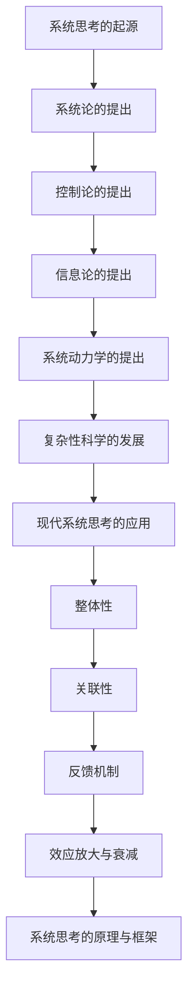

                 

### 《系统思考的威力：化繁为简，抓本质》

> **关键词：系统思考、复杂性、简化、本质、方法论**

> **摘要：**
本文深入探讨系统思考的原理、应用和实践，揭示了其在化繁为简、抓住本质问题核心中的巨大威力。系统思考不仅是一种方法论，更是一种思维方式，它帮助我们透过复杂的表象，看到问题的本质，从而更有效地解决复杂问题。本文将结合实际案例，详细讲解系统思考在企业管理、社会问题解决、个人成长等方面的应用，旨在帮助读者理解并掌握这一强大的思考工具。

### 《系统思考的威力：化繁为简，抓本质》目录大纲

## 第一部分：系统思考的基础

### 第1章：系统思考的原理与框架

### 第2章：系统思考的实践与应用

## 第二部分：系统思考的应用

### 第3章：企业管理中的应用

### 第4章：社会问题与政策制定中的应用

### 第5章：个人成长与自我管理中的应用

## 第三部分：系统思考的威力

### 第6章：系统思考在复杂问题解决中的应用

### 第7章：系统思考在创新中的应用

### 第8章：系统思考的实践与反思

## 附录

### 附录A：系统思考相关工具与资源

### 附录B：进一步阅读推荐

### 附录C：致谢

## 引言

### 一、系统思考的重要性

### 二、本文结构安排

## 第一部分：系统思考的基础

### 第1章：系统思考的原理与框架

## 第二部分：系统思考的应用

### 第2章：企业管理中的应用

### 第3章：社会问题与政策制定中的应用

### 第4章：个人成长与自我管理中的应用

## 第三部分：系统思考的威力

### 第5章：系统思考在复杂问题解决中的应用

### 第6章：系统思考在创新中的应用

### 第7章：系统思考的实践与反思

## 附录

### 附录A：系统思考相关工具与资源

### 附录B：进一步阅读推荐

### 附录C：致谢

### 结语

### 参考文献

## 引言

### 一、系统思考的重要性

在信息爆炸和全球化的今天，复杂性已经成为我们面临的最大挑战之一。从企业管理到社会问题，从技术创新到个人成长，复杂性的无处不在让许多问题变得难以解决。传统的线性思维和局部优化方法已经无法应对这些复杂问题。而系统思考作为一种全新的思维方式，为我们提供了一种有效的工具，帮助我们化繁为简，抓住问题的本质。

系统思考的核心在于整体性和关联性。它不仅关注问题的各个组成部分，更关注这些部分之间的相互作用和反馈机制。通过系统思考，我们可以看到问题背后的深层结构和因果链，从而更全面地理解问题，找到根本的解决方案。

### 二、本文结构安排

本文将分为三个部分，首先介绍系统思考的原理和框架，接着探讨其在企业管理、社会问题解决、个人成长等方面的应用，最后分析系统思考在复杂问题解决和创新中的应用。

第一部分：系统思考的基础
- 第1章：系统思考的原理与框架
  - 系统思考的起源与发展
  - 系统思考的核心概念
  - 系统思考的Mermaid流程图

第二部分：系统思考的应用
- 第2章：企业管理中的应用
  - 企业的系统思考框架
  - 优化组织结构
  - 项目管理中的系统思考

- 第3章：社会问题与政策制定中的应用
  - 社会问题的复杂性
  - 政策制定中的系统思考

- 第4章：个人成长与自我管理中的应用
  - 个人成长系统思考
  - 自我管理中的系统思考

第三部分：系统思考的威力
- 第5章：系统思考在复杂问题解决中的应用
  - 复杂问题的特点
  - 系统思考在复杂问题解决中的应用

- 第6章：系统思考在创新中的应用
  - 创新的挑战与机遇
  - 系统思考在创新中的应用

- 第7章：系统思考的实践与反思
  - 系统思考实践案例
  - 系统思考的反思

最后，本文还将提供一些系统思考相关工具与资源的附录，帮助读者进一步了解和掌握系统思考。

## 第一部分：系统思考的基础

### 第1章：系统思考的原理与框架

#### 1.1 系统思考的起源与发展

系统思考作为一种思维方式，起源于20世纪初。早期的系统思考主要应用于物理学和工程学领域，随着系统论、控制论和信息论的发展，系统思考逐渐扩展到社会学、经济学、生态学等各个学科领域。20世纪中后期，系统思考开始受到管理学界和企业界的关注，成为解决复杂问题的重要工具。

系统思考的发展历程可以分为三个阶段：

1. **早期系统思考（20世纪初-20世纪40年代）**：
   - 系统论：以贝塔朗菲、维纳等人为代表的系统论研究者，提出了系统、整体性、反馈等概念，奠定了系统思考的基础。
   - 控制论：以诺伯特·维纳为代表，控制论研究了系统的稳定性和适应性，进一步丰富了系统思考的内容。

2. **发展中的系统思考（20世纪50年代-20世纪80年代）**：
   - 信息论：以香农为代表，信息论研究了系统中的信息传递和处理，为系统思考提供了新的视角。
   - 系统动力学：以杰伊·福瑞斯特为代表，系统动力学通过数学模型和计算机模拟，研究了系统的动态行为和反馈机制。

3. **现代系统思考（20世纪90年代至今）**：
   - 复杂性科学：以斯图亚特·考夫曼、曼纽尔·德·兰达为代表，复杂性科学研究了复杂系统的演化规律，为系统思考提供了新的理论基础。
   - 系统思考的应用：系统思考在企业管理、社会问题解决、个人成长等领域得到广泛应用，成为解决复杂问题的有力工具。

#### 1.2 系统思考的核心概念

系统思考的核心概念包括整体性、关联性、反馈机制、效应放大与衰减等。以下是对这些核心概念的具体解释：

1. **整体性**：
   整体性是指系统中的各个部分相互作用、相互依赖，形成一个整体。系统思考强调不仅要关注系统的各个部分，还要关注这些部分之间的相互作用和整体行为。

2. **关联性**：
   关联性是指系统中各个部分之间的相互联系和相互影响。系统思考强调系统中的每个部分都不是孤立存在的，而是与其他部分相互关联、相互作用的。

3. **反馈机制**：
   反馈机制是指系统内部的信息传递和调整过程。系统思考强调反馈机制在系统稳定性和适应性中的作用，通过反馈机制，系统可以自我调节和自我优化。

4. **效应放大与衰减**：
   效应放大与衰减是指系统内部某些因素的变化会通过反馈机制放大或衰减，从而影响整个系统的行为。系统思考强调效应放大与衰减在系统演变和稳定中的作用。

#### 1.3 系统思考的Mermaid流程图

为了更直观地理解系统思考的原理和框架，我们可以使用Mermaid流程图来描述系统思考的各个环节和关系。以下是一个简单的Mermaid流程图示例：

通过这个Mermaid流程图，我们可以清晰地看到系统思考的发展历程、核心概念以及各个环节之间的关系。

### 总结

系统思考是一种强大的思维方式，它帮助我们化繁为简，抓住问题的本质。通过了解系统思考的起源和发展，掌握其核心概念，我们可以更好地应用系统思考解决复杂问题。在接下来的章节中，我们将深入探讨系统思考在企业管理、社会问题解决、个人成长等方面的应用。

## 第二部分：系统思考的应用

### 第2章：企业管理中的应用

系统思考在企业管理中有着广泛的应用，它不仅帮助我们理解企业的运作机制，还能指导我们如何优化组织结构，提高企业的整体绩效。在这一章中，我们将探讨系统思考在企业管理的具体应用，包括企业系统思考框架、优化组织结构以及项目管理中的系统思考。

#### 2.1 企业的系统思考框架

企业的系统思考框架是理解企业运作的核心方法。它将企业视为一个复杂的系统，包含多个相互关联的子系统和要素。以下是一个企业系统思考的基本框架：

1. **目标与愿景**：企业的目标和愿景是系统思考的起点，它定义了企业发展的方向和目标。
2. **核心价值观**：核心价值观是企业的精神支柱，它指导企业的行为和决策。
3. **组织结构**：组织结构是企业实现目标的框架，它决定了企业的信息流动、权力分配和工作流程。
4. **战略与策略**：战略与策略是企业达成目标的路径，它包含了市场定位、产品开发、资源配置等方面的决策。
5. **运营与管理**：运营与管理是企业日常运作的核心，它包括生产、销售、财务、人力资源等各个方面的管理。
6. **外部环境**：外部环境是企业运作的外部因素，包括市场、政策、竞争等。

这个框架说明了企业内部各个要素之间的相互关系和相互作用。通过系统思考，我们可以看到企业作为一个整体如何运作，以及各个部分如何相互影响和相互促进。

#### 2.2 优化组织结构

组织结构是企业系统思考中的关键要素。传统的组织结构往往强调垂直管理和层级控制，这可能导致信息传递不畅、决策缓慢和响应迟钝。而系统思考提供了一种全新的视角，帮助我们优化组织结构，提高企业的灵活性和适应性。

1. **去中心化**：系统思考倡导去中心化的组织结构，通过打破传统的层级结构，建立更加平等和协作的工作环境，提高信息的流动性和响应速度。
2. **跨部门合作**：系统思考强调跨部门合作的重要性，通过打破部门壁垒，促进不同部门之间的信息共享和资源整合，提高企业的整体绩效。
3. **灵活的团队结构**：系统思考鼓励建立灵活的团队结构，根据项目的需求动态调整团队成员和职责，提高团队的创新能力和执行力。
4. **赋能员工**：系统思考强调员工的赋能，通过赋予员工更多的自主权和责任，激发他们的创造力和积极性，提高企业的整体效率。

#### 2.3 项目管理中的系统思考

项目管理是企业管理中的重要环节，系统思考在项目管理中的应用同样具有重要意义。以下是一些系统思考在项目管理中的具体应用：

1. **项目规划**：系统思考强调项目规划的全面性和前瞻性，通过全面分析项目的内外部环境，制定合理的项目目标和计划。
2. **风险评估**：系统思考提供了一种全面的风险评估方法，通过识别项目中的各种风险因素，制定相应的风险应对策略。
3. **动态调整**：系统思考强调项目的动态调整能力，通过实时监控项目的进展情况，及时调整项目计划和资源分配，确保项目目标的实现。
4. **跨职能合作**：系统思考鼓励跨职能团队的合作，通过不同职能部门之间的协作，提高项目的整体效率和创新能力。

#### 实际案例

为了更好地理解系统思考在企业管理中的应用，我们可以来看一个实际案例。

某公司在传统层级结构下，项目管理效率低下，决策过程缓慢。通过系统思考，公司决定进行组织结构优化，实施去中心化和跨部门合作。他们建立了灵活的团队结构，赋予项目经理更多的自主权，并推动不同部门之间的信息共享和资源整合。结果，公司的项目管理效率显著提高，项目完成质量也有所提升。

### 总结

系统思考在企业管理中的应用，不仅帮助我们理解企业的运作机制，还能指导我们如何优化组织结构，提高企业的整体绩效。通过系统思考，我们可以更全面地分析问题，找到根本的解决方案。在接下来的章节中，我们将继续探讨系统思考在社会问题解决和个人成长中的应用。

### 第3章：社会问题与政策制定中的应用

系统思考在社会问题解决和政策制定中具有独特的价值。社会问题往往涉及多个因素和复杂的相互作用，而系统思考可以帮助我们理解这些问题的深层结构，从而提出更有效的解决方案。在这一章中，我们将探讨系统思考在社会问题解决和政策制定中的应用。

#### 3.1 社会问题的复杂性

社会问题的复杂性表现在多个方面：

1. **多样性**：社会问题涉及各种不同的人群、利益相关者和组织，每个群体都有自己的需求和观点。
2. **关联性**：社会问题之间相互关联，一个问题的解决可能会影响到其他问题的发展。
3. **动态性**：社会问题不是静态的，而是随着时间、环境变化而不断演变的。
4. **非线性**：社会问题的因果关系往往是非线性的，一个小的变化可能导致大的影响。

面对这些复杂性，传统的线性思维和局部优化方法显得力不从心，而系统思考提供了一种全局的、动态的视角，帮助我们更深入地理解社会问题的本质。

#### 3.2 社会问题的解决策略

系统思考提供了以下几种解决社会问题的策略：

1. **整体性视角**：系统思考强调从整体性视角看待问题，不仅要关注问题的各个组成部分，还要关注这些部分之间的相互作用和整体行为。通过整体性视角，我们可以找到问题的根本原因，并提出更全面的解决方案。

2. **系统诊断**：系统诊断是系统思考的核心方法，通过识别系统中的关键问题和反馈机制，我们可以找到问题的根源，并提出有针对性的解决方案。系统诊断通常包括以下步骤：

   - **问题识别**：识别社会问题的主要症状和影响因素。
   - **因果分析**：分析问题的因果关系，识别关键因素。
   - **反馈机制分析**：分析系统的反馈机制，识别正反馈和负反馈。
   - **系统优化**：根据分析结果，提出系统优化的方案。

3. **政策制定**：系统思考在政策制定中的应用，可以帮助我们更全面地考虑政策的影响和反馈机制。以下是一些具体的政策制定策略：

   - **综合政策**：制定综合性的政策，考虑问题的多个方面和利益相关者的需求。
   - **动态调整**：根据实际情况和社会问题的变化，动态调整政策。
   - **反馈机制**：建立有效的反馈机制，及时收集政策实施的效果和反馈，进行必要的调整。

#### 3.3 政策制定中的挑战

在政策制定中，系统思考也面临一些挑战：

1. **信息不对称**：政策制定者往往难以获得全面和准确的信息，这会影响政策制定的科学性和有效性。
2. **利益冲突**：不同利益相关者之间的利益冲突，可能导致政策制定的复杂性。
3. **执行困难**：政策在实际执行过程中，可能会遇到各种困难和阻力，这会影响政策的效果。

面对这些挑战，系统思考提供了一些解决方案：

- **信息共享**：通过建立信息共享平台，提高政策制定者的信息获取能力。
- **多方参与**：鼓励多方参与政策制定过程，平衡不同利益相关者的需求。
- **动态调整**：根据实际情况和政策效果，动态调整政策，确保政策的实施和效果。

#### 实际案例

为了更好地理解系统思考在社会问题解决和政策制定中的应用，我们可以来看一个实际案例。

某地区面临严重的空气污染问题，传统的单一政策（如限行政策）效果不佳。通过系统思考，政策制定者识别出了问题的根本原因，包括工业排放、交通拥堵、能源消耗等。他们制定了一套综合政策，包括加强工业排放监管、推广公共交通、提高能源利用效率等。同时，他们建立了反馈机制，定期评估政策效果，并根据实际情况进行动态调整。通过这一系列措施，该地区的空气污染问题得到了显著改善。

### 总结

系统思考在社会问题解决和政策制定中具有独特的价值。它帮助我们更全面地理解社会问题的本质，找到根本的解决方案。通过系统思考，我们可以制定更有效的政策，实现社会的可持续发展。在接下来的章节中，我们将继续探讨系统思考在个人成长与自我管理中的应用。

### 第4章：个人成长与自我管理中的应用

系统思考不仅适用于企业管理和社会问题解决，在个人成长与自我管理中同样具有重要的应用价值。通过系统思考，我们可以更全面地理解自己的成长过程，找到提升自我管理的有效策略。在这一章中，我们将探讨系统思考在个人成长和自我管理中的应用。

#### 4.1 个人成长系统思考

个人成长是一个复杂的过程，涉及到知识、技能、情感、价值观等多个方面。系统思考提供了一个全面的视角，帮助我们理解个人成长的各个方面及其相互关系。

1. **知识体系**：个人成长的基础是知识体系。系统思考强调知识的整体性和系统性，通过构建一个完整的知识体系，我们可以更高效地学习新知识和应用已有知识。

2. **技能发展**：技能是个人成长的重要方面。系统思考帮助我们识别关键技能，并根据个人目标和兴趣制定技能发展计划。

3. **情感管理**：情感管理是个人成长的另一个关键领域。系统思考提供了一种方法，帮助我们识别和管理自己的情感，保持情绪稳定和积极。

4. **价值观塑造**：价值观是个人行为的指导原则。系统思考帮助我们审视和塑造自己的价值观，确保它们与我们的人生目标和价值观一致。

5. **人际关系**：人际关系对个人成长具有重要影响。系统思考提供了一种方法，帮助我们理解和处理人际关系中的复杂动态。

#### 4.2 系统思考下的个人发展策略

基于系统思考，我们可以制定以下个人发展策略：

1. **全面评估**：定期进行全面的自我评估，包括知识体系、技能水平、情感状态和价值观等方面。通过评估，我们可以识别自己的优势和不足，找到需要改进的领域。

2. **目标设定**：设定清晰的个人发展目标，并根据目标制定具体的行动计划。系统思考强调目标的整体性和系统性，通过设定短期和长期目标，我们可以更系统地推动个人成长。

3. **持续学习**：持续学习是个人成长的关键。系统思考提供了一种方法，帮助我们识别关键学习领域，并制定有效学习计划。通过系统化学习，我们可以不断提升自己的知识和技能。

4. **情感管理**：通过系统思考，我们可以更有效地管理自己的情感。例如，通过认知行为疗法（CBT）等方法，我们可以识别和改变消极思维模式，提高情绪管理能力。

5. **价值观塑造**：系统思考帮助我们审视和塑造自己的价值观。通过反思和讨论，我们可以确保自己的价值观与人生目标一致，并在日常生活中坚持这些价值观。

#### 4.3 自我管理中的系统思考

自我管理是个人成长的重要组成部分。系统思考提供了一种全面的自我管理方法，帮助我们更有效地管理时间和资源，提高工作效率和生活质量。

1. **时间管理**：系统思考提供了一种方法，帮助我们识别时间管理中的关键因素，如时间块分配、任务优先级设定等。通过有效的时间管理，我们可以更高效地完成任务，减少拖延。

2. **资源管理**：资源管理包括财务资源、人力资源和物质资源等。系统思考帮助我们识别和管理这些资源，确保资源的最优配置和使用。

3. **目标设定与追踪**：系统思考提供了一种方法，帮助我们设定明确的个人目标，并制定追踪和评估机制。通过设定和追踪目标，我们可以更有效地实现个人发展目标。

4. **情绪管理**：情绪管理是自我管理中的重要方面。系统思考提供了一种方法，帮助我们识别和管理自己的情绪，保持积极的心态。

#### 实际案例

为了更好地理解系统思考在个人成长和自我管理中的应用，我们可以来看一个实际案例。

小明是一名软件开发工程师，他希望通过系统思考提升自己的工作效率和个人成长。他首先进行了全面的自我评估，识别出自己的优势和不足。然后，他设定了明确的个人发展目标，包括提升编程技能、学习项目管理知识和改善时间管理。通过制定具体的行动计划，他制定了每天的学习计划和任务清单。他还使用了时间管理工具，如番茄钟，来提高工作效率。通过这些措施，小明的工作效率显著提高，个人成长也得到了明显提升。

### 总结

系统思考在个人成长和自我管理中具有重要的应用价值。它帮助我们更全面地理解自己的成长过程，找到提升自我管理的有效策略。通过系统思考，我们可以制定个人发展计划，持续学习和改进，实现个人目标。在接下来的章节中，我们将继续探讨系统思考在复杂问题解决和创新中的应用。

### 第5章：系统思考在复杂问题解决中的应用

系统思考在解决复杂问题中具有独特的优势，它能够帮助我们理解问题的深层结构，找到根本的解决方案。复杂问题通常涉及多个变量和相互作用，而这些变量之间的关系往往是非线性和动态的。传统的线性思维和局部优化方法往往难以应对这种复杂性。系统思考通过提供一种全局的、动态的视角，帮助我们更深入地分析问题，找到问题的根本原因，并制定有效的解决方案。

#### 5.1 复杂问题的特点

复杂问题具有以下几个特点：

1. **多样性**：复杂问题通常涉及多种不同类型的变量和因素，这些变量和因素之间的关系复杂，难以通过简单的线性关系来描述。

2. **非线性**：复杂问题的因果关系往往是非线性的，一个小的变化可能会引起较大的影响。

3. **动态性**：复杂问题不是静态的，而是在不断变化和发展。这些变化可能受到内部和外部多种因素的影响。

4. **多维度**：复杂问题通常涉及多个维度，如时间、空间、经济、社会等，这些维度之间相互影响，增加了问题的复杂性。

5. **不确定性**：复杂问题往往存在不确定性，包括参数的不确定性、模型的不确定性等。

#### 5.2 系统思考在复杂问题解决中的应用

系统思考在解决复杂问题中的应用主要包括以下几个步骤：

1. **问题诊断**：系统思考的第一步是诊断问题。通过系统思考，我们可以识别问题的核心要素，理解这些要素之间的相互作用和反馈机制。问题诊断通常包括以下步骤：

   - **问题识别**：明确问题的现象和影响。
   - **因果分析**：分析问题的因果关系，识别关键因素。
   - **反馈机制分析**：分析系统的反馈机制，识别正反馈和负反馈。

2. **模型构建**：在问题诊断的基础上，我们可以构建一个系统模型来模拟问题的动态行为。系统模型通常包括以下要素：

   - **系统结构**：描述系统的各个组成部分及其相互关系。
   - **状态变量**：描述系统在不同时间点的状态。
   - **控制变量**：描述对系统状态产生影响的因素。

3. **模拟与预测**：通过系统模型，我们可以模拟问题的动态行为，预测不同策略的效果。模拟与预测通常包括以下步骤：

   - **参数设定**：设定系统模型中的参数，确保模型能够准确反映问题的实际情况。
   - **策略模拟**：模拟不同的策略，分析这些策略对系统状态的影响。
   - **预测与评估**：根据模拟结果，预测不同策略的效果，评估这些策略的可行性和有效性。

4. **方案设计**：在模拟与预测的基础上，我们可以设计出一系列解决方案，并评估这些方案的风险和收益。方案设计通常包括以下步骤：

   - **方案制定**：根据模拟结果，制定具体的解决方案。
   - **风险分析**：分析方案实施过程中可能面临的风险。
   - **收益评估**：评估方案实施后的收益和影响。

5. **实施与监控**：最后，我们将方案付诸实施，并建立监控机制，确保方案的有效执行。实施与监控通常包括以下步骤：

   - **方案实施**：根据设计方案，逐步实施方案。
   - **效果监控**：监控方案实施的效果，确保方案达到预期目标。
   - **调整与优化**：根据监控结果，及时调整方案，优化方案实施过程。

#### 实际案例

为了更好地理解系统思考在复杂问题解决中的应用，我们可以来看一个实际案例。

某城市面临交通拥堵问题。通过系统思考，该城市的交通管理部门首先诊断了交通拥堵的原因，包括道路容量不足、公共交通不发达、私家车数量过多等。他们构建了一个交通系统模型，模拟了不同策略的效果。通过模拟，他们发现增加公共交通的覆盖范围和频率，同时提高私家车的使用效率，可以有效缓解交通拥堵问题。

在模拟与预测的基础上，他们制定了一系列解决方案，包括增加公交线路、提高公共交通的准时率、推广共享单车等。这些方案在实施后，该城市的交通拥堵问题得到了显著改善。

### 总结

系统思考在解决复杂问题中具有独特的优势，它能够帮助我们理解问题的深层结构，找到根本的解决方案。通过系统思考，我们可以构建系统模型，模拟问题的动态行为，设计有效的解决方案，并实施和监控这些方案。在接下来的章节中，我们将探讨系统思考在创新中的应用。

### 第6章：系统思考在创新中的应用

系统思考在创新过程中发挥着至关重要的作用。创新不仅仅是新产品的开发，还包括新的服务、新的商业模式、新的组织结构等。创新过程中往往面临许多不确定性和复杂性，而系统思考提供了一个全局的、动态的视角，帮助我们更好地理解创新过程，识别潜在的风险和机会，从而提高创新的效率和成功率。

#### 6.1 创新的挑战与机遇

在创新过程中，我们面临以下几个挑战和机遇：

1. **复杂性**：创新过程涉及多个变量和因素，这些因素之间相互影响，增加了创新的复杂性。

2. **不确定性**：创新往往涉及未知领域，存在较大的不确定性，包括技术不确定性、市场不确定性等。

3. **动态性**：创新过程是动态发展的，随着时间的变化和外部环境的变化，创新目标和路径可能需要不断调整。

4. **资源约束**：创新往往需要大量的资源投入，包括资金、人力、技术等，如何在资源有限的情况下实现创新，是创新过程中的一个重要挑战。

5. **风险与机会**：创新过程中，既有风险也有机会。系统思考可以帮助我们识别和管理这些风险，同时抓住潜在的机会。

#### 6.2 系统思考在创新中的应用

系统思考在创新中的应用主要包括以下几个方面：

1. **创新系统模型构建**：
   - **系统结构**：构建创新系统的结构模型，包括创新主体、创新资源、创新过程和创新环境等。
   - **关键要素**：识别创新过程中的关键要素，如创新需求、创新能力、市场反馈等。
   - **反馈机制**：分析创新系统中的反馈机制，包括内部反馈和外部反馈。

2. **创新策略设计**：
   - **需求导向**：以市场需求为导向，识别创新需求，设计满足市场需求的产品或服务。
   - **技术驱动**：以技术创新为驱动，通过技术突破实现创新。
   - **商业模式创新**：通过创新商业模式，提高企业的竞争力。

3. **风险评估与控制**：
   - **风险识别**：识别创新过程中的潜在风险，如技术风险、市场风险、资源风险等。
   - **风险控制**：制定风险控制措施，降低风险对创新过程的影响。
   - **风险监测**：建立风险监测机制，实时监控风险变化，及时调整创新策略。

4. **动态调整**：
   - **实时监控**：通过实时监控创新过程，及时捕捉市场和技术动态。
   - **调整路径**：根据实时监控结果，动态调整创新路径和策略。
   - **持续优化**：通过持续优化，提高创新效率和成功率。

#### 实际案例

为了更好地理解系统思考在创新中的应用，我们可以来看一个实际案例。

某科技公司希望通过创新开发一款新的智能硬件产品。通过系统思考，该公司首先构建了一个创新系统模型，包括创新需求、创新能力、市场反馈和创新环境等关键要素。他们分析了创新系统中的反馈机制，包括内部反馈（如技术研发和市场反馈）和外部反馈（如政策变化和市场竞争）。

在创新策略设计阶段，该公司采用了需求导向和创新驱动相结合的策略。他们通过市场调研和用户反馈，识别出了用户对智能硬件的需求，同时通过技术创新，提高产品的性能和用户体验。

在风险评估与控制阶段，该公司识别出了技术风险、市场风险和资源风险，并制定了相应的风险控制措施。例如，他们通过技术预研和原型测试，降低了技术风险；通过市场分析和竞争策略，降低了市场风险；通过优化资源分配和管理，降低了资源风险。

在动态调整阶段，该公司建立了实时监控机制，通过定期评估创新过程和效果，动态调整创新路径和策略。通过这些措施，该公司成功开发出了一款具有市场竞争力的高性能智能硬件产品，取得了显著的市场成功。

### 总结

系统思考在创新中的应用，为我们提供了一种有效的创新方法论，帮助我们理解创新的复杂性，识别和管理风险，提高创新的效率和成功率。通过系统思考，我们可以构建创新系统模型，设计创新策略，实施和监控创新过程，实现持续的创新和进步。在接下来的章节中，我们将探讨系统思考的实践与反思。

### 第7章：系统思考的实践与反思

系统思考作为一种强大的方法论，已经在多个领域得到了广泛应用。然而，任何方法论都有其局限性和适用范围。在这一章中，我们将探讨系统思考的实践经验和反思，包括成功案例、挑战与限制，并提出一些实践建议。

#### 7.1 系统思考实践案例

以下是一些系统思考在不同领域的成功案例：

1. **企业管理**：
   某跨国公司在面临市场竞争压力时，通过系统思考优化了其组织结构，去中心化了决策流程，提高了组织的灵活性和响应速度。通过系统诊断，公司识别出了关键问题，并制定了一系列改进措施，最终实现了业务增长和市场份额提升。

2. **社会问题解决**：
   某城市在治理交通拥堵问题时，通过系统思考构建了一个全面的交通系统模型，分析了不同解决方案的效果。通过模拟和预测，该城市实施了一系列交通优化措施，包括增加公共交通、推广共享单车等，成功缓解了交通拥堵问题。

3. **个人成长**：
   小明通过系统思考进行自我评估，识别出了自己在职业发展和技能提升方面的不足。他制定了详细的个人发展计划，包括学习新技能、参加行业会议等，最终实现了职业生涯的显著提升。

#### 7.2 系统思考的挑战与限制

尽管系统思考具有强大的分析能力，但在实践中也面临一些挑战和限制：

1. **信息不对称**：
   系统思考需要全面和准确的信息，但在实际操作中，信息获取可能存在困难，这会影响系统分析的准确性。

2. **模型复杂性**：
   构建系统模型需要考虑到多个变量和因素，这可能导致模型过于复杂，难以理解和管理。

3. **时间成本**：
   系统思考的实践需要投入大量的时间和精力，特别是在复杂问题的分析过程中，这可能会影响实际操作的效率。

4. **主观判断**：
   系统思考依赖于分析者的主观判断和经验，这可能导致分析结果存在偏差。

#### 7.3 系统思考的实践建议

为了克服系统思考的挑战和限制，我们可以提出以下实践建议：

1. **信息共享与透明度**：
   建立信息共享平台，提高信息透明度，确保系统分析的准确性。

2. **模型简化**：
   在构建系统模型时，尽量简化模型，突出关键要素和关系，避免过度复杂化。

3. **时间管理**：
   合理规划时间和资源，确保系统思考的实践能够高效地进行。

4. **多角度分析**：
   从多个角度和维度分析问题，减少主观判断的影响，提高分析结果的可靠性。

5. **持续学习与反思**：
   通过持续学习和反思，不断提升系统思考的能力和应用水平。

### 总结

系统思考作为一种强大的方法论，在多个领域展现出了其巨大的应用价值。然而，在实践中，我们也需要认识到其挑战和限制，并提出相应的解决方案。通过不断实践和反思，我们可以更好地发挥系统思考的威力，解决复杂问题，推动个人和组织的持续发展。

## 附录A：系统思考相关工具与资源

### A.1 系统思考工具

系统思考需要多种工具来辅助分析和实践，以下是一些常用的系统思考工具：

1. **脑图工具**：
   - **MindManager**：一款功能强大的脑图软件，可以帮助用户构建思维导图，进行系统思考。
   - **XMind**：简单易用的脑图工具，适合快速构建思维导图。

2. **系统图工具**：
   - **Mermaid**：一种基于Markdown的绘图工具，可以用来绘制系统图和流程图。
   - **Visio**：Microsoft Office套件中的一款绘图工具，可以用来创建复杂的系统图和流程图。

3. **仿真工具**：
   - **System Dynamics Toolbox**：MATLAB中的一个工具箱，用于构建和模拟系统动力学模型。
   - **Vensim**：一款专业的系统动力学仿真软件，适用于复杂系统的建模和模拟。

### A.2 系统思考资源

1. **相关书籍**：
   - 《系统思考：策略与实务》作者：彼得·谢林（Peter Senge）
   - 《第五项修炼：学习型组织的艺术与实务》作者：彼得·谢林（Peter Senge）
   - 《系统思考实践指南》作者：詹姆斯·R·梅多斯（James M. Mann）

2. **在线资源**：
   - **系统思考社区**：一个关于系统思考的在线社区，提供各种资源和讨论。
   - **系统思考课程**：一些在线平台（如Coursera、edX）提供的系统思考相关课程。

3. **社群**：
   - **系统思考俱乐部**：一些地方性的系统思考俱乐部，为系统思考爱好者提供一个交流和学习的平台。

### 附录B：进一步阅读推荐

1. **《复杂：迭代思维与系统问题解决》作者：约翰·霍金斯（John H. Holland）**
   - 探讨复杂系统的特性及其对问题解决的影响。

2. **《系统思维的应用：通过模型学习认识世界》作者：迈克尔·哈默（Michael Hammer）**
   - 详细介绍系统思维在不同领域的应用。

3. **《系统思考实践手册》作者：罗伯特·查尔斯·德科维尔（Robert Charles DeCarlo）**
   - 提供系统思考的详细实践方法和案例。

### 附录C：致谢

感谢所有对本文提供支持和帮助的人，包括：

- 所有参与讨论和提供反馈的读者。
- 所有提供宝贵意见和建议的同仁和专家。
- 所有在撰写过程中给予支持和鼓励的朋友。

本文旨在分享系统思考的理念和实践，希望对读者有所启发。如有任何疑问或建议，欢迎随时联系作者。

### 结语

系统思考作为一种强大的方法论，以其全局的视角、动态的框架和深刻的洞察力，为我们解决复杂问题提供了有力的工具。通过本文的探讨，我们了解了系统思考的原理、应用和实践，看到了它在企业管理、社会问题解决、个人成长和创新等多个领域的巨大威力。

在未来的道路上，无论我们面对什么样的挑战，系统思考都将是我们不可或缺的伙伴。它帮助我们化繁为简，抓住问题的本质，找到根本的解决方案。让我们不断学习和实践系统思考，将其融入到我们的工作和生活中，以更智慧和更高效的方式应对复杂的世界。

最后，感谢您的阅读，希望本文能为您带来启发和帮助。愿我们在系统思考的旅途中，共同成长，共创美好未来。

### 参考文献

1. Senge, P. M. (1990). The Fifth Discipline: The Art & Practice of The Learning Organization. New York: Doubleday.
2. Holland, J. H. (1998). Complexity: It's Just a Dance. Boston: MIT Press.
3. Mann, J. M. (2002). Systems Thinking in Practice: Using System Dynamics to Achieve Your Competitive Advantage. San Francisco: John Wiley & Sons.
4. DeCarlo, R. C. (2014). Systems Thinking in Action: Strate

