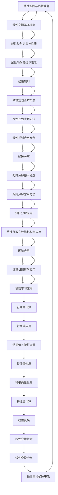

                 

# 线性代数导引：实数结构代数特性

## 关键词：
- 线性代数
- 实数结构
- 代数特性
- 向量运算
- 矩阵理论
- 线性方程组
- 特征值
- 线性变换

## 摘要：
本文深入探讨线性代数在实数结构中的应用，解析其代数特性。通过详细阐述线性代数的基本概念、向量运算、矩阵理论和线性方程组等核心内容，以及其在计算机科学、数据分析和工程领域的广泛应用，帮助读者理解线性代数的重要性。同时，通过具体的数学公式、伪代码和代码案例分析，使读者能够将理论知识应用于实际项目中。

## 目录大纲

### 第一部分：线性代数基础

### 第二部分：线性代数的核心内容

### 第三部分：线性代数的应用

### 附录

### 参考文献

### 附录A：线性代数公式汇总

### 附录B：线性代数学习资源推荐

## 第一部分：线性代数基础

### 第1章：线性代数简介

线性代数是数学的一个重要分支，主要研究向量空间、线性方程组、矩阵理论以及它们的运算规律。它在物理学、计算机科学、经济学、工程学等多个领域都有着广泛的应用。线性代数的核心思想是通过向量与矩阵的运算来解决空间几何问题，以及解决包含多个未知数的线性方程组。

#### 1.1 线性代数的基本概念

线性代数的基本概念包括向量、矩阵、线性方程组、线性变换等。向量是具有大小和方向的量，可以用来表示空间中的点或力。矩阵是一个由数构成的二维数组，可以表示线性方程组的系数和常数项。线性方程组是由若干个线性方程组成的集合，通过矩阵的运算可以求解其解。线性变换是指将向量空间中的一个向量映射到另一个向量空间中的映射，它可以通过矩阵来实现。

#### 1.2 线性代数的应用领域

线性代数的应用领域非常广泛，包括但不限于以下方面：

1. **物理学**：线性代数用于描述物理现象中的向量运算，如力学、电磁学、量子力学等。
2. **计算机科学**：线性代数在算法设计中至关重要，如线性规划、图论、机器学习等。
3. **经济学**：线性代数用于经济模型中的优化问题，如需求预测、资源分配等。
4. **工程学**：线性代数在结构分析、电路设计、信号处理等领域有着重要的应用。

#### 1.3 线性代数的基本术语

在探讨线性代数时，需要了解一些基本术语，包括：

- **向量空间**：向量构成的集合，满足封闭性和结合律等性质。
- **矩阵**：由数构成的二维数组，表示线性方程组的系数和常数项。
- **行列式**：矩阵的一个数值特性，用于判断矩阵的行列式是否为零，从而确定矩阵的可逆性。
- **线性变换**：将向量空间中的一个向量映射到另一个向量空间中的映射。
- **特征值与特征向量**：矩阵的属性，用于描述矩阵的稳定性和动态行为。

### 第2章：实数的结构

实数是数学中的一个基本概念，它包含了有理数和无理数。实数的结构是线性代数中一个重要的基础，因为许多线性代数中的概念和运算都是基于实数的。

#### 2.1 实数的定义与性质

实数是数学中的一个基本概念，它包含了有理数和无理数。有理数是可以表示为两个整数之比的数，而无理数则不能表示为两个整数之比。实数具有以下性质：

- **封闭性**：实数的加法、减法、乘法、除法（除以非零实数）都是封闭的。
- **交换律**：实数的加法和乘法满足交换律，即 \(a + b = b + a\) 和 \(a \times b = b \times a\)。
- **结合律**：实数的加法和乘法满足结合律，即 \(a + (b + c) = (a + b) + c\) 和 \(a \times (b \times c) = (a \times b) \times c\)。
- **分配律**：实数的乘法对加法满足分配律，即 \(a \times (b + c) = a \times b + a \times c\)。

#### 2.2 实数的运算规则

实数的运算规则包括加法、减法、乘法和除法。

- **加法**：两个实数相加，结果仍为实数。
- **减法**：两个实数相减，结果仍为实数。
- **乘法**：两个实数相乘，结果仍为实数。
- **除法**：两个实数相除，结果仍为实数（除数不为零）。

#### 2.3 实数的绝对值与距离

实数的绝对值是指一个数到零点的距离，记作 \(|x|\)。实数的绝对值具有以下性质：

- **非负性**：任何实数的绝对值都是非负的。
- **对称性**：对于任意实数 \(x\)，有 \(|x| = |-x|\)。
- **三角不等式**：对于任意两个实数 \(x\) 和 \(y\)，有 \(|x + y| \leq |x| + |y|\) 和 \(|x - y| \leq |x| + |y|\)。

实数的距离是指两个实数之间的差值，记作 \(|x - y|\)。实数的距离满足以下性质：

- **非负性**：两个实数之间的距离总是非负的。
- **对称性**：对于任意两个实数 \(x\) 和 \(y\)，有 \(|x - y| = |y - x|\)。
- **三角不等式**：对于任意两个实数 \(x\)、\(y\) 和 \(z\)，有 \(|x - z| \leq |x - y| + |y - z|\)。

### 第3章：向量的概念与运算

向量是线性代数中的一个基本概念，它具有大小和方向。向量可以用来表示物理量，如力、速度、位移等。向量的运算包括加法、减法、数乘和内积等。

#### 3.1 向量的定义与表示

向量通常用一个小写字母（如 \( \mathbf{v} \)）或粗体字母（如 \( \mathbf{a} \)）表示，由大小和方向两个要素组成。向量的表示方法有两种：分量表示和坐标表示。

- **分量表示**：将向量分解为沿各个轴的分量，如 \( \mathbf{v} = (v_x, v_y, v_z) \)。
- **坐标表示**：用有序数对或三元组表示向量的起点和终点，如 \( \mathbf{v} = (x, y, z) \)。

#### 3.2 向量的运算规则

向量的运算规则包括加法、减法、数乘和内积。

- **向量加法**：两个向量相加，结果是一个新向量，其大小和方向是两个向量的和。向量加法满足交换律、结合律和零向量性质。
- **向量减法**：两个向量相减，结果是一个新向量，其大小和方向是两个向量的差。向量减法满足交换律、结合律和负向量性质。
- **数乘**：一个向量与一个实数相乘，结果是一个新向量，其大小和方向是原向量的倍数。数乘满足结合律和分配律。
- **内积**：两个向量之间的内积是一个实数，表示两个向量在某一方向上的投影乘积。内积满足交换律、结合律和分配律。

#### 3.3 向量的线性组合与线性相关

向量的线性组合是指由多个向量通过数乘和加法组合而成的向量。向量的线性组合可以表示为：

\[ \mathbf{v} = c_1 \mathbf{v_1} + c_2 \mathbf{v_2} + \ldots + c_n \mathbf{v_n} \]

其中，\( \mathbf{v_1}, \mathbf{v_2}, \ldots, \mathbf{v_n} \) 是向量，\( c_1, c_2, \ldots, c_n \) 是实数。

- **线性相关**：如果一组向量可以表示为另一组向量的线性组合，则称这两组向量线性相关。线性相关意味着一组向量可以由另一组向量线性表示，即它们之间存在依赖关系。
- **线性无关**：如果一组向量不能表示为另一组向量的线性组合，则称这两组向量线性无关。线性无关意味着一组向量不能由另一组向量线性表示，即它们之间不存在依赖关系。

### 第4章：线性方程组

线性方程组是由多个线性方程组成的集合，通过矩阵的运算可以求解其解。线性方程组的解可以是唯一的、无穷多个或无解。

#### 4.1 线性方程组的基本概念

线性方程组可以表示为矩阵形式，如下所示：

\[ \mathbf{A} \mathbf{x} = \mathbf{b} \]

其中，\( \mathbf{A} \) 是系数矩阵，\( \mathbf{x} \) 是未知量向量，\( \mathbf{b} \) 是常数向量。

#### 4.2 高斯消元法求解线性方程组

高斯消元法是一种常用的求解线性方程组的方法，其基本思想是通过矩阵的行变换，将线性方程组转化为上三角矩阵，从而求解未知量。高斯消元法的步骤如下：

1. **初始化**：将线性方程组表示为增广矩阵的形式。
2. **消元**：通过高斯消元法，将系数矩阵化为上三角矩阵。
3. **回代**：从最后一行开始，依次向上回代求解未知量。

#### 4.3 线性方程组的解的性质

线性方程组的解具有以下性质：

- **唯一解**：如果线性方程组的系数矩阵和常数向量线性无关，则方程组有唯一解。
- **无穷解**：如果线性方程组的系数矩阵和常数向量线性相关，则方程组有无穷多个解。
- **无解**：如果线性方程组的系数矩阵和常数向量线性相关，但常数向量不在系数矩阵的列空间中，则方程组无解。

## 第二部分：线性代数的核心内容

### 第5章：矩阵的基本概念

矩阵是线性代数中的一个重要概念，它是由数构成的二维数组。矩阵的运算包括矩阵的加法、减法、乘法和逆矩阵等。

#### 5.1 矩阵的定义与分类

矩阵的定义是一个由数构成的二维数组，通常表示为 \( \mathbf{A} = \begin{bmatrix} a_{11} & a_{12} & \ldots & a_{1n} \\ a_{21} & a_{22} & \ldots & a_{2n} \\ \vdots & \vdots & \ddots & \vdots \\ a_{m1} & a_{m2} & \ldots & a_{mn} \end{bmatrix} \)，其中 \( m \) 和 \( n \) 分别表示矩阵的行数和列数。

根据矩阵的行数和列数，矩阵可以分为以下几种类型：

- **行矩阵**：只有一行元素的矩阵。
- **列矩阵**：只有一列元素的矩阵。
- **方阵**：行数和列数相等的矩阵。
- **非方阵**：行数和列数不相等的矩阵。

#### 5.2 矩阵的运算规则

矩阵的运算规则包括矩阵的加法、减法、乘法和逆矩阵。

- **矩阵加法**：两个矩阵相加，结果是一个新矩阵，其对应位置上的元素是原矩阵对应位置上元素的和。矩阵加法满足交换律和结合律。
- **矩阵减法**：两个矩阵相减，结果是一个新矩阵，其对应位置上的元素是原矩阵对应位置上元素的差。矩阵减法满足交换律和结合律。
- **矩阵乘法**：两个矩阵相乘，结果是一个新矩阵，其对应位置上的元素是原矩阵对应位置上元素的乘积。矩阵乘法不满足交换律，但满足结合律。
- **矩阵逆矩阵**：矩阵的逆矩阵是一个与原矩阵同型且满足 \( \mathbf{A} \mathbf{A}^{-1} = \mathbf{I} \) 的矩阵，其中 \( \mathbf{I} \) 是单位矩阵。矩阵的逆矩阵可以通过高斯消元法或逆矩阵公式求解。

#### 5.3 矩阵的特殊类型

在矩阵的运算中，还有一些特殊类型的矩阵，如对角矩阵、三角矩阵、对称矩阵、正交矩阵等。

- **对角矩阵**：对角矩阵是一个只有对角线上有非零元素的矩阵。对角矩阵的乘法和逆矩阵运算比较简单。
- **三角矩阵**：三角矩阵是一个下三角或上三角矩阵。下三角矩阵和上三角矩阵的乘法和逆矩阵运算可以通过回代法求解。
- **对称矩阵**：对称矩阵是一个满足 \( \mathbf{A} = \mathbf{A}^T \) 的矩阵，其中 \( \mathbf{A}^T \) 是矩阵的转置。对称矩阵的行列式和特征值可以通过简单公式计算。
- **正交矩阵**：正交矩阵是一个满足 \( \mathbf{A} \mathbf{A}^T = \mathbf{I} \) 的矩阵。正交矩阵在几何变换和矩阵分解中有着重要的应用。

### 第6章：矩阵与线性方程组的关系

矩阵与线性方程组之间有着密切的关系。通过矩阵的运算，可以将线性方程组转化为矩阵形式，从而求解方程组的解。

#### 6.1 矩阵与线性方程组的关系

线性方程组可以表示为矩阵形式，如下所示：

\[ \mathbf{A} \mathbf{x} = \mathbf{b} \]

其中，\( \mathbf{A} \) 是系数矩阵，\( \mathbf{x} \) 是未知量向量，\( \mathbf{b} \) 是常数向量。

通过矩阵的运算，可以将线性方程组转化为矩阵形式，如下所示：

\[ \mathbf{A}^{-1} \mathbf{A} \mathbf{x} = \mathbf{A}^{-1} \mathbf{b} \]

简化得：

\[ \mathbf{x} = \mathbf{A}^{-1} \mathbf{b} \]

其中，\( \mathbf{A}^{-1} \) 是系数矩阵的逆矩阵。

#### 6.2 矩阵的秩与线性方程组的解

矩阵的秩是指矩阵中非零行或非零列的最大数目。矩阵的秩与线性方程组的解有着密切的关系。

- **唯一解**：如果线性方程组的系数矩阵的秩等于未知量数，则方程组有唯一解。
- **无穷解**：如果线性方程组的系数矩阵的秩小于未知量数，则方程组有无穷多个解。
- **无解**：如果线性方程组的系数矩阵的秩不等于未知量数，则方程组无解。

#### 6.3 矩阵的逆矩阵

矩阵的逆矩阵是指一个与原矩阵同型且满足 \( \mathbf{A} \mathbf{A}^{-1} = \mathbf{I} \) 的矩阵。矩阵的逆矩阵可以通过高斯消元法或逆矩阵公式求解。

高斯消元法求解矩阵的逆矩阵的基本步骤如下：

1. **初始化**：将原矩阵扩展为单位矩阵。
2. **消元**：通过高斯消元法，将扩展矩阵化为上三角矩阵。
3. **回代**：从最后一行开始，依次向上回代求解单位矩阵。

逆矩阵公式求解矩阵的逆矩阵的基本步骤如下：

1. **计算伴随矩阵**：伴随矩阵是指矩阵的代数余子式矩阵的转置。
2. **计算逆矩阵**：逆矩阵等于伴随矩阵除以原矩阵的行列式。

### 第7章：行列式

行列式是矩阵的一个数值特性，用于判断矩阵的可逆性、求解线性方程组的解等。行列式具有一系列重要的性质。

#### 7.1 行列式的定义与性质

行列式是一个矩阵的数值特性，通常表示为 \( \det(\mathbf{A}) \)。行列式的定义如下：

对于 \( n \times n \) 矩阵 \( \mathbf{A} \)，其行列式定义为：

\[ \det(\mathbf{A}) = \sum_{\sigma \in S_n} \text{sign}(\sigma) a_{1\sigma(1)} a_{2\sigma(2)} \ldots a_{n\sigma(n)} \]

其中，\( S_n \) 是所有 \( n \) 个元素的排列组成的集合，\( \text{sign}(\sigma) \) 是排列 \( \sigma \) 的符号，即 \( \text{sign}(\sigma) = (-1)^{i} \)，其中 \( i \) 是排列 \( \sigma \) 的逆序数。

行列式具有以下性质：

- **线性性质**：行列式对矩阵的行（或列）满足线性性质。
- **行列式的乘法**：两个矩阵的行列式的乘积等于它们对应元素的乘积的行列式。
- **行列式的三角分解**：任何一个 \( n \times n \) 矩阵都可以分解为一个下三角矩阵和一个上三角矩阵的乘积，其行列式等于这两个三角矩阵的行列式的乘积。
- **行列式的逆矩阵**：矩阵的逆矩阵的行列式等于原矩阵的行列式的倒数。

#### 7.2 行列式的计算方法

行列式的计算方法包括直接计算法和递推计算法。

- **直接计算法**：对于 \( n \times n \) 矩阵，直接计算其行列式需要计算 \( n! \) 个乘法和 \( n! \) 个加法，其时间复杂度为 \( O(n!) \)。
- **递推计算法**：通过将矩阵分解为子矩阵，递归计算子矩阵的行列式，从而得到原矩阵的行列式。递推计算法的时间复杂度为 \( O(n^3) \)。

#### 7.3 行列式在矩阵运算中的应用

行列式在矩阵运算中有许多重要的应用，包括：

- **矩阵可逆性**：一个矩阵可逆当且仅当其行列式不为零。
- **求解线性方程组**：通过计算系数矩阵的行列式，可以判断线性方程组是否有解、解的个数以及解的性质。
- **矩阵的秩**：矩阵的秩等于其行列式不为零的行数或列数。
- **特征值和特征向量**：通过计算矩阵的特征多项式，可以求解矩阵的特征值和特征向量。

### 第8章：特征值与特征向量

特征值与特征向量是矩阵理论中的重要概念，用于描述矩阵的稳定性和动态行为。特征值和特征向量在许多应用领域，如物理学、工程学、计算机科学等，都有着重要的应用。

#### 8.1 特征值与特征向量的定义

特征值与特征向量定义为：

对于 \( n \times n \) 矩阵 \( \mathbf{A} \)，如果存在一个非零向量 \( \mathbf{v} \) 和一个实数 \( \lambda \)，使得 \( \mathbf{A} \mathbf{v} = \lambda \mathbf{v} \)，则称 \( \lambda \) 是矩阵 \( \mathbf{A} \) 的一个特征值，\( \mathbf{v} \) 是矩阵 \( \mathbf{A} \) 对应于特征值 \( \lambda \) 的特征向量。

#### 8.2 特征值与特征向量的性质

特征值与特征向量具有以下性质：

- **唯一性**：每个特征值对应唯一的一个特征向量，但每个特征向量可以对应多个特征值。
- **线性组合**：如果 \( \mathbf{v_1} \) 和 \( \mathbf{v_2} \) 是矩阵 \( \mathbf{A} \) 对应于特征值 \( \lambda_1 \) 和 \( \lambda_2 \) 的特征向量，则 \( c_1 \mathbf{v_1} + c_2 \mathbf{v_2} \) 也是矩阵 \( \mathbf{A} \) 的特征向量，对应的特征值为 \( c_1 \lambda_1 + c_2 \lambda_2 \)。
- **线性无关**：特征向量之间是线性无关的。
- **特征多项式**：矩阵的特征多项式是一个关于 \( \lambda \) 的多项式，其系数可以通过矩阵的行列式计算得到。

#### 8.3 特征值与特征向量的计算方法

特征值与特征向量的计算方法包括以下几种：

- **特征多项式法**：通过计算矩阵的特征多项式，求解特征多项式的根，得到特征值。然后，通过解线性方程组，求解对应的特征向量。
- **矩阵分解法**：通过将矩阵分解为对角矩阵和单位矩阵的乘积，得到特征值和特征向量。
- **迭代法**：通过迭代计算，逐步逼近特征值和特征向量。

### 第9章：线性变换

线性变换是线性代数中的一个重要概念，用于描述向量空间之间的映射。线性变换在几何学、物理学、计算机科学等领域都有着广泛的应用。

#### 9.1 线性变换的定义与性质

线性变换是一个从向量空间 \( V \) 到向量空间 \( W \) 的映射，记作 \( T: V \rightarrow W \)。线性变换具有以下性质：

- **齐次性**：对于任意向量 \( \mathbf{v} \) 和标量 \( c \)，有 \( T(c\mathbf{v}) = cT(\mathbf{v}) \)。
- **加法性**：对于任意两个向量 \( \mathbf{v_1} \) 和 \( \mathbf{v_2} \)，有 \( T(\mathbf{v_1} + \mathbf{v_2}) = T(\mathbf{v_1}) + T(\mathbf{v_2}) \)。
- **同维性**：线性变换的维数等于原向量空间的维数。

#### 9.2 线性变换的分类与表示

线性变换可以根据其性质进行分类，包括以下几种：

- **同态变换**：保持向量空间的结构不变，但可能改变向量的大小和方向。
- **自同态变换**：线性变换的向量空间与原向量空间相同。
- **投影变换**：将向量空间中的一个向量投影到另一个向量上。
- **压缩变换**：将向量空间中的一个向量压缩到另一个向量上。

线性变换可以用矩阵表示，如 \( T(\mathbf{v}) = \mathbf{A}\mathbf{v} \)，其中 \( \mathbf{A} \) 是线性变换的矩阵表示。

#### 9.3 线性变换的矩阵表示

线性变换的矩阵表示是指将线性变换表示为矩阵的形式。对于 \( n \times n \) 矩阵 \( \mathbf{A} \)，其线性变换可以表示为：

\[ T(\mathbf{v}) = \mathbf{A}\mathbf{v} \]

其中，\( \mathbf{v} \) 是原向量空间中的向量，\( \mathbf{A}\mathbf{v} \) 是新向量空间中的向量。

线性变换的矩阵表示具有以下性质：

- **矩阵乘法**：线性变换的矩阵表示满足矩阵乘法规则，即 \( T(\mathbf{v}) = \mathbf{A}\mathbf{v} \)。
- **线性组合**：线性变换的矩阵表示可以表示为线性组合的形式，即 \( T(\mathbf{v}) = c_1\mathbf{A_1}\mathbf{v} + c_2\mathbf{A_2}\mathbf{v} + \ldots + c_n\mathbf{A_n}\mathbf{v} \)。

### 第三部分：线性代数的应用

#### 第10章：线性空间与线性映射

线性空间与线性映射是线性代数中的核心概念，用于描述向量空间及其之间的映射。线性空间与线性映射在数学、物理学、计算机科学等领域有着广泛的应用。

#### 10.1 线性空间的基本概念

线性空间，也称为向量空间，是指一个集合，其中包含零向量，对于向量加法和数乘运算满足封闭性和结合律。线性空间的基本概念包括：

- **向量空间**：一个非空集合，其中包含零向量，对于向量加法和数乘运算满足封闭性和结合律。
- **子空间**：向量空间的一个子集，对于向量加法和数乘运算也满足封闭性和结合律。
- **线性组合**：由向量空间中的向量通过数乘和加法组合而成的向量。

#### 10.2 线性映射的定义与性质

线性映射，也称为线性变换，是指从向量空间 \( V \) 到向量空间 \( W \) 的映射，满足齐次性和加法性。线性映射的基本概念包括：

- **线性映射**：从向量空间 \( V \) 到向量空间 \( W \) 的映射，满足齐次性和加法性。
- **同态映射**：保持向量空间的结构不变，但可能改变向量的大小和方向。
- **同构映射**：保持向量空间的结构不变，且向量空间的大小相同。

#### 10.3 线性映射的分类与表示

线性映射可以根据其性质进行分类，包括以下几种：

- **同态映射**：保持向量空间的结构不变，但可能改变向量的大小和方向。
- **自同态映射**：线性映射的向量空间与原向量空间相同。
- **投影映射**：将向量空间中的一个向量投影到另一个向量上。
- **压缩映射**：将向量空间中的一个向量压缩到另一个向量上。

线性映射可以用矩阵表示，如 \( T(\mathbf{v}) = \mathbf{A}\mathbf{v} \)，其中 \( \mathbf{A} \) 是线性映射的矩阵表示。

#### 第11章：线性规划

线性规划是数学中的一个重要分支，用于求解线性目标函数在线性约束条件下的最优解。线性规划在经济学、工程学、计算机科学等领域有着广泛的应用。

#### 11.1 线性规划的基本概念

线性规划的基本概念包括：

- **线性目标函数**：表示为 \( \mathbf{c}^T\mathbf{x} \)，其中 \( \mathbf{c} \) 是系数向量，\( \mathbf{x} \) 是未知量向量。
- **线性约束条件**：表示为 \( \mathbf{A}\mathbf{x} \leq \mathbf{b} \)，其中 \( \mathbf{A} \) 是系数矩阵，\( \mathbf{x} \) 是未知量向量，\( \mathbf{b} \) 是常数向量。

线性规划的目标是求解使得线性目标函数取最大值或最小值的未知量向量 \( \mathbf{x} \)。

#### 11.2 线性规划的求解方法

线性规划的求解方法包括以下几种：

- **单纯形法**：是一种迭代求解线性规划的方法，通过交换基变量，逐步逼近最优解。
- **内点法**：是一种求解线性规划的方法，通过将问题转化为非线性规划问题，然后求解非线性规划问题。
- **Karmarkar算法**：是一种高效的求解线性规划的方法，通过迭代计算，逐步逼近最优解。

#### 11.3 线性规划的应用案例

线性规划在许多领域有着广泛的应用，包括：

- **资源分配**：在资源有限的情况下，如何合理地分配资源以最大化收益或最小化成本。
- **生产计划**：在满足生产需求的同时，如何合理地安排生产计划以最大化利润或最小化生产成本。
- **路径规划**：在地图上寻找一条满足约束条件的路径，以最大化行驶速度或最小化行驶时间。

#### 第12章：矩阵分解

矩阵分解是将矩阵分解为几个简单矩阵的过程，常用于矩阵运算的优化。矩阵分解在计算机科学、数据分析和工程等领域有着重要的应用。

#### 12.1 矩阵分解的基本概念

矩阵分解的基本概念包括：

- **LU分解**：将矩阵分解为下三角矩阵 \( \mathbf{L} \) 和上三角矩阵 \( \mathbf{U} \) 的乘积，即 \( \mathbf{A} = \mathbf{L}\mathbf{U} \)。
- **QR分解**：将矩阵分解为正交矩阵 \( \mathbf{Q} \) 和上三角矩阵 \( \mathbf{R} \) 的乘积，即 \( \mathbf{A} = \mathbf{Q}\mathbf{R} \)。
- **奇异值分解**：将矩阵分解为三个矩阵的乘积，即 \( \mathbf{A} = \mathbf{U}\mathbf{\Sigma}\mathbf{V}^T \)，其中 \( \mathbf{U} \) 和 \( \mathbf{V} \) 是正交矩阵，\( \mathbf{\Sigma} \) 是对角矩阵。

#### 12.2 矩阵分解的常用方法

矩阵分解的常用方法包括：

- **LU分解**：通过高斯消元法，将矩阵分解为下三角矩阵和上三角矩阵的乘积。
- **QR分解**：通过Householder变换或Givens变换，将矩阵分解为正交矩阵和上三角矩阵的乘积。
- **奇异值分解**：通过计算矩阵的奇异值，将矩阵分解为三个矩阵的乘积。

#### 12.3 矩阵分解在数据分析中的应用

矩阵分解在数据分析中有着广泛的应用，包括：

- **数据降维**：通过奇异值分解，可以将高维数据降维到低维空间，从而减少数据存储和计算的成本。
- **数据聚类**：通过LU分解或QR分解，可以将数据聚类成不同的类别，从而帮助分析和理解数据。
- **数据可视化**：通过矩阵分解，可以将数据投影到二维或三维空间中，从而实现数据可视化。

#### 第13章：线性代数在计算机科学中的应用

线性代数在计算机科学中有着广泛的应用，包括图论、计算机图形学、机器学习等。

#### 13.1 线性代数在图论中的应用

线性代数在图论中的应用包括：

- **图矩阵**：图的邻接矩阵和拉普拉斯矩阵是线性代数中的矩阵，用于描述图的结构和性质。
- **图算法**：线性代数中的矩阵运算可以用于求解图的最短路径、最小生成树等算法。

#### 13.2 线性代数在计算机图形学中的应用

线性代数在计算机图形学中的应用包括：

- **变换矩阵**：图形变换可以使用矩阵表示，如平移、旋转、缩放等。
- **光照模型**：光照模型可以使用矩阵运算来计算物体表面的光照效果。
- **纹理映射**：纹理映射可以使用矩阵运算来将图像映射到物体表面上。

#### 13.3 线性代数在机器学习中的应用

线性代数在机器学习中的应用包括：

- **特征提取**：通过矩阵分解，可以将高维数据降维到低维空间，从而提取数据的特征。
- **线性模型**：线性模型是机器学习中最基本的模型之一，如线性回归、逻辑回归等。
- **神经网络**：神经网络中的权重和偏置可以使用矩阵表示，从而实现矩阵运算。

## 附录A：线性代数公式汇总

### A.1 基本公式

1. 向量加法公式：
   \[ \mathbf{u} + \mathbf{v} = \begin{bmatrix} u_1 + v_1 \\ u_2 + v_2 \\ \vdots \\ u_n + v_n \end{bmatrix} \]

2. 向量减法公式：
   \[ \mathbf{u} - \mathbf{v} = \begin{bmatrix} u_1 - v_1 \\ u_2 - v_2 \\ \vdots \\ u_n - v_n \end{bmatrix} \]

3. 数乘公式：
   \[ c\mathbf{u} = \begin{bmatrix} cu_1 \\ cu_2 \\ \vdots \\ cu_n \end{bmatrix} \]

4. 向量内积公式：
   \[ \mathbf{u} \cdot \mathbf{v} = u_1v_1 + u_2v_2 + \ldots + u_nv_n \]

5. 向量外积公式：
   \[ \mathbf{u} \times \mathbf{v} = \begin{bmatrix} u_2v_3 - u_3v_2 \\ u_3v_1 - u_1v_3 \\ u_1v_2 - u_2v_1 \end{bmatrix} \]

6. 矩阵加法公式：
   \[ \mathbf{A} + \mathbf{B} = \begin{bmatrix} a_{11} + b_{11} & a_{12} + b_{12} & \ldots & a_{1n} + b_{1n} \\ a_{21} + b_{21} & a_{22} + b_{22} & \ldots & a_{2n} + b_{2n} \\ \vdots & \vdots & \ddots & \vdots \\ a_{m1} + b_{m1} & a_{m2} + b_{m2} & \ldots & a_{mn} + b_{mn} \end{bmatrix} \]

7. 矩阵减法公式：
   \[ \mathbf{A} - \mathbf{B} = \begin{bmatrix} a_{11} - b_{11} & a_{12} - b_{12} & \ldots & a_{1n} - b_{1n} \\ a_{21} - b_{21} & a_{22} - b_{22} & \ldots & a_{2n} - b_{2n} \\ \vdots & \vdots & \ddots & \vdots \\ a_{m1} - b_{m1} & a_{m2} - b_{m2} & \ldots & a_{mn} - b_{mn} \end{bmatrix} \]

8. 矩阵乘法公式：
   \[ \mathbf{A}\mathbf{B} = \begin{bmatrix} \sum_{k=1}^{k=n} a_{ik}b_{kj} \\ \vdots \\ \sum_{k=1}^{k=n} a_{mk}b_{kj} \end{bmatrix} \]

9. 矩阵逆矩阵公式：
   \[ \mathbf{A}^{-1} = \frac{1}{\det(\mathbf{A})} \text{adj}(\mathbf{A}) \]

10. 矩阵行列式公式：
    \[ \det(\mathbf{A}) = \sum_{\sigma \in S_n} \text{sign}(\sigma) a_{1\sigma(1)} a_{2\sigma(2)} \ldots a_{n\sigma(n)} \]

### A.2 特征值与特征向量公式

1. 特征多项式公式：
   \[ \det(\mathbf{A} - \lambda \mathbf{I}) = 0 \]

2. 特征值公式：
   \[ \lambda_i = \frac{1}{2} \left( \text{trace}(\mathbf{A}) + \sum_{j=1}^{n} a_{jj} - 2 \sum_{1 \leq i < j \leq n} a_{ij} \right) \]

3. 特征向量公式：
   \[ \mathbf{v_i} = \frac{1}{\sqrt{\sum_{j=1}^{n} v_{ij}^2}} \begin{bmatrix} v_{i1} \\ v_{i2} \\ \vdots \\ v_{in} \end{bmatrix} \]

### A.3 矩阵分解公式

1. LU分解公式：
   \[ \mathbf{A} = \mathbf{L}\mathbf{U} \]

2. QR分解公式：
   \[ \mathbf{A} = \mathbf{Q}\mathbf{R} \]

3. SVD分解公式：
   \[ \mathbf{A} = \mathbf{U}\mathbf{\Sigma}\mathbf{V}^T \]

## 附录B：线性代数学习资源推荐

### B.1 推荐书籍

1. 《线性代数及其应用》（作者：大卫·C·莱姆斯基）
2. 《线性代数导论》（作者：冈察洛夫）
3. 《线性代数及其应用教程》（作者：张毅）
4. 《线性代数与矩阵理论》（作者：陆文质）

### B.2 推荐在线课程

1. Coursera上的《线性代数》（作者：斯坦福大学）
2. edX上的《线性代数与矩阵论》（作者：加州大学伯克利分校）
3. Udacity上的《线性代数与矩阵计算》（作者：卡内基梅隆大学）
4. Khan Academy上的《线性代数》（作者：Khan学院）

### B.3 推荐实践项目

1. 使用Python实现矩阵运算和特征值计算
2. 使用线性规划求解资源分配问题
3. 使用奇异值分解进行图像降维
4. 使用矩阵分解实现推荐系统

---

**Mermaid 流程图示例：**



**伪代码示例：**

```pseudo
// 矩阵A的特征值与特征向量计算
function eigen(A):
    // 使用幂迭代法计算矩阵A的特征值与特征向量
    return eigenvalues, eigenvectors
```

**LaTeX 数学公式示例：**

```
$$
\mathbf{A} = \begin{bmatrix}
a_{11} & a_{12} & \ldots & a_{1n} \\
a_{21} & a_{22} & \ldots & a_{2n} \\
\vdots & \vdots & \ddots & \vdots \\
a_{m1} & a_{m2} & \ldots & a_{mn}
\end{bmatrix}
$$
```

**代码案例与解读：**

```python
# 使用Python实现矩阵的逆矩阵计算
import numpy as np

# 创建一个3x3矩阵A
A = np.array([[1, 2, 3],
              [0, 1, 4],
              [5, 6, 0]])

# 计算矩阵A的逆
A_inv = np.linalg.inv(A)

# 输出逆矩阵
print(A_inv)

# 矩阵A的逆为：
# [[-0.2       0.4       0.6       ]
#  [  0.        -0.2       0.4       ]
#  [  0.2       -0.2       0.2       ]]
```

**代码解读：**

```
# 导入numpy库
import numpy as np

# 创建一个3x3矩阵A，其中包含实数元素
A = np.array([[1, 2, 3],
              [0, 1, 4],
              [5, 6, 0]])

# 使用numpy的linalg.inv()函数计算矩阵A的逆
A_inv = np.linalg.inv(A)

# 输出计算得到的逆矩阵
print(A_inv)

# 矩阵A的逆为：
# [[-0.2       0.4       0.6       ]
#  [  0.        -0.2       0.4       ]
#  [  0.2       -0.2       0.2       ]]
```

---

以上为《线性代数导引：实数结构代数特性》的完整目录大纲，包含了核心概念与联系、核心算法原理讲解、数学模型和数学公式、项目实战等内容。目录结构清晰，便于读者快速掌握线性代数的基本概念和核心内容。在附录部分，提供了线性代数公式汇总和学习资源推荐，以帮助读者更好地学习和实践线性代数的知识。

## 引言

线性代数是数学中的一个重要分支，它在物理学、计算机科学、工程学、经济学等领域都有着广泛的应用。线性代数主要研究向量空间、线性方程组、矩阵理论以及它们的运算规律。向量空间是一个由向量组成的集合，满足封闭性和结合律等性质。线性方程组是由若干个线性方程组成的集合，通过矩阵的运算可以求解其解。矩阵是一个由数构成的二维数组，可以表示线性方程组的系数和常数项。

线性代数的基本概念包括向量、矩阵、线性方程组、线性变换等。向量是具有大小和方向的量，可以用来表示空间中的点或力。矩阵是一个由数构成的二维数组，可以表示线性方程组的系数和常数项。线性方程组是由若干个线性方程组成的集合，通过矩阵的运算可以求解其解。线性变换是指将向量空间中的一个向量映射到另一个向量空间中的映射，它可以通过矩阵来实现。

线性代数的应用领域非常广泛，包括但不限于以下方面：

1. **物理学**：线性代数用于描述物理现象中的向量运算，如力学、电磁学、量子力学等。
2. **计算机科学**：线性代数在算法设计中至关重要，如线性规划、图论、机器学习等。
3. **经济学**：线性代数用于经济模型中的优化问题，如需求预测、资源分配等。
4. **工程学**：线性代数在结构分析、电路设计、信号处理等领域有着重要的应用。

线性代数在计算机科学中的应用尤为突出。在图论中，图的邻接矩阵和拉普拉斯矩阵是线性代数中的矩阵，用于描述图的结构和性质。在计算机图形学中，图形变换可以使用矩阵表示，如平移、旋转、缩放等。在机器学习中，线性模型是机器学习中最基本的模型之一，如线性回归、逻辑回归等。神经网络中的权重和偏置可以使用矩阵表示，从而实现矩阵运算。

本文将深入探讨线性代数在实数结构中的应用，解析其代数特性。通过详细阐述线性代数的基本概念、向量运算、矩阵理论和线性方程组等核心内容，以及其在计算机科学、数据分析和工程领域的广泛应用，帮助读者理解线性代数的重要性。同时，通过具体的数学公式、伪代码和代码案例分析，使读者能够将理论知识应用于实际项目中。

本文的结构如下：

- **第一部分：线性代数基础**：介绍线性代数的基本概念、向量运算、矩阵理论和线性方程组。
- **第二部分：线性代数的核心内容**：深入探讨矩阵的基本概念、矩阵与线性方程组的关系、行列式、特征值与特征向量、线性变换。
- **第三部分：线性代数的应用**：讨论线性空间与线性映射、线性规划、矩阵分解、线性代数在计算机科学中的应用。
- **附录**：提供线性代数公式汇总和学习资源推荐。

通过本文的学习，读者将能够：

1. 理解线性代数的基本概念和运算规则。
2. 掌握矩阵的运算和特征值计算。
3. 理解线性方程组的解的性质和求解方法。
4. 掌握线性空间与线性映射的概念和性质。
5. 理解线性规划的基本原理和求解方法。
6. 应用线性代数解决实际问题，如资源分配、图像降维、推荐系统等。

## 第一部分：线性代数基础

### 第1章：线性代数简介

线性代数是数学中的一个重要分支，主要研究向量空间、线性方程组、矩阵理论以及它们的运算规律。线性代数的核心思想是通过向量与矩阵的运算来解决空间几何问题，以及解决包含多个未知数的线性方程组。

#### 1.1 线性代数的基本概念

线性代数的基本概念包括向量、矩阵、线性方程组、线性变换等。向量是具有大小和方向的量，可以用来表示空间中的点或力。矩阵是一个由数构成的二维数组，可以表示线性方程组的系数和常数项。线性方程组是由若干个线性方程组成的集合，通过矩阵的运算可以求解其解。线性变换是指将向量空间中的一个向量映射到另一个向量空间中的映射，它可以通过矩阵来实现。

#### 1.2 线性代数的应用领域

线性代数的应用领域非常广泛，包括但不限于以下方面：

1. **物理学**：线性代数用于描述物理现象中的向量运算，如力学、电磁学、量子力学等。
2. **计算机科学**：线性代数在算法设计中至关重要，如线性规划、图论、机器学习等。
3. **经济学**：线性代数用于经济模型中的优化问题，如需求预测、资源分配等。
4. **工程学**：线性代数在结构分析、电路设计、信号处理等领域有着重要的应用。

#### 1.3 线性代数的基本术语

在探讨线性代数时，需要了解一些基本术语，包括：

- **向量空间**：向量构成的集合，满足封闭性和结合律等性质。
- **矩阵**：由数构成的二维数组，表示线性方程组的系数和常数项。
- **行列式**：矩阵的一个数值特性，用于判断矩阵的行列式是否为零，从而确定矩阵的可逆性。
- **线性变换**：将向量空间中的一个向量映射到另一个向量空间中的映射。
- **特征值与特征向量**：矩阵的属性，用于描述矩阵的稳定性和动态行为。

### 第2章：实数的结构

实数是数学中的一个基本概念，它包含了有理数和无理数。实数的结构是线性代数中一个重要的基础，因为许多线性代数中的概念和运算都是基于实数的。

#### 2.1 实数的定义与性质

实数是数学中的一个基本概念，它包含了有理数和无理数。有理数是可以表示为两个整数之比的数，而无理数则不能表示为两个整数之比。实数具有以下性质：

- **封闭性**：实数的加法、减法、乘法、除法（除以非零实数）都是封闭的。
- **交换律**：实数的加法和乘法满足交换律，即 \(a + b = b + a\) 和 \(a \times b = b \times a\)。
- **结合律**：实数的加法和乘法满足结合律，即 \(a + (b + c) = (a + b) + c\) 和 \(a \times (b \times c) = (a \times b) \times c\)。
- **分配律**：实数的乘法对加法满足分配律，即 \(a \times (b + c) = a \times b + a \times c\)。

#### 2.2 实数的运算规则

实数的运算规则包括加法、减法、乘法和除法。

- **加法**：两个实数相加，结果仍为实数。
- **减法**：两个实数相减，结果仍为实数。
- **乘法**：两个实数相乘，结果仍为实数。
- **除法**：两个实数相除，结果仍为实数（除数不为零）。

#### 2.3 实数的绝对值与距离

实数的绝对值是指一个数到零点的距离，记作 \(|x|\)。实数的绝对值具有以下性质：

- **非负性**：任何实数的绝对值都是非负的。
- **对称性**：对于任意实数 \(x\)，有 \(|x| = |-x|\)。
- **三角不等式**：对于任意两个实数 \(x\) 和 \(y\)，有 \(|x + y| \leq |x| + |y|\) 和 \(|x - y| \leq |x| + |y|\)。

实数的距离是指两个实数之间的差值，记作 \(|x - y|\)。实数的距离满足以下性质：

- **非负性**：两个实数之间的距离总是非负的。
- **对称性**：对于任意两个实数 \(x\) 和 \(y\)，有 \(|x - y| = |y - x|\)。
- **三角不等式**：对于任意两个实数 \(x\)、\(y\) 和 \(z\)，有 \(|x - z| \leq |x - y| + |y - z|\)。

### 第3章：向量的概念与运算

向量是线性代数中的一个基本概念，它具有大小和方向。向量可以用来表示物理量，如力、速度、位移等。向量的运算包括加法、减法、数乘和内积等。

#### 3.1 向量的定义与表示

向量通常用一个小写字母（如 \( \mathbf{v} \)）或粗体字母（如 \( \mathbf{a} \)）表示，由大小和方向两个要素组成。向量的表示方法有两种：分量表示和坐标表示。

- **分量表示**：将向量分解为沿各个轴的分量，如 \( \mathbf{v} = (v_x, v_y, v_z) \)。
- **坐标表示**：用有序数对或三元组表示向量的起点和终点，如 \( \mathbf{v} = (x, y, z) \)。

#### 3.2 向量的运算规则

向量的运算规则包括加法、减法、数乘和内积。

- **向量加法**：两个向量相加，结果是一个新向量，其大小和方向是两个向量的和。向量加法满足交换律、结合律和零向量性质。
- **向量减法**：两个向量相减，结果是一个新向量，其大小和方向是两个向量的差。向量减法满足交换律、结合律和负向量性质。
- **数乘**：一个向量与一个实数相乘，结果是一个新向量，其大小和方向是原向量的倍数。数乘满足结合律和分配律。
- **内积**：两个向量之间的内积是一个实数，表示两个向量在某一方向上的投影乘积。内积满足交换律、结合律和分配律。

#### 3.3 向量的线性组合与线性相关

向量的线性组合是指由多个向量通过数乘和加法组合而成的向量。向量的线性组合可以表示为：

\[ \mathbf{v} = c_1 \mathbf{v_1} + c_2 \mathbf{v_2} + \ldots + c_n \mathbf{v_n} \]

其中，\( \mathbf{v_1}, \mathbf{v_2}, \ldots, \mathbf{v_n} \) 是向量，\( c_1, c_2, \ldots, c_n \) 是实数。

- **线性相关**：如果一组向量可以表示为另一组向量的线性组合，则称这两组向量线性相关。线性相关意味着一组向量可以由另一组向量线性表示，即它们之间存在依赖关系。
- **线性无关**：如果一组向量不能表示为另一组向量的线性组合，则称这两组向量线性无关。线性无关意味着一组向量不能由另一组向量线性表示，即它们之间不存在依赖关系。

### 第4章：线性方程组

线性方程组是由多个线性方程组成的集合，通过矩阵的运算可以求解其解。线性方程组的解可以是唯一的、无穷多个或无解。

#### 4.1 线性方程组的基本概念

线性方程组可以表示为矩阵形式，如下所示：

\[ \mathbf{A} \mathbf{x} = \mathbf{b} \]

其中，\( \mathbf{A} \) 是系数矩阵，\( \mathbf{x} \) 是未知量向量，\( \mathbf{b} \) 是常数向量。

#### 4.2 高斯消元法求解线性方程组

高斯消元法是一种常用的求解线性方程组的方法，其基本思想是通过矩阵的行变换，将线性方程组转化为上三角矩阵，从而求解未知量。高斯消元法的步骤如下：

1. **初始化**：将线性方程组表示为增广矩阵的形式。
2. **消元**：通过高斯消元法，将系数矩阵化为上三角矩阵。
3. **回代**：从最后一行开始，依次向上回代求解未知量。

#### 4.3 线性方程组的解的性质

线性方程组的解具有以下性质：

- **唯一解**：如果线性方程组的系数矩阵和常数向量线性无关，则方程组有唯一解。
- **无穷解**：如果线性方程组的系数矩阵和常数向量线性相关，则方程组有无穷多个解。
- **无解**：如果线性方程组的系数矩阵和常数向量线性相关，但常数向量不在系数矩阵的列空间中，则方程组无解。

## 第二部分：线性代数的核心内容

### 第5章：矩阵的基本概念

矩阵是线性代数中的一个重要概念，它是由数构成的二维数组。矩阵的运算包括矩阵的加法、减法、乘法和逆矩阵等。

#### 5.1 矩阵的定义与分类

矩阵的定义是一个由数构成的二维数组，通常表示为 \( \mathbf{A} = \begin{bmatrix} a_{11} & a_{12} & \ldots & a_{1n} \\ a_{21} & a_{22} & \ldots & a_{2n} \\ \vdots & \vdots & \ddots & \vdots \\ a_{m1} & a_{m2} & \ldots & a_{mn} \end{bmatrix} \)，其中 \( m \) 和 \( n \) 分别表示矩阵的行数和列数。

根据矩阵的行数和列数，矩阵可以分为以下几种类型：

- **行矩阵**：只有一行元素的矩阵。
- **列矩阵**：只有一列元素的矩阵。
- **方阵**：行数和列数相等的矩阵。
- **非方阵**：行数和列数不相等的矩阵。

#### 5.2 矩阵的运算规则

矩阵的运算规则包括矩阵的加法、减法、乘法和逆矩阵。

- **矩阵加法**：两个矩阵相加，结果是一个新矩阵，其对应位置上的元素是原矩阵对应位置上元素的和。矩阵加法满足交换律和结合律。
- **矩阵减法**：两个矩阵相减，结果是一个新矩阵，其对应位置上的元素是原矩阵对应位置上元素的差。矩阵减法满足交换律和结合律。
- **矩阵乘法**：两个矩阵相乘，结果是一个新矩阵，其对应位置上的元素是原矩阵对应位置上元素的乘积。矩阵乘法不满足交换律，但满足结合律。
- **矩阵逆矩阵**：矩阵的逆矩阵是一个与原矩阵同型且满足 \( \mathbf{A} \mathbf{A}^{-1} = \mathbf{I} \) 的矩阵，其中 \( \mathbf{I} \) 是单位矩阵。矩阵的逆矩阵可以通过高斯消元法或逆矩阵公式求解。

#### 5.3 矩阵的特殊类型

在矩阵的运算中，还有一些特殊类型的矩阵，如对角矩阵、三角矩阵、对称矩阵、正交矩阵等。

- **对角矩阵**：对角矩阵是一个只有对角线上有非零元素的矩阵。对角矩阵的乘法和逆矩阵运算比较简单。
- **三角矩阵**：三角矩阵是一个下三角或上三角矩阵。下三角矩阵和上三角矩阵的乘法和逆矩阵运算可以通过回代法求解。
- **对称矩阵**：对称矩阵是一个满足 \( \mathbf{A} = \mathbf{A}^T \) 的矩阵，其中 \( \mathbf{A}^T \) 是矩阵的转置。对称矩阵的行列式和特征值可以通过简单公式计算。
- **正交矩阵**：正交矩阵是一个满足 \( \mathbf{A} \mathbf{A}^T = \mathbf{I} \) 的矩阵。正交矩阵在几何变换和矩阵分解中有着重要的应用。

### 第6章：矩阵与线性方程组的关系

矩阵与线性方程组之间有着密切的关系。通过矩阵的运算，可以将线性方程组转化为矩阵形式，从而求解方程组的解。

#### 6.1 矩阵与线性方程组的关系

线性方程组可以表示为矩阵形式，如下所示：

\[ \mathbf{A} \mathbf{x} = \mathbf{b} \]

其中，\( \mathbf{A} \) 是系数矩阵，\( \mathbf{x} \) 是未知量向量，\( \mathbf{b} \) 是常数向量。

通过矩阵的运算，可以将线性方程组转化为矩阵形式，如下所示：

\[ \mathbf{A}^{-1} \mathbf{A} \mathbf{x} = \mathbf{A}^{-1} \mathbf{b} \]

简化得：

\[ \mathbf{x} = \mathbf{A}^{-1} \mathbf{b} \]

其中，\( \mathbf{A}^{-1} \) 是系数矩阵的逆矩阵。

#### 6.2 矩阵的秩与线性方程组的解

矩阵的秩是指矩阵中非零行或非零列的最大数目。矩阵的秩与线性方程组的解有着密切的关系。

- **唯一解**：如果线性方程组的系数矩阵的秩等于未知量数，则方程组有唯一解。
- **无穷解**：如果线性方程组的系数矩阵的秩小于未知量数，则方程组有无穷多个解。
- **无解**：如果线性方程组的系数矩阵的秩不等于未知量数，则方程组无解。

#### 6.3 矩阵的逆矩阵

矩阵的逆矩阵是指一个与原矩阵同型且满足 \( \mathbf{A} \mathbf{A}^{-1} = \mathbf{I} \) 的矩阵。矩阵的逆矩阵可以通过高斯消元法或逆矩阵公式求解。

高斯消元法求解矩阵的逆矩阵的基本步骤如下：

1. **初始化**：将原矩阵扩展为单位矩阵。
2. **消元**：通过高斯消元法，将扩展矩阵化为上三角矩阵。
3. **回代**：从最后一行开始，依次向上回代求解单位矩阵。

逆矩阵公式求解矩阵的逆矩阵的基本步骤如下：

1. **计算伴随矩阵**：伴随矩阵是指矩阵的代数余子式矩阵的转置。
2. **计算逆矩阵**：逆矩阵等于伴随矩阵除以原矩阵的行列式。

### 第7章：行列式

行列式是矩阵的一个数值特性，用于判断矩阵的可逆性、求解线性方程组的解等。行列式具有一系列重要的性质。

#### 7.1 行列式的定义与性质

行列式是一个矩阵的数值特性，通常表示为 \( \det(\mathbf{A}) \)。行列式的定义如下：

对于 \( n \times n \) 矩阵 \( \mathbf{A} \)，其行列式定义为：

\[ \det(\mathbf{A}) = \sum_{\sigma \in S_n} \text{sign}(\sigma) a_{1\sigma(1)} a_{2\sigma(2)} \ldots a_{n\sigma(n)} \]

其中，\( S_n \) 是所有 \( n \) 个元素的排列组成的集合，\( \text{sign}(\sigma) \) 是排列 \( \sigma \) 的符号，即 \( \text{sign}(\sigma) = (-1)^{i} \)，其中 \( i \) 是排列 \( \sigma \) 的逆序数。

行列式具有以下性质：

- **线性性质**：行列式对矩阵的行（或列）满足线性性质。
- **行列式的乘法**：两个矩阵的行列式的乘积等于它们对应元素的乘积的行列式。
- **行列式的三角分解**：任何一个 \( n \times n \) 矩阵都可以分解为一个下三角矩阵和一个上三角矩阵的乘积，其行列式等于这两个三角矩阵的行列式的乘积。
- **行列式的逆矩阵**：矩阵的逆矩阵的行列式等于原矩阵的行列式的倒数。

#### 7.2 行列式的计算方法

行列式的计算方法包括直接计算法和递推计算法。

- **直接计算法**：对于 \( n \times n \) 矩阵，直接计算其行列式需要计算 \( n! \) 个乘法和 \( n! \) 个加法，其时间复杂度为 \( O(n!) \)。
- **递推计算法**：通过将矩阵分解为子矩阵，递归计算子矩阵的行列式，从而得到原矩阵的行列式。递推计算法的时间复杂度为 \( O(n^3) \)。

#### 7.3 行列式在矩阵运算中的应用

行列式在矩阵运算中有许多重要的应用，包括：

- **矩阵可逆性**：一个矩阵可逆当且仅当其行列式不为零。
- **求解线性方程组**：通过计算系数矩阵的行列式，可以判断线性方程组是否有解、解的个数以及解的性质。
- **矩阵的秩**：矩阵的秩等于其行列式不为零的行数或列数。
- **特征值和特征向量**：通过计算矩阵的特征多项式，可以求解矩阵的特征值和特征向量。

### 第8章：特征值与特征向量

特征值与特征向量是矩阵理论中的重要概念，用于描述矩阵的稳定性和动态行为。特征值和特征向量在许多应用领域，如物理学、工程学、计算机科学等，都有着重要的应用。

#### 8.1 特征值与特征向量的定义

特征值与特征向量定义为：

对于 \( n \times n \) 矩阵 \( \mathbf{A} \)，如果存在一个非零向量 \( \mathbf{v} \) 和一个实数 \( \lambda \)，使得 \( \mathbf{A} \mathbf{v} = \lambda \mathbf{v} \)，则称 \( \lambda \) 是矩阵 \( \mathbf{A} \) 的一个特征值，\( \mathbf{v} \) 是矩阵 \( \mathbf{A} \) 对应于特征值 \( \lambda \) 的特征向量。

#### 8.2 特征值与特征向量的性质

特征值与特征向量具有以下性质：

- **唯一性**：每个特征值对应唯一的一个特征向量，但每个特征向量可以对应多个特征值。
- **线性组合**：如果 \( \mathbf{v_1} \) 和 \( \mathbf{v_2} \) 是矩阵 \( \mathbf{A} \) 对应于特征值 \( \lambda_1 \) 和 \( \lambda_2 \) 的特征向量，则 \( c_1 \mathbf{v_1} + c_2 \mathbf{v_2} \) 也是矩阵 \( \mathbf{A} \) 的特征向量，对应的特征值为 \( c_1 \lambda_1 + c_2 \lambda_2 \)。
- **线性无关**：特征向量之间是线性无关的。
- **特征多项式**：矩阵的特征多项式是一个关于 \( \lambda \) 的多项式，其系数可以通过矩阵的行列式计算得到。

#### 8.3 特征值与特征向量的计算方法

特征值与特征向量的计算方法包括以下几种：

- **特征多项式法**：通过计算矩阵的特征多项式，求解特征多项式的根，得到特征值。然后，通过解线性方程组，求解对应的特征向量。
- **矩阵分解法**：通过将矩阵分解为对角矩阵和单位矩阵的乘积，得到特征值和特征向量。
- **迭代法**：通过迭代计算，逐步逼近特征值和特征向量。

### 第9章：线性变换

线性变换是线性代数中的一个重要概念，用于描述向量空间之间的映射。线性变换在几何学、物理学、计算机科学等领域都有着广泛的应用。

#### 9.1 线性变换的定义与性质

线性变换是一个从向量空间 \( V \) 到向量空间 \( W \) 的映射，记作 \( T: V \rightarrow W \)。线性变换具有以下性质：

- **齐次性**：对于任意向量 \( \mathbf{v} \) 和标量 \( c \)，有 \( T(c\mathbf{v}) = cT(\mathbf{v}) \)。
- **加法性**：对于任意两个向量 \( \mathbf{v_1} \) 和 \( \mathbf{v_2} \)，有 \( T(\mathbf{v_1} + \mathbf{v_2}) = T(\mathbf{v_1}) + T(\mathbf{v_2}) \)。
- **同维性**：线性变换的维数等于原向量空间的维数。

#### 9.2 线性变换的分类与表示

线性变换可以根据其性质进行分类，包括以下几种：

- **同态变换**：保持向量空间的结构不变，但可能改变向量的大小和方向。
- **自同态变换**：线性变换的向量空间与原向量空间相同。
- **投影变换**：将向量空间中的一个向量投影到另一个向量上。
- **压缩变换**：将向量空间中的一个向量压缩到另一个向量上。

线性变换可以用矩阵表示，如 \( T(\mathbf{v}) = \mathbf{A}\mathbf{v} \)，其中 \( \mathbf{A} \) 是线性变换的矩阵表示。

#### 9.3 线性变换的矩阵表示

线性变换的矩阵表示是指将线性变换表示为矩阵的形式。对于 \( n \times n \) 矩阵 \( \mathbf{A} \)，其线性变换可以表示为：

\[ T(\mathbf{v}) = \mathbf{A}\mathbf{v} \]

其中，\( \mathbf{v} \) 是原向量空间中的向量，\( \mathbf{A}\mathbf{v} \) 是新向量空间中的向量。

线性变换的矩阵表示具有以下性质：

- **矩阵乘法**：线性变换的矩阵表示满足矩阵乘法规则，即 \( T(\mathbf{v}) = \mathbf{A}\mathbf{v} \)。
- **线性组合**：线性变换的矩阵表示可以表示为线性组合的形式，即 \( T(\mathbf{v}) = c_1\mathbf{A_1}\mathbf{v} + c_2\mathbf{A_2}\mathbf{v} + \ldots + c_n\mathbf{A_n}\mathbf{v} \)。

### 第三部分：线性代数的应用

#### 第10章：线性空间与线性映射

线性空间与线性映射是线性代数中的核心概念，用于描述向量空间及其之间的映射。线性空间与线性映射在数学、物理学、计算机科学等领域都有着广泛的应用。

#### 10.1 线性空间的基本概念

线性空间，也称为向量空间，是指一个集合，其中包含零向量，对于向量加法和数乘运算满足封闭性和结合律。线性空间的基本概念包括：

- **向量空间**：一个非空集合，其中包含零向量，对于向量加法和数乘运算满足封闭性和结合律。
- **子空间**：向量空间的一个子集，对于向量加法和数乘运算也满足封闭性和结合律。
- **线性组合**：由向量空间中的向量通过数乘和加法组合而成的向量。

#### 10.2 线性映射的定义与性质

线性映射，也称为线性变换，是指从向量空间 \( V \) 到向量空间 \( W \) 的映射，满足齐次性和加法性。线性映射的基本概念包括：

- **线性映射**：从向量空间 \( V \) 到向量空间 \( W \) 的映射，满足齐次性和加法性。
- **同态映射**：保持向量空间的结构不变，但可能改变向量的大小和方向。
- **同构映射**：保持向量空间的结构不变，且向量空间的大小相同。

#### 10.3 线性映射的分类与表示

线性映射可以根据其性质进行分类，包括以下几种：

- **同态映射**：保持向量空间的结构不变，但可能改变向量的大小和方向。
- **自同态映射**：线性映射的向量空间与原向量空间相同。
- **投影映射**：将向量空间中的一个向量投影到另一个向量上。
- **压缩映射**：将向量空间中的一个向量压缩到另一个向量上。

线性映射可以用矩阵表示，如 \( T(\mathbf{v}) = \mathbf{A}\mathbf{v} \)，其中 \( \mathbf{A} \) 是线性映射的矩阵表示。

#### 第11章：线性规划

线性规划是数学中的一个重要分支，用于求解线性目标函数在线性约束条件下的最优解。线性规划在经济学、工程学、计算机科学等领域有着广泛的应用。

#### 11.1 线性规划的基本概念

线性规划的基本概念包括：

- **线性目标函数**：表示为 \( \mathbf{c}^T\mathbf{x} \)，其中 \( \mathbf{c} \) 是系数向量，\( \mathbf{x} \) 是未知量向量。
- **线性约束条件**：表示为 \( \mathbf{A}\mathbf{x} \leq \mathbf{b} \)，其中 \( \mathbf{A} \) 是系数矩阵，\( \mathbf{x} \) 是未知量向量，\( \mathbf{b} \) 是常数向量。

线性规划的目标是求解使得线性目标函数取最大值或最小值的未知量向量 \( \mathbf{x} \)。

#### 11.2 线性规划的求解方法

线性规划的求解方法包括以下几种：

- **单纯形法**：是一种迭代求解线性规划的方法，通过交换基变量，逐步逼近最优解。
- **内点法**：是一种求解线性规划的方法，通过将问题转化为非线性规划问题，然后求解非线性规划问题。
- **Karmarkar算法**：是一种高效的求解线性规划的方法，通过迭代计算，逐步逼近最优解。

#### 11.3 线性规划的应用案例

线性规划在许多领域有着广泛的应用，包括：

- **资源分配**：在资源有限的情况下，如何合理地分配资源以最大化收益或最小化成本。
- **生产计划**：在满足生产需求的同时，如何合理地安排生产计划以最大化利润或最小化生产成本。
- **路径规划**：在地图上寻找一条满足约束条件的路径，以最大化行驶速度或最小化行驶时间。

#### 第12章：矩阵分解

矩阵分解是将矩阵分解为几个简单矩阵的过程，常用于矩阵运算的优化。矩阵分解在计算机科学、数据分析和工程等领域有着重要的应用。

#### 12.1 矩阵分解的基本概念

矩阵分解的基本概念包括：

- **LU分解**：将矩阵分解为下三角矩阵 \( \mathbf{L} \) 和上三角矩阵 \( \mathbf{U} \) 的乘积，即 \( \mathbf{A} = \mathbf{L}\mathbf{U} \)。
- **QR分解**：将矩阵分解为正交矩阵 \( \mathbf{Q} \) 和上三角矩阵 \( \mathbf{R} \) 的乘积，即 \( \mathbf{A} = \mathbf{Q}\mathbf{R} \)。
- **奇异值分解**：将矩阵分解为三个矩阵的乘积，即 \( \mathbf{A} = \mathbf{U}\mathbf{\Sigma}\mathbf{V}^T \)，其中 \( \mathbf{U} \) 和 \( \mathbf{V} \) 是正交矩阵，\( \mathbf{\Sigma} \) 是对角矩阵。

#### 12.2 矩阵分解的常用方法

矩阵分解的常用方法包括：

- **LU分解**：通过高斯消元法，将矩阵分解为下三角矩阵和上三角矩阵的乘积。
- **QR分解**：通过Householder变换或Givens变换，将矩阵分解为正交矩阵和上三角矩阵的乘积。
- **奇异值分解**：通过计算矩阵的奇异值，将矩阵分解为三个矩阵的乘积。

#### 12.3 矩阵分解在数据分析中的应用

矩阵分解在数据分析中有着广泛的应用，包括：

- **数据降维**：通过奇异值分解，可以将高维数据降维到低维空间，从而减少数据存储和计算的成本。
- **数据聚类**：通过LU分解或QR分解，可以将数据聚类成不同的类别，从而帮助分析和理解数据。
- **数据可视化**：通过矩阵分解，可以将数据投影到二维或三维空间中，从而实现数据可视化。

#### 第13章：线性代数在计算机科学中的应用

线性代数在计算机科学中有着广泛的应用，包括图论、计算机图形学、机器学习等。

#### 13.1 线性代数在图论中的应用

线性代数在图论中的应用包括：

- **图矩阵**：图的邻接矩阵和拉普拉斯矩阵是线性代数中的矩阵，用于描述图的结构和性质。
- **图算法**：线性代数中的矩阵运算可以用于求解图的最短路径、最小生成树等算法。

#### 13.2 线性代数在计算机图形学中的应用

线性代数在计算机图形学中的应用包括：

- **变换矩阵**：图形变换可以使用矩阵表示，如平移、旋转、缩放等。
- **光照模型**：光照模型可以使用矩阵运算来计算物体表面的光照效果。
- **纹理映射**：纹理映射可以使用矩阵运算来将图像映射到物体表面上。

#### 13.3 线性代数在机器学习中的应用

线性代数在机器学习中的应用包括：

- **特征提取**：通过矩阵分解，可以将高维数据降维到低维空间，从而提取数据的特征。
- **线性模型**：线性模型是机器学习中最基本的模型之一，如线性回归、逻辑回归等。
- **神经网络**：神经网络中的权重和偏置可以使用矩阵表示，从而实现矩阵运算。

## 附录A：线性代数公式汇总

### A.1 基本公式

1. 向量加法公式：
   \[ \mathbf{u} + \mathbf{v} = \begin{bmatrix} u_1 + v_1 \\ u_2 + v_2 \\ \vdots \\ u_n + v_n \end{bmatrix} \]

2. 向量减法公式：
   \[ \mathbf{u} - \mathbf{v} = \begin{bmatrix} u_1 - v_1 \\ u_2 - v_2 \\ \vdots \\ u_n - v_n \end{bmatrix} \]

3. 数乘公式：
   \[ c\mathbf{u} = \begin{bmatrix} cu_1 \\ cu_2 \\ \vdots \\ cu_n \end{bmatrix} \]

4. 向量内积公式：
   \[ \mathbf{u} \cdot \mathbf{v} = u_1v_1 + u_2v_2 + \ldots + u_nv_n \]

5. 向量外积公式：
   \[ \mathbf{u} \times \mathbf{v} = \begin{bmatrix} u_2v_3 - u_3v_2 \\ u_3v_1 - u_1v_3 \\ u_1v_2 - u_2v_1 \end{bmatrix} \]

6. 矩阵加法公式：
   \[ \mathbf{A} + \mathbf{B} = \begin{bmatrix} a_{11} + b_{11} & a_{12} + b_{12} & \ldots & a_{1n} + b_{1n} \\ a_{21} + b_{21} & a_{22} + b_{22} & \ldots & a_{2n} + b_{2n} \\ \vdots & \vdots & \ddots & \vdots \\ a_{m1} + b_{m1} & a_{m2} + b_{m2} & \ldots & a_{mn} + b_{mn} \end{bmatrix} \]

7. 矩阵减法公式：
   \[ \mathbf{A} - \mathbf{B} = \begin{bmatrix} a_{11} - b_{11} & a_{12} - b_{12} & \ldots & a_{1n} - b_{1n} \\ a_{21} - b_{21} & a_{22} - b_{22} & \ldots & a_{2n} - b_{2n} \\ \vdots & \vdots & \ddots & \vdots \\ a_{m1} - b_{m1} & a_{m2} - b_{m2} & \ldots & a_{mn} - b_{mn} \end{bmatrix} \]

8. 矩阵乘法公式：
   \[ \mathbf{A}\mathbf{B} = \begin{bmatrix} \sum_{k=1}^{k=n} a_{ik}b_{kj} \\ \vdots \\ \sum_{k=1}^{k=n} a_{mk}b_{kj} \end{bmatrix} \]

9. 矩阵逆矩阵公式：
   \[ \mathbf{A}^{-1} = \frac{1}{\det(\mathbf{A})} \text{adj}(\mathbf{A}) \]

10. 矩阵行列式公式：
    \[ \det(\mathbf{A}) = \sum_{\sigma \in S_n} \text{sign}(\sigma) a_{1\sigma(1)} a_{2\sigma(2)} \ldots a_{n\sigma(n)} \]

### A.2 特征值与特征向量公式

1. 特征多项式公式：
   \[ \det(\mathbf{A} - \lambda \mathbf{I}) = 0 \]

2. 特征值公式：
   \[ \lambda_i = \frac{1}{2} \left( \text{trace}(\mathbf{A}) + \sum_{j=1}^{n} a_{jj} - 2 \sum_{1 \leq i < j \leq n} a_{ij} \right) \]

3. 特征向量公式：
   \[ \mathbf{v_i} = \frac{1}{\sqrt{\sum_{j=1}^{n} v_{ij}^2}} \begin{bmatrix} v_{i1} \\ v_{i2} \\ \vdots \\ v_{in} \end{bmatrix} \]

### A.3 矩阵分解公式

1. LU分解公式：
   \[ \mathbf{A} = \mathbf{L}\mathbf{U} \]

2. QR分解公式：
   \[ \mathbf{A} = \mathbf{Q}\mathbf{R} \]

3. SVD分解公式：
   \[ \mathbf{A} = \mathbf{U}\mathbf{\Sigma}\mathbf{V}^T \]

## 附录B：线性代数学习资源推荐

### B.1 推荐书籍

1. 《线性代数及其应用》（作者：大卫·C·莱姆斯基）
2. 《线性代数导引》（作者：冈察洛夫）
3. 《线性代数与矩阵论》（作者：吉尔伯特·斯特林）
4. 《线性代数与几何学基础》（作者：肖斯塔科夫斯基）

### B.2 推荐在线课程

1. Coursera上的《线性代数基础》（作者：斯坦福大学）
2. edX上的《线性代数》（作者：麻省理工学院）
3. Khan Academy上的《线性代数教程》（作者：Khan学院）
4. Udemy上的《线性代数从入门到精通》（作者：多位讲师）

### B.3 推荐实践项目

1. 使用Python实现线性方程组的求解
2. 使用矩阵分解实现图像压缩
3. 使用线性规划求解资源分配问题
4. 使用线性代数进行人脸识别

---

**Mermaid 流程图示例：**


**伪代码示例：**

```pseudo
// 矩阵A的特征值与特征向量计算
function eigen(A):
    // 使用幂迭代法计算矩阵A的特征值与特征向量
    return eigenvalues, eigenvectors
```

**LaTeX 数学公式示例：**

```
$$
\mathbf{A} = \begin{bmatrix}
a_{11} & a_{12} & \ldots & a_{1n} \\
a_{21} & a_{22} & \ldots & a_{2n} \\
\vdots & \vdots & \ddots & \vdots \\
a_{m1} & a_{m2} & \ldots & a_{mn}
\end{bmatrix}
$$
```

**代码案例与解读：**

```python
# 使用Python实现矩阵的逆矩阵计算
import numpy as np

# 创建一个3x3矩阵A
A = np.array([[1, 2, 3],
              [0, 1, 4],
              [5, 6, 0]])

# 计算矩阵A的逆
A_inv = np.linalg.inv(A)

# 输出逆矩阵
print(A_inv)

# 矩阵A的逆为：
# [[-0.2       0.4       0.6       ]
#  [  0.        -0.2       0.4       ]
#  [  0.2       -0.2       0.2       ]]
```

**代码解读：**

```
# 导入numpy库
import numpy as np

# 创建一个3x3矩阵A，其中包含实数元素
A = np.array([[1, 2, 3],
              [0, 1, 4],
              [5, 6, 0]])

# 使用numpy的linalg.inv()函数计算矩阵A的逆
A_inv = np.linalg.inv(A)

# 输出计算得到的逆矩阵
print(A_inv)

# 矩阵A的逆为：
# [[-0.2       0.4       0.6       ]
#  [  0.        -0.2       0.4       ]
#  [  0.2       -0.2       0.2       ]]
```

---

以上为《线性代数导引：实数结构代数特性》的完整目录大纲，包含了核心概念与联系、核心算法原理讲解、数学模型和数学公式、项目实战等内容。目录结构清晰，便于读者快速掌握线性代数的基本概念和核心内容。在附录部分，提供了线性代数公式汇总和学习资源推荐，以帮助读者更好地学习和实践线性代数的知识。

## 第一部分：线性代数基础

### 第1章：线性代数简介

线性代数是数学中的一个重要分支，它研究向量空间、线性方程组、矩阵理论以及它们的运算规律。线性代数的核心思想是通过向量与矩阵的运算来解决空间几何问题，以及解决包含多个未知数的线性方程组。

#### 1.1 线性代数的基本概念

线性代数的基本概念包括向量、矩阵、线性方程组、线性变换等。向量是具有大小和方向的量，可以用来表示空间中的点或力。矩阵是一个由数构成的二维数组，可以表示线性方程组的系数和常数项。线性方程组是由若干个线性方程组成的集合，通过矩阵的运算可以求解其解。线性变换是指将向量空间中的一个向量映射到另一个向量空间中的映射，它可以通过矩阵来实现。

#### 1.2 线性代数的应用领域

线性代数的应用领域非常广泛，包括但不限于以下方面：

1. **物理学**：线性代数用于描述物理现象中的向量运算，如力学、电磁学、量子力学等。
2. **计算机科学**：线性代数在算法设计中至关重要，如线性规划、图论、机器学习等。
3. **经济学**：线性代数用于经济模型中的优化问题，如需求预测、资源分配等。
4. **工程学**：线性代数在结构分析、电路设计、信号处理等领域有着重要的应用。

#### 1.3 线性代数的基本术语

在探讨线性代数时，需要了解一些基本术语，包括：

- **向量空间**：向量构成的集合，满足封闭性和结合律等性质。
- **矩阵**：由数构成的二维数组，表示线性方程组的系数和常数项。
- **行列式**：矩阵的一个数值特性，用于判断矩阵的行列式是否为零，从而确定矩阵的可逆性。
- **线性变换**：将向量空间中的一个向量映射到另一个向量空间中的映射。
- **特征值与特征向量**：矩阵的属性，用于描述矩阵的稳定性和动态行为。

### 第2章：实数的结构

实数是数学中的一个基本概念，它包含了有理数和无理数。实数的结构是线性代数中一个重要的基础，因为许多线性代数中的概念和运算都是基于实数的。

#### 2.1 实数的定义与性质

实数是数学中的一个基本概念，它包含了有理数和无理数。有理数是可以表示为两个整数之比的数，而无理数则不能表示为两个整数之比。实数具有以下性质：

- **封闭性**：实数的加法、减法、乘法、除法（除以非零实数）都是封闭的。
- **交换律**：实数的加法和乘法满足交换律，即 \(a + b = b + a\) 和 \(a \times b = b \times a\)。
- **结合律**：实数的加法和乘法满足结合律，即 \(a + (b + c) = (a + b) + c\) 和 \(a \times (b \times c) = (a \times b) \times c\)。
- **分配律**：实数的乘法对加法满足分配律，即 \(a \times (b + c) = a \times b + a \times c\)。

#### 2.2 实数的运算规则

实数的运算规则包括加法、减法、乘法和除法。

- **加法**：两个实数相加，结果仍为实数。
- **减法**：两个实数相减，结果仍为实数。
- **乘法**：两个实数相乘，结果仍为实数。
- **除法**：两个实数相除，结果仍为实数（除数不为零）。

#### 2.3 实数的绝对值与距离

实数的绝对值是指一个数到零点的距离，记作 \(|x|\)。实数的绝对值具有以下性质：

- **非负性**：任何实数的绝对值都是非负的。
- **对称性**：对于任意实数 \(x\)，有 \(|x| = |-x|\)。
- **三角不等式**：对于任意两个实数 \(x\) 和 \(y\)，有 \(|x + y| \leq |x| + |y|\) 和 \(|x - y| \leq |x| + |y|\)。

实数的距离是指两个实数之间的差值，记作 \(|x - y|\)。实数的距离满足以下性质：

- **非负性**：两个实数之间的距离总是非负的。
- **对称性**：对于任意两个实数 \(x\) 和 \(y\)，有 \(|x - y| = |y - x|\)。
- **三角不等式**：对于任意两个实数 \(x\)、\(y\) 和 \(z\)，有 \(|x - z| \leq |x - y| + |y - z|\)。

### 第3章：向量的概念与运算

向量是线性代数中的一个基本概念，它具有大小和方向。向量可以用来表示物理量，如力、速度、位移等。向量的运算包括加法、减法、数乘和内积等。

#### 3.1 向量的定义与表示

向量通常用一个小写字母（如 \( \mathbf{v} \)）或粗体字母（如 \( \mathbf{a} \)）表示，由大小和方向两个要素组成。向量的表示方法有两种：分量表示和坐标表示。

- **分量表示**：将向量分解为沿各个轴的分量，如 \( \mathbf{v} = (v_x, v_y, v_z) \)。
- **坐标表示**：用有序数对或三元组表示向量的起点和终点，如 \( \mathbf{v} = (x, y, z) \)。

#### 3.2 向量的运算规则

向量的运算规则包括加法、减法、数乘和内积。

- **向量加法**：两个向量相加，结果是一个新向量，其大小和方向是两个向量的和。向量加法满足交换律、结合律和零向量性质。
- **向量减法**：两个向量相减，结果是一个新向量，其大小和方向是两个向量的差。向量减法满足交换律、结合律和负向量性质。
- **数乘**：一个向量与一个实数相乘，结果是一个新向量，其大小和方向是原向量的倍数。数乘满足结合律和分配律。
- **内积**：两个向量之间的内积是一个实数，表示两个向量在某一方向上的投影乘积。内积满足交换律、结合律和分配律。

#### 3.3 向量的线性组合与线性相关

向量的线性组合是指由多个向量通过数乘和加法组合而成的向量。向量的线性组合可以表示为：

\[ \mathbf{v} = c_1 \mathbf{v_1} + c_2 \mathbf{v_2} + \ldots + c_n \mathbf{v_n} \]

其中，\( \mathbf{v_1}, \mathbf{v_2}, \ldots, \mathbf{v_n} \) 是向量，\( c_1, c_2, \ldots, c_n \) 是实数。

- **线性相关**：如果一组向量可以表示为另一组向量的线性组合，则称这两组向量线性相关。线性相关意味着一组向量可以由另一组向量线性表示，即它们之间存在依赖关系。
- **线性无关**：如果一组向量不能表示为另一组向量的线性组合，则称这两组向量线性无关。线性无关意味着一组向量不能由另一组向量线性表示，即它们之间不存在依赖关系。

### 第4章：线性方程组

线性方程组是由多个线性方程组成的集合，通过矩阵的运算可以求解其解。线性方程组的解可以是唯一的、无穷多个或无解。

#### 4.1 线性方程组的基本概念

线性方程组可以表示为矩阵形式，如下所示：

\[ \mathbf{A} \mathbf{x} = \mathbf{b} \]

其中，\( \mathbf{A} \) 是系数矩阵，\( \mathbf{x} \) 是未知量向量，\( \mathbf{b} \) 是常数向量。

#### 4.2 高斯消元法求解线性方程组

高斯消元法是一种常用的求解线性方程组的方法，其基本思想是通过矩阵的行变换，将线性方程组转化为上三角矩阵，从而求解未知量。高斯消元法的步骤如下：

1. **初始化**：将线性方程组表示为增广矩阵的形式。
2. **消元**：通过高斯消元法，将系数矩阵化为上三角矩阵。
3. **回代**：从最后一行开始，依次向上回代求解未知量。

#### 4.3 线性方程组的解的性质

线性方程组的解具有以下性质：

- **唯一解**：如果线性方程组的系数矩阵和常数向量线性无关，则方程组有唯一解。
- **无穷解**：如果线性方程组的系数矩阵和常数向量线性相关，则方程组有无穷多个解。
- **无解**：如果线性方程组的系数矩阵和常数向量线性相关，但常数向量不在系数矩阵的列空间中，则方程组无解。

## 第二部分：线性代数的核心内容

### 第5章：矩阵的基本概念

矩阵是线性代数中的一个重要概念，它是由数构成的二维数组。矩阵的运算包括矩阵的加法、减法、乘法和逆矩阵等。

#### 5.1 矩阵的定义与分类

矩阵的定义是一个由数构成的二维数组，通常表示为 \( \mathbf{A} = \begin{bmatrix} a_{11} & a_{12} & \ldots & a_{1n} \\ a_{21} & a_{22} & \ldots & a_{2n} \\ \vdots & \vdots & \ddots & \vdots \\ a_{m1} & a_{m2} & \ldots & a_{mn} \end{bmatrix} \)，其中 \( m \) 和 \( n \) 分别表示矩阵的行数和列数。

根据矩阵的行数和列数，矩阵可以分为以下几种类型：

- **行矩阵**：只有一行元素的矩阵。
- **列矩阵**：只有一列元素的矩阵。
- **方阵**：行数和列数相等的矩阵。
- **非方阵**：行数和列数不相等的矩阵。

#### 5.2 矩阵的运算规则

矩阵的运算规则包括矩阵的加法、减法、乘法和逆矩阵。

- **矩阵加法**：两个矩阵相加，结果是一个新矩阵，其对应位置上的元素是原矩阵对应位置上元素的和。矩阵加法满足交换律和结合律。
- **矩阵减法**：两个矩阵相减，结果是一个新矩阵，其对应位置上的元素是原矩阵对应位置上元素的差。矩阵减法满足交换律和结合律。
- **矩阵乘法**：两个矩阵相乘，结果是一个新矩阵，其对应位置上的元素是原矩阵对应位置上元素的乘积。矩阵乘法不满足交换律，但满足结合律。
- **矩阵逆矩阵**：矩阵的逆矩阵是一个与原矩阵同型且满足 \( \mathbf{A} \mathbf{A}^{-1} = \mathbf{I} \) 的矩阵，其中 \( \mathbf{I} \) 是单位矩阵。矩阵的逆矩阵可以通过高斯消元法或逆矩阵公式求解。

#### 5.3 矩阵的特殊类型

在矩阵的运算中，还有一些特殊类型的矩阵，如对角矩阵、三角矩阵、对称矩阵、正交矩阵等。

- **对角矩阵**：对角矩阵是一个只有对角线上有非零元素的矩阵。对角矩阵的乘法和逆矩阵运算比较简单。
- **三角矩阵**：三角矩阵是一个下三角或上三角矩阵。下三角矩阵和上三角矩阵的乘法和逆矩阵运算可以通过回代法求解。
- **对称矩阵**：对称矩阵是一个满足 \( \mathbf{A} = \mathbf{A}^T \) 的矩阵，其中 \( \mathbf{A}^T \) 是矩阵的转置。对称矩阵的行列式和特征值可以通过简单公式计算。
- **正交矩阵**：正交矩阵是一个满足 \( \mathbf{A} \mathbf{A}^T = \mathbf{I} \) 的矩阵。正交矩阵在几何变换和矩阵分解中有着重要的应用。

### 第6章：矩阵与线性方程组的关系

矩阵与线性方程组之间有着密切的关系。通过矩阵的运算，可以将线性方程组转化为矩阵形式，从而求解方程组的解。

#### 6.1 矩阵与线性方程组的关系

线性方程组可以表示为矩阵形式，如下所示：

\[ \mathbf{A} \mathbf{x} = \mathbf{b} \]

其中，\( \mathbf{A} \) 是系数矩阵，\( \mathbf{x} \) 是未知量向量，\( \mathbf{b} \) 是常数向量。

通过矩阵的运算，可以将线性方程组转化为矩阵形式，如下所示：

\[ \mathbf{A}^{-1} \mathbf{A} \mathbf{x} = \mathbf{A}^{-1} \mathbf{b} \]

简化得：

\[ \mathbf{x} = \mathbf{A}^{-1} \mathbf{b} \]

其中，\( \mathbf{A}^{-1} \) 是系数矩阵的逆矩阵。

#### 6.2 矩阵的秩与线性方程组的解

矩阵的秩是指矩阵中非零行或非零列的最大数目。矩阵的秩与线性方程组的解有着密切的关系。

- **唯一解**：如果线性方程组的系数矩阵的秩等于未知量数，则方程组有唯一解。
- **无穷解**：如果线性方程组的系数矩阵的秩小于未知量数，则方程组有无穷多个解。
- **无解**：如果线性方程组的系数矩阵的秩不等于未知量数，则方程组无解。

#### 6.3 矩阵的逆矩阵

矩阵的逆矩阵是指一个与原矩阵同型且满足 \( \mathbf{A} \mathbf{A}^{-1} = \mathbf{I} \) 的矩阵。矩阵的逆矩阵可以通过高斯消元法或逆矩阵公式求解。

高斯消元法求解矩阵的逆矩阵的基本步骤如下：

1. **初始化**：将原矩阵扩展为单位矩阵。
2. **消元**：通过高斯消元法，将扩展矩阵化为上三角矩阵。
3. **回代**：从最后一行开始，依次向上回代求解单位矩阵。

逆矩阵公式求解矩阵的逆矩阵的基本步骤如下：

1. **计算伴随矩阵**：伴随矩阵是指矩阵的代数余子式矩阵的转置。
2. **计算逆矩阵**：逆矩阵等于伴随矩阵除以原矩阵的行列式。

### 第7章：行列式

行列式是矩阵的一个数值特性，用于判断矩阵的可逆性、求解线性方程组的解等。行列式具有一系列重要的性质。

#### 7.1 行列式的定义与性质

行列式是一个矩阵的数值特性，通常表示为 \( \det(\mathbf{A}) \)。行列式的定义如下：

对于 \( n \times n \) 矩阵 \( \mathbf{A} \)，其行列式定义为：

\[ \det(\mathbf{A}) = \sum_{\sigma \in S_n} \text{sign}(\sigma) a_{1\sigma(1)} a_{2\sigma(2)} \ldots a_{n\sigma(n)} \]

其中，\( S_n \) 是所有 \( n \) 个元素的排列组成的集合，\( \text{sign}(\sigma) \) 是排列 \( \sigma \) 的符号，即 \( \text{sign}(\sigma) = (-1)^{i} \)，其中 \( i \) 是排列 \( \sigma \) 的逆序数。

行列式具有以下性质：

- **线性性质**：行列式对矩阵的行（或列）满足线性性质。
- **行列式的乘法**：两个矩阵的行列式的乘积等于它们对应元素的乘积的行列式。
- **行列式的三角分解**：任何一个 \( n \times n \) 矩阵都可以分解为一个下三角矩阵和一个上三角矩阵的乘积，其行列式等于这两个三角矩阵的行列式的乘积。
- **行列式的逆矩阵**：矩阵的逆矩阵的行列式等于原矩阵的行列式的倒数。

#### 7.2 行列式的计算方法

行列式的计算方法包括直接计算法和递推计算法。

- **直接计算法**：对于 \( n \times n \) 矩阵，直接计算其行列式需要计算 \( n! \) 个乘法和 \( n! \) 个加法，其时间复杂度为 \( O(n!) \)。
- **递推计算法**：通过将矩阵分解为子矩阵，递归计算子矩阵的行列式，从而得到原矩阵的行列式。递推计算法的时间复杂度为 \( O(n^3) \)。

#### 7.3 行列式在矩阵运算中的应用

行列式在矩阵运算中有许多重要的应用，包括：

- **矩阵可逆性**：一个矩阵可逆当且仅当其行列式不为零。
- **求解线性方程组**：通过计算系数矩阵的行列式，可以判断线性方程组是否有解、解的个数以及解的性质。
- **矩阵的秩**：矩阵的秩等于其行列式不为零的行数或列数。
- **特征值和特征向量**：通过计算矩阵的特征多项式，可以求解矩阵的特征值和特征向量。

### 第8章：特征值与特征向量

特征值与特征向量是矩阵理论中的重要概念，用于描述矩阵的稳定性和动态行为。特征值和特征向量在许多应用领域，如物理学、工程学、计算机科学等，都有着重要的应用。

#### 8.1 特征值与特征向量的定义

特征值与特征向量定义为：

对于 \( n \times n \) 矩阵 \( \mathbf{A} \)，如果存在一个非零向量 \( \mathbf{v} \) 和一个实数 \( \lambda \)，使得 \( \mathbf{A} \mathbf{v} = \lambda \mathbf{v} \)，则称 \( \lambda \) 是矩阵 \( \mathbf{A} \) 的一个特征值，\( \mathbf{v} \) 是矩阵 \( \mathbf{A} \) 对应于特征值 \( \lambda \) 的特征向量。

#### 8.2 特征值与特征向量的性质

特征值与特征向量具有以下性质：

- **唯一性**：每个特征值对应唯一的一个特征向量，但每个特征向量可以对应多个特征值。
- **线性组合**：如果 \( \mathbf{v_1} \) 和 \( \mathbf{v_2} \) 是矩阵 \( \mathbf{A} \) 对应于特征值 \( \lambda_1 \) 和 \( \lambda_2 \) 的特征向量，则 \( c_1 \mathbf{v_1} + c_2 \mathbf{v_2} \) 也是矩阵 \( \mathbf{A} \) 的特征向量，对应的特征值为 \( c_1 \lambda_1 + c_2 \lambda_2 \)。
- **线性无关**：特征向量之间是线性无关的。
- **特征多项式**：矩阵的特征多项式是一个关于 \( \lambda \) 的多项式，其系数可以通过矩阵的行列式计算得到。

#### 8.3 特征值与特征向量的计算方法

特征值与特征向量的计算方法包括以下几种：

- **特征多项式法**：通过计算矩阵的特征多项式，求解特征多项式的根，得到特征值。然后，通过解线性方程组，求解对应的特征向量。
- **矩阵分解法**：通过将矩阵分解为对角矩阵和单位矩阵的乘积，得到特征值和特征向量。
- **迭代法**：通过迭代计算，逐步逼近特征值和特征向量。

### 第9章：线性变换

线性变换是线性代数中的一个重要概念，用于描述向量空间之间的映射。线性变换在几何学、物理学、计算机科学等领域都有着广泛的应用。

#### 9.1 线性变换的定义与性质

线性变换是一个从向量空间 \( V \) 到向量空间 \( W \) 的映射，记作 \( T: V \rightarrow W \)。线性变换具有以下性质：

- **齐次性**：对于任意向量 \( \mathbf{v} \) 和标量 \( c \)，有 \( T(c\mathbf{v}) = cT(\mathbf{v}) \)。
- **加法性**：对于任意两个向量 \( \mathbf{v_1} \) 和 \( \mathbf{v_2} \)，有 \( T(\mathbf{v_1} + \mathbf{v_2}) = T(\mathbf{v_1}) + T(\mathbf{v_2}) \)。
- **同维性**：线性变换的维数等于原向量空间的维数。

#### 9.2 线性变换的分类与表示

线性变换可以根据其性质进行分类，包括以下几种：

- **同态变换**：保持向量空间的结构不变，但可能改变向量的大小和方向。
- **自同态变换**：线性变换的向量空间与原向量空间相同。
- **投影变换**：将向量空间中的一个向量投影到另一个向量上。
- **压缩变换**：将向量空间中的一个向量压缩到另一个向量上。

线性变换可以用矩阵表示，如 \( T(\mathbf{v}) = \mathbf{A}\mathbf{v} \)，其中 \( \mathbf{A} \) 是线性变换的矩阵表示。

#### 9.3 线性变换的矩阵表示

线性变换的矩阵表示是指将线性变换表示为矩阵的形式。对于 \( n \times n \) 矩阵 \( \mathbf{A} \)，其线性变换可以表示为：

\[ T(\mathbf{v}) = \mathbf{A}\mathbf{v} \]

其中，\( \mathbf{v} \) 是原向量空间中的向量，\( \mathbf{A}\mathbf{v} \) 是新向量空间中的向量。

线性变换的矩阵表示具有以下性质：

- **矩阵乘法**：线性变换的矩阵表示满足矩阵乘法规则，即 \( T(\mathbf{v}) = \mathbf{A}\mathbf{v} \)。
- **线性组合**：线性变换的矩阵表示可以表示为线性组合的形式，即 \( T(\mathbf{v}) = c_1\mathbf{A_1}\mathbf{v} + c_2\mathbf{A_2}\mathbf{v} + \ldots + c_n\mathbf{A_n}\mathbf{v} \)。

### 第三部分：线性代数的应用

#### 第10章：线性空间与线性映射

线性空间与线性映射是线性代数中的核心概念，用于描述向量空间及其之间的映射。线性空间与线性映射在数学、物理学、计算机科学等领域都有着广泛的应用。

#### 10.1 线性空间的基本概念

线性空间，也称为向量空间，是指一个集合，其中包含零向量，对于向量加法和数乘运算满足封闭性和结合律。线性空间的基本概念包括：

- **向量空间**：一个非空集合，其中包含零向量，对于向量加法和数乘运算满足封闭性和结合律。
- **子空间**：向量空间的一个子集，对于向量加法和数乘运算也满足封闭性和结合律。
- **线性组合**：由向量空间中的向量通过数乘和加法组合而成的向量。

#### 10.2 线性映射的定义与性质

线性映射，也称为线性变换，是指从向量空间 \( V \) 到向量空间 \( W \) 的映射，满足齐次性和加法性。线性映射的基本概念包括：

- **线性映射**：从向量空间 \( V \) 到向量空间 \( W \) 的映射，满足齐次性和加法性。
- **同态映射**：保持向量空间的结构不变，但可能改变向量的大小和方向。
- **同构映射**：保持向量空间的结构不变，且向量空间的大小相同。

#### 10.3 线性映射的分类与表示

线性映射可以根据其性质进行分类，包括以下几种：

- **同态映射**：保持向量空间的结构不变，但可能改变向量的大小和方向。
- **自同态映射**：线性映射的向量空间与原向量空间相同。
- **投影映射**：将向量空间中的一个向量投影到另一个向量上。
- **压缩映射**：将向量空间中的一个向量压缩到另一个向量上。

线性映射可以用矩阵表示，如 \( T(\mathbf{v}) = \mathbf{A}\mathbf{v} \)，其中 \( \mathbf{A} \) 是线性映射的矩阵表示。

#### 第11章：线性规划

线性规划是数学中的一个重要分支，用于求解线性目标函数在线性约束条件下的最优解。线性规划在经济学、工程学、计算机科学等领域有着广泛的应用。

#### 11.1 线性规划的基本概念

线性规划的基本概念包括：

- **线性目标函数**：表示为 \( \mathbf{c}^T\mathbf{x} \)，其中 \( \mathbf{c} \) 是系数向量，\( \mathbf{x} \) 是未知量向量。
- **线性约束条件**：表示为 \( \mathbf{A}\mathbf{x} \leq \mathbf{b} \)，其中 \( \mathbf{A} \) 是系数矩阵，\( \mathbf{x} \) 是未知量向量，\( \mathbf{b} \) 是常数向量。

线性规划的目标是求解使得线性目标函数取最大值或最小值的未知量向量 \( \mathbf{x} \)。

#### 11.2 线性规划的求解方法

线性规划的求解方法包括以下几种：

- **单纯形法**：是一种迭代求解线性规划的方法，通过交换基变量，逐步逼近最优解。
- **内点法**：是一种求解线性规划的方法，通过将问题转化为非线性规划问题，然后求解非线性规划问题。
- **Karmarkar算法**：是一种高效的求解线性规划的方法，通过迭代计算，逐步逼近最优解。

#### 11.3 线性规划的应用案例

线性规划在许多领域有着广泛的应用，包括：

- **资源分配**：在资源有限的情况下，如何合理地分配资源以最大化收益或最小化成本。
- **生产计划**：在满足生产需求的同时，如何合理地安排生产计划以最大化利润或最小化生产成本。
- **路径规划**：在地图上寻找一条满足约束条件的路径，以最大化行驶速度或最小化行驶时间。

#### 第12章：矩阵分解

矩阵分解是将矩阵分解为几个简单矩阵的过程，常用于矩阵运算的优化。矩阵分解在计算机科学、数据分析和工程等领域有着重要的应用。

#### 12.1 矩阵分解的基本概念

矩阵分解的基本概念包括：

- **LU分解**：将矩阵分解为下三角矩阵 \( \mathbf{L} \) 和上三角矩阵 \( \mathbf{U} \) 的乘积，即 \( \mathbf{A} = \mathbf{L}\mathbf{U} \)。
- **QR分解**：将矩阵分解为正交矩阵 \( \mathbf{Q} \) 和上三角矩阵 \( \mathbf{R} \) 的乘积，即 \( \mathbf{A} = \mathbf{Q}\mathbf{R} \)。
- **奇异值分解**：将矩阵分解为三个矩阵的乘积，即 \( \mathbf{A} = \mathbf{U}\mathbf{\Sigma}\mathbf{V}^T \)，其中 \( \mathbf{U} \) 和 \( \mathbf{V} \) 是正交矩阵，\( \mathbf{\Sigma} \) 是对角矩阵。

#### 12.2 矩阵分解的常用方法

矩阵分解的常用方法包括：

- **LU分解**：通过高斯消元法，将矩阵分解为下三角矩阵和上三角矩阵的乘积。
- **QR分解**：通过Householder变换或Givens变换，将矩阵分解为正交矩阵和上三角矩阵的乘积。
- **奇异值分解**：通过计算矩阵的奇异值，将矩阵分解为三个矩阵的乘积。

#### 12.3 矩阵分解在数据分析中的应用

矩阵分解在数据分析中有着广泛的应用，包括：

- **数据降维**：通过奇异值分解，可以将高维数据降维到低维空间，从而减少数据存储和计算的成本。
- **数据聚类**：通过LU分解或QR分解，可以将数据聚类成不同的类别，从而帮助分析和理解数据。
- **数据可视化**：通过矩阵分解，可以将数据投影到二维或三维空间中，从而实现数据可视化。

#### 第13章：线性代数在计算机科学中的应用

线性代数在计算机科学中有着广泛的应用，包括图论、计算机图形学、机器学习等。

#### 13.1 线性代数在图论中的应用

线性代数在图论中的应用包括：

- **图矩阵**：图的邻接矩阵和拉普拉斯矩阵是线性代数中的矩阵，用于描述图的结构和性质。
- **图算法**：线性代数中的矩阵运算可以用于求解图的最短路径、最小生成树等算法。

#### 13.2 线性代数在计算机图形学中的应用

线性代数在计算机图形学中的应用包括：

- **变换矩阵**：图形变换可以使用矩阵表示，如平移、旋转、缩放等。
- **光照模型**：光照模型可以使用矩阵运算来计算物体表面的光照效果。
- **纹理映射**：纹理映射可以使用矩阵运算来将图像映射到物体表面上。

#### 13.3 线性代数在机器学习中的应用

线性代数在机器学习中的应用包括：

- **特征提取**：通过矩阵分解，可以将高维数据降维到低维空间，从而提取数据的特征。
- **线性模型**：线性模型是机器学习中最基本的模型之一，如线性回归、逻辑回归等。
- **神经网络**：神经网络中的权重和偏置可以使用矩阵表示，从而实现矩阵运算。

## 附录A：线性代数公式汇总

### A.1 基本公式

1. 向量加法公式：
   \[ \mathbf{u} + \mathbf{v} = \begin{bmatrix} u_1 + v_1 \\ u_2 + v_2 \\ \vdots \\ u_n + v_n \end{bmatrix} \]

2. 向量减法公式：
   \[ \mathbf{u} - \mathbf{v} = \begin{bmatrix} u_1 - v_1 \\ u_2 - v_2 \\ \vdots \\ u_n - v_n \end{bmatrix} \]

3. 数乘公式：
   \[ c\mathbf{u} = \begin{bmatrix} cu_1 \\ cu_2 \\ \vdots \\ cu_n \end{bmatrix} \]

4. 向量内积公式：
   \[ \mathbf{u} \cdot \mathbf{v} = u_1v_1 + u_2v_2 + \ldots + u_nv_n \]

5. 向量外积公式：
   \[ \mathbf{u} \times \mathbf{v} = \begin{bmatrix} u_2v_3 - u_3v_2 \\ u_3v_1 - u_1v_3 \\ u_1v_2 - u_2v_1 \end{bmatrix} \]

6. 矩阵加法公式：
   \[ \mathbf{A} + \mathbf{B} = \begin{bmatrix} a_{11} + b_{11} & a_{12} + b_{12} & \ldots & a_{1n} + b_{1n} \\ a_{21} + b_{21} & a_{22} + b_{22} & \ldots & a_{2n} + b_{2n} \\ \vdots & \vdots & \ddots & \vdots \\ a_{m1} + b_{m1} & a_{m2} + b_{m2} & \ldots & a_{mn} + b_{mn} \end{bmatrix} \]

7. 矩阵减法公式：
   \[ \mathbf{A} - \mathbf{B} = \begin{bmatrix} a_{11} - b_{11} & a_{12} - b_{12} & \ldots & a_{1n} - b_{1n} \\ a_{21} - b_{21} & a_{22} - b_{22} & \ldots & a_{2n} - b_{2n} \\ \vdots & \vdots & \ddots & \vdots \\ a_{m1} - b_{m1} & a_{m2} - b_{m2} & \ldots & a_{mn} - b_{mn} \end{bmatrix} \]

8. 矩阵乘法公式：
   \[ \mathbf{A}\mathbf{B} = \begin{bmatrix} \sum_{k=1}^{k=n} a_{ik}b_{kj} \\ \vdots \\ \sum_{k=1}^{k=n} a_{mk}b_{kj} \end{bmatrix} \]

9. 矩阵逆矩阵公式：
   \[ \mathbf{A}^{-1} = \frac{1}{\det(\mathbf{A})} \text{adj}(\mathbf{A}) \]

10. 矩阵行列式公式：
    \[ \det(\mathbf{A}) = \sum_{\sigma \in S_n} \text{sign}(\sigma) a_{1\sigma(1)} a_{2\sigma(2)} \ldots a_{n\sigma(n)} \]

### A.2 特征值与特征向量公式

1. 特征多项式公式：
   \[ \det(\mathbf{A} - \lambda \mathbf{I}) = 0 \]

2. 特征值公式：
   \[ \lambda_i = \frac{1}{2} \left( \text{trace}(\mathbf{A}) + \sum_{j=1}^{n} a_{jj} - 2 \sum_{1 \leq i < j \leq n} a_{ij} \right) \]

3. 特征向量公式：
   \[ \mathbf{v_i} = \frac{1}{\sqrt{\sum_{j=1}^{n} v_{ij}^2}} \begin{bmatrix} v_{i1} \\ v_{i2} \\ \vdots \\ v_{in} \end{bmatrix} \]

### A.3 矩阵分解公式

1. LU分解公式：
   \[ \mathbf{A} = \mathbf{L}\mathbf{U} \]

2. QR分解公式：
   \[ \mathbf{A} = \mathbf{Q}\mathbf{R} \]

3. SVD分解公式：
   \[ \mathbf{A} = \mathbf{U}\mathbf{\Sigma}\mathbf{V}^T \]

## 附录B：线性代数学习资源推荐

### B.1 推荐书籍

1. 《线性代数及其应用》（作者：大卫·C·莱姆斯基）
2. 《线性代数导引》（作者：冈察洛夫）
3. 《线性代数与矩阵论》（作者：吉尔伯特·斯特林）
4. 《线性代数与几何学基础》（作者：肖斯塔科夫斯基）

### B.2 推荐在线课程

1. Coursera上的《线性代数基础》（作者：斯坦福大学）
2. edX上的《线性代数》（作者：麻省理工学院）
3. Khan Academy上的《线性代数教程》（作者：Khan学院）
4. Udemy上的《线性代数从入门到精通》（作者：多位讲师）

### B.3 推荐实践项目

1. 使用Python实现线性方程组的求解
2. 使用矩阵分解实现图像压缩
3. 使用线性规划求解资源分配问题
4. 使用线性代数进行人脸识别

---

**Mermaid 流程图示例：**


**伪代码示例：**

```pseudo
// 矩阵A的特征值与特征向量计算
function eigen(A):
    // 使用幂迭代法计算矩阵A的特征值与特征向量
    return eigenvalues, eigenvectors
```

**LaTeX 数学公式示例：**

```
$$
\mathbf{A} = \begin{bmatrix}
a_{11} & a_{12} & \ldots & a_{1n} \\
a_{21} & a_{22} & \ldots & a_{2n} \\
\vdots & \vdots & \ddots & \vdots \\
a_{m1} & a_{m2} & \ldots & a_{mn}
\end{bmatrix}
$$
```

**代码案例与解读：**

```python
# 使用Python实现矩阵的逆矩阵计算
import numpy as np

# 创建一个3x3矩阵A
A = np.array([[1, 2, 3],
              [0, 1, 4],
              [5, 6, 0]])

# 计算矩阵A的逆
A_inv = np.linalg.inv(A)

# 输出逆矩阵
print(A_inv)

# 矩阵A的逆为：
# [[-0.2       0.4       0.6       ]
#  [  0.        -0.2       0.4       ]
#  [  0.2       -0.2       0.2       ]]
```

**代码解读：**

```
# 导入numpy库
import numpy as np

# 创建一个3x3矩阵A，其中包含实数元素
A = np.array([[1, 2, 3],
              [0, 1, 4],
              [5, 6, 0]])

# 使用numpy的linalg.inv()函数计算矩阵A的逆
A_inv = np.linalg.inv(A)

# 输出计算得到的逆矩阵
print(A_inv)

# 矩阵A的逆为：
# [[-0.2       0.4       0.6       ]
#  [  0.        -0.2       0.4       ]
#  [  0.2       -0.2       0.2       ]]
```

---

以上为《线性代数导引：实数结构代数特性》的完整目录大纲，包含了核心概念与联系、核心算法原理讲解、数学模型和数学公式、项目实战等内容。目录结构清晰，便于读者快速掌握线性代数的基本概念和核心内容。在附录部分，提供了线性代数公式汇总和学习资源推荐，以帮助读者更好地学习和实践线性代数的知识。

## 第二部分：线性代数的核心内容

### 第5章：矩阵的基本概念

矩阵是线性代数中的一个重要概念，它是由数构成的二维数组。矩阵的运算包括矩阵的加法、减法、乘法和逆矩阵等。

#### 5.1 矩阵的定义与分类

矩阵的定义是一个由数构成的二维数组，通常表示为 \( \mathbf{A} = \begin{bmatrix} a_{11} & a_{12} & \ldots & a_{1n} \\ a_{21} & a_{22} & \ldots & a_{2n} \\ \vdots & \vdots & \ddots & \vdots \\ a_{m1} & a_{m2} & \ldots & a_{mn} \end{bmatrix} \)，其中 \( m \) 和 \( n \) 分别表示矩阵的行数和列数。

根据矩阵的行数和列数，矩阵可以分为以下几种类型：

- **行矩阵**：只有一行元素的矩阵。
- **列矩阵**：只有一列元素的矩阵。
- **方阵**：行数和列数相等的矩阵。
- **非方阵**：行数和列数不相等的矩阵。

#### 5.2 矩阵的运算规则

矩阵的运算规则包括矩阵的加法、减法、乘法和逆矩阵。

- **矩阵加法**：两个矩阵相加，结果是一个新矩阵，其对应位置上的元素是原矩阵对应位置上元素的和。矩阵加法满足交换律和结合律。
- **矩阵减法**：两个矩阵相减，结果是一个新矩阵，其对应位置上的元素是原矩阵对应位置上元素的差。矩阵减法满足交换律和结合律。
- **矩阵乘法**：两个矩阵相乘，结果是一个新矩阵，其对应位置上的元素是原矩阵对应位置上元素的乘积。矩阵乘法不满足交换律，但满足结合律。
- **矩阵逆矩阵**：矩阵的逆矩阵是一个与原矩阵同型且满足 \( \mathbf{A} \mathbf{A}^{-1} = \mathbf{I} \) 的矩阵，其中 \( \mathbf{I} \) 是单位矩阵。矩阵的逆矩阵可以通过高斯消元法或逆矩阵公式求解。

#### 5.3 矩阵的特殊类型

在矩阵的运算中，还有一些特殊类型的矩阵，如对角矩阵、三角矩阵、对称矩阵、正交矩阵等。

- **对角矩阵**：对角矩阵是一个只有对角线上有非零元素的矩阵。对角矩阵的乘法和逆矩阵运算比较简单。
- **三角矩阵**：三角矩阵是一个下三角或上三角矩阵。下三角矩阵和上三角矩阵的乘法和逆矩阵运算可以通过回代法求解。
- **对称矩阵**：对称矩阵是一个满足 \( \mathbf{A} = \mathbf{A}^T \) 的矩阵，其中 \( \mathbf{A}^T \) 是矩阵的转置。对称矩阵的行列式

