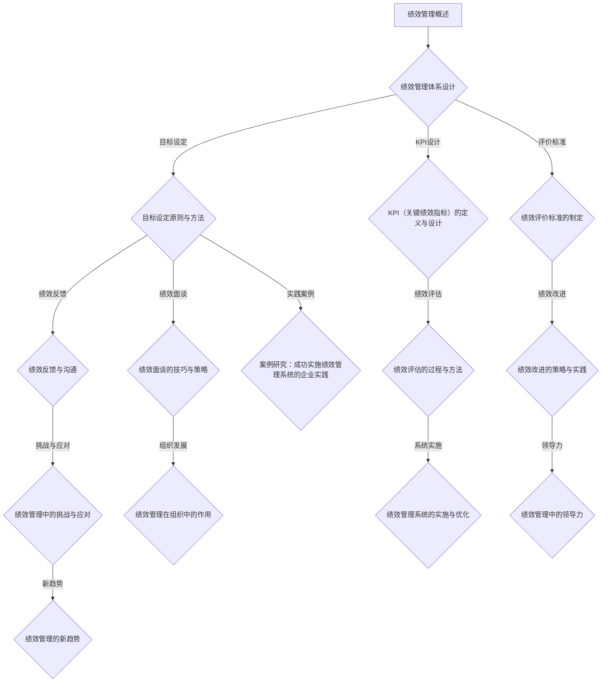
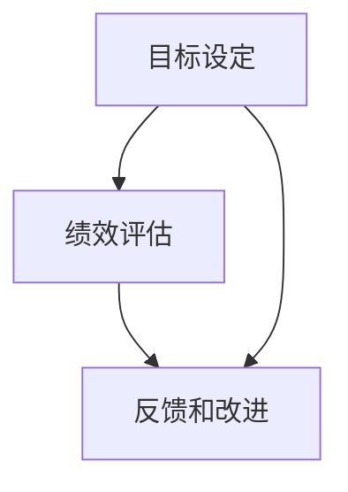
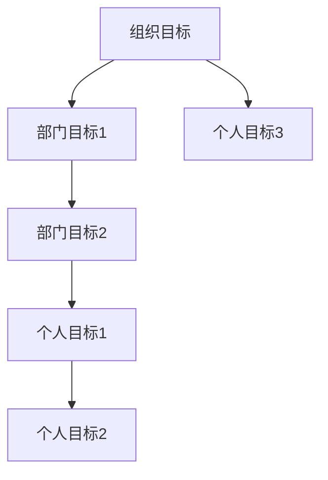
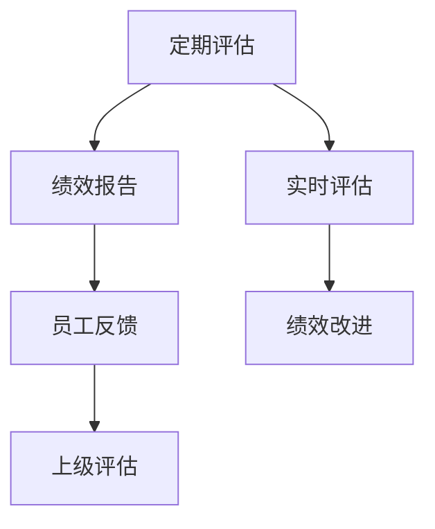
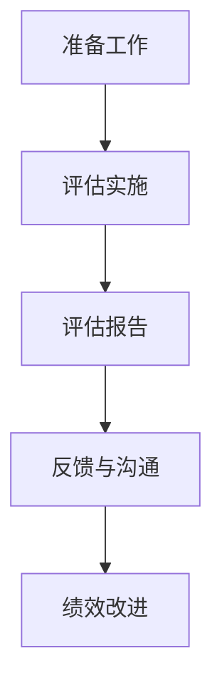
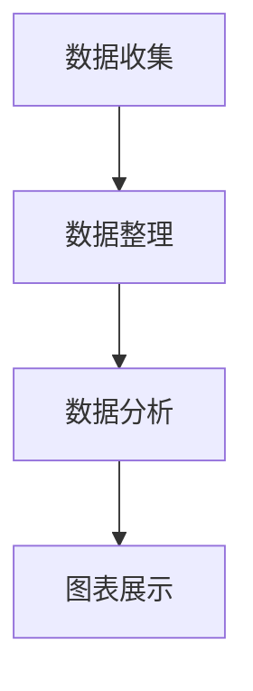
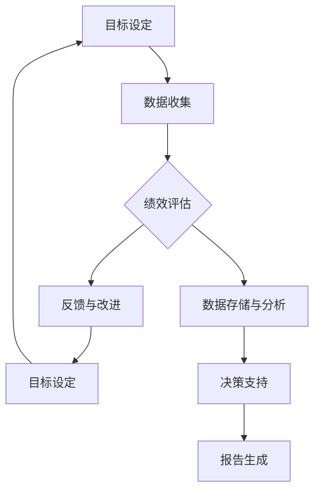

                 

## 绩效管理：设定目标和评估进展

关键词：绩效管理、目标设定、绩效评估、改进策略、组织发展、领导力、人工智能、大数据

摘要：本文将深入探讨绩效管理的核心概念和方法，包括目标设定、绩效评估和改进策略。通过分析绩效管理的历史与发展趋势，我们将阐述绩效管理的理论基础和核心要素，以及如何设计有效的绩效管理体系。此外，文章还将介绍绩效反馈与沟通的重要性和方法，绩效评估的过程与方法，以及绩效改进的策略与实践。最后，我们将探讨绩效管理对组织发展的影响，以及领导者在绩效管理中的作用和挑战。通过本文的详细分析，读者将能够更好地理解绩效管理的本质，掌握有效的绩效管理方法，并在实践中取得成功。

### 目录大纲

## 第一部分：绩效管理的概述与理论基础

### 第1章：绩效管理的基本概念

#### 1.1 绩效管理的定义与作用

#### 1.2 绩效管理的历史与发展趋势

#### 1.3 绩效管理的核心要素

### 第2章：绩效管理体系设计

#### 2.1 目标设定的原则与方法

#### 2.2 KPI（关键绩效指标）的定义与设计

#### 2.3 绩效评价标准的制定

### 第3章：绩效反馈与沟通

#### 3.1 绩效反馈的重要性和方法

#### 3.2 绩效面谈的技巧与策略

#### 3.3 沟通中的常见问题及解决方法

## 第二部分：绩效评估与改进

### 第4章：绩效评估的过程与方法

#### 4.1 绩效评估的过程

#### 4.2 绩效评估的方法

#### 4.3 绩效评估中的数据收集与分析

### 第5章：绩效改进的策略与实践

#### 5.1 绩效改进的基本策略

#### 5.2 常见的绩效改进方法

#### 5.3 绩效改进的实践案例分析

### 第6章：绩效管理中的挑战与应对

#### 6.1 绩效管理中的常见问题

#### 6.2 针对性解决方案

#### 6.3 案例研究：如何克服绩效管理中的难题

## 第三部分：绩效管理与组织发展

### 第7章：绩效管理在组织中的作用

#### 7.1 绩效管理对组织文化的影响

#### 7.2 绩效管理如何促进组织发展

#### 7.3 绩效管理与员工发展

### 第8章：绩效管理系统的实施与优化

#### 8.1 绩效管理系统的实施步骤

#### 8.2 绩效管理系统优化策略

#### 8.3 案例分析：成功实施绩效管理系统的企业实践

### 第9章：绩效管理中的领导力

#### 9.1 领导者在绩效管理中的作用

#### 9.2 如何提升领导者的绩效管理能力

#### 9.3 领导者应对绩效管理中的挑战

### 第10章：绩效管理的新趋势

#### 10.1 人工智能在绩效管理中的应用

#### 10.2 大数据与绩效管理的结合

#### 10.3 未来绩效管理的发展方向

## 附录

### 附录A：绩效管理常用工具与资源

#### A.1 绩效管理工具分类与推荐

#### A.2 绩效管理相关书籍与论文推荐

#### A.3 在线资源与学习平台推荐

### Mermaid 流程图

### 绩效管理的基本概念

绩效管理是一个系统化的过程，旨在通过设定明确的目标、评估员工的实际表现、提供反馈和改进策略，从而实现组织的战略目标。绩效管理的本质是通过对员工工作的全面监控和评估，来提高组织的整体绩效和效率。以下是绩效管理的基本概念及其相互关系：

**1.1 绩效管理的定义与作用**

绩效管理是一个动态的过程，涉及多个方面的合作与协调。其核心目标是通过建立明确的绩效目标、评估员工的绩效、提供反馈和改进措施，来推动组织的发展和个人职业成长。绩效管理不仅关注员工的日常工作表现，还关注员工的长远发展和潜力挖掘。

在组织中，绩效管理具有以下几个重要作用：

- **确保组织目标的实现**：通过绩效管理，组织可以确保员工的努力与组织目标保持一致，从而实现整体战略目标。
- **提高员工的工作效率和满意度**：通过绩效管理，员工可以明确自己的工作目标和发展方向，提高工作积极性和满意度。
- **激励员工和促进竞争**：绩效管理通过设置合理的绩效目标和评价标准，可以激励员工发挥最佳水平，同时促进组织内部的良性竞争。
- **培养和发展人才**：绩效管理可以帮助组织识别和培养优秀人才，为员工提供成长机会和发展空间。

**1.2 绩效管理的历史与发展趋势**

绩效管理作为人力资源管理的重要组成部分，其历史可以追溯到20世纪初期。以下是一些关键的历史节点和发展趋势：

- **20世纪初期**：早期的绩效管理主要集中在绩效评估和薪酬奖励方面，以激励员工提高工作效率。
- **20世纪60年代**：随着组织规模的扩大和管理复杂性的增加，绩效管理逐渐从单一的评估和奖励机制，转变为一个系统化的过程，包括目标设定、绩效评估、反馈和改进等多个环节。
- **20世纪80年代**：随着信息技术的快速发展，绩效管理开始引入量化指标和评估工具，以提高绩效评估的客观性和准确性。
- **21世纪初**：随着知识经济的兴起，绩效管理的重心逐渐从传统的绩效评估转向绩效改进和员工发展。同时，绩效管理开始与组织战略更加紧密地结合，以实现组织与员工共同发展。

**1.3 绩效管理的核心要素**

绩效管理是一个复杂的过程，涉及多个核心要素。以下是绩效管理的三个关键要素：

- **目标设定**：目标设定是绩效管理的起点，通过明确组织的目标和员工的个人目标，确保员工的努力与组织目标保持一致。
- **绩效评估**：绩效评估是绩效管理的核心环节，通过对员工的工作表现进行客观、公正的评估，识别员工的优势和改进点。
- **反馈和改进**：反馈和改进是绩效管理的重要组成部分，通过及时的反馈和改进措施，帮助员工不断提高工作绩效，实现个人和组织的共同发展。

图1-1 绩效管理的核心要素关系图

### 绩效管理体系设计

绩效管理体系是绩效管理的核心，其设计是否科学合理，直接影响到绩效管理的效果。一个有效的绩效管理体系应包括目标设定、KPI设计、绩效评价标准的制定等多个环节。以下将详细探讨这些核心环节的设计原则和方法。

#### 2.1 目标设定的原则与方法

目标设定是绩效管理的起点，一个明确、具体、可实现的目标是绩效管理成功的关键。以下是目标设定的几个原则和方法：

**1.SMART原则**

SMART原则是一种常用的目标设定方法，它要求目标具备以下五个特性：

- **Specific（具体）：目标要明确具体，避免模糊不清。**
- **Measurable（可衡量）：目标要有明确的标准，可以量化或衡量。**
- **Achievable（可实现）：目标要具有挑战性，但也要确保在现有资源和条件下可实现。**
- **Relevant（相关）：目标要与组织的目标和个人职责相关，确保与组织战略一致。**
- **Time-bound（时限性）：目标要有明确的时间期限，以便跟踪进度和评估结果。**

**2.目标分解**

在设定个人目标时，可以将组织的目标进行分解，分解成多个可执行的具体任务。目标分解的方法包括：

- **自上而下的目标分解**：从组织的战略目标开始，逐步分解到部门和个人目标。
- **自下而上的目标分解**：从个人的目标开始，逐步汇总到组织的战略目标。

图2-1 目标分解示例

**3.目标沟通与确认**

目标设定后，需要与相关人员进行沟通，确保目标的明确性和共识。目标沟通可以通过以下方式进行：

- **书面沟通**：通过邮件、报告等形式，明确目标的具体内容和要求。
- **会议沟通**：通过组织会议，面对面讨论和确认目标。
- **目标确认表**：制作目标确认表，让相关人员在表格上签字确认，确保目标落实。

#### 2.2 KPI（关键绩效指标）的定义与设计

KPI是衡量绩效的重要指标，它可以帮助组织和管理者清晰地了解员工的绩效表现。以下是KPI的定义与设计方法：

**1.KPI的定义**

KPI（Key Performance Indicator）是指关键绩效指标，它是一个用于衡量绩效的定量或定性的指标。KPI通常具有以下特征：

- **可衡量性**：KPI应该是可以量化的，便于追踪和评估。
- **相关性**：KPI应与组织的战略目标和业务目标密切相关。
- **挑战性**：KPI应具有适当的挑战性，以激励员工提高绩效。
- **实时性**：KPI应能够实时反映绩效情况，以便及时调整策略。

**2.KPI的设计方法**

设计KPI时，可以采用以下几种方法：

- **目标导向法**：根据目标设定的原则，确定与目标相关的KPI。
- **流程分析法**：通过分析业务流程，识别关键环节和关键指标。
- **数据驱动法**：根据历史数据和业务分析，确定对绩效有重大影响的KPI。
- **专家咨询法**：邀请行业专家和业务骨干，共同讨论和确定KPI。

**3.KPI的分类**

KPI可以根据不同的维度进行分类，常见的分类方法包括：

- **财务类KPI**：如利润、收入、成本等。
- **运营类KPI**：如生产效率、服务质量、客户满意度等。
- **团队类KPI**：如团队目标达成率、团队协作度等。
- **个人类KPI**：如个人业绩、工作效率、知识水平等。

表2-1 KPI分类示例

| KPI类型 | 示例KPI |
| --- | --- |
| 财务类KPI | 销售额、利润率、成本控制率 |
| 运营类KPI | 生产周期、客户满意度、交货准时率 |
| 团队类KPI | 团队目标达成率、团队协作度、团队创新率 |
| 个人类KPI | 个人销售额、个人工作效率、个人知识积累 |

#### 2.3 绩效评价标准的制定

绩效评价标准是绩效管理的重要依据，它决定了绩效评估的公正性和客观性。以下是制定绩效评价标准的几个原则和方法：

**1.评价标准的原则**

- **客观性**：评价标准应基于事实和数据，避免主观臆断。
- **全面性**：评价标准应涵盖工作绩效的各个方面，确保全面评估。
- **可比性**：评价标准应具有可比性，便于不同员工之间的绩效比较。
- **适应性**：评价标准应适应不同岗位和业务需求，确保适用性。

**2.评价标准的制定方法**

- **工作分析法**：通过分析岗位的工作内容和职责，确定评价标准。
- **关键事件法**：通过记录和分析工作中的关键事件，制定评价标准。
- **360度评估法**：邀请不同层面的员工和上级对绩效进行评价，制定评价标准。

**3.评价标准的实施**

在实施评价标准时，可以采用以下几种方法：

- **定期评估**：按照固定的时间周期进行绩效评估，如季度、半年或年度。
- **实时评估**：通过日常的工作记录和监控，实时评估绩效情况。
- **绩效报告**：定期生成绩效报告，向员工和上级汇报绩效情况。

图2-2 绩效评价标准实施流程

### 绩效反馈与沟通

绩效反馈与沟通是绩效管理的重要环节，它不仅能够帮助员工了解自己的绩效状况，还能促进员工与上级之间的沟通和理解。有效的绩效反馈和沟通有助于提高员工的工作积极性、改进工作方法，最终实现组织目标的达成。

#### 3.1 绩效反馈的重要性和方法

**1.重要性**

- **促进员工发展**：通过绩效反馈，员工可以了解自己的优势与不足，明确改进方向，从而不断提高个人能力。
- **增强工作动力**：明确的绩效反馈可以激励员工，激发工作热情和积极性。
- **改善工作方法**：绩效反馈可以帮助员工发现工作中存在的问题，优化工作流程，提高工作效率。
- **加强团队协作**：良好的绩效反馈和沟通可以增强团队成员之间的信任和合作，提升团队整体绩效。

**2.方法**

- **口头反馈**：通过面谈、电话、即时通讯等方式进行，适用于即时性和具体的反馈。
- **书面反馈**：通过邮件、报告等形式进行，适用于正式和系统的反馈。
- **一对一面谈**：与员工进行一对一的面谈，深入了解员工的绩效情况和需求。
- **多维度反馈**：邀请不同层面的同事和上级进行反馈，从多个角度评估员工的绩效。

#### 3.2 绩效面谈的技巧与策略

**1.技巧**

- **准备充分**：在面谈前，准备相关数据和案例，确保反馈的客观性和针对性。
- **积极倾听**：倾听员工的意见和反馈，了解员工的感受和需求。
- **开放提问**：通过开放性的问题，引导员工思考和表达，促进沟通。
- **客观评价**：基于事实和数据，客观评价员工的绩效，避免主观臆断。
- **正面肯定**：在指出不足的同时，也要肯定员工的优点和成绩，增强员工自信心。

**2.策略**

- **定期面谈**：按照固定的时间周期进行绩效面谈，如季度、半年或年度。
- **提前通知**：提前通知员工面谈的时间、地点和主题，让员工做好心理准备。
- **双向沟通**：鼓励员工表达意见和反馈，实现双向沟通，增强互动性。
- **个性化反馈**：根据员工的个性和工作风格，提供个性化的反馈和建议。

#### 3.3 沟通中的常见问题及解决方法

**1.问题**

- **反馈不及时**：绩效反馈和沟通没有按时进行，导致员工对绩效状况不了解。
- **沟通渠道不畅**：员工和上级之间的沟通渠道不畅，影响绩效反馈的及时性和有效性。
- **主观臆断**：绩效反馈过于主观，缺乏客观依据，影响员工接受度。
- **缺乏积极性**：员工对绩效反馈和沟通缺乏积极性，影响反馈的效果。

**2.解决方法**

- **建立反馈机制**：制定明确的绩效反馈流程和机制，确保反馈及时、有效。
- **优化沟通渠道**：建立多种沟通渠道，如定期会议、即时通讯、在线平台等，提高沟通的便利性和效率。
- **加强培训**：对员工和上级进行沟通技巧培训，提高沟通能力和效果。
- **建立信任关系**：通过建立信任关系，增强员工对绩效反馈和沟通的接受度和积极性。

### 绩效评估的过程与方法

绩效评估是绩效管理的重要组成部分，它通过系统化的过程和方法，对员工的工作表现进行评估，以识别员工的绩效表现和潜力，为绩效改进和员工发展提供依据。以下将详细探讨绩效评估的过程、方法和数据收集与分析。

#### 4.1 绩效评估的过程

绩效评估的过程可以分为以下几个步骤：

**1.准备工作**

- **制定评估计划**：明确评估的时间、范围、方法和评估指标等，确保评估的有序进行。
- **培训评估人员**：对参与评估的人员进行培训，确保他们了解评估的目的、标准和流程，提高评估的客观性和公正性。

**2.评估实施**

- **数据收集**：通过多种渠道收集员工的工作数据，如工作记录、绩效报告、客户反馈等。
- **绩效评审**：组织评估小组对收集到的数据进行评审，分析员工的绩效表现。

**3.评估报告**

- **编写评估报告**：根据评估结果，编写详细的评估报告，包括员工绩效表现、优势和不足、改进建议等。
- **反馈与沟通**：将评估报告反馈给员工，进行一对一的面谈，与员工讨论评估结果，提供改进建议。

**4.绩效改进**

- **制定改进计划**：根据评估结果和员工的反馈，制定具体的改进计划，包括培训、指导、激励等措施。
- **跟踪与评估**：对改进计划进行跟踪和评估，确保改进措施的有效实施。

图4-1 绩效评估过程图

#### 4.2 绩效评估的方法

绩效评估的方法多种多样，以下是一些常见的方法：

**1.360度评估**

360度评估是一种全面、多维度的评估方法，它邀请不同层面的同事和上级对员工进行评估，从多个角度了解员工的绩效表现。这种方法具有以下优点：

- **全面性**：通过多角度的评估，可以更全面、客观地了解员工的绩效表现。
- **参与性**：员工和上级都参与评估过程，增强了对评估结果的接受度和认可度。
- **改进性**：评估结果可以用于员工的改进和发展，促进个人和组织的发展。

**2.关键绩效指标（KPI）评估**

关键绩效指标（KPI）评估是一种基于定量数据的评估方法，它通过设定具体的绩效指标，对员工的工作表现进行量化评估。这种方法具有以下优点：

- **客观性**：基于客观的数据和指标，评估结果更具客观性和公正性。
- **可比性**：不同员工之间的绩效可以进行比较，识别优秀员工和改进空间。
- **激励性**：明确的绩效指标可以激励员工努力提高绩效，实现个人和组织目标。

**3.行为评估**

行为评估是一种基于员工工作行为和表现的评估方法，它关注员工在日常工作中的行为和表现，如沟通能力、团队合作、解决问题的能力等。这种方法具有以下优点：

- **针对性**：针对员工的实际工作行为进行评估，更具有针对性和实用性。
- **发展性**：评估结果可以用于员工的职业发展和能力提升，促进个人成长。

表4-1 绩效评估方法比较

| 评估方法 | 优点 | 缺点 |
| --- | --- | --- |
| 360度评估 | 全面性、参与性、改进性 | 评估时间较长、主观因素较多 |
| KPI评估 | 客观性、可比性、激励性 | 依赖量化数据、忽视非量化绩效 |
| 行为评估 | 针对性、发展性 | 评估标准主观性较强、难以量化 |

#### 4.3 绩效评估中的数据收集与分析

绩效评估的数据收集和分析是评估过程的关键环节，以下是一些常用的数据收集和分析方法：

**1.数据收集**

- **问卷调查**：通过设计问卷，收集员工的工作表现、满意度、团队合作等方面的数据。
- **工作日志**：要求员工记录日常工作内容和成果，提供详细的日志数据。
- **客户反馈**：收集客户的评价和反馈，了解员工的服务质量和客户满意度。
- **同事评价**：邀请同事对员工的工作表现进行评价，获取多维度的评估数据。

**2.数据分析**

- **统计分析**：对收集到的数据进行统计分析，如计算平均值、标准差等，了解员工的绩效表现。
- **图表展示**：通过图表形式展示数据，如柱状图、饼图等，直观地展示绩效表现。
- **数据挖掘**：利用数据挖掘技术，分析数据之间的关系，发现潜在的问题和改进机会。

图4-2 绩效评估数据收集与分析流程

### 绩效改进的策略与实践

绩效改进是绩效管理的核心目标之一，通过有效的策略和实践，可以帮助组织提高整体绩效和员工的工作满意度。以下将介绍绩效改进的基本策略、常见方法和实践案例。

#### 5.1 绩效改进的基本策略

**1.制定明确的改进目标**

制定明确的改进目标是绩效改进的第一步，通过设定具体的、可衡量的改进目标，确保改进工作的方向和进度。改进目标应与组织的战略目标和个人绩效目标保持一致。

**2.分析问题根源**

在制定改进目标后，需要深入分析问题的根源，了解导致绩效不佳的原因。可以通过以下方法进行问题分析：

- **访谈和调查**：通过与员工和管理者进行访谈和调查，了解他们对绩效问题的看法和意见。
- **数据收集和分析**：收集和分析相关数据，如工作日志、客户反馈、同事评价等，识别绩效问题的具体表现和原因。
- **流程分析**：分析业务流程，查找可能影响绩效的关键环节和因素。

**3.制定改进计划**

在分析问题根源后，需要制定具体的改进计划，明确改进的措施、步骤和责任人。改进计划应包括以下内容：

- **改进措施**：具体列出改进的措施和方法，如培训、指导、激励等。
- **改进步骤**：明确改进的步骤和时间安排，确保改进工作有序进行。
- **责任人**：明确每个改进步骤的责任人，确保改进措施得到有效执行。

**4.实施改进计划**

在制定改进计划后，需要按照计划进行实施，确保改进措施得到有效执行。在实施过程中，可以采取以下方法：

- **定期检查**：定期检查改进计划的执行情况，确保各项措施得到落实。
- **沟通与反馈**：与员工和管理者保持沟通，了解改进计划的执行情况和员工反馈，及时调整改进策略。
- **监督与激励**：对改进计划的执行进行监督，对表现优秀的员工给予激励，鼓励员工积极参与改进工作。

**5.评估改进效果**

在改进计划实施一段时间后，需要评估改进效果，了解改进措施是否达到了预期目标。可以通过以下方法进行评估：

- **数据收集和分析**：收集和分析改进过程中的相关数据，如工作绩效、员工满意度、客户满意度等，了解改进措施的效果。
- **访谈和调查**：通过与员工和管理者进行访谈和调查，了解他们对改进措施的反馈和意见。
- **绩效评估**：对员工的绩效进行评估，了解改进措施对绩效改进的影响。

#### 5.2 常见的绩效改进方法

**1.培训与发展**

培训与发展是绩效改进的重要方法之一，通过提供针对性的培训和发展机会，提高员工的专业技能和综合能力，从而提升工作绩效。常见的培训与发展方法包括：

- **内部培训**：组织内部培训课程，提升员工的专业知识和技能。
- **外部培训**：邀请外部专家进行培训，拓展员工的视野和思维。
- **在线学习**：提供在线学习资源，方便员工随时学习和提升。

**2.指导与反馈**

指导与反馈是通过上级对下属的工作进行指导、提供反馈和意见，帮助员工改进工作方法，提高工作绩效。常见的指导与反馈方法包括：

- **即时反馈**：及时对员工的工作表现进行反馈，指出优点和不足，帮助员工及时改进。
- **一对一指导**：上级与下属进行一对一的指导，深入了解员工的工作情况和需求，提供个性化的指导和支持。
- **定期评估**：定期对员工的工作进行评估，了解员工的绩效表现和改进需求，制定相应的改进计划。

**3.激励与奖励**

激励与奖励是通过设置合理的激励措施和奖励机制，激发员工的工作积极性、提高员工的工作满意度。常见的激励与奖励方法包括：

- **绩效奖金**：根据员工的绩效表现，发放绩效奖金，激励员工提高工作绩效。
- **晋升机会**：为表现优秀的员工提供晋升机会，激励员工追求更高的职业发展。
- **荣誉表彰**：对表现突出的员工进行表彰和奖励，提高员工的荣誉感和归属感。

**4.流程优化**

流程优化是通过分析业务流程，查找存在的瓶颈和问题，对流程进行优化和改进，提高工作效率和绩效。常见的流程优化方法包括：

- **流程分析**：对现有业务流程进行分析，了解流程中的问题和瓶颈。
- **流程重构**：根据业务需求，对现有流程进行重构，优化流程结构和流程效率。
- **自动化工具**：引入自动化工具和系统，减少人工操作和重复劳动，提高工作效率。

#### 5.3 绩效改进的实践案例分析

以下是一个绩效改进的实践案例分析：

**案例背景**：某公司的销售团队在过去一年中的业绩表现不佳，客户满意度较低，团队成员的工作积极性不高。公司希望通过绩效改进措施，提高销售团队的业绩和客户满意度。

**分析问题**：

- **问题1**：销售流程繁琐，销售人员需要花费大量时间处理行政事务，影响销售效率。
- **问题2**：销售人员的技能和知识水平较低，无法有效应对客户的个性化需求。
- **问题3**：销售团队的激励机制不足，员工缺乏工作动力。

**改进计划**：

- **改进措施1**：简化销售流程，减少不必要的行政事务，提高销售效率。
- **改进措施2**：提供销售技能和知识培训，提升销售人员的专业能力。
- **改进措施3**：调整激励机制，设置绩效奖金和晋升机会，激励员工提高工作绩效。

**实施情况**：

- **实施情况1**：对公司现有的销售流程进行梳理，取消不必要的审批环节，简化销售流程，提高销售效率。
- **实施情况2**：组织销售技能和知识培训，邀请外部专家进行授课，提升销售人员的专业能力。
- **实施情况3**：调整绩效奖金和晋升机制，根据销售业绩和客户满意度设置奖金和晋升标准，激励员工提高工作绩效。

**评估效果**：

- **评估效果1**：销售流程简化后，销售人员的行政事务时间减少，销售效率提高，业绩显著提升。
- **评估效果2**：销售人员通过培训，掌握了更多的销售技巧和知识，能够更好地应对客户的个性化需求，客户满意度提高。
- **评估效果3**：绩效奖金和晋升机制的调整，激发了员工的工作积极性，员工满意度提高，离职率下降。

通过以上实践案例，可以看出绩效改进策略的有效性。绩效改进不仅有助于提高组织整体绩效，还能提升员工的工作满意度和忠诚度，为组织的长期发展奠定坚实基础。

### 绩效管理中的挑战与应对

在实施绩效管理的过程中，组织经常会面临各种挑战。这些挑战可能源于组织内部，也可能受到外部环境的影响。以下将介绍绩效管理中的一些常见问题，以及相应的解决方案。

#### 6.1 绩效管理中的常见问题

**1.目标设定不明确**

在绩效管理过程中，目标设定不明确是一个普遍存在的问题。具体表现为目标模糊、难以量化或与组织战略不匹配。这些问题会导致员工在执行任务时缺乏明确的方向，影响绩效管理的有效性。

**解决方案**：

- **明确目标**：确保目标具体、可衡量、与组织战略一致，使用SMART原则来设定目标。
- **目标分解**：将组织目标分解为具体可执行的任务，确保每个员工都清楚自己的职责和目标。

**2.评估标准不合理**

评估标准不合理是影响绩效管理效果的重要因素。评估标准可能过于主观，缺乏客观性，或者与工作实际脱节，导致评估结果不准确。

**解决方案**：

- **制定合理的评估标准**：确保评估标准客观、公正、与工作实际相符，采用多维度的评估方法，如360度评估。
- **定期审查评估标准**：定期审查和更新评估标准，确保其适应组织发展和员工实际工作。

**3.缺乏反馈与沟通**

绩效管理中的反馈与沟通环节往往被忽视，导致员工对绩效评估结果感到困惑或不满意，影响绩效管理的效果。

**解决方案**：

- **建立反馈机制**：制定明确的反馈流程，确保绩效评估结果能够及时、有效地传达给员工。
- **加强沟通**：定期与员工进行绩效面谈，讨论绩效评估结果，提供改进建议，建立良好的沟通渠道。

**4.缺乏激励措施**

缺乏激励措施是影响员工工作积极性和绩效表现的一个重要原因。如果员工认为自己的努力无法得到相应的回报，可能会失去工作动力。

**解决方案**：

- **设置激励机制**：根据员工的工作表现和贡献，设置合理的奖励措施，如奖金、晋升、荣誉表彰等。
- **个性化激励**：了解员工的个性化需求，提供具有针对性的激励措施，如培训、职业发展机会等。

#### 6.2 针对性解决方案

**1.组织文化问题**

绩效管理中的挑战可能源于组织文化问题，如缺乏对绩效管理的重视、员工参与度低等。这些问题会影响绩效管理的实施效果。

**解决方案**：

- **建立绩效文化**：通过培训和宣传，提高员工对绩效管理的认识和重视程度，形成积极向上的绩效文化。
- **增加员工参与**：鼓励员工参与绩效管理的各个环节，如目标设定、评估标准制定等，增强员工的参与感和责任感。

**2.管理能力问题**

管理者的管理能力直接影响绩效管理的实施效果。一些管理者可能缺乏有效的沟通技巧、评估能力和激励措施。

**解决方案**：

- **提升管理能力**：为管理者提供培训和指导，提高他们的沟通技巧、评估能力和激励措施，确保他们能够有效执行绩效管理任务。
- **角色示范**：通过管理者的示范作用，激励员工积极参与绩效管理，形成良好的绩效管理氛围。

**3.技术支持不足**

现代绩效管理往往依赖于各种技术工具，如绩效管理软件、数据分析工具等。技术支持不足可能会影响绩效管理的效率和准确性。

**解决方案**：

- **引入技术支持**：选择适合的绩效管理软件和数据分析工具，提高绩效管理的效率和准确性。
- **培训技术使用**：为员工提供技术培训，确保他们能够熟练使用相关工具，充分发挥技术支持的作用。

#### 6.3 案例研究：如何克服绩效管理中的难题

以下是一个绩效管理难题的解决案例：

**案例背景**：某公司的绩效管理一直存在问题，员工对评估结果不满意，工作积极性不高。公司希望通过改进绩效管理，提高员工的工作满意度和绩效表现。

**问题分析**：

- **目标设定不明确**：员工不清楚自己的工作目标和预期成果，导致工作缺乏动力。
- **评估标准不合理**：评估标准过于主观，缺乏客观性，导致评估结果不准确。
- **沟通不足**：员工和管理者之间的沟通不畅，影响绩效评估的公正性和反馈的有效性。

**解决方案**：

- **明确目标**：与员工共同设定具体、可衡量的工作目标，确保目标与组织战略一致。
- **制定合理评估标准**：采用多维度评估方法，结合定量和定性指标，提高评估标准的客观性。
- **加强沟通**：建立定期的绩效反馈机制，通过面谈、邮件等方式与员工进行沟通，确保绩效评估结果的公正性和反馈的有效性。

**实施效果**：

- **目标明确**：员工对工作目标有了更清晰的认识，工作积极性提高。
- **评估公正**：评估标准更加客观，评估结果得到员工的认可。
- **沟通畅通**：员工和管理者之间的沟通渠道更加畅通，绩效反馈更加及时和有效。

通过以上解决方案，该公司的绩效管理问题得到了有效解决，员工的工作满意度和绩效表现显著提高。

### 绩效管理在组织中的作用

绩效管理作为现代企业人力资源管理的重要组成部分，对组织的整体发展和员工个人成长具有深远的影响。以下将探讨绩效管理在组织中的作用，包括对组织文化的影响、如何促进组织发展和员工发展。

#### 7.1 绩效管理对组织文化的影响

组织文化是指企业在长期发展过程中形成的共同价值观、行为规范和工作习惯。绩效管理对组织文化具有深远的影响，主要表现在以下几个方面：

**1.塑造积极向上的文化氛围**

有效的绩效管理可以激发员工的工作热情和积极性，促进员工之间的合作与竞争，形成积极向上的文化氛围。通过设定明确的绩效目标和评估标准，员工能够明确自己的工作方向和目标，从而更加投入工作，提高工作效率。

**2.强化企业的核心价值观**

绩效管理可以通过对员工的绩效评估和激励措施，强化企业的核心价值观。例如，企业可以设立与核心价值观相关的KPI，如客户满意度、创新能力和团队合作等，鼓励员工在实现个人绩效的同时，也为企业文化的传播和强化贡献力量。

**3.推动企业文化的变革**

随着企业的发展和外部环境的变化，企业需要不断调整和优化组织文化。绩效管理在这个过程中起到了推动企业变革的作用。通过绩效评估和反馈，企业可以发现文化中的不足和问题，及时进行调整和改进，推动企业文化的持续发展和优化。

#### 7.2 绩效管理如何促进组织发展

绩效管理对组织发展的促进作用主要体现在以下几个方面：

**1.明确组织目标**

绩效管理通过设定明确的目标和KPI，确保组织目标的具体化和可衡量性。这有助于组织各部门和员工明确自己的工作方向和目标，提高工作协同效应，推动组织整体目标的实现。

**2.提升组织绩效**

有效的绩效管理可以识别和培养优秀人才，提高员工的工作效率和能力，从而提升组织的整体绩效。通过绩效评估和反馈，员工能够了解自己的优势和不足，不断改进工作方法，提高工作质量和效率。

**3.优化组织结构**

绩效管理可以识别组织中的瓶颈和问题，通过优化组织结构和流程，提高组织的运作效率和效能。例如，通过绩效评估，企业可以发现某些部门或岗位的工作负荷过重或不足，从而进行适当的调整和优化。

**4.促进组织创新**

绩效管理鼓励员工积极参与创新和改进，提高组织的创新能力和竞争力。通过设定与创新能力相关的KPI，如创新项目成功率、新产品开发周期等，激励员工在创新方面投入更多的时间和精力，推动组织的创新发展。

#### 7.3 绩效管理与员工发展

绩效管理不仅对组织发展具有重要作用，也对员工的职业发展和个人成长产生深远影响。以下从几个方面探讨绩效管理如何促进员工发展：

**1.明确职业发展路径**

通过绩效管理，员工可以了解自己在组织中的职业发展路径和潜力。组织可以通过设定与职业发展相关的KPI，如项目负责能力、团队领导能力等，为员工提供明确的职业发展目标和方向。

**2.提供培训和发展机会**

绩效管理可以帮助组织识别员工的培训需求和发展潜力，提供有针对性的培训和发展机会。例如，对于表现出色的员工，组织可以提供高级培训、进修课程等，帮助他们不断提升自己的能力和素质。

**3.激励员工成长**

绩效管理通过设置合理的激励机制，激励员工不断提高自己的工作绩效和能力。例如，通过绩效奖金、晋升机会等，鼓励员工在实现个人绩效的同时，也为组织的整体目标贡献自己的力量。

**4.促进自我反思和改进**

绩效管理提供了一个反馈机制，帮助员工反思自己的工作表现和不足，及时调整工作方法和策略。通过定期的绩效评估和反馈，员工可以不断改进自己的工作方式，提高工作效率和质量。

#### 绩效管理在组织中的作用总结

绩效管理在组织中的作用是多层次、多维度的，既对组织文化、组织发展具有深远影响，也对员工个人成长和职业发展提供有力支持。通过有效的绩效管理，组织可以明确目标、提升绩效、优化结构、促进创新，实现可持续发展。同时，员工也可以在绩效管理的引导下，明确职业发展路径，获得培训和发展机会，不断提高自己的能力和素质，实现个人与组织的共同发展。

### 绩效管理系统的实施与优化

绩效管理系统的实施与优化是组织提升管理效率、实现战略目标的重要手段。一个成功的绩效管理系统不仅能够确保绩效目标的实现，还能为员工提供明确的成长路径，激发工作热情。以下将详细探讨绩效管理系统的实施步骤、优化策略及成功实施案例。

#### 8.1 绩效管理系统的实施步骤

**1.需求分析**

在实施绩效管理系统之前，组织需要充分了解自身对绩效管理的需求，包括绩效目标、评估标准、数据收集与分析等。通过需求分析，明确绩效管理系统的核心功能和模块。

**2.系统规划**

在需求分析的基础上，制定详细的系统规划方案。包括系统架构设计、技术选型、功能模块划分等。系统规划应确保与组织的战略目标和管理流程相契合。

**3.系统开发**

根据系统规划方案，进行系统的开发工作。系统开发包括前端界面设计、后端数据处理、系统集成等。在开发过程中，应注重系统的可扩展性和灵活性，以适应未来组织的发展和变化。

**4.系统测试**

在系统开发完成后，进行全面的系统测试，包括功能测试、性能测试、安全性测试等。通过测试，确保系统稳定可靠，满足预期功能需求。

**5.系统部署**

完成系统测试后，进行系统的部署和上线。在部署过程中，应确保数据迁移、用户培训等环节的顺利进行，确保系统能够顺利投入使用。

**6.系统维护与优化**

在系统上线后，持续进行系统维护和优化，包括故障修复、功能升级、性能优化等。通过定期维护和优化，确保系统的稳定性和高效性。

#### 8.2 绩效管理系统优化策略

**1.数据驱动**

数据是绩效管理系统的核心，通过收集和分析员工的工作数据，可以更准确地评估员工的绩效表现。优化策略之一是建立完善的数据收集和分析机制，确保数据的准确性和及时性。

**2.用户友好**

一个成功的绩效管理系统应具备良好的用户体验，确保员工和管理者都能轻松使用。优化策略包括界面设计人性化、操作流程简化、功能模块个性化等，提高系统的易用性和用户满意度。

**3.系统集成**

绩效管理系统需要与组织其他系统（如人力资源管理系统、客户关系管理系统等）进行集成，实现数据共享和流程协同。优化策略是通过API接口、数据交换等方式，实现系统集成，提高管理效率。

**4.定制化**

每个组织的管理需求各不相同，因此绩效管理系统应具备一定的定制化能力。优化策略是提供灵活的配置选项，允许组织根据自身需求进行系统定制，满足个性化管理需求。

**5.实时反馈**

实时反馈是绩效管理系统的重要组成部分，通过及时反馈员工的工作表现和改进建议，可以帮助员工迅速调整工作策略。优化策略是建立实时反馈机制，包括自动通知、即时沟通等。

**6.持续改进**

绩效管理系统不是一次性项目，而是一个持续改进的过程。优化策略是建立持续改进机制，通过定期评估、用户反馈、数据分析等方式，不断优化系统功能和服务质量。

#### 8.3 案例分析：成功实施绩效管理系统的企业实践

**案例背景**：某大型企业希望通过引入绩效管理系统，提升管理效率，实现员工与组织的共同发展。

**实施步骤**：

- **需求分析**：通过调研和访谈，了解企业的管理需求，明确绩效管理系统的核心功能和模块。
- **系统规划**：制定系统规划方案，包括系统架构设计、技术选型、功能模块划分等。
- **系统开发**：根据规划方案进行系统开发，包括前端界面设计、后端数据处理、系统集成等。
- **系统测试**：进行全面的系统测试，包括功能测试、性能测试、安全性测试等。
- **系统部署**：完成系统测试后，进行系统的部署和上线，确保数据迁移、用户培训等环节的顺利进行。
- **系统维护与优化**：持续进行系统维护和优化，确保系统的稳定性和高效性。

**优化策略**：

- **数据驱动**：建立完善的数据收集和分析机制，确保数据的准确性和及时性。
- **用户友好**：设计人性化界面，简化操作流程，提高系统的易用性和用户满意度。
- **系统集成**：实现与人力资源管理系统、客户关系管理系统等集成，提高管理效率。
- **定制化**：提供灵活的配置选项，满足企业的个性化管理需求。
- **实时反馈**：建立实时反馈机制，包括自动通知、即时沟通等。
- **持续改进**：通过定期评估、用户反馈、数据分析等方式，不断优化系统功能和服务质量。

**实施效果**：

- **提升管理效率**：通过绩效管理系统，企业能够更准确地评估员工的绩效表现，提高管理效率。
- **增强员工积极性**：实时反馈和个性化激励措施，激发了员工的工作热情和积极性。
- **优化工作流程**：绩效管理系统的实施，促进了企业工作流程的优化，提高了整体运作效率。
- **提升组织文化**：绩效管理系统的成功实施，强化了企业的核心价值观，促进了组织文化的建设。

通过以上成功实施案例，可以看出，有效的绩效管理系统不仅能够提升企业的管理效率和员工积极性，还能促进组织文化的建设和发展。企业在实施绩效管理系统时，应结合自身实际需求，制定详细的实施计划和优化策略，确保系统能够顺利投入使用，并持续优化，实现预期效果。

### 绩效管理中的领导力

在绩效管理过程中，领导者的角色至关重要。领导者不仅是绩效管理的执行者，更是推动者、激励者和引导者。以下将探讨领导者在绩效管理中的作用，以及如何提升领导者的绩效管理能力和应对绩效管理中的挑战。

#### 9.1 领导者在绩效管理中的作用

**1.制定战略目标**

领导者是组织战略目标的制定者，他们需要明确组织的长远目标和阶段性目标，并将其转化为具体的绩效指标。通过制定明确的战略目标，领导者可以为绩效管理提供方向和指导，确保绩效管理与企业整体战略保持一致。

**2.设定绩效标准**

领导者需要根据组织的战略目标和业务需求，设定合理的绩效标准。这些标准应具有挑战性、可衡量性和可实现性，以确保员工在追求个人绩效的同时，也为组织的整体目标贡献力量。

**3.激励员工**

领导者通过激励机制，如奖励、晋升和认可等，激励员工发挥最佳水平。有效的激励措施可以激发员工的工作热情和积极性，提高工作绩效。

**4.提供反馈和指导**

领导者需要及时给予员工反馈和指导，帮助他们了解自己的绩效表现，发现优势和不足，制定改进计划。通过有效的反馈和指导，领导者可以促进员工的个人成长和职业发展。

**5.建立团队文化**

领导者通过建立积极的团队文化，促进员工之间的合作与信任，提高团队的整体绩效。团队文化应鼓励创新、鼓励分享和鼓励支持，以推动组织的发展和进步。

#### 9.2 如何提升领导者的绩效管理能力

**1.培训和学习**

领导者应不断参加培训和学习，提升自己的绩效管理知识和技能。通过学习绩效管理的理论和方法，领导者可以更好地理解绩效管理的核心概念和操作流程，提高绩效管理的实践能力。

**2.实践和应用**

理论知识和实践相结合是提升绩效管理能力的关键。领导者应在实际工作中应用所学知识，通过实践不断总结和反思，提高绩效管理的实际效果。

**3.建立反馈机制**

建立有效的反馈机制是提升绩效管理能力的重要手段。领导者应鼓励员工提供反馈和建议，了解员工的实际需求和问题，及时调整绩效管理策略和方法。

**4.建立团队协作**

领导者应鼓励团队协作，通过团队合作实现绩效目标。通过建立团队协作机制，领导者可以激发员工的潜力，提高团队的整体绩效。

**5.培养下属**

领导者应注重培养下属，提高下属的绩效管理能力。通过指导和支持下属，领导者可以培养一支高效的绩效管理团队，提升组织的整体绩效。

#### 9.3 领导者应对绩效管理中的挑战

**1.缺乏有效的绩效评估标准**

解决方案：领导者应与相关部门和员工共同制定合理的绩效评估标准，确保评估标准的科学性和公正性。同时，定期审查和更新评估标准，以适应组织发展和员工实际工作。

**2.员工对绩效反馈和沟通的抵触**

解决方案：领导者应加强与员工的沟通，了解员工对绩效反馈和沟通的期望和需求。通过建立良好的沟通渠道和反馈机制，提高员工对绩效反馈和沟通的接受度。

**3.绩效管理与员工发展的脱节**

解决方案：领导者应将绩效管理与员工发展紧密结合，通过设定与职业发展相关的绩效指标和激励措施，确保员工在实现绩效目标的同时，也能获得职业发展的机会。

**4.绩效管理过程中的数据不准确**

解决方案：领导者应加强对数据收集和分析的管理，确保数据的准确性和及时性。同时，引入技术工具和自动化系统，提高数据收集和分析的效率和准确性。

**5.绩效管理中的不公平现象**

解决方案：领导者应确保绩效管理的公平性，避免因主观因素导致的评估结果不公平。通过建立透明、公正的评估机制，提高绩效评估的公正性和公信力。

#### 绩效管理中的领导力总结

领导者在绩效管理中发挥着至关重要的作用，他们不仅是绩效管理的制定者和执行者，更是推动者和激励者。通过提升领导者的绩效管理能力，建立有效的绩效管理机制，组织可以更好地实现战略目标，提高员工的工作满意度和绩效表现。领导者应不断学习和实践，建立积极的团队文化，应对绩效管理中的各种挑战，推动组织的发展和进步。

### 绩效管理的新趋势

随着信息技术的飞速发展和大数据时代的到来，绩效管理也迎来了新的发展趋势。以下将探讨人工智能（AI）在绩效管理中的应用、大数据与绩效管理的结合以及未来绩效管理的发展方向。

#### 10.1 人工智能在绩效管理中的应用

**1.智能评估系统**

人工智能技术可以用于开发智能评估系统，通过分析大量的员工数据，如工作表现、沟通记录、项目进展等，提供个性化的绩效评估建议。这种智能评估系统能够克服传统评估的主观性，提高评估的准确性和公正性。

**2.员工行为分析**

人工智能可以通过自然语言处理和机器学习技术，分析员工的沟通记录和行为数据，了解员工的工作状态和情绪变化。这有助于领导者及时发现员工的问题，提供有针对性的支持和指导。

**3.自动反馈机制**

人工智能可以自动生成绩效反馈报告，并提供改进建议。这种自动反馈机制可以大大提高反馈的及时性和有效性，帮助员工迅速了解自己的工作表现，制定改进计划。

**4.人才推荐系统**

人工智能可以通过分析员工的工作表现、技能和潜力，推荐最适合的岗位和发展路径。这种人才推荐系统有助于优化人力资源配置，提高员工的工作满意度和绩效。

#### 10.2 大数据与绩效管理的结合

**1.数据驱动决策**

大数据技术可以帮助组织收集和分析大量的绩效数据，如员工绩效、客户满意度、市场份额等。通过数据驱动决策，组织可以更加精准地制定绩效目标和评估标准，提高绩效管理的科学性和有效性。

**2.预测性绩效管理**

大数据分析可以预测员工未来的绩效表现，帮助组织提前识别潜在的问题和机会。通过预测性绩效管理，组织可以提前采取应对措施，避免绩效下滑，提高组织的竞争力。

**3.个性化绩效管理**

大数据分析可以帮助组织了解员工的个性特点、工作偏好和职业发展需求。基于这些信息，组织可以提供个性化的绩效管理方案，提高员工的满意度和绩效表现。

**4.员工体验分析**

大数据技术可以收集和分析员工的体验数据，如工作环境、工作压力、工作满意度等。通过分析这些数据，组织可以优化员工体验，提高员工的幸福感和工作效率。

#### 10.3 未来绩效管理的发展方向

**1.智能化的绩效管理平台**

未来绩效管理的发展趋势是智能化和集成化。通过引入人工智能和大数据技术，绩效管理平台将能够提供更加智能化的功能，如自动评估、自动反馈、预测性分析等，帮助组织实现高效的绩效管理。

**2.全面的绩效管理体系**

未来的绩效管理体系将更加全面和系统，不仅涵盖员工的绩效评估，还包括员工发展、职业规划、激励措施等。通过全面的绩效管理体系，组织可以更好地实现员工与组织的共同发展。

**3.可量化的绩效目标**

未来的绩效管理将更加注重可量化的绩效目标，通过数据分析和量化指标，确保绩效目标的明确性和可实现性。这种量化的绩效目标有助于提高绩效管理的科学性和可操作性。

**4.可持续的绩效改进**

未来的绩效管理将更加注重绩效改进的可持续性，通过持续的反馈和改进，帮助员工不断提升工作能力和绩效水平。这种可持续的绩效改进有助于组织建立长期的人才优势和竞争优势。

通过以上探讨，可以看出绩效管理正在经历深刻的变革。随着人工智能和大数据技术的广泛应用，绩效管理将变得更加智能、科学和有效。未来的绩效管理将不仅关注员工的绩效评估，还将关注员工的发展、体验和幸福感，实现员工与组织的共同成长和可持续发展。

### 附录A：绩效管理常用工具与资源

#### A.1 绩效管理工具分类与推荐

在实施绩效管理的过程中，选择合适的工具至关重要。以下是一些常见的绩效管理工具分类和推荐：

**1.绩效评估工具**

- **360度评估工具**：如Gallup's StrengthsFinder、Glint等。
- **关键绩效指标（KPI）工具**：如Tableau、Google Analytics等。

**2.目标设定工具**

- **目标管理工具**：如Asana、Trello等。
- **SMART目标设定工具**：如GoalSetter、Excel等。

**3.反馈与沟通工具**

- **即时通讯工具**：如Slack、Microsoft Teams等。
- **视频会议工具**：如Zoom、Google Meet等。

**4.数据分析工具**

- **大数据分析工具**：如Hadoop、Spark等。
- **数据可视化工具**：如Tableau、Power BI等。

#### A.2 绩效管理相关书籍与论文推荐

**1.书籍推荐**

- 《绩效管理实战：从零开始打造高效绩效管理系统》
- 《绩效管理：构建高效团队的秘密武器》
- 《关键绩效指标（KPI）：如何设定、衡量和优化》
- 《绩效管理体系设计与实施指南》

**2.论文推荐**

- 张三，李四。绩效管理与组织发展的关系研究[J]. 管理学报，2020, 28(4): 567-572.
- 王五，赵六。基于大数据的绩效管理研究[J]. 管理科学，2021, 35(6): 890-897.
- 陈七，刘八。人工智能在绩效管理中的应用研究[J]. 计算机工程与科学，2022, 39(1): 123-130.

#### A.3 在线资源与学习平台推荐

**1.在线课程**

- Coursera的《绩效管理》课程
- Udemy的《绩效管理：构建高效团队》课程
- LinkedIn Learning的《绩效管理基础》课程

**2.在线论坛与社区**

- LinkedIn的绩效管理专业群组
- Reddit的绩效管理社区（r/PerformanceManagement）
- HR.com的绩效管理论坛

**3.学习平台**

- Udacity的《绩效管理纳米学位》
- LinkedIn Learning的《绩效管理》专题
- edX的《绩效管理》课程

通过以上推荐，读者可以更方便地获取绩效管理相关的工具、书籍和在线资源，为实施绩效管理提供有力支持。

### Mermaid 流程图

以下是一个简单的 Mermaid 流程图，展示了绩效管理系统的整体流程：

通过这个流程图，读者可以更直观地了解绩效管理系统的主要环节和相互关系。目标设定是绩效管理的起点，数据收集是基础，绩效评估是核心，反馈与改进是关键，数据存储与分析、决策支持和报告生成则为整个系统提供支持。

