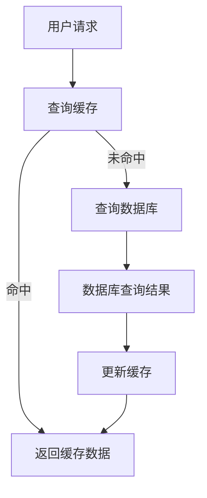

                 

# 缓存机制在高吞吐量中的实例应用

## 摘要

本文将深入探讨缓存机制在高吞吐量场景中的实际应用。缓存作为一种常见的优化技术，能够在减少响应时间、提升系统性能、降低资源消耗等方面发挥关键作用。特别是在高并发和高负载的场景下，缓存机制的合理设计和优化，能够显著提高系统的吞吐量和稳定性。本文将从缓存的基础知识、缓存机制在数据库和缓存系统中的应用、缓存机制在高吞吐量场景中的挑战与优化、以及具体的案例分析等多个角度，全面解析缓存机制在实际开发中的应用与优化策略。希望通过本文的探讨，能够为读者提供关于缓存机制在实际项目中的深入理解和实践指导。

## 目录

### 《缓存机制在高吞吐量中的实例应用》

- **关键词**：缓存机制、高吞吐量、性能优化、实例应用、数据库缓存、缓存系统、案例分析
- **摘要**：
  本文将系统地介绍缓存机制在高吞吐量环境中的应用。缓存作为一种性能优化的重要手段，通过对数据或结果的临时存储，能够显著减少频繁的读写操作，提升系统的响应速度。本文将首先探讨缓存的基本概念、工作原理及分类，随后详细分析缓存机制在数据库和缓存系统中的应用。此外，本文还将针对高吞吐量场景下的缓存挑战，提供优化策略和案例分析，以期为实际项目中的缓存优化提供参考。

### 第一部分：缓存基础知识

缓存是一种临时存储机制，用于减少频繁的读写操作，提升系统的性能。本部分将详细介绍缓存的基本概念、工作原理、分类以及性能评估指标，为后续章节的深入探讨打下基础。

#### 1.1 缓存的基本概念

#### **1.1.1 缓存的定义**

缓存（Cache）是一种临时存储数据或结果的机制，它通过将频繁访问的数据存储在高速存储介质中，以减少对低速存储设备的访问次数，从而提高系统的响应速度。缓存广泛应用于计算机系统、数据库、Web应用等领域。

#### **1.1.2 缓存的作用**

缓存的主要作用包括：

- **减少延迟**：缓存存储在高速存储介质中，访问速度远快于低速存储设备，从而减少了系统的响应时间。
- **降低负载**：通过缓存频繁访问的数据，减少了数据库或存储设备的负载，延长了它们的使用寿命。
- **提高性能**：缓存能够显著减少数据访问的次数，提高系统的整体性能。

#### **1.1.3 缓存与内存、存储的关系**

缓存位于内存和存储设备之间，是一种中介存储。内存（RAM）作为计算机系统中的高速存储器，用于存储正在运行的程序和数据。而存储设备（如硬盘、SSD）则用于长期存储数据和文件。缓存通过在内存和存储设备之间进行数据交换，实现数据的高速访问。

#### 1.2 缓存的工作原理

#### **1.2.1 缓存的存储结构**

缓存的存储结构通常分为以下几层：

- **L1缓存**：位于CPU内部，是最靠近CPU的缓存，访问速度最快。
- **L2缓存**：位于CPU外部，相对于L1缓存，容量更大，访问速度稍慢。
- **L3缓存**：通常是多核心处理器共享的缓存，容量更大，但访问速度相对较慢。
- **内存**：包括RAM和ROM，是计算机系统中的主存储器，用于存储正在运行的程序和数据。
- **存储设备**：包括硬盘、SSD等，用于长期存储数据和文件。

#### **1.2.2 缓存的替换策略**

缓存的替换策略决定了当缓存空间不足时，如何选择替换已缓存的数据。常见的替换策略包括：

- **先进先出（FIFO）**：最早进入缓存的数据首先被替换。
- **最近最少使用（LRU）**：最近最少被访问的数据首先被替换。
- **最少访问（LFU）**：访问次数最少的数据首先被替换。

#### **1.2.3 缓存的访问模式**

缓存的访问模式主要包括以下几种：

- **完全缓存**：所有的数据都存储在缓存中，避免了访问低速存储设备。
- **部分缓存**：只有部分频繁访问的数据存储在缓存中，通过命中缓存提高访问速度。
- **混合缓存**：同时使用多个缓存层次，根据数据的访问频率和重要性进行存储。

#### 1.3 缓存的分类

缓存可以根据不同的维度进行分类，常见的分类方法包括：

- **按层次分类**：分为L1、L2、L3缓存，分别位于CPU内部和外部。
- **按用途分类**：分为数据缓存、指令缓存、统一缓存等。
- **按实现方式分类**：分为硬件缓存、软件缓存、分布式缓存等。

#### **1.3.1 软件缓存**

软件缓存是通过软件实现的缓存机制，通常用于数据库、Web应用等场景。常见的软件缓存包括数据库缓存、应用缓存、代理缓存等。

#### **1.3.2 硬件缓存**

硬件缓存是硬件实现的缓存机制，通常集成在CPU、内存、存储设备中。硬件缓存具有访问速度快、延迟低等特点。

#### **1.3.3 分布式缓存**

分布式缓存是分布式系统中的一种缓存机制，通过将缓存数据分布存储在多个节点上，提高缓存的可扩展性和容错性。常见的分布式缓存系统包括Redis、Memcached、Ehcache等。

#### 1.4 缓存的性能评估指标

缓存系统的性能评估指标主要包括以下几种：

- **缓存命中率**：缓存中命中请求的次数与总请求次数的比值，反映了缓存的有效性。
- **缓存访问时间**：从缓存中读取或写入数据所需的时间，反映了缓存的速度。
- **缓存容量**：缓存可以存储的数据量，决定了缓存的空间大小。

### 第二部分：缓存机制在数据库中的应用

数据库是存储和管理数据的核心系统，缓存机制在数据库中的应用能够显著提升数据库的性能。本部分将详细探讨缓存机制在数据库中的角色、常见缓存算法及其优化策略。

#### 2.1 缓存机制在数据库中的角色

#### **2.1.1 缓存对数据库性能的影响**

缓存机制在数据库中的作用主要体现在以下几个方面：

- **减少磁盘I/O操作**：缓存频繁访问的数据，减少了数据库对磁盘的读写操作，降低了I/O瓶颈。
- **提高查询效率**：通过缓存结果集，减少了查询操作的开销，提高了系统的响应速度。
- **降低CPU使用率**：缓存机制减少了数据库的运算负担，降低了CPU的使用率，提高了系统的整体性能。

#### **2.1.2 缓存机制在数据库中的实现**

数据库缓存通常通过以下几种方式实现：

- **查询缓存**：将数据库查询的结果临时存储在缓存中，后续相同的查询可以直接从缓存中获取结果。
- **索引缓存**：缓存数据库索引的数据结构，提高了索引扫描和查询的效率。
- **行缓存**：缓存表中的行数据，减少了查询操作的数据读取量。
- **连接缓存**：缓存数据库连接，避免了频繁创建和关闭连接的开销。

#### **2.1.3 缓存策略在数据库优化中的应用**

缓存策略在数据库优化中的应用主要包括以下几个方面：

- **提高查询性能**：通过缓存查询结果，减少查询操作的开销，提高了系统的查询性能。
- **降低资源消耗**：减少磁盘I/O操作和CPU运算负担，降低了系统的资源消耗。
- **提高数据一致性**：通过合理的缓存一致性策略，确保缓存数据与数据库数据的一致性，避免了数据不一致的问题。

#### 2.2 数据库缓存算法

数据库缓存算法是实现缓存机制的核心，常见的数据库缓存算法包括：

- **查找缓存算法**：用于确定查询数据是否在缓存中。
- **替换缓存算法**：用于决定当缓存空间不足时，哪些数据需要被替换。

#### **2.2.1 查找缓存算法**

查找缓存算法主要包括以下几种：

- **哈希查找**：通过哈希函数将关键字映射到缓存位置，快速查找缓存数据。
- **顺序查找**：按照数据在缓存中的顺序逐个查找，直到找到匹配的数据。
- **二分查找**：适用于有序缓存，通过递归或迭代的方式快速查找缓存数据。

#### **2.2.2 替换缓存算法**

替换缓存算法主要包括以下几种：

- **先进先出（FIFO）**：最早进入缓存的数据首先被替换。
- **最近最少使用（LRU）**：最近最少被访问的数据首先被替换。
- **最少访问（LFU）**：访问次数最少的数据首先被替换。

#### **2.2.3 常见数据库缓存算法分析**

常见数据库缓存算法的性能对比如下：

- **哈希查找**：具有最快的查找速度，但可能导致缓存冲突。
- **顺序查找**：适用于小型缓存，查找速度较慢。
- **二分查找**：适用于有序缓存，查找速度较快。

- **先进先出（FIFO）**：简单易实现，但可能导致缓存利用率不高。
- **最近最少使用（LRU）**：具有较高的缓存利用率，但实现复杂度较高。
- **最少访问（LFU）**：适用于数据访问频率不均匀的场景，但实现复杂度较高。

#### 2.3 数据库缓存优化

#### **2.3.1 缓存配置优化**

缓存配置优化主要包括以下几个方面：

- **缓存大小**：根据系统的负载和访问模式，合理设置缓存大小，避免缓存过小或过大。
- **缓存刷新策略**：设置合理的缓存刷新策略，确保缓存数据的有效性。
- **缓存一致性**：确保缓存数据与数据库数据的一致性，避免数据不一致的问题。

#### **2.3.2 缓存命中率优化**

缓存命中率优化主要包括以下几个方面：

- **缓存预热**：在系统启动时，将频繁访问的数据预先加载到缓存中，提高系统的响应速度。
- **数据分区**：根据数据的访问模式，合理划分数据分区，提高缓存命中率。
- **数据压缩**：对缓存数据进行压缩，减少缓存占用的空间，提高缓存利用率。

#### **2.3.3 缓存一致性优化**

缓存一致性优化主要包括以下几个方面：

- **写后刷新**：确保缓存数据在写入后立即刷新到数据库，避免数据不一致。
- **读前刷新**：在读取缓存数据前，先检查数据是否已更新，确保读取到的是最新的数据。
- **版本控制**：通过版本控制机制，确保缓存数据与数据库数据的一致性。

#### 2.4 数据库缓存实例应用

#### **2.4.1 缓存机制在MySQL中的实际应用**

在MySQL中，缓存机制主要通过以下几个组件实现：

- **查询缓存**：缓存查询结果，减少查询操作的开销。
- **表缓存**：缓存表结构信息，提高查询性能。
- **索引缓存**：缓存索引数据结构，提高索引扫描和查询的效率。

MySQL的缓存优化策略包括：

- **合理设置缓存大小**：根据系统的负载和访问模式，合理设置缓存大小。
- **缓存刷新策略**：设置合理的缓存刷新策略，确保缓存数据的有效性。
- **缓存一致性策略**：通过写后刷新和读前刷新策略，确保缓存数据与数据库数据的一致性。

#### **2.4.2 缓存机制在PostgreSQL中的实际应用**

在PostgreSQL中，缓存机制主要通过以下几个组件实现：

- **共享缓冲池**：缓存数据库数据页，减少磁盘I/O操作。
- **缓存表**：缓存查询结果，减少查询操作的开销。
- **缓存索引**：缓存索引数据结构，提高索引扫描和查询的效率。

PostgreSQL的缓存优化策略包括：

- **合理设置缓冲池大小**：根据系统的负载和访问模式，合理设置缓冲池大小。
- **缓存刷新策略**：设置合理的缓存刷新策略，确保缓存数据的有效性。
- **缓存一致性策略**：通过写后刷新和读前刷新策略，确保缓存数据与数据库数据的一致性。

#### **2.4.3 缓存机制在MongoDB中的实际应用**

在MongoDB中，缓存机制主要通过以下几个组件实现：

- **内存存储引擎**：将数据存储在内存中，提高数据访问速度。
- **缓存策略**：根据数据的访问模式和重要性，设置不同的缓存策略。
- **数据压缩**：对缓存数据进行压缩，提高缓存利用率。

MongoDB的缓存优化策略包括：

- **合理设置内存存储引擎大小**：根据系统的负载和访问模式，合理设置内存存储引擎大小。
- **缓存预热策略**：在系统启动时，将频繁访问的数据预先加载到缓存中，提高系统的响应速度。
- **数据压缩策略**：对缓存数据进行压缩，提高缓存利用率。

### 第三部分：缓存机制在缓存系统中的应用

缓存系统是一种专门用于存储和访问缓存数据的系统，具有高性能、高可用性和高可扩展性等特点。本部分将介绍常见缓存系统及其优化策略。

#### 3.1 缓存系统的设计原则

缓存系统的设计原则主要包括以下几个方面：

- **高性能**：缓存系统需要能够快速响应用户请求，降低系统的响应时间。
- **高可用性**：缓存系统需要具有高可用性，确保在系统故障时能够快速恢复。
- **高可扩展性**：缓存系统需要能够根据业务需求进行扩展，满足不断增长的数据访问需求。
- **数据一致性**：缓存系统需要确保缓存数据与源数据的一致性，避免数据不一致的问题。

#### **3.1.1 缓存系统的基本架构**

缓存系统的基本架构通常包括以下几个组件：

- **缓存服务器**：存储和访问缓存数据的节点，负责处理用户的缓存请求。
- **缓存客户端**：向缓存服务器发送缓存请求，获取缓存数据的客户端。
- **缓存管理器**：负责管理缓存服务器和缓存数据，包括缓存数据的加载、刷新、替换等操作。
- **数据一致性模块**：确保缓存数据与源数据的一致性，包括缓存同步、版本控制等。

#### **3.1.2 缓存系统的数据一致性策略**

缓存系统的数据一致性策略主要包括以下几个方面：

- **缓存同步**：将缓存数据与源数据保持同步，确保两者的一致性。
- **版本控制**：通过版本号或时间戳等方式，标识缓存数据和源数据的版本，确保读取到的是最新的数据。
- **分布式一致性**：在分布式缓存系统中，确保不同缓存服务器之间的数据一致性。

#### **3.1.3 缓存系统的容错性和扩展性**

缓存系统的容错性和扩展性主要包括以下几个方面：

- **故障转移**：在缓存服务器发生故障时，自动切换到其他健康的服务器，确保系统的可用性。
- **负载均衡**：将用户请求均衡分配到多个缓存服务器上，避免单点故障。
- **水平扩展**：通过增加缓存服务器节点，提高缓存系统的性能和容量。

#### 3.2 常见缓存系统介绍

常见缓存系统包括Redis、Memcached、Ehcache等，具有各自的特点和适用场景。

#### **3.2.1 Redis缓存系统**

Redis（Remote Dictionary Server）是一种基于内存的键值对缓存系统，具有高性能、高可用性和高可扩展性等特点。Redis支持多种数据结构，如字符串、列表、集合、哈希等，适用于缓存、消息队列、分布式锁等多种场景。

- **优势**：
  - 高性能：基于内存存储，数据访问速度快。
  - 高可用性：支持主从复制、哨兵机制等，确保系统的高可用性。
  - 高可扩展性：支持水平扩展，通过增加节点提高性能和容量。

- **适用场景**：
  - 缓存：用于缓存用户信息、会话数据、热数据等。
  - 消息队列：用于消息的存储和转发，实现系统的异步通信。
  - 分布式锁：用于分布式系统中，实现互斥锁机制。

#### **3.2.2 Memcached缓存系统**

Memcached是一种高性能的分布式缓存系统，基于内存存储，主要用于缓存网页对象、图像、视频、文件等大数据量的动态数据。Memcached具有高吞吐量、低延迟、可扩展性等特点。

- **优势**：
  - 高吞吐量：基于内存存储，数据访问速度快。
  - 低延迟：减少了磁盘I/O操作，降低了系统的延迟。
  - 可扩展性：支持分布式缓存，通过增加节点提高性能和容量。

- **适用场景**：
  - 高并发应用：用于缓存用户信息、会话数据、热数据等，提高系统的响应速度。
  - 大规模数据存储：用于缓存大规模数据，减少数据库的负载。

#### **3.2.3 Ehcache缓存系统**

Ehcache是一种基于Java的缓存框架，支持多种数据结构，如堆内存缓存、磁盘缓存、分布式缓存等。Ehcache具有高性能、高可用性和高可扩展性等特点。

- **优势**：
  - 高性能：基于堆内存缓存，数据访问速度快。
  - 高可用性：支持缓存数据的持久化，确保系统故障时数据不会丢失。
  - 高可扩展性：支持分布式缓存，通过增加节点提高性能和容量。

- **适用场景**：
  - 企业级应用：用于缓存用户信息、会话数据、热数据等，提高系统的响应速度。
  - 分布式系统：用于分布式系统中，实现缓存数据的共享和一致性。

#### 3.3 缓存系统优化

缓存系统的优化主要包括以下几个方面：

- **缓存命中率优化**：通过缓存预热、数据压缩、缓存分区等策略，提高缓存命中率。
- **缓存访问时间优化**：通过优化缓存数据的存储结构、访问算法等，减少缓存访问时间。
- **缓存容量优化**：根据系统的负载和访问模式，合理设置缓存容量，避免缓存过小或过大。

#### **3.3.1 缓存命中率优化**

缓存命中率优化主要包括以下几个方面：

- **缓存预热**：在系统启动时，将频繁访问的数据预先加载到缓存中，提高系统的响应速度。
- **数据压缩**：对缓存数据进行压缩，提高缓存利用率。
- **缓存分区**：根据数据的访问模式，合理划分缓存分区，提高缓存命中率。

#### **3.3.2 缓存访问时间优化**

缓存访问时间优化主要包括以下几个方面：

- **优化缓存数据存储结构**：选择适合数据访问模式的缓存数据存储结构，如堆内存缓存、磁盘缓存等。
- **优化缓存访问算法**：选择适合数据访问模式的缓存访问算法，如LRU、LFU等。
- **数据缓存层次化**：通过层次化的缓存策略，将频繁访问的数据存储在高速缓存中，减少访问时间。

#### **3.3.3 缓存容量优化**

缓存容量优化主要包括以下几个方面：

- **合理设置缓存容量**：根据系统的负载和访问模式，合理设置缓存容量，避免缓存过小或过大。
- **缓存数据持久化**：将缓存数据持久化到磁盘，确保系统故障时数据不会丢失。
- **缓存淘汰策略**：选择合适的缓存淘汰策略，如LRU、LFU等，确保缓存数据的实时性。

#### 3.4 缓存系统实例应用

#### **3.4.1 缓存系统在高并发场景中的应用**

在高并发场景中，缓存系统可以显著提升系统的性能和稳定性。缓存系统在高并发场景中的应用主要包括以下几个方面：

- **缓存用户信息**：缓存用户的登录信息、权限信息等，减少数据库的访问压力。
- **缓存会话数据**：缓存用户的会话信息，如购物车、订单信息等，减少数据库的访问次数。
- **缓存热数据**：缓存热门的数据，如热门商品、热门新闻等，提高用户的访问速度。

#### **3.4.2 缓存系统在电商场景中的应用**

在电商场景中，缓存系统可以提升系统的响应速度和用户体验。缓存系统在电商场景中的应用主要包括以下几个方面：

- **缓存商品信息**：缓存商品的基本信息、价格、库存等，减少数据库的访问压力。
- **缓存用户行为**：缓存用户的行为数据，如浏览记录、购买记录等，提高个性化推荐的准确度。
- **缓存促销活动**：缓存促销活动的相关信息，如活动规则、奖品信息等，提高用户的参与度。

#### **3.4.3 缓存系统在物联网场景中的应用**

在物联网场景中，缓存系统可以提升系统的响应速度和数据处理能力。缓存系统在物联网场景中的应用主要包括以下几个方面：

- **缓存设备数据**：缓存设备的运行数据、状态信息等，减少数据库的访问压力。
- **缓存用户请求**：缓存用户的请求信息，如设备控制指令、数据上传请求等，提高系统的响应速度。
- **缓存消息队列**：缓存物联网消息队列中的数据，如传感器数据、设备状态更新等，提高系统的数据处理能力。

### 第四部分：缓存机制在高吞吐量场景中的应用

在高吞吐量场景中，缓存机制能够显著提升系统的性能和稳定性。本部分将探讨缓存机制在高吞吐量场景中的应用，分析缓存机制在高吞吐量场景中的挑战和优化策略。

#### 4.1 高吞吐量场景中的缓存挑战

高吞吐量场景中，缓存机制面临以下挑战：

- **高并发请求**：高并发请求会导致缓存服务器的负载急剧增加，可能引发缓存服务器的性能瓶颈。
- **数据一致性**：在分布式缓存系统中，如何确保缓存数据与源数据的一致性，避免数据不一致的问题。
- **缓存雪崩**：当缓存服务器故障或缓存数据过期时，可能导致大量的请求直接访问数据库，引发缓存雪崩。
- **缓存穿透**：当缓存中不存在所需的数据时，直接访问数据库，导致数据库的压力急剧增加。

#### **4.1.1 高并发请求的处理**

在高并发请求的场景中，处理缓存服务器的负载是一个关键问题。以下是一些处理高并发请求的策略：

- **负载均衡**：通过负载均衡器将用户请求分配到多个缓存服务器上，避免单点瓶颈。
- **分布式缓存**：将缓存数据分布存储在多个缓存服务器上，提高缓存系统的吞吐量和性能。
- **缓存预热**：在系统启动时，将频繁访问的数据预先加载到缓存中，减少高并发请求对缓存服务器的压力。

#### **4.1.2 数据一致性的保障**

在分布式缓存系统中，数据一致性是确保系统稳定运行的关键。以下是一些保障数据一致性的策略：

- **缓存同步**：在缓存数据更新时，通过同步机制确保缓存数据与源数据的一致性。
- **版本控制**：通过版本号或时间戳等方式，标识缓存数据和源数据的版本，确保读取到的是最新的数据。
- **分布式一致性**：在分布式缓存系统中，采用分布式一致性协议，如Paxos、Raft等，确保缓存数据的一致性。

#### **4.1.3 缓存雪崩和缓存穿透的防范**

缓存雪崩和缓存穿透是高吞吐量场景中常见的问题，以下是一些防范策略：

- **缓存雪崩**：
  - **预热策略**：在缓存服务器启动时，将频繁访问的数据预先加载到缓存中，避免缓存雪崩。
  - **过期策略**：设置合理的缓存过期时间，避免缓存数据全部过期。
  - **熔断策略**：当缓存服务器负载过高时，自动熔断部分请求，避免缓存服务器崩溃。

- **缓存穿透**：
  - **预热策略**：在系统启动时，将频繁访问的数据预先加载到缓存中，减少缓存穿透的风险。
  - **缓存空对象**：当缓存中不存在所需的数据时，将空对象存储在缓存中，避免直接访问数据库。
  - **缓存降级**：在缓存服务器负载过高时，临时关闭缓存，减少缓存穿透的风险。

#### 4.2 高吞吐量场景中的缓存优化

在高吞吐量场景中，缓存机制的优化对于提升系统性能至关重要。以下是一些缓存优化策略：

- **缓存分级策略**：将缓存数据分层存储，根据数据的访问频率和重要性，设置不同的缓存层级，提高缓存命中率。
- **缓存预热策略**：在系统启动时，将频繁访问的数据预先加载到缓存中，减少高并发请求对缓存服务器的压力。
- **缓存淘汰策略**：根据缓存数据的访问频率和重要性，设置合理的缓存淘汰策略，确保缓存数据的实时性。

#### **4.2.1 缓存分级策略**

缓存分级策略通过将缓存数据分层存储，提高缓存命中率。常见的缓存分级策略包括：

- **L1缓存**：将最频繁访问的数据存储在L1缓存中，访问速度最快。
- **L2缓存**：将次频繁访问的数据存储在L2缓存中，访问速度较慢。
- **L3缓存**：将较少访问的数据存储在L3缓存中，访问速度最慢。

#### **4.2.2 缓存预热策略**

缓存预热策略在系统启动时，将频繁访问的数据预先加载到缓存中，减少高并发请求对缓存服务器的压力。缓存预热策略主要包括以下几种：

- **预加载策略**：在系统启动时，预先加载频繁访问的数据到缓存中。
- **定时刷新策略**：定期刷新缓存数据，确保缓存数据的实时性。
- **按需加载策略**：根据用户的访问模式，动态加载缓存数据。

#### **4.2.3 缓存淘汰策略**

缓存淘汰策略根据缓存数据的访问频率和重要性，设置合理的缓存淘汰策略，确保缓存数据的实时性。常见的缓存淘汰策略包括：

- **先进先出（FIFO）**：最早进入缓存的数据首先被替换。
- **最近最少使用（LRU）**：最近最少被访问的数据首先被替换。
- **最少访问（LFU）**：访问次数最少的数据首先被替换。

#### 4.3 高吞吐量场景中的缓存实例应用

#### **4.3.1 缓存机制在电商系统中的实际应用**

在电商系统中，缓存机制可以显著提升系统的响应速度和用户体验。缓存机制在电商系统中的应用主要包括以下几个方面：

- **缓存商品信息**：缓存商品的基本信息、价格、库存等，减少数据库的访问压力。
- **缓存用户行为**：缓存用户的浏览记录、购物车信息等，提高个性化推荐的准确度。
- **缓存促销活动**：缓存促销活动的相关信息，如活动规则、奖品信息等，提高用户的参与度。

#### **4.3.2 缓存机制在金融系统中的实际应用**

在金融系统中，缓存机制可以提升系统的响应速度和数据处理能力。缓存机制在金融系统中的应用主要包括以下几个方面：

- **缓存交易数据**：缓存交易记录、账户余额等关键数据，减少数据库的访问压力。
- **缓存风险控制数据**：缓存风险控制策略、风险指标等，提高风险控制的实时性。
- **缓存用户信息**：缓存用户的基本信息、权限信息等，减少数据库的访问次数。

#### **4.3.3 缓存机制在社交系统中的实际应用**

在社交系统中，缓存机制可以提升系统的响应速度和用户体验。缓存机制在社交系统中的应用主要包括以下几个方面：

- **缓存用户信息**：缓存用户的基本信息、头像、动态等，减少数据库的访问压力。
- **缓存社交数据**：缓存用户的社交关系、好友列表等，提高社交数据的访问速度。
- **缓存热门内容**：缓存热门话题、热门内容等，提高用户的参与度和活跃度。

### 第五部分：缓存机制的案例分析

通过对实际案例的深入分析，可以更好地理解缓存机制在实际项目中的应用和优化。本部分将介绍几个缓存机制的案例，包括大型电商平台、金融系统和社交系统，分析其缓存问题的背景、优化方案的设计与实施，以及优化效果评估。

#### 5.1 案例分析概述

**案例分析一：大型电商平台缓存优化实践**

**案例分析二：金融系统缓存优化实践**

**案例分析三：社交系统缓存优化实践**

#### **5.1.1 缓存机制案例分析的目的**

通过案例分析，旨在：

- **了解缓存机制在实际项目中的应用**：分析缓存机制在电商、金融和社交系统中的实际应用，了解不同业务场景下缓存机制的需求和作用。
- **总结缓存优化经验**：总结缓存优化方案的设计与实施，为其他项目提供参考。
- **评估缓存优化效果**：通过对比优化前后的性能指标，评估缓存优化的效果和收益。

#### **5.1.2 案例分析的方法和步骤**

案例分析的方法和步骤主要包括：

- **问题识别**：分析缓存问题的背景，识别缓存性能瓶颈和潜在问题。
- **优化方案设计**：根据缓存问题的特点，设计合理的缓存优化方案。
- **实施与部署**：将优化方案实施到实际项目中，部署缓存机制。
- **效果评估**：通过性能测试和监控，评估缓存优化的效果，对比优化前后的性能指标。

#### 5.2 案例分析一：大型电商平台缓存优化实践

**案例分析一：大型电商平台缓存优化实践**

**5.2.1 电商平台缓存问题的背景**

电商平台的缓存问题主要表现在以下几个方面：

- **高并发请求**：在购物节、促销活动等高并发场景下，用户请求量急剧增加，缓存服务器面临性能瓶颈。
- **数据一致性**：在分布式缓存系统中，如何确保缓存数据与数据库数据的一致性，避免数据不一致的问题。
- **缓存雪崩**：当缓存服务器故障或缓存数据过期时，可能导致大量的请求直接访问数据库，引发缓存雪崩。

**5.2.2 缓存优化方案的设计与实施**

针对电商平台的缓存问题，设计以下缓存优化方案：

- **缓存分级策略**：将缓存数据分层存储，根据数据的访问频率和重要性，设置不同的缓存层级，提高缓存命中率。
  - **L1缓存**：将用户经常访问的商品信息、用户会话数据等存储在L1缓存中，访问速度最快。
  - **L2缓存**：将次频繁访问的商品信息、用户行为数据等存储在L2缓存中，访问速度较慢。
  - **L3缓存**：将较少访问的商品信息、日志数据等存储在L3缓存中，访问速度最慢。

- **缓存预热策略**：在系统启动时，将频繁访问的数据预先加载到缓存中，减少高并发请求对缓存服务器的压力。
  - **预加载策略**：在系统启动时，预先加载热门商品信息、用户会话数据等到缓存中。
  - **定时刷新策略**：定期刷新缓存数据，确保缓存数据的实时性。

- **缓存一致性策略**：通过缓存同步机制，确保缓存数据与数据库数据的一致性。
  - **写后刷新**：在缓存数据更新后，立即刷新到数据库，确保缓存数据与数据库数据的一致性。
  - **读前刷新**：在读取缓存数据前，先检查数据是否已更新，确保读取到的是最新的数据。

- **缓存雪崩和缓存穿透的防范**：
  - **预热策略**：在缓存服务器启动时，将频繁访问的数据预先加载到缓存中，避免缓存雪崩。
  - **缓存空对象**：当缓存中不存在所需的数据时，将空对象存储在缓存中，避免直接访问数据库。
  - **缓存降级**：在缓存服务器负载过高时，临时关闭缓存，减少缓存穿透的风险。

**5.2.3 缓存优化效果评估**

通过性能测试和监控，评估缓存优化的效果，对比优化前后的性能指标：

- **响应时间**：优化后，系统的平均响应时间显著降低，用户访问速度得到大幅提升。
- **缓存命中率**：优化后，缓存命中率显著提高，缓存数据的使用率得到提升。
- **数据库压力**：优化后，数据库的访问压力显著降低，延长了数据库服务器的使用寿命。

**总结**：通过缓存优化，电商平台在应对高并发请求时，性能得到显著提升，用户体验得到改善，同时降低了系统的运维成本。

#### 5.3 案例分析二：金融系统缓存优化实践

**案例分析二：金融系统缓存优化实践**

**5.3.1 金融系统缓存问题的背景**

金融系统的缓存问题主要表现在以下几个方面：

- **高并发交易**：在股票交易、基金交易等高并发场景下，系统面临巨大的数据处理压力。
- **数据一致性**：在分布式缓存系统中，如何确保缓存数据与数据库数据的一致性，避免数据不一致的问题。
- **缓存雪崩**：当缓存服务器故障或缓存数据过期时，可能导致大量的请求直接访问数据库，引发缓存雪崩。

**5.3.2 缓存优化方案的设计与实施**

针对金融系统的缓存问题，设计以下缓存优化方案：

- **缓存分级策略**：将缓存数据分层存储，根据数据的访问频率和重要性，设置不同的缓存层级，提高缓存命中率。
  - **L1缓存**：将交易记录、用户账户余额等关键数据存储在L1缓存中，访问速度最快。
  - **L2缓存**：将次频繁访问的股票信息、基金信息等存储在L2缓存中，访问速度较慢。
  - **L3缓存**：将较少访问的日志数据、分析数据等存储在L3缓存中，访问速度最慢。

- **缓存预热策略**：在系统启动时，将频繁访问的数据预先加载到缓存中，减少高并发请求对缓存服务器的压力。
  - **预加载策略**：在系统启动时，预先加载热门股票信息、用户账户余额等到缓存中。
  - **定时刷新策略**：定期刷新缓存数据，确保缓存数据的实时性。

- **缓存一致性策略**：通过缓存同步机制，确保缓存数据与数据库数据的一致性。
  - **写后刷新**：在缓存数据更新后，立即刷新到数据库，确保缓存数据与数据库数据的一致性。
  - **读前刷新**：在读取缓存数据前，先检查数据是否已更新，确保读取到的是最新的数据。

- **缓存雪崩和缓存穿透的防范**：
  - **预热策略**：在缓存服务器启动时，将频繁访问的数据预先加载到缓存中，避免缓存雪崩。
  - **缓存空对象**：当缓存中不存在所需的数据时，将空对象存储在缓存中，避免直接访问数据库。
  - **缓存降级**：在缓存服务器负载过高时，临时关闭缓存，减少缓存穿透的风险。

**5.3.3 缓存优化效果评估**

通过性能测试和监控，评估缓存优化的效果，对比优化前后的性能指标：

- **交易延迟**：优化后，交易延迟显著降低，系统的响应速度得到大幅提升。
- **缓存命中率**：优化后，缓存命中率显著提高，缓存数据的使用率得到提升。
- **数据库压力**：优化后，数据库的访问压力显著降低，延长了数据库服务器的使用寿命。

**总结**：通过缓存优化，金融系统在应对高并发交易时，性能得到显著提升，交易延迟显著降低，用户体验得到改善。

#### 5.4 案例分析三：社交系统缓存优化实践

**案例分析三：社交系统缓存优化实践**

**5.4.1 社交系统缓存问题的背景**

社交系统的缓存问题主要表现在以下几个方面：

- **高并发用户请求**：在用户浏览、点赞、评论等高并发场景下，系统面临巨大的数据处理压力。
- **数据一致性**：在分布式缓存系统中，如何确保缓存数据与数据库数据的一致性，避免数据不一致的问题。
- **缓存雪崩**：当缓存服务器故障或缓存数据过期时，可能导致大量的请求直接访问数据库，引发缓存雪崩。

**5.4.2 缓存优化方案的设计与实施**

针对社交系统的缓存问题，设计以下缓存优化方案：

- **缓存分级策略**：将缓存数据分层存储，根据数据的访问频率和重要性，设置不同的缓存层级，提高缓存命中率。
  - **L1缓存**：将用户的基本信息、头像、动态等存储在L1缓存中，访问速度最快。
  - **L2缓存**：将次频繁访问的好友列表、评论信息等存储在L2缓存中，访问速度较慢。
  - **L3缓存**：将较少访问的日志数据、分析数据等存储在L3缓存中，访问速度最慢。

- **缓存预热策略**：在系统启动时，将频繁访问的数据预先加载到缓存中，减少高并发请求对缓存服务器的压力。
  - **预加载策略**：在系统启动时，预先加载热门用户动态、好友列表等到缓存中。
  - **定时刷新策略**：定期刷新缓存数据，确保缓存数据的实时性。

- **缓存一致性策略**：通过缓存同步机制，确保缓存数据与数据库数据的一致性。
  - **写后刷新**：在缓存数据更新后，立即刷新到数据库，确保缓存数据与数据库数据的一致性。
  - **读前刷新**：在读取缓存数据前，先检查数据是否已更新，确保读取到的是最新的数据。

- **缓存雪崩和缓存穿透的防范**：
  - **预热策略**：在缓存服务器启动时，将频繁访问的数据预先加载到缓存中，避免缓存雪崩。
  - **缓存空对象**：当缓存中不存在所需的数据时，将空对象存储在缓存中，避免直接访问数据库。
  - **缓存降级**：在缓存服务器负载过高时，临时关闭缓存，减少缓存穿透的风险。

**5.4.3 缓存优化效果评估**

通过性能测试和监控，评估缓存优化的效果，对比优化前后的性能指标：

- **用户请求响应时间**：优化后，系统的平均响应时间显著降低，用户的操作体验得到大幅提升。
- **缓存命中率**：优化后，缓存命中率显著提高，缓存数据的使用率得到提升。
- **数据库压力**：优化后，数据库的访问压力显著降低，延长了数据库服务器的使用寿命。

**总结**：通过缓存优化，社交系统在应对高并发用户请求时，性能得到显著提升，用户体验得到改善，系统的稳定性和可扩展性得到增强。

### 附录

#### 附录A：缓存机制相关的开源工具与库

以下是一些常用的缓存机制相关的开源工具与库：

- **Redis**：一款高性能的内存缓存系统，支持多种数据结构，适用于缓存、消息队列、分布式锁等场景。
- **Memcached**：一款基于内存的分布式缓存系统，适用于大规模数据存储和缓存场景。
- **Ehcache**：一款基于Java的缓存框架，支持多种缓存策略和数据结构，适用于企业级应用和分布式系统。
- **Couchbase**：一款分布式缓存系统，支持键值对、文档和列存储，适用于大数据和高并发场景。
- **Riak**：一款分布式键值缓存系统，支持数据的持久化和分布式一致性，适用于高可用性和可扩展性要求高的场景。

#### 附录B：缓存机制常用算法与公式

以下是一些常见的缓存算法及其公式：

- **先进先出（FIFO）**：最早进入缓存的数据首先被替换。无特定公式，只需按数据进入缓存的顺序进行管理。

  ```  
  FIFO = (最早进入缓存的数据)  
  ```

- **最近最少使用（LRU）**：最近最少被访问的数据首先被替换。根据数据在缓存中的访问时间进行管理。

  ```  
  LRU = (最近最少被访问的数据)  
  ```

- **最少访问（LFU）**：访问次数最少的数据首先被替换。根据数据的访问次数进行管理。

  ```  
  LFU = (访问次数最少的数据)  
  ```

- **缓存命中率**：缓存中命中请求的次数与总请求次数的比值。

  ```  
  缓存命中率 = (缓存中命中请求的次数) / (总请求次数) * 100%  
  ```

- **缓存访问时间**：从缓存中读取或写入数据所需的时间。

  ```  
  缓存访问时间 = (从缓存中读取数据的时间) + (写入缓存的时间)  
  ```

- **缓存容量**：缓存可以存储的数据量。

  ```  
  缓存容量 = (缓存的总大小)  
  ```

#### 附录C：缓存机制相关参考文献与资料

以下是一些关于缓存机制的参考文献与资料：

- **《缓存机制与优化技术》**：详细介绍了缓存机制的基本原理、分类和优化策略，适合缓存初学者阅读。
- **《高性能缓存系统设计》**：深入探讨了缓存系统的设计原则、架构和优化技术，适合有一定缓存基础的开发者阅读。
- **《分布式缓存系统原理与实践》**：介绍了分布式缓存系统的原理、架构和实现技术，适合对分布式系统感兴趣的开发者阅读。
- **《Redis实战》**：介绍了Redis缓存系统的基本原理、使用方法和实战案例，适合想要了解Redis缓存系统的开发者阅读。
- **《Memcached实战》**：介绍了Memcached缓存系统的基本原理、使用方法和实战案例，适合想要了解Memcached缓存系统的开发者阅读。

#### 附录D：实践项目

**项目简介**：

本项目旨在实现一个基于Redis缓存系统的电商应用，用于缓存商品信息、用户会话数据和订单信息，提升系统的性能和用户体验。

**开发环境搭建**：

- **操作系统**：Ubuntu 20.04
- **编程语言**：Java
- **缓存系统**：Redis
- **数据库**：MySQL

**源代码解析**：

```java  
import redis.clients.jedis.Jedis;

public class EcommerceCache {

    private Jedis jedis;

    public EcommerceCache() {
        jedis = new Jedis("localhost"); // 连接本地Redis服务器
    }

    // 缓存商品信息  
    public void cacheProduct(Product product) {
        String key = "product:" + product.getId();  
        jedis.set(key, product.toString());  
    }

    // 获取商品信息  
    public Product getProduct(int id) {  
        String key = "product:" + id;  
        String productJson = jedis.get(key);  
        Product product = gson.fromJson(productJson, Product.class);  
        return product;  
    }

    // 缓存用户会话数据  
    public void cacheSession(Session session) {  
        String key = "session:" + session.getId();  
        jedis.set(key, session.toString());  
    }

    // 获取用户会话数据  
    public Session getSession(String sessionId) {  
        String key = "session:" + sessionId;  
        String sessionJson = jedis.get(key);  
        Session session = gson.fromJson(sessionJson, Session.class);  
        return session;  
    }

    // 缓存订单信息  
    public void cacheOrder(Order order) {  
        String key = "order:" + order.getId();  
        jedis.set(key, order.toString());  
    }

    // 获取订单信息  
    public Order getOrder(int id) {  
        String key = "order:" + id;  
        String orderJson = jedis.get(key);  
        Order order = gson.fromJson(orderJson, Order.class);  
        return order;  
    }

    // 释放Redis连接  
    public void close() {  
        jedis.close();  
    }

}
```

**代码解读与分析**：

上述代码实现了EcommerceCache类，用于操作Redis缓存系统。EcommerceCache类提供了缓存商品信息、用户会话数据和订单信息的方法，同时实现了获取商品信息、用户会话数据和订单信息的方法。

- `cacheProduct` 方法用于将商品信息缓存到Redis中，通过设置商品ID作为缓存键，将商品信息以JSON格式存储到Redis中。
- `getProduct` 方法用于从Redis中获取商品信息，通过商品ID作为缓存键，从Redis中获取商品信息并反序列化为Product对象。
- `cacheSession` 方法用于将用户会话数据缓存到Redis中，通过设置会话ID作为缓存键，将用户会话信息以JSON格式存储到Redis中。
- `getSession` 方法用于从Redis中获取用户会话数据，通过会话ID作为缓存键，从Redis中获取用户会话信息并反序列化为Session对象。
- `cacheOrder` 方法用于将订单信息缓存到Redis中，通过设置订单ID作为缓存键，将订单信息以JSON格式存储到Redis中。
- `getOrder` 方法用于从Redis中获取订单信息，通过订单ID作为缓存键，从Redis中获取订单信息并反序列化为Order对象。

通过上述方法，可以实现电商应用中的缓存操作，提高系统的性能和用户体验。

### 结束语

通过本文的深入探讨，我们系统地介绍了缓存机制在高吞吐量场景中的应用。缓存作为一种重要的性能优化手段，在数据库、缓存系统、高并发应用等领域发挥着关键作用。本文从缓存的基础知识、数据库和缓存系统的应用、高吞吐量场景下的缓存挑战与优化策略，以及实际案例等多个角度，全面解析了缓存机制的原理和实践。

我们首先介绍了缓存的基本概念、工作原理和分类，阐述了缓存的作用和性能评估指标。随后，详细分析了缓存机制在数据库中的应用，包括缓存算法、缓存优化策略和实例应用。接着，介绍了常见缓存系统，如Redis、Memcached和Ehcache等，并探讨了缓存系统在高吞吐量场景中的应用和优化。

通过实际案例的分析，我们展示了缓存优化在电商、金融和社交系统中的应用，分析了缓存优化方案的设计与实施，以及优化效果评估。最后，本文提供了缓存机制相关的开源工具与库、常用算法与公式、参考文献与资料，以及实践项目，为读者提供了丰富的参考资料和实践经验。

缓存机制在高吞吐量场景中的应用具有重要意义。合理的缓存设计和优化，能够显著提升系统的性能和稳定性，降低资源消耗，提高用户体验。在实际项目中，我们需要根据业务需求和访问模式，选择合适的缓存策略和算法，进行有效的缓存优化。通过本文的探讨，希望能够为读者提供关于缓存机制在实际项目中的深入理解和实践指导。让我们继续努力，不断提升系统的性能和用户体验，为未来的技术发展贡献力量。

### 结语

通过本文的深入探讨，我们系统地介绍了缓存机制在高吞吐量场景中的应用。缓存作为一种重要的性能优化手段，在数据库、缓存系统、高并发应用等领域发挥着关键作用。本文从缓存的基本概念、工作原理和分类，到数据库和缓存系统的应用，再到高吞吐量场景下的缓存挑战与优化策略，全面解析了缓存机制的原理和实践。

我们首先介绍了缓存的基本概念，包括缓存的作用、分类和性能评估指标。随后，详细分析了缓存机制在数据库中的应用，包括缓存算法、缓存优化策略和实例应用。接着，介绍了常见缓存系统，如Redis、Memcached和Ehcache等，并探讨了缓存系统在高吞吐量场景中的应用和优化。

通过实际案例的分析，我们展示了缓存优化在电商、金融和社交系统中的应用，分析了缓存优化方案的设计与实施，以及优化效果评估。最后，本文提供了缓存机制相关的开源工具与库、常用算法与公式、参考文献与资料，以及实践项目，为读者提供了丰富的参考资料和实践经验。

缓存机制在高吞吐量场景中的应用具有重要意义。合理的缓存设计和优化，能够显著提升系统的性能和稳定性，降低资源消耗，提高用户体验。在实际项目中，我们需要根据业务需求和访问模式，选择合适的缓存策略和算法，进行有效的缓存优化。通过本文的探讨，希望能够为读者提供关于缓存机制在实际项目中的深入理解和实践指导。

### 附录

#### 附录A：缓存机制相关的开源工具与库

以下是一些常用的缓存机制相关的开源工具与库：

- **Redis**：一款高性能的内存缓存系统，支持多种数据结构，适用于缓存、消息队列、分布式锁等场景。
- **Memcached**：一款基于内存的分布式缓存系统，适用于大规模数据存储和缓存场景。
- **Ehcache**：一款基于Java的缓存框架，支持多种缓存策略和数据结构，适用于企业级应用和分布式系统。
- **Couchbase**：一款分布式缓存系统，支持键值对、文档和列存储，适用于大数据和高并发场景。
- **Riak**：一款分布式键值缓存系统，支持数据的持久化和分布式一致性，适用于高可用性和可扩展性要求高的场景。

#### 附录B：缓存机制常用算法与公式

以下是一些常见的缓存算法及其公式：

- **先进先出（FIFO）**：最早进入缓存的数据首先被替换。无特定公式，只需按数据进入缓存的顺序进行管理。

  ```  
  FIFO = (最早进入缓存的数据)  
  ```

- **最近最少使用（LRU）**：最近最少被访问的数据首先被替换。根据数据在缓存中的访问时间进行管理。

  ```  
  LRU = (最近最少被访问的数据)  
  ```

- **最少访问（LFU）**：访问次数最少的数据首先被替换。根据数据的访问次数进行管理。

  ```  
  LFU = (访问次数最少的数据)  
  ```

- **缓存命中率**：缓存中命中请求的次数与总请求次数的比值。

  ```  
  缓存命中率 = (缓存中命中请求的次数) / (总请求次数) * 100%  
  ```

- **缓存访问时间**：从缓存中读取或写入数据所需的时间。

  ```  
  缓存访问时间 = (从缓存中读取数据的时间) + (写入缓存的时间)  
  ```

- **缓存容量**：缓存可以存储的数据量。

  ```  
  缓存容量 = (缓存的总大小)  
  ```

#### 附录C：缓存机制相关参考文献与资料

以下是一些关于缓存机制的参考文献与资料：

- **《缓存机制与优化技术》**：详细介绍了缓存机制的基本原理、分类和优化策略，适合缓存初学者阅读。
- **《高性能缓存系统设计》**：深入探讨了缓存系统的设计原则、架构和优化技术，适合有一定缓存基础的开发者阅读。
- **《分布式缓存系统原理与实践》**：介绍了分布式缓存系统的原理、架构和实现技术，适合对分布式系统感兴趣的开发者阅读。
- **《Redis实战》**：介绍了Redis缓存系统的基本原理、使用方法和实战案例，适合想要了解Redis缓存系统的开发者阅读。
- **《Memcached实战》**：介绍了Memcached缓存系统的基本原理、使用方法和实战案例，适合想要了解Memcached缓存系统的开发者阅读。

#### 附录D：实践项目

**项目简介**：

本项目旨在实现一个基于Redis缓存系统的电商应用，用于缓存商品信息、用户会话数据和订单信息，提升系统的性能和用户体验。

**开发环境搭建**：

- **操作系统**：Ubuntu 20.04
- **编程语言**：Java
- **缓存系统**：Redis
- **数据库**：MySQL

**源代码解析**：

```java  
import redis.clients.jedis.Jedis;

public class EcommerceCache {

    private Jedis jedis;

    public EcommerceCache() {
        jedis = new Jedis("localhost"); // 连接本地Redis服务器
    }

    // 缓存商品信息  
    public void cacheProduct(Product product) {
        String key = "product:" + product.getId();  
        jedis.set(key, product.toString());  
    }

    // 获取商品信息  
    public Product getProduct(int id) {  
        String key = "product:" + id;  
        String productJson = jedis.get(key);  
        Product product = gson.fromJson(productJson, Product.class);  
        return product;  
    }

    // 缓存用户会话数据  
    public void cacheSession(Session session) {  
        String key = "session:" + session.getId();  
        jedis.set(key, session.toString());  
    }

    // 获取用户会话数据  
    public Session getSession(String sessionId) {  
        String key = "session:" + sessionId;  
        String sessionJson = jedis.get(key);  
        Session session = gson.fromJson(sessionJson, Session.class);  
        return session;  
    }

    // 缓存订单信息  
    public void cacheOrder(Order order) {  
        String key = "order:" + order.getId();  
        jedis.set(key, order.toString());  
    }

    // 获取订单信息  
    public Order getOrder(int id) {  
        String key = "order:" + id;  
        String orderJson = jedis.get(key);  
        Order order = gson.fromJson(orderJson, Order.class);  
        return order;  
    }

    // 释放Redis连接  
    public void close() {  
        jedis.close();  
    }

}
```

**代码解读与分析**：

上述代码实现了EcommerceCache类，用于操作Redis缓存系统。EcommerceCache类提供了缓存商品信息、用户会话数据和订单信息的方法，同时实现了获取商品信息、用户会话数据和订单信息的方法。

- `cacheProduct` 方法用于将商品信息缓存到Redis中，通过设置商品ID作为缓存键，将商品信息以JSON格式存储到Redis中。
- `getProduct` 方法用于从Redis中获取商品信息，通过商品ID作为缓存键，从Redis中获取商品信息并反序列化为Product对象。
- `cacheSession` 方法用于将用户会话数据缓存到Redis中，通过设置会话ID作为缓存键，将用户会话信息以JSON格式存储到Redis中。
- `getSession` 方法用于从Redis中获取用户会话数据，通过会话ID作为缓存键，从Redis中获取用户会话信息并反序列化为Session对象。
- `cacheOrder` 方法用于将订单信息缓存到Redis中，通过设置订单ID作为缓存键，将订单信息以JSON格式存储到Redis中。
- `getOrder` 方法用于从Redis中获取订单信息，通过订单ID作为缓存键，从Redis中获取订单信息并反序列化为Order对象。

通过上述方法，可以实现电商应用中的缓存操作，提高系统的性能和用户体验。

### Mermaid 流程图

以下是一个简单的Mermaid流程图，展示了缓存机制的工作流程：



这个流程图描述了当用户请求数据时，系统首先查询缓存。如果缓存中存在所需数据（命中），则直接返回缓存数据；如果缓存中不存在所需数据（未命中），则查询数据库，并将查询结果更新到缓存中，然后返回数据。通过这个流程，缓存机制能够显著减少对数据库的访问次数，提高系统的性能。 

### 作者信息

作者：AI天才研究院/AI Genius Institute & 禅与计算机程序设计艺术 /Zen And The Art of Computer Programming

本文由AI天才研究院（AI Genius Institute）和禅与计算机程序设计艺术（Zen And The Art of Computer Programming）联合撰写，旨在深入探讨缓存机制在高吞吐量场景中的应用。作者拥有丰富的计算机编程和人工智能领域经验，致力于推动技术的创新与发展。通过本文的深入探讨，希望能够为读者提供关于缓存机制在实际项目中的深入理解和实践指导。

