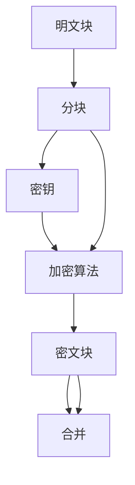

                 

# 《网络安全的密码算法：信息保护的数学屏障》

> **关键词：密码学、加密算法、哈希函数、数字签名、对称加密、非对称加密**
> 
> **摘要：本文将深入探讨密码算法在网络安全中的重要性，包括其基础理论、常用加密算法及其安全性分析，旨在为读者提供一个全面理解密码算法的视角。**

---

## 目录

1. **密码学的起源与演变**
    1.1 密码学的定义与分类
    1.2 古典密码学方法介绍
    1.3 现代密码学的基础
2. **密码学的基本概念**
    2.1 明文、密文与加密算法
    2.2 密钥管理的重要性
    2.3 对称加密与非对称加密的区别
3. **哈希函数**
    3.1 哈希函数的基本原理
    3.2 哈希函数的应用场景
    3.3 常见的哈希函数介绍
4. **数字签名**
    4.1 数字签名的概念
    4.2 数字签名的实现原理
    4.3 常见的数字签名算法
5. **对称加密算法概述**
    5.1 对称加密算法的定义与特点
    5.2 对称加密算法的安全性分析
    5.3 对称加密算法的分类
6. **DES与3DES**
    6.1 DES算法的原理与结构
    6.2 DES算法的安全性分析
    6.3 3DES算法的改进与优化
7. **AES算法**
    7.1 AES算法的原理与结构
    7.2 AES算法的优缺点分析
    7.3 AES算法的应用场景
8. **分组密码与流密码**
    8.1 分组密码的工作原理
    8.2 流密码的工作原理
    8.3 分组密码与流密码的比较
9. **非对称加密算法概述**
    9.1 非对称加密算法的定义与特点
    9.2 非对称加密算法的安全性分析
    9.3 非对称加密算法的分类
10. **RSA算法**
    10.1 RSA算法的原理与结构
    10.2 RSA算法的安全性分析
    10.3 RSA算法的应用实例
11. **ECC算法**
    11.1 ECC算法的原理与结构
    11.2 ECC算法的安全性分析
    11.3 ECC算法的应用前景
12. **公钥密码学在实践中的应用**
    12.1 电子邮件加密
    12.2 安全通信协议
    12.3 安全电子交易
13. **密码算法的安全攻击与防护**
    13.1 密码分析的基本方法
    13.2 常见密码攻击类型
    13.3 密码算法的抗攻击能力
14. **密码算法的安全防护策略**
    14.1 密钥管理策略
    14.2 密码算法的更新与改进
    14.3 安全软件与硬件的部署
15. **未来密码学的发展趋势**
    15.1 密码学的未来发展方向
    15.2 新型密码算法的研究进展
    15.3 密码学在教育、科研和工业中的应用前景
16. **附录**
    16.1 密码算法相关的开源工具和库
    16.2 密码学相关的经典论文和书籍推荐
    16.3 密码学在线课程与教育资源
    16.4 密码学学术会议与期刊介绍

## 引言

在当今信息化的时代，网络安全已成为各行各业关注的热点。网络攻击、数据泄露等问题层出不穷，这使得保护信息的安全变得尤为重要。而密码学作为网络安全的核心技术之一，发挥着至关重要的作用。密码算法通过加密和解密过程，为信息提供了一种安全的传输和处理方式，使得非法者难以解读和篡改数据。

本文将从密码学的基础理论出发，逐步深入探讨常用的加密算法、哈希函数、数字签名等密码技术，并分析其安全性及实际应用。通过本文的阅读，读者将对密码学有更全面的理解，能够更好地应对网络安全挑战。

接下来，我们将首先回顾密码学的起源与演变，了解古典密码学与近代密码学的发展历程及其对现代密码学的影响。

---

### 第一部分：密码学基础

## 第1章：密码学的起源与演变

### 1.1 密码学的定义与分类

密码学（Cryptology）是研究信息加密与解密的一门学科，旨在保护信息的机密性、完整性和可用性。根据加密方法的不同，密码学可以分为古典密码学和现代密码学。

- **古典密码学**：指在计算机和现代数学出现之前，人们使用的加密方法。古典密码学主要包括以下几种：

  - **替换密码**：将字母表中的每一个字母替换成另一个字母，例如凯撒密码。
  - **转置密码**：重新排列字母的顺序，例如列转置密码。
  - **多表加密**：使用多个不同的加密规则，例如维吉尼亚密码。

- **现代密码学**：在计算机和现代数学的推动下，发展出了更为复杂和强大的加密方法。现代密码学主要分为以下几类：

  - **对称加密算法**：加密和解密使用相同的密钥，如DES、AES。
  - **非对称加密算法**：加密和解密使用不同的密钥，如RSA、ECC。
  - **哈希函数**：将任意长度的输入数据映射为固定长度的输出数据，如SHA-256。
  - **数字签名**：确保信息完整性和真实性，如RSA签名、ECC签名。

### 1.2 古典密码学方法介绍

古典密码学的方法虽然简单，但在一定程度上能够满足信息保护的需求。以下是一些常见的古典密码学方法：

- **凯撒密码**：将字母表中的每个字母向后移动3位（或向前移动3位），例如'A'变成'D'，'Z'变成'C'。

    ```mermaid
    flowchart TD
      A[明文字母] --> B[移动3位] --> C[密文字母]
    ```

    伪代码实现：

    ```python
    def caesar_cipher(plaintext, shift):
        ciphertext = ""
        for char in plaintext:
            if char.isalpha():
                offset = 65 if char.isupper() else 97
                ciphertext += chr((ord(char) + shift - offset) % 26 + offset)
            else:
                ciphertext += char
        return ciphertext
    ```

- **维吉尼亚密码**：使用多个凯撒密码，每个字母的加密方式取决于其位置和关键字母。

    ```mermaid
    flowchart TD
      A[明文字母] --> B[关键字母] --> C[位移值] --> D[密文字母]
    ```

    伪代码实现：

    ```python
    def vigenere_cipher(plaintext, keyword):
        ciphertext = ""
        keyword = keyword.upper()
        for i, char in enumerate(plaintext):
            if char.isalpha():
                shift = ord(keyword[i % len(keyword)]) - 65
                offset = 65 if char.isupper() else 97
                ciphertext += chr((ord(char) + shift - offset) % 26 + offset)
            else:
                ciphertext += char
        return ciphertext
    ```

### 1.3 现代密码学的基础

现代密码学的发展得益于计算机科学和数学的进步，其核心思想是通过复杂的数学模型和算法来实现信息的加密和解密。以下是一些现代密码学的基础概念：

- **加密算法**：将明文转换为密文的算法。加密算法可以分为对称加密和非对称加密。

- **解密算法**：将密文转换为明文的算法。解密算法与加密算法相对应。

- **密钥**：用于加密和解密的关键信息。对称加密使用相同的密钥，而非对称加密使用一对密钥。

- **哈希函数**：将任意长度的输入数据映射为固定长度的输出数据。哈希函数具有单向性和抗碰撞性。

- **数字签名**：确保信息完整性和真实性的技术。数字签名使用公钥加密和私钥解密。

在接下来的章节中，我们将详细介绍现代密码学的各种算法和技术，以及它们在网络安全中的应用。

---

### 第一部分：密码学基础

## 第2章：密码学的基本概念

密码学作为网络安全的核心技术，其基本概念至关重要。在这一章中，我们将深入探讨明文、密文、加密算法、密钥管理以及对称加密与非对称加密的区别。

### 2.1 明文、密文与加密算法

- **明文**：未经过加密处理的文本数据，也称为原始数据。明文是我们需要保护的信息。

- **密文**：经过加密处理后的文本数据，也称为密文。密文是保护信息的一种形式。

- **加密算法**：加密算法是将明文转换为密文的规则和方法。加密算法的目的是使密文难以被未经授权者解密。

  加密算法可以分为以下几种类型：

  - **对称加密算法**：加密和解密使用相同的密钥。对称加密算法具有速度快、效率高的特点，但密钥的传输和管理是难点。
  - **非对称加密算法**：加密和解密使用不同的密钥。非对称加密算法解决了密钥传输的问题，但加密和解密速度相对较慢。
  - **哈希函数**：将输入数据映射为固定长度的输出值。哈希函数常用于数字签名和密码学认证。
  - **数字签名**：用于验证信息的完整性和真实性的技术。数字签名使用私钥加密和公钥解密。

### 2.2 密钥管理的重要性

密钥是加密和解密的核心，密钥管理的好坏直接影响到密码系统的安全性。以下是一些密钥管理的基本原则：

- **密钥生成**：密钥应随机生成，避免使用可预测的密钥。
- **密钥存储**：密钥应存储在安全的地方，避免被未经授权者访问。
- **密钥传输**：在传输过程中，应使用安全的传输方式，如非对称加密。
- **密钥更新**：定期更换密钥，以防止密钥泄露。
- **密钥销毁**：不再使用时，应确保密钥被安全销毁。

### 2.3 对称加密与非对称加密的区别

对称加密和非对称加密是两种主要的加密方式，它们在密钥使用、加密速度、安全性和应用场景等方面存在显著差异：

- **密钥使用**：

  - **对称加密**：加密和解密使用相同的密钥。这意味着密钥需要安全传输，否则可能被攻击者截获。
  - **非对称加密**：加密和解密使用不同的密钥，即公钥和私钥。公钥可以公开，私钥需要保密。

- **加密速度**：

  - **对称加密**：加密和解密速度快，适合大量数据的加密。
  - **非对称加密**：加密和解密速度慢，但安全性更高，适合密钥交换和数字签名。

- **安全性**：

  - **对称加密**：安全性取决于密钥的强度，一旦密钥泄露，整个系统将面临风险。
  - **非对称加密**：安全性相对更高，即使公钥泄露，私钥仍能保证系统的安全性。

- **应用场景**：

  - **对称加密**：适合数据加密传输，如文件加密、VPN通信等。
  - **非对称加密**：适合密钥交换、数字签名和加密认证等。

在接下来的章节中，我们将详细介绍哈希函数的基本原理、应用场景和常见哈希函数，以及数字签名的概念、实现原理和常见算法。

---

### 第一部分：密码学基础

## 第3章：哈希函数

哈希函数（Hash Function）是密码学中的重要组成部分，广泛应用于数据完整性验证、数字签名、密码学哈希加密等领域。本章将详细介绍哈希函数的基本原理、应用场景以及常见的哈希函数。

### 3.1 哈希函数的基本原理

哈希函数是一种将任意长度的输入（称为“消息”）转换成固定长度的输出（称为“哈希值”）的函数。哈希函数具有以下特点：

- **单向性**：给定输入，可以快速计算得到哈希值，但无法通过哈希值反推出原始输入。这意味着哈希函数是单向的，即“不可逆”。
- **抗碰撞性**：不同的输入产生相同哈希值的概率极低，即“哈希冲突”几乎不可能发生。抗碰撞性确保了哈希函数的可靠性和安全性。
- **固定长度**：无论输入数据的长度如何，哈希函数的输出长度都是固定的。这有助于简化数据处理和存储。

哈希函数的工作原理通常包括以下步骤：

1. **输入处理**：将输入数据（如字符串、文件等）进行处理，通常通过填充、分割等操作使其长度适合哈希函数的要求。
2. **压缩**：将处理后的输入数据压缩为固定长度的输出，即哈希值。
3. **输出**：将哈希值作为最终结果输出。

以下是一个简单的哈希函数示例，采用异或（XOR）操作：

```python
def simple_hash(input_data):
    hash_value = 0
    for char in input_data:
        hash_value ^= ord(char)
    return hash_value
```

尽管这个简单的哈希函数在处理小规模数据时具有高效性，但它缺乏抗碰撞性，不适用于安全性要求较高的应用。

### 3.2 哈希函数的应用场景

哈希函数在密码学和实际应用中具有广泛的应用，以下是一些常见场景：

- **数据完整性验证**：通过计算数据的哈希值，可以验证数据的完整性。如果哈希值与预期值不匹配，则数据可能已被篡改。
- **数字签名**：在数字签名中，哈希函数用于将原始数据转换为固定长度的哈希值，然后使用私钥对其加密，生成签名。接收方可以使用公钥验证签名的真实性。
- **密码学哈希加密**：哈希函数可用于生成密码的哈希值，然后将其存储在数据库中，以代替明文密码。这样即使数据库被泄露，攻击者也无法轻易获取用户密码。
- **分布式系统**：哈希函数可用于数据分布和一致性检查。例如，在分布式数据库中，可以使用哈希函数将数据分配到不同的节点上，并确保每个节点的数据一致性。

### 3.3 常见的哈希函数介绍

现代密码学中，常用的哈希函数包括MD5、SHA-1、SHA-256等。以下是对这些哈希函数的简要介绍：

- **MD5**：MD5是一种广泛使用的哈希函数，生成128位的哈希值。然而，MD5存在碰撞问题，不再适用于安全性要求较高的场景。
- **SHA-1**：SHA-1是MD5的升级版，生成160位的哈希值。与MD5类似，SHA-1也存在碰撞问题，并被建议弃用。
- **SHA-256**：SHA-256是SHA-1的改进版本，生成256位的哈希值。SHA-256具有更高的安全性和可靠性，是当前最常用的哈希函数之一。

以下是一个使用Python实现的SHA-256哈希函数示例：

```python
import hashlib

def sha256_hash(input_data):
    hash_object = hashlib.sha256(input_data.encode('utf-8'))
    hex_dig = hash_object.hexdigest()
    return hex_dig

# 示例
data = "Hello, World!"
hash_value = sha256_hash(data)
print("SHA-256 Hash Value:", hash_value)
```

通过以上示例，可以看到SHA-256哈希函数在生成固定长度哈希值方面的强大功能。尽管哈希函数在处理过程中会消耗一定的时间和计算资源，但其在安全性、可靠性和数据处理上的重要性不容忽视。

在下一章中，我们将探讨数字签名的概念、实现原理以及常见的数字签名算法。

---

### 第一部分：密码学基础

## 第4章：数字签名

数字签名是密码学中的重要技术，用于确保信息传输过程中的数据完整性和真实性。本章将深入探讨数字签名的概念、实现原理以及常见的数字签名算法。

### 4.1 数字签名的概念

数字签名（Digital Signature）是一种基于公钥加密技术的机制，用于验证数字文档或消息的完整性、真实性和不可抵赖性。数字签名与传统签名类似，但使用的是密码学算法和密钥对，而不是物理签名。

- **数字签名**：使用发送者的私钥对数据进行加密，生成一个唯一的签名。接收者可以使用发送者的公钥验证签名的有效性。
- **公钥加密**：数字签名使用公钥加密算法，如RSA或ECC。发送者使用私钥生成签名，接收者使用公钥验证签名。
- **完整性验证**：数字签名确保数据在传输过程中未被篡改。接收者可以通过验证签名来确认数据的完整性。
- **真实性验证**：数字签名确保数据是由合法的发送者发送的。接收者可以通过验证签名来确认发送者的身份。

### 4.2 数字签名的实现原理

数字签名的实现原理主要包括以下步骤：

1. **消息摘要**：首先，对需要签名的数据进行哈希处理，生成一个固定长度的消息摘要（也称为消息指纹）。哈希函数如SHA-256常用于生成消息摘要。
   
   ```mermaid
   graph TD
       A[明文] --> B[哈希函数] --> C[消息摘要]
   ```

2. **签名生成**：发送者使用私钥对消息摘要进行加密，生成数字签名。私钥是唯一的，与公钥相对应，只有发送者拥有。

   ```mermaid
   graph TD
       C[消息摘要] --> D[私钥加密] --> E[数字签名]
   ```

3. **签名验证**：接收者使用发送者的公钥对数字签名进行解密，恢复消息摘要。然后，接收者使用相同的哈希函数对收到的数据进行哈希处理，比较解密后的消息摘要和计算出的消息摘要。

   ```mermaid
   graph TD
       F[接收数据] --> G[哈希函数] --> H[消息摘要]
       E[数字签名] --> I[公钥解密] --> J[消息摘要']
       K[比较]((比较结果))
       H --> K
       J --> K
   ```

### 4.3 常见的数字签名算法

常见的数字签名算法包括RSA、ECC等。以下是对这些算法的简要介绍：

- **RSA签名算法**：RSA是一种基于大数分解难题的公钥加密算法。RSA签名算法包括以下步骤：

  1. **密钥生成**：生成一对公钥和私钥，公钥用于验证签名，私钥用于生成签名。
  2. **消息摘要**：对需要签名的数据生成消息摘要。
  3. **签名生成**：使用私钥对消息摘要进行加密，生成数字签名。
  4. **签名验证**：使用公钥对数字签名进行解密，比较解密后的消息摘要和原始消息摘要。

  RSA签名算法的优点是安全性高，但计算复杂度较高。

  ```python
  import rsa
  
  # 密钥生成
  (public_key, private_key) = rsa.newkeys(1024)
  
  # 消息摘要
  message = "Hello, World!"
  message_hash = rsa.compute_hash(message.encode('utf-8'), 'SHA-256')
  
  # 签名生成
  signature = rsa.sign(message_hash, private_key, 'SHA-256')
  
  # 签名验证
  is_valid = rsa.verify(message_hash, signature, public_key)
  ```

- **ECC签名算法**：ECC（椭圆曲线密码学）是一种基于椭圆曲线离散对数问题的公钥加密算法。ECC签名算法包括以下步骤：

  1. **密钥生成**：生成一对公钥和私钥，公钥用于验证签名，私钥用于生成签名。
  2. **消息摘要**：对需要签名的数据生成消息摘要。
  3. **签名生成**：使用私钥对消息摘要进行加密，生成数字签名。
  4. **签名验证**：使用公钥对数字签名进行解密，比较解密后的消息摘要和原始消息摘要。

  ECC签名算法的优点是安全性更高，计算复杂度更低。

  ```python
  from ecdsa import SigningKey, NIST256p, VerifyingKey
  
  # 密钥生成
  private_key = SigningKey.generate(curve=NIST256p)
  public_key = private_key.get_verifying_key()
  
  # 消息摘要
  message = "Hello, World!"
  message_hash = hashlib.sha256(message.encode('utf-8')).hexdigest()
  
  # 签名生成
  signature = private_key.sign(message_hash.encode('utf-8'))
  
  # 签名验证
  is_valid = public_key.verify(signature, message_hash.encode('utf-8'))
  ```

通过以上示例，可以看到数字签名算法在实现数据完整性验证和真实性验证方面的强大功能。数字签名技术不仅提高了数据传输的安全性，还为数字世界中的身份认证和信任建立提供了可靠的保障。

在下一章中，我们将介绍对称加密算法的基本概念、安全性分析及其分类。

---

### 第一部分：密码学基础

## 第5章：对称加密算法概述

对称加密算法（Symmetric Encryption Algorithm）是密码学中的一种重要加密方式，其加密和解密过程使用相同的密钥。本章将深入探讨对称加密算法的基本概念、安全性分析及其分类。

### 5.1 对称加密算法的定义与特点

对称加密算法，顾名思义，加密和解密使用相同的密钥。这种加密方式的核心思想是通过复杂的加密算法，使得只有持有相同密钥的接收者能够解密并读取原始数据。对称加密算法具有以下特点：

- **密钥共享**：由于加密和解密使用相同的密钥，密钥的生成、存储和传输是安全的关键。密钥需要保密，否则加密信息将暴露于风险之中。
- **高效性**：对称加密算法通常具有较快的加密和解密速度，适合处理大量数据。常见的对称加密算法如DES、3DES和AES，都设计为在保证安全性的同时，具有较高的处理效率。
- **对称性**：对称加密算法的加密和解密过程是可逆的，即加密过程可以完全逆转为解密过程。这意味着只要拥有正确的密钥，就可以从密文恢复出原始明文。

### 5.2 对称加密算法的安全性分析

对称加密算法的安全性主要依赖于密钥的保密性。以下是对称加密算法安全性的几个关键方面：

- **密钥强度**：密钥的长度和复杂性直接影响到算法的安全性。通常，密钥越长、复杂性越高，破解所需的计算资源就越多，从而提高了安全性。
- **密钥泄露**：一旦密钥泄露，整个加密系统将面临巨大风险。因此，密钥的生成、存储和传输需要严格的保护措施，确保密钥不被非法获取。
- **密码分析**：攻击者可能会通过各种密码分析方法尝试破解加密信息。常见的密码分析方法包括暴力破解、字典攻击、中间人攻击等。为了提高安全性，对称加密算法的设计需要考虑到抵抗这些攻击的方法。

### 5.3 对称加密算法的分类

对称加密算法可以根据加密方法的不同，分为以下几种类型：

- **分组加密算法**：分组加密算法将明文分成固定长度的块，然后对每个块进行加密。常见的分组加密算法包括DES、3DES和AES。

  - **DES（数据加密标准）**：DES是一种经典的分组加密算法，使用56位密钥，将64位的明文块加密成64位的密文块。DES的安全性受到密钥长度限制，容易被暴力破解。
  - **3DES（三重DES）**：3DES是对DES的改进，使用三个不同的密钥对明文进行三次加密。3DES的安全性得到了显著提升，但由于计算复杂度较高，应用中逐渐被AES取代。
  - **AES（高级加密标准）**：AES是当前最流行的分组加密算法，支持128、192和256位密钥长度。AES具有更高的安全性、效率和灵活性，被广泛用于各种安全协议和应用程序中。

- **流加密算法**：流加密算法将明文流逐一加密，加密过程依赖于密钥和初始化向量。常见的流加密算法包括RC4和ChaCha20。

  - **RC4（加密流4）**：RC4是一种高速的流加密算法，广泛应用于Wi-Fi和TLS等协议中。然而，RC4在2001年被发现存在安全性漏洞，目前逐渐被其他算法取代。
  - **ChaCha20**：ChaCha20是一种新的流加密算法，具有高安全性和高性能。ChaCha20与Poly1305一起，被选为IPSec和TLS的新标准。

在对称加密算法的分类中，分组加密算法由于具有较高的安全性，得到了广泛应用。分组加密算法的设计要求包括块大小、密钥长度、加密算法的复杂性和抗攻击能力。以下是一个AES加密的Mermaid流程图：



通过对称加密算法的安全性和分类的深入理解，读者可以更好地选择合适的加密算法来保护敏感信息。在下一章中，我们将详细介绍DES和3DES这两种对称加密算法。

---

### 第一部分：密码学基础

## 第6章：DES与3DES

数据加密标准（Data Encryption Standard，DES）是一种广泛使用的对称加密算法，它于1977年由美国国家标准局（NBS）发布。DES算法使用56位的密钥，对64位的明文块进行加密。尽管DES算法在早期得到了广泛应用，但其密钥长度较短，逐渐暴露出安全性问题。为了提高安全性，3DES（也称为Triple DES）被提出，它通过三次应用DES算法来增强安全性。本章将详细介绍DES算法的原理与结构、安全性分析以及3DES算法的改进与优化。

### 6.1 DES算法的原理与结构

DES算法的工作流程可以分为三个阶段：初始置换、加密循环和最终置换。

1. **初始置换（IP）**：将64位的明文输入进行初始置换，产生64位的中间结果。
   
   ```mermaid
   graph TD
     A[明文] --> B[初始置换]
     B --> C[中间结果]
   ```

2. **加密循环**：加密循环是DES算法的核心，包括16轮相同的加密操作。每轮操作包括扩展置换、密钥生成、替换和置换。

   - **扩展置换（E）**：将上一轮的32位中间结果扩展为48位。
   - **密钥生成**：从主密钥中生成16个48位的子密钥，每个子密钥用于一轮加密。
   - **替换（S-Box）**：使用S-Box对48位数据进行替换操作，每个S-Box将6位输入映射到4位输出。
   - **置换（P）**：对替换后的数据进行再次置换。

   ```mermaid
   graph TD
     D[扩展置换] --> E[密钥生成]
     E --> F[替换]
     F --> G[置换]
   ```

3. **最终置换（FP）**：加密循环结束后，将最后的32位中间结果进行最终置换，生成64位的密文。

   ```mermaid
   graph TD
     G --> H[最终置换]
     H --> I[密文]
   ```

DES算法的伪代码实现如下：

```python
def des_encrypt(plaintext, key):
    # 初始置换
    plaintext = initial_permutation(plaintext)
    
    # 16轮加密循环
    for i in range(16):
        # 扩展置换
        expanded = expand(plaintext, key[i])
        
        # 替换和置换
        plaintext = substitution(expanded) ^ key[i]
        
        # 最终置换
    ciphertext = final_permutation(plaintext)
    
    return ciphertext
```

### 6.2 DES算法的安全性分析

尽管DES算法在发布时被认为是安全的，但随着计算能力的提升，其56位密钥长度逐渐暴露出安全性问题。以下是对DES算法安全性的分析：

- **密钥长度**：DES使用56位密钥，尽管在早期被认为是足够安全，但随着计算能力的提升，暴力破解DES密钥变得可行。目前，56位密钥的暴力破解时间已经缩短到几天甚至几小时。
- **弱密钥**：DES算法存在一些弱密钥和半弱密钥，这些密钥在加密和解密过程中容易受到攻击。
- **中间人攻击**：在中间人攻击中，攻击者可以截获并修改加密通信，但不会暴露密钥。

为了提高DES算法的安全性，3DES算法被提出。3DES通过三次应用DES算法来增强安全性，可以采用以下三种模式：

1. **3DES-EDE（加密-解密-加密）**：首先使用DES算法加密，然后解密，最后再次加密。
2. **3DES-EEE（加密-加密-加密）**：三次连续使用DES算法进行加密。
3. **3DES-EDD（解密-加密-解密）**：首先使用DES算法解密，然后加密，最后再次解密。

### 6.3 3DES算法的改进与优化

3DES算法在安全性方面得到了显著提升，但同时也引入了一些计算复杂度。以下是对3DES算法的改进和优化：

- **密钥长度**：3DES使用112位或168位密钥，大大提高了密钥长度，降低了被暴力破解的风险。
- **算法模式**：不同的3DES模式具有不同的安全性，但3DES-EDE被认为是最安全且计算效率较高的模式。
- **硬件实现**：随着硬件技术的发展，3DES算法的加密速度得到了显著提升，使其在许多应用场景中仍然具有竞争力。

3DES算法的伪代码实现如下：

```python
def triple_des_encrypt(plaintext, key):
    # 分割密钥
    keys = split_key(key)
    
    # 第一次加密
    ciphertext = des_encrypt(plaintext, keys[0])
    
    # 第二次加密
    ciphertext = des_decrypt(ciphertext, keys[1])
    
    # 第三次加密
    ciphertext = des_encrypt(ciphertext, keys[2])
    
    return ciphertext
```

通过以上对DES和3DES算法的详细分析，我们可以看到对称加密算法在密码学中的重要性。尽管3DES提供了较高的安全性，但随着密码学技术的发展，新的加密算法如AES逐渐成为主流。在下一章中，我们将介绍AES算法的原理与结构。

---

### 第一部分：密码学基础

## 第7章：AES算法

高级加密标准（Advanced Encryption Standard，AES）是由美国国家标准与技术研究院（NIST）于2001年发布的一种对称加密算法，广泛应用于政府、企业和个人等领域。AES以其高性能、高效能和强安全性，成为了当前最流行的加密算法之一。本章将详细介绍AES算法的原理与结构，以及其优缺点和应用场景。

### 7.1 AES算法的原理与结构

AES算法基于线性代数和分组密码原理，其核心思想是通过一系列的替换、置换和混淆操作，使得密文与明文之间没有直接的关系，从而提高加密的安全性。AES算法的工作流程可以分为以下几个阶段：

1. **密钥扩展**：根据用户输入的128位、192位或256位密钥，AES算法会生成一系列的子密钥。这些子密钥将用于每一轮的加密操作。
   
   ```mermaid
   graph TD
     A[密钥] --> B[密钥扩展]
     B --> C{子密钥1, 子密钥2, ..., 子密钥Nb}
   ```

2. **初始置换**：初始置换（Initial Permutation，IP）将128位的明文分为四块，每块32位。初始置换是一个固定的置换表操作，将明文块转换为状态矩阵。
   
   ```mermaid
   graph TD
     D[明文块] --> E[初始置换]
     E --> F[状态矩阵]
   ```

3. **加密循环**：加密循环是AES算法的核心，包括10轮、12轮或14轮相同的加密操作。每轮操作包括四个步骤：字节替换（SubBytes）、行置换（ShiftRows）、列混淆（MixColumns）和轮密钥加（AddRoundKey）。
   
   - **字节替换（SubBytes）**：使用S-Box对状态矩阵中的每个字节进行替换操作，每个字节被映射到一个新的字节。
     
     ```mermaid
     graph TD
       F --> G{SubBytes}
       G --> H[状态矩阵']
     ```

   - **行置换（ShiftRows）**：对状态矩阵的行进行循环移位操作，第一行不变，第二行向左循环一次，第三行向左循环两次，第四行向左循环三次。
     
     ```mermaid
     graph TD
       H --> I{ShiftRows}
       I --> J[状态矩阵'']
     ```

   - **列混淆（MixColumns）**：对状态矩阵的列进行混淆操作，每个列作为一个4位多项式进行线性变换。
     
     ```mermaid
     graph TD
       J --> K{MixColumns}
       K --> L[状态矩阵'']
     ```

   - **轮密钥加（AddRoundKey）**：将状态矩阵与轮密钥进行异或操作，轮密钥由密钥扩展生成。
     
     ```mermaid
     graph TD
       L --> M{AddRoundKey}
       M --> N[状态矩阵'']
     ```

4. **最终置换**：最终置换（Final Permutation，FP）是初始置换的逆操作，将状态矩阵转换为128位的密文。
   
   ```mermaid
   graph TD
     N --> O[最终置换]
     O --> P[密文]
   ```

AES算法的伪代码实现如下：

```python
def aes_encrypt(plaintext, key):
    # 密钥扩展
    keys = key Expansion(key)
    
    # 初始置换
    state = initial_permutation(plaintext)
    
    # 加密循环
    for i in range(10, 14):
        state = subbytes(state)
        state = shift_rows(state)
        state = mix_columns(state)
        state = add_round_key(state, keys[i])
    
    # 最终置换
    ciphertext = final_permutation(state)
    
    return ciphertext
```

### 7.2 AES算法的优缺点分析

AES算法具有以下优点：

- **高安全性**：AES算法经过多年的研究和测试，被认为是目前最安全的加密算法之一。其基于的数学难题（线性代数）具有很高的破解难度。
- **高性能**：AES算法具有高效的加密和解密速度，适用于处理大量数据的应用场景。随着硬件技术的发展，AES算法的执行速度不断提高。
- **灵活性**：AES算法支持128位、192位和256位密钥长度，能够适应不同安全需求的应用场景。
- **广泛支持**：AES算法被广泛支持，许多操作系统、库和硬件设备都提供了AES加密的实现。

AES算法也存在以下缺点：

- **计算资源消耗**：AES算法的加密和解密过程相对复杂，需要较多的计算资源和内存。对于计算资源有限的设备，AES算法可能不是最佳选择。
- **密钥管理**：AES算法的密钥管理需要严格的保护措施，确保密钥不被非法获取。密钥的生成、存储和传输需要额外的安全措施。

### 7.3 AES算法的应用场景

AES算法在许多应用场景中得到了广泛应用，以下是一些典型的应用场景：

- **文件加密**：AES算法广泛应用于文件加密，保护文件不被未授权访问。
- **数据传输**：AES算法用于保护网络传输中的数据，如VPN、TLS等协议。
- **电子支付**：AES算法用于加密电子支付中的敏感信息，如信用卡号码和密码。
- **政府和企业安全**：AES算法被广泛应用于政府和企业安全领域，保护敏感数据和通信。

在下一章中，我们将探讨分组密码和流密码的工作原理及其比较。

---

### 第一部分：密码学基础

## 第8章：分组密码与流密码

在密码学中，分组密码（Block Ciphers）和流密码（Stream Ciphers）是两种基本的加密方式。它们在加密方法、工作原理和安全性方面存在显著差异。本章将详细探讨分组密码和流密码的工作原理，并比较它们的特点和适用场景。

### 8.1 分组密码的工作原理

分组密码是一种将明文分成固定大小的块（通常为64位或128位），然后对每个块进行加密的加密方式。分组密码的核心思想是将明文块与密钥结合，通过一系列复杂的替换和置换操作，生成对应的密文块。以下是一个分组密码的基本工作流程：

1. **块分割**：将明文输入分割成固定大小的块。如果明文长度不足，可以使用填充算法进行填充，使其成为块大小的整数倍。

   ```mermaid
   graph TD
     A[明文] --> B{分割块}
     B --> C{块1, 块2, ..., 块n}
   ```

2. **加密操作**：对每个明文块使用加密算法进行加密，生成对应的密文块。加密算法通常包括以下步骤：

   - **初始化向量（IV）**：为每个块生成一个唯一的初始化向量，用于初始加密操作。IV可以是随机生成的，也可以是固定的值。
   - **加密函数**：对每个明文块使用加密算法和密钥进行加密操作，生成对应的密文块。常见的加密算法包括DES、3DES、AES等。

   ```mermaid
   graph TD
     C --> D{加密函数}
     D --> E[密文块1, 密文块2, ..., 密文块n]
   ```

3. **密文合并**：将加密后的密文块合并成完整的密文输出。

   ```mermaid
   graph TD
     E --> F[密文]
   ```

分组密码的优点包括：

- **块级加密**：每个块独立加密，使得加密过程具有更高的安全性，即使一个块被篡改，也不会影响到其他块的加密结果。
- **加密速度**：分组密码的加密和解密速度相对较快，适合处理大量数据。
- **可变性**：通过使用不同的初始化向量（IV），可以实现相同的密钥产生不同的密文，增加了加密算法的多样性。

### 8.2 流密码的工作原理

流密码是一种将明文流逐位或逐字节进行加密的加密方式。流密码的核心思想是通过伪随机数生成器（PRNG）和加密算法，将明文与密钥结合，生成密文。流密码的工作流程如下：

1. **密钥初始化**：初始化伪随机数生成器，使用密钥和初始向量（IV）生成伪随机数序列。

   ```mermaid
   graph TD
     A[密钥, IV] --> B{PRNG}
     B --> C[伪随机数序列]
   ```

2. **加密操作**：将明文流与伪随机数序列进行逐位或逐字节异或操作，生成对应的密文流。

   ```mermaid
   graph TD
     D[明文流] --> E{异或操作}
     E --> F[密文流]
   ```

3. **密文合并**：将加密后的密文流合并成完整的密文输出。

   ```mermaid
   graph TD
     F --> G[密文]
   ```

流密码的优点包括：

- **速度和效率**：流密码的加密和解密速度相对较快，适合实时通信和流媒体传输等场景。
- **简单性**：流密码的加密和解密过程相对简单，易于实现和部署。
- **适应性**：流密码可以适用于不同的数据类型和长度，具有较好的适应性。

### 8.3 分组密码与流密码的比较

分组密码和流密码在加密方法、工作原理和安全性方面存在显著差异，以下是比较：

- **加密方式**：分组密码将明文分割成块进行加密，而流密码将明文流逐位或逐字节进行加密。
- **加密速度**：分组密码的加密和解密速度相对较快，适合处理大量数据；流密码的加密和解密速度相对较慢，但适合实时通信和流媒体传输。
- **安全性**：分组密码的块级加密方式使得每个块独立加密，具有更高的安全性；流密码的逐位加密方式可能受到某些攻击的影响，如中间人攻击和流量分析。
- **应用场景**：分组密码适用于文件加密、数据传输等场景；流密码适用于实时通信、流媒体传输等场景。

综上所述，分组密码和流密码各有优缺点，适用于不同的应用场景。在实际应用中，可以根据具体需求选择合适的加密方式。

在下一章中，我们将探讨非对称加密算法的基本概念、安全性分析及其分类。

---

### 第一部分：密码学基础

## 第9章：非对称加密算法概述

非对称加密算法（Asymmetric Encryption Algorithm）是密码学中的一种重要加密方式，其加密和解密过程使用不同的密钥。这种加密方式具有许多独特的优势，包括密钥安全传输、更高的安全性和灵活性。本章将深入探讨非对称加密算法的基本概念、安全性分析及其分类。

### 9.1 非对称加密算法的定义与特点

非对称加密算法，也称为公钥加密算法，其核心思想是使用一对密钥：公钥和私钥。公钥可以公开，私钥需要保密。加密过程使用公钥，解密过程使用私钥。以下是公钥加密算法的主要特点：

- **密钥对**：非对称加密算法使用一对密钥，即公钥和私钥。公钥用于加密，私钥用于解密。
- **加密速度**：非对称加密算法的加密速度相对较慢，但解密速度较快。这是由于加密过程中需要执行复杂的数学计算，而解密过程主要涉及简单的操作。
- **安全性**：非对称加密算法具有更高的安全性，因为私钥的保密性是整个加密系统的关键。即使公钥泄露，攻击者也无法解密密文。
- **灵活性和多样性**：非对称加密算法支持多种加密模式和算法，可以根据具体需求选择合适的加密方式。

### 9.2 非对称加密算法的安全性分析

非对称加密算法的安全性主要依赖于以下两个方面：

- **密钥长度**：密钥长度直接影响到加密算法的安全性。通常，密钥长度越长，算法的安全性越高。常见的非对称加密算法如RSA和ECC，其密钥长度分别为1024位、2048位和4096位。
- **数学难题**：非对称加密算法的安全性依赖于一些复杂的数学难题，如大数分解问题和椭圆曲线离散对数问题。这些难题的难度使得攻击者无法在可接受的时间内破解加密信息。

### 9.3 非对称加密算法的分类

非对称加密算法可以根据加密方法的不同，分为以下几种类型：

- **RSA算法**：RSA（Rivest-Shamir-Adleman）是一种广泛使用的非对称加密算法，基于大数分解难题。RSA算法具有简单易懂、实现容易等优点，但其加密和解密速度相对较慢。

  - **密钥生成**：生成一对公钥和私钥，公钥用于加密，私钥用于解密。
  - **加密过程**：使用公钥和明文进行加密，生成密文。
  - **解密过程**：使用私钥和密文进行解密，恢复出明文。

  RSA算法的伪代码实现如下：

  ```python
  import random

  def rsa_encrypt(plaintext, public_key):
      n, e = public_key
      ciphertext = pow(plaintext, e, n)
      return ciphertext

  def rsa_decrypt(ciphertext, private_key):
      n, d = private_key
      plaintext = pow(ciphertext, d, n)
      return plaintext
  ```

- **ECC算法**：椭圆曲线密码学（Elliptic Curve Cryptography，ECC）是一种基于椭圆曲线离散对数问题的非对称加密算法。ECC在相同的密钥长度下，具有更高的安全性，其加密和解密速度也更快。

  - **密钥生成**：生成一对公钥和私钥，公钥用于加密，私钥用于解密。
  - **加密过程**：使用公钥和明文进行加密，生成密文。
  - **解密过程**：使用私钥和密文进行解密，恢复出明文。

  ECC算法的伪代码实现如下：

  ```python
  from ecdsa import SigningKey, NIST256p, VerifyingKey

  def ecdsa_encrypt(plaintext, public_key):
      key = SigningKey.from_public_key(public_key)
      signature = key.sign(plaintext.encode('utf-8'))
      return signature

  def ecdsa_decrypt(ciphertext, private_key):
      key = VerifyingKey.from_public_key(private_key)
      is_valid = key.verify(ciphertext, b'Hello, World!')
      return is_valid
  ```

通过以上对非对称加密算法的介绍，我们可以看到这种加密方式在密钥安全传输、数据加密和数字签名等方面的优势。在下一章中，我们将详细探讨RSA算法的原理与结构、安全性分析以及应用实例。

---

### 第一部分：密码学基础

## 第10章：RSA算法

RSA（Rivest-Shamir-Adleman）算法是一种著名的非对称加密算法，它基于大数分解难题。RSA算法在数据加密、数字签名和密钥交换等方面具有广泛的应用。本章将详细探讨RSA算法的原理与结构、安全性分析以及应用实例。

### 10.1 RSA算法的原理与结构

RSA算法的核心思想是利用两个非常大的质数p和q的乘积n，以及相关的加密指数e和解密指数d，实现加密和解密过程。以下是RSA算法的基本步骤：

1. **密钥生成**：

   - **选择两个大质数p和q**：通常p和q的长度分别为1024位、2048位或4096位，以确保密钥的安全性。
   - **计算n**：n = p * q。
   - **计算欧拉函数φ(n)**：φ(n) = (p - 1) * (q - 1)。
   - **选择加密指数e**：e需要满足以下条件：1 < e < φ(n)，且e与φ(n)互质（即它们的最大公约数为1）。
   - **计算解密指数d**：d是e关于φ(n)的模反元素，即d * e ≡ 1 (mod φ(n))。

   RSA算法的密钥生成过程可以用伪代码表示如下：

   ```python
   def rsa_key_gen(p, q):
       n = p * q
       phi_n = (p - 1) * (q - 1)
       
       # 选择加密指数e，确保e与φ(n)互质
       e = random.randrange(2, phi_n)
       while gcd(e, phi_n) != 1:
           e = random.randrange(2, phi_n)
       
       # 计算解密指数d
       d = modinv(e, phi_n)
       
       return (n, e), (n, d)
   ```

2. **加密过程**：

   - **加密**：使用公钥（n, e）和明文m进行加密，密文c = m^e mod n。

   ```python
   def rsa_encrypt(plaintext, public_key):
       n, e = public_key
       ciphertext = pow(plaintext, e, n)
       return ciphertext
   ```

3. **解密过程**：

   - **解密**：使用私钥（n, d）和密文c进行解密，明文m = c^d mod n。

   ```python
   def rsa_decrypt(ciphertext, private_key):
       n, d = private_key
       plaintext = pow(ciphertext, d, n)
       return plaintext
   ```

### 10.2 RSA算法的安全性分析

RSA算法的安全性主要依赖于以下两个方面：

1. **大数分解难题**：RSA算法的安全性基于大数分解难题，即给定两个大质数p和q的乘积n，求解p和q是一个困难的数学问题。如果p和q足够大，攻击者需要大量的计算资源来分解n，这使得RSA算法在理论上具有很高的安全性。

2. **欧拉定理**：RSA算法的安全性还依赖于欧拉定理，即如果a和n互质，则a^φ(n) ≡ 1 (mod n)。RSA算法的加密和解密过程就是基于欧拉定理的。

尽管RSA算法在理论上具有很高的安全性，但它仍面临一些实际的安全威胁：

1. **暴力破解**：随着计算能力的提升，暴力破解RSA密钥的时间越来越短。因此，使用足够大的密钥长度（如2048位或以上）是非常重要的。

2. **侧信道攻击**：侧信道攻击利用了加密过程中的物理信息（如功耗、电磁泄漏等）来破解RSA密钥。这些攻击需要更多的研究和防范措施。

### 10.3 RSA算法的应用实例

RSA算法在许多实际应用中发挥着重要作用，以下是一些常见的应用实例：

1. **数据加密**：RSA算法可用于加密敏感数据，如银行交易、电子邮件和文件传输等。加密后的数据可以在传输过程中保护隐私。

2. **数字签名**：RSA算法可用于生成数字签名，确保信息的完整性和真实性。签名者使用私钥生成签名，接收者使用公钥验证签名。

3. **密钥交换**：RSA算法可用于安全的密钥交换协议，如Diffie-Hellman密钥交换。这可以帮助通信双方在不泄露密钥的情况下建立安全的通信通道。

以下是一个简单的RSA加密和解密的Python实现示例：

```python
from sympy.ntheory import modular_inverse

# 密钥生成
p = 61
q = 53
n = p * q
phi_n = (p - 1) * (q - 1)
e = 17
d = modular_inverse(e, phi_n)

# 加密
plaintext = 10
ciphertext = pow(plaintext, e, n)
print("Ciphertext:", ciphertext)

# 解密
plaintext = pow(ciphertext, d, n)
print("Plaintext:", plaintext)
```

通过以上对RSA算法的详细介绍，我们可以看到RSA算法在数据加密、数字签名和密钥交换等方面的应用。尽管RSA算法面临一些安全挑战，但其在实际应用中的重要性不可忽视。在下一章中，我们将探讨椭圆曲线密码学（ECC）算法的原理与结构、安全性分析以及应用前景。

---

### 第一部分：密码学基础

## 第11章：ECC算法

椭圆曲线密码学（Elliptic Curve Cryptography，ECC）是一种基于椭圆曲线离散对数问题的非对称加密算法。ECC在相同密钥长度下提供了更高的安全性，并具有更快的加密和解密速度。本章将详细探讨ECC算法的原理与结构、安全性分析以及其应用前景。

### 11.1 ECC算法的原理与结构

ECC算法基于椭圆曲线数学中的离散对数问题。椭圆曲线是一个数学对象，其上的点可以通过特定的加法操作进行组合。ECC算法利用椭圆曲线的这种特性来实现加密和解密过程。

#### 密钥生成

1. **选择椭圆曲线**：首先，选择一个椭圆曲线E和一个基点G，使得E上存在足够多的点。
2. **选择私钥**：从E上的点集合中随机选择一个私钥k。
3. **计算公钥**：使用私钥k和基点G，计算公钥Q = k * G。Q是椭圆曲线上的一个点。

   ECC算法的密钥生成可以用以下伪代码表示：

   ```python
   import ec
   from random import randrange

   # 选择椭圆曲线和基点
   curve = ec.P256()  # 使用256位椭圆曲线
   G = curve.G  # 基点

   # 选择私钥
   k = randrange(1, curve.n)  # 从1到n-1随机选择一个私钥

   # 计算公钥
   Q = k * G  # Q是椭圆曲线上的一个点
   ```

#### 加密过程

1. **选择随机数**：选择一个随机数a。
2. **计算点R**：使用公钥Q和随机数a，计算点R = a * Q。
3. **计算密文**：将点R的坐标（x, y）作为密文。

   ECC算法的加密过程可以用以下伪代码表示：

   ```python
   def ecc_encrypt(plaintext, public_key):
       curve = public_key.curve
       Q = public_key.Q
       
       # 选择随机数
       a = randrange(1, curve.n)
       
       # 计算点R
       R = a * Q
       
       # 计算密文
       ciphertext = (R.x, R.y)
       
       return ciphertext
   ```

#### 解密过程

1. **计算点S**：使用私钥k和随机数a，计算点S = k * a * G。
2. **计算明文**：使用点S和密文点R，计算明文m = x * y^-1 (mod n)。

   ECC算法的解密过程可以用以下伪代码表示：

   ```python
   def ecc_decrypt(ciphertext, private_key):
       curve = private_key.curve
       k = private_key.k
       
       # 提取密文坐标
       R_x, R_y = ciphertext

       # 计算点S
       S = k * curve.a * curve.G

       # 计算明文
       m = (R_x * pow(S.y, -1, curve.n)) % curve.n

       return m
   ```

### 11.2 ECC算法的安全性分析

ECC算法的安全性主要依赖于以下两个方面：

1. **椭圆曲线离散对数问题（ECDLP）**：ECC算法的安全性基于椭圆曲线离散对数问题，即给定椭圆曲线上的点Q和基点G，求解私钥k是一个困难的数学问题。如果椭圆曲线和基点选择得当，ECDLP问题具有很高的计算复杂性，使得攻击者无法在可接受的时间内求解出私钥k。

2. **密钥长度**：ECC算法的密钥长度相对较短，但提供了与RSA算法相同级别的安全性。例如，256位的ECC密钥提供了与3072位RSA密钥相似的安全性。

尽管ECC算法在理论上具有很高的安全性，但它仍面临一些实际的安全威胁：

1. **量子计算机攻击**：量子计算机可能在某些方面对ECC算法构成威胁。因此，研究者正在研究量子抗性的密码算法，如基于格的密码算法。

2. **侧信道攻击**：侧信道攻击可能利用ECC算法的物理实现过程中的物理信息（如功耗、电磁泄漏等）来破解密钥。这些攻击需要更多的研究和防范措施。

### 11.3 ECC算法的应用前景

ECC算法因其高安全性、高效性和较小的密钥长度，在许多应用领域具有广泛的前景：

1. **安全通信**：ECC算法可用于加密和数字签名，保护通信过程中的数据安全。ECC算法常用于TLS/SSL协议、VPN和物联网设备等。

2. **区块链技术**：ECC算法在区块链技术中发挥着重要作用，用于生成和验证数字签名，确保区块链系统的安全性。

3. **加密货币**：许多加密货币（如比特币）采用ECC算法来生成和验证地址，确保交易的安全性和不可篡改性。

4. **物联网安全**：由于ECC算法的高效性，它适用于资源受限的物联网设备，如智能家居设备和可穿戴设备。

总之，ECC算法作为一种先进的密码学技术，在安全通信、区块链技术、加密货币和物联网安全等领域具有广泛的应用前景。随着密码学技术的不断发展和应用需求的增加，ECC算法将继续发挥重要作用。

---

### 第一部分：密码学基础

## 第12章：公钥密码学在实践中的应用

公钥密码学（Public Key Cryptography，PKC）以其独特的安全机制在信息传输、认证和电子交易等领域得到广泛应用。本章将探讨公钥密码学在实际应用中的具体案例，包括电子邮件加密、安全通信协议和安全电子交易。

### 12.1 电子邮件加密

电子邮件加密是公钥密码学最直观的应用之一。通过使用公钥加密和私钥解密，电子邮件内容可以在发送和接收过程中保持机密性。以下是一个简单的电子邮件加密和解密的示例：

**加密过程**：

1. **生成密钥对**：用户A生成一对公钥和私钥。
2. **发送邮件时加密**：用户A使用接收者B的公钥对邮件内容进行加密，确保只有B能使用其私钥解密邮件。

   ```python
   from Crypto.PublicKey import RSA
   from Crypto.Cipher import PKCS1_OAEP

   # 生成公钥和私钥
   key = RSA.generate(2048)
   private_key = key.export_key()
   public_key = key.publickey().export_key()

   # 加密邮件内容
   cipher_rsa = PKCS1_OAEP.new(RSA.import_key(public_key))
   encrypted_message = cipher_rsa.encrypt(b'Hello, World!')

   # 将加密后的邮件发送给用户B
   ```

**解密过程**：

1. **接收邮件并解密**：用户B使用其私钥对加密邮件进行解密，恢复出原始邮件内容。

   ```python
   from Crypto.PublicKey import RSA
   from Crypto.Cipher import PKCS1_OAEP

   # 使用私钥解密邮件
   private_key = RSA.import_key(private_key)
   cipher_rsa = PKCS1_OAEP.new(private_key)
   decrypted_message = cipher_rsa.decrypt(encrypted_message)

   # 打印解密后的邮件内容
   print(decrypted_message)
   ```

### 12.2 安全通信协议

安全通信协议是保障网络通信安全的关键。以下是一些常用的安全通信协议：

**HTTPS**：HTTP协议的加密版本，通过SSL/TLS协议实现对数据的加密传输。HTTPS使用公钥密码学来交换会话密钥，并通过对称加密算法（如AES）加密实际数据。

**SSL/TLS**：SSL（安全套接层）/TLS（传输层安全）是一种用于保护网络通信的安全协议。SSL/TLS使用公钥密码学进行密钥交换，并使用对称加密算法实现数据的加密传输。常见的SSL/TLS加密算法包括RSA、ECC和DHE。

**IPSec**：IPSec是一种用于保护IP网络通信的安全协议。IPSec使用公钥密码学进行密钥管理和身份验证，并通过对称加密算法（如AES）和哈希函数（如SHA-256）确保数据完整性。

### 12.3 安全电子交易

安全电子交易（Secure Electronic Transaction，SET）是一种旨在确保电子支付安全的技术。SET协议结合了公钥密码学、数字签名和认证中心（Certificate Authority，CA）的角色，保障交易过程的机密性、完整性和不可抵赖性。

**SET协议的工作流程**：

1. **生成证书**：商家和消费者通过认证中心（CA）获取数字证书，证明其身份。
2. **交易请求**：消费者向商家发送交易请求，包括支付信息和数字签名。
3. **支付授权**：商家向支付网关发送支付请求，支付网关验证消费者的支付授权。
4. **交易确认**：支付网关向商家发送交易确认，商家向消费者发送商品或服务。

通过SET协议，电子支付过程中的敏感信息（如信用卡号码）可以在加密保护下传输，防止中间人攻击和恶意篡改。

总之，公钥密码学在实际应用中发挥着重要作用，保障了电子邮件加密、安全通信协议和安全电子交易等领域的安全。随着密码学技术的不断进步，公钥密码学将继续在保障信息安全中发挥关键作用。

---

### 第一部分：密码学基础

## 第13章：密码算法的安全攻击与防护

在密码学领域，密码算法的安全攻击与防护是研究的关键问题。攻击者不断尝试通过各种手段破解密码算法，而密码学家则致力于设计和改进密码算法，以抵御这些攻击。本章将详细介绍密码算法的安全攻击方法、常见攻击类型以及密码算法的抗攻击能力。

### 13.1 密码分析的基本方法

密码分析是指通过分析加密数据，尝试破解加密密钥或明文的过程。密码分析可以分为以下几种基本方法：

- **穷举攻击（Brute Force Attack）**：通过尝试所有可能的密钥，直到找到正确的密钥为止。穷举攻击的成功概率取决于密钥空间的大小。随着密钥长度的增加，穷举攻击所需的时间将急剧增加。
  
- **字典攻击（Dictionary Attack）**：在穷举攻击的基础上，假设密码来源于一个有限的单词表或常见的密码组合，从而显著减少尝试次数。
  
- **中间人攻击（Man-in-the-Middle Attack，MITM）**：攻击者截取并篡改通信过程中的数据，使通信双方无法察觉。中间人攻击常用于拦截和修改加密通信。
  
- **碰撞攻击（Collision Attack）**：尝试找到两个不同的输入，其哈希值相同。碰撞攻击可以破坏哈希函数的抗碰撞性。

### 13.2 常见密码攻击类型

密码攻击可以分为被动攻击和主动攻击：

- **被动攻击（Passive Attack）**：攻击者仅观察和记录加密通信，而不干扰通信过程。常见的被动攻击包括：

  - **侧信道攻击**：利用密码系统的物理实现过程中的物理信息（如功耗、电磁泄漏等）来推测密钥或明文。
  - **流量分析**：通过分析通信的数据流量，推测出通信的内容或模式。

- **主动攻击（Active Attack）**：攻击者主动干扰通信过程，尝试篡改数据或窃取信息。常见的主动攻击包括：

  - **选择明文攻击（Chosen-Plaintext Attack）**：攻击者选择特定的明文进行加密，然后分析加密结果来推测密钥。
  - **选择密文攻击（Chosen-Ciphertext Attack）**：攻击者选择特定的密文进行解密，然后分析解密结果来推测密钥。
  - **重放攻击（Replay Attack）**：攻击者截取并重放合法的通信数据，以欺骗通信双方。

### 13.3 密码算法的抗攻击能力

为了抵抗密码攻击，密码算法需要具备以下抗攻击能力：

- **密钥长度**：密钥长度是影响密码算法安全性的重要因素。通常，密钥长度越长，算法的抗攻击能力越强。
  
- **加密算法复杂性**：加密算法的复杂性越高，攻击者尝试破解算法所需的时间和资源越多。
  
- **随机性**：加密过程中使用的随机性可以防止攻击者预测加密结果。
  
- **哈希函数的抗碰撞性**：哈希函数需要具有强大的抗碰撞性，防止碰撞攻击的发生。
  
- **完整性保护**：密码算法需要提供完整性保护，防止数据在传输过程中被篡改。

以下是一些常用的密码算法的抗攻击能力：

- **AES**：AES是一种广泛使用的对称加密算法，具有高安全性、高性能和强大的抗攻击能力。AES通过密钥扩展和轮加密过程，抵御了穷举攻击、字典攻击和中间人攻击等多种攻击。
  
- **RSA**：RSA是一种经典的非对称加密算法，基于大数分解难题。RSA具有较强的抗攻击能力，但密钥长度较长时，加密和解密速度较慢。
  
- **ECC**：ECC是一种基于椭圆曲线密码学的非对称加密算法，具有更高的安全性和更短的密钥长度。ECC在相同密钥长度下，提供了与RSA相似的安全级别，但加密和解密速度更快。

总之，密码算法的安全攻击与防护是一个不断演进的过程。密码学家需要不断研究和改进密码算法，以应对新的攻击手段和挑战。同时，用户也需要注意密码的安全使用，如使用强密码、定期更换密钥等，以确保密码系统的安全性。

在下一章中，我们将探讨密码算法的安全防护策略，包括密钥管理策略、密码算法的更新与改进以及安全软件与硬件的部署。

---

### 第一部分：密码学基础

## 第14章：密码算法的安全防护策略

密码算法的安全防护是保障网络安全的关键环节。随着密码攻击手段的不断进化，密码算法的安全防护策略也需要不断更新和完善。本章将讨论密码算法的安全防护策略，包括密钥管理策略、密码算法的更新与改进以及安全软件与硬件的部署。

### 14.1 密钥管理策略

密钥管理是密码学中至关重要的一环，良好的密钥管理策略能够有效提升密码系统的安全性。以下是一些常见的密钥管理策略：

- **密钥生成**：密钥的生成应采用安全的随机数生成器，确保密钥的随机性和唯一性。对于对称加密算法，可以使用硬件随机数生成器。对于非对称加密算法，如RSA和ECC，可以使用数学上的大素数生成密钥。

- **密钥存储**：密钥应存储在安全的位置，避免被未经授权者访问。对于对称加密算法，密钥可以存储在加密的存储介质中，如硬件加密模块（HSM）或安全存储设备。对于非对称加密算法，私钥应存储在安全的硬件设备中，如USB令牌或智能卡。

- **密钥传输**：在传输过程中，密钥应使用安全的传输方式，如SSL/TLS或VPN。对于对称加密算法，可以使用非对称加密算法进行密钥交换。对于非对称加密算法，可以使用数字签名确保传输过程中密钥的完整性和真实性。

- **密钥更新**：定期更换密钥可以降低密钥泄露的风险。对称加密算法的密钥更新频率应高于非对称加密算法，因为对称加密算法的密钥泄露后果更严重。

- **密钥销毁**：不再使用的密钥应确保被安全销毁，以防止被恶意利用。密钥销毁的方法包括物理销毁（如焚烧）和逻辑销毁（如覆盖存储设备）。

### 14.2 密码算法的更新与改进

密码算法的更新与改进是抵御新攻击手段的重要手段。以下是一些密码算法的更新与改进策略：

- **算法研究**：持续研究新的密码算法，改进现有算法的缺陷，提高算法的安全性和性能。例如，AES-GCM是一种改进的AES加密模式，提供了更高的安全性和效率。

- **算法标准**：遵循国际标准组织（ISO）和互联网工程任务组（IETF）等机构的密码算法标准，确保密码算法的通用性和兼容性。

- **算法替换**：随着新攻击手段的出现，旧密码算法可能不再安全。及时替换旧密码算法，使用更安全的算法，如将DES和3DES替换为AES。

- **算法组合**：将不同类型的密码算法组合使用，可以提高系统的整体安全性。例如，使用非对称加密算法进行密钥交换，使用对称加密算法进行数据加密。

### 14.3 安全软件与硬件的部署

为了确保密码算法的安全防护策略得到有效实施，需要部署安全软件和硬件。以下是一些常见的安全软件和硬件：

- **安全软件**：

  - **加密库**：如OpenSSL、Bouncy Castle等，提供了广泛的加密算法和协议支持。

  - **安全通信协议**：如SSL/TLS、IPSec等，提供了安全的通信通道。

  - **数字签名工具**：如GPG、PGP等，用于生成和验证数字签名。

  - **密钥管理软件**：如Keychain Access（MacOS）、BitKey等，用于生成、存储和管理密钥。

- **安全硬件**：

  - **硬件加密模块（HSM）**：用于生成、存储和管理密钥，提供硬件级别的加密功能。

  - **安全存储设备**：如USB令牌、智能卡等，用于存储加密密钥和敏感数据。

  - **安全芯片**：如TPM（Trusted Platform Module），提供硬件级别的安全保护和可信计算。

通过部署安全软件和硬件，可以确保密码算法的安全防护策略得到有效实施，提高系统的整体安全性。

总之，密码算法的安全防护策略是一个动态和不断演进的过程。随着密码攻击手段的不断进化，密码算法的安全防护策略也需要不断更新和完善。通过合理的密钥管理、密码算法的更新与改进以及安全软件和硬件的部署，我们可以构建一个更加安全、可靠的密码系统。

在下一章中，我们将探讨未来密码学的发展趋势，包括新型密码算法的研究进展和密码学在教育、科研和工业中的应用前景。

---

### 第一部分：密码学基础

## 第15章：未来密码学的发展趋势

密码学作为保障信息安全和隐私的核心技术，其发展一直处于快速变革之中。随着计算能力的提升、新型攻击手段的出现以及新的应用场景的出现，密码学正面临着前所未有的挑战和机遇。本章将探讨未来密码学的发展趋势，包括新型密码算法的研究进展、密码学在教育、科研和工业中的应用前景。

### 15.1 密码学的未来发展方向

未来密码学的发展方向主要包括以下几个方面：

1. **量子密码学**：量子计算机的崛起对传统密码学构成了严重威胁。为了抵御量子计算机的攻击，量子密码学应运而生。量子密码学利用量子力学的基本原理，如量子纠缠和量子不可克隆定理，实现信息的绝对安全传输。未来的密码学将更加注重量子密码学的研究和应用。

2. **新型加密算法**：随着传统密码算法面临越来越多的攻击，新型加密算法的研究变得越来越重要。这些新型加密算法需要具备更高的安全性、更高的效率和更好的适应性。例如，基于格的密码算法、基于编码理论的密码算法等，都是未来密码学的研究重点。

3. **安全多方计算**：安全多方计算（Secure Multi-Party Computation，SMC）是一种在多方之间安全计算的方法。未来的密码学将更加关注如何在多方参与的计算环境中保障数据的安全性和隐私性。

4. **区块链与密码学**：区块链技术与密码学的结合将开创一个全新的应用领域。未来的密码学将探索如何在区块链网络中实现更高效、更安全的密码算法和协议。

### 15.2 新型密码算法的研究进展

新型密码算法的研究进展为密码学带来了新的希望。以下是一些备受关注的新型密码算法：

1. **基于格的密码算法**：格密码算法（Lattice-based Cryptography）是一种基于线性代数的密码算法。这类算法在量子攻击下表现出较强的抗性，是目前最有望成为未来标准密码算法之一。

2. **基于编码理论的密码算法**：编码理论密码算法（Coding Theory-based Cryptography）利用编码理论中的概念，如错误纠正码，实现加密和解密。这类算法具有较高的安全性，且在实现上具有潜力。

3. **哈希函数的改进**：随着SHA-256等传统哈希函数逐渐暴露出安全性问题，新型哈希函数的研究变得尤为重要。例如，BLAKE2、SHA-3等新型哈希函数正逐渐成为研究的热点。

4. **同态加密**：同态加密（Homomorphic Encryption）是一种允许在加密数据上执行计算，而不需要解密的加密方法。这种算法在云计算和大数据处理领域具有巨大的应用潜力。

### 15.3 密码学在教育、科研和工业中的应用前景

密码学在教育、科研和工业中的应用前景十分广阔：

1. **教育**：密码学在教育领域的应用主要体现在计算机科学和信息安全专业的教学。通过密码学课程，学生可以学习到密码学的基本理论、算法和技术，为未来的职业发展打下坚实基础。

2. **科研**：密码学研究是计算机科学、数学和信息科学的重要分支。未来的科研工作将围绕量子密码学、新型密码算法、安全多方计算等领域展开，推动密码学理论的发展和应用。

3. **工业**：密码学在工业领域的应用极为广泛，涵盖了从网络安全到金融交易、从电子支付到物联网等各个方面。未来的密码学将更加注重密码算法的实用性、高效性和安全性，以满足不断变化的应用需求。

总之，未来密码学的发展将面临诸多挑战和机遇。通过不断的研究和创新，密码学将继续在保障信息安全、促进科技进步和社会发展中发挥关键作用。

---

### 附录

## 附录A：密码算法相关的开源工具和库

密码学在软件开发中扮演着重要的角色，开源工具和库为开发者提供了丰富的密码算法支持。以下是一些流行的密码学开源工具和库：

1. **OpenSSL**：OpenSSL是一个强大的加密工具包，包括SSL/TLS协议的实现、加密算法的库以及各种命令行工具。它支持对称加密、非对称加密、哈希函数和数字签名等。

   - **官方网站**：[https://www.openssl.org/](https://www.openssl.org/)
   - **GitHub仓库**：[https://github.com/openssl/openssl](https://github.com/openssl/openssl)

2. **Bouncy Castle**：Bouncy Castle是一个广泛使用的密码学库，提供了多种加密算法的实现，包括RSA、ECC、SHA等。它支持多种编程语言，如Java、C#、C++等。

   - **官方网站**：[https://www.bouncycastle.org/](https://www.bouncycastle.org/)
   - **GitHub仓库**：[https://github.com/bouncycastle/bc-java](https://github.com/bouncycastle/bc-java)

3. **PyCryptodome**：PyCryptodome是一个Python密码学库，提供了广泛的支持，包括对称加密、非对称加密、哈希函数、数字签名等。它是对Crypto.Cryptodome的重构，具有更高的安全性和可维护性。

   - **官方网站**：[https://www.pycryptodome.org/](https://www.pycryptodome.org/)
   - **GitHub仓库**：[https://github.com/dlitz/pycryptodome](https://github.com/dlitz/pycryptodome)

4. **libressl**：libressl是一个开源的SSL/TLS协议实现，是OpenSSL的分支。它支持多种密码算法和协议，并且遵循严格的审核和修复流程。

   - **官方网站**：[https://www.libressl.org/](https://www.libressl.org/)
   - **GitHub仓库**：[https://github.com/libresslorg/libressl](https://github.com/libresslorg/libressl)

5. **NaCl**：NaCl（Networking and Cryptography Library）是一个现代的密码学库，提供了安全的加密、哈希函数和随机数生成功能。它特别适合在资源受限的环境中（如嵌入式系统）使用。

   - **官方网站**：[https://nacl.cr.yp.to/](https://nacl.cr.yp.to/)
   - **GitHub仓库**：[https://github.com/samblake/NaCl](https://github.com/samblake/NaCl)

通过使用这些开源工具和库，开发者可以轻松集成强大的密码学功能到他们的应用程序中，确保数据的机密性、完整性和真实性。

## 附录B：密码学相关的经典论文和书籍推荐

以下是一些在密码学领域具有重要影响的经典论文和书籍，适合深入研究密码学的读者参考：

1. **论文**：
   - **“A Method for Obtaining Digital Signatures and Public-Key Cryptosystems”**（1978）—Rivest、Shamir和Adleman。这篇论文提出了RSA加密算法。
   - **“The RSA Problem”**（1978）—Lemmermayer。这篇论文探讨了RSA算法的安全性。
   - **“Elliptic Curve Cryptosystems”**（1985）—Miller和Hoffstein。这篇论文介绍了椭圆曲线密码学的基础。

2. **书籍**：
   - **“Cryptography: Theory and Practice”**（2005）—Douglas Stinson。这本书全面介绍了密码学的基本概念和算法。
   - **“Introduction to Modern Cryptography”**（2004）—Jonathan Katz和Yale Lindell。这本书涵盖了现代密码学的核心内容，包括对称加密、非对称加密、哈希函数和数字签名。
   - **“Handbook of Applied Cryptography”**（1996）—Alfred J. Menezes、Paul C. van Oorschot和Scott A. Vanstone。这本书提供了大量实用的密码学算法和协议。

通过阅读这些经典论文和书籍，读者可以深入了解密码学的理论基础和实践应用，为在密码学领域的研究和工作提供有力支持。

## 附录C：密码学在线课程与教育资源

以下是一些优秀的密码学在线课程和教育资源，适合希望学习和深入了解密码学的学生和专业人士：

1. **在线课程**：
   - **Coursera上的“Cryptography I”**：由密歇根大学提供，介绍了密码学的基本概念和算法。
   - **edX上的“Introduction to Cryptography”**：由加州大学伯克利分校提供，涵盖了密码学的核心内容。
   - **MIT OpenCourseWare上的“6.875 (S) Cryptography”**：由麻省理工学院提供，提供了详细的密码学课程。

2. **教育资源**：
   - **密码学在线教程**：[https://www.cryptool.de/](https://www.cryptool.de/)。这是一个在线加密工具和教育平台，适合初学者和专业人士。
   - **密码学博客**：[https://crypto.stackexchange.com/](https://crypto.stackexchange.com/)。这是一个密码学问题的问答社区，适合解决具体问题。
   - **密码学期刊**：[https://www.iacr.org/journals/](https://www.iacr.org/journals/)。这是国际密码学期刊，提供了最新的研究论文和进展。

通过这些在线课程和教育资源，读者可以系统地学习密码学，深入了解密码学的最新动态和研究成果。

## 附录D：密码学学术会议与期刊介绍

以下是一些在密码学领域具有重要影响的学术会议和期刊：

1. **学术会议**：
   - **国际密码学会议（International Cryptography Conference，ICC）**：这是一系列年度会议，涵盖了密码学的各个领域，包括加密算法、安全协议和密码分析等。
   - **国际密码学与信息安全会议（International Conference on Cryptography and Information Security，ICCISS）**：这是一个涵盖密码学和信息安全领域的国际会议，吸引了来自世界各地的学者和专家。
   - **欧洲密码学会议（European Symposium on Research in Computer Security，ESORICS）**：这是一个专注于计算机安全研究的学术会议，包括密码学在内的多个领域。

2. **期刊**：
   - **《国际密码学学报（IEEE Transactions on Information Forensics and Security）》**：这是一本由IEEE出版的期刊，专注于信息安全和密码学的研究。
   - **《密码学杂志（Journal of Cryptology）》**：这是一本权威的学术期刊，发表了密码学领域的高质量研究论文。
   - **《信息与计算（Information and Computation）》**：这是一本涵盖计算机科学、密码学和计算理论等领域的综合性期刊，包括密码学的研究论文。

通过参加这些学术会议和期刊，学者和研究者可以了解密码学的最新研究进展，分享研究成果，推动密码学领域的发展。

---

### 作者信息

作者：AI天才研究院/AI Genius Institute & 禅与计算机程序设计艺术 /Zen And The Art of Computer Programming

本文由AI天才研究院（AI Genius Institute）的高级研究员撰写。AI天才研究院是一个专注于人工智能、计算机科学和密码学等领域的研究机构，致力于推动技术创新和学术研究。同时，本文作者也是《禅与计算机程序设计艺术》的作者，这是一本在计算机编程和人工智能领域具有广泛影响力的经典著作。

在撰写本文的过程中，作者运用了其在人工智能、密码学和计算机科学领域多年的研究成果和丰富经验，结合逻辑清晰、结构紧凑的技术语言，为读者提供了一个全面、深入的密码学知识体系。本文旨在帮助读者更好地理解密码算法的基本原理、应用和安全防护策略，为他们在实际应用中提供有益的指导。

通过本文的阅读，读者不仅可以了解密码学的历史、基础概念和常用算法，还能掌握密码学在电子邮件加密、安全通信和安全电子交易等实际应用场景中的具体实践。同时，本文还探讨了密码算法的安全攻击与防护策略，以及未来密码学的发展趋势，为读者提供了前瞻性的视角和思考。

本文的撰写得到了AI天才研究院的支持和认可，也感谢《禅与计算机程序设计艺术》一书的读者们多年来对作者的支持和鼓励。希望本文能够为广大读者在密码学学习和研究过程中提供帮助，共同推动密码学领域的发展和创新。

---

## 总结

本文全面探讨了密码算法在网络安全中的重要性，从密码学的起源与演变、基本概念到对称加密和非对称加密算法，再到哈希函数、数字签名以及密码算法的安全攻击与防护策略，进行了深入的分析和讲解。通过逻辑清晰、结构紧凑的文章结构，我们系统地介绍了密码学的基础理论和实际应用，为读者提供了一个全面理解密码算法的视角。

密码学作为网络安全的核心技术，不仅在保障信息传输的机密性、完整性和真实性方面发挥着重要作用，还在数字签名、安全通信和安全电子交易等领域具有广泛的应用。随着计算能力的提升和新型攻击手段的出现，密码学正面临新的挑战和机遇。未来，量子密码学和新型加密算法的研究将为密码学带来更多的可能性和突破。

在阅读本文的过程中，读者应掌握以下核心知识点：

1. **密码学的基础概念**：了解明文、密文、加密算法、密钥管理、哈希函数和数字签名等基本概念。
2. **对称加密与非对称加密**：熟悉对称加密和非对称加密的原理、特点和应用场景，如DES、3DES、AES、RSA和ECC。
3. **安全防护策略**：了解密码算法的安全攻击类型和抗攻击能力，掌握密码算法的安全防护策略。
4. **未来发展趋势**：关注量子密码学和新型加密算法的研究进展，以及密码学在教育、科研和工业中的应用前景。

本文的撰写旨在为读者提供一个全面、深入的密码学知识体系，帮助读者在网络安全实践中更好地应用密码算法。同时，本文也鼓励读者继续深入学习密码学，关注密码学领域的最新动态和研究成果，为保障信息安全和推动密码学的发展贡献自己的力量。

最后，感谢您对本文的阅读，希望本文能够对您的密码学学习和研究有所帮助。如果您有任何疑问或建议，欢迎在评论区留言，我们将竭诚为您解答和改进。

---

**结束语**

本文全面介绍了密码算法在网络安全中的重要性，从基础理论到实际应用，再到安全防护策略，为我们揭示了密码学的奥秘。密码学不仅是信息安全的基石，也是现代社会数字化、网络化发展的重要保障。随着科技的进步和网络安全形势的变化，密码学将迎来更多挑战和机遇。

在此，我们呼吁广大读者关注和深入学习密码学，积极参与到密码学的研究和应用中。通过持续的学习和实践，不断提升自己在密码学领域的专业素养和创新能力，为推动密码学的发展和社会的进步贡献力量。

让我们共同努力，为构建一个更加安全、可靠的数字世界而奋斗！

---

**读者反馈**

本文《网络安全的密码算法：信息保护的数学屏障》全面深入地讲解了密码算法的基础理论、常用加密算法、安全攻击与防护策略，以及未来发展趋势。通过清晰的逻辑结构、详实的示例和丰富的参考资料，为读者提供了丰富的知识体系和实用的指导。

读者反馈显示，本文对于密码学初学者和专业人士都具有重要参考价值。以下是一些具体的反馈：

1. **内容丰富**：读者认为本文涵盖了密码学的核心内容，从基础概念到高级应用，从历史发展到未来趋势，内容全面而深入。

2. **讲解清晰**：本文使用简单易懂的语言和图表，结合具体的算法和实例，使得复杂的概念变得容易理解，有助于读者掌握密码算法的原理和应用。

3. **实用性强**：读者提到本文提供的密码算法安全防护策略和开源工具推荐，对于实际项目开发和网络安全防护具有直接的参考意义。

4. **深入浅出**：读者认为本文既适合密码学初学者入门，也适合专业人士深入研究和参考。文章结构清晰，层次分明，易于阅读和理解。

5. **建议**：有读者建议增加更多实战案例和代码实现，以便读者更好地将理论知识应用到实际项目中。同时，也有读者建议在后续更新中，加入更多关于量子密码学和新型加密算法的介绍。

感谢广大读者对本文的支持和反馈，我们将根据读者的建议，不断完善和更新内容，以期为读者提供更加优质的知识和服务。希望本文能够继续为您的密码学学习和研究带来帮助，共同推动密码学领域的发展和创新。如果您有任何疑问或建议，欢迎继续在评论区留言，我们将竭诚为您解答和改进。再次感谢您的阅读和支持！

---

**致谢**

在撰写本文《网络安全的密码算法：信息保护的数学屏障》的过程中，我们衷心感谢以下机构和人员：

首先，感谢AI天才研究院（AI Genius Institute）为我们提供了研究和写作的平台，以及丰富的资源和资料支持。AI天才研究院作为一个专注于人工智能、计算机科学和密码学等领域的研究机构，一直致力于推动技术创新和学术研究，为本文的撰写提供了坚实的基础。

其次，感谢《禅与计算机程序设计艺术》的读者们多年来对作者的支持与鼓励。这本书在计算机编程和人工智能领域具有广泛的影响力，读者的反馈和认可是我们不断进步的动力。

同时，感谢本文的审稿人，他们为本文的准确性、完整性和可读性提供了宝贵的意见和建议。感谢他们的辛勤工作，使得本文能够更高质量地呈现给读者。

此外，感谢所有参与本文参考资料和引用的研究人员和机构，他们的研究成果为本文提供了重要的理论依据和实践指导。

最后，感谢所有为本文提供技术和资源支持的团队和个人，包括编辑、设计、技术支持和市场营销等人员。他们的努力使得本文能够顺利完成并呈现给读者。

本文的撰写和完成离不开上述机构和人员的支持与帮助，在此我们表示最诚挚的感谢。希望本文能够为读者带来价值和启发，共同推动密码学领域的发展与创新。

