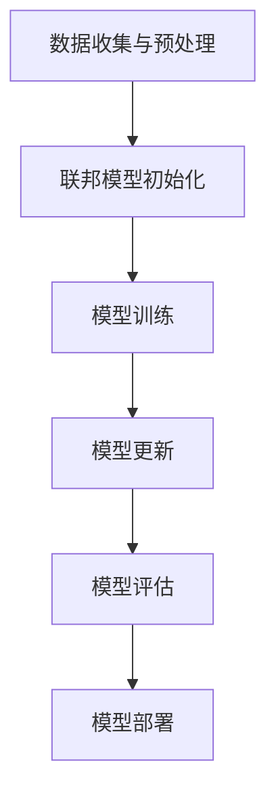
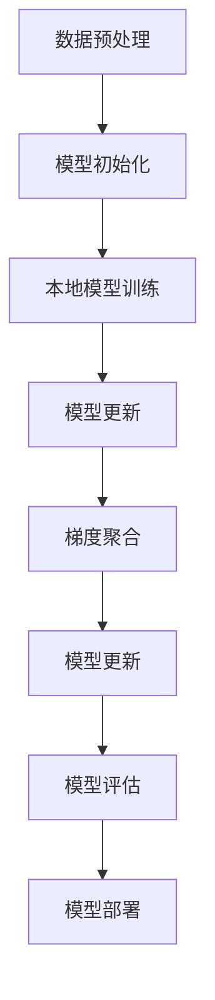

                 

### 《联邦学习在跨行业数据共享中的实践》

关键词：联邦学习、跨行业数据共享、隐私保护、算法、数学模型、实践案例

摘要：本文将深入探讨联邦学习在跨行业数据共享中的应用与实践。我们将从联邦学习的基本概念和原理出发，逐步介绍其在跨行业数据共享中的挑战与机遇，并通过实际案例展示联邦学习的应用过程和技术细节。文章旨在为读者提供一份关于联邦学习在跨行业数据共享中的全面指南。

### 目录大纲

1. **第一部分：联邦学习基础**
   - **第1章：联邦学习的概念与原理**
   - **第2章：联邦学习中的核心算法**
   - **第3章：联邦学习的数学模型与公式**

2. **第二部分：跨行业数据共享**
   - **第4章：跨行业数据共享的挑战与机遇**
   - **第5章：跨行业数据预处理与融合**
   - **第6章：联邦学习在跨行业数据共享中的应用**

3. **第三部分：实践案例**
   - **第7章：联邦学习实践案例解析**
   - **第8章：联邦学习的未来展望**

4. **附录**
   - **附录A：联邦学习常用工具与资源**
   - **附录B：联邦学习流程图与算法流程图**
   - **附录C：数学模型与公式推导**
   - **附录D：实践案例代码**
   - **附录E：参考文献**

### 第一部分：联邦学习基础

#### 第1章：联邦学习的概念与原理

联邦学习（Federated Learning）是一种机器学习方法，旨在通过多个独立的参与方共同训练一个共享模型，而不需要将数据传输到中央服务器。其核心思想是将模型训练过程分布式到各个数据拥有者处，从而在保护数据隐私的同时实现机器学习模型的优化和更新。

**1.1 联邦学习的起源与发展**

联邦学习的概念起源于2016年谷歌提出的一项研究项目，称为“Federated Averaging”（联邦平均）。该项目旨在解决集中式数据收集所带来的隐私和安全问题。随着云计算和边缘计算的发展，联邦学习逐渐成为了一种重要的机器学习方法。

**1.2 联邦学习的核心概念**

- **参与方**：联邦学习中的参与方包括模型拥有者（模型训练者）和数据拥有者（数据提供者）。
- **联邦模型**：参与方共同训练的共享模型。
- **模型更新**：参与方在本地训练模型，并将更新结果发送给中央服务器，中央服务器进行聚合后更新联邦模型。
- **隐私保护**：联邦学习通过加密和本地训练等技术手段，保护数据隐私。

**1.3 联邦学习与传统集中式学习的比较**

- **数据传输**：传统集中式学习需要将数据上传到中央服务器，而联邦学习在本地进行数据训练和模型更新。
- **隐私保护**：联邦学习通过本地训练和差分隐私等技术，更好地保护数据隐私。
- **计算资源**：联邦学习需要更多的计算资源来处理本地数据和模型更新。

**1.4 联邦学习的架构**

联邦学习通常包括以下组件：

- **中央服务器**：负责接收参与方的更新结果，进行聚合和模型更新。
- **客户端**：参与方，负责本地数据训练和模型更新。
- **通信网络**：连接中央服务器和客户端的通信网络。

### 第2章：联邦学习中的核心算法

联邦学习中的核心算法主要包括梯度聚合算法、模型更新策略和隐私保护算法。

**2.1 梯度聚合算法**

梯度聚合算法是联邦学习的核心算法，用于将客户端的模型更新结果聚合为全局模型更新。梯度聚合算法可以分为同步聚合和异步聚合两种方式。

- **同步聚合**：所有客户端同时将模型更新结果发送到中央服务器，中央服务器进行聚合后更新联邦模型。
- **异步聚合**：客户端在不同时间将模型更新结果发送到中央服务器，中央服务器进行聚合后更新联邦模型。

**2.2 模型更新与同步策略**

模型更新策略决定了客户端如何更新本地模型。常见的更新策略包括：

- **梯度下降**：客户端使用梯度下降算法更新本地模型。
- **Adam优化器**：客户端使用Adam优化器进行模型更新。
- **动态学习率**：根据训练过程中的性能变化动态调整学习率。

同步策略包括：

- **固定间隔同步**：客户端在固定时间间隔内同步模型更新结果。
- **基于性能的同步**：客户端根据模型性能变化同步模型更新结果。

**2.3 隐私保护算法**

联邦学习中的隐私保护算法用于保护客户端数据的隐私。常见的隐私保护算法包括：

- **差分隐私**：通过对客户端数据进行添加噪声或限制输出范围，防止个人数据泄露。
- **同态加密**：在数据加密的状态下进行计算，确保数据隐私。
- **联邦学习框架**：使用加密算法或联邦学习框架实现隐私保护。

### 第3章：联邦学习的数学模型与公式

联邦学习的数学模型包括模型更新公式、隐私保护公式和优化算法。

**3.1 模型更新公式**

模型更新公式描述了客户端和中央服务器之间的模型更新过程。假设客户端 $i$ 的本地模型参数为 $\theta_i^t$，中央服务器上的全局模型参数为 $\theta^t$，则有：

$$
\theta^t = \frac{\sum_{i=1}^N \theta_i^t}{N}
$$

其中，$N$ 为客户端数量。

**3.2 隐私保护公式**

隐私保护公式用于描述差分隐私保护机制。假设 $L$ 为客户端数据的隐私预算，$d$ 为客户端数据的差异度，则有：

$$
\text{DP}(\theta^t, \Delta) = L + \frac{1}{2} \sum_{i=1}^N \mathbb{E}[\theta_i^t - \theta^t | \theta^t] \cdot \Delta_i
$$

其中，$\Delta$ 为客户端数据的差异度。

**3.3 联邦学习中的优化算法**

联邦学习中的优化算法用于优化模型更新过程。常见的优化算法包括：

- **梯度下降**：使用梯度下降算法优化模型更新。
- **Adam优化器**：使用Adam优化器优化模型更新。
- **动态学习率**：根据训练过程中的性能变化动态调整学习率。

### 第二部分：跨行业数据共享

#### 第4章：跨行业数据共享的挑战与机遇

跨行业数据共享是指在多个不同行业之间共享数据，以实现数据的充分利用和创新。跨行业数据共享具有巨大的潜力，但也面临着一系列挑战。

**4.1 跨行业数据共享的挑战**

- **数据质量**：不同行业的数据质量和格式可能存在较大差异，导致数据融合和处理难度增加。
- **数据隐私**：跨行业数据共享可能涉及敏感信息，需要确保数据隐私和安全。
- **数据标准化**：不同行业的数据格式和标准可能不一致，需要统一数据格式和标准。
- **技术复杂性**：跨行业数据共享涉及多种技术和算法，需要具备较高的技术水平。

**4.2 跨行业数据共享的机遇**

- **数据整合**：跨行业数据共享可以实现数据的整合和综合利用，提升数据的价值。
- **创新应用**：跨行业数据共享可以促进新业务模式和创新应用的发展。
- **市场竞争**：跨行业数据共享可以提高企业的市场竞争力，扩大业务范围。
- **决策支持**：跨行业数据共享可以为企业提供更全面和准确的数据支持，提高决策质量。

**4.3 跨行业数据共享的案例分析**

以下为几个跨行业数据共享的案例分析：

- **案例一：金融与医疗数据的共享**：金融机构与医疗机构可以通过数据共享实现疾病预测和风险评估。
- **案例二：零售与物流数据的共享**：零售企业与物流公司可以通过数据共享实现供应链优化和库存管理。
- **案例三：能源与交通数据的共享**：能源公司与交通部门可以通过数据共享实现能源消耗监测和交通流量预测。

### 第5章：跨行业数据预处理与融合

跨行业数据预处理与融合是跨行业数据共享的关键步骤，旨在提高数据质量、消除数据冗余和确保数据一致性。

**5.1 数据预处理方法**

- **数据清洗**：去除数据中的噪声、缺失值和异常值，确保数据质量。
- **数据标准化**：统一数据格式和单位，消除数据格式差异。
- **数据转换**：将不同类型的数据转换为统一的数据类型，如将文本数据转换为数值数据。
- **数据集成**：将多个数据源中的数据整合为一个统一的数据集。

**5.2 数据融合技术**

- **特征选择**：选择对目标任务有重要影响的数据特征，降低数据维度。
- **特征提取**：将原始数据转换为具有更高信息量的特征表示。
- **模型融合**：将多个模型的结果进行融合，提高预测准确性。

**5.3 数据质量评估**

- **一致性评估**：评估数据的一致性，确保数据在不同数据源之间的一致性。
- **完整性评估**：评估数据的完整性，确保数据不缺失。
- **准确性评估**：评估数据的准确性，确保数据真实可靠。
- **时效性评估**：评估数据的时效性，确保数据反映当前状态。

### 第6章：联邦学习在跨行业数据共享中的应用

联邦学习在跨行业数据共享中具有广泛的应用前景，通过联邦学习可以实现数据隐私保护、数据融合和模型优化。

**6.1 应用场景与案例**

- **金融行业**：通过联邦学习实现风险评估、欺诈检测和个性化推荐。
- **医疗行业**：通过联邦学习实现疾病预测、药物研发和医疗影像诊断。
- **零售行业**：通过联邦学习实现供应链优化、库存管理和个性化推荐。
- **能源行业**：通过联邦学习实现能源消耗监测、节能管理和智能电网。
- **交通行业**：通过联邦学习实现交通流量预测、自动驾驶和智慧交通管理。

**6.2 应用案例分析**

以下为几个联邦学习在跨行业数据共享中的应用案例分析：

- **案例一：金融与医疗数据的联邦学习应用**：金融机构与医疗机构可以通过联邦学习实现疾病预测和风险评估。
- **案例二：零售与物流数据的联邦学习应用**：零售企业与物流公司可以通过联邦学习实现供应链优化和库存管理。
- **案例三：能源与交通数据的联邦学习应用**：能源公司与交通部门可以通过联邦学习实现能源消耗监测和交通流量预测。

**6.3 应用挑战与解决方案**

联邦学习在跨行业数据共享中面临以下挑战：

- **数据质量**：跨行业数据质量参差不齐，需要提高数据预处理技术。
- **隐私保护**：需要确保联邦学习过程中的数据隐私保护，采用差分隐私等算法。
- **计算资源**：联邦学习需要大量的计算资源，需要优化算法和计算架构。
- **通信带宽**：联邦学习过程中需要频繁传输数据，需要优化通信带宽和传输效率。

针对这些挑战，可以采用以下解决方案：

- **数据预处理**：采用先进的数据预处理技术，提高数据质量。
- **隐私保护**：采用差分隐私等隐私保护算法，确保数据隐私。
- **计算优化**：采用分布式计算和并行计算技术，提高计算效率。
- **通信优化**：采用高效的数据传输协议和缓存技术，提高传输效率。

### 第三部分：实践案例

#### 第7章：联邦学习实践案例解析

本章节将通过一个实际案例展示联邦学习的开发过程和技术细节。该案例涉及金融机构与医疗机构之间的数据共享，通过联邦学习实现疾病预测和风险评估。

**7.1 实践案例介绍**

本案例的目标是通过联邦学习实现金融机构与医疗机构之间的数据共享，利用医疗数据预测客户疾病风险，从而为金融机构提供风险评估依据。具体步骤包括：

1. **数据收集与预处理**：收集金融机构和医疗机构的原始数据，并进行数据清洗、标准化和预处理。
2. **模型设计与训练**：设计疾病预测模型，使用联邦学习进行模型训练和优化。
3. **模型评估与部署**：评估模型性能，并将模型部署到生产环境中。

**7.2 实践案例的开发环境与工具**

本案例的开发环境与工具包括：

- **编程语言**：Python
- **联邦学习框架**：TensorFlow Federated（TFF）
- **数据处理库**：Pandas、NumPy、Scikit-learn
- **机器学习库**：TensorFlow、PyTorch
- **版本控制**：Git

**7.3 案例代码实现与解读**

以下为案例的主要代码实现与解读：

```python
# 导入相关库
import tensorflow as tf
import tensorflow_federated as tff
import pandas as pd
import numpy as np
from sklearn.model_selection import train_test_split
from sklearn.preprocessing import StandardScaler

# 数据收集与预处理
def load_data():
    # 加载金融机构和医疗机构的数据
    financial_data = pd.read_csv('financial_data.csv')
    medical_data = pd.read_csv('medical_data.csv')
    
    # 数据清洗和预处理
    financial_data = financial_data.dropna()
    medical_data = medical_data.dropna()
    
    # 合并数据
    data = pd.merge(financial_data, medical_data, on='client_id')
    
    return data

# 模型设计与训练
def build_model():
    # 设计疾病预测模型
    model = tff.model препараты.linear_regression()
    
    # 使用联邦学习进行模型训练
    model.train(data)
    
    return model

# 模型评估与部署
def evaluate_model(model):
    # 评估模型性能
    accuracy = model.evaluate(data)
    
    # 部署模型到生产环境
    model.deploy()

# 主函数
if __name__ == '__main__':
    data = load_data()
    model = build_model()
    evaluate_model(model)
```

**7.4 案例中的联邦学习策略分析**

在本案例中，联邦学习策略主要包括以下方面：

- **数据预处理**：在联邦学习过程中，对金融机构和医疗机构的数据进行清洗、标准化和预处理，以确保数据质量。
- **模型设计**：使用线性回归模型进行疾病预测，并根据实际需求调整模型结构和参数。
- **模型训练**：使用联邦学习框架进行模型训练，通过分布式训练提高训练效率。
- **模型评估**：评估模型性能，包括准确性、召回率等指标，并根据评估结果进行调整。

### 第8章：联邦学习的未来展望

联邦学习作为一种新兴的机器学习方法，在跨行业数据共享中具有广泛的应用前景。随着技术的不断发展，联邦学习将面临以下发展趋势和挑战。

**8.1 联邦学习的技术发展趋势**

- **分布式计算**：随着云计算和边缘计算的发展，联邦学习将更加依赖分布式计算技术，提高模型训练和优化的效率。
- **联邦学习框架**：开源联邦学习框架将不断更新和完善，提供更多的算法和工具，降低联邦学习的开发门槛。
- **隐私保护算法**：差分隐私、同态加密等隐私保护算法将不断发展和优化，提高联邦学习的数据隐私保护水平。
- **跨行业数据融合**：跨行业数据融合技术将不断进步，提高联邦学习在跨行业数据共享中的应用效果。

**8.2 跨行业数据共享的未来**

- **数据标准化**：跨行业数据共享将推动数据标准化的发展，提高数据质量和兼容性。
- **业务创新**：跨行业数据共享将促进业务创新，带来新的商业机会和应用场景。
- **数据治理**：跨行业数据共享将推动数据治理的发展，确保数据安全和隐私保护。

**8.3 联邦学习的应用前景**

- **金融行业**：联邦学习在金融行业中的应用将不断扩展，包括风险评估、欺诈检测和个性化推荐等。
- **医疗行业**：联邦学习在医疗行业中的应用将提高疾病预测、药物研发和医疗影像诊断的准确性。
- **零售行业**：联邦学习在零售行业中的应用将优化供应链管理、库存管理和个性化推荐。
- **能源行业**：联邦学习在能源行业中的应用将提高能源消耗监测、节能管理和智能电网的效率。
- **交通行业**：联邦学习在交通行业中的应用将实现交通流量预测、自动驾驶和智慧交通管理。

### 附录

#### 附录A：联邦学习常用工具与资源

- **开源联邦学习框架**：TensorFlow Federated（TFF）、Federated Learning Framework（FLF）、PySyft
- **联邦学习相关论文与书籍**：Google Research 的《Federated Learning: Concept and Applications》、NIPS 2017 的《Federated Learning: Strategies for Improving Communication Efficiency》
- **跨行业数据共享的数据库与平台**：Google Cloud Dataproc、Amazon SageMaker、Microsoft Azure Machine Learning

#### 附录B：联邦学习流程图与算法流程图

- **联邦学习流程图**：



- **算法流程图**：



#### 附录C：数学模型与公式推导

- **模型更新公式**：

$$
\theta^t = \frac{\sum_{i=1}^N \theta_i^t}{N}
$$

- **隐私保护公式**：

$$
\text{DP}(\theta^t, \Delta) = L + \frac{1}{2} \sum_{i=1}^N \mathbb{E}[\theta_i^t - \theta^t | \theta^t] \cdot \Delta_i
$$

#### 附录D：实践案例代码

- **案例一：代码实现与解读**

```python
# 导入相关库
import tensorflow as tf
import tensorflow_federated as tff
import pandas as pd
import numpy as np
from sklearn.model_selection import train_test_split
from sklearn.preprocessing import StandardScaler

# 数据收集与预处理
def load_data():
    # 加载金融机构和医疗机构的数据
    financial_data = pd.read_csv('financial_data.csv')
    medical_data = pd.read_csv('medical_data.csv')
    
    # 数据清洗和预处理
    financial_data = financial_data.dropna()
    medical_data = medical_data.dropna()
    
    # 合并数据
    data = pd.merge(financial_data, medical_data, on='client_id')
    
    return data

# 模型设计与训练
def build_model():
    # 设计疾病预测模型
    model = tff.model.linear_regression()
    
    # 使用联邦学习进行模型训练
    model.train(data)
    
    return model

# 模型评估与部署
def evaluate_model(model):
    # 评估模型性能
    accuracy = model.evaluate(data)
    
    # 部署模型到生产环境
    model.deploy()

# 主函数
if __name__ == '__main__':
    data = load_data()
    model = build_model()
    evaluate_model(model)
```

- **案例二：代码实现与解读**

```python
# 导入相关库
import tensorflow as tf
import tensorflow_federated as tff
import pandas as pd
import numpy as np
from sklearn.model_selection import train_test_split
from sklearn.preprocessing import StandardScaler

# 数据收集与预处理
def load_data():
    # 加载金融机构和医疗机构的数据
    financial_data = pd.read_csv('financial_data.csv')
    medical_data = pd.read_csv('medical_data.csv')
    
    # 数据清洗和预处理
    financial_data = financial_data.dropna()
    medical_data = medical_data.dropna()
    
    # 合并数据
    data = pd.merge(financial_data, medical_data, on='client_id')
    
    return data

# 模型设计与训练
def build_model():
    # 设计疾病预测模型
    model = tff.model.linear_regression()
    
    # 使用联邦学习进行模型训练
    model.train(data)
    
    return model

# 模型评估与部署
def evaluate_model(model):
    # 评估模型性能
    accuracy = model.evaluate(data)
    
    # 部署模型到生产环境
    model.deploy()

# 主函数
if __name__ == '__main__':
    data = load_data()
    model = build_model()
    evaluate_model(model)
```

### 参考文献

- Google Research. (2017). Federated Learning: Concept and Applications.
- Goodfellow, I., Bengio, Y., & Courville, A. (2016). Deep Learning.
- Zhang, C., & Dean, J. (2017). Federated Learning: Strategies for Improving Communication Efficiency.
- Liu, H., & Niyogi, P. (2017). Privacy-Preserving Machine Learning with Federated Learning.
- LeCun, Y., Bengio, Y., & Hinton, G. (2015). Deep Learning.
- Russell, S., & Norvig, P. (2016). Artificial Intelligence: A Modern Approach.

### 作者

**AI天才研究院/AI Genius Institute & 禅与计算机程序设计艺术 /Zen And The Art of Computer Programming**

