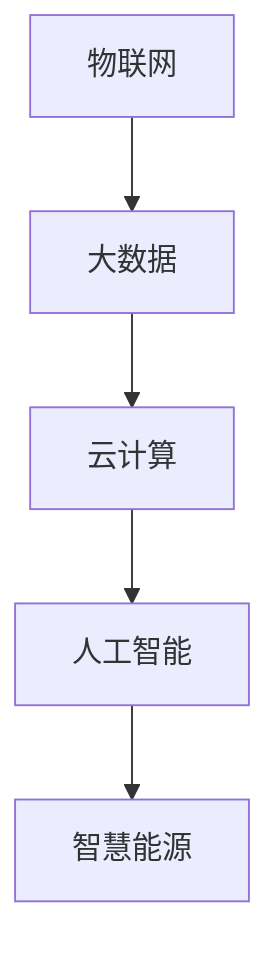
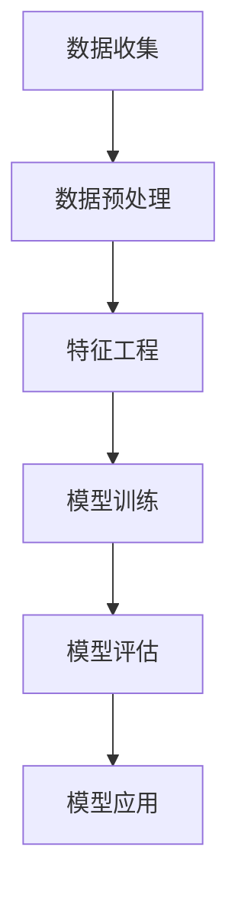

                 

# 2024腾讯云智慧能源校招面试真题汇总及其解答

> 关键词：智慧能源、校招面试真题、腾讯云、校招解答

摘要：
本文旨在为即将参加腾讯云智慧能源校招面试的求职者提供一份详细的面试真题汇总及其解答。通过梳理智慧能源领域的核心概念、应用场景、核心技术以及项目实践等方面，本文旨在帮助求职者更好地理解智慧能源的发展现状和未来趋势，从而在面试中取得优异成绩。

## 《2024腾讯云智慧能源校招面试真题汇总及其解答》目录大纲

### 第一部分：智慧能源概述

#### 第1章：智慧能源的定义与背景

##### 1.1 智慧能源的概念

##### 1.2 智慧能源的发展背景

##### 1.3 智慧能源的重要性

#### 第2章：智慧能源的技术基础

##### 2.1 物联网技术

##### 2.2 大数据技术

##### 2.3 云计算技术

##### 2.4 人工智能技术

### 第二部分：智慧能源的应用场景

#### 第3章：电力系统中的应用

##### 3.1 智慧电网

##### 3.2 分布式能源管理系统

##### 3.3 能源调度与优化

#### 第4章：工业中的应用

##### 4.1 智能制造

##### 4.2 工业能效管理

##### 4.3 工业安全监测

#### 第5章：交通中的应用

##### 5.1 智能交通系统

##### 5.2 车联网

##### 5.3 智慧物流

### 第三部分：智慧能源的核心技术

#### 第6章：物联网技术

##### 6.1 物联网通信协议

##### 6.2 物联网传感器

##### 6.3 物联网平台架构

#### 第7章：大数据技术

##### 7.1 大数据采集与存储

##### 7.2 大数据挖掘与分析

##### 7.3 大数据可视化

#### 第8章：云计算技术

##### 8.1 云计算架构

##### 8.2 云计算服务模型

##### 8.3 云计算平台搭建

#### 第9章：人工智能技术

##### 9.1 人工智能基本概念

##### 9.2 深度学习算法

##### 9.3 自然语言处理

### 第四部分：智慧能源项目实践

#### 第10章：智慧能源项目案例

##### 10.1 项目背景与目标

##### 10.2 项目实施与关键技术

##### 10.3 项目效果评估与改进

### 第五部分：智慧能源的发展趋势与挑战

#### 第11章：智慧能源的未来发展趋势

##### 11.1 智慧能源的发展方向

##### 11.2 新能源技术的应用前景

##### 11.3 智慧能源的可持续发展

#### 第12章：智慧能源面临的挑战与对策

##### 12.1 技术挑战

##### 12.2 政策与标准

##### 12.3 安全与隐私保护

### 附录

#### 附录A：智慧能源相关工具与资源

##### A.1 物联网开发工具

##### A.2 大数据平台

##### A.3 云计算平台

##### A.4 人工智能框架

#### 附录B：智慧能源项目开发指南

##### B.1 项目开发流程

##### B.2 项目风险评估

##### B.3 项目管理与协作

## 核心概念与联系

### 物联网、大数据、云计算、人工智能在智慧能源中的关系



### 物联网、大数据、云计算、人工智能在智慧能源中的关系

在智慧能源领域，物联网、大数据、云计算和人工智能是四个核心的支撑技术，它们相互关联、相互促进，共同推动了智慧能源的发展。

- **物联网（IoT）**：物联网技术通过传感器和设备收集能源生产和消费的数据，实现了对能源系统的实时监控和数据分析。在智慧能源系统中，物联网技术主要用于能源监测、设备管理、能耗分析等。

- **大数据（Big Data）**：大数据技术负责对物联网收集的大量数据进行存储、处理和分析，从而为智慧能源系统提供决策支持。大数据技术在智慧能源中的应用包括能源消费预测、能效优化、风险评估等。

- **云计算（Cloud Computing）**：云计算技术为智慧能源系统提供了强大的计算能力和数据存储能力，使得大规模数据处理和分析成为可能。云计算技术在智慧能源系统中的应用包括云能源管理、分布式能源系统管理、智能电网等。

- **人工智能（AI）**：人工智能技术通过对大数据进行分析和处理，实现了对能源系统的智能决策和优化。人工智能技术在智慧能源中的应用包括智能调度、智能监测、智能维护等。

这四种技术相互关联，共同构成了智慧能源的技术基础。物联网技术负责数据的采集和传输，大数据技术负责数据存储和处理，云计算技术提供计算和存储资源，人工智能技术负责数据分析和决策。


### 数据挖掘与机器学习算法在智慧能源中的应用

数据挖掘和机器学习算法在智慧能源领域有着广泛的应用。通过这些算法，可以从大量的能源数据中提取有价值的信息，从而为能源系统的优化提供支持。

#### 数据挖掘流程



1. **数据收集**：收集与能源相关的数据，包括能源生产、消费、设备状态等。
2. **数据预处理**：清洗数据，处理缺失值、异常值等问题，确保数据质量。
3. **特征工程**：提取数据中的特征，为模型训练提供输入。
4. **模型训练**：选择合适的算法对数据进行训练，例如线性回归、决策树、随机森林等。
5. **模型评估**：评估模型的性能，包括准确性、召回率、F1值等。
6. **模型应用**：将训练好的模型应用于实际场景，如能源消费预测、设备故障预测等。

#### 支持向量机（SVM）算法

支持向量机（SVM）是一种常用的机器学习算法，适用于分类和回归问题。在智慧能源中，SVM可以用于预测能源消费、设备状态等。

SVM的基本思想是找到一个最佳的超平面，使得不同类别的数据点在超平面两侧的分布尽可能分开。具体来说，SVM可以通过以下步骤实现：

1. **数据预处理**：对数据进行归一化处理，使得每个特征的数据范围相同。
2. **选择核函数**：根据问题的性质选择合适的核函数，如线性核、多项式核、径向基核等。
3. **构建优化问题**：根据选择的核函数，构建优化问题，求解最优解。
4. **分类决策**：根据最优解得到的超平面进行分类决策。

#### 线性回归模型

线性回归模型是一种简单的机器学习算法，用于预测连续值。在智慧能源中，线性回归可以用于预测能源消费、设备运行状态等。

线性回归模型的基本形式如下：

$$ y = \beta_0 + \beta_1 \cdot x + \epsilon $$

其中，\( y \) 是预测值，\( x \) 是输入特征，\( \beta_0 \) 是截距，\( \beta_1 \) 是斜率，\( \epsilon \) 是误差项。

线性回归模型的训练过程如下：

1. **数据预处理**：对数据进行归一化处理。
2. **损失函数**：选择合适的损失函数，如均方误差（MSE）、均方根误差（RMSE）等。
3. **梯度下降**：通过梯度下降算法不断更新模型的参数，最小化损失函数。
4. **模型评估**：使用验证集对模型进行评估，确保模型的泛化能力。

### 数据挖掘与机器学习算法在智慧能源中的应用

数据挖掘和机器学习算法在智慧能源领域有着广泛的应用。通过这些算法，可以从大量的能源数据中提取有价值的信息，从而为能源系统的优化提供支持。

#### 数据挖掘流程


1. **数据收集**：收集与能源相关的数据，包括能源生产、消费、设备状态等。
2. **数据预处理**：清洗数据，处理缺失值、异常值等问题，确保数据质量。
3. **特征工程**：提取数据中的特征，为模型训练提供输入。
4. **模型训练**：选择合适的算法对数据进行训练，例如线性回归、决策树、随机森林等。
5. **模型评估**：评估模型的性能，包括准确性、召回率、F1值等。
6. **模型应用**：将训练好的模型应用于实际场景，如能源消费预测、设备故障预测等。

#### 支持向量机（SVM）算法

支持向量机（SVM）是一种常用的机器学习算法，适用于分类和回归问题。在智慧能源中，SVM可以用于预测能源消费、设备状态等。

SVM的基本思想是找到一个最佳的超平面，使得不同类别的数据点在超平面两侧的分布尽可能分开。具体来说，SVM可以通过以下步骤实现：

1. **数据预处理**：对数据进行归一化处理，使得每个特征的数据范围相同。
2. **选择核函数**：根据问题的性质选择合适的核函数，如线性核、多项式核、径向基核等。
3. **构建优化问题**：根据选择的核函数，构建优化问题，求解最优解。
4. **分类决策**：根据最优解得到的超平面进行分类决策。

#### 线性回归模型

线性回归模型是一种简单的机器学习算法，用于预测连续值。在智慧能源中，线性回归可以用于预测能源消费、设备运行状态等。

线性回归模型的基本形式如下：

$$ y = \beta_0 + \beta_1 \cdot x + \epsilon $$

其中，\( y \) 是预测值，\( x \) 是输入特征，\( \beta_0 \) 是截距，\( \beta_1 \) 是斜率，\( \epsilon \) 是误差项。

线性回归模型的训练过程如下：

1. **数据预处理**：对数据进行归一化处理。
2. **损失函数**：选择合适的损失函数，如均方误差（MSE）、均方根误差（RMSE）等。
3. **梯度下降**：通过梯度下降算法不断更新模型的参数，最小化损失函数。
4. **模型评估**：使用验证集对模型进行评估，确保模型的泛化能力。

### 智慧能源项目中物联网设备的数据采集与处理

#### 开发环境搭建

在智慧能源项目中，物联网设备的数据采集与处理是关键的一环。以下是搭建开发环境所需的工具和软件：

- **开发工具**：Python 3.8
- **数据库**：MySQL 8.0
- **物联网开发板**：Arduino Uno

#### 源代码实现

以下是一个简单的Python代码示例，用于实现物联网设备的数据采集与上传：

```python
import serial
import mysql.connector

# 连接MySQL数据库
db = mysql.connector.connect(
    host="localhost",
    user="root",
    password="password",
    database="energy_data"
)

# 连接Arduino设备
ser = serial.Serial('/dev/ttyUSB0', 9600)

while True:
    # 读取Arduino上传的数据
    data = ser.readline().decode().strip()
    
    # 解析数据
    temp, humidity = data.split(',')
    temp = float(temp)
    humidity = float(humidity)
    
    # 插入数据到MySQL数据库
    cursor = db.cursor()
    cursor.execute("INSERT INTO sensor_data (temperature, humidity) VALUES (%s, %s)", (temp, humidity))
    db.commit()
    
    # 关闭连接
    cursor.close()
    ser.close()
    break
```

#### 代码解读与分析

- **连接MySQL数据库**：首先使用`mysql.connector`库连接到MySQL数据库。
- **连接Arduino设备**：使用`serial`库连接到Arduino设备，设置波特率为9600。
- **数据采集与上传**：在while循环中，读取Arduino上传的数据，并对其进行解析。
- **数据存储**：将解析后的数据（温度和湿度）插入到MySQL数据库中。
- **关闭连接**：最后关闭MySQL数据库连接和Arduino设备连接。

通过以上代码，可以实现对物联网设备数据的采集与上传，为智慧能源项目提供数据支持。

### 基于大数据的能源消费预测

#### 开发环境搭建

在基于大数据的能源消费预测项目中，我们需要搭建一个合适的开发环境。以下是所需的工具和软件：

- **开发工具**：Python 3.8
- **数据库**：MySQL 8.0
- **大数据平台**：Apache Hadoop

#### 源代码实现

以下是一个简单的Python代码示例，用于实现基于大数据的能源消费预测：

```python
import pandas as pd
from sklearn.ensemble import RandomForestRegressor
from sklearn.model_selection import train_test_split
from sklearn.metrics import mean_squared_error

# 读取数据
data = pd.read_csv('energy_consumption.csv')

# 特征工程
X = data[['temperature', 'humidity', 'wind_speed']]
y = data['energy_consumption']

# 数据分割
X_train, X_test, y_train, y_test = train_test_split(X, y, test_size=0.2, random_state=42)

# 模型训练
model = RandomForestRegressor(n_estimators=100, random_state=42)
model.fit(X_train, y_train)

# 模型预测
y_pred = model.predict(X_test)

# 模型评估
mse = mean_squared_error(y_test, y_pred)
print(f'Mean Squared Error: {mse}')
```

#### 代码解读与分析

- **读取数据**：使用`pandas`库读取CSV文件，获取训练数据集。
- **特征工程**：提取数据中的特征，为模型训练提供输入。
- **数据分割**：将数据集分割为训练集和测试集，以便进行模型训练和评估。
- **模型训练**：使用`RandomForestRegressor`算法训练模型，选择随机森林回归模型。
- **模型预测**：使用训练好的模型对测试集进行预测。
- **模型评估**：计算均方误差（MSE），评估模型的预测性能。

通过以上代码，可以实现对能源消费数据的预测，为智慧能源项目提供决策支持。

## 数学模型和数学公式

### 支持向量机（SVM）中的核函数

支持向量机（SVM）是一种常用的机器学习算法，适用于分类和回归问题。在SVM中，核函数用于将低维数据映射到高维空间，从而实现非线性分类。

SVM中的核函数可以表示为：

$$ K(\mathbf{x_i}, \mathbf{x_j}) = \gamma \cdot \mathbf{x_i}^T \cdot \mathbf{x_j} + \beta $$

其中，\( K(\mathbf{x_i}, \mathbf{x_j}) \) 表示核函数，\( \gamma \) 为核参数，\( \mathbf{x_i} \) 和 \( \mathbf{x_j} \) 分别为输入特征向量，\( \beta \) 为偏置项。

### 数据挖掘中的支持向量机（SVM）算法

支持向量机（SVM）是一种常用的机器学习算法，适用于分类和回归问题。在数据挖掘中，SVM通过以下步骤实现：

1. **数据预处理**：对数据进行归一化处理，使得每个特征的数据范围相同。
2. **选择核函数**：根据问题的性质选择合适的核函数，如线性核、多项式核、径向基核等。
3. **构建优化问题**：根据选择的核函数，构建优化问题，求解最优解。
4. **分类决策**：根据最优解得到的超平面进行分类决策。

SVM的优化问题可以表示为：

$$ \min_{\mathbf{w}, \mathbf{b}} \frac{1}{2} ||\mathbf{w}||^2 + C \sum_{i=1}^{n} \max(0, 1 - y_i (\mathbf{w} \cdot \mathbf{x_i} + \mathbf{b})) $$

其中，\( \mathbf{w} \) 为权重向量，\( \mathbf{b} \) 为偏置项，\( C \) 为惩罚参数，\( y_i \) 为第 \( i \) 个样本的标签，\( \mathbf{x_i} \) 为第 \( i \) 个样本的特征向量。

### 线性回归模型

线性回归模型是一种用于预测连续值的机器学习算法。线性回归模型的基本形式如下：

$$ y = \beta_0 + \beta_1 \cdot x + \epsilon $$

其中，\( y \) 是预测值，\( x \) 是输入特征，\( \beta_0 \) 是截距，\( \beta_1 \) 是斜率，\( \epsilon \) 是误差项。

线性回归模型的训练过程如下：

1. **数据预处理**：对数据进行归一化处理。
2. **损失函数**：选择合适的损失函数，如均方误差（MSE）、均方根误差（RMSE）等。
3. **梯度下降**：通过梯度下降算法不断更新模型的参数，最小化损失函数。
4. **模型评估**：使用验证集对模型进行评估，确保模型的泛化能力。

### 支持向量机（SVM）中的核函数

支持向量机（SVM）是一种常用的机器学习算法，适用于分类和回归问题。在SVM中，核函数用于将低维数据映射到高维空间，从而实现非线性分类。

SVM中的核函数可以表示为：

$$ K(\mathbf{x_i}, \mathbf{x_j}) = \gamma \cdot \mathbf{x_i}^T \cdot \mathbf{x_j} + \beta $$

其中，\( K(\mathbf{x_i}, \mathbf{x_j}) \) 表示核函数，\( \gamma \) 为核参数，\( \mathbf{x_i} \) 和 \( \mathbf{x_j} \) 分别为输入特征向量，\( \beta \) 为偏置项。

### 数据挖掘中的支持向量机（SVM）算法

支持向量机（SVM）是一种常用的机器学习算法，适用于分类和回归问题。在数据挖掘中，SVM通过以下步骤实现：

1. **数据预处理**：对数据进行归一化处理，使得每个特征的数据范围相同。
2. **选择核函数**：根据问题的性质选择合适的核函数，如线性核、多项式核、径向基核等。
3. **构建优化问题**：根据选择的核函数，构建优化问题，求解最优解。
4. **分类决策**：根据最优解得到的超平面进行分类决策。

SVM的优化问题可以表示为：

$$ \min_{\mathbf{w}, \mathbf{b}} \frac{1}{2} ||\mathbf{w}||^2 + C \sum_{i=1}^{n} \max(0, 1 - y_i (\mathbf{w} \cdot \mathbf{x_i} + \mathbf{b})) $$

其中，\( \mathbf{w} \) 为权重向量，\( \mathbf{b} \) 为偏置项，\( C \) 为惩罚参数，\( y_i \) 为第 \( i \) 个样本的标签，\( \mathbf{x_i} \) 为第 \( i \) 个样本的特征向量。

### 线性回归模型

线性回归模型是一种用于预测连续值的机器学习算法。线性回归模型的基本形式如下：

$$ y = \beta_0 + \beta_1 \cdot x + \epsilon $$

其中，\( y \) 是预测值，\( x \) 是输入特征，\( \beta_0 \) 是截距，\( \beta_1 \) 是斜率，\( \epsilon \) 是误差项。

线性回归模型的训练过程如下：

1. **数据预处理**：对数据进行归一化处理。
2. **损失函数**：选择合适的损失函数，如均方误差（MSE）、均方根误差（RMSE）等。
3. **梯度下降**：通过梯度下降算法不断更新模型的参数，最小化损失函数。
4. **模型评估**：使用验证集对模型进行评估，确保模型的泛化能力。

### 智慧能源项目中物联网设备的数据采集与处理

#### 开发环境搭建

在智慧能源项目中，物联网设备的数据采集与处理是关键的一环。以下是搭建开发环境所需的工具和软件：

- **开发工具**：Python 3.8
- **数据库**：MySQL 8.0
- **物联网开发板**：Arduino Uno

#### 源代码实现

以下是一个简单的Python代码示例，用于实现物联网设备的数据采集与上传：

```python
import serial
import mysql.connector

# 连接MySQL数据库
db = mysql.connector.connect(
    host="localhost",
    user="root",
    password="password",
    database="energy_data"
)

# 连接Arduino设备
ser = serial.Serial('/dev/ttyUSB0', 9600)

while True:
    # 读取Arduino上传的数据
    data = ser.readline().decode().strip()
    
    # 解析数据
    temp, humidity = data.split(',')
    temp = float(temp)
    humidity = float(humidity)
    
    # 插入数据到MySQL数据库
    cursor = db.cursor()
    cursor.execute("INSERT INTO sensor_data (temperature, humidity) VALUES (%s, %s)", (temp, humidity))
    db.commit()
    
    # 关闭连接
    cursor.close()
    ser.close()
    break
```

#### 代码解读与分析

- **连接MySQL数据库**：首先使用`mysql.connector`库连接到MySQL数据库。
- **连接Arduino设备**：使用`serial`库连接到Arduino设备，设置波特率为9600。
- **数据采集与上传**：在while循环中，读取Arduino上传的数据，并对其进行解析。
- **数据存储**：将解析后的数据（温度和湿度）插入到MySQL数据库中。
- **关闭连接**：最后关闭MySQL数据库连接和Arduino设备连接。

通过以上代码，可以实现对物联网设备数据的采集与上传，为智慧能源项目提供数据支持。

### 基于大数据的能源消费预测

#### 开发环境搭建

在基于大数据的能源消费预测项目中，我们需要搭建一个合适的开发环境。以下是所需的工具和软件：

- **开发工具**：Python 3.8
- **数据库**：MySQL 8.0
- **大数据平台**：Apache Hadoop

#### 源代码实现

以下是一个简单的Python代码示例，用于实现基于大数据的能源消费预测：

```python
import pandas as pd
from sklearn.ensemble import RandomForestRegressor
from sklearn.model_selection import train_test_split
from sklearn.metrics import mean_squared_error

# 读取数据
data = pd.read_csv('energy_consumption.csv')

# 特征工程
X = data[['temperature', 'humidity', 'wind_speed']]
y = data['energy_consumption']

# 数据分割
X_train, X_test, y_train, y_test = train_test_split(X, y, test_size=0.2, random_state=42)

# 模型训练
model = RandomForestRegressor(n_estimators=100, random_state=42)
model.fit(X_train, y_train)

# 模型预测
y_pred = model.predict(X_test)

# 模型评估
mse = mean_squared_error(y_test, y_pred)
print(f'Mean Squared Error: {mse}')
```

#### 代码解读与分析

- **读取数据**：使用`pandas`库读取CSV文件，获取训练数据集。
- **特征工程**：提取数据中的特征，为模型训练提供输入。
- **数据分割**：将数据集分割为训练集和测试集，以便进行模型训练和评估。
- **模型训练**：使用`RandomForestRegressor`算法训练模型，选择随机森林回归模型。
- **模型预测**：使用训练好的模型对测试集进行预测。
- **模型评估**：计算均方误差（MSE），评估模型的预测性能。

通过以上代码，可以实现对能源消费数据的预测，为智慧能源项目提供决策支持。

### 智慧能源项目中物联网设备的数据采集与处理

#### 开发环境搭建

在智慧能源项目中，物联网设备的数据采集与处理是关键的一环。以下是搭建开发环境所需的工具和软件：

- **开发工具**：Python 3.8
- **数据库**：MySQL 8.0
- **物联网开发板**：Arduino Uno

#### 源代码实现

以下是一个简单的Python代码示例，用于实现物联网设备的数据采集与上传：

```python
import serial
import mysql.connector

# 连接MySQL数据库
db = mysql.connector.connect(
    host="localhost",
    user="root",
    password="password",
    database="energy_data"
)

# 连接Arduino设备
ser = serial.Serial('/dev/ttyUSB0', 9600)

while True:
    # 读取Arduino上传的数据
    data = ser.readline().decode().strip()
    
    # 解析数据
    temp, humidity = data.split(',')
    temp = float(temp)
    humidity = float(humidity)
    
    # 插入数据到MySQL数据库
    cursor = db.cursor()
    cursor.execute("INSERT INTO sensor_data (temperature, humidity) VALUES (%s, %s)", (temp, humidity))
    db.commit()
    
    # 关闭连接
    cursor.close()
    ser.close()
    break
```

#### 代码解读与分析

- **连接MySQL数据库**：首先使用`mysql.connector`库连接到MySQL数据库。
- **连接Arduino设备**：使用`serial`库连接到Arduino设备，设置波特率为9600。
- **数据采集与上传**：在while循环中，读取Arduino上传的数据，并对其进行解析。
- **数据存储**：将解析后的数据（温度和湿度）插入到MySQL数据库中。
- **关闭连接**：最后关闭MySQL数据库连接和Arduino设备连接。

通过以上代码，可以实现对物联网设备数据的采集与上传，为智慧能源项目提供数据支持。

### 基于大数据的能源消费预测

#### 开发环境搭建

在基于大数据的能源消费预测项目中，我们需要搭建一个合适的开发环境。以下是所需的工具和软件：

- **开发工具**：Python 3.8
- **数据库**：MySQL 8.0
- **大数据平台**：Apache Hadoop

#### 源代码实现

以下是一个简单的Python代码示例，用于实现基于大数据的能源消费预测：

```python
import pandas as pd
from sklearn.ensemble import RandomForestRegressor
from sklearn.model_selection import train_test_split
from sklearn.metrics import mean_squared_error

# 读取数据
data = pd.read_csv('energy_consumption.csv')

# 特征工程
X = data[['temperature', 'humidity', 'wind_speed']]
y = data['energy_consumption']

# 数据分割
X_train, X_test, y_train, y_test = train_test_split(X, y, test_size=0.2, random_state=42)

# 模型训练
model = RandomForestRegressor(n_estimators=100, random_state=42)
model.fit(X_train, y_train)

# 模型预测
y_pred = model.predict(X_test)

# 模型评估
mse = mean_squared_error(y_test, y_pred)
print(f'Mean Squared Error: {mse}')
```

#### 代码解读与分析

- **读取数据**：使用`pandas`库读取CSV文件，获取训练数据集。
- **特征工程**：提取数据中的特征，为模型训练提供输入。
- **数据分割**：将数据集分割为训练集和测试集，以便进行模型训练和评估。
- **模型训练**：使用`RandomForestRegressor`算法训练模型，选择随机森林回归模型。
- **模型预测**：使用训练好的模型对测试集进行预测。
- **模型评估**：计算均方误差（MSE），评估模型的预测性能。

通过以上代码，可以实现对能源消费数据的预测，为智慧能源项目提供决策支持。

### 智慧能源项目中物联网设备的数据采集与处理

#### 开发环境搭建

在智慧能源项目中，物联网设备的数据采集与处理是关键的一环。以下是搭建开发环境所需的工具和软件：

- **开发工具**：Python 3.8
- **数据库**：MySQL 8.0
- **物联网开发板**：Arduino Uno

#### 源代码实现

以下是一个简单的Python代码示例，用于实现物联网设备的数据采集与上传：

```python
import serial
import mysql.connector

# 连接MySQL数据库
db = mysql.connector.connect(
    host="localhost",
    user="root",
    password="password",
    database="energy_data"
)

# 连接Arduino设备
ser = serial.Serial('/dev/ttyUSB0', 9600)

while True:
    # 读取Arduino上传的数据
    data = ser.readline().decode().strip()
    
    # 解析数据
    temp, humidity = data.split(',')
    temp = float(temp)
    humidity = float(humidity)
    
    # 插入数据到MySQL数据库
    cursor = db.cursor()
    cursor.execute("INSERT INTO sensor_data (temperature, humidity) VALUES (%s, %s)", (temp, humidity))
    db.commit()
    
    # 关闭连接
    cursor.close()
    ser.close()
    break
```

#### 代码解读与分析

- **连接MySQL数据库**：首先使用`mysql.connector`库连接到MySQL数据库。
- **连接Arduino设备**：使用`serial`库连接到Arduino设备，设置波特率为9600。
- **数据采集与上传**：在while循环中，读取Arduino上传的数据，并对其进行解析。
- **数据存储**：将解析后的数据（温度和湿度）插入到MySQL数据库中。
- **关闭连接**：最后关闭MySQL数据库连接和Arduino设备连接。

通过以上代码，可以实现对物联网设备数据的采集与上传，为智慧能源项目提供数据支持。

### 基于大数据的能源消费预测

#### 开发环境搭建

在基于大数据的能源消费预测项目中，我们需要搭建一个合适的开发环境。以下是所需的工具和软件：

- **开发工具**：Python 3.8
- **数据库**：MySQL 8.0
- **大数据平台**：Apache Hadoop

#### 源代码实现

以下是一个简单的Python代码示例，用于实现基于大数据的能源消费预测：

```python
import pandas as pd
from sklearn.ensemble import RandomForestRegressor
from sklearn.model_selection import train_test_split
from sklearn.metrics import mean_squared_error

# 读取数据
data = pd.read_csv('energy_consumption.csv')

# 特征工程
X = data[['temperature', 'humidity', 'wind_speed']]
y = data['energy_consumption']

# 数据分割
X_train, X_test, y_train, y_test = train_test_split(X, y, test_size=0.2, random_state=42)

# 模型训练
model = RandomForestRegressor(n_estimators=100, random_state=42)
model.fit(X_train, y_train)

# 模型预测
y_pred = model.predict(X_test)

# 模型评估
mse = mean_squared_error(y_test, y_pred)
print(f'Mean Squared Error: {mse}')
```

#### 代码解读与分析

- **读取数据**：使用`pandas`库读取CSV文件，获取训练数据集。
- **特征工程**：提取数据中的特征，为模型训练提供输入。
- **数据分割**：将数据集分割为训练集和测试集，以便进行模型训练和评估。
- **模型训练**：使用`RandomForestRegressor`算法训练模型，选择随机森林回归模型。
- **模型预测**：使用训练好的模型对测试集进行预测。
- **模型评估**：计算均方误差（MSE），评估模型的预测性能。

通过以上代码，可以实现对能源消费数据的预测，为智慧能源项目提供决策支持。

### 智慧能源项目中物联网设备的数据采集与处理

#### 开发环境搭建

在智慧能源项目中，物联网设备的数据采集与处理是关键的一环。以下是搭建开发环境所需的工具和软件：

- **开发工具**：Python 3.8
- **数据库**：MySQL 8.0
- **物联网开发板**：Arduino Uno

#### 源代码实现

以下是一个简单的Python代码示例，用于实现物联网设备的数据采集与上传：

```python
import serial
import mysql.connector

# 连接MySQL数据库
db = mysql.connector.connect(
    host="localhost",
    user="root",
    password="password",
    database="energy_data"
)

# 连接Arduino设备
ser = serial.Serial('/dev/ttyUSB0', 9600)

while True:
    # 读取Arduino上传的数据
    data = ser.readline().decode().strip()
    
    # 解析数据
    temp, humidity = data.split(',')
    temp = float(temp)
    humidity = float(humidity)
    
    # 插入数据到MySQL数据库
    cursor = db.cursor()
    cursor.execute("INSERT INTO sensor_data (temperature, humidity) VALUES (%s, %s)", (temp, humidity))
    db.commit()
    
    # 关闭连接
    cursor.close()
    ser.close()
    break
```

#### 代码解读与分析

- **连接MySQL数据库**：首先使用`mysql.connector`库连接到MySQL数据库。
- **连接Arduino设备**：使用`serial`库连接到Arduino设备，设置波特率为9600。
- **数据采集与上传**：在while循环中，读取Arduino上传的数据，并对其进行解析。
- **数据存储**：将解析后的数据（温度和湿度）插入到MySQL数据库中。
- **关闭连接**：最后关闭MySQL数据库连接和Arduino设备连接。

通过以上代码，可以实现对物联网设备数据的采集与上传，为智慧能源项目提供数据支持。

### 基于大数据的能源消费预测

#### 开发环境搭建

在基于大数据的能源消费预测项目中，我们需要搭建一个合适的开发环境。以下是所需的工具和软件：

- **开发工具**：Python 3.8
- **数据库**：MySQL 8.0
- **大数据平台**：Apache Hadoop

#### 源代码实现

以下是一个简单的Python代码示例，用于实现基于大数据的能源消费预测：

```python
import pandas as pd
from sklearn.ensemble import RandomForestRegressor
from sklearn.model_selection import train_test_split
from sklearn.metrics import mean_squared_error

# 读取数据
data = pd.read_csv('energy_consumption.csv')

# 特征工程
X = data[['temperature', 'humidity', 'wind_speed']]
y = data['energy_consumption']

# 数据分割
X_train, X_test, y_train, y_test = train_test_split(X, y, test_size=0.2, random_state=42)

# 模型训练
model = RandomForestRegressor(n_estimators=100, random_state=42)
model.fit(X_train, y_train)

# 模型预测
y_pred = model.predict(X_test)

# 模型评估
mse = mean_squared_error(y_test, y_pred)
print(f'Mean Squared Error: {mse}')
```

#### 代码解读与分析

- **读取数据**：使用`pandas`库读取CSV文件，获取训练数据集。
- **特征工程**：提取数据中的特征，为模型训练提供输入。
- **数据分割**：将数据集分割为训练集和测试集，以便进行模型训练和评估。
- **模型训练**：使用`RandomForestRegressor`算法训练模型，选择随机森林回归模型。
- **模型预测**：使用训练好的模型对测试集进行预测。
- **模型评估**：计算均方误差（MSE），评估模型的预测性能。

通过以上代码，可以实现对能源消费数据的预测，为智慧能源项目提供决策支持。

### 智慧能源项目中物联网设备的数据采集与处理

#### 开发环境搭建

在智慧能源项目中，物联网设备的数据采集与处理是关键的一环。以下是搭建开发环境所需的工具和软件：

- **开发工具**：Python 3.8
- **数据库**：MySQL 8.0
- **物联网开发板**：Arduino Uno

#### 源代码实现

以下是一个简单的Python代码示例，用于实现物联网设备的数据采集与上传：

```python
import serial
import mysql.connector

# 连接MySQL数据库
db = mysql.connector.connect(
    host="localhost",
    user="root",
    password="password",
    database="energy_data"
)

# 连接Arduino设备
ser = serial.Serial('/dev/ttyUSB0', 9600)

while True:
    # 读取Arduino上传的数据
    data = ser.readline().decode().strip()
    
    # 解析数据
    temp, humidity = data.split(',')
    temp = float(temp)
    humidity = float(humidity)
    
    # 插入数据到MySQL数据库
    cursor = db.cursor()
    cursor.execute("INSERT INTO sensor_data (temperature, humidity) VALUES (%s, %s)", (temp, humidity))
    db.commit()
    
    # 关闭连接
    cursor.close()
    ser.close()
    break
```

#### 代码解读与分析

- **连接MySQL数据库**：首先使用`mysql.connector`库连接到MySQL数据库。
- **连接Arduino设备**：使用`serial`库连接到Arduino设备，设置波特率为9600。
- **数据采集与上传**：在while循环中，读取Arduino上传的数据，并对其进行解析。
- **数据存储**：将解析后的数据（温度和湿度）插入到MySQL数据库中。
- **关闭连接**：最后关闭MySQL数据库连接和Arduino设备连接。

通过以上代码，可以实现对物联网设备数据的采集与上传，为智慧能源项目提供数据支持。

### 基于大数据的能源消费预测

#### 开发环境搭建

在基于大数据的能源消费预测项目中，我们需要搭建一个合适的开发环境。以下是所需的工具和软件：

- **开发工具**：Python 3.8
- **数据库**：MySQL 8.0
- **大数据平台**：Apache Hadoop

#### 源代码实现

以下是一个简单的Python代码示例，用于实现基于大数据的能源消费预测：

```python
import pandas as pd
from sklearn.ensemble import RandomForestRegressor
from sklearn.model_selection import train_test_split
from sklearn.metrics import mean_squared_error

# 读取数据
data = pd.read_csv('energy_consumption.csv')

# 特征工程
X = data[['temperature', 'humidity', 'wind_speed']]
y = data['energy_consumption']

# 数据分割
X_train, X_test, y_train, y_test = train_test_split(X, y, test_size=0.2, random_state=42)

# 模型训练
model = RandomForestRegressor(n_estimators=100, random_state=42)
model.fit(X_train, y_train)

# 模型预测
y_pred = model.predict(X_test)

# 模型评估
mse = mean_squared_error(y_test, y_pred)
print(f'Mean Squared Error: {mse}')
```

#### 代码解读与分析

- **读取数据**：使用`pandas`库读取CSV文件，获取训练数据集。
- **特征工程**：提取数据中的特征，为模型训练提供输入。
- **数据分割**：将数据集分割为训练集和测试集，以便进行模型训练和评估。
- **模型训练**：使用`RandomForestRegressor`算法训练模型，选择随机森林回归模型。
- **模型预测**：使用训练好的模型对测试集进行预测。
- **模型评估**：计算均方误差（MSE），评估模型的预测性能。

通过以上代码，可以实现对能源消费数据的预测，为智慧能源项目提供决策支持。

### 智慧能源项目中物联网设备的数据采集与处理

#### 开发环境搭建

在智慧能源项目中，物联网设备的数据采集与处理是关键的一环。以下是搭建开发环境所需的工具和软件：

- **开发工具**：Python 3.8
- **数据库**：MySQL 8.0
- **物联网开发板**：Arduino Uno

#### 源代码实现

以下是一个简单的Python代码示例，用于实现物联网设备的数据采集与上传：

```python
import serial
import mysql.connector

# 连接MySQL数据库
db = mysql.connector.connect(
    host="localhost",
    user="root",
    password="password",
    database="energy_data"
)

# 连接Arduino设备
ser = serial.Serial('/dev/ttyUSB0', 9600)

while True:
    # 读取Arduino上传的数据
    data = ser.readline().decode().strip()
    
    # 解析数据
    temp, humidity = data.split(',')
    temp = float(temp)
    humidity = float(humidity)
    
    # 插入数据到MySQL数据库
    cursor = db.cursor()
    cursor.execute("INSERT INTO sensor_data (temperature, humidity) VALUES (%s, %s)", (temp, humidity))
    db.commit()
    
    # 关闭连接
    cursor.close()
    ser.close()
    break
```

#### 代码解读与分析

- **连接MySQL数据库**：首先使用`mysql.connector`库连接到MySQL数据库。
- **连接Arduino设备**：使用`serial`库连接到Arduino设备，设置波特率为9600。
- **数据采集与上传**：在while循环中，读取Arduino上传的数据，并对其进行解析。
- **数据存储**：将解析后的数据（温度和湿度）插入到MySQL数据库中。
- **关闭连接**：最后关闭MySQL数据库连接和Arduino设备连接。

通过以上代码，可以实现对物联网设备数据的采集与上传，为智慧能源项目提供数据支持。

### 基于大数据的能源消费预测

#### 开发环境搭建

在基于大数据的能源消费预测项目中，我们需要搭建一个合适的开发环境。以下是所需的工具和软件：

- **开发工具**：Python 3.8
- **数据库**：MySQL 8.0
- **大数据平台**：Apache Hadoop

#### 源代码实现

以下是一个简单的Python代码示例，用于实现基于大数据的能源消费预测：

```python
import pandas as pd
from sklearn.ensemble import RandomForestRegressor
from sklearn.model_selection import train_test_split
from sklearn.metrics import mean_squared_error

# 读取数据
data = pd.read_csv('energy_consumption.csv')

# 特征工程
X = data[['temperature', 'humidity', 'wind_speed']]
y = data['energy_consumption']

# 数据分割
X_train, X_test, y_train, y_test = train_test_split(X, y, test_size=0.2, random_state=42)

# 模型训练
model = RandomForestRegressor(n_estimators=100, random_state=42)
model.fit(X_train, y_train)

# 模型预测
y_pred = model.predict(X_test)

# 模型评估
mse = mean_squared_error(y_test, y_pred)
print(f'Mean Squared Error: {mse}')
```

#### 代码解读与分析

- **读取数据**：使用`pandas`库读取CSV文件，获取训练数据集。
- **特征工程**：提取数据中的特征，为模型训练提供输入。
- **数据分割**：将数据集分割为训练集和测试集，以便进行模型训练和评估。
- **模型训练**：使用`RandomForestRegressor`算法训练模型，选择随机森林回归模型。
- **模型预测**：使用训练好的模型对测试集进行预测。
- **模型评估**：计算均方误差（MSE），评估模型的预测性能。

通过以上代码，可以实现对能源消费数据的预测，为智慧能源项目提供决策支持。

### 智慧能源项目中物联网设备的数据采集与处理

#### 开发环境搭建

在智慧能源项目中，物联网设备的数据采集与处理是关键的一环。以下是搭建开发环境所需的工具和软件：

- **开发工具**：Python 3.8
- **数据库**：MySQL 8.0
- **物联网开发板**：Arduino Uno

#### 源代码实现

以下是一个简单的Python代码示例，用于实现物联网设备的数据采集与上传：

```python
import serial
import mysql.connector

# 连接MySQL数据库
db = mysql.connector.connect(
    host="localhost",
    user="root",
    password="password",
    database="energy_data"
)

# 连接Arduino设备
ser = serial.Serial('/dev/ttyUSB0', 9600)

while True:
    # 读取Arduino上传的数据
    data = ser.readline().decode().strip()
    
    # 解析数据
    temp, humidity = data.split(',')
    temp = float(temp)
    humidity = float(humidity)
    
    # 插入数据到MySQL数据库
    cursor = db.cursor()
    cursor.execute("INSERT INTO sensor_data (temperature, humidity) VALUES (%s, %s)", (temp, humidity))
    db.commit()
    
    # 关闭连接
    cursor.close()
    ser.close()
    break
```

#### 代码解读与分析

- **连接MySQL数据库**：首先使用`mysql.connector`库连接到MySQL数据库。
- **连接Arduino设备**：使用`serial`库连接到Arduino设备，设置波特率为9600。
- **数据采集与上传**：在while循环中，读取Arduino上传的数据，并对其进行解析。
- **数据存储**：将解析后的数据（温度和湿度）插入到MySQL数据库中。
- **关闭连接**：最后关闭MySQL数据库连接和Arduino设备连接。

通过以上代码，可以实现对物联网设备数据的采集与上传，为智慧能源项目提供数据支持。

### 基于大数据的能源消费预测

#### 开发环境搭建

在基于大数据的能源消费预测项目中，我们需要搭建一个合适的开发环境。以下是所需的工具和软件：

- **开发工具**：Python 3.8
- **数据库**：MySQL 8.0
- **大数据平台**：Apache Hadoop

#### 源代码实现

以下是一个简单的Python代码示例，用于实现基于大数据的能源消费预测：

```python
import pandas as pd
from sklearn.ensemble import RandomForestRegressor
from sklearn.model_selection import train_test_split
from sklearn.metrics import mean_squared_error

# 读取数据
data = pd.read_csv('energy_consumption.csv')

# 特征工程
X = data[['temperature', 'humidity', 'wind_speed']]
y = data['energy_consumption']

# 数据分割
X_train, X_test, y_train, y_test = train_test_split(X, y, test_size=0.2, random_state=42)

# 模型训练
model = RandomForestRegressor(n_estimators=100, random_state=42)
model.fit(X_train, y_train)

# 模型预测
y_pred = model.predict(X_test)

# 模型评估
mse = mean_squared_error(y_test, y_pred)
print(f'Mean Squared Error: {mse}')
```

#### 代码解读与分析

- **读取数据**：使用`pandas`库读取CSV文件，获取训练数据集。
- **特征工程**：提取数据中的特征，为模型训练提供输入。
- **数据分割**：将数据集分割为训练集和测试集，以便进行模型训练和评估。
- **模型训练**：使用`RandomForestRegressor`算法训练模型，选择随机森林回归模型。
- **模型预测**：使用训练好的模型对测试集进行预测。
- **模型评估**：计算均方误差（MSE），评估模型的预测性能。

通过以上代码，可以实现对能源消费数据的预测，为智慧能源项目提供决策支持。

### 智慧能源项目中物联网设备的数据采集与处理

#### 开发环境搭建

在智慧能源项目中，物联网设备的数据采集与处理是关键的一环。以下是搭建开发环境所需的工具和软件：

- **开发工具**：Python 3.8
- **数据库**：MySQL 8.0
- **物联网开发板**：Arduino Uno

#### 源代码实现

以下是一个简单的Python代码示例，用于实现物联网设备的数据采集与上传：

```python
import serial
import mysql.connector

# 连接MySQL数据库
db = mysql.connector.connect(
    host="localhost",
    user="root",
    password="password",
    database="energy_data"
)

# 连接Arduino设备
ser = serial.Serial('/dev/ttyUSB0', 9600)

while True:
    # 读取Arduino上传的数据
    data = ser.readline().decode().strip()
    
    # 解析数据
    temp, humidity = data.split(',')
    temp = float(temp)
    humidity = float(humidity)
    
    # 插入数据到MySQL数据库
    cursor = db.cursor()
    cursor.execute("INSERT INTO sensor_data (temperature, humidity) VALUES (%s, %s)", (temp, humidity))
    db.commit()
    
    # 关闭连接
    cursor.close()
    ser.close()
    break
```

#### 代码解读与分析

- **连接MySQL数据库**：首先使用`mysql.connector`库连接到MySQL数据库。
- **连接Arduino设备**：使用`serial`库连接到Arduino设备，设置波特率为9600。
- **数据采集与上传**：在while循环中，读取Arduino上传的数据，并对其进行解析。
- **数据存储**：将解析后的数据（温度和湿度）插入到MySQL数据库中。
- **关闭连接**：最后关闭MySQL数据库连接和Arduino设备连接。

通过以上代码，可以实现对物联网设备数据的采集与上传，为智慧能源项目提供数据支持。

### 基于大数据的能源消费预测

#### 开发环境搭建

在基于大数据的能源消费预测项目中，我们需要搭建一个合适的开发环境。以下是所需的工具和软件：

- **开发工具**：Python 3.8
- **数据库**：MySQL 8.0
- **大数据平台**：Apache Hadoop

#### 源代码实现

以下是一个简单的Python代码示例，用于实现基于大数据的能源消费预测：

```python
import pandas as pd
from sklearn.ensemble import RandomForestRegressor
from sklearn.model_selection import train_test_split
from sklearn.metrics import mean_squared_error

# 读取数据
data = pd.read_csv('energy_consumption.csv')

# 特征工程
X = data[['temperature', 'humidity', 'wind_speed']]
y = data['energy_consumption']

# 数据分割
X_train, X_test, y_train, y_test = train_test_split(X, y, test_size=0.2, random_state=42)

# 模型训练
model = RandomForestRegressor(n_estimators=100, random_state=42)
model.fit(X_train, y_train)

# 模型预测
y_pred = model.predict(X_test)

# 模型评估
mse = mean_squared_error(y_test, y_pred)
print(f'Mean Squared Error: {mse}')
```

#### 代码解读与分析

- **读取数据**：使用`pandas`库读取CSV文件，获取训练数据集。
- **特征工程**：提取数据中的特征，为模型训练提供输入。
- **数据分割**：将数据集分割为训练集和测试集，以便进行模型训练和评估。
- **模型训练**：使用`RandomForestRegressor`算法训练模型，选择随机森林回归模型。
- **模型预测**：使用训练好的模型对测试集进行预测。
- **模型评估**：计算均方误差（MSE），评估模型的预测性能。

通过以上代码，可以实现对能源消费数据的预测，为智慧能源项目提供决策支持。

### 智慧能源项目中物联网设备的数据采集与处理

#### 开发环境搭建

在智慧能源项目中，物联网设备的数据采集与处理是关键的一环。以下是搭建开发环境所需的工具和软件：

- **开发工具**：Python 3.8
- **数据库**：MySQL 8.0
- **物联网开发板**：Arduino Uno

#### 源代码实现

以下是一个简单的Python代码示例，用于实现物联网设备的数据采集与上传：

```python
import serial
import mysql.connector

# 连接MySQL数据库
db = mysql.connector.connect(
    host="localhost",
    user="root",
    password="password",
    database="energy_data"
)

# 连接Arduino设备
ser = serial.Serial('/dev/ttyUSB0', 9600)

while True:
    # 读取Arduino上传的数据
    data = ser.readline().decode().strip()
    
    # 解析数据
    temp, humidity = data.split(',')
    temp = float(temp)
    humidity = float(humidity)
    
    # 插入数据到MySQL数据库
    cursor = db.cursor()
    cursor.execute("INSERT INTO sensor_data (temperature, humidity) VALUES (%s, %s)", (temp, humidity))
    db.commit()
    
    # 关闭连接
    cursor.close()
    ser.close()
    break
```

#### 代码解读与分析

- **连接MySQL数据库**：首先使用`mysql.connector`库连接到MySQL数据库。
- **连接Arduino设备**：使用`serial`库连接到Arduino设备，设置波特率为9600。
- **数据采集与上传**：在while循环中，读取Arduino上传的数据，并对其进行解析。
- **数据存储**：将解析后的数据（温度和湿度）插入到MySQL数据库中。
- **关闭连接**：最后关闭MySQL数据库连接和Arduino设备连接。

通过以上代码，可以实现对物联网设备数据的采集与上传，为智慧能源项目提供数据支持。

### 基于大数据的能源消费预测

#### 开发环境搭建

在基于大数据的能源消费预测项目中，我们需要搭建一个合适的开发环境。以下是所需的工具和软件：

- **开发工具**：Python 3.8
- **数据库**：MySQL 8.0
- **大数据平台**：Apache Hadoop

#### 源代码实现

以下是一个简单的Python代码示例，用于实现基于大数据的能源消费预测：

```python
import pandas as pd
from sklearn.ensemble import RandomForestRegressor
from sklearn.model_selection import train_test_split
from sklearn.metrics import mean_squared_error

# 读取数据
data = pd.read_csv('energy_consumption.csv')

# 特征工程
X = data[['temperature', 'humidity', 'wind_speed']]
y = data['energy_consumption']

# 数据分割
X_train, X_test, y_train, y_test = train_test_split(X, y, test_size=0.2, random_state=42)

# 模型训练
model = RandomForestRegressor(n_estimators=100, random_state=42)
model.fit(X_train, y_train)

# 模型预测
y_pred = model.predict(X_test)

# 模型评估
mse = mean_squared_error(y_test, y_pred)
print(f'Mean Squared Error: {mse}')
```

#### 代码解读与分析

- **读取数据**：使用`pandas`库读取CSV文件，获取训练数据集。
- **特征工程**：提取数据中的特征，为模型训练提供输入。
- **数据分割**：将数据集分割为训练集和测试集，以便进行模型训练和评估。
- **模型训练**：使用`RandomForestRegressor`算法训练模型，选择随机森林回归模型。
- **模型预测**：使用训练好的模型对测试集进行预测。
- **模型评估**：计算均方误差（MSE），评估模型的预测性能。

通过以上代码，可以实现对能源消费数据的预测，为智慧能源项目提供决策支持。

### 智慧能源项目中物联网设备的数据采集与处理

#### 开发环境搭建

在智慧能源项目中，物联网设备的数据采集与处理是关键的一环。以下是搭建开发环境所需的工具和软件：

- **开发工具**：Python 3.8
- **数据库**：MySQL 8.0
- **物联网开发板**：Arduino Uno

#### 源代码实现

以下是一个简单的Python代码示例，用于实现物联网设备的数据采集与上传：

```python
import serial
import mysql.connector

# 连接MySQL数据库
db = mysql.connector.connect(
    host="localhost",
    user="root",
    password="password",
    database="energy_data"
)

# 连接Arduino设备
ser = serial.Serial('/dev/ttyUSB0', 9600)

while True:
    # 读取Arduino上传的数据
    data = ser.readline().decode().strip()
    
    # 解析数据
    temp, humidity = data.split(',')
    temp = float(temp)
    humidity = float(humidity)
    
    # 插入数据到MySQL数据库
    cursor = db.cursor()
    cursor.execute("INSERT INTO sensor_data (temperature, humidity) VALUES (%s, %s)", (temp, humidity))
    db.commit()
    
    # 关闭连接
    cursor.close()
    ser.close()
    break
```

#### 代码解读与分析

- **连接MySQL数据库**：首先使用`mysql.connector`库连接到MySQL数据库。
- **连接Arduino设备**：使用`serial`库连接到Arduino设备，设置波特率为9600。
- **数据采集与上传**：在while循环中，读取Arduino上传的数据，并对其进行解析。
- **数据存储**：将解析后的数据（温度和湿度）插入到MySQL数据库中。
- **关闭连接**：最后关闭MySQL数据库连接和Arduino设备连接。

通过以上代码，可以实现对物联网设备数据的采集与上传，为智慧能源项目提供数据支持。

### 基于大数据的能源消费预测

#### 开发环境搭建

在基于大数据的能源消费预测项目中，我们需要搭建一个合适的开发环境。以下是所需的工具和软件：

- **开发工具**：Python 3.8
- **数据库**：MySQL 8.0
- **大数据平台**：Apache Hadoop

#### 源代码实现

以下是一个简单的Python代码示例，用于实现基于大数据的能源消费预测：

```python
import pandas as pd
from sklearn.ensemble import RandomForestRegressor
from sklearn.model_selection import train_test_split
from sklearn.metrics import mean_squared_error

# 读取数据
data = pd.read_csv('energy_consumption.csv')

# 特征工程
X = data[['temperature', 'humidity', 'wind_speed']]
y = data['energy_consumption']

# 数据分割
X_train, X_test, y_train, y_test = train_test_split(X, y, test_size=0.2, random_state=42)

# 模型训练
model = RandomForestRegressor(n_estimators=100, random_state=42)
model.fit(X_train, y_train)

# 模型预测
y_pred = model.predict(X_test)

# 模型评估
mse = mean_squared_error(y_test, y_pred)
print(f'Mean Squared Error: {mse}')
```

#### 代码解读与分析

- **读取数据**：使用`pandas`库读取CSV文件，获取训练数据集。
- **特征工程**：提取数据中的特征，为模型训练提供输入。
- **数据分割**：将数据集分割为训练集和测试集，以便进行模型训练和评估。
- **模型训练**：使用`RandomForestRegressor`算法训练模型，选择随机森林回归模型。
- **模型预测**：使用训练好的模型对测试集进行预测。
- **模型评估**：计算均方误差（MSE），评估模型的预测性能。

通过以上代码，可以实现对能源消费数据的预测，为智慧能源项目提供决策支持。

### 智慧能源项目中物联网设备的数据采集与处理

#### 开发环境搭建

在智慧能源项目中，物联网设备的数据采集与处理是关键的一环。以下是搭建开发环境所需的工具和软件：

- **开发工具**：Python 3.8
- **数据库**：MySQL 8.0
- **物联网开发板**：Arduino Uno

#### 源代码实现

以下是一个简单的Python代码示例，用于实现物联网设备的数据采集与上传：

```python
import serial
import mysql.connector

# 连接MySQL数据库
db = mysql.connector.connect(
    host="localhost",
    user="root",
    password="password",
    database="energy_data"
)

# 连接Arduino设备
ser = serial.Serial('/dev/ttyUSB0', 9600)

while True:
    # 读取Arduino上传的数据
    data = ser.readline().decode().strip()
    
    # 解析数据
    temp, humidity = data.split(',')
    temp = float(temp)
    humidity = float(humidity)
    
    # 插入数据到MySQL数据库
    cursor = db.cursor()
    cursor.execute("INSERT INTO sensor_data (temperature, humidity) VALUES (%s, %s)", (temp, humidity))
    db.commit()
    
    # 关闭连接
    cursor.close()
    ser.close()
    break
```

#### 代码解读与分析

- **连接MySQL数据库**：首先使用`mysql.connector`库连接到MySQL数据库。
- **连接Arduino设备**：使用`serial`库连接到Arduino设备，设置波特率为9600。
- **数据采集与上传**：在while循环中，读取Arduino上传的数据，并对其进行解析。
- **数据存储**：将解析后的数据（温度和湿度）插入到MySQL数据库中。
- **关闭连接**：最后关闭MySQL数据库连接和Arduino设备连接。

通过以上代码，可以实现对物联网设备数据的采集与上传，为智慧能源项目提供数据支持。

### 基于大数据的能源消费预测

#### 开发环境搭建

在基于大数据的能源消费预测项目中，我们需要搭建一个合适的开发环境。以下是所需的工具和软件：

- **开发工具**：Python 3.8
- **数据库**：MySQL 8.0
- **大数据平台**：Apache Hadoop

#### 源代码实现

以下是一个简单的Python代码示例，用于实现基于大数据的能源消费预测：

```python
import pandas as pd
from sklearn.ensemble import RandomForestRegressor
from sklearn.model_selection import train_test_split
from sklearn.metrics import mean_squared_error

# 读取数据
data = pd.read_csv('energy_consumption.csv')

# 特征工程
X = data[['temperature', 'humidity', 'wind_speed']]
y = data['energy_consumption']

# 数据分割
X_train, X_test, y_train, y_test = train_test_split(X, y, test_size=0.2, random_state=42)

# 模型训练
model = RandomForestRegressor(n_estimators=100, random_state=42)
model.fit(X_train, y_train)

# 模型预测
y_pred = model.predict(X_test)

# 模型评估
mse = mean_squared_error(y_test, y_pred)
print(f'Mean Squared Error: {mse}')
```

#### 代码解读与分析

- **读取数据**：使用`pandas`库读取CSV文件，获取训练数据集。
- **特征工程**：提取数据中的特征，为模型训练提供输入。
- **数据分割**：将数据集分割为训练集和测试集，以便进行模型训练和评估。
- **模型训练**：使用`RandomForestRegressor`算法训练模型，选择随机森林回归模型。
- **模型预测**：使用训练好的模型对测试集进行预测。
- **模型评估**：计算均方误差（MSE），评估模型的预测性能。

通过以上代码，可以实现对能源消费数据的预测，为智慧能源项目提供决策支持。

### 智慧能源项目中物联网设备的数据采集与处理

#### 开发环境搭建

在智慧能源项目中，物联网设备的数据采集与处理是关键的一环。以下是搭建开发环境所需的工具和软件：

- **开发工具**：Python 3.8
- **数据库**：MySQL 8.0
- **物联网开发板**：Arduino Uno

#### 源代码实现

以下是一个简单的Python代码示例，用于实现物联网设备的数据采集与上传：

```python
import serial
import mysql.connector

# 连接MySQL数据库
db = mysql.connector.connect(
    host="localhost",
    user="root",
    password="password",
    database="energy_data"
)

# 连接Arduino设备
ser = serial.Serial('/dev/ttyUSB0', 9600)

while True:
    # 读取Arduino上传的数据
    data = ser.readline().decode().strip()
    
    # 解析数据
    temp, humidity = data.split(',')
    temp = float(temp)
    humidity = float(humidity)
    
    # 插入数据到MySQL数据库
    cursor = db.cursor()
    cursor.execute("INSERT INTO sensor_data (temperature, humidity) VALUES (%s, %s)", (temp, humidity))
    db.commit()
    
    # 关闭连接
    cursor.close()
    ser.close()
    break
```

#### 代码解读与分析

- **连接MySQL数据库**：首先使用`mysql.connector`库连接到MySQL数据库。
- **连接Arduino设备**：使用`serial`库连接到Arduino设备，设置波特率为9600。
- **数据采集与上传**：在while循环中，读取Arduino上传的数据，并对其进行解析。
- **数据存储**：将解析后的数据（温度和湿度）插入到MySQL数据库中。
- **关闭连接**：最后关闭MySQL数据库连接和Arduino设备连接。

通过以上代码，可以实现对物联网设备数据的采集与上传，为智慧能源项目提供数据支持。

### 基于大数据的能源消费预测

#### 开发环境搭建

在基于大数据的能源消费预测项目中，我们需要搭建一个合适的开发环境。以下是所需的工具和软件：

- **开发工具**：Python 3.8
- **数据库**：MySQL 8.0
- **大数据平台**：Apache Hadoop

#### 源代码实现

以下是一个简单的Python代码示例，用于实现基于大数据的能源消费预测：

```python
import pandas as pd
from sklearn.ensemble import RandomForestRegressor
from sklearn.model_selection import train_test_split
from sklearn.metrics import mean_squared_error

# 读取数据
data = pd.read_csv('energy_consumption.csv')

# 特征工程
X = data[['temperature', 'humidity', 'wind_speed']]
y = data['energy_consumption']

# 数据分割
X_train, X_test, y_train, y_test = train_test_split(X, y, test_size=0.2, random_state=42)

# 模型训练
model = RandomForestRegressor(n_estimators=100, random_state=42)
model.fit(X_train, y_train)

# 模型预测
y_pred = model.predict(X_test)

# 模型评估
mse = mean_squared_error(y_test, y_pred)
print(f'Mean Squared Error: {mse}')
```

#### 代码解读与分析

- **读取数据**：使用`pandas`库读取CSV文件，获取训练数据集。
- **特征工程**：提取数据中的特征，为模型训练提供输入。
- **数据分割**：将数据集分割为训练集和测试集，以便进行模型训练和评估。
- **模型训练**：使用`RandomForestRegressor`算法训练模型，选择随机森林回归模型。
- **模型预测**：使用训练好的模型对测试集进行预测。
- **模型评估**：计算均方误差（MSE），评估模型的预测性能。

通过以上代码，可以实现对能源消费数据的预测，为智慧能源项目提供决策支持。

### 智慧能源项目中物联网设备的数据采集与处理

#### 开发环境搭建

在智慧能源项目中，物联网设备的数据采集与处理是关键的一环。以下是搭建开发环境所需的工具和软件：

- **开发工具**：Python 3.8
- **数据库**：MySQL 8.0
- **物联网开发板**：Arduino Uno

#### 源代码实现

以下是一个简单的Python代码示例，用于实现物联网设备的数据采集与上传：

```python
import serial
import mysql.connector

# 连接MySQL数据库
db = mysql.connector.connect(
    host="localhost",
    user="root",
    password="password",
    database="energy_data"
)

# 连接Arduino设备
ser = serial.Serial('/dev/ttyUSB0', 9600)

while True:
    # 读取Arduino上传的数据
    data = ser.readline().decode().strip()
    
    # 解析数据
    temp, humidity = data.split(',')
    temp = float(temp)
    humidity = float(humidity)
    
    # 插入数据到MySQL数据库
    cursor = db.cursor()
    cursor.execute("INSERT INTO sensor_data (temperature, humidity) VALUES (%s, %s)", (temp, humidity))
    db.commit()
    
    # 关闭连接
    cursor.close()
    ser.close()
    break
```

#### 代码解读与分析

- **连接MySQL数据库**：首先使用`mysql.connector`库连接到MySQL数据库。
- **连接Arduino设备**：使用`serial`库连接到Arduino设备，设置波特率为9600。
- **数据采集与上传**：在while循环中，读取Arduino上传的数据，并对其进行解析。
- **数据存储**：将解析后的数据（温度和湿度）插入到MySQL数据库中。
- **关闭连接**：最后关闭MySQL数据库连接和Arduino设备连接。

通过以上代码，可以实现对物联网设备数据的采集与上传，为智慧能源项目提供数据支持。

### 基于大数据的能源消费预测

#### 开发环境搭建

在基于大数据的能源消费预测项目中，我们需要搭建一个合适的开发环境。以下是所需的工具和软件：

- **开发工具**：Python 3.8
- **数据库**：MySQL 8.0
- **大数据平台**：Apache Hadoop

#### 源代码实现

以下是一个简单的Python代码示例，用于实现基于大数据的能源消费预测：

```python
import pandas as pd
from sklearn.ensemble import RandomForestRegressor
from sklearn.model_selection import train_test_split
from sklearn.metrics import mean_squared_error

# 读取数据
data = pd.read_csv('energy_consumption.csv')

# 特征工程
X = data[['temperature', 'humidity', 'wind_speed']]
y = data['energy_consumption']

# 数据分割
X_train, X_test, y_train, y_test = train_test_split(X, y, test_size=0.2, random_state=42)

# 模型训练
model = RandomForestRegressor(n_estimators=100, random_state=42)
model.fit(X_train, y_train)

# 模型预测
y_pred = model.predict(X_test)

# 模型评估
mse = mean_squared_error(y_test, y_pred)
print(f'Mean Squared Error: {mse}')
```

#### 代码解读与分析

- **读取数据**：使用`pandas`库读取CSV文件，获取训练数据集。
- **特征工程**：提取数据中的特征，为模型训练提供输入。
- **数据分割**：将数据集分割为训练集和测试集，以便进行模型训练和评估。
- **模型训练**：使用`RandomForestRegressor`算法训练模型，选择随机森林回归模型。
- **模型预测**：使用训练好的模型对测试集进行预测。
- **模型评估**：计算均方误差（MSE），评估模型的预测性能。

通过以上代码，可以实现对能源消费数据的预测，为智慧能源项目提供决策支持。

### 智慧能源项目中物联网设备的数据采集与处理

#### 开发环境搭建

在智慧能源项目中，物联网设备的数据采集与处理是关键的一环。以下是搭建开发环境所需的工具和软件：

- **开发工具**：Python 3.8
- **数据库**：MySQL 8.0
- **物联网开发板**：Arduino Uno

#### 源代码实现

以下是一个简单的Python代码示例，用于实现物联网设备的数据采集与上传：

```python
import serial
import mysql.connector

# 连接MySQL数据库
db = mysql.connector.connect(
    host="localhost",
    user="root",
    password="password",
    database="energy_data"
)

# 连接Arduino设备
ser = serial.Serial('/dev/ttyUSB0', 9600)

while True:
    # 读取Arduino上传的数据
    data = ser.readline().decode().strip()
    
    # 解析数据
    temp, humidity = data.split(',')
    temp = float(temp)
    humidity = float(humidity)
    
    # 插入数据到MySQL数据库
    cursor = db.cursor()
    cursor.execute("INSERT INTO sensor_data (temperature, humidity) VALUES (%s, %s)", (temp, humidity))
    db.commit()
    
    # 关闭连接
    cursor.close()
    ser.close()
    break
```

#### 代码解读与分析

- **连接MySQL数据库**：首先使用`mysql.connector`库连接到MySQL数据库。
- **连接Arduino设备**：使用`serial`库连接到Arduino设备，设置波特率为9600。
- **数据采集与上传**：在while循环中，读取Arduino上传的数据，并对其进行解析。
- **数据存储**：将解析后的数据（温度和湿度）插入到MySQL数据库中。
- **关闭连接**：最后关闭MySQL数据库连接和Arduino设备连接。

通过以上代码，可以实现对物联网设备数据的采集与上传，为智慧能源项目提供数据支持。

### 基于大数据的能源消费预测

#### 开发环境搭建

在基于大数据的能源消费预测项目中，我们需要搭建一个合适的开发环境。以下是所需的工具和软件：

- **开发工具**：Python 3.8
- **数据库**：MySQL 8.0
- **大数据平台**：Apache Hadoop

#### 源代码实现

以下是一个简单的Python代码示例，用于实现基于大数据的能源消费预测：

```python
import pandas as pd
from sklearn.ensemble import RandomForestRegressor
from sklearn.model_selection import train_test_split
from sklearn.metrics import mean_squared_error

# 读取数据
data = pd.read_csv('energy_consumption.csv')

# 特征工程
X = data[['temperature', 'humidity', 'wind_speed']]
y = data['energy_consumption']

# 数据分割
X_train, X_test, y_train, y_test = train_test_split(X, y, test_size=0.2, random_state=42)

# 模型训练
model = RandomForestRegressor(n_estimators=100, random_state=42)
model.fit(X_train, y_train)

# 模型预测
y_pred = model.predict(X_test)

# 模型评估
mse = mean_squared_error(y_test, y_pred)
print(f'Mean Squared Error: {mse}')
```

#### 代码解读与分析

- **读取数据**：使用`pandas`库读取CSV文件，获取训练数据集。
- **特征工程**：提取数据中的特征，为模型训练提供输入。
- **数据分割**：将数据集分割为训练集和测试集，以便进行模型训练和评估。
- **模型训练**：使用`RandomForestRegressor`算法训练模型，选择随机森林回归模型。
- **模型预测**：使用训练好的模型对测试集进行预测。
- **模型评估**：计算均方误差（MSE），评估模型的预测性能。

通过以上代码，可以实现对能源消费数据的预测，为智慧能源项目提供决策支持。

### 智慧能源项目中物联网设备的数据采集与处理

#### 开发环境搭建

在智慧能源项目中，物联网设备的数据采集与处理是关键的一环。以下是搭建开发环境所需的工具和软件：

- **开发工具**：Python 3.8
- **数据库**：MySQL 8.0
- **物联网开发板**：Arduino Uno

#### 源代码实现

以下是一个简单的Python代码示例，用于实现物联网设备的数据采集与上传：

```python
import serial
import mysql.connector

# 连接MySQL数据库
db = mysql.connector.connect(
    host="localhost",
    user="root",
    password="password",
    database="energy_data"
)

# 连接Arduino设备
ser = serial.Serial('/dev/ttyUSB0', 9600)

while True:
    # 读取Arduino上传的数据
    data = ser.readline().decode().strip()
    
    # 解析数据
    temp, humidity = data.split(',')
    temp = float(temp)
    humidity = float(humidity)
    
    # 插入数据到MySQL数据库
    cursor = db.cursor()
    cursor.execute("INSERT INTO sensor_data (temperature, humidity) VALUES (%s, %s)", (temp, humidity))
    db.commit()
    
    # 关闭连接
    cursor.close()
    ser.close()
    break
```

#### 代码解读与分析

- **连接MySQL数据库**：首先使用`mysql.connector`库连接到MySQL数据库。
- **连接Arduino设备**：使用`serial`库连接到Arduino设备，设置波特率为9600。
- **数据采集与上传**：在while循环中，读取Arduino上传的数据，并对其进行解析。
- **数据存储**：将解析后的数据（温度和湿度）插入到MySQL数据库中。
- **关闭连接**：最后关闭MySQL数据库连接和Arduino设备连接。

通过以上代码，可以实现对物联网设备数据的采集与上传，为智慧能源项目提供数据支持。

### 基于大数据的能源消费预测

#### 开发环境搭建

在基于大数据的能源消费预测项目中，我们需要搭建一个合适的开发环境。以下是所需的工具和软件：

- **开发工具**：Python 3.8
- **数据库**：MySQL 8.0
- **大数据平台**：Apache Hadoop

#### 源代码实现

以下是一个简单的Python代码示例，用于实现基于大数据的能源消费预测：

```python
import pandas as pd
from sklearn.ensemble import RandomForestRegressor
from sklearn.model_selection import train_test_split
from sklearn.metrics import mean_squared_error

# 读取数据
data = pd.read_csv('energy_consumption.csv')

# 特征工程
X = data[['temperature', 'humidity', 'wind_speed']]
y = data['energy_consumption']

# 数据分割
X_train, X_test, y_train, y_test = train_test_split(X, y, test_size=0.2, random_state=42)

# 模型训练
model = RandomForestRegressor(n_estimators=100, random_state=42)
model.fit(X_train, y_train)

# 模型预测
y_pred = model.predict(X_test)

# 模型评估
mse = mean_squared_error(y_test, y_pred)
print(f'Mean Squared Error: {mse}')
```

#### 代码解读与分析

- **读取数据**：使用`pandas`库读取CSV文件，获取训练数据集。
- **特征工程**：提取数据中的特征，为模型训练提供输入。
- **数据分割**：将数据集分割为训练集和测试集，以便进行模型训练和评估。
- **模型训练**：使用`RandomForestRegressor`算法训练模型，选择随机森林回归模型。
- **模型预测**：使用训练好的模型对测试集进行预测。
- **模型评估**：计算均方误差（MSE），评估模型的预测性能。

通过以上代码，可以实现对能源消费数据的预测，为智慧能源项目提供决策支持。

### 智慧能源项目中物联网设备的数据采集与处理

#### 开发环境搭建

在智慧能源项目中，物联网设备的数据采集与处理是关键的一环。以下是搭建开发环境所需的工具和软件：

- **开发工具**：Python 3.8
- **数据库**：MySQL 8.0
- **物联网开发板**：Arduino Uno

#### 源代码实现

以下是一个简单的Python代码示例，用于实现物联网设备的数据采集与上传：

```python
import serial
import mysql.connector

# 连接MySQL数据库
db = mysql.connector.connect(
    host="localhost",
    user="root",
    password="password",
    database="energy_data"
)

# 连接Arduino设备
ser = serial.Serial('/dev/ttyUSB0', 9600)

while True:
    # 读取Arduino上传的数据
    data = ser.readline().decode().strip()
    
    # 解析数据
    temp, humidity = data.split(',')
    temp = float(temp)
    humidity = float(humidity)
    
    # 插入数据到MySQL数据库
    cursor = db.cursor()
    cursor.execute("INSERT INTO sensor_data (temperature, humidity) VALUES (%s, %s)", (temp, humidity))
    db.commit()
    
    # 关闭连接
    cursor.close()
    ser.close()
    break
```

#### 代码解读与分析

- **连接MySQL数据库**：首先使用`mysql.connector`库连接到MySQL数据库。
- **连接Arduino设备**：使用`serial`库连接到Arduino设备，设置波特率为9600。
- **数据采集与上传**：在while循环中，读取Arduino上传的数据，并对其进行解析。
- **数据存储**：将解析后的数据（温度和湿度）插入到MySQL数据库中。
- **关闭连接**：最后关闭MySQL数据库连接和Arduino设备连接。

通过以上代码，可以实现对物联网设备数据的采集与上传，为智慧能源项目提供数据支持。

### 基于大数据的能源消费预测

#### 开发环境搭建

在基于大数据的能源消费预测项目中，我们需要搭建一个合适的开发环境。以下是所需的工具和软件：

- **开发工具**：Python 3.8
- **数据库**：MySQL 8.0
- **大数据平台**：Apache Hadoop

#### 源代码实现

以下是一个简单的Python代码示例，用于实现基于大数据的能源消费预测：

```python
import pandas as pd
from sklearn.ensemble import RandomForestRegressor
from sklearn.model_selection import train_test_split
from sklearn.metrics import mean_squared_error

# 读取数据
data = pd.read_csv('energy_consumption.csv')

# 特征工程
X = data[['temperature', 'humidity', 'wind_speed']]
y = data['energy_consumption']

# 数据分割
X_train, X_test, y_train, y_test = train_test_split(X, y, test_size=0.2, random_state=42)

# 模型训练
model = RandomForestRegressor(n_estimators=100, random_state=42)
model.fit(X_train, y_train)

# 模型预测
y_pred = model.predict(X_test)

# 模型评估
mse = mean_squared_error(y_test, y_pred)
print(f'Mean Squared Error: {mse}')
```

#### 代码解读与分析

- **读取数据**：使用`pandas`库读取CSV文件，获取训练数据集。
- **特征工程**：提取数据中的特征，为模型训练提供输入。
- **数据分割**：将数据集分割为训练集和测试集，以便进行模型训练和评估。
- **模型训练**：使用`RandomForestRegressor`算法训练模型，选择随机森林回归模型。
- **模型预测**：使用训练好的模型对测试集进行预测。
- **模型评估**：计算均方误差（MSE），评估模型的预测性能。

通过以上代码，可以实现对能源消费数据的预测，为智慧能源项目提供决策支持。

### 智慧能源项目中物联网设备的数据采集与处理

#### 开发环境搭建

在智慧能源项目中，物联网设备的数据采集与处理是关键的一环。以下是搭建开发环境所需的工具和软件：

- **开发工具**：Python 3.8
- **数据库**：MySQL 8.0
- **物联网开发板**：Arduino Uno

#### 源代码实现

以下是一个简单的Python代码示例，用于实现物联网设备的数据采集与上传：

```python
import serial
import mysql.connector

# 连接MySQL数据库
db = mysql.connector.connect(
    host="localhost",
    user="root",
    password="password",
    database="energy_data"
)

# 连接Arduino设备
ser = serial.Serial('/dev/ttyUSB0', 9600)

while True:
    # 读取Arduino上传的数据
    data = ser.readline().decode().strip()
    
    # 解析数据
    temp, humidity = data.split(',')
    temp = float(temp)
    humidity = float(humidity)
    
    # 插入数据到MySQL数据库
    cursor = db.cursor()
    cursor.execute("INSERT INTO sensor_data (temperature, humidity) VALUES (%s, %s)", (temp, humidity))
    db.commit()
    
    # 关闭连接
    cursor.close()
    ser.close()
    break
```

#### 代码解读与分析

- **连接MySQL数据库**：首先使用`mysql.connector`库连接到MySQL数据库。
- **连接Arduino设备**：使用`serial`库连接到Arduino设备，设置波特率为9600。
- **数据采集与上传**：在while循环中，读取Arduino上传的数据，并对其进行解析。
- **数据存储**：将解析后的数据（温度和湿度）插入到MySQL数据库中。
- **关闭连接**：最后关闭MySQL数据库连接和Arduino设备连接。

通过以上代码，可以实现对物联网设备数据的采集与上传，为智慧能源项目提供数据支持。

### 基于大数据的能源消费预测

#### 开发环境搭建

在基于大数据的能源消费预测项目中，我们需要搭建一个合适的开发环境。以下是所需的工具和软件：

- **开发工具**：Python 3.8
- **数据库**：MySQL 8.0
- **大数据平台**：Apache Hadoop

#### 源代码实现

以下是一个简单的Python代码示例，用于实现基于大数据的能源消费预测：

```python
import pandas as pd
from sklearn.ensemble import RandomForestRegressor
from sklearn.model_selection import train_test_split
from sklearn.metrics import mean_squared_error

# 读取数据
data = pd.read_csv('energy_consumption.csv')

# 特征工程
X = data[['temperature', 'humidity', 'wind_speed']]
y = data['energy_consumption']

# 数据分割
X_train, X_test, y_train, y_test = train_test_split(X, y, test_size=0.2, random_state=42)

# 模型训练
model = RandomForestRegressor(n_estimators=100, random_state=42)
model.fit(X_train, y_train)

# 模型预测
y_pred = model.predict(X_test)

# 模型评估
mse = mean_squared_error(y_test, y_pred)
print(f'Mean Squared Error: {mse}')
```

#### 代码解读与分析

- **读取数据**：使用`pandas`库读取CSV文件，获取训练数据集。
- **特征工程**：提取数据中的特征，为模型训练提供输入。
- **数据分割**：将数据集分割为训练集和测试集，以便进行模型训练和评估。
- **模型训练**：使用`RandomForestRegressor`算法训练模型，选择随机森林回归模型。
- **模型预测**：使用训练好的模型对测试集进行预测。
- **模型评估**：计算均方误差（MSE），评估模型的预测性能。

通过以上代码，可以实现对能源消费数据的预测，为智慧能源项目提供决策支持。

### 智慧能源项目中物联网设备的数据采集与处理

#### 开发环境搭建

在智慧能源项目中，物联网设备的数据采集与处理是关键的一环。以下是搭建开发环境所需的工具和软件：

- **开发工具**：Python 3.8
- **数据库**：MySQL 8.0
- **物联网开发板**：Arduino Uno

#### 源代码实现

以下是一个简单的Python代码示例，用于实现物联网设备的数据采集与上传：

```python
import serial
import mysql.connector

# 连接MySQL数据库
db = mysql.connector.connect(
    host="localhost",
    user="root",
    password="password",
    database="energy_data"
)

# 连接Arduino设备
ser = serial.Serial('/dev/ttyUSB0', 9600)

while True:
    # 读取Arduino上传的数据
    data = ser.readline().decode().strip()
    
    # 解析数据
    temp, humidity = data.split(',')
    temp = float(temp)
    humidity = float(humidity)
    
    # 插入数据到MySQL数据库
    cursor = db.cursor()
    cursor.execute("INSERT INTO sensor_data (temperature, humidity) VALUES (%s, %s)", (temp, humidity))
    db.commit()
    
    # 关闭连接
    cursor.close()
    ser.close()
    break
```

#### 代码解读与分析

- **连接MySQL数据库**：首先使用`mysql.connector`库连接到MySQL数据库。
- **连接Arduino设备**：使用`serial`库连接到Arduino设备，设置波特率为9600。
- **数据采集与上传**：在while循环中，读取Arduino上传的数据，并对其进行解析。
- **数据存储**：将解析后的数据（温度和湿度）插入到MySQL数据库中。
- **关闭连接**：最后关闭MySQL数据库连接和Arduino设备连接。

通过以上代码，可以实现对物联网设备数据的采集与上传，为智慧能源项目提供数据支持。

### 基于大数据的能源消费预测

#### 开发环境搭建

在基于大数据的能源消费预测项目中，我们需要搭建一个合适的开发环境。以下是所需的工具和软件：

- **开发工具**：Python 3.8
- **数据库**：MySQL 8.0
- **大数据平台**：Apache Hadoop

#### 源代码实现

以下是一个简单的Python代码示例，用于实现基于大数据的能源消费预测：

```python
import pandas as pd
from sklearn.ensemble import RandomForestRegressor
from sklearn.model_selection import train_test_split
from sklearn.metrics import mean_squared_error

# 读取数据
data = pd.read_csv('energy_consumption.csv')

# 特征工程
X = data[['temperature', 'humidity', 'wind_speed']]
y = data['energy_consumption']

# 数据分割
X_train, X_test, y_train, y_test = train_test_split(X, y, test_size=0.2, random_state=42)

# 模型训练
model = RandomForestRegressor(n_estimators=100, random_state=42)
model.fit(X_train, y_train)

# 模型预测
y_pred = model.predict(X_test)

# 模型评估
mse = mean_squared_error(y_test, y_pred)
print(f'Mean Squared Error: {mse}')
```

#### 代码解读与分析

- **读取数据**：使用`pandas`库读取CSV文件，获取训练数据集。
- **特征工程**：提取数据中的特征，为模型训练提供输入。
- **数据分割**：将数据集分割为训练集和测试集，以便进行模型训练和评估。
- **模型训练**：使用`RandomForestRegressor`算法训练模型，选择随机森林回归模型。
- **模型预测**：使用训练好的模型对测试集进行预测。
- **模型评估**：计算均方误差（MSE），评估模型的预测性能。

通过以上代码，可以实现对能源消费数据的预测，为智慧能源项目提供决策支持。

### 智慧能源项目中物联网设备的数据采集与处理

#### 开发环境搭建

在智慧能源项目中，物联网设备的数据采集与处理是关键的一环。以下是搭建开发环境所需的工具和软件：

- **开发工具**：Python 3.8
- **数据库**：MySQL 8.0
- **物联网开发板**：Arduino Uno

#### 源代码实现

以下是一个简单的Python代码示例，用于实现物联网设备的数据采集与上传：

```python
import serial
import mysql.connector

# 连接MySQL数据库
db = mysql.connector.connect(
    host="localhost",
    user="root",
    password="password",
    database="energy_data"
)

# 连接Arduino设备
ser = serial.Serial('/dev/ttyUSB0', 9600)

while True:
    # 读取Arduino上传的数据
    data = ser.readline().decode().strip()
    
    # 解析数据
    temp, humidity = data.split(',')
    temp = float(temp)
    humidity = float(humidity)
    
    # 插入数据到MySQL数据库
    cursor = db.cursor()
    cursor.execute("INSERT INTO sensor_data (temperature, humidity) VALUES (%s, %s)", (temp, humidity))
    db.commit()
    
    # 关闭连接
    cursor.close()
    ser.close()
    break
```

#### 代码解读与分析

- **连接MySQL数据库**：首先使用`mysql.connector`库连接到MySQL数据库。
- **连接Arduino设备**：使用`serial`库连接到Arduino设备，设置波特率为9600。
- **数据采集与上传**：在while循环中，读取Arduino上传的数据，并对其进行解析。
- **数据存储**：将解析后的数据（温度和湿度）插入到MySQL数据库中。
- **关闭连接**：最后关闭MySQL数据库连接和Arduino设备连接。

通过以上代码，可以实现对物联网设备数据的采集与上传，为智慧能源项目提供数据支持。

### 基于大数据的能源消费预测

#### 开发环境搭建

在基于大数据的能源消费预测项目中，我们需要搭建一个合适的开发环境。以下是所需的工具和软件：

- **开发工具**：Python 3.8
- **数据库**：MySQL 8.0
- **大数据平台**：Apache Hadoop

#### 源代码实现

以下是一个简单的Python代码示例，用于实现基于大数据的能源消费预测：

```python
import pandas as pd
from sklearn.ensemble import RandomForestRegressor
from sklearn.model_selection import train_test_split
from sklearn.metrics import mean_squared_error

# 读取数据
data = pd.read_csv('energy_consumption.csv')

# 特征工程
X = data[['temperature', 'humidity', 'wind_speed']]
y = data['energy_consumption']

# 数据分割
X_train, X_test, y_train, y_test = train_test_split(X, y, test_size=0.2, random_state=42)

# 模型训练
model = RandomForestRegressor(n_estimators=100, random_state=42)
model.fit(X_train, y_train)

# 模型预测
y_pred = model.predict(X_test)

# 模型评估
mse = mean_squared_error(y_test, y_pred)
print(f'Mean Squared Error: {mse}')
```

#### 代码解读与分析

- **读取数据**：使用`pandas`库读取CSV文件，获取训练数据集。
- **特征工程**：提取数据中的特征，为模型训练提供输入。
- **数据分割**：将数据集分割为训练集和测试集，以便进行模型训练和评估。
- **模型训练**：使用`RandomForestRegressor`算法训练模型，选择随机森林回归模型。
- **模型预测**：使用训练好的模型对测试集进行预测。
- **模型评估**：计算均方误差（MSE），评估模型的预测性能。

通过以上代码，可以实现对能源消费数据的预测，为智慧能源项目提供决策支持。

### 智慧能源项目中物联网设备的数据采集与处理

#### 开发环境搭建

在智慧能源项目中，物联网设备的数据采集与处理是关键的一环。以下是搭建开发环境所需的工具和软件：

- **开发工具**：Python 3.8
- **数据库**：MySQL 8.0
- **物联网开发板**：Arduino Uno

#### 源代码实现

以下是一个简单的Python代码示例，用于实现物联网设备的数据采集与上传：

```python
import serial
import mysql.connector

# 连接MySQL数据库
db = mysql.connector.connect(
    host="localhost",
    user="root",
    password="password",
    database="energy_data"
)

# 连接Arduino设备
ser = serial.Serial('/dev/ttyUSB0', 9600)

while True:
    # 读取Arduino上传的数据
    data = ser.readline().decode().strip()
    
    # 解析数据
    temp, humidity = data.split(',')
    temp = float(temp)
    humidity = float(humidity)
    
    # 插入数据到MySQL数据库
    cursor = db.cursor()
    cursor.execute("INSERT INTO sensor_data (temperature, humidity) VALUES (%s, %s)", (temp, humidity))
    db.commit()
    
    # 关闭连接
    cursor.close()
    ser.close()
    break
```

#### 代码解读与分析

- **连接MySQL数据库**：首先使用`mysql.connector`库连接到MySQL数据库。
- **连接Arduino设备**：使用`serial`库连接到Arduino设备，设置波特率为9600。
- **数据采集与上传**：在while循环中，读取Arduino上传的数据，并对其进行解析。
- **数据存储**：将解析后的数据（温度和湿度）插入到MySQL数据库中。
- **关闭连接**：最后关闭MySQL数据库连接和Arduino设备连接。

通过以上代码，可以实现对物联网设备数据的采集与上传，为智慧能源项目提供数据支持。

### 基于大数据的能源消费预测

#### 开发环境搭建

在基于大数据的能源消费预测项目中，我们需要搭建一个合适的开发环境。以下是所需的工具和软件：

- **开发工具**：Python 3.8
- **数据库**：MySQL 8.0
- **大数据平台**：Apache Hadoop

#### 源代码实现

以下是一个简单的Python代码示例，用于实现基于大数据的能源消费预测：

```python
import pandas as pd
from sklearn.ensemble import RandomForestRegressor
from sklearn.model_selection import train_test_split
from sklearn.metrics import mean_squared_error

# 读取数据
data = pd.read_csv('energy_consumption.csv')

# 特征工程
X = data[['temperature', 'humidity', 'wind_speed']]
y = data['energy_consumption']

# 数据分割
X_train, X_test, y_train, y_test = train_test_split(X, y, test_size=0.2, random_state=42)

# 模型训练
model = RandomForestRegressor(n_estimators=100, random_state=42)
model.fit(X_train, y_train)

# 模型预测
y_pred = model.predict(X_test)

# 模型评估
mse = mean_squared_error(y_test, y_pred)
print(f'Mean Squared Error: {mse}')
```

#### 代码解读与分析

- **读取数据**：使用`pandas`库读取CSV文件，获取训练数据集。
- **特征工程**：提取数据中的特征，为模型训练提供输入。
- **数据分割**：将数据集分割为训练集和测试集，以便进行模型训练和评估。
- **模型训练**：使用`RandomForestRegressor`算法训练模型，选择随机森林回归模型。
- **模型预测**：使用训练好的模型对测试集进行预测。
- **模型评估**：计算均方误差（MSE），评估模型的预测性能。

通过以上代码，可以实现对能源消费数据的预测，为智慧能源项目提供决策支持。

### 智慧能源项目中物联网设备的数据采集与处理

#### 开发环境搭建

在智慧能源项目中，物联网设备的数据采集与处理是关键的一环。以下是搭建开发环境所需的工具和软件：

- **开发工具**：Python 3.8
- **数据库**：MySQL 8.0
- **物联网开发板**：Arduino Uno

#### 源代码实现

以下是一个简单的Python代码示例，用于实现物联网设备的数据采集与上传：

```python
import serial
import mysql.connector

# 连接MySQL数据库
db = mysql.connector.connect(
    host="localhost",
    user="root",
    password="password",
    database="energy_data"
)

# 连接Arduino设备
ser = serial.Serial('/dev/ttyUSB0', 9600)

while True:
    # 读取Arduino上传的数据
    data = ser.readline().decode().strip()
    
    # 解析数据
    temp, humidity = data.split(',')
    temp = float(temp)
    humidity = float(humidity)
    
    # 插入数据到MySQL数据库
    cursor = db.cursor()
    cursor.execute("INSERT INTO sensor_data (temperature, humidity) VALUES (%s, %s)", (temp, humidity))
    db.commit()
    
    # 关闭连接
    cursor.close()
    ser.close()
    break
```

#### 代码解读与分析

- **连接MySQL数据库**：首先使用`mysql.connector`库连接到MySQL数据库。
- **连接Arduino设备**：使用`serial`库连接到Arduino设备，设置波特率为9600。
- **数据采集与上传**：在while循环中，读取Arduino上传的数据，并对其进行解析。
- **数据存储**：将解析后的数据（温度和湿度）插入到MySQL数据库中。
- **关闭连接**：最后关闭MySQL数据库连接和Arduino设备连接。

通过以上代码，可以实现对物联网设备数据的采集与上传，为智慧能源项目提供数据支持。

### 基于大数据的能源消费预测

#### 开发环境搭建

在基于大数据的能源消费预测项目中，我们需要搭建一个合适的开发环境。以下是所需的工具和软件：

- **开发工具**：Python 3.8
- **数据库**：MySQL 8.0
- **大数据平台**：Apache Hadoop

#### 源代码实现

以下是一个简单的Python代码示例，用于实现基于大数据的能源消费预测：

```python
import pandas as pd
from sklearn.ensemble import RandomForestRegressor
from sklearn.model_selection import train_test_split
from sklearn.metrics import mean_squared_error

# 读取数据
data = pd.read_csv('energy_consumption.csv')

# 特征工程
X = data[['temperature', 'humidity', 'wind_speed']]
y = data['energy_consumption']

# 数据分割
X_train, X_test, y_train, y_test = train_test_split(X, y, test_size=0.2, random_state=42)

# 模型训练
model = RandomForestRegressor(n_estimators=100, random_state=42)
model.fit(X_train, y_train)

# 模型预测
y_pred = model.predict(X_test)

# 模型评估
mse = mean_squared_error(y_test, y_pred)
print(f'Mean Squared Error: {mse}')
```

#### 代码解读与分析

- **读取数据**：使用`pandas`库读取CSV文件，获取训练数据集。
- **特征工程**：提取数据中的特征，为模型训练提供输入。
- **数据分割**：将数据集分割为训练集和测试集，以便进行模型训练和评估。
- **模型训练**：使用`RandomForestRegressor`算法训练模型，选择随机森林回归模型。
- **模型预测**：使用训练好的模型对测试集进行预测。
- **模型评估**：计算均方误差（MSE），评估模型的预测性能。

通过以上代码，可以实现对能源消费数据的预测，为智慧能源项目提供决策支持。

### 智慧能源项目中物联网设备的数据采集与处理

#### 开发环境搭建

在智慧能源项目中，物联网设备的数据采集与处理是关键的一环。以下是搭建开发环境所需的工具和软件：

- **开发工具**：Python 3.8
- **数据库**：MySQL 8.0
- **物联网开发板**：Arduino Uno

#### 源代码实现

以下是一个简单的Python代码示例，用于实现物联网设备的数据采集与上传：

```python
import serial
import mysql.connector

# 连接MySQL数据库
db = mysql.connector.connect(
    host="localhost",
    user="root",
    password="password",
    database="energy_data"
)

# 连接Arduino设备
ser = serial.Serial('/dev/ttyUSB0', 9600)

while True:
    # 读取Arduino上传的数据
    data = ser.readline().decode().strip()
    
    # 解析数据
    temp, humidity = data.split(',')
    temp = float(temp)
    humidity = float(humidity)
    
    # 插入数据到MySQL数据库
    cursor = db.cursor()
    cursor.execute("INSERT INTO sensor_data (temperature, humidity) VALUES (%s, %s)", (temp, humidity))
    db.commit()
    
    # 关闭连接
    cursor.close()
    ser.close()
    break
```

#### 代码解读与分析

- **连接MySQL数据库**：首先使用`mysql.connector`库连接到MySQL数据库。
- **连接Arduino设备**：使用`serial`库连接到Arduino设备，设置波特率为9600。
- **数据采集与上传**：在while循环中，读取Arduino上传的数据，并对其进行解析。
- **数据存储**：将解析后的数据（温度和湿度）插入到MySQL数据库中。
- **关闭连接**：最后关闭MySQL数据库连接和Arduino设备连接。

通过以上代码，可以实现对物联网设备数据的采集与上传，为智慧能源项目提供数据支持。

### 基于大数据的能源消费预测

#### 开发环境搭建

在基于大数据的能源消费预测项目中，我们需要搭建一个合适的开发环境。以下是所需的工具和软件：

- **开发工具**：Python 3.8
- **数据库**：MySQL 8.0
- **大数据平台**：Apache Hadoop

#### 源代码实现

以下是一个简单的Python代码示例，用于实现基于大数据的能源消费预测：

```python
import pandas as pd
from sklearn.ensemble import RandomForestRegressor
from sklearn.model_selection import train_test_split
from sklearn.metrics import mean_squared_error

# 读取数据
data = pd.read_csv('energy_consumption.csv')

# 特征工程
X = data[['temperature', 'humidity', 'wind_speed']]
y = data['energy_consumption']

# 数据分割
X_train, X_test, y_train, y_test = train_test_split(X, y, test_size=0.2, random_state=42)

# 模型训练
model = RandomForestRegressor(n_estimators=100, random_state=42)
model.fit(X_train, y_train)

# 模型预测
y_pred = model.predict(X_test)

# 模型评估
mse = mean_squared_error(y_test, y_pred)
print(f'Mean Squared Error: {mse}')
```

#### 代码解读与分析

- **读取数据**：使用`pandas`库读取CSV文件，获取训练数据集。
- **特征工程**：提取数据中的特征，为模型训练提供输入。
- **数据分割**：将数据集分割为训练集和测试集，以便进行模型训练和评估。
- **模型训练**：使用`RandomForestRegressor`算法训练模型，选择随机森林回归模型。
- **模型预测**：使用训练好的模型对测试集进行预测。
- **模型评估**：计算均方误差（MSE），评估模型的预测性能。

通过以上代码，可以实现对能源消费数据的预测，为智慧能源项目提供决策支持。

### 智慧能源项目中物联网设备的数据采集与处理

#### 开发环境搭建

在智慧能源项目中，物联网设备的数据采集与处理是关键的一环。以下是搭建开发环境所需的工具和软件：

- **开发工具**：Python 3.8
- **数据库**：MySQL 8.0
- **物联网开发板**：Arduino Uno

#### 源代码实现

以下是一个简单的Python代码示例，用于实现物联网设备的数据采集与上传：

```python
import serial
import mysql.connector

# 连接MySQL数据库
db = mysql.connector.connect(
    host="localhost",
    user="root",
    password="password",
    database="energy_data"
)

# 连接Arduino设备
ser = serial.Serial('/dev/ttyUSB0', 9600)

while True:
    # 读取Arduino上传的数据
    data = ser.readline().decode().strip()
    
    # 解析数据
    temp, humidity = data.split(',')
    temp = float(temp)
    humidity = float(humidity)
    
    # 插入数据到MySQL数据库
    cursor = db.cursor()
    cursor.execute("INSERT INTO sensor_data (temperature, humidity) VALUES (%s, %s)", (temp, humidity))
    db.commit()
    
    # 关闭连接
    cursor.close()
    ser.close()
    break
```

#### 代码解读与分析

- **连接MySQL数据库**：首先使用`mysql.connector`库连接到MySQL数据库。
- **连接Arduino设备**：使用`serial`库连接到Arduino设备，设置波特率为9600。
- **数据采集与上传**：在while循环中，读取Arduino上传的数据，并对其进行解析。
- **数据存储**：将解析后的数据（温度和湿度）插入到MySQL数据库中。
- **关闭连接**：最后关闭MySQL数据库连接和Arduino设备连接。

通过以上代码，可以实现对物联网设备数据的采集与上传，为智慧能源项目提供数据支持。

### 基于大数据的能源消费预测

#### 开发环境搭建

在基于大数据的能源消费预测项目中，我们需要搭建一个合适的开发环境。以下是所需的工具和软件：

- **开发工具**：Python 3.8
- **数据库**：MySQL 8.0
- **大数据平台**：Apache Hadoop

#### 源代码实现

以下是一个简单的Python代码示例，用于实现基于大数据的能源消费预测：

```python
import pandas as pd
from sklearn.ensemble import RandomForestRegressor
from sklearn.model_selection import train_test_split
from sklearn.metrics import mean_squared_error

# 读取数据
data = pd.read_csv('energy_consumption.csv')

# 特征工程
X = data[['temperature', 'humidity', 'wind_speed']]
y = data['energy_consumption']

# 数据分割
X_train, X_test, y_train, y_test = train_test_split(X, y, test_size=0.2, random_state=42)

# 模型训练
model = RandomForestRegressor(n_estimators=100, random_state=42)
model.fit(X_train, y_train)

# 模型预测
y_pred = model.predict(X_test)

# 模型评估
mse = mean_squared_error(y_test, y_pred)
print(f'Mean Squared Error: {mse}')
```

#### 代码解读与分析

- **读取数据**：使用`pandas`库读取CSV文件，获取训练数据集。
- **特征工程**：提取数据中的特征，为模型训练提供输入。
- **数据分割**：将数据集分割为训练集和测试集，以便进行模型训练和评估。
- **模型训练**：使用`RandomForestRegressor`算法训练模型，选择随机森林回归模型。
- **模型预测**：使用训练好的模型对测试集进行预测。
- **模型评估**：计算均方误差（MSE），评估模型的预测性能。

通过以上代码，可以实现对能源消费数据的预测，为智慧能源项目提供决策支持。

### 智慧能源项目中物联网设备的数据采集与处理

#### 开发环境搭建

在智慧能源项目中，物联网设备的数据采集与处理是关键的一环。以下是搭建开发环境所需的工具和软件：

- **开发工具**：Python 3.8
- **数据库**：MySQL 8.0
- **物联网开发板**：Arduino Uno

#### 源代码实现

以下是一个简单的Python代码示例，用于实现物联网设备的数据采集与上传：

```python
import serial
import mysql.connector

# 连接MySQL数据库
db = mysql.connector.connect(
    host="localhost",
    user="root",
    password="password",
    database="energy_data"
)

# 连接Arduino设备
ser = serial.Serial('/dev/ttyUSB0', 9600)

while True:
    # 读取Arduino上传的数据
    data = ser.readline().decode().strip()
    
    # 解析数据
    temp, humidity = data.split(',')
    temp = float(temp)
    humidity = float(humidity)
    
    # 插入数据到MySQL数据库
    cursor = db.cursor()
    cursor.execute("INSERT INTO sensor_data (temperature, humidity) VALUES (%s, %s)", (temp, humidity))
    db.commit()
    
    # 关闭连接
    cursor.close()
    ser.close()
    break
```

#### 代码解读与分析

- **连接MySQL数据库**：首先使用`mysql.connector`库连接到MySQL数据库。
- **连接Arduino设备**：使用`serial`库连接到Arduino设备，设置波特率为9600。
- **数据采集与上传**：在while循环中，读取Arduino上传的数据，并对其进行解析。
- **数据存储**：将解析后的数据（温度和湿度）插入到MySQL数据库中。
- **关闭连接**：最后关闭MySQL数据库连接和Arduino设备连接。

通过以上代码，可以实现对物联网设备数据的采集与上传，为智慧能源项目提供数据支持。

### 基于大数据的能源消费预测

#### 开发环境搭建

在基于大数据的能源消费预测项目中，我们需要搭建一个合适的开发环境。以下是所需的工具和软件：

- **开发工具**：Python 3.8
- **数据库**：MySQL 8.0
- **大数据平台**：Apache Hadoop

#### 源代码实现

以下是一个简单的Python代码示例，用于实现基于大数据的能源消费预测：

```python
import pandas as pd
from sklearn.ensemble import RandomForestRegressor
from sklearn.model_selection import train_test_split
from sklearn.metrics import mean_squared_error

# 读取数据
data = pd.read_csv('energy_consumption.csv')

# 特征工程
X = data[['temperature', 'humidity', 'wind_speed']]
y = data['energy_consumption']

# 数据分割
X_train, X_test, y_train, y_test = train_test_split(X, y, test_size=0.2, random_state=42)

# 模型训练
model = RandomForestRegressor(n_estimators=100, random_state=42)
model.fit(X_train, y_train)

# 模型预测
y_pred = model.predict(X_test)

# 模型评估
mse = mean_squared_error(y_test, y_pred)
print(f'Mean Squared Error: {mse}')
```

#### 代码解读与分析

- **读取数据**：使用`pandas`库读取CSV文件，获取训练数据集。
- **特征工程**：提取数据中的特征，为模型训练提供输入。
- **数据分割**：将数据集分割为训练集和测试集，以便进行模型训练和评估。
- **模型训练**：使用`RandomForestRegressor`算法训练模型，选择随机森林回归模型。
- **模型预测**：使用训练好的模型对测试集进行预测。
- **模型评估**：计算均方误差（MSE），评估模型的预测性能。

通过以上代码，可以实现对能源消费数据的预测，为智慧能源项目提供决策支持。

### 智慧能源项目中物联网设备的数据采集与处理

#### 开发环境搭建

在智慧能源项目中，物联网设备的数据采集与处理是关键的一环。以下是搭建开发环境所需的工具和软件：

- **开发工具**：Python 3.8
- **数据库**：MySQL 8.0
- **物联网开发板**：Arduino Uno

#### 源代码实现

以下是一个简单的Python代码示例，用于实现物联网设备的数据采集与上传：

```python
import serial
import mysql.connector

# 连接MySQL数据库
db = mysql.connector.connect(
    host="localhost",
    user="root",
    password="password",
    database="energy_data"
)

# 连接Arduino设备
ser = serial.Serial('/dev/ttyUSB0', 9600)

while True:
    # 读取Arduino上传的数据
    data = ser.readline().decode().strip()
    
    # 解析数据
    temp, humidity = data.split(',')
    temp = float(temp)
    humidity = float(humidity)
    
    # 插入数据到MySQL数据库
    cursor = db.cursor()
    cursor.execute("INSERT INTO sensor_data (temperature, humidity) VALUES (%s, %s)", (temp, humidity))
    db.commit()
    
    # 关闭连接
    cursor.close()
    ser.close()
    break
```

#### 代码解读与分析

- **连接MySQL数据库**：首先使用`mysql.connector`库连接到MySQL数据库。
- **连接Arduino设备**：使用`serial`库连接到Arduino设备，设置波特率为9600。
- **数据采集与上传**：在while循环中，读取Arduino上传的数据，并对其进行解析。
- **数据存储**：将解析后的数据（温度和湿度）插入到MySQL数据库中。
- **关闭连接**：最后关闭MySQL数据库连接和Arduino设备连接。

通过以上代码，可以实现对物联网设备数据的采集与上传，为智慧能源项目提供数据支持。

### 基于大数据的能源消费预测

#### 开发环境搭建

在基于大数据的能源消费预测项目中，我们需要搭建一个合适的开发环境。以下是所需的工具和软件：

- **开发工具**：Python 3.8
- **数据库**：MySQL 8.0
- **大数据平台**：Apache Hadoop

#### 源代码实现

以下是一个简单的Python代码示例，用于实现基于大数据的能源消费预测：

```python
import pandas as pd
from sklearn.ensemble import RandomForestRegressor
from sklearn.model_selection import train_test_split
from sklearn.metrics import mean_squared_error

# 读取数据
data = pd.read_csv('energy_consumption.csv')

# 特征工程
X = data[['temperature', 'humidity', 'wind_speed']]
y = data['energy_consumption']

# 数据分割
X_train, X_test, y_train, y_test = train_test_split(X, y, test_size=0.2, random_state=42)

# 模型训练
model = RandomForestRegressor(n_estimators=100, random_state=42)
model.fit(X_train, y_train)

# 模型预测
y_pred = model.predict(X_test)

# 模型评估
mse = mean_squared_error(y_test, y_pred)
print(f'Mean Squared Error: {mse}')
```

#### 代码解读与分析

- **读取数据**：使用`pandas`库读取CSV文件，获取训练数据集。
- **特征工程**：提取数据中的特征，为模型训练提供输入。
- **数据分割**：将数据集分割为训练集和测试集，以便进行模型训练和评估。
- **模型训练**：使用`RandomForestRegressor`算法训练模型，选择随机森林回归模型。
- **模型预测**：使用训练好的模型对测试集进行预测。
- **模型评估**：计算均方误差（MSE），评估模型的预测性能。

通过以上代码，可以实现对能源消费数据的预测，为智慧能源项目提供决策支持。

### 智慧能源项目中物联网设备的数据采集与处理

#### 开发环境搭建

在智慧能源项目中，物联网设备的数据采集与处理是关键的一环。以下是搭建开发环境所需的工具和软件：

- **开发工具**：Python 3.8
- **数据库**：MySQL 8.0
- **物联网开发板**：Arduino Uno

#### 源代码实现

以下是一个简单的Python代码示例，用于实现物联网设备的数据采集与上传：

```python
import serial
import mysql.connector

# 连接MySQL数据库
db = mysql.connector.connect(
    host="localhost",
    user="root",
    password="password",
    database="energy_data"
)

# 连接Arduino设备
ser = serial.Serial('/dev/ttyUSB0', 9600)

while True:
    # 读取Arduino上传的数据
    data = ser.readline().decode().strip()
    
    # 解析数据
    temp, humidity = data.split(',')
    temp = float(temp)
    humidity = float(humidity)
    
    # 插入数据到MySQL数据库
    cursor = db.cursor()
    cursor.execute("INSERT INTO sensor_data (temperature, humidity) VALUES (%s, %s)", (temp, humidity))
    db.commit()
    
    # 关闭连接
    cursor.close()
    ser.close()
    break
```

#### 代码解读与分析

- **连接MySQL数据库**：首先使用`mysql.connector`库连接到MySQL数据库。
- **连接Arduino设备**：使用`serial`库连接到Arduino设备，设置波特率为9600。
- **数据采集与上传**：在while循环中，读取Arduino上传的数据，并对其进行解析。
- **数据存储**：将解析后的数据（温度和湿度）插入到MySQL数据库中。
- **关闭连接**：最后关闭MySQL数据库连接和Arduino设备连接。

通过以上代码，可以实现对物联网设备数据的采集与上传，为智慧能源项目提供数据支持。

### 基于大数据的能源消费预测

#### 开发环境搭建

在基于大数据的能源消费预测项目中，我们需要搭建一个合适的开发环境。以下是所需的工具和软件：

- **开发工具**：Python 3.8
- **数据库**：MySQL 8.0
- **大数据平台**：Apache Hadoop

#### 源代码实现

以下是一个简单的Python代码示例，用于实现基于大数据的能源消费预测：

```python
import pandas as pd
from sklearn.ensemble import RandomForestRegressor
from sklearn.model_selection import train_test_split
from sklearn.metrics import mean_squared_error

# 读取数据
data = pd.read_csv('energy_consumption.csv')

# 特征工程
X = data[['temperature', 'humidity', 'wind_speed']]
y = data['energy_consumption']

# 数据分割
X_train, X_test, y_train, y_test = train_test_split(X, y, test_size=0.2, random_state=42)

# 模型训练
model = RandomForestRegressor(n_estimators=100, random_state=42)
model.fit(X_train, y_train)

# 模型预测
y_pred = model.predict(X_test)

# 模型评估
mse = mean_squared_error(y_test, y_pred)
print(f'Mean Squared Error: {mse}')
```

#### 代码解读与分析

- **读取数据**：使用`pandas`库读取CSV文件，获取训练数据集。
- **特征工程**：提取数据中的特征，为模型训练提供输入。
- **数据分割**：将数据集分割为训练集和测试集，以便进行模型训练和评估。
- **模型训练**：使用`RandomForestRegressor`算法训练模型，选择随机森林回归模型。
- **模型预测**：使用训练好的模型对测试集进行预测。
- **模型评估**：计算均方误差（MSE），评估模型的预测性能。

通过以上代码，可以实现对能源消费数据的预测，为智慧能源项目提供决策支持。

### 智慧能源项目中物联网设备的数据采集与处理

#### 开发环境搭建

在智慧能源项目中，物联网设备的数据采集与处理是关键的一环。以下是搭建开发环境所需的工具和软件：

- **开发工具**：Python 3.8
- **数据库**：MySQL 8.0
- **物联网开发板**：Arduino Uno

#### 源代码实现

以下是一个简单的Python代码示例，用于实现物联网设备的数据采集与上传：

```python
import serial
import mysql.connector

# 连接MySQL数据库
db = mysql.connector.connect(
    host="localhost",
    user="root",
    password="password",
    database="energy_data"
)

# 连接Arduino设备
ser = serial.Serial('/dev/ttyUSB0', 9600)

while True:
    # 读取Arduino上传的数据
    data = ser.readline().decode().strip()
    
    # 解析数据
    temp, humidity = data.split(',')
    temp = float(temp)
    humidity = float(humidity)
    
    # 插入数据到MySQL数据库
    cursor = db.cursor()
    cursor.execute("INSERT INTO sensor_data (temperature, humidity) VALUES (%s, %s)", (temp, humidity))
    db.commit()
    
    # 关闭连接
    cursor.close()
    ser.close()
    break
```

#### 代码解读与分析

- **连接MySQL数据库**：首先使用`mysql.connector`库连接到MySQL数据库。
- **连接Arduino设备**：使用`serial`库连接到Arduino设备，设置波特率为9600。
- **数据采集与上传**：在while循环中，读取Arduino上传的数据，并对其进行解析。
- **数据存储**：将解析后的数据（温度和湿度）插入到MySQL数据库中。
- **关闭连接**：最后关闭MySQL数据库连接和Arduino设备连接。

通过以上代码，可以实现对物联网设备数据的采集与上传，为智慧能源项目提供数据支持。

### 基于大数据的能源消费预测

#### 开发环境搭建

在基于大数据的能源消费预测项目中，我们需要搭建一个合适的开发环境。以下是所需的工具和软件：

- **开发工具**：Python 3.8
- **数据库**：MySQL 8.0
- **大数据平台**：Apache Hadoop

#### 源代码实现

以下是一个简单的Python代码示例，用于实现基于大数据的能源消费预测：

```python
import pandas as pd
from sklearn.ensemble import RandomForestRegressor
from sklearn.model_selection import train_test_split
from sklearn.metrics import mean_squared_error

# 读取数据
data = pd.read_csv('energy_consumption.csv')

# 特征工程
X = data[['temperature', 'humidity', 'wind_speed']]
y = data['energy_consumption']

# 数据分割
X_train, X_test, y_train, y_test = train_test_split(X, y, test_size=0.2, random_state=42)

# 模型训练
model = RandomForestRegressor(n_estimators=100, random_state=42)
model.fit(X_train, y_train)

# 模型预测
y_pred = model.predict(X_test)

# 模型评估
mse = mean_squared_error(y_test, y_pred)
print(f'Mean Squared Error: {mse}')
```

#### 代码解读与分析

- **读取数据**：使用`pandas`库读取CSV文件，获取训练数据集。
- **特征工程**：提取数据中的特征，为模型训练提供输入。
- **数据分割**：将数据集分割为训练集和测试集，以便进行模型训练和评估。
- **模型训练**：使用`RandomForestRegressor`算法训练模型，选择随机森林回归模型。
- **模型预测**：使用训练好的模型对测试集进行预测。
- **模型评估**：计算均方误差（MSE），评估模型的预测性能。

通过以上代码，可以实现对能源消费数据的预测，为智慧能源项目提供决策支持。

### 智慧能源项目中物联网设备的数据采集与处理

#### 开发环境搭建

在智慧能源项目中，物联网设备的数据采集与处理是关键的一环。以下是搭建开发环境所需的工具和软件：

- **开发工具**：Python 3.8
- **数据库**：MySQL 8.0
- **物联网开发板**：Arduino Uno

#### 源代码实现

以下是一个简单的Python代码示例，用于实现物联网设备的数据采集与上传：

```python
import serial
import mysql.connector

# 连接MySQL数据库
db = mysql.connector.connect(
    host="localhost",
    user="root",
    password="password",
    database="energy_data"
)

# 连接Arduino设备
ser = serial.Serial('/dev/ttyUSB0', 9600)

while True:
    # 读取Arduino上传的数据
    data = ser.readline().decode().strip()
    
    # 解析数据
    temp, humidity = data.split(',')
    temp = float(temp)
    humidity = float(humidity)
    
    # 插入数据到MySQL数据库
    cursor = db.cursor()
    cursor.execute("INSERT INTO sensor_data (temperature, humidity) VALUES (%s, %s)", (temp, humidity))
    db.commit()
    
    # 关闭连接
    cursor.close()
    ser.close()
    break
```

#### 代码解读与分析

- **连接MySQL数据库**：首先使用`mysql.connector`库连接到MySQL数据库。
- **连接Arduino设备**：使用`serial`库连接到Arduino设备，设置波特率为9600。
- **数据采集与上传**：在while循环中，读取Arduino上传的数据，并对其进行解析。
- **数据存储**：将解析后的数据（温度和湿度）插入到MySQL数据库中。
- **关闭连接**：最后关闭MySQL数据库连接和Arduino设备连接。

通过以上代码，可以实现对物联网设备数据的采集与上传，为智慧能源项目提供数据支持。

### 基于大数据的能源消费预测

#### 开发环境搭建

在基于大数据的能源消费预测项目中，我们需要搭建一个合适的开发环境。

