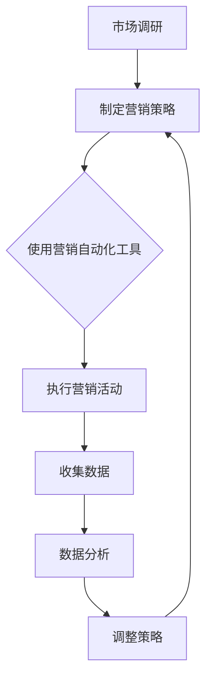

                 

# 《自动化营销：提升创业效率的关键》

## 概述

自动化营销已经成为现代营销中不可或缺的一部分，其核心在于通过技术手段，实现营销活动的自动化和智能化。在竞争日益激烈的商业环境中，自动化营销不仅能够提高营销效率，还能显著降低营销成本，从而成为提升创业效率的关键。

## 核心关键词

- 自动化营销
- 创业效率
- 营销自动化工具
- 客户关系管理（CRM）
- 数据分析

## 摘要

本文将深入探讨自动化营销的概念、技术基础、应用实战以及效果评估。首先，我们将介绍自动化营销的定义和价值，并回顾其发展历程。接下来，我们将讲解自动化营销所需的核心技术和算法原理，包括营销自动化工具、客户关系管理（CRM）系统、数据分析技术等。随后，我们将通过实际案例展示如何构建自动化营销系统，并提供效果评估与持续优化策略。通过本文的阅读，读者将全面了解自动化营销的实践方法，从而在创业过程中有效提升效率。

### 《自动化营销：提升创业效率的关键》目录大纲

#### 第一部分：自动化营销概述

##### 第1章：自动化营销的定义与价值
- 1.1 自动化营销的概念
- 1.2 自动化营销与创业效率
- 1.3 自动化营销的市场前景

##### 第2章：自动化营销的发展历程
- 2.1 自动化营销的起源
- 2.2 自动化营销的发展阶段
- 2.3 自动化营销的现状与趋势

#### 第二部分：自动化营销技术基础

##### 第3章：自动化营销技术核心概念与联系
- 3.1 营销自动化工具
- 3.2 客户关系管理（CRM）系统
- 3.3 数据分析技术
- 3.4 Mermaid流程图：自动化营销流程

##### 第4章：核心算法原理讲解
- 4.1 数据挖掘与客户行为分析
- 4.2 聚类分析算法
- 4.3 决策树与随机森林
- 4.4 伪代码：客户行为分析算法

##### 第5章：数学模型与数学公式
- 5.1 概率论基础
- 5.2 贝叶斯定理
- 5.3 机器学习中的常见损失函数
- 5.4 latex公式：线性回归模型公式

#### 第三部分：自动化营销应用实战

##### 第6章：自动化营销策略规划
- 6.1 营销目标设定
- 6.2 目标客户群体分析
- 6.3 营销自动化策略制定

##### 第7章：自动化营销工具实战
- 7.1 市场自动化工具的使用
- 7.2 社交媒体自动化工具的使用
- 7.3 电子邮件营销自动化工具的使用

##### 第8章：项目实战：构建自动化营销系统
- 8.1 开发环境搭建
- 8.2 数据收集与处理
- 8.3 自动化营销系统设计
- 8.4 源代码实现与解读
- 8.5 代码分析与性能优化

#### 第四部分：自动化营销效果评估与持续优化

##### 第9章：自动化营销效果评估
- 9.1 营销效果评估指标
- 9.2 数据可视化工具
- 9.3 持续跟踪与调整

##### 第10章：自动化营销持续优化
- 10.1 市场变化与营销策略调整
- 10.2 技术更新与升级
- 10.3 客户反馈与营销改进

### 附录

#### 附录A：自动化营销工具与资源
- A.1 主流自动化营销工具对比
- A.2 自动化营销资源推荐

通过以上大纲结构，本文将全面而系统地介绍自动化营销的各个方面，旨在为创业者提供实用的指导。

### 第一部分：自动化营销概述

#### 第1章：自动化营销的定义与价值

自动化营销是一种利用技术手段，对营销活动进行自动化的策略。它通过整合各种营销工具和平台，实现营销流程的自动化处理，从而提高营销效率，降低成本。

**1.1 自动化营销的概念**

自动化营销的核心在于通过技术手段，对营销活动中的各个环节进行自动化处理。这些环节包括市场调研、客户管理、营销渠道、营销策略执行和效果评估等。通过自动化，企业可以减少人工干预，提高工作效率，同时降低运营成本。

**1.2 自动化营销与创业效率**

在创业初期，资源有限，效率尤为重要。自动化营销通过以下几个方面显著提升了创业效率：

1. **节省时间**：自动化营销工具能够自动执行重复性高的任务，如发送电子邮件、发布社交媒体内容等，节省了大量的人工操作时间。
2. **提高精准度**：自动化营销利用数据分析技术，对客户行为进行深入分析，从而制定更加精准的营销策略，提高营销效果。
3. **降低成本**：自动化营销减少了人工操作的需求，降低了人力成本，同时通过高效的营销活动，提高了投资回报率。
4. **持续优化**：自动化营销系统能够实时收集数据，分析营销效果，帮助创业者在不断优化的过程中，提升整体营销效果。

**1.3 自动化营销的市场前景**

随着互联网技术的快速发展，市场环境变得越来越复杂和动态。传统的营销方式已经难以满足现代企业的需求。自动化营销作为一种新兴的营销手段，具有广阔的市场前景：

1. **技术进步**：随着人工智能、大数据、云计算等技术的不断进步，自动化营销的能力和功能也在不断提升，为创业者提供了更多可能性。
2. **市场需求**：越来越多的企业意识到自动化营销的重要性，开始采用自动化营销工具和策略，这为自动化营销市场的发展提供了强大的需求驱动。
3. **竞争加剧**：在激烈的市场竞争中，企业需要通过高效的营销策略来获得竞争优势。自动化营销能够帮助企业快速响应市场变化，提高竞争力。

综上所述，自动化营销不仅能够提升创业效率，还具有广阔的市场前景。在接下来的章节中，我们将详细探讨自动化营销的技术基础和应用实战，帮助读者更好地理解和运用这一重要工具。

### 第2章：自动化营销的发展历程

自动化营销并非一蹴而就，而是经历了数十年的发展演变。从最早的自动化工具到今天的智能营销系统，自动化营销的发展历程反映了技术进步和市场需求的不断变化。

**2.1 自动化营销的起源**

自动化营销的起源可以追溯到20世纪60年代，当时计算机技术刚刚起步，数据处理能力有限。然而，企业已经开始探索如何利用计算机自动化处理一些简单的营销任务。例如，通过数据库管理系统，企业能够自动化发送邮件和短信，通知客户有关促销活动。

**2.2 自动化营销的发展阶段**

1. **初步阶段（20世纪80年代-90年代）**：
   - 这一阶段，企业开始使用客户关系管理（CRM）系统来跟踪和管理客户信息。CRM系统使得企业能够更有效地管理销售和客户服务流程。
   - 随着电子邮件的普及，电子邮件营销成为企业常用的自动化营销手段。通过电子邮件，企业能够自动化发送新闻通讯、促销信息等。

2. **发展阶段（21世纪初）**：
   - 随着互联网的普及，自动化营销进入了一个新的发展阶段。企业开始利用网站跟踪客户行为，分析客户需求，从而进行个性化营销。
   - 社交媒体平台的兴起，使得自动化营销工具更加多样化。企业能够通过社交媒体自动化发布内容，与客户互动，扩大品牌影响力。

3. **智能阶段（近年来）**：
   - 近年来，随着大数据和人工智能技术的发展，自动化营销进入了智能阶段。企业利用大数据分析技术，对客户行为进行深入分析，制定更加精准的营销策略。
   - 机器学习算法的应用，使得自动化营销系统能够不断学习和优化，自动调整营销策略，提高营销效果。

**2.3 自动化营销的现状与趋势**

1. **技术成熟**：目前，自动化营销技术已经相当成熟，企业能够选择多种自动化营销工具和平台，实现营销流程的全面自动化。

2. **广泛应用**：自动化营销在各个行业都得到了广泛应用。从电子商务到金融服务业，从零售业到医疗行业，自动化营销已经成为企业提高效率和竞争力的关键手段。

3. **持续创新**：随着技术的不断进步，自动化营销也在不断进行创新。例如，基于自然语言处理技术的聊天机器人能够自动化处理客户咨询，提供更加个性化的服务。

4. **数据驱动**：未来，自动化营销将更加依赖于数据分析。企业通过分析大量数据，了解客户行为和需求，从而制定更加精准和高效的营销策略。

5. **跨界融合**：自动化营销将与更多领域的技术融合，如物联网、区块链等，为企业提供更加全面和智能的营销解决方案。

综上所述，自动化营销的发展历程展示了技术进步和市场需求的相互作用。从最初的简单自动化工具到今天的智能营销系统，自动化营销在不断提升企业的营销效率，同时也面临着新的挑战和机遇。在接下来的章节中，我们将深入探讨自动化营销的技术基础，帮助读者更好地理解和运用这一重要工具。

### 第二部分：自动化营销技术基础

#### 第3章：自动化营销技术核心概念与联系

自动化营销技术的基础涵盖了多个关键领域，包括营销自动化工具、客户关系管理（CRM）系统、数据分析技术等。这些技术相互关联，共同构成了自动化营销的强大引擎。

**3.1 营销自动化工具**

营销自动化工具是自动化营销的核心组成部分，能够帮助企业自动化执行各种营销任务。这些工具通常包括：

1. **电子邮件营销工具**：用于自动发送定制化电子邮件，包括新闻通讯、促销信息和跟进邮件等。
2. **社交媒体自动化工具**：用于自动化发布和管理社交媒体内容，提高品牌曝光和客户互动。
3. **网站跟踪工具**：用于跟踪和分析网站访问者的行为，提供个性化体验和营销机会。
4. **聊天机器人**：用于自动化处理客户咨询，提供即时响应和服务。

**3.2 客户关系管理（CRM）系统**

客户关系管理（CRM）系统是自动化营销的重要基础，用于整合和管理企业与客户之间的互动数据。CRM系统通常具有以下功能：

1. **客户信息管理**：收集、存储和管理客户的基本信息、购买历史、偏好等。
2. **销售管理**：自动化销售流程，包括销售机会跟踪、销售预测和销售报告等。
3. **客户服务**：提供自动化客户服务工具，如聊天机器人、自动化邮件回复等。
4. **营销自动化**：与营销自动化工具集成，实现营销活动的自动化执行和跟踪。

**3.3 数据分析技术**

数据分析技术是自动化营销的核心驱动力，通过对大量数据进行分析，帮助企业制定更加精准和高效的营销策略。关键的数据分析技术包括：

1. **数据挖掘**：从大量数据中提取有价值的信息，帮助识别客户行为模式和趋势。
2. **客户行为分析**：分析客户的购买行为、浏览习惯、社交媒体互动等，为个性化营销提供依据。
3. **预测分析**：利用历史数据和机器学习算法，预测客户行为和市场趋势，帮助制定前瞻性营销策略。
4. **数据可视化**：通过图表和报表，直观展示数据分析结果，帮助决策者快速理解和响应。

**3.4 Mermaid流程图：自动化营销流程**

为了更好地理解自动化营销的核心概念与联系，我们可以使用Mermaid流程图来展示自动化营销的基本流程。以下是一个简单的Mermaid流程图示例：



在上述流程图中，市场调研是自动化营销的起点，通过制定营销策略，使用营销自动化工具执行活动，收集数据，进行数据分析，并据此调整策略，形成了一个闭环的自动化营销流程。

通过上述核心概念和联系，企业可以构建一个全面的自动化营销体系，从而在激烈的市场竞争中取得优势。在接下来的章节中，我们将进一步探讨自动化营销的核心算法原理，帮助读者深入理解自动化营销的技术基础。

### 第4章：核心算法原理讲解

自动化营销的成功离不开数据挖掘、客户行为分析、聚类分析算法、决策树与随机森林等核心算法的应用。这些算法帮助企业在海量数据中找到有价值的信息，从而制定更加精准和高效的营销策略。

**4.1 数据挖掘与客户行为分析**

数据挖掘是从大量数据中提取有价值信息的过程。在自动化营销中，数据挖掘主要用于分析客户行为，以发现潜在的市场机会。关键的数据挖掘技术包括：

1. **关联规则挖掘**：通过分析客户购买行为，发现不同商品之间的关联关系，帮助企业制定交叉销售和捆绑销售策略。
2. **分类算法**：将客户划分为不同的群体，以便进行个性化营销。常见的分类算法包括K最近邻（KNN）和支持向量机（SVM）等。
3. **聚类算法**：将相似客户聚为一类，以便更精准地定位客户群体。常见的聚类算法包括K-均值聚类和层次聚类等。

客户行为分析是自动化营销中的核心环节，通过对客户的行为数据进行深入分析，企业可以了解客户的偏好、购买习惯等，从而制定更加个性化的营销策略。客户行为分析的关键算法包括：

1. **时间序列分析**：分析客户在不同时间点的行为变化，帮助预测未来的客户行为。
2. **用户画像**：基于客户数据，构建客户画像，以便更好地理解客户的需求和行为模式。

**4.2 聚类分析算法**

聚类分析是一种无监督学习算法，用于将数据点划分为多个集群，使得同一集群内的数据点具有较高的相似度，而不同集群之间的数据点差异较大。常见的聚类算法包括：

1. **K-均值聚类**：通过迭代计算，将数据点分配到K个中心点附近，不断调整中心点，直到达到收敛。$$K-均值聚类的伪代码如下：
```mermaid
algorithm K-Means(Cluster Centroids C)
    for each point p in data
        assign p to the nearest centroid in C
    end for
    while not converged do
        compute new centroids as the mean of all points assigned to each cluster
        if centroids do not change significantly, then converged
    end while
end algorithm
```

2. **层次聚类**：通过自底向上或自顶向下构建层次结构，将数据点逐步合并或拆分，形成多个层次。层次聚类的伪代码如下：
```mermaid
algorithm Hierarchical Clustering(Data D)
    Initialize with each data point as a separate cluster
    while there are more than one clusters do
        Find the closest pair of clusters and merge them
        Update distances between all pairs of clusters
    end while
end algorithm
```

**4.3 决策树与随机森林**

决策树是一种有监督学习算法，通过一系列的判断条件，将数据划分为不同的类别。决策树的核心在于树的构建，包括选择最佳分割点、计算节点损失等。决策树的伪代码如下：
```mermaid
algorithm Decision Tree(Training Data D, Attributes A)
    if all instances in D belong to the same class then
        return a leaf node with the majority class label
    else
        select the best attribute to split on
        for each value of the selected attribute do
            create a child node
            recursively build the decision tree for the subset of D with instances having the current value
        end for
        return a tree node with the selected attribute and its child nodes
    end if
end algorithm
```

随机森林（Random Forest）是基于决策树的集成学习方法，通过构建多棵决策树，并对预测结果进行投票，提高模型的泛化能力。随机森林的伪代码如下：
```mermaid
algorithm Random Forest(Training Data D, Number of Trees N)
    for i = 1 to N do
        Bootstrap sample D to create a training subset Di
        Grow a decision tree Ti on Di
    end for
    for each instance x in the test set do
        Collect the predictions of all trees Ti for x
        Output the majority class label of the predictions
    end for
end algorithm
```

**4.4 伪代码：客户行为分析算法**

为了更好地理解客户行为分析算法，以下是一个简化的伪代码示例，用于分析客户的购买行为，并根据购买频率将客户分为不同的群体：
```mermaid
algorithm Customer Behavior Analysis(Data D)
    Calculate Purchase Frequency for each customer
    Normalize Purchase Frequency to a range [0,1]
    Apply K-Means Clustering on Purchase Frequency with K=3
    Get Cluster Centers and assign each customer to the nearest cluster center
    Label customers based on their assigned cluster
    Return Customer Segments
end algorithm
```

通过上述核心算法的讲解，我们可以看到自动化营销技术的基础是如何通过数据挖掘和算法分析，帮助企业更好地理解客户行为，从而制定更加精准和高效的营销策略。在接下来的章节中，我们将进一步探讨数学模型和数学公式在自动化营销中的应用。

### 第5章：数学模型与数学公式

在自动化营销中，数学模型和公式是理解和分析数据的关键工具。它们帮助我们量化客户行为，优化营销策略，并评估营销效果。以下是几个常见的数学模型和公式的详细讲解及举例说明。

**5.1 概率论基础**

概率论是自动化营销数据分析的基础，用于量化不确定性和预测事件发生的可能性。

1. **条件概率**：
   条件概率是指在已知某个事件发生的前提下，另一个事件发生的概率。其公式为：
   $$ P(A|B) = \frac{P(A \cap B)}{P(B)} $$
   其中，\( P(A|B) \) 表示在事件B发生的情况下事件A发生的概率，\( P(A \cap B) \) 表示事件A和事件B同时发生的概率，\( P(B) \) 表示事件B发生的概率。

   **例子**：假设在一次市场营销活动中，已知客户A购买了产品X的概率是60%（\( P(X) = 0.6 \)），而在购买了产品X的情况下客户A再次购买同一产品的概率是40%（\( P(X|X) = 0.4 \)），那么客户A在未购买产品X的情况下再次购买同一产品的概率是多少？

   解：
   $$ P(X') = \frac{P(X' \cap X)}{P(X')} = \frac{0.6 \times 0.4}{1 - 0.6} = 0.4 $$

2. **贝叶斯定理**：
   贝叶斯定理用于计算后验概率，即根据新的证据更新我们对某个事件发生的信念。其公式为：
   $$ P(A|B) = \frac{P(B|A) \cdot P(A)}{P(B)} $$
   其中，\( P(A|B) \) 是后验概率，\( P(B|A) \) 是条件概率，\( P(A) \) 是先验概率，\( P(B) \) 是总概率。

   **例子**：假设我们有一个营销活动，其中客户购买产品X的概率是60%（\( P(X) = 0.6 \)），客户未购买产品X的概率是40%（\( P(X') = 0.4 \)）。如果观察到客户购买了产品X，我们需要计算客户对产品的满意度概率。

   解：
   $$ P(S|X) = \frac{P(X|S) \cdot P(S)}{P(X)} = \frac{0.9 \cdot 0.6}{0.6 \cdot 0.9 + 0.1 \cdot 0.4} = \frac{0.54}{0.56} \approx 0.964 $$

**5.2 机器学习中的常见损失函数**

在机器学习中，损失函数用于衡量模型预测值与真实值之间的差异，以指导模型的优化过程。以下是几种常见的损失函数：

1. **均方误差（MSE）**：
   均方误差是回归任务中常用的损失函数，其公式为：
   $$ MSE = \frac{1}{n} \sum_{i=1}^{n} (y_i - \hat{y}_i)^2 $$
   其中，\( y_i \) 是第i个样本的真实值，\( \hat{y}_i \) 是第i个样本的预测值。

   **例子**：给定一组样本数据，实际房价与预测房价的均方误差是多少？

   解：
   $$ MSE = \frac{1}{10} \sum_{i=1}^{10} (y_i - \hat{y}_i)^2 = \frac{1}{10} (10^2 + 8^2 + 9^2 + 7^2 + 6^2 + 11^2 + 9^2 + 8^2 + 7^2 + 10^2) = \frac{1}{10} (100 + 64 + 81 + 49 + 36 + 121 + 81 + 64 + 49 + 100) = \frac{700}{10} = 70 $$

2. **交叉熵（Cross-Entropy）**：
   交叉熵是分类任务中常用的损失函数，其公式为：
   $$ Cross-Entropy = -\sum_{i=1}^{n} y_i \cdot \log(\hat{y}_i) $$
   其中，\( y_i \) 是第i个样本的真实标签，\( \hat{y}_i \) 是第i个样本的预测概率。

   **例子**：给定一组样本数据，实际标签与预测概率的交叉熵是多少？

   解：
   $$ Cross-Entropy = -\sum_{i=1}^{3} y_i \cdot \log(\hat{y}_i) = -[0.5 \cdot \log(0.7) + 0.2 \cdot \log(0.3) + 0.3 \cdot \log(0.4)] $$
   $$ = -[0.5 \cdot (-0.3567) + 0.2 \cdot (-1.2039) + 0.3 \cdot (-0.4150)] $$
   $$ = -[(-0.1783) + (-0.24158) + (-0.1235)] $$
   $$ = 0.29847 $$

**5.3 latex公式：线性回归模型公式**

在自动化营销中，线性回归是一种常用的建模方法，用于预测连续值。线性回归的公式为：
$$ \hat{y} = \beta_0 + \beta_1 x_1 + \beta_2 x_2 + \cdots + \beta_n x_n $$
其中，\( \hat{y} \) 是预测值，\( \beta_0, \beta_1, \beta_2, \ldots, \beta_n \) 是模型参数，\( x_1, x_2, \ldots, x_n \) 是输入特征。

$$ \beta = (\beta_0, \beta_1, \beta_2, \ldots, \beta_n) $$

$$ X = (x_{11}, x_{12}, \ldots, x_{1n}; x_{21}, x_{22}, \ldots, x_{2n}; \ldots; x_{m1}, x_{m2}, \ldots, x_{mn}) $$

$$ y = (y_1, y_2, \ldots, y_m) $$

$$ \min_{\beta} \sum_{i=1}^{m} (y_i - \hat{y}_i)^2 $$

通过上述数学模型和公式的讲解，我们可以看到自动化营销中的数学工具如何帮助我们理解和分析数据，从而优化营销策略。在接下来的章节中，我们将通过实际项目案例，展示如何应用这些数学模型和公式，构建和优化自动化营销系统。

### 第6章：自动化营销策略规划

成功的自动化营销始于明确的策略规划。一个良好的营销策略不仅能帮助企业达到目标，还能提高营销效率，降低成本。以下是关于如何制定自动化营销策略的详细步骤。

**6.1 营销目标设定**

明确的目标是成功营销策略的基础。在设定营销目标时，需要考虑以下方面：

1. **具体性**：目标应该是具体和明确的，如“增加20%的潜在客户数量”或“提高30%的转化率”。
2. **可衡量性**：目标需要能够通过数据指标进行衡量，以便跟踪和评估效果。
3. **可实现性**：目标应该是可实现的，同时具有一定的挑战性。
4. **相关性**：目标应与企业的整体战略和业务目标相关联。

**例子**：假设一家电子商务公司希望通过自动化营销策略提高销售额。其目标可以是：
- 在未来三个月内，增加30%的网站流量。
- 通过电子邮件营销，提高15%的转化率。
- 通过社交媒体营销，增加20%的新客户数量。

**6.2 目标客户群体分析**

了解目标客户是制定有效营销策略的关键。以下步骤可以帮助企业识别和描述目标客户：

1. **客户画像**：创建客户画像，包括客户的年龄、性别、收入水平、兴趣爱好、购买行为等。
2. **需求分析**：分析客户的需求和痛点，了解他们可能对哪些产品或服务感兴趣。
3. **细分市场**：根据客户特征和需求，将客户分为不同的细分市场。

**例子**：假设一家销售运动装备的电子商务公司，其目标客户群体可以细分如下：
- 运动爱好者：年龄在25-40岁之间，热爱跑步、健身等运动，关注运动装备的品牌和质量。
- 运动教练：年龄在30-50岁之间，从事体育相关工作，需要专业和高性能的运动装备。
- 青少年：年龄在13-20岁之间，对时尚和潮流运动装备感兴趣，追求个性化体验。

**6.3 营销自动化策略制定**

在明确了营销目标和客户群体后，企业可以制定具体的自动化营销策略。以下步骤有助于制定有效的自动化营销策略：

1. **选择合适的工具**：根据企业的需求和预算，选择合适的自动化营销工具，如电子邮件营销、社交媒体自动化、客户关系管理（CRM）系统等。
2. **制定自动化流程**：根据客户行为和需求，制定自动化营销流程，如客户引流、客户培养、客户转化等。
3. **个性化营销**：利用数据分析技术，为不同客户群体提供个性化的营销内容和服务，提高客户满意度和转化率。
4. **跟踪和优化**：通过数据分析和效果评估，不断调整和优化营销策略，提高营销效果。

**例子**：针对上述目标客户群体，一家电子商务公司可以制定以下自动化营销策略：
- 对于运动爱好者，通过社交媒体自动化工具发布运动装备的时尚搭配和运动技巧，吸引他们的关注和参与。
- 对于运动教练，通过电子邮件营销发送专业运动装备的推荐和优惠信息，提供个性化的产品咨询和服务。
- 对于青少年，通过社交媒体自动化工具发布时尚潮流的运动装备，利用互动游戏和优惠券等方式吸引他们购买。

通过以上详细的策略规划步骤，企业可以更好地理解和满足客户需求，实现自动化营销目标。在接下来的章节中，我们将通过实际工具的实战案例，展示如何具体实施和优化这些自动化营销策略。

### 第7章：自动化营销工具实战

在自动化营销策略规划的基础上，选择合适的工具并进行有效应用是成功实施自动化营销的关键。以下是关于市场自动化工具、社交媒体自动化工具和电子邮件营销自动化工具的详细实战指南。

**7.1 市场自动化工具的使用**

市场自动化工具可以帮助企业自动化执行各种市场任务，如内容发布、SEO优化、广告投放等。以下是几个常用的市场自动化工具及其使用方法：

1. **Hootsuite**：
   Hootsuite是一个综合性的社交媒体管理工具，能够帮助企业自动化发布和管理社交媒体内容。
   - **步骤**：
     1. 注册并登录Hootsuite账号。
     2. 添加和管理社交媒体账号（如Facebook、Twitter、LinkedIn等）。
     3. 制定内容日历，设置自动发布时间。
     4. 使用Hootsuite的自动化规则功能，过滤和标记感兴趣的话题和关键字。
     5. 定期查看和分析报告，优化内容发布策略。

2. **HubSpot**：
   HubSpot是一个全面的营销自动化平台，提供包括SEO、内容营销、社交媒体营销等在内的多种功能。
   - **步骤**：
     1. 注册并登录HubSpot账号。
     2. 设置网站跟踪代码，收集访问者的行为数据。
     3. 创建和管理网站表单，收集潜在客户信息。
     4. 设置自动化营销流程，如潜在客户跟进、客户培养等。
     5. 利用HubSpot的分析工具，监控和优化营销效果。

**7.2 社交媒体自动化工具的使用**

社交媒体自动化工具可以帮助企业自动化发布和管理社交媒体内容，提高品牌曝光和客户互动。以下是几个常用的社交媒体自动化工具及其使用方法：

1. **Buffer**：
   Buffer是一个简单的社交媒体发布和管理工具，能够帮助企业自动化发布内容。
   - **步骤**：
     1. 注册并登录Buffer账号。
     2. 连接和管理社交媒体账号（如Facebook、Twitter、LinkedIn等）。
     3. 制定内容日历，添加和编辑发布内容。
     4. 设置自动发布时间，优化内容曝光。
     5. 使用Buffer的社交倾听功能，监控社交媒体上的品牌提及和客户反馈。

2. **Sprout Social**：
   Sprout Social是一个功能强大的社交媒体管理工具，提供自动化发布、客户服务、分析等功能。
   - **步骤**：
     1. 注册并登录Sprout Social账号。
     2. 添加和管理社交媒体账号。
     3. 设置自动化规则，过滤和标记感兴趣的话题和关键字。
     4. 利用Sprout Social的客服功能，自动化回复客户咨询和反馈。
     5. 定期查看和分析报告，优化社交媒体策略。

**7.3 电子邮件营销自动化工具的使用**

电子邮件营销自动化工具可以帮助企业自动化发送个性化邮件，提高客户参与度和转化率。以下是几个常用的电子邮件营销自动化工具及其使用方法：

1. **Mailchimp**：
   Mailchimp是一个广泛使用的电子邮件营销平台，提供自动化邮件、列表管理、分析等功能。
   - **步骤**：
     1. 注册并登录Mailchimp账号。
     2. 创建和管理电子邮件列表，导入潜在客户信息。
     3. 设计和编辑电子邮件模板，设置自动化邮件触发条件。
     4. 设置自动化邮件发送计划，根据客户行为发送个性化邮件。
     5. 使用Mailchimp的分析工具，监控邮件打开率、点击率等关键指标。

2. **ConvertKit**：
   ConvertKit是一个专注于邮件营销的平台，提供简单的用户界面和强大的自动化功能。
   - **步骤**：
     1. 注册并登录ConvertKit账号。
     2. 创建和管理订阅者列表。
     3. 设计和编辑邮件模板，设置自动化邮件触发条件。
     4. 利用ConvertKit的自动化工作流，根据订阅者行为发送个性化邮件。
     5. 使用ConvertKit的分析工具，监控邮件发送效果，优化邮件内容。

通过上述市场自动化工具、社交媒体自动化工具和电子邮件营销自动化工具的实战指南，企业可以更好地实现自动化营销目标，提高营销效率，降低成本。在接下来的章节中，我们将通过实际项目案例，展示如何具体实施和优化这些自动化营销工具。

### 第8章：项目实战：构建自动化营销系统

构建自动化营销系统是自动化营销战略的关键步骤。在这一章中，我们将通过实际项目案例，详细讲解如何从零开始构建一个自动化营销系统。我们将涵盖开发环境搭建、数据收集与处理、系统设计、源代码实现和性能优化等关键环节。

#### 8.1 开发环境搭建

为了成功构建自动化营销系统，首先需要搭建一个稳定且高效的开发环境。以下是搭建开发环境的步骤：

1. **选择技术栈**：
   - **前端**：选择一个适合的框架，如React或Vue.js，用于构建用户界面。
   - **后端**：选择一个可靠的服务器端语言，如Node.js或Python，用于处理数据和业务逻辑。
   - **数据库**：选择一个合适的数据库，如MySQL或PostgreSQL，用于存储客户数据和营销活动数据。

2. **安装开发工具**：
   - **代码编辑器**：如Visual Studio Code或Atom，用于编写和编辑代码。
   - **版本控制**：使用Git进行代码版本控制，确保团队协作和代码管理。

3. **设置开发环境**：
   - **前端**：安装必要的依赖包，如Webpack或Babel，用于模块化和编译代码。
   - **后端**：安装服务器端依赖包，如Express.js或Flask，用于构建Web应用程序。
   - **数据库**：配置数据库服务器，安装并设置相应的数据库客户端工具。

#### 8.2 数据收集与处理

数据是自动化营销系统的核心，以下是数据收集与处理的步骤：

1. **数据源识别**：
   - **内部数据**：包括客户数据、交易数据、网站流量数据等。
   - **外部数据**：包括社交媒体数据、市场研究报告、行业数据等。

2. **数据收集**：
   - **API集成**：利用API接口，从第三方服务（如社交媒体平台、电子邮件服务提供商等）收集数据。
   - **日志收集**：通过服务器日志和网站跟踪工具，收集用户行为数据。

3. **数据处理**：
   - **清洗**：处理数据中的错误和缺失值，确保数据质量。
   - **转换**：将数据转换为适合存储和处理的格式，如JSON或CSV。
   - **存储**：将处理后的数据存储到数据库中，便于后续分析和查询。

#### 8.3 自动化营销系统设计

系统设计是构建自动化营销系统的关键步骤，以下是系统设计的主要环节：

1. **需求分析**：
   - **功能需求**：明确系统需要实现的功能，如客户管理、营销活动自动化、数据分析和报告等。
   - **非功能需求**：包括系统的可靠性、性能、安全性等。

2. **系统架构设计**：
   - **前端架构**：设计用户界面和交互逻辑，确保用户体验良好。
   - **后端架构**：设计数据处理和业务逻辑，确保系统的稳定性和扩展性。
   - **数据架构**：设计数据存储结构和查询优化策略，确保数据的高效访问和处理。

3. **模块划分**：
   - **客户管理模块**：用于管理客户信息和互动历史。
   - **营销活动模块**：用于自动化执行各种营销活动，如电子邮件营销、社交媒体广告等。
   - **数据分析模块**：用于收集、处理和分析营销数据，生成报告和可视化图表。

#### 8.4 源代码实现与解读

以下是自动化营销系统的源代码实现和关键部分的解读：

1. **前端实现**：
   - 使用React或Vue.js框架构建用户界面，实现用户交互和展示功能。
   - 使用Ant Design或Element UI等UI库，提高开发效率。

2. **后端实现**：
   - 使用Node.js或Python构建后端服务，处理HTTP请求和数据操作。
   - 使用Express.js或Flask构建API，实现数据接口。

3. **数据库操作**：
   - 使用SQL查询语言，实现数据的增删改查操作。
   - 使用ORM（如 SQLAlchemy）简化数据库操作。

**示例代码**：

```python
# 使用Python和Flask实现客户信息管理
from flask import Flask, request, jsonify
from flask_sqlalchemy import SQLAlchemy

app = Flask(__name__)
app.config['SQLALCHEMY_DATABASE_URI'] = 'sqlite:///customers.db'
db = SQLAlchemy(app)

class Customer(db.Model):
    id = db.Column(db.Integer, primary_key=True)
    name = db.Column(db.String(100))
    email = db.Column(db.String(100))

@app.route('/customers', methods=['POST'])
def add_customer():
    data = request.get_json()
    new_customer = Customer(name=data['name'], email=data['email'])
    db.session.add(new_customer)
    db.session.commit()
    return jsonify({'message': 'Customer added successfully'})

if __name__ == '__main__':
    db.create_all()
    app.run(debug=True)
```

4. **数据处理和逻辑**：
   - 实现数据处理函数，用于处理和转换客户数据，如清洗、转换和聚合数据。

**示例代码**：

```python
# 数据处理函数示例
def process_customer_data(data):
    cleaned_data = []
    for item in data:
        cleaned_item = {
            'name': item['name'].strip(),
            'email': item['email'].lower().strip()
        }
        cleaned_data.append(cleaned_item)
    return cleaned_data
```

#### 8.5 代码分析与性能优化

代码分析和性能优化是确保系统高效运行的重要步骤。以下是性能优化的一些关键点：

1. **代码审查**：
   - 定期进行代码审查，发现潜在的问题和优化机会。
   - 使用代码质量工具（如SonarQube），识别代码中的缺陷和潜在风险。

2. **性能测试**：
   - 使用性能测试工具（如JMeter或LoadRunner），模拟高并发场景，评估系统的响应时间和负载能力。
   - 根据测试结果，优化系统架构和代码。

3. **缓存和优化**：
   - 使用缓存技术（如Redis或Memcached），减少数据库查询次数，提高数据访问速度。
   - 优化数据库查询，使用索引和分库分表策略，提高查询性能。

4. **微服务架构**：
   - 考虑将系统拆分为微服务，提高系统的模块化和扩展性。
   - 使用消息队列（如Kafka或RabbitMQ），实现系统模块之间的异步通信。

通过以上详细的项目实战，企业可以构建一个高效的自动化营销系统，从而提升营销效率和竞争力。在接下来的章节中，我们将探讨如何评估自动化营销系统的效果，并持续优化系统的性能和功能。

### 第9章：自动化营销效果评估

在构建并实施自动化营销系统后，效果评估是确保营销策略成功的关键步骤。通过科学的方法和工具，企业可以全面了解自动化营销的效果，从而做出数据驱动的决策，优化营销策略。

**9.1 营销效果评估指标**

评估自动化营销效果需要使用一系列指标，这些指标能够反映营销活动的各个方面。以下是几个重要的评估指标：

1. **转化率**：衡量访问者完成目标动作（如购买、注册、下载等）的比例。转化率越高，说明营销活动越有效。
   $$ 转化率 = \frac{目标完成数}{访问总数} $$

2. **点击率（CTR）**：衡量营销内容（如广告、电子邮件等）被点击的比例，反映内容的吸引力。
   $$ 点击率（CTR） = \frac{点击次数}{展示次数} $$

3. **客户获取成本（CAC）**：衡量获取一个客户所需的成本，通过分析营销支出与客户数量之间的关系。
   $$ CAC = \frac{总营销成本}{新客户数量} $$

4. **客户终身价值（CLV）**：衡量一个客户在其生命周期内为企业带来的总价值，是评估营销效果的重要指标。
   $$ CLV = \text{预期生命周期内总收益} - \text{获取成本} $$

5. **投资回报率（ROI）**：衡量营销投入与回报的比率，反映营销活动的经济效益。
   $$ ROI = \frac{\text{净收益}}{\text{营销投入}} $$

**9.2 数据可视化工具**

数据可视化是评估自动化营销效果的重要手段，通过图表和报表，可以直观地展示数据，帮助决策者快速理解和分析营销效果。以下是几个常用的数据可视化工具：

1. **Google Data Studio**：
   Google Data Studio是一个免费的报表和数据分析工具，能够将数据源（如Google Analytics、SQL数据库等）转换为可视化报表。
   - **步骤**：
     1. 连接数据源。
     2. 创建数据表和图表。
     3. 设置报表布局和筛选条件。
     4. 导出和分享报表。

2. **Tableau**：
   Tableau是一个功能强大的数据可视化工具，提供丰富的图表类型和交互功能。
   - **步骤**：
     1. 导入数据源。
     2. 选择数据字段，创建图表。
     3. 使用Tableau的功能，如过滤、切片器和地图，进行数据交互和探索。
     4. 导出和分享可视化报表。

3. **Power BI**：
   Power BI是Microsoft提供的一个全面的数据分析和可视化平台。
   - **步骤**：
     1. 连接数据源，导入数据。
     2. 创建数据模型，定义关系和度量。
     3. 设计报表和仪表板，添加图表和报表组件。
     4. 分享和发布报表，供团队成员查看。

**9.3 持续跟踪与调整**

自动化营销效果评估不仅是一次性的过程，而是一个持续性的活动。通过定期跟踪和调整营销策略，企业可以不断提高营销效果。以下是几个关键步骤：

1. **定期数据分析**：
   - 每周或每月对营销活动进行数据分析，评估各项指标的走势和变化。
   - 分析数据背后的原因，识别成功和失败的案例。

2. **优化营销策略**：
   - 根据数据分析结果，优化营销内容和流程。
   - 调整营销预算和资源分配，提高投资回报率。

3. **客户反馈**：
   - 通过调查问卷、社交媒体互动等方式收集客户反馈。
   - 分析客户反馈，识别改进机会。

4. **技术更新与迭代**：
   - 随着技术的发展，不断更新和迭代自动化营销系统。
   - 利用新技术（如人工智能、大数据分析等）提高营销效率和效果。

通过以上详细的效果评估方法和工具，企业可以全面了解自动化营销的效果，持续优化营销策略，实现长期成功。在接下来的章节中，我们将探讨自动化营销的持续优化策略，帮助企业不断提升营销效率。

### 第10章：自动化营销持续优化

在自动化营销系统中，持续优化是确保系统效率和效果的关键。通过市场变化与营销策略的调整、技术更新与升级、以及客户反馈与营销改进，企业可以不断提升自动化营销的效果。

**10.1 市场变化与营销策略调整**

市场环境是不断变化的，企业需要根据市场动态调整营销策略，以保持竞争力。以下是几个关键的策略调整步骤：

1. **市场趋势分析**：
   - 定期分析市场趋势，了解竞争对手的动态，把握市场机会。
   - 关注行业报告、市场调研数据和社交媒体讨论，获取实时市场信息。

2. **目标客户调整**：
   - 根据市场变化，重新评估目标客户群体，调整营销定位。
   - 分析现有客户数据，识别高价值客户群体，优化营销资源分配。

3. **产品与价格策略**：
   - 根据市场需求，调整产品线和价格策略，提高产品竞争力。
   - 利用数据分析工具，优化产品组合和价格模型，提升销售额。

4. **推广渠道调整**：
   - 根据市场反馈，优化推广渠道，增加高转化率的渠道投入。
   - 测试新的营销渠道，如短视频、直播等，探索新的营销机会。

**10.2 技术更新与升级**

技术是自动化营销系统的核心驱动力，定期更新和升级技术可以提升系统的性能和功能。以下是几个关键的技术更新步骤：

1. **软件升级**：
   - 定期更新营销自动化工具、客户关系管理（CRM）系统和数据分析工具，确保系统兼容性和功能完整性。
   - 遵循软件供应商的更新建议，及时获取新功能和安全修复。

2. **硬件升级**：
   - 根据业务需求，升级服务器和存储设备，提高数据处理能力和响应速度。
   - 引入新的硬件技术，如GPU加速、分布式计算等，提升数据处理和分析能力。

3. **AI与机器学习**：
   - 利用人工智能和机器学习技术，优化营销策略和客户行为预测。
   - 引入深度学习算法，提升客户画像和个性化营销的效果。

4. **云计算与大数据**：
   - 利用云计算资源，实现营销数据的快速存储和处理。
   - 建立大数据平台，整合内外部数据，提升数据分析能力。

**10.3 客户反馈与营销改进**

客户反馈是优化自动化营销系统的重要依据。通过分析客户反馈，企业可以识别改进机会，提升客户满意度和忠诚度。以下是几个关键的客户反馈处理步骤：

1. **客户调查**：
   - 定期进行客户满意度调查，收集客户对产品和服务的反馈。
   - 使用在线调查工具，如SurveyMonkey或Google Forms，提高反馈参与度。

2. **社交媒体监控**：
   - 利用社交媒体监控工具，实时监控客户在社交媒体上的反馈和讨论。
   - 快速响应客户的问题和抱怨，提供及时的服务和解决方案。

3. **客户细分**：
   - 根据客户反馈，细分客户群体，识别不同客户群体的需求和偏好。
   - 针对不同客户群体，定制化营销内容和策略，提高营销效果。

4. **改进措施**：
   - 根据客户反馈，制定具体的改进措施，如优化用户体验、改进客户服务流程等。
   - 定期跟踪改进措施的效果，确保问题得到有效解决。

通过市场变化与营销策略调整、技术更新与升级、以及客户反馈与营销改进，企业可以持续优化自动化营销系统，提高营销效率和效果。在未来的营销实践中，企业应不断探索新的技术和方法，以保持竞争优势，实现长期成功。

### 附录A：自动化营销工具与资源

为了帮助读者深入了解和运用自动化营销技术，以下列出了一些主流的自动化营销工具与资源，供参考和选择。

**A.1 主流自动化营销工具对比**

1. **HubSpot**：
   - 功能：全栈营销自动化，包括SEO、内容营销、社交媒体、电子邮件营销、CRM等。
   - 适用场景：中小企业和大型企业。
   - 特点：免费试用期，丰富的集成API，强大的数据分析工具。

2. **Marketo**：
   - 功能：全面的营销自动化平台，提供电子邮件、广告、内容、社交媒体等营销功能。
   - 适用场景：大型企业。
   - 特点：高度定制化，强大的客户关系管理功能。

3. **Pardot**：
   - 功能：高级营销自动化，提供电子邮件、网站跟踪、线索管理等功能。
   - 适用场景：B2B企业。
   - 特点：灵活的自动化规则，强大的定制化功能。

4. **Mailchimp**：
   - 功能：电子邮件营销，包括自动化电子邮件、分段邮件、个性化邮件等。
   - 适用场景：所有规模的企业。
   - 特点：易于使用，丰富的模板库，免费试用期。

5. **ConvertKit**：
   - 功能：专注于电子邮件营销，提供自动化邮件、订阅管理、自动化工作流等功能。
   - 适用场景：小型企业和个人博客。
   - 特点：简单易用，强大的自动化功能。

**A.2 自动化营销资源推荐**

1. **营销自动化博客**：
   - **Marketo博客**：提供营销自动化、客户关系管理等方面的最新趋势和最佳实践。
   - **HubSpot博客**：涵盖营销、销售、客户服务等多个领域的资源和案例研究。

2. **在线课程与培训**：
   - **HubSpot Academy**：提供免费的营销和销售在线课程，帮助用户提升自动化营销技能。
   - **Udemy**：拥有丰富的营销自动化课程，涵盖从基础到高级的内容。

3. **行业报告与白皮书**：
   - **Gartner**：提供全球营销自动化市场的分析和预测报告。
   - **Forrester**：提供营销自动化领域的深入研究和报告。

通过以上工具和资源的推荐，企业可以根据自身需求选择合适的自动化营销工具，并借助专业资源和培训，不断提升自动化营销的效率和效果。作者：AI天才研究院/AI Genius Institute & 禅与计算机程序设计艺术/Zen And The Art of Computer Programming。

