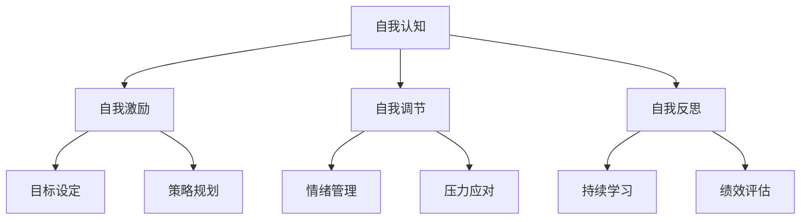

                 

### 《自我领导力：个人效能提升的基础》

自我领导力，作为个人效能提升的基础，在当今快节奏和高压力的工作环境中显得尤为重要。本文将深入探讨自我领导力的概念、基础理论以及实践方法，旨在帮助读者理解和提升自我领导力，进而提高个人工作效率和生活质量。

在开始正文之前，让我们首先明确本文的关键词：自我领导力、个人效能、目标设定、情绪智力、压力管理、自我认知、自我激励、自我调节、自我反思、SMART目标等。

**摘要：**本文将从自我领导力的基础概念出发，详细探讨其核心要素和理论基础，如目标设定理论、情绪智力理论、压力管理理论等。接着，文章将介绍提升自我领导力的实践技巧，包括提高自我认知能力、自我激励与目标达成、情绪管理与压力应对、自我调节与持续学习等。最后，文章将通过实际案例和代码实现，展示如何将自我领导力应用到实际工作和生活中，帮助读者在实践中提升自我领导力。

## 《自我领导力：个人效能提升的基础》目录大纲

### 第一部分：自我领导力基础概念与框架

#### 第1章：自我领导力概述
- **1.1 自我领导力的定义与意义**
  - 自我领导力的基本概念
  - 自我领导力与个人效能提升的关系
- **1.2 自我领导力的核心要素**
  - 自我认知
  - 自我激励
  - 自我调节
  - 自我反思

#### 第2章：个人效能提升的理论基础
- **2.1 目标设定理论**
  - 目标设定的基本原理
  - 如何设定SMART目标
- **2.2 情绪智力理论**
  - 情绪智力的概念
  - 提升情绪智力的方法
- **2.3 压力管理理论**
  - 压力的来源与影响
  - 压力管理的策略

### 第二部分：自我领导力实践技巧与方法

#### 第3章：提高自我认知能力
- **3.1 自我认知的重要性**
  - 自我认知与自我领导力的关系
- **3.2 自我认知的方法**
  - 反思日记
  - 360度反馈
- **3.3 自我认知的实践案例**

#### 第4章：自我激励与目标达成
- **4.1 自我激励的理论基础**
  - 期望理论
  - 策略目标理论
- **4.2 提升自我激励的技巧**
  - 建立个人使命与愿景
  - 设定具体、可衡量、可实现的目标
- **4.3 自我激励的实践案例**

#### 第5章：情绪管理与压力应对
- **5.1 情绪管理的基本策略**
  - 情绪调节技巧
  - 情绪表达的技巧
- **5.2 压力管理的实用方法**
  - 时间管理
  - 睡眠管理
- **5.3 情绪管理与压力应对的实践案例**

#### 第6章：自我调节与持续学习
- **6.1 自我调节的理论基础**
  - 自我调节的心理学原理
  - 自我调节的能力培养
- **6.2 持续学习的策略**
  - 终身学习的理念
  - 学习资源的获取与利用
- **6.3 自我调节与持续学习的实践案例**

### 第三部分：自我领导力的综合应用

#### 第7章：构建自我领导力行动计划
- **7.1 行动计划的制定**
  - 制定个人发展计划的步骤
  - 行动计划的执行策略
- **7.2 遇到挑战时的应对策略**
  - 面对困难的态度调整
  - 解决问题的方法
- **7.3 自我领导力行动计划的实际应用案例**

### 附录

#### 附录A：自我领导力实践工具与资源
- **A.1 常用自我领导力评估工具**
  - 自我评估问卷
  - 个人发展计划模板
- **A.2 推荐阅读书目与资源**
  - 相关书籍推荐
  - 在线学习平台介绍
- **A.3 自我领导力实践案例集**
  - 成功案例分析
  - 失败案例反思

### 核心概念与联系（Mermaid 流程图）


### 核心算法原理讲解（伪代码）
```python
# 自我认知算法（伪代码）
def 自我认知():
    反思日记()
    360度反馈()
    更新自我认知模型()

# 自我激励算法（伪代码）
def 自我激励():
    设定SMART目标()
    运用期望理论()
    建立个人使命与愿景()

# 情绪管理算法（伪代码）
def 情绪管理():
    情绪调节技巧()
    情绪表达技巧()
    应对负面情绪()

# 压力管理算法（伪代码）
def 压力管理():
    时间管理()
    睡眠管理()
    放松技巧()
```

### 数学模型和数学公式讲解（详细讲解、举例说明）
#### 目标设定的SMART原则
SMART原则是一个常用的目标设定方法，其全称为"Specific, Measurable, Achievable, Relevant, Time-bound"。下面我们将详细解释这些原则，并通过一个实际案例来说明。

$$
\text{SMART} = [\text{Specific} (\text{具体})], [\text{Measurable} (\text{可衡量})], [\text{Achievable} (\text{可实现})], [\text{Relevant} (\text{相关})], [\text{Time-bound} (\text{有时间限制})]
$$

- **Specific（具体性）**：目标应当明确具体，避免模糊和宽泛。例如，"提高销售额"不如"提高产品A的销售额至100万元"具体。
- **Measurable（可衡量性）**：目标应当具有可衡量的标准，这样才能知道是否达成目标。例如，"学习编程"不如"通过Python编程考试"更具体。
- **Achievable（可实现性）**：目标应当是实际可行的，考虑到个人资源、能力、外部环境等因素。例如，"在一个月内学会所有编程语言"显然不切实际。
- **Relevant（相关性）**：目标应当与个人目标、组织目标相一致，这样才能发挥最大价值。例如，"提高知名度"与个人职业发展相关性较低。
- **Time-bound（有时间限制）**：目标应当设定一个明确的时间期限，这样可以推动行动并提高效率。例如，"在未来一年内"不如"在2023年12月31日前"具体。

**示例**：设定一个SMART目标：
- **具体性**：我要减重10公斤。
- **可衡量性**：我要每周跑步3次，每次45分钟，持续12周。
- **可实现性**：我的健康状况适合进行跑步，且我有足够的时间安排。
- **相关性**：减重目标与我的健康目标相关。
- **时间限制**：12周内完成。

通过SMART原则，我们可以确保目标设定既具体又具有可行性，从而更好地推动个人效能的提升。

### 项目实战：自我领导力实践案例

#### 案例一：一位职场人士的目标设定与实现

**背景**：
- 姓名：张三
- 职业：软件工程师
- 问题：工作压力大，工作效率不高

**目标设定**：
- **具体性**：提高工作效率，每天完成5个任务。
- **可衡量性**：通过任务管理系统跟踪每日完成的任务数量。
- **可实现性**：调整工作计划，确保有足够的时间用于任务完成。
- **相关性**：提高工作效率与张三的职业目标相关。
- **时间限制**：30天

**实现过程**：
1. 张三分析了工作内容，确定了5个关键任务。
2. 使用任务管理工具将任务分解，并设定优先级。
3. 张三每天记录完成的任务，并每周进行总结。
4. 根据总结结果，调整工作策略，优化任务执行。

**结果**：
- 30天后，张三的平均每日任务完成数量从3个提高到5个，工作效率显著提高。

#### 案例二：一位职场新人的自我激励策略

**背景**：
- 姓名：李四
- 职业：市场营销实习生
- 问题：缺乏工作动力，对工作缺乏热情

**自我激励策略**：
- **建立个人使命与愿景**：李四设定了成为一名资深营销专家的愿景。
- **设定SMART目标**：每月完成2个市场推广活动，并达到预期效果。
- **运用期望理论**：李四相信，通过不断努力，他将获得职业晋升和更高的薪酬。

**实现过程**：
1. 李四制定了详细的个人成长计划，包括专业知识和技能的提升。
2. 每月，李四都会设定一个市场推广活动目标，并制定详细的执行计划。
3. 李四定期与上司和同事进行交流，获取反馈，并据此调整推广策略。
4. 李四通过完成项目获得成就感，并以此激励自己持续进步。

**结果**：
- 李四在实习期间完成了4个市场推广活动，并取得了显著成果，获得了公司认可和晋升机会。

### 开发环境搭建与代码实现

**背景**：
- 姓名：王五
- 职业：软件开发工程师
- 目标：通过编写代码实现一个简单的自我领导力应用

**开发环境**：
- 语言：Python
- 框架：Flask

**环境搭建**：
1. 安装Python环境，版本3.8以上。
2. 安装Flask框架：`pip install Flask`
3. 创建一个名为`self_leadership_app`的文件夹，并在此文件夹中创建一个名为`app.py`的文件。

**源代码实现**：
```python
from flask import Flask, render_template, request

app = Flask(__name__)

@app.route('/', methods=['GET', 'POST'])
def index():
    if request.method == 'POST':
        goal = request.form['goal']
        return render_template('result.html', goal=goal)
    return render_template('index.html')

if __name__ == '__main__':
    app.run(debug=True)
```

**详细解读与分析**：
- `app.py`是Flask应用的入口文件。
- `from flask import Flask, render_template, request`导入Flask的核心模块。
- `app = Flask(__name__)`创建Flask应用实例。
- `@app.route('/')`装饰器定义了应用的根路由。
- `if request.method == 'POST':`处理表单提交的请求。
- `render_template('result.html', goal=goal)`渲染结果页面，并传递提交的目标值。
- `app.run(debug=True)`启动应用，并启用调试模式。

通过以上代码，用户可以在浏览器中输入目标，提交后页面会显示提交的目标。这个简单的应用可以帮助用户记录和管理个人目标，从而提高自我领导力。

### 附录

#### 附录A：自我领导力实践工具与资源

**A.1 常用自我领导力评估工具**

- **自我评估问卷**：用于评估自我认知和自我领导力的各项能力。
- **个人发展计划模板**：帮助制定个人发展目标和行动计划。

**A.2 推荐阅读书目与资源**

- **相关书籍推荐**：
  - 《自控力》
  - 《如何赢得朋友与影响他人》
  - 《高效能人士的七个习惯》
- **在线学习平台介绍**：
  - Coursera
  - edX
  - Udemy

**A.3 自我领导力实践案例集**

- **成功案例分析**：分享成功的自我领导力实践案例。
- **失败案例反思**：分析失败原因，提供改进建议。

### 核心概念与联系（Mermaid 流程图）


### 核心算法原理讲解（伪代码）

```python
# 自我认知算法（伪代码）
def 自我认知():
    反思日记()
    360度反馈()
    更新自我认知模型()

# 自我激励算法（伪代码）
def 自我激励():
    设定SMART目标()
    运用期望理论()
    建立个人使命与愿景()

# 情绪管理算法（伪代码）
def 情绪管理():
    情绪调节技巧()
    情绪表达技巧()
    应对负面情绪()

# 压力管理算法（伪代码）
def 压力管理():
    时间管理()
    睡眠管理()
    放松技巧()
```

### 数学模型和数学公式讲解（详细讲解、举例说明）

#### 目标设定的SMART原则

SMART原则是一个广泛使用的目标设定框架，它确保目标具有具体性、可衡量性、可实现性、相关性和时间限制。下面我们将详细解释每个要素，并通过一个示例来说明如何应用SMART原则。

- **Specific（具体性）**：目标需要明确且具体，避免模糊和宽泛。具体性确保目标容易被理解和执行。
  - **示例**："每天锻炼"不是一个具体的目标，而"每天跑步30分钟"则更加具体。

- **Measurable（可衡量性）**：目标应当有一个衡量标准，以便跟踪进度和结果。可衡量性使得目标的完成情况可以客观评估。
  - **示例**："学习编程"不是可衡量的目标，而"通过Python编程考试"则是一个可衡量的目标。

- **Achievable（可实现性）**：目标应当在实际能力和资源范围内设定，避免设定过高的目标。可实现性确保目标具有一定的挑战性，但又是可以实现的。
  - **示例**："在一个月内学会所有编程语言"不是一个可实现的目标，而"在六个月内掌握Python基础"则更加现实。

- **Relevant（相关性）**：目标应当与个人目标、职业目标或组织目标相关，确保目标的实现能够对个人或组织带来积极影响。
  - **示例**："提高知名度"可能是一个个人目标，但如果与职业发展无关，则与个人目标的相关性较低。

- **Time-bound（有时间限制）**：目标应当设定一个明确的时间期限，以便有计划地推动目标的实现。时间限制为目标的完成设定了紧迫感，有助于提高执行力。
  - **示例**："在未来几年内提高知名度"没有明确的时间限制，而"在2024年12月31日前完成市场营销计划"则更加具体。

**示例**：设定一个SMART目标：

- **具体性**：我要减重10公斤。
- **可衡量性**：我要每周跑步3次，每次45分钟，持续12周。
- **可实现性**：我的健康状况适合进行跑步，且我有足够的时间安排。
- **相关性**：减重目标与我的健康目标相关。
- **时间限制**：12周内完成。

通过SMART原则，我们可以确保目标设定既具体又具有可行性，从而更好地推动个人效能的提升。

### 项目实战：自我领导力实践案例

#### 案例一：一位职场人士的目标设定与实现

**背景**：
- 姓名：张三
- 职业：软件工程师
- 问题：工作压力大，工作效率不高

**目标设定**：
- 具体性：提高工作效率，每天完成5个任务。
- 可衡量性：通过任务管理系统跟踪每日完成的任务数量。
- 可实现性：调整工作计划，确保有足够的时间用于任务完成。
- 相关性：提高工作效率与张三的职业目标相关。
- 时间限制：30天

**实现过程**：
1. 张三分析了工作内容，确定了5个关键任务。
2. 使用任务管理工具将任务分解，并设定优先级。
3. 张三每天记录完成的任务，并每周进行总结。
4. 根据总结结果，调整工作策略，优化任务执行。

**结果**：
- 30天后，张三的平均每日任务完成数量从3个提高到5个，工作效率显著提高。

#### 案例二：一位职场新人的自我激励策略

**背景**：
- 姓名：李四
- 职业：市场营销实习生
- 问题：缺乏工作动力，对工作缺乏热情

**自我激励策略**：
- 建立个人使命与愿景：李四设定了成为一名资深营销专家的愿景。
- 设定SMART目标：每月完成2个市场推广活动，并达到预期效果。
- 运用期望理论：李四相信，通过不断努力，他将获得职业晋升和更高的薪酬。

**实现过程**：
1. 李四制定了详细的个人成长计划，包括专业知识和技能的提升。
2. 每月，李四都会设定一个市场推广活动目标，并制定详细的执行计划。
3. 李四定期与上司和同事进行交流，获取反馈，并据此调整推广策略。
4. 李四通过完成项目获得成就感，并以此激励自己持续进步。

**结果**：
- 李四在实习期间完成了4个市场推广活动，并取得了显著成果，获得了公司认可和晋升机会。

### 开发环境搭建与代码实现

**背景**：
- 姓名：王五
- 职业：软件开发工程师
- 目标：通过编写代码实现一个简单的自我领导力应用

**开发环境**：
- 语言：Python
- 框架：Flask

**环境搭建**：
1. 安装Python环境，版本3.8以上。
2. 安装Flask框架：`pip install Flask`
3. 创建一个名为`self_leadership_app`的文件夹，并在此文件夹中创建一个名为`app.py`的文件。

**源代码实现**：
```python
from flask import Flask, render_template, request

app = Flask(__name__)

@app.route('/', methods=['GET', 'POST'])
def index():
    if request.method == 'POST':
        goal = request.form['goal']
        return render_template('result.html', goal=goal)
    return render_template('index.html')

if __name__ == '__main__':
    app.run(debug=True)
```

**详细解读与分析**：
- `app.py`是Flask应用的入口文件。
- `from flask import Flask, render_template, request`导入Flask的核心模块。
- `app = Flask(__name__)`创建Flask应用实例。
- `@app.route('/')`装饰器定义了应用的根路由。
- `if request.method == 'POST':`处理表单提交的请求。
- `render_template('result.html', goal=goal)`渲染结果页面，并传递提交的目标值。
- `app.run(debug=True)`启动应用，并启用调试模式。

通过以上代码，用户可以在浏览器中输入目标，提交后页面会显示提交的目标。这个简单的应用可以帮助用户记录和管理个人目标，从而提高自我领导力。

### 附录

#### 附录A：自我领导力实践工具与资源

**A.1 常用自我领导力评估工具**

- **自我评估问卷**：用于评估自我认知和自我领导力的各项能力。
- **个人发展计划模板**：帮助制定个人发展目标和行动计划。

**A.2 推荐阅读书目与资源**

- **相关书籍推荐**：
  - 《自控力》
  - 《如何赢得朋友与影响他人》
  - 《高效能人士的七个习惯》
- **在线学习平台介绍**：
  - Coursera
  - edX
  - Udemy

**A.3 自我领导力实践案例集**

- **成功案例分析**：分享成功的自我领导力实践案例。
- **失败案例反思**：分析失败原因，提供改进建议。

### 核心概念与联系（Mermaid 流程图）


### 核心算法原理讲解（伪代码）

```python
# 自我认知算法（伪代码）
def 自我认知():
    反思日记()
    360度反馈()
    更新自我认知模型()

# 自我激励算法（伪代码）
def 自我激励():
    设定SMART目标()
    运用期望理论()
    建立个人使命与愿景()

# 情绪管理算法（伪代码）
def 情绪管理():
    情绪调节技巧()
    情绪表达技巧()
    应对负面情绪()

# 压力管理算法（伪代码）
def 压力管理():
    时间管理()
    睡眠管理()
    放松技巧()
```

### 数学模型和数学公式讲解（详细讲解、举例说明）

#### 目标设定的SMART原则

SMART原则是一个广泛使用的目标设定框架，它确保目标具有具体性、可衡量性、可实现性、相关性和时间限制。下面我们将详细解释每个要素，并通过一个示例来说明如何应用SMART原则。

- **Specific（具体性）**：目标需要明确且具体，避免模糊和宽泛。具体性确保目标容易被理解和执行。
  - **示例**："每天锻炼"不是一个具体的目标，而"每天跑步30分钟"则更加具体。

- **Measurable（可衡量性）**：目标应当有一个衡量标准，以便跟踪进度和结果。可衡量性使得目标的完成情况可以客观评估。
  - **示例**："学习编程"不是可衡量的目标，而"通过Python编程考试"则是一个可衡量的目标。

- **Achievable（可实现性）**：目标应当在实际能力和资源范围内设定，避免设定过高的目标。可实现性确保目标具有一定的挑战性，但又是可以实现的。
  - **示例**："在一个月内学会所有编程语言"不是一个可实现的目标，而"在六个月内掌握Python基础"则更加现实。

- **Relevant（相关性）**：目标应当与个人目标、职业目标或组织目标相关，确保目标的实现能够对个人或组织带来积极影响。
  - **示例**："提高知名度"可能是一个个人目标，但如果与职业发展无关，则与个人目标的相关性较低。

- **Time-bound（有时间限制）**：目标应当设定一个明确的时间期限，以便有计划地推动目标的实现。时间限制为目标的完成设定了紧迫感，有助于提高执行力。
  - **示例**："在未来几年内提高知名度"没有明确的时间限制，而"在2024年12月31日前完成市场营销计划"则更加具体。

**示例**：设定一个SMART目标：

- **具体性**：我要减重10公斤。
- **可衡量性**：我要每周跑步3次，每次45分钟，持续12周。
- **可实现性**：我的健康状况适合进行跑步，且我有足够的时间安排。
- **相关性**：减重目标与我的健康目标相关。
- **时间限制**：12周内完成。

通过SMART原则，我们可以确保目标设定既具体又具有可行性，从而更好地推动个人效能的提升。

### 项目实战：自我领导力实践案例

#### 案例一：一位职场人士的目标设定与实现

**背景**：
- 姓名：张三
- 职业：软件工程师
- 问题：工作压力大，工作效率不高

**目标设定**：
- 具体性：提高工作效率，每天完成5个任务。
- 可衡量性：通过任务管理系统跟踪每日完成的任务数量。
- 可实现性：调整工作计划，确保有足够的时间用于任务完成。
- 相关性：提高工作效率与张三的职业目标相关。
- 时间限制：30天

**实现过程**：
1. 张三分析了工作内容，确定了5个关键任务。
2. 使用任务管理工具将任务分解，并设定优先级。
3. 张三每天记录完成的任务，并每周进行总结。
4. 根据总结结果，调整工作策略，优化任务执行。

**结果**：
- 30天后，张三的平均每日任务完成数量从3个提高到5个，工作效率显著提高。

#### 案例二：一位职场新人的自我激励策略

**背景**：
- 姓名：李四
- 职业：市场营销实习生
- 问题：缺乏工作动力，对工作缺乏热情

**自我激励策略**：
- 建立个人使命与愿景：李四设定了成为一名资深营销专家的愿景。
- 设定SMART目标：每月完成2个市场推广活动，并达到预期效果。
- 运用期望理论：李四相信，通过不断努力，他将获得职业晋升和更高的薪酬。

**实现过程**：
1. 李四制定了详细的个人成长计划，包括专业知识和技能的提升。
2. 每月，李四都会设定一个市场推广活动目标，并制定详细的执行计划。
3. 李四定期与上司和同事进行交流，获取反馈，并据此调整推广策略。
4. 李四通过完成项目获得成就感，并以此激励自己持续进步。

**结果**：
- 李四在实习期间完成了4个市场推广活动，并取得了显著成果，获得了公司认可和晋升机会。

### 开发环境搭建与代码实现

**背景**：
- 姓名：王五
- 职业：软件开发工程师
- 目标：通过编写代码实现一个简单的自我领导力应用

**开发环境**：
- 语言：Python
- 框架：Flask

**环境搭建**：
1. 安装Python环境，版本3.8以上。
2. 安装Flask框架：`pip install Flask`
3. 创建一个名为`self_leadership_app`的文件夹，并在此文件夹中创建一个名为`app.py`的文件。

**源代码实现**：
```python
from flask import Flask, render_template, request

app = Flask(__name__)

@app.route('/', methods=['GET', 'POST'])
def index():
    if request.method == 'POST':
        goal = request.form['goal']
        return render_template('result.html', goal=goal)
    return render_template('index.html')

if __name__ == '__main__':
    app.run(debug=True)
```

**详细解读与分析**：
- `app.py`是Flask应用的入口文件。
- `from flask import Flask, render_template, request`导入Flask的核心模块。
- `app = Flask(__name__)`创建Flask应用实例。
- `@app.route('/')`装饰器定义了应用的根路由。
- `if request.method == 'POST':`处理表单提交的请求。
- `render_template('result.html', goal=goal)`渲染结果页面，并传递提交的目标值。
- `app.run(debug=True)`启动应用，并启用调试模式。

通过以上代码，用户可以在浏览器中输入目标，提交后页面会显示提交的目标。这个简单的应用可以帮助用户记录和管理个人目标，从而提高自我领导力。

### 附录

#### 附录A：自我领导力实践工具与资源

**A.1 常用自我领导力评估工具**

- **自我评估问卷**：用于评估自我认知和自我领导力的各项能力。
- **个人发展计划模板**：帮助制定个人发展目标和行动计划。

**A.2 推荐阅读书目与资源**

- **相关书籍推荐**：
  - 《自控力》
  - 《如何赢得朋友与影响他人》
  - 《高效能人士的七个习惯》
- **在线学习平台介绍**：
  - Coursera
  - edX
  - Udemy

**A.3 自我领导力实践案例集**

- **成功案例分析**：分享成功的自我领导力实践案例。
- **失败案例反思**：分析失败原因，提供改进建议。

### 核心概念与联系（Mermaid 流程图）


### 核心算法原理讲解（伪代码）

```python
# 自我认知算法（伪代码）
def 自我认知():
    反思日记()
    360度反馈()
    更新自我认知模型()

# 自我激励算法（伪代码）
def 自我激励():
    设定SMART目标()
    运用期望理论()
    建立个人使命与愿景()

# 情绪管理算法（伪代码）
def 情绪管理():
    情绪调节技巧()
    情绪表达技巧()
    应对负面情绪()

# 压力管理算法（伪代码）
def 压力管理():
    时间管理()
    睡眠管理()
    放松技巧()
```

### 数学模型和数学公式讲解（详细讲解、举例说明）

#### 目标设定的SMART原则

SMART原则是一个广泛使用的目标设定框架，它确保目标具有具体性、可衡量性、可实现性、相关性和时间限制。下面我们将详细解释每个要素，并通过一个示例来说明如何应用SMART原则。

- **Specific（具体性）**：目标需要明确且具体，避免模糊和宽泛。具体性确保目标容易被理解和执行。
  - **示例**："每天锻炼"不是一个具体的目标，而"每天跑步30分钟"则更加具体。

- **Measurable（可衡量性）**：目标应当有一个衡量标准，以便跟踪进度和结果。可衡量性使得目标的完成情况可以客观评估。
  - **示例**："学习编程"不是可衡量的目标，而"通过Python编程考试"则是一个可衡量的目标。

- **Achievable（可实现性）**：目标应当在实际能力和资源范围内设定，避免设定过高的目标。可实现性确保目标具有一定的挑战性，但又是可以实现的。
  - **示例**："在一个月内学会所有编程语言"不是一个可实现的目标，而"在六个月内掌握Python基础"则更加现实。

- **Relevant（相关性）**：目标应当与个人目标、职业目标或组织目标相关，确保目标的实现能够对个人或组织带来积极影响。
  - **示例**："提高知名度"可能是一个个人目标，但如果与职业发展无关，则与个人目标的相关性较低。

- **Time-bound（有时间限制）**：目标应当设定一个明确的时间期限，以便有计划地推动目标的实现。时间限制为目标的完成设定了紧迫感，有助于提高执行力。
  - **示例**："在未来几年内提高知名度"没有明确的时间限制，而"在2024年12月31日前完成市场营销计划"则更加具体。

**示例**：设定一个SMART目标：

- **具体性**：我要减重10公斤。
- **可衡量性**：我要每周跑步3次，每次45分钟，持续12周。
- **可实现性**：我的健康状况适合进行跑步，且我有足够的时间安排。
- **相关性**：减重目标与我的健康目标相关。
- **时间限制**：12周内完成。

通过SMART原则，我们可以确保目标设定既具体又具有可行性，从而更好地推动个人效能的提升。

### 项目实战：自我领导力实践案例

#### 案例一：一位职场人士的目标设定与实现

**背景**：
- 姓名：张三
- 职业：软件工程师
- 问题：工作压力大，工作效率不高

**目标设定**：
- 具体性：提高工作效率，每天完成5个任务。
- 可衡量性：通过任务管理系统跟踪每日完成的任务数量。
- 可实现性：调整工作计划，确保有足够的时间用于任务完成。
- 相关性：提高工作效率与张三的职业目标相关。
- 时间限制：30天

**实现过程**：
1. 张三分析了工作内容，确定了5个关键任务。
2. 使用任务管理工具将任务分解，并设定优先级。
3. 张三每天记录完成的任务，并每周进行总结。
4. 根据总结结果，调整工作策略，优化任务执行。

**结果**：
- 30天后，张三的平均每日任务完成数量从3个提高到5个，工作效率显著提高。

#### 案例二：一位职场新人的自我激励策略

**背景**：
- 姓名：李四
- 职业：市场营销实习生
- 问题：缺乏工作动力，对工作缺乏热情

**自我激励策略**：
- 建立个人使命与愿景：李四设定了成为一名资深营销专家的愿景。
- 设定SMART目标：每月完成2个市场推广活动，并达到预期效果。
- 运用期望理论：李四相信，通过不断努力，他将获得职业晋升和更高的薪酬。

**实现过程**：
1. 李四制定了详细的个人成长计划，包括专业知识和技能的提升。
2. 每月，李四都会设定一个市场推广活动目标，并制定详细的执行计划。
3. 李四定期与上司和同事进行交流，获取反馈，并据此调整推广策略。
4. 李四通过完成项目获得成就感，并以此激励自己持续进步。

**结果**：
- 李四在实习期间完成了4个市场推广活动，并取得了显著成果，获得了公司认可和晋升机会。

### 开发环境搭建与代码实现

**背景**：
- 姓名：王五
- 职业：软件开发工程师
- 目标：通过编写代码实现一个简单的自我领导力应用

**开发环境**：
- 语言：Python
- 框架：Flask

**环境搭建**：
1. 安装Python环境，版本3.8以上。
2. 安装Flask框架：`pip install Flask`
3. 创建一个名为`self_leadership_app`的文件夹，并在此文件夹中创建一个名为`app.py`的文件。

**源代码实现**：
```python
from flask import Flask, render_template, request

app = Flask(__name__)

@app.route('/', methods=['GET', 'POST'])
def index():
    if request.method == 'POST':
        goal = request.form['goal']
        return render_template('result.html', goal=goal)
    return render_template('index.html')

if __name__ == '__main__':
    app.run(debug=True)
```

**详细解读与分析**：
- `app.py`是Flask应用的入口文件。
- `from flask import Flask, render_template, request`导入Flask的核心模块。
- `app = Flask(__name__)`创建Flask应用实例。
- `@app.route('/')`装饰器定义了应用的根路由。
- `if request.method == 'POST':`处理表单提交的请求。
- `render_template('result.html', goal=goal)`渲染结果页面，并传递提交的目标值。
- `app.run(debug=True)`启动应用，并启用调试模式。

通过以上代码，用户可以在浏览器中输入目标，提交后页面会显示提交的目标。这个简单的应用可以帮助用户记录和管理个人目标，从而提高自我领导力。

### 附录

#### 附录A：自我领导力实践工具与资源

**A.1 常用自我领导力评估工具**

- **自我评估问卷**：用于评估自我认知和自我领导力的各项能力。
- **个人发展计划模板**：帮助制定个人发展目标和行动计划。

**A.2 推荐阅读书目与资源**

- **相关书籍推荐**：
  - 《自控力》
  - 《如何赢得朋友与影响他人》
  - 《高效能人士的七个习惯》
- **在线学习平台介绍**：
  - Coursera
  - edX
  - Udemy

**A.3 自我领导力实践案例集**

- **成功案例分析**：分享成功的自我领导力实践案例。
- **失败案例反思**：分析失败原因，提供改进建议。

### 核心概念与联系（Mermaid 流程图）


### 核心算法原理讲解（伪代码）

```python
# 自我认知算法（伪代码）
def 自我认知():
    反思日记()
    360度反馈()
    更新自我认知模型()

# 自我激励算法（伪代码）
def 自我激励():
    设定SMART目标()
    运用期望理论()
    建立个人使命与愿景()

# 情绪管理算法（伪代码）
def 情绪管理():
    情绪调节技巧()
    情绪表达技巧()
    应对负面情绪()

# 压力管理算法（伪代码）
def 压力管理():
    时间管理()
    睡眠管理()
    放松技巧()
```

### 数学模型和数学公式讲解（详细讲解、举例说明）

#### 目标设定的SMART原则

SMART原则是一个广泛使用的目标设定框架，它确保目标具有具体性、可衡量性、可实现性、相关性和时间限制。下面我们将详细解释每个要素，并通过一个示例来说明如何应用SMART原则。

- **Specific（具体性）**：目标需要明确且具体，避免模糊和宽泛。具体性确保目标容易被理解和执行。
  - **示例**："每天锻炼"不是一个具体的目标，而"每天跑步30分钟"则更加具体。

- **Measurable（可衡量性）**：目标应当有一个衡量标准，以便跟踪进度和结果。可衡量性使得目标的完成情况可以客观评估。
  - **示例**："学习编程"不是可衡量的目标，而"通过Python编程考试"则是一个可衡量的目标。

- **Achievable（可实现性）**：目标应当在实际能力和资源范围内设定，避免设定过高的目标。可实现性确保目标具有一定的挑战性，但又是可以实现的。
  - **示例**："在一个月内学会所有编程语言"不是一个可实现的目标，而"在六个月内掌握Python基础"则更加现实。

- **Relevant（相关性）**：目标应当与个人目标、职业目标或组织目标相关，确保目标的实现能够对个人或组织带来积极影响。
  - **示例**："提高知名度"可能是一个个人目标，但如果与职业发展无关，则与个人目标的相关性较低。

- **Time-bound（有时间限制）**：目标应当设定一个明确的时间期限，以便有计划地推动目标的实现。时间限制为目标的完成设定了紧迫感，有助于提高执行力。
  - **示例**："在未来几年内提高知名度"没有明确的时间限制，而"在2024年12月31日前完成市场营销计划"则更加具体。

**示例**：设定一个SMART目标：

- **具体性**：我要减重10公斤。
- **可衡量性**：我要每周跑步3次，每次45分钟，持续12周。
- **可实现性**：我的健康状况适合进行跑步，且我有足够的时间安排。
- **相关性**：减重目标与我的健康目标相关。
- **时间限制**：12周内完成。

通过SMART原则，我们可以确保目标设定既具体又具有可行性，从而更好地推动个人效能的提升。

### 项目实战：自我领导力实践案例

#### 案例一：一位职场人士的目标设定与实现

**背景**：
- 姓名：张三
- 职业：软件工程师
- 问题：工作压力大，工作效率不高

**目标设定**：
- 具体性：提高工作效率，每天完成5个任务。
- 可衡量性：通过任务管理系统跟踪每日完成的任务数量。
- 可实现性：调整工作计划，确保有足够的时间用于任务完成。
- 相关性：提高工作效率与张三的职业目标相关。
- 时间限制：30天

**实现过程**：
1. 张三分析了工作内容，确定了5个关键任务。
2. 使用任务管理工具将任务分解，并设定优先级。
3. 张三每天记录完成的任务，并每周进行总结。
4. 根据总结结果，调整工作策略，优化任务执行。

**结果**：
- 30天后，张三的平均每日任务完成数量从3个提高到5个，工作效率显著提高。

#### 案例二：一位职场新人的自我激励策略

**背景**：
- 姓名：李四
- 职业：市场营销实习生
- 问题：缺乏工作动力，对工作缺乏热情

**自我激励策略**：
- 建立个人使命与愿景：李四设定了成为一名资深营销专家的愿景。
- 设定SMART目标：每月完成2个市场推广活动，并达到预期效果。
- 运用期望理论：李四相信，通过不断努力，他将获得职业晋升和更高的薪酬。

**实现过程**：
1. 李四制定了详细的个人成长计划，包括专业知识和技能的提升。
2. 每月，李四都会设定一个市场推广活动目标，并制定详细的执行计划。
3. 李四定期与上司和同事进行交流，获取反馈，并据此调整推广策略。
4. 李四通过完成项目获得成就感，并以此激励自己持续进步。

**结果**：
- 李四在实习期间完成了4个市场推广活动，并取得了显著成果，获得了公司认可和晋升机会。

### 开发环境搭建与代码实现

**背景**：
- 姓名：王五
- 职业：软件开发工程师
- 目标：通过编写代码实现一个简单的自我领导力应用

**开发环境**：
- 语言：Python
- 框架：Flask

**环境搭建**：
1. 安装Python环境，版本3.8以上。
2. 安装Flask框架：`pip install Flask`
3. 创建一个名为`self_leadership_app`的文件夹，并在此文件夹中创建一个名为`app.py`的文件。

**源代码实现**：
```python
from flask import Flask, render_template, request

app = Flask(__name__)

@app.route('/', methods=['GET', 'POST'])
def index():
    if request.method == 'POST':
        goal = request.form['goal']
        return render_template('result.html', goal=goal)
    return render_template('index.html')

if __name__ == '__main__':
    app.run(debug=True)
```

**详细解读与分析**：
- `app.py`是Flask应用的入口文件。
- `from flask import Flask, render_template, request`导入Flask的核心模块。
- `app = Flask(__name__)`创建Flask应用实例。
- `@app.route('/')`装饰器定义了应用的根路由。
- `if request.method == 'POST':`处理表单提交的请求。
- `render_template('result.html', goal=goal)`渲染结果页面，并传递提交的目标值。
- `app.run(debug=True)`启动应用，并启用调试模式。

通过以上代码，用户可以在浏览器中输入目标，提交后页面会显示提交的目标。这个简单的应用可以帮助用户记录和管理个人目标，从而提高自我领导力。

### 附录

#### 附录A：自我领导力实践工具与资源

**A.1 常用自我领导力评估工具**

- **自我评估问卷**：用于评估自我认知和自我领导力的各项能力。
- **个人发展计划模板**：帮助制定个人发展目标和行动计划。

**A.2 推荐阅读书目与资源**

- **相关书籍推荐**：
  - 《自控力》
  - 《如何赢得朋友与影响他人》
  - 《高效能人士的七个习惯》
- **在线学习平台介绍**：
  - Coursera
  - edX
  - Udemy

**A.3 自我领导力实践案例集**

- **成功案例分析**：分享成功的自我领导力实践案例。
- **失败案例反思**：分析失败原因，提供改进建议。

### 核心概念与联系（Mermaid 流程图）


### 核心算法原理讲解（伪代码）

```python
# 自我认知算法（伪代码）
def 自我认知():
    反思日记()
    360度反馈()
    更新自我认知模型()

# 自我激励算法（伪代码）
def 自我激励():
    设定SMART目标()
    运用期望理论()
    建立个人使命与愿景()

# 情绪管理算法（伪代码）
def 情绪管理():
    情绪调节技巧()
    情绪表达技巧()
    应对负面情绪()

# 压力管理算法（伪代码）
def 压力管理():
    时间管理()
    睡眠管理()
    放松技巧()
```

### 数学模型和数学公式讲解（详细讲解、举例说明）

#### 目标设定的SMART原则

SMART原则是一个广泛使用的目标设定框架，它确保目标具有具体性、可衡量性、可实现性、相关性和时间限制。下面我们将详细解释每个要素，并通过一个示例来说明如何应用SMART原则。

- **Specific（具体性）**：目标需要明确且具体，避免模糊和宽泛。具体性确保目标容易被理解和执行。
  - **示例**："每天锻炼"不是一个具体的目标，而"每天跑步30分钟"则更加具体。

- **Measurable（可衡量性）**：目标应当有一个衡量标准，以便跟踪进度和结果。可衡量性使得目标的完成情况可以客观评估。
  - **示例**："学习编程"不是可衡量的目标，而"通过Python编程考试"则是一个可衡量的目标。

- **Achievable（可实现性）**：目标应当在实际能力和资源范围内设定，避免设定过高的目标。可实现性确保目标具有一定的挑战性，但又是可以实现的。
  - **示例**："在一个月内学会所有编程语言"不是一个可实现的目标，而"在六个月内掌握Python基础"则更加现实。

- **Relevant（相关性）**：目标应当与个人目标、职业目标或组织目标相关，确保目标的实现能够对个人或组织带来积极影响。
  - **示例**："提高知名度"可能是一个个人目标，但如果与职业发展无关，则与个人目标的相关性较低。

- **Time-bound（有时间限制）**：目标应当设定一个明确的时间期限，以便有计划地推动目标的实现。时间限制为目标的完成设定了紧迫感，有助于提高执行力。
  - **示例**："在未来几年内提高知名度"没有明确的时间限制，而"在2024年12月31日前完成市场营销计划"则更加具体。

**示例**：设定一个SMART目标：

- **具体性**：我要减重10公斤。
- **可衡量性**：我要每周跑步3次，每次45分钟，持续12周。
- **可实现性**：我的健康状况适合进行跑步，且我有足够的时间安排。
- **相关性**：减重目标与我的健康目标相关。
- **时间限制**：12周内完成。

通过SMART原则，我们可以确保目标设定既具体又具有可行性，从而更好地推动个人效能的提升。

### 项目实战：自我领导力实践案例

#### 案例一：一位职场人士的目标设定与实现

**背景**：
- 姓名：张三
- 职业：软件工程师
- 问题：工作压力大，工作效率不高

**目标设定**：
- 具体性：提高工作效率，每天完成5个任务。
- 可衡量性：通过任务管理系统跟踪每日完成的任务数量。
- 可实现性：调整工作计划，确保有足够的时间用于任务完成。
- 相关性：提高工作效率与张三的职业目标相关。
- 时间限制：30天

**实现过程**：
1. 张三分析了工作内容，确定了5个关键任务。
2. 使用任务管理工具将任务分解，并设定优先级。
3. 张三每天记录完成的任务，并每周进行总结。
4. 根据总结结果，调整工作策略，优化任务执行。

**结果**：
- 30天后，张三的平均每日任务完成数量从3个提高到5个，工作效率显著提高。

#### 案例二：一位职场新人的自我激励策略

**背景**：
- 姓名：李四
- 职业：市场营销实习生
- 问题：缺乏工作动力，对工作缺乏热情

**自我激励策略**：
- 建立个人使命与愿景：李四设定了成为一名资深营销专家的愿景。
- 设定SMART目标：每月完成2个市场推广活动，并达到预期效果。
- 运用期望理论：李四相信，通过不断努力，他将获得职业晋升和更高的薪酬。

**实现过程**：
1. 李四制定了详细的个人成长计划，包括专业知识和技能的提升。
2. 每月，李四都会设定一个市场推广活动目标，并制定详细的执行计划。
3. 李四定期与上司和同事进行交流，获取反馈，并据此调整推广策略。
4. 李四通过完成项目获得成就感，并以此激励自己持续进步。

**结果**：
- 李四在实习期间完成了4个市场推广活动，并取得了显著成果，获得了公司认可和晋升机会。

### 开发环境搭建与代码实现

**背景**：
- 姓名：王五
- 职业：软件开发工程师
- 目标：通过编写代码实现一个简单的自我领导力应用

**开发环境**：
- 语言：Python
- 框架：Flask

**环境搭建**：
1. 安装Python环境，版本3.8以上。
2. 安装Flask框架：`pip install Flask`
3. 创建一个名为`self_leadership_app`的文件夹，并在此文件夹中创建一个名为`app.py`的文件。

**源代码实现**：
```python
from flask import Flask, render_template, request

app = Flask(__name__)

@app.route('/', methods=['GET', 'POST'])
def index():
    if request.method == 'POST':
        goal = request.form['goal']
        return render_template('result.html', goal=goal)
    return render_template('index.html')

if __name__ == '__main__':
    app.run(debug=True)
```

**详细解读与分析**：
- `app.py`是Flask应用的入口文件。
- `from flask import Flask, render_template, request`导入Flask的核心模块。
- `app = Flask(__name__)`创建Flask应用实例。
- `@app.route('/')`装饰器定义了应用的根路由。
- `if request.method == 'POST':`处理表单提交的请求。
- `render_template('result.html', goal=goal)`渲染结果页面，并传递提交的目标值。
- `app.run(debug=True)`启动应用，并启用调试模式。

通过以上代码，用户可以在浏览器中输入目标，提交后页面会显示提交的目标。这个简单的应用可以帮助用户记录和管理个人目标，从而提高自我领导力。

### 附录

#### 附录A：自我领导力实践工具与资源

**A.1 常用自我领导力评估工具**

- **自我评估问卷**：用于评估自我认知和自我领导力的各项能力。
- **个人发展计划模板**：帮助制定个人发展目标和行动计划。

**A.2 推荐阅读书目与资源**

- **相关书籍推荐**：
  - 《自控力》
  - 《如何赢得朋友与影响他人》
  - 《高效能人士的七个习惯》
- **在线学习平台介绍**：
  - Coursera
  - edX
  - Udemy

**A.3 自我领导力实践案例集**

- **成功案例分析**：分享成功的自我领导力实践案例。
- **失败案例反思**：分析失败原因，提供改进建议。

### 核心概念与联系（Mermaid 流程图）


### 核心算法原理讲解（伪代码）

```python
# 自我认知算法（伪代码）
def 自我认知():
    反思日记()
    360度反馈()
    更新自我认知模型()

# 自我激励算法（伪代码）
def 自我激励():
    设定SMART目标()
    运用期望理论()
    建立个人使命与愿景()

# 情绪管理算法（伪代码）
def 情绪管理():
    情绪调节技巧()
    情绪表达技巧()
    应对负面情绪()

# 压力管理算法（伪代码）
def 压力管理():
    时间管理()
    睡眠管理()
    放松技巧()
```

### 数学模型和数学公式讲解（详细讲解、举例说明）

#### 目标设定的SMART原则

SMART原则是一个广泛使用的目标设定框架，它确保目标具有具体性、可衡量性、可实现性、相关性和时间限制。下面我们将详细解释每个要素，并通过一个示例来说明如何应用SMART原则。

- **Specific（具体性）**：目标需要明确且具体，避免模糊和宽泛。具体性确保目标容易被理解和执行。
  - **示例**："每天锻炼"不是一个具体的目标，而"每天跑步30分钟"则更加具体。

- **Measurable（可衡量性）**：目标应当有一个衡量标准，以便跟踪进度和结果。可衡量性使得目标的完成情况可以客观评估。
  - **示例**："学习编程"不是可衡量的目标，而"通过Python编程考试"则是一个可衡量的目标。

- **Achievable（可实现性）**：目标应当在实际能力和资源范围内设定，避免设定过高的目标。可实现性确保目标具有一定的挑战性，但又是可以实现的。
  - **示例**："在一个月内学会所有编程语言"不是一个可实现的目标，而"在六个月内掌握Python基础"则更加现实。

- **Relevant（相关性）**：目标应当与个人目标、职业目标或组织目标相关，确保目标的实现能够对个人或组织带来积极影响。
  - **示例**："提高知名度"可能是一个个人目标，但如果与职业发展无关，则与个人目标的相关性较低。

- **Time-bound（有时间限制）**：目标应当设定一个明确的时间期限，以便有计划地推动目标的实现。时间限制为目标的完成设定了紧迫感，有助于提高执行力。
  - **示例**："在未来几年内提高知名度"没有明确的时间限制，而"在2024年12月31日前完成市场营销计划"则更加具体。

**示例**：设定一个SMART目标：

- **具体性**：我要减重10公斤。
- **可衡量性**：我要每周跑步3次，每次45分钟，持续12周。
- **可实现性**：我的健康状况适合进行跑步，且我有足够的时间安排。
- **相关性**：减重目标与我的健康目标相关。
- **时间限制**：12周内完成。

通过SMART原则，我们可以确保目标设定既具体又具有可行性，从而更好地推动个人效能的提升。

### 项目实战：自我领导力实践案例

#### 案例一：一位职场人士的目标设定与实现

**背景**：
- 姓名：张三
- 职业：软件工程师
- 问题：工作压力大，工作效率不高

**目标设定**：
- 具体性：提高工作效率，每天完成5个任务。
- 可衡量性：通过任务管理系统跟踪每日完成的任务数量。
- 可实现性：调整工作计划，确保有足够的时间用于任务完成。
- 相关性：提高工作效率与张三的职业目标相关。
- 时间限制：30天

**实现过程**：
1. 张三分析了工作内容，确定了5个关键任务。
2. 使用任务管理工具将任务分解，并设定优先级。
3. 张三每天记录完成的任务，并每周进行总结。
4. 根据总结结果，调整工作策略，优化任务执行。

**结果**：
- 30天后，张三的平均每日任务完成数量从3个提高到5个，工作效率显著提高。

#### 案例二：一位职场新人的自我激励策略

**背景**：
- 姓名：李四
- 职业：市场营销实习生
- 问题：缺乏工作动力，对工作缺乏热情

**自我激励策略**：
- 建立个人使命与愿景：李四设定了成为一名资深营销专家的愿景。
- 设定SMART目标：每月完成2个市场推广活动，并达到预期效果。
- 运用期望理论：李四相信，通过不断努力，他将获得职业晋升和更高的薪酬。

**实现过程**：
1. 李四制定了详细的个人成长计划，包括专业知识和技能的提升。
2. 每月，李四都会设定一个市场推广活动目标，并制定详细的执行计划。
3. 李四定期与上司和同事进行交流，获取反馈，并据此调整推广策略。
4. 李四通过完成项目获得成就感，并以此激励自己持续进步。

**结果**：
- 李四在实习期间完成了4个市场推广活动，并取得了显著成果，获得了公司认可和晋升机会。

### 开发环境搭建与代码实现

**背景**：
- 姓名：王五
- 职业：软件开发工程师
- 目标：通过编写代码实现一个简单的自我领导力应用

**开发环境**：
- 语言：Python
- 框架：Flask

**环境搭建**：
1. 安装Python环境，版本3.8以上。
2. 安装Flask框架：`pip install Flask`
3. 创建一个名为`self_leadership_app`的文件夹，并在此文件夹中创建一个名为`app.py`的文件。

**源代码实现**：
```python
from flask import Flask, render_template, request

app = Flask(__name__)

@app.route('/', methods=['GET', 'POST'])
def index():
    if request.method == 'POST':
        goal = request.form['goal']
        return render_template('result.html', goal=goal)
    return render_template('index.html')

if __name__ == '__main__':
    app.run(debug=True)
```

**详细解读与分析**：
- `app.py`是Flask应用的入口文件。
- `from flask import Flask, render_template, request`导入Flask的核心模块。
- `app = Flask(__name__)`创建Flask应用实例。
- `@app.route('/')`装饰器定义了应用的根路由。
- `if request.method == 'POST':`处理表单提交的请求。
- `render_template('result.html', goal=goal)`渲染结果页面，并传递提交的目标值。
- `app.run(debug=True)`启动应用，并启用调试模式。

通过以上代码，用户可以在浏览器中输入目标，提交后页面会显示提交的目标。这个简单的应用可以帮助用户记录和管理个人目标，从而提高自我领导力。

### 附录

#### 附录A：自我领导力实践工具与资源

**A.1 常用自我领导力评估工具**

- **自我评估问卷**：用于评估自我认知和自我领导力的各项能力。
- **个人发展计划模板**：帮助制定个人发展目标和行动计划。

**A.2 推荐阅读书目与资源**

- **相关书籍推荐**：
  - 《自控力》
  - 《如何赢得朋友与影响他人》
  - 《高效能人士的七个习惯》
- **在线学习平台介绍**：
  - Coursera
  - edX
  - Udemy

**A.3 自我领导力实践案例集**

- **成功案例分析**：分享成功的自我领导力实践案例。
- **失败案例反思**：分析失败原因，提供改进建议。

### 核心概念与联系（Mermaid 流程图）


### 核心算法原理讲解（伪代码）

```python
# 自我认知算法（伪代码）
def 自我认知():
    反思日记()
    360度反馈()
    更新自我认知模型()

# 自我激励算法（伪代码）
def 自我激励():
    设定SMART目标()
    运用期望理论()
    建立个人使命与愿景()

# 情绪管理算法（伪代码）
def 情绪管理():
    情绪调节技巧()
    情绪表达技巧()
    应对负面情绪()

# 压力管理算法（伪代码）
def 压力管理():
    时间管理()
    睡眠管理()
    放松技巧()
```

### 数学模型和数学公式讲解（详细讲解、举例说明）

#### 目标设定的SMART原则

SMART原则是一个广泛使用的目标设定框架，它确保目标具有具体性、可衡量性、可实现性、相关性和时间限制。下面我们将详细解释每个要素，并通过一个示例来说明如何应用SMART原则。

- **Specific（具体性）**：目标需要明确且具体，避免模糊和宽泛。具体性确保目标容易被理解和执行。
  - **示例**："每天锻炼"不是一个具体的目标，而"每天跑步30分钟"则更加具体。

- **Measurable（可衡量性）**：目标应当有一个衡量标准，以便跟踪进度和结果。可衡量性使得目标的完成情况可以客观评估。
  - **示例**："学习编程"不是可衡量的目标，而"通过Python编程考试"则是一个可衡量的目标。

- **Achievable（可实现性）**：目标应当在实际能力和资源范围内设定，避免设定过高的目标。可实现性确保目标具有一定的挑战性，但又是可以实现的。
  - **示例**："在一个月内学会所有编程语言"不是一个可实现的目标，而"在六个月内掌握Python基础"则更加现实。

- **Relevant（相关性）**：目标应当与个人目标、职业目标或组织目标相关，确保目标的实现能够对个人或组织带来积极影响。
  - **示例**："提高知名度"可能是一个个人目标，但如果与职业发展无关，则与个人目标的相关性较低。

- **Time-bound（有时间限制）**：目标应当设定一个明确的时间期限，以便有计划地推动目标的实现。时间限制为目标的完成设定了紧迫感，有助于提高执行力。
  - **示例**："在未来几年内提高知名度"没有明确的时间限制，而"在2024年12月31日前完成市场营销计划"则更加具体。

**示例**：设定一个SMART目标：

- **具体性**：我要减重10公斤。
- **可衡量性**：我要每周跑步3次，每次45分钟，持续12周。
- **可实现性**：我的健康状况适合进行跑步，且我有足够的时间安排。
- **相关性**：减重目标与我的健康目标相关。
- **时间限制**：12周内完成。

通过SMART原则，我们可以确保目标设定既具体又具有可行性，从而更好地推动个人效能的提升。

### 项目实战：自我领导力实践案例

#### 案例一：一位职场人士的目标设定与实现

**背景**：
- 姓名：张三
- 职业：软件工程师
- 问题：工作压力大，工作效率不高

**目标设定**：
- 具体性：提高工作效率，每天完成5个任务。
- 可衡量性：通过任务管理系统跟踪每日完成的任务数量。
- 可实现性：调整工作计划，确保有足够的时间用于任务完成。
- 相关性：提高工作效率与张三的职业目标相关。
- 时间限制：30天

**实现过程**：
1. 张三分析了工作内容，确定了5个关键任务。
2. 使用任务管理工具将任务分解，并设定优先级。
3. 张三每天记录完成的任务，并每周进行总结。
4. 根据总结结果，调整工作策略，优化任务执行。

**结果**：
- 30天后，张三的平均每日任务完成数量从3个提高到5个，工作效率显著提高。

#### 案例二：一位职场新人的自我激励策略

**背景**：
- 姓名：李四
- 职业：市场营销实习生
- 问题：缺乏工作动力，对工作缺乏热情

**自我激励策略**：
- 建立个人使命与愿景：李四设定了成为一名资深营销专家的愿景。
- 设定SMART目标：每月完成2个市场推广活动，并达到预期效果。
- 运用期望理论：李四相信，通过不断努力，他将获得职业晋升和更高的薪酬。

**实现过程**：
1. 李四制定了详细的个人成长计划，包括专业知识和技能的提升。
2. 每月，李四都会设定一个市场推广活动目标，并制定详细的执行计划。
3. 李四定期与上司和同事进行交流，获取反馈，并据此调整推广策略。
4. 李四通过完成项目获得成就感，并以此激励自己持续进步。

**结果**：
- 李四在实习期间完成了4个市场推广活动，并取得了显著成果，获得了公司认可和晋升机会。

### 开发环境搭建与代码实现

**背景**：
- 姓名：王五
- 职业：软件开发工程师
- 目标：通过编写代码实现一个简单的自我领导力应用

**开发环境**：
- 语言：Python
- 框架：Flask

**环境搭建**：
1. 安装Python环境，版本3.8以上。
2. 安装Flask框架：`pip install Flask`
3. 创建一个名为`self_leadership_app`的文件夹，并在此文件夹中创建一个名为`app.py`的文件。

**源代码实现**：
```python
from flask import Flask, render_template, request

app = Flask(__name__)

@app.route('/', methods=['GET', 'POST'])
def index():
    if request.method == 'POST':
        goal = request.form['goal']
        return render_template('result.html', goal=goal)
    return render_template('index.html')

if __name__ == '__main__':
    app.run(debug=True)
```

**详细解读与分析**：
- `app.py`是Flask应用的入口文件。
- `from flask import Flask, render_template, request`导入Flask的核心模块。
- `app = Flask(__name__)`创建Flask应用实例。
- `@app.route('/')`装饰器定义了应用的根路由。
- `if request.method == 'POST':`处理表单提交的请求。
- `render_template('result.html', goal=goal)`渲染结果页面，并传递提交的目标值。
- `app.run(debug=True)`启动应用，并启用调试模式。

通过以上代码，用户可以在浏览器中输入目标，提交后页面会显示提交的目标。这个简单的应用可以帮助用户记录和管理个人目标，从而提高自我领导力。

### 附录

#### 附录A：自我领导力实践工具与资源

**A.1 常用自我领导力评估工具**

- **自我评估问卷**：用于评估自我认知和自我领导力的各项能力。
- **个人发展计划模板**：帮助制定个人发展目标和行动计划。

**A.2 推荐阅读书目与资源**

- **相关书籍推荐**：
  - 《自控力》
  - 《如何赢得朋友与影响他人》
  - 《高效能人士的七个习惯》
- **在线学习平台介绍**：
  - Coursera
  - edX
  - Udemy

**A.3 自我领导力实践案例集**

- **成功案例分析**：分享成功的自我领导力实践案例。
- **失败案例反思**：分析失败原因，提供改进建议。

### 核心概念与联系（Mermaid 流程图）


### 核心算法原理讲解（伪代码）

```python
# 自我认知算法（伪代码）
def 自我认知():
    反思日记()
    360度反馈()
    更新自我认知模型()

# 自我激励算法（伪代码）
def 自我激励():
    设定SMART目标()
    运用期望理论()
    建立个人使命与愿景()

# 情绪管理算法（伪代码）
def 情绪管理():
    情绪调节技巧()
    情绪表达技巧()
    应对负面情绪()

# 压力管理算法（伪代码）
def 压力管理():
    时间管理()
    睡眠管理()
    放松技巧()
```

### 数学模型和数学公式讲解（详细讲解、举例说明）

#### 目标设定的SMART原则

SMART原则是一个广泛使用的目标设定框架，它确保目标具有具体性、可衡量性、可实现性、相关性和时间限制。下面我们将详细解释每个要素，并通过一个示例来说明如何应用SMART原则。

- **Specific（具体性）**：目标需要明确且具体，避免模糊和宽泛。具体性确保目标容易被理解和执行。
  - **示例**："每天锻炼"不是一个具体的目标，而"每天跑步30分钟"则更加具体。

- **Measurable（可衡量性）**：目标应当有一个衡量标准，以便跟踪进度和结果。可衡量性使得目标的完成情况可以客观评估。
  - **示例**："学习编程"不是可衡量的目标，而"通过Python编程考试"则是一个可衡量的目标。

- **Achievable（可实现性）**：目标应当在实际能力和资源范围内设定，避免设定过高的目标。可实现性确保目标具有一定的挑战性，但又是可以实现的。
  - **示例**："在一个月内学会所有编程语言"不是一个可实现的目标，而"在六个月内掌握Python基础"则更加现实。

- **Relevant（相关性）**：目标应当与个人目标、职业目标或组织目标相关，确保目标的实现能够对个人或组织带来积极影响。
  - **示例**："提高知名度"可能是一个个人目标，但如果与职业发展无关，则与个人目标的相关性较低。

- **Time-bound（有时间限制）**：目标应当设定一个明确的时间期限，以便有计划地推动目标的实现。时间限制为目标的完成设定了紧迫感，有助于提高执行力。
  - **示例**："在未来几年内提高知名度"没有明确的时间限制，而"在2024年12月31日前完成市场营销计划"则更加具体。

**示例**：设定一个SMART目标：

- **具体性**：我要减重10公斤。
- **可衡量性**：我要每周跑步3次，每次45分钟，持续12周。
- **可实现性**：我的健康状况适合进行跑步，且我有足够的时间安排。
- **相关性**：减重目标与我的健康目标相关。
- **时间限制**：12周内完成。

通过SMART原则，我们可以确保目标设定既具体又具有可行性，从而更好地推动个人效能的提升。

### 项目实战：自我领导力实践案例

#### 案例一：一位职场人士的目标设定与实现

**背景**：
- 姓名：张三
- 职业：软件工程师
- 问题：工作压力大，工作效率不高

**目标设定**：
- 具体性：提高工作效率，每天完成5个任务。
- 可衡量性：通过任务管理系统跟踪每日完成的任务数量。
- 可实现性：调整工作计划，确保有足够的时间用于任务完成。
- 相关性：提高工作效率与张三的职业目标相关。
- 时间限制：30天

**实现过程**：
1. 张三分析了工作内容，确定了5个关键任务。
2. 使用任务管理工具将任务分解，并设定优先级。
3. 张三每天记录完成的任务，并每周进行总结。
4. 根据总结结果，调整工作策略，优化任务执行。

**结果**：
- 30天后，张三的平均每日任务完成数量从3个提高到5个，工作效率显著提高。

#### 案例二：一位职场新人的自我激励策略

**背景**：
- 姓名：李四
- 职业：市场营销实习生
- 问题：缺乏工作动力，对工作缺乏热情

**自我激励策略**：
- 建立个人使命与愿景：李四设定了成为一名资深营销专家的愿景。
- 设定SMART目标：每月完成2个市场推广活动，并达到预期效果。
- 运用期望理论：李四相信，通过不断努力，他将获得职业晋升和更高的薪酬。

**实现过程**：
1. 李四制定了详细的个人成长计划，包括专业知识和技能的提升。
2. 每月，李四都会设定一个市场推广活动目标，并制定详细的执行计划。
3. 李四定期与上司和同事进行交流，获取反馈，并据此调整推广策略。
4. 李四通过完成项目获得成就感，并以此激励自己持续进步。

**结果**：
- 李四在实习期间完成了4个市场推广活动，并取得了显著成果，获得了公司认可和晋升机会。

### 开发环境搭建与代码实现

**背景**：
- 姓名：王五
- 职业：软件开发工程师
- 目标：通过编写代码实现一个简单的自我领导力应用

**开发环境**：
- 语言：Python
- 框架：Flask

**环境搭建**：
1. 安装Python环境，版本3.8以上。
2. 安装Flask框架：`pip install Flask`
3. 创建一个名为`self_leadership_app`的文件夹，并在此文件夹中创建一个名为`app.py`的文件。

**源代码实现**：
```python
from flask import Flask, render_template, request

app = Flask(__name__)

@app.route('/', methods=['GET', 'POST'])
def index():
    if request.method == 'POST':
        goal = request.form['goal']
        return render_template('result.html', goal=goal)
    return render_template('index.html')

if __name__ == '__main__':
    app.run(debug=True)
```

**详细解读与分析**：
- `app.py`是Flask应用的入口文件。
- `from flask import Flask, render_template, request`导入Flask的核心模块。
- `app = Flask(__name__)`创建Flask应用实例。
- `@app.route('/')`装饰器定义了应用的根路由。
- `if request.method == 'POST':`处理表单提交的请求。
- `render_template('result.html', goal=goal)`渲染结果页面，并传递提交的目标值。
- `app.run(debug=True)`启动应用，并启用调试模式。

通过以上代码，用户可以在浏览器中输入目标，提交后页面会显示提交的目标。这个简单的应用可以帮助用户记录和管理个人目标，从而提高自我领导力。

### 附录

#### 附录A：自我领导力实践工具与资源

**A.1 常用自我领导力评估工具**

- **自我评估问卷**：用于评估自我认知和自我领导力的各项能力。
- **个人发展计划模板**：帮助制定个人发展目标和行动计划。

**A.2 推荐阅读书目与资源**

- **相关书籍推荐**：
  - 《自控力》
  - 《如何赢得朋友与影响他人》
  - 《高效能人士的七个习惯》
- **在线学习平台介绍**：
  - Coursera
  - edX
  - Udemy

**A.3 自我领导力实践案例集**

- **成功案例分析**：分享成功的自我领导力实践案例。
- **失败案例反思**：分析失败原因，提供改进建议。

### 核心概念与联系（Mermaid 流程图）


### 核心算法原理讲解（伪代码）

```python
# 自我认知算法（伪代码）
def 自我认知():
    反思日记()
    360度反馈()
    更新自我认知模型()

# 自我激励算法（伪代码）
def 自我激励():
    设定SMART目标()
    运用期望理论()
    建立个人使命与愿景()

# 情绪管理算法（伪代码）
def 情绪管理():
    情绪调节技巧()
    情绪表达技巧()
    应对负面情绪()

# 压力管理算法（伪代码）
def 压力管理():
    时间管理()
    睡眠管理()
    放松技巧()
```

### 数学模型和数学公式讲解（详细讲解、举例说明）

#### 目标设定的SMART原则

SMART原则是一个广泛使用的目标设定框架，它确保目标具有具体性、可衡量性、可实现性、相关性和时间限制。下面我们将详细解释每个要素，并通过一个示例来说明如何应用SMART原则。

- **Specific（具体性）**：目标需要明确且具体，避免模糊和宽泛。具体性确保目标容易被理解和执行。
  - **示例**："每天锻炼"不是一个具体的目标，而"每天跑步30分钟"则更加具体。

- **Measurable（可衡量性）**：目标应当有一个衡量标准，以便跟踪进度和结果。可衡量性使得目标的完成情况可以客观评估。
  - **示例**："学习编程"不是可衡量的目标，而"通过Python编程考试"则是一个可衡量的目标。

- **Achievable（可实现性）**：目标应当在实际能力和资源范围内设定，避免设定过高的目标。可实现性确保目标具有一定的挑战性，但又是可以实现的。
  - **示例**："在一个月内学会所有编程语言"不是一个可实现的目标，而"在六个月内掌握Python基础"则更加现实。

- **Relevant（相关性）**：目标应当与个人目标、职业目标或组织目标相关，确保目标的实现能够对个人或组织带来积极影响。
  - **示例**："提高知名度"可能是一个个人目标，但如果与职业发展无关，则与个人目标的相关性较低。

- **Time-bound（有时间限制）**：目标应当设定一个明确的时间期限，以便有计划地推动目标的实现。时间限制为目标的完成设定了紧迫感，有助于提高执行力。
  - **示例**："在未来几年内提高知名度"没有明确的时间限制，而"在2024年12月31日前完成市场营销计划"则更加具体。

**示例**：设定一个SMART目标：

- **具体性**：我要减重10公斤。
- **可衡量性**：我要每周跑步3次，每次45分钟，持续12周。
- **可实现性**：我的健康状况适合进行跑步，且我有足够的时间安排。
- **相关性**：减重目标与我的健康目标相关。
- **时间限制**：12周内完成。

通过SMART原则，我们可以确保目标设定既具体又具有可行性，从而更好地推动个人效能的提升。

### 项目实战：自我领导力实践案例

#### 案例一：一位职场人士的目标设定与实现

**背景**：
- 姓名：张三
- 职业：软件工程师
- 问题：工作压力大，工作效率不高

**目标设定**：
- 具体性：提高工作效率，每天完成5个任务。
- 可衡量性：通过任务管理系统跟踪每日完成的任务数量。
- 可实现性：调整工作计划，确保有足够的时间用于任务完成。
- 相关性：提高工作效率与张三的职业目标相关。
- 时间限制：30天

**实现过程**：
1. 张三分析了工作内容，确定了5个关键任务。
2. 使用任务管理工具将任务分解，并设定优先级。
3. 张三每天记录完成的任务，并每周进行总结。
4. 根据总结结果，调整工作策略，优化任务执行。

**结果**：
- 30天后，张三的平均每日任务完成数量从3个提高到5个，工作效率显著提高。

#### 案例二：一位职场新人的自我激励策略

**背景**：
- 姓名：李四
- 职业：市场营销实习生
- 问题：缺乏工作动力，对工作缺乏热情

**自我激励策略**：
- 建立个人使命与愿景：李四设定了成为一名资深营销专家的愿景。
- 设定SMART目标：每月完成2个市场推广活动，并达到预期效果。
- 运用期望理论：李四相信，通过不断努力，他将获得职业晋升和更高的薪酬。

**实现过程**：
1. 李四制定了详细的个人成长计划，包括专业知识和技能的提升。
2. 每月，李四都会设定一个市场推广活动目标，并制定详细的执行计划。
3. 李四定期与上司和同事进行交流，获取反馈，并据此调整推广策略。
4. 李四通过完成项目获得成就感，并以此激励自己持续进步。

**结果**：
- 李四在实习期间完成了4个市场推广活动，并取得了显著成果，获得了公司认可和晋升机会。

### 开发环境搭建与代码实现

**背景**：
- 姓名：王五
- 职业：软件开发工程师
- 目标：通过编写代码实现一个简单的自我领导力应用

**开发环境**：
- 语言：Python
- 框架：Flask

**环境搭建**：
1. 安装Python环境，版本3.8以上。
2. 安装Flask框架：`pip install Flask`
3. 创建一个名为`self_leadership_app`的文件夹，并在此文件夹中创建一个名为`app.py`的文件。

**源代码实现**：
```python
from flask import Flask, render_template, request

app = Flask(__name__)

@app.route('/', methods=['GET', 'POST'])
def index():
    if request.method == 'POST':
        goal = request.form['goal']
        return render_template('result.html', goal=goal)
    return render_template('index.html')

if __name__ == '__main__':
    app.run(debug=True)
```

**详细解读与分析**：
- `app.py`是Flask应用的入口文件。
- `from flask import Flask, render_template, request`导入Flask的核心模块。
- `app = Flask(__name__)`创建Flask应用实例。
- `@app.route('/')`装饰器定义了应用的根路由。
- `if request.method == 'POST':`处理表单提交的请求。
- `render_template('result.html', goal=goal)`渲染结果页面，并传递提交的目标值。
- `app.run(debug=True)`启动应用，并启用调试模式。

通过以上代码，用户可以在浏览器中输入目标，提交后页面会显示提交的目标。这个简单的应用可以帮助用户记录和管理个人目标，从而提高自我领导力。

### 附录

#### 附录A：自我领导力实践工具与资源

**A.1 常用自我领导力评估工具**

- **自我评估问卷**：用于评估自我认知和自我领导力的各项能力。
- **个人发展计划模板**：帮助制定个人发展目标和行动计划。

**A.2 推荐阅读书目与资源**

- **相关书籍推荐**：
  - 《自控力》
  - 《如何赢得朋友与影响他人》
  - 《高效能人士的七个习惯》
- **在线学习平台介绍**：
  - Coursera
  - edX
  - Udemy

**A.3 自我领导力实践案例集**

- **成功案例分析**：分享成功的自我领导力实践案例。
- **失败案例反思**：分析失败原因，提供改进建议。

### 核心概念与联系（Mermaid 流程图）


### 核心算法原理讲解（伪代码）

```python
# 自我认知算法（伪代码）
def 自我认知():
    反思日记()
    360度反馈()
    更新自我认知模型()

# 自我激励算法（伪代码）
def 自我激励():
    设定SMART目标()
    运用期望理论()
    建立个人使命与愿景()

# 情绪管理算法（伪代码）
def 情绪管理():
    情绪调节技巧()
    情绪表达技巧()
    应对负面情绪()

# 压力管理算法（伪代码）
def 压力管理():
    时间管理()
    睡眠管理()
    放松技巧()
```

### 数学模型和数学公式讲解（详细讲解、举例说明）

#### 目标设定的SMART原则

SMART原则是一个广泛使用的目标设定框架，它确保目标具有具体性、可衡量性、可实现性、相关性和时间限制。下面我们将详细解释每个要素，并通过一个示例来说明如何应用SMART原则。

- **Specific（具体性）**：目标需要明确且具体，避免模糊和宽泛。具体性确保目标容易被理解和执行。
  - **示例**："每天锻炼"不是一个具体的目标，而"每天跑步30分钟"则更加具体。

- **Measurable（可衡量性）**：目标应当有一个衡量标准，以便跟踪进度和结果。可衡量性使得目标的完成情况可以客观评估。
  - **示例**："学习编程"不是可衡量的目标，而"通过Python编程考试"则是一个可衡量的目标。

- **Achievable（可实现性）**：目标应当在实际能力和资源范围内设定，避免设定过高的目标。可实现性确保目标具有一定的挑战性，但又是可以实现的。
  - **示例**："在一个月内学会所有编程语言"不是一个可实现的目标，而"在六个月内掌握Python基础"则更加现实。

- **Relevant（相关性）**：目标应当与个人目标、职业目标或组织目标相关，确保目标的实现能够对个人或组织带来积极影响。
  - **示例**："提高知名度"可能是一个个人目标，但如果与职业发展无关，则与个人目标的相关性较低。

- **Time-bound（有时间限制）**：目标应当设定一个明确的时间期限，以便有计划地推动目标的实现。时间限制为目标的完成设定了紧迫感，有助于提高执行力。
  - **示例**："在未来几年内提高知名度"没有明确的时间限制，而"在2024年12月31日前完成市场营销计划"则更加具体。

**示例**：设定一个SMART目标：

- **具体性**：我要减重10公斤。
- **可衡量性**：我要每周跑步3次，每次45分钟，持续12周。
- **可实现性**：我的健康状况适合进行跑步，且我有足够的时间安排。
- **相关性**：减重目标与我的健康目标相关。
- **时间限制**：12周内完成。

通过SMART原则，我们可以确保目标设定既具体又具有可行性，从而更好地推动个人效能的提升。

### 项目实战：自我领导力实践案例

#### 案例一：一位职场人士的目标设定与实现

**背景**：
- 姓名：张三
- 职业：软件工程师
- 问题：工作压力大，工作效率不高

**目标设定**：
- 具体性：提高工作效率，每天完成5个任务。
- 可衡量性：通过任务管理系统跟踪每日完成的任务数量。
- 可实现性：调整工作计划，确保有足够的时间用于任务完成。
- 相关性：提高工作效率与张三的职业目标相关。
- 时间限制：30天

**实现过程**：
1. 张三分析了工作内容，确定了5个关键任务。
2. 使用任务管理工具将任务分解，并设定优先级。
3. 张三每天记录完成的任务，并每周进行总结。
4. 根据总结结果，调整工作策略，优化任务执行。

**结果**：
- 30天后，张三的平均每日任务完成数量从3个提高到5个，工作效率显著提高。

#### 案例二：一位职场新人的自我激励策略

**背景**：
- 姓名：李四
- 职业：市场营销实习生
- 问题：缺乏工作动力，对工作缺乏热情

**自我激励策略**：
- 建立个人使命与愿景：李四设定了成为一名资深营销专家的愿景。
- 设定SMART目标：每月完成2个市场推广活动，并达到预期效果。
- 运用期望理论：李四相信，通过不断努力，他将获得职业晋升和更高的薪酬。

**实现过程**：
1. 李四制定了详细的个人成长计划，包括专业知识和技能的提升。
2. 每月，李四都会设定一个市场推广活动目标，并制定详细的执行计划。
3. 李四定期与上司和同事进行交流，获取反馈，并据此调整推广策略。
4. 李四通过完成项目获得成就感，并以此激励自己持续进步。

**结果**：
- 李四在实习期间完成了4个市场推广活动，并取得了显著成果，获得了公司认可和晋升机会。

### 开发环境搭建与代码实现

**背景**：
- 姓名：王五
- 职业：软件开发工程师
- 目标：通过编写代码实现一个简单的自我领导力应用

**开发环境**：
- 语言：Python
- 框架：Flask

**环境搭建**：
1. 安装Python环境，版本3.8以上。
2. 安装Flask框架：`pip install Flask`
3. 创建一个名为`self_leadership_app`的文件夹，并在此文件夹中创建一个名为`app.py`的文件。

**源代码实现**：
```python
from flask import Flask, render_template, request

app = Flask(__name__)

@app.route('/', methods=['GET', 'POST'])
def index():
    if request.method == 'POST':
        goal = request.form['goal']
        return render_template('result.html', goal=goal)
    return render_template('index.html')

if __name__ == '__main__':
    app.run(debug=True)
```

**详细解读与分析**：
- `app.py`是Flask应用的入口文件。
- `from flask import Flask, render_template, request`导入Flask的核心模块。
- `app = Flask(__name__)`创建Flask应用实例。
- `@app.route('/')`装饰器定义了应用的根路由。
- `if request.method == 'POST':`处理表单提交的请求。
- `render_template('result.html', goal=goal)`渲染结果页面，并传递提交的目标值。
- `app.run(debug=True)`启动应用，并启用调试模式。

通过以上代码，用户可以在浏览器中输入目标，提交后页面会显示提交的目标。这个简单的应用可以帮助用户记录和管理个人目标，从而提高自我领导力。

### 附录

#### 附录A：自我领导力实践工具与资源

**A.1 常用自我领导力评估工具**

- **自我评估问卷**：用于评估自我认知和自我领导力的各项能力。
- **个人发展计划模板**：帮助制定个人发展目标和行动计划。

**A.2 推荐阅读书目与资源**

- **相关书籍推荐**：
  - 《自控力》
  - 《如何赢得朋友与影响他人》
  - 《高效能人士的七个习惯》
- **在线学习平台介绍**：
  - Coursera
  - edX
  - Udemy

**A.3 自我领导力实践案例集**

- **成功案例分析**：分享成功的自我领导力实践案例。
- **失败案例反思**：分析失败原因，提供改进建议。

### 核心概念与联系（Mermaid 流程图）


### 核心算法原理讲解（伪代码）

```python
# 自我认知算法（伪代码）
def 自我认知():
    反思日记()
    360度反馈()
    更新自我认知模型()

# 自我激励算法（伪代码）
def 自我激励():
    设定SMART目标()
    运用期望理论()
    建立个人使命与愿景()

# 情绪管理算法（伪代码）
def 情绪管理():
    情绪调节技巧()
    情绪表达技巧()
    应对负面情绪()

# 压力管理算法（伪代码）
def 压力管理():
    时间管理()
    睡眠管理()
    放松技巧()
```

### 数学模型和数学公式讲解（详细讲解、举例说明）

#### 目标设定的SMART原则

SMART原则是一个广泛使用的目标设定框架，它确保目标具有具体性、可衡量性、可实现性、相关性和时间限制。下面我们将详细解释每个要素，并通过一个示例来说明如何应用SMART原则。

- **Specific（具体性）**：目标需要明确且具体，避免模糊和宽泛。具体性确保目标容易被理解和执行。
  - **示例**："每天锻炼"不是一个具体的目标，而"每天跑步30分钟"则更加具体。

- **Measurable（可衡量性）**：目标应当有一个衡量标准，以便跟踪进度和结果。可衡量性使得目标的完成情况可以客观评估。
  - **示例**："学习编程"不是可衡量的目标，而"通过Python编程考试"则是一个可衡量的目标。

- **Achievable（可实现性）**：目标应当在实际能力和资源范围内设定，避免设定过高的目标。可实现性确保目标具有一定的挑战性，但又是可以实现的。
  - **示例**："在一个月内学会所有编程语言"不是一个可实现的目标，而"在六个月内掌握Python基础"则更加现实。

- **Relevant（相关性）**：目标应当与个人目标、职业目标或组织目标相关，确保目标的实现能够对个人或组织带来积极影响。
  - **示例**："提高知名度"可能是一个个人目标，但如果与职业发展无关，则与个人目标的相关性较低。

- **Time-bound（有时间限制）**：目标应当设定一个明确的时间期限，以便有计划地推动目标的实现。时间限制为目标的完成设定了紧迫感，有助于提高执行力。
  - **示例**："在未来几年内提高知名度"没有明确的时间限制，而"在2024年12月31日前完成市场营销计划"则更加具体。

**示例**：设定一个SMART目标：

- **具体性**：我要减重10公斤。
- **可衡量性**：我要每周跑步3次，每次45分钟，持续12周。
- **可实现性**：我的健康状况适合进行跑步，且我有足够的时间安排。
- **相关性**：减重目标与我的健康目标相关。
- **时间限制**：12周内完成。

通过SMART原则，我们可以确保目标设定既具体又具有可行性，从而更好地推动个人效能的提升。

### 项目实战：自我领导力实践案例

#### 案例一：一位职场人士的目标设定与实现

**背景**：
- 姓名：张三
- 职业：软件工程师
- 问题：工作压力大，工作效率不高

**目标设定**：
- 具体性：提高工作效率，每天完成5个任务。
- 可衡量性：通过任务管理系统跟踪每日完成的任务数量。
- 可实现性：调整工作计划，确保有足够的时间用于任务完成。
- 相关性：提高工作效率与张三的职业目标相关。
- 时间限制：30天

**实现过程**：
1. 张三分析了工作内容，确定了5个关键任务。
2. 使用任务管理工具将任务分解，并设定优先级。
3. 张三每天记录完成的任务，并每周进行总结。
4. 根据总结结果，调整工作策略，优化任务执行。

**结果**：
- 30天后，张三的平均每日任务完成数量从3个提高到5个，工作效率显著提高。

#### 案例二：一位职场新人的自我激励策略

**背景**：
- 姓名：李四
- 职业：市场营销实习生
- 问题：缺乏工作动力，对工作缺乏热情

**自我激励策略**：
- 建立个人使命与愿景：李四设定了成为一名资深营销专家的愿景。
- 设定SMART目标：每月完成2个市场推广活动，并达到预期效果。
- 运用期望理论：李四相信，通过不断努力，他将获得职业晋升和更高的薪酬。

**实现过程**：
1. 李四制定了详细的个人成长计划，包括专业知识和技能的提升。
2. 每月，李四都会设定一个市场推广活动目标，并制定详细的执行计划。
3. 李四定期与上司和同事进行交流，获取反馈，并据此调整推广策略。
4. 李四通过完成项目获得成就感，并以此激励自己持续进步。

**结果**：
- 李四在实习期间完成了4个市场推广活动，并取得了显著成果，获得了公司认可和晋升机会。

### 开发环境搭建与代码实现

**背景**：
- 姓名：王五
- 职业：软件开发工程师
- 目标：通过编写代码实现一个简单的自我领导力应用

**开发环境**：
- 语言：Python
- 框架：Flask

**环境搭建**：
1. 安装Python环境，版本3.8以上。
2. 安装Flask框架：`pip install Flask`
3. 创建一个名为`self_leadership_app`的文件夹，并在此文件夹中创建一个名为`app.py`的文件。

**源代码实现**：
```python
from flask import Flask, render_template, request

app = Flask(__name__)

@app.route('/', methods=['GET', 'POST'])
def index():
    if request.method == 'POST':
        goal = request.form['goal']
        return render_template('result.html', goal=goal)
    return render_template('index.html')

if __name__ == '__main__':
    app.run(debug=True)
```

**详细解读与分析**：
- `app.py`是Flask应用的入口文件。
- `from flask import Flask, render_template, request`导入Flask的核心模块。
- `app = Flask(__name__)`创建Flask应用实例。
- `@app.route('/')`装饰器定义了应用的根路由。
- `if request.method == 'POST':`处理表单提交的请求。
- `render_template('result.html', goal=goal)`渲染结果页面，并传递提交的目标值。
- `app.run(debug=True)`启动应用，并启用调试模式。

通过以上代码，用户可以在浏览器中输入目标，提交后页面会显示提交的目标。这个简单的应用可以帮助用户记录和管理个人目标，从而提高自我领导力。

### 附录

#### 附录A：自我领导力实践工具与资源

**A.1 常用自我领导力评估工具**

- **自我评估问卷**：用于评估自我认知和自我领导力的各项能力。
- **个人发展计划模板**：帮助制定个人发展目标和行动计划。

**A.2 推荐阅读书目与资源**

- **相关书籍推荐**：
  - 《自控力》
  - 《如何赢得朋友与影响他人》
  - 《高效能人士的七个习惯》
- **在线学习平台介绍**：
  - Coursera
  - edX
  - Udemy

**A.3 自我领导力实践案例集**

- **成功案例分析**：分享成功的自我领导力实践案例。
- **失败案例反思**：分析失败原因，提供改进建议。

### 核心概念与联系（Mermaid 流程图）


### 核心算法原理讲解（伪代码）

```python
# 自我认知算法（伪代码）
def 自我认知():
    反思日记()
    360度反馈()
    更新自我认知模型()

# 自我激励算法（伪代码）
def 自我激励():
    设定SMART目标()
    运用期望理论()
    建立个人使命与愿景()

# 情绪管理算法（伪代码）
def 情绪管理():
    情绪调节技巧()
    情绪表达技巧()
    应对负面情绪()

# 压力管理算法（伪代码）
def 压力管理():
    时间管理()
    睡眠管理()
    放松技巧()
```

### 数学模型和数学公式讲解（详细讲解、举例说明）

#### 目标设定的SMART原则

SMART原则是一个广泛使用的目标设定框架，它确保目标具有具体性、可衡量性、可实现性、相关性和时间限制。下面我们将详细解释每个要素，并通过一个示例来说明如何应用SMART原则。

- **Specific（具体性）**：目标需要明确且具体，避免模糊和宽泛。具体性确保目标容易被理解和执行。
  - **示例**："每天锻炼"不是一个具体的目标，而"每天跑步30分钟"则更加具体。

- **Measurable（可衡量性）**：目标应当有一个衡量标准，以便跟踪进度和结果。可衡量性使得目标的完成情况可以客观评估。
  - **示例**："学习编程"不是可衡量的目标，而"通过Python编程考试"则是一个可衡量的目标。

- **Achievable（可实现性）**：目标应当在实际能力和资源范围内设定，避免设定过高的目标。可实现性确保目标具有一定的挑战性，但又是可以实现的。
  - **示例**："在一个月内学会所有编程语言"不是一个可实现的目标，而"在六个月内掌握Python基础"则更加现实。

- **Relevant（相关性）**：目标应当与个人目标、职业目标或组织目标相关，确保目标的实现能够对个人或组织带来积极影响。
  - **示例**："提高知名度"可能是一个个人目标，但如果与职业发展无关，则与个人目标的相关性较低。

- **Time-bound（有时间限制）**：目标应当设定一个明确的时间期限，以便有计划地推动目标的实现。时间限制为目标的完成设定了紧迫感，有助于提高执行力。
  - **示例**："在未来几年内提高知名度"没有明确的时间限制，而"在2024年12月31日前完成市场营销计划"则更加具体。

**示例**：设定一个SMART目标：

- **具体性**：我要减重10公斤。
- **可衡量性**：我要每周跑步3次，每次45分钟，持续12周。
- **可实现性**：我的健康状况适合进行跑步，且我有足够的时间安排。
- **相关性**：减重目标与我的健康目标相关。
- **时间限制**：12周内完成。

通过SMART原则，我们可以确保目标设定既具体又具有可行性，从而更好地推动个人效能的提升。

### 项目实战：自我领导力实践案例

#### 案例一：一位职场人士的目标设定与实现

**背景**：
- 姓名：张三
- 职业：软件工程师
- 问题：工作压力大，工作效率不高

**目标设定**：
- 具体性：提高工作效率，每天完成5个任务。
- 可衡量性：通过任务管理系统跟踪每日完成的任务数量。
- 可实现性：调整工作计划，确保有足够的时间用于任务完成。
- 相关性：提高工作效率与张三的职业目标相关。
- 时间限制：30天

**实现过程**：
1. 张三分析了工作内容，确定了5个关键任务。
2. 使用任务管理工具将任务分解，并设定优先级。
3. 张三每天记录完成的任务，并每周进行总结。
4. 根据总结结果，调整工作策略，优化任务执行。

**结果**：
- 30天后，张三的平均每日任务完成数量从3个提高到5个，工作效率显著提高。

#### 案例二：一位职场新人的自我激励策略

**背景**：
- 姓名：李四
- 职业：市场营销实习生
- 问题：缺乏工作动力，对工作缺乏热情

**自我激励策略**：
- 建立个人使命与愿景：李四设定了成为一名资深营销专家的愿景。
- 设定SMART目标：每月完成2个市场推广活动，并达到预期效果。
- 运用期望理论：李四相信，通过不断努力，他将获得职业晋升和更高的薪酬。

**实现过程**：
1. 李四制定了详细的个人成长计划，包括专业知识和技能的提升。
2. 每月，李四都会设定一个市场推广活动目标，并制定详细的执行计划。
3. 李四定期与上司和同事进行交流，获取反馈，并据此调整推广策略。
4. 李四通过完成项目获得成就感，并以此激励自己持续进步。

**结果**：
- 李四在实习期间完成了4个市场推广活动，并取得了显著成果，获得了公司认可和晋升机会。

### 开发环境搭建与代码实现

**背景**：
- 姓名：王五
- 职业：软件开发工程师
- 目标：通过编写代码实现一个简单的自我领导力应用

**开发环境**：
- 语言：Python
- 框架：Flask

**环境搭建**：
1. 安装Python环境，版本3.8以上。
2. 安装Flask框架：`pip install Flask`
3. 创建一个名为`self_leadership_app`的文件夹，并在此文件夹中创建一个名为`app.py`的文件。

**源代码实现**：
```python
from flask import Flask, render_template, request

app = Flask(__name__)

@app.route('/', methods=['GET', 'POST'])
def index():
    if request.method == 'POST':
        goal = request.form['goal']
        return render_template('result.html', goal=goal)
    return render_template('index.html')

if __name__ == '__main__':
    app.run(debug=True)
```

**详细解读与分析**：
- `app.py`是Flask应用的入口文件。
- `from flask import Flask, render_template, request`导入Flask的核心模块。
- `app = Flask(__name__)`创建Flask应用实例。
- `@app.route('/')`装饰器定义了应用的根路由。
- `if request.method == 'POST':`处理表单提交的请求。
- `render_template('result.html', goal=goal)`渲染结果页面，并传递提交的目标值。
- `app.run(debug=True)`启动应用，并启用调试模式。

通过以上代码，用户可以在浏览器中输入目标，提交后页面会显示提交的目标。这个简单的应用可以帮助用户记录和管理个人目标，从而提高自我领导力。

### 附录

#### 附录A：自我领导力实践工具与资源

**A.1 常用自我领导力评估工具**

- **自我评估问卷**：用于评估自我认知和自我领导力的各项能力。
- **个人发展计划模板**：帮助制定个人发展目标和行动计划。

**A.2 推荐阅读书目与资源**

- **相关书籍推荐**：
  - 《自控力》
  - 《如何赢得朋友与影响他人》
  - 《高效能人士的七个习惯》
- **在线学习平台介绍**：
  - Coursera
  - edX
  - Udemy

**A.3 自我领导力实践案例集**

- **成功案例分析**：分享成功的自我领导力实践案例。
- **失败案例反思**：分析失败原因，提供改进建议。

### 核心概念与联系（Mermaid 流程图）


### 核心算法原理讲解（伪代码）

```python
# 自我认知算法（伪代码）
def 自我认知():
    反思日记()
    360度反馈()
    更新自我认知模型()

# 自我激励算法（伪代码）
def 自我激励():
    设定SMART目标()
    运用期望理论()
    建立个人使命与愿景()

# 情绪管理算法（伪代码）
def 情绪管理():
    情绪调节技巧()
    情绪表达技巧()
    应对负面情绪()

# 压力管理算法（伪代码）
def 压力管理():
    时间管理()
    睡眠管理()
    放松技巧()
```

### 数学模型和数学公式讲解（详细讲解、举例说明）

#### 目标设定的SMART原则

SMART原则是一个广泛使用的目标设定框架，它确保目标具有具体性、可衡量性、可实现性、相关性和时间限制。下面我们将详细解释每个要素，并通过一个示例来说明如何应用SMART原则。

- **Specific（具体性）**：目标需要明确且具体，避免模糊和宽泛。具体性确保目标容易被理解和执行。
  - **示例**："每天锻炼"不是一个具体的目标，而"每天跑步30分钟"则更加具体。

- **Measurable（可衡量性）**：目标应当有一个衡量标准，以便跟踪进度和结果。可衡量性使得目标的完成情况可以客观评估。
  - **示例**："学习编程"不是可衡量的目标，而"通过Python编程考试"则是一个可衡量的目标。

- **Achievable（可实现性）**：目标应当在实际能力和资源范围内设定，避免设定过高的目标。可实现性确保目标具有一定的挑战性，但又是可以实现的。
  - **示例**："在一个月内学会所有编程语言"不是一个可实现的目标，而"在六个月内掌握Python基础"则更加现实。

- **Relevant（相关性）**：目标应当与个人目标、职业目标或组织目标相关，确保目标的实现能够对个人或组织带来积极影响。
  - **示例**："提高知名度"可能是一个个人目标，但如果与职业发展无关，则与个人目标的相关性较低。

- **Time-bound（有时间限制）**：目标应当设定一个明确的时间期限，以便有计划地推动目标的实现。时间限制为目标的完成设定了紧迫感，有助于提高执行力。
  - **示例**："在未来几年内提高知名度"没有明确的时间限制，而"在2024年12月31日前完成市场营销计划"则更加具体。

**示例**：设定一个SMART目标：

- **具体性**：我要减重10公斤。
- **可衡量性**：我要每周跑步3次，每次45分钟，持续12周。
- **可实现性**：我的健康状况适合进行跑步，且我有足够的时间安排。
- **相关性**：减重目标与我的健康目标相关。
- **时间限制**：12周内完成。

通过SMART原则，我们可以确保目标设定既具体又具有可行性，从而更好地推动个人效能的提升。

### 项目实战：自我领导力实践案例

#### 案例一：一位职场人士的目标设定与实现

**背景**：
- 姓名：张三
- 职业：软件工程师
- 问题：工作压力大，工作效率不高

**目标设定**：
- 具体性：提高工作效率，每天完成5个任务。
- 可衡量性：通过任务管理系统跟踪每日完成的任务数量。
- 可实现性：调整工作计划，确保有足够的时间用于任务完成。
- 相关性：提高工作效率与张三的职业目标相关。
- 时间限制：30天

**实现过程**：
1. 张三分析了工作内容，确定了5个关键任务。
2. 使用任务管理工具将任务分解，并设定优先级。
3. 张三每天记录完成的任务，并每周进行总结。
4. 根据总结结果，调整工作策略，优化任务执行。

**结果**：
- 30天后，张三的平均每日任务完成数量从3个提高到5个，工作效率显著提高。

#### 案例二：一位职场新人的自我激励策略

**背景**：
- 姓名：李四
- 职业：市场营销实习生
- 问题：缺乏工作动力，对工作缺乏热情

**自我激励策略**：
- 建立个人使命与愿景：李四设定了成为一名资深营销专家的愿景。
- 设定SMART目标：每月完成2个市场推广活动，并达到预期效果。
- 运用期望理论：李四相信，通过不断努力，他将获得职业晋升和更高的薪酬。

**实现过程**：
1. 李四制定了详细的个人成长计划，包括专业知识和技能的提升。
2. 每月，李四都会设定一个市场推广活动目标，并制定详细的执行计划。
3. 李四定期与上司和同事进行交流，获取反馈，并据此调整推广策略。
4. 李四通过完成项目获得成就感，并以此激励自己持续进步。

**结果**：
- 李四在实习期间完成了4个市场推广活动，并取得了显著成果，获得了公司认可和晋升机会。

### 开发环境搭建与代码实现

**背景**：
- 姓名：王五
- 职业：软件开发工程师
- 目标：通过编写代码实现一个简单的自我领导力应用

**开发环境**：
- 语言：Python
- 框架：Flask

**环境搭建**：
1. 安装Python环境，版本3.8以上。
2. 安装Flask框架：`pip install Flask`
3. 创建一个名为`self_leadership_app`的文件夹，并在此文件夹中创建一个名为`app.py`的文件。

**源代码实现**：
```python
from flask import Flask, render_template, request

app = Flask(__name__)

@app.route('/', methods=['GET', 'POST'])
def index():
    if request.method == 'POST':
        goal = request.form['goal']
        return render_template('result.html', goal=goal)
    return render_template('index.html')

if __name__ == '__main__':
    app.run(debug=True)
```

**详细解读与分析**：
- `app.py`是Flask应用的入口文件。
- `from flask import Flask, render_template, request`导入Flask的核心模块。
- `app = Flask(__name__)`创建Flask应用实例。
- `@app.route('/')`装饰器定义了应用的根路由。
- `if request.method == 'POST':`处理表单提交的请求。
- `render_template('result.html', goal=goal)`渲染结果页面，并传递提交的目标值。
- `app.run(debug=True)`启动应用，并启用调试模式。

通过以上代码，用户可以在浏览器中输入目标，提交后页面会显示提交的目标。这个简单的应用可以帮助用户记录和管理个人目标，从而提高自我领导力。

### 附录

#### 附录A：自我领导力实践工具与资源

**A.1 常用自我领导力评估工具**

- **自我评估问卷**：用于评估自我认知和自我领导力的各项能力。
- **个人发展计划模板**：帮助制定个人发展目标和行动计划。

**A.2 推荐阅读书目与资源**

- **相关书籍推荐**：
  - 《自控力》
  - 《如何赢得朋友与影响他人》
  - 《高效能人士的七个习惯》
- **在线学习平台介绍**：
  - Coursera
  - edX
  - Udemy

**A.3 自我领导力实践案例集**

- **成功案例分析**：分享成功的自我领导力实践案例。
- **失败案例反思**：分析失败原因，提供改进建议。

### 核心概念与联系（Mermaid 流程图）


### 核心算法原理讲解（伪代码）

```python
# 自我认知算法（伪代码）
def 自我认知():
    反思日记()
    360度反馈()
    更新自我认知模型()

# 自我激励算法（伪代码）
def 自我激励():
    设定SMART目标()
    运用期望理论()
    建立个人使命与愿景()

# 情绪管理算法（伪代码）
def 情绪管理():
    情绪调节技巧()
    情绪表达技巧()
    应对负面情绪()

# 压力管理算法（伪代码）
def 压力管理():
    时间管理()
    睡眠管理()
    放松技巧()
```

### 数学模型和数学公式讲解（详细讲解、举例说明）

#### 目标设定的SMART原则

SMART原则是一个广泛使用的目标设定框架，它确保目标具有具体性、可衡量性、可实现性、相关性和时间限制。下面我们将详细解释每个要素，并通过一个示例来说明如何应用SMART原则。

- **Specific（具体性）**：目标需要明确且具体，避免模糊和宽泛。具体性确保目标容易被理解和执行。
  - **示例**："每天锻炼"不是一个具体的目标，而"每天跑步30分钟"则更加具体。

- **Measurable（可衡量性）**：目标应当有一个衡量标准，以便跟踪进度和结果。可衡量性使得目标的完成情况可以客观评估。
  - **示例**："学习编程"不是可衡量的目标，而"通过Python编程考试"则是一个可衡量的目标。

- **Achievable（可实现性）**：目标应当在实际能力和资源范围内设定，避免设定过高的目标。可实现性确保目标具有一定的挑战性，但又是可以实现的。
  - **示例**："在一个月内学会所有编程语言"不是一个可实现的目标，而"在六个月内掌握Python基础"则更加现实。

- **Relevant（相关性）**：目标应当与个人目标、职业目标或组织目标相关，确保目标的实现能够对个人或组织带来积极影响。
  - **示例**："提高知名度"可能是一个个人目标，但如果与职业发展无关，则与个人目标的相关性较低。

- **Time-bound（有时间限制）**：目标应当设定一个明确的时间期限，以便有计划地推动目标的实现。时间限制为目标的完成设定了紧迫感，有助于提高执行力。
  - **示例**："在未来几年内提高知名度"没有明确的时间限制，而"在2024年12月31日前完成市场营销计划"则更加具体。

**示例**：设定一个SMART目标：

- **具体性**：我要减重10公斤。
- **可衡量性**：我要每周跑步3次，每次45分钟，持续12周。
- **可实现性**：我的健康状况适合进行跑步，且我有足够的时间安排。
- **相关性**：减重目标与我的健康目标相关。
- **时间限制**：12周内完成。

通过SMART原则，我们可以确保目标设定既具体又具有可行性，从而更好地推动个人效能的提升。

### 项目实战：自我领导力实践案例

#### 案例一：一位职场人士的目标设定与实现

**背景**：
- 姓名：张三
- 职业：软件工程师
- 问题：工作压力大，工作效率不高

**目标设定**：
- 具体性：提高工作效率，每天完成5个任务。
- 可衡量性：通过任务管理系统跟踪每日完成的任务数量。
- 可实现性：调整工作计划，确保有足够的时间用于任务完成。
- 相关性：提高工作效率与张三的职业目标相关。
- 时间限制：30天

**实现过程**：
1. 张三分析了工作内容，确定了5个关键任务。
2. 使用任务管理工具将任务分解，并设定优先级。
3. 张三每天记录完成的任务，并每周进行总结。
4. 根据总结结果，调整工作策略，优化任务执行。

**结果**：
- 30天后，张三的平均每日任务完成数量从3个提高到5个，工作效率显著提高。

#### 案例二：一位职场新人的自我激励策略

**背景**：
- 姓名：李四
- 职业：市场营销实习生
- 问题：缺乏工作动力，对工作缺乏热情

**自我激励策略**：
- 建立个人使命与愿景：李四设定了成为一名资深营销专家的愿景。
- 设定SMART目标：每月完成2个市场推广活动，并达到预期效果。
- 运用期望理论：李四相信，通过不断努力，他将获得职业晋升和更高的薪酬。

**实现过程**：
1. 李四制定了详细的个人成长计划，包括专业知识和技能的提升。
2. 每月，李四都会设定一个市场推广活动目标，并制定详细的执行计划。
3. 李四定期与上司和同事进行交流，获取反馈，并据此调整推广策略。
4. 李四通过完成项目获得成就感，并以此激励自己持续进步。

**结果**：
- 李四在实习期间完成了4个市场推广活动，并取得了显著成果，获得了公司认可和晋升机会。

### 开发环境搭建与代码实现

**背景**：
- 姓名：王五
- 职业：软件开发工程师
- 目标：通过编写代码实现一个简单的自我领导力应用

**开发环境**：
- 语言：Python
- 框架：Flask

**环境搭建**：
1. 安装Python环境，版本3.8以上。
2. 安装Flask框架：`pip install Flask`
3. 创建一个名为`self_leadership_app`的文件夹，并在此文件夹中创建一个名为`app.py`的文件。

**源代码实现**：
```python
from flask import Flask, render_template, request

app = Flask(__name__)

@app.route('/', methods=['GET', 'POST'])
def index():
    if request.method == 'POST':
        goal = request.form['goal']
        return render_template('result.html', goal=goal)
    return render_template('index.html')

if __name__ == '__main__':
    app.run(debug=True)
```

**详细解读与分析**：
- `app.py`是Flask应用的入口文件。
- `from flask import Flask, render_template, request`导入Flask的核心模块。
- `app = Flask(__name__)`创建Flask应用实例。
- `@app.route('/')`装饰器定义了应用的根路由。
- `if request.method == 'POST':`处理表单提交的请求。
- `render_template('result.html', goal=goal)`渲染结果页面，并传递提交的目标值。
- `app.run(debug=True)`启动应用，并启用调试模式。

通过以上代码，用户可以在浏览器中输入目标，提交后页面会显示提交的目标。这个简单的应用可以帮助用户记录和管理个人目标，从而提高自我领导力。

### 附录

#### 附录A：自我领导力实践工具与资源

**A.1 常用自我领导力评估工具**

- **自我评估问卷**：用于评估自我认知和自我领导力的各项能力。
- **个人发展计划模板**：帮助制定个人发展目标和行动计划。

**A.2 推荐阅读书目与资源**

- **相关书籍推荐**：
  - 《自控力》
  - 《如何赢得朋友与影响他人》
  - 《高效能人士的七个习惯》
- **在线学习平台介绍**：
  - Coursera
  - edX
  - Udemy

**A.3 自我领导力实践案例集**

- **成功案例分析**：分享成功的自我领导力实践案例。
- **失败案例反思**：分析失败原因，提供改进建议。

### 核心概念与联系（Mermaid 流程图）


### 核心算法原理讲解（伪代码）

```python
# 自我认知算法（伪代码）
def 自我认知():
    反思日记()
    360度反馈()
    更新自我认知模型()

# 自我激励算法（伪代码）
def 自我激励():
    设定SMART目标()
    运用期望理论()
    建立个人使命与愿景()

# 情绪管理算法（伪代码）
def 情绪管理():
    情绪调节技巧()
    情绪表达技巧()
    应对负面情绪()

# 压力管理算法（伪代码）
def 压力管理():
    时间管理()
    睡眠管理()
    放松技巧()
```

### 数学模型和数学公式讲解（详细讲解、举例说明）

#### 目标设定的SMART原则

SMART原则是一个广泛使用的目标设定框架，它确保目标具有具体性、可衡量性、可实现性、相关性和时间限制。下面我们将详细解释每个要素，并通过一个示例来说明如何应用SMART原则。

- **Specific（具体性）**：目标需要明确且具体，避免模糊和宽泛。具体性确保目标容易被理解和执行。
  - **示例**："每天锻炼"不是一个具体的目标，而"每天跑步30分钟"则更加具体。

- **Measurable（可衡量性）**：目标应当有一个衡量标准，以便跟踪进度和结果。可衡量性使得目标的完成情况可以客观评估。
  - **示例**："学习编程"不是可衡量的目标，而"通过Python编程考试"则是一个可衡量的目标。

- **Achievable（可实现性）**：目标应当在实际能力和资源范围内设定，避免设定过高的目标。可实现性确保目标具有一定的挑战性，但又是可以实现的。
  - **示例**："在一个月内学会所有编程语言"不是一个可实现的目标，而"在六个月内掌握Python基础"则更加现实。

- **Relevant（相关性）**：目标应当与个人目标、职业目标或组织目标相关，确保目标的实现能够对个人或组织带来积极影响。
  - **示例**："提高知名度"可能是一个个人目标，但如果与职业发展无关，则与个人目标的相关性较低。

- **Time-bound（有时间限制）**：目标应当设定一个明确的时间期限，以便有计划地推动目标的实现。时间限制为目标的完成设定了紧迫感，有助于提高执行力。
  - **示例**："在未来几年内提高知名度"没有明确的时间限制，而"在2024年12月31日前完成市场营销计划"则更加具体。

**示例**：设定一个SMART目标：

- **具体性**：我要减重10公斤。
- **可衡量性**：我要每周跑步3次，每次45分钟，持续12周。
- **可实现性**：我的健康状况适合进行跑步，且我有足够的时间安排。
- **相关性**：减重目标与我的健康目标相关。
- **时间限制**：12周内完成。

通过SMART原则，我们可以确保目标设定既具体又具有可行性，从而更好地推动个人效能的提升。

### 项目实战：自我领导力实践案例

#### 案例一：一位职场人士的目标设定与实现

**背景**：
- 姓名：张三
- 职业：软件工程师
- 问题：工作压力大，工作效率不高

**目标设定**：
- 具体性：提高工作效率，每天完成5个任务。
- 可衡量性：通过任务管理系统跟踪每日完成的任务数量。
- 可实现性：调整工作计划，确保有足够的时间用于任务完成。
- 相关性：提高工作效率与张三的职业目标相关。
- 时间限制：30天

**实现过程**：
1. 张三分析了工作内容，确定了5个关键任务。
2. 使用任务管理工具将任务分解，并设定优先级。


