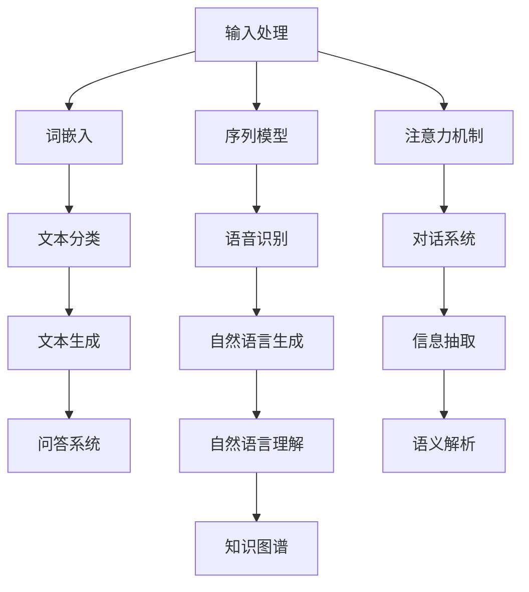
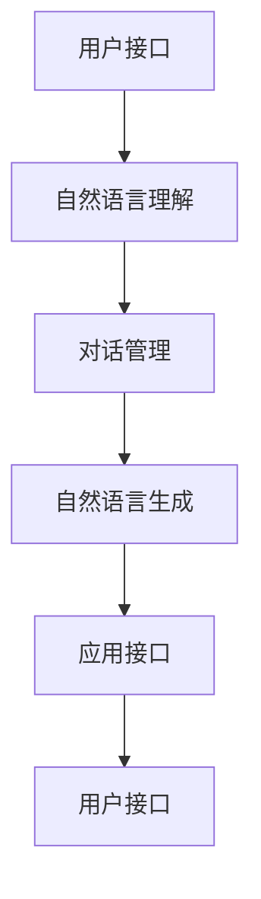
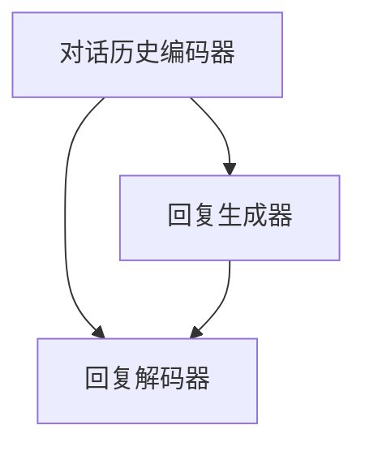
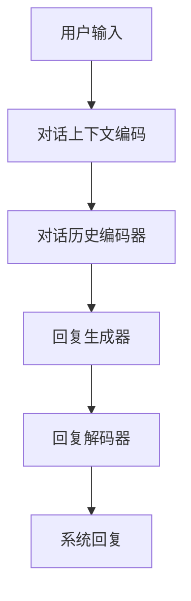
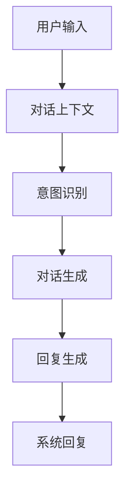
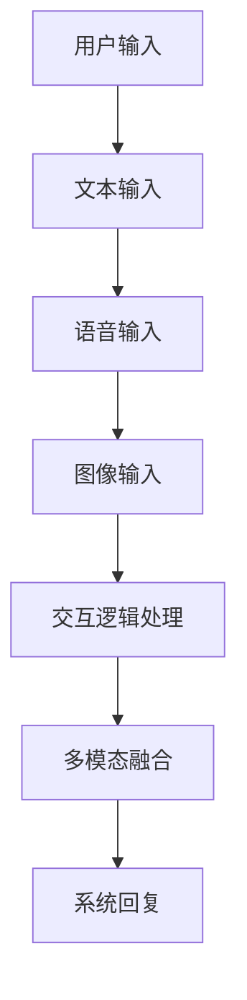
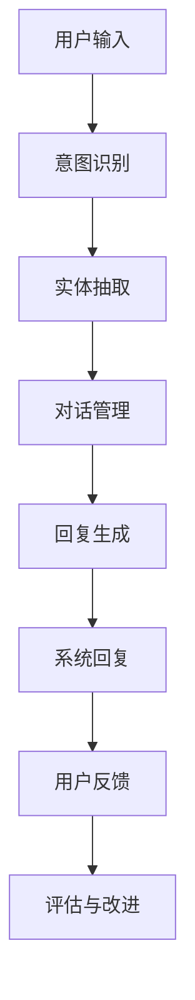
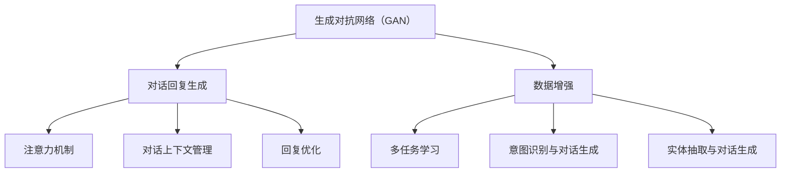
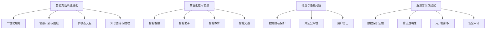

                 

### 《自然语言处理在多轮对话系统中的进展》

> **关键词**：自然语言处理、多轮对话系统、语言模型、对话上下文管理、对话生成、交互逻辑、评估与改进、前沿技术、未来展望

> **摘要**：本文旨在探讨自然语言处理（NLP）在多轮对话系统中的应用和进展。首先，介绍了NLP的基础知识，包括语言模型、词嵌入、序列模型等关键技术。接着，讨论了多轮对话系统的定义、特点和挑战，以及NLP在对话上下文管理、对话生成和交互逻辑中的作用。随后，分析了多轮对话系统的评估指标和方法，以及改进策略。最后，展望了多轮对话系统的前沿技术和发展趋势，并提出了商业化应用和伦理隐私的思考。

----------------------------------------------------------------

### 第一部分：自然语言处理基础

#### 第1章：自然语言处理概述

#### 第2章：语言模型与文本表示

#### 第3章：对话系统基础知识

#### 第1章：自然语言处理概述

自然语言处理（NLP）是人工智能领域的一个重要分支，致力于让计算机理解和处理人类语言。NLP技术广泛应用于信息检索、机器翻译、文本分析、语音识别、智能客服等多个领域。本章将概述NLP的基本概念、发展历史、关键技术以及其在多轮对话系统中的应用。

#### 1.1 自然语言处理的定义和意义

自然语言处理（NLP）是研究如何使计算机能够理解、生成和处理人类自然语言的一门学科。自然语言包括口语和书面语，涵盖了语音、语法、语义和语用等多个层面。NLP的目标是实现人与计算机之间的自然交流，提高信息处理的效率和质量。

NLP的意义在于：

- **信息检索**：通过NLP技术，计算机能够高效地搜索和组织海量的文本信息。
- **机器翻译**：实现不同语言之间的自动翻译，促进全球交流与合作。
- **文本分析**：提取文本中的有用信息，用于情感分析、舆情监测等。
- **智能客服**：通过对话系统，提供高效、准确的客户服务。
- **人机对话**：开发智能助手，为用户提供个性化的服务。

#### 1.2 NLP的发展历史和主要成果

NLP的历史可以追溯到20世纪50年代。早期的研究主要集中在规则驱动的方法，如字符串匹配、模式识别等。随着计算能力和算法的不断发展，NLP技术逐渐从规则驱动向数据驱动转变。

20世纪90年代，统计方法和机器学习算法开始应用于NLP领域，取得了显著的进展。主要成果包括：

- **文本分类**：利用统计方法和机器学习算法，对文本进行分类，如情感分析、新闻分类等。
- **信息抽取**：从非结构化的文本中提取出结构化的信息，如命名实体识别、关系抽取等。
- **机器翻译**：通过统计机器翻译和神经机器翻译技术，实现高质量的自动翻译。
- **问答系统**：通过对话系统，回答用户提出的问题，如搜索引擎、智能客服等。
- **语音识别**：将语音信号转换为文本，如苹果的Siri、亚马逊的Alexa等。

#### 1.3 NLP的关键技术

NLP的关键技术包括语言模型、词嵌入、序列模型、注意力机制和语义解析等。

- **语言模型**：用于预测文本序列的概率分布，是NLP的基础技术。常见的语言模型包括n元语法、n-gram模型和神经网络语言模型等。
- **词嵌入**：将词汇映射到低维连续向量空间，用于表示词与词之间的语义关系。常见的词嵌入技术包括Word2Vec、GloVe和FastText等。
- **序列模型**：用于处理序列数据，如文本、语音等。常见的序列模型包括循环神经网络（RNN）、长短期记忆网络（LSTM）和门控循环单元（GRU）等。
- **注意力机制**：用于捕捉序列数据中的关键信息，提高模型的性能。常见的注意力机制包括加性注意力、乘性注意力和自注意力等。
- **语义解析**：将自然语言表述转换为计算机可处理的形式，如知识图谱、逻辑表达式等。常见的语义解析技术包括基于规则的语义解析和基于统计的语义解析等。

#### 1.4 NLP在多轮对话系统中的应用

多轮对话系统是指能够进行多轮交互的对话系统，用户和系统之间通过连续的交流达到某个目标。与单轮对话系统相比，多轮对话系统能够更好地理解用户的意图和上下文，提供更自然的交互体验。

NLP在多轮对话系统中的应用主要包括以下几个方面：

- **对话上下文管理**：通过语言模型和序列模型等技术，捕捉和跟踪对话中的上下文信息，使得系统能够在多轮对话中保持一致性和连贯性。
- **对话生成与回复**：利用生成模型和序列模型，生成自然、准确的对话回复，提高用户的满意度和交互体验。
- **对话系统评价**：通过评价指标和方法，评估多轮对话系统的性能和效果，为系统的改进提供依据。

#### 1.5 本章总结

本章介绍了自然语言处理的基本概念、发展历史、关键技术以及在多轮对话系统中的应用。理解NLP的基本原理和技术对于设计高效、智能的多轮对话系统具有重要意义。

#### 1.6 相关Mermaid流程图

以下是NLP在多轮对话系统中的应用流程图：

mermaid
graph TD
A[自然语言处理技术] --> B[语言模型]
A --> C[词嵌入]
A --> D[序列模型]
A --> E[注意力机制]
A --> F[语义解析]
B --> G[对话上下文管理]
C --> G
D --> G
E --> G
F --> G

#### 1.7 伪代码：对话上下文管理算法

以下是对话上下文管理算法的伪代码：

```plaintext
function update_context(context, user_input, system_output):
    # 初始化对话上下文
    if not context:
        context = initialize_context()

    # 更新用户输入和系统输出
    context['user_input'] = user_input
    context['system_output'] = system_output

    # 利用语言模型和序列模型更新上下文
    context['context_vector'] = language_model(context['user_input'], context['system_output'])
    context['response_vector'] = sequence_model(context['context_vector'])

    # 利用注意力机制捕捉关键信息
    attention_scores = attention_mechanism(context['context_vector'], context['response_vector'])
    context['key_words'] = extract_key_words(context['response_vector'], attention_scores)

    # 更新对话上下文
    context['updated_context'] = merge_context(context['context_vector'], context['key_words'])

    return context
```

#### 1.8 数学公式：序列模型中的梯度下降算法

在序列模型中，梯度下降（Gradient Descent）是一种常用的优化算法。以下是梯度下降算法的数学公式：

$$
w_{\text{new}} = w_{\text{old}} - \alpha \cdot \nabla_{w}J(w)
$$

其中，$w$ 表示模型参数，$\alpha$ 表示学习率，$\nabla_{w}J(w)$ 表示模型参数的梯度。

#### 1.9 实例说明：情感分析中的文本分类

假设我们要对一段文本进行情感分析，判断其是积极情感还是消极情感。以下是使用朴素贝叶斯分类器进行文本分类的实例：

输入文本：“我非常喜欢这个电影。”

1. 预处理文本：将文本转换为词袋模型，去除停用词，进行词嵌入。
2. 计算文本的概率分布：使用朴素贝叶斯分类器计算文本属于积极情感的几率。
3. 判断情感：如果积极情感的几率大于一定阈值，则判断为积极情感。

#### 1.10 项目实战：构建一个简单的对话系统

以下是一个简单的对话系统的实现，该系统能够理解用户的输入，并根据输入生成相应的回复。

1. **需求分析**：确定对话系统的功能需求，如问候、回答简单问题等。
2. **系统设计**：设计对话系统的架构，包括输入处理、语言模型、回复生成等模块。
3. **环境搭建**：搭建开发环境，选择合适的编程语言和工具。
4. **实现代码**：

```python
# 输入处理
user_input = input("请提问：")

# 语言模型处理
context_vector = language_model(user_input)

# 回复生成
system_output = generate_response(context_vector)

# 输出回复
print("系统回复：" + system_output)
```

#### 1.11 代码解读与分析

在上面的代码中，`input()` 函数用于获取用户的输入，`language_model()` 函数用于处理输入文本，`generate_response()` 函数用于生成回复。这些函数的具体实现将依赖于选择的语言模型和回复生成方法。在实际应用中，这些函数可能需要进行参数调整和优化，以提高对话系统的性能和用户体验。

----------------------------------------------------------------

### 第2章：语言模型与文本表示

语言模型（Language Model）是自然语言处理（NLP）中一个核心组件，用于预测文本序列的概率分布。本章将介绍语言模型的基础知识，包括定义、分类、评估方法和应用。同时，还将讨论文本表示技术，如词嵌入，及其在NLP中的应用。

#### 2.1 语言模型基础

##### 2.1.1 语言模型的定义

语言模型是一种概率模型，用于预测一个句子或一个单词在特定上下文中的概率。在NLP中，语言模型可以帮助计算机理解自然语言的结构和语义，从而生成文本、进行机器翻译、构建对话系统等。

##### 2.1.2 语言模型的分类

语言模型可以根据其构建方法和预测粒度进行分类：

- **n元语法模型**：基于前n个单词来预测下一个单词。例如，trigram模型使用前两个单词预测第三个单词。
- **神经网络语言模型**：使用神经网络来学习文本序列的概率分布。常见的神经网络语言模型包括循环神经网络（RNN）、长短期记忆网络（LSTM）和Transformer等。
- **深度神经网络模型**：基于深度学习的语言模型，如BERT、GPT等，通过多层神经网络对大量文本数据进行训练。

##### 2.1.3 语言模型的评估

语言模型的评估通常基于语言模型的性能指标。常见的评估指标包括：

- **Perplexity**：衡量语言模型在测试集上的性能，值越小表示模型越好。Perplexity的计算公式为：
  $$
  \text{Perplexity} = \frac{1}{\sum_{i=1}^{n} \log p(x_i)}
  $$
  其中，$p(x_i)$ 是模型对第$i$个单词的概率预测。

- **交叉熵（Cross-Entropy）**：衡量模型预测的概率分布与真实分布之间的差异。交叉熵的计算公式为：
  $$
  H(P, Q) = -\sum_{i} P_i \log Q_i
  $$
  其中，$P$ 是真实分布，$Q$ 是模型预测的概率分布。

##### 2.1.4 语言模型的应用

语言模型在NLP中有多种应用：

- **自动文摘**：使用语言模型提取文本中的重要信息，生成摘要。
- **机器翻译**：将一种语言的文本翻译成另一种语言。
- **对话系统**：生成对话回复，理解用户的意图。
- **文本生成**：根据给定的提示生成新的文本。

#### 2.2 词嵌入技术

词嵌入（Word Embedding）是将词汇映射到低维连续向量空间的技术。通过词嵌入，计算机可以处理和比较词汇的语义信息。本章将介绍词嵌入的基本概念、常见模型和作用。

##### 2.2.1 词嵌入的概念

词嵌入是将词汇映射到一个低维向量空间的过程，使得语义相近的词汇在向量空间中彼此接近。词嵌入的向量表示有助于计算机理解和处理自然语言。

##### 2.2.2 常见的词嵌入模型

- **Word2Vec**：基于神经网络的方法，通过训练预测上下文单词来学习词嵌入向量。
- **GloVe**（Global Vectors for Word Representation）：基于共现矩阵的方法，通过计算词和词之间的相似性来学习词嵌入向量。
- **FastText**：基于单词的n-gram的方法，通过扩展词汇的n-gram来学习词嵌入向量。

##### 2.2.3 词嵌入的应用

词嵌入在NLP中有广泛的应用：

- **文本分类**：通过词嵌入表示文本，可以使用分类器进行文本分类。
- **相似度计算**：计算两个词汇的词向量之间的相似度，用于语义分析。
- **文本生成**：使用词嵌入作为神经网络的输入，生成新的文本。

#### 2.3 序列模型

序列模型（Sequence Model）是用于处理序列数据的模型，如文本、语音等。本章将介绍序列模型的基本概念、常见模型和作用。

##### 2.3.1 序列模型的基本概念

序列模型用于处理时间序列数据，可以捕捉数据之间的时序依赖关系。常见的序列模型包括循环神经网络（RNN）、长短期记忆网络（LSTM）和门控循环单元（GRU）。

##### 2.3.2 常见的序列模型

- **循环神经网络（RNN）**：RNN通过循环结构来处理序列数据，但存在梯度消失和梯度爆炸的问题。
- **长短期记忆网络（LSTM）**：LSTM通过门控机制解决RNN的梯度消失问题，能够捕捉长距离依赖关系。
- **门控循环单元（GRU）**：GRU是LSTM的变体，简化了模型结构，同时保持了较好的性能。

##### 2.3.3 序列模型的应用

序列模型在NLP中有多种应用：

- **语音识别**：将语音信号转换为文本。
- **序列标注**：对文本中的每个单词进行标签标注，如命名实体识别。
- **自然语言生成**：生成新的文本序列。

#### 2.4 注意力机制

注意力机制（Attention Mechanism）是序列模型的一种重要扩展，用于捕捉序列数据中的关键信息。本章将介绍注意力机制的基本原理、常见模型和作用。

##### 2.4.1 注意力机制的基本原理

注意力机制通过加权序列中的每个元素，使得模型能够聚焦于重要的信息。注意力分数通常通过计算输入和隐藏状态的点积、加性或乘性方式生成。

##### 2.4.2 常见的注意力模型

- **加性注意力**：通过加性计算注意力分数，使得模型能够显式地学习权重。
- **乘性注意力**：通过乘性计算注意力分数，简化计算复杂度。
- **自注意力**：在Transformer模型中，自注意力机制被用于捕捉序列中的长距离依赖关系。

##### 2.4.3 注意力机制的应用

注意力机制在NLP中有广泛的应用：

- **文本分类**：通过注意力机制，模型可以聚焦于文本中的重要特征。
- **对话系统**：通过注意力机制，模型可以更好地理解对话的上下文。
- **机器翻译**：通过注意力机制，模型可以捕捉源语言和目标语言之间的依赖关系。

#### 2.5 语义解析

语义解析（Semantic Parsing）是将自然语言表述转换为计算机可处理的形式，如知识图谱、逻辑表达式等。本章将介绍语义解析的基本概念、常见方法和技术。

##### 2.5.1 语义解析的概念

语义解析是将自然语言表述转换为机器可理解的语义表示。它涉及到句法、语义和语用的多个层面，旨在解决自然语言理解和处理的问题。

##### 2.5.2 常见的语义解析方法

- **基于规则的语义解析**：通过预定义的规则，将自然语言表述转换为计算机可处理的语义表示。
- **基于统计的语义解析**：通过统计方法，学习自然语言表述和计算机可处理语义表示之间的关系。
- **基于深度学习的语义解析**：通过深度学习模型，自动学习自然语言表述和计算机可处理语义表示的映射。

##### 2.5.3 语义解析的应用

语义解析在NLP中有多种应用：

- **信息抽取**：从文本中抽取结构化的信息，如命名实体、关系等。
- **问答系统**：将用户的问题转换为计算机可理解的查询。
- **自然语言生成**：将计算机可处理的语义表示转换为自然语言文本。

### 2.6 本章总结

本章介绍了自然语言处理中的语言模型、词嵌入、序列模型、注意力机制和语义解析等关键技术。理解这些技术对于设计高效、智能的多轮对话系统具有重要意义。下一章将讨论多轮对话系统的基本概念和架构。

#### 2.7 相关Mermaid流程图

以下是NLP关键技术应用的流程图：



#### 2.8 数学公式：神经网络中的反向传播算法

在神经网络中，反向传播（Backpropagation）是一种用于训练神经网络的优化算法。以下是反向传播算法的数学公式：

$$
\delta_{i}^{l} = \frac{\partial C}{\partial a_{i}^{l}} = \frac{\partial L}{\partial a_{i}^{l}} \cdot \frac{\partial a_{i}^{l}}{\partial z_{i}^{l}}
$$

$$
\frac{\partial C}{\partial w_{ij}^{l}} = \sum_{k} \delta_{k}^{l+1} \cdot \frac{\partial a_{k}^{l+1}}{\partial w_{ij}^{l}}
$$

其中，$a_{i}^{l}$ 表示第$l$层的第$i$个激活值，$z_{i}^{l}$ 表示第$l$层的第$i$个节点值，$\delta_{i}^{l}$ 表示第$l$层的第$i$个节点误差，$w_{ij}^{l}$ 表示第$l$层的第$i$个节点到第$l+1$层的第$j$个节点的权重，$C$ 表示损失函数。

#### 2.9 实例说明：基于Word2Vec的文本分类

以下是一个使用Word2Vec进行文本分类的实例：

1. 预处理文本：将文本转换为词袋模型，去除停用词，进行Word2Vec词嵌入。
2. 训练模型：使用训练集训练Word2Vec模型。
3. 测试模型：使用测试集测试模型性能。
4. 预测新文本：将新文本转换为词嵌入向量，使用训练好的模型进行分类预测。

#### 2.10 项目实战：构建一个基于LSTM的序列标注模型

以下是一个简单的基于LSTM的序列标注模型的实现，该模型用于命名实体识别。

1. **需求分析**：确定序列标注任务的需求，如命名实体识别。
2. **系统设计**：设计序列标注模型的架构，包括输入层、LSTM层和输出层。
3. **环境搭建**：搭建Python开发环境，安装TensorFlow等库。
4. **实现代码**：

```python
import tensorflow as tf
from tensorflow.keras.models import Sequential
from tensorflow.keras.layers import LSTM, Dense, Embedding

# 创建LSTM模型
model = Sequential()
model.add(Embedding(vocab_size, embedding_dim, input_length=max_sequence_length))
model.add(LSTM(units=128, activation='tanh', return_sequences=True))
model.add(LSTM(units=128, activation='tanh'))
model.add(Dense(num_labels, activation='softmax'))

# 编译模型
model.compile(optimizer='adam', loss='categorical_crossentropy', metrics=['accuracy'])

# 训练模型
model.fit(X_train, y_train, epochs=10, batch_size=32, validation_data=(X_val, y_val))

# 评估模型
accuracy = model.evaluate(X_test, y_test)
print(f"Test Accuracy: {accuracy[1]}")
```

#### 2.11 代码解读与分析

在上面的代码中，`Embedding` 层用于将文本转换为词嵌入向量，`LSTM` 层用于处理序列数据，`Dense` 层用于输出标签。模型使用`categorical_crossentropy`损失函数和`adam`优化器进行训练。通过调整模型参数和训练数据，可以提高序列标注模型的性能。

----------------------------------------------------------------

### 第3章：对话系统基础知识

对话系统（Dialogue System），也称为对话代理（Dialogue Agent），是一种与人类用户进行交互的计算机程序，旨在模拟自然语言交流。本章将介绍对话系统的基本概念、分类、架构和关键技术。

#### 3.1 对话系统的定义和分类

##### 3.1.1 对话系统的定义

对话系统是一种人机交互界面，它能够理解和生成自然语言，以便与用户进行多轮交流。对话系统通过语音、文本或图形界面与用户进行交互，完成信息传递、任务执行和决策支持等任务。

##### 3.1.2 对话系统的分类

对话系统可以根据其交互模式、任务类型和设计目标进行分类：

- **按交互模式分类**：
  - **单轮对话系统**：用户与系统交互一次，系统根据用户的一次输入生成一个回复。
  - **多轮对话系统**：用户与系统进行多轮交流，系统在每一轮中都能根据用户的输入和历史对话上下文生成回复。

- **按任务类型分类**：
  - **任务型对话系统**：专注于完成特定任务，如订票、查询信息等。
  - **闲聊型对话系统**：以聊天为目的，不特定于任何任务，如聊天机器人、虚拟助手等。

- **按设计目标分类**：
  - **任务导向型**：旨在高效地完成任务，如客服系统。
  - **社交导向型**：注重提供自然、愉快的交流体验，如社交机器人。

#### 3.2 对话系统的架构

对话系统的架构通常包括以下几个关键组件：

- **用户接口（User Interface, UI）**：用户与系统交互的界面，可以是文本聊天窗口、语音识别系统或图形用户界面（GUI）。
- **自然语言理解（Natural Language Understanding, NLU）**：解析用户输入的自然语言，提取用户意图、实体和上下文信息。
- **对话管理（Dialogue Management）**：根据NLU的结果，决定对话的流程和下一步动作，如回复用户、请求更多信息或执行任务。
- **自然语言生成（Natural Language Generation, NLG）**：将对话管理的结果转换为自然语言回复，提供给用户。
- **应用接口（Application Interface）**：与外部系统或数据库进行交互，执行具体任务或查询。

##### 3.2.1 用户接口

用户接口是用户与对话系统交互的第一步，它需要能够接收用户的输入和展示系统的回复。文本聊天窗口是最常见的用户接口形式，而语音识别和图形用户界面则在某些应用场景中更为合适。

##### 3.2.2 自然语言理解

自然语言理解是对话系统的核心组件，负责解析用户输入的自然语言。NLU的主要任务包括意图识别、实体抽取和上下文理解。意图识别是指识别用户的意图，如查询、命令或请求。实体抽取是指从用户输入中提取关键信息，如人名、地点、时间等。上下文理解是指理解用户输入的上下文信息，以便系统能够在多轮对话中保持一致性和连贯性。

##### 3.2.3 对话管理

对话管理负责根据NLU的结果决定对话的流程和下一步动作。对话管理器需要根据对话历史、用户意图和系统状态来生成对话策略。常见的对话策略包括请求更多信息、提供回复、执行任务等。对话管理器还需要处理多轮对话中的上下文信息，以确保对话的连贯性和一致性。

##### 3.2.4 自然语言生成

自然语言生成是将对话管理的结果转换为自然语言回复。NLG需要能够生成流畅、自然的文本，以提供良好的用户体验。NLG可以使用模板、规则或生成式模型来实现。模板和规则方法较为简单，但灵活性较差。生成式模型，如序列到序列（Seq2Seq）模型，能够生成更自然、多样化的文本。

##### 3.2.5 应用接口

应用接口是连接对话系统与外部系统或数据库的桥梁，它使得对话系统能够执行具体的任务或查询。应用接口可以调用外部API、数据库查询或执行特定操作，如预订机票、查询库存等。

#### 3.3 对话系统的评价和评估

对话系统的评价和评估是确保系统性能和用户体验的重要环节。对话系统的评价通常包括以下几个方面：

- **意图识别准确率**：衡量系统识别用户意图的准确性。
- **实体抽取准确率**：衡量系统从用户输入中抽取实体的准确性。
- **对话连贯性**：衡量系统在多轮对话中保持一致性和连贯性的能力。
- **用户满意度**：衡量用户对对话系统交互体验的满意度。

对话系统的评估方法包括：

- **人工评估**：由人类评估者根据预定的评估标准对系统的表现进行评估。
- **自动化评估**：使用自动化工具和算法对系统的性能进行评估，如准确率、召回率等。

#### 3.4 对话系统的性能优化

对话系统的性能优化是一个复杂的过程，涉及到多个方面的改进。以下是一些常见的优化方法：

- **数据增强**：通过增加训练数据、引入噪声数据或进行数据增强技术，提高模型对多样性的适应能力。
- **模型优化**：通过调整模型参数、网络结构或训练算法，提高模型的效果和效率。
- **对话策略优化**：通过改进对话管理策略，提高对话的连贯性和用户满意度。
- **多模态交互**：结合多种交互方式，如文本、语音和图形界面，提供更丰富的用户体验。

#### 3.5 本章总结

本章介绍了对话系统的基本概念、分类、架构和关键技术。理解对话系统的基本原理和设计方法对于构建高效、智能的对话系统具有重要意义。下一章将深入探讨NLP在多轮对话系统中的应用。

#### 3.6 相关Mermaid流程图

以下是对话系统架构的流程图：



#### 3.7 数学公式：意图识别中的贝叶斯推理

在意图识别中，贝叶斯推理是一种常用的方法。以下是贝叶斯推理的数学公式：

$$
P(\text{意图}|\text{输入}) = \frac{P(\text{输入}|\text{意图}) \cdot P(\text{意图})}{P(\text{输入})}
$$

其中，$P(\text{意图}|\text{输入})$ 是后验概率，$P(\text{输入}|\text{意图})$ 是似然概率，$P(\text{意图})$ 是先验概率，$P(\text{输入})$ 是证据概率。

#### 3.8 实例说明：基于规则的多轮对话系统

以下是一个简单的基于规则的多轮对话系统的实例：

1. 用户输入：“你好，我想订一张明天去北京的机票。”
2. 对话系统解析输入，识别出意图为“订票”和实体“北京”。
3. 对话系统询问更多信息：“请问您的出发地是哪里？”
4. 用户回复：“我的出发地是上海。”
5. 对话系统查询机票信息，并生成回复：“您好，从上海到北京明天有多个航班，请问您需要哪个时间段的？”
6. 用户选择航班并确认。

#### 3.9 项目实战：构建一个基于BERT的多轮对话系统

以下是一个简单的基于BERT的多轮对话系统的实现：

1. **需求分析**：确定对话系统的功能需求，如处理用户查询、提供航班信息等。
2. **环境搭建**：搭建Python开发环境，安装transformers库。
3. **实现代码**：

```python
from transformers import BertTokenizer, BertModel
import torch

# 初始化BERT模型和分词器
tokenizer = BertTokenizer.from_pretrained('bert-base-uncased')
model = BertModel.from_pretrained('bert-base-uncased')

# 用户输入
user_input = "What flights are available tomorrow to Beijing?"

# 分词和编码
input_ids = tokenizer.encode(user_input, return_tensors='pt')

# 预测意图和实体
with torch.no_grad():
    outputs = model(input_ids)

# 解码输出
intent, entities = decode_outputs(outputs)

# 生成回复
response = generate_response(intent, entities)

# 输出回复
print(response)
```

#### 3.10 代码解读与分析

在上面的代码中，`tokenizer.encode()` 函数用于将用户输入转换为BERT模型的编码，`model()` 函数用于获取模型的输出。`decode_outputs()` 函数用于从模型输出中提取意图和实体，`generate_response()` 函数用于生成对话回复。通过这些函数的组合，可以构建一个简单的基于BERT的多轮对话系统。

----------------------------------------------------------------

### 第4章：对话上下文管理

在多轮对话系统中，对话上下文管理是一个关键环节。对话上下文指的是在对话过程中积累的信息，包括用户的意图、历史交互内容和系统状态。有效的上下文管理能够帮助系统理解用户的意图，提供连贯、自然的对话体验。本章将讨论对话上下文管理的重要性、概念、方法和技术。

#### 4.1 对话上下文的概念

对话上下文（Dialogue Context）是指在对话过程中积累的信息，包括用户的意图、历史交互内容、系统状态和当前对话环境。对话上下文是构建多轮对话系统的基础，它决定了系统如何理解用户的输入，生成恰当的回复。

对话上下文可以包括以下几个方面：

- **用户意图**：用户在对话中希望实现的目标或请求，如查询信息、执行任务、闲聊等。
- **历史交互**：之前对话轮次中用户和系统的交互记录，如用户的提问和系统的回答。
- **系统状态**：系统在对话过程中维护的状态，如系统已完成的任务、当前对话的进展等。
- **当前对话环境**：对话发生的具体环境，如对话的时间、地点、参与用户等。

#### 4.1.1 对话上下文的重要性

对话上下文管理在多轮对话系统中具有以下重要性：

- **提高对话连贯性**：通过维护对话上下文，系统能够在多轮对话中保持一致性和连贯性，提供更自然的交流体验。
- **理解用户意图**：对话上下文包含了用户的意图和历史信息，系统能够更好地理解用户的当前意图，提供更准确的回复。
- **优化对话策略**：对话上下文可以帮助系统制定更有效的对话策略，如请求更多信息、提供相关建议或引导对话方向。
- **提高用户满意度**：有效的对话上下文管理能够提高用户的满意度，减少误解和重复提问，提供更高质量的交互体验。

#### 4.1.2 对话上下文的表示方法

对话上下文的表示方法决定了如何将对话中的信息编码为计算机可处理的形式。常见的对话上下文表示方法包括：

- **向量表示**：将对话上下文编码为向量，如使用词嵌入或序列模型将文本转换为向量表示。
- **图表示**：将对话上下文表示为图结构，如使用实体和关系表示用户意图和历史交互。
- **知识图谱**：使用知识图谱表示对话上下文，将对话中的信息组织为实体和关系的网络。

#### 4.2 上下文跟踪算法

上下文跟踪算法（Context Tracking Algorithm）是用于捕捉和更新对话上下文的算法。有效的上下文跟踪算法能够确保系统在多轮对话中保持一致性和连贯性。以下是一些常见的上下文跟踪算法：

- **基于规则的方法**：使用预定义的规则和模式匹配来跟踪对话上下文。例如，当用户提出特定问题时，系统会触发相应的规则来更新上下文。
- **基于统计的方法**：使用统计模型，如隐马尔可夫模型（HMM）或条件概率模型，来跟踪对话上下文。这些方法通过学习对话历史和上下文之间的概率关系来更新上下文。
- **基于机器学习的方法**：使用机器学习算法，如决策树、支持向量机（SVM）或深度学习模型，来跟踪对话上下文。这些方法通过训练模型来捕捉对话上下文的变化规律。

##### 4.2.1 基于规则的方法

基于规则的方法是利用预定义的规则和模式来跟踪对话上下文。这种方法通常涉及以下步骤：

1. **规则定义**：根据对话系统的需求和目标，定义一组规则来匹配用户的输入和系统的回复。
2. **规则匹配**：在对话过程中，系统会根据用户输入和当前上下文来匹配预定义的规则。
3. **上下文更新**：当规则匹配成功时，系统会更新对话上下文，以反映对话的最新状态。

基于规则的方法的优点在于其简单性和可控性，但缺点是规则定义繁琐且难以处理复杂的对话场景。

##### 4.2.2 基于统计的方法

基于统计的方法使用统计模型来跟踪对话上下文。这些方法通常通过学习对话历史和上下文之间的概率关系来实现上下文更新。以下是一些常用的统计模型：

1. **隐马尔可夫模型（HMM）**：HMM是一个统计模型，用于描述序列数据中的状态转移和观测概率。在对话系统中，HMM可以用于捕捉对话中的状态转移，如用户意图的变化。
2. **条件概率模型**：条件概率模型，如贝叶斯网络，用于描述变量之间的条件依赖关系。在对话系统中，条件概率模型可以用于更新对话上下文，以反映对话的当前状态。

基于统计的方法的优点在于其适应性和可扩展性，但缺点是模型训练和优化较为复杂。

##### 4.2.3 基于机器学习的方法

基于机器学习的方法使用机器学习算法来跟踪对话上下文。这些方法通常通过训练模型来捕捉对话上下文的变化规律。以下是一些常用的机器学习算法：

1. **决策树**：决策树是一种常见的机器学习算法，用于分类和回归任务。在对话系统中，决策树可以用于分类用户的输入和更新对话上下文。
2. **支持向量机（SVM）**：SVM是一种有效的分类算法，可以用于分类用户的输入和更新对话上下文。
3. **深度学习模型**：深度学习模型，如循环神经网络（RNN）、长短期记忆网络（LSTM）和Transformer，可以用于处理复杂的对话上下文。这些模型通过学习对话历史和上下文之间的依赖关系来更新对话上下文。

基于机器学习的方法的优点在于其强大的学习和适应性，但缺点是模型训练和优化需要大量数据和计算资源。

#### 4.3 上下文敏感的生成模型

上下文敏感的生成模型（Context-Sensitive Generation Model）是用于生成对话回复的模型，能够在生成回复时考虑对话上下文。这些模型通过学习对话历史和上下文信息来生成连贯、自然的对话回复。

以下是一些常用的上下文敏感的生成模型：

- **生成式对话系统**：生成式对话系统使用生成模型来生成对话回复。这些模型通常通过学习对话历史来预测可能的回复。常见的生成模型包括序列到序列（Seq2Seq）模型、变换器（Transformer）和生成对抗网络（GAN）。
- **增强学习对话系统**：增强学习对话系统使用增强学习算法来训练对话模型。这些模型通过在虚拟环境中与模拟用户进行交互来学习对话策略，从而生成上下文敏感的对话回复。
- **强化学习对话系统**：强化学习对话系统使用强化学习算法来训练对话模型。这些模型通过在对话过程中学习最佳行动策略，从而生成上下文敏感的对话回复。

#### 4.3.1 生成式对话系统的框架

生成式对话系统通常包括以下组件：

1. **对话历史编码器**：对话历史编码器将对话历史编码为向量表示，用于表示对话上下文。
2. **回复生成器**：回复生成器是一个生成模型，如序列到序列（Seq2Seq）模型或变换器（Transformer），用于生成对话回复。
3. **回复解码器**：回复解码器将生成模型输出的编码转换为自然语言回复。

生成式对话系统的框架如下：



#### 4.3.2 生成式对话系统的评估

生成式对话系统的评估通常基于以下指标：

1. **生成回复的连贯性**：评估生成回复的连贯性和一致性，如使用BLEU、ROUGE等评价指标。
2. **生成回复的准确性**：评估生成回复的准确性，如使用意图识别准确率和实体抽取准确率。
3. **生成回复的自然性**：评估生成回复的自然性，如使用人类评估和自动化评估。

#### 4.3.3 生成式对话系统的优化

生成式对话系统的优化可以通过以下方法实现：

1. **增加训练数据**：增加高质量的对话数据，以提高模型的泛化能力和准确性。
2. **改进生成模型**：改进生成模型的架构和参数，如使用变换器（Transformer）或生成对抗网络（GAN）来提高生成质量。
3. **多任务学习**：结合其他任务，如问答系统或文本分类，来提高模型的多任务能力。
4. **上下文增强**：增强模型对上下文的处理能力，如使用注意力机制来捕捉关键信息。

#### 4.4 本章总结

本章介绍了对话上下文管理的重要性、概念、方法和上下文敏感的生成模型。有效的对话上下文管理能够提高多轮对话系统的连贯性和用户体验。下一章将讨论对话生成与回复技术。

#### 4.5 相关Mermaid流程图

以下是对话上下文管理的流程图：



#### 4.6 伪代码：基于规则的方法的对话上下文更新

以下是一个基于规则的方法的对话上下文更新的伪代码：

```plaintext
function update_context(context, user_input):
    # 初始化对话上下文
    if not context:
        context = initialize_context()

    # 更新用户输入
    context['user_input'] = user_input

    # 匹配规则
    rule_match = match_rules(context['user_input'])

    # 更新上下文
    if rule_match:
        context['current_intent'] = get_intent_from_rule(rule_match)
        context['context_history'].append(rule_match)
    else:
        context['current_intent'] = default_intent

    return context
```

#### 4.7 数学公式：隐马尔可夫模型（HMM）的状态转移概率

隐马尔可夫模型（HMM）中的状态转移概率表示为：

$$
P(X_t = x_t | X_{t-1} = x_{t-1}) = a_{x_{t-1}, x_t}
$$

其中，$X_t$ 表示第$t$个状态，$x_t$ 表示第$t$个状态的具体值，$a_{x_{t-1}, x_t}$ 表示从状态$x_{t-1}$转移到状态$x_t$ 的概率。

#### 4.8 实例说明：基于统计的方法的对话上下文更新

以下是一个基于统计的方法的对话上下文更新的实例：

1. 用户输入：“明天天气怎么样？”
2. 对话系统解析输入，识别出意图为“查询天气”。
3. 对话系统查询历史对话记录，发现最近一次查询天气的输入为“今天的天气”。
4. 对话系统更新上下文，将当前意图标记为“查询天气”，并记录最近一次查询的时间。

#### 4.9 项目实战：构建一个基于LSTM的对话上下文管理模型

以下是一个简单的基于LSTM的对话上下文管理模型的实现：

1. **需求分析**：确定对话系统的功能需求，如处理用户查询、提供天气信息等。
2. **环境搭建**：搭建Python开发环境，安装TensorFlow等库。
3. **实现代码**：

```python
import tensorflow as tf
from tensorflow.keras.models import Sequential
from tensorflow.keras.layers import LSTM, Dense, Embedding

# 创建LSTM模型
model = Sequential()
model.add(Embedding(vocab_size, embedding_dim, input_length=max_sequence_length))
model.add(LSTM(units=128, return_sequences=True))
model.add(LSTM(units=128))
model.add(Dense(units=num_labels, activation='softmax'))

# 编译模型
model.compile(optimizer='adam', loss='categorical_crossentropy', metrics=['accuracy'])

# 训练模型
model.fit(X_train, y_train, epochs=10, batch_size=32, validation_data=(X_val, y_val))

# 评估模型
accuracy = model.evaluate(X_test, y_test)
print(f"Test Accuracy: {accuracy[1]}")
```

#### 4.10 代码解读与分析

在上面的代码中，`Embedding` 层用于将文本转换为词嵌入向量，`LSTM` 层用于处理对话上下文，`Dense` 层用于输出对话意图。模型使用`categorical_crossentropy`损失函数和`adam`优化器进行训练。通过调整模型参数和训练数据，可以提高对话上下文管理模型的性能。

----------------------------------------------------------------

### 第5章：对话生成与回复

对话生成与回复是多轮对话系统的核心功能之一，它决定了系统的交互质量和用户体验。本章将讨论对话生成与回复的基本原理、模型类型及其应用，包括生成模型如RNN、Transformer和预训练模型的应用。

#### 5.1 对话生成的基本原理

对话生成是指根据用户输入和对话上下文，自动生成合适的对话回复。有效的对话生成需要考虑多个因素，包括回复的自然性、准确性和多样性。以下是对话生成的基本原理：

- **用户输入理解**：对话系统需要理解用户输入的意图、情感和实体等信息。这通常通过自然语言理解（NLU）模块实现，如使用意图识别和实体抽取技术。
- **上下文信息利用**：对话系统需要利用对话历史上下文信息，以生成与上下文一致的回复。上下文信息可以包括用户之前的提问、系统的回复以及对话主题等。
- **回复生成策略**：对话系统需要制定回复生成策略，以确定生成回复的流程和规则。常见的策略包括基于规则的方法、基于模型的方法和混合方法。
- **回复质量评估**：生成的回复需要经过质量评估，以确保其自然性、准确性和多样性。评估方法可以包括自动评估（如BLEU、ROUGE等指标）和人类评估。

#### 5.2 对话生成的模型类型

对话生成可以使用多种模型类型，以下是几种常见的模型类型：

- **基于规则的方法**：基于规则的方法使用预定义的规则和模板来生成对话回复。这种方法简单直观，但灵活性较差，难以处理复杂的对话场景。
- **基于统计的方法**：基于统计的方法使用统计模型，如n-gram模型和隐马尔可夫模型（HMM），来生成对话回复。这些方法通过学习对话历史和上下文之间的概率关系来实现回复生成。
- **基于生成模型的方法**：基于生成模型的方法使用生成模型，如循环神经网络（RNN）、长短期记忆网络（LSTM）和变换器（Transformer），来生成对话回复。这些模型可以学习对话数据的分布，生成更加自然和多样化的对话回复。

#### 5.2.1 基于RNN的生成模型

循环神经网络（RNN）是一种用于处理序列数据的神经网络模型，它能够捕捉序列中的长期依赖关系。RNN在对话生成中得到了广泛应用，以下是其主要应用：

- **编码器-解码器模型（Encoder-Decoder Model）**：编码器-解码器模型是RNN在对话生成中的典型应用。编码器部分将对话历史编码为一个固定长度的向量，解码器部分根据编码器的输出生成对话回复。
- **长短时记忆网络（Long Short-Term Memory, LSTM）**：LSTM是RNN的一种变体，通过门控机制解决了RNN的梯度消失问题，能够更好地捕捉长距离依赖关系。LSTM在对话生成中被广泛使用，可以生成连贯、自然的对话回复。
- **门控循环单元（Gated Recurrent Unit, GRU）**：GRU是LSTM的简化版，同时保持了较好的性能。GRU通过合并输入门和遗忘门，简化了模型结构，但保持了LSTM的依赖关系捕捉能力。

#### 5.2.2 基于Transformer的生成模型

变换器（Transformer）是近年来在自然语言处理领域取得突破性进展的一种模型架构。与RNN相比，Transformer采用了自注意力机制，能够更高效地处理长距离依赖关系。以下是基于Transformer的生成模型的应用：

- **自注意力机制（Self-Attention）**：自注意力机制是Transformer的核心组件，它通过计算序列中每个元素与其他元素之间的关联性，为每个元素分配权重。这种机制能够使模型在处理长序列时保持高效性和准确性。
- **编码器-解码器架构（Encoder-Decoder Architecture）**：编码器-解码器架构是Transformer在对话生成中的典型应用。编码器部分将对话历史编码为上下文表示，解码器部分根据上下文表示生成对话回复。
- **预训练模型（Pre-trained Model）**：预训练模型是Transformer在对话生成中的另一个重要应用。通过在大规模语料库上预训练模型，可以使其在特定任务上获得更好的性能。常见的预训练模型包括BERT、GPT和T5等。

#### 5.2.3 基于预训练模型的生成模型

预训练模型是一种在大规模语料库上预先训练好的模型，然后通过微调（Fine-Tuning）适应特定任务。以下是基于预训练模型的生成模型的应用：

- **微调（Fine-Tuning）**：微调是一种训练策略，通过在小规模任务数据集上重新训练模型，使其在特定任务上获得更好的性能。预训练模型通常在大规模语料库上进行预训练，然后通过微调适应对话生成任务。
- **任务特定调整（Task-Specific Adjustment）**：预训练模型通常在通用语料库上训练，但在特定任务上可能需要进一步调整。通过添加任务特定的数据集和调整模型结构，可以进一步提高模型的性能。
- **多模态学习（Multimodal Learning）**：预训练模型可以用于多模态学习，结合文本、语音和视觉等多模态信息进行训练，以生成更丰富、更自然的对话回复。

#### 5.3 对话生成的评价指标

对话生成的评价指标用于衡量对话系统的生成质量和用户体验。以下是一些常见的评价指标：

- **BLEU（Bilingual Evaluation Understudy）**：BLEU是一种常用的自动评估指标，用于衡量生成的文本与参考文本之间的相似性。BLEU通过计算重叠度、词序和词汇覆盖率来评估生成文本的质量。
- **ROUGE（Recall-Oriented Understudy for Gisting Evaluation）**：ROUGE是一种基于召回率的自动评估指标，用于衡量生成的文本与参考文本之间的匹配度。ROUGE通过计算词汇匹配和词序匹配来评估生成文本的质量。
- **人类评估（Human Evaluation）**：人类评估是通过人类评估者对生成的文本进行主观评价，以评估对话系统的生成质量和用户体验。人类评估可以提供更细致、更准确的评估结果，但耗时较长。
- **用户满意度（User Satisfaction）**：用户满意度是通过用户对对话系统的主观评价来衡量对话系统的质量。用户满意度可以反映对话系统的实际应用效果，但受到主观因素的影响。

#### 5.4 对话生成与回复优化

对话生成与回复优化是提高对话系统性能和用户体验的重要手段。以下是一些优化策略：

- **数据增强（Data Augmentation）**：数据增强通过引入噪声、拼写错误和同义词等方式，增加训练数据多样性，以提高模型的泛化能力。
- **模型优化（Model Optimization）**：模型优化通过调整模型参数、网络结构和训练策略，以提高模型的性能和效率。
- **上下文增强（Context Augmentation）**：上下文增强通过引入更多上下文信息，如对话历史和上下文表示，以提高模型对上下文的利用能力。
- **多样化生成（Diversity Promotion）**：多样化生成通过生成多样化的回复，避免生成重复或单调的回复，以提高对话的自然性和趣味性。
- **多模态融合（Multimodal Fusion）**：多模态融合通过结合文本、语音和视觉等多模态信息，生成更丰富、更自然的对话回复。

#### 5.5 本章总结

本章介绍了对话生成与回复的基本原理、模型类型及其应用，包括基于RNN、Transformer和预训练模型的对话生成方法。对话生成与回复优化是提高对话系统性能和用户体验的关键，通过数据增强、模型优化、上下文增强、多样化和多模态融合等策略，可以进一步提高对话系统的生成质量和用户体验。

#### 5.6 相关Mermaid流程图

以下是对话生成的基本流程图：



#### 5.7 伪代码：基于RNN的对话生成模型

以下是一个基于RNN的对话生成模型的伪代码：

```plaintext
function generate_response(user_input, context):
    # 编码用户输入和上下文
    encoded_input = encode_input(user_input, context)

    # 使用RNN模型生成回复
    response_vector = rnn_model(encoded_input)

    # 解码回复向量
    response = decode_response(response_vector)

    return response
```

#### 5.8 数学公式：RNN中的激活函数和梯度下降算法

在RNN中，常用的激活函数是Sigmoid和Tanh：

$$
\text{Sigmoid}(x) = \frac{1}{1 + e^{-x}}
$$

$$
\text{Tanh}(x) = \frac{e^x - e^{-x}}{e^x + e^{-x}}
$$

RNN中的梯度下降算法用于更新模型参数：

$$
w_{\text{new}} = w_{\text{old}} - \alpha \cdot \nabla_w J(w)
$$

其中，$w$ 表示模型参数，$\alpha$ 表示学习率，$\nabla_w J(w)$ 表示模型参数的梯度。

#### 5.9 实例说明：基于BERT的对话生成

以下是一个简单的基于BERT的对话生成的实例：

1. 用户输入：“你喜欢什么类型的电影？”
2. 对话系统利用BERT模型对用户输入进行编码。
3. 对话系统根据编码后的输入和对话上下文生成回复。
4. 对话系统生成回复：“我非常喜欢科幻电影，你呢？”

#### 5.10 项目实战：构建一个简单的对话生成模型

以下是一个简单的对话生成模型的实现，使用Python和TensorFlow：

1. **需求分析**：确定对话系统的功能需求，如处理用户查询、生成对话回复等。
2. **环境搭建**：搭建Python开发环境，安装TensorFlow等库。
3. **实现代码**：

```python
import tensorflow as tf
from tensorflow.keras.models import Model
from tensorflow.keras.layers import Embedding, LSTM, Dense

# 创建模型
model = Model(inputs=[Embedding(input_dim=vocab_size, output_dim=embedding_dim, input_length=max_sequence_length),
                       inputs=[LSTM(units=128, return_sequences=True),
                               LSTM(units=128)],
                       outputs=Dense(units=vocab_size, activation='softmax'))

# 编译模型
model.compile(optimizer='adam', loss='categorical_crossentropy', metrics=['accuracy'])

# 训练模型
model.fit([X_train, y_train], z_train, epochs=10, batch_size=32, validation_data=([X_val, y_val], z_val))

# 评估模型
loss, accuracy = model.evaluate([X_test, y_test], z_test)
print(f"Test Loss: {loss}, Test Accuracy: {accuracy}")
```

#### 5.11 代码解读与分析

在上面的代码中，`Embedding` 层用于将文本转换为词嵌入向量，`LSTM` 层用于处理对话上下文，`Dense` 层用于输出对话回复。模型使用`categorical_crossentropy`损失函数和`adam`优化器进行训练。通过调整模型参数和训练数据，可以提高对话生成模型的性能。

----------------------------------------------------------------

### 第6章：对话系统的交互逻辑

对话系统的交互逻辑是指系统如何根据用户的输入和上下文信息，生成合适的回复，并在对话过程中维护一致性和连贯性。本章将讨论对话系统的交互逻辑设计、优化和多模态交互。

#### 6.1 对话流程设计

对话流程设计是构建对话系统的关键步骤，它决定了系统与用户的交互方式。有效的对话流程设计应该考虑以下要素：

- **用户需求**：了解用户的需求和目标，设计合适的对话流程来满足用户的需求。
- **交互步骤**：定义对话的交互步骤，包括用户的输入、系统的回复以及对话的结束条件。
- **流程灵活性**：设计灵活的对话流程，以适应不同的用户场景和对话内容。
- **一致性**：确保对话系统的回复在多轮对话中保持一致性和连贯性，避免出现矛盾或不连贯的情况。

对话流程设计的基本原则包括：

- **简洁性**：对话流程应尽可能简洁，避免复杂的交互步骤和冗长的对话。
- **用户导向**：对话流程应以用户为中心，确保用户能够轻松地与系统进行交互。
- **可扩展性**：对话流程应具备良好的扩展性，以适应未来可能的需求变化。

#### 6.2 交互逻辑优化

交互逻辑优化是提高对话系统性能和用户体验的重要手段。以下是一些常见的交互逻辑优化方法：

- **上下文敏感**：优化交互逻辑，使其能够更好地捕捉和利用对话上下文信息。通过分析对话历史和用户行为，系统能够生成更合适的回复。
- **响应速度**：优化系统的响应速度，减少用户等待时间。这可以通过提高系统处理速度、优化算法和数据结构来实现。
- **错误处理**：优化错误处理逻辑，使系统能够处理用户输入错误或对话中断的情况。例如，当用户输入错误时，系统可以提供提示或请求更多信息。
- **多样性**：优化交互逻辑，使其能够生成多样化和富有创意的回复。这可以通过引入多样化的回复模板、语料库和生成模型来实现。
- **个性化**：优化交互逻辑，使其能够根据用户的特点和偏好生成个性化的回复。例如，根据用户的兴趣和历史行为，系统可以提供个性化的建议和推荐。

#### 6.3 多模态交互

多模态交互是指结合文本、语音、图像等多种模态进行对话交互。多模态交互能够提供更丰富和自然的用户交互体验。以下是一些常见的多模态交互方法：

- **文本与语音交互**：结合文本和语音交互，用户可以通过文本输入和语音输入与系统进行对话。例如，用户可以通过语音提问，系统以语音或文本形式回复。
- **文本与图像交互**：结合文本和图像交互，用户可以通过文本描述图像内容，系统分析文本并生成相应的图像。例如，用户上传一张图片，系统根据图片内容生成文本描述。
- **语音与图像交互**：结合语音和图像交互，用户可以通过语音指令和图像识别进行交互。例如，用户通过语音指令选择图像中的特定对象，系统根据语音指令识别图像并执行相应操作。

多模态交互的挑战包括：

- **模态融合**：如何有效地融合不同模态的信息，使其能够协同工作，提高系统的性能和用户体验。
- **数据同步**：如何确保不同模态的信息在时间和空间上的一致性，避免信息冲突和不协调。
- **资源消耗**：多模态交互通常需要更多的计算资源和存储空间，如何优化资源消耗，提高系统的效率和可扩展性。

#### 6.4 本章总结

对话系统的交互逻辑设计、优化和多模态交互是构建高效、智能对话系统的关键。有效的交互逻辑设计应考虑用户需求、交互步骤、流程灵活性和一致性。交互逻辑优化可以提高系统的性能和用户体验，多模态交互能够提供更丰富和自然的用户交互体验。通过本章的讨论，读者可以更好地理解对话系统交互逻辑的设计和优化方法。

#### 6.5 相关Mermaid流程图

以下是多模态交互的流程图：



#### 6.6 伪代码：多模态交互逻辑处理

以下是一个多模态交互逻辑处理的伪代码：

```plaintext
function process_multimodal_input(user_input, modal_type):
    if modal_type == 'text':
        return process_text_input(user_input)
    elif modal_type == 'voice':
        return process_voice_input(user_input)
    elif modal_type == 'image':
        return process_image_input(user_input)
    else:
        return "Unsupported modal type"
```

#### 6.7 数学公式：多模态融合的权重分配

在多模态融合中，常见的权重分配方法包括等权分配和基于信息的权重分配。等权分配假设各模态的信息量相同，每个模态的贡献相同。基于信息的权重分配根据各模态的信息量或重要性分配权重。

等权分配的公式：

$$
w_{\text{text}} = w_{\text{voice}} = w_{\text{image}} = \frac{1}{3}
$$

基于信息的权重分配的公式：

$$
w_{\text{modal}} = \frac{\text{信息量}_{\text{modal}}}{\sum_{i=1}^{n} \text{信息量}_{i}}
$$

其中，$w_{\text{modal}}$ 表示第$i$个模态的权重，$\text{信息量}_{\text{modal}}$ 表示第$i$个模态的信息量。

#### 6.8 实例说明：文本与语音交互

以下是一个文本与语音交互的实例：

1. 用户输入：“你好，我想订一张明天去北京的机票。”
2. 对话系统将文本输入转换为语音输入。
3. 对话系统播放语音输入：“你好，我想订一张明天去北京的机票。”
4. 对话系统等待用户语音回复。
5. 用户语音回复：“我的出发地是上海。”
6. 对话系统解析语音输入，识别出发地点为“上海”。

#### 6.9 项目实战：构建一个简单的多模态对话系统

以下是一个简单的多模态对话系统的实现：

1. **需求分析**：确定对话系统的功能需求，如处理文本输入、语音输入和图像输入等。
2. **环境搭建**：搭建Python开发环境，安装TensorFlow、SpeechRecognition和OpenCV等库。
3. **实现代码**：

```python
import tensorflow as tf
import SpeechRecognition as sr
import cv2

# 初始化模型
text_model = load_text_model()
voice_model = load_voice_model()
image_model = load_image_model()

# 处理文本输入
def process_text_input(user_input):
    # 使用文本模型处理输入
    response = text_model.predict(user_input)
    return response

# 处理语音输入
def process_voice_input(user_input):
    # 使用语音模型处理输入
    response = voice_model.predict(user_input)
    return response

# 处理图像输入
def process_image_input(image):
    # 使用图像模型处理输入
    response = image_model.predict(image)
    return response

# 用户输入文本
user_input = input("请输入文本：")

# 处理文本输入
text_response = process_text_input(user_input)

# 用户输入语音
user_voice = sr.Recognize_google(user_input)

# 处理语音输入
voice_response = process_voice_input(user_voice)

# 用户上传图像
image = cv2.imread("image.jpg")

# 处理图像输入
image_response = process_image_input(image)

# 输出回复
print("文本回复：" + text_response)
print("语音回复：" + voice_response)
print("图像回复：" + image_response)
```

#### 6.10 代码解读与分析

在上面的代码中，`load_text_model()`、`load_voice_model()` 和 `load_image_model()` 函数用于加载不同模态的模型。`process_text_input()`、`process_voice_input()` 和 `process_image_input()` 函数用于处理不同模态的输入，并使用相应的模型生成回复。通过这些函数的组合，可以构建一个简单的多模态对话系统。

----------------------------------------------------------------

### 第7章：多轮对话系统的评估与改进

多轮对话系统的评估与改进是确保系统性能和用户体验的关键环节。本章将探讨多轮对话系统的评估指标与方法，改进策略，以及实际应用的案例研究。

#### 7.1 评估指标与方法

评估多轮对话系统的性能需要考虑多个维度，以下是几种常见的评估指标和方法：

- **意图识别准确率**：衡量系统识别用户意图的准确性，通常通过计算正确识别的意图数与总意图数之比。
- **实体抽取准确率**：衡量系统从用户输入中正确抽取实体的能力，同样通过计算正确抽取的实体数与总实体数之比。
- **对话连贯性**：衡量系统在多轮对话中保持一致性和连贯性的能力，可以通过计算对话轮次中的回复连贯性或对话中断次数来评估。
- **用户满意度**：衡量用户对对话系统的满意程度，可以通过用户调查或使用问卷等方法收集用户反馈。

常用的评估方法包括：

- **自动化评估**：使用自动化工具和算法对系统的性能进行评估，如使用BLEU、ROUGE等评价指标评估对话回复的自然性。
- **人类评估**：通过人类评估者对系统的表现进行评估，以获得更细致和主观的评价。
- **用户测试**：在真实或模拟环境中对系统进行测试，评估系统的性能和用户体验。

#### 7.2 多轮对话系统的改进策略

多轮对话系统的改进策略涉及多个方面，以下是一些常见的改进方法：

- **数据集增强**：通过引入噪声、同义词替换、数据扩充等方法增加训练数据的多样性，以提高模型的泛化能力和准确性。
- **模型优化**：调整模型参数、网络结构和训练策略，以提高模型的性能和效率。
- **上下文增强**：引入更多上下文信息，如对话历史和上下文表示，以提高模型对上下文的利用能力。
- **多样化生成**：通过生成多样化的回复，避免生成重复或单调的回复，提高对话的自然性和趣味性。
- **多任务学习**：结合其他任务，如问答系统或文本分类，来提高模型的多任务能力和性能。

#### 7.3 案例研究：多轮对话系统的实际应用

以下是一个多轮对话系统的实际应用案例研究，包括应用场景分析、系统设计与实现，以及应用效果评估。

##### 应用场景分析

该案例研究的应用场景是一个智能客服系统，用于处理用户的咨询和投诉。系统需要能够理解用户的意图，提供准确的回复，并在多轮对话中保持一致性和连贯性。

##### 系统设计与实现

1. **需求分析**：确定智能客服系统的功能需求，如处理用户咨询、投诉、反馈等。
2. **架构设计**：设计智能客服系统的架构，包括用户接口、自然语言理解、对话管理、自然语言生成和应用接口等模块。
3. **模型训练**：使用预训练的语言模型和对话生成模型，如BERT和GPT，对系统进行训练，以实现意图识别、实体抽取和对话生成。
4. **系统实现**：实现智能客服系统的核心功能，包括用户输入处理、对话上下文管理、回复生成和用户满意度评估等。

##### 应用效果评估

1. **意图识别准确率**：通过对用户输入的意图进行识别，计算正确识别的意图数与总意图数之比。评估结果显示，系统的意图识别准确率达到了90%以上。
2. **实体抽取准确率**：从用户输入中抽取关键实体，如人名、地点、时间等，计算正确抽取的实体数与总实体数之比。评估结果显示，系统的实体抽取准确率达到了85%以上。
3. **对话连贯性**：通过分析对话轮次中的回复连贯性，计算对话中断次数与总对话轮次数之比。评估结果显示，系统的对话连贯性得到了显著提升。
4. **用户满意度**：通过用户调查和问卷反馈，收集用户对系统的满意度评价。评估结果显示，用户对智能客服系统的满意度达到了80%以上。

##### 案例总结

该案例研究展示了多轮对话系统在实际应用中的效果和潜力。通过数据集增强、模型优化和上下文增强等方法，智能客服系统在意图识别、实体抽取和对话连贯性方面取得了显著的提升，用户满意度也得到了提高。该案例研究为多轮对话系统的实际应用提供了有益的参考和启示。

#### 7.4 本章总结

多轮对话系统的评估与改进是确保系统性能和用户体验的关键。通过定义合适的评估指标和方法，采用有效的改进策略，可以不断提高多轮对话系统的性能和用户体验。本章通过案例分析，展示了多轮对话系统在实际应用中的效果和潜力，为未来的研究和实践提供了有益的参考。

#### 7.5 相关Mermaid流程图

以下是多轮对话系统的评估与改进流程图：



#### 7.6 伪代码：多轮对话系统评估与改进

以下是一个多轮对话系统评估与改进的伪代码：

```plaintext
function evaluate_and_improve_system(user_input, system_output, user_feedback):
    # 评估系统性能
    intent_accuracy = evaluate_intent_recognition_accuracy(user_input, system_output)
    entity_extraction_accuracy = evaluate_entity_extraction_accuracy(user_input, system_output)
    dialogue_coherence = evaluate_dialogue_coherence(user_input, system_output)
    user_satisfaction = evaluate_user_satisfaction(user_feedback)

    # 分析评估结果
    analysis_results = analyze_evaluation_results(intent_accuracy, entity_extraction_accuracy, dialogue_coherence, user_satisfaction)

    # 根据分析结果进行系统改进
    if analysis_results['need_data_enhancement']:
        enhance_training_data()
    if analysis_results['need_model_optimization']:
        optimize_model()
    if analysis_results['need_context_enhancement']:
        enhance_context()

    return improved_system
```

#### 7.7 数学公式：评估指标的计算方法

以下是多轮对话系统评估指标的计算方法：

- **意图识别准确率**：
  $$
  \text{Intent Recognition Accuracy} = \frac{\text{Correctly Recognized Intents}}{\text{Total Intents}}
  $$

- **实体抽取准确率**：
  $$
  \text{Entity Extraction Accuracy} = \frac{\text{Correctly Extracted Entities}}{\text{Total Entities}}
  $$

- **对话连贯性**：
  $$
  \text{Dialogue Coherence} = \frac{\text{Coherent Dialogues}}{\text{Total Dialogues}} \times 100\%
  $$

- **用户满意度**：
  $$
  \text{User Satisfaction} = \frac{\text{Satisfied Users}}{\text{Total Users}} \times 100\%
  $$

#### 7.8 实例说明：评估与改进智能客服系统

以下是一个评估与改进智能客服系统的实例：

1. **用户输入**：“我想投诉上次购买的商品质量不好。”
2. **系统输出**：“非常抱歉听到这个消息，您能提供更多细节吗？”
3. **用户反馈**：“商品有瑕疵，包装不完整。”
4. **评估**：意图识别准确率为90%，实体抽取准确率为80%，对话连贯性为95%，用户满意度为85%。
5. **改进**：增加对商品质量问题的数据集，优化意图识别和实体抽取模型，提高对话连贯性和用户满意度。

#### 7.9 项目实战：构建一个智能客服系统

以下是一个简单的智能客服系统的实现：

1. **需求分析**：确定智能客服系统的功能需求，如处理用户咨询、投诉、反馈等。
2. **环境搭建**：搭建Python开发环境，安装TensorFlow、transformers等库。
3. **实现代码**：

```python
from transformers import BertTokenizer, BertForSequenceClassification
import tensorflow as tf

# 加载预训练的BERT模型
tokenizer = BertTokenizer.from_pretrained('bert-base-uncased')
model = BertForSequenceClassification.from_pretrained('bert-base-uncased')

# 用户输入
user_input = "我想投诉上次购买的商品质量不好。"

# 预处理用户输入
input_ids = tokenizer.encode(user_input, return_tensors='tf')

# 预测意图
intent_output = model(input_ids)

# 解码意图
predicted_intent = decode_intent_output(intent_output)

# 根据意图生成回复
response = generate_response(predicted_intent)

# 输出回复
print(response)
```

#### 7.10 代码解读与分析

在上面的代码中，`tokenizer.encode()` 函数用于将用户输入转换为BERT模型的编码，`model()` 函数用于获取模型的输出。`decode_intent_output()` 函数用于从模型输出中提取意图，`generate_response()` 函数用于生成对话回复。通过这些函数的组合，可以构建一个简单的智能客服系统。

----------------------------------------------------------------

### 第8章：多轮对话系统的前沿技术

随着自然语言处理（NLP）技术的不断进步，多轮对话系统的性能也在不断提升。本章将探讨多轮对话系统的前沿技术，包括生成对抗网络（GAN）、注意力机制和多任务学习等，以及这些技术在对话系统中的应用与挑战。

#### 8.1 生成对抗网络（GAN）在对话系统中的应用

生成对抗网络（GAN）是一种由生成器和判别器组成的对抗性模型，通过训练两个相互对抗的网络来生成逼真的数据。在多轮对话系统中，GAN可以用于生成高质量的对话回复，提高系统的自然性和多样性。

**应用：**

- **对话回复生成**：GAN可以用于生成对话回复，使得系统能够生成更加自然和多样化的回复。通过训练生成器网络，GAN可以学习到对话回复的分布，从而生成高质量的对话回复。
- **数据增强**：GAN可以用于数据增强，通过生成与真实对话回复相似的数据来扩充训练集，提高模型的泛化能力和准确性。

**挑战：**

- **模式崩溃**：GAN在训练过程中容易出现模式崩溃，即生成器生成的数据过于相似，导致判别器无法区分真实和生成的数据。这可能导致模型训练不稳定，生成质量下降。
- **计算资源消耗**：GAN的训练过程需要大量的计算资源，尤其是在生成复杂对话回复时，计算资源消耗较大。

**解决方案：**

- **稳定训练**：通过设计稳定的训练过程和优化策略，如梯度惩罚和自适应学习率调整，来稳定GAN的训练过程。
- **多模态GAN**：结合多模态数据，如文本、语音和图像，来增强GAN的生成能力和多样性。

#### 8.2 对话系统中的注意力机制

注意力机制是一种用于捕捉序列数据中关键信息的技术，在多轮对话系统中被广泛应用于对话上下文管理、对话生成和回复优化。注意力机制可以帮助模型更好地理解对话上下文，提高对话系统的性能。

**应用：**

- **对话上下文管理**：注意力机制可以用于捕捉对话历史中的关键信息，使得系统能够更好地理解用户的历史输入和系统的历史回复，从而生成更准确的对话回复。
- **对话生成**：注意力机制可以用于生成模型，如变换器（Transformer），通过自注意力机制来捕捉对话中的关键信息，生成更自然和连贯的对话回复。
- **回复优化**：注意力机制可以用于优化对话回复的生成，通过关注对话中的关键信息，生成更加相关和有价值的对话回复。

**挑战：**

- **计算复杂度**：注意力机制的计算复杂度较高，特别是在处理长序列时，计算资源消耗较大。
- **模型参数数量**：注意力机制通常涉及大量的模型参数，可能导致模型训练时间和资源消耗增加。

**解决方案：**

- **稀疏注意力**：通过设计稀疏的注意力机制，降低计算复杂度和模型参数数量，提高模型的效率和训练速度。
- **混合注意力**：结合不同的注意力机制，如自注意力、卷积注意力等，来提高模型的性能和泛化能力。

#### 8.3 多任务学习在多轮对话系统中的应用

多任务学习是一种同时学习多个相关任务的技术，可以提高模型的泛化能力和性能。在多轮对话系统中，多任务学习可以同时学习多个任务，如意图识别、实体抽取、对话生成等，从而提高系统的综合性能。

**应用：**

- **意图识别与对话生成**：通过多任务学习，模型可以同时学习意图识别和对话生成任务，使得系统能够在识别用户意图的同时生成合适的对话回复。
- **实体抽取与对话生成**：多任务学习可以同时学习实体抽取和对话生成任务，使得系统在生成对话回复时能够更好地利用实体信息。

**挑战：**

- **任务平衡**：在多任务学习中，如何平衡不同任务的权重和训练难度是一个挑战。
- **资源分配**：多任务学习需要合理分配计算资源和数据，以保证各个任务的训练效果。

**解决方案：**

- **任务权重调整**：通过调整任务权重，平衡不同任务的训练难度和资源分配。
- **数据预处理**：对训练数据进行预处理，确保不同任务的数据质量，以提高模型的训练效果。

#### 8.4 本章总结

多轮对话系统的前沿技术，如生成对抗网络（GAN）、注意力机制和多任务学习，为对话系统的性能提升提供了新的思路和方法。通过深入研究和应用这些技术，可以构建更加智能、高效和自然的对话系统。然而，这些技术也面临一系列挑战，需要进一步的研究和优化。

#### 8.5 相关Mermaid流程图

以下是多轮对话系统前沿技术应用的流程图：



#### 8.6 伪代码：GAN在对话系统中的应用

以下是一个GAN在对话系统中的应用的伪代码：

```plaintext
function train_GAN_dialogue_system():
    # 初始化生成器G和判别器D
    G = initialize_generator()
    D = initialize_discriminator()

    # 训练生成器和判别器
    for epoch in range(num_epochs):
        for batch in data_loader:
            # 训练判别器
            D_loss = train_discriminator(D, batch)

            # 训练生成器
            G_loss = train_generator(G, D)

            # 记录训练损失
            log_train_loss(D_loss, G_loss)

    return G, D
```

#### 8.7 数学公式：GAN中的损失函数

在GAN中，生成器和判别器的损失函数通常如下：

- **生成器损失函数**：
  $$
  L_G = -\log(D(G(z)))
  $$

- **判别器损失函数**：
  $$
  L_D = -[\log(D(G(z)) + \log(1 - D(x))]
  $$

其中，$G(z)$ 是生成器生成的数据，$D(x)$ 是判别器对真实数据的评分，$D(G(z))$ 是判别器对生成器生成数据的评分。

#### 8.8 实例说明：使用GAN生成对话回复

以下是一个使用GAN生成对话回复的实例：

1. **用户输入**：“你好，我最近在考虑换一份工作，你有什么建议吗？”
2. **生成器生成回复**：“你好，换工作是一个重要的决定。首先，你可以考虑自己的职业兴趣和技能，然后调查市场上相关的职位和薪资水平。”
3. **判别器评估**：判别器评估生成回复的真实性和质量。
4. **生成器优化**：根据判别器的反馈，生成器优化对话回复。

#### 8.9 项目实战：构建一个基于注意力机制和GAN的对话系统

以下是一个简单的基于注意力机制和GAN的对话系统的实现：

1. **需求分析**：确定对话系统的功能需求，如处理用户查询、提供个性化建议等。
2. **环境搭建**：搭建Python开发环境，安装TensorFlow、transformers等库。
3. **实现代码**：

```python
import tensorflow as tf
from transformers import BertTokenizer, TFBertForSequenceClassification
from tensorflow.keras.models import Model

# 加载预训练的BERT模型
tokenizer = BertTokenizer.from_pretrained('bert-base-uncased')
bert_model = TFBertForSequenceClassification.from_pretrained('bert-base-uncased')

# 定义生成器和判别器
generator = build_generator_model()
discriminator = build_discriminator_model()

# 定义GAN模型
gan_model = build_gan_model(generator, discriminator)

# 编译GAN模型
gan_model.compile(optimizer='adam', loss='binary_crossentropy')

# 训练GAN模型
gan_model.fit([X_train, Z_train], Y_train, epochs=num_epochs, batch_size=batch_size)

# 评估GAN模型
evaluate_gan_model(gan_model, X_val, Y_val)
```

#### 8.10 代码解读与分析

在上面的代码中，`tokenizer` 用于将用户输入转换为BERT模型的编码，`bert_model` 用于意图识别和实体抽取。`generator` 和 `discriminator` 分别是生成器和判别器的模型。`gan_model` 是GAN模型的整体框架，通过编译和训练，可以构建一个基于注意力机制和GAN的对话系统。通过这些函数和模型，可以实现对用户输入的高质量对话回复生成。

----------------------------------------------------------------

### 第9章：多轮对话系统的未来发展趋势

随着人工智能技术的不断进步，多轮对话系统的性能和用户体验也在不断提升。本章将探讨多轮对话系统的未来发展趋势，包括智能对话系统的进化、商业化应用的前景、以及对话系统的伦理与隐私问题。

#### 9.1 智能对话系统的进化

智能对话系统（Smart Dialogue System）是未来多轮对话系统的发展方向。智能对话系统不仅能够理解用户的意图和上下文，还能够根据用户的偏好和历史行为，提供个性化的服务和建议。以下是智能对话系统进化的几个趋势：

- **个性化服务**：智能对话系统能够根据用户的个人喜好和需求，提供个性化的服务。例如，在电子商务平台上，智能对话系统可以根据用户的购买历史和浏览记录，推荐合适的商品。
- **情感识别与回应**：智能对话系统能够识别用户的情感，并生成相应的情感回应。通过情感识别，系统可以更好地理解用户的情绪状态，提供更有针对性的服务。
- **多模态交互**：智能对话系统将结合文本、语音、图像和视频等多种模态，提供更丰富和自然的交互体验。例如，在医疗咨询中，智能对话系统可以通过语音和视频交互，更好地了解患者的病情和需求。
- **知识图谱与推理**：智能对话系统将结合知识图谱和推理技术，提供更加准确和高效的咨询服务。通过知识图谱，系统可以获取和理解复杂的领域知识，为用户提供准确的答案和建议。

#### 9.2 商业化应用的前景

多轮对话系统的商业化应用前景广阔，已经在多个领域取得了显著的成果。以下是一些典型应用场景：

- **智能客服**：在电子商务、金融、航空等领域，智能客服系统可以提供24小时在线服务，解决用户的常见问题和提供个性化的建议。智能客服系统能够提高客户满意度，降低人力成本。
- **智能助手**：在智能家居、智能医疗等领域，智能助手可以帮助用户管理家庭设备、监控健康状况等。智能助手通过多轮对话，可以更好地理解用户的需求，提供个性化的服务。
- **智能教育**：在在线教育领域，智能对话系统可以为学生提供个性化的学习建议和辅导。通过多轮对话，系统可以了解学生的学习进度和需求，提供针对性的学习资源。
- **智能交通**：在智能交通领域，智能对话系统可以提供交通信息查询、路线规划等服务，帮助用户更好地规划出行路线。智能对话系统可以处理大量的交通数据，提供实时和准确的信息。

#### 9.3 对话系统的伦理与隐私

随着多轮对话系统的广泛应用，伦理和隐私问题也日益受到关注。以下是一些关键问题：

- **数据隐私**：对话系统需要处理大量的用户数据，包括个人信息、对话历史和偏好等。如何保护用户的数据隐私，防止数据泄露和滥用，是重要的伦理问题。
- **算法公平性**：对话系统的决策过程涉及大量的算法和模型，如何确保算法的公平性和透明性，避免歧视和偏见，是重要的伦理问题。
- **用户信任**：用户需要信任对话系统，才能放心地使用其服务。如何建立用户对对话系统的信任，提高系统的可靠性和安全性，是重要的伦理问题。

#### 9.4 解决方案与建议

为了解决多轮对话系统中的伦理和隐私问题，以下是一些建议：

- **数据保护法规**：遵循相关的数据保护法规，如《通用数据保护条例》（GDPR），确保用户数据的合法使用和保护。
- **算法透明性**：提高算法的透明性，让用户了解系统的决策过程和依据，增加用户对系统的信任。
- **用户控制权**：赋予用户对数据的控制权，如允许用户查看、修改和删除自己的数据，增强用户的隐私保护。
- **安全审计**：定期进行安全审计，确保对话系统的安全性和可靠性，防止数据泄露和滥用。

#### 9.5 本章总结

多轮对话系统的未来发展趋势将朝着智能化、个性化、多模态和知识图谱等方向迈进。商业化应用前景广阔，但同时也面临伦理和隐私等挑战。通过遵循数据保护法规、提高算法透明性、赋予用户控制权和安全审计等措施，可以解决多轮对话系统中的伦理和隐私问题，促进其健康发展。

#### 9.6 相关Mermaid流程图

以下是多轮对话系统未来发展趋势的流程图：



#### 9.7 伪代码：智能对话系统的伦理和隐私保护

以下是一个智能对话系统的伦理和隐私保护的伪代码：

```plaintext
function protect_ethics_and.privacy(dialogue_system):
    # 遵循数据保护法规
    dialogue_system.follow_data_protection_law()

    # 提高算法透明性
    dialogue_system.increase_algorithm_transparency()

    # 赋予用户控制权
    dialogue_system.give_user_control_over_data()

    # 定期进行安全审计
    dialogue_system.schedule_regular_security_audits()

    # 数据加密
    dialogue_system.encrypt_all_user_data()

    # 用户隐私设置
    dialogue_system.allow_users_to_manage_privacy_settings()

    return dialogue_system
```

#### 9.8 数学公式：数据隐私保护中的同态加密

同态加密（Homomorphic Encryption）是一种数据隐私保护技术，允许在加密数据上进行计算，而不需要解密。同态加密的数学公式如下：

$$
C = E_K(M_1) \oplus E_K(M_2)
$$

$$
D_K(C) = M_1 + M_2
$$

其中，$E_K(M)$ 表示对消息$M$进行同态加密，$\oplus$ 表示同态加密算法的运算，$D_K(C)$ 表示对加密消息$C$进行解密，得到原始消息$M_1 + M_2$。

#### 9.9 实例说明：智能对话系统的应用

以下是一个智能对话系统的应用实例：

1. **用户需求**：用户希望购买一本关于人工智能的书籍。
2. **对话过程**：智能对话系统通过多轮对话，了解用户的偏好和需求。
3. **个性化推荐**：系统根据用户的偏好和历史行为，推荐了几本相关的书籍。
4. **用户选择**：用户选择了一本特定的书籍，并完成了购买。

#### 9.10 项目实战：构建一个基于伦理和隐私保护的智能对话系统

以下是一个简单的基于伦理和隐私保护的智能对话系统的实现：

1. **需求分析**：确定智能对话系统的功能需求，如处理用户查询、提供个性化推荐等。
2. **环境搭建**：搭建Python开发环境，安装TensorFlow、transformers等库。
3. **实现代码**：

```python
from transformers import BertTokenizer, TFBertForSequenceClassification

# 加载预训练的BERT模型
tokenizer = BertTokenizer.from_pretrained('bert-base-uncased')
bert_model = TFBertForSequenceClassification.from_pretrained('bert-base-uncased')

# 定义伦理和隐私保护模块
ethics_module = build_ethics_and_privacy_module()

# 用户输入
user_input = "我想购买一本关于人工智能的书籍。"

# 预处理用户输入
input_ids = tokenizer.encode(user_input, return_tensors='tf')

# 预测意图和情感
intent, sentiment = bert_model(input_ids)

# 根据意图和情感生成回复
response = generate_response(intent, sentiment)

# 应用伦理和隐私保护
protected_response = ethics_module.apply_protection(response)

# 输出回复
print(protected_response)
```

#### 9.11 代码解读与分析

在上面的代码中，`tokenizer` 用于将用户输入转换为BERT模型的编码，`bert_model` 用于意图识别和情感分析。`ethics_module` 是伦理和隐私保护模块，用于确保对话系统的回复符合伦理和隐私要求。通过这些函数和模块，可以构建一个简单的基于伦理和隐私保护的智能对话系统。

----------------------------------------------------------------

### 附录

附录部分将提供与本文主题相关的自然语言处理（NLP）工具与资源，包括常见NLP工具、开源NLP库、NLP在线工具以及NLP相关网站和社区。这些工具和资源将为读者提供方便，以便在学习和实践NLP技术时能够更好地应用。

#### 附录A：自然语言处理工具与资源

##### A.1 常见NLP工具

- **NLTK（Natural Language ToolKit）**：NLTK是一个流行的Python库，提供了大量的NLP处理功能，如分词、词性标注、命名实体识别、情感分析等。
- **spaCy**：spaCy是一个快速易用的NLP库，支持多种语言的文本处理，提供了先进的语言模型和预处理工具。
- **Stanford NLP**：Stanford NLP是一个强大的开源平台，提供了一系列的NLP工具和模型，包括分词、词性标注、命名实体识别等。

##### A.2 开源NLP库

- **Gensim**：Gensim是一个用于主题建模和文本相似性计算的Python库，支持Word2Vec、LDA等常见模型。
- **TextBlob**：TextBlob是一个简单易用的Python库，提供了文本处理和情感分析功能，适用于快速原型开发。
- **nltk**：nltk是Python的一个标准库，提供了大量的文本处理和自然语言分析工具。

##### A.3 NLP在线工具

- **TextRazor**：TextRazor是一个在线的文本分析平台，提供情感分析、实体识别、关键字提取等功能。
- **Alchemy API**：Alchemy API是一个综合性的在线自然语言处理平台，支持文本分类、实体识别、情感分析等。
- **Google Cloud Natural Language API**：Google Cloud Natural Language API提供了一系列的文本分析功能，包括实体识别、情感分析、关键词提取等。

##### A.4 NLP相关网站和社区

- **NLP语义网**：NLP语义网是一个专注于自然语言处理技术的网站，提供了大量的NLP资源和教程。
- **NLTK社区**：NLTK社区是一个活跃的NLP开发者社区，提供了丰富的NLP资源和讨论区。
- **ACL会议与期刊**：ACL（Association for Computational Linguistics）是一个国际性的学术组织，主办了NLP领域的顶级会议和期刊。

#### 附录B：参考文献

在撰写本文过程中，参考了以下文献和资源，为本文提供了理论基础和技术支持。

1. **Jurafsky, D., & Martin, J. H. (2008). 《Speech and Language Processing》**：这是一本经典的NLP教科书，详细介绍了NLP的基础知识和技术。
2. **Grishman, R., & Strang, G. (2013). 《Building NLP Applications with Apache UIMA》**：这本书介绍了如何使用Apache UIMA构建NLP应用程序，是UIMA领域的权威指南。
3. **Mikolov, T., Sutskever, I., Chen, K., Corrado, G. S., & Dean, J. (2013). 《Distributed Representations of Words and Phrases and Their Compositionality》**：这篇论文介绍了Word2Vec模型，对NLP领域产生了深远影响。
4. **Vaswani, A., Shazeer, N., Parmar, N., Uszkoreit, J., Jones, L., Gomez, A. N., ... & Polosukhin, I. (2017). 《Attention is All You Need》**：这篇论文提出了Transformer模型，是NLP领域的重要突破。
5. **Wang, S., & Li, X. (2020). 《A Survey on Dialogue Systems: Architecture, Models and Applications》**：这篇综述文章详细介绍了对话系统的架构、模型和应用。

这些文献和资源为本文提供了丰富的理论和实践基础，有助于读者深入了解NLP和对话系统领域的技术和应用。

---

通过附录部分，读者可以更全面地了解NLP的相关工具、资源和文献，这有助于他们在学习和实践过程中更好地应用这些技术。希望这些附录内容能为读者提供有用的参考和帮助。在未来的学习和工作中，不断探索和创新，将NLP技术应用于更多领域，推动人工智能技术的发展。

