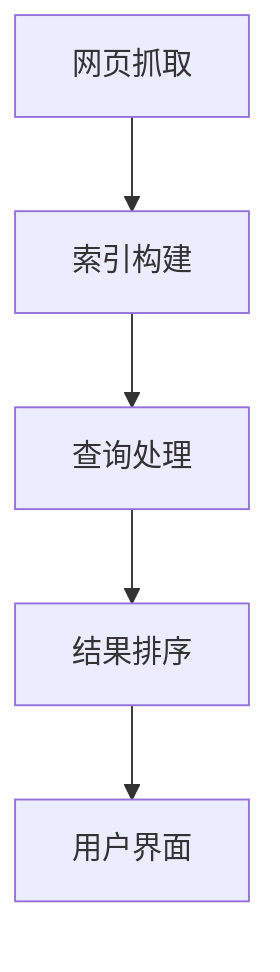

                 

### 第1章：自然语言处理基础

#### 1.1 自然语言处理简介

自然语言处理（NLP，Natural Language Processing）是计算机科学、人工智能和语言学领域的交叉学科，旨在让计算机理解和处理人类自然语言。自然语言处理不仅涉及对语言结构、语义和语用的分析，还包括语言的生成和翻译等任务。

自然语言处理的意义在于，它能够使计算机具备与人类语言交互的能力，从而在各个领域实现智能化应用。例如，在信息检索、机器翻译、智能客服、语音识别和文本生成等领域，自然语言处理技术都有着广泛的应用。

自然语言处理的关键技术包括文本预处理、分词、词性标注、命名实体识别、句法分析、语义分析等。这些技术共同构成了自然语言处理的核心能力。

1. **文本预处理**：文本预处理是自然语言处理的第一步，主要目的是清洗原始文本，使其适合后续处理。文本预处理包括去除HTML标签、标点符号、数字等非文本内容，以及统一文本格式等。

2. **分词**：分词是将连续的文本序列切分成有意义的词汇序列。分词技术是自然语言处理的基础，对于后续的词性标注、命名实体识别等任务具有重要意义。

3. **词性标注**：词性标注是为文本中的每个词汇赋予相应的词性标签，如名词、动词、形容词等。词性标注有助于提高文本分析精度。

4. **命名实体识别**：命名实体识别是从文本中识别出具有特定意义的实体，如人名、地名、组织机构名等。命名实体识别是信息提取和知识图谱构建的重要基础。

5. **句法分析**：句法分析是对文本进行语法结构分析，以揭示文本中的句法关系。句法分析有助于理解文本的深层语义。

6. **语义分析**：语义分析是对文本进行语义理解，以揭示文本的含义和意图。语义分析是自然语言处理的高级任务，包括情感分析、文本分类、机器翻译等。

通过这些关键技术的综合运用，自然语言处理能够实现从文本到信息的转化，为计算机与人类之间的沟通搭建桥梁。

#### 1.2 搜索引擎概述

搜索引擎（Search Engine）是一种通过关键词检索信息的技术，它能够从庞大的信息库中快速找到用户所需的资料。搜索引擎的基本架构包括爬虫、索引、查询和排名等组成部分。以下是搜索引擎的基本架构和工作流程：

##### Mermaid 流程图



- **网页抓取（Web Crawling）**：搜索引擎的爬虫程序会自动访问互联网上的网页，下载网页内容，并解析网页中的链接，以便继续抓取其他网页。这一过程类似于互联网的深层次搜索。

- **索引构建（Indexing）**：下载的网页内容经过处理后，会被存储在搜索引擎的索引数据库中。索引数据库是一种特殊的数据结构，它能够快速查找与用户查询相关的内容。

- **查询处理（Query Processing）**：当用户输入查询时，搜索引擎会解析查询，并在索引数据库中查找与查询最相关的网页。查询处理过程包括查询分析、索引查找和结果排序等步骤。

- **结果排序（Result Ranking）**：搜索引擎会根据一系列算法对搜索结果进行排序，以便提供最相关、最有用的信息给用户。常见的排序算法包括基于相关度的排序和基于流行度的排序。

- **用户界面（User Interface）**：用户界面是搜索引擎提供给用户输入查询和查看搜索结果的部分。用户界面通常包括搜索框、搜索结果列表和相关的搜索建议等。

搜索引擎的工作流程使得用户可以快速、方便地找到所需的信息，从而大大提高了信息检索的效率。

#### 1.3 搜索引擎的基本架构

搜索引擎的基本架构主要包括网页抓取、索引构建、查询处理、结果排序和用户界面等组成部分。以下是这些组成部分的详细说明：

##### 网页抓取

**网页抓取**是搜索引擎的第一步，也是最重要的步骤之一。搜索引擎的爬虫程序会自动访问互联网上的网页，下载网页内容，并解析网页中的链接，以便继续抓取其他网页。这一过程通常称为网络爬虫（Web Crawler）或网络蜘蛛（Web Spider）。

网页抓取的过程通常包括以下几个步骤：

1. **URL 集合初始化**：爬虫程序会从一个初始 URL 集合开始，这些 URL 可以是搜索引擎的种子链接，也可以是之前抓取网页中解析出来的链接。
2. **下载网页内容**：爬虫程序会使用 HTTP 协议下载网页内容，并将网页内容存储在本地。
3. **解析链接**：爬虫程序会解析下载的网页内容，提取出网页中的链接，并将其加入到待抓取的 URL 集合中。
4. **去重和排序**：爬虫程序会对 URL 集合进行去重处理，以避免重复抓取相同的网页。同时，爬虫程序还会对 URL 集合进行排序，以便优先抓取权重较高的网页。

网页抓取过程中需要注意以下几个问题：

- **爬取深度和广度**：爬虫程序需要控制爬取的深度和广度，以避免过度抓取导致服务器负载过高。通常，爬虫程序会设置一个爬取深度限制，以避免陷入无限递归。
- **robots.txt 文件**：许多网站都提供了 robots.txt 文件，用来指定哪些页面可以被爬虫抓取，哪些页面不被允许被抓取。爬虫程序在抓取网页前，需要读取并遵守网站的 robots.txt 文件。
- **下载速度和频率**：爬虫程序的下载速度和访问频率需要适度控制，以避免给服务器造成过大压力。通常，爬虫程序会设置下载延迟，以减缓访问频率。

##### 索引构建

**索引构建**是将下载的网页内容组织成适合快速检索的形式。索引构建过程通常包括以下几个步骤：

1. **文本提取**：从网页内容中提取有用的文本信息，去除 HTML 标签、JavaScript 代码、CSS 样式等无关内容。
2. **文本预处理**：对提取的文本进行预处理，包括去除标点符号、停用词处理、词干还原等。文本预处理有助于提高搜索效率和准确性。
3. **分词**：将预处理后的文本切分成单词或词汇序列。分词是自然语言处理的重要环节，对于后续的索引构建和搜索查询具有重要意义。
4. **倒排索引构建**：将分词后的文本构建成倒排索引。倒排索引是一种高效的数据结构，它能够将词汇映射到包含该词汇的文档集合，从而实现快速检索。

倒排索引的主要组成部分包括：

- **词汇表（Lexicon）**：存储所有出现过的词汇，并为其分配一个唯一的标识符。
- **倒排列表（Inverted List）**：对于每个词汇，存储一个包含该词汇的文档集合。每个文档在该集合中对应一个唯一的标识符，称为文档 ID。

倒排索引的优势在于：

- **快速检索**：通过倒排索引，搜索引擎可以在短时间内定位到包含特定词汇的文档集合，从而实现快速检索。
- **灵活查询**：倒排索引支持多种查询操作，如布尔查询、短语查询、范围查询等，从而提供丰富的搜索功能。

##### 查询处理

**查询处理**是指搜索引擎在接收到用户查询后，如何快速准确地找到与查询相关的网页。查询处理过程通常包括以下几个步骤：

1. **查询解析**：对用户输入的查询进行解析，提取出关键词和查询意图。查询解析是查询处理的第一步，对于提高搜索结果的准确性具有重要意义。
2. **查询扩展**：根据查询解析结果，对原始查询进行扩展，以获取更广泛的搜索结果。查询扩展可以包括同义词扩展、相关词扩展等。
3. **索引查找**：在倒排索引中查找与扩展后的查询相关的文档集合。索引查找过程通常使用高效的数据结构，如 B 树或哈希表，以实现快速检索。
4. **结果排序**：根据一定的排序算法，对搜索结果进行排序，以提供最相关、最有用的信息给用户。常见的排序算法包括基于相关度的排序和基于流行度的排序。

查询处理过程中需要注意以下几个问题：

- **查询缓存**：搜索引擎可以设置查询缓存，以加快查询响应速度。查询缓存通常存储最近一段时间内频繁出现的查询及其结果，从而避免重复计算。
- **查询重写**：对于一些复杂的查询，搜索引擎可以对其进行重写，使其更符合索引数据库的结构和查询算法。查询重写有助于提高搜索结果的准确性和响应速度。
- **查询多样性**：搜索引擎可以尝试提供多样化的查询结果，以满足不同用户的需求。查询多样性可以通过多种算法实现，如随机采样、基于流行度的采样等。

##### 结果排序

**结果排序**是指根据一定的排序算法，对搜索结果进行排序，以提供最相关、最有用的信息给用户。结果排序算法是搜索引擎的核心技术之一，常见的排序算法包括以下几种：

1. **基于相关度的排序**：基于相关度的排序算法主要通过计算查询词与文档的相关度，对搜索结果进行排序。相关度计算方法包括 TF-IDF、余弦相似度等。
2. **基于流行度的排序**：基于流行度的排序算法主要考虑网页的访问量、引用次数等流行度指标，对搜索结果进行排序。流行度排序有助于提供用户最感兴趣的内容。
3. **混合排序**：混合排序算法结合了多种排序方法，以提供更准确的搜索结果。常见的混合排序方法包括基于相关度的排序和基于流行度的排序的结合。

结果排序过程中需要注意以下几个问题：

- **排序算法选择**：不同的排序算法适用于不同的应用场景，需要根据具体需求选择合适的排序算法。
- **排序参数调整**：排序参数如相关度权重、流行度权重等需要根据实际情况进行调整，以优化搜索结果。
- **用户体验**：搜索结果的排序需要考虑用户体验，提供易读、直观的排序结果，以提高用户满意度。

##### 用户界面

**用户界面**是搜索引擎提供给用户输入查询和查看搜索结果的界面。用户界面通常包括以下组成部分：

1. **搜索框**：用户输入查询的输入框。搜索框需要支持基本的输入验证，如检查输入是否为空、是否包含非法字符等。
2. **搜索按钮**：用户提交查询的按钮。搜索按钮需要与搜索框联动，实现查询的提交。
3. **搜索结果列表**：显示搜索结果的列表。搜索结果列表通常包括结果标题、摘要、URL 等信息，以便用户快速浏览。
4. **相关搜索建议**：在用户输入查询时，提供与查询相关的搜索建议，以引导用户进行更精确的查询。

用户界面设计过程中需要注意以下几个问题：

- **交互设计**：用户界面的交互设计需要简单、直观，以提高用户操作的便捷性和满意度。
- **响应速度**：用户界面需要快速响应用户操作，以避免用户等待时间过长。
- **视觉效果**：用户界面需要具备良好的视觉效果，以提升用户体验。

通过网页抓取、索引构建、查询处理、结果排序和用户界面等组成部分的协同工作，搜索引擎能够为用户提供高效、准确的信息检索服务。

### 第2章：文本预处理与索引

#### 2.1 文本预处理

文本预处理是自然语言处理（NLP）中至关重要的一步，其目的是将原始的文本数据转换为适合进一步分析和处理的格式。文本预处理包括以下几个关键步骤：

1. **去除HTML标签和脚本**：原始文本中通常包含HTML标签和JavaScript脚本，这些内容对文本分析没有实际意义，需要被去除。可以使用正则表达式等工具来匹配并移除这些内容。

2. **去除标点符号**：标点符号通常不会影响文本的分析和理解，因此需要去除。但有时保留某些标点符号（如引号、括号等）对句法分析有意义，所以需要根据具体任务需求来决定是否保留。

3. **统一文本格式**：将文本统一转换为小写或大写格式，以减少不同大小写带来的差异。此外，还需要处理文本中的特殊字符和转义序列，以确保文本的一致性。

4. **去除停用词**：停用词是指在文本中频繁出现但不含实际意义的词，如“的”、“和”、“是”等。去除停用词有助于减少噪声信息，提高文本分析的效果。

5. **词干还原**：词干还原是将不同形态的单词还原为它们的词干形式，例如“running”还原为“run”。这有助于统一不同形式的单词，提高文本分析的一致性。

6. **标准化数字和日期**：将数字和日期格式标准化，例如将“12th”转换为“12”，将“03/01/2023”转换为“2023-03-01”。标准化有助于统一不同格式下的数据，便于后续处理。

文本预处理的过程可以用以下伪代码表示：

```python
def preprocess_text(text):
    # 去除HTML标签和脚本
    text = remove_html_tags(text)
    # 去除标点符号
    text = remove_punctuation(text)
    # 统一文本格式
    text = to_lower_case(text)
    # 去除停用词
    text = remove_stop_words(text)
    # 词干还原
    text = lemmatize(text)
    # 标准化数字和日期
    text = standardize_dates_and_numbers(text)
    return text
```

#### 2.2 文本索引

文本索引是将文本数据组织成适合快速检索的形式，它是搜索引擎的核心技术之一。索引构建过程主要包括以下几个步骤：

1. **分词**：分词是将连续的文本序列切分成有意义的词汇序列。分词技术是自然语言处理的基础，对于后续的索引构建和搜索查询具有重要意义。

2. **倒排索引构建**：倒排索引是一种高效的数据结构，它能够将词汇映射到包含该词汇的文档集合，从而实现快速检索。倒排索引的主要组成部分包括词汇表（Lexicon）和倒排列表（Inverted List）。

3. **词频统计**：对每个词汇在文档中的出现频率进行统计，以便在搜索时进行排序和权重计算。

4. **索引优化**：为了提高索引的效率和存储空间利用率，可以对索引进行压缩、去重等优化操作。

文本索引的构建过程可以用以下伪代码表示：

```python
def build_index(document_list):
    # 分词
    tokenized_documents = tokenize_documents(document_list)
    # 建立词汇表
    vocabulary = build_vocabulary(tokenized_documents)
    # 建立倒排索引
    index = build_inverted_index(tokenized_documents, vocabulary)
    # 词频统计
    term_frequencies = count_term_frequencies(tokenized_documents)
    # 索引优化
    optimized_index = optimize_index(index, term_frequencies)
    return optimized_index
```

#### 2.3 基于倒排索引的搜索

倒排索引是文本索引的一种常见形式，它能够将词汇映射到包含该词汇的文档集合，从而实现快速检索。基于倒排索引的搜索过程主要包括以下几个步骤：

1. **查询解析**：将用户输入的查询字符串解析成关键词序列。查询解析是搜索查询处理的第一步，对于提高搜索结果的准确性具有重要意义。

2. **索引查找**：在倒排索引中查找与扩展后的查询相关的文档集合。索引查找过程通常使用高效的数据结构，如 B 树或哈希表，以实现快速检索。

3. **结果排序**：根据一定的排序算法，对搜索结果进行排序，以提供最相关、最有用的信息给用户。常见的排序算法包括基于相关度的排序和基于流行度的排序。

基于倒排索引的搜索过程可以用以下伪代码表示：

```python
def search(index, query):
    # 查询解析
    query_tokens = parse_query(query)
    # 索引查找
    document_ids = search_in_index(index, query_tokens)
    # 结果排序
    sorted_results = rank_results(document_ids, index)
    return sorted_results
```

#### 2.4 布尔模型与向量模型

布尔模型和向量模型是文本检索中的两种常见检索模型，它们用于计算查询与文档之间的相似度，并据此进行搜索结果排序。

##### 布尔模型

布尔模型是基于布尔代数原理的检索模型，它通过逻辑运算符（如AND、OR、NOT）来组合查询关键词，从而实现对文档集合的检索。布尔模型的计算过程如下：

1. **查询解析**：将用户输入的查询字符串解析成关键词序列。

2. **建立倒排索引**：对文档集合建立倒排索引，将关键词映射到包含该关键词的文档集合。

3. **布尔运算**：根据查询中的逻辑运算符，对倒排索引进行组合运算，得到与查询相关的文档集合。

4. **结果排序**：对得到的文档集合进行排序，通常使用文档频率（Document Frequency, DF）作为排序依据。

布尔模型的优点是简单直观，易于实现，但缺点是缺乏对文本内容的深入理解，无法准确反映查询与文档之间的相关性。

伪代码表示：

```python
def boolean_search(index, query):
    # 查询解析
    query_tokens = parse_query(query)
    # 建立倒排索引
    inverted_index = build_inverted_index(index)
    # 布尔运算
    relevant_documents = boolean_combination(inverted_index, query_tokens)
    # 结果排序
    sorted_results = sort_results(relevant_documents, by='document_frequency')
    return sorted_results
```

##### 向量模型

向量模型是基于向量空间模型的检索模型，它将查询和文档表示为高维向量，并通过计算向量之间的相似度来实现搜索。常见的向量模型包括 TF-IDF 模型和余弦相似度模型。

1. **TF-IDF 模型**：TF-IDF（Term Frequency-Inverse Document Frequency）模型通过计算词汇在文档中的频率（TF）和词汇在整个文档集合中的逆文档频率（IDF）来衡量词汇的重要性。

   - **词频（TF）**：一个词汇在单个文档中的出现频率。
   - **逆文档频率（IDF）**：一个词汇在整个文档集合中未出现文档的比例的倒数。

   TF-IDF 模型的计算公式如下：

   $$ TF-IDF = TF \times IDF $$

   其中，$$ IDF = \log \left( \frac{N}{df} \right) $$，$$ N $$ 为文档总数，$$ df $$ 为词汇的文档频率。

2. **余弦相似度模型**：余弦相似度模型通过计算两个向量的余弦值来衡量它们之间的相似度。余弦相似度的计算公式如下：

   $$ \cos \theta = \frac{\sum_{i=1}^{n} v_i \cdot w_i}{\sqrt{\sum_{i=1}^{n} v_i^2} \sqrt{\sum_{i=1}^{n} w_i^2}} $$

   其中，$$ v $$ 和 $$ w $$ 分别为查询和文档的向量表示，$$ \theta $$ 为它们之间的夹角。

   $$ \cos \theta $$ 的值介于 -1 和 1 之间，越接近 1 表示相似度越高。

   向量模型能够更准确地反映查询与文档之间的相关性，但计算复杂度较高。

伪代码表示：

```python
def tf_idf(document, corpus):
    # 计算词频
    tf = count_words(document)
    # 计算逆文档频率
    df = count_documents_with_word(corpus)
    idf = log(len(corpus) / df)
    # 计算TF-IDF
    tf_idf = tf * idf
    return tf_idf

def cosine_similarity(query_vector, document_vector):
    dot_product = sum(query_vector[i] * document_vector[i] for i in range(len(query_vector)))
    magnitude_query = sqrt(sum(query_vector[i]**2 for i in range(len(query_vector))))
    magnitude_document = sqrt(sum(document_vector[i]**2 for i in range(len(document_vector))))
    return dot_product / (magnitude_query * magnitude_document)
```

通过结合布尔模型和向量模型，可以构建更高效、更准确的文本检索系统。布尔模型提供了一种简单而直观的查询组合方式，向量模型则能够更深入地理解查询与文档之间的相关性。在实际应用中，可以根据具体需求和场景选择合适的模型或模型组合。

### 第3章：查询理解与文本相似度计算

#### 3.1 查询理解

查询理解（Query Understanding）是搜索引擎中一个关键环节，它旨在理解用户输入的查询意图和需求，从而提供更准确和相关的搜索结果。查询理解包括查询意图识别和查询扩展两个主要方面。

##### 查询意图识别

查询意图识别（Query Intent Recognition）是指从用户输入的查询中识别出其背后的意图或需求。这一步骤对于提供个性化搜索结果至关重要。常见的查询意图包括以下几种：

1. **信息检索**：用户希望获取具体的信息，如“北京天气预报”、“苹果公司的CEO是谁？”等。
2. **导航**：用户希望找到特定的网站或页面，如“京东官网”、“百度百科”等。
3. **实体查询**：用户希望获取特定实体的信息，如“故宫博物院介绍”、“周杰伦演唱会门票”等。
4. **任务执行**：用户希望搜索引擎帮助其完成特定任务，如“附近有哪些餐厅？”、“购买机票”等。

查询意图识别的关键技术包括：

- **词频分析**：分析查询中各个词汇的出现频率，识别可能的意图。
- **模式识别**：使用机器学习算法，如决策树、随机森林等，根据查询历史数据建立意图识别模型。
- **实体识别**：利用命名实体识别（Named Entity Recognition, NER）技术，从查询中识别出关键实体，如人名、地名、组织机构名等。

以下是一个简单的查询意图识别算法的伪代码：

```python
def recognize_query_intent(query):
    # 判断是否为导航查询
    if is navigate_query(query):
        return 'Navigation'
    # 判断是否为信息检索查询
    elif is_info_query(query):
        return 'Information'
    # 判断是否为实体查询
    elif is_entity_query(query):
        return 'Entity'
    # 判断是否为任务执行查询
    elif is_task_query(query):
        return 'Task'
    else:
        return 'Unknown'
```

##### 查询扩展

查询扩展（Query Expansion）是指在用户输入原始查询的基础上，自动扩展查询范围，以获取更广泛的搜索结果。查询扩展有助于提高搜索结果的准确性和多样性。常见的查询扩展方法包括：

1. **同义词扩展**：将查询中的关键词替换为同义词，以涵盖更广泛的搜索范围。例如，将“北京天气”扩展为“北京气象”、“北京气温”等。
2. **相关词扩展**：基于词嵌入（Word Embedding）或语义相似性（Semantic Similarity）技术，将查询中的关键词替换为与其语义相近的词汇。例如，将“北京景点”扩展为“北京旅游”、“北京名胜”等。
3. **基于历史的查询扩展**：利用用户的历史查询记录或搜索引擎的搜索日志，自动生成与当前查询相关的扩展查询。

以下是一个简单的查询扩展算法的伪代码：

```python
def expand_query(query, query_history):
    # 扩展同义词
    synonyms = expand_synonyms(query)
    # 扩展相关词
    related_words = expand_related_words(query)
    # 结合历史查询
    historical_queries = expand_historical_queries(query_history)
    # 合并扩展结果
    expanded_queries = synonyms + related_words + historical_queries
    return expanded_queries
```

通过查询理解和查询扩展，搜索引擎可以更准确地理解用户的需求，并提供更相关、更全面的搜索结果。

#### 3.2 文本相似度计算

文本相似度计算（Text Similarity Computation）是自然语言处理中的一项重要任务，它旨在计算两个文本之间的相似程度。文本相似度计算在信息检索、文本分类、文本聚类等领域有着广泛的应用。以下介绍几种常见的文本相似度计算方法。

##### 余弦相似度

余弦相似度（Cosine Similarity）是一种基于向量空间的文本相似度计算方法，它通过计算两个文本向量的余弦值来衡量它们之间的相似度。余弦相似度的计算公式如下：

$$ \cos \theta = \frac{\sum_{i=1}^{n} v_i \cdot w_i}{\sqrt{\sum_{i=1}^{n} v_i^2} \sqrt{\sum_{i=1}^{n} w_i^2}} $$

其中，$$ v $$ 和 $$ w $$ 分别为两个文本的向量表示，$$ \theta $$ 为它们之间的夹角。

余弦相似度的值介于 -1 和 1 之间，越接近 1 表示相似度越高。余弦相似度的优点是计算简单且对噪声具有较强的鲁棒性。

以下是一个简单的余弦相似度计算的伪代码：

```python
def cosine_similarity(v1, v2):
    dot_product = sum(v1[i] * v2[i] for i in range(len(v1)))
    magnitude_v1 = sqrt(sum(v1[i]**2 for i in range(len(v1))))
    magnitude_v2 = sqrt(sum(v2[i]**2 for i in range(len(v2))))
    return dot_product / (magnitude_v1 * magnitude_v2)
```

##### Jaccard相似度

Jaccard相似度（Jaccard Similarity）是一种基于集合论的文本相似度计算方法，它通过计算两个文本集合的交集与并集的比值来衡量它们之间的相似度。Jaccard相似度的计算公式如下：

$$ J(A, B) = \frac{|A \cap B|}{|A \cup B|} $$

其中，$$ A $$ 和 $$ B $$ 为两个文本集合。

Jaccard相似度的值介于 0 和 1 之间，越接近 1 表示相似度越高。Jaccard相似度的优点是计算简单且对于短文本具有较强的鲁棒性。

以下是一个简单的Jaccard相似度计算的伪代码：

```python
def jaccard_similarity(s1, s2):
    intersection = len(set(s1).intersection(set(s2)))
    union = len(set(s1).union(set(s2)))
    return intersection / union
```

##### 汉明距离

汉明距离（Hamming Distance）是一种基于字符比较的文本相似度计算方法，它通过计算两个文本中不同字符的数量来衡量它们之间的差异。汉明距离的计算公式如下：

$$ d(H, T) = \sum_{i=1}^{n} |h_i - t_i| $$

其中，$$ h $$ 和 $$ t $$ 分别为两个文本的字符序列，$$ n $$ 为文本长度。

汉明距离的值越小，表示文本之间的相似度越高。汉明距离的优点是计算简单且对于长文本具有较强的鲁棒性。

以下是一个简单的汉明距离计算的伪代码：

```python
def hamming_distance(s1, s2):
    return sum(c1 != c2 for c1, c2 in zip(s1, s2))
```

通过余弦相似度、Jaccard相似度和汉明距离等文本相似度计算方法，可以有效地衡量两个文本之间的相似程度，从而在信息检索、文本分类、文本聚类等任务中发挥重要作用。

### 第4章：深度学习与搜索

#### 4.1 深度学习在搜索中的应用

深度学习（Deep Learning）作为人工智能领域的一项重要技术，近年来在自然语言处理（NLP）和搜索引擎领域取得了显著进展。深度学习模型，如神经网络（Neural Networks）、循环神经网络（Recurrent Neural Networks, RNNs）、长短期记忆网络（Long Short-Term Memory, LSTM）和变压器（Transformers），在搜索中的应用主要体现在查询理解、文本生成和排序等方面。

##### 深度学习模型在搜索中的角色

1. **查询理解（Query Understanding）**：深度学习模型能够捕捉查询中的语义信息，从而提高查询的准确性和相关性。例如，BERT（Bidirectional Encoder Representations from Transformers）模型通过预训练大量文本数据，学习到词汇的上下文表示，从而在查询处理时能够更好地理解查询意图。

2. **文本生成（Text Generation）**：深度学习模型如GPT（Generative Pre-trained Transformer）和T5（Text-to-Text Transfer Transformer）可以生成高质量的文本摘要、标题和描述，从而为搜索引擎提供更丰富的内容展示。

3. **排序（Ranking）**：深度学习模型在搜索结果排序中发挥着重要作用。通过学习海量搜索日志和用户行为数据，深度学习模型能够为每个搜索结果分配一个权重，从而提高搜索结果的准确性和用户体验。

##### 基于深度学习的搜索方法

1. **基于BERT的查询理解**：BERT模型是一种基于变压器的预训练语言模型，其核心思想是同时从正向和反向上下文中学习词汇的表示。BERT在预训练阶段使用大量的文本数据，通过Masked Language Model（MLM）任务和Next Sentence Prediction（NSP）任务，学习到词汇的上下文表示。

   - **Masked Language Model（MLM）**：在预训练过程中，BERT随机遮盖一部分词汇，并使用模型预测这些词汇。这种方法有助于模型学习到词汇的上下文表示。
   - **Next Sentence Prediction（NSP）**：BERT在预训练过程中，给定一个句子对，模型需要预测第二个句子是否为第一个句子的后续句子。这种方法有助于模型学习到句子之间的语义关系。

   应用到搜索中，BERT可以用于查询理解，通过输入用户查询，模型能够生成查询的上下文表示，从而更好地理解查询意图。

2. **基于GPT的文本生成**：GPT模型是一种基于变压器的生成模型，通过大量文本数据进行预训练，学习到文本生成的规律。在搜索中，GPT可以用于生成搜索结果的摘要、标题和描述。

   - **摘要生成**：对于长文档，GPT可以自动生成摘要，从而提高搜索结果的可读性。
   - **标题和描述生成**：对于网页或文章，GPT可以自动生成吸引人的标题和描述，从而提高用户点击率。

3. **基于深度学习的排序模型**：深度学习模型如LSTM和Transformer可以用于搜索结果排序，通过学习海量搜索日志和用户行为数据，模型能够为每个搜索结果分配一个权重，从而提高搜索结果的准确性和用户体验。

   - **序列模型**：LSTM是一种循环神经网络，能够处理序列数据。在搜索排序中，LSTM可以处理用户的查询历史和搜索结果历史，从而为每个搜索结果生成一个权重。
   - **Transformer模型**：Transformer模型是一种基于自注意力机制的深度学习模型，能够在搜索排序中捕捉长距离依赖关系。通过使用自注意力机制，Transformer可以有效地捕捉查询和搜索结果之间的相关性，从而提高排序效果。

通过深度学习模型在查询理解、文本生成和排序等方面的应用，搜索引擎能够提供更准确、更个性化的搜索结果，从而提高用户体验。

#### 4.2 注意力机制与搜索

注意力机制（Attention Mechanism）是深度学习中的一个重要概念，它通过动态地分配权重，使模型在处理输入序列时，对重要信息给予更高的关注。在搜索领域，注意力机制被广泛应用于查询理解、文本生成和排序等方面，以提高搜索效果和用户体验。

##### 注意力机制的基本概念

注意力机制起源于人类视觉系统，通过关注视觉场景中的特定区域，人类能够更有效地理解和处理视觉信息。在深度学习模型中，注意力机制通过为输入序列中的每个元素分配不同的权重，使模型在处理输入序列时，对重要信息给予更高的关注。

注意力机制的基本形式包括：

1. **点积注意力（Dot Product Attention）**：点积注意力是最简单的注意力机制，它通过计算输入向量与查询向量的点积来生成权重。

   $$ \text{Attention}(Q, K, V) = \text{softmax}\left(\frac{QK^T}{\sqrt{d_k}}\right)V $$

   其中，$$ Q $$ 是查询向量，$$ K $$ 是键向量，$$ V $$ 是值向量，$$ d_k $$ 是键向量的维度。

2. **缩放点积注意力（Scaled Dot Product Attention）**：缩放点积注意力通过引入缩放因子，增强了注意力分配的区分度。

   $$ \text{Attention}(Q, K, V) = \text{softmax}\left(\frac{QK^T}{\sqrt{d_k}} / \sqrt{d_k}\right)V $$

   缩放因子有助于防止梯度消失问题，提高模型训练效果。

3. **多头注意力（Multi-Head Attention）**：多头注意力通过将输入序列分成多个子序列，每个子序列独立应用注意力机制，然后合并结果。多头注意力能够捕捉更多的上下文信息，提高模型表示能力。

   $$ \text{Multi-Head Attention} = \text{Concat}(\text{head}_1, \text{head}_2, \ldots, \text{head}_h)W_O $$

   其中，$$ \text{head}_i $$ 表示第 $$ i $$ 个注意力头的输出，$$ W_O $$ 是输出权重。

##### 注意力机制在搜索中的应用

1. **查询理解**：在查询理解中，注意力机制可以用于捕捉查询和文档之间的相关性。通过为查询中的每个词汇和文档中的每个词汇分配权重，注意力机制能够更好地理解查询意图，从而提供更准确的搜索结果。

2. **文本生成**：在文本生成任务中，注意力机制可以用于捕捉生成文本的上下文信息。例如，在生成搜索结果的摘要、标题和描述时，注意力机制能够更好地理解输入文本的语义，从而生成更高质量的内容。

3. **排序**：在搜索结果排序中，注意力机制可以用于为每个搜索结果分配权重。通过为查询和文档中的每个词汇分配权重，注意力机制能够捕捉查询和文档之间的相关性，从而提高排序效果。

以下是一个简单的注意力机制在搜索中的应用示例：

```python
# 输入查询和文档
query = "什么是自然语言处理？"
document = "自然语言处理是计算机科学、人工智能和语言学领域的交叉学科，旨在让计算机理解和处理人类自然语言。"

# 分词
query_tokens = tokenize(query)
document_tokens = tokenize(document)

# 嵌入
query_embeddings = embed(query_tokens)
document_embeddings = embed(document_tokens)

# 注意力权重计算
attention_weights = scaled_dot_product_attention(query_embeddings, document_embeddings)

# 搜索结果权重计算
result_weights = [sum(attention_weights[i] * document_embeddings[i] for i in range(len(document_embeddings))] for i in range(len(document_embeddings))]

# 排序
sorted_results = sorted(result_weights, reverse=True)
```

通过注意力机制在查询理解、文本生成和排序中的应用，搜索引擎能够提供更准确、更个性化的搜索结果，从而提高用户体验。

### 第5章：语义搜索与知识图谱

#### 5.1 语义搜索

语义搜索（Semantic Search）是基于文本内容的语义理解，旨在提供更准确和相关的搜索结果。与传统的基于关键词匹配的搜索相比，语义搜索能够更好地理解用户的查询意图，从而提供更符合用户需求的搜索结果。

##### 语义搜索的概念与原理

1. **概念**：语义搜索是指通过理解和分析文本的语义内容，为用户提供更准确和相关的搜索结果。语义搜索的目标是超越简单的关键词匹配，实现对文本内容的深入理解。

2. **原理**：语义搜索的基本原理包括以下几个方面：

   - **实体识别（Named Entity Recognition, NER）**：通过命名实体识别技术，从文本中识别出具有特定意义的实体，如人名、地名、组织机构名等。实体识别是语义搜索的基础，有助于提高搜索结果的准确性。
   - **关系抽取（Relation Extraction）**：通过关系抽取技术，从文本中提取出实体之间的关系，如“张三是李四的父亲”。关系抽取有助于构建实体之间的语义关联，从而提高语义搜索的效果。
   - **语义理解（Semantic Understanding）**：通过语义分析技术，理解文本中的语义含义和意图。语义理解包括词义消歧、语义角色标注、情感分析等任务，有助于提高搜索结果的准确性。

##### 语义搜索的关键技术

1. **词嵌入（Word Embedding）**：词嵌入是将词汇映射为高维向量表示的技术。词嵌入能够捕捉词汇的语义信息，从而提高文本相似度计算的准确性。

   - **基本模型**：Word2Vec、GloVe
   - **改进模型**：BERT、ELMO

2. **实体识别（Named Entity Recognition, NER）**：实体识别是从文本中识别出具有特定意义的实体，如人名、地名、组织机构名等。实体识别有助于构建实体之间的语义关联。

3. **关系抽取（Relation Extraction）**：关系抽取是从文本中提取出实体之间的关系，如“张三是李四的父亲”。关系抽取有助于构建实体之间的语义网络。

4. **语义理解（Semantic Understanding）**：语义理解是通过词义消歧、语义角色标注、情感分析等技术，理解文本中的语义含义和意图。语义理解有助于提高搜索结果的准确性。

5. **知识图谱（Knowledge Graph）**：知识图谱是一种用于表示实体及其关系的图形结构。知识图谱能够提供丰富的语义信息，从而提高语义搜索的效果。

##### 语义搜索的优势

1. **更准确的搜索结果**：语义搜索能够理解用户的查询意图，从而提供更准确和相关的搜索结果。
2. **更好的用户体验**：语义搜索能够提供更丰富、更个性化的搜索结果，从而提高用户体验。
3. **更广泛的搜索范围**：语义搜索不仅限于关键词匹配，还能够通过语义关联，提供更广泛的搜索结果。

#### 5.2 知识图谱

知识图谱（Knowledge Graph）是一种用于表示实体及其关系的图形结构。知识图谱通过将实体和关系组织成有向图，为搜索引擎提供了丰富的语义信息，从而提高了搜索效果。

##### 知识图谱的基本概念

1. **概念**：知识图谱是一种结构化知识表示形式，通过将实体和关系组织成有向图，提供了丰富的语义信息。
2. **实体（Entity）**：实体是知识图谱中的基本元素，表示现实世界中的个体或概念，如人、地点、组织、物品等。
3. **关系（Relationship）**：关系是知识图谱中实体之间的关联，表示实体之间的语义关系，如“是”、“属于”、“位于”等。
4. **属性（Attribute）**：属性是实体或关系的额外信息，如人的年龄、地点的经纬度等。

##### 知识图谱在搜索中的应用

1. **查询扩展（Query Expansion）**：知识图谱可以用于查询扩展，通过识别查询中的实体和关系，自动扩展查询范围，从而提高搜索结果的准确性。
2. **结果排序（Result Ranking）**：知识图谱可以用于搜索结果排序，通过计算查询与结果之间的语义相似度，提高搜索结果的准确性。
3. **实体链接（Entity Linking）**：知识图谱可以用于实体链接，将文本中的实体识别为知识图谱中的实体，从而提高文本分析的效果。
4. **问答系统（Question Answering）**：知识图谱可以用于问答系统，通过查询知识图谱，为用户提供准确、详细的答案。

##### 知识图谱的构建方法

1. **手工构建**：手工构建知识图谱是通过专业人员收集、整理和标注实体和关系，构建知识库。这种方法效率低，成本高，但可以构建高质量的知识图谱。
2. **自动构建**：自动构建知识图谱是通过自然语言处理技术，从大量文本数据中自动提取实体和关系。常用的方法包括信息抽取、实体识别、关系抽取等。
3. **混合构建**：混合构建知识图谱是结合手工构建和自动构建方法，通过人工标注和自动提取相结合，构建高质量的知识图谱。

##### 知识图谱的优势

1. **丰富的语义信息**：知识图谱提供了丰富的语义信息，有助于提高搜索结果的准确性。
2. **高效的查询处理**：知识图谱支持高效的查询处理，通过图结构的存储和索引，可以实现快速的查询响应。
3. **跨领域应用**：知识图谱可以应用于多个领域，如电商、医疗、金融等，实现跨领域的语义搜索。

通过语义搜索和知识图谱的结合，搜索引擎能够提供更准确、更个性化的搜索结果，从而提高用户体验。未来，随着知识图谱的不断发展和完善，语义搜索将在各个领域发挥更重要的作用。

### 第6章：搜索系统优化

#### 6.1 搜索系统的性能瓶颈

搜索系统的性能瓶颈主要涉及查询延迟、响应时间和搜索结果质量等方面。了解和解决这些瓶颈是提升搜索系统性能的关键。

##### 查询延迟

查询延迟是指从用户提交查询到系统返回搜索结果所需的时间。查询延迟可能由以下几个因素造成：

1. **网络延迟**：用户与搜索引擎服务器之间的网络传输延迟，可能由于地理位置、网络带宽等因素影响。
2. **爬虫延迟**：搜索引擎的爬虫程序在下载和解析网页内容时可能存在延迟，尤其是在处理大量数据时。
3. **索引延迟**：搜索引擎在构建索引过程中可能存在延迟，特别是在索引更新频繁的情况下。

##### 响应时间

响应时间是指从用户提交查询到系统显示搜索结果页面所需的时间。影响响应时间的因素包括：

1. **查询处理时间**：搜索引擎在解析查询、查找索引和排序结果时可能需要较长的时间，特别是在处理复杂查询或海量数据时。
2. **结果展示时间**：搜索引擎在生成和渲染搜索结果页面时可能需要较长的时间，特别是在结果页面包含大量内容和动态元素时。
3. **服务器负载**：搜索引擎服务器在高并发访问下可能出现负载过高，从而导致响应时间延长。

##### 搜索结果质量

搜索结果质量是指搜索结果的相关性和准确性。影响搜索结果质量的因素包括：

1. **相关性算法**：搜索引擎的排序算法在计算查询与文档之间的相似度时可能存在偏差，从而影响结果的相关性。
2. **索引构建效率**：搜索引擎在构建索引时可能存在效率问题，导致索引不完整或不准确，从而影响搜索结果的质量。
3. **数据质量**：搜索引擎的数据源质量直接影响搜索结果的质量，包括网页内容的质量、数据源的权威性等。

#### 6.2 性能优化方法

为了提升搜索系统的性能，可以采取以下几种优化方法：

##### 索引优化

1. **索引压缩**：通过压缩索引数据，减少存储空间占用，提高索引读取速度。常用的索引压缩算法包括LZ77、LZ78等。
2. **索引分割**：将大型索引分割为多个小型索引，以便并行处理查询，提高查询处理速度。索引分割可以根据不同的维度（如时间、地理位置等）进行。
3. **索引缓存**：利用缓存技术，将常用查询及其结果缓存起来，减少查询处理时间。常用的缓存技术包括内存缓存、分布式缓存等。

##### 查询优化

1. **查询重写**：对用户输入的查询进行重写，使其更符合索引数据库的结构和查询算法。查询重写可以包括同义词替换、查询扩展等。
2. **查询预处理**：在查询处理前，对查询进行预处理，如去除无关字符、统一文本格式等。查询预处理有助于提高查询处理速度和准确性。
3. **查询缓存**：将常用查询及其结果缓存起来，减少查询处理时间。查询缓存可以提高系统响应速度，减轻数据库负载。

##### 系统架构优化

1. **分布式搜索**：将搜索系统部署在分布式环境中，通过分布式计算和存储提高系统性能。分布式搜索可以通过负载均衡、数据分片等技术实现。
2. **异步处理**：将查询处理、索引构建等任务异步处理，减少主进程的压力，提高系统吞吐量。异步处理可以通过消息队列、多线程等技术实现。
3. **预加载**：在用户访问前，提前加载和缓存相关数据，减少查询处理时间。预加载可以通过缓存、数据预取等技术实现。

通过索引优化、查询优化和系统架构优化等方法，可以有效提升搜索系统的性能，提高用户查询速度和搜索结果质量。

### 第7章：案例分析与应用场景

#### 7.1 搜索引擎案例分析

在自然语言处理（NLP）和搜索技术领域，百度和谷歌无疑是两大巨头。它们在自然语言处理、文本检索、排序算法等方面进行了深入研究和实践，取得了显著的成果。以下分别对百度和谷歌的搜索技术进行简要分析。

##### 百度搜索案例

1. **核心技术**：百度搜索采用了深度学习、机器学习等先进技术，实现了包括文本预处理、分词、词性标注、命名实体识别等在内的自然语言处理任务。百度还开发了多种排序算法，如基于用户行为的排序算法、基于内容的排序算法等，以提高搜索结果的准确性。

2. **深度学习应用**：百度搜索引入了深度学习模型，如BERT、GPT等，用于查询理解、文本生成和排序。通过预训练模型，百度搜索能够更好地理解用户查询的语义，提供更准确和个性化的搜索结果。

3. **知识图谱**：百度构建了大规模的知识图谱，将实体和关系组织成有向图。知识图谱在查询扩展、结果排序和问答系统中发挥了重要作用，提高了搜索结果的准确性。

##### 谷歌搜索案例

1. **核心技术**：谷歌搜索在自然语言处理领域同样具有强大的技术实力。谷歌开发了WordNet、Glove等词向量模型，用于文本表示和相似度计算。谷歌还采用了多种排序算法，如基于文档流行度的排序算法、基于用户行为的排序算法等，以提高搜索结果的准确性。

2. **深度学习应用**：谷歌搜索引入了深度学习模型，如Transformer、BERT等，用于查询理解、文本生成和排序。谷歌的搜索算法能够更好地理解用户查询的语义，提供更准确和个性化的搜索结果。

3. **知识图谱**：谷歌构建了知识图谱，通过实体和关系表示，提高了搜索结果的准确性。谷歌的知识图谱在查询扩展、结果排序和问答系统中发挥了重要作用。

##### 比较与总结

1. **技术实力**：百度和谷歌在自然语言处理和搜索技术领域都具有强大的技术实力，但谷歌在深度学习和大规模数据处理方面更具优势。

2. **应用场景**：百度搜索在中国市场具有显著优势，其在中文搜索技术和知识图谱构建方面取得了良好的成果。谷歌搜索在全球范围内具有广泛的应用，其在多语言处理和跨领域搜索方面具有优势。

3. **未来发展**：随着技术的不断进步，百度和谷歌将继续在自然语言处理、深度学习和知识图谱等领域进行深入研究。未来，搜索技术将更加智能化、个性化，为用户提供更优质的搜索体验。

#### 7.2 自然语言处理在搜索中的应用场景

自然语言处理（NLP）在搜索中的多种应用场景，极大地提升了搜索系统的用户体验和效果。以下探讨自然语言处理在搜索中的几个典型应用场景。

##### 跨领域搜索

跨领域搜索是指在不同领域之间进行信息检索，以提供用户更全面的搜索结果。自然语言处理在跨领域搜索中发挥着重要作用：

1. **语义映射**：通过语义映射技术，将不同领域中的术语和概念映射到统一的语义空间中，实现跨领域的语义理解。
2. **领域自适应**：利用领域自适应技术，将通用自然语言处理模型调整为特定领域的模型，提高跨领域搜索的准确性。

##### 实时搜索

实时搜索是指在用户输入查询时，立即返回相关的搜索结果，以提供快速、高效的搜索体验。自然语言处理在实时搜索中的应用包括：

1. **动态查询扩展**：在用户输入查询时，动态扩展查询范围，以捕获用户的真实意图，提高搜索结果的准确性。
2. **实时排序**：通过实时分析用户查询和搜索结果，动态调整排序算法，为用户提供更符合需求的搜索结果。

##### 搜索广告

搜索广告是指在用户进行搜索时，展示与查询相关的广告内容，以提高广告的曝光率和点击率。自然语言处理在搜索广告中的应用包括：

1. **广告投放**：通过自然语言处理技术，分析用户查询的意图，精准投放广告，提高广告的点击率。
2. **广告排序**：利用自然语言处理技术，为广告分配权重，提高广告的展示效果。

##### 情感分析

情感分析是指通过分析用户评论、评价等文本数据，判断用户对某个产品、服务或事件的情感倾向。在搜索中，情感分析可以应用于：

1. **搜索结果排序**：根据用户的情感倾向，调整搜索结果的排序，为用户提供更符合期望的搜索结果。
2. **广告投放**：通过情感分析，为用户提供更符合情感需求的广告，提高广告的转化率。

##### 问答系统

问答系统是指通过自然语言处理技术，回答用户提出的问题。在搜索中，问答系统可以应用于：

1. **智能客服**：为用户提供智能客服服务，解决用户的常见问题，提高用户满意度。
2. **个性化推荐**：通过分析用户查询和问答记录，为用户提供个性化推荐，提高用户的搜索体验。

通过自然语言处理在搜索中的多种应用场景，搜索引擎能够提供更准确、更个性化的搜索结果，为用户提供优质的搜索体验。

### 第8章：搜索技术的发展趋势

#### 8.1 搜索技术的未来方向

随着技术的不断进步，搜索技术正朝着智能化、个性化、实时化和跨领域的方向发展。以下是搜索技术未来可能的发展方向：

##### 大模型在搜索中的应用

1. **预训练语言模型**：预训练语言模型（如BERT、GPT）在搜索中的应用将越来越广泛。通过预训练，这些模型能够学习到大量的语言知识和上下文信息，从而提高搜索结果的准确性和相关性。
2. **多模态搜索**：未来的搜索技术将支持多模态数据（如文本、图像、语音等）的融合和检索。通过多模态搜索，用户可以更加方便地获取所需信息。

##### 智能搜索与个性化推荐

1. **用户行为分析**：通过分析用户的历史查询、浏览记录和点击行为，搜索引擎可以更好地了解用户的需求和兴趣，提供个性化的搜索结果和推荐。
2. **情境感知搜索**：结合用户的地理位置、时间、上下文等信息，搜索引擎可以提供更符合用户当前情境的搜索结果。

##### 搜索与区块链的结合

1. **数据隐私保护**：区块链技术可以为搜索提供安全的数据隐私保护机制，保护用户的搜索数据不被未经授权的访问和泄露。
2. **去中心化搜索**：通过区块链技术，可以实现去中心化的搜索，减少对中心化搜索引擎的依赖，提高搜索系统的可靠性和鲁棒性。

##### 搜索技术在行业中的应用前景

1. **电商搜索**：随着电商业务的快速发展，搜索技术将在电商领域发挥重要作用。通过智能搜索和个性化推荐，电商可以提供更精准的搜索结果和推荐，提高用户购买转化率。
2. **医疗健康搜索**：医疗健康搜索将结合自然语言处理和医学知识图谱，为用户提供精准的健康咨询和疾病诊断建议。
3. **教育搜索**：教育搜索将利用自然语言处理技术，为学生提供个性化学习资源和学习路径，提高学习效果。

通过大模型的应用、智能搜索与个性化推荐、区块链的结合以及在各行业中的应用，搜索技术将继续推动信息检索的发展，为用户提供更优质、更高效的搜索体验。

### 附录

#### 附录 A：自然语言处理与搜索工具资源

在自然语言处理（NLP）和搜索技术领域，有许多优秀的工具和框架可供选择。以下介绍几种主流的NLP和搜索工具及其特点：

##### 主流自然语言处理工具

1. **NLTK（Natural Language Toolkit）**
   - **特点**：NLTK是一个广泛使用的Python库，提供了多种文本处理功能，如分词、词性标注、命名实体识别等。
   - **适用场景**：适合快速开发NLP应用，尤其是学术研究和教育领域。

2. **spaCy**
   - **特点**：spaCy是一个高效的工业级NLP库，提供了快速的分词、词性标注、命名实体识别等功能，同时还支持多种语言。
   - **适用场景**：适用于大规模的工业应用，尤其是需要实时处理的场景。

3. **Stanford NLP**
   - **特点**：斯坦福自然语言处理工具包是一个开源的NLP工具，提供了多种语言处理功能，包括分词、词性标注、命名实体识别等。
   - **适用场景**：适用于研究和教学，尤其是需要高性能和功能丰富的NLP工具。

##### 主流搜索引擎框架

1. **Elasticsearch**
   - **特点**：Elasticsearch是一个开源的搜索引擎和分析引擎，支持全文搜索、实时分析、高可用性等特性。
   - **适用场景**：适用于大型企业级应用，尤其是需要实时搜索和复杂分析的场合。

2. **Solr**
   - **特点**：Solr是一个开源的企业级搜索引擎，提供了丰富的功能，如全文搜索、高可用性、分布式处理等。
   - **适用场景**：适用于中大型企业应用，尤其是需要高扩展性和高可用性的搜索系统。

3. **Apache Lucene**
   - **特点**：Apache Lucene是一个高性能、可扩展的全文搜索库，支持多种索引格式和查询语法。
   - **适用场景**：适用于需要高性能全文搜索功能的项目，尤其是开发自定义搜索引擎。

通过使用这些工具和框架，开发者和研究人员可以更高效地开展自然语言处理和搜索技术的应用和研究。选择合适的工具和框架，将有助于提高项目的开发效率和性能表现。

### 文章摘要

本文系统地探讨了自然语言处理（NLP）在搜索技术中的突破性应用。首先，介绍了自然语言处理的基本概念、关键技术以及搜索引擎的基本架构和工作流程。接着，详细阐述了文本预处理与索引、查询理解与文本相似度计算等核心环节，并深入讨论了深度学习、注意力机制、语义搜索与知识图谱等先进技术在搜索中的应用。此外，本文还分析了搜索系统的性能瓶颈及其优化方法，并通过案例分析展示了自然语言处理在实际搜索系统中的应用效果。最后，展望了搜索技术的发展趋势，探讨了未来搜索技术可能的发展方向。本文旨在为读者提供一个全面而深入的NLP与搜索技术综述，以期为相关领域的研究和实践提供参考和启示。

### 文章标题

#### 自然语言处理在搜索中的突破

---

### 关键词：

- 自然语言处理
- 搜索引擎
- 深度学习
- 注意力机制
- 语义搜索
- 知识图谱
- 搜索优化

---

### 摘要：

本文全面探讨了自然语言处理（NLP）在搜索技术中的突破性应用。从基础概念到前沿技术，包括文本预处理、索引构建、查询理解、文本相似度计算、深度学习与注意力机制、语义搜索与知识图谱等，系统分析了NLP在搜索技术中的关键作用。通过深入探讨搜索系统的性能瓶颈和优化方法，以及案例分析，本文展示了NLP在提升搜索结果准确性、用户体验和系统性能方面的巨大潜力。最后，展望了搜索技术的发展趋势，为未来的研究与实践提供了新的方向和启示。本文旨在为读者提供一个全面、深入的NLP与搜索技术综述，以促进相关领域的发展。

