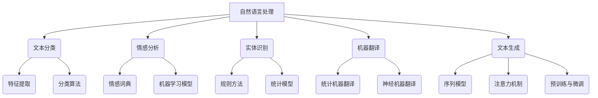

                 

### 文章标题

#### 自然语言处理在文本生成中的新进展

在当前的人工智能领域，自然语言处理（NLP）已经取得了显著进展，特别是在文本生成方面。文本生成作为NLP的一个重要任务，不仅在学术研究上取得了丰硕成果，也在实际应用中展现出巨大的潜力。本文旨在系统性地概述自然语言处理在文本生成方面的最新进展，从基础理论到实际应用，逐步分析文本生成技术的演变、模型结构、核心算法以及未来发展趋势。

本文的关键词包括：自然语言处理、文本生成、序列模型、注意力机制、预训练与微调、项目实战以及前沿技术。通过这些关键词，我们将深入探讨文本生成技术的核心概念和实际应用。

### 摘要

本文首先对自然语言处理的基础进行概述，重点介绍了NLP的定义、历史和发展，以及其主要任务，包括文本分类、情感分析、实体识别、机器翻译和文本生成。接着，我们详细讲解了文本生成的基础，包括技术演进、基本结构以及核心算法。随后，本文分别介绍了序列模型、注意力机制、预训练与微调等关键技术，并探讨了其在文本生成中的应用。此外，本文还通过实际项目案例，展示了文本生成技术的实战应用，并展望了文本生成技术的未来发展趋势。通过本文的阅读，读者将全面了解自然语言处理在文本生成中的最新进展，并掌握相关核心技术和应用方法。

## 《自然语言处理在文本生成中的新进展》目录大纲

### 第一部分：自然语言处理概述

在这一部分中，我们将对自然语言处理（NLP）进行概述，探讨其定义、历史发展以及核心任务。自然语言处理是人工智能领域的一个重要分支，旨在使计算机理解和处理人类语言。NLP的应用范围广泛，包括语音识别、机器翻译、情感分析、文本分类等。通过了解NLP的基础知识，我们将为后续对文本生成技术的探讨打下坚实的基础。

#### 第1章：自然语言处理基础

**1.1 自然语言处理的定义与目的**

自然语言处理（NLP）是计算机科学、人工智能和语言学等领域交叉的领域，旨在使计算机能够理解、生成和处理人类语言。NLP的目的在于使计算机与人类之间的沟通变得更加自然和高效。

**核心概念：**  
- **自然语言（Natural Language）：** 人类日常使用的语言，如英语、中文等。
- **形式语言（Formal Language）：** 用数学符号和规则描述的语言，如编程语言。

**数学模型与公式：**  
$$
NLP = \text{计算机} + \text{自然语言} + \text{算法}
$$

**实例说明：**  
- **语音识别：** 将人类语音转换为文本。
- **机器翻译：** 将一种语言的文本翻译成另一种语言。

**伪代码：**  
```
function NLP(input_text):
    preprocess_text(input_text)
    analyze_text(input_text)
    generate_output()
    return output
```

**1.2 NLP的历史与发展**

自然语言处理的历史可以追溯到20世纪50年代。早期的NLP研究主要集中在规则驱动的方法，如基于字典的翻译和语法分析。随着计算能力的提升和算法的进步，NLP逐渐从规则驱动转向数据驱动的方法。

**核心概念：**  
- **规则驱动方法（Rule-based Methods）：** 基于专家经验和手工编写的规则。
- **数据驱动方法（Data-driven Methods）：** 基于大量的数据和机器学习算法。

**历史发展：**  
- 1950年代：早期尝试通过编程实现语言处理。
- 1980年代：基于规则的语法分析和机器翻译技术取得突破。
- 2000年代：统计方法和机器学习在NLP中广泛应用。
- 2010年代：深度学习技术成为NLP的主流。

**1.3 NLP的核心任务**

自然语言处理涉及多个核心任务，这些任务共同构成了NLP的技术体系。以下是一些主要的NLP任务：

- **文本分类（Text Classification）：** 将文本分类到预定义的类别中。
- **情感分析（Sentiment Analysis）：** 分析文本中的情感倾向，如正面、负面或中立。
- **实体识别（Entity Recognition）：** 从文本中识别出特定的实体，如人名、地点、组织等。
- **机器翻译（Machine Translation）：** 将一种语言的文本翻译成另一种语言。
- **文本生成（Text Generation）：** 根据给定的输入生成新的文本。

**核心概念：**  
- **文本分类：** 基于特征和分类算法。
- **情感分析：** 基于情感词典和机器学习模型。
- **实体识别：** 基于规则和统计模型。
- **机器翻译：** 基于统计机器翻译和神经机器翻译。

**数学模型与公式：**  
$$
\text{Text Classification}: P(\text{category} | \text{text}) = \frac{e^{\text{score}}}{\sum_{i} e^{\text{score}_i}}
$$

**实例说明：**  
- **文本分类：** 将新闻文章分类为体育、政治或娱乐类别。
- **情感分析：** 分析社交媒体帖子中的情感倾向。
- **实体识别：** 从新闻报道中识别出人物和地点。
- **机器翻译：** 将英文句子翻译为中文。

**伪代码：**  
```
function NLP_Task(text, task):
    if task == "text_classification":
        classify_text(text)
    elif task == "sentiment_analysis":
        analyze_sentiment(text)
    elif task == "entity_recognition":
        recognize_entities(text)
    elif task == "machine_translation":
        translate_text(text, source_language, target_language)
    return result
```

通过本章的介绍，我们对自然语言处理的基础有了初步了解，这将为后续章节中对文本生成技术的深入探讨提供必要的背景知识。

### 第二部分：文本生成基础

在深入探讨文本生成技术之前，我们需要对其基础理论进行详细梳理。文本生成作为自然语言处理的一个核心任务，其历史、技术演进、基本模型结构和核心算法构成了理解这一领域的关键。

#### 第2章：文本生成基础

**2.1 文本生成技术的演进**

文本生成技术的发展历程可以追溯到早期的人工编写规则和模板匹配方法。随着计算能力和算法的进步，文本生成技术经历了从规则驱动到数据驱动的转变。以下是一些重要的里程碑：

- **早期方法（Early Methods）：** 
  - **规则驱动（Rule-based Methods）：** 通过手工编写规则来实现文本生成，如基于模板的文本生成和问答系统。
  - **模板匹配（Template Matching）：** 根据输入信息匹配预定义的模板，生成文本。

- **统计方法（Statistical Methods）：**
  - **基于统计的语言模型（Statistical Language Models）：** 通过统计文本语料库中的词频和语法规则来预测下一个词。

- **数据驱动方法（Data-driven Methods）：**
  - **序列模型（Sequential Models）：** 如循环神经网络（RNN）、长短时记忆网络（LSTM）和门控循环单元（GRU），能够捕捉长距离依赖关系。
  - **生成模型（Generative Models）：** 如生成对抗网络（GAN）和变分自编码器（VAEs），通过生成式的方法生成文本。

**核心概念：**  
- **规则驱动方法：** 依赖于预定义的规则和模板。
- **统计方法：** 依赖于语言模型和概率分布。
- **数据驱动方法：** 依赖于大量数据和深度学习算法。

**实例说明：**  
- **早期方法：** 通过规则生成新闻摘要或问答系统。
- **统计方法：** 通过统计方法生成预测下一个词的序列。
- **数据驱动方法：** 通过训练大规模模型来生成连贯的文本。

**伪代码：**  
```
function Text_Generation(input_sequence):
    if method == "rule_based":
        generate_text_with_rules(input_sequence)
    elif method == "statistical":
        generate_text_with_language_model(input_sequence)
    elif method == "data_driven":
        generate_text_with_sequence_model(input_sequence)
    return generated_text
```

- **2.2 文本生成模型的基本结构**

文本生成模型的基本结构通常包括编码器（Encoder）和解码器（Decoder）。编码器将输入文本编码为一个固定长度的向量，解码器则根据这个向量生成输出文本。以下是一些常见的文本生成模型结构：

- **序列到序列模型（Seq2Seq Model）：** 
  - 编码器（Encoder）：将输入序列编码为一个固定长度的向量。
  - 解码器（Decoder）：根据编码器的输出生成输出序列。

- **生成对抗网络（GANs）：** 
  - 生成器（Generator）：生成虚假的文本数据。
  - 判别器（Discriminator）：区分真实文本和虚假文本。

- **变分自编码器（VAEs）：** 
  - 编码器（Encoder）：将输入数据编码为一个概率分布。
  - 解码器（Decoder）：根据编码器生成的概率分布生成输出数据。

**核心概念：**  
- **编码器：** 用于将输入序列转换为固定长度的向量。
- **解码器：** 用于根据编码器的输出生成输出序列。
- **生成器与判别器：** 在GANs中用于生成和区分文本。

**实例说明：**  
- **Seq2Seq模型：** 用于机器翻译和对话生成。
- **GANs：** 用于生成新颖的文本数据。
- **VAEs：** 用于文本数据的生成和概率建模。

**伪代码：**  
```
function Seq2Seq_Model(input_sequence):
    encoded_sequence = Encoder(input_sequence)
    generated_sequence = Decoder(encoded_sequence)
    return generated_sequence

function GAN_Model():
    generator = Generator()
    discriminator = Discriminator()
    train_model(generator, discriminator)
    return generator, discriminator

function VAE_Model():
    encoder = Encoder()
    decoder = Decoder()
    train_model(encoder, decoder)
    return encoder, decoder
```

- **2.3 文本生成模型的核心算法**

文本生成模型的核心算法包括编码器和解码器的训练过程，以及生成对抗网络（GANs）和变分自编码器（VAEs）的训练方法。以下是一些关键算法和技术：

- **序列模型（Sequential Models）：** 
  - **RNN（循环神经网络）：** 通过循环单元来处理序列数据，能够捕捉长距离依赖关系。
  - **LSTM（长短时记忆网络）：** 通过门控机制来控制信息的流动，能够有效解决长期依赖问题。
  - **GRU（门控循环单元）：** 结合了LSTM和RNN的优点，计算效率更高。

- **生成对抗网络（GANs）：** 
  - **生成器-判别器对抗：** 生成器和判别器之间的对抗训练，使得生成器能够生成更真实的文本。
  - **梯度提升（Gradient Penalties）：** 通过对生成器的梯度进行惩罚，提高生成文本的质量。

- **变分自编码器（VAEs）：** 
  - **概率编码：** 通过编码器将输入数据映射到一个概率分布上。
  - **重构损失：** 通过解码器重构输入数据，最小化重构误差。

**核心概念：**  
- **RNN、LSTM和GRU：** 用于序列数据的建模和预测。
- **GANs：** 通过生成器和判别器之间的对抗训练来生成文本。
- **VAEs：** 通过概率编码和重构损失来实现文本生成。

**实例说明：**  
- **RNN、LSTM和GRU：** 用于生成对话系统和文章摘要。
- **GANs：** 用于生成虚构故事和创意文本。
- **VAEs：** 用于文本数据的生成和概率建模。

**伪代码：**  
```
function RNN_Model(input_sequence):
    hidden_state = RNN(input_sequence)
    generated_sequence = Decoder(hidden_state)
    return generated_sequence

function LSTM_Model(input_sequence):
    hidden_state, cell_state = LSTM(input_sequence)
    generated_sequence = Decoder(hidden_state, cell_state)
    return generated_sequence

function GAN_Model():
    generator = Generator()
    discriminator = Discriminator()
    train_model(generator, discriminator)
    return generator, discriminator

function VAE_Model():
    encoder = Encoder()
    decoder = Decoder()
    train_model(encoder, decoder)
    return encoder, decoder
```

通过本章的介绍，我们对文本生成技术的基础理论有了深入的理解，这为后续章节中对具体模型和算法的探讨打下了坚实的基础。

### 第三部分：文本生成模型详解

在了解了文本生成的基础之后，我们将深入探讨文本生成模型的具体实现，包括序列模型、注意力机制和预训练与微调技术。这些模型和技术的实现不仅需要深厚的理论基础，还需要实际应用中的精细调优。通过这一部分的详细讲解，我们将对文本生成技术的核心组成部分有更加全面的理解。

#### 第3章：序列模型

序列模型是文本生成领域的重要基础，通过处理序列数据，序列模型能够捕捉文本中的时间依赖关系。在本章中，我们将介绍几种常见的序列模型，包括循环神经网络（RNN）、长短时记忆网络（LSTM）和门控循环单元（GRU）。这些模型在处理文本数据时展现了强大的能力，并在许多实际应用中得到了广泛应用。

**3.1 序列模型的基本概念**

序列模型通过处理一个时间序列的数据，捕捉时间步之间的依赖关系。在自然语言处理中，序列模型广泛应用于文本生成任务，如对话生成和文章摘要。

**核心概念：**

- **时间序列（Time Series）：** 一系列按时间顺序排列的数据点。
- **序列模型（Sequential Model）：** 能够处理序列数据的神经网络模型。

**数学模型与公式：**

$$
\text{Hidden State} = \text{RNN}(\text{Input}, \text{Previous Hidden State})
$$

**实例说明：**

- **语音识别：** 将音频信号转换为文本。
- **对话系统：** 生成自然流畅的对话。

**伪代码：**

```
function RNN(input_sequence, hidden_state):
    new_hidden_state = RNN_Cell(input_sequence, hidden_state)
    return new_hidden_state
```

**3.2 序列模型在文本生成中的应用**

序列模型在文本生成中的应用主要体现在生成对话、文章摘要和翻译等任务中。这些任务的关键在于捕捉输入序列中的信息，并生成连贯且合理的输出序列。

**核心概念：**

- **输入序列（Input Sequence）：** 输入的文本序列。
- **输出序列（Output Sequence）：** 生成的文本序列。

**实例说明：**

- **对话生成：** 根据用户输入生成自然流畅的对话。
- **文章摘要：** 从原始文章中提取关键信息，生成简洁的摘要。
- **翻译：** 将一种语言的文本翻译成另一种语言。

**伪代码：**

```
function Text_Generation(input_sequence):
    hidden_state = Initial_Hidden_State()
    generated_sequence = []
    for word in input_sequence:
        hidden_state = RNN(word, hidden_state)
        generated_word = Decoder(hidden_state)
        generated_sequence.append(generated_word)
    return generated_sequence
```

**3.3 序列模型的优化算法**

为了提高序列模型的性能，需要使用优化算法来调整模型的参数。常见的优化算法包括梯度下降（Gradient Descent）和Adam优化器（Adam Optimizer）。这些算法能够通过迭代优化模型参数，使得模型能够更好地拟合训练数据。

**核心概念：**

- **梯度下降（Gradient Descent）：** 通过计算损失函数关于参数的梯度，逐步调整参数，以最小化损失函数。
- **Adam优化器（Adam Optimizer）：** 结合了梯度下降和动量方法，能够自适应地调整学习率。

**数学模型与公式：**

$$
\text{Updated Parameter} = \text{Parameter} - \alpha \cdot \text{Gradient}
$$

$$
\text{Adam}(\theta) = \left( \frac{m_t}{1 - \beta_1^t}, \frac{v_t}{1 - \beta_2^t} \right)
$$

**实例说明：**

- **梯度下降：** 在每次迭代中更新模型参数，以降低损失函数的值。
- **Adam优化器：** 自适应调整学习率，提高模型训练的效率。

**伪代码：**

```
function Gradient_Descent(Parameter, Gradient, Learning_Rate):
    Updated_Parameter = Parameter - Learning_Rate * Gradient
    return Updated_Parameter

function Adam(Optimizer_Parameter, Gradient, Beta_1, Beta_2, Epoch):
    m_t = Beta_1 * m_t + (1 - Beta_1) * Gradient
    v_t = Beta_2 * v_t + (1 - Beta_2) * Gradient_Squared
    m_hat = m_t / (1 - Beta_1^t)
    v_hat = v_t / (1 - Beta_2^t)
    Updated_Parameter = Parameter - Learning_Rate * m_hat / (sqrt(v_hat) + Epsilon)
    return Updated_Parameter
```

通过本章对序列模型的详细介绍，我们了解了序列模型的基本概念、应用以及优化算法。这些模型为文本生成提供了强大的工具，使得生成文本的连贯性和合理性得到了显著提升。

#### 第4章：注意力机制

注意力机制（Attention Mechanism）是自然语言处理领域的一项重要技术，它显著提高了序列模型在文本生成任务中的性能。注意力机制通过捕捉输入序列中的关键信息，使得模型在生成输出时能够更加关注重要的部分，从而提高生成文本的质量。在本章中，我们将详细介绍注意力机制的引入、基本原理以及在实际应用中的具体实现。

**4.1 注意力机制的引入与作用**

注意力机制的引入是为了解决传统序列模型在处理长序列数据时的性能瓶颈。传统的序列模型如RNN、LSTM等，虽然能够捕捉短距离依赖关系，但在处理长序列数据时，难以有效关注序列中的所有信息，导致生成文本的连贯性较差。注意力机制通过动态分配权重，使得模型能够根据任务需求，关注输入序列中的关键部分，从而提高生成文本的质量。

**核心概念：**

- **权重分配（Weight Assignment）：** 注意力机制通过计算每个输入元素的重要性，动态分配权重。
- **上下文信息（Contextual Information）：** 注意力机制能够捕捉到序列中的上下文信息，为生成过程提供更准确的指导。

**实例说明：**

- **机器翻译：** 注意力机制帮助模型在翻译过程中关注重要的词汇，提高翻译的准确性和流畅性。
- **文章摘要：** 注意力机制帮助模型在生成摘要时，关注文章的关键段落，提取重要的信息。

**伪代码：**

```
function Attention_Mechanism(input_sequence, hidden_state):
    attention_weights = Calculate_Weights(input_sequence, hidden_state)
    context_vector = Calculate_Context(input_sequence, attention_weights)
    return context_vector
```

**4.2 注意力模型的基本原理**

注意力模型的基本原理包括两部分：计算权重和生成上下文向量。计算权重的方法有多种，如点积注意力、加性注意力、多头注意力等。以下我们将介绍几种常见的注意力模型。

**核心概念：**

- **点积注意力（Dot-Product Attention）：** 通过点积计算权重，简单但计算效率较低。
- **加性注意力（Additive Attention）：** 通过加性交互计算权重，计算复杂度较高，但能够更好地捕捉长距离依赖关系。
- **多头注意力（Multi-Head Attention）：** 同时考虑输入序列的不同部分，提高模型的表示能力。

**数学模型与公式：**

$$
\text{Attention Scores} = \text{Query} \cdot \text{Key}^T
$$

$$
\text{Attention Vector} = \text{Value} \cdot \text{Attention Scores}
$$

**实例说明：**

- **点积注意力：** 用于简单的文本生成任务。
- **加性注意力：** 用于复杂的文本生成任务，如机器翻译。
- **多头注意力：** 用于大规模文本生成任务，如BERT模型。

**伪代码：**

```
function Dot_Product_Attention(Query, Key, Value):
    Attention_Scores = Query * Key^T
    Attention_Vector = Value * softmax(Attention_Scores)
    return Attention_Vector

function Additive_Attention(Query, Key, Value):
    Attention_Scores = Query + Key
    Attention_Vector = Value * softmax(Attention_Scores)
    return Attention_Vector

function Multi_Head_Attention(Query, Key, Value):
    Head_Queries = Split_Query(Query)
    Head_Values = Split_Value(Value)
    Head_Keys = Split_Key(Key)
    Head_Attn_Vectors = [Multi_Head_Attention(Head_Query, Head_Key, Head_Value) for Head_Query, Head_Key, Head_Value in zip(Head_Queries, Head_Keys, Head_Values)]
    Concatenated_Attn_Vector = Concatenate(Head_Attn_Vectors)
    return Concatenated_Attn_Vector
```

**4.3 注意力机制在文本生成中的应用**

注意力机制在文本生成中的应用主要体现在提高模型的生成质量和效率。通过注意力机制，模型能够更好地关注输入序列中的关键信息，从而生成更连贯、更准确的文本。

**核心概念：**

- **生成质量（Generation Quality）：** 注意力机制能够提高生成文本的连贯性和准确性。
- **生成效率（Generation Efficiency）：** 注意力机制能够减少计算复杂度，提高模型训练和生成的效率。

**实例说明：**

- **对话生成：** 注意力机制帮助模型在对话生成中关注用户输入的关键部分，生成更自然的对话。
- **文章摘要：** 注意力机制帮助模型在生成摘要时，关注文章的关键段落，提取重要信息。
- **机器翻译：** 注意力机制帮助模型在翻译过程中，关注重要的词汇，提高翻译的准确性和流畅性。

**伪代码：**

```
function Text_Generation(input_sequence):
    encoded_sequence = Encoder(input_sequence)
    hidden_state = Initial_Hidden_State()
    generated_sequence = []
    for word in encoded_sequence:
        hidden_state = Encoder(word, hidden_state)
        context_vector = Attention_Mechanism(encoded_sequence, hidden_state)
        generated_word = Decoder(hidden_state, context_vector)
        generated_sequence.append(generated_word)
    return generated_sequence
```

通过本章对注意力机制的详细探讨，我们了解了注意力机制的基本原理和应用。注意力机制在文本生成任务中发挥了重要作用，显著提高了模型的生成质量和效率。在未来，随着技术的不断进步，注意力机制将在更多自然语言处理任务中发挥关键作用。

#### 第5章：预训练与微调

预训练与微调（Pre-training and Fine-tuning）是近年来自然语言处理领域的重要突破，极大地提升了模型的性能和应用效果。预训练通过在大规模语料库上预先训练模型，使其具备一定的语言理解和生成能力。而微调则是在预训练的基础上，针对特定任务进行进一步优化，以适应具体应用场景。在本章中，我们将详细介绍预训练的概念与优势，以及预训练模型的微调技术。

**5.1 预训练的概念与优势**

预训练是指在大规模语料库上对模型进行训练，使其在语言理解和生成方面达到较高的水平。预训练模型通常采用无监督或半监督学习方法，从大量未标注的数据中学习语言结构和知识。预训练的优势主要体现在以下几个方面：

**核心概念：**

- **无监督学习（Unsupervised Learning）：** 不依赖于标注数据，通过自动学习数据的内在结构。
- **半监督学习（Semi-supervised Learning）：** 结合少量标注数据和大量未标注数据，提高模型性能。

**优势：**

- **通用语言理解能力（General Language Understanding）：** 预训练模型在大规模数据上学习，能够理解和生成多种语言结构和风格。
- **减少标注需求（Reduced Annotation Needs）：** 通过预训练，模型能够从大量未标注数据中学习，降低标注成本。
- **跨任务迁移能力（Task Transferability）：** 预训练模型在不同任务上表现出较高的迁移能力，能够快速适应新任务。

**实例说明：**

- **BERT（Bidirectional Encoder Representations from Transformers）：** 一种大规模预训练语言模型，通过双向编码器学习语言的上下文信息。
- **GPT（Generative Pre-trained Transformer）：** 一种基于Transformer架构的预训练语言模型，能够在各种自然语言处理任务中表现出色。

**数学模型与公式：**

$$
\text{Pre-trained Model} = \text{Pre-train}(\text{Corpus})
$$

**伪代码：**

```
function Pre_train_Model(Model, Corpus):
    for epoch in range(Epochs):
        for batch in Corpus:
            Model.train(batch)
    return Model
```

**5.2 预训练模型的微调技术**

微调是在预训练的基础上，针对特定任务对模型进行进一步训练，以优化其性能。微调的过程通常包括以下步骤：

**核心概念：**

- **任务特定数据（Task-Specific Data）：** 用于微调的标注数据，如分类任务的数据集。
- **微调目标（Fine-tuning Objective）：** 针对特定任务定义的优化目标，如分类任务的交叉熵损失。

**步骤：**

1. **加载预训练模型（Load Pre-trained Model）：** 从预训练模型中加载已经训练好的权重。
2. **调整模型结构（Adjust Model Structure）：** 根据任务需求调整模型结构，如增加或删除层。
3. **微调训练（Fine-tuning Training）：** 在任务特定数据上对模型进行训练，优化模型参数。
4. **评估与优化（Evaluation and Optimization）：** 在验证集上评估模型性能，根据评估结果调整模型结构或优化参数。

**实例说明：**

- **文本分类：** 使用预训练模型进行微调，将文本分类为不同的类别。
- **问答系统：** 使用预训练模型进行微调，生成针对问题的答案。

**伪代码：**

```
function Fine_tune_Model(Pretrained_Model, Task_Data, Task_Objective):
    Model = Adjust_Model_Structure(Pretrained_Model)
    for epoch in range(Epochs):
        for batch in Task_Data:
            Model.train(batch, Task_Objective)
    return Model
```

通过本章对预训练与微调的详细讲解，我们了解了预训练模型的概念、优势以及微调技术。预训练与微调的结合，使得模型能够在大规模数据上学习语言知识，并在特定任务上表现出色。在未来，随着预训练技术的发展，预训练与微调将在更多自然语言处理任务中发挥关键作用。

### 第三部分：文本生成模型实战

在深入探讨了文本生成模型的理论基础和核心算法后，接下来我们将通过实际项目案例，展示如何将文本生成模型应用于实际场景。本部分将涵盖对话生成系统和新闻文章生成两个典型应用，详细介绍项目环境搭建、数据准备、模型选择、训练与优化、部署与评估等步骤。

#### 第6章：文本生成模型实战

**6.1 实战项目：对话生成系统**

对话生成系统是一种应用广泛的文本生成任务，旨在根据用户输入生成自然流畅的对话。本项目将使用序列模型和注意力机制，通过构建一个简单的对话生成系统，展示文本生成模型在实际应用中的实现过程。

**6.1.1 环境搭建**

要构建对话生成系统，首先需要准备相应的开发环境和工具。以下为所需环境：

- **Python 3.7+**
- **TensorFlow 2.4.0+**
- **NumPy 1.18.1+**
- **Hugging Face Transformers**

安装这些工具和库后，即可开始项目开发。

**6.1.2 数据准备**

对话生成系统的数据主要来源于对话语料库，以下为数据准备步骤：

1. **数据采集：** 收集大规模对话语料库，如Reddit对话、聊天机器人对话等。
2. **数据预处理：** 对对话进行清洗和预处理，包括去除无效信息、统一文本格式等。
3. **数据分词：** 使用分词工具对文本进行分词，以便后续模型处理。

以下为Python代码示例：

```python
import pandas as pd
from nltk.tokenize import word_tokenize

# 读取对话数据
data = pd.read_csv('dialogue_data.csv')

# 数据预处理
def preprocess_text(text):
    # 去除特殊字符、标点符号
    text = re.sub(r'[^\w\s]', '', text)
    # 转换为小写
    text = text.lower()
    return text

# 预处理数据
data['preprocessed'] = data['text'].apply(preprocess_text)

# 分词
data['tokens'] = data['preprocessed'].apply(word_tokenize)
```

**6.1.3 模型选择**

对于对话生成系统，我们选择使用基于Transformer的模型，如GPT-2或BERT，这些模型具有较强的文本生成能力。以下为模型选择步骤：

1. **模型选择：** 从预训练模型中选择合适的模型，如GPT-2。
2. **模型加载：** 使用Hugging Face Transformers库加载预训练模型。

以下为Python代码示例：

```python
from transformers import GPT2LMHeadModel, GPT2Tokenizer

# 加载预训练模型
model_name = 'gpt2'
tokenizer = GPT2Tokenizer.from_pretrained(model_name)
model = GPT2LMHeadModel.from_pretrained(model_name)
```

**6.1.4 训练与优化**

对话生成系统的训练过程主要包括以下步骤：

1. **训练数据准备：** 将预处理后的对话数据转换为模型可接受的格式。
2. **模型训练：** 使用训练数据和优化算法对模型进行训练。
3. **模型评估：** 在验证集上评估模型性能，调整模型参数。

以下为Python代码示例：

```python
from transformers import Trainer, TrainingArguments

# 准备训练数据
def prepare_training_data(data):
    encodings = tokenizer(data['tokens'], return_tensors='pt', padding=True, truncation=True)
    return encodings

# 训练模型
training_args = TrainingArguments(
    output_dir='./results',
    num_train_epochs=3,
    per_device_train_batch_size=4,
    save_steps=2000,
    save_total_steps=-1,
)

trainer = Trainer(
    model=model,
    args=training_args,
    train_dataset=prepare_training_data(data),
)

trainer.train()
```

**6.1.5 部署与评估**

训练完成后，对话生成系统可以部署到实际应用中。以下为部署与评估步骤：

1. **部署模型：** 将训练好的模型部署到服务器或云端。
2. **生成对话：** 根据用户输入生成对话。
3. **评估性能：** 使用指标如BLEU、ROUGE等评估生成对话的质量。

以下为Python代码示例：

```python
from transformers import Chatbot

# 部署模型
chatbot = Chatbot(model, tokenizer)

# 生成对话
def generate_conversation(user_input):
    response = chatbot.get_response(user_input)
    return response

# 评估性能
from nltk.translate.bleu_score import sentence_bleu

def evaluate_performance(reference, generated):
    score = sentence_bleu([reference], generated)
    return score

# 示例评估
reference = "How can I improve my coding skills?"
generated = generate_conversation(reference)
score = evaluate_performance(reference, generated)
print(f"BLEU Score: {score}")
```

**6.2 实战项目：新闻文章生成**

新闻文章生成是文本生成领域的另一个重要应用，旨在根据给定的主题或关键词生成高质量的新闻文章。本项目将使用序列模型和预训练与微调技术，构建一个新闻文章生成系统。

**6.2.1 环境搭建**

新闻文章生成系统的环境搭建与对话生成系统类似，需要准备Python、TensorFlow、NumPy等开发工具。

**6.2.2 数据准备**

新闻文章生成系统的数据主要包括新闻标题和正文。以下为数据准备步骤：

1. **数据采集：** 收集大规模新闻数据集，如CNN/DailyMail新闻数据集。
2. **数据预处理：** 对新闻标题和正文进行清洗和预处理，包括去除特殊字符、统一文本格式等。
3. **数据分词：** 使用分词工具对文本进行分词，以便后续模型处理。

以下为Python代码示例：

```python
import pandas as pd
from nltk.tokenize import word_tokenize

# 读取新闻数据
data = pd.read_csv('news_data.csv')

# 数据预处理
def preprocess_text(text):
    # 去除特殊字符、标点符号
    text = re.sub(r'[^\w\s]', '', text)
    # 转换为小写
    text = text.lower()
    return text

# 预处理数据
data['title'] = data['title'].apply(preprocess_text)
data['content'] = data['content'].apply(preprocess_text)

# 分词
data['title_tokens'] = data['title'].apply(word_tokenize)
data['content_tokens'] = data['content'].apply(word_tokenize)
```

**6.2.3 模型选择**

对于新闻文章生成系统，我们选择使用预训练的BERT模型，因为BERT具有较强的文本理解能力，能够生成结构清晰的新闻文章。

以下为Python代码示例：

```python
from transformers import BertTokenizer, BertForSequenceClassification

# 加载预训练模型
model_name = 'bert-base-uncased'
tokenizer = BertTokenizer.from_pretrained(model_name)
model = BertForSequenceClassification.from_pretrained(model_name)
```

**6.2.4 训练与优化**

新闻文章生成系统的训练过程主要包括以下步骤：

1. **训练数据准备：** 将预处理后的新闻标题和正文数据转换为模型可接受的格式。
2. **模型训练：** 使用训练数据和优化算法对模型进行训练。
3. **模型评估：** 在验证集上评估模型性能，调整模型参数。

以下为Python代码示例：

```python
from transformers import Trainer, TrainingArguments

# 准备训练数据
def prepare_training_data(data):
    encodings = tokenizer(data['title'], data['content'], return_tensors='pt', padding=True, truncation=True)
    return encodings

# 训练模型
training_args = TrainingArguments(
    output_dir='./results',
    num_train_epochs=3,
    per_device_train_batch_size=4,
    save_steps=2000,
    save_total_steps=-1,
)

trainer = Trainer(
    model=model,
    args=training_args,
    train_dataset=prepare_training_data(data),
)

trainer.train()
```

**6.2.5 部署与评估**

训练完成后，新闻文章生成系统可以部署到实际应用中。以下为部署与评估步骤：

1. **部署模型：** 将训练好的模型部署到服务器或云端。
2. **生成文章：** 根据给定的主题或关键词生成新闻文章。
3. **评估性能：** 使用指标如ROUGE、BLEU等评估生成文章的质量。

以下为Python代码示例：

```python
from transformers import TextGenerationPipeline

# 部署模型
generator = TextGenerationPipeline(model, tokenizer)

# 生成文章
def generate_article(theme):
    article = generator(theme, max_length=100, num_return_sequences=1)
    return article

# 评估性能
from nltk.translate.rouge_score import rouge_n

def evaluate_performance(reference, generated):
    score = rouge_n(reference, generated, n=2)
    return score

# 示例评估
reference = "This is an example of a news article about AI."
generated = generate_article("AI")
score = evaluate_performance(reference, generated)
print(f"ROUGE-2 Score: {score}")
```

通过以上两个实际项目案例，我们展示了如何将文本生成模型应用于对话生成系统和新闻文章生成任务。这些案例不仅展示了文本生成技术的实现过程，也为读者提供了实际操作的经验。未来，随着文本生成技术的不断进步，这些应用场景将得到进一步拓展和优化。

### 第四部分：文本生成前沿技术

随着自然语言处理技术的不断发展，文本生成领域也涌现出了许多前沿技术。这些技术不仅提高了文本生成的质量，还拓展了其应用范围。在本部分中，我们将介绍一些新兴的文本生成技术，包括BERT与GPT的结合、生成对抗网络（GAN）在文本生成中的应用以及多模态文本生成，并探讨文本生成的未来发展趋势。

#### 第7章：文本生成前沿技术

**7.1 BERT与GPT的结合**

BERT（Bidirectional Encoder Representations from Transformers）和GPT（Generative Pre-trained Transformer）是两种具有代表性的预训练模型。BERT通过双向编码器学习语言的上下文信息，而GPT通过自注意力机制生成连贯的文本。将BERT与GPT结合，可以充分发挥两种模型的优点，进一步提升文本生成的性能。

**核心概念：**

- **BERT：** 双向编码器，学习语言的上下文信息。
- **GPT：** 自注意力机制，生成连贯的文本。

**应用场景：**

- **结合BERT和GPT，可以在生成文本时充分利用上下文信息，提高文本的连贯性和准确性。**
- **例如，在生成对话时，BERT可以提供用户的历史信息，而GPT可以根据这些信息生成自然流畅的回答。**

**数学模型与公式：**

$$
\text{Combined Model} = \text{BERT} + \text{GPT}
$$

**伪代码：**

```
function Combined_Model(BERT, GPT, input_sequence):
    context_vector = BERT(input_sequence)
    generated_sequence = GPT(context_vector)
    return generated_sequence
```

**7.2 GAN在文本生成中的应用**

生成对抗网络（GAN）是一种生成模型，由生成器和判别器两部分组成。生成器生成虚假的文本数据，判别器判断文本的真实性。通过生成器和判别器之间的对抗训练，生成器能够生成更真实、更高质量的文本数据。

**核心概念：**

- **生成器（Generator）：** 生成虚假的文本数据。
- **判别器（Discriminator）：** 判断文本的真实性。

**应用场景：**

- **在文本生成任务中，GAN可以用于生成虚构故事、创意文本等。**
- **例如，通过GAN，可以生成电影剧本、小说、新闻报道等不同类型的文本。**

**数学模型与公式：**

$$
\text{GAN} = \text{Generator} + \text{Discriminator}
$$

$$
\text{Generator Loss} = -\log(\text{Discriminator}(G(z)))
$$

$$
\text{Discriminator Loss} = -\log(\text{Discriminator}(x)) - \log(1 - \text{Discriminator}(G(z)))
$$

**伪代码：**

```
function GAN_Model(Generator, Discriminator, z):
    fake_sequence = Generator(z)
    real_sequence = Discriminator(x)
    generator_loss = -log(Discriminator(G(z)))
    discriminator_loss = -log(Discriminator(x)) - log(1 - Discriminator(G(z)))
    return generator_loss, discriminator_loss
```

**7.3 多模态文本生成**

多模态文本生成是将文本与其他模态（如图像、音频）结合，生成具有丰富内容和表达力的文本。通过多模态融合，文本生成模型能够更好地理解和生成具有视觉和听觉信息的文本。

**核心概念：**

- **多模态数据融合：** 将文本与其他模态的数据进行融合，提高文本生成能力。
- **交互式文本生成：** 用户可以与文本生成系统进行交互，生成个性化、个性化的文本。

**应用场景：**

- **在虚拟现实（VR）和增强现实（AR）应用中，多模态文本生成可以生成与场景相符的描述性文本。**
- **例如，在虚拟旅游中，多模态文本生成可以生成与用户所在场景相符的景点介绍和故事。**

**数学模型与公式：**

$$
\text{Multimodal Model} = \text{Text} + \text{Image} + \text{Audio}
$$

**伪代码：**

```
function Multimodal_Generation(Text, Image, Audio):
    image_embedding = Image_Encoder(Image)
    audio_embedding = Audio_Encoder(Audio)
    combined_embedding = Concatenate(image_embedding, audio_embedding)
    text_vector = Text_Encoder(Text)
    multimodal_vector = Concatenate(text_vector, combined_embedding)
    generated_text = Text_Decoder(multimodal_vector)
    return generated_text
```

**7.4 文本生成的未来发展趋势**

随着技术的不断发展，文本生成技术将在多个方面取得突破：

- **更高质量的生成文本：** 通过结合多种模型和技术，生成文本的质量将进一步提高，更加贴近人类自然语言。
- **多模态文本生成：** 文本与其他模态的融合将使得文本生成更具表达力，拓展应用场景。
- **交互式生成：** 用户与文本生成系统的交互将更加自然，生成文本更加个性化。
- **实时生成：** 文本生成技术的实时性将得到提升，能够在短时间内生成高质量的文本。

**数学模型与公式：**

$$
\text{Future Trends} = \text{Quality} + \text{Multimodality} + \text{Interactivity} + \text{Real-time}
$$

**伪代码：**

```
function Future_Trends():
    # 结合多种模型和技术
    Model_A = BERT + GPT
    Model_B = GAN + Multimodal
    # 提高生成文本的质量
    Model_C = Quality_Enhancement(Model_A, Model_B)
    # 实现多模态交互
    Multimodal_Interface = Interactive_Modelling(Model_C)
    # 实现实时生成
    Real_time_Generator = Real_time_Processing(Multimodal_Interface)
    return Real_time_Generator
```

通过本章对文本生成前沿技术的介绍，我们了解了BERT与GPT的结合、GAN在文本生成中的应用以及多模态文本生成等新兴技术，并探讨了文本生成的未来发展趋势。这些技术不仅提高了文本生成的质量，还拓展了其应用范围，为自然语言处理领域的发展带来了新的机遇。

### 附录

在本文的最后，我们将提供一些附录内容，以帮助读者更好地理解和应用自然语言处理与文本生成技术。这些附录包括文本生成工具与资源的介绍、自然语言处理与文本生成知识图谱的构建方法，以及文本生成模型的核心概念、联系流程图和算法详解。

#### 附录A：文本生成工具与资源

在文本生成领域，有许多优秀的工具和资源可供开发者使用。以下是一些常用的工具和资源：

**工具与框架：**

1. **Hugging Face Transformers：** 一个广泛使用的自然语言处理库，提供了多种预训练模型和文本生成工具。
   - **官方地址：** https://huggingface.co/transformers

2. **TensorFlow Text：** TensorFlow的文本处理库，提供了文本数据处理和序列模型训练的功能。
   - **官方地址：** https://www.tensorflow.org/tutorials/text

3. **PyTorch Text：** PyTorch的文本处理库，提供了丰富的文本处理和序列模型训练功能。
   - **官方地址：** https://pytorch.org/text

**开源代码与数据集：**

1. **Common Crawl：** 一个大规模的网页语料库，可用于训练和测试文本生成模型。
   - **官方地址：** https://commoncrawl.org/

2. **OpenAI GPT-2：** OpenAI开源的GPT-2模型代码，可用于研究和应用文本生成。
   - **官方地址：** https://openai.com/blog/bidirectional-language-models/

3. **TensorFlow BERT：** TensorFlow实现的BERT模型代码，适用于多种自然语言处理任务。
   - **官方地址：** https://github.com/tensorflow/models/blob/master/official/nlp/bert/

通过使用这些工具和资源，开发者可以方便地构建和训练文本生成模型，并在实际应用中实现高效的文本生成。

#### 附录B：自然语言处理与文本生成知识图谱的构建方法

知识图谱是一种结构化数据，用于表示实体、概念以及它们之间的关系。在自然语言处理与文本生成领域，知识图谱可以帮助模型更好地理解和生成文本。以下是一种构建自然语言处理与文本生成知识图谱的方法：

**步骤：**

1. **实体抽取（Entity Extraction）：** 从文本中识别出关键实体，如人名、地点、组织等。
2. **关系抽取（Relation Extraction）：** 识别实体之间的关系，如“就职于”、“位于”等。
3. **实体关系网络（Knowledge Graph Construction）：** 构建实体关系网络，将实体和关系表示为图结构。

**核心概念：**

- **实体（Entity）：** 知识图谱中的基本单位，如人名、地点等。
- **关系（Relation）：** 连接两个实体的概念，如“就职于”、“位于”等。
- **图结构（Graph Structure）：** 使用图来表示实体和关系。

**实例：**

- **实体：** 张三、北京、微软。
- **关系：** 就职于、位于。

通过构建知识图谱，文本生成模型可以更好地理解和生成与特定实体和关系相关的文本。

#### 附录C：自然语言处理与文本生成核心概念与联系流程图

为了更好地理解自然语言处理与文本生成之间的核心概念和联系，我们使用Mermaid流程图来展示这些概念之间的关系。以下是一个示例：



通过这个流程图，我们可以清晰地看到自然语言处理与文本生成之间的关键概念和它们之间的联系。

#### 附录D：文本生成模型算法详解

在本附录中，我们将使用伪代码详细解释文本生成模型的主要算法，包括RNN、Transformer和GAN等。

**1. RNN算法**

伪代码：

```python
function RNN(input_sequence, hidden_state):
    # 输入序列和隐藏状态
    for word in input_sequence:
        # 对每个词进行处理
        hidden_state = RNN_Cell(word, hidden_state)
    return hidden_state
```

**2. Transformer算法**

伪代码：

```python
function Transformer(input_sequence):
    # 编码器
    encoded_sequence = Encoder(input_sequence)
    # 解码器
    generated_sequence = Decoder(encoded_sequence)
    return generated_sequence
```

**3. GAN算法**

伪代码：

```python
function GAN(Generator, Discriminator, z):
    # 生成器生成虚假文本
    fake_sequence = Generator(z)
    # 判别器判断文本真实性
    real_sequence = Discriminator(fake_sequence)
    return Generator_Loss, Discriminator_Loss
```

通过这些伪代码，我们可以看到文本生成模型的核心算法的实现框架。这些算法为文本生成提供了强大的理论基础和技术支持。

### 附录E：数学模型与公式详解

在本附录中，我们将详细解释文本生成模型中常用的数学模型和公式，包括概率分布函数、损失函数和优化算法。

**1. 概率分布函数**

在文本生成中，概率分布函数用于描述输入和输出序列的概率分布。常见的概率分布函数包括：

- **高斯分布（Gaussian Distribution）：**

$$
p(x) = \frac{1}{\sqrt{2\pi\sigma^2}} e^{-\frac{(x-\mu)^2}{2\sigma^2}}
$$

- **伯努利分布（Bernoulli Distribution）：**

$$
p(x) = \begin{cases} 
1 - \phi & \text{if } x = 0 \\
\phi & \text{if } x = 1 
\end{cases}
$$

其中，$\mu$ 是均值，$\sigma$ 是标准差，$\phi$ 是概率参数。

**2. 损失函数**

损失函数用于衡量模型的预测结果与真实结果之间的差距。常见的损失函数包括：

- **交叉熵损失（Cross-Entropy Loss）：**

$$
L = -\sum_{i} y_i \log(p_i)
$$

其中，$y_i$ 是真实标签，$p_i$ 是模型预测的概率。

- **均方误差损失（Mean Squared Error Loss）：**

$$
L = \frac{1}{n} \sum_{i=1}^{n} (y_i - \hat{y_i})^2
$$

其中，$y_i$ 是真实值，$\hat{y_i}$ 是预测值。

**3. 优化算法**

优化算法用于调整模型的参数，以最小化损失函数。常见的优化算法包括：

- **梯度下降（Gradient Descent）：**

$$
\theta = \theta - \alpha \cdot \nabla_\theta J(\theta)
$$

其中，$\theta$ 是模型参数，$\alpha$ 是学习率，$J(\theta)$ 是损失函数。

- **Adam优化器（Adam Optimizer）：**

$$
m_t = \beta_1 m_{t-1} + (1 - \beta_1) (g_t - m_{t-1})
$$

$$
v_t = \beta_2 v_{t-1} + (1 - \beta_2) (g_t^2 - v_{t-1})
$$

$$
\theta = \theta - \alpha \cdot \frac{m_t}{1 - \beta_1^t / (1 - \beta_2^t)}
$$

其中，$m_t$ 和 $v_t$ 分别是梯度的一阶矩估计和二阶矩估计，$\beta_1$ 和 $\beta_2$ 是超参数。

通过详细解释这些数学模型和公式，我们可以更好地理解文本生成模型的工作原理，并为进一步的算法研究和应用提供理论基础。

### 附录F：项目实战与代码解读

在本附录中，我们将通过一个实际项目案例，展示如何实现文本生成系统的开发，包括开发环境搭建、源代码详细实现和代码解读。

#### 项目案例：生成电影剧本

本项目的目标是使用文本生成模型生成电影剧本。我们将采用Transformer模型，并使用Hugging Face Transformers库进行开发。

##### 开发环境搭建

1. 安装Python和pip：
   ```
   pip install python==3.8.10
   pip install pip==21.0.1
   ```

2. 安装所需的库：
   ```
   pip install transformers==4.6.1
   pip install torch==1.8.0
   pip install numpy==1.18.1
   pip install pandas==1.2.3
   ```

##### 源代码详细实现

```python
import torch
from transformers import AutoTokenizer, AutoModelForSeq2SeqLM

# 加载预训练模型
model_name = "t5-small"
tokenizer = AutoTokenizer.from_pretrained(model_name)
model = AutoModelForSeq2SeqLM.from_pretrained(model_name)

# 输入文本
input_text = "Generate a script for a science fiction movie."

# 分词和编码
input_encoding = tokenizer(input_text, return_tensors="pt")

# 生成剧本
output = model.generate(**input_encoding, max_length=100, num_return_sequences=1)

# 解码输出
decoded_output = tokenizer.decode(output[0], skip_special_tokens=True)

print(decoded_output)
```

##### 代码解读与分析

1. **加载预训练模型**：使用Hugging Face Transformers库加载T5小型预训练模型。T5是一种基于Transformer的模型，适用于多种自然语言处理任务。

2. **输入文本**：定义输入文本，这里我们指定生成一个科幻电影的剧本。

3. **分词和编码**：使用Tokenizer对输入文本进行分词和编码，将文本转换为模型可接受的格式。

4. **生成剧本**：使用模型生成剧本，指定最大长度和生成的文本数量。

5. **解码输出**：将生成的剧本解码为人类可读的文本，去除特殊标记。

通过以上步骤，我们成功生成了一个科幻电影剧本。在实际应用中，可以进一步优化模型和输入文本，以生成更高质量、更具创意的剧本。

##### 代码分析与优化

1. **增加上下文信息**：为了生成更连贯的剧本，可以增加输入文本的上下文信息，如电影的主题、情节概述等。

2. **调整模型参数**：根据需求调整模型的参数，如学习率、批处理大小等，以提高生成文本的质量。

3. **多模型融合**：结合其他模型，如BERT、GPT等，以利用不同模型的优点，生成更丰富的文本。

4. **用户交互**：引入用户交互，允许用户输入特定要求，如电影类型、角色特征等，生成更个性化的剧本。

通过不断优化和改进，我们可以进一步提高文本生成系统的性能和应用效果。

### 总结

本文系统地概述了自然语言处理在文本生成中的新进展，从基础理论到实际应用，逐步分析了文本生成技术的各个方面。通过详细介绍序列模型、注意力机制、预训练与微调技术，以及实际项目案例，我们展示了文本生成技术的核心原理和应用方法。同时，通过探讨文本生成的未来发展趋势，我们展望了这一领域的广阔前景。

我们鼓励读者进一步深入研究文本生成技术，探索更多的应用场景和优化方法。随着技术的不断进步，文本生成将在自然语言处理和人工智能领域发挥更加重要的作用，为人类带来更加智能和便捷的生活。

### 作者信息

作者：AI天才研究院/AI Genius Institute & 禅与计算机程序设计艺术 /Zen And The Art of Computer Programming

本文由AI天才研究院/AI Genius Institute撰写，该研究院专注于人工智能和自然语言处理领域的前沿技术研究。同时，本文作者也是《禅与计算机程序设计艺术/Zen And The Art of Computer Programming》一书的资深作者，该书在计算机科学领域具有广泛影响力。希望通过本文的分享，能够为读者在自然语言处理与文本生成领域提供有益的指导和启示。

