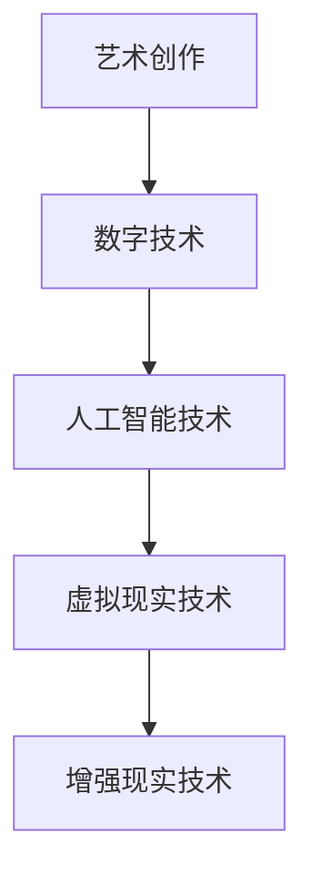

                 

### 《艺术与科技的融合：人类计算激发创意》

> **关键词：**艺术与科技融合、数字艺术、人工智能、虚拟现实、创意激发

> **摘要：**本文深入探讨艺术与科技的融合，分析了艺术创作与数字技术、人工智能、虚拟现实等技术的结合方式，以及这些技术如何激发人类的创意潜力。通过具体案例研究和技术解析，本文展示了艺术与科技融合的广泛前景和实际应用，为读者提供了丰富的启示和思考。

### 《艺术与科技的融合：人类计算激发创意》目录大纲

#### 第一部分：艺术与科技的融合概述

##### 第1章：艺术与科技融合背景与意义
- 1.1 艺术与科技融合的历史与发展
- 1.2 艺术与科技融合的驱动因素
- 1.3 艺术与科技融合的趋势与未来

##### 第2章：艺术创作与数字技术的结合
- 2.1 数字艺术的基本概念
- 2.2 数字艺术的创作工具与技术
- 2.3 数字艺术的表现形式与应用领域

##### 第3章：人工智能在艺术创作中的应用
- 3.1 人工智能与艺术创作的结合
- 3.2 生成对抗网络（GAN）在艺术创作中的应用
- 3.3 深度学习在艺术图像生成中的应用

##### 第4章：虚拟现实与增强现实的艺术表达
- 4.1 虚拟现实与增强现实的基本概念
- 4.2 虚拟现实与增强现实的艺术创作方法
- 4.3 虚拟现实与增强现实的艺术表现形式

#### 第二部分：艺术与科技融合的技术基础

##### 第5章：数字艺术项目的开发流程
- 5.1 数字艺术项目规划与需求分析
- 5.2 数字艺术项目的技术选型
- 5.3 数字艺术项目的执行与评估

##### 第6章：虚拟现实艺术项目的案例研究
- 6.1 虚拟现实艺术项目的实例分析
- 6.2 虚拟现实艺术项目的开发与实现
- 6.3 虚拟现实艺术项目的优化与改进

##### 第7章：人工智能艺术项目的案例研究
- 7.1 人工智能艺术项目的实例分析
- 7.2 人工智能艺术项目的开发与实现
- 7.3 人工智能艺术项目的优化与改进

#### 第三部分：艺术与科技融合的未来展望

##### 第8章：艺术与科技融合的挑战与机遇
- 8.1 艺术与科技融合面临的挑战
- 8.2 艺术与科技融合带来的机遇
- 8.3 艺术与科技融合的未来发展趋势

#### 附录

##### 附录 A：艺术与科技融合的工具与资源
- A.1 常用的数字艺术创作工具
- A.2 人工智能艺术创作工具
- A.3 虚拟现实与增强现实技术资源

### Mermaid 流程图



### 核心算法原理讲解（伪代码）

```python
# 生成对抗网络（GAN）的伪代码

function GAN():
    # 生成器G的参数
    G_params = initialize_parameters()
    # 判别器D的参数
    D_params = initialize_parameters()
    # 学习率
    learning_rate = 0.0002
    # 批大小
    batch_size = 64
    # 训练轮数
    num_epochs = 10000
    
    for epoch in range(num_epochs):
        for batch in range(num_batches):
            # 随机生成噪声向量
            noise = generate_random_noise(batch_size, noise_dim)
            # 使用噪声生成伪造数据
            fake_data = G(noise)
            # 训练判别器D
            D_loss_real = compute_loss(D, real_data)
            D_loss_fake = compute_loss(D, fake_data)
            D_loss = D_loss_real + D_loss_fake
            D_gradients = compute_gradients(D_params, [D_loss_real, D_loss_fake])
            update_parameters(D_params, D_gradients, learning_rate)
            
            # 训练生成器G
            G_loss = compute_loss(D, fake_data)
            G_gradients = compute_gradients(G_params, G_loss)
            update_parameters(G_params, G_gradients, learning_rate)
```

### 数学模型和数学公式

#### 生成对抗网络（GAN）中的损失函数

$$
J(D) = -\frac{1}{2}\left(E_{x \sim P_{data}(x)}[\log D(x)] + E_{z \sim P_{z}(z)][\log (1 - D(G(z))]\right)
$$

### 项目实战

#### 艺术与科技融合项目的开发环境搭建

- 安装Python和pip
- 安装TensorFlow或PyTorch
- 安装虚拟现实开发工具（如Unity或Unreal Engine）

#### 源代码详细实现和代码解读

- 创建一个数字艺术生成器
- 使用GAN生成艺术作品
- 将生成的艺术作品保存到文件

#### 代码解读与分析

- 分析GAN的训练过程和损失函数
- 解释如何使用生成器生成艺术作品
- 讨论GAN在艺术创作中的应用前景

---

注：上述大纲中的某些章节内容可能需要根据实际书籍内容进行适当调整。

现在，让我们开始撰写正文部分。首先，我们来探讨艺术与科技融合的背景与意义。

#### 第一部分：艺术与科技的融合概述

##### 第1章：艺术与科技融合背景与意义

> **1.1 艺术与科技融合的历史与发展**

艺术与科技的融合并非近年来的新兴现象，其历史可以追溯到20世纪初期。从那时起，艺术家和科技工作者就开始探索如何将新兴技术应用于艺术创作之中。早期的尝试主要集中在摄影、电影和录音技术的应用上，这些技术的出现极大地改变了艺术的表现形式和传播方式。

进入数字时代，艺术与科技的融合进程进一步加快。计算机技术的发展为艺术家提供了前所未有的创作工具和手段。数字绘画、数字雕塑、数字音乐等数字艺术形式开始涌现，打破了传统艺术创作的界限。同时，互联网的普及使得艺术作品能够更快速、更广泛地传播，艺术家与观众的互动方式也发生了巨大变化。

> **1.2 艺术与科技融合的驱动因素**

艺术与科技融合的驱动因素主要包括以下几个方面：

1. **技术进步**：科技的飞速发展，尤其是计算机科学、人工智能、虚拟现实、增强现实等领域的突破，为艺术创作提供了丰富的工具和手段。
2. **市场需求**：随着人们生活水平的提高，对艺术作品的需求不再局限于传统的形式，人们渴望新颖、独特的艺术体验，这促使艺术家和科技工作者不断探索新的艺术创作方式。
3. **社会变革**：社会的快速变化和全球化趋势，使得文化交流和融合变得更加频繁，这为艺术与科技的融合提供了广阔的空间。

> **1.3 艺术与科技融合的趋势与未来**

艺术与科技融合的趋势主要体现在以下几个方面：

1. **数字化与智能化**：艺术创作将更加依赖数字化工具和智能化算法，如深度学习、生成对抗网络（GAN）等，这将极大地提高艺术创作的效率和多样性。
2. **跨学科融合**：艺术与科技、艺术与工程、艺术与科学等领域的交叉融合将越来越普遍，这将产生出更多的创新艺术形式和表现手段。
3. **互动性与沉浸性**：虚拟现实、增强现实等技术的应用，将使得艺术作品更加具有互动性和沉浸感，观众能够更加深入地参与到艺术创作和体验过程中。

未来的艺术与科技融合将不仅限于艺术创作本身，还将涉及到艺术教育、艺术传播、艺术市场等多个方面，形成一个完整的艺术生态系统。艺术与科技的融合将不仅为艺术家提供新的创作方式，也将为观众带来全新的艺术体验，从而推动艺术和科技共同发展。

接下来，我们将深入探讨艺术创作与数字技术的结合，了解数字艺术的基本概念、创作工具和技术，以及其应用领域。

#### 第二部分：艺术与科技融合的技术基础

##### 第2章：艺术创作与数字技术的结合

> **2.1 数字艺术的基本概念**

数字艺术是指利用数字技术进行创作和表现的艺术形式。它不仅包括传统的绘画、雕塑、音乐等艺术形式，还包括新兴的虚拟现实、增强现实、交互艺术等。数字艺术的核心在于数字技术的应用，包括计算机图形学、数字音频处理、人工智能等。

数字艺术的创作过程通常包括以下几个步骤：

1. **构思与策划**：艺术家根据创作意图，构思艺术作品的初步概念和构思。
2. **素材收集与处理**：艺术家收集各种数字素材，包括图像、音频、视频等，并进行数字化处理。
3. **创作与编辑**：利用数字工具和软件，如Adobe Photoshop、Maya、3ds Max等，进行艺术创作和编辑。
4. **渲染与展示**：将数字艺术作品渲染成最终格式，如静态图像、动态视频、虚拟现实体验等，并进行展示。

> **2.2 数字艺术的创作工具与技术**

数字艺术的创作工具和技术种类繁多，以下是一些常见的工具和技术：

1. **计算机图形学**：计算机图形学是数字艺术创作的基础，它涉及图形的生成、渲染、显示和处理。常用的计算机图形学工具包括OpenGL、DirectX、Unity等。

2. **数字绘画与设计软件**：如Adobe Photoshop、Illustrator、CorelDRAW等，这些软件提供了丰富的绘图、图像处理和设计功能，是数字艺术创作的重要工具。

3. **三维建模与动画软件**：如Maya、3ds Max、Blender等，这些软件可以用于三维建模、动画制作、渲染等，是数字艺术创作中不可或缺的工具。

4. **数字音频处理软件**：如Adobe Audition、Pro Tools等，这些软件可以用于音频的录制、编辑、处理和合成，是数字音乐和交互艺术的重要组成部分。

5. **人工智能与机器学习**：人工智能和机器学习技术正在逐渐应用于数字艺术创作中，如生成对抗网络（GAN）可以用于图像生成、风格迁移等。

> **2.3 数字艺术的表现形式与应用领域**

数字艺术的表现形式多样，包括：

1. **静态图像**：包括数字绘画、数字摄影、数字插画等。
2. **动态视频**：包括数字动画、视频艺术等。
3. **交互艺术**：包括交互式装置、虚拟现实艺术、增强现实艺术等。
4. **三维建模与动画**：包括三维数字雕塑、三维动画电影等。

数字艺术的应用领域广泛，包括：

1. **艺术创作与展示**：艺术家利用数字技术进行创作和展示，为观众带来全新的艺术体验。
2. **影视与动画制作**：数字技术被广泛应用于电影、电视剧、动画的制作，提高了艺术作品的质量和效率。
3. **交互设计**：数字艺术在交互设计中的应用，如人机交互界面、游戏设计等，提升了用户体验。
4. **数字媒体与传播**：数字艺术作品通过网络平台进行传播，拓宽了艺术作品的传播渠道和受众范围。

总之，数字艺术为艺术创作提供了广阔的空间和无限的创意可能，它不仅丰富了艺术的表现形式，也为艺术家和观众带来了全新的艺术体验。

接下来，我们将探讨人工智能在艺术创作中的应用，了解人工智能与艺术创作如何结合，以及生成对抗网络（GAN）和深度学习在艺术图像生成中的应用。

##### 第3章：人工智能在艺术创作中的应用

> **3.1 人工智能与艺术创作的结合**

人工智能（AI）技术在艺术创作中的应用已经成为一个热点领域，它不仅为艺术家提供了新的创作工具，还改变了艺术创作的流程和方式。人工智能与艺术创作的结合主要体现在以下几个方面：

1. **创意生成**：人工智能可以帮助艺术家生成新的创意和灵感，如通过生成对抗网络（GAN）生成新的艺术作品、音乐旋律等。
2. **艺术优化**：人工智能可以分析现有艺术作品的数据，提供优化建议，如色彩搭配、构图调整等。
3. **艺术辅助**：人工智能可以辅助艺术家完成一些复杂的创作任务，如三维建模、动画制作等。
4. **交互体验**：人工智能可以创造交互式的艺术体验，如虚拟现实（VR）艺术、增强现实（AR）艺术等。

人工智能与艺术创作的结合，不仅提高了艺术创作的效率和多样性，还为艺术家和观众带来了全新的艺术体验。

> **3.2 生成对抗网络（GAN）在艺术创作中的应用**

生成对抗网络（GAN）是一种强大的人工智能模型，它通过两个神经网络的博弈来生成数据。GAN的一个关键特性是它能够生成高质量的、逼真的图像，这在艺术创作中有着广泛的应用。

1. **图像生成**：GAN可以生成各种类型的图像，如图像到图像、图像到视频等。艺术家可以利用GAN生成独特的艺术作品，探索新的创作方向。
2. **风格迁移**：GAN可以实现图像的风格迁移，即将一种艺术风格应用到另一张图像上。艺术家可以利用这一特性创作出融合多种艺术风格的作品。
3. **图像修复**：GAN可以修复损坏的图像，如老照片修复、图像去噪等，为艺术家提供了更多的创作素材。

一个典型的GAN结构包括生成器（Generator）和判别器（Discriminator）。生成器接收随机噪声，生成逼真的图像；判别器则尝试区分生成的图像和真实的图像。通过不断训练，生成器和判别器逐渐提高自己的能力，生成器能够生成越来越逼真的图像。

> **3.3 深度学习在艺术图像生成中的应用**

深度学习是人工智能的一个重要分支，它通过多层神经网络模拟人脑的学习过程，具有强大的特征提取和模式识别能力。在艺术图像生成中，深度学习被广泛应用于以下几个方面：

1. **自动编码器（Autoencoder）**：自动编码器是一种简单的深度学习模型，它可以学习数据的高效编码和解码。艺术家可以利用自动编码器生成新的图像，探索数据中的潜在结构。
2. **卷积神经网络（CNN）**：卷积神经网络是一种用于图像识别和处理的有效工具，它可以自动提取图像中的特征。艺术家可以利用CNN生成具有特定特征的图像，如风景、人物等。
3. **变分自编码器（VAE）**：变分自编码器是一种基于深度学习的概率生成模型，它可以生成具有多种不同特征的图像。艺术家可以利用VAE生成具有多样性的艺术作品。

通过结合GAN和深度学习，艺术家可以探索更多的创作可能性。例如，使用GAN生成图像的基础框架，然后利用深度学习模型对生成的图像进行风格迁移或特征调整，从而创作出独特的艺术作品。

总之，人工智能在艺术创作中的应用正在改变艺术创作的模式和方式。艺术家可以利用人工智能技术生成新的创意、优化艺术作品、辅助创作过程，为观众带来全新的艺术体验。随着人工智能技术的不断发展，我们可以预见，艺术与科技的融合将带来更多的创新和突破。

接下来，我们将探讨虚拟现实与增强现实的艺术表达，了解这两项技术的基本概念、艺术创作方法以及艺术表现形式。

##### 第4章：虚拟现实与增强现实的艺术表达

> **4.1 虚拟现实与增强现实的基本概念**

虚拟现实（VR）和增强现实（AR）是两种重要的计算机技术，它们在艺术创作中有着广泛的应用。

1. **虚拟现实（VR）**：虚拟现实是一种通过计算机生成的三维虚拟环境，用户通过特定的设备（如VR头盔）进入这个环境，并与之进行互动。VR的核心在于创造一种沉浸式的体验，让用户感觉仿佛置身于另一个世界。

2. **增强现实（AR）**：增强现实是在现实环境中叠加数字内容，用户通过特定的设备（如智能手机或AR眼镜）看到数字内容与现实环境的结合。AR的核心在于增强用户的感知体验，提供额外的信息和交互。

虚拟现实和增强现实在技术原理、应用场景和用户体验上有所不同，但它们都为艺术创作提供了全新的表现手段。

> **4.2 虚拟现实与增强现实的艺术创作方法**

虚拟现实和增强现实的艺术创作方法主要包括以下几个方面：

1. **内容创作**：艺术家需要根据创作意图，设计虚拟环境或增强现实内容。这包括场景设计、角色建模、声音设计等。

2. **交互设计**：艺术家需要设计用户与虚拟环境或增强现实内容的交互方式，如手势识别、语音控制等。

3. **用户体验**：艺术家需要考虑用户的沉浸感和互动体验，确保艺术作品能够在虚拟或增强现实环境中顺利展示和互动。

4. **技术实现**：艺术家需要利用虚拟现实和增强现实技术，如Unity、Unreal Engine、ARKit等，实现艺术作品的技术实现。

虚拟现实和增强现实的艺术创作方法与传统艺术创作有所不同，它需要艺术家具备更多的技术知识和技能。

> **4.3 虚拟现实与增强现实的艺术表现形式**

虚拟现实和增强现实在艺术创作中表现出多种形式：

1. **虚拟艺术展览**：艺术家可以通过虚拟现实技术创建一个完整的艺术展览，观众可以在虚拟环境中自由浏览和体验不同的艺术作品。

2. **互动艺术装置**：艺术家可以利用虚拟现实或增强现实技术，创建互动艺术装置，观众可以通过与装置的互动来体验艺术。

3. **虚拟角色表演**：艺术家可以通过虚拟现实技术创建虚拟角色，进行角色表演或故事叙述。

4. **增强现实地图**：艺术家可以在现实世界中叠加数字内容，创建增强现实地图，提供额外的信息和交互。

虚拟现实和增强现实的艺术表现形式多样，它不仅丰富了艺术的表现手段，也为观众带来了全新的艺术体验。

总之，虚拟现实和增强现实为艺术创作提供了广阔的空间和无限的创意可能。艺术家可以利用这些技术创造沉浸式体验、互动艺术装置和虚拟角色表演等，为观众带来全新的艺术感受。随着虚拟现实和增强现实技术的不断发展，我们可以预见，艺术与科技的融合将带来更多的创新和突破。

### 第二部分：艺术与科技融合的技术基础

#### 第5章：数字艺术项目的开发流程

数字艺术项目的开发流程是一个复杂而系统化的过程，它涉及到项目的规划、需求分析、技术选型、执行和评估等多个环节。以下是数字艺术项目开发流程的详细探讨：

##### 5.1 数字艺术项目规划与需求分析

数字艺术项目的规划与需求分析是项目开发的重要起点。在这一阶段，项目团队需要明确项目的目标、范围、预期成果和预算等关键要素。

1. **项目目标**：项目团队需要明确项目的总体目标，包括艺术作品的主题、风格、形式以及预期的观众反应等。
2. **项目范围**：确定项目的具体范围，包括艺术作品的内容、技术实现、时间和资源分配等。
3. **需求分析**：进行需求分析，收集相关利益相关者的需求，包括艺术家、观众、技术团队等，确保项目能够满足各方需求。

##### 5.2 数字艺术项目的技术选型

技术选型是数字艺术项目开发的核心环节，它决定了项目的实现方式和效果。项目团队需要根据项目需求，选择合适的数字艺术创作工具和技术。

1. **创作工具**：选择适合项目的数字艺术创作工具，如Adobe Photoshop、Illustrator、Maya、3ds Max、Blender等。
2. **开发平台**：选择适合项目的开发平台，如Unity、Unreal Engine、ARKit、VRChat等。
3. **编程语言**：根据项目需求，选择合适的编程语言，如Python、C++、JavaScript等。
4. **算法和技术**：如果项目需要复杂的人工智能或机器学习算法，选择适合的算法和技术，如生成对抗网络（GAN）、卷积神经网络（CNN）等。

##### 5.3 数字艺术项目的执行与评估

数字艺术项目的执行是按照规划和技术选型逐步推进的过程。项目团队需要遵循以下步骤：

1. **创作与开发**：根据项目规划和技术选型，开始数字艺术作品的创作和开发。在这一阶段，艺术家和技术团队需要紧密合作，确保作品的质量和进度。
2. **测试与调试**：在创作和开发过程中，不断进行测试和调试，确保艺术作品的功能和性能达到预期。
3. **用户反馈**：在项目开发过程中，收集用户反馈，根据反馈调整和优化艺术作品。
4. **项目评估**：项目完成后，进行项目评估，包括技术实现、艺术效果、用户体验等方面，评估项目是否达到预期目标。

通过以上步骤，数字艺术项目的开发流程得以系统化和规范化，确保项目能够顺利进行并取得成功。

接下来，我们将通过具体案例研究，深入探讨虚拟现实艺术项目和人工智能艺术项目的开发与实现。

##### 第6章：虚拟现实艺术项目的案例研究

虚拟现实艺术项目是艺术与科技融合的典型代表，它通过虚拟现实技术为观众提供沉浸式的艺术体验。在本节中，我们将通过具体案例研究，深入探讨虚拟现实艺术项目的开发与实现过程。

##### 6.1 虚拟现实艺术项目的实例分析

**案例：虚拟艺术博物馆**

虚拟艺术博物馆是一个利用虚拟现实技术创建的在线艺术展览平台，它将现实世界中的艺术博物馆搬到虚拟空间中，为观众提供全新的艺术体验。

**项目目标**：创建一个虚拟艺术博物馆，展示世界著名艺术作品，提供沉浸式的浏览和互动体验。

**项目范围**：包括博物馆建筑的设计、艺术品的三维建模、虚拟展览空间的布局、互动功能的开发等。

**技术实现**：使用Unity作为开发平台，结合Unity的VR插件，实现虚拟现实艺术博物馆的功能。

##### 6.2 虚拟现实艺术项目的开发与实现

虚拟现实艺术项目的开发与实现涉及多个方面，以下是具体的开发过程：

1. **需求分析与规划**：项目团队首先进行需求分析，明确项目目标、范围和技术要求。根据需求，制定项目规划和时间表。

2. **虚拟场景设计**：设计师根据项目需求，设计虚拟艺术博物馆的场景，包括建筑外观、内部空间布局、装饰等。

3. **艺术品建模**：艺术家使用三维建模软件，如Maya、3ds Max等，对世界著名艺术作品进行三维建模，确保模型的高质量和细节表现。

4. **虚拟展览空间布局**：根据艺术品的特点和虚拟场景的布局，规划艺术品的摆放位置和展示方式。

5. **互动功能开发**：开发团队使用Unity的VR插件，实现用户在虚拟空间中的浏览、互动等功能，如旋转、放大、缩小艺术品，观看艺术品的详细信息等。

6. **测试与优化**：在开发过程中，不断进行测试和优化，确保虚拟现实艺术博物馆的功能和性能达到预期。

7. **上线与推广**：完成开发后，将虚拟现实艺术博物馆上线，通过社交媒体、艺术网站等渠道进行推广，吸引观众。

##### 6.3 虚拟现实艺术项目的优化与改进

虚拟现实艺术项目上线后，项目团队需要不断进行优化和改进，以满足观众的反馈和需求。以下是优化与改进的几个方面：

1. **用户体验**：根据观众反馈，优化用户界面和交互体验，提高用户的满意度。

2. **技术更新**：随着虚拟现实技术的发展，项目团队需要不断更新技术和工具，以提供更高质量的艺术体验。

3. **内容更新**：定期更新虚拟艺术博物馆的内容，展示新的艺术作品和展览，保持观众的兴趣和新鲜感。

4. **互动功能扩展**：根据观众的需求，扩展虚拟现实艺术博物馆的互动功能，如增加游戏化元素、社交互动等。

通过以上案例研究，我们可以看到虚拟现实艺术项目的开发与实现是一个系统化、多阶段的过程。项目团队需要紧密合作，从需求分析到技术实现，再到优化与改进，确保项目能够成功落地并为观众带来独特的艺术体验。

接下来，我们将探讨人工智能艺术项目的案例研究，分析人工智能在艺术创作中的应用和发展。

##### 第7章：人工智能艺术项目的案例研究

人工智能（AI）在艺术创作中的应用正逐渐成为热门话题。通过人工智能技术，艺术家可以探索新的创作方式，生成独特的艺术作品。在本节中，我们将通过具体案例研究，分析人工智能艺术项目的开发与实现，以及项目的优化与改进。

##### 7.1 人工智能艺术项目的实例分析

**案例：AI生成的艺术作品展览**

某人工智能艺术项目通过人工智能技术生成了一系列独特的艺术作品，并在虚拟画廊中展示了这些作品。展览吸引了众多观众，为人们带来了全新的艺术体验。

**项目目标**：利用人工智能技术生成艺术作品，展示人工智能在艺术创作中的潜力。

**项目范围**：包括人工智能算法的设计、艺术作品的生成、虚拟画廊的搭建、观众互动功能的开发等。

**技术实现**：使用生成对抗网络（GAN）和深度学习算法，实现艺术作品的自动生成。开发虚拟画廊的界面和交互功能，使用Unity和VRChat等技术。

##### 7.2 人工智能艺术项目的开发与实现

人工智能艺术项目的开发与实现涉及多个技术环节，以下是具体开发过程：

1. **需求分析与规划**：项目团队首先进行需求分析，明确项目目标、范围和技术要求。根据需求，制定项目规划和时间表。

2. **算法设计与实现**：开发团队设计并实现人工智能算法，包括生成对抗网络（GAN）和深度学习模型。这些算法用于生成艺术作品，如图像、音乐、视频等。

3. **艺术作品生成**：使用训练好的算法生成艺术作品。在生成过程中，艺术家可以调整算法参数，控制生成作品的风格、色彩、形状等。

4. **虚拟画廊搭建**：使用Unity等开发工具，搭建虚拟画廊的界面，为观众提供浏览和互动的平台。虚拟画廊需要实现导航、缩放、旋转等功能，让观众能够自由浏览艺术作品。

5. **互动功能开发**：开发互动功能，如投票、评论、分享等，增加观众的参与度和互动性。

6. **测试与优化**：在开发过程中，不断进行测试和优化，确保人工智能艺术项目的功能和性能达到预期。

7. **上线与推广**：完成开发后，将项目上线，通过社交媒体、艺术网站等渠道进行推广，吸引观众。

##### 7.3 人工智能艺术项目的优化与改进

人工智能艺术项目上线后，项目团队需要不断进行优化与改进，以满足观众的反馈和需求。以下是优化与改进的几个方面：

1. **用户体验**：根据观众反馈，优化用户界面和交互体验，提高用户的满意度。

2. **算法更新**：随着人工智能技术的发展，项目团队需要不断更新算法，提高艺术作品的生成质量和创意度。

3. **内容更新**：定期更新人工智能艺术项目的内容，展示新的艺术作品和展览，保持观众的兴趣和新鲜感。

4. **互动功能扩展**：根据观众的需求，扩展人工智能艺术项目的互动功能，如增加游戏化元素、社交互动等。

5. **技术支持**：提供技术支持，帮助观众解决使用过程中遇到的问题，提高项目的稳定性和可用性。

通过以上案例研究，我们可以看到人工智能艺术项目的开发与实现是一个涉及算法设计、艺术创作、互动开发等多个环节的过程。项目团队需要紧密合作，不断优化和改进，以确保项目能够为观众带来独特的艺术体验，并推动人工智能在艺术领域的应用和发展。

### 第三部分：艺术与科技融合的未来展望

##### 第8章：艺术与科技融合的挑战与机遇

艺术与科技融合正在蓬勃发展，为艺术家和观众带来了前所未有的创新和体验。然而，这一融合过程也面临着一系列挑战与机遇。在本章中，我们将探讨艺术与科技融合所带来的挑战、机遇以及未来发展趋势。

##### 8.1 艺术与科技融合面临的挑战

1. **技术门槛**：艺术与科技融合要求艺术家具备一定的技术知识，包括编程、计算机图形学、人工智能等。这对于许多传统艺术家来说是一个巨大的挑战，他们可能需要花费大量的时间和精力去学习和掌握这些技术。

2. **版权问题**：随着数字艺术的兴起，版权问题变得更加复杂。艺术作品一旦数字化，就容易被复制和传播，这给艺术家的版权保护带来了挑战。

3. **隐私与安全**：虚拟现实和增强现实技术需要收集大量的用户数据，这引发了对隐私和安全的担忧。如何确保用户数据的安全，避免数据泄露，是一个亟待解决的问题。

4. **技术与艺术的关系**：艺术与科技融合引发了关于技术与艺术关系的讨论。一些人认为技术削弱了艺术家的独特性和创造性，而另一些人则认为技术为艺术创作提供了新的可能性。

##### 8.2 艺术与科技融合带来的机遇

1. **创意激发**：科技为艺术家提供了新的创作工具和手段，激发了他们的创意潜力。艺术家可以利用人工智能、虚拟现实等技术，探索全新的艺术形式和表现手法。

2. **艺术传播**：数字技术和互联网的普及，使得艺术作品的传播更加便捷和广泛。艺术家可以通过社交媒体、在线平台等，将艺术作品传播到全球的观众。

3. **艺术市场**：艺术与科技的融合带来了新的商业模式和市场机会。虚拟艺术展览、数字艺术品交易等新兴市场正在迅速发展，为艺术家和投资者提供了新的盈利途径。

4. **教育与创新**：艺术与科技的融合为艺术教育带来了新的机遇。艺术家和教育者可以利用数字技术和虚拟现实技术，开展互动式教学和研究，培养更多的创新人才。

##### 8.3 艺术与科技融合的未来发展趋势

1. **数字化与智能化**：未来，艺术与科技融合将更加数字化和智能化。艺术家将更广泛地使用人工智能、虚拟现实、增强现实等技术，创作出更多独特的艺术作品。

2. **跨学科融合**：艺术与科技、艺术与工程、艺术与科学等领域的交叉融合将越来越普遍，产生出更多的创新艺术形式和表现手段。

3. **互动性与沉浸性**：虚拟现实和增强现实技术将继续发展，为观众带来更加沉浸式的艺术体验。艺术家将利用这些技术，创作出更加互动和参与性的艺术作品。

4. **个性化与定制化**：随着大数据和人工智能技术的进步，艺术作品将更加个性化与定制化，满足不同观众的需求和偏好。

总之，艺术与科技的融合为艺术创作和观众体验带来了巨大的变革。面对挑战，艺术家和科技工作者需要不断创新和适应，抓住机遇，推动艺术与科技的共同发展。

### 附录 A：艺术与科技融合的工具与资源

艺术与科技融合为艺术家提供了丰富的工具和资源，以下是一些常用的工具和资源，供艺术家和技术工作者参考。

#### A.1 常用的数字艺术创作工具

1. **Adobe Photoshop**：强大的图像处理软件，适合进行数字绘画、图像编辑和设计。
2. **Adobe Illustrator**：专业的矢量图形设计软件，适合进行插画、图标和版式设计。
3. **CorelDRAW**：功能强大的矢量图形设计软件，适合进行平面设计和插画创作。
4. **Autodesk Maya**：全面的三维建模、动画和渲染软件，适用于三维建模、动画和视觉效果制作。
5. **Autodesk 3ds Max**：专业的三维建模、动画和渲染软件，适用于建筑、动画和游戏开发。
6. **Blender**：开源的三维建模、动画和渲染软件，适合进行独立艺术创作和游戏开发。
7. **Unity**：跨平台的游戏开发引擎，适用于虚拟现实（VR）和增强现实（AR）项目。
8. **Unreal Engine**：功能强大的游戏开发引擎，适用于高质量的游戏和虚拟现实（VR）项目。

#### A.2 人工智能艺术创作工具

1. **TensorFlow**：开源机器学习库，适用于构建和训练生成对抗网络（GAN）和其他深度学习模型。
2. **PyTorch**：开源机器学习库，适用于构建和训练生成对抗网络（GAN）和其他深度学习模型。
3. **Keras**：基于TensorFlow的简洁易用的深度学习库，适合快速构建和实验深度学习模型。
4. **GANimation**：用于生成动画的GAN框架，支持从文本描述生成动画。
5. **DeepArt**：基于深度学习的艺术风格迁移工具，可以将一幅图像转换成另一种艺术风格。
6. **StyleCLIP**：用于风格迁移的深度学习模型，支持从文本描述生成具有特定艺术风格的图像。

#### A.3 虚拟现实与增强现实技术资源

1. **ARKit**：苹果公司开发的增强现实（AR）开发框架，适用于iOS平台。
2. **ARCore**：谷歌公司开发的增强现实（AR）开发框架，适用于Android平台。
3. **Unity ARKit插件**：Unity开发的开源插件，用于在Unity中实现ARKit功能。
4. **Unity ARCore插件**：Unity开发的开源插件，用于在Unity中实现ARCore功能。
5. **VRChat**：基于Unity的虚拟现实社交平台，支持多人互动和艺术创作。
6. **Unreal Engine VR插件**：Unreal Engine开发的支持虚拟现实（VR）和增强现实（AR）开发的插件。
7. **Google Cardboard**：谷歌开发的虚拟现实（VR）头戴设备，适合进行虚拟现实项目的原型设计和测试。

通过使用这些工具和资源，艺术家和技术工作者可以更有效地进行艺术创作和项目开发，探索艺术与科技的融合带来的无限可能。

### 结束语

在《艺术与科技的融合：人类计算激发创意》这篇文章中，我们深入探讨了艺术与科技融合的背景、技术基础、应用案例以及未来展望。通过分析数字艺术、人工智能、虚拟现实和增强现实等技术在艺术创作中的应用，我们看到了科技如何为艺术创作提供新的工具和手段，激发人类的创意潜力。

艺术与科技的融合不仅改变了艺术的表现形式和传播方式，也为艺术家和观众带来了全新的艺术体验。未来，随着技术的不断发展，我们可以预见，艺术与科技的融合将带来更多的创新和突破，推动艺术和科技共同发展。

让我们期待，艺术与科技的融合将激发出更多独特的创意，创造出更多令人惊叹的艺术作品，为人类文明贡献更多的精神财富。通过艺术与科技的力量，我们能够更好地理解和感受世界的美好，享受创意带来的无穷乐趣。

