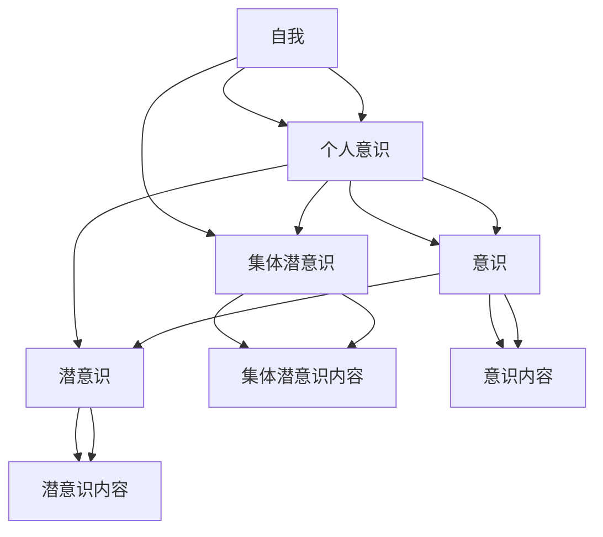
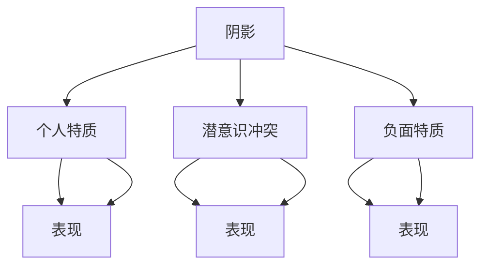
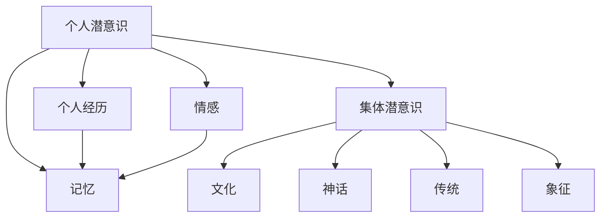
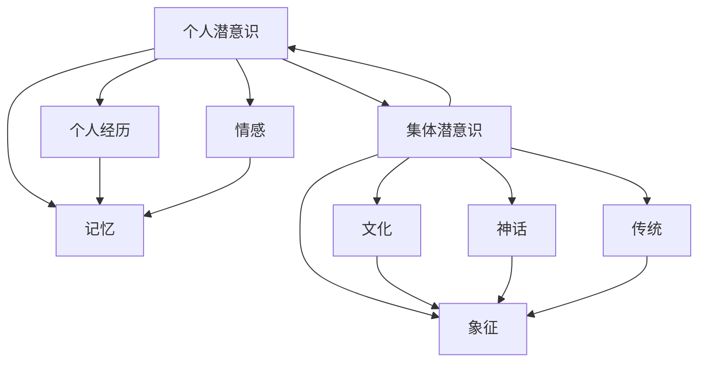
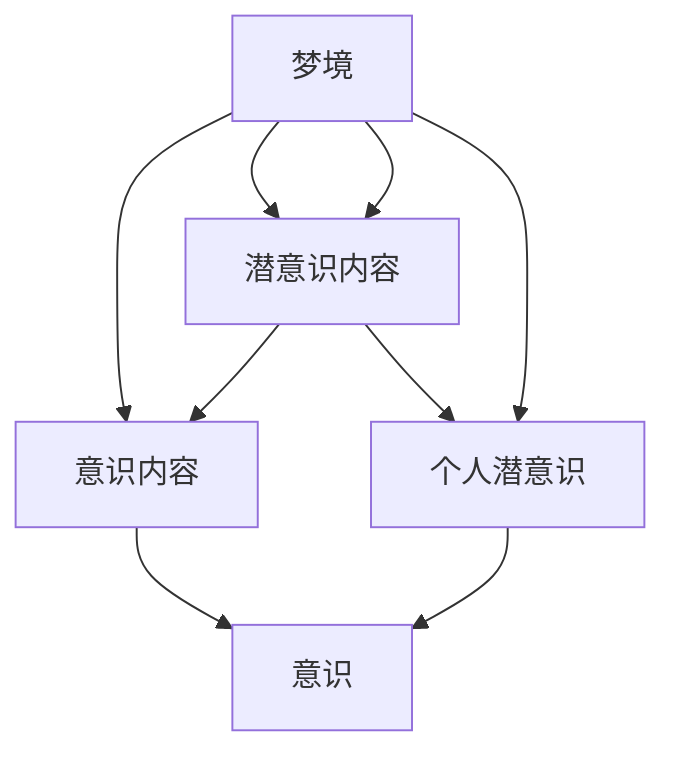
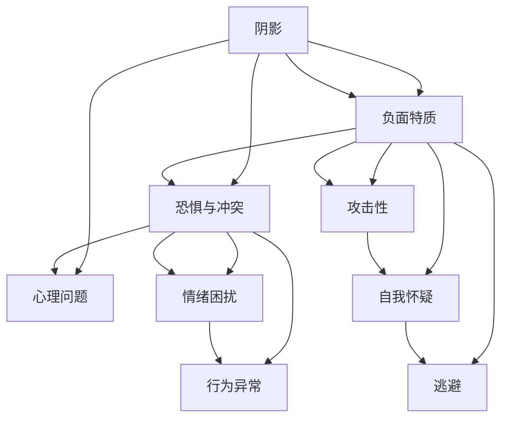
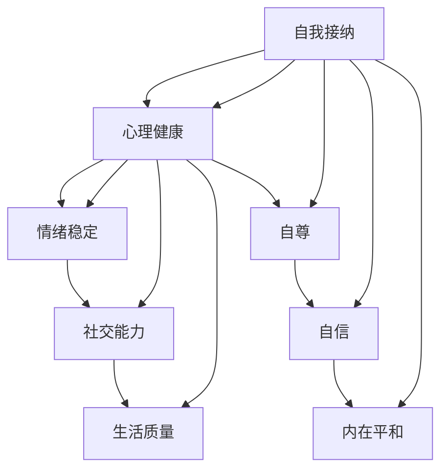
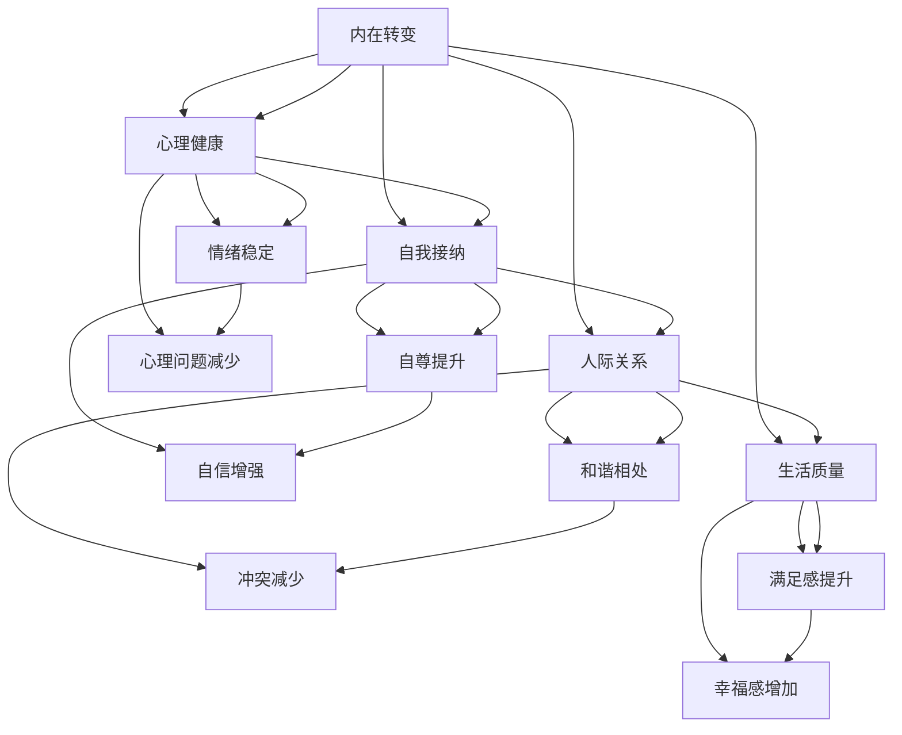

                 

### 《荣格：理解自身的黑暗面，是应对他人黑暗面的最好方法》

> **关键词**：荣格、心理学、黑暗面、自我接纳、人际互动、心理健康

> **摘要**：本文从荣格心理学的角度出发，探讨了理解自身黑暗面的重要性及其在应对他人黑暗面中的应用。通过分析荣格的人格理论、阴影的概念以及梦境解析等，我们了解到，通过探索和接纳自己的阴影，我们能够更好地理解和处理他人的负面特质，从而建立和谐的社交关系。文章旨在为读者提供一种实用的方法，帮助他们提升心理健康和人际交往能力。

----------------------------------------------------------------

### 《荣格：理解自身的黑暗面，是应对他人黑暗面的最好方法》目录大纲

#### 第一部分：荣格及其心理学理论

- **第1章：荣格生平与贡献**
  - **1.1 荣格的生平与早期经历**
  - **1.2 荣格的心理学理论体系**
  - **1.3 荣格的心理学在当代的应用与影响**

- **第2章：荣格人格理论**
  - **2.1 自我与人格结构**
  - **2.2 阴影与个人成长**
  - **2.3 个人与集体潜意识**

- **第3章：荣格的梦境解析**
  - **3.1 梦境与个人潜意识**
  - **3.2 梦境解析的方法与技巧**
  - **3.3 梦境的象征意义与心理解读**

- **第4章：荣格的心理学符号学**
  - **4.1 心理学符号学的概念**
  - **4.2 符号在心理学中的应用**
  - **4.3 荣格心理学符号学的研究方法**

#### 第二部分：理解自身的黑暗面

- **第5章：阴影的探索**
  - **5.1 阴影的概念与作用**
  - **5.2 阴影的成因与表现**
  - **5.3 探索阴影的过程**

- **第6章：自我接纳与成长**
  - **6.1 自我接纳的意义**
  - **6.2 如何面对自己的阴影**
  - **6.3 阴影与个人成长的关系**

- **第7章：内在转变的实践**
  - **7.1 内在转变的重要性**
  - **7.2 荣格的内在转变方法**
  - **7.3 内在转变的案例与实践**

#### 第三部分：应对他人的黑暗面

- **第8章：理解他人的阴影**
  - **8.1 他人的阴影与人际互动**
  - **8.2 如何识别他人的阴影**
  - **8.3 跨越人际界限的方法**

- **第9章：建立和谐的社交关系**
  - **9.1 社交关系中的阴影处理**
  - **9.2 如何处理他人的阴影**
  - **9.3 和平沟通的技巧与策略**

- **第10章：荣格心理学在现代社会中的应用**
  - **10.1 荣格心理学与现代生活**
  - **10.2 荣格心理学在教育领域的应用**
  - **10.3 荣格心理学在心理咨询与治疗中的应用**

#### 附录

- **附录A：荣格心理学常用术语表**
  - **A.1 自我**
  - **A.2 阴影**
  - **A.3 集体潜意识**
  - **A.4 梦境解析**

- **附录B：推荐阅读与资源**
  - **B.1 荣格经典著作推荐**
  - **B.2 相关心理学书籍推荐**
  - **B.3 在线课程与讲座资源**

本文将按照上述目录结构，逐章深入探讨荣格心理学中的核心概念和实际应用，帮助读者理解自身的黑暗面，以更和谐的方式应对他人的负面特质。

----------------------------------------------------------------

## 第1章：荣格生平与贡献

### 1.1 荣格的生平与早期经历

卡尔·古斯塔夫·荣格（Carl Gustav Jung，1875-1961）是瑞士的心理学家和心理学家，被誉为“心理学之父”之一。他出生于瑞士的凯斯威尔（Kesswil），在一个牧师家庭中长大。荣格的父母对他的教育和培养极为重视，尤其是他的母亲，她是一位虔诚的宗教信徒，对荣格的宗教意识和哲学思考产生了深远影响。

荣格在年轻时就对心理学产生了浓厚的兴趣。他在大学时期，最初攻读医学，但在接触了威廉·弗洛伊德（Wilhelm Freud）的作品后，逐渐转向心理学领域。他在1896年进入瑞士的巴塞尔大学（University of Basel）学习医学，并于1900年获得了医学博士学位。在大学期间，荣格结识了威廉·弗洛伊德，并成为他的忠实追随者。

荣格与弗洛伊德的关系始于他们共同对人类潜意识的探索。他们在1906年共同出版了《性学三论》，这是两人合作的代表作，探讨了人类性欲的本质和心理机制。然而，随着时间的推移，荣格开始对弗洛伊德的某些观点产生怀疑，尤其是在心理学中的无意识理论和性欲驱动方面。

### 1.2 荣格的心理学理论体系

荣格在心理学领域的主要贡献在于他独立发展出一套独特的心理学理论体系，被称为“荣格心理学”。这一理论体系包括以下几个方面：

1. **人格理论**：荣格提出了“人格结构”的概念，认为人格由“自我”（Self）、“个人意识”（Personal Consciousness）和“集体潜意识”（Collective Unconscious）三部分构成。

2. **阴影**：荣格认为，每个人的人格中都有一种未被意识到的“阴影”部分，它包含了个人的负面特质和潜意识的冲突。通过探索和接纳自己的阴影，个体可以实现个人成长。

3. **梦境解析**：荣格认为，梦境是个人潜意识的表达，通过解析梦境，可以深入了解个人的内心世界和潜意识的内容。

4. **心理学符号学**：荣格提出，心理学符号是一种特殊的语言，它通过象征和隐喻的方式，传达了人类内心深处的信息和情感。

### 1.3 荣格的心理学在当代的应用与影响

荣格的心理学理论在当代心理学中具有重要影响。他的理论不仅为精神分析心理学提供了重要的补充，也对哲学、宗教、艺术等多个领域产生了深远的影响。

1. **心理学领域**：荣格的理论为心理学研究提供了新的视角和方法，特别是在人格心理学、精神病学、心理咨询等领域，他的理论和方法得到了广泛应用。

2. **哲学与宗教**：荣格的心理学理论与哲学和宗教思想有着紧密的联系。他的集体潜意识理论，与宗教中的神秘主义和神话传说有着相似之处，为宗教研究提供了新的视角。

3. **艺术与文学**：荣格的心理学理论，特别是梦境解析和心理学符号学，对艺术创作和文学批评产生了重要影响。许多艺术家和作家通过探索自己的内心世界和潜意识，创作出具有深刻内涵的艺术作品。

总之，荣格的心理学理论不仅丰富了心理学领域的研究，也为人类对自身内心世界的认识提供了重要的理论支持。他的贡献和影响，将继续在未来的心理学研究和实践中得到体现。

----------------------------------------------------------------

## 第2章：荣格人格理论

### 2.1 自我与人格结构

在荣格的人格理论中，**自我**（Self）是人格的核心部分，是人格结构的总体协调者。自我不仅代表着个体内在的统一性，还承担着维持个体与外部世界的平衡和协调的功能。自我通常以“我”的形式出现，是个体意识的主观体验。

为了更好地理解自我，我们可以使用 **Mermaid 流程图** 来表示自我与人格结构的关系：

在这个流程图中，自我（A）是人格结构的中心，连接着个人意识（B）和集体潜意识（C）。个人意识包括意识（D）和潜意识（E），而集体潜意识则包含了集体潜意识内容（F）。通过这个流程图，我们可以看出自我是如何在个人意识和潜意识之间，以及集体潜意识中起到平衡和协调作用的。

### 2.2 阴影与个人成长

荣格的**阴影**（Shadow）概念是人格理论中的另一个重要组成部分。阴影指的是个人人格中未被意识到的部分，包括个人的负面特质、潜在的恐惧和冲突。阴影通常被认为是人类行为和情感中那些不受欢迎或难以接受的方面。

要深入理解阴影，我们可以使用 **Mermaid 流程图** 来表示阴影的成因和表现：

在这个流程图中，阴影（A）包括了个人特质（B）、潜意识冲突（C）和负面特质（D）。这些因素共同决定了阴影的表现（E、F、G）。阴影的表现往往表现为个人行为和情感中的某些特定模式或反应。

### 2.3 个人与集体潜意识

在荣格的理论中，**个人潜意识**（Personal Unconscious）和**集体潜意识**（Collective Unconscious）是人格结构中的重要组成部分。

**个人潜意识**是指那些未被个体完全意识到的心理内容，包括个人经历、情感、记忆等。个人潜意识与个体的日常生活紧密相关，它是个体心理活动的基础。

**集体潜意识**则是更为深层的心理结构，包含了人类共同的文化、神话、传统和象征等。集体潜意识是所有人类共有的，它通过梦境、艺术、宗教等途径表现出来。

为了更好地理解个人与集体潜意识的关系，我们可以使用 **Mermaid 流程图**：

在这个流程图中，个人潜意识（A）包括了个人经历（B）、情感（C）和记忆（D）。集体潜意识（E）则包含了文化（F）、神话（G）、传统（H）和象征（I）。个人潜意识与集体潜意识通过个体的心理活动相互联系，共同构成了人格的深层结构。

通过上述内容，我们可以对荣格的人格理论有了一个初步的理解。接下来，我们将进一步探讨荣格的梦境解析和心理符号学，以更全面地了解他的心理学理论。

----------------------------------------------------------------

### 2.3 个人与集体潜意识

在荣格的理论体系中，**个人潜意识**（Personal Unconscious）与**集体潜意识**（Collective Unconscious）占据了重要位置。这两者不仅是人格结构的基石，也是人类心理活动深层次的动力来源。

**个人潜意识**指的是那些尚未被个体完全意识到的心理内容，它包含了个人未经验证的记忆、情绪、动机和欲望。个人潜意识与个体的日常生活密切相关，它反映了个体在成长过程中积累的经验和情感。个人潜意识的内容在很大程度上决定了个体的行为和决策，虽然这些内容并未直接进入意识层面。

**集体潜意识**则是一个更为深层的心理结构，包含了所有人类共有的文化、传统、象征和神话。集体潜意识是由遗传和文化传递的，它不仅存在于个体内部，也存在于整个物种中。荣格认为，集体潜意识是所有人类心理现象的共同基础，它通过梦境、艺术、宗教等形式表现出来。

为了更好地理解个人与集体潜意识的关系，我们可以借助 **Mermaid 流程图**：

在这个流程图中，个人潜意识（A）由个人经历（B）、情感（C）和记忆（D）构成。而集体潜意识（E）则由文化（F）、神话（G）、传统（H）和象征（I）构成。个人潜意识与集体潜意识之间通过个体的心理活动相互连接，共同构成了复杂而多层次的人格结构。

**集体潜意识的内容**可以追溯到远古时代的人类共同经历和生存经验，这些内容以原型（Archetypes）的形式存在于人类的心理深处。原型是集体潜意识中的基本心理模式，它们在不同的文化、艺术、梦境和宗教中体现出来。例如，英雄原型、母亲原型、死亡与重生原型等都是常见的原型。

**个人潜意识**与**集体潜意识**的互动是一个动态的过程。个体的经历和情感不断与集体潜意识中的内容相互影响和融合，形成了独特的个人心理结构。同时，个体的心理活动也会影响集体潜意识的内容，从而在某种程度上丰富和改变它。

为了更好地理解这种互动过程，我们可以借助 **Mermaid 流程图**：

在这个流程图中，我们可以看到，个人潜意识（A）的内容（B、C、D）与集体潜意识（E）的内容（F、G、H、I）之间是相互影响和交流的。个体的个人经历、情感和记忆（B、C、D）不仅会影响其自身的心理结构，也会在某种程度上影响集体潜意识的内容（E、F、G、H、I）。反过来，集体潜意识的内容（E、F、G、H、I）也会对个体的心理活动产生深刻的影响。

通过这种动态的互动过程，个体不仅能够更好地理解自己的内心世界，也能够在更广阔的文化和历史背景下找到自己的位置。理解个人潜意识与集体潜意识的关系，是荣格心理学理论的重要组成部分，它为我们提供了深入了解人类心理和行为的工具。

接下来，我们将进一步探讨荣格的梦境解析和心理符号学，以更全面地理解他的心理学理论。

----------------------------------------------------------------

## 第3章：荣格的梦境解析

### 3.1 梦境与个人潜意识

在荣格的心理学理论中，**梦境**扮演着重要的角色，被视为个人潜意识的直接表达。荣格认为，梦境是潜意识与意识之间的桥梁，通过解析梦境，我们可以深入了解个人的内心世界和潜意识的内容。

首先，我们可以通过 **Mermaid 流程图** 来表示梦境与个人潜意识的关系：

在这个流程图中，梦境（A）包含了潜意识内容（B）和意识内容（C）。潜意识内容（B）反映了个人潜意识（D）中的心理活动和内容，而意识内容（C）则是我们在梦境中能够感知和理解的部分。通过这个流程图，我们可以看到梦境是如何连接潜意识与意识的。

### 3.2 梦境解析的方法与技巧

要解析梦境，荣格提出了一些方法和技巧。以下是一些常用的方法：

1. **自由联想法**：这种方法鼓励个体自由地表达对梦境的感知和理解，不受任何限制。个体可以随意描述梦境中的场景、人物和感受，无需担心逻辑或连贯性。

2. **梦境日记法**：个体可以将梦境记录在日记中，定期回顾和反思。这种方法有助于个体更好地理解和分析梦境的内容和意义。

3. **梦境解析书**：荣格认为，梦境中的象征和隐喻可以通过专门的梦境解析书来解读。这些书籍通常包含了常见的梦境象征及其含义，为个体提供了解析梦境的参考。

### 3.3 梦境的象征意义与心理解读

梦境的象征意义是梦境解析的核心。荣格认为，梦境中的象征和隐喻反映了个体内心的冲突和愿望。以下是一些常见的梦境象征及其心理解读：

1. **房屋**：代表个体的内在空间和心理状态。梦见房屋可能意味着个体在心理上寻求安全感和归属感。

2. **飞翔**：象征自由和解放。梦见飞翔可能意味着个体渴望摆脱束缚和压力，追求内心的自由。

3. **死亡**：在梦境中，死亡通常不意味着真正的结束，而是象征转变和新的开始。梦见死亡可能意味着个体正在经历某种重要的心理转变。

### 实例分析

以下是一个梦境的实例及其心理解读：

梦境：我梦见自己在一个黑暗的房间里，感到非常恐惧。突然，一只巨大的黑色乌鸦飞进了房间，我试图逃跑，但无处可去。

心理解读：这个梦境中的黑色乌鸦可能象征着个体的阴影部分。黑色通常与消极、恐惧和未知相关联，乌鸦在许多文化中也被视为不祥的象征。这个梦境可能反映了个体内心的恐惧和不安，以及对未知的逃避。黑色乌鸦的出现可能意味着个体需要面对和接纳自己的阴影，勇敢地面对内心的恐惧。

通过梦境的解析，个体可以更好地理解自己的内心世界，找到解决内心冲突的方法。荣格的梦境解析方法为我们提供了一种深入了解自己心理状态的工具。

### 总结

荣格的梦境解析理论为我们提供了一种探索个人潜意识的方法。通过理解和解析梦境，个体可以更深入地了解自己的内心世界，找到解决内心冲突的途径。梦境中的象征和隐喻反映了个体内心的情感和冲突，通过解读这些象征，我们可以更好地理解自己的心理状态和行为模式。荣格的梦境解析方法不仅有助于个体心理健康，也对心理咨询和治疗提供了重要的理论支持。

在下一章中，我们将进一步探讨荣格的心理学符号学，了解符号在心理学中的重要作用。

----------------------------------------------------------------

## 第4章：荣格的心理学符号学

### 4.1 心理学符号学的概念

荣格的心理学符号学是一种独特的心理学研究方法，它通过符号、象征和隐喻来揭示人类心理活动的深层结构和意义。荣格认为，心理学符号是一种特殊的语言，它不仅存在于梦境和艺术中，也贯穿于人类的日常生活和思维过程中。

心理学符号学的研究对象包括各种形式的符号，如文字、图像、动作、声音等。这些符号不仅是个体心理活动的表达，也是人类文化传承和社会互动的重要手段。通过心理学符号学，我们可以深入探讨人类心理的复杂性，理解个体和群体心理的共通性和差异性。

### 4.2 符号在心理学中的应用

荣格的心理学符号学在心理学研究和实践中有着广泛的应用。以下是一些主要的应用领域：

1. **梦境解析**：梦境中的符号和隐喻是心理学符号学的典型例子。通过分析梦境中的符号，个体可以更深入地理解自己的潜意识内容和内心冲突。

2. **艺术创作**：艺术家在创作过程中，常常使用心理学符号来表达内心的情感和想法。心理学符号学可以帮助艺术家理解和分析自己的作品，找到更深刻的创作灵感。

3. **宗教与神话**：宗教和神话中的符号和象征是人类文化的重要组成部分。心理学符号学可以揭示这些符号背后的心理意义，帮助我们更好地理解宗教和神话的起源和发展。

4. **心理咨询与治疗**：在心理咨询和治疗过程中，心理学符号学提供了一种深入了解个体心理状态的方法。通过分析患者的语言、行为和梦境中的符号，心理咨询师可以更准确地诊断和制定治疗方案。

### 4.3 荣格心理学符号学的研究方法

荣格心理学符号学的研究方法主要包括以下几个方面：

1. **象征分析**：这是心理学符号学的基本方法，通过对符号的象征意义进行分析和解读，揭示其背后的心理含义。例如，分析某个梦境中的符号，理解其象征的意义。

2. **隐喻解析**：隐喻是心理学符号学中的重要概念，它通过将一种事物或概念比作另一种事物或概念，来传达深层的心理意义。通过隐喻解析，我们可以更深入地理解个体和群体的心理状态。

3. **文化比较**：心理学符号学不仅关注个体的心理活动，也关注不同文化背景下的心理符号。通过文化比较，我们可以发现不同文化中符号和心理意义的共通性和差异。

4. **实验研究**：心理学符号学也可以通过实验方法来验证其理论假设。例如，通过设计实验来分析不同文化背景下个体对特定符号的反应和解读。

### 实例分析

以下是一个关于心理学符号学应用的实例：

案例：一个患者在咨询中提到，他经常梦到自己在一片黑暗的森林中迷失方向。通过象征分析，心理咨询师发现森林象征着未知和混乱，迷失方向则反映了患者内心的困惑和不安。

隐喻解析：在这个梦境中，黑暗的森林可能隐喻着患者内心的恐惧和不确定感。迷失方向则暗示了患者对当前生活状态的迷茫和困惑。

文化比较：不同文化背景下，森林可能具有不同的象征意义。在某些文化中，森林象征着自然和生命力的源泉，而在另一些文化中，森林可能象征着危险和未知的领域。

通过上述分析，心理咨询师可以更深入地理解患者的心理状态，并制定相应的治疗方案。

### 总结

荣格的心理学符号学提供了一种独特的视角和方法，帮助我们理解和分析人类心理的深层结构和意义。通过心理学符号学，我们可以更好地理解梦境、艺术、宗教和文化中的符号和象征，找到解决内心冲突和提升心理健康的途径。在下一章中，我们将进一步探讨如何理解自身的黑暗面，并探讨阴影在个人成长中的作用。

----------------------------------------------------------------

## 第5章：阴影的探索

### 5.1 阴影的概念与作用

在荣格的理论中，**阴影**（Shadow）是人格中未被意识到的部分，包含了个人的负面特质、潜在的恐惧和冲突。阴影通常被视为人格中那些不受欢迎或难以接受的方面，它是个体心理生活中的一部分，却常常被忽视或压抑。

阴影的形成与个人的成长环境、经历和心理发展过程密切相关。荣格认为，每个人的阴影都包含了其成长过程中的创伤、被压抑的情感和未被充分表达的需求。这些因素在个体成长过程中被忽视或压抑，最终形成了一个相对独立且未被意识到的心理结构。

阴影在人格中的作用是复杂的。一方面，阴影可能会对个体产生负面影响，导致情绪困扰、行为异常和心理问题。例如，当阴影中的负面特质被激活时，个体可能会表现出攻击性、自我怀疑、恐惧或逃避等行为。另一方面，如果个体能够正视和接纳自己的阴影，阴影也可以成为个人成长的动力，促进自我认识和自我完善。

为了更好地理解阴影的概念和作用，我们可以借助 **Mermaid 流程图**：

在这个流程图中，阴影（A）包含了负面特质（B）、恐惧与冲突（C）和可能引发的心理问题（D）。负面特质（B）可能表现为攻击性（E）、自我怀疑（F）或逃避（G），而恐惧与冲突（C）则可能导致情绪困扰（H）和行为异常（I）。通过这个流程图，我们可以看到阴影是如何影响个体的心理和行为。

### 5.2 阴影的成因与表现

阴影的形成是一个复杂的过程，它受到多种因素的影响。以下是一些常见的成因：

1. **早期经历**：个体在成长过程中，可能会遭受各种创伤、虐待或忽视，这些经历可能会导致负面情感和行为的积累，最终形成阴影。

2. **文化与社会影响**：社会和文化环境对个体的价值观和行为规范有着深远影响。个体可能因为不符合社会期望或文化规范而感到压抑和困惑，这些压抑和困惑会逐渐形成阴影。

3. **心理防御机制**：为了保护自我免受痛苦和焦虑，个体可能会使用各种心理防御机制，如压抑、否认或投射。这些防御机制虽然可以在短期内缓解痛苦，但长期来看，会导致阴影的形成和累积。

阴影的表现形式多种多样，常见的包括：

1. **情绪困扰**：个体可能会经历愤怒、恐惧、焦虑或悲伤等负面情绪，这些情绪可能是阴影中的负面特质和冲突的体现。

2. **行为异常**：个体可能会表现出攻击性、自我破坏行为、逃避现实或过度自我批评等行为，这些都是阴影中负面特质的表现。

3. **心理问题**：阴影中的负面特质和冲突可能会引发各种心理问题，如抑郁症、焦虑症、强迫症或人格障碍等。

### 5.3 探索阴影的过程

探索阴影是一个长期且充满挑战的过程，它需要个体付出大量的时间和精力。以下是一些常用的方法和步骤：

1. **自我反思**：个体可以通过日记、写作或冥想等方式，定期进行自我反思。这种方法有助于个体深入了解自己的内心世界，找到隐藏在阴影中的负面特质和冲突。

2. **梦境解析**：梦境是潜意识的重要表达方式。通过解析梦境中的符号和隐喻，个体可以更深入地了解自己的阴影。荣格的梦境解析方法为此提供了有效的工具。

3. **心理咨询与治疗**：专业的心理咨询和治疗师可以帮助个体探索和面对自己的阴影。通过心理治疗，个体可以在安全和支持的环境下，逐步接纳和整合自己的阴影。

4. **艺术与创作**：艺术创作是一种表达和探索内心世界的有效方式。通过绘画、写作、音乐等艺术形式，个体可以释放内心的负面情感，找到阴影中的隐藏意义。

5. **实践自我接纳**：自我接纳是探索阴影的关键一步。通过接受和接纳自己的阴影，个体可以逐步放下防御机制，实现内心的和谐与平衡。

### 总结

阴影是荣格心理学中的一个重要概念，它包含了个人的负面特质、潜在的恐惧和冲突。通过探索和接纳自己的阴影，个体可以促进自我认识和成长，改善心理健康。在下一章中，我们将进一步探讨自我接纳与成长的关系，了解如何通过自我接纳来实现个人的内在转变。

----------------------------------------------------------------

## 第6章：自我接纳与成长

### 6.1 自我接纳的意义

**自我接纳**是心理健康和成长的关键。它不仅仅是对自己的认可和接受，更是一种深刻的内在平和与自我理解。自我接纳意味着我们认识到自己既有优点也有缺点，既有能力也有不足，并且愿意接受这样的自己。这一过程可以显著改善我们的心理健康，帮助我们建立更健康的人际关系，实现个人的全面发展。

为了更好地理解自我接纳的重要性，我们可以借助 **Mermaid 流程图** 来表示自我接纳与心理健康的关系：

在这个流程图中，自我接纳（A）直接关联到心理健康（B），并通过自尊（C）、自信（D）、内在平和（E）等心理状态影响情绪稳定（F）、社交能力（G）和生活质量（H）。自我接纳不仅有助于提升个人的心理健康，还能促进自尊、自信和内在平和，从而在情绪稳定、社交能力以及生活质量方面产生积极的影响。

### 6.2 如何面对自己的阴影

面对自己的阴影是一个充满挑战但至关重要的过程。以下是一些实用的方法和步骤，帮助我们更好地面对自己的阴影：

1. **自我反思**：定期进行自我反思是面对阴影的第一步。通过写日记、做冥想或思考自己的行为和情感，我们可以更清晰地了解自己的内心世界，找到隐藏在阴影中的负面特质和冲突。

2. **倾听内心的声音**：倾听内心的声音，尤其是那些我们通常忽视或不喜欢的部分，是面对阴影的关键。通过深入倾听，我们可以更好地理解自己的需求和渴望，找到处理阴影的方法。

3. **情感表达**：情感表达是释放内心负面情绪的重要途径。通过艺术创作、写日记或与信任的朋友分享，我们可以表达和处理内心的负面情感，减轻阴影对我们的影响。

4. **心理治疗**：专业的心理治疗师可以帮助我们更深入地探索和面对自己的阴影。在安全和支持的环境下，我们可以通过心理治疗来处理内心的冲突和困扰，实现自我接纳。

### 6.3 阴影与个人成长的关系

阴影与个人成长有着密切的关系。如果我们能够接纳并处理自己的阴影，它不仅不会成为我们的障碍，反而会成为我们成长的重要动力。

1. **阴影中的潜能**：阴影中通常隐藏着巨大的潜能和创造力。当我们接纳自己的阴影，这些潜能和创造力就会被释放出来，为我们的成长和进步提供动力。

2. **自我完善**：通过面对和接纳自己的阴影，我们可以更好地了解自己，找到内在的平衡和和谐。这一过程促进了我们的自我完善，使我们能够更好地应对生活中的挑战。

3. **心理健康**：接纳自己的阴影有助于减轻心理压力和焦虑，提升心理健康。当我们不再逃避或压抑自己的阴影，内心会更加平静和满足。

4. **人际关系**：接纳自己的阴影也能改善我们的人际关系。通过自我接纳，我们可以更真诚地与他人互动，建立更深层次的人际联系。

### 实例分析

以下是一个关于自我接纳与个人成长的实例：

案例：小张在成长过程中，经常因为自己的缺点和不足而感到自卑和焦虑。他害怕面对自己的阴影，因此一直试图逃避。然而，在一次心理咨询中，他学会了自我反思和情感表达的方法。通过这些方法，他逐渐接纳了自己的缺点和不足，找到了处理阴影的方法。随着自我接纳的提升，他的心理健康得到了显著改善，他的人际关系也变得更加和谐。小张开始发现，自己的阴影中隐藏着巨大的潜能和创造力，他开始在工作和个人兴趣方面取得了突破性的进展。

### 总结

自我接纳是个人成长和心理健康的重要基石。通过接纳自己的阴影，我们可以释放内在的潜能，实现自我完善，提升生活质量。在下一章中，我们将探讨内在转变的实践方法，帮助读者进一步理解和应用荣格的心理理论。

----------------------------------------------------------------

## 第7章：内在转变的实践

### 7.1 内在转变的重要性

内在转变是荣格心理学中的一个核心概念，指的是个体通过自我探索和自我接纳，实现内心世界的深刻变化和成长。内在转变不仅关乎个体的心理健康，更关乎我们如何与世界和谐相处。荣格认为，通过内在转变，个体可以更好地理解和接纳自己的阴影，实现自我完善，提升生活质量。

为了更好地理解内在转变的重要性，我们可以借助 **Mermaid 流程图**：

在这个流程图中，内在转变（A）直接影响心理健康（B）、自我接纳（C）、人际关系（D）和生活质量（E）。心理健康（B）包括情绪稳定（F）和心理问题减少（G），自我接纳（C）提升自尊（H）和自信（I），人际关系（D）促进和谐相处（J）和冲突减少（K），生活质量（E）则提升满足感（L）和幸福感（M）。通过这个流程图，我们可以看到内在转变是如何在多个方面产生积极影响的。

### 7.2 荣格的内在转变方法

荣格提出了一些具体的内在转变方法，帮助个体实现心理成长和自我接纳。以下是一些常用的方法：

1. **梦境解析**：荣格认为，梦境是潜意识的表达，通过解析梦境，个体可以深入了解自己的内心世界。梦境解析可以帮助个体识别和面对自己的阴影，从而实现内在转变。

2. **艺术创作**：艺术创作是一种表达内心世界和情感的有效方式。通过绘画、写作、音乐等艺术形式，个体可以释放内心的负面情绪，探索和接纳自己的阴影。

3. **冥想与呼吸练习**：冥想和呼吸练习有助于个体平静内心，增强自我意识。通过定期的冥想和呼吸练习，个体可以培养内在的宁静和专注力，从而更好地面对和接纳自己的阴影。

4. **心理治疗**：专业的心理治疗师可以帮助个体探索和面对自己的阴影，提供安全和支持的环境，帮助个体实现内在转变。

### 7.3 内在转变的案例与实践

以下是一个关于内在转变的实践案例：

案例：李小姐是一位高级职场女性，她在职业生涯中取得了很大的成功，但在个人生活中却感到空虚和焦虑。她经常感到不安和恐惧，担心自己无法满足他人的期望。在一次偶然的机会，她开始尝试荣格的心理治疗方法，通过梦境解析和艺术创作，她逐渐深入探索自己的内心世界。

在心理治疗师的指导下，李小姐开始记录自己的梦境，并通过梦境解析找到了自己内心深处的恐惧和不安。她发现自己的阴影中隐藏着对失败的恐惧和对自身价值的怀疑。通过不断的自我反思和艺术创作，李小姐逐渐接纳了自己的阴影，找到了处理负面情绪的方法。

随着时间的推移，李小姐的心理健康状况得到了显著改善。她的焦虑和恐惧感减轻了，内心变得更加平和和自信。她在职场和家庭生活中也变得更加和谐，人际关系得到了极大的改善。通过内在转变，李小姐不仅实现了个人成长，也提升了生活质量。

### 总结

内在转变是荣格心理学中的重要概念，它通过自我探索和自我接纳，帮助个体实现心理成长和自我完善。通过梦境解析、艺术创作、冥想和心理治疗等方法，个体可以更好地面对和接纳自己的阴影，实现内心的和谐与平衡。在下一章中，我们将探讨如何理解他人的阴影，了解人际互动中的阴影处理。

----------------------------------------------------------------

## 第8章：理解他人的阴影

### 8.1 他人的阴影与人际互动

在荣格的心理学理论中，理解他人的阴影是建立和谐人际关系的重要一步。他人的阴影包含了他们在成长过程中积累的负面特质、恐惧和冲突。这些阴影可能会在日常生活中以各种形式表现出来，如攻击性、逃避或过度自我批评等。

要理解他人的阴影，首先需要认识到，每个人的内心世界都是复杂而多维的。他人的行为和情绪往往受到他们内心阴影的影响，而这些阴影部分是他们自身未完全意识到或接受的。通过理解他人的阴影，我们可以更好地理解他们的行为和动机，从而在人际互动中采取更恰当的反应。

### 8.2 如何识别他人的阴影

识别他人的阴影是一项需要敏锐洞察力和同理心的任务。以下是一些实用的方法：

1. **观察行为模式**：人们的行为往往是其内心阴影的体现。通过观察他人的行为模式，如攻击性、逃避或过度自我批评，我们可以初步识别他们的阴影。例如，一个经常批评他人的人可能内心隐藏着对自己的不满和自卑。

2. **倾听言语**：言语是表达内心世界的重要方式。通过倾听他人的言语，尤其是那些带有负面情绪或攻击性的内容，我们可以捕捉到他们内心阴影的线索。例如，某人频繁使用贬低性语言可能反映了他们的自我怀疑和恐惧。

3. **同理心**：同理心是理解他人阴影的关键。通过设身处地地想象他人的经历和感受，我们可以更好地理解他们的行为背后的动机。同理心帮助我们放下判断，以开放的心态去接纳和理解他人的阴影。

4. **梦境与艺术**：他人的梦境和艺术作品也可以反映他们的内心世界。通过分析和解读他人的梦境或艺术作品，我们可以深入了解他们的情感和冲突，从而识别他们的阴影。

### 8.3 跨越人际界限的方法

在理解他人的阴影后，我们需要找到合适的方法来跨越人际界限，建立更和谐的关系。以下是一些实用的方法：

1. **开放沟通**：开放沟通是建立和谐关系的基础。通过坦诚地表达自己的想法和感受，我们可以打破人际互动中的隔阂。例如，当意识到他人可能因为自己的行为而感到受伤时，我们可以主动道歉并解释自己的动机。

2. **同理与接纳**：同理心使我们能够站在他人的角度去理解他们的行为。接纳他人的阴影，意味着我们愿意接受他们的不完美和负面特质。这种接纳不仅有助于建立信任，还能促进关系的深化。

3. **边界设定**：在理解他人的阴影的同时，我们也需要为自己设定适当的边界。这包括在必要时说“不”，保护自己的情感和心理健康。设定边界有助于建立健康的人际关系，防止我们被他人的阴影所影响。

4. **寻求专业帮助**：在复杂的人际关系中，有时我们需要专业的帮助来处理他人的阴影。心理咨询师或治疗师可以提供专业的建议和支持，帮助我们更好地理解和应对他人的阴影。

### 实例分析

以下是一个关于理解他人阴影和跨越人际界限的实例：

案例：小王和小李是同事，他们在工作中关系紧张。小王经常因为小李的拖延和失误而感到愤怒和不满，小李则因为小王的批评而感到自卑和不安。通过观察和倾听，小王逐渐意识到小李的行为背后隐藏着对失败的恐惧和对自身能力的怀疑。小李则通过与小王的沟通，逐渐理解了小王内心的焦虑和对工作的高标准。

通过同理心和开放沟通，小王和小李开始尝试理解对方的阴影，并在工作中采取更合作的态度。小王学会了更加耐心地指导小李，而小李则努力提升自己的工作能力。随着时间的推移，两人的关系得到了显著改善，工作中的协作也更加顺畅。

### 总结

理解他人的阴影是建立和谐人际关系的重要一步。通过观察行为模式、倾听言语、同理心和梦境与艺术分析，我们可以识别他人的阴影。在跨越人际界限时，开放沟通、同理与接纳、边界设定和寻求专业帮助等方法可以帮助我们建立更和谐的关系。通过这些方法，我们可以更好地理解和应对他人的阴影，实现人际关系的健康与发展。

在下一章中，我们将探讨如何在日常生活中应用荣格心理学，建立和谐的社交关系。

----------------------------------------------------------------

## 第9章：建立和谐的社交关系

### 9.1 社交关系中的阴影处理

在建立和谐的社交关系中，处理人际关系中的阴影至关重要。阴影不仅影响个体的心理健康，也会对人际关系产生负面影响。为了建立和谐的社交关系，我们需要学会如何处理他人的阴影，同时也要学会如何管理自己的阴影。

首先，处理他人阴影的方法主要包括以下几个方面：

1. **同理心与接纳**：同理心是理解和接纳他人阴影的关键。通过设身处地地想象他人的经历和感受，我们可以更好地理解他们的行为背后的动机。接纳他人的阴影意味着我们愿意接受他们的不完美和负面特质，这有助于建立信任和深层次的关系。

2. **开放沟通**：开放沟通是处理他人阴影的有效方式。通过坦诚地表达自己的想法和感受，我们可以打破人际互动中的隔阂。例如，当意识到他人的某些行为可能受到阴影的影响时，我们可以主动询问他们的感受，以促进理解。

3. **边界设定**：在处理他人阴影的同时，我们也要为自己设定适当的边界。这包括在必要时说“不”，保护自己的情感和心理健康。设定边界有助于建立健康的人际关系，防止我们被他人的阴影所影响。

### 9.2 如何处理他人的阴影

处理他人的阴影需要耐心和技巧。以下是一些具体的建议：

1. **倾听与理解**：倾听是处理他人阴影的第一步。通过倾听，我们能够更好地理解他人的感受和需求，从而找到合适的方法来应对他们的阴影。倾听不仅仅是听对方说什么，更是要理解他们背后的动机和情感。

2. **积极反馈**：在处理他人阴影时，给予积极反馈可以增强对方的自信心和自我价值感。例如，当他人表现出积极的变化时，我们可以给予肯定和赞扬，帮助他们看到自己的成长和进步。

3. **提供支持**：在处理他人阴影的过程中，提供适当的支持和帮助是非常重要的。通过支持他人，我们可以帮助他们克服内心的恐惧和冲突，实现自我接纳和成长。

### 9.3 和平沟通的技巧与策略

在处理他人阴影的过程中，和平沟通是关键。以下是一些和平沟通的技巧与策略：

1. **非暴力沟通**：非暴力沟通是一种基于尊重和理解沟通方法。通过使用“我”语言来表达自己的感受和需求，我们可以避免指责和批评，从而建立更加和谐的人际关系。

2. **倾听与回应**：在和平沟通中，倾听和理解对方的观点是至关重要的。通过积极地倾听对方的意见，我们可以更好地理解他们的需求和期望。在回应时，我们应当尊重对方的观点，并表达自己的看法。

3. **寻求共识**：在处理他人阴影时，寻求共识可以帮助我们找到共同的解决方案。通过讨论和协商，我们可以找到双方都能接受的解决办法，从而缓解矛盾和冲突。

4. **冲突解决**：当冲突发生时，和平沟通的技巧可以帮助我们有效地解决冲突。通过保持冷静、倾听对方、寻求共识和寻求专业帮助，我们可以找到解决问题的方法，从而维护和谐的人际关系。

### 实例分析

以下是一个关于处理他人阴影和和平沟通的实例：

案例：小张和小王是朋友，小张在工作中经常遇到困难，情绪波动较大。小王在帮助小张的过程中，意识到小张的行为背后隐藏着对失败的恐惧和对自身能力的怀疑。小王决定采用和平沟通的方法来处理小张的阴影。

首先，小王通过倾听了解了小张的感受和需求，然后表达了自己的关心和理解。小王告诉小张，他相信小张有能力克服困难，并提供了一些实际的建议和支持。在小王的支持下，小张逐渐克服了内心的恐惧，开始采取积极的措施应对工作挑战。

同时，小王也学会了在冲突发生时保持冷静，通过倾听和理解小张的观点来解决问题。通过这些和平沟通的技巧，小张和小王的关系得到了显著改善，他们之间的友谊也更加深厚。

### 总结

在建立和谐的社交关系中，处理人际关系中的阴影至关重要。通过同理心、接纳、倾听、积极反馈、支持和平沟通等技巧，我们可以更好地处理他人的阴影，建立和谐的人际关系。和平沟通不仅有助于缓解冲突，还能增强人际关系的稳定性。通过实践这些技巧，我们可以提升人际交往能力，实现个人和社交生活的和谐与发展。

在下一章中，我们将探讨荣格心理学在现代社会中的应用，了解它如何帮助我们应对现代生活中的挑战。

----------------------------------------------------------------

## 第10章：荣格心理学在现代社会中的应用

### 10.1 荣格心理学与现代生活

在现代社会中，人们面临着各种心理挑战，如工作压力、人际关系紧张、生活节奏快等。荣格心理学提供了独特的视角和方法，帮助我们理解和应对这些挑战。荣格的理论强调了个体心理的复杂性和深度，认为心理健康不仅仅是表面上的快乐和满足，而是通过自我认识和自我接纳实现的内在和谐。

在现代社会中，荣格心理学的主要应用领域包括：

1. **心理健康**：通过理解自身的阴影和潜意识，个体可以更好地处理负面情绪和心理问题，如焦虑、抑郁和恐惧。荣格的梦境解析和心理符号学方法为我们提供了一种深入了解自己内心世界的方式。

2. **人际关系**：理解他人的阴影有助于我们更好地理解他人的行为和动机，从而建立更加和谐的人际关系。荣格的理论帮助我们跨越人际界限，建立更深层次的连接。

3. **职业发展**：荣格的心理学理论可以帮助个体发现和发挥自己的潜力，找到与自己性格和兴趣相匹配的职业路径。通过理解个人的阴影和优势，个体可以实现职业发展和自我实现。

### 10.2 荣格心理学在教育领域的应用

荣格心理学在教育领域中的应用主要体现在以下几个方面：

1. **个性化教育**：荣格的心理学理论强调个体差异，认为每个学生都有其独特的心理结构和潜力。通过了解学生的个性和心理需求，教育者可以设计更个性化的教学方法和课程，从而提高教学效果。

2. **心理辅导**：在教育环境中，心理辅导师可以使用荣格的心理学方法，如梦境解析和心理符号学，帮助学生探索自己的内心世界，处理心理问题，提高心理健康。

3. **教师发展**：荣格心理学可以帮助教师更好地理解学生的心理需求，提高教育质量和教学效果。通过自我反思和内在转变，教师可以提升自己的心理健康和职业素养。

### 10.3 荣格心理学在心理咨询与治疗中的应用

荣格心理学在心理咨询与治疗中的应用非常广泛，主要表现在以下几个方面：

1. **精神分析治疗**：荣格的梦境解析和心理符号学方法为精神分析治疗提供了有效的工具。通过深入探索个体的潜意识内容和梦境，咨询师可以帮助个体理解和处理内心的冲突和问题。

2. **整合疗法**：荣格心理学强调个体心理的整合，通过整合自我、个人意识和集体潜意识，个体可以实现内心的和谐与平衡。整合疗法结合了荣格的理论和其他心理治疗方法，为个体提供更全面的支持。

3. **艺术疗法**：荣格心理学中的艺术创作方法，如绘画、写作和音乐，可以作为一种辅助疗法，帮助个体表达和处理内心的情感和冲突。艺术疗法通过创造性的表达，促进个体的心理健康和自我接纳。

### 实例分析

以下是一个关于荣格心理学在心理咨询与治疗中的应用实例：

案例：张女士是一位全职家庭主妇，她在婚姻中感到疲惫和不满，但由于害怕离婚，她选择了忍耐。在接受心理咨询的过程中，咨询师使用了荣格的梦境解析方法，帮助张女士探索自己的内心世界。

通过分析张女士的梦境，咨询师发现了她对自由和自我实现的渴望。咨询师与张女士讨论了她的梦境，帮助她认识到自己对婚姻中的不满和对自由的渴望。通过这个过程，张女士开始理解自己的内心需求和阴影。

在随后的治疗中，咨询师指导张女士通过艺术创作和冥想练习，进一步探索和接纳自己的阴影。张女士开始尝试绘画和写日记，通过这些创造性活动，她逐渐释放了内心的负面情绪，找到了处理婚姻问题的方法。

随着时间的推移，张女士的心理健康状况得到了显著改善。她开始更加自信和独立，能够更积极地面对生活中的挑战。通过荣格心理学的治疗，张女士不仅解决了婚姻问题，还实现了个人的心理成长和自我接纳。

### 总结

荣格心理学在现代社会中的应用非常广泛，它为我们提供了理解和应对现代生活挑战的有效工具。在教育领域，荣格心理学可以帮助个性化教育和心理辅导；在心理咨询与治疗中，荣格的梦境解析和心理符号学方法为我们提供了一种深入了解个体内心世界的途径。通过实践荣格心理学，我们可以实现心理健康、建立和谐的人际关系，并在职业发展和个人成长方面取得更大的成就。

附录A：荣格心理学常用术语表

- **自我（Self）**：人格的核心部分，是人格结构的总体协调者。
- **阴影（Shadow）**：人格中未被意识到的部分，包含了个人的负面特质和潜意识的冲突。
- **个人潜意识（Personal Unconscious）**：包含了个人未经验证的记忆、情感和动机。
- **集体潜意识（Collective Unconscious）**：包含了人类共同的文化、神话和传统。
- **梦境解析（Dream Analysis）**：通过解析梦境来深入了解个人的内心世界。
- **心理学符号学（Psychological Symbolism）**：通过符号和象征来揭示人类心理活动的深层结构和意义。

附录B：推荐阅读与资源

- **经典著作**：
  - 《荣格心理学入门》（"Introduction to Jungian Psychology"）- 安东尼·斯托尔
  - 《荣格自传》（"Memories, Dreams, Reflections"）- 卡尔·荣格

- **相关书籍**：
  - 《荣格与现代社会》（"Jung and the Modern World"）- 艾伦·麦克格雷格
  - 《荣格心理学与精神分析》（"Jungian Psychology and Psychoanalysis"）- 罗伯特·S·考克斯

- **在线课程与讲座资源**：
  - Coursera上的《荣格心理学导论》
  - YouTube上的荣格心理学讲座系列

通过这些资源，读者可以更深入地了解荣格心理学，并在实践中应用这些理论，提升自己的心理健康和人际交往能力。

### 作者信息

作者：AI天才研究院/AI Genius Institute & 禅与计算机程序设计艺术 /Zen And The Art of Computer Programming

本文由AI天才研究院撰写，旨在通过荣格心理学的视角，帮助读者理解自身的黑暗面，并掌握应对他人黑暗面的方法。作者希望读者能够在阅读本文后，深入思考自己的内心世界，实现个人成长和心理健康。

----------------------------------------------------------------

### 结语

在本文中，我们深入探讨了荣格心理学的核心概念，包括自我、阴影、个人潜意识、集体潜意识、梦境解析和心理学符号学。通过这些理论，我们理解了如何通过自我接纳和内在转变来应对自身的黑暗面，并通过理解他人的阴影来建立和谐的社交关系。

荣格心理学提供了一种独特的视角，帮助我们更深入地了解自己的内心世界，从而在个人成长和人际关系中取得更大的成就。通过自我接纳、内在转变和和平沟通，我们可以实现心理健康，建立和谐的人际关系。

在现代社会中，荣格心理学的应用范围广泛，不仅可以帮助我们应对心理健康问题，还能在教育和心理咨询与治疗中发挥重要作用。通过实践荣格心理学的方法，我们可以更好地理解自己和他人，提升人际交往能力，实现个人的全面发展。

本文旨在为读者提供一种实用的方法，帮助他们理解自身的黑暗面，并学会应对他人的负面特质。通过阅读本文，我们希望读者能够更加深入地探索自己的内心世界，找到处理内心冲突的方法，实现个人成长和心理健康。

最后，感谢您对本文的关注和阅读。我们希望本文能够为您的心理健康和人际交往提供有益的启示。如果您有任何问题或意见，欢迎在评论区留言，我们一起探讨和学习。让我们一起在荣格心理学的道路上不断前行，实现内心的和谐与平衡。

