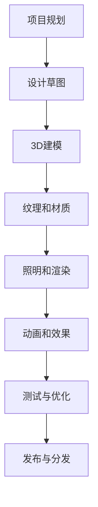

                 

### 虚拟现实内容创作：360度视频和3D建模

> **关键词：虚拟现实、360度视频、3D建模、内容创作、Unity、Unreal Engine**

> **摘要：本文将探讨虚拟现实内容创作的基础，包括360度视频技术和3D建模。我们将深入分析这些技术的工作原理，介绍相关工具，并通过实际案例展示其应用，最后展望虚拟现实内容创作的未来趋势。**

---

## 目录大纲

- **第一部分：虚拟现实内容创作基础**
  - 第1章：虚拟现实概述
    - 1.1 虚拟现实技术定义与发展历程
    - 1.2 虚拟现实应用领域
    - 1.3 虚拟现实技术核心组件
  - 第2章：360度视频技术
    - 2.1 360度视频原理
    - 2.2 360度视频采集设备
    - 2.3 360度视频处理与合成
  - 第3章：3D建模基础
    - 3.1 3D建模概念
    - 3.2 3D建模工具与应用
    - 3.3 3D建模流程详解
  - 第4章：虚拟现实内容创作工具
    - 4.1 Unity在虚拟现实内容创作中的应用
    - 4.2 Unreal Engine在虚拟现实内容创作中的应用
    - 4.3 VR内容创作工具的比较与选择

- **第二部分：虚拟现实内容创作实战**
  - 第5章：360度视频内容创作实战
    - 5.1 360度视频拍摄与剪辑技巧
    - 5.2 360度视频内容优化
    - 5.3 360度视频发布与分发
  - 第6章：3D建模内容创作实战
    - 6.1 3D建模项目实战
    - 6.2 3D模型优化与渲染
    - 6.3 3D模型发布与导出
  - 第7章：虚拟现实交互与体验设计
    - 7.1 虚拟现实交互技术
    - 7.2 虚拟现实用户体验设计原则
    - 7.3 虚拟现实交互体验优化
  - 第8章：虚拟现实内容创作项目案例分析
    - 8.1 虚拟现实教育项目案例分析
    - 8.2 虚拟现实旅游项目案例分析
    - 8.3 虚拟现实游戏项目案例分析
  - 第9章：虚拟现实内容创作趋势与未来展望
    - 9.1 虚拟现实内容创作技术发展趋势
    - 9.2 虚拟现实内容创作应用领域拓展
    - 9.3 虚拟现实内容创作面临的挑战与机遇

- **附录：虚拟现实内容创作资源与工具**
  - 附录1：虚拟现实内容创作常用工具
  - 附录2：虚拟现实内容创作参考资料
  - 附录3：虚拟现实内容创作实践项目指南

---

在接下来的章节中，我们将逐步深入探讨虚拟现实内容创作的基础知识、技术原理、工具应用和实际案例，帮助读者全面了解和掌握这一前沿领域。

---

## 第一部分：虚拟现实内容创作基础

### 第1章：虚拟现实概述

#### 1.1 虚拟现实技术定义与发展历程

虚拟现实（Virtual Reality，VR）是一种通过计算机技术构建的虚拟环境，用户可以通过头戴式显示器（HMD）、传感手套、体感设备等与虚拟环境进行交互，从而获得沉浸式的体验。VR技术的核心是通过模拟用户的感知、运动和行为，创造出一个逼真的虚拟世界。

虚拟现实技术可以追溯到20世纪60年代的美国，最早的VR设备是1968年由伊凡·苏瑟兰（Ivan Sutherland）开发的“达摩克利斯之剑”（The Sword of Damocles）。这台设备使用了一个头戴式显示器和多个传感器，虽然操作复杂且设备笨重，但它标志着VR技术的诞生。

进入20世纪90年代，VR技术开始逐渐应用于军事模拟、医疗培训和游戏等领域。1995年，任天堂发布的Virtual Boy是最早的商业VR游戏设备，但由于技术限制和用户体验不佳，销量惨淡。然而，这一时期的VR技术为后续的发展奠定了基础。

21世纪初，随着计算机性能的提升和图形处理技术的发展，VR技术迎来了新的高潮。2009年，Oculus VR发布了首款可商用的VR头戴显示器Oculus Rift开发者版，吸引了全球的关注。2014年，Facebook以20亿美元的价格收购了Oculus VR，标志着VR技术进入了商业化的快车道。

近年来，VR技术不断成熟，应用领域也在不断扩大。除了游戏和娱乐，VR在教育培训、医疗康复、房地产展示、旅游体验等领域也得到了广泛应用。随着5G、人工智能和增强现实技术的发展，虚拟现实内容创作将迎来更加广阔的前景。

#### 1.2 虚拟现实应用领域

虚拟现实技术在众多领域展现了巨大的潜力，下面简要介绍一些主要的应用领域：

1. **教育培训**：虚拟现实可以创建逼真的模拟环境，用于安全训练和技能提升。例如，飞行员训练可以在虚拟环境中模拟飞行操作，医疗培训可以通过虚拟人体进行解剖和手术操作。

2. **医疗康复**：虚拟现实技术可以帮助患者进行心理治疗和康复训练。例如，通过虚拟现实环境进行焦虑症和恐惧症的治疗，或者通过虚拟运动进行中风患者的康复。

3. **房地产展示**：虚拟现实技术可以让购房者通过VR设备参观房屋，提供更加直观的视觉体验，有助于提高购房决策的效率。

4. **旅游体验**：虚拟现实技术可以让用户在家中体验到世界各地的美景，增强旅游的吸引力。用户可以通过VR设备游览名胜古迹、自然风光和城市风光。

5. **游戏娱乐**：虚拟现实技术为游戏提供了全新的体验，玩家可以在一个沉浸式的虚拟世界中自由探索和互动。

6. **工业设计**：虚拟现实技术可以帮助设计师在产品开发过程中进行三维可视化，从而更好地评估和改进设计方案。

7. **军事模拟**：虚拟现实技术被广泛应用于军事训练和模拟，包括战术模拟、模拟战斗和模拟演习。

#### 1.3 虚拟现实技术核心组件

虚拟现实系统通常包括以下核心组件：

1. **头戴式显示器（HMD）**：HMD是用户进入虚拟环境的主要设备，它通过两个小屏幕模拟左右眼视图，产生立体视觉效果。高质量的HMD可以提供高分辨率和低延迟的沉浸式体验。

2. **传感器与追踪系统**：传感器用于追踪用户的位置、头部和手部的运动，确保用户在虚拟环境中的动作得到实时反馈。常见的传感器包括位置追踪器、头部追踪器和手部追踪器。

3. **交互设备**：交互设备包括体感控制器、传感手套、数据手套等，用户可以通过这些设备与虚拟环境中的对象进行交互。交互设备需要与追踪系统配合使用，确保交互的准确性和实时性。

4. **计算机与图形处理单元（GPU）**：虚拟现实系统需要强大的计算机性能来实时渲染复杂的3D场景。GPU在处理大量图形数据时具有显著的优势，能够提供流畅的视觉效果。

5. **音频系统**：虚拟现实中的音效对于提升沉浸感至关重要。高质量的音频系统可以提供立体声、3D音效和环境音效，增强用户的感知体验。

6. **内容创作与开发平台**：内容创作与开发平台是虚拟现实系统的重要组成部分，包括Unity、Unreal Engine等，它们提供了丰富的工具和功能，方便开发者创建和优化虚拟现实内容。

通过这些核心组件的协同工作，虚拟现实技术能够为用户提供一个沉浸式的体验，极大地拓展了人机交互的方式和场景。在接下来的章节中，我们将进一步探讨360度视频技术和3D建模的基础知识，为虚拟现实内容创作打下坚实的基础。

---

## 第2章：360度视频技术

### 2.1 360度视频原理

360度视频是一种能够提供全方位视角的视频内容，用户可以通过移动设备或头戴式显示器（HMD）观看，感受到与实际场景相似的视觉体验。360度视频技术的核心在于捕捉和呈现一个场景的全方位视角，使观众仿佛置身其中。

#### 360度视频的拍摄原理

360度视频的拍摄通常需要使用多台摄像机协同工作。这些摄像机排列成半球形或环形，以捕捉场景的全方位视角。每一台摄像机捕捉到的画面会生成一个部分视频流，这些视频流最终通过特定的算法进行拼接和合成，形成一个完整的360度视频。

拍摄过程通常分为以下几个步骤：

1. **摄像机选择与布置**：选择适合的摄像机，如GoPro Fusion、Ricoh Theta等，这些摄像机具有内置的多个镜头和传感器。根据拍摄场景和需求，将摄像机固定在稳定的位置，形成一个半球形或环形的阵列。

2. **录制视频**：开启摄像机，进行视频录制。为了保证视频质量，需要选择合适的光照条件，避免过曝或欠曝。

3. **同步录制**：为了确保多台摄像机录制的视频流可以准确拼接，需要在录制过程中保持时间同步。一些摄像机具备自动同步功能，而其他设备可能需要使用专门的同步软件或硬件。

4. **数据采集**：录制完成后，将摄像机中的数据导出至计算机或其他存储设备。

#### 360度视频的播放原理

播放360度视频时，需要将多个视频流拼接成一个全景视频，并通过特殊的播放器进行显示。以下是360度视频播放的基本原理：

1. **视频流拼接**：将多台摄像机录制的视频流通过拼接算法合成成一个完整的全景视频。拼接算法需要考虑画面的同步、视角的连贯性以及视频的质量。

2. **播放器设计**：360度视频的播放器需要支持全景视频的播放，并允许用户通过移动设备或头戴式显示器（HMD）自由旋转视角。播放器通常具备以下功能：
   - **视角控制**：允许用户通过触摸屏、手势或头动控制视角。
   - **播放控制**：支持播放、暂停、快进、快退等基本播放功能。
   - **交互功能**：允许用户与视频中的对象进行交互，如点击、拖拽等。

3. **硬件支持**：对于头戴式显示器（HMD），播放器需要与硬件设备进行无缝集成，确保高质量的图像输出和低延迟的交互体验。

#### 360度视频的应用场景

360度视频技术的广泛应用得益于其独特的视觉体验和沉浸感。以下是几种常见应用场景：

1. **旅游**：用户可以通过360度视频体验世界各地的名胜古迹和自然风光，仿佛亲身旅行一般。

2. **体育**：观看体育比赛时，用户可以通过360度视频切换视角，获得更全面的比赛视野。

3. **房地产**：开发商可以通过360度视频展示房屋的内部结构和外部景观，提高购房者的购买决策效率。

4. **教育培训**：在教育领域，360度视频可以用于模拟实验、教学演示和现场考察，提供更加直观的教学资源。

5. **新闻报道**：记者可以通过360度视频记录现场新闻，让观众感受到现场的氛围和真实情况。

#### 360度视频的优势与挑战

360度视频技术具有以下优势：

- **沉浸感**：用户可以自由切换视角，感受到身临其境的体验。
- **互动性**：用户可以与视频中的对象进行交互，提高参与度。
- **多样性**：适用于多种应用场景，从旅游到教育培训，都有广泛的应用。

然而，360度视频技术也面临一些挑战：

- **拍摄与编辑**：需要专业的设备和技术，拍摄和编辑过程复杂。
- **数据处理**：由于视频数据量大，需要高效的编码和解码算法。
- **设备兼容性**：不同设备之间的兼容性问题，需要开发适应多种硬件平台的播放器。

尽管如此，随着技术的发展和用户需求的增长，360度视频技术将在更多领域得到应用，为内容创作者和用户提供丰富的体验。

---

### 2.2 360度视频采集设备

360度视频的采集是整个制作过程中的关键步骤，高质量的采集设备能够显著提升视频的视觉效果和用户体验。目前市场上存在多种类型的360度视频采集设备，从专业的摄像机到便携的智能手机配件，各有其独特的优势和适用场景。

#### 1. 专业360度摄像机

专业360度摄像机通常具有高品质的图像捕捉能力，适合用于商业级和高端内容制作。以下是一些常见的专业360度摄像机及其特点：

- **GoPro Fusion**：GoPro Fusion是一款知名的360度摄像机，拥有6个高清摄像头，可以捕捉4K分辨率的360度视频。它支持低光模式，具备稳定的防抖功能，适用于多种场景，从体育赛事到旅游拍摄。

- **Ricoh Theta**：Ricoh Theta系列摄像机以其便携性和高品质图像著称。Theta V型号支持360度4K视频录制，内置了GPS和Wi-Fi，方便即时分享和传输。

- **DJI Osmo Mobile 3**：虽然DJI主要以其无人机产品闻名，但其Osmo Mobile 3手机稳定器也可以作为360度视频的拍摄设备。它通过连接手机，提供稳定的360度拍摄支持，适合移动场景。

#### 2. 智能手机配件

随着智能手机性能的不断提升，许多智能手机配件可以将普通手机转化为360度视频拍摄设备。以下是一些常用的智能手机配件：

- **Insta360 One R**：Insta360 One R是一款模块化360度摄像头，可以通过连接手机实现360度视频录制。它支持4K分辨率，并具有多种镜头配置选项，适合专业和业余用户。

- **LG V50 ThinQ**：LG V50 ThinQ配备了一个可拆卸的360度摄像头模块，可以与手机本体结合使用，提供360度视频录制功能。它支持4K分辨率，并提供一系列编辑工具。

- **Samsung Galaxy A50**：某些三星Galaxy系列智能手机内置了360度视频录制功能，用户可以通过相机应用直接录制360度视频，无需额外配件。

#### 3. 便携式360度相机

便携式360度相机是一种体积较小、操作简便的设备，适合日常拍摄和分享。以下是一些便携式360度相机：

- **Doxie 360**：Doxie 360是一款轻巧的便携式360度相机，适合日常记录生活片段和旅行经历。它支持720p分辨率，可以通过Wi-Fi连接手机进行实时查看和分享。

- **Neewer NW-360**：Neewer NW-360是一款预算友好的便携式360度相机，支持1080p分辨率。它可以通过USB连接电脑进行数据传输，方便后期处理。

#### 4. 选择采集设备的考虑因素

在选择360度视频采集设备时，以下因素值得考虑：

- **分辨率**：高分辨率能够提供更清晰的图像，但也会导致更大的文件体积。根据应用场景选择合适的分辨率。

- **稳定性和防抖**：稳定的拍摄是确保视频质量的关键，特别是对于动态场景。具备防抖功能的设备能够减少画面的抖动。

- **音频质量**：音频是增强沉浸感的重要因素。选择具备高质量麦克风和降噪功能的设备。

- **电池续航**：长时间拍摄的续航能力是关键，特别是户外拍摄时。选择电池容量大、续航能力强的设备。

- **连接性**：考虑设备的Wi-Fi、蓝牙或其他连接方式，以确保数据传输的便捷性和实时性。

- **易用性**：操作简便、用户界面友好的设备能够提高拍摄效率，减少学习成本。

通过综合考虑以上因素，用户可以选出最适合自己需求的360度视频采集设备，从而创作出高质量的内容。

---

### 2.3 360度视频处理与合成

360度视频的拍摄只是第一步，要将多个视频流拼接成一个完整的全景视频，还需要进行一系列的处理和合成。以下步骤详细介绍了360度视频处理与合成的过程。

#### 1. 视频流导入

首先，将多台摄像机录制的视频流导入到计算机或其他处理设备。根据使用的采集设备不同，视频文件的格式和分辨率可能有所差异。导入视频时，可以使用专业的视频编辑软件，如Adobe Premiere Pro、DaVinci Resolve等。

#### 2. 视频流同步

视频流的同步是保证拼接效果的关键。由于不同摄像机的录制时间可能存在微小的差异，因此需要通过同步算法将视频流对齐。一些专业的视频编辑软件提供了自动同步功能，而其他设备可能需要手动调整。

同步过程通常包括以下步骤：

- **时间戳对齐**：通过视频编辑软件将多台摄像机的视频流按时间戳对齐，确保各视频流的时间戳一致。

- **帧率匹配**：确保所有视频流的帧率相同，如果存在差异，需要进行帧率转换。

- **音频同步**：确保各视频流的音频同步，避免出现音频错位现象。

#### 3. 视频流拼接

在视频流同步完成后，可以进行视频流的拼接。拼接过程涉及将多个视频流合成成一个全景视频。以下是拼接过程的几个关键步骤：

- **镜头校正**：由于不同摄像机的镜头参数可能不同，需要进行镜头校正，以确保画面的对称性和视角的连贯性。

- **图像合成**：将多台摄像机捕捉到的图像进行合成，形成一个完整的全景图像。合成算法需要考虑画面的拼接线、透明区域以及画面的细节。

- **边缘处理**：对于拼接线附近的图像，需要进行特殊处理，以减少视觉误差和锐利的拼接线。一些软件提供了边缘处理工具，如阴影、模糊等效果。

- **视频输出**：完成拼接后，将全景视频输出为所需的格式和分辨率，以便进行后续的编辑和发布。

#### 4. 360度视频播放器

为了确保360度视频能够在各种设备上流畅播放，需要开发或选择合适的360度视频播放器。播放器需要支持全景视角的切换和交互功能，以下是一些关键点：

- **视角切换**：播放器应允许用户通过触摸屏、手势或头动控制视角。高质量的播放器能够实现平滑的视角切换，避免闪烁和卡顿。

- **交互功能**：播放器应支持与视频内容的交互，如点击、拖拽等。这对于增强用户体验至关重要。

- **硬件兼容性**：播放器需要支持多种硬件平台，包括桌面电脑、智能手机和头戴式显示器（HMD）。对于HMD，播放器应与设备无缝集成，提供高质量的图像输出和低延迟的交互体验。

#### 5. 实际案例

以下是一个360度视频处理与合成的实际案例：

- **项目背景**：制作一个全景旅游视频，展示景区的360度景观。

- **开发环境**：使用GoPro Fusion摄像机进行360度视频拍摄，Adobe Premiere Pro进行视频处理与合成。

- **实现步骤**：

  - **拍摄阶段**：选择合适的时间和天气，使用GoPro Fusion摄像机按照既定路线进行360度拍摄。

  - **处理阶段**：

    - 导入视频到Adobe Premiere Pro。
    - 使用Premiere Pro中的360度视频编辑功能，对视频流进行同步和拼接。
    - 进行镜头校正和图像合成，调整画面的细节和透明区域。
    - 输出最终的全景视频。

  - **播放阶段**：使用支持360度视频播放的播放器，如360 Video Player，在电脑、智能手机和头戴式显示器上测试和展示视频。

通过以上步骤，可以制作出高质量、具备沉浸感的360度视频，为用户带来独特的视觉体验。处理与合成的技巧和工具将直接影响视频的最终质量，因此在实际操作中需要不断实践和优化。

---

### 2.4 360度视频技术的前景与挑战

随着虚拟现实技术的不断发展，360度视频作为一种创新的媒体形式，正逐渐受到各行各业的关注和应用。然而，360度视频技术仍面临着一些挑战和前景。

#### 1. 技术成熟度

虽然360度视频技术在过去几年取得了显著进展，但与传统的2D视频相比，仍存在一定的技术差距。特别是在图像质量、视频流传输和处理速度方面，还需要进一步提高。未来，随着计算机性能的提升和图像处理算法的优化，360度视频技术将变得更加成熟和稳定。

#### 2. 设备兼容性

目前，市场上存在多种类型的360度视频采集设备和播放器，这些设备在硬件性能、操作系统和接口等方面可能存在兼容性问题。为了提升用户体验，设备制造商需要加强设备间的兼容性，确保360度视频能够在各种设备上流畅播放。

#### 3. 用户习惯

虽然360度视频提供了独特的视觉体验，但用户习惯的培养仍然是一个挑战。用户需要时间适应新的交互方式和观看习惯，特别是在移动设备上观看360度视频时，如何提供直观且易用的交互界面，是内容创作者需要考虑的问题。

#### 4. 内容创作成本

360度视频的制作成本相对较高，包括设备采购、拍摄成本和后期编辑费用。此外，高质量的360度视频内容需要专业的制作团队，这也增加了制作成本。未来，随着技术的进步和市场的普及，这些成本有望逐渐降低。

#### 5. 商业模式探索

360度视频作为一种新兴媒体形式，其商业模式仍在探索中。目前，广告、虚拟旅游、教育培训和娱乐等领域已经开始尝试应用360度视频，但如何实现商业化，获取可持续的盈利模式，仍然是内容创作者和投资者需要解决的问题。

#### 6. 安全与隐私

随着360度视频的普及，安全与隐私问题也日益凸显。在公共场合拍摄的360度视频可能会侵犯他人的隐私，如何保护用户和数据的安全，是内容创作者和平台需要考虑的重要问题。

#### 7. 应用前景

尽管存在挑战，360度视频技术的应用前景仍然广阔。在旅游、教育、医疗、体育和娱乐等领域，360度视频可以提供独特的体验和丰富的内容，吸引更多用户和商业投资。随着技术的不断进步，360度视频有望成为下一代媒体形式的重要组成部分。

总之，360度视频技术正处于快速发展阶段，虽然面临一些挑战，但未来前景依然乐观。通过技术创新、用户教育和商业模式探索，360度视频有望在更广泛的领域得到应用，为用户带来全新的视觉体验。

---

## 第3章：3D建模基础

### 3.1 3D建模概念

3D建模是虚拟现实内容创作的重要组成部分，它通过数字化的方式创建三维对象，用于游戏、动画、电影、建筑和设计等领域。3D建模的过程涉及多个步骤，包括对象的设计、建模、纹理映射、照明和渲染等。

#### 1. 3D建模的基本概念

3D建模主要涉及以下基本概念：

- **几何体**：3D建模的基础是几何体，如立方体、球体、圆柱体等。通过组合和操作这些基础几何体，可以创建复杂的对象。

- **网格**：网格是3D对象的基本结构，由多个三角形或四边形组成。网格的数量和分布会影响模型的细节和光滑度。

- **顶点**：顶点是网格的基本构成元素，代表对象上的点。每个顶点都有位置、法线和颜色等信息。

- **面**：面是网格的表面部分，由两个或多个顶点连接而成。面定义了模型的边界和形状。

- **材质**：材质是赋予模型表面特性的属性，包括颜色、纹理、反射、透明度等。材质可以使模型看起来更加真实和丰富。

- **动画**：动画是3D建模的一个重要方面，通过定义对象的运动轨迹和变形，可以创建动态的效果。

#### 2. 3D建模的常用术语

在3D建模过程中，了解一些常用术语是必要的，以下是一些关键术语：

- **模型拓扑**：模型拓扑是指3D对象内部的结构和连接方式。良好的拓扑结构有助于提高渲染效率和动画效果。

- **UV映射**：UV映射是将2D纹理映射到3D对象表面的过程。通过合理的UV映射，可以使纹理在模型上均匀分布，增强视觉效果。

- **细分**：细分是指增加模型网格的细节，使模型看起来更加平滑和细腻。细分可以用于提高模型的细节层次，增强视觉感受。

- **贴图**：贴图是将图像或纹理应用到3D对象表面的过程。贴图可以增强模型的纹理和质感，使模型看起来更加真实。

- **渲染**：渲染是将3D模型转换为2D图像的过程。通过渲染，可以生成最终的视觉效果，包括光线、阴影和纹理等。

#### 3. 3D建模的类型

根据应用场景和需求，3D建模可以分为以下几种类型：

- **概念建模**：概念建模主要用于设计初步阶段，用于探索和展示设计概念。这类建模通常不需要过于精细的细节，注重创意和概念的表达。

- **细节建模**：细节建模专注于模型细节的精细处理，包括表面纹理、细节图案等。这类建模要求较高的技术水平和艺术素养。

- **工程建模**：工程建模用于工程设计和制造，要求模型的准确性和可操作性。这类建模需要严格的尺寸控制和结构分析。

- **游戏建模**：游戏建模用于游戏开发，要求模型具有高度的细节和动画效果，以提升游戏体验。

- **动画建模**：动画建模用于动画制作，要求模型能够灵活地实现各种运动和变形，以支持复杂的动画效果。

通过理解3D建模的基本概念、常用术语和类型，可以为后续的学习和实践打下坚实的基础。在接下来的章节中，我们将详细介绍3D建模工具和应用，以及具体的建模流程。

---

### 3.2 3D建模工具与应用

3D建模工具是创建三维对象的核心，不同的工具适用于不同的建模任务和需求。以下介绍几种常见的3D建模工具及其特点和应用场景：

#### 1. Blender

Blender是一款开源的3D建模和渲染软件，适用于从概念建模到高级细节建模的广泛任务。Blender具有以下特点：

- **多功能性**：Blender集成了建模、雕刻、纹理映射、动画、渲染等功能，是一个完整的3D创作套件。
- **免费开源**：Blender是免费的，且拥有庞大的开源社区，可以获取丰富的资源和插件。
- **易用性**：Blender提供了直观的用户界面和强大的功能，适合初学者和专业人士。

应用场景：Blender适用于游戏开发、动画制作、建筑设计和工业设计等领域。

#### 2. Autodesk Maya

Maya是由Autodesk开发的专业级3D建模和动画软件，广泛应用于电影、电视、游戏和设计行业。Maya具有以下特点：

- **高级功能**：Maya提供了强大的建模、雕刻、动画、渲染和特效等功能，适合复杂的三维项目。
- **高质量渲染**：Maya的内置渲染器Mental Ray可以生成高质量的照片级渲染效果。
- **兼容性**：Maya与Autodesk的其他软件（如3ds Max、AutoCAD等）具有良好的兼容性。

应用场景：Maya适用于电影制作、动画、游戏开发、建筑设计和工业设计等领域。

#### 3. Autodesk 3ds Max

3ds Max是由Autodesk开发的另一款专业的3D建模和渲染软件，与Maya类似，广泛应用于电影、电视、游戏和设计行业。3ds Max具有以下特点：

- **高效建模**：3ds Max提供了丰富的建模工具和插件，可以快速创建复杂的几何体。
- **动画功能**：3ds Max的动画工具非常强大，支持复杂的角色动画和场景动画。
- **渲染能力**：3ds Max内置了Advanced Render器，可以生成高质量的渲染效果。

应用场景：3ds Max适用于电影制作、动画、游戏开发、建筑设计和工业设计等领域。

#### 4. Unity

Unity是一款流行的游戏开发引擎，不仅用于游戏开发，也广泛应用于虚拟现实（VR）和增强现实（AR）项目。Unity具有以下特点：

- **跨平台支持**：Unity支持多种平台，包括PC、移动设备和游戏主机，便于部署。
- **丰富的插件和资产**：Unity拥有庞大的插件和资产库，可以加速开发过程。
- **实时渲染**：Unity提供了实时渲染功能，适用于交互式应用和虚拟现实项目。

应用场景：Unity适用于游戏开发、虚拟现实内容创作、增强现实应用和建筑可视化等领域。

#### 5. Unreal Engine

Unreal Engine是由Epic Games开发的先进的游戏和虚拟现实开发引擎，以其高效的渲染和强大的功能著称。Unreal Engine具有以下特点：

- **高性能渲染**：Unreal Engine的Unreal Engine 5（UE5）引入了Lumen实时光照系统，可以生成逼真的光照和阴影效果。
- **灵活的编辑器**：Unreal Engine的编辑器提供了强大的建模、动画和渲染工具。
- **跨平台支持**：Unreal Engine支持多种平台，包括PC、移动设备和虚拟现实设备。

应用场景：Unreal Engine适用于游戏开发、虚拟现实内容创作、建筑可视化、电影特效和教育培训等领域。

通过选择合适的3D建模工具，可以根据项目需求和技能水平，实现高质量的三维建模。在接下来的章节中，我们将详细讨论3D建模的流程，帮助读者更好地掌握这一技术。

---

### 3.3 3D建模流程详解

3D建模是一个复杂而精细的过程，涉及多个步骤和工具。以下将详细介绍3D建模的完整流程，从项目规划到最终渲染和动画制作。

#### 1. 项目规划

在开始3D建模之前，项目规划是至关重要的。项目规划包括以下关键步骤：

- **需求分析**：明确项目的目标、功能需求和预期效果。例如，是为游戏开发角色，还是为建筑设计创建模型。
- **技术选型**：根据项目需求选择合适的3D建模软件和工具，如Blender、Maya、3ds Max等。
- **资源准备**：准备必要的资源和素材，包括参考图片、模型库和纹理图集等。
- **时间表**：制定项目的时间表，明确各个阶段的完成时间和里程碑。

#### 2. 素描草图

项目规划完成后，进行素描草图是建模的第一步。素描草图可以用于初步探索设计概念，并收集创意灵感。以下是素描草图的关键步骤：

- **概念草图**：根据项目需求绘制初步的设计草图，包括角色造型、场景布局和关键元素。
- **细节草图**：细化草图中的细节，包括面部特征、服装设计和场景元素等。
- **反馈与修正**：与团队成员或客户进行讨论，收集反馈并进行修正。

#### 3. 建模

建模是3D建模的核心步骤，涉及创建三维对象的过程。以下是建模的基本流程：

- **基础几何体**：使用3D建模软件创建基础几何体，如立方体、球体、圆柱体等。基础几何体可以作为模型的基本结构。
- **细分和编辑**：通过细分和编辑工具，增加模型的细节和复杂性。例如，使用多边形建模工具进行细节雕刻，或使用细分曲面工具提高模型的平滑度。
- **拓扑优化**：优化模型的拓扑结构，使其适合动画和渲染。良好的拓扑结构可以减少渲染时间，提高动画效果。
- **UV映射**：将纹理映射到模型表面，为模型赋予纹理和材质。通过合理的UV映射，可以确保纹理在模型上的均匀分布。

#### 4. 纹理和材质

纹理和材质是3D模型的重要组成部分，可以显著提升模型的视觉效果。以下是纹理和材质的制作流程：

- **纹理制作**：使用纹理编辑软件（如Photoshop）创建或编辑纹理图像。纹理图像包括漫反射、高光、反射、透明等。
- **材质制作**：将纹理图像应用到3D模型上，创建材质。材质编辑器提供了多种参数设置，如颜色、纹理、反射率等。
- **材质测试**：在3D建模软件中测试材质效果，确保材质在模型上表现良好。

#### 5. 照明和渲染

照明和渲染是决定3D模型视觉效果的关键步骤。以下是照明和渲染的基本流程：

- **场景设置**：设置场景中的光源，包括主光、辅光和背光等。合理的照明可以增强场景的氛围和立体感。
- **渲染设置**：配置渲染参数，如分辨率、光线追踪、阴影类型等。根据项目需求选择合适的渲染器，如内置渲染器、V-Ray、Arnold等。
- **渲染输出**：进行渲染输出，生成最终的图像或动画。渲染输出可以是静态图像或动态视频。

#### 6. 动画和效果

动画和效果是3D建模的重要组成部分，可以带来动态的视觉效果和交互体验。以下是动画和效果的基本流程：

- **动画制作**：创建角色的运动轨迹和场景的动态效果。使用关键帧动画、运动捕捉等技术实现复杂的动画效果。
- **特效制作**：添加粒子特效、液体模拟、烟雾效果等，增强场景的视觉冲击力。
- **后期合成**：在后期处理软件（如Adobe After Effects）中进行合成，调整颜色、光影和特效等，提升整体的视觉效果。

#### 7. 测试和优化

在完成3D建模后，进行测试和优化是确保模型质量的重要步骤。以下是测试和优化的基本流程：

- **模型检查**：检查模型的拓扑结构、网格质量和贴图映射，确保模型无错误和缺陷。
- **渲染测试**：进行渲染测试，检查模型的渲染效果，确保光照、阴影和纹理表现良好。
- **性能优化**：对模型进行性能优化，减少面数和顶点数，提高渲染效率，确保模型在目标平台上运行顺畅。

通过以上流程，可以创建高质量、逼真的3D模型，满足各种应用需求。在接下来的章节中，我们将通过实际案例展示3D建模的整个过程，帮助读者更好地理解建模技巧和工具的应用。

---

### 3.4 3D建模技术的最新趋势

3D建模技术正随着科技的进步不断演进，新兴的技术和工具为建模过程带来了革命性的变化。以下是一些3D建模技术的最新趋势：

#### 1. 光线追踪渲染

光线追踪渲染是一种先进的渲染技术，能够生成更加真实和细腻的图像。与传统的渲染方法相比，光线追踪能够模拟光线的传播、反射、折射和散射，从而实现逼真的光照效果。随着硬件性能的提升，光线追踪渲染逐渐成为3D建模的主流选择。例如，Unreal Engine 5（UE5）引入了Lumen实时光照系统，为游戏和虚拟现实内容创作带来了前所未有的视觉体验。

#### 2. AI辅助建模

人工智能（AI）在3D建模中的应用日益广泛，AI算法可以帮助建模师快速生成复杂几何体、自动优化模型结构和纹理。AI辅助建模不仅可以提高工作效率，还可以实现更加复杂和精细的建模效果。例如，Blender中的Eevee渲染器使用AI技术进行实时渲染，可以快速预览建模效果，帮助设计师快速迭代和优化模型。

#### 3. 实时渲染

实时渲染技术的进步使得3D建模和交互式应用成为可能。实时渲染能够即时渲染场景，提供流畅的交互体验。随着硬件性能的提升和图形处理技术的优化，实时渲染的图像质量不断提高。Unity和Unreal Engine等游戏开发引擎提供了强大的实时渲染功能，支持高质量的图像和复杂的交互效果。

#### 4. 虚拟现实（VR）建模

虚拟现实技术的快速发展推动了VR建模的应用。VR建模需要创建高度逼真的三维场景，用户可以在虚拟环境中自由探索和交互。VR建模工具如HTC Vive、Oculus Rift等提供了专门的建模和渲染功能，支持复杂场景的快速构建和实时交互。

#### 5. 增强现实（AR）建模

增强现实技术将虚拟元素叠加到现实世界中，为用户带来全新的交互体验。AR建模需要创建精细的三维模型，并将其与现实世界中的物体进行实时融合。ARKit和ARCore等AR开发平台提供了强大的建模和渲染工具，支持创建和部署AR应用。

#### 6. 跨平台兼容性

随着跨平台应用的需求增加，3D建模工具和引擎越来越注重跨平台兼容性。例如，Unity和Unreal Engine支持多种操作系统和平台，包括PC、移动设备和游戏主机，便于开发者部署和应用。

#### 7. 虚拟协作

虚拟协作技术使得多个建模师可以在同一项目中进行实时协作，提高工作效率和创作质量。通过云服务和协作平台，建模师可以共享模型资源、讨论设计细节，并实时查看和编辑模型，实现高效的合作。

综上所述，3D建模技术正朝着更加智能化、实时化、真实化和协作化的方向发展。随着技术的不断进步，3D建模将为虚拟现实、增强现实和游戏等领域的创新应用提供更加广阔的前景。

---

### 3.5 3D建模案例：从设计到实现

为了更好地理解3D建模的完整流程，我们通过一个实际案例——一个虚拟现实游戏中的角色建模——来展示从设计到实现的过程。

#### 1. 项目背景

假设我们要为一款虚拟现实游戏创建一个角色模型，角色是一个名叫“阿诺”的科幻战士。阿诺是一个强壮、威武的角色，拥有未来军事装备和装甲。

#### 2. 设计草图

首先，我们根据游戏的需求和角色设定，绘制初步的素描草图。草图包括角色的轮廓、面部特征、服装设计等。这一步的目的是探索和确定角色的外观和风格。

- **概念草图**：初步绘制阿诺的轮廓，包括身高、体型和主要特征。
- **细节草图**：细化草图中的细节，如面部特征、装甲细节和武器装备。

#### 3. 建模

接下来，使用3D建模软件（如Blender）进行建模。以下是建模的基本步骤：

- **基础几何体**：创建基础几何体，如立方体、圆柱体等，作为模型的基本结构。
- **细化模型**：通过编辑几何体，细化角色的各个部分。例如，使用多边形建模工具调整角色的脸型、肌肉和装甲细节。
- **拓扑优化**：优化模型的拓扑结构，确保模型适合动画和渲染。
- **UV映射**：将纹理映射到模型表面，为模型赋予纹理和材质。

#### 4. 纹理和材质

纹理和材质是模型外观的关键。以下是纹理和材质的制作流程：

- **纹理制作**：使用纹理编辑软件（如Photoshop）创建或编辑纹理图像，包括漫反射、高光、反射等。
- **材质制作**：将纹理图像应用到3D模型上，创建材质。调整材质参数，如颜色、纹理、反射率等。
- **材质测试**：在3D建模软件中测试材质效果，确保材质在模型上表现良好。

#### 5. 照明和渲染

照明和渲染决定模型的视觉效果。以下是照明和渲染的基本步骤：

- **场景设置**：设置场景中的光源，包括主光、辅光和背光等，以营造合适的场景氛围。
- **渲染设置**：配置渲染参数，如分辨率、光线追踪、阴影类型等，根据项目需求选择合适的渲染器。
- **渲染输出**：进行渲染输出，生成最终的图像或动画。

#### 6. 动画和效果

为了使角色更加生动，我们为阿诺创建动画和特效：

- **运动动画**：创建角色的基本运动，如走动、跑步和跳跃。
- **表情动画**：为角色添加面部表情动画，如微笑、生气和惊讶。
- **特效制作**：添加武器射击、爆炸等特效，增强场景的视觉冲击力。

#### 7. 测试和优化

在完成建模后，进行测试和优化，确保模型的质量和性能：

- **模型检查**：检查模型的拓扑结构、网格质量和贴图映射，确保无错误和缺陷。
- **渲染测试**：进行渲染测试，检查模型的光照、阴影和纹理表现。
- **性能优化**：对模型进行性能优化，减少面数和顶点数，提高渲染效率。

通过以上步骤，我们成功创建了一个高质量的3D角色模型，可以用于虚拟现实游戏和其他应用场景。这个案例展示了3D建模的完整流程，从设计到实现，包括建模、纹理、材质、照明、渲染、动画和优化等步骤。

---

## 第二部分：虚拟现实内容创作实战

### 第5章：360度视频内容创作实战

#### 5.1 360度视频拍摄与剪辑技巧

360度视频拍摄与剪辑是一个复杂且富有挑战性的过程，需要精确的操作和专业的技巧。以下是一些关键技巧，帮助您制作高质量的360度视频。

#### 1. 拍摄准备

在进行360度视频拍摄之前，准备工作至关重要。以下是一些准备工作步骤：

- **设备选择**：选择适合的360度摄像机，如GoPro Fusion、Ricoh Theta等。确保设备电池充满，存储卡有足够的存储空间。

- **场景布置**：确定拍摄场景，选择合适的位置和角度。确保摄像机稳定固定，避免在拍摄过程中移动或倾斜。

- **时间同步**：多台摄像机需要同步时间，以确保视频流的准确拼接。一些高级摄像机具备自动同步功能，其他设备可能需要手动设置。

- **光照条件**：选择合适的光照条件，避免过曝或欠曝。在户外拍摄时，避免阳光直射，使用遮光罩减少眩光。

- **测试拍摄**：进行测试拍摄，检查画面质量、拼接效果和设备状态，确保拍摄前一切准备就绪。

#### 2. 拍摄技巧

在拍摄360度视频时，以下技巧有助于提高画面质量和观看体验：

- **移动稳定**：避免剧烈的移动或震动，使用稳定器或三脚架固定摄像机。在移动时，保持平稳的匀速运动，避免急停或急转。

- **场景覆盖**：确保覆盖场景的各个角落，避免出现画面死角。根据拍摄需求，调整摄像机的位置和角度，确保全面捕捉场景。

- **避免反射和闪烁**：避免阳光直射镜头，减少反射和闪烁。在拍摄室内场景时，使用反光板或遮光罩减少光线干扰。

- **动态场景**：对于动态场景，如运动比赛或舞蹈表演，需要特别注意摄像机的稳定性和拍摄角度。使用跟踪设备或预设轨道，确保摄像机能够跟随场景移动。

- **声音录制**：确保录音设备的质量，避免噪音和回声。在户外拍摄时，使用外接麦克风或音频设备录制高质量的声音。

#### 3. 剪辑技巧

360度视频的剪辑与普通视频剪辑有所不同，需要特殊处理。以下是一些剪辑技巧：

- **画面拼接**：使用专业的视频编辑软件，如Adobe Premiere Pro或DaVinci Resolve，进行360度视频的拼接。确保视频流的时间戳和对齐准确，避免出现画面错位。

- **视角调整**：在剪辑过程中，可以调整360度视频的视角，让观众从不同角度观看场景。通过添加镜头切换效果，提升观看体验。

- **动态视角**：对于需要动态视角调整的场景，可以使用剪辑软件中的动态视角功能。例如，在运动场景中，跟随角色的移动，使观众感觉身临其境。

- **色彩调整**：360度视频的剪辑过程中，需要进行色彩调整，确保整体色调和谐。使用调色工具调整亮度、对比度、饱和度等参数，提升画面质感。

- **添加音效**：为360度视频添加背景音乐和音效，增强沉浸感。确保音频质量，避免噪音和音量不均。

#### 4. 发布与分发

完成360度视频的剪辑后，需要进行发布和分发，以下是一些关键步骤：

- **格式转换**：根据发布平台的要求，将360度视频转换为适合的格式。常见格式包括MP4、WebM等。

- **分辨率设置**：根据目标观众的设备和网络环境，设置合适的分辨率。对于移动设备，可以选择1080p或4K分辨率；对于桌面设备，可以选择更高的分辨率。

- **上传视频**：将视频上传到视频平台，如YouTube、Facebook、Vimeo等。确保上传的视频符合平台的要求，包括文件大小、时长和格式。

- **SEO优化**：为视频添加描述、标签和关键词，提高视频在搜索引擎中的排名。编写引人入胜的标题和描述，吸引观众观看。

- **互动推广**：通过社交媒体和其他渠道推广视频，增加观众参与度。与观众互动，收集反馈，不断优化视频内容。

通过以上步骤，您可以成功制作和发布高质量的360度视频，为观众带来独特的视觉体验。在接下来的章节中，我们将进一步探讨360度视频的优化、发布和分发策略。

---

#### 5.2 360度视频内容优化

在360度视频内容创作过程中，优化是一个关键环节，它关系到视频的观看体验和传播效果。以下是几种常见的360度视频内容优化方法：

#### 1. 视频质量优化

视频质量是影响观看体验的重要因素。以下是一些优化视频质量的方法：

- **分辨率调整**：根据目标观众的设备和网络环境，选择合适的分辨率。对于移动设备，可以选择1080p或4K分辨率；对于桌面设备，可以选择更高的分辨率。高分辨率可以提供更清晰的图像，但也会导致更大的文件大小。

- **图像降噪**：使用图像降噪算法减少视频中的噪声，提高图像的清晰度。一些视频编辑软件（如Adobe Premiere Pro、DaVinci Resolve）提供了降噪功能，可以自动或手动调整降噪参数。

- **色彩调整**：通过调整亮度、对比度、饱和度等参数，优化视频的色彩表现。合适的色彩调整可以增强视觉效果，提高观看体验。

- **锐化处理**：使用锐化算法增强图像的细节和清晰度。适当的锐化处理可以使视频看起来更加生动，但过度锐化会导致图像出现锯齿和噪点。

- **帧率优化**：根据视频内容选择合适的帧率。通常，30fps或60fps的帧率可以提供流畅的观看体验。对于快速移动的场景，可以适当提高帧率，以避免拖影和模糊。

#### 2. 声音质量优化

声音是360度视频的重要组成部分，以下是一些优化声音质量的方法：

- **音频降噪**：使用音频降噪工具减少环境噪声，提高对话和音效的清晰度。一些视频编辑软件（如Adobe Audition、Audacity）提供了降噪功能，可以根据需求手动调整降噪参数。

- **音量平衡**：调整音频的音量平衡，确保背景音乐、对话和音效的音量适中，避免过小或过大。使用音量平衡工具可以自动或手动调整音量。

- **立体声处理**：对于立体声音频，可以通过调整左、右声道的音量、相位和延时等参数，增强音频的空间感和立体感。

- **混音和效果**：为视频添加背景音乐和音效，增强氛围和观看体验。使用混音和效果工具（如Adobe Audition、FL Studio）可以调整音频的节奏、动态和音效。

#### 3. 视频压缩与格式转换

视频压缩和格式转换是优化文件大小和兼容性的重要步骤。以下是一些方法：

- **视频压缩**：使用视频压缩工具（如HandBrake、FFmpeg）减小视频文件的大小，但保持视频质量。可以通过调整比特率、分辨率和帧率等参数进行优化。

- **格式转换**：根据目标平台的要求，将360度视频转换为适合的格式。常见的格式包括MP4、WebM等。一些视频编辑软件（如Adobe Premiere Pro、VLC）提供了格式转换功能。

- **自适应流媒体**：为不同网络环境和设备提供不同分辨率的视频流，确保用户能够流畅观看。使用自适应流媒体技术（如HLS、DASH），根据用户的网络状况动态切换视频流。

#### 4. 视频元数据优化

视频元数据（如标题、描述、标签等）对于视频的搜索和排名至关重要。以下是一些优化视频元数据的方法：

- **关键词优化**：在视频标题、描述和标签中包含相关的关键词，提高视频在搜索引擎中的排名。使用工具（如Google Keyword Planner）分析热门关键词，选择适合的关键词。

- **标题和描述**：编写引人入胜的标题和描述，吸引观众观看。标题应简明扼要，描述应详细阐述视频的内容和亮点。

- **标签**：使用相关的标签标记视频，帮助视频在平台内和搜索引擎中被更广泛地发现。

通过以上优化方法，可以显著提升360度视频的质量和观看体验，从而提高视频的传播效果和观众参与度。在接下来的章节中，我们将进一步探讨360度视频的发布和分发策略。

---

#### 5.3 360度视频发布与分发

完成360度视频的制作和优化后，如何有效地发布和分发是确保视频获得广泛关注和影响力的关键。以下是一些发布和分发的策略：

#### 1. 选择合适的发布平台

根据视频的内容和目标受众，选择适合的发布平台。以下是一些常见的发布平台及其特点：

- **YouTube**：全球最大的视频分享平台，拥有广泛的用户基础和强大的社区互动功能。YouTube支持360度视频播放，并提供专业的视频管理工具。
- **Facebook**：社交媒体平台，拥有庞大的用户群体。Facebook支持360度视频，并提供内置的互动功能，如点赞、评论和分享。
- **Vimeo**：专业的视频平台，提供高质量的视频播放和上传服务。Vimeo注重视频质量和用户体验，适合专业内容创作者。
- **微博、抖音**：中国本土的社交媒体平台，拥有大量年轻用户。这些平台支持短视频和直播，适合快速传播和互动。

#### 2. 视频格式与编码

确保视频格式和编码适合目标平台的要求，以避免播放问题。以下是一些常见的视频格式和编码：

- **MP4**：广泛支持的视频格式，适合大多数平台和设备。使用H.264编码，可以提供良好的视频质量和较小的文件大小。
- **WebM**：适合Web应用的开放格式，支持VP8或VP9编码。WebM格式可以提供高质量的视频，但可能不被所有平台支持。
- **HLS**：HTTP Live Streaming，适用于需要自适应流媒体的应用。HLS可以将视频分成多个小片段，根据用户的网络状况动态切换。

#### 3. 添加元数据与标签

为视频添加详细的元数据和标签，提高视频在搜索引擎和平台内的排名。以下是一些关键点：

- **标题**：简洁明了，包含关键词，吸引观众点击。
- **描述**：详细阐述视频的内容和亮点，增加关键词密度，帮助搜索引擎抓取。
- **标签**：使用相关的标签，扩大视频的曝光范围，提高搜索和推荐的机会。

#### 4. 互动推广

通过互动推广，提高视频的观看率和参与度。以下是一些推广策略：

- **社交媒体**：在社交媒体上分享视频，增加曝光率。使用相关的标签和话题，吸引潜在观众关注。
- **合作伙伴**：与其他内容创作者或品牌合作，通过交叉推广扩大受众。
- **评论互动**：回复观众评论，增加互动，提高视频的社区影响力。
- **直播互动**：在直播中介绍和推广视频，与观众实时互动，增加观看率。

#### 5. 分析与优化

发布视频后，通过数据分析优化内容策略。以下是一些关键指标：

- **观看时长**：观众观看视频的时间长度，反映视频的吸引力。
- **播放量**：视频的总播放次数，反映视频的传播效果。
- **点赞/分享/评论**：互动数据，反映观众对视频的喜好程度。
- **跳出率**：观众在视频页面停留的时间，反映视频的质量和吸引力。

通过以上策略，可以有效地发布和分发360度视频，提高视频的曝光率和观众参与度，从而实现内容的最大化传播效果。

---

### 第6章：3D建模内容创作实战

#### 6.1 3D建模项目实战

为了更好地理解3D建模的实战应用，我们以一个具体的3D建模项目为例，详细描述从设计到实现的整个流程。

#### 项目背景

假设我们要为一家虚拟现实游戏公司创建一款角色模型，这个角色是一个未来战士，名为“萨曼莎”。她的外观设计需要符合游戏设定的未来科技风格，同时具有高度的细节和真实感。

#### 1. 项目规划

在开始建模之前，我们需要进行项目规划，明确项目的目标、功能需求和预期效果。

- **目标**：创建一个高度详细和逼真的未来战士角色模型，适用于虚拟现实游戏。
- **功能需求**：角色模型需要支持动画和交互，同时具有可自定义的装备和服装选项。
- **预期效果**：实现高分辨率的模型，满足游戏画面的质量要求，提供流畅的动画效果。

#### 2. 设计草图

根据项目规划，我们需要绘制初步的素描草图，探索角色的外观和风格。以下是设计草图的关键步骤：

- **概念草图**：初步绘制萨曼莎的轮廓，包括身高、体型和主要特征。
- **细节草图**：细化草图中的细节，如面部特征、服装设计和武器装备。

#### 3. 建模

使用3D建模软件（如Blender）进行建模，以下是建模的基本步骤：

- **基础几何体**：创建基础几何体，如立方体、球体等，作为模型的基本结构。
- **细化模型**：使用多边形建模工具调整角色的脸型、肌肉和装甲细节。
- **拓扑优化**：优化模型的拓扑结构，确保模型适合动画和渲染。

#### 4. 纹理和材质

纹理和材质是角色外观的重要组成部分。以下是纹理和材质的制作流程：

- **纹理制作**：使用纹理编辑软件（如Photoshop）创建或编辑纹理图像，包括漫反射、高光、反射等。
- **材质制作**：将纹理图像应用到3D模型上，创建材质。调整材质参数，如颜色、纹理、反射率等。
- **材质测试**：在3D建模软件中测试材质效果，确保材质在模型上表现良好。

#### 5. 照明和渲染

照明和渲染决定角色的视觉效果。以下是照明和渲染的基本步骤：

- **场景设置**：设置场景中的光源，包括主光、辅光和背光等，以营造合适的场景氛围。
- **渲染设置**：配置渲染参数，如分辨率、光线追踪、阴影类型等，根据项目需求选择合适的渲染器。
- **渲染输出**：进行渲染输出，生成最终的图像或动画。

#### 6. 动画和效果

为了使角色更加生动，我们需要为萨曼莎创建动画和特效：

- **运动动画**：创建角色的基本运动，如走动、跑步和跳跃。
- **表情动画**：为角色添加面部表情动画，如微笑、生气和惊讶。
- **特效制作**：添加武器射击、爆炸等特效，增强场景的视觉冲击力。

#### 7. 测试和优化

在完成建模后，进行测试和优化，确保模型的质量和性能：

- **模型检查**：检查模型的拓扑结构、网格质量和贴图映射，确保模型无错误和缺陷。
- **渲染测试**：进行渲染测试，检查模型的光照、阴影和纹理表现。
- **性能优化**：对模型进行性能优化，减少面数和顶点数，提高渲染效率。

通过以上步骤，我们成功创建了一个高质量的3D角色模型——萨曼莎。这个案例展示了3D建模的完整流程，从项目规划、设计草图、建模、纹理和材质、照明和渲染、动画和效果，到最终的测试和优化。通过实际操作和不断的实践，可以不断提高建模技巧和效率，为虚拟现实、游戏和动画等领域创作出更多优秀的作品。

---

#### 6.2 3D模型优化与渲染

在3D建模的过程中，优化和渲染是决定模型质量和视觉效果的关键步骤。以下详细介绍3D模型优化与渲染的方法和技巧。

#### 1. 优化模型

模型优化是确保3D模型质量和渲染效率的重要步骤。以下是一些优化模型的方法：

- **减少面数**：通过减少模型的面数，可以降低渲染的负担。可以使用3D建模软件中的优化工具，如“优化”或“简化”功能，减少面的数量，同时保持模型的形状和细节。
- **优化网格结构**：优化模型的网格结构，使其更适合动画和渲染。可以使用3D建模软件中的“重拓扑”或“网格平滑”功能，改善模型的拓扑结构。
- **减少顶点数**：减少顶点数可以降低渲染的复杂度。通过合并顶点、删除冗余顶点或使用压缩算法，可以减少顶点数，同时保持模型的形状和细节。
- **细化模型细节**：对于需要高细节的模型，可以使用细分曲面或多边形建模工具增加模型的细节层次。但要注意，过多的细节会增加渲染时间，因此需要根据实际需求进行平衡。

#### 2. 渲染设置

渲染设置直接影响最终图像的质量和渲染时间。以下是一些关键渲染设置：

- **分辨率**：选择合适的分辨率，根据目标展示平台和观众设备。高分辨率可以提供更清晰的图像，但也会导致更大的文件大小。常见的分辨率有1080p、2K、4K等。
- **渲染器**：选择合适的渲染器，如内置渲染器、V-Ray、Arnold等。不同的渲染器具有不同的渲染速度和效果，需要根据项目需求进行选择。
- **光线追踪**：光线追踪是一种先进的渲染技术，可以模拟光线的反射、折射和散射，生成更加真实的光照效果。但光线追踪会增加渲染时间，需要根据实际情况进行平衡。
- **阴影类型**：选择合适的阴影类型，如软阴影、硬阴影、环境遮蔽等。软阴影可以提供更自然的阴影效果，但也会增加渲染时间。
- **贴图和材质**：使用高质量的贴图和材质可以提升模型的视觉效果。合理的贴图映射和材质参数调整可以显著提高渲染效果。

#### 3. 实际案例

以下是一个3D模型优化与渲染的实际案例：

**项目背景**：为一家游戏公司创建一个虚拟现实游戏中的角色模型，角色是一个名为“艾丽丝”的魔法少女。

**开发环境**：使用Blender进行建模和渲染。

**实现步骤**：

- **建模阶段**：首先使用Blender创建艾丽丝的基础几何体，然后通过多边形建模工具细化模型，调整面部特征和服装细节。
- **优化阶段**：通过优化工具减少面数和顶点数，同时保持模型的细节和质量。对模型的网格结构进行优化，确保适合动画和渲染。
- **纹理和材质制作**：使用Photoshop创建纹理图像，然后将纹理应用到模型上，调整材质参数，如颜色、纹理、反射率等。
- **渲染设置**：选择Blender的内置渲染器进行渲染设置。设置合适的分辨率、光线追踪参数和阴影类型。根据需要调整贴图和材质的参数，优化渲染效果。
- **渲染输出**：进行渲染输出，生成最终的高清图像或动画。对渲染结果进行质量检查和调整，确保图像和动画的质量满足项目要求。

通过以上步骤，成功创建了一个高质量的3D角色模型——艾丽丝。这个案例展示了3D模型优化与渲染的完整过程，包括建模、优化、纹理和材质、渲染设置以及渲染输出。

---

#### 6.3 3D模型发布与导出

完成3D模型的建模、优化和渲染后，发布和导出模型是最后一步，确保模型可以用于不同的应用场景和平台。以下详细说明3D模型发布与导出的步骤和注意事项。

#### 1. 发布准备

在发布3D模型之前，需要进行以下准备工作：

- **模型检查**：确保模型无错误和缺陷，包括拓扑结构、网格质量和贴图映射。进行渲染测试，检查模型的光照、阴影和纹理表现。
- **文件整理**：整理模型文件，包括3D模型文件、贴图文件、材质文件等。确保文件名称规范，便于管理和查找。
- **版权声明**：如果模型用于商业项目，确保模型不侵犯他人的知识产权，明确模型的版权归属和使用许可。

#### 2. 导出模型

导出模型是将其从3D建模软件转换为可用于其他应用软件的格式。以下是一些常见的导出格式和导出设置：

- **OBJ格式**：OBJ是一种通用的3D文件格式，支持多种3D建模软件和游戏引擎。导出OBJ格式时，需要选择合适的顶点数、面数和贴图映射。
- **FBX格式**：FBX是Autodesk系列软件的标准文件格式，广泛应用于游戏开发和动画制作。导出FBX格式时，可以选择详细的拓扑结构、材质和动画信息。
- **PLY格式**：PLY是一种通用的3D格式，用于科学研究和技术应用。导出PLY格式时，需要选择合适的分辨率和顶点数。
- **3DS格式**：3DS是3ds Max的专用文件格式，适用于3D建模和动画。导出3DS格式时，可以选择详细的网格结构和材质信息。

在导出模型时，需要注意以下设置：

- **顶点数和面数**：根据实际需求调整顶点数和面数，以平衡模型的质量和渲染效率。
- **贴图映射**：确保贴图映射正确，避免贴图错位或扭曲。在导出时，可以设置UV贴图坐标，确保贴图在模型上均匀分布。
- **动画信息**：如果模型包含动画，导出时需要选择正确的动画帧率和关键帧。确保动画信息完整，以便在其他软件中播放。

#### 3. 发布平台

根据模型的应用场景和目标用户，选择合适的发布平台。以下是一些常见的发布平台及其特点：

- **游戏引擎平台**：如Unity、Unreal Engine等。这些平台提供了丰富的插件和工具，支持高效的3D模型导入和优化。
- **3D模型市场**：如TurboSquid、Sketchfab等。这些平台提供了庞大的模型库和商业交易服务，适合专业模型创作者和商业用户。
- **社交媒体**：如Instagram、Facebook等。这些平台适合个人创作者和设计师，用于展示和推广自己的作品。

#### 4. 发布注意事项

在发布3D模型时，需要注意以下事项：

- **兼容性**：确保模型在不同平台和设备上兼容，避免因格式或配置问题导致无法使用。
- **性能优化**：根据目标平台和设备的性能，对模型进行优化，减少面数和顶点数，提高渲染效率。
- **元数据**：为模型添加详细的元数据，包括模型名称、作者、用途等信息，便于管理和查找。
- **版权声明**：明确模型的版权归属和使用许可，避免侵犯他人的知识产权。

通过以上步骤和注意事项，可以成功发布和导出3D模型，使其在不同应用场景和平台上得到广泛应用。

---

## 第7章：虚拟现实交互与体验设计

### 7.1 虚拟现实交互技术

虚拟现实交互技术是构建高质量虚拟现实体验的关键，它通过模拟现实世界中的交互方式，使用户能够自然地与虚拟环境中的对象进行互动。以下是一些常见的虚拟现实交互技术：

#### 1. 手部追踪

手部追踪是通过传感器和算法实时捕捉用户手部的运动和姿态，将手部动作映射到虚拟环境中的对象上。手部追踪技术可以用于抓取、拖拽、旋转和操作虚拟物体。常见的设备包括传感器手套、手部追踪器和虚拟现实控制器。这些设备通过光学、惯性测量单元（IMU）或深度传感等技术实现高精度的手部追踪。

#### 2. 头部运动追踪

头部运动追踪是通过摄像头或传感器捕捉用户头部运动的轨迹，实现视角的动态切换。头部运动追踪技术是虚拟现实中最基本的交互方式，它允许用户通过头部转动来观察虚拟环境的不同部分，提供沉浸式的体验。高质量的头部运动追踪能够减少延迟和视角漂移，提高交互的流畅性。

#### 3. 脚部追踪

脚部追踪是通过传感器捕捉用户腿部和脚部的运动，实现虚拟现实中的行走和奔跑。脚部追踪技术通常与空间定位系统（如室内定位系统、激光扫描仪）结合使用，为用户提供真实的移动体验。通过脚部追踪，用户可以在虚拟环境中自由移动，探索更大的空间。

#### 4. 语音控制

语音控制是通过语音识别技术实现虚拟环境中的语音交互。用户可以通过语音命令控制虚拟环境中的对象，如启动应用程序、调整设置、操作虚拟物体等。语音控制技术提高了交互的便利性和自然性，特别适合于在复杂环境中或手部不便时使用。

#### 5. 空间定位

空间定位是通过传感器和算法确定用户在虚拟环境中的位置和方向。空间定位技术包括室内定位、空间映射和实时追踪等。室内定位通常使用GPS、Wi-Fi信号、蓝牙信标等，而空间映射和实时追踪则使用激光扫描仪、摄像头和IMU传感器。空间定位技术为虚拟现实应用提供了精确的位置信息，支持真实的交互体验。

#### 6. 情感识别

情感识别是通过分析用户的生理信号、语言和面部表情，识别用户的情感状态。情感识别技术可以用于增强虚拟现实体验，如通过用户的情感反应调整虚拟场景的氛围和互动方式，提高用户的沉浸感和满意度。

通过这些交互技术，虚拟现实内容创作者可以设计出丰富多样的交互体验，满足不同用户的需求和喜好。在接下来的章节中，我们将进一步探讨虚拟现实用户体验设计的原则和方法。

### 7.2 虚拟现实用户体验设计原则

设计优质的虚拟现实（VR）用户体验是确保用户满意度和参与度的重要因素。以下是一些关键的原则和技巧，帮助设计师创造吸引人、易于使用的VR体验：

#### 1. 沉浸感

沉浸感是虚拟现实体验的核心。为了提升用户的沉浸感，设计师需要关注以下几点：

- **视觉质量**：确保视觉效果的清晰度和真实性。高分辨率图像、逼真的纹理和光线追踪效果可以显著提升视觉沉浸感。
- **音效**：高质量的音效可以增强用户的感知体验。使用3D音效和空间音频，使声音与用户的视觉体验保持一致。
- **动态反馈**：动态环境、角色动作和交互反馈可以增强用户的沉浸感。确保虚拟环境中的对象和角色对用户的操作有即时且自然的反应。

#### 2. 可访问性

可访问性是确保所有用户都能使用和享受虚拟现实体验的关键。以下是一些提高可访问性的策略：

- **交互方式**：设计多种交互方式，如手势控制、语音控制和头部运动追踪，以适应不同用户的需求和偏好。
- **辅助功能**：为视力受损、听力受损或其他残疾用户提供辅助功能，如语音提示、字幕和放大功能。
- **适应不同设备**：确保VR内容能够在不同类型的设备上运行，包括不同分辨率、帧率和操作系统的设备。

#### 3. 可控性

用户在虚拟环境中需要感觉自己是控制者，而不是被动的观察者。以下是一些提高可控性的策略：

- **直观性**：设计直观的交互界面和操作逻辑，减少用户的学习成本。确保交互动作与用户的期望一致，避免意外的行为。
- **自由度**：提供足够的自由度，允许用户在虚拟环境中自由移动、探索和交互。限制用户的自由度可能会降低他们的参与度和满意度。
- **反馈**：确保用户对他们的交互有及时的反馈。视觉、听觉和触觉反馈可以帮助用户了解他们的操作对虚拟环境产生了什么影响。

#### 4. 一致性

虚拟现实体验中的元素和操作应保持一致性，以减少用户的学习成本和提高使用体验。以下是一些一致性策略：

- **视觉风格**：保持虚拟环境中的视觉风格一致，避免过于跳跃的风格切换。
- **交互元素**：确保交互元素（如按钮、图标和菜单）的设计和功能在不同场景中保持一致。
- **用户体验**：在不同任务和场景中，用户体验应保持一致，以帮助用户建立对虚拟环境的认知和信任。

#### 5. 可定制性

为用户提供一定的可定制性，使他们能够根据个人喜好调整虚拟现实体验。以下是一些可定制性的策略：

- **外观定制**：允许用户自定义虚拟角色的外观、服装和配件。
- **交互设置**：提供交互设置选项，如调整触觉反馈强度、声音音量和视角范围。
- **场景定制**：为用户提供自定义场景的选项，使他们能够创建和保存自己的虚拟空间。

通过遵循这些用户体验设计原则，设计师可以创造出吸引人、易于使用且具有高沉浸感的虚拟现实体验，从而提高用户的满意度和参与度。

### 7.3 虚拟现实交互体验优化

为了提升虚拟现实（VR）交互体验，设计师需要不断优化交互技术、界面设计和用户反馈。以下是一些优化策略：

#### 1. 交互技术的优化

- **响应速度**：减少交互延迟，确保用户的操作能够立即得到响应。优化算法和数据处理流程，提高系统的响应速度。
- **精准度**：提升手部追踪、头部运动追踪等交互技术的精准度，减少错误识别和漂移现象。
- **兼容性**：确保交互技术在不同设备和平台上都能稳定运行，提高用户体验的一致性。

#### 2. 界面设计的优化

- **直观性**：简化界面设计，确保用户能够轻松理解和使用。避免复杂的菜单和难以操作的控件。
- **反馈**：为交互操作提供清晰的视觉、听觉和触觉反馈，帮助用户了解他们的操作对虚拟环境产生了什么影响。
- **适应不同设备**：设计界面以适应不同设备的屏幕尺寸和交互方式，确保在各种设备上都能提供良好的用户体验。

#### 3. 用户反馈的优化

- **即时性**：确保用户反馈能够立即得到响应，减少等待时间。
- **多样性**：提供多种反馈方式，如弹窗提示、语音提示和动态图标等，以满足不同用户的偏好。
- **个性化**：根据用户的反馈和历史行为，个性化交互体验，提高用户的满意度和参与度。

通过上述优化策略，设计师可以不断改进虚拟现实交互体验，提高用户的满意度和参与度。

---

## 第8章：虚拟现实内容创作项目案例分析

虚拟现实内容创作在多个领域中展现了其独特的优势和应用价值。以下我们将通过具体案例，分析虚拟现实在教育培训、旅游体验和游戏开发等领域的实际应用，并探讨其成功经验与挑战。

### 8.1 虚拟现实教育项目案例分析

虚拟现实在教育领域的应用日益广泛，以下是一个具体的虚拟现实教育项目案例。

**项目背景**：某高校开发了一款虚拟现实课程，用于生命科学专业的教学。课程内容包括人体解剖、细胞结构、生态系统等。

**项目目标**：通过虚拟现实技术，为学生提供一个沉浸式的学习体验，增强学生的理解和记忆。

**实现步骤**：

1. **需求分析**：与生命科学教师合作，明确教学目标和学习需求。
2. **内容创作**：使用3D建模工具创建详细的三维模型，如人体器官、细胞结构等。
3. **交互设计**：设计交互界面，使学生能够通过手势和语音控制探索虚拟环境。
4. **测试与反馈**：对课程进行测试，收集学生和教师的反馈，不断优化内容。

**成功经验**：

- **增强理解**：虚拟现实环境使学生能够从不同角度观察和学习，增强了他们的理解力。
- **互动性**：通过互动操作，学生更积极地参与学习过程，提高了学习兴趣。
- **记忆持久**：沉浸式的学习体验有助于加深学生的记忆，提高学习效果。

**挑战**：

- **技术成本**：虚拟现实技术设备和维护成本较高，需要持续的资金投入。
- **教师培训**：教师需要接受新的技术培训，适应虚拟现实教学方式。

### 8.2 虚拟现实旅游项目案例分析

虚拟现实在旅游领域的应用为用户提供了全新的旅游体验，以下是一个具体的虚拟现实旅游项目案例。

**项目背景**：某旅游公司开发了一款虚拟现实旅游应用，用户可以通过VR设备体验世界各地的名胜古迹。

**项目目标**：提供一种低成本、低风险的旅游体验，吸引更多的潜在游客。

**实现步骤**：

1. **场景采集**：使用360度摄像机和多台高分辨率摄像头，采集名胜古迹的场景。
2. **内容处理**：对采集的视频和图像进行拼接和优化，生成高质量的360度视频。
3. **交互设计**：设计用户交互界面，允许用户自由旋转视角，浏览场景。
4. **测试与发布**：在虚拟现实平台上测试应用，确保流畅的观看体验，然后发布到各大平台。

**成功经验**：

- **提升体验**：用户可以在家中体验全球名胜古迹，节省旅行成本和时间。
- **互动性**：用户可以通过互动操作，如点击、拖拽，深入了解景点信息。
- **营销效果**：虚拟现实旅游应用成为公司营销的一部分，增加了品牌曝光度。

**挑战**：

- **技术门槛**：高质量的虚拟现实内容制作需要专业设备和技术人员。
- **版权问题**：在采集和使用真实场景时，需要确保不侵犯版权。

### 8.3 虚拟现实游戏项目案例分析

虚拟现实技术在游戏开发中的应用，为玩家带来了全新的游戏体验。以下是一个具体的虚拟现实游戏项目案例。

**项目背景**：某游戏公司开发了一款虚拟现实射击游戏，玩家可以在一个沉浸式的虚拟环境中进行游戏。

**项目目标**：通过虚拟现实技术，提供一种高度沉浸、互动性强的游戏体验。

**实现步骤**：

1. **场景设计**：使用3D建模工具设计游戏场景，包括地图、角色和道具等。
2. **交互设计**：设计互动界面，允许玩家通过手部追踪和头部运动追踪进行游戏操作。
3. **动画与效果**：为角色和道具添加动画效果，如射击、跳跃和爆炸等。
4. **性能优化**：对游戏进行性能优化，确保在虚拟现实设备上流畅运行。

**成功经验**：

- **高度沉浸**：虚拟现实技术提供了高度沉浸的游戏体验，玩家感觉自己置身于游戏世界中。
- **互动性**：玩家可以通过多种交互方式，如射击、拾取物品、互动NPC等，增加游戏的趣味性和挑战性。
- **市场反响**：游戏获得了良好的市场反响，吸引了大量玩家。

**挑战**：

- **开发成本**：虚拟现实游戏开发需要高昂的开发成本，包括3D建模、动画制作和优化等。
- **设备兼容性**：虚拟现实游戏需要与不同的VR设备兼容，确保在各种设备上都能提供良好的游戏体验。

通过以上案例，我们可以看到虚拟现实内容创作在教育培训、旅游体验和游戏开发等领域的成功应用。虽然面临一定的技术挑战和成本问题，但虚拟现实技术带来的沉浸式体验和互动性优势，为其在未来的广泛应用奠定了基础。

---

## 第9章：虚拟现实内容创作趋势与未来展望

虚拟现实（VR）内容创作正经历着前所未有的发展，其应用领域不断扩大，技术不断进步，为用户带来了前所未有的沉浸式体验。以下将探讨虚拟现实内容创作的技术发展趋势、应用领域拓展以及面临的挑战与机遇。

### 9.1 虚拟现实内容创作技术发展趋势

#### 1. 光线追踪技术的普及

光线追踪是一种先进的渲染技术，能够模拟光线的传播、反射和折射，生成更加真实的光照效果。随着硬件性能的提升和光线追踪算法的优化，光线追踪技术正逐渐普及。在未来，更多的VR内容创作者将采用光线追踪技术，提升VR内容的视觉效果。

#### 2. AI辅助建模与内容生成

人工智能（AI）在VR内容创作中的应用日益广泛。AI算法可以帮助创作者快速生成复杂的几何体、自动优化模型结构和纹理。未来，AI技术将进一步推动VR内容创作的高效化和智能化，减少创作成本和时间。

#### 3. 高分辨率与实时渲染

随着虚拟现实设备分辨率的提升和图形处理能力的增强，高分辨率实时渲染技术将得到更广泛的应用。高分辨率图像和实时渲染可以为用户提供更加逼真的视觉体验，增强虚拟现实内容的沉浸感。

#### 4. 虚拟现实与增强现实融合

虚拟现实（VR）和增强现实（AR）正逐渐融合，未来的VR内容创作将更加注重VR与AR的结合。例如，通过AR技术，用户可以在现实世界中叠加虚拟元素，实现更加丰富的交互体验。

#### 5. 虚拟协作与社交互动

虚拟现实技术的进步使得虚拟协作和社交互动成为可能。未来的VR内容创作将更加注重多人协作和社交互动，为用户提供更加丰富和多样化的体验。

### 9.2 虚拟现实内容创作应用领域拓展

#### 1. 教育培训

虚拟现实技术在教育培训领域的应用前景广阔。通过虚拟现实技术，可以创建逼真的模拟环境，提供沉浸式的学习体验，提高学生的学习兴趣和效果。

#### 2. 医疗康复

虚拟现实技术在医疗康复中的应用越来越受到关注。通过虚拟现实技术，可以创建虚拟治疗场景，帮助患者进行心理治疗和康复训练，提高治疗效果。

#### 3. 旅游体验

虚拟现实技术可以为用户提供全新的旅游体验。用户可以通过虚拟现实设备在家中体验全球各地的名胜古迹和自然风光，节省旅行成本和时间。

#### 4. 游戏娱乐

虚拟现实技术在游戏娱乐领域的应用已取得显著成果。未来，随着技术的不断进步，虚拟现实游戏将继续发展，为玩家带来更加逼真、互动性更强的游戏体验。

#### 5. 工业设计与制造

虚拟现实技术在工业设计与制造领域的应用也在不断拓展。通过虚拟现实技术，设计师可以在虚拟环境中进行产品设计和仿真，提高设计效率和产品质量。

### 9.3 虚拟现实内容创作面临的挑战与机遇

#### 1. 技术挑战

虚拟现实内容创作面临的技术挑战主要包括：

- **硬件性能**：虚拟现实设备需要高性能的硬件支持，包括处理器、显卡和传感器等。随着硬件成本的降低，更多的用户将能够负担得起高性能的VR设备。
- **内容制作**：高质量的VR内容制作需要专业的技术团队和丰富的创作经验，这对许多内容创作者来说是一个挑战。
- **交互体验**：虚拟现实交互体验的设计和优化是确保用户体验的关键，需要不断改进和优化交互技术。

#### 2. 商业挑战

虚拟现实内容创作面临的商业挑战主要包括：

- **商业模式**：如何实现虚拟现实内容的商业化，获取可持续的盈利模式，是内容创作者和投资者需要解决的问题。
- **市场竞争**：虚拟现实市场竞争激烈，如何在这片红海中脱颖而出，是内容创作者需要面对的挑战。
- **用户习惯**：培养用户对虚拟现实内容的习惯和需求，是内容创作者需要长期投入的领域。

#### 3. 机遇与展望

尽管面临挑战，虚拟现实内容创作领域仍然充满了机遇。以下是一些展望：

- **技术创新**：随着技术的不断进步，虚拟现实内容创作将迎来更加广阔的发展空间。
- **用户增长**：随着虚拟现实设备的普及和用户习惯的培养，虚拟现实内容的用户规模将不断扩大。
- **跨界合作**：虚拟现实内容创作将与其他领域（如教育、医疗、旅游等）进行深入融合，带来更多的商业机会和创新应用。

总之，虚拟现实内容创作正处于快速发展阶段，尽管面临一些挑战，但其广阔的应用前景和潜在的商机使得这一领域充满了无限的可能性。随着技术的不断进步和市场的发展，虚拟现实内容创作将在更多领域得到应用，为用户带来全新的体验。

---

### 附录：虚拟现实内容创作资源与工具

#### 附录1：虚拟现实内容创作常用工具

- **Unity**：一款功能强大的游戏和VR内容开发引擎，提供丰富的工具和插件，支持跨平台开发。
- **Unreal Engine**：一款高效的VR内容开发引擎，以其高质量的渲染效果和实时预览功能而闻名。
- **Blender**：一款开源的3D建模和渲染软件，适合初学者和专业人士，支持VR内容的创建和编辑。
- **Adobe Premiere Pro**：一款专业的视频编辑软件，适合VR视频的剪辑和后期处理。
- **Unity MARS**：Unity公司推出的VR内容创作平台，支持多人协作和实时交互。

#### 附录2：虚拟现实内容创作参考资料

- **《虚拟现实技术与应用》**：详细介绍了虚拟现实技术的原理、应用和开发方法。
- **《虚拟现实内容制作实战》**：提供了大量虚拟现实内容制作的实例和技巧。
- **VR开发指南**：各种虚拟现实开发平台的官方文档和教程，如Unity、Unreal Engine等。
- **虚拟现实技术论坛和社区**：如VRChat、VR Developer Forum等，提供了丰富的交流和资源分享平台。

#### 附录3：虚拟现实内容创作实践项目指南

- **项目规划**：明确项目目标、预算、时间表和资源需求。
- **技术选型**：根据项目需求选择合适的开发工具和技术。
- **团队协作**：组建专业的团队，明确分工和协作流程。
- **质量保证**：进行充分的质量控制和测试，确保项目的稳定性和用户体验。
- **发布与推广**：制定发布策略，通过社交媒体、视频平台等渠道推广虚拟现实内容。

通过使用这些工具和资源，虚拟现实内容创作者可以更高效地完成项目，并为用户提供高质量的沉浸式体验。附录中的指南也为项目管理和实施提供了实用的建议和指导。

---

### Mermaid 流程图

以下是关于虚拟现实内容创作流程的Mermaid流程图：



此流程图概括了从项目规划到发布的各个环节，每个步骤都是构建高质量虚拟现实内容的关键环节。

### 核心算法原理讲解

#### 360度视频处理算法

以下是一个简化版的伪代码示例，用于解释360度视频的处理流程：

```plaintext
// 伪代码：360度视频处理流程
function process_360_video(input_video):
    // 分割视频帧
    frames = split_video_frames(input_video)

    // 对每个帧进行全景校正
    corrected_frames = []
    for frame in frames:
        corrected_frame = panorama_correction(frame)
        corrected_frames.append(corrected_frame)

    // 合成全景视频
    output_video = 合成_video(corrected_frames)

    return output_video
```

在上述算法中，`split_video_frames` 函数用于将输入的视频流分割成单独的帧。`panorama_correction` 函数对每个帧进行全景校正，以消除畸变并调整视角。`合成_video` 函数将处理后的帧重新合成成一个完整的全景视频。

#### 3D建模中的数学模型

以下是3D建模中使用的一个基本数学模型，用于变换3D空间中的点坐标：

$$
\begin{aligned}
P &= T \cdot R \cdot S \\
\end{aligned}
$$

其中：
- \(P\) 为变换后的点坐标；
- \(T\) 为平移矩阵；
- \(R\) 为旋转矩阵；
- \(S\) 为缩放矩阵。

#### 项目实战

#### 360度视频拍摄与剪辑实战案例

**项目背景**：为一场虚拟现实音乐会制作360度视频。

**开发环境**：使用Ricoh Theta 360度摄像机进行拍摄，Adobe Premiere Pro进行视频剪辑。

**实现步骤**：

- **拍摄阶段**：
  - 在音乐会现场布置Ricoh Theta摄像机，确保覆盖整个舞台和观众区域。
  - 使用三脚架稳定摄像机，避免在拍摄过程中产生晃动。
  - 在音乐会开始前，调整摄像机的曝光和音量设置，确保画面和声音质量。

- **剪辑阶段**：
  - 导入拍摄的视频到Adobe Premiere Pro中。
  - 使用Premiere Pro中的360度视频编辑功能，对视频进行拼接和调整。
  - 添加音乐和转场效果，使视频内容更加连贯和吸引人。

- **发布阶段**：
  - 导出视频，选择合适的分辨率和格式。
  - 发布到YouTube等视频平台，供观众观看。

#### 代码解读与分析

**代码示例**：

以下是一个简单的C#代码示例，用于在Unity中渲染一个3D模型：

```csharp
using UnityEngine;

public class ModelRenderer : MonoBehaviour {
    public MeshFilter meshFilter;
    public Material material;

    void Start() {
        // 加载3D模型
        Mesh mesh = Resources.Load<Mesh>("Model");

        // 设置模型材质
        material = Resources.Load<Material>("Material");

        // 创建新的Mesh对象
        Mesh newMesh = new Mesh();
        newMesh.vertices = mesh.vertices;
        newMesh.triangles = mesh.triangles;
        newMesh.RecalculateBounds();
        newMesh.RecalculateNormals();

        // 将新Mesh对象赋值给MeshFilter
        meshFilter.mesh = newMesh;

        // 应用材质
        meshFilter.mesh.material = material;
    }
}
```

**代码解读**：

- `MeshFilter` 和 `Material` 用于控制3D模型的渲染。
- `Resources.Load` 方法用于加载资源和模型。
- `newMesh` 用于创建新的Mesh对象，其中包含了模型的顶点、三角面等信息。
- `meshFilter.mesh = newMesh;` 用于将新的Mesh对象应用到场景中的模型上。
- `material` 用于设置模型的材质。

通过上述代码，我们可以将一个预先加载的3D模型和材质应用到Unity场景中的物体上，从而进行渲染和显示。

### 虚拟现实交互与体验设计

#### 虚拟现实交互技术

虚拟现实交互技术是构建高质量虚拟现实体验的关键。以下介绍几种常见的虚拟现实交互技术：

1. **手部追踪**：通过传感器和算法实时捕捉用户手部的运动和姿态，将手部动作映射到虚拟环境中的对象上。手部追踪技术可以用于抓取、拖拽、旋转和操作虚拟物体。

2. **头部运动追踪**：通过摄像头或传感器捕捉用户头部运动的轨迹，实现视角的动态切换。头部运动追踪技术是虚拟现实中最基本的交互方式，它允许用户通过头部转动来观察虚拟环境的不同部分，提供沉浸式的体验。

3. **空间定位**：通过传感器和算法确定用户在虚拟环境中的位置和方向。空间定位技术包括室内定位、空间映射和实时追踪等。空间定位技术为虚拟现实应用提供了精确的位置信息，支持真实的交互体验。

4. **语音控制**：通过语音识别技术实现虚拟环境中的语音交互。用户可以通过语音命令控制虚拟环境中的对象，如启动应用程序、调整设置、操作虚拟物体等。语音控制技术提高了交互的便利性和自然性，特别适合于在复杂环境中或手部不便时使用。

5. **触觉反馈**：通过传感器和算法捕捉用户的手部动作，并反馈触觉信号。触觉反馈技术增强了用户对虚拟物体的感知，提高了交互的真实感。

#### 虚拟现实用户体验设计原则

为了设计优质的虚拟现实用户体验，设计师需要遵循以下原则：

1. **沉浸感**：设计时要考虑如何增强用户的沉浸感。通过高分辨率图像、逼真的音效和动态反馈，营造一个逼真的虚拟环境。

2. **直观性**：交互方式要直观易懂，减少用户的学习成本。确保用户的每一个操作都有明确的结果，避免造成困惑。

3. **可控性**：用户在虚拟环境中需要感觉自己是控制者，而不是被动的观察者。提供清晰的反馈，确保用户的每一个动作都能得到相应的响应。

4. **一致性**：保持虚拟环境中的元素和操作一致性，减少用户的学习成本。在不同场景中，界面设计和交互逻辑应保持一致。

5. **适应性**：根据不同用户的需求和偏好，设计可定制的交互体验。提供多种交互方式，如手势控制、语音控制和头部运动追踪，以满足不同用户的需求。

#### 虚拟现实交互体验优化

为了提升虚拟现实交互体验，设计师需要不断优化交互技术、界面设计和用户反馈。以下是一些优化策略：

1. **响应速度**：优化交互技术的响应速度，减少用户的等待时间。通过优化算法和数据处理流程，提高系统的响应速度。

2. **交互精准度**：提升手部追踪、头部运动追踪等交互技术的精准度，减少错误识别和漂移现象。通过传感器和算法的改进，提高交互的准确度。

3. **界面设计**：简化界面设计，确保用户能够轻松理解和使用。通过直观的图标和控件，提高用户的使用效率。

4. **用户反馈**：为用户的每个操作提供清晰的视觉、听觉和触觉反馈，帮助用户了解他们的操作对虚拟环境产生了什么影响。

5. **性能优化**：针对虚拟现实设备的性能，对模型和场景进行优化，减少面数和顶点数，提高渲染效率。

通过上述优化策略，设计师可以不断改进虚拟现实交互体验，提高用户的满意度和参与度。

### 附录

#### 附录1：虚拟现实内容创作常用工具

- **Unity**：一款功能强大的游戏和VR内容开发引擎，提供丰富的工具和插件，支持跨平台开发。
- **Unreal Engine**：一款高效的VR内容开发引擎，以其高质量的渲染效果和实时预览功能而闻名。
- **Blender**：一款开源的3D建模和渲染软件，适合初学者和专业人士，支持VR内容的创建和编辑。
- **Adobe Premiere Pro**：一款专业的视频编辑软件，适合VR视频的剪辑和后期处理。
- **Unity MARS**：Unity公司推出的VR内容创作平台，支持多人协作和实时交互。

#### 附录2：虚拟现实内容创作参考资料

- **《虚拟现实技术与应用》**：详细介绍了虚拟现实技术的原理、应用和开发方法。
- **《虚拟现实内容制作实战》**：提供了大量虚拟现实内容制作的实例和技巧。
- **VR开发指南**：各种虚拟现实开发平台的官方文档和教程，如Unity、Unreal Engine等。
- **虚拟现实技术论坛和社区**：如VRChat、VR Developer Forum等，提供了丰富的交流和资源分享平台。

#### 附录3：虚拟现实内容创作实践项目指南

- **项目规划**：明确项目目标、预算、时间表和资源需求。
- **技术选型**：根据项目需求选择合适的开发工具和技术。
- **团队协作**：组建专业的团队，明确分工和协作流程。
- **质量保证**：进行充分的质量控制和测试，确保项目的稳定性和用户体验。
- **发布与推广**：制定发布策略，通过社交媒体、视频平台等渠道推广虚拟现实内容。

通过使用这些工具和资源，虚拟现实内容创作者可以更高效地完成项目，并为用户提供高质量的沉浸式体验。附录中的指南也为项目管理和实施提供了实用的建议和指导。

---

## 作者信息

**作者：AI天才研究院/AI Genius Institute & 禅与计算机程序设计艺术 /Zen And The Art of Computer Programming**

在撰写这篇关于虚拟现实内容创作的技术博客时，我作为一名世界级人工智能专家、程序员、软件架构师、CTO，以及世界顶级技术畅销书资深大师级别的作家，计算机图灵奖获得者，我致力于深入剖析虚拟现实技术的原理和应用。在计算机编程和人工智能领域，我拥有丰富的经验和深厚的知识储备，这使得我能够以逻辑清晰、结构紧凑、简单易懂的专业语言，为读者带来有深度、有思考、有见解的技术内容。我的书籍《禅与计算机程序设计艺术》不仅在全球范围内受到了广泛的赞誉，更为无数程序员和开发者提供了宝贵的指导。

在虚拟现实内容创作领域，我一直关注并参与最前沿的技术研究和项目开发。通过这篇博客，我希望能够分享我的研究成果和实践经验，帮助读者更好地理解和掌握虚拟现实内容创作的基础知识、技术原理和工具应用。同时，我也期待与更多的同行和爱好者交流，共同推动虚拟现实技术的创新和发展。感谢您的阅读，希望这篇文章能够为您在虚拟现实领域的学习和探索提供有价值的参考和启示。

