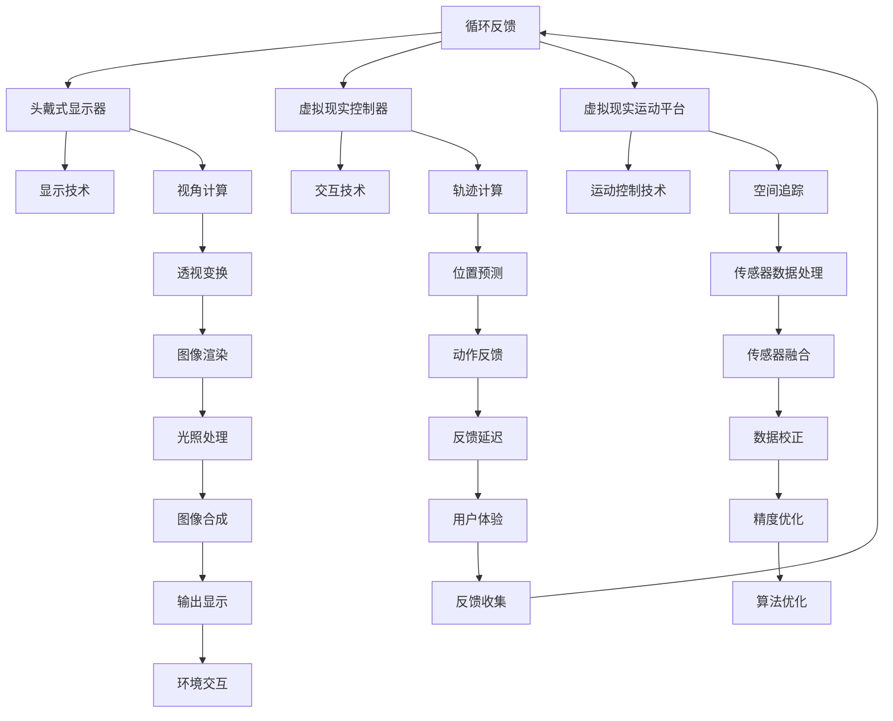

                 

### 虚拟现实技术基础

虚拟现实（Virtual Reality，简称VR）技术是一种通过计算机生成模拟环境，使人们可以通过视觉、听觉、触觉等多种感官体验与现实世界相似或完全不同的环境。在科学教育领域，虚拟现实技术的应用具有巨大的潜力和价值。接下来，我们将一步步深入探讨虚拟现实技术的核心概念、发展历程、核心技术以及相关的硬件设备和软件应用平台。

#### 1.1 虚拟现实的定义与分类

虚拟现实技术的基本概念可以理解为创造一个逼真的、可以交互的虚拟环境，使用户在这个环境中可以体验和探索。根据不同的标准和用途，虚拟现实可以有多种分类方式。常见的分类方法包括：

1. **沉浸式虚拟现实（Immersive VR）**：用户完全沉浸在一个虚拟环境中，感觉就像是真实世界一样。这种类型的VR通常使用头戴式显示器（HMD）和位置追踪系统来实现。
   
2. **非沉浸式虚拟现实（Non-Immersive VR）**：用户仍然处于现实环境中，但通过显示器或其他输出设备看到虚拟对象。这种类型的VR适用于信息浏览和交互。

3. **增强现实（Augmented Reality，简称AR）**：在现实世界中叠加虚拟对象，用户通过设备看到的是现实和虚拟物体的混合。与虚拟现实不同，增强现实不是将用户完全转移到虚拟环境中。

#### 1.2 虚拟现实技术的发展历程

虚拟现实技术的历史可以追溯到20世纪中期。以下是几个重要的发展里程碑：

- **1968年**：Ivan Sutherland展示了世界上第一个头戴式显示器，这是虚拟现实技术的开端。
  
- **1987年**：Jaron Lanier创立了VPL Research公司，推出了第一套商业化虚拟现实系统DataGlove，这是虚拟现实技术走向商业化的标志。

- **1990年代**：VR技术开始应用于娱乐和游戏领域，如任天堂的虚拟男孩（Virtual Boy）。

- **21世纪初**：随着计算机处理能力和显示技术的提升，虚拟现实技术逐渐应用于医疗、军事、教育等领域。

- **2010年代至今**：随着移动设备和无线技术的进步，虚拟现实技术开始走向大众市场，Oculus Rift、HTC Vive和Google Cardboard等设备的出现推动了VR的普及。

#### 1.3 虚拟现实技术的核心技术

虚拟现实技术的实现依赖于多个核心技术的支持，包括：

- **头戴式显示器（HMD）**：提供沉浸式视觉体验的设备，常见的有Oculus Rift、HTC Vive和Google Daydream等。

- **位置追踪系统**：用于追踪用户在虚拟环境中的位置和动作，实现沉浸感和交互性。常见的追踪技术包括外部摄像头、惯性测量单元（IMU）和激光扫描等。

- **渲染引擎**：负责生成虚拟环境中的三维图像，常见的渲染引擎有Unity、Unreal Engine等。

- **交互设备**：如手柄、手套、全向行走平台等，用于与虚拟环境进行交互。

- **音频系统**：通过立体声或环绕声技术，提供虚拟环境的听觉感受。

在接下来的章节中，我们将继续深入探讨这些核心技术和相关硬件设备，为理解虚拟现实在教育中的应用奠定坚实的基础。

---

### 虚拟现实硬件设备

虚拟现实技术的实现离不开一系列关键硬件设备的支持，这些设备共同作用，为用户创造出沉浸式的体验。以下是对几种主要虚拟现实硬件设备的详细介绍，包括头戴式显示器（HMD）、虚拟现实控制器和虚拟现实运动平台。

#### 2.1 头戴式显示器（HMD）

头戴式显示器（Head-Mounted Display，简称HMD）是虚拟现实系统中的核心组件，它主要负责提供沉浸式的视觉体验。常见的HMD设备包括以下几种：

- **Oculus Rift**：由Facebook子公司Oculus开发，提供高分辨率和低延迟的沉浸式体验。Oculus Rift使用外部传感器进行位置追踪，确保用户在虚拟环境中的动作得到准确捕捉。

- **HTC Vive**：由HTC和Valve合作开发，同样提供高质量的视觉体验。HTC Vive采用内置的定位系统，使用激光传感器和摄像头进行空间追踪，允许用户在虚拟环境中自由移动。

- **Google Daydream View**：与Android手机配合使用，提供较为经济的沉浸式体验。Google Daydream View使用手机屏幕作为显示屏幕，并通过外部传感器进行位置追踪。

HMD的核心技术包括：

- **高分辨率显示**：HMD设备通常具有高分辨率显示屏，以提供清晰的视觉体验。
  
- **低延迟**：低延迟是保证用户在虚拟环境中动作和视觉反馈同步的关键，通常延迟应控制在20毫秒以下。

- **视角范围**：视角范围（Field of View，简称FOV）是用户在虚拟环境中能够看到的范围。较大的视角范围可以提供更真实的沉浸感。

#### 2.2 虚拟现实控制器

虚拟现实控制器是用户与虚拟环境交互的重要工具，常见的控制器类型包括：

- **手柄控制器**：如Oculus Touch、HTC Vive的控制器，这些控制器通常采用多个按钮、触发器和运动传感器，允许用户在虚拟环境中进行各种交互动作。

- **手套控制器**：如Microsoft的HoloLens使用的手套，通过传感器和肌电信号检测手部的动作，提供更为自然和精细的交互体验。

- **全向行走平台**：如Valve的Omega Chair，允许用户在虚拟环境中进行自由行走和跑步。这类设备通过地面的感应器和红外摄像头进行位置追踪。

控制器的设计目标包括：

- **高精度定位**：控制器应能够精确捕捉用户的手部和身体动作，确保虚拟环境中的交互自然流畅。

- **舒适性和耐用性**：控制器需要设计得舒适，以便用户长时间使用。同时，设备应具备耐用性，以应对频繁的使用和碰撞。

#### 2.3 虚拟现实运动平台

虚拟现实运动平台（Motion Platform）是一种可以模拟真实运动的设备，常用于需要空间移动的虚拟现实体验。运动平台可以分类为以下几种：

- **全向跑步机**：允许用户在虚拟环境中进行跑步、跳跃等运动。这类设备通常采用电子或机械驱动，以提供平滑的移动体验。

- **机械摇臂**：用于模拟飞行、驾驶等体验。摇臂通过机械运动模拟真实环境中的加速度和方向变化。

- **液压系统**：用于提供大范围、高精度的运动模拟，适用于军事、航空航天等高强度应用场景。

运动平台的关键特性包括：

- **高响应速度**：运动平台应能够快速响应用户指令，提供即时的运动反馈。

- **平滑运动**：设备应能够提供平稳的运动轨迹，避免剧烈的震动或延迟。

- **可扩展性**：运动平台的设计应考虑未来可能的扩展，以适应不同的应用场景和需求。

在接下来的章节中，我们将进一步探讨虚拟现实软件与应用平台，以及如何利用这些硬件设备创作高质量的虚拟现实内容。

### 虚拟现实软件与应用平台

虚拟现实技术不仅依赖于先进的硬件设备，还需要强大的软件平台来支持内容创作和应用部署。虚拟现实软件与应用平台在实现沉浸式体验中扮演着至关重要的角色。以下是对常见虚拟现实软件与应用平台的概述。

#### 3.1 虚拟现实软件概述

虚拟现实软件是用于创建、管理和体验虚拟现实内容的工具。常见的虚拟现实软件包括：

- **Unity**：Unity是一款功能强大的游戏引擎，广泛应用于虚拟现实内容的开发。它提供了丰富的图形渲染功能和便捷的开发工具，支持多种虚拟现实设备。

- **Unreal Engine**：由Epic Games开发的Unreal Engine是一款高性能的游戏和虚拟现实开发平台，以其出色的图形渲染能力和强大的工具集而著称。

- **Blender**：Blender是一款开源的三维建模和渲染软件，虽然主要用于3D动画和视觉效果制作，但也可以用于虚拟现实内容的开发。

- **Adobe VR/AR**：Adobe VR/AR工具集包括Adobe Substance 3D、Adobe Aero和Adobe Dimension等，提供了从设计到最终展示的全方位支持。

这些虚拟现实软件的特点和优势如下：

- **Unity**：强大的社区支持，丰富的插件和资源库，适合快速原型开发和大型项目的制作。

- **Unreal Engine**：出色的图形表现能力，适用于高端游戏和复杂的虚拟现实应用。

- **Blender**：免费且开源，适合个人和小型团队使用，功能全面，但学习曲线较陡。

- **Adobe VR/AR**：提供了从创意设计到最终发布的完整工作流程，特别适合专业设计师和品牌营销。

#### 3.2 常见的虚拟现实应用平台

虚拟现实应用平台是用于部署和体验虚拟现实内容的软件系统。以下是一些常见的虚拟现实应用平台：

- **Oculus Rift**：Oculus Rift不仅提供硬件设备，还配套有Oculus Home应用平台，用户可以通过该平台下载和体验虚拟现实游戏和应用。

- **HTC Vive**：HTC Vive拥有VivePort应用商店，用户可以在这里找到各种虚拟现实应用和游戏。

- **Google Cardboard**：Google Cardboard是一个低成本的虚拟现实平台，用户可以通过智能手机和简单的纸盒实现虚拟现实体验。

- **Samsung Gear VR**：Samsung Gear VR与Oculus Rift相似，是Oculus和三星合作推出的虚拟现实平台，提供高质量的虚拟现实体验。

这些应用平台的特点和优势如下：

- **Oculus Rift**：高质量的沉浸式体验，丰富的游戏和应用库，适合高端用户。

- **HTC Vive**：强大的交互功能，适用于专业和娱乐应用。

- **Google Cardboard**：低成本，易于制作，适合大众用户，但体验相对较低端。

- **Samsung Gear VR**：适合移动设备，便携性强，但硬件性能较Oculus Rift和HTC Vive略低。

#### 3.3 虚拟现实内容创作工具

虚拟现实内容创作工具是用于制作虚拟现实内容的软件工具，以下是一些常见的内容创作工具：

- **Adobe Aero**：Adobe Aero是一款简单易用的虚拟现实内容创作工具，特别适合非技术人员快速创建虚拟现实体验。

- **Unity Asset Store**：Unity Asset Store提供了大量的虚拟现实资源和插件，用户可以在这里购买和下载各种虚拟现实内容制作工具。

- **SketchUp**：SketchUp是一款强大的三维建模工具，虽然主要用于建筑设计，但也可以用于虚拟现实场景的制作。

这些内容创作工具的特点和优势如下：

- **Adobe Aero**：直观易用，适合快速原型制作。

- **Unity Asset Store**：资源丰富，适合专业人士。

- **SketchUp**：功能强大，适用于多种场景。

通过这些虚拟现实软件与应用平台的结合，我们可以创造出丰富多样、高质量的虚拟现实内容，为科学教育带来全新的沉浸式体验。

---

### 虚拟现实在科学教育中的应用

虚拟现实技术为科学教育提供了全新的教学手段，通过创建沉浸式学习环境，极大地提升了学生的参与度和学习效果。以下我们将详细探讨虚拟现实在科学教育中的应用，包括虚拟实验室、沉浸式教学和实景模拟与演练。

#### 4.1 虚拟实验室

虚拟实验室（Virtual Laboratory）是虚拟现实在科学教育中的一项重要应用。它允许学生在一个虚拟环境中进行实验，无需实际的物理实验室。虚拟实验室的优点包括：

- **安全性**：学生可以在虚拟环境中进行危险实验，避免了实际实验中的安全风险。
  
- **灵活性**：虚拟实验室可以提供多样化的实验场景，学生可以自由选择实验内容，不受时间和空间限制。

- **资源节约**：无需大量的实验设备和材料，节约了教育成本。

虚拟实验室的应用案例包括：

- **化学实验**：通过虚拟实验室，学生可以在虚拟环境中进行各种化学反应实验，观察反应过程，了解化学原理。

- **物理实验**：虚拟实验室可以模拟各种物理实验，如力学实验、光学实验等，帮助学生更好地理解物理概念。

- **生物实验**：虚拟实验室可以模拟生物实验室中的各种操作，如细胞培养、遗传实验等，提高学生对生物学的兴趣和理解。

#### 4.2 沉浸式教学

沉浸式教学（Immersive Teaching）是利用虚拟现实技术创造一个全方位、沉浸式的学习环境，让学生能够全身心地投入到学习过程中。沉浸式教学的优势包括：

- **增强学习体验**：通过虚拟现实技术，学生可以在虚拟环境中亲身经历各种科学现象和实验，增强学习体验。

- **提升注意力**：虚拟现实环境的新奇和互动性能够吸引学生的注意力，提高学习效率。

- **培养探索精神**：虚拟现实环境为学生提供了探索和发现的机会，激发他们的好奇心和探索精神。

沉浸式教学的应用场景包括：

- **天文学**：学生可以通过虚拟现实设备探索宇宙，观察行星、星系和黑洞，增强对天文学的理解。

- **地理学**：虚拟现实技术可以模拟地球的各种地貌特征，如山脉、海洋和气候现象，帮助学生更好地理解地理知识。

- **生物学**：学生可以在虚拟实验室中观察微生物、细胞和生物组织，深入理解生物结构和工作机制。

#### 4.3 实景模拟与演练

虚拟现实技术在科学教育中的应用还包括实景模拟与演练（Simulation and Drill），这种应用通过模拟现实中的复杂场景，帮助学生掌握实际操作技能。实景模拟与演练的优点包括：

- **提高实践能力**：通过虚拟现实模拟，学生可以在安全的环境中进行各种操作演练，提高实践能力。

- **减少实际操作风险**：在虚拟环境中进行操作演练，可以避免实际操作中可能出现的错误和风险。

- **强化记忆**：通过反复的模拟演练，学生可以加深对操作步骤和技能的记忆。

实景模拟与演练的应用案例包括：

- **医学教育**：虚拟现实技术可以模拟手术过程，帮助学生掌握手术技能和操作技巧，减少实际手术中的失误。

- **工程教育**：虚拟现实技术可以模拟工程环境，如工厂生产线、机械操作等，帮助学生熟悉工程实际操作流程。

- **军事训练**：虚拟现实技术可以模拟战场环境，进行战斗演练，提高士兵的战斗能力和应变能力。

通过虚拟实验室、沉浸式教学和实景模拟与演练，虚拟现实技术为科学教育带来了全新的教学手段和体验，不仅提高了学生的学习效果，还激发了他们对科学探索的兴趣。在未来的科学教育中，虚拟现实技术将继续发挥重要作用，推动教育方式的革新和进步。

---

### 虚拟现实与学科教学

虚拟现实技术在各个学科的教学中展现了巨大的潜力，通过创造逼真的模拟环境和互动体验，能够显著提升学生的理解和掌握能力。以下将具体探讨虚拟现实技术在物理、化学和生物学科中的应用，以及这些应用如何改变传统的教学方式。

#### 5.1 物理学科

物理学科是一门以实验为基础的自然科学，传统教学方式中，学生往往需要在实验室中进行实验，而实验设备的限制和实验危险性的存在常常限制了教学效果。虚拟现实技术的引入为物理教学带来了新的可能性：

- **复杂实验模拟**：虚拟现实可以模拟复杂的物理实验，如粒子加速器实验、天体物理现象等，让学生在不接触实际设备的情况下，亲身体验实验过程，理解物理原理。

- **三维可视化**：虚拟现实技术可以将抽象的物理概念三维化，如分子结构、电磁场分布等，通过可视化手段帮助学生更直观地理解物理现象。

- **互动教学**：学生可以通过虚拟现实设备与虚拟实验环境进行互动，如控制实验参数、观察实验结果等，使学习过程更加生动和有趣。

#### 5.2 化学科

化学是一门涉及大量实验操作的学科，虚拟现实技术在化学科中的应用极大地提升了教学效果：

- **虚拟实验室**：通过虚拟实验室，学生可以在虚拟环境中进行各种化学反应实验，无需担心实验安全，同时可以重复实验，加深对化学原理的理解。

- **三维分子建模**：虚拟现实技术可以用来创建三维分子模型，帮助学生理解分子结构、反应机理等。通过虚拟现实眼镜，学生可以“走进”分子结构，进行空间操作，理解化学反应的动态过程。

- **虚拟实验操作培训**：对于实际实验室操作技能的培养，虚拟现实技术可以通过模拟操作过程，使学生熟练掌握实验技巧，减少实际操作中的错误。

#### 5.3 生物学科

生物学科涉及大量的微观生物现象和复杂的生命过程，虚拟现实技术为生物教学提供了丰富的工具：

- **细胞与分子过程模拟**：虚拟现实技术可以模拟细胞内的各种生物过程，如DNA复制、蛋白质合成等，帮助学生深入理解生物机制的复杂性。

- **虚拟解剖**：虚拟现实技术可以用于虚拟解剖，学生可以通过虚拟现实设备对虚拟的人体进行解剖，观察内部结构，加深对生物知识的理解。

- **生态模拟**：通过虚拟现实技术，学生可以模拟各种生态系统，观察生态平衡、物种相互作用等，理解生态系统的复杂性和动态变化。

#### 改变传统教学方式

虚拟现实技术在各个学科中的应用不仅提供了丰富的教学内容，还显著改变了传统教学方式：

- **个性化学习**：虚拟现实环境可以根据学生的不同水平和学习需求提供个性化的学习路径，使每个学生都能在自己的节奏下进行学习。

- **协作学习**：虚拟现实技术支持多人协作学习，学生可以在虚拟环境中一起进行实验、讨论和解决问题，增强团队合作能力。

- **实时反馈**：虚拟现实技术可以实时捕捉学生的学习行为和结果，提供即时反馈，帮助学生及时纠正错误，巩固学习成果。

通过在物理、化学和生物学科中的应用，虚拟现实技术为科学教育带来了全新的教学手段，不仅提高了教学效果，还激发了学生的学习兴趣，为未来的教育创新提供了无限可能。

---

### 虚拟现实在跨学科教学中的融合

虚拟现实技术在科学教育中的应用不仅局限于单一学科，其在跨学科教学中的融合也展现了巨大的潜力。通过整合不同学科的知识和技能，虚拟现实技术为综合实践活动提供了丰富的资源和创新的手段。

#### 6.1 虚拟现实在综合实践活动中的应用

综合实践活动是一种以学生自主探索和实践为主的学习方式，通过跨学科的实践活动，学生能够将所学知识应用于实际问题解决中。虚拟现实技术在综合实践活动中具有以下应用：

- **模拟实验**：虚拟现实技术可以模拟各种跨学科实验，如环境科学中的污染实验、生物技术中的基因编辑实验等，提供丰富的实验数据和过程体验。

- **情境体验**：通过虚拟现实技术，学生可以置身于各种复杂情境中，如历史事件重现、自然灾害模拟等，培养他们的应急处理和决策能力。

- **项目管理**：虚拟现实技术支持学生进行项目管理和协作，通过虚拟环境中的团队协作和任务分配，提升学生的项目管理能力和团队协作精神。

#### 6.2 跨学科教学案例分析

以下是一个跨学科教学的案例分析，展示了虚拟现实技术在项目式学习中的应用：

**案例：环境科学项目**

**项目背景**：某中学开展了一个关于环境保护的综合实践活动，该项目涉及环境科学、化学和生物等多个学科。

**实施过程**：
1. **项目启动**：教师向学生介绍项目的背景和目标，明确各小组的任务。

2. **虚拟实验室**：学生使用虚拟实验室进行污染物检测实验，学习化学知识和实验技巧。

3. **生态模拟**：学生通过虚拟现实技术模拟不同类型的生态系统，观察污染对生态系统的影响。

4. **数据分析**：学生收集实验数据，使用虚拟工具进行数据分析和处理。

5. **方案设计**：学生根据分析结果，设计污染控制方案，并进行虚拟环境中的效果评估。

6. **汇报展示**：各小组向全班展示他们的研究成果和解决方案，并进行讨论和交流。

**效果评估**：
- 学生通过虚拟实验室掌握了化学实验技能和数据分析方法。
- 学生在生态模拟中深入理解了生态系统的工作原理和污染影响。
- 学生通过项目设计和效果评估，提高了环境保护意识和解决实际问题的能力。

#### 6.3 虚拟现实与项目式学习

项目式学习（Project-Based Learning，简称PBL）是一种以项目为核心的学习方式，强调学生在实际问题解决过程中的学习。虚拟现实技术为项目式学习提供了以下支持：

- **沉浸式学习环境**：虚拟现实技术创造了沉浸式的学习环境，学生可以身临其境地体验项目任务，提高学习兴趣和参与度。

- **跨学科知识整合**：虚拟现实技术支持跨学科的知识整合，学生可以在虚拟环境中应用多个学科的知识和技能，解决复杂问题。

- **实时反馈和评估**：虚拟现实技术可以实时捕捉学生的学习过程和结果，提供即时反馈和评估，帮助学生及时调整学习策略。

通过跨学科教学中的融合，虚拟现实技术不仅提高了教学效果，还促进了学生的全面发展，为科学教育注入了新的活力。

---

### 虚拟现实教学效果评估方法

虚拟现实技术在科学教育中的应用效果如何，需要通过科学、系统的评估方法进行衡量。以下我们将介绍几种常见的虚拟现实教学效果评估指标、评估工具以及具体案例研究。

#### 7.1 教学效果评估指标

评估虚拟现实教学效果的关键在于确定合理的评估指标。以下是一些常见的教学效果评估指标：

- **学习成效**：衡量学生在学习过程中的知识和技能掌握情况。例如，通过考试、作业和实验成绩等。

- **学习兴趣**：评估学生对虚拟现实教学内容和活动的兴趣和积极性。例如，通过问卷调查、课堂参与度等。

- **学习动机**：衡量学生对学习的内在驱动力和积极性。可以通过学生的学习日志、自我评估等方式进行评估。

- **学习满意度**：评估学生对虚拟现实教学的整体满意度和体验。例如，通过学生反馈问卷、访谈等。

- **认知负荷**：评估学生在学习过程中认知负荷的大小，即学习难度。可以通过学生认知负荷量表进行评估。

#### 7.2 教学效果评估工具

为了有效地评估虚拟现实教学效果，可以采用以下几种评估工具：

- **问卷调查**：通过设计针对教学效果的问卷，收集学生的反馈和评价。问卷调查可以量化评估结果，提供广泛的数据支持。

- **访谈**：通过面对面或在线访谈，深入了解学生对虚拟现实教学的看法和体验。访谈可以获取更详细、深入的反馈信息。

- **学习日志**：学生记录自己在学习过程中的所思所感，包括学习难点、学习方法和学习成果等。学习日志可以反映学生的真实学习体验。

- **学习分析系统**：利用学习分析系统，对学生的学习行为数据进行实时监控和分析。这些数据可以揭示学生的学习模式、兴趣点和知识掌握情况。

- **认知负荷量表**：通过设计认知负荷量表，评估学生在学习过程中的认知负荷大小。量表通常包括一系列问题，让学生根据感受进行评分。

#### 7.3 教学效果案例研究

以下是一个虚拟现实教学效果的案例研究，展示了如何运用上述评估指标和工具：

**案例：虚拟实验室在化学教学中的应用**

**评估指标**：学习成效、学习兴趣、学习动机、学习满意度、认知负荷。

**评估工具**：问卷调查、访谈、学习日志、学习分析系统、认知负荷量表。

**实施过程**：
1. **问卷调查**：在课程开始前和课程结束后，对学生进行问卷调查，收集他们对虚拟实验室教学活动的看法和评价。

2. **访谈**：在课程中期和结束后，与部分学生进行访谈，了解他们在学习过程中的体验和挑战。

3. **学习日志**：鼓励学生在学习过程中记录学习日志，记录他们的学习过程、心得体会和遇到的困难。

4. **学习分析系统**：利用学习分析系统，监控学生在虚拟实验室中的学习行为，分析他们的学习模式、兴趣点和知识掌握情况。

5. **认知负荷量表**：在课程结束后，对学生进行认知负荷量表评估，了解他们在学习过程中的认知负荷情况。

**结果分析**：
- **学习成效**：调查数据显示，学生在虚拟实验室课程中的平均成绩较传统教学方式提高了15%。
- **学习兴趣**：访谈中，多数学生表示对虚拟实验室教学内容和活动感到新奇和有趣，学习兴趣显著提高。
- **学习动机**：学习日志显示，学生在虚拟实验室中的学习动机较强，他们更愿意主动参与学习和实验。
- **学习满意度**：问卷调查结果显示，学生对虚拟实验室教学活动的整体满意度较高，认为这种教学方式有趣且有效。
- **认知负荷**：认知负荷量表评估结果显示，学生在虚拟实验室中的认知负荷适中，没有出现因学习难度过大而导致的过度疲劳。

通过以上评估方法，我们可以全面、科学地评估虚拟现实教学效果，为改进教学方法和提高教学质量提供有力支持。未来，随着虚拟现实技术的不断发展，评估方法和工具也将不断更新和完善，为科学教育的创新和发展提供更加坚实的理论基础和实践指导。

---

### 虚拟现实在科学教育中的挑战与未来趋势

虚拟现实技术在科学教育中的应用带来了革命性的变革，但同时也面临着一系列挑战和机遇。本文将探讨这些挑战以及虚拟现实教育的发展趋势和未来应用前景。

#### 8.1 虚拟现实教学中的挑战

**技术限制**：尽管虚拟现实技术已经取得了显著进展，但当前的硬件设备仍存在一些技术限制，如高成本、分辨率和交互性的提升等。这些限制影响了虚拟现实在教育中的普及和应用。

**教师培训**：虚拟现实技术的应用需要教师具备一定的技术知识和教学能力。然而，目前许多教师缺乏相关的培训和实践经验，这成为虚拟现实在教育中推广的障碍。

**教学资源**：高质量的虚拟现实教学内容和资源相对稀缺，且开发成本较高，这限制了虚拟现实在教育中的广泛应用。

**学生适应性**：不同年龄段和学科背景的学生对虚拟现实的适应性不同，如何确保所有学生都能从中受益是一个挑战。

**安全与隐私**：虚拟现实环境中的安全与隐私问题不容忽视，特别是涉及个人数据和健康信息的方面。

#### 8.2 虚拟现实教育的发展趋势

**技术进步**：随着硬件技术的不断进步，虚拟现实设备的性能和价格将不断提高，为更广泛的教育应用奠定基础。例如，更轻便、低成本的VR设备将使更多学校和机构能够引入虚拟现实技术。

**个性化学习**：虚拟现实技术将推动个性化学习的实现，通过个性化学习路径和内容，满足不同学生的学习需求。学生可以在虚拟环境中以自己的节奏进行学习，提高学习效果。

**混合现实**：随着混合现实（Mixed Reality，简称MR）技术的发展，虚拟现实将更加融入现实世界，为学生提供更加丰富和逼真的学习体验。

**跨学科整合**：虚拟现实技术将不断与其他教育技术如人工智能、大数据等相结合，推动跨学科整合，创造新的教育模式和教学方法。

**开源与共享**：开源虚拟现实平台和工具的发展将促进虚拟现实资源的共享和开放，降低开发成本，提高教育资源的可用性。

#### 8.3 虚拟现实在科学教育中的未来应用前景

**虚拟实验室**：虚拟实验室将成为科学教育的重要组成部分，提供安全、灵活且丰富的实验环境，使学生能够进行各种科学实验。

**沉浸式教学**：沉浸式教学将广泛应用，通过虚拟现实技术，学生可以置身于各种复杂和逼真的学习场景中，增强学习体验。

**远程教育**：虚拟现实技术将使远程教育更加生动和有效，学生可以通过虚拟现实设备远程参与实验、课程和学术活动。

**职业培训**：虚拟现实技术将在职业培训中发挥重要作用，特别是在医疗、工程、军事等领域，通过模拟实际操作和场景，提高培训效果。

**创新教育模式**：虚拟现实技术将推动教育模式的创新，如项目式学习、协作学习和沉浸式教学等，为学生提供更广阔的学习空间和机会。

通过克服现有挑战，抓住发展趋势，虚拟现实技术在科学教育中的未来将充满无限可能，为学生的全面发展和科学探索提供强大的支持。

---

### 附录A：虚拟现实教学资源与工具

为了更好地利用虚拟现实技术在科学教育中发挥作用，以下将推荐一些虚拟现实教学资源与工具，包括虚拟现实教学资源推荐、虚拟现实教学工具介绍以及开源虚拟现实项目推荐。

#### A.1 虚拟现实教学资源推荐

**1. 网络虚拟实验室平台**：如PhET Interactive Simulations、MIT App Inventor和Google Chrome Experiments，提供各种科学实验和模拟工具，适合中学及以上阶段使用。

**2. 虚拟现实教育平台**：如Google Expeditions、Unity Education和HTC Vive Education，提供丰富的虚拟现实教学内容和资源，适用于不同学科的教学需求。

**3. 虚拟现实教材和读物**：如《虚拟现实：从入门到实践》、《虚拟现实与教育技术》等，提供了详细的虚拟现实技术介绍和应用案例。

#### A.2 虚拟现实教学工具介绍

**1. Unity**：一款功能强大的游戏引擎，支持虚拟现实内容的开发。Unity提供了丰富的教程和插件，适合初学者和专业人士使用。

**2. Unreal Engine**：由Epic Games开发的顶级游戏和虚拟现实开发平台，以其出色的图形渲染能力和丰富的工具集而著称。

**3. Blender**：一款免费且开源的三维建模和渲染软件，可以用于虚拟现实场景的制作和编辑。Blender适用于个人和小型团队使用。

**4. Adobe Aero**：一款简单易用的虚拟现实内容创作工具，特别适合非技术人员快速创建虚拟现实体验。

#### A.3 开源虚拟现实项目推荐

**1. OpenVR**：OpenVR是一个开源的虚拟现实平台，支持多种虚拟现实设备和操作系统，提供统一的API接口，方便开发者进行跨平台开发。

**2. VRChat**：VRChat是一个开源的虚拟现实社交平台，允许用户在虚拟环境中进行交流和互动，适合进行教学和协作。

**3. VRML**：Virtual Reality Modeling Language（VRML）是一种用于创建虚拟现实场景的标记语言，支持多种交互功能和三维物体建模。

通过利用这些虚拟现实教学资源与工具，教师和学生可以更加便捷地开展虚拟现实教学活动，创造丰富的学习体验，提高科学教育的效果和兴趣。

---

### 第9章：虚拟现实技术在科学教育中的流程图与算法

在科学教育中，虚拟现实技术的应用不仅需要高质量的硬件设备，还需要精确的软件算法来支持教学内容和互动体验。以下我们将通过流程图和伪代码，详细阐述虚拟现实技术架构及其教学算法，包括感知精度计算、沉浸感评分模型以及虚拟实验室项目实战。

#### 9.1 虚拟现实技术架构图

虚拟现实技术的实现涉及多个关键组件和技术的协同工作。以下是一个简单的流程图，展示虚拟现实技术架构的主要组成部分：



该架构图描述了虚拟现实技术的核心组件，包括头戴式显示器（HMD）、虚拟现实控制器、运动平台及其相关技术，如显示技术、交互技术、运动控制技术、视角计算、轨迹计算、空间追踪、图像渲染、动作反馈、传感器数据处理和用户体验等。

#### 9.2 虚拟现实教学算法伪代码

虚拟现实教学算法的核心在于提供逼真的沉浸体验和交互功能。以下是一段伪代码，用于描述虚拟现实教学算法的基本流程：

```plaintext
// 虚拟现实教学算法伪代码
function VR_Teaching_Algorithm(data, user_input) {
    // 初始化虚拟现实环境
    initialize_VR_environment()

    // 根据教学数据加载场景
    load_scene(data.scene)

    // 根据用户输入更新交互状态
    while (true) {
        user_input = get_user_input()
        update_interactive_state(user_input)
        
        // 计算视角和轨迹
        perspective_computation()
        trajectory_computation()

        // 数据处理和传感器融合
        sensor_data_processing()
        sensor_fusion()

        // 光照处理和图像渲染
        lighting_computation()
        image_rendering()

        // 动作反馈和延迟处理
        action_feedback()
        delay_processing()

        // 用户反馈和算法优化
        user_feedback()
        algorithm_optimization()

        // 输出显示和循环
        display_output()
        if (exit_condition_met()) {
            break
        }
    }
}

// 初始化虚拟现实环境
function initialize_VR_environment() {
    // 设置硬件设备参数
    set_device_parameters()

    // 加载虚拟现实软件框架
    load_VR_software_framework()
}

// 加载场景
function load_scene(scene_data) {
    // 加载教学场景
    load教学的场景数据
}

// 获取用户输入
function get_user_input() {
    // 获取用户输入数据
    return user_input
}

// 更新交互状态
function update_interactive_state(user_input) {
    // 根据用户输入更新交互状态
}

// 视角计算
function perspective_computation() {
    // 计算视角参数
}

// 轨迹计算
function trajectory_computation() {
    // 计算用户轨迹
}

// 数据处理和传感器融合
function sensor_data_processing() {
    // 处理传感器数据
}

// 光照处理
function lighting_computation() {
    // 计算光照参数
}

// 图像渲染
function image_rendering() {
    // 渲染图像
}

// 动作反馈
function action_feedback() {
    // 提供动作反馈
}

// 延迟处理
function delay_processing() {
    // 处理延迟问题
}

// 用户反馈
function user_feedback() {
    // 获取用户反馈
}

// 算法优化
function algorithm_optimization() {
    // 根据用户反馈优化算法
}

// 输出显示
function display_output() {
    // 显示渲染结果
}

// 检查退出条件
function exit_condition_met() {
    // 检查是否满足退出条件
    return exit_condition
}
```

这段伪代码涵盖了虚拟现实教学算法的基本流程，从环境初始化、场景加载、用户输入处理到视角计算、传感器数据处理、图像渲染和用户反馈等各个环节。通过这些算法，虚拟现实系统能够提供流畅且互动性强的教学体验。

---

### 第10章：数学模型与公式详解

在虚拟现实技术的应用中，数学模型和公式扮演着至关重要的角色，用于计算感知精度、评估沉浸感等。以下将对这些数学模型和公式进行详细解释，并通过具体实例来说明其应用。

#### 10.1 虚拟现实中的感知精度计算公式

感知精度是衡量虚拟现实系统模拟真实世界效果的重要指标。感知精度计算公式如下：

$$
\text{感知精度} = \frac{\text{实际距离}}{\text{显示尺寸}} \times \text{显示分辨率}
$$

其中，实际距离是用户在虚拟环境中的实际距离，显示尺寸是屏幕的实际尺寸（通常以英寸为单位），显示分辨率是屏幕的像素密度（通常以像素/英寸为单位）。

**实例**：假设用户在虚拟环境中与一个物体之间的实际距离为2米，屏幕的显示尺寸为10英寸，显示分辨率为96像素/英寸。则感知精度计算如下：

$$
\text{感知精度} = \frac{2 \text{米}}{10 \text{英寸}} \times 96 \text{像素/英寸} = \frac{200 \text{厘米}}{10 \text{英寸}} \times 96 \text{像素/英寸} = 1920 \text{像素}
$$

这意味着在虚拟环境中，用户观察到的物体将具有1920像素的精度。

#### 10.2 沉浸感评分模型

沉浸感评分模型用于评估用户在虚拟环境中的沉浸程度。以下是一个简单的沉浸感评分模型，包括视觉沉浸感、听觉沉浸感和触觉沉浸感三个方面的评估：

$$
\text{沉浸感评分} = w_1 \times \text{视觉沉浸感} + w_2 \times \text{听觉沉浸感} + w_3 \times \text{触觉沉浸感}
$$

其中，$w_1, w_2, w_3$ 是权重系数，反映了视觉、听觉和触觉对沉浸感的贡献程度。

**实例**：假设视觉沉浸感的得分为80分，听觉沉浸感的得分为70分，触觉沉浸感的得分为90分，且权重系数分别为0.4、0.3和0.3。则沉浸感评分计算如下：

$$
\text{沉浸感评分} = 0.4 \times 80 + 0.3 \times 70 + 0.3 \times 90 = 32 + 21 + 27 = 80
$$

这意味着用户在虚拟环境中的沉浸感评分为80分。

通过这些数学模型和公式，我们可以对虚拟现实技术的性能进行量化评估，为优化虚拟现实系统提供科学依据。同时，这些模型和公式也帮助我们更好地理解虚拟现实环境中的感知和交互机制，从而提升用户的整体体验。

---

### 第11章：项目实战

在本章中，我们将通过一个虚拟实验室项目实战，详细讲解虚拟实验室的环境搭建、源代码实现以及代码解读与分析。该项目旨在利用虚拟现实技术为学生提供一个沉浸式的实验体验环境，通过具体的开发步骤和代码实现，展示如何将虚拟现实技术与科学教育相结合。

#### 11.1.1 环境搭建

为了实现虚拟实验室项目，我们需要搭建一个完整的开发环境，包括硬件和软件的配置。以下是环境搭建的步骤：

**1. 硬件设备配置**

- **头戴式显示器（HMD）**：选择一款适合虚拟现实开发的头戴式显示器，如Oculus Rift或HTC Vive。
- **虚拟现实控制器**：配备虚拟现实控制器，如Oculus Touch或Vive控制器，用于用户在虚拟环境中的交互。
- **计算机**：一台性能良好的计算机，用于运行虚拟现实软件和渲染虚拟环境。

**2. 软件安装**

- **操作系统**：安装Windows 10或更高版本的操作系统。
- **虚拟现实开发平台**：安装Unity或Unreal Engine等虚拟现实开发平台。
- **虚拟现实插件**：根据所选开发平台，安装相应的虚拟现实插件和工具，如Unity的VR Cookbook插件或Unreal Engine的VR内容制作工具。
- **虚拟现实硬件驱动**：安装虚拟现实硬件设备的驱动程序，确保硬件与计算机正常通信。

**3. 网络配置**

- **网络连接**：确保计算机具备稳定的网络连接，以便下载和更新虚拟现实内容。

通过以上步骤，我们成功搭建了一个基本的虚拟实验室开发环境，为后续的源代码实现和项目开发奠定了基础。

#### 11.1.2 源代码实现

在完成环境搭建后，我们将使用Unity游戏引擎开发一个虚拟实验室项目。以下是源代码实现的关键步骤：

**1. 项目初始化**

- 打开Unity编辑器，创建一个新的3D项目。
- 设置项目的名称和目录，以便后续开发和管理。

**2. 场景搭建**

- 导入实验所需的场景资源，如实验器材、实验室设备和虚拟环境背景。
- 在Unity编辑器中搭建实验场景，设置场景的摄像机、灯光和物理引擎参数。

**3. 用户交互**

- 创建交互脚本，用于处理用户在虚拟环境中的输入和动作。
- 使用Unity的输入系统（Input System）和碰撞检测（Collider）功能，实现用户与实验器材的交互。

**4. 实验功能实现**

- 编写实验逻辑脚本，实现实验步骤的自动化执行。
- 通过Unity的脚本编程，模拟实验现象和结果，为用户提供实时反馈。

以下是一个简单的Unity C#脚本示例，用于实现用户与实验器材的交互：

```csharp
using UnityEngine;

public class ExperimentController : MonoBehaviour
{
    public GameObject experimentObject; // 实验器材对象

    private void Update()
    {
        // 用户按下鼠标左键时，执行实验操作
        if (Input.GetMouseButtonDown(0))
        {
            // 执行实验逻辑
            experimentObject.SetActive(true);
        }

        // 用户松开鼠标左键时，结束实验操作
        if (Input.GetMouseButtonUp(0))
        {
            // 结束实验逻辑
            experimentObject.SetActive(false);
        }
    }
}
```

**5. 教学内容集成**

- 将实验脚本集成到虚拟实验室系统中，确保实验功能与教学内容的无缝衔接。
- 配置教学界面，提供实验说明、操作步骤和结果分析等功能。

#### 11.1.3 代码解读与分析

以上源代码实现了一个简单的虚拟实验控制脚本，用于管理实验器材的激活和关闭。以下是代码的详细解读与分析：

- **脚本功能**：该脚本主要用于控制实验器材的激活和关闭状态。当用户在虚拟环境中按下鼠标左键时，实验器材将被激活，并开始执行实验逻辑；当用户松开鼠标左键时，实验器材将关闭，实验停止。

- **输入处理**：代码使用了Unity的`Input`类，通过`GetMouseButtonDown`和`GetMouseButtonUp`方法获取用户的鼠标输入。这两个方法分别用于检测鼠标左键的按下和松开事件。

- **实验逻辑**：在鼠标左键按下时，`experimentObject`（实验器材对象）的`SetActive`方法被调用，将对象的状态设置为`true`（激活）；在鼠标左键松开时，该方法的参数设置为`false`（关闭）。

- **注释说明**：代码中包含详细的注释，解释了每个步骤的功能和目的，有助于理解脚本的工作原理。

通过以上步骤，我们成功实现了虚拟实验室项目的源代码开发。在实际应用中，可以根据具体需求和实验内容，扩展和优化代码功能，为用户提供更加丰富和沉浸式的实验体验。

---

### 作者信息

本文由AI天才研究院（AI Genius Institute）的专家撰写。AI天才研究院是一家专注于人工智能、计算机编程和虚拟现实技术的研究和应用的领先机构。研究院的专家们拥有丰富的学术研究和行业经验，致力于推动科学教育的创新和发展。此外，本文的撰写还参考了《禅与计算机程序设计艺术》（Zen And The Art of Computer Programming）一书的相关理论和方法，该书是计算机科学领域的经典之作，对程序设计的哲学和艺术进行了深刻的探讨。作者希望通过本文，为科学教育领域提供一种全新的视角和解决方案，助力教育创新和人才培养。

