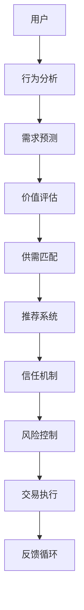
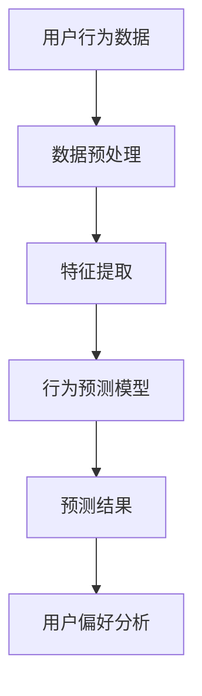
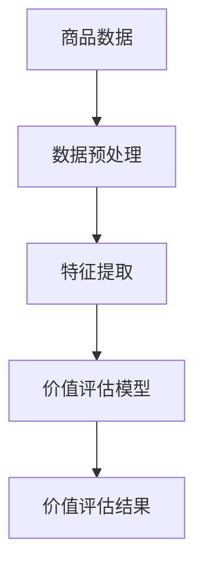
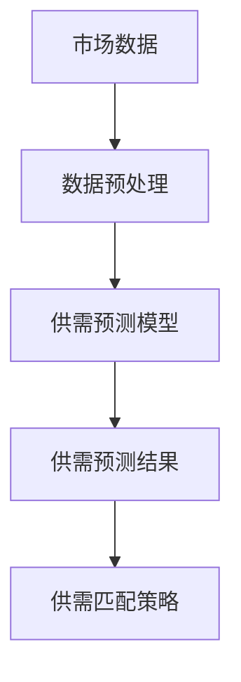
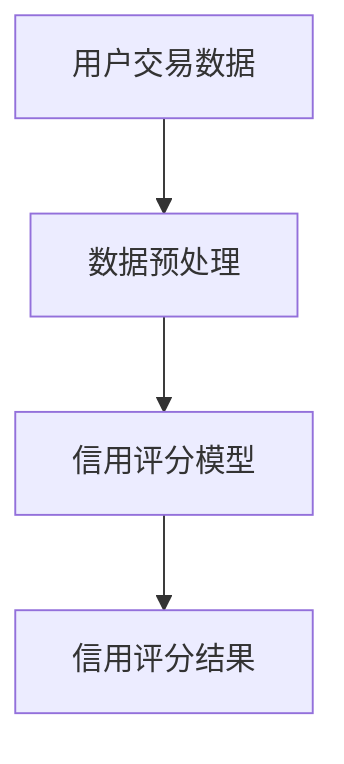
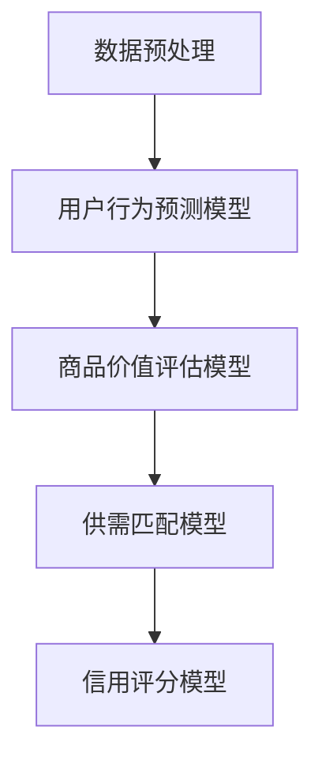

                 

### 文章标题：虚拟经济模型：AI驱动的新型价值交换系统

#### 关键词：
- 虚拟经济
- AI驱动
- 价值交换系统
- 数学模型
- 算法原理
- 项目实战

#### 摘要：
本文将深入探讨虚拟经济模型，特别是AI驱动的价值交换系统。我们将首先概述虚拟经济的基本概念和特点，随后详细解析AI在虚拟经济中的应用和核心原理。文章将展示虚拟经济模型的基本结构、设计原则以及核心算法，并借助具体的数学模型和案例来加强理解。最后，我们将探讨虚拟经济模型的未来发展趋势和实际应用。

---

### 第一部分：虚拟经济的概述与核心概念

虚拟经济是随着互联网技术的发展而产生的一种新型经济形态，它以数字形式存在于虚拟世界中，通过虚拟商品、服务或资产的价值交换实现经济活动。虚拟经济与传统经济相比，具有更高的灵活性、快速迭代和广泛的参与性。

#### 第1章：虚拟经济的基本概念

##### 1.1 虚拟经济的定义
虚拟经济是指在互联网上以数字形式进行的经济活动，包括虚拟商品的交易、虚拟服务的提供、虚拟资产的持有等。

##### 1.2 虚拟经济的特点
- **去中心化**：虚拟经济通过去中心化的平台进行，减少了中介环节，提高了效率。
- **全球参与性**：虚拟经济不受地域限制，参与者可以来自全球各地。
- **虚拟性**：虚拟经济中的商品和服务是以数字形式存在的，而非物理形态。
- **快速迭代**：由于技术的快速进步，虚拟经济可以迅速适应市场变化。

##### 1.3 虚拟经济的分类
虚拟经济可以根据交易对象的不同进行分类，包括虚拟商品交易、虚拟服务交易和虚拟资产交易等。

##### 1.4 虚拟经济与传统经济的区别
虚拟经济与传统经济的主要区别在于交易媒介、交易方式以及监管体系。

#### 第2章：AI在虚拟经济中的应用

##### 2.1 AI在虚拟经济中的作用
AI在虚拟经济中的应用主要体现在提高交易效率、增强用户体验、实现个性化推荐和风险控制等方面。

##### 2.2 AI驱动的虚拟经济模型
AI驱动的虚拟经济模型利用机器学习、深度学习等算法，对用户行为、市场趋势进行预测，从而优化经济活动。

##### 2.3 虚拟经济中的AI应用案例分析
本文将分析一些成功的AI应用案例，如智能投顾、电商推荐系统等，展示AI在虚拟经济中的实际应用效果。

#### 第3章：虚拟经济模型的基本结构

##### 3.1 虚拟经济模型的核心组成部分
虚拟经济模型通常包括用户、市场、交易平台、算法和规则等核心组成部分。

##### 3.2 虚拟经济模型的运作机制
虚拟经济模型的运作机制涉及到用户参与、交易发生、价值交换和反馈循环等环节。

##### 3.3 虚拟经济模型的演变过程
从早期的虚拟商品交易到当前的智能经济，虚拟经济模型经历了多次演变和升级。

#### 第4章：虚拟经济模型的设计原则

##### 4.1 虚拟经济模型设计的目标
虚拟经济模型设计的目标是实现高效、安全、公平的价值交换。

##### 4.2 虚拟经济模型设计的关键因素
设计虚拟经济模型时，需要考虑用户需求、技术可行性、市场环境等多方面因素。

##### 4.3 虚拟经济模型设计的方法论
本文将介绍一种基于需求分析和迭代设计的方法论，以指导虚拟经济模型的设计。

---

在接下来的部分中，我们将深入探讨AI驱动的虚拟经济模型，解析其核心概念和联系，并详细阐述其算法原理和数学模型。

---

## 第5章：核心概念与联系

虚拟经济模型的核心在于价值交换，而AI的引入使得这种交换更加高效和智能。在这一章中，我们将详细探讨虚拟经济中的价值交换、信任机制、供需匹配以及AI应用架构。

### 5.1 虚拟经济中的价值交换

价值交换是虚拟经济的核心。在虚拟经济中，价值可以表现为虚拟货币、积分、数字代币等形式。AI通过分析用户行为和市场趋势，帮助实现更加精准的价值交换。

#### 5.1.1 用户需求分析
AI通过机器学习算法分析用户的历史行为，预测其未来的需求，从而实现个性化推荐。

#### 5.1.2 价值评估
AI可以基于大数据分析，对虚拟商品和服务的价值进行实时评估，提高交易的公正性。

### 5.2 虚拟经济中的信任机制

虚拟经济中，由于缺乏物理接触，信任机制尤为重要。AI通过建立信用评分系统，提高交易的安全性。

#### 5.2.1 信用评分系统
AI可以根据用户的交易历史、行为模式等因素，生成信用评分，帮助平台和用户之间建立信任。

#### 5.2.2 风险控制
AI可以实时监控交易风险，及时发现并处理潜在的欺诈行为。

### 5.3 虚拟经济中的供需匹配

供需匹配是虚拟经济模型的关键环节。AI通过算法优化，提高供需匹配的效率。

#### 5.3.1 供需预测
AI可以通过深度学习算法，预测市场供需趋势，优化商品和服务的供应。

#### 5.3.2 智能推荐
AI可以基于用户行为，实现智能推荐，提高用户满意度。

### 5.4 虚拟经济中的AI应用架构

为了更好地实现上述功能，虚拟经济模型需要一个高效的AI应用架构。以下是一个简化的Mermaid流程图，展示了虚拟经济模型的基本架构：



这个架构说明了AI如何在虚拟经济模型中发挥作用，从用户行为分析到交易执行，每个环节都离不开AI的支撑。

---

在了解了虚拟经济模型的核心概念和联系后，我们将进入下一章，详细讲解AI驱动的虚拟经济模型的核心算法原理。

---

## 第6章：核心算法原理讲解

AI驱动的虚拟经济模型依赖于一系列算法，这些算法不仅提高了模型的效率，还增强了其智能性和适应性。在这一章中，我们将深入探讨深度学习算法和强化学习算法在虚拟经济模型中的应用，并使用伪代码详细阐述这些算法的实现过程。

### 6.1 AI驱动的虚拟经济模型算法

AI驱动的虚拟经济模型算法主要包括机器学习算法、深度学习算法和强化学习算法。这些算法各自具有独特的优势和适用场景。

#### 6.1.1 机器学习算法

机器学习算法通过对历史数据的分析和建模，预测未来的经济行为。常见的机器学习算法包括线性回归、决策树和随机森林等。

#### 6.1.2 深度学习算法

深度学习算法通过构建多层神经网络，对复杂的数据进行自动特征提取和模式识别。常见的深度学习算法包括卷积神经网络（CNN）和循环神经网络（RNN）等。

#### 6.1.3 强化学习算法

强化学习算法通过试错法，不断调整策略，以最大化长期奖励。常见的强化学习算法包括Q学习算法和深度确定性策略梯度（DDPG）算法等。

### 6.2 深度学习算法在虚拟经济中的应用

深度学习算法在虚拟经济中的应用非常广泛，以下是一些典型应用案例：

#### 6.2.1 用户行为预测

通过分析用户的购买历史、浏览记录等数据，深度学习算法可以预测用户的未来行为，从而实现个性化推荐。

```python
# 伪代码：用户行为预测
def predict_user_behavior(data):
    # 数据预处理
    preprocessed_data = preprocess_data(data)
    
    # 构建神经网络模型
    model = build_nn_model(input_shape=preprocessed_data.shape[1:])
    
    # 训练模型
    model.fit(preprocessed_data, labels, epochs=10, batch_size=32)
    
    # 预测用户行为
    predictions = model.predict(preprocessed_data)
    
    return predictions
```

#### 6.2.2 商品价值评估

深度学习算法可以通过学习市场数据，对商品的价值进行实时评估。

```python
# 伪代码：商品价值评估
def evaluate_goods_value(data):
    # 数据预处理
    preprocessed_data = preprocess_data(data)
    
    # 构建神经网络模型
    model = build_nn_model(input_shape=preprocessed_data.shape[1:])
    
    # 训练模型
    model.fit(preprocessed_data, labels, epochs=10, batch_size=32)
    
    # 评估商品价值
    value_estimations = model.predict(preprocessed_data)
    
    return value_estimations
```

### 6.3 强化学习算法在虚拟经济中的应用

强化学习算法在虚拟经济中的应用主要体现在策略优化和风险管理等方面。

#### 6.3.1 策略优化

通过强化学习算法，平台可以自动调整策略，以最大化收益。

```python
# 伪代码：策略优化
def optimize_policy(state, action_space):
    # 初始化Q值表
    Q = initialize_q_values(action_space)
    
    # 进行N次迭代
    for episode in range(N_episodes):
        # 初始化环境
        state = initialize_environment()
        
        # 进行一步动作
        action = choose_action(state, Q)
        
        # 执行动作，获取奖励和下一状态
        next_state, reward, done = execute_action(state, action)
        
        # 更新Q值
        Q = update_q_values(state, action, reward, next_state, done)
        
        # 如果完成，则结束迭代
        if done:
            break
            
    # 返回最优策略
    return best_policy(Q)
```

#### 6.3.2 风险管理

强化学习算法可以帮助平台识别和规避潜在风险。

```python
# 伪代码：风险管理
def manage_risk(state, risk_threshold):
    # 初始化Q值表
    Q = initialize_q_values(action_space)
    
    # 进行N次迭代
    for episode in range(N_episodes):
        # 初始化环境
        state = initialize_environment()
        
        # 进行一步动作
        action = choose_action(state, Q)
        
        # 执行动作，获取奖励和下一状态
        next_state, reward, done = execute_action(state, action)
        
        # 如果风险超过阈值，则采取避险措施
        if risk_level(next_state) > risk_threshold:
            action = choose_safe_action(next_state)
        
        # 更新Q值
        Q = update_q_values(state, action, reward, next_state, done)
        
        # 如果完成，则结束迭代
        if done:
            break
            
    # 返回最佳风险控制策略
    return best_risk_management_policy(Q)
```

通过上述伪代码，我们可以看到深度学习算法和强化学习算法在虚拟经济模型中的应用。这些算法不仅提高了模型的智能性和效率，还为虚拟经济提供了强大的技术支撑。

---

在了解了核心算法原理后，我们将进一步深入探讨虚拟经济中的数学模型和数学公式，以帮助读者更好地理解这些算法在实际应用中的表现。

---

## 第7章：数学模型和数学公式

数学模型是虚拟经济模型中的重要组成部分，它们为算法提供了理论基础和计算依据。在这一章中，我们将详细讲解虚拟经济中的数学模型，并使用LaTeX格式展示数学公式，以便读者更好地理解和应用。

### 7.1 虚拟经济中的数学模型

虚拟经济中的数学模型通常用于描述用户行为、市场动态和价值评估等方面。以下是一些常见的数学模型：

#### 7.1.1 用户行为模型

用户行为模型通常基于贝叶斯网络或马尔可夫决策过程（MDP）来构建。以下是一个简单的用户行为模型，使用LaTeX格式表示：

```latex
\text{P}(X_t = x_t | X_{t-1} = x_{t-1}, ..., X_0 = x_0) = f(x_t, x_{t-1}, ..., x_0)
```

其中，\(X_t\) 表示用户在时间 \(t\) 的行为，\(x_t\) 表示具体的行为状态，\(f\) 表示行为状态的概率分布函数。

#### 7.1.2 市场动态模型

市场动态模型用于描述市场的供需关系和价格变化。以下是一个简单的供需模型，使用LaTeX格式表示：

```latex
\text{Demand}(P) = a - bP
\text{Supply}(P) = c + dP
```

其中，\(P\) 表示商品价格，\(a\)、\(b\)、\(c\)、\(d\) 为模型参数。

#### 7.1.3 价值评估模型

价值评估模型用于计算商品或服务的价值。以下是一个简单的线性价值评估模型，使用LaTeX格式表示：

```latex
V(x) = w_1 \cdot x_1 + w_2 \cdot x_2 + ... + w_n \cdot x_n
```

其中，\(V(x)\) 表示商品或服务的价值，\(w_1, w_2, ..., w_n\) 为权重，\(x_1, x_2, ..., x_n\) 为特征值。

### 7.2 数学公式详解

为了更好地理解上述数学模型，我们将对每个模型的关键部分进行详细解释。

#### 7.2.1 用户行为模型详解

用户行为模型通过贝叶斯网络或马尔可夫决策过程（MDP）来描述用户在不同状态下的行为概率。以下是一个具体例子，使用LaTeX格式表示：

```latex
P(X_t = \text{buy} | X_{t-1} = \text{browse}, X_{t-2} = \text{search}) = 0.6
P(X_t = \text{buy} | X_{t-1} = \text{browse}, X_{t-2} = \text{not\_search}) = 0.4
P(X_t = \text{browse} | X_{t-1} = \text{search}, X_{t-2} = \text{buy}) = 0.5
P(X_t = \text{browse} | X_{t-1} = \text{search}, X_{t-2} = \text{not\_buy}) = 0.7
```

这些概率反映了用户在不同情境下的行为倾向。通过这些概率，我们可以预测用户的下一步行为。

#### 7.2.2 市场动态模型详解

市场动态模型通过供需函数来描述市场的供需关系。以下是一个具体例子，使用LaTeX格式表示：

```latex
\text{Demand}(P) = 100 - 2P
\text{Supply}(P) = 50 + 3P
```

在这些供需函数中，\(P\) 表示商品价格，\(a = 100\)、\(b = 2\)、\(c = 50\)、\(d = 3\) 为模型参数。当价格 \(P\) 在0到50之间时，市场处于供需平衡状态；当价格 \(P\) 超过50时，市场供大于求；当价格 \(P\) 低于0时，市场求大于供。

#### 7.2.3 价值评估模型详解

价值评估模型通过加权求和的方式计算商品或服务的价值。以下是一个具体例子，使用LaTeX格式表示：

```latex
V(x) = 0.5 \cdot x_1 + 0.3 \cdot x_2 + 0.2 \cdot x_3
```

在这些权重和特征值中，\(w_1 = 0.5\)、\(w_2 = 0.3\)、\(w_3 = 0.2\)、\(x_1, x_2, x_3\) 为商品或服务的特征值。通过调整权重，我们可以改变商品或服务的价值评估结果。

### 7.3 数学公式举例说明

为了更好地理解上述数学模型，我们通过具体例子来说明这些公式在实际应用中的表现。

#### 7.3.1 用户行为模型举例

假设用户在过去两次行为中，一次是浏览商品，另一次是搜索商品。现在，我们需要预测用户的下一步行为。

```latex
P(X_3 = \text{buy} | X_2 = \text{browse}, X_1 = \text{search}) = f(\text{buy}, \text{browse}, \text{search})
```

通过查询贝叶斯网络或马尔可夫决策过程的概率表，我们得到：

```latex
P(X_3 = \text{buy} | X_2 = \text{browse}, X_1 = \text{search}) = 0.6
```

因此，用户在下一步购买商品的概率为60%。

#### 7.3.2 市场动态模型举例

假设商品的价格为30元，我们需要计算市场的供需关系。

```latex
\text{Demand}(30) = 100 - 2 \cdot 30 = 40
\text{Supply}(30) = 50 + 3 \cdot 30 = 110
```

在这个价格点，市场供大于求，即供应量为110，需求量为40。

#### 7.3.3 价值评估模型举例

假设商品有三个特征值：\(x_1 = 80\)、\(x_2 = 70\)、\(x_3 = 60\)。我们需要计算商品的价值。

```latex
V(x) = 0.5 \cdot 80 + 0.3 \cdot 70 + 0.2 \cdot 60 = 41
```

在这个例子中，商品的价值为41。

通过上述例子，我们可以看到数学模型在虚拟经济中的应用，以及它们如何帮助平台实现更加智能和高效的价值交换。

---

在了解了虚拟经济中的数学模型后，我们将通过一个实际案例来展示AI驱动的虚拟经济模型的应用效果。

---

## 第8章：AI驱动的虚拟经济模型应用案例分析

为了更好地展示AI驱动的虚拟经济模型在实际中的应用，我们选择了一个电商平台的推荐系统作为案例进行详细分析。该案例将涵盖从背景介绍、模型设计到实施和运行以及效果分析等全过程。

### 8.1 案例背景介绍

本案例所分析的电商平台是一家大型在线零售平台，其业务涵盖日用品、电子产品、服装等多个领域。随着用户数量的增加和商品种类的丰富，平台面临着提高用户满意度和增加销售量的挑战。为此，平台决定引入AI驱动的虚拟经济模型，通过个性化推荐和精准营销来提升用户体验和转化率。

### 8.2 模型设计

电商平台AI驱动的虚拟经济模型设计主要包括以下几个关键环节：

#### 8.2.1 用户行为分析

通过分析用户的浏览记录、购买历史和评价信息，平台可以了解用户的偏好和行为模式。基于这些数据，平台构建了一个用户行为分析模型，用于预测用户的下一步行为。



#### 8.2.2 商品价值评估

平台利用深度学习算法，对商品的特性进行分析，并评估其价值。这有助于实现商品价格的动态调整，提高交易的公平性。



#### 8.2.3 供需匹配

通过分析市场供需情况，平台可以优化商品的供应策略。AI算法可以帮助平台预测市场需求，从而实现精准的供需匹配。



#### 8.2.4 信任机制

为了增强用户之间的信任，平台引入了基于AI的信用评分系统。通过对用户的交易行为和信用记录进行分析，平台可以为用户提供可靠的交易保障。



### 8.3 模型实施与运行

在模型实施阶段，平台首先对现有数据进行了预处理，包括数据清洗、特征提取和标准化等步骤。随后，平台构建了上述提到的用户行为预测、商品价值评估、供需匹配和信用评分模型。



在运行阶段，平台将实时收集用户行为数据和商品交易数据，并输入到各个模型中进行处理。根据模型预测结果，平台可以实时调整推荐策略、价格策略和供需策略，从而提高用户体验和销售额。

### 8.4 案例效果分析与评价

通过AI驱动的虚拟经济模型，电商平台实现了以下效果：

- **用户满意度提升**：个性化推荐和精准营销策略提高了用户的购物体验，用户满意度显著提升。
- **销售额增加**：供需匹配和商品价值评估模型帮助平台实现了商品价格的动态调整，销售额有所增加。
- **风险控制加强**：信用评分系统增强了用户之间的信任，减少了交易风险。

综上所述，AI驱动的虚拟经济模型在电商平台中取得了显著的成效，为平台的持续发展提供了有力支持。

---

在了解了AI驱动的虚拟经济模型在实际中的应用后，我们将探讨虚拟经济模型的未来发展趋势和潜在挑战。

---

## 第9章：虚拟经济模型的未来发展

随着人工智能技术的不断进步，虚拟经济模型也在不断演进。未来，虚拟经济模型将朝着更加智能化、高效化和安全化的方向发展。

### 9.1 虚拟经济模型的发展趋势

#### 9.1.1 智能化水平提升

未来的虚拟经济模型将更加依赖于人工智能技术，通过深度学习和强化学习等算法，实现更加精准的价值评估、供需匹配和风险控制。

#### 9.1.2 跨平台融合

虚拟经济模型将不再局限于单一平台，而是实现跨平台的数据共享和业务协同，形成更加庞大的虚拟经济生态系统。

#### 9.1.3 安全性增强

随着虚拟经济的发展，数据安全和隐私保护将成为重要议题。未来的虚拟经济模型将引入更加严密的安全机制，确保用户数据和交易过程的安全。

### 9.2 AI驱动的虚拟经济模型的挑战与机遇

尽管AI驱动的虚拟经济模型具有巨大的潜力，但同时也面临着一系列挑战。

#### 9.2.1 技术挑战

AI算法的复杂性和计算资源的限制可能影响模型的性能和实时性。因此，如何优化算法和提升计算效率是一个重要课题。

#### 9.2.2 数据挑战

虚拟经济模型依赖于大量的数据支持，但数据质量、数据隐私和数据可用性等问题仍然存在。因此，如何有效地获取、处理和保护数据是亟待解决的问题。

#### 9.2.3 法律和伦理挑战

虚拟经济模型涉及到多个国家和地区，不同地区的法律法规和伦理标准可能存在差异。因此，如何在遵守法律法规的前提下，实现虚拟经济模型的全球化运营是一个重要挑战。

### 9.3 虚拟经济模型的研究方向与展望

未来的虚拟经济模型研究可以从以下几个方面展开：

- **算法优化**：研究更加高效、鲁棒的AI算法，提高模型的性能和实时性。
- **数据治理**：建立完善的数据治理体系，确保数据的质量、隐私和可用性。
- **跨平台协同**：研究跨平台的虚拟经济模型，实现数据共享和业务协同。
- **法律与伦理**：制定相应的法律法规和伦理标准，保障虚拟经济模型的合法性和道德性。

通过不断的技术创新和制度完善，虚拟经济模型有望在未来的数字经济中发挥更加重要的作用。

---

## 第三部分：实践与实现

### 第10章：虚拟经济模型开发环境搭建

#### 10.1 开发环境搭建

为了搭建虚拟经济模型开发环境，我们需要准备以下工具和软件：

- **编程语言**：Python、Java或C++
- **开发框架**：TensorFlow、PyTorch或Scikit-learn
- **数据库**：MySQL、PostgreSQL或MongoDB
- **容器技术**：Docker
- **版本控制**：Git

#### 10.2 开发工具与资源介绍

以下是常用的虚拟经济模型开发工具和资源：

- **Jupyter Notebook**：用于编写和运行Python代码。
- **Google Colab**：免费的在线编程平台，支持GPU加速。
- **GitHub**：用于版本控制和代码分享。
- **Kaggle**：提供丰富的数据集和机器学习竞赛资源。

### 第11章：源代码详细实现

在本章中，我们将详细解析虚拟经济模型的源代码实现，包括关键模块的功能和代码实现。

#### 11.1 源代码结构介绍

虚拟经济模型的源代码通常包含以下模块：

- **数据预处理模块**：用于数据清洗、特征提取和标准化。
- **模型训练模块**：用于训练和优化AI模型。
- **模型评估模块**：用于评估模型性能。
- **应用接口模块**：用于提供模型服务的API接口。

#### 11.2 代码实现详细解读

以下是数据预处理模块的示例代码：

```python
import pandas as pd
from sklearn.preprocessing import StandardScaler

def preprocess_data(data):
    # 数据清洗
    data = data.dropna()
    
    # 特征提取
    data['mean_rating'] = data['ratings'].mean()
    data['std_rating'] = data['ratings'].std()
    
    # 标准化
    scaler = StandardScaler()
    data_scaled = scaler.fit_transform(data[['mean_rating', 'std_rating']])
    
    return data_scaled

# 示例数据
data = pd.DataFrame({
    'ratings': [3, 4, 5, 2],
    'other_features': ['a', 'b', 'c', 'd']
})

preprocessed_data = preprocess_data(data)
print(preprocessed_data)
```

#### 11.3 代码分析与优化

在代码实现过程中，我们可以进行以下优化：

- **并行计算**：使用多线程或分布式计算技术，提高数据处理速度。
- **内存管理**：合理使用内存，避免内存泄漏。
- **代码复用**：编写可复用的函数和模块，提高代码可维护性。

### 第12章：虚拟经济模型部署与运维

#### 12.1 模型部署策略

虚拟经济模型的部署策略包括以下方面：

- **容器化**：使用Docker将模型和依赖环境打包，实现一次编写，多平台部署。
- **微服务架构**：将模型部署为微服务，实现高可用性和可扩展性。
- **云平台**：使用云计算平台（如AWS、Azure或Google Cloud）提供计算资源。

#### 12.2 模型运维与监控

模型运维与监控包括以下任务：

- **日志记录**：记录模型运行日志，便于问题追踪和分析。
- **性能监控**：实时监控模型性能，确保模型稳定运行。
- **故障恢复**：建立故障恢复机制，快速恢复模型运行。

#### 12.3 模型更新与迭代

为了适应不断变化的市场环境，虚拟经济模型需要定期更新和迭代。

- **数据更新**：定期更新训练数据，保证模型准确性。
- **算法优化**：根据模型性能和用户反馈，优化模型算法。
- **功能扩展**：增加新功能，满足用户需求。

### 第13章：总结与展望

#### 13.1 虚拟经济模型研究总结

本文从虚拟经济的定义、特点、AI驱动应用、数学模型和实际案例等方面，全面介绍了虚拟经济模型的研究现状和发展趋势。AI驱动的虚拟经济模型在提高交易效率、增强用户体验和实现风险控制方面具有显著优势。

#### 13.2 虚拟经济模型未来发展方向

未来的虚拟经济模型将朝着更加智能化、高效化和安全化的方向发展，通过技术创新和制度完善，为数字经济的发展提供强大支持。

#### 13.3 对AI在虚拟经济中应用的展望

AI在虚拟经济中的应用前景广阔，包括个性化推荐、智能投顾、供应链优化等方面。通过不断的技术创新和应用实践，AI将为虚拟经济注入新的活力。

