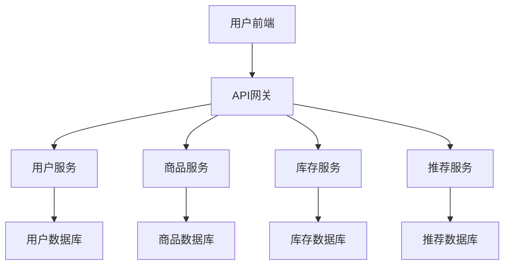

                 

### 《虚拟试衣间：全球时尚产业的数字化转型》

#### 文章关键词
- 虚拟试衣间
- 数字化转型
- 时尚产业
- 3D建模
- 人工智能
- 购物体验

#### 文章摘要
本文探讨了虚拟试衣间作为时尚产业数字化转型的重要组成部分。通过分析其定义、技术基础、应用价值、技术架构以及在不同场景中的应用，我们揭示了虚拟试衣间如何提升消费者购物体验、减少退货率、推动时尚设计和时尚营销的创新。此外，本文还介绍了虚拟试衣间的开发流程、性能优化方法，并提供了全球知名虚拟试衣间案例的分析。最后，我们对虚拟试衣间的未来发展趋势进行了展望，并提出了商业潜力和挑战。

### 背景与基础

#### 第1章：虚拟试衣间的概念与价值

##### 1.1 虚拟试衣间的定义
虚拟试衣间是一种利用计算机图形学、3D建模和人工智能等技术，为消费者提供虚拟试衣体验的应用场景。消费者可以通过上传自己的身体数据，如身高、体重和身体尺寸，选择并试穿不同款式和尺寸的服装，从而在购买前获得真实的穿着效果。

##### 1.2 虚拟试衣间的技术基础
虚拟试衣间的实现依赖于多种技术，包括：
- **3D建模与渲染**：用于创建服装的3D模型，并实现逼真的渲染效果。
- **计算机视觉**：用于捕捉和识别用户身体数据，如使用摄像头或扫描设备。
- **人工智能与机器学习**：用于根据用户数据和服装数据提供个性化的试衣建议。
- **前端技术**：包括Web应用和移动应用，为用户提供直观的交互界面。
- **后端技术**：包括数据处理、存储和服务器托管，确保虚拟试衣间稳定运行。

##### 1.3 虚拟试衣间在全球时尚产业的应用价值
虚拟试衣间为全球时尚产业带来了多方面的价值：
- **提升购物体验**：消费者可以在购买前看到实际穿着效果，减少冲动购买和不合适的退货。
- **降低退货率**：通过精准匹配用户身材和服装尺寸，减少因不合身导致的退货。
- **提高销售转化率**：增强消费者信心，提高购买意愿。
- **降低库存成本**：减少不必要的库存，提高库存周转率。
- **促进时尚设计**：设计师可以通过虚拟试衣间快速展示设计效果，收集用户反馈，优化设计方案。
- **创新营销方式**：虚拟试衣间可以作为品牌营销的新工具，增强品牌互动性和用户参与度。

#### 第2章：虚拟试衣间的技术架构

##### 2.1 前端技术
前端技术是虚拟试衣间的核心组成部分，决定了用户体验的质量。常见的前端框架和库包括：
- **React**：用于构建用户界面和组件，具有灵活性和高可维护性。
- **Vue.js**：轻量级的渐进式JavaScript框架，易于学习和使用。
- **Three.js**：用于创建和显示3D图形的库，是实现虚拟试衣间3D渲染的关键。

##### 2.1.1 3D建模与渲染技术
3D建模与渲染是虚拟试衣间的核心技术之一。3D建模技术包括：
- **Blender**：开源的3D建模软件，适用于创建复杂的3D模型。
- **Maya**：专业的3D建模和动画软件，广泛用于影视和游戏行业。
渲染技术包括：
- **Unreal Engine**：适用于实时渲染的高级引擎，可以实现高质量的视觉效果。
- **Unity**：跨平台的游戏开发引擎，也适用于虚拟试衣间的开发。

##### 2.1.2 实时交互技术
实时交互技术确保用户在虚拟试衣间中的操作能够实时反映，常见的技术包括：
- **WebSockets**：用于实现服务器与客户端之间的实时双向通信。
- **Socket.IO**：基于Node.js的实时通信库，支持WebSocket协议。

##### 2.2 后端技术
后端技术负责数据处理、存储和管理，确保虚拟试衣间的高效运行。常见后端框架和库包括：
- **Node.js**：用于构建高性能、可扩展的后端服务。
- **Express.js**：Node.js的Web应用框架，用于快速开发Web应用程序。
- **Django**：Python的Web框架，适用于快速开发和部署后端应用。

##### 2.2.1 云计算与大数据技术
云计算和大数据技术为虚拟试衣间提供了强大的数据处理能力：
- **云计算平台**：如Amazon Web Services (AWS)、Microsoft Azure等，用于服务器托管和数据处理。
- **大数据处理**：使用Hadoop、Spark等框架进行大规模数据处理和分析。

##### 2.2.2 人工智能与机器学习技术
人工智能和机器学习技术用于个性化推荐、图像识别和数据分析：
- **TensorFlow**：开源机器学习框架，用于构建和训练神经网络。
- **Keras**：TensorFlow的高级API，简化了神经网络构建过程。

##### 2.2.3 数据存储与管理技术
数据存储与管理技术确保数据的可靠性和可扩展性：
- **关系型数据库**：如MySQL、PostgreSQL，适用于结构化数据存储。
- **非关系型数据库**：如MongoDB，适用于大规模数据存储和查询。

## 虚拟试衣间应用场景

### 第3章：线上零售中的应用

#### 3.1 虚拟试衣间在电商中的应用

##### 3.1.1 提高用户购买转化率
虚拟试衣间通过提供真实的穿着效果，帮助消费者做出更明智的购买决策，从而提高购买转化率。通过减少因不合身而导致的退货，电商企业可以降低退货成本，提高利润率。

##### 3.1.2 减少退货率
虚拟试衣间允许消费者在购买前试穿，从而减少因不合身而导致的退货。这对消费者和商家都是双赢的局面，消费者获得更好的购物体验，商家降低退货处理成本。

##### 3.1.3 增强用户购物体验
虚拟试衣间为消费者提供了一个沉浸式的购物体验，使其能够在家中轻松试穿多种款式和尺寸的服装，无需实际去实体店试穿。这种体验有助于提升用户满意度和忠诚度。

### 第4章：时尚设计中的应用

#### 4.1 虚拟试衣间在服装设计中的应用

##### 4.1.1 设计师灵感获取
虚拟试衣间可以帮助设计师在创作过程中获取灵感。通过模拟不同穿着效果，设计师可以快速评估设计方案的可行性，从而提高设计效率。

##### 4.1.2 设计方案实时展示
虚拟试衣间允许设计师在创作过程中实时展示设计方案，方便与客户和团队沟通。这种实时反馈机制有助于设计师快速调整和优化设计，提高客户满意度。

##### 4.1.3 设计方案评估与优化
虚拟试衣间提供了一个客观的评估平台，设计师可以根据消费者反馈对设计方案进行优化。通过数据分析，设计师可以了解消费者的偏好和需求，从而提高设计的市场竞争力。

### 第5章：时尚营销中的应用

#### 5.1 虚拟试衣间在广告营销中的应用

##### 5.1.1 增强广告互动性
虚拟试衣间使广告更具互动性，消费者可以通过试穿广告中的服装，亲身体验品牌形象。这种互动性有助于提高广告的转化率，增强品牌影响力。

##### 5.1.2 提高广告转化率
虚拟试衣间提供真实的穿着效果，使消费者更容易做出购买决策。通过减少不确定性和风险，虚拟试衣间有助于提高广告的转化率。

##### 5.1.3 增强品牌影响力
虚拟试衣间作为一个创新技术，有助于提升品牌形象，吸引消费者的关注。通过提供独特的购物体验，品牌可以增强消费者对品牌的认知和忠诚度。

## 第三部分：虚拟试衣间技术实现

### 第6章：虚拟试衣间的开发流程

##### 6.1 系统架构设计
虚拟试衣间的系统架构设计是确保其稳定、高效运行的关键。以下是一个典型的虚拟试衣间系统架构：

1. **前端**：负责与用户交互，提供3D试衣界面和用户体验。
2. **后端**：负责处理用户请求，管理数据，以及与前端进行通信。
3. **数据库**：存储用户数据、服装数据和试衣记录。
4. **人工智能引擎**：用于提供个性化的推荐和预测。
5. **API服务**：提供与其他系统集成的接口。

##### 6.1.1 系统总体架构


##### 6.1.2 数据流设计
数据流设计描述了系统中各个组件之间的数据交互过程。以下是一个简单的数据流设计：

1. 用户通过前端提交请求，如试衣请求。
2. API网关接收请求，并转发给相应的后端服务。
3. 用户服务处理请求，如查询用户数据。
4. 商品服务处理请求，如查询商品数据。
5. 库存服务处理请求，如更新库存信息。
6. 推荐服务处理请求，如提供个性化推荐。
7. 所有服务将处理结果返回给前端，供用户查看。

##### 6.1.3 功能模块划分
虚拟试衣间的功能模块可以划分为以下几个部分：

1. **用户管理**：负责用户注册、登录、个人信息管理等。
2. **商品管理**：负责商品信息管理，如添加、删除、更新商品信息。
3. **库存管理**：负责库存信息管理，如库存查询、库存更新。
4. **试衣管理**：负责处理试衣请求，如试衣记录、试衣结果展示。
5. **推荐管理**：负责提供个性化推荐，如根据用户偏好推荐商品。

### 第6章：前端开发技术

##### 6.2 前端开发技术
前端开发是虚拟试衣间的核心，决定了用户体验的质量。以下是一些常见的前端开发技术：

1. **框架与库**：React、Vue.js、Angular
2. **3D引擎**：Three.js、Unity、Unreal Engine
3. **实时交互**：WebSocket、Socket.IO

##### 6.2.1 前端框架选择
选择合适的前端框架对于开发效率和用户体验至关重要。React、Vue.js和Angular是当前最受欢迎的前端框架。

1. **React**：由Facebook开发，具有灵活性和高可维护性，适用于大型应用。
2. **Vue.js**：轻量级框架，易于学习和使用，适合快速开发。
3. **Angular**：由谷歌支持，适用于复杂应用，具有强大的功能。

##### 6.2.2 前端功能实现
前端功能实现涉及多个方面，包括用户界面设计、3D建模与渲染、实时交互等。

1. **用户界面设计**：使用框架提供的组件库，设计直观、易用的用户界面。
2. **3D建模与渲染**：使用Three.js等3D引擎，实现逼真的服装渲染和试衣效果。
3. **实时交互**：使用WebSocket或Socket.IO，实现用户与服务器之间的实时通信。

##### 6.2.3 前后端交互设计
前后端交互设计是确保前端与后端高效、稳定通信的关键。

1. **RESTful API**：使用RESTful架构，定义统一的API接口。
2. **GraphQL**：使用GraphQL，提供灵活、高效的查询接口。
3. **状态管理**：使用Redux、Vuex等状态管理库，统一管理前端状态。

### 第6章：后端开发技术

##### 6.3 后端开发技术
后端开发是虚拟试衣间的核心，负责数据处理、存储和管理。以下是一些常见的后端开发技术：

1. **框架与库**：Node.js、Express.js、Django
2. **数据库**：关系型数据库（如MySQL、PostgreSQL）、非关系型数据库（如MongoDB）
3. **云计算**：AWS、Azure、Google Cloud Platform

##### 6.3.1 后端框架选择
选择合适的后端框架对于开发效率和系统性能至关重要。

1. **Node.js**：基于JavaScript，适用于构建高性能、可扩展的应用。
2. **Express.js**：轻量级Web框架，适用于快速开发。
3. **Django**：Python的Web框架，适用于快速开发和部署。

##### 6.3.2 数据处理与存储
数据处理与存储是后端开发的核心，需要考虑以下几个方面：

1. **关系型数据库**：适用于结构化数据存储，如MySQL、PostgreSQL。
2. **非关系型数据库**：适用于大规模数据存储和查询，如MongoDB。
3. **数据处理**：使用SQL或NoSQL查询语言，对数据进行处理和分析。

##### 6.3.3 服务部署与维护
服务部署与维护是确保虚拟试衣间稳定运行的关键。

1. **容器化**：使用Docker，将应用程序及其依赖项打包到容器中，便于部署和扩展。
2. **Kubernetes**：用于容器编排和管理，确保应用程序的高可用性和可伸缩性。
3. **监控与日志**：使用Prometheus、ELK（Elasticsearch、Logstash、Kibana）等工具，监控应用程序性能和日志。

### 第7章：虚拟试衣间的性能优化

#### 7.1 系统性能评估指标

##### 7.1.1 响应时间
响应时间是指系统从接收到请求到返回结果所需的时间。较低的响应时间可以提供更好的用户体验。

##### 7.1.2 数据处理速度
数据处理速度是指系统处理数据的能力，包括查询、更新和删除等操作。快速的数据处理可以提高系统性能。

##### 7.1.3 系统稳定性
系统稳定性是指系统在长时间运行过程中的稳定性和可靠性，包括处理异常情况、避免崩溃和确保数据一致性等。

#### 7.2 常见性能优化方法

##### 7.2.1 系统架构优化
系统架构优化包括以下几个方面：

1. **分布式架构**：将应用程序拆分为多个模块，部署到多个服务器，提高系统的可扩展性和容错性。
2. **缓存**：使用缓存技术，如Redis或Memcached，减少数据库查询次数，提高系统性能。
3. **负载均衡**：使用负载均衡器，如Nginx或HAProxy，将请求分配到多个服务器，提高系统的吞吐量。

##### 7.2.2 数据库优化
数据库优化是提高系统性能的关键，包括以下几个方面：

1. **索引**：为常用的查询创建索引，提高查询速度。
2. **分库分表**：将数据拆分为多个库或表，减少单个库或表的查询压力。
3. **读写分离**：将读操作和写操作分离到不同的数据库服务器，提高系统的并发能力。

##### 7.2.3 网络优化
网络优化包括以下几个方面：

1. **CDN**：使用内容分发网络（CDN），加速静态资源的访问速度。
2. **网络压缩**：使用HTTP压缩技术，如GZIP，减少数据传输量。
3. **网络监控**：使用网络监控工具，如Prometheus和Grafana，监控网络性能和异常。

### 案例分析

#### 第8章：全球知名虚拟试衣间案例分析

##### 8.1 案例一：品牌A的虚拟试衣间

##### 8.1.1 案例背景
品牌A是一家知名时尚品牌，致力于提供高品质的服装和个性化服务。为了提升消费者的购物体验，品牌A推出了虚拟试衣间功能，允许消费者在购买前试穿服装。

##### 8.1.2 案例分析
品牌A的虚拟试衣间采用了以下关键技术：
- **前端技术**：使用React框架构建用户界面，使用Three.js进行3D建模与渲染。
- **后端技术**：使用Node.js和Express.js构建后端服务，使用MongoDB进行数据存储。
- **实时交互**：使用WebSocket实现用户与服务器之间的实时通信。
品牌A的虚拟试衣间在性能优化方面采取了以下措施：
- **系统架构优化**：采用分布式架构，将应用程序拆分为多个模块，部署到多个服务器。
- **数据库优化**：使用索引和分库分表技术，提高数据库查询速度。
- **网络优化**：使用CDN和HTTP压缩技术，加速静态资源的访问速度。

##### 8.1.3 案例启示
品牌A的虚拟试衣间成功地为消费者提供了高质量的购物体验，降低了退货率，提高了购买转化率。其成功经验表明，虚拟试衣间的技术实现和性能优化对于提升用户体验至关重要。

##### 8.2 案例二：品牌B的虚拟试衣间

##### 8.2.1 案例背景
品牌B是一家新兴时尚品牌，专注于提供个性化的时尚解决方案。为了吸引年轻消费者，品牌B推出了虚拟试衣间功能，结合人工智能技术为用户提供个性化的推荐和试衣体验。

##### 8.2.2 案例分析
品牌B的虚拟试衣间采用了以下关键技术：
- **前端技术**：使用Vue.js框架构建用户界面，使用Unity进行3D建模与渲染。
- **后端技术**：使用Django框架构建后端服务，使用TensorFlow进行人工智能处理。
- **实时交互**：使用Socket.IO实现用户与服务器之间的实时通信。
品牌B的虚拟试衣间在性能优化方面采取了以下措施：
- **系统架构优化**：采用容器化技术，使用Docker和Kubernetes进行部署和管理。
- **数据库优化**：使用Redis进行缓存，减少数据库查询次数。
- **网络优化**：使用CDN和HTTP/2协议，提高静态资源访问速度。

##### 8.2.3 案例启示
品牌B的虚拟试衣间通过结合人工智能技术和高性能架构，成功地为用户提供了个性化的购物体验。其成功经验表明，创新技术结合优化策略对于提升用户体验和竞争力至关重要。

### 虚拟试衣间的未来发展

#### 第9章：虚拟试衣间的技术趋势

##### 9.1 增强现实与虚拟试衣间
增强现实（AR）技术将为虚拟试衣间带来更多可能性。通过AR技术，消费者可以在现实环境中尝试穿着虚拟服装，提供更真实的试衣体验。

##### 9.2 联合其他数字化技术
虚拟试衣间可以与其他数字化技术（如物联网、大数据分析等）相结合，提供更智能、个性化的购物体验。

##### 9.3 个性化定制
个性化定制将成为虚拟试衣间的重要发展方向。通过人工智能技术，虚拟试衣间可以根据消费者的身体数据和购物偏好，提供个性化的推荐和定制服务。

#### 第9章：虚拟试衣间的商业潜力

##### 9.4 增加品牌价值
虚拟试衣间有助于提升品牌形象，增加消费者对品牌的认可度和忠诚度，从而提高品牌价值。

##### 9.5 提升消费者忠诚度
通过提供高质量的购物体验，虚拟试衣间有助于提升消费者忠诚度，减少流失率。

##### 9.6 开拓新市场
虚拟试衣间为时尚产业开拓了新的市场机会，如跨境销售、新兴市场等。

### 附录A：虚拟试衣间技术参考资料

#### A.1 前端开发资源
- **常见前端框架与库**：
  - React：https://reactjs.org/
  - Vue.js：https://vuejs.org/
  - Angular：https://angular.io/
- **3D建模与渲染技术资源**：
  - Three.js：https://threejs.org/
  - Unity：https://unity.com/
  - Unreal Engine：https://www.unrealengine.com/
- **实时交互技术资源**：
  - WebSocket：https://developer.mozilla.org/en-US/docs/Web/API/WebSocket
  - Socket.IO：https://socket.io/

#### A.2 后端开发资源
- **常见后端框架与库**：
  - Node.js：https://nodejs.org/
  - Express.js：https://expressjs.com/
  - Django：https://www.djangoproject.com/
- **大数据与人工智能技术资源**：
  - TensorFlow：https://www.tensorflow.org/
  - Keras：https://keras.io/
  - Hadoop：https://hadoop.apache.org/
  - Spark：https://spark.apache.org/
- **数据存储与管理技术资源**：
  - MySQL：https://www.mysql.com/
  - PostgreSQL：https://www.postgresql.org/
  - MongoDB：https://www.mongodb.com/

### 附录B：虚拟试衣间开发工具

#### B.1 开发环境搭建
搭建虚拟试衣间的开发环境需要以下工具和软件：
- **前端开发环境**：
  - Node.js：用于运行JavaScript代码。
  - npm/yarn：用于管理前端依赖。
  - WebStorm/VS Code：用于编写和调试前端代码。
- **后端开发环境**：
  - Node.js：用于运行后端代码。
  - npm/yarn：用于管理后端依赖。
  - Postman：用于测试API接口。
- **实时交互开发环境**：
  - WebSocket：用于实现实时通信。
  - Socket.IO：用于简化WebSocket开发。

#### B.2 开发工具使用教程
- **前端开发工具使用**：
  - 安装Node.js：在官网下载并安装Node.js。
  - 安装npm/yarn：Node.js自带npm，或使用yarn替代。
  - 初始化项目：使用npm或yarn创建项目，并安装依赖。
  - 开发与调试：使用WebStorm/VS Code进行编码和调试。
- **后端开发工具使用**：
  - 安装Node.js：在官网下载并安装Node.js。
  - 安装npm/yarn：Node.js自带npm，或使用yarn替代。
  - 创建项目：使用npm或yarn创建项目，并安装依赖。
  - 开发与调试：使用Postman测试API接口，使用Node.js进行调试。
- **实时交互开发工具使用**：
  - 安装WebSocket：在项目中引入WebSocket库，如socket.io-client。
  - 实现实时通信：在客户端和服务器之间建立WebSocket连接，实现实时数据传输。

### 附录C：虚拟试衣间项目代码实例

#### C.1 项目一：简单虚拟试衣间实现

##### C.1.1 项目需求分析
本项目旨在实现一个简单的虚拟试衣间，允许用户上传自己的身体数据，选择并试穿不同款式的服装。

##### C.1.2 项目实现过程
1. **前端开发**：
   - 使用React框架构建用户界面。
   - 使用Three.js进行3D建模与渲染。
   - 实现用户上传身体数据和选择服装的功能。
2. **后端开发**：
   - 使用Node.js和Express.js构建后端服务。
   - 使用MongoDB进行数据存储。
   - 实现用户数据存储和服装数据管理。

##### C.1.3 代码解读与分析
1. **前端代码**：
   - `index.html`：定义HTML结构。
   - `App.js`：定义React组件，实现用户界面。
   - `styles.css`：定义CSS样式。
2. **后端代码**：
   - `server.js`：启动Node.js服务器。
   - `routes.js`：定义API路由和处理函数。
   - `models.js`：定义Mongoose模型，用于数据操作。

```javascript
// 前端代码示例（App.js）
import React, { useState } from 'react';
import * as THREE from 'three';
import { OrbitControls } from 'three/examples/jsm/controls/OrbitControls';

function App() {
  const [userHeight, setUserHeight] = useState('');
  const [userWeight, setUserWeight] = useState('');
  const [selectedCloth, setSelectedCloth] = useState('');

  // 初始化3D场景
  const initScene = () => {
    const scene = new THREE.Scene();
    const camera = new THREE.PerspectiveCamera(75, window.innerWidth / window.innerHeight, 0.1, 1000);
    const renderer = new THREE.WebGLRenderer();
    renderer.setSize(window.innerWidth, window.innerHeight);
    document.body.appendChild(renderer.domElement);

    // 添加灯光
    const light = new THREE.PointLight(0xffffff, 1, 100);
    scene.add(light);

    // 添加相机控制
    const controls = new OrbitControls(camera, renderer.domElement);
    controls.update();

    // 渲染循环
    const animate = () => {
      requestAnimationFrame(animate);
      controls.update();
      renderer.render(scene, camera);
    };

    animate();

    return scene;
  };

  // 上传身体数据
  const uploadBodyData = () => {
    // 实现上传身体数据到后端的逻辑
  };

  // 选择服装
  const selectCloth = (clothId) => {
    setSelectedCloth(clothId);
    // 实现加载选中的服装模型到场景的逻辑
  };

  return (
    <div>
      <h1>虚拟试衣间</h1>
      <div>
        <label>身高：</label>
        <input type="number" value={userHeight} onChange={(e) => setUserHeight(e.target.value)} />
      </div>
      <div>
        <label>体重：</label>
        <input type="number" value={userWeight} onChange={(e) => setUserWeight(e.target.value)} />
      </div>
      <div>
        <button onClick={uploadBodyData}>上传身体数据</button>
      </div>
      <div>
        <label>选择服装：</label>
        <select onChange={(e) => selectCloth(e.target.value)}>
          <option value="">请选择</option>
          <option value="1">服装1</option>
          <option value="2">服装2</option>
        </select>
      </div>
      <div>
        <canvas id="css-canvas" width="800" height="600"></canvas>
      </div>
    </div>
  );
}

export default App;
```

```javascript
// 后端代码示例（routes.js）
const express = require('express');
const bodyParser = require('body-parser');
const mongoose = require('mongoose');
const Cloth = require('./models/Cloth');

const app = express();
app.use(bodyParser.json());

// 连接数据库
mongoose.connect('mongodb://localhost:27017/virtual_try_on', { useNewUrlParser: true, useUnifiedTopology: true });

// 创建Cloth模型
const clothSchema = new mongoose.Schema({
  name: String,
  imageUrl: String,
});
const Cloth = mongoose.model('Cloth', clothSchema);

// 获取所有服装
app.get('/clothes', async (req, res) => {
  try {
    const clothes = await Cloth.find({});
    res.send(clothes);
  } catch (error) {
    res.status(500).send(error);
  }
});

// 上传身体数据
app.post('/body_data', async (req, res) => {
  const { height, weight } = req.body;
  // 实现上传身体数据的逻辑
  res.send({ message: '身体数据上传成功' });
});

module.exports = app;
```

```javascript
// 后端代码示例（models.js）
const mongoose = require('mongoose');

const userSchema = new mongoose.Schema({
  height: Number,
  weight: Number,
  // 其他用户数据
});

const Cloth = mongoose.model('Cloth', clothSchema);

module.exports = { User, Cloth };
```

##### C.2 项目二：高级虚拟试衣间实现

##### C.2.1 项目需求分析
本项目旨在实现一个高级虚拟试衣间，允许用户上传自己的身体数据，选择并试穿不同款式的服装，并提供个性化推荐。

##### C.2.2 项目实现过程
1. **前端开发**：
   - 使用React框架构建用户界面。
   - 使用Three.js进行3D建模与渲染。
   - 使用TensorFlow.js实现个性化推荐。
   - 实现用户上传身体数据和选择服装的功能。
2. **后端开发**：
   - 使用Node.js和Express.js构建后端服务。
   - 使用MongoDB进行数据存储。
   - 使用TensorFlow进行模型训练和预测。
   - 实现用户数据存储、服装数据管理和推荐系统。

##### C.2.3 代码解读与分析
1. **前端代码**：
   - `index.html`：定义HTML结构。
   - `App.js`：定义React组件，实现用户界面。
   - `styles.css`：定义CSS样式。
   - `recommender.js`：使用TensorFlow.js实现个性化推荐。
2. **后端代码**：
   - `server.js`：启动Node.js服务器。
   - `routes.js`：定义API路由和处理函数。
   - `models.js`：定义Mongoose模型，用于数据操作。
   - `recommender.js`：使用TensorFlow进行模型训练和预测。

```javascript
// 前端代码示例（App.js）
import React, { useState } from 'react';
import * as THREE from 'three';
import { OrbitControls } from 'three/examples/jsm/controls/OrbitControls';
import { tensorflow } from '@tensorflow/tfjs';

function App() {
  const [userHeight, setUserHeight] = useState('');
  const [userWeight, setUserWeight] = useState('');
  const [selectedCloth, setSelectedCloth] = useState('');
  const [recommendedCloths, setRecommendedCloths] = useState([]);

  // 初始化3D场景
  const initScene = () => {
    const scene = new THREE.Scene();
    const camera = new THREE.PerspectiveCamera(75, window.innerWidth / window.innerHeight, 0.1, 1000);
    const renderer = new THREE.WebGLRenderer();
    renderer.setSize(window.innerWidth, window.innerHeight);
    document.body.appendChild(renderer.domElement);

    // 添加灯光
    const light = new THREE.PointLight(0xffffff, 1, 100);
    scene.add(light);

    // 添加相机控制
    const controls = new OrbitControls(camera, renderer.domElement);
    controls.update();

    // 渲染循环
    const animate = () => {
      requestAnimationFrame(animate);
      controls.update();
      renderer.render(scene, camera);
    };

    animate();

    return scene;
  };

  // 上传身体数据
  const uploadBodyData = async () => {
    const bodyData = {
      height: parseFloat(userHeight),
      weight: parseFloat(userWeight),
    };
    // 实现上传身体数据到后端的逻辑
  };

  // 选择服装
  const selectCloth = (clothId) => {
    setSelectedCloth(clothId);
    // 实现加载选中的服装模型到场景的逻辑
  };

  // 获取推荐服装
  const getRecommendedCloths = async () => {
    const bodyData = {
      height: parseFloat(userHeight),
      weight: parseFloat(userWeight),
    };
    // 实现获取推荐服装的逻辑
  };

  return (
    <div>
      <h1>高级虚拟试衣间</h1>
      <div>
        <label>身高：</label>
        <input type="number" value={userHeight} onChange={(e) => setUserHeight(e.target.value)} />
      </div>
      <div>
        <label>体重：</label>
        <input type="number" value={userWeight} onChange={(e) => setUserWeight(e.target.value)} />
      </div>
      <div>
        <button onClick={uploadBodyData}>上传身体数据</button>
      </div>
      <div>
        <label>选择服装：</label>
        <select onChange={(e) => selectCloth(e.target.value)}>
          <option value="">请选择</option>
          <option value="1">服装1</option>
          <option value="2">服装2</option>
        </select>
      </div>
      <div>
        <button onClick={getRecommendedCloths}>获取推荐服装</button>
      </div>
      <div>
        <h2>推荐服装：</h2>
        <ul>
          {recommendedCloths.map((cloth) => (
            <li key={cloth._id}>{cloth.name}</li>
          ))}
        </ul>
      </div>
      <div>
        <canvas id="css-canvas" width="800" height="600"></canvas>
      </div>
    </div>
  );
}

export default App;
```

```javascript
// 后端代码示例（routes.js）
const express = require('express');
const bodyParser = require('body-parser');
const mongoose = require('mongoose');
const Cloth = require('./models/Cloth');
const Recommender = require('./models/Recommender');

const app = express();
app.use(bodyParser.json());

// 连接数据库
mongoose.connect('mongodb://localhost:27017/virtual_try_on', { useNewUrlParser: true, useUnifiedTopology: true });

// 获取所有服装
app.get('/clothes', async (req, res) => {
  try {
    const clothes = await Cloth.find({});
    res.send(clothes);
  } catch (error) {
    res.status(500).send(error);
  }
});

// 上传身体数据
app.post('/body_data', async (req, res) => {
  const { height, weight } = req.body;
  const bodyData = new BodyData({
    height,
    weight,
  });
  await bodyData.save();
  res.send({ message: '身体数据上传成功' });
});

// 获取推荐服装
app.post('/recommended_cloths', async (req, res) => {
  const { height, weight } = req.body;
  const recommendedCloths = await Recommender.find({ height, weight });
  res.send(recommendedCloths);
});

module.exports = app;
```

```javascript
// 后端代码示例（models.js）
const mongoose = require('mongoose');

const bodyDataSchema = new mongoose.Schema({
  height: Number,
  weight: Number,
  // 其他用户数据
});

const clothSchema = new mongoose.Schema({
  name: String,
  imageUrl: String,
  // 其他服装数据
});

const recommenderSchema = new mongoose.Schema({
  height: Number,
  weight: Number,
  // 其他推荐数据
});

const BodyData = mongoose.model('BodyData', bodyDataSchema);
const Cloth = mongoose.model('Cloth', clothSchema);
const Recommender = mongoose.model('Recommender', recommenderSchema);

module.exports = { BodyData, Cloth, Recommender };
```

```javascript
// 后端代码示例（recommender.js）
const TensorFlow = require('@tensorflow/tfjs');
const recommenderModel = TensorFlow.loadModel('recommender_model.json');

// 训练推荐模型
const trainRecommenderModel = async (data) => {
  const trainingData = data.map((item) => ({
    input: [item.height, item.weight],
    output: item.cloths,
  }));

  await recommenderModel.fit(trainingData, { epochs: 10 });
  await recommenderModel.save('recommender_model');
};

// 使用推荐模型进行预测
const predictRecommender = async (data) => {
  const inputTensor = TensorFlow.tensor2d([data.height, data.weight]);
  const predictions = await recommenderModel.predict(inputTensor);
  return predictions.arraySync();
};

module.exports = { trainRecommenderModel, predictRecommender };
```

### 附录D：虚拟试衣间常见问题与解决方案

#### D.1 前端开发常见问题

##### D.1.1 问题一：响应缓慢
**解决方案**：优化前端代码，减少DOM操作和重绘/回流次数。使用懒加载和异步加载技术，降低页面加载时间。使用浏览器缓存和CDN加速资源加载。

##### D.1.2 问题二：渲染问题
**解决方案**：确保显卡驱动和WebGL兼容性。优化3D模型和渲染效果，减少渲染开销。使用GPU加速渲染，提高渲染性能。

##### D.1.3 问题三：交互问题
**解决方案**：确保交互流程顺畅，减少延迟和卡顿。优化网络通信，使用WebSocket等实时通信技术。使用前端框架和库提高开发效率和代码质量。

#### D.2 后端开发常见问题

##### D.2.1 问题一：数据处理效率低
**解决方案**：优化数据库查询，使用索引和缓存技术。使用批量处理和并行处理技术，提高数据处理速度。优化算法和架构，降低系统延迟。

##### D.2.2 问题二：数据库连接问题
**解决方案**：确保数据库连接稳定，使用连接池技术。优化数据库配置，调整参数以提高性能。监控数据库性能，及时发现问题并进行优化。

##### D.2.3 问题三：服务稳定性问题
**解决方案**：使用容器化技术，如Docker和Kubernetes，提高服务的可扩展性和稳定性。使用监控工具，如Prometheus和Grafana，实时监控服务性能和异常。

#### D.3 实时交互常见问题

##### D.3.1 问题一：网络延迟问题
**解决方案**：优化网络通信，减少数据传输量。使用CDN和分布式部署，降低网络延迟。使用WebSocket等实时通信技术，提高通信效率。

##### D.3.2 问题二：数据同步问题
**解决方案**：确保数据一致性和实时性，使用事务和锁机制。使用消息队列和分布式缓存，确保数据在不同节点之间的同步。优化数据同步策略，提高系统性能。

##### D.3.3 问题三：实时交互性能问题
**解决方案**：优化前端和后端代码，减少不必要的通信和计算。使用异步编程和事件驱动架构，提高系统响应速度。使用性能优化工具，如Profiler，分析系统瓶颈并进行优化。

