                 

### 文章标题

# 2024蚂蚁智科社招面试真题汇总及其解答

---

关键词：蚂蚁智科社招面试真题，面试技巧，技术解析，编程算法，数据库，计算机网络，操作系统，软件工程

---

摘要：本文旨在为准备参加2024年蚂蚁智科社招面试的求职者提供一份全面的真题汇总与解答。文章涵盖了编程语言、数据结构与算法、数据库、计算机网络、操作系统、软件工程等多个领域的面试题，并提供了详细的解析与指导。通过本文，读者可以更好地了解面试的要求和准备策略，提升面试成功率。

---

### 《2024蚂蚁智科社招面试真题汇总及其解答》目录大纲

#### 第一部分：面试真题汇编

**第1章：技术基础知识**

1.1 数据结构与算法

1.2 计算机网络基础

1.3 操作系统基础

1.4 编程语言基础

1.5 软件工程基础

**第2章：面试真题解析**

2.1 编程语言面试题解析

2.2 数据结构与算法面试题解析

2.3 数据库面试题解析

2.4 计算机网络面试题解析

2.5 操作系统面试题解析

2.6 软件工程面试题解析

#### 第二部分：面试真题解析

**第3章：编程语言面试题解析**

3.1 Java面试题解析

3.2 Python面试题解析

3.3 Golang面试题解析

**第4章：算法面试题解析**

4.1 算法基础

4.2 常见算法解析

4.3 算法实战

**第5章：数据库面试题解析**

5.1 数据库基础知识

5.2 关系数据库设计

5.3 常见数据库系统

**第6章：计算机网络面试题解析**

6.1 网络协议基础

6.2 网络设备

6.3 网络应用

**第7章：操作系统面试题解析**

7.1 操作系统基础知识

7.2 Windows操作系统

7.3 Linux操作系统

**第8章：软件工程面试题解析**

8.1 软件工程基础知识

8.2 项目管理面试题解析

8.3 软件测试面试题解析

8.4 软件安全面试题解析

**附录**

附录A：常用工具与资源

附录B：算法与数据结构示例代码

附录C：编程语言标准库

---

### 第一部分：面试真题汇编

#### 第1章：技术基础知识

**1.1 数据结构与算法**

数据结构与算法是计算机科学的核心基础，它们对于面试来说至关重要。本章将介绍一些常见的数据结构和算法，并提供相关的面试题及其解析。

##### 1.1.1 基本数据结构

数据结构是存储数据的方式，它们在计算机程序中发挥着重要作用。以下是一些常见的数据结构：

###### 1.1.1.1 线性表

线性表是最基本的数据结构之一，它包含一系列元素，元素之间具有线性关系。常见的线性表有：

1.1.1.1.1 数组

数组是一种固定大小的线性表，元素可以是同一种类型的数据。

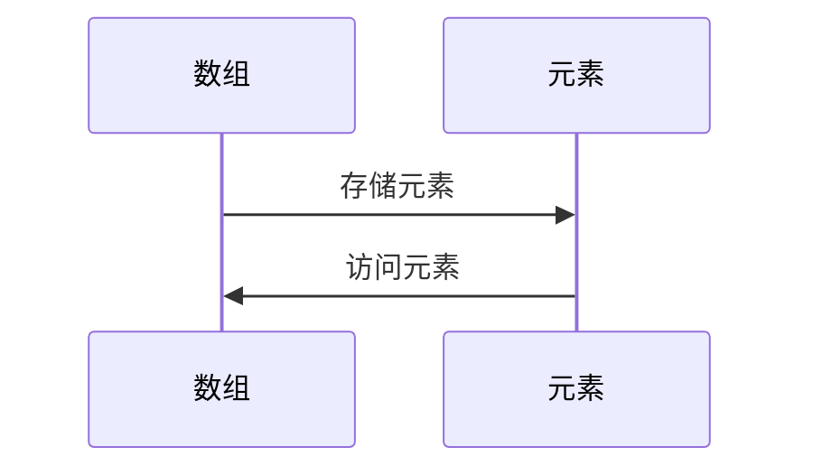

1.1.1.1.2 链表

链表是一种动态大小的线性表，由一系列节点组成，每个节点包含数据和一个指向下一个节点的指针。

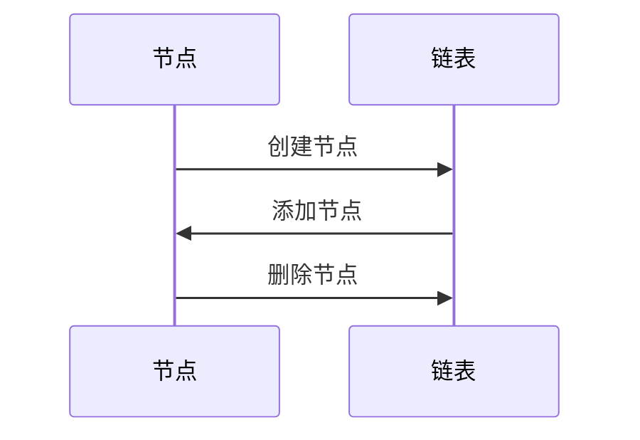

##### 1.1.1.2 树与图

树和图是另一种重要的数据结构，它们广泛应用于图论和算法设计中。

###### 1.1.2.1 二叉树

二叉树是一种特殊的树结构，每个节点最多有两个子节点。常见的二叉树有：

1.1.2.1.1 二叉搜索树

二叉搜索树是一种特殊的二叉树，左子节点的值小于根节点的值，右子节点的值大于根节点的值。

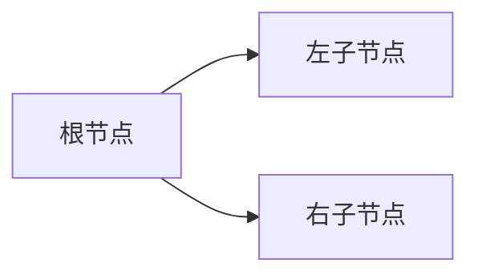

1.1.2.1.2 平衡二叉树（AVL树）

平衡二叉树是一种特殊的二叉搜索树，它通过平衡因子来保持树的平衡，以优化搜索、插入和删除操作的时间复杂度。

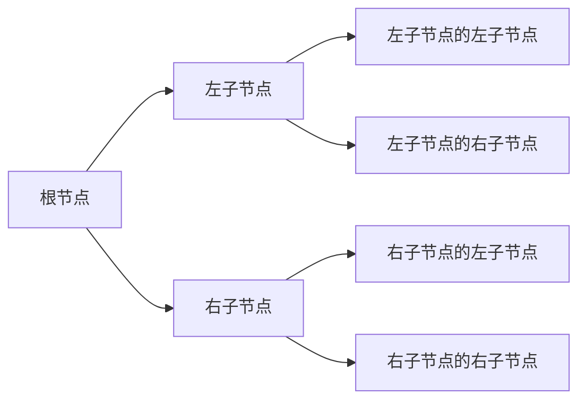

###### 1.1.2.2 图

图是一种由节点（或称为顶点）和边组成的无序集合，它广泛应用于网络、社交网络和图论等领域。

1.1.2.2.1 有向图与无向图

有向图是图的边的方向已确定的图，而无向图的边的方向是未确定的。


1.1.2.2.2 深度优先搜索（DFS）

深度优先搜索是一种用于遍历图的算法，它从起始顶点开始，沿着路径一直深入到不能再深入为止，然后回溯并探索其他路径。

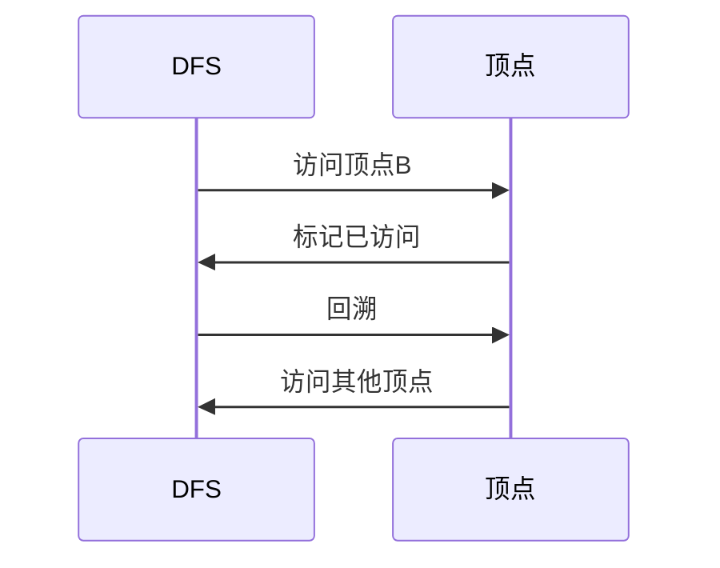

1.1.2.2.3 广度优先搜索（BFS）

广度优先搜索是一种用于遍历图的算法，它与深度优先搜索不同，它按照层次遍历图的节点。

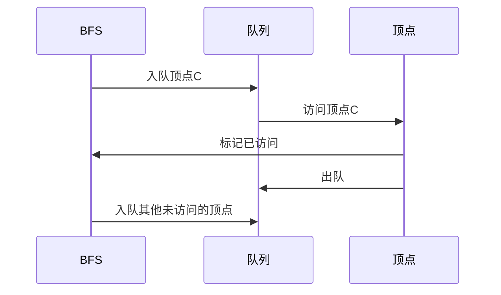

##### 1.1.3 常见算法

常见算法是面试中经常出现的问题，以下是一些常见的算法：

###### 1.1.3.1 排序算法

排序算法是将一组数据按照特定顺序排列的算法。以下是一些常见的排序算法：

1.1.3.1.1 冒泡排序

冒泡排序是一种简单的排序算法，它通过重复地交换相邻的两个元素，直到整个序列有序。

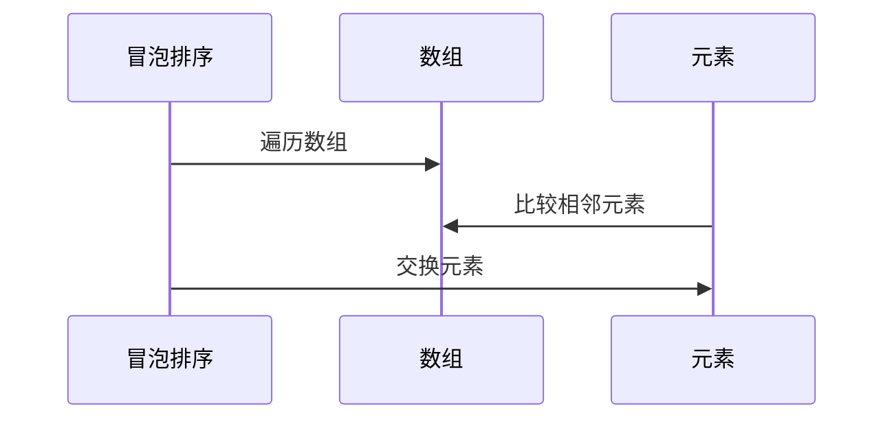

1.1.3.1.2 选择排序

选择排序是一种简单的排序算法，它通过每次从未排序的部分选择最小（或最大）的元素，将其放到已排序部分的末尾。

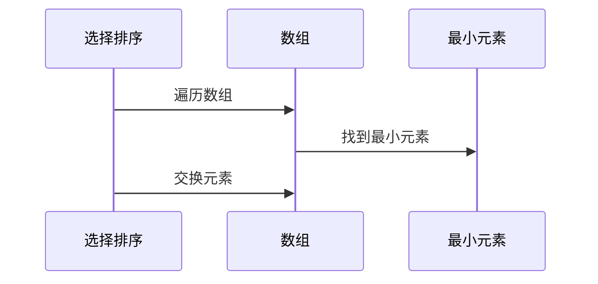

1.1.3.1.3 插入排序

插入排序是一种简单的排序算法，它通过将未排序的部分中的每个元素插入到已排序的部分中，直到整个序列有序。

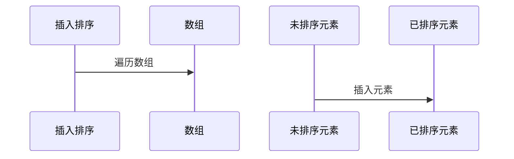

1.1.3.1.4 快速排序

快速排序是一种高效的排序算法，它通过递归地将数组分成较小的子数组，并对这些子数组进行排序。

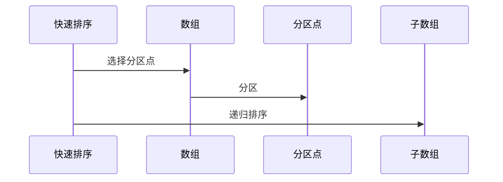

###### 1.1.3.2 查找算法

查找算法是用于在数据结构中查找特定元素的算法。以下是一些常见的查找算法：

1.1.3.2.1 顺序查找

顺序查找是一种简单但效率较低的查找算法，它从数据结构中的第一个元素开始，依次查找，直到找到目标元素或到达数据结构末尾。

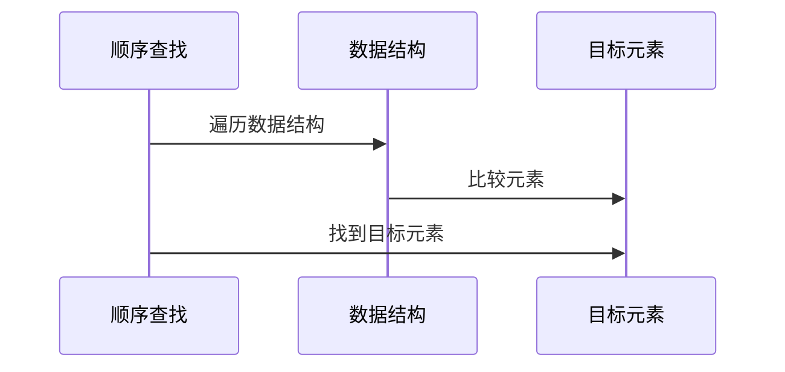

1.1.3.2.2 二分查找

二分查找是一种高效的查找算法，它通过对数据结构进行递归或迭代划分，每次都将查找范围缩小一半，直到找到目标元素或确定目标元素不存在。

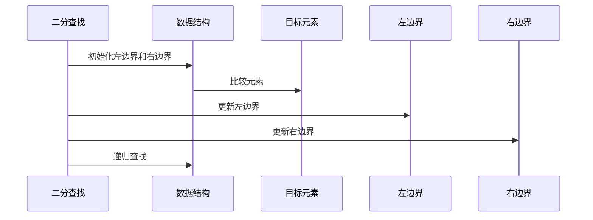

**1.2 计算机网络基础**

计算机网络是计算机科学与技术的重要组成部分，它涉及到多个层次和协议。以下是一些计算机网络的基础知识：

##### 1.2.1 网络协议与体系结构

网络协议是计算机网络中不同设备之间通信的规则，而网络体系结构则是这些协议的组织结构。常见的网络协议与体系结构有：

###### 1.2.1.1 TCP/IP协议栈

TCP/IP协议栈是一种网络协议体系结构，它定义了从物理层到应用层的各个层次及其协议。

1.2.1.1.1 网络层

网络层负责数据包的传输和路由选择，其中最重要的协议是IP协议。

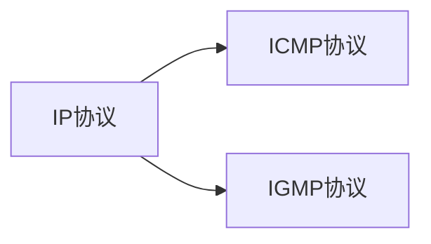

1.2.1.1.2 传输层

传输层负责端到端的数据传输，其中最重要的协议是TCP和UDP。

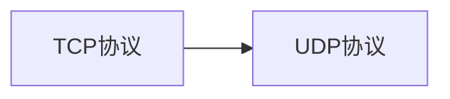

1.2.1.1.3 应用层

应用层负责为应用程序提供网络服务，其中最重要的协议是HTTP、FTP和SMTP。

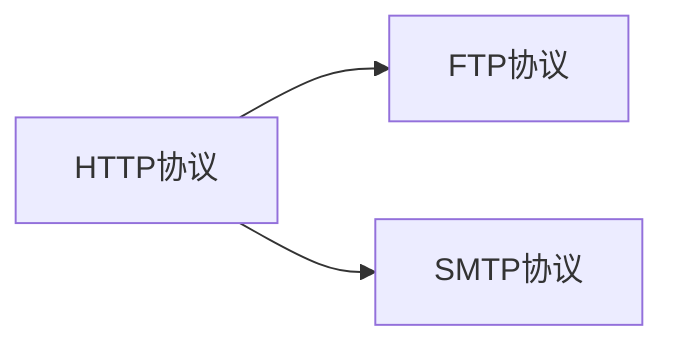

##### 1.2.2 网络安全

网络安全是计算机网络中至关重要的一个方面，它涉及到多种技术措施和策略。以下是一些网络安全的基础知识：

###### 1.2.2.1 加密与解密

加密是将数据转换为不可读形式的过程，而解密是将加密数据转换为原始形式的过程。以下是一些常见的加密与解密技术：

1.2.2.1.1 对称加密算法

对称加密算法使用相同的密钥进行加密和解密，常见的对称加密算法有DES、AES等。

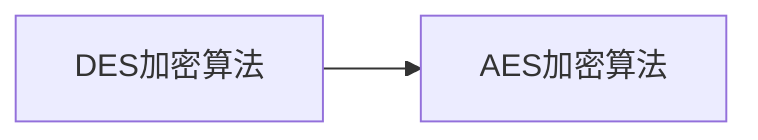

1.2.2.1.2 非对称加密算法

非对称加密算法使用不同的密钥进行加密和解密，常见的非对称加密算法有RSA、ECC等。

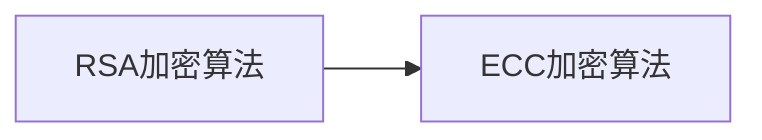

1.2.2.1.3 教堂加密算法

教堂加密算法是一种基于密码学的安全通信协议，它使用公钥加密和私钥解密，确保通信的安全性。

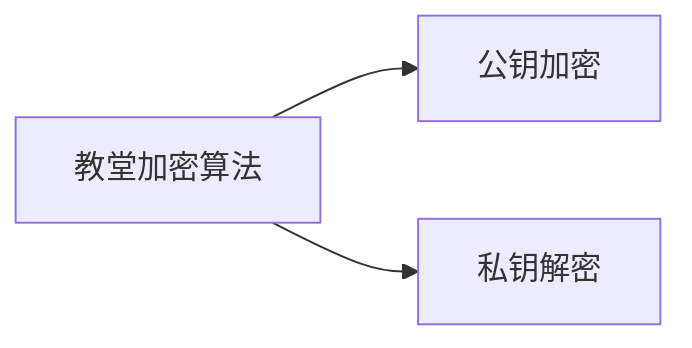

###### 1.2.2.2 认证与授权

认证与授权是网络安全中的重要环节，它确保只有授权用户可以访问系统和资源。以下是一些常见的认证与授权技术：

1.2.2.2.1 单点登录（SSO）

单点登录是一种身份验证机制，它允许用户在多个系统中使用一个账户进行登录，从而简化登录过程。

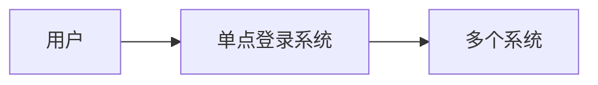

1.2.2.2.2 OAuth 2.0协议

OAuth 2.0是一种授权协议，它允许第三方应用访问用户资源，而不需要用户的账户密码。

```mermaid
graph LR
A[用户]
B[第三方应用]
C[资源服务器]
D[授权服务器]
A-->B
B-->C
B-->D
```

**1.3 操作系统基础**

操作系统是计算机系统的重要组成部分，它负责管理和协调计算机硬件和软件资源。以下是一些操作系统的基础知识：

##### 1.3.1 进程与线程

进程和线程是操作系统中用于并发执行的基本单元。以下是一些关于进程和线程的基础知识：

###### 1.3.1.1 进程

进程是操作系统中正在运行的程序实例，它具有独立的内存空间和系统资源。以下是一些关于进程的基础知识：

1.3.1.1.1 进程的概念

进程是操作系统中正在运行的程序实例，它具有独立的内存空间和系统资源。

1.3.1.1.2 进程的状态转换

进程在其生命周期中可能经历多种状态，如创建、就绪、运行、阻塞和终止等。

```mermaid
graph LR
A[创建]
B[就绪]
C[运行]
D[阻塞]
E[终止]
A-->B
B-->C
C-->D
D-->E
```

1.3.1.1.3 进程的调度策略

进程的调度策略决定了进程在CPU上的执行顺序，常见的调度策略有先来先服务（FCFS）、短作业优先（SJF）和优先级调度等。

```mermaid
graph LR
A[先来先服务]
B[短作业优先]
C[优先级调度]
A-->B
B-->C
```

###### 1.3.1.2 线程

线程是操作系统中用于并发执行的基本单元，它是进程的一部分，共享进程的内存空间和其他资源。以下是一些关于线程的基础知识：

1.3.1.2.1 线程的概念

线程是操作系统中用于并发执行的基本单元，它是进程的一部分，共享进程的内存空间和其他资源。

1.3.1.2.2 线程的生命周期

线程在其生命周期中可能经历创建、就绪、运行、阻塞和终止等状态。

```mermaid
graph LR
A[创建]
B[就绪]
C[运行]
D[阻塞]
E[终止]
A-->B
B-->C
C-->D
D-->E
```

1.3.1.2.3 线程的同步与通信

线程的同步与通信是操作系统中重要的一环，它涉及到线程之间的数据共享和互斥访问。以下是一些关于线程同步与通信的基础知识：

1.3.1.2.3.1 同步原语

同步原语是线程同步的基本机制，如互斥锁（Mutex）、信号量（Semaphore）和条件变量（Condition Variable）等。

```mermaid
graph LR
A[Mutex]
B[Semaphore]
C[Condition Variable]
A-->B
A-->C
```

1.3.1.2.3.2 线程通信

线程通信是线程之间交换信息和协作的过程，常见的方法有共享内存、消息队列和管道等。

```mermaid
graph LR
A[共享内存]
B[消息队列]
C[管道]
A-->B
A-->C
```

##### 1.3.2 内存管理

内存管理是操作系统中的重要功能之一，它涉及到内存的分配、回收和优化。以下是一些关于内存管理的基础知识：

###### 1.3.2.1 虚拟内存

虚拟内存是一种内存管理技术，它通过将物理内存映射到虚拟内存空间，提供更大的内存容量和灵活性。

1.3.2.1.1 虚拟内存的工作原理

虚拟内存通过页表将虚拟地址映射到物理地址，并在内存不足时使用页面置换算法进行内存分配。

```mermaid
graph LR
A[虚拟地址]
B[物理地址]
C[页表]
D[页面置换算法]
A-->B
B-->C
C-->D
```

1.3.2.1.2 页面置换算法

页面置换算法是虚拟内存管理中的关键技术，它决定了如何选择页面进行替换。常见的页面置换算法有最优置换算法（OPT）、先进先出算法（FIFO）和最近最少使用算法（LRU）等。

```mermaid
graph LR
A[OPT]
B[FIFO]
C[LRU]
A-->B
A-->C
```

###### 1.3.2.2 堆与栈

堆和栈是程序中常用的内存分配方式，它们在内存管理中起着重要作用。以下是一些关于堆与栈的基础知识：

1.3.2.2.1 堆的概念

堆是程序在运行时动态分配的内存区域，用于存储程序的数据结构和对象。

1.3.2.2.2 栈的概念

栈是一种后进先出的数据结构，用于存储函数调用时的局部变量和返回地址。

```mermaid
graph LR
A[栈]
B[堆]
A-->B
```

1.3.2.2.3 堆与栈的内存分配机制

堆和栈在内存分配机制上有所不同。堆的分配和回收由程序员控制，而栈的分配和回收则由操作系统自动管理。

```mermaid
graph LR
A[堆分配]
B[栈分配]
A-->B
```

**1.4 编程语言基础**

编程语言是计算机科学的重要组成部分，它们提供了用于编写程序的语法和语义。以下是一些关于编程语言的基础知识：

##### 1.4.1 面向对象编程

面向对象编程是一种编程范式，它通过将数据和操作数据的方法封装在对象中，提供了一种模块化和可重用的编程方法。以下是一些关于面向对象编程的基础知识：

###### 1.4.1.1 类与对象

类是面向对象编程中的基本构建块，它定义了一组具有相同属性和行为的对象。对象是类的实例，它们具有类的属性和行为。

1.4.1.1.1 类的定义

类定义了对象的属性和行为，它是面向对象编程的基础。

1.4.1.1.2 对象的创建与销毁

对象的创建是通过类创建实例来实现的，而对象的销毁则由垃圾回收机制自动管理。

```mermaid
sequenceDiagram
    participant A as 类
    participant B as 对象
    A->>B: 创建对象
    B->>A: 使用对象
    A->>B: 销毁对象
```

###### 1.4.1.2 继承与多态

继承和多态是面向对象编程中的核心概念，它们提供了代码复用和灵活性。以下是一些关于继承与多态的基础知识：

1.4.1.2.1 继承的概念

继承是一种通过创建子类来扩展基类的方法，子类继承了基类的属性和方法。

1.4.1.2.2 多态的实现方式

多态是指同一操作作用于不同的对象时可以有不同的解释和结果。多态的实现方式包括方法重写、接口和抽象类。

```mermaid
sequenceDiagram
    participant A as 基类
    participant B as 子类
    participant C as 客户端
    A->>B: 继承基类
    B->>C: 实现多态
    C->>A: 调用基类方法
    C->>B: 调用子类方法
```

##### 1.4.2 函数式编程

函数式编程是一种编程范式，它通过将程序组织为一系列函数的调用，避免了状态和变量的使用。以下是一些关于函数式编程的基础知识：

###### 1.4.2.1 函数式编程的概念

函数式编程是一种编程范式，它通过将程序组织为一系列函数的调用，避免了状态和变量的使用。

1.4.2.1.1 高阶函数

高阶函数是能够接受函数作为参数或返回函数的函数，它是函数式编程的核心概念。

1.4.2.1.2 函数组合

函数组合是将多个函数组合成一个新的函数，它允许程序员以模块化和可重用的方式构建复杂的函数。

```mermaid
sequenceDiagram
    participant A as 函数1
    participant B as 函数2
    participant C as 函数组合
    A->>B: 组合函数
    B->>C: 返回组合后的函数
    C->>A: 调用组合后的函数
```

1.4.2.1.3 柯里化

柯里化是一种将函数转换为多个参数组合的方式，它允许程序员以参数化的方式处理函数，从而提高代码的可读性和可维护性。

```mermaid
sequenceDiagram
    participant A as 函数
    participant B as 柯里化后的函数
    A->>B: 柯里化函数
    B->>A: 返回柯里化后的函数
    A->>B: 调用柯里化后的函数
```

##### 1.4.3 面向对象与函数式编程的比较

面向对象编程和函数式编程是两种不同的编程范式，它们各有优缺点。以下是对这两种编程范式的比较：

1.4.3.1 优点

- 面向对象编程的优点包括模块化、代码重用、封装性和可维护性。
- 函数式编程的优点包括纯函数、不可变性和引用透明性。

1.4.3.2 缺点

- 面向对象编程的缺点包括继承导致的紧耦合和单例模式的使用。
- 函数式编程的缺点包括递归调用的性能问题和副作用的处理。

1.4.3.3 适用场景

- 面向对象编程适用于大型项目和复杂系统的开发。
- 函数式编程适用于需要高性能和并发处理的场景，如大数据处理和分布式系统。

**1.5 软件工程基础**

软件工程是计算机科学中的重要分支，它涉及到软件开发的方法、过程、工具和资源。以下是一些关于软件工程的基础知识：

##### 1.5.1 软件开发方法

软件开发方法是一种指导软件开发过程的方法论，它提供了软件开发的流程、规范和最佳实践。以下是一些常见的软件开发方法：

###### 1.5.1.1 水晶模型

水晶模型是一种迭代和增量的软件开发方法，它将软件开发过程划分为多个阶段，并在每个阶段进行迭代和改进。

1.5.1.1.1 水晶模型的阶段

水晶模型包括需求分析、系统设计、编码实现、测试与部署等阶段。

1.5.1.1.2 水晶模型的优势与局限性

- 水晶模型的优势包括灵活性、可维护性和可扩展性。
- 水晶模型的局限性包括开发周期较长和需要大量文档。

###### 1.5.1.2 螺旋模型

螺旋模型是一种迭代和风险驱动的软件开发方法，它通过不断迭代和评估风险，确保软件的质量和可靠性。

1.5.1.2.1 螺旋模型的阶段

螺旋模型包括需求分析、系统设计、开发、测试和评估等阶段。

1.5.1.2.2 螺旋模型的优势与局限性

- 螺旋模型的优势包括风险管理和灵活性。
- 螺旋模型的局限性包括开发成本较高和需要丰富的项目管理经验。

##### 1.5.2 代码质量保障

代码质量保障是软件开发过程中确保代码质量的一系列活动和措施。以下是一些关于代码质量保障的基础知识：

###### 1.5.2.1 单元测试

单元测试是针对程序中最小的可测试单元（通常是函数或方法）进行测试，以确保其正确性和可靠性。

1.5.2.1.1 单元测试的概念

单元测试是一种自动化测试方法，它通过编写测试用例来验证函数或方法的正确性。

1.5.2.1.2 单元测试的实施

单元测试的实施包括编写测试用例、执行测试用例和报告测试结果等步骤。

```mermaid
sequenceDiagram
    participant A as 测试人员
    participant B as 单元测试框架
    participant C as 程序代码
    A->>B: 编写测试用例
    B->>C: 执行测试用例
    B->>A: 报告测试结果
```

###### 1.5.2.2 代码审查

代码审查是一种通过团队协作来确保代码质量的方法，它包括代码评审和代码重构等步骤。

1.5.2.2.1 代码审查的概念

代码审查是一种通过团队协作来确保代码质量的方法，它包括代码评审和代码重构等步骤。

1.5.2.2.2 代码审查的流程

代码审查的流程包括代码提交、代码评审、代码重构和代码合并等步骤。

```mermaid
sequenceDiagram
    participant A as 开发人员
    participant B as 代码审查团队
    participant C as 代码库
    A->>C: 提交代码
    B->>A: 审查代码
    A->>B: 重构代码
    B->>C: 合并代码
```

##### 1.5.3 软件性能优化

软件性能优化是提高软件运行效率和质量的一系列方法和技巧。以下是一些关于软件性能优化的基础知识：

###### 1.5.3.1 常见性能瓶颈

常见性能瓶颈包括CPU性能瓶颈、内存性能瓶颈和网络性能瓶颈等。

1.5.3.1.1 CPU性能瓶颈

CPU性能瓶颈是由于CPU计算能力不足导致的，常见的解决方法包括并行计算和优化算法。

1.5.3.1.2 内存性能瓶颈

内存性能瓶颈是由于内存访问速度不足导致的，常见的解决方法包括内存优化和缓存技术。

1.5.3.1.3 网络性能瓶颈

网络性能瓶颈是由于网络带宽和延迟不足导致的，常见的解决方法包括网络优化和负载均衡。

###### 1.5.3.2 性能优化策略

性能优化策略包括预编译、缓存技术和并发优化等。

1.5.3.2.1 预编译

预编译是将代码在编译时进行优化，以提高执行效率。常见的预编译技术包括循环展开、内联函数和编译器优化等。

1.5.3.2.2 缓存技术

缓存技术是一种将数据存储在高速存储介质中的方法，以减少访问延迟和提高访问效率。常见的缓存技术包括缓存层、缓存算法和缓存一致性等。

1.5.3.2.3 并发优化

并发优化是一种通过并行处理来提高程序执行效率的方法。常见的并发优化技术包括线程池、并发集合和锁机制

