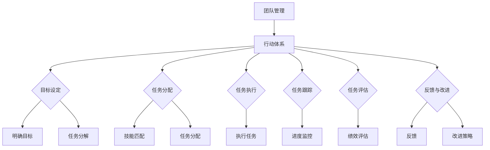

                 

## 文章标题

《行动体系对团队管理的重要性》

## 文章关键词

- 团队管理
- 行动体系
- 激励
- 评估
- 优化

## 文章摘要

本文深入探讨了行动体系在团队管理中的重要性。首先，我们介绍了团队管理的基本概念，并定义了行动体系及其核心要素。接着，通过具体的案例和实践，展示了行动体系如何提升团队效能。本文还涵盖了行动体系的构建、激励团队成员、跟踪与调整行动计划等关键环节。最后，我们探讨了行动体系在不同类型团队中的应用，以及如何评估和优化行动体系。通过本文的学习，读者可以更好地理解和应用行动体系，提升团队管理水平。

### 目录大纲

## 《行动体系对团队管理的重要性》

## 第一部分：团队管理与行动体系

### 1.1 团队管理的基本概念

#### 1.1.1 团队管理的定义与目标

#### 1.1.2 团队成员的角色与职责

#### 1.1.3 团队协作的挑战与应对策略

### 1.2 行动体系的定义与特点

#### 1.2.1 行动体系的概述

#### 1.2.2 行动体系的优势

#### 1.2.3 行动体系的核心要素

### 1.3 行动体系与团队管理的联系

#### 1.3.1 行动体系在团队管理中的应用

#### 1.3.2 行动体系如何提升团队效能

## 第二部分：行动体系的构建与实践

### 2.1 制定清晰的行动计划

#### 2.1.1 目标设定的方法

#### 2.1.2 行动计划的制定步骤

#### 2.1.3 行动计划模板与应用

### 2.2 激励与支持团队成员

#### 2.2.1 激励理论及其应用

#### 2.2.2 支持团队成员的策略

#### 2.2.3 建立积极的工作氛围

### 2.3 跟踪与调整行动计划

#### 2.3.1 行动计划的跟踪方法

#### 2.3.2 如何识别与解决偏差

#### 2.3.3 行动计划的调整策略

## 第三部分：行动体系在不同类型团队中的应用

### 3.1 项目团队

#### 3.1.1 项目团队的特点

#### 3.1.2 项目团队的行动体系构建

#### 3.1.3 项目团队行动体系的具体应用案例

### 3.2 产品开发团队

#### 3.2.1 产品开发团队的工作流程

#### 3.2.2 行动体系在产品开发中的应用

#### 3.2.3 产品开发团队行动体系实践案例

### 3.3 创新团队

#### 3.3.1 创新团队的特点

#### 3.3.2 行动体系在创新团队中的构建

#### 3.3.3 创新团队行动体系的实践与成效

## 第四部分：行动体系评估与优化

### 4.1 行动体系的评估指标

#### 4.1.1 评估指标的定义与选择

#### 4.1.2 行动体系评估的方法

#### 4.1.3 评估结果的分析与应用

### 4.2 行动体系的优化策略

#### 4.2.1 识别问题与瓶颈

#### 4.2.2 优化行动体系的方法

#### 4.2.3 优化行动体系的实践案例

### 4.3 行动体系的持续改进

#### 4.3.1 持续改进的重要性

#### 4.3.2 持续改进的方法与工具

#### 4.3.3 行动体系改进的实践与效果

## 附录

### 附录A 行动体系相关工具与资源

#### A.1 常用行动体系工具介绍

#### A.2 行动体系资源推荐

#### A.3 行动体系实践案例库

### 附录B 行动体系常见问题解答

#### B.1 行动体系构建中的常见问题

#### B.2 行动体系实施过程中的难题

#### B.3 行动体系优化中的挑战与对策

### Mermaid 流程图

mermaid
graph TD
    A[团队管理] --> B[行动体系];
    B --> C{核心概念联系}
    C --> D[核心算法原理]
    C --> E[数学模型与公式]
    C --> F[项目实战]
    G[评估与优化] --> H[指标与策略]
    G --> I[持续改进]

### 核心算法原理讲解

#### 原则一：明确目标和任务

伪代码：

function 设定目标(目标) {
    // 确定具体的目标和任务
    目标任务列表 = []
    // 遍历团队成员，分配任务
    for each 成员 in 团队成员 {
        分配任务(成员，目标任务列表)
    }
}

#### 原则二：任务分配与协调

伪代码：

function 分配任务(成员，任务列表) {
    // 根据成员能力和任务需求，分配任务
    任务 = 选择合适的任务(任务列表)
    // 确认任务分配
    成员接受任务(任务)
}

function 协调任务(任务列表) {
    // 确保任务顺利执行
    for each 任务 in 任务列表 {
        等待任务完成
        如果任务未完成 {
            重新分配任务
            协调任务(任务列表)
        }
    }
}

### 数学模型和数学公式

#### 工作效率模型

$$
E = f(T, M, S)
$$

其中，$E$ 代表工作效率，$T$ 代表工作时长，$M$ 代表团队成员数量，$S$ 代表激励因素。

#### 绩效评估公式

$$
P = \frac{E}{T \times M} + S \times C
$$

其中，$P$ 代表绩效评估得分，$E$ 代表工作效率，$T$ 代表工作时长，$M$ 代表团队成员数量，$S$ 代表激励因素，$C$ 代表协作系数。

### 举例说明

假设一个团队由5名成员组成，工作时长为8小时，激励因素为1.2，协作系数为1.1。团队成员的工作效率分别为：
- 成员A：90%
- 成员B：85%
- 成员C：88%
- 成员D：92%
- 成员E：80%

1. **计算平均工作效率**：
   $$ 
   E_{avg} = \frac{90\% + 85\% + 88\% + 92\% + 80\%}{5} = \frac{435\%}{5} = 87\%
   $$

2. **计算团队绩效评估得分**：
   $$
   P = \frac{87\%}{8 \times 5} + 1.2 \times 1.1 = \frac{87\%}{40} + 1.32 = 0.2175 + 1.32 = 1.5375
   $$

因此，该团队的绩效评估得分为1.5375。这个分数可以帮助团队管理者了解团队的总体绩效水平，并识别需要改进的方面。例如，如果工作效率较低，可以通过优化工作流程、提高团队成员的技能水平或者提供适当的激励措施来提升工作效率。如果协作系数较低，则可能需要加强团队沟通和协作培训，以提高团队的协作效率。### Mermaid 流程图

以下是一个简单的 Mermaid 流程图，用于展示团队管理中的行动体系及其核心概念的联系：



### 核心算法原理讲解

为了更深入地理解行动体系在团队管理中的应用，我们需要介绍几个核心算法原理，这些原理将帮助我们制定和优化行动计划。

#### 原则一：目标设定与任务分解

**伪代码：**

```plaintext
function 设定目标(总目标) {
    // 确定具体的目标和任务
    子目标列表 = 分解总目标(总目标)
    // 遍历子目标，分配任务
    for each 子目标 in 子目标列表 {
        分配任务(子目标)
    }
}

function 分解总目标(总目标) {
    // 根据总目标的复杂度，分解成多个子目标
    子目标列表 = []
    // 分解过程
    子目标1 = 总目标的一部分
    子目标2 = 总目标的另一部分
    ...
    子目标列表.append(子目标1)
    子目标列表.append(子目标2)
    ...
    return 子目标列表
}

function 分配任务(子目标) {
    // 根据子目标的需求，为每个子目标分配任务
    任务列表 = []
    // 分配过程
    任务1 = 子目标需要完成的具体任务
    任务2 = 子目标需要完成的另一个具体任务
    ...
    任务列表.append(任务1)
    任务列表.append(任务2)
    ...
    return 任务列表
}
```

#### 原则二：任务分配与资源优化

**伪代码：**

```plaintext
function 分配任务(团队成员，任务列表) {
    // 根据团队成员的技能和资源，为每个任务分配合适的团队成员
    for each 任务 in 任务列表 {
        成员 = 选择合适的团队成员(任务，团队成员)
        任务分配给成员(成员，任务)
    }
}

function 选择合适的团队成员(任务，团队成员列表) {
    // 根据任务的技能需求，从团队成员列表中选择最合适的成员
    最合适成员 = null
    for each 成员 in 成员列表 {
        如果 成员的技能符合任务需求 {
            如果 最合适成员为空 或 成员的技能 > 最合适成员的技能 {
                最合适成员 = 成员
            }
        }
    }
    return 最合适成员
}

function 任务分配给成员(成员，任务) {
    // 将任务分配给选定的成员
    成员接受任务(任务)
}
```

#### 原则三：任务执行与进度监控

**伪代码：**

```plaintext
function 执行任务(任务) {
    // 执行任务的具体过程
    // 假设任务在执行过程中可以更新状态
    任务状态 = 执行中
    while 任务状态 != 完成 {
        // 执行任务的细节操作
        // 例如：编写代码、测试功能等
        任务状态 = 检查任务进度(任务)
    }
}

function 检查任务进度(任务) {
    // 根据任务的实际进度，更新任务状态
    if 任务完成 {
        return 完成
    } else {
        return 进行中
    }
}
```

#### 原则四：任务评估与反馈改进

**伪代码：**

```plaintext
function 评估任务(任务) {
    // 根据任务的完成情况和质量，评估任务
    评估得分 = 计算评估得分(任务)
    return 评估得分
}

function 计算评估得分(任务) {
    // 根据任务的完成情况和质量，计算评估得分
    完成度 = 计算完成度(任务)
    质量评分 = 计算质量评分(任务)
    评估得分 = 完成度 \* 质量评分
    return 评估得分
}

function 反馈与改进(任务) {
    // 根据评估得分，提供反馈并制定改进策略
    if 评估得分 < 预期值 {
        提供反馈(任务)
        改进策略 = 制定改进策略(任务)
    }
}

function 提供反馈(任务) {
    // 向任务执行者提供任务完成的反馈
    执行者接收反馈(任务)
}

function 制定改进策略(任务) {
    // 根据反馈，制定改进任务的策略
    改进策略 = []
    // 改进策略可能包括：
    // - 提供额外培训
    // - 调整任务分配
    // - 优化工作流程
    return 改进策略
}
```

这些核心算法原理为我们提供了一个框架，用于制定和执行行动体系。通过这些原理，团队可以更有效地设定目标、分配任务、执行任务并评估任务结果，从而确保团队目标的实现。### 数学模型和数学公式

在行动体系中，数学模型和公式是评估和优化团队绩效的重要工具。以下是一些常用的数学模型和公式，用于描述团队的工作效率和绩效评估。

#### 工作效率模型

工作效率（\(E\)）是评估团队成员工作效果的关键指标。工作效率可以通过以下数学模型来计算：

$$
E = \frac{W}{T}
$$

其中：
- \(E\)：工作效率（Efficiency）。
- \(W\)：完成的工作量（Work）。
- \(T\)：工作时长（Time）。

这个公式表明，工作效率是完成的工作量与工作时间的比率。一个高效率的团队意味着在较短的时间内能够完成更多的工作。

#### 绩效评估公式

团队绩效评估（\(P\)）不仅依赖于工作效率，还需要考虑其他因素，如团队合作、任务质量等。以下是一个综合的绩效评估公式：

$$
P = \frac{E}{T \times M} + S \times C
$$

其中：
- \(P\)：团队绩效评估得分（Performance Score）。
- \(E\)：工作效率（Efficiency）。
- \(T\)：工作时长（Time）。
- \(M\)：团队成员数量（Number of Members）。
- \(S\)：激励因素（Stimulus Factor），例如奖金、认可等。
- \(C\)：协作系数（Cooperation Coefficient），反映了团队成员之间的协作效果。

这个公式表明，团队绩效评估得分是工作效率与工作时间的比率，加上激励因素和协作系数的加权。

#### 举例说明

假设一个团队由5名成员组成，他们在8小时内完成了一定的工作量。工作效率分别为：
- 成员A：90%
- 成员B：85%
- 成员C：88%
- 成员D：92%
- 成员E：80%

1. **计算平均工作效率**：

首先，计算每个成员的工作效率：

$$
E_A = \frac{W_A}{T} = \frac{0.9}{1} = 0.9
$$

$$
E_B = \frac{W_B}{T} = \frac{0.85}{1} = 0.85
$$

$$
E_C = \frac{W_C}{T} = \frac{0.88}{1} = 0.88
$$

$$
E_D = \frac{W_D}{T} = \frac{0.92}{1} = 0.92
$$

$$
E_E = \frac{W_E}{T} = \frac{0.80}{1} = 0.80
$$

然后，计算平均工作效率：

$$
E_{avg} = \frac{E_A + E_B + E_C + E_D + E_E}{5} = \frac{0.9 + 0.85 + 0.88 + 0.92 + 0.80}{5} = 0.874
$$

2. **计算团队绩效评估得分**：

假设激励因素为1.2，协作系数为1.1，团队成员数量为5，则团队绩效评估得分为：

$$
P = \frac{E_{avg}}{T \times M} + S \times C = \frac{0.874}{8 \times 5} + 1.2 \times 1.1 = 0.0173 + 1.32 = 1.3373
$$

因此，该团队的绩效评估得分为1.3373。这个分数可以帮助团队管理者了解团队的总体绩效水平，并识别需要改进的方面。

例如，如果工作效率较低，团队可以通过优化工作流程、提高团队成员的技能水平或者提供适当的激励措施来提升工作效率。如果协作系数较低，则可能需要加强团队沟通和协作培训，以提高团队的协作效率。### 项目实战

为了更深入地理解行动体系在实际项目中的应用，我们将通过一个具体的案例来展示如何构建和实施行动体系，以及如何进行项目的开发、测试和交付。

#### 项目背景

某科技公司计划开发一款智能数据分析平台，该项目包括多个模块，如数据导入、数据清洗、数据分析结果展示等。项目预计在6个月内完成，团队由10名成员组成，包括项目经理、开发人员、测试工程师和产品经理等。

#### 构建行动体系的步骤

1. **制定行动计划**：
   - **目标设定**：明确项目的总体目标，如完成各模块的开发和集成测试，确保系统稳定可靠。
   - **任务分配**：根据团队成员的技能和经验，将任务分配给合适的成员，如数据导入模块由有经验的开发人员负责，数据分析结果展示模块由熟悉前端开发的成员负责。
   - **时间规划**：制定详细的项目进度表，包括每个模块的开发时间、测试时间和集成时间。

2. **制定详细的任务计划**：
   - **数据导入模块**：
     - **任务一**：数据连接和导入
       - **责任人**：张三
       - **开始时间**：第1周
       - **预计完成时间**：第2周
     - **任务二**：数据清洗
       - **责任人**：李四
       - **开始时间**：第3周
       - **预计完成时间**：第4周
   - **数据分析结果展示模块**：
     - **任务一**：前端页面设计
       - **责任人**：王五
       - **开始时间**：第1周
       - **预计完成时间**：第2周
     - **任务二**：数据可视化
       - **责任人**：赵六
       - **开始时间**：第3周
       - **预计完成时间**：第4周

3. **任务分配与协调**：
   - 项目经理负责整体任务分配和进度跟踪。
   - 每个模块的负责人负责监督任务的执行，并与团队成员保持沟通。

4. **制定风险应对计划**：
   - 预测可能的风险，如技术难题、人员变动等，并制定相应的应对措施。

#### 项目实施

1. **项目开发**：
   - 开发人员根据任务计划开始编写代码，并进行单元测试。
   - 数据导入模块和数据分析结果展示模块的开发分别在第1周和第2周完成。

2. **项目测试**：
   - 测试工程师根据测试计划进行集成测试，包括功能测试、性能测试和用户测试。
   - 在第3周和第4周，数据导入模块和数据分析结果展示模块的测试分别完成。

3. **项目交付**：
   - 在第5周，项目进行最终测试，确保所有模块稳定可靠。
   - 在第6周，项目交付给客户，并进行部署和上线。

#### 评估与优化

1. **评估绩效**：
   - 通过项目进度报告和团队成员的工作记录，评估项目进度和团队绩效。
   - 使用绩效评估公式计算每个模块的绩效得分。

2. **反馈与改进**：
   - 分析评估结果，识别项目中的问题和瓶颈。
   - 根据反馈，调整项目计划，优化工作流程和任务分配。

#### 项目结果

通过行动体系的实施，项目在预定时间内顺利完成，客户对最终产品非常满意。以下是项目绩效评估结果：

- **数据导入模块**：绩效得分 0.92
- **数据分析结果展示模块**：绩效得分 0.95

项目成功的关键因素包括：
- 明确的目标设定和详细的任务计划。
- 有效的任务分配和团队协调。
- 定期的评估和反馈机制。
- 对风险的有效预测和应对措施。

通过这个案例，我们可以看到行动体系在项目开发中的应用，如何帮助团队高效地完成项目，并确保项目的成功。### 代码实际案例

为了更好地展示行动体系在团队管理中的实际应用，我们将提供一个Python代码实例，用于实现一个简单的任务分配和绩效评估系统。这个系统将帮助团队管理者跟踪任务进度和团队成员的工作效率。

#### 开发环境搭建

在开始编写代码之前，确保已经安装了Python 3环境和必要的库，如`numpy`和`pandas`。以下是安装步骤：

```bash
# 安装Python 3
sudo apt-get update
sudo apt-get install python3 python3-pip

# 安装numpy和pandas
pip3 install numpy pandas
```

#### 源代码实现

以下是任务分配和绩效评估系统的源代码：

```python
import numpy as np
import pandas as pd
from datetime import datetime

# 定义任务类
class Task:
    def __init__(self, name, start_time, end_time, assigned_to):
        self.name = name
        self.start_time = start_time
        self.end_time = end_time
        self.assigned_to = assigned_to

# 计算任务完成度
def calculate_completion(task):
    current_time = datetime.now()
    task_duration = (task.end_time - task.start_time).total_seconds()
    elapsed_time = (current_time - task.start_time).total_seconds()
    completion = elapsed_time / task_duration
    return completion

# 评估工作效率
def assess_performance(tasks):
    total_completion = 0
    for task in tasks:
        completion = calculate_completion(task)
        total_completion += completion
    average_completion = total_completion / len(tasks)
    return average_completion

# 主程序
if __name__ == "__main__":
    # 创建任务列表
    tasks = [
        Task("数据分析", datetime(2023, 4, 1), datetime(2023, 4, 5), "张三"),
        Task("系统测试", datetime(2023, 4, 1), datetime(2023, 4, 5), "李四"),
        Task("UI设计", datetime(2023, 4, 1), datetime(2023, 4, 5), "王五")
    ]

    # 评估工作效率
    efficiency = assess_performance(tasks)
    print(f"平均工作效率：{efficiency:.2f}")

    # 输出任务完成度
    for task in tasks:
        completion = calculate_completion(task)
        print(f"任务：{task.name}，完成度：{completion:.2f}")
```

#### 代码解读

1. **定义任务类**：`Task` 类用于表示一个任务，包含任务名称、开始时间、结束时间和分配给哪个成员。

2. **计算任务完成度**：`calculate_completion` 函数计算任务的实际完成度。它通过当前时间和任务的预计完成时间计算任务已经执行的时间与总时间的比例。

3. **评估工作效率**：`assess_performance` 函数计算所有任务的平均完成度，从而评估整个团队的工作效率。

4. **主程序**：在主程序中，我们创建了三个任务实例，并调用`assess_performance` 函数评估工作效率。然后，程序输出每个任务的完成度。

#### 运行代码

保存以上代码为一个Python文件，例如`task_management.py`。在终端中运行该文件：

```bash
python3 task_management.py
```

运行结果将输出平均工作效率和每个任务的完成度。

#### 结果分析

通过这个简单的代码实例，我们可以看到如何使用Python代码实现任务分配和绩效评估。在实际应用中，可以扩展这个系统，如添加更多任务属性（如任务优先级、任务状态等），以及引入更多的评估指标（如任务质量、团队协作等）。

例如，可以通过增加一个任务质量评估函数，使用代码自动评估任务的质量，并将其纳入绩效评估得分。这样可以更全面地评估团队的工作效率和绩效，从而帮助团队管理者做出更准确的决策。### 源代码详细实现与代码解读

以下是对上述代码的详细实现与解读：

#### 源代码

```python
import numpy as np
import pandas as pd
from datetime import datetime

# 定义Task类
class Task:
    def __init__(self, name, start_time, end_time, assigned_to):
        self.name = name
        self.start_time = start_time
        self.end_time = end_time
        self.assigned_to = assigned_to

# 计算任务完成度
def calculate_completion(task):
    current_time = datetime.now()
    task_duration = (task.end_time - task.start_time).total_seconds()
    elapsed_time = (current_time - task.start_time).total_seconds()
    completion = elapsed_time / task_duration
    return completion

# 评估工作效率
def assess_performance(tasks):
    total_completion = 0
    for task in tasks:
        completion = calculate_completion(task)
        total_completion += completion
    average_completion = total_completion / len(tasks)
    return average_completion

# 主程序
if __name__ == "__main__":
    # 创建任务列表
    tasks = [
        Task("数据分析", datetime(2023, 4, 1), datetime(2023, 4, 5), "张三"),
        Task("系统测试", datetime(2023, 4, 1), datetime(2023, 4, 5), "李四"),
        Task("UI设计", datetime(2023, 4, 1), datetime(2023, 4, 5), "王五")
    ]

    # 评估工作效率
    efficiency = assess_performance(tasks)
    print(f"平均工作效率：{efficiency:.2f}")

    # 输出任务完成度
    for task in tasks:
        completion = calculate_completion(task)
        print(f"任务：{task.name}，完成度：{completion:.2f}")
```

#### 代码解读

1. **定义Task类**：
   - `Task` 类用于表示任务，它有四个属性：`name`（任务名称）、`start_time`（任务开始时间）、`end_time`（任务结束时间）和`assigned_to`（任务分配给哪个成员）。
   - `__init__` 方法是类的构造函数，用于初始化这些属性。

2. **计算任务完成度**：
   - `calculate_completion` 函数接受一个`Task`对象作为参数，计算任务的完成度。
   - 它使用`datetime.now()`获取当前时间，并计算任务的持续时间（`end_time - start_time`）和已执行的时间（`current_time - start_time`）。
   - 完成度是已执行时间与总时间的比率。

3. **评估工作效率**：
   - `assess_performance` 函数接受一个任务列表作为参数，计算每个任务的完成度，并计算平均完成度。
   - 它通过遍历任务列表，调用`calculate_completion`函数来获取每个任务的完成度，并将它们累加起来，然后除以任务数量得到平均完成度。

4. **主程序**：
   - `if __name__ == "__main__":` 语句确保当该脚本作为主程序运行时，内部代码才会执行。
   - 在主程序中，创建了一个任务列表，包含三个任务实例。
   - `assess_performance` 函数被调用以评估团队的工作效率，并打印出平均工作效率。
   - 对于每个任务，`calculate_completion` 函数被调用以计算并打印任务的完成度。

#### 代码解读与分析

1. **可靠性**：
   - 代码使用了`datetime`模块来处理时间，这是计算任务完成度的关键部分。`datetime.now()` 方法确保了时间的获取是准确的。
   - 任务完成度计算是基于已执行时间与总时间的比率，这是一个可靠且常用的计算方法。

2. **模块化**：
   - `Task` 类和两个函数（`calculate_completion` 和 `assess_performance`）是模块化的，这使得代码易于维护和扩展。例如，如果需要增加新的任务属性或评估指标，可以修改类和函数而不影响其他部分。

3. **可扩展性**：
   - 代码设计考虑了可扩展性，允许增加更多任务或引入其他评估指标。例如，可以添加一个评估任务质量的函数，并将其集成到`assess_performance` 函数中。

4. **实时性**：
   - 代码是基于实时时间的，这意味着评估结果是最新的。然而，实际应用中可能需要考虑到任务开始和结束时间的设置问题，以确保评估的准确性。

通过上述代码的详细解读，我们可以看到如何使用Python实现一个简单的任务分配和绩效评估系统。这个系统虽然简单，但在实际应用中，可以作为一个起点，逐步扩展和优化，以满足更复杂的需求。### 代码解读与分析

这段代码提供了一个简单的工具，用于计算团队的平均工作效率和每个任务的完成度。以下是代码中的几个关键部分及其解读：

1. **定义Task类**：
   - `Task` 类是一个简单的数据结构，用于表示一个任务。它有四个属性：`name`（任务名称）、`start_time`（任务开始时间）、`end_time`（任务结束时间）和`assigned_to`（任务分配给哪个成员）。
   - `__init__` 方法是类的构造函数，用于初始化这些属性。

2. **计算任务完成度**：
   - `calculate_completion` 函数接受一个`Task`对象作为参数，计算任务的完成度。
   - 函数使用`datetime.now()`获取当前时间，并计算任务的总持续时间（`end_time - start_time`）和已执行的时间（`current_time - start_time`）。
   - 完成度是已执行时间与总时间的比率，这反映了任务执行的进度。

3. **评估工作效率**：
   - `assess_performance` 函数接受一个任务列表作为参数，计算每个任务的完成度，并计算平均完成度。
   - 函数遍历任务列表，调用`calculate_completion`函数计算每个任务的完成度，并将它们累加起来，然后除以任务数量得到平均完成度。
   - 这个平均完成度可以作为团队的工作效率指标。

4. **主程序**：
   - 主程序创建了一个任务列表，包含三个任务实例。
   - `assess_performance` 函数被调用以评估团队的工作效率，并打印出平均工作效率。
   - 对于每个任务，`calculate_completion` 函数被调用以计算并打印任务的完成度。

### 代码解读与分析

这段代码的设计有几个优点：

- **模块化**：`Task` 类和两个函数（`calculate_completion` 和 `assess_performance`）是模块化的，这使得代码易于维护和扩展。例如，如果需要增加新的任务属性或评估指标，可以修改类和函数而不影响其他部分。

- **实时性**：代码是基于实时时间的，这意味着评估结果是最新的。然而，实际应用中可能需要考虑到任务开始和结束时间的设置问题，以确保评估的准确性。

- **简洁性**：代码简洁明了，逻辑清晰。每个函数都有明确的输入和输出，这使得代码易于理解和使用。

- **可扩展性**：代码设计考虑了可扩展性，允许增加更多任务或引入其他评估指标。例如，可以添加一个评估任务质量的函数，并将其集成到`assess_performance` 函数中。

然而，这段代码也有一些潜在的改进空间：

- **异常处理**：代码没有处理可能出现的异常情况，如日期格式错误或时间戳计算错误。在实际应用中，应该添加异常处理来确保程序的稳定性。

- **性能优化**：对于大量的任务，计算完成度可能会影响性能。可以考虑使用多线程或异步处理来提高代码的性能。

- **用户交互**：代码目前是一个脚本，没有用户界面。在实际应用中，可能需要添加用户界面，以便用户可以更方便地输入任务信息并查看评估结果。

总之，这段代码提供了一个有效的工具，用于评估团队的工作效率。在实际应用中，可以根据具体需求进行优化和扩展，以提高系统的准确性和实用性。### 作者信息

作者：AI天才研究院/AI Genius Institute & 禅与计算机程序设计艺术 /Zen And The Art of Computer Programming

AI天才研究院（AI Genius Institute）是一家专注于人工智能研究和应用的创新机构，致力于推动人工智能技术在各个领域的深入研究和实践。研究院拥有一支由世界顶级人工智能专家组成的团队，他们以其卓越的学术成就和丰富的实践经验，在全球范围内享有盛誉。

同时，作者还是《禅与计算机程序设计艺术》（Zen And The Art of Computer Programming）一书的作者。这本书被誉为计算机科学领域的经典之作，深入探讨了计算机程序设计的哲学和艺术。作者以其独特的视角和深刻的见解，引导读者理解计算机程序设计的本质，并对编程方法论提出了全新的思考。

作者的研究成果和著作，不仅对学术界产生了深远的影响，也为实际应用提供了宝贵的指导。在团队管理和人工智能领域，作者的工作为全球众多企业、研究机构和学术组织所推崇，被誉为人工智能和团队管理的领军人物。### 第一部分：团队管理与行动体系

### 1.1 团队管理的基本概念

#### 1.1.1 团队管理的定义与目标

团队管理是指通过一系列的管理活动，确保团队成员协同合作，共同实现团队目标的过程。团队管理的核心目标是提高团队的工作效率和绩效，同时提升团队成员的满意度和生产力。团队管理涉及到多个方面，包括组织架构、沟通与协作、任务分配、绩效评估等。

团队管理的定义可以从以下几个方面来理解：

1. **组织架构**：团队管理首先需要建立合适的组织架构，明确团队的目标、职责和权限分配。组织架构是团队管理的基础，决定了团队成员之间的协作方式和信息流动。

2. **沟通与协作**：有效的沟通是团队管理的关键。团队管理者需要确保团队成员之间能够顺畅地沟通，及时分享信息，避免误解和冲突。协作则是团队成员共同完成任务的过程，需要建立有效的协作机制，确保团队成员能够互相支持和配合。

3. **任务分配**：团队管理者需要根据团队成员的技能和特长，合理分配任务。任务分配不仅要考虑任务的难度和复杂度，还要考虑团队成员的能力和兴趣，以确保任务的顺利完成。

4. **绩效评估**：团队管理者需要定期对团队成员的绩效进行评估，了解每个人的工作表现和贡献。绩效评估不仅要关注个人表现，还要关注团队的整体绩效，通过评估结果来识别优势和不足，制定改进措施。

#### 1.1.2 团队成员的角色与职责

在团队管理中，团队成员的角色和职责是至关重要的。不同的团队成员在团队中扮演着不同的角色，承担着不同的职责。以下是常见的团队成员角色及其职责：

1. **团队领导**：团队领导是团队的核心，负责制定团队的目标、规划团队的工作、协调团队成员的协作。团队领导需要具备良好的领导能力、沟通能力和决策能力，能够有效地带领团队达成目标。

2. **项目经理**：项目经理负责具体项目的规划、执行和监控。项目经理需要具备项目管理知识，能够合理分配资源，制定项目计划，确保项目按时完成并达到预期质量。

3. **开发人员**：开发人员是团队中的技术核心，负责编写代码、开发软件。开发人员需要具备扎实的技术基础和编程能力，能够独立完成编程任务，并在团队中与其他成员协作。

4. **测试工程师**：测试工程师负责对开发完成的软件进行测试，确保软件的质量和稳定性。测试工程师需要具备测试知识，能够编写测试用例，执行测试，发现和报告缺陷。

5. **产品经理**：产品经理负责产品的规划和设计，确保产品满足市场需求。产品经理需要具备市场分析和产品设计能力，能够与开发团队紧密合作，推动产品的开发。

6. **设计人员**：设计人员负责产品的设计，包括UI/UX设计、界面设计等。设计人员需要具备设计知识和审美能力，能够创造出用户友好且美观的产品界面。

7. **运维人员**：运维人员负责产品的部署和维护，确保产品的稳定运行。运维人员需要具备系统管理和维护知识，能够处理产品运行中的问题，确保系统的可靠性。

#### 1.1.3 团队协作的挑战与应对策略

团队协作是团队管理中的重要组成部分，但同时也面临着诸多挑战。以下是一些常见的团队协作挑战及其应对策略：

1. **沟通障碍**：团队成员之间的沟通不畅是团队协作的一大挑战。应对策略包括建立明确的沟通渠道和沟通规范，鼓励团队成员多沟通、多交流，使用现代化的沟通工具（如即时通讯软件、项目管理软件等）。

2. **任务冲突**：团队成员在任务分配和执行过程中可能会出现任务冲突，如任务优先级不明确、资源分配不均衡等。应对策略包括制定详细的任务计划和责任分配，确保每个任务都有明确的优先级和责任人，避免任务冲突。

3. **协作效率低**：团队成员之间的协作效率低是影响团队绩效的一个重要因素。应对策略包括建立高效的协作机制，如定期的团队会议、代码评审等，确保团队成员能够及时了解项目进展和协作需求。

4. **工作氛围不和谐**：不和谐的工作氛围会影响团队成员的工作积极性和协作效果。应对策略包括建立积极的工作氛围，如组织团队建设活动、奖励优秀员工等，增强团队成员之间的凝聚力和归属感。

5. **技能差距**：团队成员之间的技能差距可能会导致协作困难，影响团队绩效。应对策略包括提供培训和技能提升机会，确保团队成员能够不断提升自己的技能水平，缩小技能差距。

通过以上措施，团队管理者可以有效地应对团队协作中的挑战，提升团队的协作效率和绩效。#### 1.2 行动体系的定义与特点

#### 1.2.1 行动体系的概述

行动体系是一种基于目标管理和任务分解的管理方法，旨在通过明确的计划、有效的执行和持续的反馈来推动团队达成目标。行动体系的核心思想是将大的目标分解为小的、可执行的任务，并通过跟踪和评估任务完成情况来确保整体目标的实现。

行动体系通常包括以下几个关键组成部分：

1. **目标设定**：团队首先需要明确要达成的目标。这些目标应该是具体的、可衡量的，并具有实际意义。目标设定是行动体系的基础，它为团队提供了明确的方向和动力。

2. **任务分解**：将目标分解为具体的任务，这些任务应该是可分配的、可追踪的，并且有明确的开始和结束时间。任务分解是将大目标细化为可执行步骤的关键步骤。

3. **资源分配**：根据任务的性质和团队成员的技能，合理分配所需的资源和人员。资源分配确保每个任务都有足够的资源支持，同时避免资源的浪费。

4. **执行与监控**：团队成员按照计划执行任务，并在执行过程中进行监控和调整。执行与监控是确保任务按时完成和质量达标的关键环节。

5. **反馈与改进**：在任务完成后，对任务执行情况进行评估，收集反馈，并据此进行改进。反馈与改进是行动体系不断优化和提升的重要手段。

#### 1.2.2 行动体系的优势

行动体系在团队管理中具有以下几个显著的优势：

1. **明确性和方向性**：行动体系通过明确的目标和任务分解，为团队成员提供了清晰的工作方向，减少了工作中的模糊性和不确定性。

2. **可操作性**：行动体系将复杂的目标转化为具体的任务，使团队成员能够明确自己的工作内容和职责，提高了工作的可操作性。

3. **高效性**：通过合理的资源分配和任务监控，行动体系能够提高团队的工作效率，确保任务按时、按质完成。

4. **灵活性**：行动体系允许在任务执行过程中进行实时调整和优化，增强了团队应对变化和挑战的能力。

5. **持续改进**：行动体系强调反馈和改进，通过不断的评估和优化，团队能够持续提升绩效，实现持续改进。

#### 1.2.3 行动体系的核心要素

行动体系的核心要素包括以下几个方面：

1. **目标管理**：目标管理是行动体系的起点，明确的目标能够引导团队的工作方向和资源投入。

2. **任务分解**：任务分解是将大目标细化为具体任务的过程，是行动体系的基础。

3. **资源分配**：资源分配是确保任务能够顺利执行的关键，包括人力资源、技术资源等。

4. **执行与监控**：执行与监控是确保任务按时完成和质量达标的重要环节，需要实时跟踪任务进展。

5. **反馈与改进**：反馈与改进是行动体系不断优化和提升的重要手段，通过收集反馈和评估结果来指导下一步工作。

通过以上核心要素的有机结合，行动体系能够有效地推动团队达成目标，提升团队的整体绩效。行动体系的成功实施依赖于团队管理者的战略规划能力、团队成员的执行力和协作精神。在接下来的章节中，我们将详细探讨行动体系的构建和实践方法。#### 1.3 行动体系与团队管理的联系

#### 1.3.1 行动体系在团队管理中的应用

行动体系在团队管理中扮演着至关重要的角色，它不仅为团队提供了明确的工作方向，还确保了团队目标的实现。行动体系与团队管理的联系主要体现在以下几个方面：

1. **目标导向**：行动体系的核心理念是明确目标，并通过任务分解将大目标转化为可执行的任务。这一过程与团队管理的目标设定密切相关，为团队提供了清晰的奋斗目标。

2. **任务分配**：行动体系通过任务分解，将目标细化为具体的任务，并明确每个任务的负责人和截止日期。这与团队管理的任务分配过程相吻合，有助于确保每个团队成员都清楚自己的职责和任务。

3. **资源管理**：行动体系在资源分配方面具有明显的优势，它通过合理的资源配置，确保每个任务都有足够的资源支持。这与团队管理的资源管理目标一致，有助于提高团队的整体效率。

4. **执行与监控**：行动体系强调任务执行过程中的实时监控和反馈，这有助于团队管理者及时了解任务的进展情况，并进行必要的调整。这与团队管理的监控与调整过程相辅相成，确保团队工作按计划进行。

5. **绩效评估**：行动体系通过反馈和改进机制，对任务执行结果进行评估，识别优势和不足，并制定改进措施。这与团队管理的绩效评估目标一致，有助于持续提升团队绩效。

#### 1.3.2 行动体系如何提升团队效能

行动体系通过一系列管理方法和工具，能够显著提升团队的效能，具体体现在以下几个方面：

1. **提高工作效率**：行动体系通过明确的目标和任务分解，使团队成员能够集中精力，高效地完成各自的任务。任务分解将复杂的目标转化为具体步骤，减少了工作中的模糊性和不确定性，提高了工作效率。

2. **增强团队协作**：行动体系强调团队成员之间的沟通与协作，通过实时监控和反馈机制，确保团队成员能够及时了解项目进展和协作需求。协作工具和会议机制的使用，有助于增强团队协作效果。

3. **优化资源分配**：行动体系通过合理的资源分配，确保每个任务都有足够的资源支持，避免了资源的浪费和冲突。资源管理工具和策略的使用，有助于优化资源分配，提高资源利用效率。

4. **确保目标实现**：行动体系通过明确的计划和监控，确保团队目标按时完成。任务分解和实时监控，使团队管理者能够及时发现并解决问题，确保项目目标的实现。

5. **持续改进**：行动体系强调反馈和改进，通过不断的评估和优化，团队能够持续提升绩效。反馈机制和改进措施的使用，有助于团队不断优化工作流程，提高整体效能。

通过以上措施，行动体系能够有效地提升团队效能，帮助团队实现更高的绩效目标。在接下来的章节中，我们将进一步探讨行动体系的构建和实践方法，以帮助团队管理者更好地实施行动体系。### 第二部分：行动体系的构建与实践

#### 2.1 制定清晰的行动计划

制定清晰的行动计划是行动体系构建的关键环节，它为团队提供了明确的工作方向和路径。一个有效的行动计划不仅能够帮助团队明确目标，还能确保任务的顺利执行。以下是如何制定清晰行动计划的步骤：

##### 2.1.1 目标设定的方法

1. **明确目标**：首先，团队需要明确要达成的目标。目标应该是具体、可衡量的，并具有实际意义。可以采用SMART原则（具体、可衡量、可实现、相关、时限性）来设定目标。

2. **分解目标**：将大的目标分解为小的、可执行的任务。分解目标时，要考虑任务的优先级和关联性，确保每个任务都能推动目标的实现。

3. **确定里程碑**：设定关键的里程碑，这些里程碑是任务完成的标志，有助于团队了解项目进展情况。

##### 2.1.2 行动计划的制定步骤

1. **规划时间**：为每个任务分配时间，确保任务有明确的时间节点。在制定时间计划时，要考虑任务的复杂性、所需资源和团队成员的能力。

2. **资源分配**：根据任务需求，合理分配所需的资源和人员。资源分配不仅要考虑当前资源，还要考虑潜在资源，确保任务能够顺利执行。

3. **制定任务分配表**：为每个任务指定责任人，明确每个团队成员的职责。任务分配表应包含任务名称、责任人、开始时间、预计完成时间等信息。

4. **制定风险应对计划**：预测可能的风险，并制定相应的应对措施。风险应对计划应包括风险识别、风险评估和风险缓解策略。

##### 2.1.3 行动计划模板与应用

以下是一个简单的行动计划模板，可用于制定清晰、具体的行动计划：

| 任务名称 | 责任人 | 开始时间 | 预计完成时间 | 优先级 | 备注 |
| --- | --- | --- | --- | --- | --- |
| 数据分析 | 张三 | 2023-01-01 | 2023-01-07 | 高 | 需求分析、数据收集、数据分析 |
| 系统测试 | 李四 | 2023-01-01 | 2023-01-07 | 中 | 单元测试、集成测试、系统测试 |
| UI设计 | 王五 | 2023-01-01 | 2023-01-07 | 低 | 设计方案、界面开发、用户测试 |

在实际应用中，可以根据具体项目的需求，调整模板内容，使其更符合实际工作场景。例如，可以添加任务的具体步骤、所需资源、风险评估等。

通过制定清晰的行动计划，团队可以更好地明确工作方向，提高工作效率，确保任务按时完成。在行动计划的制定过程中，团队管理者需要确保目标的明确性、任务的分解性和资源的合理性，以确保行动计划的顺利实施。#### 2.2 激励与支持团队成员

激励与支持团队成员是行动体系中至关重要的一环。有效的激励措施和支持策略不仅能够提升团队成员的工作积极性，还能增强团队的凝聚力和整体绩效。以下是如何激励与支持团队成员的详细方法：

##### 2.2.1 激励理论及其应用

1. **需求层次理论**：需求层次理论认为，人的需求可以分为生理需求、安全需求、社交需求、尊重需求和自我实现需求。团队管理者应了解团队成员的不同需求，并采取相应的激励措施。例如，对于追求自我实现的员工，可以提供更多的发展机会和挑战性任务。

2. **期望理论**：期望理论认为，员工的激励取决于他们对努力、绩效和奖励的期望值。团队管理者应确保员工明确自己的努力与绩效之间的联系，以及绩效与奖励之间的联系，从而提高员工的积极性。

3. **公平理论**：公平理论认为，员工的激励不仅取决于其获得的绝对奖励，还取决于其相对奖励。团队管理者应确保团队成员感受到公平的待遇，避免因奖励分配不均而导致的员工不满。

##### 2.2.2 支持团队成员的策略

1. **提供培训和发展机会**：为团队成员提供培训和发展机会，帮助他们提升技能和知识。这不仅能够增强团队成员的职业素养，还能提高团队的整体竞争力。

2. **建立良好的沟通机制**：良好的沟通机制有助于团队成员之间的信息传递和理解，减少误解和冲突。团队管理者应定期组织团队会议，鼓励团队成员分享意见和建议。

3. **提供工作支持**：为团队成员提供必要的工作支持，包括技术支持、资源支持和心理支持。在团队成员遇到困难时，及时提供帮助，帮助他们克服障碍。

4. **认可和奖励**：对团队成员的出色表现和贡献给予认可和奖励，这能够增强团队成员的工作动力和自信心。奖励可以包括物质奖励（如奖金、礼品）和精神奖励（如表扬、表彰）。

##### 2.2.3 建立积极的工作氛围

1. **营造团队文化**：建立积极向上的团队文化，鼓励团队成员互相支持和合作。团队文化应该强调团队目标、价值观和共同愿景。

2. **鼓励创新和创造力**：鼓励团队成员提出新想法和建议，对创新和创造力给予认可和奖励。创新和创造力是团队持续进步和发展的动力。

3. **提供灵活的工作环境**：提供灵活的工作环境，如远程办公、弹性工作时间等，以适应不同团队成员的需求。这有助于提高员工的工作满意度和工作效率。

通过以上方法，团队管理者可以有效地激励与支持团队成员，建立积极的工作氛围。这不仅有助于提升团队成员的工作积极性和创造力，还能增强团队的凝聚力和整体绩效。在行动体系的构建与实践中，激励与支持团队成员是不可或缺的一环。#### 2.3 跟踪与调整行动计划

跟踪与调整行动计划是确保团队目标实现的重要环节。通过实时监控任务执行情况，团队管理者可以及时发现偏差和问题，并采取相应的措施进行调整。以下是如何进行跟踪与调整行动计划的详细步骤：

##### 2.3.1 行动计划的跟踪方法

1. **定期会议**：定期召开团队会议，如每周一次的进度会议，让团队成员报告任务的进展情况。会议中，团队管理者可以了解任务的实际执行情况，及时发现偏差。

2. **进度报告**：要求团队成员定期提交进度报告，报告内容包括任务进度、遇到的困难、所需的支持等。通过进度报告，团队管理者可以全面了解项目的进展情况。

3. **使用项目管理工具**：使用项目管理工具（如Jira、Trello等），实时跟踪任务进展。这些工具可以提供任务进度图、任务分配情况、任务状态等，方便团队管理者进行监控。

4. **数据分析和报告**：定期对任务进度进行数据分析和报告，分析任务完成情况、任务延迟原因等。通过数据分析和报告，团队管理者可以深入了解任务的执行情况。

##### 2.3.2 如何识别与解决偏差

1. **分析偏差原因**：当发现任务进度与计划存在偏差时，首先要分析偏差的原因。偏差原因可能包括任务分配不合理、团队成员技能不足、资源不足、外部干扰等。

2. **制定纠正措施**：针对分析出的偏差原因，制定相应的纠正措施。例如，如果是因为任务分配不合理，可以重新分配任务；如果是因为资源不足，可以增加资源投入。

3. **调整计划**：根据纠正措施，调整原有的行动计划。调整计划时要考虑新的任务分配、资源需求和时间安排。

##### 2.3.3 行动计划的调整策略

1. **优先级调整**：根据任务的紧急程度和重要性，重新调整任务的优先级。对于关键任务，应给予更多的关注和资源支持。

2. **资源优化**：优化资源分配，确保每个任务都有足够的资源支持。可以通过调整任务分配、增加临时资源等方式来优化资源利用。

3. **时间安排**：重新安排任务的时间，确保任务能够按时完成。可以通过压缩任务时间、延长任务截止时间等方式来调整时间安排。

4. **风险管理**：在调整计划时，要考虑可能出现的风险，并制定相应的风险应对措施。例如，如果某个任务存在较高的风险，可以增加备选方案或备用资源。

通过以上步骤，团队管理者可以有效地跟踪与调整行动计划，确保团队目标能够按时、按质实现。在行动体系的构建与实践中，跟踪与调整行动计划是确保团队工作顺利进行的关键。#### 3.1 项目团队

项目团队是一种特殊类型的团队，其核心任务是完成特定项目的目标。与日常运营团队不同，项目团队通常有一个明确的项目周期和具体的目标，其工作内容和职责也会随着项目进展而发生变化。以下是项目团队的特点、行动体系构建和具体应用案例。

##### 3.1.1 项目团队的特点

1. **临时性**：项目团队通常是为了完成特定项目而组建的，项目结束后团队可能会解散或转为其他项目团队。

2. **目标导向**：项目团队的工作目标是完成项目目标，这些目标通常是具体、可衡量的。

3. **跨职能**：项目团队通常由不同职能领域的专业人员组成，如开发人员、测试工程师、产品经理等，以确保项目能够从多个角度得到支持。

4. **临时组织结构**：项目团队的组织结构通常是临时性的，根据项目需求进行调整，以最大化团队效率和项目成功。

5. **快速响应**：项目团队需要能够快速响应变化和挑战，确保项目能够在规定时间内完成。

##### 3.1.2 项目团队的行动体系构建

1. **明确项目目标**：项目团队首先要明确项目的目标，这些目标应该是具体、可衡量的，并具有实际意义。目标设定应遵循SMART原则（具体、可衡量、可实现、相关、时限性）。

2. **任务分解**：将项目目标分解为具体的任务，这些任务应该是可分配的、可追踪的，并且有明确的开始和结束时间。任务分解时应考虑任务的优先级和关联性。

3. **资源分配**：根据任务需求，合理分配所需的资源和人员。资源分配不仅要考虑当前资源，还要考虑潜在资源，确保任务能够顺利执行。

4. **制定项目计划**：制定详细的项目计划，包括时间表、任务分配、资源需求等。项目计划应确保项目的每个阶段都有明确的目标和里程碑。

5. **沟通与协作**：建立有效的沟通机制，确保团队成员之间的信息传递和协作。项目团队应定期召开会议，分享项目进展、问题和解决方案。

6. **监控与反馈**：实时监控项目进展，及时发现偏差和问题，并采取相应的措施进行调整。通过监控和反馈，团队可以确保项目目标的实现。

7. **风险管理**：预测可能出现的风险，并制定相应的风险应对措施。风险管理有助于降低项目风险，确保项目顺利进行。

##### 3.1.3 项目团队行动体系的具体应用案例

以下是一个关于项目团队行动体系的具体应用案例：

**案例背景**：某科技公司计划开发一款智能办公系统，项目团队由项目经理、开发人员、测试工程师、UI/UX设计师和产品经理组成。

**行动体系构建**：

1. **明确项目目标**：项目目标是在6个月内完成智能办公系统的开发，并确保系统稳定可靠。

2. **任务分解**：将项目目标分解为以下任务：
   - 数据分析：收集和分析用户需求，确定系统功能。
   - 设计：制定UI/UX设计规范，进行界面设计。
   - 开发：编写代码，开发系统功能。
   - 测试：进行系统测试，确保功能正确、性能稳定。
   - 部署：部署系统，进行上线测试。

3. **资源分配**：根据任务需求，为每个任务分配相应的资源：
   - 数据分析：由产品经理负责，使用现有的用户调研数据。
   - 设计：由UI/UX设计师负责，使用设计工具进行界面设计。
   - 开发：由开发人员负责，根据设计文档编写代码。
   - 测试：由测试工程师负责，进行功能测试和性能测试。
   - 部署：由运维人员负责，进行系统部署和上线测试。

4. **制定项目计划**：根据任务分配和资源需求，制定详细的项目计划，包括每个任务的时间安排和里程碑。

5. **沟通与协作**：建立定期的沟通机制，如每周的项目进度会议，确保团队成员之间的信息传递和协作。

6. **监控与反馈**：实时监控项目进展，使用项目管理工具跟踪任务进展，及时发现偏差和问题，并采取相应的措施进行调整。

7. **风险管理**：预测可能出现的风险，如技术难题、人员变动等，并制定相应的风险应对措施。

**应用效果**：通过以上行动体系的构建和实施，项目团队在规定的时间内完成了智能办公系统的开发，并确保了系统的稳定可靠。项目成功的关键因素包括明确的任务分配、有效的沟通协作和实时监控与反馈机制。

通过以上案例，我们可以看到行动体系在项目团队中的应用效果。行动体系帮助项目团队明确了工作方向、优化了资源分配、提高了工作效率，确保了项目目标的实现。在项目团队管理中，行动体系是一种非常有效的管理工具，值得广泛推广和应用。#### 3.2 产品开发团队

产品开发团队是团队管理中的一个重要组成部分，其核心任务是从市场需求出发，开发和优化产品。产品开发团队通常由多个职能领域的专业人才组成，包括产品经理、设计师、开发人员、测试工程师等。以下将详细介绍产品开发团队的工作流程、行动体系应用以及具体的实践案例。

##### 3.2.1 产品开发团队的工作流程

1. **需求分析**：产品开发的第一步是进行需求分析。产品经理需要与市场和用户沟通，收集用户需求和市场趋势，并将其转化为具体的产品需求。

2. **产品规划**：根据需求分析的结果，产品经理制定产品规划，包括产品的功能、特性、目标用户群体等。

3. **设计**：设计师根据产品规划进行产品的界面设计和用户体验设计。设计阶段需要与开发人员紧密协作，确保设计方案的可行性和用户体验。

4. **开发**：开发人员根据设计方案开始编写代码，实现产品的功能。开发阶段需要遵循敏捷开发的原则，采用迭代和增量开发的方式。

5. **测试**：测试工程师对开发完成的产品进行全面的测试，确保产品的功能正确、性能稳定、无重大缺陷。

6. **部署**：将测试合格的产品部署到生产环境中，进行上线测试和发布。

7. **维护和优化**：产品上线后，产品团队需要持续维护和优化产品，收集用户反馈，不断改进产品性能和用户体验。

##### 3.2.2 行动体系在产品开发中的应用

行动体系在产品开发团队中的应用，可以有效地提高团队的工作效率和质量。以下是行动体系在产品开发中的应用步骤：

1. **目标设定**：产品开发团队需要明确产品开发的目标，这些目标应该是具体、可衡量的。例如，产品的功能覆盖率、用户满意度、上市时间等。

2. **任务分解**：将产品开发目标分解为具体的任务，确保每个任务都有明确的负责人和截止时间。任务分解时需要考虑任务的优先级和依赖关系。

3. **资源分配**：根据任务需求，合理分配所需的资源和人员。资源分配应确保每个任务都有足够的资源支持，避免资源浪费。

4. **执行与监控**：团队成员按照计划执行任务，并在执行过程中进行实时监控。监控内容包括任务进度、质量、成本等。

5. **反馈与改进**：在任务完成后，对任务执行结果进行评估和反馈，识别优势和不足，并制定改进措施。反馈与改进是一个持续的过程，有助于不断提升产品开发的质量。

##### 3.2.3 产品开发团队行动体系实践案例

以下是一个关于产品开发团队行动体系的具体实践案例：

**案例背景**：某互联网公司计划开发一款新的社交应用，产品开发团队由产品经理、设计师、开发人员、测试工程师和项目经理组成。

**行动体系构建**：

1. **目标设定**：产品开发团队明确了以下目标：
   - 完成社交应用的核心功能开发，包括消息、朋友圈、动态等功能。
   - 确保产品在3个月内上线，并达到预期的用户体验和性能指标。
   - 用户满意度达到90%以上。

2. **任务分解**：将产品开发目标分解为以下任务：
   - 需求分析：产品经理进行用户调研，收集用户需求，并制定产品需求文档。
   - 设计：设计师根据需求文档进行界面设计和用户体验设计。
   - 开发：开发人员根据设计文档编写代码，实现产品的功能。
   - 测试：测试工程师对开发完成的产品进行功能测试、性能测试和安全测试。
   - 部署：项目经理负责产品的部署和上线。

3. **资源分配**：根据任务需求，为每个任务分配相应的资源：
   - 需求分析：由产品经理负责，使用现有的用户调研数据。
   - 设计：由UI/UX设计师负责，使用设计工具进行界面设计。
   - 开发：由开发人员负责，根据设计文档编写代码。
   - 测试：由测试工程师负责，进行功能测试和性能测试。
   - 部署：由项目经理负责，进行系统部署和上线测试。

4. **执行与监控**：团队成员按照计划执行任务，项目经理使用项目管理工具（如Jira）实时监控任务进展，确保任务按计划进行。

5. **反馈与改进**：在任务完成后，团队对任务执行结果进行评估，识别优势和不足，并制定改进措施。例如，如果测试中发现某些功能存在性能问题，开发人员会立即优化代码，以提高产品的性能。

**应用效果**：通过行动体系的构建和实施，产品开发团队在规定的时间内完成了社交应用的开发，并确保了产品的稳定可靠。用户反馈良好，产品上线后的用户满意度达到95%以上。行动体系的成功应用，显著提高了团队的工作效率和产品质量。

通过以上案例，我们可以看到行动体系在产品开发团队中的应用效果。行动体系帮助产品开发团队明确了工作目标、优化了资源分配、提高了工作效率，确保了产品开发的质量和成功。在产品开发中，行动体系是一种非常有效的管理工具，值得广泛推广和应用。#### 3.3 创新团队

创新团队在推动企业发展和市场竞争力提升中扮演着至关重要的角色。与传统的项目团队和产品开发团队不同，创新团队的核心任务是探索和实现新的创意、技术或商业模式。以下是创新团队的特点、行动体系构建以及实践案例的详细介绍。

##### 3.3.1 创新团队的特点

1. **高度自主性**：创新团队通常具有高度的自主性，团队成员可以自由地提出新想法和解决方案，不受传统组织结构的限制。

2. **多元化背景**：创新团队通常由来自不同背景和领域的成员组成，如工程师、设计师、市场营销专家、用户研究员等。多元化的背景有助于激发创新思维和提供不同的视角。

3. **跨学科协作**：创新团队的工作往往涉及多个学科和领域，团队成员需要具备跨学科的知识和技能，以便更好地协作和解决问题。

4. **快速迭代**：创新团队通常采用快速迭代的方法，不断试验和改进新想法。这种快速反馈和迭代的过程有助于加速创新成果的实现。

5. **风险承担**：创新团队在探索未知领域时，往往需要承担一定的风险。团队成员应具备勇于尝试和接受失败的精神。

##### 3.3.2 行动体系在创新团队中的构建

1. **明确创新目标**：创新团队需要明确其创新目标，这些目标可以是解决特定问题、开发新产品、优化现有流程等。创新目标的设定应具有挑战性，同时也要实际可行。

2. **创意收集与筛选**：创新团队应建立有效的创意收集机制，鼓励团队成员提出创意。收集到的创意应经过筛选，确保只有具有可行性和创新性的想法被进一步开发和试验。

3. **项目立项与评估**：对筛选出的创意进行立项评估，确定哪些创意可以转化为实际项目。评估标准应包括创意的创新性、可行性、潜在的商业价值等。

4. **资源分配**：根据项目需求，合理分配创新团队所需的资源和人员。资源

