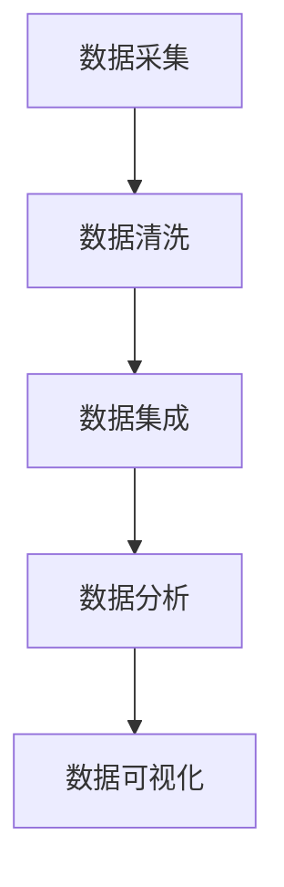

                 

# 计算变化与自动化技术的结合

> **关键词：**计算变化、自动化技术、数据处理、人工智能、工业自动化、发展趋势、产业发展、社会影响、政策与法律

> **摘要：**本文详细探讨了计算变化与自动化技术的结合，从概念、应用、发展趋势、产业发展、社会影响以及政策与法律等多个方面进行了深入分析。文章旨在为读者提供对这一领域的全面了解，并探讨其未来发展方向和潜在挑战。

## 《计算变化与自动化技术的结合》目录大纲

### 第一部分：计算变化与自动化技术的概述

#### 第1章：计算变化与自动化技术的概念

- 1.1 计算变化的基本概念
- 1.2 自动化技术的基本概念
- 1.3 计算变化与自动化技术的关系

#### 第二部分：自动化技术在计算变化中的应用

#### 第2章：自动化技术在数据处理中的应用

- 2.1 自动化数据处理的基本概念
- 2.2 自动化数据处理的关键技术
- 2.3 自动化数据处理的应用案例

#### 第3章：自动化技术在人工智能中的应用

- 3.1 自动化技术在人工智能中的地位
- 3.2 自动化技术在人工智能中的关键技术
- 3.3 自动化技术在人工智能中的案例

#### 第4章：自动化技术在工业自动化中的应用

- 4.1 工业自动化的概念
- 4.2 自动化技术在工业自动化中的应用
- 4.3 自动化技术在工业自动化中的案例

#### 第三部分：计算变化与自动化技术的未来发展趋势

#### 第5章：计算变化与自动化技术的未来发展趋势

- 5.1 未来的计算变化
- 5.2 未来的自动化技术
- 5.3 计算变化与自动化技术的结合趋势

#### 第6章：计算变化与自动化技术的产业发展

- 6.1 产业现状分析
- 6.2 产业发展趋势
- 6.3 产业发展挑战与对策

#### 第7章：计算变化与自动化技术的社会影响

- 7.1 社会影响分析
- 7.2 社会影响对策

#### 第8章：计算变化与自动化技术的政策与法律

- 8.1 政策环境分析
- 8.2 法律法规分析
- 8.3 政策与法律的实践案例

#### 附录

- A. 自动化技术相关工具与资源
- B. 自动化技术在计算变化中的流程图
- C. 自动化技术在计算变化中的应用案例

---

接下来，我们将按照上述目录大纲逐步展开详细的内容讲解。让我们首先从计算变化与自动化技术的概念入手。

## 第一部分：计算变化与自动化技术的概述

### 第1章：计算变化与自动化技术的概念

在本章中，我们将介绍计算变化和自动化技术的基本概念，探讨它们的特点、意义以及两者之间的关系。

### 1.1 计算变化的基本概念

#### 计算变化的定义

计算变化（Computational Change）是指通过计算技术来实现信息的处理、分析、转换和优化。它涵盖了从简单的数值计算到复杂的模拟、优化和机器学习等领域。

#### 计算变化的特征

- **计算复杂性**：计算变化往往涉及大量的数据处理和复杂的算法实现。
- **计算模式**：计算变化不仅包括传统的数值计算，还包括分布式计算、并行计算和云计算等新型计算模式。
- **智能化**：随着人工智能技术的发展，计算变化逐渐向智能化方向演进，实现了从自动化到自主化的转变。

#### 计算变化的意义

- **提高效率**：计算变化可以显著提高数据处理和分析的效率，降低人工成本。
- **创新驱动**：计算变化为各行各业提供了新的技术手段和业务模式，推动了产业升级和创新。
- **数据价值**：计算变化使得数据从静态资源转变为动态资产，提升了数据的价值和应用场景。

### 1.2 自动化技术的基本概念

#### 自动化技术的定义

自动化技术（Automation Technology）是指通过计算机技术、网络通信技术、控制技术等实现生产过程或业务流程的自动化。它旨在提高生产效率、降低成本、提升质量和安全性。

#### 自动化技术的类型

- **生产自动化**：通过自动化设备和控制系统实现生产过程的自动化，如工业自动化、农业自动化等。
- **业务流程自动化**：通过计算机软件和系统集成实现业务流程的自动化，如企业资源规划（ERP）、客户关系管理（CRM）等。
- **数据处理自动化**：通过自动化工具和算法实现数据处理的自动化，如数据清洗、数据集成、数据分析等。

#### 自动化技术的发展历程

- **初步阶段**（20世纪50年代至70年代）：以机械化和电气化为特征，主要实现单一设备的自动化。
- **中级阶段**（20世纪70年代至90年代）：以计算机技术和通信技术为支撑，实现生产过程和业务流程的集成化自动化。
- **高级阶段**（21世纪初至今）：以人工智能和物联网技术为驱动，实现智能化、自主化的全面自动化。

### 1.3 计算变化与自动化技术的关系

#### 计算变化对自动化技术的影响

- **提高计算能力**：计算变化为自动化技术提供了强大的计算支持，使得复杂的生产过程和业务流程能够高效地完成。
- **创新应用场景**：计算变化拓展了自动化技术的应用领域，如智能制造、智慧城市、智能医疗等。

#### 自动化技术对计算变化的促进

- **数据采集与处理**：自动化技术可以实时采集海量数据，并通过计算变化对这些数据进行分析和处理。
- **优化计算资源**：自动化技术可以根据计算需求动态调整计算资源，提高计算效率。

通过上述分析，我们可以看到计算变化与自动化技术之间存在着密切的联系和相互促进作用。在接下来的章节中，我们将进一步探讨自动化技术在计算变化中的具体应用。

---

在本章中，我们介绍了计算变化和自动化技术的基本概念，并分析了它们的特点、意义以及相互关系。接下来，我们将深入探讨自动化技术在计算变化中的具体应用。这将包括自动化技术在数据处理、人工智能和工业自动化等领域的应用，以及相关的案例分析和实际效果。

### 第二部分：自动化技术在计算变化中的应用

#### 第2章：自动化技术在数据处理中的应用

数据处理是计算变化的重要组成部分，而自动化技术在其中扮演着关键角色。本章将探讨自动化技术在数据处理中的应用，包括数据清洗、数据集成和数据分析等关键技术，并分享一些实际应用案例。

#### 第2.1 自动化数据处理的基本概念

#### 数据处理的需求

随着大数据时代的到来，数据量呈指数级增长，如何有效地处理和分析这些数据成为了一个亟待解决的问题。自动化数据处理（Automated Data Processing）旨在通过自动化技术来简化数据处理流程，提高处理效率和质量。

#### 数据处理的过程

- **数据采集**：从各种数据源（如数据库、文件、传感器等）收集数据。
- **数据存储**：将采集到的数据存储到数据仓库或数据湖中，以便后续处理。
- **数据清洗**：处理数据中的噪声、错误和不一致性，以提高数据质量。
- **数据集成**：将来自不同源的数据进行整合，形成一个统一的数据视图。
- **数据分析**：使用统计方法和机器学习算法对数据进行分析，以发现数据中的规律和模式。
- **数据可视化**：将分析结果以图表、报表等形式呈现，便于理解和决策。

#### 数据处理的技术

- **数据仓库**：用于存储大量结构化和非结构化数据的系统。
- **数据湖**：用于存储原始数据的系统，支持多种数据格式。
- **数据清洗工具**：如Elasticsearch、Spark等，用于处理数据中的噪声和错误。
- **数据集成工具**：如Apache Nifi、Apache Kafka等，用于数据采集、转换和传输。
- **数据分析工具**：如Python、R、Tableau等，用于数据分析和可视化。

#### 第2.2 自动化数据处理的关键技术

#### 数据清洗技术

- **去重**：识别和删除重复的数据记录。
- **格式转换**：将不同格式的数据进行统一转换，如将CSV转换为JSON。
- **缺失值处理**：填充或删除缺失的数据。
- **异常值检测**：检测并处理异常数据值。

#### 数据集成技术

- **数据映射**：将不同数据源的数据映射到统一的数据结构。
- **数据转换**：将数据从一种格式转换为另一种格式。
- **数据同步**：实现不同数据源之间的数据实时同步。

#### 数据分析技术

- **描述性分析**：对数据进行基本的统计分析，如均值、中位数、标准差等。
- **预测性分析**：使用机器学习算法预测未来的数据趋势。
- **关联性分析**：分析数据之间的相关性，如通过关联规则挖掘发现数据中的关联关系。

#### 第2.3 自动化数据处理的应用案例

#### 金融行业的自动化数据处理

在金融行业，自动化数据处理技术广泛应用于风险控制、信用评分、投资决策等方面。

- **风险控制**：通过自动化数据清洗和集成技术，对海量的金融交易数据进行实时监控和分析，识别潜在的风险。
- **信用评分**：利用机器学习算法，对借款人的信用信息进行分析和评分，以降低信用风险。
- **投资决策**：通过自动化数据分析技术，对市场数据进行分析，为投资决策提供数据支持。

#### 零售行业的自动化数据处理

在零售行业，自动化数据处理技术用于库存管理、销售分析、客户行为分析等方面。

- **库存管理**：通过自动化数据处理技术，实时监控库存情况，优化库存水平，降低库存成本。
- **销售分析**：通过自动化数据分析技术，分析销售数据，优化销售策略，提高销售额。
- **客户行为分析**：通过自动化数据处理技术，分析客户行为数据，了解客户需求，提高客户满意度。

#### 其他行业的自动化数据处理案例

除了金融和零售行业，自动化数据处理技术还在医疗、物流、能源等行业得到了广泛应用。

- **医疗行业**：通过自动化数据处理技术，实现患者数据的实时监控和分析，提高医疗服务质量。
- **物流行业**：通过自动化数据处理技术，优化物流路径，提高物流效率，降低物流成本。
- **能源行业**：通过自动化数据处理技术，监控能源设备运行状态，预测设备故障，提高能源利用效率。

综上所述，自动化技术在数据处理领域发挥着重要作用，通过自动化数据处理技术，我们可以实现数据的高效处理、分析和应用，为各行业提供强大的数据支持。在接下来的章节中，我们将继续探讨自动化技术在人工智能中的应用。

### 第3章：自动化技术在人工智能中的应用

自动化技术在人工智能（AI）领域的应用日益广泛，推动了AI技术的发展和应用。本章将介绍自动化技术在人工智能中的地位、关键技术和应用案例。

#### 第3.1 自动化技术在人工智能中的地位

自动化技术是人工智能发展的重要推动力。随着计算能力的提升和算法的优化，自动化技术使得AI系统能够更高效地处理海量数据，从而实现更精确的预测和决策。

- **提高效率**：自动化技术减少了人工干预，使得AI系统能够更快速地处理和分析数据。
- **降低成本**：自动化技术减少了人力成本，提高了AI系统的经济效益。
- **增强智能化**：自动化技术使得AI系统能够在更复杂的场景中发挥作用，提高了系统的智能化水平。

#### 第3.2 自动化技术在人工智能中的关键技术

自动化技术在人工智能中的应用涵盖了多个方面，包括深度学习自动化、机器学习自动化和知识图谱自动化等。

##### 深度学习自动化

深度学习自动化（Automated Deep Learning）通过自动化技术优化深度学习模型的训练和部署过程，从而提高模型的性能和效率。

- **模型自动选择**：自动化技术可以根据数据特点和需求，选择最合适的深度学习模型。
- **超参数优化**：自动化技术通过搜索算法，自动调整模型的超参数，以获得最佳性能。
- **模型自动化训练**：自动化技术可以实现大规模并行训练，提高训练效率。

##### 机器学习自动化

机器学习自动化（Automated Machine Learning，AutoML）通过自动化技术简化机器学习流程，使得非专业人士也能轻松构建和部署机器学习模型。

- **自动化特征工程**：自动化技术可以自动提取和选择数据特征，简化特征工程过程。
- **自动化模型选择**：自动化技术可以根据数据特点和需求，选择最合适的机器学习模型。
- **自动化模型评估**：自动化技术可以自动评估模型的性能，帮助用户优化模型。

##### 知识图谱自动化

知识图谱自动化（Automated Knowledge Graph）通过自动化技术构建和更新知识图谱，从而实现数据的语义理解和智能推理。

- **自动化数据采集**：自动化技术可以自动采集和整合各类数据，构建知识图谱。
- **自动化实体抽取**：自动化技术可以自动识别和提取文本中的实体信息，构建实体图谱。
- **自动化关系抽取**：自动化技术可以自动识别和提取文本中的实体关系，构建关系图谱。

#### 第3.3 自动化技术在人工智能中的案例

自动化技术在人工智能领域有许多成功的应用案例，下面列举几个典型的案例：

##### 自动驾驶

自动驾驶是自动化技术在人工智能领域的一个重要应用方向。通过自动化技术，自动驾驶系统能够实时感知环境、规划路径并做出驾驶决策。

- **感知环境**：自动驾驶系统使用摄像头、激光雷达等传感器，通过深度学习算法实现对环境的感知。
- **路径规划**：自动化技术可以基于感知环境的数据，实时生成最优路径。
- **决策控制**：自动化技术可以实现车辆的加速、制动和转向等控制，实现自动驾驶。

##### 智能家居

智能家居通过自动化技术实现了家庭设备的智能控制，提升了生活品质。

- **智能设备连接**：智能家居系统通过物联网技术，将家庭中的各类设备连接起来，实现远程控制和自动化操作。
- **自动化场景设置**：用户可以设定各种自动化场景，如自动开关灯、自动调节空调温度等，提高生活的便利性。
- **语音控制**：智能家居系统支持语音控制，用户可以通过语音指令操作设备，实现更自然的交互方式。

##### 智能医疗

智能医疗通过自动化技术和人工智能技术，实现了医疗数据的高效处理和分析，提高了医疗服务质量。

- **医学影像分析**：自动化技术可以自动分析医学影像，如X光片、CT片等，协助医生进行诊断。
- **电子病历管理**：自动化技术可以实现电子病历的自动生成、存储和管理，提高病历的准确性和完整性。
- **智能诊断系统**：自动化技术结合医学知识库和患者数据，可以自动生成诊断建议，辅助医生进行诊断。

综上所述，自动化技术在人工智能领域中具有广泛的应用前景，通过自动化技术，人工智能系统能够更高效地处理数据、做出决策，为各行各业提供智能化的解决方案。在接下来的章节中，我们将进一步探讨自动化技术在工业自动化中的应用。

### 第4章：自动化技术在工业自动化中的应用

工业自动化是自动化技术在制造业中的重要应用领域，通过引入自动化技术和智能系统，实现生产过程的自动化、智能化和高效化。本章将介绍工业自动化的概念、自动化技术在其中的应用以及相关的案例。

#### 第4.1 工业自动化的概念

工业自动化（Industrial Automation）是指利用计算机技术、通信技术、控制技术等实现生产过程的自动化，以提高生产效率、降低成本、提高产品质量和安全性。工业自动化涵盖了从单一设备自动化到整个生产线的自动化，以及从硬件控制到软件智能控制的演进。

#### 工业自动化的意义

- **提高生产效率**：通过自动化技术，可以减少人工操作，提高生产速度，缩短生产周期。
- **降低生产成本**：自动化技术可以减少人力成本，降低能源消耗和物料浪费，提高经济效益。
- **提高产品质量**：自动化技术可以确保生产过程的稳定性和一致性，减少人为错误，提高产品质量。
- **提升安全性**：自动化技术可以减少工人暴露在危险环境中的风险，提高生产安全性。

#### 第4.2 自动化技术在工业自动化中的应用

自动化技术在工业自动化中得到了广泛应用，主要包括以下几个方面：

##### 生产流程自动化

生产流程自动化（Process Automation）是指通过自动化设备和控制系统实现生产过程的自动化。

- **设备自动化**：引入自动化设备，如数控机床、机器人等，实现生产设备的自动化操作。
- **流程控制**：通过自动化控制系统，实现生产过程的实时监控和优化，确保生产流程的稳定性和效率。

##### 质量检测自动化

质量检测自动化（Quality Inspection Automation）是指通过自动化技术实现产品质量的实时检测和监控。

- **在线检测**：通过自动化检测设备，实现对生产过程中的产品质量的实时监测，及时发现问题。
- **智能诊断**：利用人工智能技术，对检测结果进行分析和诊断，提高检测的准确性和效率。

##### 设备维护自动化

设备维护自动化（Equipment Maintenance Automation）是指通过自动化技术实现设备的预测性维护和故障诊断。

- **设备监控**：通过传感器和物联网技术，实时监控设备的运行状态，预测设备的故障。
- **智能维护**：利用机器学习算法，分析设备运行数据，制定最优的维护计划，降低设备故障率。

##### 生产调度自动化

生产调度自动化（Production Scheduling Automation）是指通过自动化技术实现生产计划的自动生成和优化。

- **计划生成**：根据订单需求和库存情况，自动生成生产计划。
- **调度优化**：利用优化算法，自动优化生产调度，提高生产效率。

#### 第4.3 自动化技术在工业自动化中的案例

自动化技术在工业自动化中有着丰富的应用案例，下面列举几个典型的案例：

##### 汽车制造业自动化

汽车制造业是自动化技术的重要应用领域之一。通过自动化技术，汽车制造过程中的各个环节实现了高效化、智能化。

- **车身焊接**：使用自动化焊接机器人，实现车身的自动焊接，提高焊接质量和效率。
- **装配线自动化**：引入自动化装配设备，如自动组装机器人，实现零部件的自动装配。
- **质量检测自动化**：使用自动化检测设备，对汽车零部件和整车进行质量检测，确保产品质量。

##### 电子制造业自动化

电子制造业是自动化技术的另一个重要应用领域。通过自动化技术，电子制造过程中的各个环节实现了自动化和智能化。

- **SMT贴片**：使用自动化贴片机，实现电子元器件的自动贴片。
- **组装线自动化**：引入自动化组装设备，如自动螺丝刀、自动焊接机等，实现电子产品的自动组装。
- **质量检测自动化**：使用自动化检测设备，对电子产品进行质量检测，确保产品质量。

##### 制药行业自动化

制药行业通过自动化技术，实现了生产过程的自动化和智能化，提高了生产效率和质量。

- **自动化生产线**：引入自动化生产线，实现药品生产的自动化操作。
- **质量检测自动化**：使用自动化检测设备，对药品的质量进行实时监测和检测。
- **智能仓储系统**：通过自动化仓储设备，实现药品的智能存储和管理。

综上所述，自动化技术在工业自动化中发挥着重要作用，通过自动化技术，工业生产过程可以实现高效化、智能化和自动化，从而提高生产效率、降低成本、提高产品质量。在未来的发展中，自动化技术将继续在工业自动化中发挥重要作用，推动制造业的数字化转型和升级。

### 第三部分：计算变化与自动化技术的未来发展趋势

#### 第5章：计算变化与自动化技术的未来发展趋势

随着技术的不断进步和各行业的数字化转型，计算变化与自动化技术的未来发展趋势值得深入探讨。本章将分析计算能力和计算模式的变革，探讨计算变化与自动化技术的结合趋势，并展望未来的发展方向。

#### 第5.1 未来的计算变化

计算能力是计算变化的核心驱动力。未来，计算能力将继续提升，带来以下几个方面的变化：

- **量子计算**：量子计算具有极高的计算速度和处理能力，有望在未来几年内实现商用化。量子计算将推动计算技术发生革命性变革，为自动化技术提供更强的计算支持。
- **边缘计算**：边缘计算将计算能力从云端下沉到网络边缘，实现数据在本地快速处理和分析。这将降低网络延迟，提高数据处理效率，为自动化技术提供更灵活的计算模式。
- **分布式计算**：分布式计算通过将计算任务分布到多个计算节点上，实现并行处理和数据共享。未来，随着区块链、物联网等技术的发展，分布式计算将更加普及，为自动化技术提供更强大的计算支持。

#### 第5.2 未来的自动化技术

自动化技术在未来将继续向智能化、自主化和网络化方向发展，呈现以下几个趋势：

- **人工智能自动化**：随着人工智能技术的快速发展，自动化技术将更多地融合人工智能算法，实现自主决策和自适应控制。这将使得自动化系统更加智能，能够应对复杂多变的生产环境和业务场景。
- **自主机器人**：自主机器人是未来自动化技术的重要方向。通过人工智能技术，自主机器人将具备自主感知、决策和执行能力，能够在没有人工干预的情况下完成复杂任务，提高生产效率和质量。
- **物联网自动化**：物联网技术的普及将使得自动化系统更加互联互通，实现跨设备、跨平台的自动化协作。物联网自动化将推动自动化技术从单一设备自动化向系统级自动化转变。

#### 第5.3 计算变化与自动化技术的结合趋势

计算变化与自动化技术的结合将呈现以下几个趋势：

- **融合技术**：计算变化和自动化技术的结合将产生新的融合技术，如智能自动化、云计算与边缘计算的融合等。这些融合技术将打破传统技术的界限，实现更高效的资源利用和协同工作。
- **跨界融合**：计算变化与自动化技术的结合将推动各行业的跨界融合，如智能制造与智慧城市的融合、智能医疗与健康管理平台的融合等。跨界融合将带来新的商业模式和产业生态，推动社会生产力的提升。
- **融合挑战与机遇**：计算变化与自动化技术的结合将带来一系列挑战，如数据安全、隐私保护、标准化等。同时，这也将带来新的发展机遇，如新兴产业的崛起、技术创新的加速等。

综上所述，计算变化与自动化技术的未来发展趋势充满机遇和挑战。在计算能力不断提升和自动化技术不断发展的背景下，计算变化与自动化技术的结合将推动各行业的技术进步和产业变革，为社会发展和人类生活带来更多便利。

### 第6章：计算变化与自动化技术的产业发展

计算变化与自动化技术的快速发展对产业发展产生了深远影响。本章将分析计算变化与自动化技术的产业发展现状、趋势以及面临的挑战，并提出相应的对策。

#### 第6.1 产业现状分析

当前，计算变化与自动化技术在全球范围内迅速发展，产业规模不断扩大。主要表现为以下几个方面：

- **市场规模**：根据相关统计数据，全球计算变化与自动化技术市场规模持续增长，预计未来几年仍将保持高速增长态势。其中，人工智能、工业自动化和物联网等领域的发展尤为迅速。
- **技术创新**：计算变化与自动化技术领域不断涌现出新的技术突破，如量子计算、边缘计算、自主机器人等。这些技术创新为产业发展提供了强大的动力。
- **行业应用**：计算变化与自动化技术在金融、制造、医疗、物流等行业得到广泛应用，提高了生产效率、降低了成本，促进了产业升级。

#### 第6.2 产业发展趋势

未来，计算变化与自动化技术将继续保持快速发展，呈现以下趋势：

- **智能化**：随着人工智能技术的不断进步，自动化技术将更加智能化。未来，智能自动化系统将能够自主感知、决策和执行，实现更高效的生产和业务流程。
- **融合化**：计算变化与自动化技术将与其他技术领域（如物联网、大数据、区块链等）实现深度融合，推动跨界融合和产业变革。
- **普及化**：自动化技术将逐渐普及到各个行业和领域，实现从单一设备自动化到系统级自动化的转变，提高整个社会的生产效率和智能化水平。
- **国际化**：随着全球化进程的推进，计算变化与自动化技术将在全球范围内得到广泛应用，推动国际技术交流和合作。

#### 第6.3 产业发展挑战与对策

尽管计算变化与自动化技术产业发展迅速，但同时也面临着一系列挑战：

- **技术挑战**：自动化技术领域的核心技术和基础技术仍需进一步突破，如量子计算、自主机器人等。同时，随着技术复杂度的增加，如何确保系统的稳定性和可靠性也是一个重要问题。
- **人才挑战**：自动化技术领域的快速发展对人才需求提出了更高要求。当前，相关领域的人才供给不足，培养和引进高素质人才成为产业发展的重要挑战。
- **数据安全与隐私**：随着数据量的不断增长，数据安全与隐私保护成为产业发展的关键问题。如何在保障数据安全与隐私的前提下，充分利用数据资源，是一个亟待解决的问题。

为应对上述挑战，可以从以下几个方面采取对策：

- **加大技术研发**：政府和企业应加大对自动化技术领域的研究和开发投入，推动核心技术和基础技术的突破。
- **人才培养与引进**：建立健全人才培养体系，加强高校、研究机构与企业之间的合作，培养和引进高素质人才。
- **政策支持**：政府应制定有利于自动化技术产业发展的政策措施，提供政策支持和资金扶持，推动产业发展。
- **数据安全与隐私保护**：建立完善的数据安全与隐私保护制度，加强对数据安全和隐私保护的监管，保障数据安全与隐私。

总之，计算变化与自动化技术产业发展具有巨大的潜力，但同时也面临诸多挑战。通过加大技术研发、人才培养、政策支持和数据安全与隐私保护等方面的努力，可以有效应对产业发展中的挑战，推动计算变化与自动化技术的持续健康发展。

### 第7章：计算变化与自动化技术的社会影响

计算变化与自动化技术的快速发展不仅对产业产生了深远影响，也对社会各个方面带来了深刻变革。本章将分析计算变化与自动化技术对社会的影响，包括就业、生活和环境等方面，并提出相应的对策。

#### 第7.1 社会影响分析

##### 就业影响

计算变化与自动化技术的普及对就业市场产生了显著影响。一方面，自动化技术的应用减少了某些传统岗位的需求，如制造业中的体力劳动岗位和某些低技能的行政岗位。另一方面，自动化技术也创造了新的就业机会，如软件开发、数据分析和自动化系统维护等高技能岗位。此外，自动化技术的应用提高了生产效率，使得企业可以雇佣更少的人力资源，从而影响了就业结构。

##### 生活影响

自动化技术对人们的生活方式也产生了深远影响。智能家居、智能交通和自动驾驶等技术的普及，使得生活更加便利和高效。人们可以远程控制家居设备，实现家居环境的智能调节；智能交通系统可以优化行车路线，减少交通拥堵；自动驾驶技术的发展有望解决城市交通拥堵和交通事故问题。然而，自动化技术也带来了一些负面影响，如隐私泄露、网络安全风险等，这些都需要社会各界的关注和治理。

##### 环境影响

计算变化与自动化技术在环境保护方面也发挥了重要作用。通过自动化技术，企业可以实现能源的高效利用和污染的实时监控，减少资源浪费和环境污染。例如，智能工厂通过自动化控制系统实现能源的精细管理，减少了能源消耗；智能农业通过精准灌溉和病虫害监测，提高了农业生产的效率和资源利用率。然而，自动化技术的发展也带来了一些环境问题，如电子废弃物的增加、能源消耗等，这些问题需要引起关注和解决。

#### 第7.2 社会影响对策

##### 就业对策

为了应对自动化技术对就业市场的影响，可以采取以下对策：

- **职业培训**：加强职业培训，提升劳动者的技能水平，使他们能够适应自动化技术带来的变化。
- **政策扶持**：政府可以制定相关政策措施，支持企业和劳动者应对自动化技术的挑战，如提供税收优惠、补贴等。
- **创业支持**：鼓励劳动者创新创业，通过创业带动就业，实现就业结构的优化。

##### 生活对策

为了应对自动化技术对生活的影响，可以采取以下对策：

- **隐私保护**：加强隐私保护立法和监管，确保自动化技术在应用过程中保护用户的隐私。
- **网络安全**：提高网络安全意识，加强对网络攻击和恶意软件的防护，保障个人信息和信息安全。
- **公共参与**：鼓励公众参与自动化技术的决策过程，提高公众对技术的认知和理解，增强社会的包容性和适应性。

##### 环境对策

为了应对自动化技术对环境的影响，可以采取以下对策：

- **绿色技术**：推动绿色技术创新，开发和应用节能环保的自动化技术，减少能源消耗和环境污染。
- **循环经济**：推广循环经济模式，提高资源利用效率，减少电子废弃物的产生。
- **政策引导**：政府应制定和实施有利于环境保护的政策，鼓励企业采用绿色自动化技术，提高环保意识。

总之，计算变化与自动化技术对社会的影响是深远而复杂的。通过采取有效的对策，可以最大限度地发挥自动化技术的积极作用，减少其负面影响，实现社会、经济和环境的可持续发展。

### 第8章：计算变化与自动化技术的政策与法律

计算变化与自动化技术的快速发展不仅带来了技术层面的变革，也引发了政策与法律领域的挑战和需求。本章将分析计算变化与自动化技术的政策环境、法律法规，并探讨相关实践案例。

#### 第8.1 政策环境分析

政府政策在推动计算变化与自动化技术的发展中起着关键作用。以下是相关政策环境的分析：

- **鼓励创新**：各国政府纷纷出台政策，鼓励科技创新和产业升级。例如，美国发布了《国家人工智能战略》，欧盟推出了《人工智能伦理准则》，这些政策旨在推动人工智能等计算技术的创新和发展。
- **投资支持**：政府通过投资科研项目、提供财政补贴等方式，支持计算变化与自动化技术的研发和应用。例如，中国设立了国家重点研发计划，支持人工智能、大数据等领域的创新。
- **国际合作**：政府积极参与国际合作，推动技术交流和标准制定。例如，联合国教科文组织（UNESCO）设立了人工智能伦理委员会，旨在推动全球人工智能伦理和标准化工作。

#### 第8.2 法律法规分析

随着计算变化与自动化技术的发展，法律法规逐渐成为保障其健康发展的关键因素。以下是相关法律法规的分析：

- **数据保护法**：数据保护法是保障个人信息安全和隐私的重要法律。例如，欧盟的《通用数据保护条例》（GDPR）规定了个人数据的收集、处理和保护要求，对自动化技术的数据处理行为提出了严格规范。
- **知识产权法**：知识产权法是保护技术创新和知识产权的重要法律。例如，美国的《数字千年版权法案》（DMCA）规定了数字版权的保护和管理要求，对自动化技术中的知识产权保护提供了法律依据。
- **行业标准**：行业标准是规范计算变化与自动化技术发展的重要规范。例如，国际标准化组织（ISO）发布了《工业自动化系统与集成——工业自动化系统与软件集成——企业集成参考模型》，为自动化技术的标准化提供了指导。

#### 第8.3 政策与法律的实践案例

以下是计算变化与自动化技术政策与法律实践的几个案例：

- **美国**：美国在人工智能领域制定了《国家人工智能战略》，明确了人工智能的发展目标和政策方向。同时，美国还通过了《加州消费者隐私法案》，加强对个人数据的保护。
- **欧盟**：欧盟出台了《人工智能伦理准则》，规范了人工智能的研发和应用行为，强调了人工智能的伦理和社会责任。此外，欧盟还发布了《通用数据保护条例》，加强了个人数据的保护。
- **中国**：中国政府发布了《新一代人工智能发展规划》，明确了人工智能发展的目标和路径。同时，中国还制定了《网络安全法》和《数据安全法》，为计算变化与自动化技术提供了法律保障。

总之，计算变化与自动化技术的发展需要政策与法律的保驾护航。通过合理的政策引导和完善的法律法规，可以推动计算变化与自动化技术的健康发展，确保其在社会、经济和环保等方面的积极作用得到充分发挥。

### 附录

#### A. 自动化技术相关工具与资源

以下是自动化技术领域的一些常用工具和资源：

- **工具介绍**
  - **Apache Nifi**：一款开源的数据集成平台，用于自动化数据处理、数据流管理和数据监控。
  - **Apache Kafka**：一款开源的消息队列系统，用于大数据实时处理和传输。
  - **Docker**：一款开源的应用容器引擎，用于自动化部署和运行应用。
  - **Kubernetes**：一款开源的容器编排平台，用于自动化部署、扩展和管理容器化应用。

- **资源推荐**
  - **GitHub**：一个开源代码托管平台，提供了大量的自动化技术相关项目代码和文档。
  - **Stack Overflow**：一个编程问答社区，可以解决自动化技术领域的问题和疑惑。
  - **Coursera**：一个在线课程平台，提供了许多与自动化技术相关的课程和教程。

#### B. 自动化技术在计算变化中的流程图

以下是一个简单的自动化数据处理流程图，展示了数据从采集、清洗、集成到分析的过程：



#### C. 自动化技术在计算变化中的应用案例

以下是一个自动化数据处理的应用案例，展示了如何使用Python编写代码实现数据清洗、数据集成和数据分析：

```python
# 导入相关库
import pandas as pd
import numpy as np

# 数据清洗
data = pd.read_csv('data.csv')
data.dropna(inplace=True)  # 删除缺失值
data = data[data['column'] > 0]  # 过滤异常值

# 数据集成
data = data.merge(data2, on='key', how='left')  # 数据合并

# 数据分析
data['mean'] = data[['column1', 'column2']].mean(axis=1)  # 计算平均值

# 数据可视化
data.plot(kind='line')  # 绘制折线图
```

通过上述代码，我们可以实现对数据的清洗、集成和分析，并生成可视化图表。这些技术在实际应用中可以大大提高数据处理和分析的效率。

---

作者：AI天才研究院/AI Genius Institute & 禅与计算机程序设计艺术 /Zen And The Art of Computer Programming

本文从计算变化与自动化技术的概念出发，逐步深入探讨了其在数据处理、人工智能和工业自动化等领域的应用，以及未来发展趋势、产业发展、社会影响、政策与法律等方面。通过详细分析和技术案例，本文展示了计算变化与自动化技术的重要性和广泛影响力，为读者提供了对这一领域的全面了解。希望本文能启发读者进一步探索计算变化与自动化技术的无限可能。

