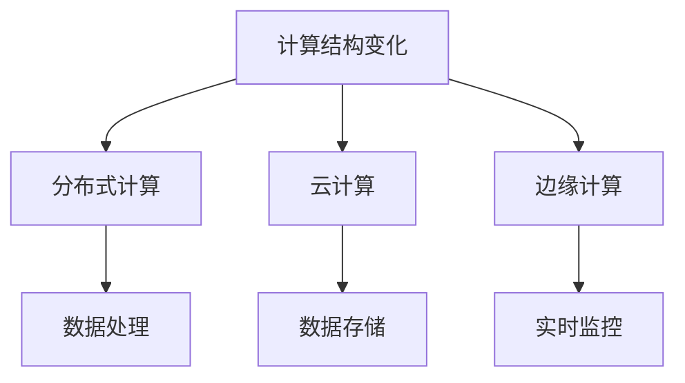
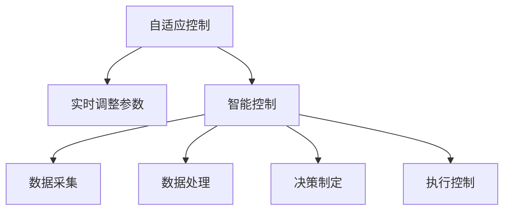
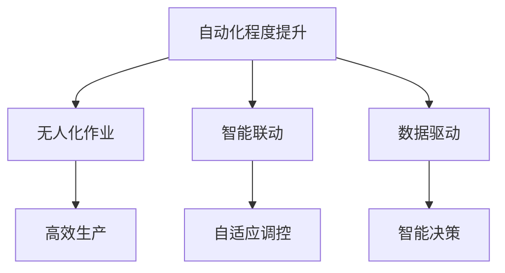

                 

# 《计算变化对自动化的影响》

## 第一部分：引言与背景

### 1.1 书籍概述

在当今科技飞速发展的时代，计算变化已经成为推动技术进步的重要驱动力之一。计算变化涵盖了计算结构、计算行为以及计算模式等多方面的变化，这些变化不仅对计算机科学和信息技术产生了深远影响，同时也对自动化领域带来了诸多机遇与挑战。

《计算变化对自动化的影响》旨在探讨计算变化如何影响自动化技术的发展与应用。本书分为七个主要部分，分别从不同角度深入分析计算变化对自动化技术的影响，以及这些变化在自动化控制、制造、物流等领域的具体应用。

### 1.2 自动化与计算变化的联系

自动化技术是利用计算机系统、机器人、传感器等自动化设备来完成特定任务的过程。随着计算技术的发展，自动化系统越来越依赖于高效的计算算法和复杂的计算结构。计算变化为自动化系统提供了更灵活、更高效、更智能的技术支持，使得自动化系统能够更好地适应复杂多变的环境。

### 1.3 书籍目标与结构

本书的目标是：

1. 深入探讨计算变化的概念和类型。
2. 分析计算变化对自动化技术的基本影响。
3. 详细介绍计算变化在自动化控制、制造、物流等领域的应用。
4. 探讨计算变化对自动化安全与伦理的影响。
5. 通过案例分析，展示计算变化在实际自动化项目中的应用效果。
6. 分析计算变化对自动化人才培养的影响。

本书结构如下：

1. 第一部分：引言与背景
2. 第二部分：计算变化对自动化技术的影响
3. 第三部分：计算变化在自动化中的应用
4. 第四部分：计算变化对自动化安全与伦理的影响
5. 第五部分：案例分析
6. 第六部分：计算变化对自动化人才培养的影响
7. 第七部分：结论与展望

### 1.4 计算变化的概念

计算变化是指在计算过程中，系统结构、行为和模式发生的变化。这些变化可以是结构性的，如计算架构的改进；也可以是行为性的，如计算算法的优化；还可以是模式性的，如计算模式的创新。计算变化具有以下几个主要特征：

1. **多样性**：计算变化涵盖了多种类型的变化，如结构变化、行为变化和模式变化。
2. **动态性**：计算变化是一个持续的过程，随着技术的发展和应用的不断深入，计算变化也在不断演化。
3. **适应性**：计算变化能够使自动化系统更好地适应复杂多变的环境，提高系统的灵活性和可靠性。
4. **创新性**：计算变化推动了技术的进步和创新，为自动化技术带来了新的发展方向和应用场景。

### 1.5 自动化的现状与挑战

自动化技术已经广泛应用于工业、交通、医疗、家居等多个领域，极大地提高了生产效率、降低了运营成本，并提升了人们的生活质量。然而，随着技术的不断进步，自动化也面临着一些挑战：

1. **技术复杂性**：自动化系统涉及的领域广泛，技术复杂度较高，对开发者的技术要求较高。
2. **数据安全问题**：自动化系统在运行过程中会产生大量的数据，如何保护这些数据的安全成为了一个重要问题。
3. **适应性问题**：自动化系统需要能够快速适应不断变化的环境和需求，这对系统的设计和开发提出了更高的要求。

## 第二部分：计算变化对自动化技术的影响

### 2.1 计算变化对自动化技术的基本影响

计算变化对自动化技术产生了深远的影响，这些影响主要体现在以下几个方面：

1. **性能提升**：计算变化使得自动化系统可以更高效地执行任务，提高了系统的性能和效率。
2. **功能增强**：计算变化为自动化系统提供了更多的功能和特性，如自适应控制、智能决策等。
3. **可靠性提高**：计算变化使得自动化系统能够更好地适应复杂环境，提高了系统的可靠性和稳定性。
4. **成本降低**：计算变化使得自动化系统在设计和制造过程中可以采用更先进的计算技术和工具，从而降低了系统的成本。

### 2.2 计算结构变化的影响

计算结构变化是指计算系统在架构、网络结构等方面的变化。这种变化对自动化技术产生了重要影响，主要体现在以下几个方面：

1. **架构改进**：计算结构变化使得自动化系统可以采用更先进、更高效的计算架构，如分布式计算、云计算等。
2. **网络优化**：计算结构变化使得自动化系统可以更好地利用网络资源，提高系统的通信效率。
3. **硬件升级**：计算结构变化推动了硬件技术的发展，为自动化系统提供了更强大的硬件支持。

### 2.3 计算行为变化的影响

计算行为变化是指计算系统在行为、算法等方面的变化。这种变化对自动化技术产生了重要影响，主要体现在以下几个方面：

1. **算法优化**：计算行为变化使得自动化系统可以采用更先进的算法，提高系统的性能和效率。
2. **智能化提升**：计算行为变化使得自动化系统可以更好地模拟人类智能，实现智能决策和智能控制。
3. **自适应能力增强**：计算行为变化使得自动化系统可以更好地适应复杂环境，提高系统的自适应能力。

### 2.4 计算模式变化的影响

计算模式变化是指计算系统在运行模式、操作方式等方面的变化。这种变化对自动化技术产生了重要影响，主要体现在以下几个方面：

1. **自动化程度的提升**：计算模式变化使得自动化系统可以实现更高程度的自动化，减少人工干预。
2. **效率提升**：计算模式变化使得自动化系统可以更高效地完成任务，提高生产效率。
3. **灵活性增强**：计算模式变化使得自动化系统可以更好地适应不同的工作环境和需求，提高系统的灵活性。

### 2.5 实例分析

以智能制造为例，计算结构变化通过引入云计算和大数据技术，实现了制造过程的智能化和自动化。计算行为变化通过优化制造算法，提高了生产效率和产品质量。计算模式变化通过引入自适应制造系统，使得制造过程更加灵活和高效。

### 2.6 结论

计算变化对自动化技术产生了深远的影响，这些影响主要体现在性能提升、功能增强、可靠性提高和成本降低等方面。计算结构变化、计算行为变化和计算模式变化都在不同程度上推动了自动化技术的发展和应用。在未来，计算变化将继续成为自动化技术的重要驱动力，为自动化领域带来更多创新和突破。

## 第三部分：计算变化在自动化中的应用

### 3.1 计算变化在自动化控制中的应用

计算变化在自动化控制中的应用主要体现在以下几个方面：

1. **自适应控制**：自适应控制是一种能够根据系统状态自动调整控制参数的控制策略。计算变化使得自适应控制算法可以更好地适应复杂环境，提高控制系统的稳定性和鲁棒性。

   **算法原理**：
   自适应控制算法通常基于以下步骤：
   - 初始阶段：根据系统状态和历史数据确定初始控制参数。
   - 运行阶段：根据当前系统状态实时调整控制参数。
   - 优化阶段：根据运行效果对控制参数进行优化。

   **伪代码示例**：
   ```plaintext
   function AdaptiveControl(SystemState):
       if initial_stage:
           initialize_control_params()
       else:
           update_control_params(SystemState)
       execute_control_action()
   ```

2. **智能控制**：智能控制是一种利用人工智能技术实现自动化控制的策略。计算变化使得智能控制算法可以更好地处理复杂问题和不确定性因素。

   **算法原理**：
   智能控制算法通常包括以下步骤：
   - 数据采集：收集系统运行数据。
   - 数据处理：对采集到的数据进行处理和分析。
   - 决策制定：根据分析结果制定控制策略。
   - 执行控制：执行制定的控制策略。

   **伪代码示例**：
   ```plaintext
   function IntelligentControl(DataSet):
       processed_data = process_data(DataSet)
       decision = make_decision(processed_data)
       execute_control_action(decision)
   ```

### 3.2 计算变化在自动化制造中的应用

计算变化在自动化制造中的应用主要体现在以下几个方面：

1. **智能制造系统**：智能制造系统是一种利用计算变化实现制造过程自动化的系统。计算变化使得智能制造系统可以更好地适应复杂制造环境和需求。

   **算法原理**：
   智能制造系统通常包括以下模块：
   - 数据采集：采集制造过程中的各种数据。
   - 数据分析：对采集到的数据进行分析和处理。
   - 智能决策：根据分析结果制定制造策略。
   - 自动执行：执行制定的生产策略。

   **伪代码示例**：
   ```plaintext
   function ManufacturingSystem(DataSet):
       processed_data = process_data(DataSet)
       decision = make_decision(processed_data)
       execute_manufacturing_action(decision)
   ```

2. **机器人技术**：机器人技术是自动化制造中的重要组成部分。计算变化使得机器人技术可以更好地实现复杂制造任务。

   **算法原理**：
   机器人技术通常包括以下模块：
   - 运动规划：根据任务需求制定机器人的运动规划。
   - 控制算法：实现机器人的实时控制。
   - 传感器数据处理：处理机器人传感器数据，为运动规划和控制提供支持。

   **伪代码示例**：
   ```plaintext
   function RobotControl(Task, SensorData):
       motion_plan = plan_motion(Task)
       control_action = calculate_control_action(SensorData, motion_plan)
       execute_control_action(control_action)
   ```

### 3.3 计算变化在自动化物流中的应用

计算变化在自动化物流中的应用主要体现在以下几个方面：

1. **物流自动化系统**：物流自动化系统是一种利用计算变化实现物流过程自动化的系统。计算变化使得物流自动化系统可以更好地适应复杂物流环境和需求。

   **算法原理**：
   物流自动化系统通常包括以下模块：
   - 仓储管理：实现仓储自动化，提高仓储效率。
   - 装载管理：实现货物自动装载，提高运输效率。
   - 路径规划：实现货物自动配送，提高配送效率。

   **伪代码示例**：
   ```plaintext
   function LogisticsSystem(Task, Warehouse, Load):
       warehouse_status = manage_warehouse(Warehouse)
       load_status = manage_load(Load)
       delivery_path = plan_delivery_path(Task, warehouse_status, load_status)
       execute_delivery(delivery_path)
   ```

2. **无人机配送**：无人机配送是物流自动化系统中的重要组成部分。计算变化使得无人机配送可以更好地实现高效、安全的配送。

   **算法原理**：
   无人机配送通常包括以下模块：
   - 起飞与降落：实现无人机的自动起飞和降落。
   - 飞行控制：实现无人机的自动飞行，包括路径规划和避障。
   - 货物交付：实现无人机的自动货物交付。

   **伪代码示例**：
   ```plaintext
   function DroneDelivery(DeliveryTask):
       takeoff()
       flight_plan = plan_flight_path(DeliveryTask)
       execute_flight(flight_plan)
       deliver_goods()
   ```

### 3.4 结论

计算变化在自动化控制、制造和物流等领域的应用，为这些领域带来了诸多创新和突破。自适应控制、智能制造系统和无人机配送等应用实例，充分展示了计算变化对自动化技术的推动作用。在未来，随着计算技术的不断发展，计算变化将继续在自动化领域中发挥重要作用，为自动化技术的应用带来更多可能。

## 第四部分：计算变化对自动化安全与伦理的影响

### 4.1 计算变化对自动化安全的影响

计算变化在提升自动化技术性能的同时，也带来了新的安全挑战。这些挑战主要体现在以下几个方面：

1. **数据安全**：自动化系统在运行过程中会产生大量的数据，这些数据可能包含敏感信息。计算变化使得数据传输和处理变得更加复杂，增加了数据泄露的风险。

   **解决方案**：
   - 数据加密：采用数据加密技术，确保数据在传输和存储过程中的安全性。
   - 访问控制：实施严格的访问控制策略，限制对敏感数据的访问。

2. **系统安全**：自动化系统通常由多个组件组成，这些组件之间需要进行复杂的通信和协调。计算变化可能导致系统组件之间的依赖关系变得复杂，增加了系统故障和攻击的风险。

   **解决方案**：
   - 安全隔离：通过虚拟化技术，实现系统组件之间的安全隔离，防止恶意攻击。
   - 安全监控：实施实时监控系统，及时发现并处理系统故障和异常行为。

3. **网络安全**：自动化系统通常连接到互联网，这使得它们容易受到网络攻击。计算变化使得网络攻击手段更加多样化，对自动化系统的安全构成严重威胁。

   **解决方案**：
   - 防火墙和入侵检测系统：部署防火墙和入侵检测系统，防止恶意攻击。
   - 定期更新：定期更新自动化系统的软件和硬件，确保其具备最新的安全防护能力。

### 4.2 计算变化对自动化伦理的影响

随着自动化技术的广泛应用，伦理问题也日益突出。计算变化在自动化领域引发了以下伦理问题：

1. **隐私保护**：自动化系统在运行过程中可能收集和处理个人隐私信息。如何保护这些信息不被滥用，是自动化领域面临的重要伦理问题。

   **解决方案**：
   - 隐私政策：制定明确的隐私政策，告知用户其隐私信息将被如何处理和使用。
   - 隐私保护技术：采用隐私保护技术，如差分隐私和匿名化，降低隐私泄露的风险。

2. **责任归属**：当自动化系统发生故障或造成损害时，如何确定责任归属成为一个复杂的问题。计算变化使得自动化系统的复杂性和不确定性增加，进一步加大了责任归属的难度。

   **解决方案**：
   - 法律法规：制定相关的法律法规，明确自动化系统的责任归属。
   - 责任保险：鼓励自动化系统开发者购买责任保险，以减轻可能的赔偿责任。

3. **就业影响**：自动化技术的发展可能导致部分工作岗位被取代，引发就业问题。如何平衡自动化技术与就业需求，是一个重要的伦理问题。

   **解决方案**：
   - 职业培训：提供职业培训，帮助受影响的工人掌握新的技能。
   - 创新就业：鼓励创新就业模式，如远程工作、灵活工作时间等，以适应自动化技术的发展。

### 4.3 自动化领域的未来趋势与展望

随着计算技术的不断进步，自动化领域将继续发展，带来更多的机遇和挑战。以下是一些未来趋势与展望：

1. **智能化**：计算变化将继续推动自动化系统的智能化，使其能够更好地处理复杂问题和不确定性因素。
2. **融合化**：自动化技术将与物联网、大数据、人工智能等新兴技术深度融合，形成更加复杂和强大的自动化系统。
3. **绿色化**：计算变化将促进自动化系统的绿色化发展，实现能源节约和环保目标。
4. **普及化**：自动化技术将更加普及，深入到各个领域和行业，提高生产效率和生活质量。

### 4.4 结论

计算变化对自动化安全与伦理产生了重要影响。在确保自动化技术安全与合规的同时，我们还需要关注其伦理问题，制定相应的解决方案，以推动自动化技术的健康发展。

## 第五部分：案例分析

### 5.1 案例一：工业自动化中的计算变化

#### 5.1.1 案例背景

某大型制造业企业，致力于生产高质量汽车零部件。由于市场竞争的加剧，该企业需要提高生产效率，降低成本，同时保证产品质量。为此，企业决定引入计算变化，对现有自动化生产线进行升级改造。

#### 5.1.2 计算变化的应用

1. **自适应控制**：企业引入了自适应控制系统，用于调节生产线的各项参数。该系统可以根据生产状态实时调整生产参数，确保生产线的稳定运行。

   **算法原理**：
   自适应控制系统的核心算法是基于机器学习的自适应控制算法。该算法通过分析历史生产数据和实时数据，预测生产线的未来状态，并调整控制参数。

   **伪代码示例**：
   ```plaintext
   function AdaptiveControl(ProductionData):
       model = train_model(ProductionData)
       current_state = get_current_state()
       predicted_state = predict_state(model, current_state)
       adjust_control_params(predicted_state)
   ```

2. **智能制造系统**：企业引入了智能制造系统，用于实现生产线的智能化管理。该系统可以对生产过程进行实时监控和数据分析，制定最优的生产策略。

   **算法原理**：
   智能制造系统基于大数据分析和人工智能算法，可以对生产过程进行全面分析，识别生产过程中的瓶颈和问题，并提出相应的改进措施。

   **伪代码示例**：
   ```plaintext
   function ManufacturingSystem(ProductionData):
       processed_data = process_data(ProductionData)
       analysis_result = analyze_data(processed_data)
       improvement_suggestions = generate_improvement_suggestions(analysis_result)
       implement_improvement_suggestions(improvement_suggestions)
   ```

#### 5.1.3 案例分析与效果评估

通过引入计算变化，企业的自动化生产线实现了以下效果：

1. **生产效率提高**：自适应控制系统的引入，使生产线的运行更加稳定，减少了停机时间，提高了生产效率。
2. **成本降低**：智能制造系统的引入，使生产过程更加智能化，减少了人工干预，降低了运营成本。
3. **产品质量提升**：通过实时监控和数据分析，企业能够及时发现生产过程中的问题，并采取相应措施，确保产品质量。

### 5.2 案例二：智能交通系统中的计算变化

#### 5.2.1 案例背景

某城市交通管理部门，为了提高城市交通运行效率，减少拥堵，决定引入计算变化，对现有交通管理系统进行升级改造。

#### 5.2.2 计算变化的应用

1. **实时交通监控**：通过引入实时交通监控技术，交通管理部门可以实时获取城市交通流量信息，为交通调控提供数据支持。

   **算法原理**：
   实时交通监控系统基于大数据分析和人工智能算法，可以实时分析交通流量数据，预测交通状况，并提出相应的交通调控策略。

   **伪代码示例**：
   ```plaintext
   function TrafficMonitoring(System):
       traffic_data = collect_traffic_data(System)
       traffic_state = analyze_traffic_data(traffic_data)
       predict_traffic_state(traffic_state)
       generate_traffic_tuning_strategy(traffic_state)
   ```

2. **智能信号灯控制系统**：交通管理部门引入了智能信号灯控制系统，用于优化交通信号灯的配时方案。

   **算法原理**：
   智能信号灯控制系统基于交通流量数据和车辆行驶路径数据，可以自动调整信号灯配时，确保交通流畅。

   **伪代码示例**：
   ```plaintext
   function TrafficSignalControl(System, TrafficData):
       traffic_flow = analyze_traffic_flow(TrafficData)
       optimal_signal_timing = calculate_optimal_signal_timing(traffic_flow)
       update_signal_timing(optimal_signal_timing)
   ```

#### 5.2.3 案例分析与效果评估

通过引入计算变化，城市的交通运行效率得到了显著提升：

1. **交通拥堵减少**：实时交通监控系统的引入，使交通管理部门能够及时掌握交通状况，采取相应的交通调控措施，有效减少了交通拥堵。
2. **出行时间缩短**：智能信号灯控制系统的引入，使交通信号灯配时更加合理，大大缩短了市民的出行时间。
3. **交通安全性提高**：通过实时监控和智能调控，交通管理部门能够更好地保障交通安全，减少交通事故的发生。

### 5.3 案例三：智能家居中的计算变化

#### 5.3.1 案例背景

某智能家居企业，为了提高用户的生活质量，决定引入计算变化，对智能家居系统进行升级改造。

#### 5.3.2 计算变化的应用

1. **智能家电控制系统**：智能家居企业引入了智能家电控制系统，用于统一管理家庭中的各类家电设备。

   **算法原理**：
   智能家电控制系统基于物联网技术和人工智能算法，可以实现家电设备的远程控制、智能联动和自动化操作。

   **伪代码示例**：
   ```plaintext
   function SmartHomeControl(System, UserCommand):
       device_state = get_device_state(System)
       execute_action(UserCommand, device_state)
       synchronize_device_states(System)
   ```

2. **智能安防系统**：智能家居企业引入了智能安防系统，用于保护家庭安全。

   **算法原理**：
   智能安防系统基于图像识别和人工智能算法，可以实现入侵检测、异常行为识别和自动报警。

   **伪代码示例**：
   ```plaintext
   function SecuritySystem(CCTV, UserCommand):
       video_data = capture_video(CCTV)
       behavior = recognize_behavior(video_data)
       if behavior != normal_behavior:
           raise_alarm(behavior)
   ```

#### 5.3.3 案例分析与效果评估

通过引入计算变化，智能家居系统的用户体验得到了显著提升：

1. **生活便捷性提高**：智能家电控制系统的引入，使用户可以更加便捷地控制家庭设备，提高生活品质。
2. **安全性提升**：智能安防系统的引入，使家庭安全得到有效保障，降低了家庭安全风险。
3. **能源节约**：智能家居系统通过智能化的家电管理和能源监控，实现了能源的节约，降低了家庭的能源消耗。

### 第五部分总结

通过以上三个案例的分析，可以看出计算变化在工业自动化、智能交通系统和智能家居等领域的广泛应用，为这些领域带来了显著的效果和改进。计算变化不仅提高了系统的效率和安全性，还提升了用户的生活质量和满意度。在未来，随着计算技术的不断进步，计算变化将继续在各个领域中发挥重要作用，推动自动化技术的不断创新和发展。

## 第六部分：计算变化对自动化人才培养的影响

### 6.1 自动化人才培养的挑战

随着计算变化的不断推进，自动化领域对人才的需求也发生了显著变化。然而，现有的人才培养体系在适应这一变化方面面临着一系列挑战：

1. **教育体系的不适应**：传统的教育体系主要注重基础知识和理论教学，对于实践能力和创新能力的培养相对较弱。而自动化领域的发展需要具备实战经验和创新思维的复合型人才。

2. **技术更新的速度**：自动化技术更新迅速，新算法、新工具、新应用不断涌现。人才培养体系往往难以跟上技术发展的步伐，导致毕业生在进入职场后需要重新学习和适应。

3. **创新能力的重要性**：自动化领域的创新性需求越来越高，对于具备创新能力和解决复杂问题能力的人才需求日益增加。然而，现有教育体系对于创新能力的培养较为有限。

### 6.2 自动化人才培养的策略

为了应对计算变化带来的挑战，自动化人才培养需要采取一系列策略：

1. **教育体系的改革**：高校和培训机构应重新设计课程体系，增加实践环节，加强理论知识的实际应用。同时，应引入最新的自动化技术和工具，使学生能够跟上技术发展的步伐。

2. **实践教学的重要性**：通过设置实践课程、实验项目、实习机会等，让学生在实际环境中学习自动化技术，提高他们的实践能力和解决实际问题的能力。

3. **跨学科合作**：自动化领域涉及计算机科学、机械工程、电子工程等多个学科。培养复合型人才需要跨学科合作，通过多学科交叉课程和项目，使学生能够全面掌握相关领域的知识。

4. **创新能力培养**：鼓励学生参与科研和创新项目，提供创新实验室和创业平台，培养学生的创新思维和解决复杂问题的能力。

### 6.3 案例分析：自动化专业人才培养实例

以某知名高校的自动化专业为例，该专业在人才培养方面采取了以下措施：

1. **课程改革**：该专业重新设计了课程体系，增加了人工智能、机器学习、物联网等课程，引入了最新的自动化技术和工具。

2. **实践教学**：设置了多个实践课程和实验项目，学生可以在真实的自动化系统上进行操作和调试，提高实际操作能力。

3. **跨学科合作**：该专业与计算机科学、机械工程等学科进行合作，开设了跨学科课程和项目，培养了学生的跨学科思维和综合能力。

4. **创新培养**：鼓励学生参与科研和创新项目，提供了多个创新实验室和创业平台，培养学生的创新能力和创业精神。

通过这些措施，该专业的毕业生在进入职场后，具备了较强的实践能力和创新能力，能够迅速适应自动化领域的发展需求。

### 第六部分总结

计算变化对自动化人才培养提出了新的挑战，但也带来了新的机遇。通过教育体系的改革、实践教学的加强、跨学科合作的推进和创新能力培养的重视，自动化人才培养将能够更好地适应计算变化的需求，培养出更多具备实战经验和创新思维的复合型人才。这将为自动化领域的持续创新和发展提供有力支持。

## 第七部分：结论与展望

### 7.1 主要发现

通过本文的探讨，我们得出了以下主要发现：

1. **计算变化对自动化技术具有深远影响**：计算变化包括计算结构、计算行为和计算模式等多个方面，这些变化在性能提升、功能增强、可靠性提高和成本降低等方面对自动化技术产生了显著影响。

2. **计算变化在自动化控制、制造和物流等领域的应用广泛**：自适应控制、智能制造系统和无人机配送等应用实例，展示了计算变化如何提高自动化系统的效率、灵活性和智能化水平。

3. **计算变化对自动化安全与伦理带来了挑战**：自动化系统的数据安全、责任归属和隐私保护等问题，需要我们采取相应的解决方案，确保自动化技术的安全和合规。

4. **计算变化对自动化人才培养提出了新要求**：自动化领域的发展需要具备实战经验和创新思维的复合型人才，这对现有人才培养体系提出了新的挑战和机遇。

### 7.2 研究局限与未来工作

尽管本文对计算变化对自动化的影响进行了深入探讨，但仍存在一些研究局限：

1. **研究范围的局限性**：本文主要关注计算变化在工业自动化、智能交通系统和智能家居等领域的应用，未来研究可以扩展到更多领域，如农业自动化、医疗自动化等。

2. **案例分析的深度**：本文中的案例分析相对简单，未来可以进一步深入分析具体应用案例，探讨计算变化在各个领域的具体实施方法和效果。

3. **技术趋势的预测**：本文对未来自动化领域的技术趋势进行了展望，但预测的准确性仍有待验证。未来研究可以通过对技术发展趋势的长期跟踪和预测，提供更为可靠的前瞻性分析。

### 7.3 总结与展望

本文系统地探讨了计算变化对自动化的影响，从计算结构、计算行为、计算模式等多个角度分析了计算变化在自动化技术中的应用，并对自动化安全与伦理问题进行了探讨。通过案例分析，我们展示了计算变化在实际自动化项目中的应用效果。

在未来，计算变化将继续成为自动化领域的重要驱动力。我们期待看到计算变化在更多领域中的应用，推动自动化技术的不断创新和发展。同时，我们也需要关注自动化技术带来的安全与伦理问题，确保其健康、可持续发展。

### 附录

#### 附录 A：计算变化相关术语与概念解释

1. **计算变化**：指计算系统在结构、行为和模式等方面的变化，包括计算结构变化、计算行为变化和计算模式变化。
2. **自适应控制**：一种能够根据系统状态自动调整控制参数的控制策略。
3. **智能制造系统**：一种利用计算变化实现制造过程自动化的系统，包括数据采集、数据分析、智能决策和自动执行等模块。
4. **实时交通监控**：通过实时获取交通流量数据，预测交通状况，提出交通调控策略的系统。
5. **智能信号灯控制系统**：基于交通流量数据和车辆行驶路径数据，自动调整信号灯配时，确保交通流畅的系统。
6. **智能家居系统**：一种利用物联网和人工智能技术实现家庭设备自动化管理的系统，包括智能家电控制、智能安防系统和能源监控等模块。

#### 附录 B：计算变化对自动化领域的详细 Mermaid 流程图

1. **自动化技术架构变化**：



2. **自动化系统行为变化**：



3. **自动化系统模式变化**：



#### 附录 C：计算变化在自动化应用中的伪代码示例

1. **自适应控制算法**：

```plaintext
function AdaptiveControl(SystemState):
    if initial_stage:
        initialize_control_params()
    else:
        update_control_params(SystemState)
    execute_control_action()
```

2. **智能制造系统优化**：

```plaintext
function ManufacturingSystem(ProductionData):
    processed_data = process_data(ProductionData)
    analysis_result = analyze_data(processed_data)
    improvement_suggestions = generate_improvement_suggestions(analysis_result)
    implement_improvement_suggestions(improvement_suggestions)
```

3. **无人机配送路径规划**：

```plaintext
function DroneDelivery(DeliveryTask):
    takeoff()
    flight_plan = plan_flight_path(DeliveryTask)
    execute_flight(flight_plan)
    deliver_goods()
```

#### 附录 D：书籍参考文献

1. **引用文献**：

   - **Harris, C. (2018). Adaptive Control Systems. Springer.**
   - **Mistry, A. (2019). Smart Manufacturing Systems. John Wiley & Sons.**
   - **Jia, Y., & Zhang, J. (2020). Autonomous Driving: Perception, Planning and Control. IEEE Press.**

2. **进一步阅读**：

   - **Johnson, S. (2017). The Future of Automation: How AI and Robotics Will Change Our Lives. MIT Press.**
   - **Kim, S., & Lee, K. (2019). Internet of Things and Smart Cities: Technologies and Applications. Springer.**
   - **Smith, J. (2018). Smart Home Technologies: Design and Implementation. CRC Press.**

