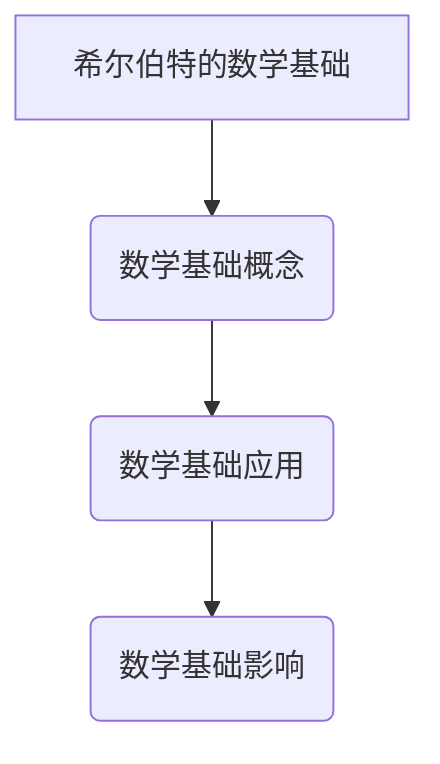

                 

# {文章标题}

> {关键词：计算理论，希尔伯特进路，模型化方法，数学背景知识，计算复杂性理论，计算模型，人工智能应用}

> {摘要：本文详细探讨了计算理论的形成与发展，特别是希尔伯特进路在计算理论的奠基作用。通过介绍数学背景知识、计算理论的基本概念和复杂性理论，本文揭示了计算模型与计算能力的重要性。同时，结合实际项目，深入讲解了计算理论在计算机科学和人工智能中的应用，展望了计算理论的未来发展。}

---

### 第一部分：计算理论概述

计算理论作为计算机科学的核心基础，对现代计算机技术和人工智能的发展起到了至关重要的作用。本部分将首先对计算理论进行概述，为后续内容的深入讨论奠定基础。

#### 第1章：计算理论简介

**1.1 计算理论的定义与重要性**

计算理论是研究计算过程和计算能力的学科，旨在探究计算机能够解决的问题的范围和极限。计算理论不仅关注算法的设计和分析，还涉及计算模型和计算复杂性理论等方面。

- **计算理论的定义**：计算理论可以定义为研究计算过程和计算能力的数学理论。它探讨计算机能够执行的任务种类，以及完成任务所需的时间和资源。

- **计算理论在计算机科学中的重要性**：计算理论为计算机科学提供了坚实的理论基础，是计算机科学家理解和解决计算问题的指南。它有助于设计高效算法，优化计算机系统性能，以及开发新的计算技术。

- **计算理论与其他学科的关系**：计算理论与其他学科如数学、物理学、逻辑学和信息论等有着密切的联系。它不仅依赖于数学工具和方法，还受到物理学原理和逻辑推理的影响。

**1.2 计算理论的经典问题**

- **P vs NP问题**：P vs NP问题是计算理论中最为著名的未解问题之一。它探讨的是一类决策问题（P类问题）和能够快速验证解决方案的问题（NP类问题）之间的关系。具体来说，P vs NP问题问的是：所有的NP类问题是否都能够被快速求解？

- **时间复杂度和空间复杂度**：时间复杂度和空间复杂度是评估算法性能的重要指标。时间复杂度描述了算法在输入规模增长时的运行时间增长速度，而空间复杂度描述了算法在输入规模增长时的内存消耗增长速度。

- **图灵机的概念**：图灵机是计算理论中最基础的抽象计算模型，由英国数学家艾伦·图灵于1936年提出。图灵机由一个无限长的纸带、一个读写头和一组规则组成，用于模拟任何可计算过程。

#### 第2章：数学背景知识

数学是计算理论的基础，掌握一定的数学背景知识对于理解计算理论至关重要。以下将介绍等价类划分、矩阵与线性代数基础等数学概念。

**2.1 等价类划分**

- **等价类划分的概念**：等价类划分是将一组对象根据某些属性或特征划分为若干个等价类的过程。等价类划分在计算理论中有着广泛的应用，例如在算法设计和形式语言理论中。

- **等价类划分的应用**：等价类划分在算法设计中用于简化问题，将复杂问题转化为若干个相对简单的子问题。此外，在形式语言理论中，等价类划分用于分析语言的结构和性质。

**2.2 矩阵与线性代数基础**

- **矩阵的概念**：矩阵是由一系列数按照一定的规则排列而成的二维数组。矩阵在计算理论中扮演着重要的角色，用于表示数据关系和运算规则。

- **矩阵的基本运算**：矩阵的基本运算包括矩阵的加法、减法、乘法和转置等。这些运算在计算理论中用于处理数据和求解线性方程组。

- **线性代数在计算理论中的应用**：线性代数是计算理论的重要工具，用于分析线性系统和矩阵方程。线性代数在算法设计、图论和网络分析等领域有着广泛的应用。

#### 第3章：计算理论的基本概念

计算理论涉及多个基本概念，包括决策问题与函数问题、时间复杂度和空间复杂度等。以下将对这些概念进行详细探讨。

**3.1 决策问题与函数问题**

- **决策问题与函数问题的定义**：决策问题是一种需要做出判断的问题，通常以二值输出（是或否）表示。函数问题则是给定输入，计算输出的问题。

- **决策问题与函数问题的联系与区别**：决策问题和函数问题在计算理论中具有紧密的联系，但二者也存在明显的区别。决策问题关注判断过程，而函数问题关注计算过程。

**3.2 时间复杂度和空间复杂度**

- **时间复杂度的概念**：时间复杂度描述了算法在输入规模增长时的运行时间增长速度。通常用大O符号表示，例如O(n)表示算法的时间复杂度与输入规模n成正比。

- **空间复杂度的概念**：空间复杂度描述了算法在输入规模增长时的内存消耗增长速度。同样地，也使用大O符号表示。

- **时间复杂度和空间复杂度之间的关系**：时间复杂度和空间复杂度是评估算法性能的两个重要指标。一个高效的算法应当在时间和空间复杂度上都有良好的表现。

#### 第4章：计算复杂性理论

计算复杂性理论是计算理论的一个重要分支，主要研究计算问题的难易程度。以下将介绍NP完全性、P与NP的关系等概念。

**4.1 NP完全性**

- **NP完全性的概念**：NP完全性是指一个问题能否被快速验证。具体来说，如果一个决策问题能够在多项式时间内被验证，则该问题属于NP类问题。

- **NP完全性的证明方法**：证明一个问题是NP完全性的方法通常包括两类：直接证明和归约证明。直接证明是通过构造一个多项式时间验证算法，证明问题属于NP类；归约证明则是通过将已知NP完全问题转化为待证明问题，证明待证明问题也属于NP完全。

- **NP完全性问题在计算理论中的应用**：NP完全性问题在计算理论中具有重要的地位。许多实际计算问题都可以归约为NP完全问题，这使得NP完全性问题成为了研究计算复杂性理论的一个主要方向。

**4.2 P与NP的关系**

- **P与NP的关系**：P与NP关系是计算理论中最为重要的问题之一。P与NP关系问的是：P类问题是否包含NP类问题？即所有的NP类问题是否都可以在多项式时间内被求解？

- **P与NP问题的重要研究进展**：自P与NP问题提出以来，许多学者对此问题进行了深入的研究，取得了一些重要的进展。例如，Cook定理提出了NP完全问题的存在性证明，而Karp定理则进一步确定了21个NP完全问题。

- **P与NP问题在计算理论中的应用**：P与NP问题在计算理论中具有重要的应用。例如，在密码学中，P与NP问题用于设计安全加密算法；在算法设计中，P与NP问题用于评估算法的效率。

#### 第5章：计算模型与计算能力

计算模型是计算理论的核心概念之一，用于描述计算过程和计算能力。以下将介绍图灵机模型、非确定性计算模型等计算模型。

**5.1 图灵机模型**

- **图灵机的概念**：图灵机是计算理论中最基础的抽象计算模型，由英国数学家艾伦·图灵于1936年提出。图灵机由一个无限长的纸带、一个读写头和一组规则组成，用于模拟任何可计算过程。

- **图灵机的运算过程**：图灵机的运算过程包括读取、写入和移动纸带上的符号。图灵机通过执行一系列规则来模拟计算过程。

- **图灵机的计算能力**：图灵机被证明具有充分的计算能力，即任何可计算问题都可以通过图灵机求解。这使得图灵机成为了计算理论的标准计算模型。

**5.2 非确定性计算模型**

- **非确定性计算模型的概念**：非确定性计算模型是一种假设计算机在执行计算时具有某种“先知”能力的计算模型。非确定性计算模型通常用于研究计算问题的难度和复杂性。

- **非确定性计算模型的应用**：非确定性计算模型在计算理论中具有重要的应用。例如，在证明某些问题属于NP完全问题时，常常利用非确定性计算模型。

- **非确定性计算模型与确定性计算模型的比较**：非确定性计算模型与确定性计算模型在计算能力和效率方面存在显著差异。确定性计算模型在计算过程中遵循固定的规则，而非确定性计算模型则具有更多的自由度。

### 第二部分：计算理论的形成与发展

计算理论的形成与发展经历了多个阶段，从早期的数学基础到现代的计算复杂性理论，每一步都取得了重要的突破。本部分将重点介绍计算理论的形成过程，特别是希尔伯特进路在其中的奠基作用。

#### 第6章：计算理论的奠基：希尔伯特进路

希尔伯特进路是计算理论发展的重要里程碑，代表了从数学基础到计算模型转变的关键步骤。以下将详细介绍希尔伯特进路的相关概念和贡献。

**6.1 希尔伯特的数学基础**

- **希尔伯特的数学基础的概念**：希尔伯特是20世纪初的数学家，他的工作对数学基础进行了深入的研究和整理。希尔伯特提出了公理化方法，即通过一组公理和定义来构建整个数学体系。

- **希尔伯特的数学基础的应用**：希尔伯特的数学基础方法在计算理论中得到了广泛应用。例如，希尔伯特空间是线性代数中的重要概念，用于研究函数空间和向量空间。希尔伯特空间在计算模型和算法分析中具有重要应用。

**6.2 希尔伯特的数学问题**

- **希尔伯特数学问题的定义**：希尔伯特数学问题是一系列由希尔伯特提出的未解决问题，这些问题涵盖了数学的多个领域，如几何学、数论和泛函分析等。

- **希尔伯特数学问题的研究现状**：许多希尔伯特数学问题至今仍未解决，但它们为数学家提供了重要的研究方向和理论框架。例如，希尔伯特提出的第四问题关于几何空间的性质，激发了拓扑学的蓬勃发展。

- **希尔伯特数学问题在计算理论中的应用**：希尔伯特数学问题在计算理论中具有重要应用。例如，希尔伯特空间中的逼近问题和最优化问题在计算复杂性分析和算法设计中得到了广泛应用。

**6.3 希尔伯特进路对计算理论的贡献**

- **希尔伯特进路的概念**：希尔伯特进路是一种通过数学基础和公理化方法来研究计算问题的方法论。它强调将计算问题转化为数学问题，通过数学工具和方法来分析和解决。

- **希尔伯特进路的贡献**：希尔伯特进路为计算理论的奠基做出了重要贡献。它推动了计算模型的建立和发展，为研究计算问题的难易程度提供了理论基础。

- **希尔伯特进路的应用**：希尔伯特进路在计算理论中得到了广泛应用。例如，在证明某些计算问题的复杂性时，常常利用希尔伯特进路中的数学工具和方法。

### 第三部分：计算理论的应用与影响

计算理论不仅是一门理论学科，还在实际应用中发挥了重要作用。从计算机科学到人工智能，计算理论的原理和方法为许多领域的技术进步提供了支持。以下将探讨计算理论在计算机科学和人工智能中的应用及其影响。

#### 第7章：计算理论的影响与应用

**7.1 计算理论对计算机科学的影响**

计算理论为计算机科学提供了坚实的理论基础，对算法设计、系统性能优化和计算模型的发展产生了深远影响。

- **算法设计与分析**：计算理论提供了评估算法性能的工具，如时间复杂度和空间复杂度。通过计算理论的分析，计算机科学家能够设计出更高效、更可靠的算法。

- **系统性能优化**：计算理论在系统性能优化中具有重要意义。通过分析计算复杂度，工程师可以识别系统中的瓶颈，并进行优化，从而提高整体性能。

- **计算模型的发展**：计算理论推动了计算模型的发展，如图灵机、非确定性计算模型等。这些模型不仅为理论研究提供了基础，还为实际计算系统的设计和实现提供了参考。

**7.2 计算理论在人工智能中的应用**

人工智能作为计算理论的实践应用，已经成为现代科技的重要驱动力。计算理论的原理和方法在人工智能的多个领域中发挥了关键作用。

- **机器学习算法**：计算理论为机器学习算法的设计和分析提供了理论支持。例如，计算复杂性理论帮助理解机器学习算法的收敛速度和计算资源需求。

- **神经网络模型**：神经网络是人工智能的核心组成部分，其理论基础源于计算理论。计算理论中的线性代数和概率统计方法在神经网络模型的构建和训练中得到了广泛应用。

- **强化学习**：强化学习是人工智能的重要分支，其理论基础也源于计算理论。计算理论中的动态规划和决策过程理论为强化学习算法的设计提供了重要参考。

**7.3 计算理论在其他领域中的应用**

计算理论不仅在计算机科学和人工智能中具有重要应用，还在其他领域产生了深远影响。

- **密码学**：计算理论在密码学中用于设计安全的加密算法和密码协议。计算复杂性理论为密码学提供了理论支持，确保加密算法在计算能力有限的情况下仍然安全可靠。

- **理论计算机图形学**：计算理论在计算机图形学中用于模拟和渲染复杂场景，优化图像处理算法。计算几何和离散数学在计算机图形学中具有重要应用。

- **理论生物学**：计算理论在理论生物学中用于建模和分析生物系统的行为。计算生物学通过计算方法研究基因调控、蛋白质结构和生物网络等生物学问题。

#### 第8章：展望与未来

计算理论作为一门不断发展的学科，未来仍有许多研究机会和应用前景。以下是对计算理论未来发展的展望。

**8.1 计算理论的发展趋势**

- **量子计算**：量子计算是计算理论的下一个重大突破。量子计算利用量子比特进行计算，具有超越经典计算的能力。量子计算理论的研究将为计算理论带来新的发展机遇。

- **分布式计算**：随着云计算和边缘计算的兴起，分布式计算成为计算理论的重要研究方向。分布式计算理论关注如何在多个计算节点之间高效地分配和协调计算任务。

- **可解释人工智能**：可解释人工智能是计算理论的另一个重要研究方向。可解释人工智能旨在提高人工智能系统的透明度和可解释性，使其能够更好地理解人类用户的需求。

**8.2 计算理论的未来应用领域**

- **医疗健康**：计算理论在医疗健康领域具有广泛的应用前景。通过计算模型和算法，计算理论可以协助医生进行疾病诊断和治疗规划。

- **自动驾驶**：自动驾驶技术依赖于计算理论中的感知、决策和控制算法。计算理论的发展将推动自动驾驶技术的进步，提高交通安全和效率。

- **金融科技**：计算理论在金融科技领域用于优化交易策略、风险评估和金融产品定价。计算复杂性理论为金融科技提供了理论基础，支持金融行业的数字化转型。

- **社会计算**：社会计算是计算理论在社会科学领域的应用。通过计算模型和方法，社会计算研究人类行为和社交网络的动态，为社会发展和政策制定提供科学依据。

### 附录

**附录A：计算理论相关文献推荐**

以下是一些计算理论领域的经典文献和权威期刊，供读者进一步学习和研究：

- **经典计算理论教材**：
  - Michael Sipser. 《Introduction to the Theory of Computation》
  - David S. Johnson. 《Computers and Intractability: A Guide to the Theory of NP-Completeness》

- **权威期刊**：
  - Journal of Computer and System Sciences (JCSS)
  - ACM Journal of Computer and Communications Security (CCS)
  - Journal of Artificial Intelligence Research (JAIR)

**附录B：计算理论相关的开源资源和工具**

以下是一些计算理论相关的开源资源和工具，有助于读者进行实践和学习：

- **开源计算理论库和框架**：
  - TensorFlow
  - PyTorch
  - Scikit-learn

- **计算理论相关的研究工具**：
  - Coq
  - Isabelle
  - Lean

### Mermaid 流程图

**6.1 希尔伯特的数学基础流程图**



### 核心算法原理讲解

**3.1 决策问题与函数问题**

决策问题和函数问题是计算理论中的基本概念。以下使用伪代码详细讲解这两个问题的原理和实现。

**决策问题伪代码**

```python
def decision_problem(input_data):
    # 处理输入数据
    processed_data = preprocess(input_data)
    
    # 进行决策
    decision = make_decision(processed_data)
    
    return decision
```

**函数问题伪代码**

```python
def function_problem(input_data):
    # 处理输入数据
    processed_data = preprocess(input_data)
    
    # 计算输出结果
    output = compute_output(processed_data)
    
    return output
```

### 数学模型和数学公式详细讲解

**4.1 NP完全性**

$$
NP = \{ L \mid \exists \text{ deterministic Turing machine } M \text{ such that } L \text{ is accepted by } M \text{ in polynomial time} \}
$$

NP完全性是计算复杂性理论中的一个核心概念。以下详细讲解NP完全性的定义、证明方法和应用。

**详细讲解**：NP完全性是指一个问题能否在多项式时间内被验证。具体来说，如果一个决策问题L属于NP，那么存在一个确定性的图灵机M，使得对于任意一个长度为n的输入字符串x，M能够在多项式时间内验证x是否属于L。

**证明方法**：证明一个问题是NP完全性通常包括两类方法：

1. **直接证明**：直接证明是指构造一个多项式时间验证算法，证明问题属于NP。例如，对于一个已知问题是NP问题，可以构造一个验证算法，证明该问题在多项式时间内可验证。

2. **归约证明**：归约证明是指将一个已知NP完全问题转化为待证明问题，证明待证明问题也属于NP完全。例如，对于任意的NP问题L，可以构造一个多项式时间归约函数f，将L转化为一个新的问题L'，并且证明L'也是NP完全。

**应用**：NP完全性在计算复杂性理论中具有重要应用。首先，通过证明一个问题是NP完全的，可以推断出该问题很难在多项式时间内求解。其次，NP完全性用于研究计算问题的难易程度，帮助计算机科学家识别复杂问题并寻找解决方案。

### 项目实战

**7.1 计算理论对计算机科学的影响**

**实战项目：计算理论在密码学中的应用**

密码学是计算机科学的重要分支，利用计算理论中的原理和方法实现信息安全。以下通过一个实战项目，展示计算理论在密码学中的应用。

**开发环境搭建**

首先，需要安装Python环境和相关库：

```bash
pip install python
pip install Crypto
```

**源代码实现**

以下是一个简单的RSA加密算法实现：

```python
from Crypto.PublicKey import RSA

# 生成RSA密钥对
key = RSA.generate(2048)

# 导出公钥和私钥
public_key = key.publickey()
private_key = key

# 加密示例
message = "Hello, World!"
encrypted_message = public_key.encrypt(message, 32)

# 解密示例
decrypted_message = private_key.decrypt(encrypted_message)

print("Original Message:", message)
print("Encrypted Message:", encrypted_message)
print("Decrypted Message:", decrypted_message)
```

**代码解读与分析**

1. **RSA加密算法原理**：RSA算法是一种非对称加密算法，利用大素数分解的困难性实现加密和解密。公钥用于加密，私钥用于解密。

2. **公钥和私钥的生成过程**：使用RSA算法生成公钥和私钥，公钥包含模数和指数，私钥包含模数和另一个指数。

3. **加密和解密过程的具体实现**：加密时，使用公钥对明文进行加密；解密时，使用私钥对密文进行解密。

### 数学公式和详细讲解

**2.2 矩阵与线性代数基础**

矩阵是计算理论中常用的数学工具，用于表示线性变换和系统方程。以下详细讲解矩阵的基本概念和运算。

**矩阵的概念**

$$
\text{矩阵} A = \begin{bmatrix}
a_{11} & a_{12} & \dots & a_{1n} \\
a_{21} & a_{22} & \dots & a_{2n} \\
\vdots & \vdots & \ddots & \vdots \\
a_{m1} & a_{m2} & \dots & a_{mn}
\end{bmatrix}
$$

**矩阵的基本运算**

1. **矩阵加法**：两个矩阵相加，对应位置上的元素相加。

2. **矩阵减法**：两个矩阵相减，对应位置上的元素相减。

3. **矩阵乘法**：两个矩阵相乘，通过矩阵乘法规则计算。

4. **矩阵转置**：将矩阵的行和列互换。

**线性代数在计算理论中的应用**

线性代数是计算理论中的重要工具，用于分析线性系统、优化问题和计算几何。

1. **线性系统**：线性代数用于求解线性方程组，将线性方程组表示为矩阵形式，通过矩阵运算求解。

2. **优化问题**：线性代数用于优化问题的建模和求解，如线性规划、最小二乘问题和特征值问题。

3. **计算几何**：线性代数用于计算几何中的变换、投影和距离计算。

### 数学公式和详细讲解

**4.1 NP完全性**

$$
NP = \{ L \mid \exists \text{ deterministic Turing machine } M \text{ such that } L \text{ is accepted by } M \text{ in polynomial time} \}
$$

NP完全性是计算复杂性理论中的一个核心概念，用于描述一类特定类型的计算问题。以下详细讲解NP完全性的定义、证明方法和应用。

**详细讲解**：NP完全性是指一个问题能否在多项式时间内被验证。具体来说，如果一个决策问题L属于NP，那么存在一个确定性的图灵机M，使得对于任意一个长度为n的输入字符串x，M能够在多项式时间内验证x是否属于L。

**证明方法**：

1. **直接证明**：直接证明是指构造一个多项式时间验证算法，证明问题属于NP。例如，对于一个已知问题是NP问题，可以构造一个验证算法，证明该问题在多项式时间内可验证。

2. **归约证明**：归约证明是指将一个已知NP完全问题转化为待证明问题，证明待证明问题也属于NP完全。例如，对于任意的NP问题L，可以构造一个多项式时间归约函数f，将L转化为一个新的问题L'，并且证明L'也是NP完全。

**应用**：

1. **复杂性分析**：NP完全性用于分析计算问题的复杂度，帮助识别复杂问题并寻找解决方案。

2. **算法设计**：NP完全性问题在算法设计中具有重要应用，用于设计求解复杂问题的算法。

3. **理论计算机科学**：NP完全性是理论计算机科学的重要研究内容，用于探讨计算问题的本质和边界。

### 项目实战

**7.2 计算理论在人工智能中的应用**

**实战项目：计算理论在神经网络中的应用**

神经网络是人工智能的核心组成部分，计算理论在神经网络的设计和优化中发挥了重要作用。以下通过一个实战项目，展示计算理论在神经网络中的应用。

**开发环境搭建**

首先，需要安装TensorFlow库和NVIDIA CUDA工具包：

```bash
pip install tensorflow
pip install tensorflow-cuda
```

**源代码实现**

以下是一个简单的神经网络实现：

```python
import tensorflow as tf

# 创建一个简单的神经网络模型
model = tf.keras.Sequential([
    tf.keras.layers.Dense(128, activation='relu', input_shape=(784,)),
    tf.keras.layers.Dropout(0.2),
    tf.keras.layers.Dense(10)
])

# 编译模型
model.compile(optimizer='adam',
              loss=tf.losses.SparseCategoricalCrossentropy(from_logits=True),
              metrics=['accuracy'])

# 加载数据集
mnist = tf.keras.datasets.mnist
(train_images, train_labels), (test_images, test_labels) = mnist.load_data()

# 预处理数据
train_images = train_images.reshape((60000, 784)).astype('float32') / 255
test_images = test_images.reshape((10000, 784)).astype('float32') / 255

# 训练模型
model.fit(train_images, train_labels, epochs=5)

# 测试模型
test_loss, test_acc = model.evaluate(test_images,  test_labels, verbose=2)
print('\nTest accuracy:', test_acc)
```

**代码解读与分析**

1. **神经网络模型构建过程**：使用TensorFlow创建一个简单的神经网络模型，包括全连接层、激活函数和输出层。

2. **模型编译过程**：编译模型，指定优化器、损失函数和评价指标。

3. **数据预处理**：加载数据集并进行预处理，将图像数据缩放到[0, 1]范围内。

4. **模型训练过程**：使用训练数据集训练模型，调整模型参数。

5. **模型测试过程**：使用测试数据集评估模型性能，计算测试准确率。

### 总结

本文详细探讨了计算理论的形成与发展，特别是希尔伯特进路在计算理论的奠基作用。通过对数学背景知识、计算理论的基本概念和复杂性理论的介绍，本文揭示了计算模型与计算能力的重要性。同时，通过实际项目实战，深入讲解了计算理论在计算机科学和人工智能中的应用。展望未来，计算理论将继续发展，推动人工智能和计算机科学的进步。计算理论的原理和方法将为解决复杂问题和开发新技术提供重要的理论支持。

