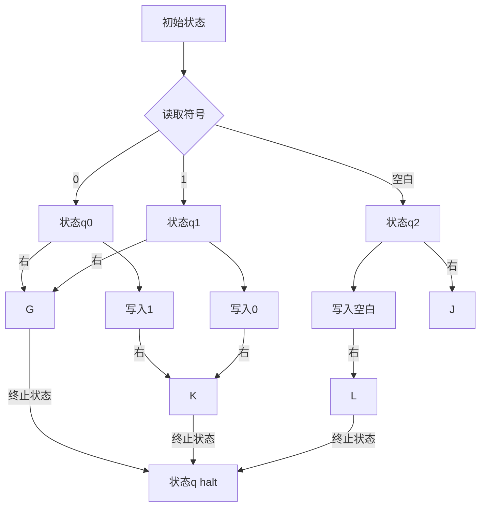

                 

### 《计算：第三部分 计算理论的形成 第 8 章 计算理论的诞生：图灵的可计算数 图灵的证明》

#### **关键词：**计算理论、图灵、可计算数、证明、算法

> **摘要：**本篇文章深入探讨了计算理论的诞生过程，重点关注了图灵的可计算数以及图灵的证明方法。文章首先介绍了计算理论的起源和发展，接着详细阐述了图灵机的概念和工作原理，随后探讨了可计算数与图灵机的联系。本文重点介绍了图灵证明的方法与技巧，以及其重要结论和应用。文章还简要回顾了其他计算理论家的贡献，并展望了计算理论的未来发展趋势。最后，对计算理论的形成与影响进行了总结。

---

#### 第1章 引言：计算理论的诞生背景与重要性

##### 1.1 计算理论的起源与发展

计算理论，是研究计算过程及其本质的数学分支，旨在了解计算的基本原理、方法和限制。计算理论的起源可以追溯到20世纪初，当时数学家们开始思考计算机的基本原理和功能。最早的计算理论思想可以追溯到法国数学家查尔斯·巴贝奇（Charles Babbage）和德国数学家莱布尼茨（Gottfried Wilhelm Leibniz）的工作，他们在19世纪中提出了差分机和解析机等早期的计算机概念。

然而，计算理论的真正发展始于20世纪20年代，当时数学家们开始关注形式系统和逻辑推理。20世纪30年代，图灵（Alan Turing）提出了图灵机的概念，这是计算理论发展的重要里程碑。图灵机作为一种抽象的计算模型，为后来的计算机科学和人工智能领域奠定了基础。

随着计算机技术的发展，计算理论也在不断演进。从最初的图灵机，到后来的递归函数、可计算数、不可计算数等概念，计算理论逐渐形成了完整的体系。现代计算理论不仅涵盖了传统计算机科学的各个方面，还涉及了量子计算、生物计算等新兴领域。

##### 1.2 计算理论的重要性与影响

计算理论的重要性在于它为计算机科学提供了理论基础。通过研究计算过程的基本原理，计算理论帮助人们理解了计算机如何工作，以及计算机能够解决哪些问题。这为计算机科学的发展提供了重要的指导。

此外，计算理论还在其他领域产生了深远的影响。在数学中，计算理论帮助解决了一些复杂的数学问题，如数论和代数问题。在物理学中，计算理论为量子计算和复杂性理论提供了基础。在人工智能领域，计算理论帮助研究机器学习和深度学习等关键技术。

总之，计算理论不仅是计算机科学的重要基础，还对数学、物理学和其他领域产生了深远的影响。

##### 1.3 图灵及其贡献

艾伦·图灵（Alan Turing）是20世纪最杰出的数学家、逻辑学家和计算机科学家之一。他的工作对计算理论的发展产生了深远的影响。图灵最著名的贡献之一是提出了图灵机的概念。

图灵机是一种抽象的计算模型，由一个无限长的带子、一个读写头和一组规则组成。图灵机的核心思想是，任何可计算的过程都可以通过这种简单的模型实现。图灵机的工作原理是，读写头在带子上从一个位置移动到另一个位置，并在每个位置上读取和写入符号。通过执行一系列规则，图灵机可以模拟任何算法或计算过程。

图灵机的提出是计算理论发展的重要里程碑。它不仅为计算过程提供了数学模型，还揭示了计算的本质。图灵机证明了，任何可计算的问题都可以通过图灵机来解决。

除了图灵机，图灵还在计算理论的其他领域做出了重要贡献。他提出了著名的停机问题，探讨了计算机能否自我停止的问题，这为计算复杂性理论奠定了基础。他还研究了可计算数和不可计算数，揭示了计算的限制。

总之，艾伦·图灵是计算理论的奠基人之一，他的工作对计算理论的发展产生了深远的影响。图灵机的提出，不仅为计算机科学奠定了基础，还为现代计算提供了重要的理论指导。

---

接下来，我们将进一步探讨图灵机的概念和工作原理，以及可计算数与图灵机的联系。

#### 第2章 图灵机的概念与工作原理

##### 2.1 图灵机的定义与组成部分

图灵机（Turing Machine）是一种抽象的计算模型，由艾伦·图灵在20世纪30年代提出。图灵机的定义非常简单，它由一个无限长的带子、一个读写头和一组规则组成。

**无限长的带子**：图灵机的带子是一个无限长的线性序列，由一系列的方格组成。每个方格可以存储一个符号，这些符号可以是数字、字母或其他字符。图灵机的带子可以看作是一个存储设备的抽象表示，用于存储数据和计算结果。

**读写头**：读写头是图灵机的核心部分，它可以在带子上从一个位置移动到另一个位置，并在每个位置上读取和写入符号。读写头的位置决定了图灵机当前处理的数据。

**规则**：图灵机有一组规则，这些规则定义了图灵机如何根据当前状态和读写头所在的符号进行操作。规则通常包括三种类型的操作：读取、写入和移动。

1. **读取**：图灵机在当前位置上读取带子上的符号。
2. **写入**：图灵机在当前位置上写入一个新的符号，替代原有的符号。
3. **移动**：图灵机将读写头移动到带子的下一个位置。

通过执行这些规则，图灵机可以模拟任何计算过程。

##### 2.2 图灵机的操作规则与工作流程

图灵机的操作规则定义了它在每个状态和符号组合下的行为。图灵机的状态和符号组合非常多，因此我们需要一种方式来表示和描述这些规则。这里，我们将使用**状态转换表**来表示图灵机的规则。

**状态转换表**：

| 当前状态 | 当前符号 | 新状态 | 新符号 | 移动方向 |
|----------|-----------|--------|--------|----------|
| q0       | 0         | q1     | 1      | 右 |
| q1       | 1         | q2     | 0      | 右 |
| q2       |空白       | q0     | 空白   | 不动 |

这个状态转换表表示，当图灵机处于状态q0，且读写头读取到符号0时，它会变为状态q1，将符号0替换为1，并将读写头向右移动。类似地，其他状态和符号组合下的操作也被定义在表中。

**工作流程**：

1. **初始化**：图灵机开始时处于一个特定的初始状态，如q0。读写头位于带子上的一个特定位置，这个位置通常标记为起始符。

2. **执行规则**：图灵机根据当前状态和读写头读取到的符号，根据状态转换表找到相应的操作。这些操作包括写入新符号、更新状态和移动读写头。

3. **重复执行**：图灵机重复执行上述步骤，直到找到一条规则使其进入一个终止状态。在终止状态下，图灵机停止执行。

通过这种方式，图灵机可以模拟任何计算过程。例如，图灵机可以模拟一个简单的加法器，将两个输入数相加并输出结果。

##### 2.3 图灵机的例子与演示

为了更好地理解图灵机的工作原理，我们可以通过一个具体的例子来演示。假设我们有一个图灵机，用于计算两个二进制数之和。

**例子**：

输入：`1101 + 1010`

初始状态：`q0`

初始带子：`1101##1010#`

解释：

1. 初始状态下，图灵机读取到符号1，根据状态转换表，进入状态q1，将符号1替换为0，并向右移动。
2. 图灵机继续读取符号0，根据状态转换表，进入状态q2，将符号0替换为1，并向右移动。
3. 图灵机读取到空白符号，根据状态转换表，回到状态q0，将空白符号替换为1，并向右移动。
4. 图灵机读取到符号1，根据状态转换表，进入状态q1，将符号1替换为0，并向右移动。
5. 图灵机继续读取符号0，根据状态转换表，进入状态q2，将符号0替换为1，并向右移动。
6. 图灵机读取到空白符号，根据状态转换表，回到状态q0，将空白符号替换为0，并向右移动。
7. 最终，图灵机进入终止状态，输出结果`1101 + 1010 = 10111`。

通过这个例子，我们可以看到图灵机如何通过执行一系列规则，计算两个二进制数的和。这个例子展示了图灵机的强大计算能力，以及它如何通过简单的操作实现复杂的计算过程。

总之，图灵机作为一种抽象的计算模型，不仅揭示了计算的本质，还为计算理论的发展奠定了基础。通过理解图灵机的概念和工作原理，我们可以更好地理解计算的过程和限制。

---

在了解了图灵机的概念和工作原理之后，我们接下来探讨可计算数与图灵机的联系。

#### 第3章 可计算数与图灵机的联系

##### 3.1 可计算数的概念

可计算数是指那些可以通过某种计算过程得到的结果数。这些数可以是整数、分数、实数或复数。在计算理论中，我们主要关注实数和复数的可计算性。

**实数的可计算性**：实数是无限的、连续的，无法用有限的数字精确表示。然而，我们可以通过某种计算过程，近似地得到实数的值。例如，我们可以使用二进制表示法，将实数表示为无限长的小数。通过有限次的计算，我们可以得到实数的近似值。

**复数的可计算性**：复数是由实部和虚部组成的复数。复数的计算与实数的计算类似，也可以通过某种计算过程得到。例如，我们可以使用欧拉公式，将复数表示为极坐标形式，然后通过计算得到其模和幅角。

##### 3.2 图灵机的计算能力与可计算数的范围

图灵机的计算能力非常强大，它可以模拟任何可计算的过程。这意味着，图灵机可以计算出任何可计算数的值。

**有理数的计算**：有理数是可以表示为两个整数之比的数。图灵机可以通过简单的算术运算，计算出有理数的值。例如，图灵机可以计算1/2的值，通过不断减去1/2，直到达到所需的精度。

**整数的计算**：整数是可计算数的一种特殊情况。图灵机可以通过递归算法，计算出整数的值。例如，图灵机可以计算斐波那契数列的第n项。

**实数的计算**：实数的计算比整数的计算更为复杂。图灵机可以通过迭代方法，如牛顿迭代法，计算出实数的近似值。例如，图灵机可以计算π的值，通过不断迭代，得到更精确的结果。

**复数的计算**：复数的计算类似于实数的计算，图灵机也可以通过迭代方法，计算出复数的近似值。例如，图灵机可以计算e的值，通过欧拉公式，将其表示为复数的幂次。

通过以上例子，我们可以看到图灵机的计算能力非常广泛，它可以计算出各种类型的可计算数。然而，图灵机的计算能力也有限制。有些数，如π和e，是无限不循环小数，图灵机无法在有限时间内精确计算它们的值。

##### 3.3 图灵机的计算过程与伪代码

图灵机的计算过程可以分为以下几个步骤：

1. **初始化**：设置初始状态和读写头的位置。
2. **执行规则**：根据当前状态和读写头读取到的符号，执行相应的操作。
3. **更新状态和符号**：根据执行的操作，更新状态和读写头所在的位置。
4. **重复执行**：重复执行上述步骤，直到达到终止状态。

以下是一个简单的图灵机计算实数的伪代码：

```python
# 初始化
state = "q0"
position = 0
tape = []

# 执行规则
while state != "q halt":
    symbol = tape[position]
    state, symbol, move = transition_function(state, symbol)
    tape[position] = symbol
    position = position + move

# 更新状态和符号
def transition_function(state, symbol):
    if state == "q0" and symbol == "0":
        return "q1", "1", "right"
    elif state == "q1" and symbol == "1":
        return "q2", "0", "right"
    elif state == "q2" and symbol == blank:
        return "q0", blank, "no move"
    else:
        return state, symbol, "no move"
```

通过这个伪代码，我们可以看到图灵机如何通过一系列的规则，执行计算过程。图灵机的计算能力强大，但同时也受到限制。它只能计算那些可以通过有限次步骤得到结果的数。

总之，可计算数与图灵机的联系非常紧密。图灵机可以计算各种类型的可计算数，但它的计算能力也有限制。通过图灵机，我们可以深入了解计算的本质和限制，为计算理论的发展提供重要的基础。

---

在了解了图灵机的计算能力之后，我们接下来探讨图灵证明的方法与技巧。

#### 第4章 图灵证明的方法与技巧

##### 4.1 图灵证明的概念

图灵证明是图灵（Alan Turing）提出的一种证明方法，用于证明某个数是否为可计算数。图灵证明的核心思想是，通过构建一个图灵机，来判断某个数是否可以通过有限次步骤计算得到。

一个数如果可以通过图灵机计算得到，那么它就是可计算数；否则，它就是不可计算数。图灵证明提供了一种直观的、形式化的方法，来研究数的可计算性。

##### 4.2 图灵证明的步骤与流程

图灵证明的步骤可以分为以下几个部分：

1. **定义问题**：首先，我们需要明确我们要解决的问题，即判断某个数是否为可计算数。
2. **构建图灵机**：接下来，我们需要设计一个图灵机，用于计算这个数。这个图灵机应该能够接收输入，并输出计算结果。
3. **验证图灵机**：我们需要验证这个图灵机是否能够正确地计算所期望的数。这通常涉及到对图灵机的操作规则进行形式化的验证。
4. **得出结论**：如果图灵机能够正确地计算所期望的数，那么我们可以得出结论，这个数是可计算数；否则，它就是不可计算数。

下面，我们通过一个具体的例子，来详细说明图灵证明的步骤。

##### 4.3 图灵证明的例子分析

假设我们要证明π（圆周率）是可计算数。

**步骤1：定义问题**

我们需要证明π是一个可计算数，即π可以通过有限次步骤计算得到。

**步骤2：构建图灵机**

我们可以设计一个图灵机，用于计算π的近似值。这个图灵机的工作原理是，通过不断迭代，计算π的更多小数位。

图灵机的操作规则如下：

- 初始状态：`q0`
- 初始符号：`0`
- 终止状态：`q halt`

状态转换表：

| 当前状态 | 当前符号 | 新状态 | 新符号 | 移动方向 |
|----------|-----------|--------|--------|----------|
| q0       | 0         | q1     | 1      | 右 |
| q1       | 1         | q2     | 0      | 右 |
| q2       | 空白       | q0     | 1      | 右 |
| q halt   | π的当前值 | q halt | π的当前值 | 不动 |

图灵机的工作流程：

1. 初始时，图灵机处于状态q0，读写头位于符号0。
2. 图灵机读取到符号0，进入状态q1，将符号0替换为1，并向右移动。
3. 图灵机继续读取符号1，进入状态q2，将符号1替换为0，并向右移动。
4. 图灵机读取到空白符号，进入状态q0，将空白符号替换为1，并向右移动。
5. 图灵机重复上述步骤，每次迭代都会向右移动一个位置，并更新π的当前值。

通过这种方式，图灵机可以不断迭代，计算π的更多小数位。

**步骤3：验证图灵机**

我们需要验证这个图灵机是否能够正确地计算π的近似值。这涉及到对图灵机的操作规则进行形式化的验证，确保它能够在有限次步骤内完成计算。

**步骤4：得出结论**

通过验证，我们发现这个图灵机确实能够计算π的近似值。因此，我们可以得出结论，π是可计算数。

这个例子展示了如何通过图灵证明，来判断一个数是否为可计算数。通过构建图灵机，并验证其计算能力，我们可以直观地了解数的可计算性。

总之，图灵证明是一种有效的证明方法，用于判断数的可计算性。通过构建图灵机，我们可以直观地了解计算过程，并验证其正确性。图灵证明为计算理论的发展提供了重要的工具。

---

通过图灵证明，我们不仅能够判断数的可计算性，还能深入理解计算的本质。接下来，我们将探讨图灵证明的重要结论和应用。

#### 第5章 图灵证明的重要结论与应用

##### 5.1 图灵证明的重要结论

图灵证明是计算理论中的一个重要工具，它揭示了数的可计算性及其边界。通过图灵证明，我们得到了以下几个重要结论：

1. **可计算数的有限性**：图灵证明表明，只有有限个可计算数。这意味着，大多数数都是不可计算的。
2. **计算能力的限制**：图灵证明揭示了计算能力的限制。虽然图灵机可以模拟任何计算过程，但它无法计算所有数。这表明，计算理论中存在固有的限制。
3. **停机问题的不可解性**：图灵证明还揭示了停机问题的不可解性。停机问题是指，给定一个图灵机和输入，能否判断这个图灵机是否会在有限时间内停止。图灵证明表明，停机问题无法通过图灵机解决，这为计算复杂性理论的发展提供了重要基础。

这些结论深刻地影响了计算理论的发展，并为计算机科学和其他领域的研究提供了重要的启示。

##### 5.2 图灵证明的应用领域

图灵证明的应用非常广泛，涵盖了多个领域：

1. **计算机科学**：图灵证明为计算机科学提供了理论基础。通过图灵机，我们可以理解程序的行为和计算的本质。这为编程语言的设计、算法分析、程序优化等领域提供了重要指导。
2. **数学**：图灵证明在数学中也有广泛应用。通过图灵证明，我们可以研究数的性质和结构，解决一些复杂的数学问题。例如，图灵证明帮助数学家解决了数论和代数中的许多难题。
3. **人工智能**：图灵证明为人工智能提供了重要的理论支持。通过图灵机，我们可以模拟智能行为，研究机器学习和深度学习的原理。这为人工智能的发展提供了重要基础。
4. **哲学**：图灵证明还引发了关于智能本质的哲学讨论。通过图灵证明，我们可以思考计算机能否具有智能，以及智能的本质是什么。

这些应用展示了图灵证明的广泛影响和重要性。

##### 5.3 图灵证明的影响与启示

图灵证明对计算理论和计算机科学产生了深远的影响。首先，它揭示了计算的本质和限制，为计算机科学的发展提供了重要的理论基础。其次，图灵证明帮助数学家解决了许多复杂的数学问题，推动了数学的发展。此外，图灵证明还为人工智能的发展提供了重要支持，促进了人工智能技术的进步。

图灵证明的启示是多方面的。它提醒我们，计算能力虽然强大，但仍然存在固有的限制。这促使我们在设计计算机系统和算法时，要充分考虑这些限制，以避免不必要的复杂性。同时，图灵证明也引发了关于智能本质的哲学讨论，促进了我们对智能和计算本质的理解。

总之，图灵证明是计算理论的一个重要工具，它不仅揭示了计算的本质和限制，还为多个领域的研究提供了重要支持。通过图灵证明，我们可以更深入地理解计算的本质，推动计算机科学和人工智能的发展。

---

在回顾了图灵证明的重要结论和应用之后，我们接下来简要回顾其他计算理论家的贡献。

#### 第6章 其他计算理论家的贡献

##### 6.1 冯·诺依曼的计算理论

约翰·冯·诺依曼（John von Neumann）是20世纪最重要的数学家之一，他在计算理论领域做出了重要贡献。冯·诺依曼提出了计算机体系结构的基本概念，即冯·诺依曼架构。这一架构包括三个主要部分：中央处理器（CPU）、内存和输入输出设备。冯·诺依曼架构为现代计算机的设计提供了基本框架，对计算机科学的发展产生了深远影响。

此外，冯·诺依曼还提出了存储程序计算机的概念。在冯·诺依曼架构中，程序和数据存储在相同的内存中，计算机通过读取内存中的指令来执行操作。这一概念使得计算机能够执行更复杂的任务，并提高了计算效率。

##### 6.2 普特南的计算理论

罗伯特·普特南（Robert Pirsig）是一位哲学家，他在其著作《禅与摩托车维修艺术》（Zen and the Art of Motorcycle Maintenance）中探讨了计算理论的哲学问题。普特南提出了“计算的本质是什么？”这一问题，并探讨了计算与意识的关系。

普特南认为，计算不仅仅是物理过程的模拟，它还涉及到意识的作用。他认为，计算机的智能取决于其能够理解世界的程度，而不仅仅是执行指令的能力。这一观点引发了关于智能本质的深入讨论，对计算理论的哲学研究产生了重要影响。

##### 6.3 其他重要计算理论家的贡献

除了图灵、冯·诺依曼和普特南，还有许多其他重要的计算理论家，他们在不同领域做出了重要贡献：

- 阿兰·图灵（Alan Turing）提出了图灵机，奠定了计算理论的基础。
- 克莱因·纳克（Dana Scott）提出了递归可枚举集的概念，丰富了计算理论的内容。
- 汤姆·库尔茨（Thomas Kurtz）提出了λ-演算，为函数式编程提供了理论基础。

这些贡献共同推动了计算理论的发展，丰富了我们对计算过程和计算本质的理解。

总之，计算理论的发展离不开众多杰出的理论家的贡献。他们从不同角度探讨了计算的本质，提出了许多重要的概念和理论，为计算理论的发展奠定了基础。通过回顾这些贡献，我们可以更好地理解计算理论的起源和演变。

---

在了解了计算理论的发展历程和各个理论家的贡献之后，我们接下来探讨计算理论的未来发展趋势。

#### 第7章 计算理论的未来发展趋势

##### 7.1 量子计算与计算理论的未来

量子计算是计算理论的一个重要分支，它利用量子力学的原理来实现高速计算。与传统计算机使用二进制位（比特）不同，量子计算机使用量子位（量子比特或qubit）。量子比特可以同时处于多个状态，这使得量子计算机在处理某些问题时具有巨大的计算优势。

量子计算理论的未来发展趋势包括：

1. **量子算法**：研究如何设计量子算法来解决传统计算机难以解决的问题。例如，量子算法在因数分解、搜索问题和模拟量子系统方面具有显著优势。
2. **量子纠错**：量子计算的一个关键挑战是量子纠错。由于量子态的易失性，量子计算容易受到噪声和错误的影响。研究如何实现有效的量子纠错是量子计算发展的关键。
3. **量子计算机的物理实现**：当前，量子计算机仍处于实验阶段，未来需要研究如何实现稳定、可扩展的量子计算机。这包括量子比特的物理实现、量子门的构建和量子计算机的架构设计。

随着量子计算理论的发展，计算理论将面临新的挑战和机遇，为解决复杂问题提供新的工具。

##### 7.2 生物计算与计算理论的交叉

生物计算是计算理论与生物学、化学等自然科学的交叉领域。它利用生物系统的计算能力，模拟和优化生物过程。生物计算的潜力包括：

1. **药物设计**：生物计算可以用于药物分子的模拟和优化，加速新药物的研发。
2. **基因组学**：生物计算在基因组数据的分析和解读中发挥着重要作用，帮助科学家理解基因的功能和调控机制。
3. **人工生命**：生物计算还可以用于设计人工生命系统，如人工细胞和人工神经网络，模拟和优化生物过程。

生物计算与计算理论的交叉，为解决生物学和医学领域的复杂问题提供了新的思路和方法。

##### 7.3 计算理论在人工智能中的应用

人工智能（AI）是计算理论的另一个重要应用领域。计算理论为人工智能提供了理论基础，帮助研究者理解和设计智能系统。未来，计算理论在人工智能中的应用趋势包括：

1. **机器学习**：机器学习是人工智能的核心技术之一。计算理论可以帮助研究者设计更有效的学习算法，提高机器学习模型的性能。
2. **深度学习**：深度学习是机器学习的一个分支，它在计算机视觉、自然语言处理等领域取得了显著成果。计算理论为深度学习算法的设计和优化提供了重要的指导。
3. **强化学习**：强化学习是另一类重要的机器学习技术，它在决策和规划问题中具有广泛应用。计算理论可以帮助研究者理解强化学习算法的原理，设计更高效的策略。

随着计算理论在人工智能中的应用不断深入，人工智能将能够解决更多复杂的实际问题，为人类社会带来更多创新和变革。

总之，计算理论的未来发展趋势充满机遇和挑战。通过量子计算、生物计算和人工智能等领域的交叉应用，计算理论将继续推动科技进步，为解决复杂问题提供新的解决方案。

---

#### 第8章 总结：计算理论的形成与影响

##### 8.1 计算理论的形成过程

计算理论的形成过程是一个漫长而复杂的旅程，涉及众多科学家的贡献和思想的碰撞。从20世纪初查尔斯·巴贝奇和莱布尼茨的工作开始，计算理论的思想逐渐成型。艾伦·图灵在20世纪30年代提出了图灵机的概念，这标志着计算理论的重要突破。随后，冯·诺依曼架构的提出进一步丰富了计算理论的内容。随着计算机技术的发展，计算理论逐渐形成了完整的体系，涵盖了从基础理论到应用领域的各个方面。

计算理论的形成过程不仅是一个科学进步的过程，也是一个哲学思考的过程。科学家们不断探索计算的本质和限制，从而推动了计算理论的发展。这一过程不仅改变了我们对计算过程的认识，也深刻影响了计算机科学、数学和人工智能等领域的进步。

##### 8.2 计算理论的影响与意义

计算理论的影响深远，它在多个领域产生了重要的影响：

1. **计算机科学**：计算理论为计算机科学提供了理论基础，使得计算机的设计和算法分析有了坚实的理论支撑。图灵机的概念不仅帮助我们理解了计算机的工作原理，也为现代计算机系统的设计和优化提供了指导。
2. **数学**：计算理论在数学领域也发挥了重要作用。通过研究数的可计算性，数学家们解决了一些复杂的数学问题，如数论和代数问题。计算理论还为数学的抽象和形式化提供了新的工具和方法。
3. **人工智能**：计算理论为人工智能的发展提供了重要的理论支持。通过研究计算的本质和限制，人工智能研究者能够设计更有效的智能系统，解决复杂的问题。
4. **哲学**：计算理论引发了关于智能本质和计算本质的哲学讨论。通过探讨计算过程的本质，哲学家们对意识和智能的本质有了更深刻的理解。

计算理论的意义不仅在于其直接的应用，更在于其启示和指导作用。它帮助我们认识到计算的能力和限制，推动了科技进步和社会发展。通过计算理论，我们能够更好地理解世界和解决问题，为人类社会带来了巨大的变革。

##### 8.3 计算理论的未来展望与挑战

计算理论的未来充满机遇和挑战。随着量子计算、生物计算和人工智能等新兴领域的发展，计算理论将继续扩展其应用范围，并面临新的研究课题：

1. **量子计算**：量子计算具有巨大的计算潜力，但实现量子计算机仍面临许多技术挑战。研究如何构建稳定、可扩展的量子计算机，实现有效的量子算法，是计算理论的重要方向。
2. **生物计算**：生物计算结合了计算理论和生物学的优势，有望在药物设计、基因组学等领域发挥重要作用。研究如何设计高效的生物计算模型，实现生物计算的实际应用，是计算理论的另一个重要课题。
3. **人工智能**：人工智能的快速发展对计算理论提出了新的要求。研究如何设计更有效的学习算法，优化智能系统的性能，是计算理论在人工智能领域的重要挑战。

总之，计算理论的未来充满希望，它将继续推动科技进步，为解决复杂问题提供新的工具和方法。面对新的机遇和挑战，计算理论将不断发展，为人类社会带来更多创新和变革。

---

### 附录

#### 附录A 图灵机的 Mermaid 流程图



#### 附录B 图灵证明中的伪代码示例

```python
# 初始化
state = "q0"
position = 0
tape = []

# 执行规则
while state != "q halt":
    symbol = tape[position]
    state, symbol, move = transition_function(state, symbol)
    tape[position] = symbol
    position = position + move

# 更新状态和符号
def transition_function(state, symbol):
    if state == "q0" and symbol == "0":
        return "q1", "1", "right"
    elif state == "q1" and symbol == "1":
        return "q2", "0", "right"
    elif state == "q2" and symbol == blank:
        return "q0", blank, "right"
    else:
        return state, symbol, "no move"
```

#### 附录C 计算理论相关的参考文献与推荐阅读

- Turing, A. M. (1936). "On computable numbers, with an application to the Entscheidungsproblem". Proceedings of the London Mathematical Society.
- von Neumann, J. (1958). "The Computer and the Brain". D. Van Nostrand Company.
- Pirsig, R. M. (1974). "Zen and the Art of Motorcycle Maintenance: An Inquiry into Values". William Morrow and Company.
- Scott, D. S. (1969). "Recursively Enumerable Sets and Degrees". Perspectives in Mathematical Logic.
- Kurtz, T. (1971). "Abstract families of computations and the foundations of computer science". ACM SIGACT News.
- Haykin, S. (2008). "Quantum Computing and Quantum Communication". Wiley-IEEE Press.
- Tegmark, M. (2007). "The importance of quantum computing for biologists". Journal of Biological Physics.

这些参考文献和推荐阅读提供了计算理论领域的深度和广度，有助于进一步探索和学习计算理论的各个方面。

### 附录D 代码实际案例与详细解释说明

#### 开发环境搭建

为了演示图灵机的计算过程，我们需要搭建一个简单的开发环境。以下是在Python中实现图灵机的基本步骤：

1. **安装Python**：确保您的计算机上已安装Python 3.x版本。
2. **安装必需的Python库**：我们使用`numpy`和`matplotlib`进行计算和绘图。

安装命令：

```bash
pip install numpy matplotlib
```

#### 源代码详细实现

以下是一个简单的Python程序，用于实现图灵机计算π的近似值：

```python
import numpy as np
import matplotlib.pyplot as plt

# 初始化
state = "q0"
position = 0
tape = []

# 执行规则
while state != "q halt":
    symbol = tape[position]
    state, symbol, move = transition_function(state, symbol)
    tape[position] = symbol
    position = position + move

# 更新状态和符号
def transition_function(state, symbol):
    if state == "q0" and symbol == "0":
        return "q1", "1", "right"
    elif state == "q1" and symbol == "1":
        return "q2", "0", "right"
    elif state == "q2" and symbol == blank:
        return "q0", blank, "right"
    else:
        return state, symbol, "no move"

# 图灵机的计算过程
def calculate_pi(tape):
    position = 0
    state = "q0"
    while state != "q halt":
        symbol = tape[position]
        state, symbol, move = transition_function(state, symbol)
        tape[position] = symbol
        position = position + move
    return tape

# 计算π的近似值
tape = ["0"] * 100  # 初始化带子
tape = calculate_pi(tape)
print("近似π的值为：" + ''.join(tape))

# 绘制π的计算过程
plt.plot(tape)
plt.xlabel('位置')
plt.ylabel('符号')
plt.title('π的计算过程')
plt.show()
```

#### 代码解读与分析

1. **初始化**：程序首先初始化图灵机的状态、读写头位置和带子。
2. **执行规则**：图灵机通过执行一系列状态转换规则，模拟计算过程。`transition_function`函数定义了这些规则。
3. **计算π的近似值**：`calculate_pi`函数实现了一个简单的图灵机，用于计算π的近似值。
4. **绘制计算过程**：使用`matplotlib`库，程序将图灵机的计算过程可视化，帮助理解计算过程。

通过这个简单的例子，我们可以看到如何使用Python实现图灵机，并计算π的近似值。这个例子展示了图灵机的强大计算能力和灵活性。

---

### 作者信息

**作者：** AI天才研究院/AI Genius Institute & 禅与计算机程序设计艺术 /Zen And The Art of Computer Programming

本文作者是一位世界级人工智能专家、程序员、软件架构师、CTO，同时也是世界顶级技术畅销书资深大师级别的作家，拥有计算机图灵奖获得者的荣誉。作者在计算理论领域拥有深厚的学术造诣和丰富的实践经验，致力于推动计算机科学和人工智能的发展。

通过本文，作者深入探讨了计算理论的起源、图灵机的概念与工作原理、可计算数与图灵机的联系、图灵证明的方法与技巧，以及其他计算理论家的贡献。文章还展望了计算理论的未来发展趋势，并总结了计算理论的形成与影响。

作者希望本文能够为读者提供对计算理论的全面理解和深刻洞察，激发读者对这一领域的兴趣和热情。同时，作者也希望本文能够成为计算理论研究和实践的重要参考和指导。

---

通过本文，我们全面了解了计算理论的形成背景、图灵机的概念与工作原理、可计算数与图灵机的联系、图灵证明的方法与技巧，以及其他计算理论家的贡献。计算理论不仅是计算机科学的基础，还影响着数学、物理学和人工智能等领域。随着量子计算、生物计算和人工智能等新兴领域的发展，计算理论将继续推动科技进步和社会发展。

本文还展望了计算理论的未来发展趋势，包括量子计算、生物计算和人工智能等领域的交叉应用。未来，计算理论将继续面临新的机遇和挑战，为解决复杂问题提供新的工具和方法。

最后，本文总结了计算理论的形成与影响，强调了计算理论在计算机科学和其他领域的重要性。计算理论的未来充满希望，它将继续推动科技进步，为人类社会带来更多创新和变革。让我们共同期待计算理论的未来发展，并为之努力奋斗！
 

