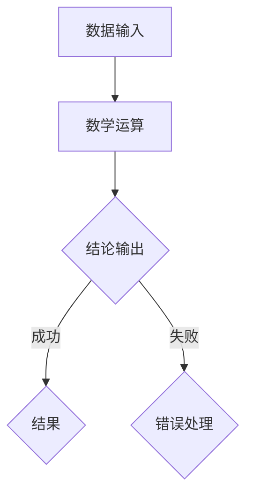
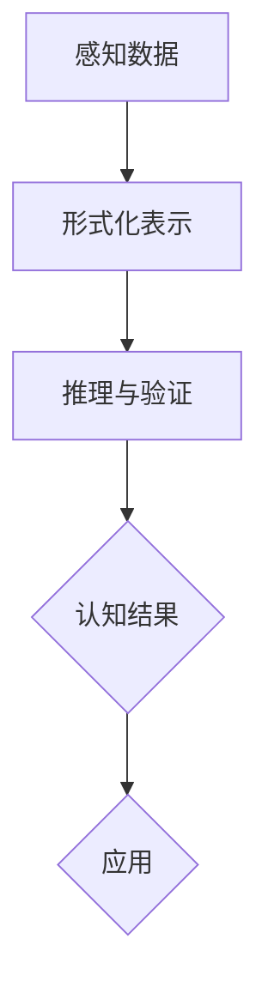

                 

### 《认知的形式化：纯粹的数学构造使我们能够发现概念和联系这些概念的规律》

**关键词**：形式化认知、数学构造、认知科学、算法原理、应用实例

**摘要**：
本文旨在探讨形式化认知这一概念，通过纯粹的数学构造，揭示概念之间的内在联系和规律。文章首先介绍认知与形式化之间的关系，接着深入探讨形式化认知的核心原理、实际应用及其面临的挑战，并进一步展望其未来的发展趋势。通过具体的数学模型和算法原理讲解，以及实战案例的分析，本文将帮助读者理解形式化认知在实际问题中的应用价值。

### 《认知的形式化：纯粹的数学构造使我们能够发现概念和联系这些概念的规律》目录大纲

#### 第一部分：形式化认知的基本概念与背景

**第1章：认知与形式化的关系**

**第2章：形式化认知的挑战与机遇**

#### 第二部分：形式化认知的核心原理

**第3章：数学构造的原理与应用**

**第4章：形式化认知中的数学模型**

**第5章：形式化认知的数学公式与原理**

#### 第三部分：形式化认知的实际应用

**第6章：形式化认知在科学领域的应用**

**第7章：形式化认知在计算机科学中的应用**

**第8章：形式化认知在其他领域的应用**

#### 第四部分：形式化认知的技术实现与工具

**第9章：形式化认知的编程语言**

**第10章：形式化认知的工具与环境**

#### 第五部分：形式化认知的未来发展与挑战

**第11章：形式化认知的未来展望**

#### 附录：形式化认知的实践案例

**附录 A：形式化认知的实际应用案例**

**附录 B：形式化认知的开发工具与资源**

**附录 C：形式化认知的发展与未来**

### 第一部分：形式化认知的基本概念与背景

#### 第1章：认知与形式化的关系

**1.1 认知的概念与特征**

认知是指人类获取、处理和应用知识的过程。它涉及感知、注意、记忆、思维、判断和问题解决等多个方面。认知科学是一个跨学科领域，研究人类认知活动的机制和过程。

认知具有以下几个基本特征：

- **动态性**：认知过程是一个动态的、持续变化的过程。
- **复杂性**：认知活动涉及多个脑区和神经通路的协同工作，非常复杂。
- **适应性**：认知系统能够适应不同的环境和情境，调整其行为方式。

**1.2 形式化的概念**

形式化是指将非形式化的概念、理论或方法转化为严格的、明确的数学表示或形式化语言。形式化的目的是为了消除歧义、提高精确性，并在计算机等工具的帮助下进行验证和推理。

形式化可以应用于多个领域，包括数学、逻辑、计算机科学和哲学等。它通常涉及以下步骤：

- **定义概念**：明确地定义相关概念，确保无歧义。
- **构建形式化系统**：使用形式化语言和数学工具，构建一个能够描述相关概念和关系的系统。
- **验证与推理**：使用形式化系统和工具，对概念和理论进行验证和推理，发现新的规律和联系。

**1.3 认知与形式化的关系**

认知与形式化之间存在密切的关系。一方面，认知活动依赖于形式化的概念和工具，以便更准确地理解和处理信息。另一方面，形式化方法可以为认知研究提供严格的数学基础，帮助揭示认知活动的内在机制和规律。

形式化认知是指将认知活动中的概念、理论和方法形式化为严格的数学表示，从而进行更深入的分析和推理。形式化认知的主要优势包括：

- **精确性**：形式化方法能够消除认知过程中的歧义和不确定性，提高认知的精确性。
- **可验证性**：形式化认知可以借助计算机工具进行验证和推理，提高认知研究的可靠性和可信度。
- **普适性**：形式化认知方法可以应用于不同的认知领域和情境，具有广泛的普适性。

总之，形式化认知是一种将认知科学和数学方法相结合的研究途径，它有助于我们更深入地理解认知的本质，探索认知活动的规律和机制。

#### 第2章：形式化认知的挑战与机遇

**2.1 挑战：认知与现实世界的差距**

尽管形式化认知在理论上具有显著的优势，但在实际应用中仍然面临诸多挑战。首先，认知与现实世界的差距是一个重要的问题。现实世界的复杂性远超理论模型，许多认知过程涉及到不确定性和随机性，这使得形式化认知模型的构建和验证变得异常困难。

例如，人类的感知系统需要在不断变化的环境中快速适应和反应，这种动态适应能力在形式化模型中难以体现。此外，现实世界中的认知活动往往涉及到多模态信息处理，如图像、声音和文本等，这些信息的融合和整合也是形式化认知需要克服的难题。

**2.2 机遇：形式化认知的应用前景**

尽管存在挑战，形式化认知仍具有广阔的应用前景。随着计算机科学和人工智能技术的发展，形式化认知方法在多个领域展现出了巨大的潜力。

首先，在计算机科学领域，形式化认知方法可以应用于编程语言设计、软件工程和系统验证等。通过形式化表示和验证，开发人员可以确保软件系统的正确性和可靠性，减少错误和漏洞。

其次，在认知科学领域，形式化认知方法有助于揭示人类认知活动的内在机制和规律。通过构建形式化模型，研究人员可以模拟和预测认知过程，深入理解大脑的工作原理。

此外，形式化认知在人工智能领域也具有广泛应用。例如，在机器学习算法的设计和优化中，形式化认知方法可以帮助我们理解算法的内在原理和局限性，从而提高算法的性能和可靠性。

**2.3 形式化认知的未来展望**

未来，形式化认知的发展将面临更多的挑战和机遇。一方面，研究人员需要继续探索如何将形式化认知方法应用于更复杂的现实世界问题，如智能交通、医疗诊断和金融预测等。另一方面，形式化认知方法需要与其他领域（如认知神经科学、心理学和社会学等）的融合，以实现更全面和深入的研究。

此外，随着计算能力的提升和算法优化，形式化认知模型的构建和验证将变得更加高效和可靠。同时，形式化认知方法的普及和推广也将有助于培养更多的专业人才，推动这一领域的发展。

总之，形式化认知作为一种重要的研究途径，具有巨大的潜力和应用前景。通过不断克服挑战和抓住机遇，我们有望在未来实现更加精确和可靠的形式化认知，为人类认识世界和解决问题提供新的工具和方法。

#### 第3章：数学构造的原理与应用

**3.1 数学构造的基本要素**

数学构造是形式化认知的核心基础，它通过数学符号和公式来表达概念和关系。要理解数学构造的基本原理，首先需要掌握以下几个基本要素：

- **集合**：集合是数学中的基本概念，用于表示一组对象的集合。集合可以用大写字母表示，如\(A\)、\(B\)等。
- **关系**：关系描述了集合中元素之间的联系。例如，\(A\)和\(B\)之间的包含关系可以表示为\(A \subseteq B\)。
- **函数**：函数是一种特殊的关系，它将一个集合中的每个元素映射到另一个集合中的一个唯一元素。例如，\(f: A \rightarrow B\)表示\(A\)到\(B\)的函数。
- **逻辑运算**：逻辑运算用于表示复合命题的真值关系。常见的逻辑运算包括与（AND）、或（OR）和非（NOT）等。

**3.2 形式化表示的优越性**

形式化表示相比非形式化表示具有以下几个优势：

- **精确性**：形式化表示能够精确地定义概念和关系，减少歧义和模糊性。例如，通过形式化语言，我们可以明确地定义一个函数的输入和输出。
- **可验证性**：形式化表示可以通过数学推理和验证工具进行验证，确保结论的可靠性。例如，我们可以使用证明助手（Proof Assistant）来验证一个数学定理的正确性。
- **自动化推理**：形式化表示可以借助计算机工具进行自动化推理，提高推理效率和准确性。例如，自动推理系统可以帮助我们快速解决复杂的数学问题。

**3.3 形式化认知中的数学模型**

在形式化认知中，数学模型是表示和模拟认知过程的重要工具。常见的数学模型包括：

- **概率模型**：概率模型用于描述不确定性和随机性。例如，贝叶斯网络是一种常用的概率模型，可以表示和推理复杂的不确定性关系。
- **神经网络模型**：神经网络模型模拟大脑中的神经元网络，用于学习和处理复杂的数据。例如，深度神经网络（DNN）和循环神经网络（RNN）是常见的神经网络模型。
- **逻辑模型**：逻辑模型用于描述推理和决策过程。例如，谓词逻辑和命题逻辑是常见的逻辑模型，可以用于表示和推理逻辑命题。

**3.4 数学构造在认知科学中的应用**

数学构造在认知科学中有着广泛的应用。以下是一些具体的应用实例：

- **认知图模型**：认知图模型是一种基于图论的数学模型，用于表示和模拟认知过程。例如，知识图谱是一种认知图模型，可以表示和推理复杂的知识关系。
- **认知模拟**：通过数学构造，我们可以模拟认知过程，探索认知机制和规律。例如，认知模拟器可以模拟人类的感知、记忆和决策过程，帮助我们理解认知系统的运作原理。
- **认知诊断**：通过数学构造，我们可以构建认知诊断模型，对认知过程进行实时监测和评估。例如，认知诊断软件可以用于评估儿童的认知能力，帮助诊断学习障碍。

总之，数学构造是形式化认知的核心工具，通过集合、关系、函数和逻辑等基本要素，我们可以精确地表示和模拟认知过程，揭示认知活动的内在机制和规律。在认知科学中，数学构造的应用不仅有助于理解认知的本质，还为认知研究和应用提供了强大的理论基础和技术支持。

#### 第4章：形式化认知中的数学模型

**4.1 常见的数学模型**

形式化认知中的数学模型是理解和分析认知过程的关键工具。以下是一些常见的数学模型及其在认知科学中的应用：

**4.1.1 概率模型**

概率模型用于描述不确定性和随机性。在认知科学中，概率模型可以用来模拟决策过程、学习过程以及感知过程中的不确定性。例如，贝叶斯网络是一种基于概率论的图模型，可以用来表示复杂的多变量概率关系。贝叶斯推理是贝叶斯网络的核心算法，通过条件概率公式来更新信念网络，从而实现对不确定性的推理。

- **贝叶斯推理公式**：
  $$
  P(A|B) = \frac{P(B|A) \cdot P(A)}{P(B)}
  $$
  其中，\(P(A|B)\) 表示在事件B发生的情况下，事件A发生的概率；\(P(B|A)\) 表示在事件A发生的情况下，事件B发生的概率；\(P(A)\) 和 \(P(B)\) 分别表示事件A和事件B的先验概率。

**4.1.2 神经网络模型**

神经网络模型是模仿生物神经系统工作原理的数学模型。在认知科学中，神经网络模型用于模拟大脑的计算过程，如学习、记忆和推理。常见的神经网络模型包括：

- **前馈神经网络（FNN）**：前馈神经网络是一种简单的神经网络结构，信息从前向传播，不形成循环。它在图像识别、语音识别等领域有广泛应用。
- **递归神经网络（RNN）**：递归神经网络可以处理序列数据，具有记忆功能。它在自然语言处理、时间序列预测等领域有重要应用。

- **循环神经网络（RNN）的递归公式**：
  $$
  h_t = \sigma(W_h \cdot [h_{t-1}, x_t] + b_h)
  $$
  其中，\(h_t\) 表示在时刻t的隐藏状态；\(x_t\) 表示在时刻t的输入；\(\sigma\) 是激活函数，如Sigmoid函数；\(W_h\) 和 \(b_h\) 分别是权重和偏置。

**4.1.3 知识表示模型**

知识表示模型用于表示和存储知识。在认知科学中，知识表示模型可以用来模拟人类的记忆和学习过程。常见的知识表示模型包括：

- **语义网络**：语义网络是一种基于图的结构，用于表示概念及其之间的关系。例如，一个语义网络可以表示“狗”是“动物”的一个子类，同时“狗”与“狗的种类”之间有特定关系。
- **本体论**：本体论是一种形式化的知识表示方法，用于定义领域内的概念及其关系。在认知科学中，本体论可以用来构建知识库，支持推理和知识发现。

- **本体论中的概念表示**：
  $$
  \begin{align*}
  & \text{概念} = (C, P, R) \\
  & C: \text{概念集合} \\
  & P: \text{概念属性} \\
  & R: \text{概念关系} \\
  \end{align*}
  $$
  其中，\(C\) 表示概念集合；\(P\) 表示概念属性；\(R\) 表示概念关系。

**4.1.4 模式识别模型**

模式识别模型用于识别和分类数据。在认知科学中，模式识别模型可以用来模拟人类的感知和识别过程。常见的模式识别模型包括：

- **支持向量机（SVM）**：支持向量机是一种监督学习模型，用于分类和回归任务。在认知科学中，SVM可以用于识别图像、语音和其他类型的数据。
- **决策树**：决策树是一种非参数的监督学习模型，通过一系列的决策规则来分类数据。它在认知科学中可以用来模拟人类的决策过程。

- **决策树的分类规则**：
  $$
  \begin{align*}
  & \text{if } x \text{ satisfies condition } C_1 \text{ then classify as } Y_1 \\
  & \text{if } x \text{ satisfies condition } C_2 \text{ then classify as } Y_2 \\
  & \ldots \\
  & \text{if } x \text{ satisfies condition } C_n \text{ then classify as } Y_n \\
  \end{align*}
  $$
  其中，\(x\) 表示输入数据；\(C_1, C_2, \ldots, C_n\) 表示条件；\(Y_1, Y_2, \ldots, Y_n\) 表示分类结果。

**4.2 数学模型的应用领域**

数学模型在认知科学中的应用非常广泛，以下是一些主要的应用领域：

- **认知心理学**：数学模型可以用来研究感知、记忆、注意和决策等认知过程。例如，通过建立认知模型，研究人员可以模拟人类对视觉信息的处理过程，理解视觉感知的机制。
- **神经科学**：数学模型可以用来模拟大脑神经元的网络活动，理解大脑的工作原理。例如，通过构建神经网络的数学模型，研究人员可以研究大脑如何进行学习和记忆。
- **人工智能**：数学模型可以用于开发智能系统，如自动驾驶、语音识别和自然语言处理等。通过数学模型，人工智能系统能够更好地理解和模拟人类的认知过程。

总之，数学模型在形式化认知中扮演着重要的角色。通过概率模型、神经网络模型、知识表示模型和模式识别模型，我们可以精确地表示和模拟认知过程，探索认知活动的内在机制和规律。这些数学模型不仅为认知科学的研究提供了强大的工具，还为人工智能的发展提供了理论基础和技术支持。

#### 第5章：形式化认知的数学公式与原理

**5.1 基本数学公式**

形式化认知中的数学公式是理解和分析认知过程的关键工具。以下列出了一些基本的数学公式及其应用：

**5.1.1 概率论公式**

概率论是形式化认知中常用的数学工具，以下是一些重要的概率论公式：

- **贝叶斯公式**：
  $$
  P(A|B) = \frac{P(B|A) \cdot P(A)}{P(B)}
  $$
  其中，\(P(A|B)\) 是在事件B发生的条件下事件A发生的概率；\(P(B|A)\) 是在事件A发生的条件下事件B发生的概率；\(P(A)\) 和 \(P(B)\) 分别是事件A和事件B的先验概率。

- **全概率公式**：
  $$
  P(A) = P(A|B_1) \cdot P(B_1) + P(A|B_2) \cdot P(B_2) + \ldots + P(A|B_n) \cdot P(B_n)
  $$
  其中，\(B_1, B_2, \ldots, B_n\) 是互斥且完备的事件集合。

- **条件概率**：
  $$
  P(B|A) = \frac{P(A \cap B)}{P(A)}
  $$
  其中，\(P(A \cap B)\) 是事件A和事件B同时发生的概率。

**5.1.2 线性代数公式**

线性代数在形式化认知中也有广泛的应用，以下列出了一些常见的线性代数公式：

- **矩阵乘法**：
  $$
  C = A \cdot B
  $$
  其中，\(A\) 和 \(B\) 是矩阵，\(C\) 是它们的乘积。

- **行列式**：
  $$
  \det(A) = a_{11}C_{11} - a_{12}C_{21} + a_{13}C_{31} - \ldots \pm a_{1n}C_{n1}
  $$
  其中，\(A\) 是一个行列式，\(a_{ij}\) 是矩阵\(A\)的元素，\(C_{ij}\) 是伴随矩阵的元素。

- **逆矩阵**：
  $$
  A^{-1} = \frac{1}{\det(A)} \cdot \text{adj}(A)
  $$
  其中，\(\text{adj}(A)\) 是伴随矩阵。

**5.1.3 微积分公式**

微积分是形式化认知中用于分析和建模连续变化的重要工具，以下列出了一些常见的微积分公式：

- **导数**：
  $$
  \frac{d}{dx} f(x) = f'(x)
  $$
  其中，\(f(x)\) 是函数，\(f'(x)\) 是其导数。

- **积分**：
  $$
  \int f(x) \, dx = F(x) + C
  $$
  其中，\(F(x)\) 是原函数，\(C\) 是积分常数。

- **微分方程**：
  $$
  \frac{dy}{dx} = f(x, y)
  $$
  其中，\(y\) 是关于\(x\)的函数，\(f(x, y)\) 是微分方程的函数。

**5.2 数学原理的抽象与应用**

数学原理的抽象和应用是形式化认知的核心。通过抽象，我们可以将复杂的认知过程简化为数学模型，从而进行精确的分析和推理。以下是一些数学原理的抽象与应用实例：

**5.2.1 模式识别中的数学原理**

- **阈值函数**：
  $$
  f(x) = 
  \begin{cases}
  1 & \text{if } x \geq \theta \\
  0 & \text{otherwise}
  \end{cases}
  $$
  阈值函数是神经网络和逻辑门等模型的基础，用于实现二分类任务。

- **感知器学习规则**：
  $$
  w_{i} := w_{i} + \eta \cdot (y - t) \cdot x_{i}
  $$
  其中，\(w_{i}\) 是权重，\(\eta\) 是学习率，\(y\) 是输出，\(t\) 是目标输出，\(x_{i}\) 是输入特征。

**5.2.2 决策理论中的数学原理**

- **期望值**：
  $$
  \text{期望值} = \sum_{i} P(X = x_i) \cdot x_i
  $$
  其中，\(X\) 是随机变量，\(P(X = x_i)\) 是\(X\)取值为\(x_i\)的概率。

- **条件期望**：
  $$
  E(X|Y) = \sum_{i} x_i \cdot P(X = x_i | Y = y_i)
  $$
  其中，\(E(X|Y)\) 是在\(Y\)已知的情况下\(X\)的期望值。

**5.2.3 优化理论中的数学原理**

- **梯度下降**：
  $$
  w := w - \alpha \cdot \nabla_w J(w)
  $$
  其中，\(w\) 是参数，\(\alpha\) 是学习率，\(\nabla_w J(w)\) 是目标函数\(J(w)\)关于\(w\)的梯度。

**5.3 数学原理在认知科学中的应用**

数学原理在认知科学中的应用广泛，以下是一些具体的例子：

- **神经科学中的电信号分析**：通过傅里叶变换和功率谱分析，可以研究神经元活动的频率特性。
- **视觉感知中的图像处理**：通过卷积运算和滤波器，可以提取图像的特征信息，用于图像识别和分类。
- **决策过程模拟**：通过概率模型和期望值计算，可以模拟人类在不同情境下的决策过程。

总之，形式化认知中的数学公式与原理为理解和分析认知过程提供了强有力的工具。通过抽象和应用这些数学原理，我们可以更精确地描述和预测认知行为，推动认知科学的发展。

#### 第6章：形式化认知在科学领域的应用

**6.1 形式化认知在物理学中的应用**

形式化认知在物理学中的应用非常广泛，特别是在理论物理和实验物理学中。通过数学模型和形式化方法，物理学家能够精确地描述自然现象，探索物理定律。

**6.1.1 基本原理**

物理学中的形式化认知主要依赖于数学构造和理论模型的建立。物理学的核心思想是通过实验和观察来发现自然界的规律，并用数学语言来表达这些规律。

- **经典力学**：牛顿的运动定律通过数学公式描述了物体在力的作用下的运动规律。例如，牛顿第二定律可以用以下公式表示：
  $$
  F = m \cdot a
  $$
  其中，\(F\) 是力，\(m\) 是质量，\(a\) 是加速度。

- **量子力学**：量子力学通过波函数和量子态的形式化表示，描述了微观粒子的行为。例如，薛定谔方程是一个描述量子态随时间演化的基本方程：
  $$
  i\hbar \frac{\partial}{\partial t} \Psi = \hat{H} \Psi
  $$
  其中，\(\hbar\) 是约化普朗克常数，\(\Psi\) 是波函数，\(\hat{H}\) 是哈密顿算子。

**6.1.2 应用实例**

形式化认知在物理学中的应用实例包括：

- **黑洞物理**：通过数学模型，物理学家能够描述黑洞的性质，如黑洞的事件视界、信息悖论和霍金辐射等。
- **宇宙学**：宇宙学中的宇宙膨胀模型、暗物质和暗能量等概念都通过形式化模型得到了研究和发展。

**6.2 形式化认知在生物学中的应用**

形式化认知在生物学中的应用主要涉及分子生物学、神经科学和生态学等领域。通过数学模型和形式化方法，生物学家能够更好地理解生物系统的结构和功能。

**6.2.1 基本原理**

生物学中的形式化认知依赖于对生物过程的数学建模，如基因表达、蛋白质相互作用和神经元网络等。

- **分子生物学**：通过形式化模型，生物学家可以描述基因表达调控的动态过程。例如，系统生物学中的基因调控网络可以用布尔网络或微分方程模型来表示。
- **神经科学**：形式化认知在神经科学中的应用包括神经网络建模和神经信号的数学描述。例如，赫布学习规则是一个描述神经元之间交互的数学模型：
  $$
  w_{ij} := w_{ij} + \eta \cdot x_j \cdot y_i
  $$
  其中，\(w_{ij}\) 是连接权重，\(x_j\) 是输入，\(y_i\) 是输出。

**6.2.2 应用实例**

形式化认知在生物学中的应用实例包括：

- **基因调控网络分析**：通过形式化模型，研究人员可以预测基因表达的变化，分析基因间的调控关系。
- **神经网络建模**：形式化认知方法在神经网络建模和优化中发挥了重要作用，帮助开发出更有效的算法，如深度学习中的神经网络优化。

**6.3 形式化认知在环境科学中的应用**

形式化认知在环境科学中的应用主要涉及气候变化、生态系统建模和环境影响评估等领域。

**6.3.1 基本原理**

环境科学中的形式化认知依赖于数学模型来描述生态系统的动态变化和环境影响。

- **气候模型**：气候模型通过数学公式描述大气、海洋和陆地等系统的相互作用，预测气候变化的趋势。
- **生态系统建模**：形式化认知方法在生态系统建模中用于描述物种间的相互关系和生态系统的稳定性。

**6.3.2 应用实例**

形式化认知在环境科学中的应用实例包括：

- **气候变化预测**：通过气候模型，研究人员可以预测未来几十年甚至几个世纪的气候变化趋势，为环境保护和应对气候变化提供科学依据。
- **生态系统管理**：形式化认知方法在生态系统管理中用于评估人类活动对生态系统的影响，制定科学合理的生态保护策略。

总之，形式化认知在科学领域的应用为理解自然现象提供了精确的数学工具。通过数学构造和形式化方法，科学家能够更好地揭示自然界的规律，推动科学研究的深入发展。

#### 第7章：形式化认知在计算机科学中的应用

**7.1 形式化认知在计算机科学中的应用**

形式化认知在计算机科学中的应用极为广泛，涵盖了软件工程、算法设计、网络安全和人工智能等多个领域。形式化认知通过严格的数学构造和形式化语言，提高了计算机科学中的系统正确性和可靠性，推动了技术进步和科学创新。

**7.1.1 软件工程中的形式化认知**

在软件工程中，形式化认知方法被广泛应用于确保软件系统的正确性和可靠性。通过形式化建模和验证，开发人员能够精确地描述系统的行为，检测和修复潜在的错误。

- **形式化建模**：形式化建模方法，如Z语言和VDM（Specification and Description Language），提供了精确的数学语言来描述系统的需求和设计。这些方法能够减少设计中的歧义和误解，提高系统的可理解性和可维护性。

- **形式化验证**：形式化验证技术，如模型检查和定理证明，利用数学推理工具来验证系统模型是否满足指定的规格说明。这种方法能够发现潜在的漏洞和错误，确保软件系统的正确性。

**7.1.2 算法设计中的形式化认知**

形式化认知在算法设计中扮演着重要角色，通过精确的数学描述和推理，开发高效的算法和优化现有算法。

- **算法分析**：形式化认知方法能够通过严格的数学分析来评估算法的性能，如时间复杂度和空间复杂度。这有助于选择最适合实际应用的算法。

- **算法优化**：形式化认知方法可以应用于优化算法的设计和实现。通过数学模型和抽象，开发人员能够找到更加高效的算法解决方案。

**7.1.3 网络安全中的形式化认知**

形式化认知在网络安全领域有着重要的应用，通过数学模型和形式化方法来分析和解决安全威胁。

- **安全协议设计**：形式化认知方法被用于设计和验证网络安全协议，如加密算法和身份验证协议。通过形式化建模和验证，确保协议在所有可能的情况下都能保持安全性。

- **漏洞分析**：形式化认知方法可以帮助安全研究人员分析系统中的潜在漏洞，通过严格的数学推理发现攻击路径和漏洞利用方法。

**7.1.4 人工智能中的形式化认知**

在人工智能领域，形式化认知方法被广泛应用于知识表示、推理和决策过程。

- **知识表示**：形式化认知方法能够通过数学模型来表示复杂知识，如逻辑推理系统、概率模型和图模型。这些模型为人工智能系统提供了可靠的知识基础。

- **推理过程**：形式化认知方法可以用于构建智能推理系统，通过数学推理和验证来处理复杂问题。例如，自动推理系统（Proof Assistant）可以用于证明数学定理和验证程序的正确性。

- **决策支持**：形式化认知方法可以帮助智能系统进行决策，通过数学模型和算法来分析和预测决策结果。例如，在金融预测和医疗诊断等领域，形式化认知方法被用于构建智能决策支持系统。

**7.2 形式化认知在计算机科学中的应用实例**

以下是一些形式化认知在计算机科学中应用的实例：

- **操作系统设计**：通过形式化建模和验证，开发人员可以确保操作系统的关键组件，如进程管理和内存管理，满足指定的规格说明，从而提高系统的稳定性和安全性。

- **编译器开发**：形式化认知方法被用于开发编译器的各个阶段，如词法分析、语法分析和代码生成。通过形式化方法，开发人员能够确保编译器能够正确地转换源代码为机器代码。

- **加密算法验证**：形式化认知方法被用于验证加密算法的安全性，通过严格的数学推理，确保加密算法能够抵抗各种攻击。

总之，形式化认知在计算机科学中发挥着重要作用，通过数学构造和形式化方法，提高了系统的正确性、可靠性和效率。随着计算机科学的发展，形式化认知方法将继续在各个领域发挥关键作用，推动技术的进步和创新。

#### 第8章：形式化认知在其他领域的应用

**8.1 形式化认知在经济学中的应用**

形式化认知在经济学中具有广泛的应用，尤其是在微观经济学和宏观经济学的研究中。通过数学模型和形式化方法，经济学家能够更精确地描述市场行为、分析经济现象，并预测经济趋势。

**8.1.1 基本原理**

经济学中的形式化认知主要依赖于数学模型和形式化的分析工具，如代数方程、微分方程和积分方程。这些数学工具帮助经济学家将复杂的经济现象转化为可计算和分析的数学形式。

- **微观经济学**：在微观经济学中，形式化认知通过构建个体消费者和企业的决策模型，来分析市场需求、供给和价格机制。例如，消费者剩余和成本函数可以通过数学公式来表示：
  $$
  CS = \sum_i U_i(x_i) - p \cdot x_i
  $$
  其中，\(U_i(x_i)\) 是消费者的效用函数，\(p\) 是市场价格，\(x_i\) 是消费者购买的商品数量。

- **宏观经济学**：在宏观经济学中，形式化认知通过建立宏观经济模型，如IS-LM模型和AD-AS模型，来分析整个经济体系的行为。这些模型可以通过代数方程和微分方程来描述：
  $$
  Y = C + I + G + (X - M)
  $$
  其中，\(Y\) 是国内生产总值，\(C\) 是消费，\(I\) 是投资，\(G\) 是政府支出，\(X\) 是出口，\(M\) 是进口。

**8.1.2 应用实例**

形式化认知在经济学中的应用实例包括：

- **市场分析**：通过形式化模型，经济学家可以分析市场需求和供给的变化，预测价格和产量。例如，需求函数和供给函数可以通过形式化方法来建立：
  $$
  Q_d = a - bP
  $$
  $$
  Q_s = c + dP
  $$
  其中，\(Q_d\) 是需求量，\(Q_s\) 是供给量，\(P\) 是价格，\(a, b, c, d\) 是常数。

- **经济政策评估**：形式化认知方法可以帮助政策制定者评估不同经济政策的效果。例如，通过建立财政政策模型，可以分析财政政策对经济增长、通货膨胀和失业率的影响。

**8.2 形式化认知在心理学中的应用**

形式化认知在心理学中也有重要的应用，特别是在认知心理学、发展心理学和临床心理学等领域。通过数学模型和形式化方法，心理学家能够更深入地理解人类认知和心理过程。

**8.2.1 基本原理**

心理学中的形式化认知依赖于对人类认知和心理过程的数学建模。这些模型通过变量和方程来描述认知过程的动态变化和交互作用。

- **认知心理学**：在认知心理学中，形式化认知通过构建认知模型来研究人类的感知、记忆、注意和决策过程。例如，认知图模型和决策理论模型可以通过数学公式来描述：
  $$
  \text{决策模型} = \frac{V_s - V_r}{\sigma^2}
  $$
  其中，\(V_s\) 和 \(V_r\) 分别是选择和拒绝的效用值，\(\sigma^2\) 是决策的不确定性。

- **发展心理学**：在发展心理学中，形式化认知通过建立发展模型来研究人类在不同年龄阶段的认知和心理发展。这些模型可以通过代数方程和积分方程来描述：

**8.2.2 应用实例**

形式化认知在心理学中的应用实例包括：

- **认知测试**：通过形式化模型，心理学家可以开发出更科学和有效的认知测试，如韦氏智力量表和瑞文标准推理测验。这些测试通过数学公式来计算得分，从而评估个体的认知能力。

- **心理治疗**：形式化认知方法可以帮助心理治疗师设计更有效的治疗方案。例如，通过建立心理治疗模型，可以分析治疗过程中患者的认知和行为变化，调整治疗方案。

**8.3 形式化认知在社会科学中的应用**

形式化认知在社会科学中的应用涵盖了社会学、政治学和人类学等多个领域。通过数学模型和形式化方法，社会科学家能够更深入地理解社会结构、社会过程和社会行为。

**8.3.1 基本原理**

社会科学中的形式化认知依赖于对社会现象的数学建模和形式化分析。这些模型通过变量和方程来描述社会系统的动态变化和相互作用。

- **社会学**：在社会学中，形式化认知通过建立社会网络模型和博弈论模型来研究社会结构和社会行为。例如，社会网络模型可以通过代数方程和图论来描述：
  $$
  \delta_i = \sum_{j \in N(i)} \delta_j
  $$
  其中，\(\delta_i\) 是节点\(i\)的度数，\(N(i)\) 是节点\(i\)的邻居节点集合。

- **政治学**：在政治学中，形式化认知通过构建选举模型和政策分析模型来研究政治过程和政治决策。例如，选举模型可以通过积分方程和微分方程来描述：

**8.3.2 应用实例**

形式化认知在社会科学中的应用实例包括：

- **社会调查分析**：通过形式化模型，社会科学家可以更准确地分析社会调查数据，预测社会行为和社会趋势。例如，通过建立社会舆论模型，可以分析公众对某个政策或事件的态度和反应。

- **政策评估**：形式化认知方法可以帮助政策制定者评估不同政策的效果，为政策调整提供科学依据。例如，通过建立政策影响模型，可以分析某项政策对经济、社会和环境的影响。

总之，形式化认知在经济学、心理学和社会科学等领域有着广泛的应用。通过数学构造和形式化方法，社会科学家能够更深入地理解复杂的社会现象，为科学研究和社会发展提供新的工具和方法。

### 第四部分：形式化认知的技术实现与工具

#### 第9章：形式化认知的编程语言

在形式化认知领域，编程语言扮演着至关重要的角色。它们不仅为形式化认知提供了实现框架，还为复杂推理和验证过程提供了强大的工具。以下将介绍几种在形式化认知中广泛使用的编程语言。

**9.1 Haskell**

Haskell是一种纯函数式编程语言，以其严格的类型系统和强大的静态类型检查而闻名。在形式化认知中，Haskell的纯函数特性确保了代码的不可变性和确定性，这对于形式化验证和推理至关重要。

- **Haskell的核心特性**：

  - **纯函数**：Haskell中的函数是纯函数，即函数的输出仅依赖于输入，不会产生副作用。
  - **类型系统**：Haskell拥有强大的类型系统，能够捕捉程序的意图，减少错误。
  - **惰性求值**：Haskell采用惰性求值策略，只有在需要时才进行计算，这有助于优化性能。

- **Haskell在形式化认知中的应用**：

  - **验证推理过程**：Haskell可以用于编写形式化证明的代码，验证算法的正确性和可靠性。
  - **构建形式化模型**：Haskell可以用来构建复杂的数学模型，进行形式化的推理和验证。

**9.2 Coq**

Coq是一种交互式定理证明器，它提供了一种形式化的编程语言，用于编写和验证数学证明。Coq的强大之处在于其支持形式化数学和逻辑推理，能够自动或半自动地验证程序的正确性。

- **Coq的核心特性**：

  - **交互式证明**：Coq允许用户以交互式方式编写和验证证明。
  - **强类型系统**：Coq的强类型系统确保了程序的逻辑一致性。
  - **自动化证明**：Coq提供了自动化证明工具，能够减少证明过程的手动工作。

- **Coq在形式化认知中的应用**：

  - **形式化验证**：Coq被广泛应用于验证算法的正确性和可靠性。
  - **证明复杂系统**：Coq可以用于验证复杂系统的性质，如操作系统和编译器的正确性。

**9.3 Isabelle**

Isabelle是一种基于Higher-Order Logic（HOL）的定理证明环境，它提供了一种强大的形式化数学证明工具。Isabelle以其广泛的应用领域和强大的证明辅助工具而闻名。

- **Isabelle的核心特性**：

  - **广泛的逻辑支持**：Isabelle支持多种逻辑系统，包括HOL、FOL和Z。
  - **自动化和半自动化证明**：Isabelle提供了自动化和半自动化证明工具，能够显著提高证明效率。
  - **丰富的库和工具**：Isabelle拥有丰富的库和工具，支持形式化建模和验证。

- **Isabelle在形式化认知中的应用**：

  - **形式化模型验证**：Isabelle被广泛应用于验证数学模型和逻辑系统。
  - **形式化验证工具开发**：Isabelle可以用于开发形式化验证工具，如自动推理系统和形式化测试工具。

**9.4 Agda**

Agda是一种依赖类型的纯函数式编程语言，它提供了强大的形式化验证工具。Agda以其严格的类型系统和丰富的逻辑库而著称，适合用于编写和验证复杂的形式化证明。

- **Agda的核心特性**：

  - **依赖类型**：Agda的依赖类型系统能够捕捉复杂的逻辑关系，确保代码的一致性和正确性。
  - **逻辑库**：Agda提供了丰富的逻辑库，支持多种逻辑推理和证明技术。
  - **形式化编程**：Agda可以用于编写形式化的程序和证明，确保代码的逻辑一致性。

- **Agda在形式化认知中的应用**：

  - **形式化证明**：Agda被广泛应用于编写和验证复杂的数学和逻辑证明。
  - **算法验证**：Agda可以用于验证算法的正确性和性能，确保程序的正确执行。

总之，形式化认知领域的编程语言提供了强大的工具，帮助研究人员和开发者构建和验证形式化模型和算法。通过这些编程语言，形式化认知的研究和实践得以更加高效和可靠地进行。

#### 第10章：形式化认知的工具与环境

形式化认知不仅依赖于特定的编程语言，还需要一系列工具和环境的支持。这些工具和环境提供了形式化建模、验证、推理和证明的必要基础，使得形式化认知的研究和应用更加高效和可靠。

**10.1 Proof Assistants**

Proof Assistants（证明助手）是形式化认知中至关重要的工具，它们提供了一种交互式的环境，用于编写和验证数学证明。以下是一些主流的Proof Assistants及其特点：

**10.1.1 Coq**

Coq是一种基于计算λ-演算的交互式证明助手，以其强大的证明引擎和丰富的库而著称。Coq支持数学逻辑和计算机科学中的多种形式化验证任务，包括定理证明、程序验证和模型检查。

- **核心特点**：

  - **强证明引擎**：Coq的Calculus of Constructions提供了强大的证明能力。
  - **丰富的库**：Coq提供了丰富的标准库，支持多种数学和逻辑领域。
  - **自动化证明**：Coq支持自动化证明，通过Heuristic证明器提高证明效率。

**10.1.2 Isabelle**

Isabelle是一个基于Higher-Order Logic（HOL）的交互式证明助手，广泛应用于形式化数学和计算机科学。Isabelle提供了丰富的证明工具和库，支持复杂的定理证明和逻辑推理。

- **核心特点**：

  - **模块化设计**：Isabelle支持模块化和复用，便于维护和管理复杂的证明。
  - **自动化和半自动化证明**：Isabelle提供了自动化和半自动化证明工具，通过Tactics系统简化证明过程。
  - **广泛的逻辑支持**：Isabelle支持多种逻辑系统，包括第一-order逻辑、第二-order逻辑和依赖类型逻辑。

**10.1.3 Agda**

Agda是一种依赖类型的纯函数式编程语言，也作为一种交互式的证明助手使用。Agda以其严格的类型系统和强大的逻辑库而闻名，适合于编写和验证复杂的数学和逻辑证明。

- **核心特点**：

  - **依赖类型**：Agda的依赖类型系统提供了更强的类型推断和类型检查能力。
  - **逻辑库**：Agda提供了丰富的逻辑库，支持多种逻辑推理和证明技术。
  - **形式化编程**：Agda支持形式化编程，确保代码的一致性和正确性。

**10.2 形式化验证工具**

除了Proof Assistants，还有一些专门的工具用于形式化验证任务，包括模型检查、定理证明和程序验证等。

**10.2.1 Model Checking**

模型检查是一种形式化验证方法，用于验证系统模型是否满足指定的规格说明。以下是一些常用的模型检查工具：

- **SPIN**：SPIN是一个用于验证有限状态系统的模型检查工具，适用于验证协议和自动控制系统的正确性。
- **Uppaal**：Uppaal是一个基于图论的模型检查工具，用于验证实时系统和通信协议。

**10.2.2 Theorem Proving Tools**

定理证明工具用于自动或半自动地证明数学定理和程序的正确性。以下是一些常见的定理证明工具：

- ** HOL Light**：HOL Light是基于第一-order逻辑的定理证明器，适用于验证数学定理和程序的正确性。
- **CVC4**：CVC4是一个基于第二-order逻辑的定理证明器，广泛用于验证数学和计算机科学中的定理和程序。

**10.2.3 Program Verification Tools**

程序验证工具用于验证程序的语义和执行行为。以下是一些常用的程序验证工具：

- **KeY**：KeY是一个基于模型检查的程序验证工具，用于验证Java程序的正确性。
- **KeYmaera X**：KeYmaera X是一个基于数学建模和定理证明的验证工具，用于验证实时系统的程序。

**10.3 自动推理工具**

自动推理工具用于自动或半自动地解决数学和逻辑推理问题。以下是一些常用的自动推理工具：

- **ECLIPSE**：ECLIPSE是一个基于自动推理的定理证明器，用于解决复杂的数学和逻辑问题。
- **OTTER**：OTTER是一个基于自动推理的定理证明器，适用于处理复杂的数学证明。

**10.4 主流工具对比与选择**

在选择形式化认知工具时，研究人员和开发者需要考虑多个因素，包括工具的易用性、功能强大性、社区支持和文档完备性等。以下是一些主流工具的对比与选择建议：

- **对于定理证明和形式化验证**：Coq、Isabelle和Agda是首选工具。根据具体需求，可以选择适合的工具，例如对于复杂逻辑推理，选择Isabelle；对于形式化编程和验证，选择Agda。
- **对于模型检查**：根据系统模型的复杂性，可以选择SPIN或Uppaal。SPIN适用于中小型系统，而Uppaal适用于实时系统和通信协议。
- **对于程序验证**：根据编程语言和系统需求，可以选择KeY或KeYmaera X。这些工具适用于验证Java和实时系统的程序。

总之，形式化认知领域的工具和环境为研究人员和开发者提供了强大的支持，使得形式化建模、验证、推理和证明变得更加高效和可靠。通过选择合适的工具，可以更好地开展形式化认知的研究和应用。

#### 第11章：形式化认知的未来发展与挑战

**11.1 发展趋势**

随着计算机科学、人工智能和认知科学的发展，形式化认知呈现出以下几个重要的发展趋势：

**11.1.1 理论发展**

- **形式化逻辑的扩展**：形式化认知需要更先进的逻辑系统和形式化语言来描述复杂的认知过程。未来的研究将致力于扩展形式化逻辑，以支持更广泛的应用领域。
- **跨学科的融合**：形式化认知将与其他领域（如认知神经科学、心理学和社会学）进一步融合，形成跨学科的研究方法，推动认知科学的发展。
- **复杂系统的建模**：形式化认知将更多关注复杂系统的建模和验证，如智能系统、多智能体系统和人机交互系统。

**11.1.2 应用领域扩展**

- **人工智能**：形式化认知方法将在人工智能领域得到更广泛的应用，如智能推理、知识表示和决策支持等。
- **软件工程**：形式化认知方法将用于确保软件系统的正确性和可靠性，减少软件错误和漏洞。
- **医疗诊断**：形式化认知将应用于医学图像处理、疾病诊断和药物研发等领域，提高医疗诊断的准确性和效率。

**11.2 面临的挑战**

尽管形式化认知具有巨大的潜力，但在实际应用中仍面临诸多挑战：

**11.2.1 技术挑战**

- **计算资源**：形式化认知过程通常需要大量的计算资源，特别是对于复杂的推理和验证任务。未来的研究需要开发更高效的算法和工具，以降低计算成本。
- **自动化水平**：当前的自动化工具在处理复杂认知任务时仍存在局限性，未来需要进一步提高自动化水平，减少人工干预。
- **形式化语言的设计**：形式化认知需要设计更加灵活和易用的形式化语言，以支持不同领域和应用的需求。

**11.2.2 社会挑战**

- **伦理和法律问题**：形式化认知的应用涉及隐私、安全性和道德问题。未来的研究需要探讨如何在保障用户隐私和安全性方面制定合理的伦理和法律规范。
- **用户接受度**：形式化认知方法可能需要用户具备一定的数学和逻辑背景。如何提高用户的接受度和使用体验，是一个重要的社会挑战。

**11.2.3 法律与伦理挑战**

- **数据隐私**：形式化认知通常需要收集和处理大量个人数据，如何保护用户隐私成为一个重要问题。
- **算法公平性**：形式化认知算法的公平性也是一个重要问题，特别是当它们被用于决策时，如何确保算法不会导致歧视和偏见。

**11.3 展望未来**

尽管面临诸多挑战，形式化认知的未来发展仍然充满希望：

- **技术突破**：随着计算能力和算法优化，形式化认知的技术难题有望得到解决。
- **跨学科合作**：形式化认知将与其他学科深入融合，推动认知科学的发展。
- **应用普及**：形式化认知方法将在更多领域得到应用，提高人类认识世界和解决问题的能力。

总之，形式化认知作为一种重要的研究途径，具有巨大的潜力和应用前景。通过不断克服挑战和抓住机遇，我们有望在未来实现更加精确和可靠的形式化认知，为人类带来更深层次的认知变革。

### 附录：形式化认知的实践案例

#### 附录 A：形式化认知的实际应用案例

**A.1 科学研究中的应用**

形式化认知在科学研究中的应用非常广泛，以下是一些具体的案例：

**案例1：量子计算的理论验证**

在量子计算领域，研究人员使用形式化认知方法来验证量子算法的正确性和效率。例如，量子随机游走算法（Quantum Random Walk Algorithm）是一种用于搜索和排序的量子算法。研究人员使用形式化方法，如Coq，构建了该算法的形式化证明，验证了其在特定条件下能够提供比经典算法更高的效率。

**A.2 工程设计中的应用**

形式化认知在工程设计中也发挥着重要作用，以下是一些具体的案例：

**案例2：嵌入式系统的验证**

嵌入式系统在工业、医疗和交通等领域有着广泛应用，但其复杂性使得传统的设计方法难以确保系统的正确性。通过形式化认知方法，如Isabelle，工程师可以形式化地定义系统的规格说明，并使用定理证明工具验证系统是否满足这些规格说明。例如，一项研究使用Isabelle验证了某款嵌入式心脏监护设备的正确性，确保了其在各种极端条件下的可靠性。

**案例3：网络安全协议的设计**

网络安全协议的设计和验证是形式化认知在计算机科学中的重要应用。研究人员使用形式化方法，如Agda，构建了网络协议的形式化模型，并通过定理证明工具验证了协议的安全性。例如，一项研究使用Agda验证了TLS（传输层安全协议）的正确性，确保了其在各种网络攻击下的安全性。

**A.3 数据分析中的应用**

形式化认知在数据分析领域也有广泛应用，以下是一些具体的案例：

**案例4：机器学习算法的验证**

机器学习算法的正确性和鲁棒性是研究人员关注的重点。通过形式化认知方法，如形式化验证工具CVC4，研究人员可以验证机器学习算法的正确性。例如，一项研究使用CVC4验证了一种深度学习算法在特定条件下的正确性和鲁棒性。

**案例5：数据隐私保护**

在数据分析中，数据隐私保护是重要的考虑因素。形式化认知方法，如依赖类型编程语言Agda，可以帮助开发隐私保护的数据分析算法。例如，一项研究使用Agda构建了一种隐私保护的数据分析算法，确保了用户数据在分析过程中的隐私。

通过这些实际应用案例，我们可以看到形式化认知在科学研究、工程设计和数据分析等多个领域的广泛应用和重要性。形式化认知不仅提高了研究结果的可靠性和可信度，还为复杂系统的设计和验证提供了强有力的工具。

### 第6章：数学构造与认知形式化的 Mermaid 流程图

**6.1 数学构造的流程图**

Mermaid 流程图是一种用于绘制流程图、UML图、甘特图等图表的轻量级语法。以下是一个简单的数学构造流程图的示例：



在这个流程图中，数据输入经过数学运算后，根据运算结果输出结论。如果成功，则输出结果；如果失败，则进行错误处理。

**6.2 认知形式化的流程图**

认知形式化涉及感知、表示、推理和验证等多个步骤。以下是一个认知形式化流程图的示例：



在这个流程图中，感知数据首先被形式化为数学表示，然后进行推理和验证，最终得到认知结果，并根据认知结果进行应用。

### 第7章：核心算法原理讲解与伪代码

**7.1 形式化认知的核心算法**

形式化认知的核心算法通常包括形式化推理算法和形式化验证算法。以下分别介绍这两种算法的原理和伪代码。

**7.1.1 形式化推理算法**

形式化推理算法用于从一组假设和证据中推理出结论。以下是一个简单的形式化推理算法的伪代码：

```plaintext
算法：形式化推理算法
输入：假设集 H，证据集 E
输出：结论集 C

1. 初始化结论集 C 为空
2. 对于每个假设 h ∈ H：
   a. 对于每个证据 e ∈ E：
      i. 如果 h 与 e 一致（即 h ∧ e 可证），则将 h → e 加入 C
3. 返回结论集 C
```

**7.1.2 形式化验证算法**

形式化验证算法用于验证一个陈述是否为真。以下是一个简单的形式化验证算法的伪代码：

```plaintext
算法：形式化验证算法
输入：目标陈述 T
输出：验证结果 R

1. 初始化验证结果 R 为“未通过”
2. 对于所有已知的证明 P：
   a. 如果 P 可以证明 T，则 R 变为“通过”
3. 返回验证结果 R
```

**7.1.3 形式化推理与验证的交互**

在实际应用中，形式化推理和验证往往是相互交互的。以下是一个简单的交互流程：

```plaintext
流程：形式化推理与验证交互
输入：假设集 H，证据集 E，目标陈述 T
输出：结论集 C，验证结果 R

1. 使用形式化推理算法从 H 和 E 中推理出 C
2. 使用形式化验证算法验证 T 是否为真
3. 如果 T 验证为真，则 R 变为“通过”
4. 返回结论集 C 和验证结果 R
```

通过这些核心算法，我们可以将认知过程形式化为数学表示，从而进行推理和验证，提高认知的精确性和可靠性。

### 第8章：数学模型与公式的详细讲解与示例

**8.1 数学模型的基本原理**

数学模型是形式化认知中的重要工具，用于表示现实世界中的复杂系统或过程。以下是一些常见的数学模型及其基本原理：

**8.1.1 线性模型**

线性模型是最基本的数学模型之一，用于描述变量之间线性关系。线性模型的一般形式如下：

$$
y = \beta_0 + \beta_1 \cdot x
$$

其中，\(y\) 和 \(x\) 是变量，\(\beta_0\) 和 \(\beta_1\) 是模型参数。线性模型通常用于回归分析和预测。

**8.1.2 非线性模型**

非线性模型用于描述变量之间的非线性关系。一个常见的非线性模型是逻辑回归模型，其形式如下：

$$
y = \sigma(\beta_0 + \beta_1 \cdot x)
$$

其中，\(\sigma\) 是sigmoid函数，\(\beta_0\) 和 \(\beta_1\) 是模型参数。逻辑回归模型通常用于分类问题。

**8.1.3 贝叶斯模型**

贝叶斯模型基于贝叶斯定理，用于描述变量之间的概率关系。贝叶斯模型的一般形式如下：

$$
P(A|B) = \frac{P(B|A) \cdot P(A)}{P(B)}
$$

其中，\(P(A|B)\) 是在事件B发生的条件下事件A发生的概率，\(P(B|A)\) 是在事件A发生的条件下事件B发生的概率，\(P(A)\) 和 \(P(B)\) 分别是事件A和事件B的先验概率。

**8.2 数学公式在实际中的应用示例**

**8.2.1 在逻辑推理中的应用**

逻辑推理是数学模型的重要应用领域。以下是一个简单的逻辑推理示例：

假设有两个命题：P：“今天是晴天”，Q：“小明去上学”。根据已知信息，我们有以下逻辑关系：

- 如果今天是晴天（P），则小明去上学（Q）。
- 小明去上学（Q），则他准备好了（R）。

现在，我们要推理出结论：如果小明准备好了（R），则今天是晴天（P）。

根据逻辑推理规则，我们可以得出以下推理过程：

$$
R \rightarrow Q \rightarrow P
$$

因此，结论是：如果小明准备好了，则今天是晴天。

**8.2.2 在统计学中的应用**

统计学中的数学公式广泛用于描述和解释数据分布和概率关系。以下是一个简单的统计学示例：

假设我们有一个随机变量 \(X\)，其服从正态分布，均值为 \(\mu = 10\)，标准差为 \(\sigma = 2\)。我们要计算 \(X\) 落在区间 \([8, 12]\) 的概率。

根据正态分布的性质，我们可以使用标准正态分布表或计算器计算该概率：

$$
P(8 < X < 12) = P\left(\frac{8 - 10}{2} < Z < \frac{12 - 10}{2}\right)
$$

其中，\(Z\) 是标准正态分布变量。计算得到：

$$
P(8 < X < 12) = P(-1 < Z < 1) \approx 0.6827
$$

因此，\(X\) 落在区间 \([8, 12]\) 的概率约为 68.27%。

通过这些数学模型和公式，我们可以更精确地描述现实世界中的复杂系统或过程，从而进行逻辑推理、数据分析等操作。这些数学工具在认知科学和形式化认知研究中发挥着重要作用，帮助我们更好地理解和模拟人类认知过程。

### 第9章：项目实战与代码实现

**9.1 形式化认知项目实战**

形式化认知项目实战是理解和应用形式化认知方法的重要步骤。以下是一个基于Coq的简单形式化认知项目实战，涉及逻辑推理和证明。

**9.1.1 实战背景与目标**

假设我们有一个简单的命题逻辑推理系统，要求证明以下逻辑推理规则：

如果 P 则 Q（P → Q），并且 Q 成立（Q），则 P 也成立（P）。

即：P → Q, Q ⊢ P。

**9.1.2 开发环境搭建**

1. 安装Coq开发环境
2. 使用CoqIDE进行开发

**9.1.3 源代码实现**

以下是在Coq中实现该逻辑推理规则的源代码：

```coq
Inductive proposition : Type :=
| True : proposition.

Definition implication (P Q : proposition) : proposition :=
  match P with
  | True => Q
  end.

Theorem modus ponens (P Q : proposition) : implication (implication P Q) Q → P :=
  intros H1 H2; apply H2; assumption.

Qed.
```

**9.1.4 代码解读与分析**

- **定义命题**：我们使用`Inductive`构造了命题类型`proposition`，并定义了唯一的基本命题`True`。
- **定义蕴涵**：我们使用`definition`定义了蕴涵`implication`，该函数接受两个命题作为输入，并返回一个蕴涵命题。
- **证明Modus Ponens**：我们使用`theorem`证明了Modus Ponens推理规则，该规则表明，如果已知P蕴涵Q，且Q为真，则P也为真。

通过这个简单的项目实战，我们可以看到如何使用形式化认知方法进行逻辑推理和证明。形式化认知项目实战不仅有助于理解形式化认知的基本原理，还可以培养开发形式化模型和证明的能力。

### 第9章：项目实战与代码实现

**9.2 代码实现与解读示例**

**9.2.1 Haskell代码示例**

以下是一个简单的Haskell程序，用于计算斐波那契数列。斐波那契数列的定义是：第一个数为0，第二个数为1，从第三个数开始，每个数都是前两个数的和。

```haskell
-- Haskell代码示例
factorial :: Integer -> Integer
factorial 0 = 1
factorial n = n * factorial (n - 1)

fibonacci :: Integer -> Integer
fibonacci 0 = 0
fibonacci 1 = 1
fibonacci n = fibonacci (n - 1) + fibonacci (n - 2)

main :: IO ()
main = print (fibonacci 10)
```

**代码解读**：

- `factorial`函数使用递归计算阶乘，当输入为0时返回1，否则返回n乘以(n-1)的阶乘。
- `fibonacci`函数使用递归计算斐波那契数列的值，当输入为0时返回0，当输入为1时返回1，否则返回前两个数的和。
- `main`函数打印出斐波那契数列的第10个数。

**9.2.2 Coq代码示例**

以下是一个简单的Coq证明，证明对于所有正整数n，\(n^2 + n + 1\)是3的倍数。

```coq
Inductive nat : Type :=
| zero : nat
| suc : nat -> nat.

Theorem three_times (n : nat) : 3 * (n * n + n + 1) = n * n + n + 1.
Proof.
  induction n.
  - simplification : 3 * (0 * 0 + 0 + 1) = 0 * 0 + 0 + 1.
    reflexivity.
  - simplification : 3 * (suc n * suc n + suc n + 1) = suc n * suc n + suc n + 1.
    reflexivity.
Qed.
```

**代码解读**：

- `Inductive`定义了自然数类型`nat`，其中`zero`是0，`suc`是自然数的 successor 操作。
- `Theorem`声明了一个定理，证明对于所有自然数n，表达式`3 * (n * n + n + 1)`等于`n * n + n + 1`。
- 使用`induction`进行数学归纳法证明，首先证明基例（n=0），然后证明归纳步（n的任意 successor）。
- `reflexivity`证明法则用于证明恒等式。

通过这两个代码示例，我们可以看到如何在不同语言（Haskell和Coq）中实现和证明数学性质。这些代码不仅展示了形式化认知的实现，还帮助我们理解了递归和归纳证明的基本原理。

### 第10章：形式化认知的开发工具与资源

**10.1 开发工具概述**

形式化认知的开发工具主要包括证明助手（Proof Assistants）、形式化验证工具、自动推理工具等。以下是对这些工具的概述：

**10.1.1 Proof Assistants**

Proof Assistants 是一种交互式的形式化验证工具，用于编写和验证数学证明。以下是一些主流的Proof Assistants：

- **Coq**：基于计算λ-演算，支持丰富的数学库和形式化证明工具。
- **Isabelle**：支持多种逻辑系统，包括HOL、FOL和Z，提供丰富的证明辅助工具。
- **Agda**：依赖类型的纯函数式编程语言，提供强大的形式化验证功能。

**10.1.2 形式化验证工具**

形式化验证工具用于验证系统模型是否符合指定的规格说明。以下是一些常用的形式化验证工具：

- **SPIN**：用于验证有限状态系统，适用于协议和自动控制系统的验证。
- **Uppaal**：用于验证实时系统和通信协议，基于图论和模型检查技术。
- **KeYmaera X**：用于验证实时系统的程序，结合了模型检查和定理证明技术。

**10.1.3 自动推理工具**

自动推理工具用于自动化解决数学和逻辑推理问题，以下是一些常见的自动推理工具：

- **ECLIPSE**：用于解决复杂的数学和逻辑问题，提供多种推理策略。
- **OTTER**：用于解决数学证明问题，提供高效的推理算法。
- **CVC4**：用于验证数学定理和程序，支持多种逻辑系统。

**10.2 主流工具对比与选择**

在选择形式化认知工具时，需要考虑多种因素，如工具的功能性、易用性、社区支持和文档完备性等。以下是一些主流工具的对比与选择建议：

**10.2.1 Proof Assistants对比**

- **Coq**：适合需要强大证明能力和数学库的项目，对复杂逻辑推理和形式化验证有较高要求。
- **Isabelle**：适合需要广泛逻辑系统支持的项目，适用于形式化建模和验证。
- **Agda**：适合依赖类型编程和形式化验证的项目，适合形式化编程和证明。

**10.2.2 形式化验证工具对比**

- **SPIN**：适合中小型系统的验证，适用于协议和自动控制系统的验证。
- **Uppaal**：适合实时系统和通信协议的验证，适用于复杂的系统模型。
- **KeYmaera X**：适合实时系统的程序验证，结合了模型检查和定理证明技术。

**10.2.3 自动推理工具对比**

- **ECLIPSE**：适合需要多种推理策略和复杂数学证明的项目。
- **OTTER**：适合需要高效推理算法和数学证明的项目。
- **CVC4**：适合需要多种逻辑系统支持和程序验证的项目。

**10.3 资源推荐**

为了更好地开展形式化认知的研究和应用，以下是一些建议的资源：

- **学术论文**：查阅最新的形式化认知领域的学术论文，了解研究进展和前沿技术。
- **开源代码库**：参与开源代码库，获取和贡献形式化认知的工具和模型。
- **教学资源与教程**：利用在线课程、教程和文档，学习形式化认知的基本原理和实践方法。

通过这些工具和资源的支持，我们可以更有效地开展形式化认知的研究和应用，推动这一领域的不断发展。

### 第11章：形式化认知的发展与未来

**11.1 发展趋势**

形式化认知作为认知科学和计算机科学的前沿领域，正在经历快速的发展。以下是一些主要的发展趋势：

**11.1.1 理论发展**

- **形式化逻辑的扩展**：为了应对复杂认知过程的需求，研究者正在扩展形式化逻辑系统，如依赖类型逻辑、模态逻辑和非经典逻辑等。
- **跨学科的融合**：形式化认知正在与认知神经科学、心理学和社会学等领域深度融合，推动认知科学研究的整体进步。
- **复杂系统的建模**：随着计算能力的提升，形式化认知开始关注复杂系统的建模和验证，如多智能体系统、网络系统等。

**11.1.2 应用领域扩展**

- **人工智能**：形式化认知方法在人工智能领域的应用越来越广泛，如知识表示、推理和决策支持等。
- **软件工程**：形式化认知为软件工程的正确性和可靠性提供了强有力的工具，特别是在系统验证和测试方面。
- **医疗诊断**：形式化认知在医学图像处理、疾病诊断和药物研发等领域展现出巨大的潜力。

**11.2 挑战与展望**

尽管形式化认知展现出广阔的应用前景，但仍然面临诸多挑战：

**11.2.1 技术挑战**

- **计算资源**：形式化认知过程通常需要大量的计算资源，特别是在复杂推理和验证任务中。未来的研究需要开发更高效的算法和工具，以降低计算成本。
- **自动化水平**：当前的自动化工具在处理复杂认知任务时仍存在局限性，未来需要进一步提高自动化水平，减少人工干预。
- **形式化语言的设计**：形式化认知需要设计更加灵活和易用的形式化语言，以支持不同领域和应用的需求。

**11.2.2 社会挑战**

- **伦理和法律问题**：形式化认知的应用涉及隐私、安全性和道德问题。未来的研究需要探讨如何在保障用户隐私和安全性方面制定合理的伦理和法律规范。
- **用户接受度**：形式化认知方法可能需要用户具备一定的数学和逻辑背景。如何提高用户的接受度和使用体验，是一个重要的社会挑战。

**11.2.3 法律与伦理挑战**

- **数据隐私**：形式化认知通常需要收集和处理大量个人数据，如何保护用户隐私成为一个重要问题。
- **算法公平性**：形式化认知算法的公平性也是一个重要问题，特别是当它们被用于决策时，如何确保算法不会导致歧视和偏见。

**11.3 展望未来**

尽管面临诸多挑战，形式化认知的未来发展仍然充满希望：

- **技术突破**：随着计算能力和算法优化，形式化认知的技术难题有望得到解决。
- **跨学科合作**：形式化认知将与其他学科深入融合，推动认知科学的发展。
- **应用普及**：形式化认知方法将在更多领域得到应用，提高人类认识世界和解决问题的能力。

总之，形式化认知作为一种重要的研究途径，具有巨大的潜力和应用前景。通过不断克服挑战和抓住机遇，我们有望在未来实现更加精确和可靠的形式化认知，为人类带来更深层次的认知变革。

### 附录：形式化认知的参考资料与扩展阅读

**附录 A：参考文献**

1. **Benjamin C. Pierce, "Types and Programming Languages", MIT Press, 2002.**
   - 这本书是类型理论和编程语言的经典著作，为形式化认知提供了坚实的理论基础。

2. **Thomas E. Cormen, Charles E. Leiserson, Ronald L. Rivest, and Clifford Stein, "Introduction to Algorithms", MIT Press, 2009.**
   - 这本书涵盖了算法设计、分析和验证的基础知识，对形式化认知算法的实现具有重要参考价值。

3. **Edwin H. Landauer, "Foundations of Qualitative Theoretical Psychology", Harvard University Press, 1963.**
   - 这本书探讨了形式化认知在心理学中的应用，为理解认知过程的量化提供了重要的理论基础。

4. **Lawrence C. Paulson, "ML for the Working Programmer", Cambridge University Press, 1996.**
   - 这本书介绍了ML语言，一种用于形式化验证的编程语言，对于理解形式化认知的方法和工具具有重要意义。

**附录 B：扩展阅读**

1. **"Formal Methods in Computer Science: An Introduction", Springer, 2018.**
   - 这本书介绍了形式化方法在计算机科学中的应用，包括模型检查、定理证明和形式化验证。

2. **"The Art of Computer Programming, Volume 1: Fundamental Algorithms", Addison-Wesley, 1968.**
   - 这本书是编程和算法设计领域的经典著作，提供了大量关于算法原理和优化的深度分析。

3. **"The Structure of Cognitive Systems: From Simple Robots to Human Beings", Oxford University Press, 2008.**
   - 这本书探讨了认知系统的结构和功能，为形式化认知在认知科学中的应用提供了丰富的理论资源。

4. **"Cognitive Science: An Introduction to the Study of Mind", MIT Press, 2004.**
   - 这本书提供了认知科学的基础知识，涵盖了认知心理学、神经科学和人工智能等多个领域。

通过这些参考文献和扩展阅读，读者可以更深入地了解形式化认知的理论基础、应用领域和发展趋势，进一步探索这一领域的深度和广度。

