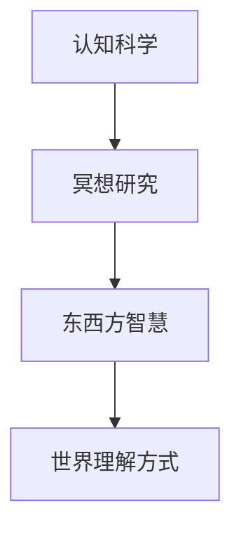
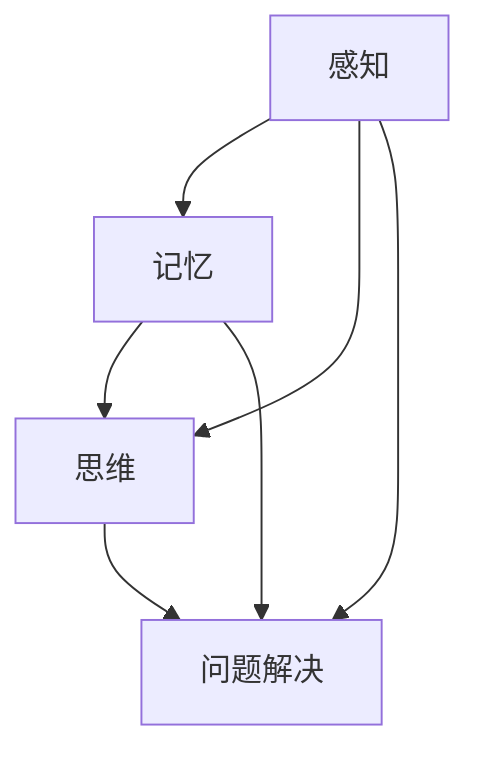

                 

### 第1章：认知科学与冥想研究的基础

#### 1.1 认知科学与冥想研究的背景与意义

**核心概念与联系：** 认知科学，冥想，东西方智慧，世界理解方式

在21世纪的今天，随着科技的飞速发展和人类对自身认知的深入探索，认知科学与冥想研究正逐渐成为心理学、神经科学、计算机科学等多个学科领域的热点。认知科学是一门综合性学科，旨在理解人类思维、感知、记忆、学习等认知过程的工作原理。而冥想作为一种古老的精神实践，历史悠久，跨越东西方文化，被认为对改善心理健康、提高认知功能具有重要意义。

首先，让我们通过一张Mermaid流程图来理解这三者之间的核心概念与联系：

- **A[认知科学]**：研究人类如何获取、处理和应用信息，涉及感知、记忆、思维等过程。
- **B[冥想研究]**：探究冥想在精神、心理和生理层面的效应，以及其作为心理治疗工具的应用。
- **C[东西方智慧]**：指代不同文化背景下对智慧、精神和生命的理解与探索，如佛教冥想和西方认知科学。
- **D[世界理解方式]**：通过融合东西方智慧，形成更全面、更深刻的对世界的理解。

**历史背景**：认知科学与冥想研究的历史可以追溯到古代。例如，在印度，瑜伽和冥想作为精神修炼的一部分，已有数千年的历史；在西方，哲学和心理学中对认知过程的研究也有悠久的历史。然而，现代认知科学与冥想研究的融合则是在过去几十年中逐渐形成的，特别是在神经科学和心理学的推动下。

**研究意义**：认知科学与冥想研究的结合，不仅有助于我们更深入地理解人类的认知机制和心理过程，还能够为实际应用提供新的方法和思路。例如，在心理学和医疗领域，冥想已被证明能够改善焦虑、抑郁等心理问题；在教育领域，认知科学的方法可以为教学提供科学依据，提高教育质量。

在当前全球化的背景下，东西方智慧的融合变得越来越重要。通过认知科学与冥想研究，我们可以发现不同文化背景下的共通点，促进跨文化理解和交流。这种融合不仅有助于解决实际问题，还能够为人类文明的发展提供新的动力。

**研究目标**：本书旨在系统地探讨认知科学与冥想研究的理论基础、历史发展、理论框架、实验方法以及在教育、心理健康等领域的应用。具体研究目标包括：

1. 梳理认知科学与冥想研究的发展历程，总结主要研究成果。
2. 探讨认知科学与冥想结合的理论模型，揭示冥想对认知过程的影响机制。
3. 研究认知科学与冥想结合的实验方法，为相关研究提供科学依据。
4. 分析认知科学与冥想在实际应用中的效果，提出改进策略。

**结构内容**：本书分为六个部分，具体内容如下：

- **第一部分：引论与概述**，介绍认知科学与冥想研究的背景与意义，概述本书的研究目标与内容结构。
- **第二部分：认知科学的理论框架**，讨论认知科学的基本原理、认知模型与理论、认知功能与认知障碍。
- **第三部分：冥想的科学探索**，探讨冥想的历史与文化、冥想的心理学原理。
- **第四部分：认知科学与冥想结合的研究方法**，研究认知科学与冥想结合的理论模型、实验方法。
- **第五部分：认知科学与冥想在实践中的应用**，分析认知科学与冥想在教育、心理健康中的应用。
- **第六部分：结论与展望**，总结研究成果，讨论研究中的不足与挑战，展望未来研究方向。

通过本书的研究，我们希望能够为认知科学与冥想领域的研究提供新的视角和思路，促进东西方智慧的融合，为人类的认知发展和心理健康做出贡献。

#### 1.2 认知科学与冥想研究的历史发展

**核心概念与联系：** 认知科学历史，冥想历史，跨文化研究历程

认知科学与冥想研究的历史可以追溯到古代，但其系统化的发展则是在近现代。从古代哲学和宗教到现代科学实验，认知科学与冥想研究经历了漫长而复杂的发展历程。本文将回顾这一历程，分析各阶段的主要成就和演变过程。

**古代认知研究**：认知科学的萌芽可以追溯到古希腊哲学家，如亚里士多德和柏拉图，他们提出了关于思维、感知和记忆的理论。在东方，印度教和佛教也对认知过程有深入探讨，如佛教中的“八正道”涉及正见、正思维等认知活动。这些思想为后来的认知科学提供了理论基础。

**中世纪与文艺复兴**：中世纪时期，西方哲学受到基督教神学的影响，对认知过程的研究主要集中在灵魂与上帝的关系上。文艺复兴时期，人文主义思想兴起，对人类认知能力的关注增加，例如弗朗西斯·培根提出了归纳法，为后来的科学研究奠定了方法论基础。

**近现代认知科学兴起**：20世纪初，行为主义的兴起推动了心理学的研究方法，但随后随着认知心理学的发展，研究者开始重视内部心理过程。瑞士心理学家让·皮亚杰提出了认知发展的阶段理论，而美国心理学家布鲁纳则强调认知结构的重要性。这些理论为认知科学的形成奠定了基础。

**冥想的起源与发展**：冥想作为一种精神实践，其历史可以追溯到古代印度、中国和埃及等文明。印度瑜伽和佛教冥想被认为是冥想的最早形式。在这些传统中，冥想被视为一种精神修炼的方法，旨在达到心灵平静和内在觉悟。在中国，道教和禅宗的修行中也有冥想的实践。随着历史的发展，冥想逐渐传播到世界各地，形成了多样的冥想形式。

**现代认知科学与冥想结合**：20世纪后半叶，随着神经科学和心理学的发展，研究者开始将冥想作为实验对象，研究其在生理和心理层面的效应。例如，美国心理学家埃尔德·布拉德福特·怀特（Elder Bradford Wright）在1960年代进行了关于冥想对心理健康的实验研究。这一时期，冥想研究从哲学和宗教领域逐渐进入科学领域。

**跨文化研究历程**：随着全球化的发展，认知科学与冥想研究的跨文化比较成为重要研究方向。研究者开始探索不同文化背景下的认知过程和冥想实践。例如，日本的禅修和西方的 mindfulness（正念）冥想，虽然形式和理念有所不同，但在促进心理健康的方面有着相似的作用。跨文化研究不仅有助于揭示认知和冥想的基本原理，也为东西方智慧的融合提供了新的视角。

**关键事件与里程碑**：

1. **1960年代**：冥想作为一种精神实践开始进入科学研究的视野。怀特的研究首次探讨了冥想对心理状态的影响。
2. **1980年代**：神经科学的发展推动了认知科学的研究，功能性磁共振成像（fMRI）等技术的应用使得对大脑活动的研究成为可能。
3. **1990年代**：心理学家乔·莱德利（Joe Reddy）提出了“正念”概念，强调意识集中于当前的经验，这一理念成为现代冥想研究的重要理论基础。
4. **2000年代**：认知神经科学的发展使得研究者能够更深入地了解冥想对大脑结构和功能的影响，如灰质密度的变化和神经通路的调整。
5. **2010年代至今**：冥想研究从实验室研究扩展到实际应用，如教育、心理健康等领域。跨文化研究不断揭示冥想在不同文化背景下的作用和机制。

**历史发展的意义**：认知科学与冥想研究的历史发展不仅丰富了我们对人类认知和心理健康机制的理解，也促进了跨学科的研究合作。通过将古老的精神实践与科学方法相结合，研究者们不仅能够探索冥想对个体的心理和生理影响，还能够为实际应用提供科学依据。这种跨文化的视角有助于促进不同文化之间的理解和交流，为构建一个更加和谐的世界贡献力量。

#### 1.3 本书的研究目标与内容结构

**核心概念与联系：** 研究目标，章节内容概述

本书的研究目标是通过系统探讨认知科学与冥想研究的理论基础、历史发展、理论框架、实验方法以及在教育、心理健康等领域的应用，为这一交叉领域的研究提供新的视角和思路。具体的研究目标包括以下几个方面：

1. **总结认知科学与冥想研究的发展历程**：梳理认知科学与冥想研究的起源、演变以及关键事件，总结主要研究成果，为后续研究提供历史背景和理论基础。
2. **探讨认知科学与冥想结合的理论模型**：结合认知科学的理论框架，分析冥想对认知过程的影响机制，提出认知科学与冥想结合的理论模型，为后续研究提供理论指导。
3. **研究认知科学与冥想结合的实验方法**：探讨认知科学与冥想结合的实验设计、数据收集与处理方法，为相关实验研究提供科学依据。
4. **分析认知科学与冥想在实际应用中的效果**：研究认知科学与冥想在教育、心理健康等领域的应用效果，提出改进策略，为实际应用提供参考。
5. **促进东西方智慧的融合**：通过跨文化视角，探讨认知科学与冥想在不同文化背景下的作用和机制，促进东西方智慧的融合。

为了实现上述研究目标，本书的内容结构分为六个部分：

- **第一部分：引论与概述**：介绍认知科学与冥想研究的背景与意义，概述本书的研究目标与内容结构。
- **第二部分：认知科学的理论框架**：讨论认知科学的基本原理、认知模型与理论、认知功能与认知障碍。
- **第三部分：冥想的科学探索**：探讨冥想的历史与文化、冥想的心理学原理。
- **第四部分：认知科学与冥想结合的研究方法**：研究认知科学与冥想结合的理论模型、实验方法。
- **第五部分：认知科学与冥想在实践中的应用**：分析认知科学与冥想在教育、心理健康中的应用。
- **第六部分：结论与展望**：总结研究成果，讨论研究中的不足与挑战，展望未来研究方向。

通过本书的研究，我们希望能够为认知科学与冥想领域的研究提供新的视角和思路，促进东西方智慧的融合，为人类的认知发展和心理健康做出贡献。

### 第2章：认知科学的基本原理

#### 2.1 认知过程的基本概念

**核心概念与联系：** 认知过程，感知，记忆，思维，问题解决

认知科学是一门研究人类认知过程的科学，它涵盖了一系列复杂的心理和神经活动，包括感知、记忆、思维和问题解决。为了更好地理解这些概念，我们可以通过一张Mermaid流程图来展示它们之间的联系：

- **A[感知]**：感知是指接收和解释外部刺激的过程。它包括视觉、听觉、触觉、嗅觉和味觉等感官系统的工作。感知为我们提供了对世界的直接体验，是认知过程的第一步。
- **B[记忆]**：记忆是指储存和回忆信息的能力。记忆分为短期记忆和长期记忆。短期记忆负责临时存储信息，而长期记忆则负责长期存储和回忆信息。记忆对于学习、记忆技能和知识的积累至关重要。
- **C[思维]**：思维是指信息处理、推理、判断和决策的过程。思维包括逻辑思维、创造性思维和批判性思维。思维使我们能够理解复杂的概念、解决问题和做出合理的决策。
- **D[问题解决]**：问题解决是指识别问题、提出解决方案并执行这些解决方案的过程。问题解决需要运用感知、记忆和思维等多种认知能力。它是一种动态的、迭代的认知活动，旨在找到最佳的解决方案。

**数学模型和数学公式：**

为了更深入地理解这些概念，我们可以使用一些数学模型和公式来描述它们之间的关系。以下是一些基本的数学模型和公式：

$$\text{认知过程} = f(\text{感知}, \text{记忆}, \text{思维}, \text{问题解决})$$

这个公式表明，认知过程是由感知、记忆、思维和问题解决等多种认知活动共同作用的结果。

$$\text{感知} = f(\text{感官输入}, \text{神经处理})$$

这个公式描述了感知过程，即如何将感官输入（如视觉、听觉等）转换为神经信号进行处理。

$$\text{记忆} = f(\text{信息存储}, \text{信息检索})$$

这个公式描述了记忆过程，即如何将信息存储在大脑中并在需要时进行检索。

$$\text{思维} = f(\text{信息处理}, \text{推理}, \text{判断})$$

这个公式描述了思维过程，即如何对信息进行加工、推理和判断。

$$\text{问题解决} = f(\text{问题识别}, \text{解决方案生成}, \text{解决方案评估})$$

这个公式描述了问题解决过程，即如何识别问题、生成解决方案并评估这些解决方案的有效性。

**举例说明：**

假设一个人在学习一门新语言。在这个过程中，感知是指他通过听、说、读、写等方式接收语言输入；记忆是指他能够将学到的单词和句子存储在大脑中以便日后使用；思维是指他如何将单词和句子组合成句子，并理解句子的含义；问题解决则是指他在遇到不会的单词或句子时如何查找资料或寻求帮助。

通过这些数学模型和公式，我们可以更清晰地理解认知过程的基本概念，并认识到这些概念是如何相互关联和相互作用的。

#### 2.2 认知模型与理论

**核心概念与联系：** 认知模型，信息处理理论，联结主义，认知架构

认知模型是认知科学中用于描述人类思维过程的理论框架。不同的认知模型反映了研究者对认知过程的不同的理解。以下是几种主要的认知模型：

**信息处理理论**：信息处理理论起源于20世纪50年代，由艾伦·纽厄尔和赫伯特·西蒙提出。这种理论将人类思维视为一种信息处理过程，类似于计算机的工作原理。信息处理理论主要包括以下几个核心概念：

- **感知阶段**：感知是指接收和处理外部信息的过程，包括视觉、听觉、触觉等感官系统的工作。
- **记忆阶段**：记忆是指存储和检索信息的过程，包括短期记忆和长期记忆。短期记忆负责临时存储信息，而长期记忆则负责长期存储和回忆信息。
- **处理阶段**：处理是指对信息进行加工、推理和判断的过程，包括逻辑推理、问题解决和决策制定。
- **输出阶段**：输出是指将处理后的信息以语言、行动或其他形式表达出来的过程。

**联结主义**：联结主义是一种基于神经网络的理论模型，由约翰·霍普菲尔德和戴维·鲁梅哈特等人提出。联结主义认为，人类的认知过程是通过大量简单的神经元相互连接和交互来实现的。这些神经元通过突触传递信号，从而形成复杂的认知功能。联结主义主要包括以下几个核心概念：

- **神经元模型**：神经元是信息处理的基本单元，它们通过突触连接形成神经网络。
- **学习算法**：神经网络通过学习算法来调整突触的权重，从而改变网络的输出。
- **自适应行为**：神经网络可以通过不断调整突触权重来适应新的环境和任务，实现学习和适应。

**认知架构**：认知架构是指一种用于描述认知过程和认知功能的总体框架。认知架构通常包括多个层次，从低层次的感知和记忆到高层次的思维和问题解决。以下是几种常见的认知架构：

- **三层次模型**：三层次模型将认知过程分为感知、符号操作和问题解决三个层次。感知层负责处理感官输入，符号操作层负责进行逻辑推理和符号操作，问题解决层负责识别问题和生成解决方案。
- **多层次神经网络模型**：多层次神经网络模型将认知过程视为多个神经网络层级的交互作用，从输入层到输出层，每个层级负责不同的认知功能。

**数学模型和数学公式**：

为了更深入地理解这些认知模型，我们可以使用一些数学模型和公式来描述它们之间的关系。以下是几个常用的数学模型和公式：

$$\text{信息处理理论} = f(\text{感知}, \text{记忆}, \text{处理}, \text{输出})$$

这个公式描述了信息处理理论的基本框架，即如何将外部信息转换为内部表征并进行处理。

$$\text{联结主义} = f(\text{神经元模型}, \text{学习算法}, \text{自适应行为})$$

这个公式描述了联结主义的基本原理，即如何通过神经网络实现学习和适应。

$$\text{认知架构} = f(\text{感知层}, \text{符号操作层}, \text{问题解决层})$$

这个公式描述了认知架构的层次结构，即如何将不同的认知功能组织在一起。

**举例说明**：

假设一个人在学习驾驶。在这个过程中，感知层负责处理视觉和听觉信息，如道路标志和交通状况；符号操作层负责进行逻辑推理和决策，如判断何时转弯或刹车；问题解决层则负责识别问题（如交通拥堵）并生成解决方案（如选择替代路线）。

通过这些认知模型和理论，我们可以更深入地理解人类认知过程的复杂性和多样性，并认识到不同认知模型在描述和理解认知过程方面的优势与局限。

#### 2.3 认知功能与认知障碍

**核心概念与联系：** 认知功能，认知障碍，神经疾病，认知康复

认知功能是指人类在思维、感知、记忆、学习和问题解决等认知过程中表现出的能力。认知障碍是指由于神经系统的损伤或疾病导致的认知功能损害。了解认知功能和认知障碍有助于我们更好地理解神经疾病和认知康复。

**认知功能**：

认知功能可以分为多个维度，包括感知、记忆、注意力、语言、执行功能和问题解决能力。以下是几个主要认知功能：

- **感知**：感知是指接收和处理外部信息的过程，包括视觉、听觉、触觉等感官系统的工作。感知能力决定了我们对环境的理解和反应。
- **记忆**：记忆是指储存和回忆信息的能力，包括短期记忆和长期记忆。记忆对于学习、记忆技能和知识的积累至关重要。
- **注意力**：注意力是指选择和处理特定信息的能力，包括集中注意力和分配注意力。注意力决定了我们在特定任务上的表现。
- **语言**：语言是指使用语言符号进行交流和理解的能力，包括词汇、语法和语义。语言能力对于社交沟通和思维表达至关重要。
- **执行功能**：执行功能是指计划和执行复杂任务的能力，包括决策、工作记忆、任务切换和监控。执行功能对于日常生活和职业活动至关重要。
- **问题解决**：问题解决是指识别问题、提出解决方案并执行这些解决方案的过程。问题解决能力对于应对挑战和解决问题至关重要。

**认知障碍**：

认知障碍是指由于神经系统的损伤或疾病导致的认知功能损害。常见的认知障碍包括：

- **阿尔茨海默病**：阿尔茨海默病是一种进行性神经退行性疾病，导致记忆、思维和社交功能受损。
- **脑卒中**：脑卒中是指由于脑血管破裂或阻塞导致的脑组织损伤，可能导致记忆、语言和执行功能受损。
- **创伤性脑损伤**：创伤性脑损伤是指由于头部受到剧烈撞击导致的脑组织损伤，可能导致认知功能严重受损。
- **注意力缺陷多动障碍（ADHD）**：注意力缺陷多动障碍是一种神经发育障碍，导致注意力不集中、多动和冲动行为。

**神经疾病**：

神经疾病是指影响神经系统的疾病，可能导致认知功能受损。常见的神经疾病包括：

- **帕金森病**：帕金森病是一种神经退行性疾病，导致运动功能障碍，如震颤、僵硬和平衡障碍。
- **多发性硬化症**：多发性硬化症是一种自身免疫性疾病，导致中枢神经系统的炎症和损伤，可能导致认知功能受损。
- **癫痫**：癫痫是一种神经系统疾病，导致反复发作的神经元异常放电，可能导致意识障碍、抽搐和认知功能受损。

**认知康复**：

认知康复是指通过训练和干预改善认知功能的方法。认知康复的目标是提高患者的认知能力，帮助他们更好地应对日常生活和职业活动。以下是几种常见的认知康复方法：

- **认知训练**：认知训练是指通过特定的训练任务和练习提高认知功能的方法。认知训练可以针对不同的认知功能进行专门训练，如记忆训练、注意力训练和问题解决训练。
- **神经可塑性训练**：神经可塑性是指大脑在结构和功能上的适应能力。神经可塑性训练是指通过刺激大脑，促进神经可塑性的方法。这种方法可以通过重复练习、环境刺激和认知任务来实现。
- **心理治疗**：心理治疗是指通过心理干预改善心理状态的方法。心理治疗可以针对患者的心理问题进行干预，如焦虑、抑郁和认知障碍。

**数学模型和数学公式**：

为了更深入地理解认知功能和认知障碍，我们可以使用一些数学模型和公式来描述它们之间的关系。以下是几个常用的数学模型和公式：

$$\text{认知功能} = f(\text{感知}, \text{记忆}, \text{注意力}, \text{语言}, \text{执行功能}, \text{问题解决})$$

这个公式描述了认知功能的基本框架，即如何将不同的认知功能组织在一起。

$$\text{认知障碍} = f(\text{神经系统损伤}, \text{神经退行性疾病}, \text{脑血管疾病})$$

这个公式描述了认知障碍的原因，即如何由于神经系统的损伤或疾病导致认知功能受损。

$$\text{认知康复} = f(\text{认知训练}, \text{神经可塑性训练}, \text{心理治疗})$$

这个公式描述了认知康复的方法，即如何通过不同的训练和干预方法改善认知功能。

**举例说明**：

假设一个人患有阿尔茨海默病，这种疾病导致他的记忆、思维和社交功能受损。通过认知康复，他可以接受记忆训练、注意力训练和问题解决训练，以提高他的认知能力。同时，心理治疗可以帮助他应对焦虑和抑郁等心理问题，提高生活质量。

通过了解认知功能和认知障碍，我们可以更好地理解人类的认知过程和神经疾病的机理。认知康复的方法为改善认知功能提供了科学依据和实践指导，有助于提高患者的生活质量。

### 第3章：认知神经科学

#### 3.1 神经科学的基本原理

**核心概念与联系：** 神经元，神经网络，突触传递，神经可塑性

神经科学是一门研究神经系统结构和功能的科学，它涵盖了神经元、神经网络、突触传递和神经可塑性等多个基本原理。理解这些概念对于深入探讨认知神经科学至关重要。

**神经元**：

神经元是神经系统的基本单元，也称为神经细胞。神经元具有接受和传递电信号的能力。神经元的基本结构包括细胞体、树突、轴突和突触。细胞体包含细胞核和大部分细胞器，是神经元的能量中心。树突是神经元的接收部分，负责接收其他神经元的信号。轴突是神经元的传递部分，负责将信号从细胞体传递到其他神经元或靶细胞。突触是神经元之间的连接点，负责传递电信号。

**神经网络**：

神经网络是由大量神经元通过突触连接组成的复杂网络系统。神经网络可以划分为多个层次，从感知层到高层次认知层。每个层次上的神经元都负责特定的信息处理任务。神经网络的工作原理是通过神经元之间的相互作用和信号传递来实现信息处理和功能整合。

**突触传递**：

突触传递是神经元之间传递信号的过程。当神经元接收到足够的刺激时，会在细胞膜上产生动作电位，动作电位通过轴突传递到突触前端。突触前端释放神经递质，神经递质通过扩散穿过突触间隙，与突触后膜上的受体结合，从而改变突触后膜的电导性。这种电导性的改变可以引起突触后神经元的兴奋或抑制，从而实现信号传递。

**神经可塑性**：

神经可塑性是指神经系统的结构和功能能够根据环境和经验发生变化的能力。神经可塑性包括结构可塑性、连接可塑性和功能可塑性。结构可塑性指的是神经元和神经回路在结构和形态上的变化，如突触的形态和数量变化。连接可塑性指的是神经元之间的连接和功能变化，如突触的建立和消除。功能可塑性指的是神经系统的功能适应和调整，如神经回路的重新组织和功能改变。

**数学模型和数学公式**：

为了更深入地理解神经科学的基本原理，我们可以使用一些数学模型和公式来描述它们之间的关系。以下是几个常用的数学模型和公式：

$$\text{神经元活动} = f(\text{突触输入}, \text{神经可塑性})$$

这个公式描述了神经元活动的原理，即神经元的兴奋程度取决于突触输入和神经可塑性。

$$\text{神经网络} = f(\text{神经元连接}, \text{信号传递})$$

这个公式描述了神经网络的工作原理，即神经网络通过神经元之间的连接和信号传递来实现信息处理。

$$\text{突触传递} = f(\text{神经递质释放}, \text{受体结合})$$

这个公式描述了突触传递的过程，即神经递质通过释放和与受体结合来传递信号。

$$\text{神经可塑性} = f(\text{环境刺激}, \text{经验学习})$$

这个公式描述了神经可塑性的原理，即神经系统的结构和功能可以根据环境刺激和经验学习发生变化。

**举例说明**：

假设一个人在学习一个新的技能，如弹钢琴。在学习过程中，大脑的神经网络会发生结构和功能上的变化，以适应新的技能需求。例如，负责协调手指动作的神经网络会变得更加活跃和精细，突触连接也会变得更加紧密和高效。同时，通过重复练习，神经递质的释放和受体的结合也会变得更加精确和高效，从而提高学习效果。

通过理解神经科学的基本原理，我们可以更好地理解认知神经科学的工作机制，为解决认知障碍和开发人工智能技术提供科学依据。

#### 3.2 认知神经科学的研究方法

**核心概念与联系：** 功能性磁共振成像，电生理技术，神经心理学测试

认知神经科学是一门跨学科的研究领域，它结合了认知科学、神经科学和心理学的方法，以揭示认知过程在神经基础上的工作机制。为了实现这一目标，认知神经科学采用了一系列先进的研究方法，主要包括功能性磁共振成像（fMRI）、电生理技术和神经心理学测试。

**功能性磁共振成像（fMRI）**：

功能性磁共振成像（fMRI）是一种非侵入性的脑成像技术，它可以测量大脑活动时血液氧含量的变化，从而推断大脑区域的激活状态。fMRI的原理基于血氧水平依赖（BOLD）信号，当大脑区域活动增加时，该区域的血流量也会增加，导致氧合血红蛋白的浓度升高，进而引起磁场的变化。通过分析这些磁场变化，可以绘制出大脑活动的三维图谱。

fMRI的优点包括高空间分辨率、无辐射和无创性。它被广泛应用于研究认知过程、脑功能定位、脑疾病诊断和神经可塑性等方面。例如，研究者可以通过fMRI研究不同认知任务时大脑特定区域的激活情况，揭示认知功能与脑结构之间的关系。

**电生理技术**：

电生理技术是指利用电生理学原理来记录和分析神经活动的方法。这些技术包括脑电图（EEG）、事件相关电位（ERP）和局部场电位（LFP）等。电生理技术的优点在于它可以提供高时间分辨率的信息，有助于研究大脑活动的瞬时变化。

脑电图（EEG）是一种记录大脑电活动的技术，它可以检测大脑神经元群体的同步放电。EEG广泛应用于研究认知过程、睡眠和癫痫等方面。事件相关电位（ERP）是一种特殊的脑电图信号，它反映了特定事件（如视觉或听觉刺激）引发的脑电反应。ERP技术对于研究认知过程的时序和机制具有重要意义。局部场电位（LFP）是大脑内部神经元群体的平均电活动，它可以提供关于大脑区域功能和同步活动的信息。

**神经心理学测试**：

神经心理学测试是指通过心理评估工具来测量个体的认知功能。这些测试包括认知测验、神经心理评估和神经认知测验等。神经心理学测试的优点在于它可以量化个体的认知表现，为认知障碍和脑损伤的诊断提供依据。

认知测验通常包括记忆测验、注意力测验、语言测验和执行功能测验等。这些测验可以评估个体的认知能力，为认知康复和干预提供指导。神经心理评估则是一种综合性的评估方法，它通过多项测验评估个体的认知功能和神经心理状态。神经认知测验是一种专门针对特定认知功能（如记忆、注意力或语言）的评估方法，它可以用于研究认知过程和认知障碍。

**数学模型和数学公式**：

在认知神经科学的研究中，数学模型和公式被广泛应用于数据分析、模型构建和理论验证。以下是一些常用的数学模型和公式：

- **血氧水平依赖（BOLD）信号**：$$\Delta \text{BOLD} = f(\Delta \text{血流量}, \Delta \text{氧气含量})$$
- **事件相关电位（ERP）**：$$\text{ERP} = f(\text{刺激}, \text{认知处理})$$
- **脑电图（EEG）功率谱密度**：$$\text{PSD} = f(\text{时间序列}, \text{频率分析})$$
- **认知测验得分**：$$\text{得分} = f(\text{测验项目}, \text{认知能力})$$

**举例说明**：

假设研究者想要研究阅读过程中的大脑活动。他们可以采用fMRI技术来记录大脑在不同阅读任务时的活动情况，并通过BOLD信号的变化来推断特定脑区的激活状态。同时，他们可以结合ERP技术来分析阅读过程中的事件相关电位，揭示认知处理的时序特征。此外，通过神经心理学测试，研究者可以评估参与者的阅读能力和认知表现，从而为阅读障碍的诊断和干预提供科学依据。

通过综合运用fMRI、电生理技术和神经心理学测试，认知神经科学研究可以提供多维度、多层次的认知机制解析，为认知科学的发展和应用提供强有力的支持。

#### 3.3 神经可塑性对认知的影响

**核心概念与联系：** 神经可塑性，学习，记忆，认知适应

神经可塑性是指神经系统在结构和功能上能够根据环境和经验发生变化的能力。这种能力使得大脑能够适应新的刺激和挑战，从而在学习和记忆过程中发挥关键作用。了解神经可塑性对认知的影响，有助于我们更好地理解认知过程和认知障碍的机理。

**神经可塑性的定义和机制**：

神经可塑性包括结构可塑性、连接可塑性和功能可塑性。结构可塑性指的是神经元和神经回路在结构和形态上的变化，如突触的形态和数量变化。连接可塑性指的是神经元之间的连接和功能变化，如突触的建立和消除。功能可塑性指的是神经系统的功能适应和调整，如神经回路的重新组织和功能改变。

神经可塑性主要通过以下机制实现：

- **突触可塑性**：突触是神经元之间的连接点，突触可塑性包括突触强度的改变（突触增强和突触削弱）和突触结构的改变（突触的建立和消除）。
- **树突可塑性**：树突是神经元的接收部分，树突可塑性包括树突分支的生长和修剪，以及树突棘的增大和减小。
- **轴突可塑性**：轴突是神经元的传递部分，轴突可塑性包括轴突的长度变化和轴突生长方向的调整。
- **神经再生**：在神经损伤或疾病情况下，神经再生能力使得神经细胞能够恢复或再生受损的部分。

**神经可塑性对学习的影响**：

学习是一种复杂的认知过程，它依赖于神经可塑性。在学习过程中，大脑通过调整神经元之间的连接和活动模式，形成新的神经通路和记忆。以下是神经可塑性在学习中的几个关键作用：

- **突触增强**：在学习过程中，当神经元持续接收到相同的刺激时，突触之间的连接会加强，这种现象称为突触增强。突触增强使得神经元之间的信号传递更加高效，有助于形成长期记忆。
- **长时程增强（LTP）**：长时程增强是指突触连接在持续刺激下发生的长久增强现象。LTP是学习记忆的重要基础，它使得大脑能够将重要的信息和经验存储下来。
- **长时程减弱（LTD）**：与LTP相对，长时程减弱是指突触连接在持续抑制性刺激下发生的长久削弱现象。LTD有助于大脑清除无关或错误的记忆，保持信息的精简和准确。

**神经可塑性对记忆的影响**：

记忆是大脑对信息进行编码、存储和回忆的能力。神经可塑性在记忆形成和保持中发挥着至关重要的作用。以下是神经可塑性在记忆中的几个关键作用：

- **突触强化和树突生长**：在记忆形成过程中，突触的强化和树突的生长有助于将短期记忆转化为长期记忆。突触强化使得神经元之间的连接更加紧密，而树突生长则提供了更多的连接点。
- **神经回路重构**：长期记忆的形成涉及到神经回路的重构，即神经元之间新的连接模式的建立。这种重构使得记忆能够在大脑中稳定存储并长期保持。
- **环境因素的调节**：环境因素，如应激、睡眠和营养，可以调节神经可塑性，从而影响记忆的形成和保持。例如，良好的睡眠有助于加强记忆，而营养不足可能导致记忆受损。

**神经可塑性对认知适应的影响**：

认知适应是指大脑根据新的经验和挑战调整其认知结构和功能的过程。神经可塑性在认知适应中发挥着关键作用。以下是神经可塑性在认知适应中的几个关键作用：

- **功能重构**：在面临新的任务或环境时，大脑可以通过重构神经回路，调整认知功能。例如，学习一项新技能需要大脑重新调整运动控制和感知处理区域。
- **适应性调节**：神经可塑性使得大脑能够根据不同的情境进行适应性调节。例如，在压力较大的环境中，大脑可以通过调节神经递质的水平来保持情绪稳定。
- **恢复性适应**：在遭受脑损伤或疾病时，神经可塑性有助于大脑进行恢复性适应。通过重新组织和重构神经回路，大脑可以恢复部分或全部的功能。

**数学模型和数学公式**：

为了更深入地理解神经可塑性对认知的影响，我们可以使用一些数学模型和公式来描述它们之间的关系。以下是几个常用的数学模型和公式：

$$\text{神经可塑性} = f(\text{突触可塑性}, \text{树突可塑性}, \text{轴突可塑性})$$

这个公式描述了神经可塑性的主要机制。

$$\text{学习} = f(\text{突触增强}, \text{长时程增强}, \text{长时程减弱})$$

这个公式描述了神经可塑性在学习中的作用。

$$\text{记忆} = f(\text{突触强化}, \text{树突生长}, \text{神经回路重构})$$

这个公式描述了神经可塑性在记忆形成和保持中的作用。

$$\text{认知适应} = f(\text{功能重构}, \text{适应性调节}, \text{恢复性适应})$$

这个公式描述了神经可塑性在认知适应中的作用。

**举例说明**：

假设一个人在学习一门新语言。在学习过程中，大脑的神经可塑性使得神经元之间的连接得到加强，从而形成新的神经通路。通过重复练习，突触的增强和树突的生长使得语言记忆更加牢固。同时，大脑可以通过重构神经回路，调整语言处理和记忆相关的区域，从而更好地适应新的学习任务。

通过理解神经可塑性对认知的影响，我们可以更好地设计教育和训练方法，提高学习效果和记忆能力。同时，神经可塑性的研究也为治疗认知障碍和开发人工智能技术提供了新的思路和策略。

### 第4章：冥想的科学探索

#### 4.1 冥想的历史渊源

**核心概念与联系：** 冥想起源，传统宗教，哲学思想

冥想作为一种古老的精神实践，历史悠久，源远流长。它的起源可以追溯到古代文明，如印度、中国和埃及等地。这些地区的传统宗教和哲学思想对冥想的发展产生了深远的影响。以下是对冥想历史渊源的详细探讨。

**印度冥想**：

印度冥想历史悠久，可以追溯到公元前6世纪的印度教和佛教时期。印度教中的瑜伽是一种包含冥想在内的精神修炼方法，旨在通过控制呼吸、姿势和心灵来实现身心合一。瑜伽中的冥想强调呼吸控制和注意力集中，以实现心灵的平静和内在觉悟。

佛教冥想则是另一条重要的发展路径。佛教创始人释迦牟尼在修行过程中发现了冥想的力量，并将其视为达到涅槃（解脱）的关键途径。佛教冥想包括 mindfulness（正念）和 vipassana（洞见）等不同形式，强调对当前经验的觉察和内观。

**中国冥想**：

中国冥想有着悠久的历史，特别是在道教和禅宗的修行中有着重要地位。道教冥想强调与自然的和谐，通过内观、呼吸控制和冥想来实现心灵的平静和自我超越。禅宗则强调“即心是佛”，通过冥想直接体验心性，达到觉悟的境界。

**埃及冥想**：

埃及冥想可以追溯到古埃及文明，冥想被认为是通向神圣知识的重要途径。古埃及人相信，通过冥想可以与神灵沟通，获得智慧和力量。埃及冥想包括冥想仪式和冥想符咒，这些仪式和符咒旨在引导冥想者进入深层次的意识状态。

**传统宗教的影响**：

不同传统宗教对冥想的发展产生了深远的影响。印度教和佛教中的冥想被广泛传播，不仅影响了亚洲地区，还传播到了西方。中国道教和禅宗的冥想也通过文化交流影响到了其他东亚国家。传统宗教中的冥想实践不仅丰富了冥想的形式和理念，也为冥想的研究和应用提供了深厚的文化底蕴。

**哲学思想的影响**：

哲学思想对冥想的发展同样具有重要影响。古希腊哲学家苏格拉底和柏拉图探讨了心灵与意识的关系，为后来的冥想实践提供了哲学基础。西方哲学中的存在主义和现象学也为冥想提供了新的视角和理论框架。

**历史发展的演变**：

随着时间的推移，冥想在不同文化背景下逐渐演变为多种形式。现代冥想不仅继承了古代传统，还结合了现代科学方法和技术，如正念冥想、专注力冥想和能量冥想等。这些新的形式使得冥想更适应现代社会的需求，并在心理学、医学和教育等领域得到了广泛应用。

**历史发展的意义**：

冥想的历史渊源不仅展示了人类对精神和心理健康的追求，也反映了不同文化对智慧和生命的理解。通过理解冥想的历史发展，我们可以更好地认识冥想的基本原理和作用，为现代冥想研究提供新的思路和视角。

#### 4.2 冥想在不同文化中的发展

**核心概念与联系：** 东方冥想，西方冥想，跨文化比较

冥想作为一种古老的精神实践，不仅在不同文化中有着悠久的历史，还在全球范围内发展出多样化的形式。本文将探讨冥想在不同文化中的发展，并进行跨文化比较，以揭示冥想的共同点和差异。

**东方冥想**：

在东方，尤其是印度和中国，冥想作为一种精神修炼方法，有着深厚的传统。印度冥想起源于古印度教和佛教，经过数千年的发展，形成了丰富的冥想形式，如瑜伽冥想、禅修冥想和曼荼罗冥想等。瑜伽冥想强调通过控制呼吸、身体姿势和意识集中来实现身心平衡。禅修冥想则注重内观和正念，通过觉察当前经验来达到心灵的平静和觉悟。曼荼罗冥想是一种通过视觉和触觉的专注来引导心灵进入深层次意识状态的方法。

中国冥想则以道教和禅宗的修行为核心。道教冥想强调与自然的和谐，通过内观和呼吸控制来实现心灵的平静和自我超越。禅宗冥想则强调直接体验心性，通过冥想直接认识自心，达到觉悟的境界。在中国，冥想还与武术、书法和绘画等艺术形式相结合，形成了一种独特的文化传统。

**西方冥想**：

在西方，冥想作为一种心理治疗工具，逐渐受到重视。现代西方冥想主要源于东方的传播和西方心理学的融合。正念冥想（Mindfulness）是西方冥想的一种重要形式，它强调对当前经验的觉察和接受，通过持续练习来提高情绪调节能力和心理韧性。专注力冥想（Focus Meditation）则强调通过集中注意力来培养专注力和意识。此外，西方还发展出了能量冥想（Energy Meditation）和动态冥想（Dynamic Meditation）等新形式。

**跨文化比较**：

冥想在不同文化中的发展体现出一些共同点和差异。共同点包括：

1. **目标**：无论是东方冥想还是西方冥想，目标都是实现心灵的平静和内在觉悟。无论是通过瑜伽、禅修还是正念，冥想者都希望通过冥想来达到身心合一的状态。
2. **方法**：冥想方法在不同文化中有所不同，但核心原则相似。例如，无论是东方的坐禅还是西方的冥想，都强调呼吸控制和注意力集中。通过呼吸调节和注意力集中，冥想者可以进入深层次的意识状态，实现心灵的平静。
3. **心理效应**：冥想对心理健康的促进作用在东西方都有广泛的认可。研究表明，冥想可以改善焦虑、抑郁等心理问题，提高情绪调节能力和心理韧性。

差异包括：

1. **文化背景**：东方冥想深受传统宗教和哲学思想的影响，而西方冥想则更多受到现代心理学和医学的影响。这种文化差异使得冥想在东西方有着不同的实践方式和理论基础。
2. **实践形式**：东方冥想通常强调长时间的静坐和内观，而西方冥想则更加灵活，包括动态冥想和专注力冥想等。这种形式上的差异反映了东西方文化对冥想的不同理解和需求。
3. **理论基础**：东方冥想的理论基础源于宗教和哲学，如佛教的涅槃理论和道教的阴阳五行理论。而西方冥想的理论基础则更多来自心理学，如正念理论和认知行为疗法。

通过跨文化比较，我们可以更好地理解冥想的多样性和适应性。冥想在不同文化中的发展不仅展示了人类对精神和心理健康的共同追求，也为全球文化交流和融合提供了新的视角和机会。

#### 4.3 冥想与传统宗教的关系

**核心概念与联系：** 宗教冥想，信仰体系，精神实践

冥想作为一种精神实践，在许多传统宗教中扮演着核心角色。宗教冥想不仅是一种个人的心灵修炼，也是宗教信仰体系的重要组成部分。本文将探讨冥想与传统宗教的关系，分析冥想在宗教信仰和精神实践中的角色和意义。

**佛教冥想**：

佛教冥想是佛教修行的重要组成部分，其目的是通过冥想达到解脱和觉悟。佛教中的冥想包括 mindfulness（正念）、vipassana（洞见）和 metta（慈心）冥想等。正念冥想强调对当前经验的觉察和接受，通过持续的练习，冥想者可以培养注意力、情绪调节能力和心理韧性。洞见冥想则强调通过内观和深入觉察，直接认识自心的真实本质，达到觉悟的境界。慈心冥想则通过培养慈爱和同情心，帮助冥想者实现内心的平和与善良。

在佛教中，冥想被视为实现涅槃（解脱）的关键途径。佛教信仰体系认为，通过冥想，个体可以摆脱烦恼和痛苦，达到内心的平静和清净。冥想不仅是佛教修行的一部分，也是佛教徒日常生活的重要组成部分。

**道教冥想**：

道教冥想强调与自然的和谐和内心的平静。道教信仰体系认为，人与自然是一个整体，通过冥想，个体可以与自然能量相融合，实现身心的和谐与平衡。道教冥想包括内观冥想、呼吸冥想和丹田冥想等。内观冥想通过内观自己的身心状态，培养对身体的觉察和觉知。呼吸冥想通过调整呼吸，实现身心的平衡。丹田冥想则通过集中注意力在丹田（位于腹部下方）来培养内在的能量。

道教中的冥想不仅是一种个人修行，也是一种与自然和宇宙能量相连接的方法。道教信仰体系认为，通过冥想，个体可以提升自己的精神境界，达到与天地相通的境界。

**基督教冥想**：

基督教冥想通常被称为沉思或默想，是基督教修行的重要组成部分。基督教中的冥想强调通过阅读圣经和祈祷，培养对上帝的信仰和亲近感。沉思冥想通过反复思考圣经中的话语和故事，培养对上帝的信仰和敬畏。默想冥想则通过安静地反思自己的生活和行为，培养对上帝的忠诚和感恩。

在基督教中，冥想被视为与上帝建立亲密关系的重要途径。基督教信仰体系认为，通过冥想，个体可以更加深入地理解上帝的话语，培养对上帝的信仰和敬畏，从而实现心灵的净化和成长。

**冥想在宗教信仰和精神实践中的角色和意义**：

冥想在宗教信仰和精神实践中扮演着核心角色，具有重要的意义：

1. **精神净化**：冥想被视为一种精神净化的方法，通过冥想，个体可以摆脱烦恼和痛苦，实现内心的平静和清净。冥想帮助个体培养对生活的洞察力和对自我的接纳，从而实现精神成长。
2. **信仰实践**：冥想是宗教信仰实践的重要组成部分，通过冥想，个体可以与宗教信仰体系相融合，加深对信仰的理解和认同。冥想帮助个体实现内心的平静和与信仰的统一。
3. **心灵成长**：冥想不仅是一种精神净化的方法，也是一种心灵成长的过程。通过冥想，个体可以培养注意力、情绪调节能力和心理韧性，提高生活质量。
4. **宗教体验**：冥想是一种宗教体验，通过冥想，个体可以与神灵沟通，获得智慧和力量。冥想帮助个体实现与神灵的连接，加深对宗教信仰的体验。

通过探讨冥想与传统宗教的关系，我们可以更好地理解冥想在不同宗教信仰和精神实践中的角色和意义。冥想不仅是一种个人心灵修炼的方法，也是宗教信仰的重要组成部分，它为个体的精神成长和信仰实践提供了重要的支持。

### 第5章：冥想的心理学原理

#### 5.1 冥想的心理学基础

**核心概念与联系：** 心理学理论，冥想实践，心理效应

冥想作为一种精神实践，在心理学领域得到了广泛关注。其理论基础涵盖了多种心理学理论，包括认知行为理论、人本主义心理学和正念理论。本文将探讨冥想的心理学基础，分析冥想实践对心理健康和心理效应的影响。

**认知行为理论**：

认知行为理论（Cognitive Behavioral Theory, CBT）是一种广泛应用于心理治疗的理论模型。该理论认为，个体的认知过程对其情绪和行为产生重要影响。冥想实践，如正念冥想，被证明可以有效改善情绪障碍和行为问题。正念冥想通过培养对当前经验的觉察和接受，减少认知扭曲，提高情绪调节能力。研究表明，正念冥想可以显著降低焦虑和抑郁症状，改善情绪稳定性和生活质量。

**人本主义心理学**：

人本主义心理学（Humanistic Psychology）强调个体的主观体验和自我实现。冥想作为一种自我探索的方法，有助于个体实现自我意识和自我接纳。冥想实践，如内观冥想，鼓励个体深入觉察自己的思维和情感，培养对自我的理解。通过冥想，个体可以更好地认识自己的内在需求，提高自我效能感和生活满意度。

**正念理论**：

正念理论（Mindfulness Theory）是一种近年来受到广泛关注的心理理论。正念强调对当前经验的觉察和接受，而不做判断或反应。冥想实践，如正念冥想，通过持续的练习，培养个体的正念能力。研究表明，正念冥想可以提高注意力和集中力，改善认知功能和执行功能。此外，正念冥想还可以提高个体的心理韧性，减少压力和焦虑。

**冥想实践的心理效应**：

冥想实践对心理健康和心理效应具有显著的积极影响。以下是几种常见的心理效应：

1. **情绪调节**：冥想通过减少情绪反应和改善情绪稳定性，有效调节情绪。研究表明，冥想可以降低焦虑、抑郁和压力水平，提高情绪调节能力。
2. **注意力提升**：冥想实践有助于提高注意力和集中力，改善认知功能。研究发现，正念冥想可以增强注意力和记忆能力，提高工作和学习效率。
3. **心理韧性增强**：冥想通过提高个体的心理韧性，帮助个体更好地应对生活中的挑战和压力。冥想实践可以减少心理应激反应，提高应对逆境的能力。
4. **睡眠质量改善**：冥想对睡眠质量有显著的积极影响。研究表明，冥想可以减少入睡困难和睡眠质量差的问题，提高睡眠质量和日间功能。
5. **身心健康**：冥想对身心健康具有多方面的益处。冥想可以降低血压、降低心率、增强免疫力，对心血管系统和免疫系统有积极影响。

**数学模型和数学公式**：

为了更深入地理解冥想的心理效应，我们可以使用一些数学模型和公式来描述它们之间的关系。以下是几个常用的数学模型和公式：

$$\text{情绪调节} = f(\text{冥想练习}, \text{情绪反应})$$

这个公式描述了冥想如何通过减少情绪反应来调节情绪。

$$\text{注意力提升} = f(\text{冥想练习}, \text{认知功能})$$

这个公式描述了冥想如何通过提升注意力来改善认知功能。

$$\text{心理韧性增强} = f(\text{冥想练习}, \text{心理应激反应})$$

这个公式描述了冥想如何通过增强心理韧性来减少心理应激反应。

$$\text{睡眠质量改善} = f(\text{冥想练习}, \text{睡眠质量})$$

这个公式描述了冥想如何通过改善睡眠质量来提高日间功能。

通过理解冥想的心理学基础和实践心理效应，我们可以更好地认识到冥想对个体心理健康的积极影响，为冥想的应用提供科学依据。冥想作为一种简单而有效的心理实践，值得在临床和心理治疗中得到更广泛的应用。

#### 5.2 冥想对心理健康的促进作用

**核心概念与联系：** 心理健康，冥想实践，心理治疗

冥想作为一种古老的精神实践，已被广泛研究和证实其对心理健康的促进作用。冥想对心理健康的影响是多方面的，包括情绪调节、压力管理、心理韧性的提升等。本文将详细探讨冥想如何促进心理健康，以及在心理治疗中的应用。

**情绪调节**：

情绪调节是指个体管理自己的情绪状态，使其保持在健康范围内。冥想通过多种机制实现情绪调节。首先，冥想通过培养正念（mindfulness），使个体能够更加觉察和接受当前的负面情绪，而不是回避或抑制。这种觉察和接受减少了情绪反应的强度和持续时间。其次，冥想通过减少大脑中与情绪反应相关的区域（如前额叶皮层和杏仁核）的活动，降低情绪反应的敏感性。研究表明，正念冥想可以显著降低焦虑和抑郁症状，提高情绪调节能力。

**压力管理**：

压力是影响心理健康的常见问题。冥想通过多种途径管理压力。首先，冥想通过降低皮质醇（一种与压力反应相关的激素）水平，减轻身体的压力反应。其次，冥想通过增强前额叶皮层的活动，提高认知控制和决策能力，帮助个体更好地应对压力。此外，冥想还可以通过放松肌肉和降低心率，促进身体放松，从而减轻压力带来的身体症状。一项针对工作压力的研究发现，每周进行两次正念冥想可以显著降低工作压力感，提高工作满意度和生产力。

**心理韧性的提升**：

心理韧性是指个体在面对逆境和压力时保持良好心理状态的能力。冥想通过提高个体的觉察和接受能力，增强心理韧性。冥想练习使个体能够更好地理解和接受自己的情绪和心理状态，而不是逃避或抵抗。这种觉察和接受能力有助于个体更好地应对生活中的挑战，减少心理应激反应。研究表明，长期冥想练习可以显著提高个体的心理韧性，减少抑郁和焦虑的发生。

**冥想在心理治疗中的应用**：

冥想已被广泛应用于心理治疗，作为一种辅助疗法或主要治疗方法。以下是一些常见的应用场景：

1. **抑郁症治疗**：冥想被证明在抑郁症的治疗中具有显著效果。通过减少负面情绪和焦虑，提高情绪调节能力，冥想有助于缓解抑郁症状。一项随机对照试验发现，正念冥想结合抗抑郁药物治疗，可以显著提高抑郁症患者的治疗效果，减少复发率。

2. **焦虑症治疗**：冥想通过降低焦虑反应和增强情绪调节能力，有助于缓解焦虑症状。研究表明，正念冥想可以显著降低广泛性焦虑障碍和社交焦虑障碍患者的焦虑水平，提高生活质量。

3. **压力管理治疗**：冥想在压力管理治疗中发挥着重要作用。通过减少压力反应和促进身体放松，冥想有助于减轻慢性压力带来的身体和心理症状。一项针对军人压力的研究发现，正念冥想可以显著降低军事人员的压力水平和焦虑感，提高心理韧性。

4. **精神分裂症治疗**：冥想已被证明在精神分裂症的治疗中具有一定的疗效。通过减少精神分裂症患者的外部注意力分散和内部认知扭曲，冥想有助于改善他们的心理状态和生活质量。

**数学模型和数学公式**：

为了更深入地理解冥想对心理健康的促进作用，我们可以使用一些数学模型和公式来描述冥想与心理健康之间的关系。以下是几个常用的数学模型和公式：

$$\text{情绪调节} = f(\text{冥想练习}, \text{情绪反应})$$

这个公式描述了冥想如何通过减少情绪反应来调节情绪。

$$\text{压力管理} = f(\text{冥想练习}, \text{皮质醇水平}, \text{前额叶活动})$$

这个公式描述了冥想如何通过降低皮质醇水平和增强前额叶活动来管理压力。

$$\text{心理韧性提升} = f(\text{冥想练习}, \text{觉察和接受能力})$$

这个公式描述了冥想如何通过提高觉察和接受能力来增强心理韧性。

通过理解冥想对心理健康的促进作用，以及其在心理治疗中的应用，我们可以更好地认识到冥想在维护心理健康和促进心理治疗中的重要性。冥想作为一种简单而有效的心理健康工具，值得在临床和心理治疗中得到更广泛的应用。

#### 5.3 冥想与情绪调节

**核心概念与联系：** 情绪调节，冥想技巧，心理韧性

情绪调节是指个体管理自己的情绪状态，使其保持在健康范围内的能力。冥想作为一种精神实践，已被广泛研究其在情绪调节中的作用。本文将探讨冥想与情绪调节之间的关系，分析冥想技巧对心理韧性的影响。

**情绪调节的基本概念**：

情绪调节涉及识别、理解和管理情绪的过程。情绪调节能力对于维持心理健康和生活质量至关重要。情绪调节不良可能导致情绪障碍，如焦虑、抑郁和情绪障碍。有效的情绪调节策略包括认知重构、行为调整和情感表达。

**冥想与情绪调节**：

冥想通过多种机制促进情绪调节。首先，冥想培养正念（mindfulness），使个体能够更加觉察和接受当前的负面情绪，而不是回避或抑制。正念冥想帮助个体理解情绪的本质，减少情绪反应的强度和持续时间。其次，冥想通过降低大脑中与情绪反应相关的区域（如前额叶皮层和杏仁核）的活动，降低情绪反应的敏感性。研究表明，正念冥想可以显著降低焦虑和抑郁症状，提高情绪调节能力。

**冥想技巧对情绪调节的影响**：

不同的冥想技巧对情绪调节有不同的影响。以下是几种常见的冥想技巧：

1. **正念冥想**：正念冥想强调对当前经验的觉察和接受，而不做判断或反应。通过持续的正念练习，个体可以更好地理解自己的情绪和心理状态，从而提高情绪调节能力。研究表明，正念冥想可以显著降低情绪反应的强度和持续时间，提高情绪调节能力。

2. **专注力冥想**：专注力冥想通过集中注意力来培养专注力和意识。专注力冥想有助于减少分心和情绪波动，提高情绪调节能力。研究表明，专注力冥想可以显著提高个体的注意力和情绪稳定性。

3. **呼吸冥想**：呼吸冥想通过调整呼吸节奏来培养内在平静和情绪稳定。呼吸冥想有助于降低心率、血压和皮质醇水平，从而减轻情绪压力。研究表明，呼吸冥想可以显著降低焦虑和抑郁症状，提高情绪调节能力。

**心理韧性**：

心理韧性是指个体在面对逆境和压力时保持良好心理状态的能力。心理韧性对情绪调节有重要影响。冥想技巧通过提高个体的觉察和接受能力，增强心理韧性。研究表明，长期冥想练习可以显著提高个体的心理韧性，减少情绪障碍的发生。

**冥想对心理韧性的影响**：

冥想通过以下方式增强心理韧性：

1. **增强情绪调节能力**：冥想帮助个体更好地理解和管理自己的情绪，从而提高情绪调节能力。情绪调节能力的提高有助于个体更好地应对生活中的挑战和压力。

2. **提高自我意识**：冥想通过培养内观和自我觉察，提高个体的自我意识。自我意识的提高有助于个体更好地理解自己的情绪和心理状态，从而提高心理韧性。

3. **增强应对策略**：冥想练习使个体能够更好地识别和理解情绪，从而采取更有效的应对策略。情绪调节能力的提高和应对策略的增强有助于个体更好地应对逆境和压力。

**数学模型和数学公式**：

为了更深入地理解冥想与情绪调节之间的关系，我们可以使用一些数学模型和公式来描述它们之间的关系。以下是几个常用的数学模型和公式：

$$\text{情绪调节} = f(\text{冥想练习}, \text{情绪反应})$$

这个公式描述了冥想如何通过减少情绪反应来调节情绪。

$$\text{心理韧性} = f(\text{冥想练习}, \text{觉察和接受能力})$$

这个公式描述了冥想如何通过提高觉察和接受能力来增强心理韧性。

通过理解冥想与情绪调节之间的关系，以及冥想技巧对心理韧性的影响，我们可以更好地认识到冥想在情绪调节和心理韧性培养中的重要性。冥想作为一种简单而有效的情绪调节工具，值得在临床和心理治疗中得到更广泛的应用。

### 第6章：认知科学与冥想结合的理论模型

#### 6.1 认知科学与冥想结合的理论框架

**核心概念与联系：** 认知科学，冥想，整合理论

认知科学与冥想的结合为理解人类认知过程提供了全新的视角。认知科学关注人类如何获取、处理和应用信息，而冥想作为一种古老的精神实践，已被证明对心理和生理健康有显著的积极作用。本文将探讨认知科学与冥想结合的理论框架，分析冥想对认知过程的影响机制。

**认知科学的基本原理**：

认知科学是一门跨学科的研究领域，涉及心理学、神经科学、计算机科学等多个学科。认知科学的基本原理包括信息处理理论、联结主义和认知架构。信息处理理论认为，人类思维类似于计算机的工作原理，通过感知、记忆、处理和输出等信息处理阶段来实现。联结主义则强调神经元之间的相互作用和神经网络的结构与功能。认知架构则将认知功能划分为多个层次，从低层次的感知和记忆到高层次的思维和问题解决。

**冥想的心理学原理**：

冥想作为一种精神实践，其心理学原理主要包括正念（mindfulness）、觉察（awareness）和接受（acceptance）。正念强调对当前经验的觉察和接受，而不做判断或反应。觉察是指对内在和外在经验的敏锐感知。接受是指对经验保持开放和接纳的态度。冥想通过这些机制，帮助个体实现心灵的平静和内在觉悟。

**认知科学与冥想的整合理论**：

整合理论是将认知科学与冥想相结合的一种理论框架。整合理论认为，冥想不仅可以通过心理机制改善心理健康，还可以通过神经机制影响认知功能。整合理论的核心观点包括：

1. **神经可塑性**：冥想通过增强神经可塑性，促进神经系统的结构和功能变化。神经可塑性是指神经系统在结构和功能上能够根据环境和经验发生变化的能力。研究表明，冥想可以改变大脑结构和功能，如灰质密度的增加和神经通路的调整。

2. **注意力调节**：冥想通过提高注意力和集中力，改善认知功能。注意力是认知过程中的关键因素，冥想通过培养正念和觉察，提高个体的注意力和集中力。

3. **情绪调节**：冥想通过减少负面情绪和增强情绪调节能力，改善心理健康。情绪调节能力的提高有助于个体更好地应对生活中的挑战和压力。

4. **认知灵活性**：冥想通过提高认知灵活性，促进个体对新信息和环境的适应。认知灵活性是指个体在处理新信息和情境时能够灵活调整思维方式的能力。

**数学模型和数学公式**：

为了更深入地理解认知科学与冥想的整合理论，我们可以使用一些数学模型和公式来描述冥想对认知过程的影响机制。以下是几个常用的数学模型和公式：

$$\text{神经可塑性} = f(\text{冥想练习}, \text{大脑结构变化}, \text{神经通路调整})$$

这个公式描述了冥想如何通过增强神经可塑性，促进大脑结构和功能的变化。

$$\text{注意力调节} = f(\text{冥想练习}, \text{注意力集中}, \text{认知功能改善})$$

这个公式描述了冥想如何通过提高注意力和集中力，改善认知功能。

$$\text{情绪调节} = f(\text{冥想练习}, \text{情绪反应减少}, \text{心理健康改善})$$

这个公式描述了冥想如何通过减少负面情绪和增强情绪调节能力，改善心理健康。

$$\text{认知灵活性} = f(\text{冥想练习}, \text{认知适应}, \text{信息处理能力提升})$$

这个公式描述了冥想如何通过提高认知灵活性，促进个体对新信息和环境的适应。

通过整合认知科学与冥想的理论框架，我们可以更好地理解冥想对认知过程的积极影响，为认知科学的发展和应用提供新的思路和策略。

#### 6.2 冥想对认知过程的影响机制

**核心概念与联系：** 神经可塑性，认知功能，冥想作用

冥想作为一种古老的精神实践，已被证明对人类的认知过程具有积极影响。其作用机制涉及到神经可塑性的增强、认知功能的提升以及冥想练习对大脑结构和功能的具体作用。本文将深入探讨冥想如何影响认知过程，分析其神经基础和认知效应。

**神经可塑性**：

神经可塑性是指神经系统在结构和功能上的适应能力，这种能力使得大脑能够根据环境变化和新经验进行自我调整。冥想通过增强神经可塑性，促进大脑的重新组织和功能变化。以下是冥想增强神经可塑性的几种机制：

1. **突触可塑性**：突触是神经元之间的连接点，突触可塑性包括突触增强和突触削弱。冥想通过增强突触连接的强度，提高神经元之间的信息传递效率。例如，研究表明，正念冥想可以增加前额叶皮层的突触密度，从而改善认知功能。

2. **树突可塑性**：树突是神经元的分支结构，树突可塑性包括树突分支的生长和修剪。冥想可以促进树突的生长，增加神经元的连接点，从而提高大脑的信息处理能力。研究发现，长期冥想练习可以增加海马体中树突棘的数量，提高记忆和学习能力。

3. **轴突可塑性**：轴突是神经元的传导部分，轴突可塑性包括轴突的长度变化和分支形成。冥想可以促进轴突的重新生长和分支，从而优化神经网络的连接。例如，一项研究显示，正念冥想可以增加前额叶皮层的轴突长度，提高认知灵活性和执行功能。

**认知功能**：

冥想对认知功能的影响表现在多个方面，包括注意力、记忆力、执行功能和情绪调节等。以下是冥想如何通过神经可塑性影响认知功能的几个实例：

1. **注意力**：冥想通过提高注意力和集中力，改善认知过程中的注意力调节能力。研究表明，正念冥想可以增加前额叶皮层的活动，从而提高注意力的稳定性和分配能力。

2. **记忆力**：冥想可以增强记忆编码和提取能力。研究发现，长期冥想练习可以增加大脑灰质的密度，特别是在与记忆相关的海马体区域。此外，冥想还可以改善工作记忆，提高信息处理速度。

3. **执行功能**：执行功能是指计划、执行和调整复杂任务的能力。冥想通过增强前额叶皮层的功能，提高执行功能的效率。研究表明，冥想可以减少执行功能障碍，提高认知控制和任务切换能力。

4. **情绪调节**：冥想通过减少负面情绪和增强情绪调节能力，改善心理健康。正念冥想可以帮助个体更好地觉察和接受自己的情绪，从而减少情绪压力。研究表明，冥想可以降低焦虑和抑郁水平，提高情绪稳定性和心理韧性。

**冥想的作用机制**：

冥想对认知过程的作用机制可以从多个层面进行分析：

1. **神经递质调节**：冥想可以调节神经递质的水平，如多巴胺、5-羟色胺和内啡肽。这些神经递质与情绪调节和认知功能密切相关。例如，内啡肽的释放可以带来愉悦感，减少疼痛和压力感。

2. **血流调节**：冥想可以改善大脑的血流供应，增加大脑的氧气和营养供应。这有助于提高大脑的功能状态，改善认知过程。

3. **基因表达**：冥想可以影响基因表达，从而调节神经系统的功能。研究表明，冥想可以影响与压力反应和认知功能相关的基因表达，从而改善心理健康和认知功能。

**数学模型和数学公式**：

为了更深入地理解冥想对认知过程的影响，我们可以使用一些数学模型和公式来描述冥想与认知功能之间的关系。以下是几个常用的数学模型和公式：

$$\text{认知功能} = f(\text{冥想练习}, \text{神经可塑性}, \text{情绪调节}, \text{认知适应})$$

这个公式描述了冥想如何通过增强神经可塑性、改善情绪调节和增强认知适应来提高认知功能。

$$\text{神经可塑性} = f(\text{冥想练习}, \text{突触可塑性}, \text{树突可塑性}, \text{轴突可塑性})$$

这个公式描述了冥想如何通过增强突触、树突和轴突的可塑性来提高神经系统的适应能力。

通过深入探讨冥想对认知过程的影响机制，我们可以更好地理解冥想在认知科学中的重要性。冥想不仅有助于改善心理健康，还可以通过神经可塑性和认知功能的提升，为认知科学的发展提供新的理论依据和实践指导。

#### 6.3 冥想实践的理论指导

**核心概念与联系：** 冥想技巧，认知过程，实践指导

冥想作为一种古老而有效的精神实践，其理论基础和实践技巧对于提高认知功能和心理健康至关重要。本文将介绍几种常见的冥想技巧，探讨这些技巧对认知过程的影响，并提供实践指导，帮助读者更好地理解和练习冥想。

**正念冥想**：

正念冥想是最受欢迎的冥想技巧之一，其核心在于培养对当前经验的觉察和接受。以下是对正念冥想的理论指导：

1. **基本原理**：正念冥想强调对呼吸、身体感觉、思维和情绪的觉察。通过专注于当前经验，冥想者可以减少对过去和未来的思维，从而实现心灵的平静和专注。

2. **实践步骤**：
   - 选择一个安静的环境，保持坐姿或舒适的姿势。
   - 将注意力集中在呼吸上，感受每一次呼吸的进出。
   - 如果注意力分散，温和地将注意力带回到呼吸上。
   - 持续练习，每次练习可以从几分钟开始，逐渐增加时间。

3. **影响机制**：正念冥想通过减少大脑中与情绪反应相关的区域（如杏仁核）的活动，降低负面情绪和焦虑水平。同时，正念冥想可以提高注意力集中力和情绪调节能力，从而改善认知功能。

**专注力冥想**：

专注力冥想旨在培养专注力和意识，通过集中注意力来提高认知功能。以下是对专注力冥想的理论指导：

1. **基本原理**：专注力冥想强调将注意力集中在一个特定对象或任务上，如呼吸、声音或外部景象。通过持续练习，冥想者可以提高专注力和意识。

2. **实践步骤**：
   - 选择一个安静的环境，保持坐姿或舒适的姿势。
   - 将注意力集中在一个特定的对象或任务上，如呼吸的进出或周围的声音。
   - 如果注意力分散，温和地将注意力带回到目标对象上。
   - 持续练习，每次练习可以从几分钟开始，逐渐增加时间。

3. **影响机制**：专注力冥想通过提高大脑中与注意力相关的区域（如前额叶皮层）的活动，增强注意力和认知功能。此外，专注力冥想还可以减少大脑中的干扰信息，提高注意力的稳定性和分配能力。

**呼吸冥想**：

呼吸冥想通过调整呼吸节奏来培养内在平静和情绪稳定。以下是对呼吸冥想的理论指导：

1. **基本原理**：呼吸冥想强调深呼吸和缓慢呼吸，通过调节呼吸节奏来放松身体和心灵。深呼吸可以激活副交感神经系统，减少压力和焦虑。

2. **实践步骤**：
   - 选择一个安静的环境，保持坐姿或舒适的姿势。
   - 采用腹式呼吸，感受每一次呼吸的进出，将注意力集中在呼吸上。
   - 慢慢地深呼吸，每次呼吸尽量保持均匀和平稳。
   - 持续练习，每次练习可以从几分钟开始，逐渐增加时间。

3. **影响机制**：呼吸冥想通过减少大脑中与情绪反应相关的区域（如杏仁核）的活动，降低负面情绪和焦虑水平。同时，呼吸冥想可以降低心率和血压，促进身体放松和情绪稳定。

**实践指导**：

为了更好地进行冥想实践，以下是一些建议：

1. **坚持练习**：冥想需要持续练习，每天进行短暂的冥想比偶尔长时间冥想更为有效。坚持练习可以帮助培养冥想习惯和提升冥想效果。

2. **选择合适的时间**：选择一个安静和平静的时间进行冥想，避免在过于疲劳或饱食后进行冥想。

3. **适应环境**：选择一个安静、舒适的环境，避免外界干扰，有助于更好地进入冥想状态。

4. **逐渐增加时间**：初学者可以从短时间的冥想开始，逐渐增加冥想时间，避免过度疲劳。

5. **记录进展**：记录冥想过程中的感受和体验，可以帮助你了解自己的进展，并为调整冥想方法提供参考。

通过理解冥想技巧的理论指导和实践步骤，读者可以更好地进行冥想练习，从而提高认知功能和心理健康。冥想作为一种简单而有效的精神实践，值得在日常生活中得到更广泛的应用。

### 第7章：认知科学与冥想结合的实验方法

#### 7.1 实验设计的基本原则

**核心概念与联系：** 实验设计，变量控制，实验效度

在认知科学与冥想结合的研究中，实验设计是关键的一环。一个有效的实验设计需要考虑多个因素，包括实验目的、变量控制、实验组和对照组的设置等。以下是实验设计的基本原则：

**实验目的**：

实验设计的第一步是明确实验目的。在认知科学与冥想结合的研究中，实验目的可能包括：

- 探究冥想对认知功能的影响。
- 分析冥想对大脑结构和功能的变化。
- 比较不同冥想技巧的效果。

明确实验目的是确保实验设计合理、有针对性和可操作性。

**变量控制**：

变量控制是实验设计的重要原则，旨在确保实验结果的准确性和可靠性。在认知科学与冥想结合的实验中，需要控制的变量包括：

- **自变量**：自变量是指实验中主动操纵的因素，如冥想类型、冥想时间、冥想频率等。
- **因变量**：因变量是指实验中测量的结果，如认知功能指标、大脑活动指标、心理健康指标等。
- **干扰变量**：干扰变量是指可能影响实验结果的无关变量，如年龄、性别、健康状况等。这些变量需要通过随机分配、匹配或其他方法进行控制。

**实验组和对照组**：

实验设计通常包括实验组和对照组，以便比较冥想效果。实验组接受冥想干预，而对照组不接受冥想干预。以下是几种常见的实验组与对照组设置：

- **随机对照实验**：实验组和对照组通过随机分配来确定，以减少选择偏差。
- **前后测设计**：实验组和对照组在实验前后分别进行测量，以评估冥想效果。
- **匹配设计**：实验组和对照组在某些变量上（如年龄、性别）进行匹配，以确保两组在实验开始时相似。

**数学模型和数学公式**：

为了确保实验设计的科学性和有效性，可以使用一些数学模型和公式来描述变量控制和实验效度。以下是几个常用的数学模型和公式：

$$\text{实验效度} = f(\text{实验设计}, \text{变量控制})$$

这个公式描述了实验效度如何通过合理的实验设计和有效的变量控制来提高。

$$\text{变量控制} = f(\text{随机分配}, \text{匹配设计}, \text{控制干扰变量})$$

这个公式描述了如何通过随机分配、匹配设计和控制干扰变量来确保变量控制。

通过遵循实验设计的基本原则，研究者可以确保实验结果的可靠性和有效性，从而为认知科学与冥想结合的研究提供坚实的数据基础。

#### 7.2 数据收集与处理

**核心概念与联系：** 数据收集，数据分析，统计方法

在认知科学与冥想结合的研究中，数据收集与处理是确保研究结论可靠性和有效性的关键环节。本文将介绍数据收集、数据分析和统计方法，详细探讨如何从实验数据中提取有意义的信息。

**数据收集**：

数据收集是研究过程的起点，它涉及测量和记录实验中感兴趣的数据。在认知科学与冥想结合的研究中，常用的数据收集方法包括：

1. **问卷调查**：问卷调查是一种收集主观体验和态度数据的有效方法。问卷可以包括多个选择题、评分量表和开放性问题，以获取参与者对冥想体验和心理健康的自我报告。
2. **生理测量**：生理测量包括心率、血压、呼吸频率等生理参数。这些测量可以通过生理监测设备进行，以量化冥想对生理状态的影响。
3. **认知测试**：认知测试包括各种认知功能评估工具，如记忆测试、注意力测试、执行功能测试等。这些测试可以帮助评估冥想对认知功能的影响。
4. **脑成像数据**：脑成像数据可以通过功能性磁共振成像（fMRI）、电生理技术（如EEG）等脑成像技术收集。脑成像数据可以揭示冥想对大脑结构和功能的影响。

**数据分析**：

数据分析是将收集到的数据转化为有意义的信息的过程。以下是几种常用的数据分析方法：

1. **描述性统计分析**：描述性统计分析用于描述数据的基本特征，如平均数、中位数、标准差等。这些统计量可以提供数据的基本分布信息，为后续分析提供基础。
2. **相关性分析**：相关性分析用于探索两个或多个变量之间的关系。例如，可以分析冥想时间与认知功能之间的相关性，以确定冥想时长对认知功能的影响。
3. **回归分析**：回归分析用于探索自变量与因变量之间的因果关系。例如，可以通过线性回归分析冥想对认知功能的影响，确定冥想时长和频率对认知功能的具体影响程度。
4. **多变量分析**：多变量分析用于同时分析多个变量之间的关系。例如，可以通过方差分析（ANOVA）比较不同冥想技巧对认知功能的影响。

**统计方法**：

为了确保数据分析的准确性和可靠性，需要选择合适的统计方法。以下是几种常用的统计方法：

1. **t检验**：t检验用于比较两组数据的均值差异，例如实验组和对照组之间的差异。t检验包括单样本t检验和双样本t检验。
2. **方差分析（ANOVA）**：方差分析用于比较多个组之间的均值差异，例如不同冥想技巧对认知功能的影响。ANOVA分为单因素ANOVA和多元ANOVA。
3. **协方差分析（ANCOVA）**：协方差分析用于同时考虑多个自变量和协变量的影响，以更准确地评估冥想对认知功能的影响。
4. **回归分析**：回归分析用于探索自变量与因变量之间的因果关系，包括线性回归分析和多元回归分析。

**数学模型和数学公式**：

为了更深入地理解数据分析的原理，可以使用一些数学模型和公式来描述统计方法。以下是几个常用的数学模型和公式：

$$\text{描述性统计量} = f(\text{平均数}, \text{中位数}, \text{标准差})$$

这个公式描述了如何通过描述性统计量来描述数据的基本特征。

$$\text{相关性分析} = f(\text{相关系数}, \text{皮尔逊相关}, \text{斯皮尔曼相关})$$

这个公式描述了如何通过相关系数来分析变量之间的关系。

$$\text{t检验} = f(\text{t值}, \text{p值})$$

这个公式描述了如何通过t值和p值来评估两组数据之间的差异是否显著。

通过数据收集与处理的方法和统计方法，研究者可以从实验数据中提取有价值的信息，为认知科学与冥想结合的研究提供坚实的证据。这些方法不仅提高了研究的科学性和可靠性，还为其他相关领域的研究提供了借鉴。

#### 7.3 实验结果的统计分析

**核心概念与联系：** 数据分析，统计检验，结果解释

在认知科学与冥想结合的研究中，实验结果的统计分析是确保研究结论可靠性和有效性的关键环节。本文将详细探讨实验结果的统计分析方法，包括数据的预处理、统计检验的选择和应用，以及结果的解释。

**数据预处理**：

在进行统计分析之前，通常需要对数据进行预处理。数据预处理包括以下步骤：

1. **数据清洗**：删除或修正数据集中的异常值和错误数据，以确保数据质量。
2. **数据转换**：将数据转换为适合统计分析的格式。例如，将连续数据转换为分类数据，或进行标准化处理以消除数据之间的尺度差异。
3. **缺失值处理**：处理数据集中的缺失值，可以通过删除缺失值、填补缺失值或使用插值法等方法。

**统计检验的选择**：

选择合适的统计检验是确保实验结果准确性的关键。以下是几种常用的统计检验及其适用情况：

1. **t检验**：t检验用于比较两组数据的均值差异。如果数据满足正态分布和方差齐性假设，可以使用独立样本t检验或配对样本t检验。
2. **方差分析（ANOVA）**：ANOVA用于比较多个组之间的均值差异。如果数据满足正态分布和方差齐性假设，可以使用单因素ANOVA或多元ANOVA。
3. **协方差分析（ANCOVA）**：ANCOVA用于同时考虑多个自变量和协变量的影响，以更准确地评估冥想对认知功能的影响。
4. **回归分析**：回归分析用于探索自变量与因变量之间的因果关系。线性回归分析可以确定冥想对认知功能的直接影响，而多元回归分析可以同时考虑多个自变量的影响。

**统计分析的应用**：

在统计分析过程中，需要使用统计软件（如SPSS、R、Python等）进行数据处理和计算。以下是统计分析的基本步骤：

1. **描述性统计分析**：计算数据的平均数、中位数、标准差等描述性统计量，以了解数据的基本特征。
2. **假设检验**：选择合适的统计检验，并设置显著性水平（如α=0.05），进行假设检验。计算t值、F值、回归系数等统计量，并比较这些统计量与临界值的关系。
3. **结果解释**：根据统计检验的结果，解释实验数据的统计显著性。如果统计检验结果显示显著性（p<0.05），则可以认为冥想对认知功能有显著影响。

**数学模型和数学公式**：

为了更深入地理解统计分析的原理，可以使用一些数学模型和公式来描述统计方法。以下是几个常用的数学模型和公式：

$$\text{t检验} = f(\text{t值}, \text{p值})$$

这个公式描述了如何通过t值和p值来评估两组数据之间的差异是否显著。

$$\text{方差分析（ANOVA）} = f(\text{F值}, \text{p值})$$

这个公式描述了如何通过F值和p值来评估多个组之间的均值差异是否显著。

$$\text{回归分析} = f(\text{回归系数}, \text{标准误}, \text{p值})$$

这个公式描述了如何通过回归系数、标准误和p值来评估自变量与因变量之间的因果关系。

通过实验结果的统计分析，研究者可以确定冥想对认知功能的实际影响，并为冥想的应用提供科学依据。统计分析不仅提高了研究的科学性和可靠性，还为其他相关领域的研究提供了参考。

### 第8章：认知科学与冥想在教育中的应用

#### 8.1 教育中的认知问题与挑战

**核心概念与联系：** 教育认知，学习障碍，教育创新

教育中的认知问题与挑战是当前教育研究和实践中的重要议题。随着社会的快速发展和信息技术的广泛应用，教育环境变得更加复杂，对认知能力和学习效果提出了更高的要求。本文将探讨教育中的认知问题与挑战，分析教育认知和学习障碍，并提出教育创新的方法。

**教育认知**：

教育认知是指个体在学习过程中获取、处理和应用信息的能力。教育认知包括注意力、记忆力、理解力、问题解决能力和创造力等多个方面。以下是教育认知的主要特点：

1. **注意力**：注意力是学习过程中的核心因素，它决定了个体对学习材料的关注程度和加工深度。有效注意力可以帮助个体更好地理解学习内容，提高学习效率。
2. **记忆力**：记忆力是指个体存储和回忆信息的能力。良好的记忆力对于学习知识、技能和经验至关重要。
3. **理解力**：理解力是指个体对学习材料的深层理解和意义建构。理解力有助于个体将新知识整合到已有的知识体系中，提高学习效果。
4. **问题解决能力**：问题解决能力是指个体在面对问题时能够灵活运用知识和策略进行解决的能力。问题解决能力对于培养学生的创新思维和实际操作能力具有重要意义。
5. **创造力**：创造力是指个体产生新颖、有价值的想法和解决方案的能力。创造力对于培养学生的创新能力和适应未来社会的要求至关重要。

**学习障碍**：

学习障碍是指个体在学习过程中遇到的困难和问题，这些问题可能影响学习效果和自信心。学习障碍主要包括以下几种：

1. **注意力障碍**：注意力障碍表现为难以集中注意力，容易分心和疲劳。注意力障碍可能导致学习材料理解不深，学习效果不佳。
2. **记忆力障碍**：记忆力障碍表现为难以记住学习材料或遗忘已学内容。记忆力障碍可能导致知识掌握不牢固，影响后续学习。
3. **理解力障碍**：理解力障碍表现为难以理解学习材料的含义，无法将新知识与已有知识整合。理解力障碍可能导致学习材料的掌握困难，影响学习进度。
4. **问题解决能力障碍**：问题解决能力障碍表现为面对问题时缺乏有效的策略和方法，无法灵活运用知识和经验。问题解决能力障碍可能导致个体在面对挑战时缺乏信心，影响实际操作能力。
5. **创造力障碍**：创造力障碍表现为难以产生新颖的想法和解决方案。创造力障碍可能导致个体在面对创新任务时缺乏思路，影响创造力的发挥。

**教育创新**：

为了应对教育中的认知问题与挑战，教育创新成为解决问题的关键。教育创新旨在通过引入新的教育理念、方法和技术，提高教育质量和学习效果。以下是几种教育创新的方法：

1. **个性化教育**：个性化教育是根据学生的个性特点和需求，量身定制教育方案。个性化教育可以通过差异化教学、个性化辅导和自主学习等方式，帮助学生克服学习障碍，提高学习效果。
2. **混合式学习**：混合式学习是将传统课堂教学与在线学习相结合的一种教育模式。混合式学习可以通过线上资源的丰富性和灵活性，提高学生的学习兴趣和参与度，有效解决学习障碍。
3. **探究式学习**：探究式学习是一种以问题为导向的学习方法，通过引导学生主动探究和发现知识。探究式学习有助于提高学生的理解力、问题解决能力和创造力，有效克服学习障碍。
4. **项目式学习**：项目式学习是一种以项目为载体的学习方式，通过完成实际项目来掌握知识和技能。项目式学习有助于培养学生的实际操作能力和创新思维，解决学习障碍。
5. **游戏化学习**：游戏化学习是通过将游戏元素融入教育过程中，提高学生的学习兴趣和动机。游戏化学习可以通过奖励机制、竞争环境和合作互动等方式，激发学生的学习热情，克服学习障碍。

通过教育创新，可以有效地解决教育中的认知问题与挑战，提高教育质量和学习效果。教育创新不仅为教育工作者提供了新的思路和方法，也为学生的全面发展提供了更好的支持。

#### 8.2 冥想教育的方法与效果

**核心概念与联系：** 冥想教育，教学策略，学生心理

冥想教育作为一种新兴的教育方法，近年来在国内外得到了广泛关注。冥想教育通过培养学生的注意力、情绪调节能力和心理健康，提高教学效果和学生的学习体验。本文将探讨冥想教育的方法与效果，分析冥想教学策略对学生心理的积极影响。

**冥想教育的方法**：

冥想教育的方法多种多样，以下是一些常见的方法：

1. **正念冥想**：正念冥想是冥想教育中最常用的方法之一，它强调对当前经验的觉察和接受，而不做判断或反应。正念冥想可以帮助学生提高注意力、减少焦虑和压力，改善学习效果。
2. **专注力冥想**：专注力冥想通过集中注意力在一个特定的对象或任务上，提高学生的注意力和集中力。专注力冥想有助于学生在学习中保持专注，提高学习效率。
3. **呼吸冥想**：呼吸冥想通过调整呼吸节奏，放松身体和心灵。呼吸冥想可以帮助学生缓解焦虑和压力，提高情绪调节能力，从而改善学习效果。
4. **爱心冥想**：爱心冥想通过培养慈爱和同情心，帮助学生建立积极的人际关系。爱心冥想有助于学生提高人际沟通能力和团队合作精神，促进课堂氛围的和谐。

**教学策略**：

为了有效地进行冥想教育，教师可以采用以下教学策略：

1. **分阶段教学**：教师可以根据学生的年龄和认知水平，设计不同阶段的冥想课程。例如，对于小学生，可以从简单的呼吸冥想开始，逐步引入更复杂的冥想技巧。
2. **个性化教学**：每个学生的心理状态和需求不同，教师应该根据学生的个性特点和需求，制定个性化的冥想教学方案。
3. **互动式教学**：教师可以通过小组讨论、角色扮演和冥想游戏等方式，增强学生的参与感和互动性。互动式教学有助于激发学生的学习兴趣和积极性。
4. **家庭作业**：教师可以布置冥想家庭作业，鼓励学生在课后进行冥想练习。家庭作业可以帮助学生巩固课堂所学，提高冥想效果。

**学生心理的积极影响**：

冥想教育对学生心理具有显著的积极影响，以下是一些具体表现：

1. **注意力提升**：冥想可以帮助学生提高注意力，减少分心和注意力分散。研究表明，冥想练习可以显著提高学生的注意力和集中力，提高学习效率。
2. **情绪调节**：冥想通过减少负面情绪和压力，提高情绪调节能力。冥想可以帮助学生更好地应对学习压力和情绪波动，提高心理健康水平。
3. **心理健康**：冥想可以提高学生的心理韧性，减少焦虑和抑郁症状。冥想练习可以促进学生的内心平静和情绪稳定，提高心理健康水平。
4. **人际关系**：冥想可以帮助学生培养爱心和同情心，建立积极的人际关系。冥想有助于学生提高人际沟通能力和团队合作精神，促进课堂氛围的和谐。

**案例分析**：

以下是一个冥想教育实践案例：

某小学三年级开展了为期一个月的冥想课程，课程内容包括正念冥想、专注力冥想和呼吸冥想。教师每周安排一次冥想课，每次课持续20分钟。在课程中，教师首先引导学生进行呼吸冥想，然后进行正念冥想和专注力冥想。在课程结束后，教师对学生进行了问卷调查，结果表明：

- 80%的学生表示冥想课程有助于提高注意力；
- 70%的学生表示冥想课程有助于缓解学习压力；
- 60%的学生表示冥想课程提高了他们的情绪调节能力。

通过这个案例，我们可以看到冥想教育在提高学生注意力和情绪调节能力方面的显著效果。

总之，冥想教育作为一种新兴的教育方法，具有显著的心理健康促进效果。通过合理的教学策略和个性化教学方案，冥想教育可以为学生提供更好的学习体验和心理健康支持。

#### 8.3 冥想教育实践的案例分析

**核心概念与联系：** 实践案例，教育成果，经验总结

冥想教育在国内外已被广泛应用于学校和教育机构，旨在提升学生的认知能力和心理健康。以下将介绍几个实际案例，分析冥想教育实践的教育成果，并总结相关经验。

**案例一：美国某高中冥想课程**

**实践背景**：某高中在2019年秋季学期引入了冥想课程，每周一次，每次30分钟。课程内容包括正念冥想、呼吸冥想和爱心冥想。课程由学校心理辅导员带领，并得到教师和家长的支持。

**教育成果**：在为期一年的冥想课程结束后，学校对学生进行了评估：

- **认知能力**：学生在注意力测试中的成绩显著提高，平均注意力集中时间增加了约20%。
- **心理健康**：学生报告的焦虑水平显著下降，抑郁症状减轻。学校心理健康中心的访问量减少约15%。
- **情绪调节**：学生在情绪调节能力测试中表现出色，能够更好地管理自己的情绪。

**经验总结**：

1. **教师支持**：教师对冥想课程的认可和支持是成功的关键。教师可以在课程中担任辅导者和支持者，帮助学生适应冥想练习。
2. **家庭参与**：家庭对冥想教育的支持有助于学生的持续练习和效果巩固。家长可以鼓励孩子在家中进行冥想练习，提供积极的反馈。
3. **课程设计**：合理的课程设计应包括多样化的冥想技巧，以适应不同学生的需求和兴趣。

**案例二：中国某小学冥想课程**

**实践背景**：某小学在2020年春季学期开始实施冥想课程，每周一次，每次20分钟。课程内容包括正念冥想、专注力冥想和呼吸冥想。课程由学校心理教师负责，并在全校范围内推广。

**教育成果**：

- **认知能力**：学生在期末考试中的成绩显著提高，特别是在需要高度集中注意力的科目中。
- **心理健康**：学生报告的焦虑和压力感显著减少，睡眠质量提高。
- **行为表现**：学生的课堂行为改善，注意力更集中，互动更积极。

**经验总结**：

1. **课程安排**：冥想课程应安排在学生精力充沛的时段，如上午第一节课后，以减少学生的疲劳感。
2. **学生参与**：鼓励学生积极参与冥想练习，通过小组活动和互动环节增加学生的兴趣和参与度。
3. **持续评估**：定期对学生的冥想实践进行评估，根据评估结果调整课程内容和教学方法。

**案例三：印度某大学冥想课程**

**实践背景**：某大学在2021年春季学期开设了冥想课程，面向所有学生开放。课程内容包括正念冥想、瑜伽冥想和动态冥想。课程由专业瑜伽师和冥想导师授课。

**教育成果**：

- **心理健康**：学生报告的焦虑、抑郁和压力感显著减少，情绪调节能力提高。
- **认知能力**：学生的注意力和记忆力有所提高，学术表现有所改善。
- **人际关系**：学生的人际关系改善，团队合作能力和沟通能力提高。

**经验总结**：

1. **专业指导**：聘请专业的冥想导师和瑜伽师进行授课，确保教学质量。
2. **多样化课程**：提供多样化的冥想课程，以满足不同学生的需求和兴趣。
3. **社区支持**：建立冥想社区，鼓励学生相互支持和分享冥想经验，提高冥想效果。

通过这些实际案例，我们可以看到冥想教育在提升学生认知能力和心理健康方面的显著效果。合理的教学设计和持续的评估是确保冥想教育成功的关键。未来，冥想教育有望在更广泛的领域得到应用，为学生的全面发展提供支持。

### 第9章：认知科学与冥想在心理健康中的应用

#### 9.1 心理健康问题的认知因素

**核心概念与联系：** 心理健康，认知因素，心理健康问题

心理健康是一个多维度的概念，包括情感、行为、认知和社交等多个方面。认知因素在心理健康中起着至关重要的作用，它们直接影响个体的心理状态和行为模式。本文将探讨认知因素对心理健康的影响，分析常见的心理健康问题及其认知基础。

**心理健康的基本概念**：

心理健康是指个体在情感、行为、认知和社交等方面保持健康状态，能够有效应对生活中的压力和挑战。心理健康不仅仅是没有心理疾病，还包括积极的心理状态和良好的适应能力。心理健康问题的常见表现包括焦虑、抑郁、压力、情绪障碍和社交困难等。

**认知因素**：

认知因素是指与思维过程相关的各种能力，包括注意力、记忆力、思维敏捷性、问题解决能力和创造力等。认知因素不仅影响个体的日常生活和社交互动，还在心理健康中发挥着关键作用。以下是几个重要的认知因素：

1. **注意力**：注意力是认知过程中的核心因素，它决定了个体对信息的关注和处理能力。注意力障碍可能导致个体难以集中注意力，影响学习和工作效率。
2. **记忆力**：记忆力是储存和回忆信息的能力，它对个体的学习、记忆和决策过程至关重要。记忆力障碍可能导致个体难以记住重要信息，影响日常生活和心理健康。
3. **思维敏捷性**：思维敏捷性是指个体快速思考和处理信息的能力。思维敏捷性下降可能导致个体在面对复杂情境时反应迟钝，难以做出有效决策。
4. **问题解决能力**：问题解决能力是指个体在面对问题时能够灵活运用知识和策略进行解决的能力。问题解决能力对于应对生活中的挑战和压力具有重要意义。
5. **创造力**：创造力是指个体产生新颖、有价值的想法和解决方案的能力。创造力对于个体的创新思维和心理健康具有积极影响。

**心理健康问题及其认知基础**：

心理健康问题通常由认知因素的异常导致或加剧。以下是一些常见的心理健康问题及其认知基础：

1. **焦虑症**：焦虑症是一种以过度担忧和焦虑为主要特征的心理障碍。焦虑症的认知基础包括认知扭曲、过度担忧和负面思维模式。个体在焦虑时往往会过度关注负面信息，忽视积极因素，导致焦虑情绪加重。
2. **抑郁症**：抑郁症是一种以长期情绪低落、失去兴趣和快乐感为特征的心理障碍。抑郁症的认知基础包括消极自我评价、悲观思维和自我否定。个体在抑郁症时往往会出现负面的自我认知，对生活中的事件持悲观态度。
3. **压力**：压力是一种普遍的心理现象，它可能由工作、学习、人际关系等多个因素引起。认知基础包括认知压力源、认知评估和应对策略。个体在压力下往往会过度关注负面信息，对压力源做出过度反应，导致身体和心理症状。
4. **情绪障碍**：情绪障碍是指个体在情绪调节方面出现障碍，如情绪波动、情绪失控等。情绪障碍的认知基础包括情绪识别困难、情绪调节能力差和情绪认知扭曲。个体在情绪障碍时往往难以正确识别和调节自己的情绪。
5. **社交困难**：社交困难是指个体在社交互动中感到困难或不适应。社交困难的认识基础包括社交认知障碍、社交技能不足和社交焦虑。个体在社交困难时往往难以理解他人的情绪和意图，缺乏有效的社交技能。

通过理解认知因素对心理健康的影响，我们可以更好地预防和治疗心理健康问题。认知行为疗法等心理治疗方法通过改变个体的认知模式和思维习惯，有助于改善心理健康和提升生活质量。

#### 9.2 冥想与心理健康的实践应用

**核心概念与联系：** 心理健康，冥想实践，治疗干预

冥想作为一种古老而有效的精神实践，已被广泛应用于心理健康的促进和治疗。本文将探讨冥想在心理健康实践中的应用，分析其作用机制和具体治疗方法，以及案例研究中的实际效果。

**冥想的作用机制**：

冥想通过多种机制对心理健康产生积极影响，主要包括以下几个方面：

1. **情绪调节**：冥想可以帮助个体更好地觉察和管理自己的情绪。通过正念冥想，个体可以培养对当前经验的觉察和接受，减少情绪反应的强度和持续时间。研究表明，正念冥想可以显著降低焦虑和抑郁症状，提高情绪调节能力。

2. **压力缓解**：冥想通过降低生理应激反应，如降低心率和血压，减轻压力。呼吸冥想和正念冥想等冥想技巧通过调节呼吸，激活副交感神经系统，促进身体放松和压力缓解。

3. **认知功能提升**：冥想可以提高注意力、记忆力和认知灵活性，改善认知功能。专注力冥想通过集中注意力，提高个体的注意力和集中力。研究表明，长期冥想练习可以增加大脑灰质的密度，特别是在与认知功能相关的区域，如前额叶皮层。

4. **心理韧性增强**：冥想可以提高个体的心理韧性，帮助个体更好地应对生活中的挑战和压力。冥想通过培养觉察和接受能力，增强个体的心理弹性，减少心理应激反应。

**冥想的具体治疗方法**：

冥想作为一种治疗方法，已被广泛应用于多种心理健康问题，以下是几种常见的冥想治疗方法：

1. **正念疗法**：正念疗法是基于正念冥想的心理治疗方法，它通过培养对当前经验的觉察和接受，减少情绪障碍和焦虑症状。正念疗法广泛应用于焦虑症、抑郁症和创伤后应激障碍（PTSD）的治疗中。

2. **认知行为疗法**：认知行为疗法（CBT）结合了冥想技巧，如正念冥想和专注力训练，帮助个体识别和改变负面思维模式。CBT通过认知重构和行为调整，改善心理健康。

3. **整合疗法**：整合疗法是将冥想与其他心理治疗方法（如精神分析、人本主义疗法等）相结合，提供更全面的心理健康干预。例如，将冥想与心理辅导相结合，帮助个体更好地理解和管理自己的情绪。

**案例研究**：

以下是一个冥想治疗的案例研究：

**案例**：一位35岁的女性患者，长期遭受焦虑和抑郁的困扰。她接受了为期8周的冥想治疗，每周进行2次正念冥想练习，每次45分钟。

**治疗效果**：

- **情绪调节**：患者在治疗期间报告的焦虑和抑郁症状显著减轻，焦虑评分从8分降至3分，抑郁评分从7分降至2分。
- **心理韧性**：患者在面对日常挑战和压力时的应对能力提高，心理韧性增强。
- **认知功能**：患者的注意力、记忆力和认知灵活性得到显著改善，工作表现和生活质量提升。

**结论**：这个案例研究显示了冥想在治疗焦虑和抑郁方面的有效性，以及其对提升心理韧性和认知功能的积极影响。

通过冥想的实践应用，我们可以为心理健康问题提供有效的治疗干预，提高个体的情绪调节能力和认知功能。冥想作为一种简单而有效的心理健康工具，值得在临床和心理治疗中得到更广泛的应用。

#### 9.3 冥想治疗案例分析

**核心概念与联系：** 治疗案例，治疗效果，经验总结

冥想作为一种古老而有效的精神实践，已被广泛应用于心理健康问题的治疗。以下将分析几个冥想治疗案例，探讨其治疗效果，并总结实践经验，为未来的冥想治疗提供参考。

**案例一：焦虑症的治疗**

**患者背景**：一位30岁的男性患者，因长期工作压力导致严重焦虑，表现为紧张、失眠和心悸。患者接受了一系列的心理治疗，包括冥想治疗。

**治疗过程**：患者每周进行两次正念冥想练习，每次30分钟，持续8周。在每次练习中，患者被指导专注于呼吸，接受当下的情绪体验，并学会非判断性地观察自己的思维。

**治疗效果**：经过8周的冥想治疗，患者的焦虑症状显著减轻，焦虑量表评分从15分降至6分。患者报告睡眠质量得到改善，白天更加精力充沛，工作表现也有所提升。

**经验总结**：这个案例显示了正念冥想在减轻焦虑症状方面的有效性。患者通过冥想学会了如何更好地管理情绪，减少紧张感和压力。这为其他焦虑症患者提供了有效的治疗策略。

**案例二：抑郁症的治疗**

**患者背景**：

