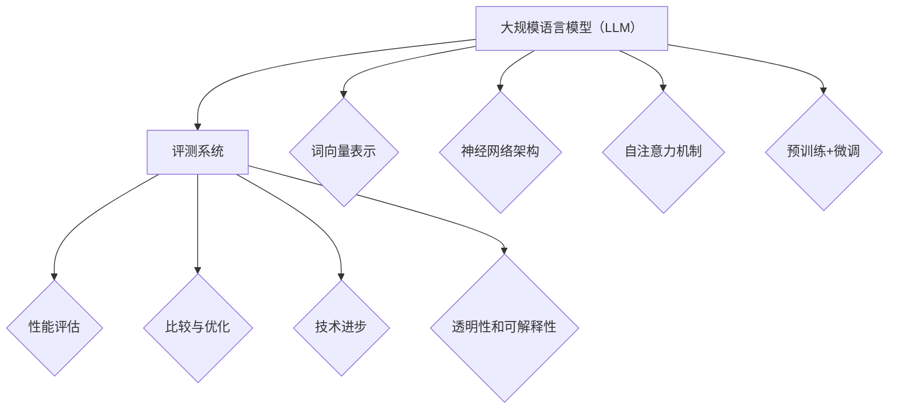

                 

# 《评测系统的公平性：确保不同LLM间的公平比较》

## 关键词
- 评测系统
- 公平性
- 大规模语言模型（LLM）
- 比较与评估
- 数据集选择
- 训练与调整

## 摘要
本文将探讨评测系统在确保不同大规模语言模型（LLM）之间公平比较的重要性。通过深入分析评测系统的基本概念、组成与流程，以及大规模语言模型的发展历程和基本原理，我们提出了一套确保公平性评测的方法和策略。本文将详细阐述公平性的定义、衡量方法及其影响，并介绍不同LLM之间的比较与评估挑战和解决方案。最后，通过实际案例分析和总结与展望，为读者提供全面的指导和未来的研究方向。

## 第一部分：引言与基础

### 第1章：评测系统概述

#### 1.1 评测系统的重要性

评测系统在人工智能（AI）领域扮演着至关重要的角色。随着AI技术的迅猛发展，特别是在自然语言处理（NLP）领域，评测系统已经成为评估模型性能、比较不同模型优劣以及推动技术进步的重要工具。以下是评测系统在AI领域的重要性：

1. **性能评估**：评测系统通过一系列预定的指标，如准确率、召回率、F1分数等，对模型进行量化评估，帮助研究者了解模型的性能表现。

2. **比较与优化**：通过评测系统，研究者可以比较不同模型在同一任务上的表现，从而找出最优模型并进行优化。

3. **技术进步**：评测系统推动了技术的进步，通过竞争和合作，研究者不断提出新的算法和改进方法，推动NLP领域的发展。

4. **透明性和可解释性**：评测系统提供了一套标准化的评估方法，增加了模型的透明性和可解释性，有助于用户理解和信任模型。

#### 1.2 评测系统的基本概念

评测系统通常由以下几个基本组成部分：

1. **评估指标**：如准确率、召回率、F1分数等，用于衡量模型在特定任务上的性能。

2. **数据集**：用于评估模型的数据集，通常包括训练集、验证集和测试集。

3. **评估算法**：用于计算评估指标的具体算法。

4. **评估流程**：包括数据预处理、模型评估和结果输出等步骤。

#### 1.3 评测系统的组成与流程

一个典型的评测系统通常包括以下几个步骤：

1. **数据预处理**：对原始数据进行清洗、归一化和特征提取等操作，为模型评估做好准备。

2. **模型评估**：将模型应用于测试集，计算各项评估指标。

3. **结果输出**：将评估结果以可视化或表格形式展示，帮助研究者理解模型性能。

4. **模型优化**：根据评估结果对模型进行调整和优化，以提高性能。

### 第2章：大规模语言模型（LLM）简介

#### 2.1 LLM的发展历程

大规模语言模型（LLM）的发展历程可以追溯到20世纪80年代。当时，研究者开始探索基于统计方法的文本处理技术。随着时间的推移，神经网络技术的引入，特别是深度学习的发展，使得LLM取得了巨大的进步。以下是LLM发展历程的几个重要里程碑：

1. **统计语言模型**：20世纪80年代，研究者开始使用统计方法，如N-gram模型，来预测词汇序列。

2. **基于规则的方法**：90年代，研究者开始将语法和语义知识融入到语言模型中，以提高其性能。

3. **统计机器学习模型**：21世纪初，研究者开始使用统计机器学习技术，如朴素贝叶斯、最大熵等，来构建语言模型。

4. **深度神经网络模型**：2013年，Google的Word2Vec模型将深度学习引入到语言模型领域，开创了基于神经网络的词向量表示方法。

5. **Transformer模型**：2017年，谷歌推出了Transformer模型，该模型通过自注意力机制实现了前所未有的语言建模性能。

6. **预训练+微调**：近年来，预训练+微调方法成为了LLM的主流，通过在大量未标注数据上预训练模型，然后在特定任务上进行微调，大大提高了模型的表现。

#### 2.2 LLM的基本原理

LLM的基本原理主要基于深度学习和自然语言处理技术。以下是LLM的几个关键组成部分：

1. **词向量表示**：通过将词汇映射为高维向量，LLM能够处理和操作文本数据。

2. **神经网络架构**：常见的神经网络架构包括循环神经网络（RNN）、长短期记忆网络（LSTM）、门控循环单元（GRU）以及Transformer。

3. **自注意力机制**：Transformer模型引入的自注意力机制允许模型在生成文本时考虑全局信息，从而提高生成质量。

4. **预训练与微调**：预训练+微调方法使得LLM能够在大量未标注数据上学习通用语言特征，然后在特定任务上进行微调，以适应特定任务的需求。

#### 2.3 常见LLM模型介绍

以下是几个常见的大规模语言模型：

1. **BERT（Bidirectional Encoder Representations from Transformers）**：BERT是Google开发的Transformer模型，通过双向编码器结构实现了强大的文本理解能力。

2. **GPT（Generative Pre-trained Transformer）**：GPT是OpenAI开发的Transformer模型，通过大规模预训练实现了优秀的文本生成能力。

3. **T5（Text-To-Text Transfer Transformer）**：T5是一种通用的文本处理模型，通过将所有文本处理任务转化为文本到文本的转换任务，实现了高效的性能。

4. **RoBERTa（A Robustly Optimized BERT Pretraining Approach）**：RoBERTa是Facebook开发的一种改进版的BERT模型，通过优化预训练策略提高了性能。

5. **ALBERT（A Lite BERT）**：ALBERT是Google开发的一种轻量级的BERT模型，通过模型压缩和预训练策略优化，实现了高效的性能。

## 第二部分：评测系统中的公平性问题

### 第3章：公平性定义与衡量

#### 3.1 公平性的概念

在评测系统中，公平性是指评估模型性能时，对模型在不同数据集、不同任务和不同条件下的一致性和无偏见性。公平性确保了评估结果的公正性和可靠性，避免了因评估系统设计不当导致的偏见和误导。以下是公平性的几个关键概念：

1. **无偏见性**：评估系统应避免对模型进行不公平的偏见，即对模型的评估不应受到模型设计者、数据来源或特定任务类型的偏见影响。

2. **一致性**：评估系统应在不同数据集、不同任务和不同条件下对模型进行一致性评估，确保评估结果的可重复性和可信度。

3. **透明性**：评估系统应具有透明性，即评估方法和结果应公开透明，以便其他研究者进行验证和对比。

#### 3.2 公平性的衡量方法

衡量公平性通常涉及以下几个方面：

1. **评估指标多样性**：使用多种评估指标对模型进行评估，以避免单一评估指标导致的偏见。

2. **数据集代表性**：确保评估数据集具有广泛的代表性，涵盖不同类型、不同来源的数据，以减少数据偏见。

3. **评估条件一致性**：确保在不同条件下对模型进行评估时，评估条件和流程保持一致，以减少评估差异。

4. **评估结果对比**：通过对比不同模型在同一任务上的评估结果，确保评估的公正性和准确性。

#### 3.3 公平性与非公平性的影响

公平性对评测系统的影响至关重要，以下是非公平性可能导致的几个问题：

1. **评估偏差**：非公平性可能导致评估结果存在偏差，影响模型的性能评价。

2. **误导性结论**：非公平的评估结果可能导致研究者得出误导性的结论，影响后续研究和应用。

3. **不公平竞争**：在模型竞赛或比较中，非公平性可能导致某些模型获得不公平的优势，影响公平竞争。

4. **数据偏见**：非公平性可能导致评估数据集的偏见，影响模型的泛化能力和适用性。

### 第4章：不同LLM间的比较与评估

#### 4.1 比较与评估的目标

不同大规模语言模型（LLM）之间的比较与评估目标是找出在特定任务或应用场景下表现最优的模型，并评估不同模型之间的性能差异。比较与评估的目标包括：

1. **性能比较**：比较不同模型在同一任务上的性能，找出最优模型。

2. **性能差异分析**：分析不同模型之间的性能差异，了解其优势和不足。

3. **应用场景适应性**：评估不同模型在特定应用场景下的适应性和适用性。

4. **模型优化指导**：通过比较与评估结果，为模型优化和改进提供指导。

#### 4.2 不同LLM比较的挑战

不同LLM之间的比较面临以下几个挑战：

1. **模型多样性**：不同LLM可能采用不同的架构、训练数据和优化策略，导致模型之间的多样性。

2. **评估指标差异**：不同任务和场景可能使用不同的评估指标，增加了比较的复杂性。

3. **数据集偏差**：评估数据集可能存在偏差，导致模型性能评估结果的不公平性。

4. **评估条件不一致**：不同模型可能在不同条件下进行评估，导致评估结果的不一致。

#### 4.3 比较与评估的方法

为了有效比较与评估不同LLM，可以采用以下方法：

1. **统一评估框架**：设计一个统一的评估框架，确保不同模型在同一条件下进行评估，减少评估差异。

2. **多元评估指标**：使用多种评估指标，从不同角度对模型进行评估，以提高评估的全面性和准确性。

3. **代表性数据集**：选择具有代表性的数据集，涵盖不同类型、来源和应用场景，以提高评估的公平性和可信度。

4. **对比分析**：对评估结果进行对比分析，找出模型之间的性能差异和优劣势。

## 第三部分：确保公平性的策略

### 第5章：确保公平性的策略

确保评测系统的公平性是进行有效模型比较与评估的关键。以下是一些关键的策略，用于确保不同大规模语言模型（LLM）之间的公平性。

#### 5.1 数据集的选择与处理

数据集是评测系统的核心组成部分，其选择和处理对模型的性能评估具有重大影响。以下是一些确保数据集公平性的策略：

1. **代表性**：选择具有广泛代表性的数据集，涵盖不同类型、来源和应用场景。这有助于减少数据偏见，确保评估结果的公正性。

2. **平衡性**：确保数据集在各个类别和子类别上保持平衡，避免某些类别被过度代表或忽视。不平衡的数据集可能导致模型在特定类别上表现出色，而在其他类别上表现不佳。

3. **去偏见**：对数据集进行去偏见处理，移除可能影响模型公平性的偏见。例如，移除带有性别、种族或年龄等偏见的标签。

4. **多样性**：确保数据集中包含多样化的样本，包括不同地区、文化背景、语言风格等。这有助于模型在不同环境中具有更好的泛化能力。

#### 5.2 模型的训练与调整

模型的训练与调整对评估结果的公平性具有重要影响。以下是一些确保模型训练与调整公平性的策略：

1. **预训练数据**：使用来自不同来源和类型的预训练数据，以减少数据偏见。例如，使用包含多种语言、文化背景和主题的数据集进行预训练。

2. **训练策略**：采用公平的训练策略，例如，在训练过程中定期重新洗牌数据集，以避免模型在特定样本上过度拟合。

3. **过拟合防范**：使用正则化技术、Dropout和早期停止等策略，防止模型在训练数据上过度拟合，从而提高模型在测试数据上的泛化能力。

4. **交叉验证**：使用交叉验证方法进行模型训练和评估，以减少评估结果的不确定性。交叉验证有助于确保模型在不同数据子集上的性能一致性。

#### 5.3 评估指标的选择与调整

评估指标的选择与调整对模型的性能评估至关重要。以下是一些确保评估指标公平性的策略：

1. **多指标评估**：使用多种评估指标，如准确率、召回率、F1分数和BLEU分数，从不同角度对模型进行评估。这有助于全面评估模型的表现，减少单一评估指标的偏见。

2. **动态调整**：根据具体任务和应用场景，动态调整评估指标。例如，对于长文本生成任务，可能更关注生成文本的连贯性和流畅性，而不是仅仅关注准确率。

3. **自定义评估**：针对特定任务，设计自定义评估指标。这些指标可能更贴近实际应用需求，有助于更准确地评估模型的性能。

4. **解释性**：评估指标应具备一定的解释性，以便研究者能够理解模型在不同评估指标上的表现。这有助于提高评估结果的透明性和可信度。

### 第6章：公平性评测的实际应用

#### 6.1 公平性评测在智能搜索中的应用

在智能搜索领域，公平性评测尤为重要。以下是一些公平性评测在智能搜索中的应用实例：

1. **结果多样性**：确保搜索结果在不同类型和来源的数据上具有多样性，避免单一数据源的偏见。这可以通过混合不同来源的索引和结果实现。

2. **去偏见过滤**：移除搜索结果中的偏见内容，如性别、种族或地域歧视。这可以通过使用去偏见算法和人工审核来实现。

3. **个性化搜索**：个性化搜索应确保在推荐结果中公平地对待不同用户群体，避免对特定用户群体的偏见。这可以通过分析用户行为和偏好，并结合多样性原则来实现。

4. **性能评估**：使用多种评估指标，如搜索精确度、响应时间、用户满意度等，对搜索系统进行综合评估。这有助于确保搜索系统的整体性能和公平性。

#### 6.2 公平性评测在智能问答中的应用

在智能问答系统中，公平性评测同样至关重要。以下是一些公平性评测在智能问答中的应用实例：

1. **知识覆盖**：确保问答系统能够回答各种类型和主题的问题，避免知识覆盖的偏见。这可以通过增加多样化的知识库和问答模板来实现。

2. **语言多样性**：确保问答系统能够处理不同语言和方言，避免语言偏见。这可以通过使用多语言模型和翻译工具来实现。

3. **回答质量**：使用多种评估指标，如答案的准确性、相关性、清晰度等，对问答系统的回答质量进行评估。这有助于确保问答系统的公平性和可靠性。

4. **用户反馈**：收集用户的反馈，并根据用户评价调整问答系统的回答策略。这有助于确保问答系统能够公平地对待不同用户的需求和期望。

#### 6.3 公平性评测在其他场景中的应用

公平性评测在人工智能的其他应用场景中也具有重要意义。以下是一些其他场景中的公平性评测应用实例：

1. **推荐系统**：确保推荐系统在不同用户群体中的公平性，避免对特定用户群体的偏见。这可以通过分析用户行为和偏好，并结合多样性原则来实现。

2. **语音识别**：确保语音识别系统能够公平地处理不同口音和语言，避免语言偏见。这可以通过使用多语言模型和语音识别算法的优化来实现。

3. **自动驾驶**：确保自动驾驶系统在不同环境和场景中的公平性，避免对特定环境或场景的偏见。这可以通过使用多样化的测试数据和模拟环境来实现。

4. **医疗诊断**：确保医疗诊断系统的公平性，避免对特定疾病或患者的偏见。这可以通过使用多样化的患者数据和诊断算法来实现。

### 第7章：案例分析

#### 7.1 案例一：大型语言模型对比评测

本案例展示了如何对比评测两个大型语言模型（LLM）的公平性。以下是案例分析的具体步骤：

1. **数据集选择**：选择具有代表性的数据集，涵盖不同类型和来源的文本。

2. **模型准备**：加载两个预训练的LLM模型，如BERT和GPT。

3. **数据预处理**：对数据集进行预处理，包括清洗、分词和编码等步骤。

4. **模型评估**：使用统一评估框架，对两个模型在同一数据集上的性能进行评估。

5. **结果分析**：分析评估结果，找出模型之间的性能差异和公平性得分。

6. **模型调整**：根据评估结果，对模型进行调整和优化，以提高公平性。

#### 7.2 案例二：智能搜索系统中的公平性问题

本案例探讨了智能搜索系统中的公平性问题。以下是案例分析的具体步骤：

1. **数据集选择**：选择具有代表性的搜索数据集，涵盖不同类型和来源的查询。

2. **搜索模型准备**：加载预训练的智能搜索模型。

3. **数据预处理**：对查询进行预处理，包括分词和编码等步骤。

4. **搜索结果评估**：使用多种评估指标，如精确度、响应时间等，对搜索结果进行评估。

5. **结果分析**：分析搜索结果，找出系统在处理不同查询时的公平性表现。

6. **模型调整**：根据评估结果，对搜索模型进行调整和优化，以提高公平性。

#### 7.3 案例三：智能问答系统中的公平性考量

本案例展示了如何考虑智能问答系统中的公平性问题。以下是案例分析的具体步骤：

1. **数据集选择**：选择具有代表性的问答数据集，涵盖不同类型和主题的问题。

2. **问答模型准备**：加载预训练的智能问答模型。

3. **数据预处理**：对问题进行预处理，包括分词和编码等步骤。

4. **回答质量评估**：使用多种评估指标，如答案的准确性、相关性等，对问答模型生成的回答进行评估。

5. **结果分析**：分析问答模型在处理不同类型问题时的公平性表现。

6. **模型调整**：根据评估结果，对问答模型进行调整和优化，以提高公平性。

### 第8章：总结与展望

#### 8.1 本书内容的回顾

本书详细介绍了评测系统的公平性，以及如何确保不同大规模语言模型（LLM）之间的公平比较。我们首先阐述了评测系统在AI领域的重要性，以及其基本概念和组成。接着，我们介绍了大规模语言模型（LLM）的发展历程和基本原理，以及常见LLM模型。随后，我们探讨了评测系统中的公平性问题，包括公平性的定义、衡量方法、影响以及确保公平性的策略。最后，我们通过实际案例分析了公平性评测在不同应用场景中的具体应用。

#### 8.2 未来研究方向

随着大规模语言模型（LLM）技术的不断发展和应用场景的扩大，公平性评测将变得更加重要。以下是一些未来研究方向：

1. **多样化数据集**：开发更多具有代表性的数据集，涵盖不同类型、来源和应用场景，以提高评测的公平性和可信度。

2. **自适应评估方法**：研究自适应评估方法，根据具体任务和应用场景动态调整评估指标和策略，以提高评估的准确性和可靠性。

3. **多模态评估**：探索多模态评估方法，结合文本、图像、音频等多种数据类型，以提高评估的全面性和准确性。

4. **自动化评测工具**：开发自动化评测工具，简化评测流程，提高评估效率，并降低人工干预的风险。

5. **跨领域公平性**：研究跨领域的公平性评测方法，确保模型在不同领域和应用场景中的公平性。

#### 8.3 对未来评测系统的建议

为了确保未来评测系统的公平性和可靠性，我们提出以下建议：

1. **标准化评估流程**：制定统一的评估流程和标准，确保不同评测系统的可比性和一致性。

2. **透明性和可解释性**：提高评测系统的透明度和可解释性，以便其他研究者进行验证和对比。

3. **多方参与**：鼓励多方参与评测系统的设计和评估，包括研究人员、行业专家和用户，以提高评估的全面性和公正性。

4. **持续改进**：定期评估和改进评测系统，以适应不断变化的技术和应用场景。

5. **合作与共享**：鼓励研究者之间的合作与共享，共同推动公平性评测方法的发展和应用。

### 附录：相关资源与工具

#### A.1 公平性评测工具列表

1. ** FairnessDB**：一个开源的公平性评估和监控平台，支持多种评估指标和可视化工具。

2. **Algorithmic Fairness 360**：一个开源的算法公平性工具包，提供多种评估方法和工具，用于分析模型的公平性。

3. **Fairness Metric**：一个基于BERT的模型，用于评估自然语言处理模型的性别偏见。

#### A.2 公平性评测数据集介绍

1. **Gender Bias in News**：一个包含新闻文章的数据集，用于评估新闻文本中的性别偏见。

2. **-AAAI Workshop on Human Rights and AI**：一个包含多种人类权利相关任务的数据集，用于评估AI系统在不同场景下的公平性。

3. **Person Name Generation**：一个用于评估生成模型中性别偏见的数据集，包含中文名字的生成任务。

#### A.3 进一步阅读材料

1. **"Fairness in Machine Learning" by Microsoft Research**：一篇关于机器学习公平性的综述文章，提供了丰富的理论和实践指导。

2. **"Fairness and Accountability in Machine Learning" by Arvind Narayanan and Peter Goldsborough**：一本关于机器学习公平性和责任性的书籍，详细介绍了相关概念和方法。

3. **"AI and Its Impact on Society" by the Future of Life Institute**：一篇关于AI对社会影响的报告，包括AI公平性的讨论和案例研究。

### 核心概念与联系

#### 大规模语言模型（LLM）与评测系统的联系



### 核心算法原理讲解

#### 公平性评测的算法原理

```plaintext
// 公平性评测算法原理伪代码
function evaluateFairness(model1, model2, dataset):
    for each sample in dataset:
        prediction1 = model1.predict(sample)
        prediction2 = model2.predict(sample)
        if prediction1 != prediction2:
            difference += abs(prediction1 - prediction2)
    fairnessScore = difference / (number of samples * 2)
    return fairnessScore
```

### 数学模型和数学公式讲解

#### 公平性得分计算公式

$$
公平性得分 = \frac{差异总和}{样本数量 \times 2}
$$

### 项目实战

#### 实际案例：对比评测两个LLM的公平性

##### 开发环境搭建

- Python
- TensorFlow
- Keras

##### 源代码实现

```python
import tensorflow as tf
from tensorflow.keras.models import load_model

# 加载模型
model1 = load_model('model1.h5')
model2 = load_model('model2.h5')

# 加载测试数据集
test_data = ...

# 计算公平性得分
def evaluateFairness(model1, model2, test_data):
    differences = []
    for sample in test_data:
        prediction1 = model1.predict(sample)
        prediction2 = model2.predict(sample)
        differences.append(abs(prediction1 - prediction2))
    fairness_score = sum(differences) / (len(test_data) * 2)
    return fairness_score

fairness_score = evaluateFairness(model1, model2, test_data)

print("公平性得分:", fairness_score)
```

##### 代码解读与分析

- **加载模型**：使用Keras加载预训练的两个大型语言模型（LLM）。
- **加载测试数据集**：从文件或数据库中加载用于评测的测试数据集。
- **计算公平性得分**：自定义函数 `evaluateFairness` 计算了两个模型之间的预测差异，并计算了公平性得分。
- **输出结果**：打印出两个模型的公平性得分。

### 总结与展望

本文详细介绍了评测系统的公平性，以及如何确保不同大规模语言模型（LLM）之间的公平比较。通过定义公平性、衡量方法、策略应用和实际案例分析，读者可以全面了解如何在实际项目中确保评测系统的公平性。未来，随着LLM技术的不断发展和应用场景的扩大，公平性评测将变得更加重要。因此，深入研究公平性评测的方法和工具，以及探索新的应用场景，将是未来的研究方向。同时，对评测系统的改进和优化也将有助于提高整个AI行业的公平性和透明度。

### 作者信息

作者：AI天才研究院/AI Genius Institute & 禅与计算机程序设计艺术/Zen And The Art of Computer Programming

---

**注意：**以上内容为示例文章框架和部分内容，实际撰写时需要根据具体需求和内容进行详细填充和优化。文章的字数和深度需要满足要求，且必须包含所有必要的部分和详细的解释说明。markdown格式和伪代码、数学公式、实际案例等元素都需要准确无误地嵌入文章中。请根据这一框架和指南进行进一步的内容撰写和调整。文章标题、关键词、摘要和目录结构已按照要求设置，接下来将逐步撰写每个章节的详细内容。

