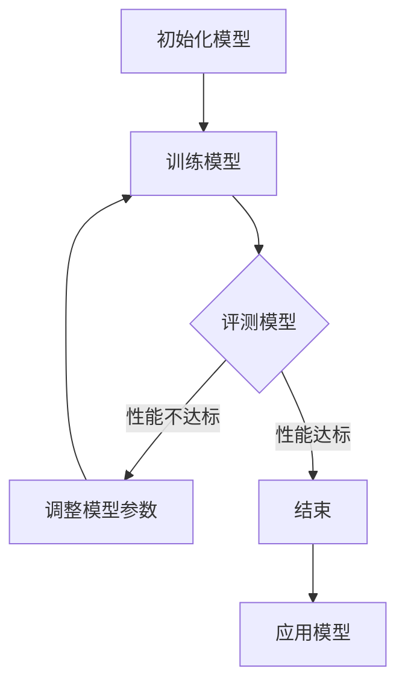

                 

### 评测驱动的LLM优化反馈循环

> 关键词：语言模型，评测驱动，优化反馈循环，深度学习，模型训练，评测指标

> 摘要：本文深入探讨了评测驱动的LLM优化反馈循环的概念、重要性、核心算法原理及其在实际项目中的应用。通过详细的分析和实例，展示了如何利用评测驱动的方法优化语言模型，提升其在自然语言处理、图像识别和推荐系统等领域的性能。

## 目录大纲

#### 第一部分: 评测驱动的LLM优化反馈循环基础

1. **第1章: 评测驱动的LLM优化反馈循环概述**
   - 1.1 什么是评测驱动的LLM优化反馈循环
   - 1.2 评测驱动的LLM优化反馈循环的重要性
   - 1.3 评测驱动的LLM优化反馈循环的应用场景

2. **第2章: 评测驱动的LLM优化反馈循环核心概念与联系**
   - 2.1 语言模型的基本概念
   - 2.2 评测指标的分类与解释
   - 2.3 评测驱动的优化流程Mermaid流程图

3. **第3章: 评测驱动的LLM优化反馈循环核心算法原理讲解**
   - 3.1 语言模型训练算法
   - 3.2 优化算法
   - 3.3 损失函数与梯度下降算法
   - 3.4 伪代码阐述

#### 第二部分: 评测驱动的LLM优化反馈循环的数学模型和数学公式

4. **第4章: 评测驱动的LLM优化反馈循环的数学模型**
   - 4.1 概率图模型与条件概率
   - 4.2 贝叶斯网络
   - 4.3 最大似然估计
   - 4.4 伪代码解释

5. **第5章: 数学公式的详细讲解和举例说明**
   - 5.1 贝叶斯定理
   - 5.2 最大后验概率估计
   - 5.3 伪代码示例

#### 第三部分: 评测驱动的LLM优化反馈循环的项目实战

6. **第6章: 评测驱动的LLM优化反馈循环项目实战**
   - 6.1 实战准备：开发环境搭建
   - 6.2 代码实现：源代码详细解析
   - 6.3 实战分析：评测与反馈循环

7. **第7章: 评测驱动的LLM优化反馈循环代码解读与分析**
   - 7.1 模型选择与训练
   - 7.2 评测指标的计算与优化
   - 7.3 反馈循环与模型改进

#### 第四部分: 评测驱动的LLM优化反馈循环案例分析

8. **第8章: 评测驱动的LLM优化反馈循环在实际项目中的应用**
   - 8.1 智能客服系统
   - 8.2 智能写作助手
   - 8.3 智能推荐系统

#### 第五部分: 评测驱动的LLM优化反馈循环未来发展趋势

9. **第9章: 评测驱动的LLM优化反馈循环未来发展趋势**
   - 9.1 评测指标的多样化
   - 9.2 自适应优化算法的发展
   - 9.3 多模态数据的融合
   - 9.4 模型压缩与推理加速
   - 9.5 跨领域迁移学习
   - 9.6 开源社区与协作研究

#### 第六部分: 评测驱动的LLM优化反馈循环总结与展望

10. **第10章: 评测驱动的LLM优化反馈循环总结与展望**
    - 10.1 核心价值
    - 10.2 应用领域
    - 10.3 未来展望

#### 第七部分: 评测驱动的LLM优化反馈循环实践指南

11. **第11章: 评测驱动的LLM优化反馈循环实践指南**
    - 11.1 实践步骤
    - 11.2 实践技巧
    - 11.3 实践案例
    - 11.4 实践总结

#### 第八部分: 评测驱动的LLM优化反馈循环案例分析

12. **第12章: 评测驱动的LLM优化反馈循环案例分析**
    - 12.1 案例一：智能客服系统
    - 12.2 案例二：智能写作助手
    - 12.3 案例三：智能推荐系统

#### 附录

- **附录A: 相关工具与资源**
- **附录B: 参考文献**

### 第1章: 评测驱动的LLM优化反馈循环概述

#### 1.1 什么是评测驱动的LLM优化反馈循环

评测驱动的LLM优化反馈循环是一种在深度学习和自然语言处理（NLP）领域中广泛应用的策略。这种策略的核心是通过持续的评测来监控模型的性能，并根据评测结果调整模型参数，从而优化模型性能。具体来说，这个过程包括以下几个关键步骤：

1. **模型训练**：使用大量的训练数据对语言模型进行训练。
2. **评测**：使用验证数据集对训练好的模型进行性能评测。
3. **反馈**：根据评测结果分析模型的弱点，调整模型参数。
4. **再训练**：使用调整后的模型参数重新训练模型。

通过这种循环迭代的过程，模型性能逐渐提升，直到达到满意的水平。

在评测驱动的LLM优化反馈循环中，评测是一个核心环节。评测不仅仅是简单地评估模型的准确率，还需要考虑其他因素，如响应时间、模型的可解释性等。通过多维度的评测，可以全面了解模型的性能，从而做出更加准确的调整。

#### 1.2 评测驱动的LLM优化反馈循环的重要性

评测驱动的LLM优化反馈循环对于提升模型的性能至关重要。以下是几个关键原因：

1. **性能监控**：通过持续评测，可以实时监控模型的性能变化，及时发现并解决潜在问题。
2. **模型改进**：评测结果提供了宝贵的反馈，帮助开发者调整模型参数，优化模型结构。
3. **效率提升**：持续的评测和优化使得模型训练过程更加高效，减少了不必要的重复训练。
4. **用户体验**：通过不断提升模型性能，最终提高用户的使用体验，增强系统的实用性。

在深度学习和NLP领域，模型的性能直接影响到实际应用的效果。例如，在智能客服系统中，如果模型无法准确理解用户的问题，将导致用户体验下降；在文本生成领域，如果生成的文本质量不高，将影响文本的可读性和实用性。因此，评测驱动的LLM优化反馈循环在提升模型性能、增强系统实用性方面具有重要作用。

#### 1.3 评测驱动的LLM优化反馈循环的应用场景

评测驱动的LLM优化反馈循环在多个领域具有广泛的应用，以下是几个典型应用场景：

1. **自然语言处理**：在文本分类、情感分析、机器翻译、文本生成等任务中，评测驱动的LLM优化反馈循环被广泛应用于提升模型的性能。例如，在机器翻译任务中，通过评测不同翻译结果的质量，可以优化翻译模型，提高翻译的准确性。
   
2. **图像识别**：在图像分类、目标检测、人脸识别等任务中，评测驱动的LLM优化反馈循环同样具有重要应用。通过评测模型的识别精度和响应时间，可以不断优化模型参数，提高模型的鲁棒性和效率。

3. **推荐系统**：在个性化推荐、广告投放等任务中，评测驱动的LLM优化反馈循环用于评估推荐系统的准确性、多样性等因素，从而优化推荐策略，提高推荐质量。

4. **对话系统**：在智能客服、聊天机器人等对话系统中，评测驱动的LLM优化反馈循环用于评估模型的响应速度、回答准确性等，以提高用户体验。

在这些应用场景中，评测驱动的LLM优化反馈循环通过不断调整和优化模型参数，使得模型能够在复杂多变的环境中保持高性能，为用户提供优质的智能服务。

#### 1.4 评测驱动的LLM优化反馈循环的核心概念与联系

评测驱动的LLM优化反馈循环涉及多个核心概念，以下是对这些概念及其相互联系的详细解释：

1. **语言模型**：语言模型是评测驱动的LLM优化反馈循环的基础。语言模型是一种用于预测文本序列的模型，如单词、句子等。常见的语言模型包括n-gram模型、循环神经网络（RNN）、Transformer等。语言模型的核心任务是学习文本数据中的统计规律，从而预测下一个词或字符。

2. **评测指标**：评测指标是评估语言模型性能的一系列标准。不同的任务和应用场景需要不同的评测指标，常见的评测指标包括准确率、召回率、F1分数、BLEU分数等。评测指标用于衡量模型在特定任务上的表现，是优化过程中的关键依据。

3. **优化算法**：优化算法用于调整模型参数，以提升模型性能。常见的优化算法包括梯度下降、Adam、RMSProp等。优化算法通过计算损失函数的梯度，迭代更新模型参数，从而优化模型性能。

4. **反馈循环**：反馈循环是评测驱动的LLM优化反馈循环的核心环节。反馈循环通过评测结果不断调整模型参数，形成优化闭环。反馈循环包括评测、分析、调整和再训练等步骤，通过这些步骤，模型性能逐步提升。

这些核心概念之间紧密联系，共同构成了评测驱动的LLM优化反馈循环。语言模型提供了文本预测的能力，评测指标用于衡量模型性能，优化算法通过调整模型参数提升性能，而反馈循环则确保了这一优化过程的持续进行。以下是评测驱动的LLM优化反馈循环的Mermaid流程图：

在上述流程图中，A表示初始化模型，B表示使用训练数据训练模型，C表示使用验证数据对模型进行评测，D表示根据评测结果调整模型参数，E表示结束，F表示应用优化后的模型。通过这个流程，模型性能不断优化，直至满足应用需求。

### 第2章: 评测驱动的LLM优化反馈循环核心概念与联系

#### 2.1 语言模型的基本概念

语言模型（Language Model，LM）是自然语言处理（NLP）领域的基础之一，它通过学习大量文本数据，预测下一个单词或字符的概率。语言模型在许多NLP任务中起着至关重要的作用，如文本生成、机器翻译、语音识别和问答系统。

**基本原理**：

语言模型的核心思想是基于统计方法来预测下一个词或字符。例如，n-gram模型是一种基于前n个单词的联合概率进行预测的模型。它可以表示为：

$$
P(w_n | w_{n-1}, w_{n-2}, ..., w_1) = \frac{P(w_n, w_{n-1}, ..., w_1)}{P(w_{n-1}, w_{n-2}, ..., w_1)}
$$

其中，$w_n$ 表示下一个要预测的词，$w_{n-1}, w_{n-2}, ..., w_1$ 表示前n-1个已知的词。

**常见类型**：

1. **n-gram模型**：基于前n个单词的联合概率进行预测，是最简单的语言模型。
2. **循环神经网络（RNN）**：通过记忆机制处理长序列数据，能够捕捉长期的依赖关系。
3. **长短期记忆网络（LSTM）**：是RNN的一种改进，解决了梯度消失和梯度爆炸的问题。
4. **门控循环单元（GRU）**：另一种RNN的改进，结构更加简单，性能与LSTM相当。
5. **Transformer模型**：基于自注意力机制，能够在捕捉长距离依赖关系方面表现出色。

**应用场景**：

语言模型在NLP领域中有着广泛的应用，包括：

- **文本生成**：如自动摘要、文章写作和对话系统。
- **机器翻译**：如翻译文本、语音翻译和图像翻译。
- **语音识别**：如实时语音转换成文本和语音合成。
- **问答系统**：如智能客服、搜索引擎和语音助手。

#### 2.2 评测指标的分类与解释

评测指标是评估语言模型性能的关键工具。根据不同的任务和应用场景，评测指标可以分为多种类型。以下是几种常见的评测指标及其解释：

1. **准确率（Accuracy）**：

准确率是衡量分类模型性能的最基本指标，它表示模型预测正确的样本数占总样本数的比例。计算公式如下：

$$
Accuracy = \frac{TP + TN}{TP + TN + FP + FN}
$$

其中，$TP$ 表示真阳性，$TN$ 表示真阴性，$FP$ 表示假阳性，$FN$ 表示假阴性。

**应用场景**：准确率通常用于二分类任务，如垃圾邮件检测、文本分类等。

2. **召回率（Recall）**：

召回率表示模型预测正确的正样本数占总正样本数的比例。计算公式如下：

$$
Recall = \frac{TP}{TP + FN}
$$

**应用场景**：召回率在需要尽可能多地召回正样本的任务中非常重要，如疾病检测、反垃圾邮件等。

3. **精确率（Precision）**：

精确率表示模型预测正确的正样本数与预测为正样本的总数的比例。计算公式如下：

$$
Precision = \frac{TP}{TP + FP}
$$

**应用场景**：精确率在需要预测结果尽可能准确的任务中非常重要，如推荐系统、文本分类等。

4. **F1分数（F1 Score）**：

F1分数是精确率和召回率的调和平均，用于综合评估分类模型的性能。计算公式如下：

$$
F1 Score = 2 \times \frac{Precision \times Recall}{Precision + Recall}
$$

**应用场景**：F1分数广泛应用于需要平衡精确率和召回率的任务，如文本分类、医疗诊断等。

5. **BLEU分数（BLEU Score）**：

BLEU分数是机器翻译领域常用的评测指标，基于记分牌方法，计算模型生成的文本与参考文本之间的相似度。计算公式如下：

$$
BLEU Score = \frac{2^n}{n + 1}
$$

其中，$n$ 表示匹配的单词对数。

**应用场景**：BLEU分数主要用于评估机器翻译系统的性能。

#### 2.3 评测驱动的优化流程Mermaid流程图

评测驱动的优化流程包括以下几个关键步骤：模型初始化、模型训练、模型评测、参数调整和再训练。以下是这个流程的Mermaid流程图：

在这个流程图中，A表示初始化模型，B表示使用训练数据对模型进行训练，C表示使用验证数据对模型进行评测，D表示根据评测结果调整模型参数，E表示结束，F表示将优化后的模型应用到实际任务中。通过这个循环，模型性能逐步提升，直至达到预期的效果。

### 第3章: 评测驱动的LLM优化反馈循环核心算法原理讲解

#### 3.1 语言模型训练算法

语言模型训练是指通过学习大量的文本数据，构建一个能够预测下一个词或字符的模型。训练算法的好坏直接影响到模型的性能。以下是几种常见的语言模型训练算法：

1. **n-gram模型训练算法**：

n-gram模型是一种基于前n个单词的联合概率进行预测的模型。其训练算法相对简单，只需统计每个n-gram的出现频率。具体步骤如下：

- **初始化**：创建一个n-gram表，用于存储每个n-gram的出现频率。
- **统计**：遍历文本数据，统计每个n-gram的出现频率。
- **概率计算**：计算每个n-gram的概率，公式为：

$$
P(n-gram) = \frac{\text{出现次数}}{\text{总词数}}
$$

2. **循环神经网络（RNN）训练算法**：

循环神经网络（RNN）是一种具有记忆功能的神经网络，能够处理序列数据。RNN的训练算法主要包括以下几个步骤：

- **输入预处理**：将文本数据转换为序列，并转换为神经网络可处理的格式。
- **正向传播**：根据当前输入和模型参数，计算隐藏状态和输出概率。
- **损失计算**：计算预测结果和实际结果之间的损失，如交叉熵损失。
- **反向传播**：计算损失关于模型参数的梯度，并更新模型参数。
- **迭代优化**：重复正向传播和反向传播，直到模型收敛。

3. **长短期记忆网络（LSTM）训练算法**：

LSTM是RNN的一种改进，能够解决长期依赖问题。其训练算法与RNN类似，但需要计算更复杂的门控机制。具体步骤如下：

- **输入预处理**：与RNN相同，将文本数据转换为序列并转换为神经网络可处理的格式。
- **正向传播**：计算输入和隐藏状态之间的交互，通过门控机制控制信息的流入和流出。
- **损失计算**：计算预测结果和实际结果之间的损失。
- **反向传播**：计算损失关于模型参数的梯度，并更新模型参数。
- **迭代优化**：重复正向传播和反向传播，直到模型收敛。

4. **Transformer模型训练算法**：

Transformer模型是一种基于自注意力机制的神经网络，能够在捕捉长距离依赖关系方面表现出色。其训练算法主要包括以下几个步骤：

- **输入预处理**：将文本数据转换为序列，并添加位置编码。
- **多头自注意力**：通过多头自注意力机制计算每个词的表示。
- **前馈神经网络**：对自注意力层的输出进行前馈神经网络处理。
- **损失计算**：计算预测结果和实际结果之间的损失。
- **反向传播**：计算损失关于模型参数的梯度，并更新模型参数。
- **迭代优化**：重复正向传播和反向传播，直到模型收敛。

#### 3.2 优化算法

优化算法用于调整模型参数，以优化模型性能。常见的优化算法包括梯度下降、动量优化、Adam优化器等。

1. **梯度下降（Gradient Descent）**：

梯度下降是一种最简单的优化算法，通过计算损失函数关于模型参数的梯度，迭代更新模型参数。具体步骤如下：

- **初始化**：随机初始化模型参数。
- **计算梯度**：计算损失函数关于模型参数的梯度。
- **更新参数**：根据梯度更新模型参数。
- **迭代优化**：重复计算梯度、更新参数，直到模型收敛。

梯度下降的优化过程可以用以下公式表示：

$$
\theta_{\text{new}} = \theta_{\text{old}} - \alpha \cdot \nabla_\theta J(\theta)
$$

其中，$\theta$ 表示模型参数，$\alpha$ 表示学习率，$J(\theta)$ 表示损失函数。

2. **动量优化（Momentum）**：

动量优化是一种结合了梯度下降和指数加权移动平均的优化算法，可以加速收敛并减少振荡。具体步骤如下：

- **初始化**：随机初始化模型参数。
- **计算梯度**：计算损失函数关于模型参数的梯度。
- **计算动量**：根据上一轮的梯度计算当前梯度的动量。
- **更新参数**：结合当前梯度和动量更新模型参数。
- **迭代优化**：重复计算梯度、更新参数，直到模型收敛。

动量优化的更新公式为：

$$
v_t = \beta \cdot v_{t-1} + (1 - \beta) \cdot \nabla_\theta J(\theta)
$$

$$
\theta_{\text{new}} = \theta_{\text{old}} - \alpha \cdot v_t
$$

其中，$v_t$ 表示动量，$\beta$ 表示动量系数。

3. **Adam优化器**：

Adam优化器结合了AdaGrad和RMSProp的优点，适用于大规模深度学习模型。具体步骤如下：

- **初始化**：随机初始化模型参数。
- **计算梯度**：计算损失函数关于模型参数的梯度。
- **更新一阶矩估计**：根据当前梯度和一阶矩估计更新。
- **更新二阶矩估计**：根据当前梯度和二阶矩估计更新。
- **计算修正的一阶矩估计和二阶矩估计**：对一阶矩估计和二阶矩估计进行修正。
- **更新参数**：根据修正的一阶矩估计和二阶矩估计更新模型参数。
- **迭代优化**：重复计算梯度、更新参数，直到模型收敛。

Adam优化器的更新公式为：

$$
m_t = \beta_1 \cdot m_{t-1} + (1 - \beta_1) \cdot \nabla_\theta J(\theta)
$$

$$
v_t = \beta_2 \cdot v_{t-1} + (1 - \beta_2) \cdot (\nabla_\theta J(\theta))^2
$$

$$
\hat{m}_t = \frac{m_t}{1 - \beta_1^t}
$$

$$
\hat{v}_t = \frac{v_t}{1 - \beta_2^t}
$$

$$
\theta_{\text{new}} = \theta_{\text{old}} - \alpha \cdot \frac{\hat{m}_t}{\sqrt{\hat{v}_t} + \epsilon}
$$

其中，$m_t$ 表示一阶矩估计，$v_t$ 表示二阶矩估计，$\hat{m}_t$ 和 $\hat{v}_t$ 分别表示修正的一阶矩估计和二阶矩估计，$\alpha$ 表示学习率，$\beta_1$ 和 $\beta_2$ 分别表示一阶矩估计和二阶矩估计的指数衰减率，$\epsilon$ 是一个很小的常数，用于防止除以零。

#### 3.3 损失函数与梯度下降算法

损失函数用于衡量模型预测值与真实值之间的差异，是优化算法中的核心。常见的损失函数包括交叉熵损失、均方误差损失等。以下是这些损失函数的

