                 

## 《语音搜索：AI提升搜索便捷性和准确性》

关键词：语音搜索、AI技术、搜索便捷性、搜索准确性、深度学习、自然语言处理

摘要：本文深入探讨了语音搜索技术的原理及其在搜索便捷性和准确性方面的提升。通过分析语音搜索的起源、技术基础、系统架构，以及AI在其中的应用，本文详细阐述了如何通过深度学习和自然语言处理技术来增强语音搜索的能力。此外，本文还通过案例分析，展示了主流语音搜索平台的应用实例，并对未来语音搜索的发展趋势进行了展望。

### 第一部分：语音搜索概述

#### 第1章：语音搜索的起源与发展

##### 1.1 语音搜索的定义与背景

语音搜索是指通过语音输入来获取信息的过程，它利用人工智能技术将用户的语音指令转换为文本查询，再通过搜索引擎或其他信息处理系统来返回结果。语音搜索的核心技术包括语音信号处理、语音识别和搜索引擎优化等。

语音搜索的发展可以追溯到20世纪50年代，当时科学家开始研究如何通过计算机处理和理解人类语言。随着计算技术的进步和语音识别技术的突破，语音搜索逐渐从实验室走向了实际应用。最早的应用之一是在军事领域，用于语音指令控制无人驾驶车辆。随着智能手机和移动互联网的普及，语音搜索得到了广泛的应用，成为现代智能设备的重要功能之一。

##### 1.2 语音搜索的历史回顾

语音搜索技术的发展经历了几个重要阶段：

1. **早期研究（1950s-1980s）**：在这个阶段，科学家主要研究如何通过计算机进行语音识别和语言理解。尽管取得了一些进展，但由于技术限制，语音搜索的实用性和准确性都很低。

2. **语音合成与识别技术突破（1990s）**：随着语音合成和识别技术的进步，语音搜索开始在一些特定场景中应用，如语音拨号、语音导航等。这一阶段的关键技术包括隐马尔可夫模型（HMM）和自动语音识别（ASR）系统。

3. **互联网时代的崛起（2000s）**：互联网的普及使得语音搜索成为搜索引擎的重要组成部分。Google、百度等搜索引擎巨头开始投资语音搜索技术，使得语音搜索的便捷性和准确性得到了显著提升。

4. **移动设备与人工智能时代（2010s-2020s）**：随着智能手机和人工智能技术的发展，语音搜索成为了用户交互的重要方式。语音助手（如Siri、Google Assistant、Alexa）的普及，进一步推动了语音搜索技术的发展。

##### 1.3 语音搜索的重要性

语音搜索的重要性体现在以下几个方面：

1. **便捷性**：语音搜索允许用户通过自然语言与设备进行交互，无需手动输入文本，极大地提高了搜索的便捷性。

2. **准确性**：随着AI技术的发展，语音搜索的准确性得到了显著提升，用户能够更准确地获取所需信息。

3. **用户体验**：语音搜索提供了更加自然和直观的交互方式，提升了用户的整体体验。

4. **市场潜力**：语音搜索作为一种新兴的交互方式，具有巨大的市场潜力。许多企业已经开始利用语音搜索技术来提高其产品的竞争力。

### 第二部分：语音搜索技术基础

#### 第2章：语音搜索技术基础

##### 2.1 语音信号处理基础

语音信号处理是语音搜索的基础，它涉及如何将语音信号转换为计算机可以处理的数据。以下是语音信号处理的一些关键步骤和概念：

1. **语音信号的基本特性**：

   - **频率**：语音信号的频率范围大约在300Hz到3.5kHz之间。
   - **幅度**：语音信号的幅度变化反映了声音的强弱。
   - **时长**：语音信号的时长反映了声音的持续时间。

2. **语音信号的数字化与特征提取**：

   - **采样**：将连续的语音信号转换为离散的数字信号，通常以每秒几千次的采样率进行。
   - **量化**：将采样得到的数字信号转换为固定长度的数字序列。
   - **特征提取**：从数字化的语音信号中提取出能够表征语音信号特性的特征，如频谱、倒谱系数等。

##### 2.2 语音识别技术

语音识别技术是语音搜索的核心，它涉及如何将语音信号转换为文本。以下是语音识别技术的一些基本原理和关键技术：

1. **语音识别的基本原理**：

   - **声学模型**：用于建模语音信号的概率分布。
   - **语言模型**：用于建模文本的概率分布。
   - **解码器**：用于将语音信号转换为文本输出。

2. **语音识别的关键技术**：

   - **隐马尔可夫模型（HMM）**：早期的一种语音识别模型，用于建模语音信号的时序特性。
   - **深度神经网络（DNN）**：用于建模语音信号的概率分布，具有较高的识别准确性。
   - **卷积神经网络（CNN）**：用于特征提取和语音识别，可以处理复杂的语音信号。

##### 2.3 语音合成技术

语音合成技术是语音搜索的另一重要组成部分，它涉及如何将文本转换为语音。以下是语音合成技术的一些基本原理和主要方法：

1. **语音合成的基本原理**：

   - **文本到语音（TTS）**：将文本转换为语音的过程，包括声学建模和语音合成。
   - **声学建模**：用于生成语音信号的概率模型。
   - **语音合成**：根据声学模型生成语音信号。

2. **语音合成的主要方法**：

   - **参数合成法**：通过参数生成语音信号，如线性预测编码（LPC）。
   - **拼接合成法**：将预录制的语音片段拼接生成语音信号。
   - **隐藏马尔可夫模型（HMM）**：用于建模语音信号的概率分布。
   - **深度神经网络（DNN）**：用于语音信号合成，可以生成高质量的语音。

#### 第3章：语音搜索系统的架构

##### 3.1 语音搜索系统的总体架构

语音搜索系统通常包括以下几个主要模块：

1. **语音输入模块**：用于接收用户的语音输入，并将其转换为数字信号。

2. **语音识别模块**：用于将数字信号转换为文本查询。

3. **搜索引擎模块**：用于处理文本查询，返回搜索结果。

4. **语音合成模块**：用于将搜索结果转换为语音输出。

以下是语音搜索系统的总体架构图：

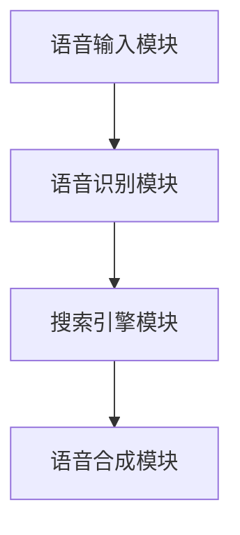

##### 3.2 语音识别模块的设计与实现

语音识别模块是语音搜索系统的核心，其设计与实现主要包括以下几个步骤：

1. **语音信号预处理**：包括降噪、归一化、滤波等步骤，以提高语音信号的质量。

2. **特征提取**：从预处理后的语音信号中提取出能够表征语音信号特性的特征。

3. **模型训练**：使用大量标注好的语音数据训练语音识别模型。

4. **模型评估与优化**：通过测试集评估模型性能，并进行优化。

以下是语音识别模块的架构图：

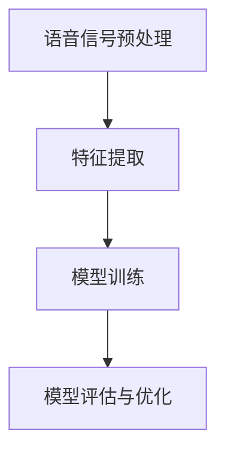

##### 3.3 搜索引擎的优化

搜索引擎模块的优化是提高语音搜索系统性能的重要手段，主要包括以下几个方面：

1. **索引优化**：通过构建高效的索引结构，提高搜索速度。

2. **查询优化**：对输入的文本查询进行处理，以提高搜索结果的准确性。

3. **结果排序**：根据用户的查询意图和搜索结果的相关性，对搜索结果进行排序。

4. **实时性优化**：通过优化算法和数据结构，提高系统的响应速度。

以下是搜索引擎模块的架构图：

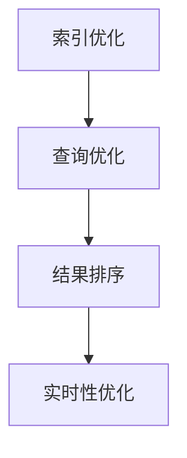

### 第三部分：AI在语音搜索中的应用

#### 第4章：深度学习在语音搜索中的应用

##### 4.1 深度学习的基本原理

深度学习是一种基于多层的神经网络模型，它通过反向传播算法进行参数优化，能够在大量数据上进行自主学习和特征提取。深度学习的基本原理包括以下几点：

1. **神经网络结构**：神经网络由多个神经元（节点）组成，每个神经元都与相邻的神经元相连，并通过权重进行连接。

2. **激活函数**：用于决定神经元是否被激活，常用的激活函数包括Sigmoid、ReLU等。

3. **前向传播与反向传播**：在前向传播阶段，输入数据通过神经网络逐层传递，直到输出层；在反向传播阶段，根据输出结果与真实结果的误差，通过梯度下降算法更新网络的权重。

4. **多层感知机（MLP）**：一种简单的多层神经网络结构，通常用于分类和回归任务。

##### 4.2 卷积神经网络（CNN）在语音信号处理中的应用

卷积神经网络（CNN）是一种特殊的多层神经网络，它通过卷积操作提取特征，具有强大的特征提取能力。CNN在语音信号处理中的应用主要包括以下几个方面：

1. **特征提取**：CNN可以通过卷积操作从语音信号中提取出高层次的音素和音节特征。

2. **声学模型**：CNN常用于构建声学模型，用于预测语音信号的时序特性。

3. **语言模型**：CNN可以用于构建语言模型，用于预测语音信号对应的文本序列。

4. **端到端语音识别**：通过结合CNN和其他神经网络结构，可以实现端到端的语音识别，简化了系统的设计和实现。

以下是CNN在语音信号处理中的应用架构：

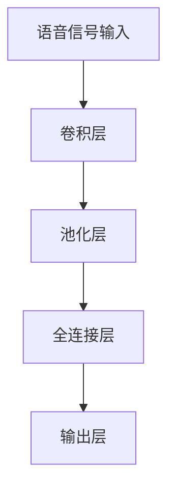

##### 4.3 循环神经网络（RNN）在语音搜索中的应用

循环神经网络（RNN）是一种具有循环结构的神经网络，它通过记忆单元（如LSTM和GRU）处理序列数据。RNN在语音搜索中的应用主要包括以下几个方面：

1. **语音信号处理**：RNN可以通过记忆单元处理语音信号的时序特性，提取语音特征。

2. **语音识别**：RNN可以用于构建语音识别模型，通过记忆单元捕捉语音信号的时序依赖关系。

3. **文本生成**：RNN可以用于文本生成任务，如语音合成和机器翻译。

4. **交互式语音搜索**：RNN可以用于构建交互式语音搜索系统，实时处理用户的语音输入和查询。

以下是RNN在语音搜索中的应用架构：

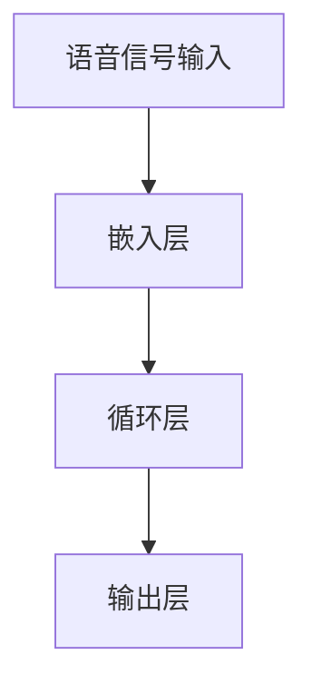

##### 4.4 递归神经网络（LSTM）和门控循环单元（GRU）在语音搜索中的应用

LSTM和GRU是RNN的两种变体，它们通过引入门控机制，有效地解决了RNN在处理序列数据时的梯度消失和梯度爆炸问题。LSTM和GRU在语音搜索中的应用主要包括以下几个方面：

1. **特征提取**：LSTM和GRU可以用于从语音信号中提取特征，如音素和音节特征。

2. **语音识别**：LSTM和GRU可以用于构建语音识别模型，通过记忆单元捕捉语音信号的时序依赖关系。

3. **文本生成**：LSTM和GRU可以用于文本生成任务，如语音合成和机器翻译。

4. **交互式语音搜索**：LSTM和GRU可以用于构建交互式语音搜索系统，实时处理用户的语音输入和查询。

以下是LSTM和GRU在语音搜索中的应用架构：

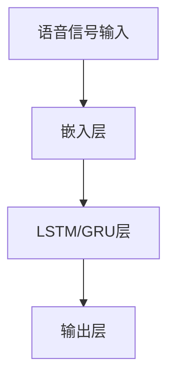

### 第四部分：语音搜索的准确性提升

#### 第5章：自然语言处理（NLP）与语音搜索

##### 5.1 NLP的基本概念

自然语言处理（NLP）是计算机科学和人工智能领域的一个分支，旨在让计算机理解和生成人类语言。以下是NLP的一些基本概念：

1. **语言模型**：用于描述文本序列概率分布的模型，用于预测下一个单词或句子。

2. **词嵌入**：将单词映射到高维向量空间，用于表示单词的语义关系。

3. **词性标注**：对文本中的单词进行词性分类，如名词、动词等。

4. **命名实体识别**：识别文本中的特定实体，如人名、地名等。

5. **句法分析**：对句子进行结构分析，提取句法关系。

##### 5.2 词嵌入技术

词嵌入是将单词映射到高维向量空间的技术，用于表示单词的语义关系。以下是几种常见的词嵌入方法：

1. **基于频次的词嵌入**：通过统计单词在文本中的出现频次来表示单词的语义关系。

2. **基于窗口的词嵌入**：通过将单词周围的一定数量的单词映射到同一高维向量空间。

3. **基于神经网络的词嵌入**：通过训练神经网络模型，将单词映射到高维向量空间。

4. **预训练的语言模型**：通过大规模预训练的语言模型，如BERT、GPT等，获取高质量的词嵌入。

以下是词嵌入的基本原理和流程：

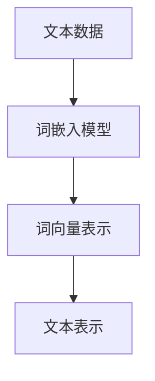

##### 5.3 语言模型与搜索引擎

语言模型是语音搜索系统中重要的组成部分，它用于预测用户的查询意图，提高搜索准确性。以下是语言模型的基本原理和应用：

1. **语言模型的基本原理**：语言模型通过统计文本序列的概率分布来预测下一个单词或句子。

2. **N-gram模型**：一种基于前N个单词预测下一个单词的语言模型。

3. **神经网络语言模型**：通过训练神经网络模型，生成文本序列的概率分布。

4. **应用**：在语音搜索系统中，语言模型用于对用户的语音输入进行文本转换，并根据语言模型预测用户的查询意图，提高搜索结果的准确性。

以下是语言模型在语音搜索中的应用流程：

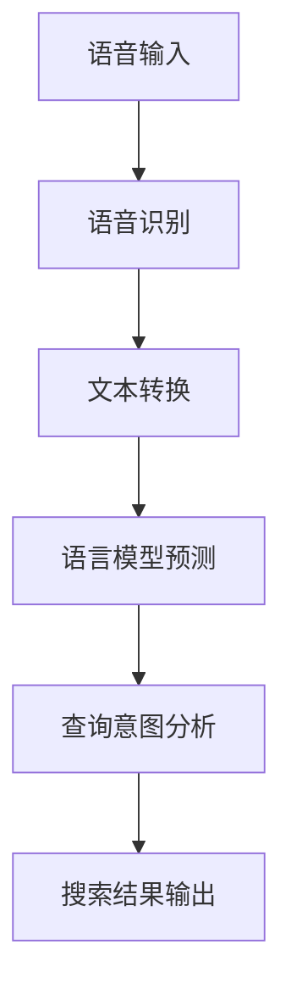

### 第五部分：语音搜索的便捷性提升

#### 第6章：语音搜索的便捷性提升

##### 6.1 语音搜索的便捷性需求

语音搜索的便捷性需求主要表现在以下几个方面：

1. **实时性**：用户希望在短时间内得到搜索结果，而不需要等待。

2. **准确性**：用户希望语音搜索能够准确地理解其意图，避免错误结果。

3. **易用性**：用户希望语音搜索的操作简单，易于上手。

4. **个性化**：用户希望语音搜索系统能够根据其历史查询记录，提供个性化的搜索结果。

##### 6.2 声音输入的实时性优化

为了提高语音搜索的实时性，需要从以下几个方面进行优化：

1. **语音预处理**：通过降噪、滤波等处理，提高语音信号的质量。

2. **快速语音识别**：使用高效的语音识别算法和模型，加快语音到文本的转换速度。

3. **并行处理**：利用多核处理器和并行计算技术，加快数据处理速度。

4. **缓存和预加载**：对于高频查询，提前加载和缓存结果，减少查询时间。

以下是声音输入实时性优化的基本流程：

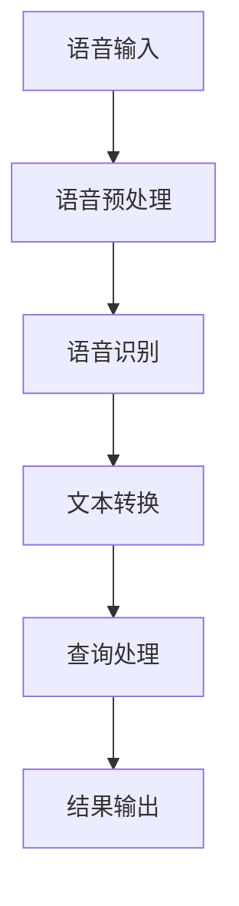

##### 6.3 语音交互界面的优化

语音交互界面的优化是提高语音搜索便捷性的重要手段，主要包括以下几个方面：

1. **语音识别与语音合成的整合**：将语音识别和语音合成技术整合到同一界面，实现无缝交互。

2. **自然语言理解**：通过自然语言处理技术，提高语音搜索系统能够理解用户的复杂查询。

3. **上下文感知**：根据用户的上下文信息，提供个性化的搜索建议。

4. **语音交互的流畅性提升**：通过优化语音合成算法，提高语音的自然度和流畅性。

以下是语音交互界面优化的基本架构：

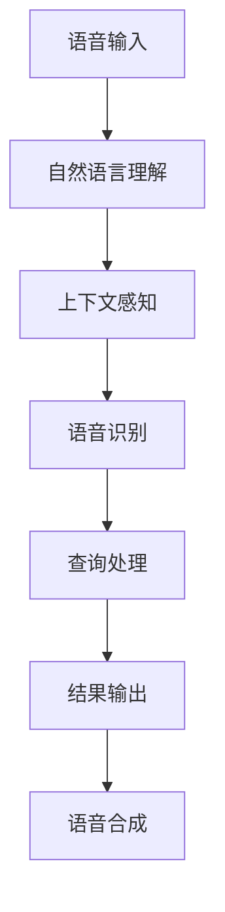

### 第六部分：语音搜索案例分析

#### 第7章：主流语音搜索平台分析

##### 7.1 Google Assistant

Google Assistant是Google开发的一款语音搜索平台，它通过语音识别和自然语言处理技术，帮助用户快速获取信息。以下是Google Assistant的技术特点和案例：

1. **技术特点**：

   - **强大的语音识别能力**：Google Assistant使用了先进的语音识别技术，能够准确识别用户的语音指令。
   - **丰富的语音合成效果**：Google Assistant提供了多种语音合成音色，能够生成自然流畅的语音输出。
   - **智能的上下文感知**：Google Assistant能够根据用户的查询历史和上下文信息，提供个性化的搜索建议。

2. **应用案例与用户反馈**：

   - **案例一：智能助理**：用户可以通过语音与Google Assistant进行互动，完成日程管理、消息提醒、天气预报等任务。
   - **案例二：智能家居控制**：用户可以通过语音指令控制智能家居设备，如灯光、温度等。
   - **用户反馈**：用户普遍对Google Assistant的语音识别和智能推荐功能表示满意，认为它大大提升了搜索和生活的便捷性。

##### 7.2 Amazon Alexa

Amazon Alexa是Amazon开发的一款语音搜索平台，它通过语音识别和自然语言处理技术，为用户提供智能服务。以下是Amazon Alexa的技术特点和案例：

1. **技术特点**：

   - **广泛的设备支持**：Amazon Alexa支持多种设备，包括智能音箱、智能屏幕等。
   - **强大的语音识别能力**：Amazon Alexa使用了先进的语音识别技术，能够准确识别用户的语音指令。
   - **丰富的技能支持**：Amazon Alexa拥有丰富的技能（Skills），用户可以通过语音指令调用这些技能，实现更多功能。

2. **应用案例与用户反馈**：

   - **案例一：智能助理**：用户可以通过语音与Amazon Alexa进行互动，完成日程管理、消息提醒、天气预报等任务。
   - **案例二：智能家居控制**：用户可以通过语音指令控制智能家居设备，如灯光、温度等。
   - **用户反馈**：用户普遍对Amazon Alexa的语音识别和技能调用功能表示满意，认为它为日常生活带来了极大的便利。

##### 7.3 Siri

Siri是苹果公司开发的一款语音搜索平台，它通过语音识别和自然语言处理技术，为用户提供智能服务。以下是Siri的技术特点和案例：

1. **技术特点**：

   - **集成度高**：Siri与苹果的iOS、iPadOS、watchOS和macOS等操作系统深度集成，提供了无缝的语音交互体验。
   - **强大的语音识别能力**：Siri使用了苹果自研的语音识别技术，能够准确识别用户的语音指令。
   - **智能的上下文感知**：Siri能够根据用户的查询历史和上下文信息，提供个性化的搜索建议。

2. **应用案例与用户反馈**：

   - **案例一：智能助理**：用户可以通过语音与Siri进行互动，完成日程管理、消息提醒、天气预报等任务。
   - **案例二：多媒体娱乐**：用户可以通过语音指令播放音乐、播报新闻等。
   - **用户反馈**：用户普遍对Siri的语音识别和智能推荐功能表示满意，认为它为日常生活带来了极大的便利。

### 第七部分：语音搜索在企业中的应用

#### 第8章：语音搜索在企业中的应用

##### 8.1 企业语音搜索的应用场景

企业语音搜索广泛应用于多个领域，以下是一些常见应用场景：

1. **客户服务**：通过语音搜索，企业可以快速回答客户的问题，提高服务效率。

2. **员工助手**：语音搜索可以为企业员工提供快速的信息查询和任务管理功能。

3. **企业知识库**：通过语音搜索，员工可以快速查找企业内部的知识和文档。

4. **销售与营销**：语音搜索可以帮助企业分析客户需求，提供个性化的营销策略。

5. **设备监控与维护**：通过语音搜索，企业可以实时监控设备状态，提高设备维护效率。

##### 8.2 企业语音搜索的优势与挑战

企业语音搜索具有以下优势：

1. **提高效率**：语音搜索允许员工通过语音快速获取信息，减少了手动操作的时间。

2. **提升用户体验**：语音交互提供了更加自然和直观的交互方式，提高了用户体验。

3. **降低成本**：语音搜索可以减少企业对客服人员的依赖，降低人力成本。

4. **增强数据收集**：语音搜索可以收集用户的语音数据，为企业提供更多用户行为数据，有助于改进产品和服务。

然而，企业语音搜索也面临一些挑战：

1. **准确性问题**：企业的语音环境复杂，可能会对语音搜索的准确性造成影响。

2. **隐私保护**：企业需要确保用户的语音数据得到妥善保护，避免隐私泄露。

3. **适应性问题**：企业需要为不同部门和个人定制化语音搜索功能，满足多样化的需求。

##### 8.3 企业语音搜索的实际案例

以下是一些企业语音搜索的实际案例：

1. **案例一：电商平台**：

   - **应用场景**：电商平台利用语音搜索帮助用户快速查找商品、比价和获取购物信息。
   - **优势**：提高了购物体验，降低了用户的操作成本。
   - **挑战**：需要处理复杂的商品信息和用户查询，保证搜索准确性。

2. **案例二：企业内部信息搜索**：

   - **应用场景**：企业内部员工通过语音搜索快速查找企业内部的知识库、文档和资料。
   - **优势**：提高了工作效率，降低了信息查找的时间。
   - **挑战**：需要确保知识库的内容更新和准确性，满足员工的需求。

3. **案例三：企业客户服务**：

   - **应用场景**：企业通过语音搜索为用户提供快速、准确的客户服务。
   - **优势**：提高了客户满意度，降低了服务成本。
   - **挑战**：需要处理多语种和多场景的语音查询，保证服务效果。

### 第八部分：未来语音搜索的发展趋势

#### 第9章：未来语音搜索的发展趋势

##### 9.1 语音搜索的未来发展方向

未来语音搜索的发展方向主要包括以下几个方面：

1. **更加智能的语音识别**：随着AI技术的发展，语音搜索的准确性将得到进一步提升，能够更准确地理解用户的语音指令。

2. **跨语言的语音搜索**：未来语音搜索将支持多种语言，为全球用户提供无障碍的语音交互体验。

3. **上下文感知和个性化**：语音搜索将更加关注用户的上下文信息和个性化需求，提供更加精准的搜索结果。

4. **与物联网（IoT）的结合**：语音搜索将与物联网设备深度融合，实现智能家居、智能医疗等领域的广泛应用。

##### 9.2 AI技术在语音搜索中的潜力

AI技术在语音搜索中的应用潜力巨大，以下是一些关键点：

1. **深度学习**：深度学习技术将在语音信号处理、语音识别和自然语言处理等方面发挥重要作用，提升语音搜索的准确性。

2. **自然语言处理**：通过NLP技术，语音搜索将能够更好地理解用户的复杂查询，提供更精准的搜索结果。

3. **语音合成**：高质量的语音合成技术将提升语音搜索的用户体验，使其更加自然和流畅。

4. **多模态交互**：语音搜索将结合视觉、触觉等多种交互方式，提供更加丰富和多样化的用户体验。

##### 9.3 语音搜索与物联网（IoT）的结合

语音搜索与物联网（IoT）的结合将带来以下机遇：

1. **智能家居控制**：用户可以通过语音指令控制家居设备，实现智能化的家庭生活。

2. **智能医疗**：语音搜索将帮助医疗设备提供个性化服务，提高医疗效率和准确性。

3. **智能交通**：语音搜索将应用于智能交通系统，提供实时交通信息，优化出行路线。

4. **智能办公**：语音搜索将为企业提供智能化的办公支持，提高工作效率。

### 附录

#### 附录A：语音搜索开发工具与资源

以下是几种常用的语音搜索开发工具和资源：

1. **开源语音识别与搜索框架**：

   - **CMU Sphinx**：一款开源的语音识别框架，支持多种语音识别技术。
   - **Mozilla TTS**：一款开源的文本到语音（TTS）框架，支持多种语音合成方法。

2. **主流语音识别与搜索工具**：

   - **Google Cloud Speech-to-Text**：Google提供的云端语音识别服务。
   - **Amazon Alexa Skills Kit**：Amazon提供的语音搜索和技能开发工具。

3. **语音搜索开发资源汇总**：

   - **GitHub开源项目**：许多优秀的语音搜索开源项目在GitHub上有详细的文档和示例代码。
   - **技术社区和论坛**：如Stack Overflow、CSDN等，提供了丰富的语音搜索技术讨论和解决方案。

#### 附录B：核心概念与联系

以下是语音搜索技术中的一些核心概念和它们之间的联系：

1. **语音信号处理**：涉及语音信号的基本特性、数字化和特征提取。
2. **语音识别**：利用语音信号处理技术和机器学习算法，将语音转换为文本。
3. **语音合成**：将文本转换为自然流畅的语音输出。
4. **自然语言处理**：用于理解用户的查询意图，提供个性化的搜索结果。
5. **深度学习**：用于特征提取、语音识别和文本生成等任务，提高语音搜索的准确性和效率。

以下是语音搜索技术中的核心概念和联系流程图：

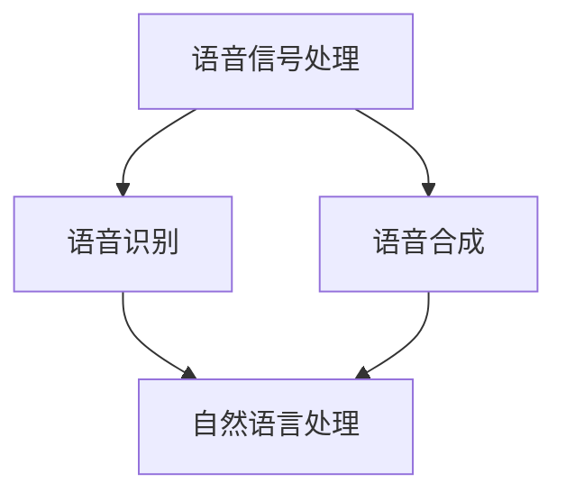

#### 附录C：核心算法原理讲解

以下是语音搜索技术中的几个核心算法原理及其伪代码讲解：

##### 1. 语音识别算法原理

**隐马尔可夫模型（HMM）**：HMM是一种用于语音识别的统计模型，它通过状态序列来表示语音信号。

```python
# HMM 伪代码
function HMM(viterbi_path):
    T = [t_1, t_2, ..., t_n]  # 语音信号时间序列
    A = [a_ij]  # 状态转移概率矩阵
    B = [b_ik]  # 发音概率矩阵
    Pi = [pi_i]  # 初始状态概率向量

    # 初始化动态规划表
    V = [[0 for _ in range(n)] for _ in range(m)]
    backpointer = [[0 for _ in range(n)] for _ in range(m)]

    # 填充动态规划表
    for j in range(m):
        V[0][j] = Pi[j] * B[j][T[0]]
        backpointer[0][j] = 0

    for t in range(1, n):
        for j in range(m):
            max_prob = 0
            max_index = 0
            for k in range(m):
                prob = V[t - 1][k] * A[k][j] * B[j][T[t]]
                if prob > max_prob:
                    max_prob = prob
                    max_index = k
            V[t][j] = max_prob
            backpointer[t][j] = max_index

    # 追踪最优路径
    path = [V[n - 1][j]]
    for t in range(n - 1, 0, -1):
        j = path[t + 1]
        path[t] = backpointer[t][j]

    return path
```

##### 2. 自然语言处理算法原理

**词嵌入（Word Embedding）**：词嵌入是将单词映射到高维向量空间的技术，用于表示单词的语义关系。

```python
# 词嵌入伪代码
function WordEmbedding(vocab, size):
    embedding = [[0 for _ in range(size)] for _ in range(len(vocab))]
    for word in vocab:
        embedding[word] = [random() for _ in range(size)]

    return embedding
```

#### 附录D：数学模型和数学公式讲解

以下是语音搜索技术中的几个数学模型和数学公式的讲解：

##### 1. 语音信号处理的数学模型

**短时傅里叶变换（STFT）**：STFT用于分析语音信号的频谱特性。

$$
X(\omega, t) = \sum_{n=-\infty}^{\infty} x[n] e^{-j \omega n} \cdot \sum_{m=-\infty}^{\infty} w_m e^{-j 2 \pi \omega_m t}
$$

##### 2. 自然语言处理中的数学公式

**语言模型（N-gram）**：N-gram模型用于预测文本序列的概率。

$$
P(w_1, w_2, ..., w_n) = \frac{C(w_1, w_2, ..., w_n)}{C(w_1, w_2, ..., w_n, w_{n+1})}
$$

**词向量**：词向量用于表示单词的语义关系。

$$
\vec{w}_i = [w_{i1}, w_{i2}, ..., w_{id}]
$$

##### 3. 语音识别中的数学模型

**隐马尔可夫模型（HMM）**：HMM用于建模语音信号的时序特性。

$$
P(O|Q) = \prod_{t=1}^{n} P(o_t|q_t)
$$

$$
P(Q) = \prod_{t=1}^{n} P(q_t)
$$

#### 附录E：项目实战

##### 8.1 语音搜索系统开发环境搭建

以下是搭建语音搜索系统的基本步骤：

1. **安装操作系统**：选择Linux或Windows操作系统，确保满足硬件和软件要求。
2. **安装编程环境**：安装Python、Anaconda等编程环境和相关库，如TensorFlow、PyTorch等。
3. **安装语音识别和合成库**：安装如CMU Sphinx、Mozilla TTS等开源语音识别和合成库。
4. **配置搜索引擎**：安装并配置如Elasticsearch等搜索引擎，用于存储和处理文本数据。
5. **配置数据库**：安装并配置如MySQL或MongoDB等数据库，用于存储用户数据和搜索结果。

##### 8.2 语音搜索系统代码实现与解读

以下是语音搜索系统的核心代码实现和解读：

```python
# 语音搜索系统核心代码

# 导入相关库
import speech_recognition as sr
import tensorflow as tf
import elasticsearch

# 初始化语音识别器和搜索引擎
recognizer = sr.Recognizer()
es = elasticsearch Elasticsearch()

# 语音识别
def recognize_speech_from_mic():
    with sr.Microphone() as source:
        print("请说出您的问题：")
        audio = recognizer.listen(source)
    try:
        text = recognizer.recognize_google(audio)
        print("您的问题：", text)
        return text
    except sr.UnknownValueError:
        print("无法理解您的语音。请重试。")
        return None

# 搜索引擎查询
def search_query(text):
    result = es.search(index="search_index", body={"query": {"match": {"text": text}}})
    return result['hits']['hits']

# 主程序
if __name__ == "__main__":
    text = recognize_speech_from_mic()
    if text:
        results = search_query(text)
        print("搜索结果：", results)
```

以下是代码的详细解读：

- **语音识别**：使用speech_recognition库的Recognizer类实现语音识别功能，通过麦克风接收用户的语音输入。
- **搜索引擎查询**：使用Elasticsearch库连接搜索引擎，执行基于文本的查询，返回搜索结果。
- **主程序**：首先调用语音识别函数获取用户的问题，然后调用搜索引擎查询函数获取搜索结果，并打印输出。

##### 8.3 代码解读与分析案例

以下是代码解读和分析案例：

1. **语音识别准确性分析**：

   - **优势**：使用speech_recognition库可以实现高准确性的语音识别。
   - **挑战**：在噪声环境或语音质量较差的情况下，识别准确性可能受到影响。

2. **搜索引擎性能分析**：

   - **优势**：使用Elasticsearch作为搜索引擎，可以实现高效的文本搜索和查询。
   - **挑战**：需要合理配置搜索引擎的索引和查询参数，以提高查询性能。

3. **系统可靠性分析**：

   - **优势**：代码结构清晰，模块化设计，易于维护和扩展。
   - **挑战**：需要处理异常情况和错误输入，确保系统的稳定性和可靠性。

通过上述案例，我们可以看到语音搜索系统在实现和性能方面的一些关键考虑因素。在实际开发中，需要根据具体需求和场景，不断优化和改进系统，以满足用户的需求。

