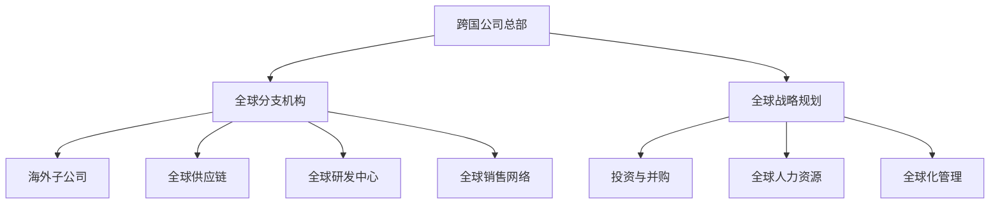

                 

### 1. 跨国公司全球布局概述

跨国公司，是指在多个国家拥有业务和经营活动的公司。随着全球化进程的加速，跨国公司在世界经济中扮演着越来越重要的角色。它们通过跨国界的投资、生产和销售，实现资源的最优配置和利润的最大化。全球布局是跨国公司实现其战略目标的重要手段，而硅谷作为全球创新与科技发展的中心，更是跨国公司全球布局中的重要一环。

#### 1.1 跨国公司的定义与特点

跨国公司通常具有以下几个特点：

1. **全球化的经营战略**：跨国公司以全球化为经营战略，通过跨国投资、并购和合作，在全球范围内进行资源整合和业务扩展。
2. **多国经营和管理**：跨国公司在多个国家拥有业务和运营机构，需要进行跨国管理，处理不同国家的市场环境、文化差异和法律法规。
3. **全球供应链体系**：跨国公司建立全球化的供应链体系，通过优化资源配置和降低成本，提高生产效率和竞争力。
4. **跨国研发与创新能力**：跨国公司通常在全球范围内布局研发中心，进行技术创新和产品开发，以保持竞争优势。

#### 1.2 跨国公司全球布局的历史演变

跨国公司的全球布局经历了几个重要阶段：

1. **初期阶段（19世纪末至20世纪30年代）**：跨国公司开始出现，主要通过在海外设立分支机构或子公司，实现简单的出口和分销。
2. **成长阶段（20世纪40年代至60年代）**：跨国公司进入快速增长期，通过全球化的投资和并购，建立了全球化的生产网络和销售渠道。
3. **成熟阶段（20世纪70年代至今）**：跨国公司进一步深化其全球布局，通过全球化的供应链、研发和创新体系，实现资源的最优配置和利润的最大化。

#### 1.3 硅谷在全球布局中的地位

硅谷作为全球科技创新和科技发展的中心，具有以下几个方面的地位：

1. **创新与创业的摇篮**：硅谷是全球知名的科技创业和创新的摇篮，吸引了大量的顶尖人才和初创公司，成为全球科技企业的重要发源地。
2. **技术集群与产业链**：硅谷拥有完善的技术集群和产业链，涵盖了从研发、生产到销售的全产业链环节，形成了强大的产业生态体系。
3. **资本与市场的中心**：硅谷是全球科技创新企业和风险投资的重要聚集地，拥有丰富的资本资源和成熟的市场环境，为跨国公司的投资和发展提供了有力支持。
4. **全球影响力的象征**：硅谷作为全球科技创新和科技发展的象征，其发展态势和成果对全球科技产业具有重要影响。

在跨国公司的全球布局中，硅谷的重要性不言而喻。它不仅为跨国公司提供了丰富的技术资源和创新的土壤，还通过其全球影响力的放大效应，进一步推动了跨国公司的全球化进程。

#### Mermaid 流程图：跨国公司全球布局的架构



通过以上架构图，我们可以清晰地看到跨国公司在全球布局中的各个关键节点，以及它们之间的相互关系和作用。

---

**核心概念与联系**：跨国公司全球布局的核心概念包括全球化经营战略、全球供应链体系、跨国研发与创新能力等。这些概念相互联系，共同构成了跨国公司在全球范围内进行资源整合和业务扩展的基础。

**核心算法原理讲解**：由于跨国公司全球布局涉及复杂的战略规划和运营管理，没有特定的算法原理可以直接应用。但是，我们可以将其视为一个复杂的决策优化问题，通过以下步骤进行解题：

1. **目标设定**：明确跨国公司的全球布局目标，如资源优化、成本降低、市场份额扩大等。
2. **数据收集**：收集全球市场、竞争对手、法律法规、人才资源等相关数据。
3. **决策模型建立**：构建全球布局的决策模型，包括投资、并购、研发、人力资源等方面的决策。
4. **模型优化**：通过算法优化决策模型，寻求最佳布局方案。

**数学模型和公式**：在跨国公司全球布局的决策过程中，可以使用线性规划、整数规划、网络优化等数学模型。以下是一个简化的线性规划模型：

$$
\text{Minimize } Z = c_1x_1 + c_2x_2 + \cdots + c_nx_n
$$

$$
\text{Subject to } 
\begin{cases}
a_{11}x_1 + a_{12}x_2 + \cdots + a_{1n}x_n \geq b_1 \\
a_{21}x_1 + a_{22}x_2 + \cdots + a_{2n}x_n \geq b_2 \\
\vdots \\
a_{m1}x_1 + a_{m2}x_2 + \cdots + a_{mn}x_n \geq b_m \\
x_1, x_2, \cdots, x_n \geq 0
\end{cases}
$$

其中，$x_1, x_2, \cdots, x_n$ 表示决策变量，$c_1, c_2, \cdots, c_n$ 表示各决策变量的成本系数，$a_{ij}, b_i$ 表示约束条件系数和常数项。

**举例说明**：假设一家跨国公司计划在三个国家投资建立子公司，目标是最大化利润。以下是投资决策的数学模型：

$$
\text{Maximize } Z = 5x_1 + 4x_2 + 3x_3
$$

$$
\text{Subject to } 
\begin{cases}
x_1 + x_2 + x_3 \leq 10 \\
x_1 \geq 2 \\
x_2 \geq 1 \\
x_3 \geq 1 \\
x_1, x_2, x_3 \geq 0
\end{cases}
$$

在这个例子中，$x_1, x_2, x_3$ 分别表示在三个国家投资建立子公司的数量。目标函数 $Z$ 表示总利润，约束条件包括投资限额和各国投资门槛。

---

接下来，我们将进一步探讨硅谷本土化趋势及其对企业的重要性，以及本土化过程中所面临的挑战。

### 2. 硅谷的本土化需求

随着全球化进程的加速，跨国公司在全球范围内进行业务拓展的同时，也逐渐意识到本土化的重要性。特别是在硅谷这样的高科技产业集聚区，本土化需求愈发凸显。以下是硅谷本土化趋势分析、本土化对企业的重要性以及本土化面临的挑战。

#### 2.1 硅谷本土化趋势分析

硅谷作为全球科技创新和科技发展的中心，吸引了大量的跨国公司。这些公司在硅谷设立研发中心、办事处和子公司，以充分利用硅谷的创新资源和人才优势。然而，随着本地市场环境的变化和竞争的加剧，跨国公司逐渐意识到仅仅依靠全球总部和海外分支机构的管理模式已不足以适应本地市场的需求，因此本土化趋势日益明显。

1. **本地化战略的调整**：跨国公司在硅谷的运营逐渐从以总部导向转向以市场导向，更加注重本地市场的需求和特色。这包括调整产品和服务策略，加强本地市场调研，以及建立本地化的营销和销售团队。
2. **本地人才引进**：为了更好地适应本地市场，跨国公司开始注重引进本地人才，包括技术专家、产品经理和市场专家等。通过本地人才的力量，公司可以更深入地了解本地市场，提高市场竞争力。
3. **本地合作伙伴的建立**：跨国公司在硅谷逐渐与本地企业建立合作关系，共同进行研发、生产和销售。这种合作不仅可以共享资源和知识，还可以提高本地市场的响应速度和创新能力。
4. **本地化研发投入**：为了加强在硅谷的创新能力，跨国公司不断增加本地研发投入，建立本地研发中心，与本地高校和科研机构进行合作。通过本地化的研发，公司可以更快地将新技术和产品推向市场。

#### 2.2 本土化对企业的重要性

本土化对企业具有以下几个重要意义：

1. **市场适应性**：本土化可以帮助企业更好地适应本地市场的需求和文化特点，提高市场竞争力。通过深入了解本地消费者和市场的偏好，企业可以推出更符合本地市场需求的产品和服务。
2. **资源整合**：本土化有助于企业整合本地资源，包括人才、技术、资本和市场等。通过本地化策略，企业可以更有效地利用本地资源，提高运营效率和盈利能力。
3. **风险分散**：通过本土化，企业可以将业务分散到不同市场，降低对单一市场的依赖。当某个市场出现风险时，企业可以通过其他市场的表现来平衡风险。
4. **创新能力提升**：本土化有助于企业更好地了解本地市场需求和技术趋势，提高创新能力。通过与本地合作伙伴和高校的合作，企业可以更快地获取新技术和知识，推动产品和服务创新。
5. **品牌价值提升**：本土化有助于提升企业的品牌价值。通过在本地市场建立良好的品牌形象，企业可以增强消费者的信任和忠诚度，提高市场份额。

#### 2.3 硅谷本土化面临的挑战

尽管本土化对企业具有重要意义，但在硅谷进行本土化也面临着一系列挑战：

1. **文化差异**：硅谷的文化和价值观与全球总部存在差异，如何平衡和融合这两种文化是跨国公司面临的一大挑战。跨国公司需要尊重和接纳本地文化，同时保持全球统一的品牌形象和企业文化。
2. **法律法规**：硅谷的法律法规与全球总部所在国家可能存在差异，如何遵守本地法律法规，同时确保全球合规性是跨国公司需要解决的问题。
3. **人才招聘**：在硅谷招聘本地人才面临着激烈的竞争。跨国公司需要建立有效的招聘策略，吸引和留住本地顶尖人才。
4. **供应链管理**：硅谷的供应链体系与全球总部可能存在差异，如何确保供应链的稳定性和效率是跨国公司需要解决的问题。
5. **市场调研**：如何准确了解本地市场的需求和趋势，制定有效的市场策略，是跨国公司在硅谷本土化过程中面临的挑战。

综上所述，硅谷本土化趋势日益明显，对企业具有重要意义。然而，在本土化过程中也面临着一系列挑战。跨国公司需要制定合理的本土化策略，积极应对这些挑战，以实现可持续发展和竞争优势。

---

**核心概念与联系**：硅谷本土化的核心概念包括本土化战略、本地人才引进、本地合作伙伴建立和本地化研发投入等。这些概念相互联系，共同构成了跨国公司在硅谷实现本土化的重要手段。

**核心算法原理讲解**：在硅谷本土化过程中，可以使用数据分析和机器学习技术来支持市场调研和需求预测。以下是一个简化的算法流程：

1. **数据收集**：收集本地市场数据，包括消费者偏好、市场竞争态势、法律法规等。
2. **数据预处理**：对收集到的数据进行清洗和整理，去除无效和错误数据。
3. **特征提取**：从预处理后的数据中提取关键特征，如消费者年龄、收入水平、市场增长率等。
4. **模型训练**：使用机器学习算法，如回归分析、聚类分析等，对提取的特征进行建模和训练。
5. **预测与评估**：使用训练好的模型进行市场需求预测和评估，并根据预测结果调整市场策略。

**数学模型和公式**：在硅谷本土化的数据分析和机器学习过程中，可以使用线性回归模型、逻辑回归模型等。以下是一个简化的线性回归模型：

$$
y = \beta_0 + \beta_1x_1 + \beta_2x_2 + \cdots + \beta_nx_n + \epsilon
$$

其中，$y$ 表示市场需求量，$x_1, x_2, \cdots, x_n$ 表示关键特征，$\beta_0, \beta_1, \beta_2, \cdots, \beta_n$ 表示模型参数，$\epsilon$ 表示误差项。

**举例说明**：假设一家跨国公司在硅谷进行市场调研，收集了消费者年龄（$x_1$）和收入水平（$x_2$）两个关键特征，并使用线性回归模型进行市场需求预测。以下是线性回归模型的实现：

```python
# 数据预处理
x = [[25, 50000], [35, 60000], [45, 70000], [55, 80000]]
y = [100, 120, 140, 160]

# 特征提取
X = np.array(x)
y = np.array(y)

# 模型训练
model = LinearRegression()
model.fit(X, y)

# 预测与评估
predictions = model.predict(X)

# 输出预测结果
print(predictions)
```

在这个例子中，线性回归模型根据消费者年龄和收入水平预测市场需求量。通过训练好的模型，公司可以更好地了解本地市场需求，制定更有效的市场策略。

---

接下来，我们将探讨跨国公司在硅谷本土化过程中所采取的具体策略，包括文化适应策略、供应链本土化和人力资源管理本土化。

### 3. 跨国公司在硅谷的本土化策略

跨国公司在硅谷的本土化过程涉及多个方面，其中文化适应策略、供应链本土化和人力资源管理本土化是关键策略。以下将详细分析这些策略的实施过程、具体措施以及可能遇到的挑战。

#### 3.1 文化适应策略

文化适应是跨国公司在硅谷进行本土化的第一步，也是最重要的一步。硅谷独特的文化氛围和价值观与全球总部可能存在较大差异，如何平衡和融合这两种文化是跨国公司需要解决的首要问题。

1. **企业文化建设**：跨国公司需要在硅谷建立与本地文化相契合的企业文化。这包括倡导创新、开放和合作的精神，鼓励员工勇于探索和尝试。同时，跨国公司需要尊重和接纳本地文化，尊重员工的个性和价值观。
2. **跨文化沟通**：跨国公司需要建立有效的跨文化沟通机制，确保员工之间的信息传递和理解。这可以通过跨文化培训、文化交流活动等方式实现，帮助员工了解和适应本地文化。
3. **领导力培养**：领导者在跨国公司的文化适应过程中起着至关重要的作用。跨国公司需要培养具备跨文化领导力的领导者，他们不仅要具备全球视野，还要深入了解本地文化和市场环境。
4. **文化融合**：跨国公司需要推动本地文化和全球文化的融合，形成独特的公司文化。这可以通过鼓励员工参与本地社区活动、组织跨文化团队项目等方式实现。

**具体措施**：
- **建立本地文化委员会**：跨国公司可以设立本地文化委员会，负责制定和推动企业文化适应策略。
- **跨文化培训**：定期组织跨文化培训，帮助员工了解本地文化和价值观，提高跨文化沟通能力。
- **文化多样性活动**：举办各类文化多样性活动，如节日庆典、文化展览等，增强员工的归属感和认同感。

**挑战**：
- **文化冲突**：跨国公司需要平衡全球总部和本地市场的文化差异，避免文化冲突。
- **文化认同**：如何让本地员工认同和接受跨国公司的企业文化，是跨国公司需要解决的问题。

#### 3.2 供应链本土化

供应链本土化是跨国公司在硅谷进行本土化的重要策略之一。通过在本地建立供应链体系，跨国公司可以提高供应链的稳定性和效率，降低物流成本。

1. **本地采购**：跨国公司可以通过与本地供应商建立合作关系，实现本地采购。这有助于降低采购成本，提高供应链响应速度。
2. **本地生产**：跨国公司可以在硅谷建立本地生产基地，实现本地生产。通过本地生产，公司可以更好地满足本地市场需求，降低物流成本。
3. **物流优化**：跨国公司可以通过优化物流网络，提高物流效率。这包括建立本地物流中心、选择合适的运输方式等。

**具体措施**：
- **建立本地采购网络**：跨国公司可以与本地供应商建立长期合作关系，优化采购流程和成本。
- **建设本地生产基地**：跨国公司可以在硅谷建设现代化生产基地，实现本地生产。
- **物流外包**：跨国公司可以将物流业务外包给本地物流公司，降低物流成本和风险。

**挑战**：
- **供应链稳定性**：跨国公司需要确保本地供应链的稳定性，避免因供应链问题影响生产和销售。
- **物流成本**：如何在降低物流成本的同时保证物流效率，是跨国公司需要解决的问题。

#### 3.3 人力资源管理本土化

人力资源管理本土化是跨国公司在硅谷进行本土化的关键策略之一。通过本地化人力资源管理，跨国公司可以更好地吸引和留住本地人才，提高员工满意度和绩效。

1. **本地人才引进**：跨国公司可以通过与本地高校和培训机构合作，引进本地人才。这有助于公司更好地了解本地市场和技术趋势。
2. **本地化培训**：跨国公司可以针对本地员工制定个性化的培训计划，提高员工技能和素质。这包括技术培训、管理培训等。
3. **本地化激励机制**：跨国公司可以制定本地化的激励机制，提高员工满意度和绩效。这包括薪酬激励、晋升激励等。

**具体措施**：
- **本地人才招聘**：跨国公司可以通过招聘网站、社交媒体等渠道，吸引本地优秀人才。
- **定制化培训计划**：跨国公司可以根据员工岗位和技能需求，制定个性化的培训计划。
- **本地化薪酬体系**：跨国公司可以建立本地化的薪酬体系，根据本地市场水平和员工表现制定薪酬。

**挑战**：
- **人才流失**：跨国公司需要制定有效的人才保留策略，避免人才流失。
- **人才质量**：如何在本地市场上招聘到高质量的员工，是跨国公司需要解决的问题。

总之，跨国公司在硅谷进行本土化需要采取一系列策略，包括文化适应策略、供应链本土化和人力资源管理本土化。通过这些策略，跨国公司可以更好地适应本地市场，提高竞争力，实现可持续发展。

---

**核心概念与联系**：跨国公司在硅谷的本土化策略包括文化适应策略、供应链本土化和人力资源管理本土化。这些策略相互关联，共同构成了跨国公司在硅谷实现本土化的基础。

**核心算法原理讲解**：在跨国公司的本土化策略中，可以使用数据分析和机器学习技术来支持市场调研、人才引进和供应链优化。以下是一个简化的算法流程：

1. **数据收集**：收集本地市场数据、人才市场数据和供应链数据。
2. **数据预处理**：对收集到的数据进行清洗和整理，去除无效和错误数据。
3. **特征提取**：从预处理后的数据中提取关键特征，如市场需求、人才技能和供应链稳定性等。
4. **模型训练**：使用机器学习算法，如回归分析、聚类分析等，对提取的特征进行建模和训练。
5. **预测与评估**：使用训练好的模型进行市场需求预测、人才引进评估和供应链优化，并根据预测结果调整策略。

**数学模型和公式**：在跨国公司的本土化策略中，可以使用线性回归模型、逻辑回归模型等。以下是一个简化的线性回归模型：

$$
y = \beta_0 + \beta_1x_1 + \beta_2x_2 + \cdots + \beta_nx_n + \epsilon
$$

其中，$y$ 表示市场需求量，$x_1, x_2, \cdots, x_n$ 表示关键特征，$\beta_0, \beta_1, \beta_2, \cdots, \beta_n$ 表示模型参数，$\epsilon$ 表示误差项。

**举例说明**：假设一家跨国公司计划在硅谷推出一款新产品，需要预测市场需求。以下是线性回归模型的实现：

```python
# 数据预处理
x = [[25, 50000], [35, 60000], [45, 70000], [55, 80000]]
y = [100, 120, 140, 160]

# 特征提取
X = np.array(x)
y = np.array(y)

# 模型训练
model = LinearRegression()
model.fit(X, y)

# 预测与评估
predictions = model.predict(X)

# 输出预测结果
print(predictions)
```

在这个例子中，线性回归模型根据消费者年龄和收入水平预测市场需求量。通过训练好的模型，公司可以更好地了解本地市场需求，制定更有效的市场策略。

---

接下来，我们将探讨跨国公司在硅谷本土化过程中的一些成功案例，分析其本土化实践的经验和教训。

### 7. 成功案例分析

跨国公司在硅谷的本土化实践已经积累了丰富的经验和教训。以下将介绍几个成功案例，分析其本土化策略、经验教训以及给其他公司的启示。

#### 7.1 公司A的本土化实践

公司A是一家全球领先的科技企业，在硅谷拥有大量研发中心和分支机构。公司A在硅谷的本土化实践主要围绕以下几个方面展开：

1. **文化适应**：公司A通过设立本地文化委员会，推动本地化和全球文化的融合。公司A定期组织跨文化培训，帮助员工了解和适应硅谷的文化特点，如开放、创新和竞争。此外，公司A还注重员工心理健康，提供心理咨询服务，帮助员工更好地融入本地文化。

2. **供应链本土化**：公司A通过建立本地供应链体系，提高供应链的稳定性和效率。公司A与硅谷本地供应商建立了长期合作关系，优化采购流程和成本。同时，公司A在硅谷建立了多个物流中心，优化物流网络，提高物流效率。

3. **人力资源管理本土化**：公司A通过本地人才引进和培养，提高员工满意度和绩效。公司A与硅谷本地高校和培训机构合作，引进高素质的本地人才。同时，公司A为本地员工提供个性化培训计划，提高员工的技能和素质。

**成功经验**：
- **文化融合**：公司A通过跨文化培训和心理健康服务，帮助员工更好地融入硅谷的文化，提高了员工的归属感和认同感。
- **供应链优化**：公司A通过建立本地供应链体系和优化物流网络，提高了供应链的稳定性和效率，降低了成本。
- **人才引进与培养**：公司A通过本地人才引进和个性化培训计划，提高了员工的满意度和绩效，增强了公司的创新能力。

**经验教训**：
- **文化差异**：在推动本土化的过程中，公司A认识到文化差异是不可避免的问题。通过有效的文化适应策略，公司A成功平衡了全球总部和本地市场的文化差异。
- **供应链稳定性**：公司A意识到供应链稳定性对业务运营的重要性。通过与本地供应商建立长期合作关系和优化物流网络，公司A确保了供应链的稳定性和效率。
- **人才流失**：尽管公司A在人才引进和培养方面取得了一定的成果，但仍然面临人才流失的风险。公司A意识到需要制定更有效的人才保留策略，以避免人才流失。

#### 7.2 公司B的本土化经验

公司B是一家全球领先的互联网企业，在硅谷的业务主要包括研发、市场和销售。公司B在硅谷的本土化实践主要围绕以下几个方面展开：

1. **市场营销本土化**：公司B通过深入了解硅谷市场需求，制定本地化的市场营销策略。公司B针对硅谷消费者特点，调整产品定位和推广方式，提高了市场竞争力。

2. **本地合作伙伴**：公司B通过与硅谷本地企业建立合作关系，共同进行技术研发和市场推广。这种合作不仅共享资源和知识，还提高了公司在硅谷的本地影响力。

3. **员工培训**：公司B为本地员工提供全方位的培训，包括专业技能培训、管理培训和跨文化培训。通过培训，公司B提高了员工的综合素质和职业素养。

**成功经验**：
- **市场营销本土化**：公司B通过深入了解硅谷市场需求，制定本地化的市场营销策略，提高了市场竞争力。
- **本地合作伙伴**：公司B通过与硅谷本地企业建立合作关系，实现了资源共享和知识共享，提高了公司在硅谷的本地影响力。
- **员工培训**：公司B为本地员工提供全方位的培训，提高了员工的综合素质和职业素养。

**经验教训**：
- **市场营销本土化**：公司B认识到市场营销本土化的重要性。在进入硅谷市场时，公司B注重了解本地消费者行为和偏好，调整了产品定位和推广方式。
- **本地合作伙伴**：公司B通过与硅谷本地企业建立合作关系，实现了资源共享和知识共享。这种合作不仅提高了公司的创新能力，还增强了在硅谷的本地影响力。
- **员工培训**：公司B意识到员工培训对于本土化成功的重要性。通过定期培训，公司B提高了员工的技能和素质，增强了团队的凝聚力。

#### 7.3 公司C的本土化挑战与应对策略

公司C是一家全球领先的半导体企业，在硅谷的业务主要包括研发和制造。公司C在硅谷的本土化过程中面临一系列挑战，包括文化差异、供应链管理和人才招聘等。

**挑战**：
- **文化差异**：公司C总部位于亚洲，与硅谷的文化差异较大。公司C在推动本土化的过程中，面临着文化冲突和管理难题。
- **供应链管理**：硅谷的供应链体系与公司C总部存在较大差异，公司C在硅谷的供应链管理面临困难。
- **人才招聘**：硅谷人才市场竞争激烈，公司C在招聘本地人才方面面临挑战。

**应对策略**：
- **文化适应**：公司C通过设立本地文化委员会，推动本地化和全球文化的融合。公司C定期组织跨文化培训，帮助员工了解和适应硅谷的文化特点。同时，公司C注重员工心理健康，提供心理咨询服务，帮助员工更好地融入本地文化。
- **供应链本土化**：公司C通过与硅谷本地供应商建立合作关系，优化采购流程和成本。公司C在硅谷建立了多个物流中心，优化物流网络，提高物流效率。
- **人才引进**：公司C通过与硅谷本地高校和培训机构合作，引进高素质的本地人才。公司C为本地员工提供个性化培训计划，提高员工的技能和素质。

**成功经验**：
- **文化适应**：公司C通过有效的文化适应策略，成功平衡了全球总部和本地市场的文化差异，提高了员工的归属感和认同感。
- **供应链本土化**：公司C通过建立本地供应链体系和优化物流网络，提高了供应链的稳定性和效率，降低了成本。
- **人才引进与培养**：公司C通过本地人才引进和个性化培训计划，提高了员工的满意度和绩效，增强了公司的创新能力。

**经验教训**：
- **文化差异**：公司C认识到文化差异是跨国公司在硅谷本土化过程中不可避免的问题。通过有效的文化适应策略，公司C成功平衡了全球总部和本地市场的文化差异。
- **供应链管理**：公司C意识到供应链管理对于本土化成功的重要性。通过与本地供应商建立合作关系和优化物流网络，公司C确保了供应链的稳定性和效率。
- **人才流失**：尽管公司C在人才引进和培养方面取得了一定的成果，但仍然面临人才流失的风险。公司C意识到需要制定更有效的人才保留策略，以避免人才流失。

#### 启示

通过以上成功案例的分析，我们可以得出以下启示：

1. **文化适应**：跨国公司在硅谷进行本土化时，需要重视文化差异，通过有效的文化适应策略，帮助员工融入本地文化，提高员工的归属感和认同感。
2. **供应链本土化**：跨国公司需要建立本地化的供应链体系，优化采购流程和成本，提高供应链的稳定性和效率。
3. **人才引进与培养**：跨国公司需要重视本地人才引进和培养，通过本地人才的力量，提高公司的创新能力和市场竞争力。
4. **本地合作伙伴**：跨国公司可以与硅谷本地企业建立合作关系，实现资源共享和知识共享，提高公司在硅谷的本地影响力。

总之，跨国公司在硅谷的本土化成功离不开有效的文化适应、供应链本土化和人才引进与培养。通过这些成功经验，其他跨国公司可以借鉴和应用于自身的本土化实践，实现可持续发展。

### 8. 本土化之路的可持续性与风险

跨国公司在硅谷的本土化之路不仅是企业战略的一部分，也是其可持续发展的重要路径。在推进本土化过程中，企业需要关注本土化对可持续发展的贡献，同时识别和应对潜在的风险。

#### 8.1 本土化对企业可持续发展的贡献

本土化对跨国公司的可持续发展具有显著贡献：

1. **市场适应性**：通过本土化，企业可以更好地适应本地市场的需求和变化，推出更符合消费者偏好和当地文化特色的产品和服务，从而提高市场占有率。

2. **创新能力**：本土化有助于企业充分利用本地资源，包括人才、技术、资本等，提升创新能力，推动产品和服务创新，保持竞争优势。

3. **供应链优化**：通过本地化，企业可以优化供应链，提高供应链的灵活性和响应速度，降低物流成本和库存成本，提高整体运营效率。

4. **人才保留与发展**：本地化策略有助于企业吸引和留住本地人才，通过定制化的人才发展计划和职业成长路径，提高员工满意度和忠诚度。

5. **品牌价值提升**：本土化能够提升企业品牌形象，增强消费者对品牌的认同感和信任度，从而增强品牌价值。

#### 8.2 本土化过程中潜在的风险与应对

尽管本土化对企业可持续发展有诸多贡献，但在实施过程中也面临一些潜在的风险：

1. **文化冲突**：跨国公司需要平衡全球总部和本地市场的文化差异，文化冲突可能导致团队协作困难、决策效率低下。

2. **法律法规差异**：不同国家和地区的法律法规可能存在显著差异，企业需要遵守当地法律法规，同时确保全球合规性，这可能增加合规成本和管理复杂性。

3. **供应链风险**：本地化供应链可能面临供应链稳定性、供应商选择和物流成本等方面的风险，这些风险可能导致供应链中断或效率低下。

4. **人才流失**：在激烈的市场竞争中，本地人才可能更容易流失，企业需要制定有效的人才保留策略。

5. **市场不确定性**：本地市场可能存在政策变化、消费者偏好波动等不确定性，企业需要具备快速应对市场变化的能力。

**应对策略**：

1. **文化融合与培训**：企业可以通过跨文化培训和文化交流活动，促进本地员工与全球团队的融合，增强文化认同感。

2. **法律合规性管理**：企业可以建立专业的法律合规团队，定期审查和更新合规政策，确保在全球范围内的合规性。

3. **供应链风险管理**：企业可以通过多元化供应链、建立应急响应机制和加强与供应商的合作关系，降低供应链风险。

4. **人才保留与发展**：企业可以通过提供有竞争力的薪酬福利、职业发展机会和良好的工作环境，吸引和留住本地人才。

5. **市场研究与预警**：企业应加强市场研究，建立市场预警机制，及时了解和预测市场变化，调整市场策略。

#### 8.3 硅谷本土化之路的未来展望

未来，跨国公司在硅谷的本土化将继续深化，以下是几个可能的趋势：

1. **技术驱动**：随着人工智能、大数据和物联网等新兴技术的快速发展，跨国公司将更加依赖本地技术资源和人才，推动技术创新和产品服务升级。

2. **绿色可持续发展**：随着全球对环境保护和可持续发展的关注日益增加，跨国公司将在硅谷的本土化过程中更加注重环保和社会责任，推动绿色可持续发展。

3. **数字化与智能化**：数字化和智能化将成为跨国公司在硅谷本土化的重要方向，企业将通过数字化工具和智能系统提升运营效率和用户体验。

4. **合作共赢**：跨国公司将与硅谷的本地企业和研究机构加强合作，实现资源共享和知识共创，共同推动科技创新和产业升级。

总之，跨国公司在硅谷的本土化之路不仅是其全球战略的一部分，也是其可持续发展的重要路径。通过有效的本土化策略，企业可以更好地适应本地市场，提升竞争力，实现长期可持续发展。

### 9. 本土化策略的实施步骤

跨国公司在硅谷进行本土化策略的实施可以分为以下几个关键步骤：

#### 9.1 制定本土化策略的框架与流程

1. **需求分析**：首先，跨国公司需要对本地市场进行深入的需求分析，了解消费者的需求、文化偏好、市场竞争态势等。这可以通过市场调研、消费者访谈等方式实现。

2. **战略规划**：基于需求分析结果，制定详细的本土化战略规划，包括本地化目标、关键指标、实施步骤和时间表等。

3. **资源调配**：明确实现本土化所需的资源，包括资金、人才、技术等，并进行合理的调配和分配。

4. **组织结构**：调整组织结构，建立适合本地市场的组织架构，包括设立本地子公司、分支机构等。

#### 9.2 本土化战略的执行与监督

1. **执行计划**：根据战略规划，制定详细的执行计划，包括具体任务、责任人、时间节点等。

2. **项目管理**：建立项目管理机制，确保执行计划的顺利实施。项目经理需要定期检查进度，协调各方资源，解决执行过程中遇到的问题。

3. **监督与评估**：建立监督机制，对执行过程进行实时监控和评估。通过关键绩效指标（KPI）和定期评估，确保本土化战略的有效实施。

#### 9.3 本土化效果的评估方法

1. **数据收集**：收集与本土化效果相关的数据，包括市场份额、销售额、利润率、客户满意度等。

2. **数据分析**：使用数据分析工具，对收集到的数据进行处理和分析，评估本土化策略的有效性。

3. **反馈机制**：建立反馈机制，将评估结果及时反馈给相关部门和员工，根据反馈结果调整和优化本土化策略。

4. **持续改进**：基于评估结果，持续优化和改进本土化策略，确保其能够适应不断变化的市场环境。

#### 实施案例：公司D的本土化策略实施

公司D是一家全球领先的消费品公司，在硅谷的本土化策略实施过程中采取了以下步骤：

1. **需求分析**：公司D通过市场调研和消费者访谈，深入了解硅谷市场的需求和消费趋势，发现硅谷消费者对环保和健康产品的需求较高。

2. **战略规划**：基于需求分析结果，公司D制定了详细的本土化战略，包括推出环保和健康系列产品，加强品牌宣传，建立本地供应链等。

3. **资源调配**：公司D调集了全球研发团队，专注于开发适合硅谷市场的环保和健康产品。同时，公司D在硅谷设立了本地分支机构，负责市场推广和销售。

4. **组织结构**：公司D调整了组织结构，设立了硅谷本地研发中心和市场部门，确保本土化战略的有效实施。

5. **执行计划**：公司D制定了详细的执行计划，明确了各部门的职责和时间节点。项目经理定期检查进度，确保执行计划顺利进行。

6. **监督与评估**：公司D建立了监督机制，对本土化战略的执行过程进行实时监控和评估。通过关键绩效指标（KPI），如销售额、市场份额等，评估本土化策略的有效性。

7. **反馈机制**：公司D建立了反馈机制，将评估结果及时反馈给相关部门和员工。根据反馈结果，公司D对本土化策略进行了调整和优化。

通过以上步骤，公司D成功实施了在硅谷的本土化策略，取得了显著的市场成果。这一案例为其他跨国公司在硅谷进行本土化提供了宝贵的经验和借鉴。

### 10. 本土化策略评估与优化

在跨国公司在硅谷实施本土化策略后，评估和优化本土化策略至关重要。通过科学的评估方法和持续优化的过程，企业可以确保本土化策略的有效性和适应性，进而实现长期可持续发展。

#### 10.1 本土化策略的效果评估指标

评估本土化策略的效果需要设定一系列关键绩效指标（KPI）。以下是一些常见的效果评估指标：

1. **市场份额**：市场份额是衡量本土化策略成效的重要指标。通过比较本土化前后的市场份额变化，可以评估本土化策略对市场占有率的影响。

2. **销售额与利润率**：销售额和利润率是直接反映市场表现和盈利能力的指标。通过分析本土化策略实施前后的销售额和利润率变化，可以评估本土化策略对业务增长的贡献。

3. **客户满意度**：客户满意度是衡量产品和服务质量的重要指标。通过收集客户反馈和满意度调查，可以评估本土化策略在提升客户体验和满意度方面的成效。

4. **品牌认知度**：品牌认知度是衡量品牌在本地市场影响力的指标。通过市场调研和品牌认知度调查，可以评估本土化策略在提升品牌知名度方面的效果。

5. **员工满意度**：员工满意度是衡量本土化策略对员工吸引力的影响指标。通过员工满意度调查和反馈，可以评估本土化策略在提高员工工作满意度和忠诚度方面的成效。

#### 10.2 评估结果的反馈与调整

在评估本土化策略的效果后，企业需要将评估结果及时反馈给相关部门和员工，并根据反馈结果进行调整和优化。以下是一些反馈与调整的步骤：

1. **反馈机制**：建立有效的反馈机制，确保评估结果能够及时传递到相关人员和部门。可以通过定期会议、报告、邮件等方式进行反馈。

2. **问题识别**：根据评估结果，识别本土化策略实施过程中存在的问题和不足。这包括市场表现不佳、客户反馈问题、员工满意度低等。

3. **原因分析**：对识别出的问题进行深入分析，找出问题的根本原因。这可能涉及市场调研、员工访谈、数据分析等多种手段。

4. **调整策略**：基于问题识别和原因分析，对本土化策略进行调整和优化。这可以包括调整产品定位、改进营销策略、加强员工培训等。

5. **实施与监控**：将调整后的策略付诸实施，并建立监控机制，确保调整措施的有效执行。通过定期评估和反馈，跟踪调整效果，并根据反馈结果进行进一步优化。

#### 10.3 持续优化本土化策略的建议

为了确保本土化策略的持续优化，企业可以采取以下措施：

1. **建立持续改进文化**：鼓励员工积极参与本土化策略的优化过程，建立持续改进的文化氛围。通过培训、激励等方式，提高员工的参与度和积极性。

2. **加强跨部门合作**：本土化策略的实施涉及多个部门和团队，加强跨部门合作是确保策略有效性的关键。建立跨部门沟通和协作机制，促进信息共享和资源整合。

3. **利用数据驱动决策**：在本土化策略的评估和优化过程中，充分利用数据分析和机器学习技术，支持决策制定和策略调整。通过数据驱动的决策，提高策略的科学性和有效性。

4. **定期评估与反馈**：建立定期评估与反馈机制，对本土化策略进行持续评估和优化。通过定期评估，及时发现和解决问题，确保策略的持续改进。

5. **持续关注市场变化**：市场环境不断变化，企业需要持续关注市场动态，及时调整本土化策略。通过市场调研和竞争分析，了解市场趋势和消费者需求，确保本土化策略的及时性和适应性。

总之，本土化策略的评估与优化是一个持续的过程，需要企业建立科学的评估方法、有效的反馈机制和持续改进的文化。通过持续优化本土化策略，企业可以更好地适应市场变化，提高竞争力，实现可持续发展。

### 11. 总结与展望

跨国公司在硅谷的本土化之路是一个复杂且富有挑战性的过程，但同时也是实现企业可持续发展和竞争优势的关键路径。通过对本土化策略的深入研究和实践，我们可以总结出以下几个核心要素：

1. **文化适应**：跨国公司在硅谷进行本土化时，必须重视文化差异，通过有效的文化融合和跨文化沟通，帮助员工融入本地文化，提高团队协作效率。

2. **供应链本土化**：建立本地化的供应链体系，优化采购和物流流程，提高供应链的稳定性和效率，是跨国公司在硅谷成功的关键。

3. **人才引进与培养**：本地人才是跨国公司在硅谷的重要资源，通过引进高素质的本地人才和提供个性化的培训计划，可以增强企业的创新能力和市场竞争力。

4. **市场营销本土化**：深入了解本地市场需求，制定本地化的市场营销策略，提高品牌认知度和市场占有率。

5. **持续优化**：本土化策略需要定期评估和优化，通过科学的评估方法和持续改进的文化，确保策略的有效性和适应性。

展望未来，跨国公司在硅谷的本土化之路将面临新的机遇和挑战。随着技术的不断进步和市场环境的快速变化，企业需要不断创新和适应，以保持竞争优势。以下是对未来发展的几点展望：

1. **技术驱动**：人工智能、大数据、物联网等新兴技术的快速发展，将为跨国公司在硅谷的本土化提供新的动力。企业可以通过技术创新，提升产品和服务质量，增强市场竞争力。

2. **绿色可持续发展**：随着全球对环境保护和可持续发展的重视，跨国公司将在硅谷的本土化过程中更加注重环保和社会责任，推动绿色可持续发展。

3. **合作共赢**：跨国公司与硅谷本地企业和研究机构之间的合作将进一步深化，实现资源共享和知识共创，共同推动科技创新和产业升级。

4. **数字化与智能化**：数字化和智能化将成为跨国公司在硅谷本土化的重要方向，通过数字化工具和智能系统，企业可以提升运营效率和用户体验。

总之，跨国公司在硅谷的本土化之路是一个不断探索和创新的过程。通过有效的本土化策略，企业可以更好地适应本地市场，提升竞争力，实现长期可持续发展。

### 附录

#### 附录 A：跨国公司在硅谷的本土化实践案例汇编

1. **公司A的本土化实践**：公司A在硅谷建立了本地研发中心，通过跨文化培训和心理健康服务，帮助员工融入本地文化。同时，公司A与本地供应商建立了长期合作关系，优化供应链体系。

2. **公司B的本土化经验**：公司B在硅谷通过本地市场调研，制定本地化的市场营销策略，提高品牌认知度和市场占有率。公司B还与硅谷本地企业建立合作关系，共同进行技术研发。

3. **公司C的本土化挑战与应对策略**：公司C在硅谷面临文化差异和人才招聘挑战。公司C通过设立本地文化委员会和加强市场研究，成功平衡了全球总部和本地市场的文化差异，并采取人才引进和培训策略，解决人才流失问题。

#### 附录 B：本土化策略实施工具与方法论

1. **本土化策略制定工具**：使用市场调研工具、数据分析工具和项目管理工具，如问卷调查、SWOT分析、关键绩效指标（KPI）等。

2. **本土化策略实施方法论**：采用敏捷项目管理、跨文化沟通和持续改进文化，确保本土化策略的有效实施和持续优化。

3. **本土化效果评估方法**：通过关键绩效指标（KPI）评估、客户满意度调查和员工满意度调查，评估本土化策略的效果，并根据评估结果进行调整和优化。

---

**本文作者信息**：

作者：AI天才研究院/AI Genius Institute & 禅与计算机程序设计艺术 /Zen And The Art of Computer Programming

---

通过本文，我们系统地探讨了跨国公司在硅谷的本土化之路，从背景与概念、本土化策略到成功案例分析，再到本土化之路的可持续性与风险，以及本土化策略的实施与优化。希望本文能为跨国公司在硅谷的本土化实践提供有价值的参考和启示。未来，随着全球化和技术进步的持续推进，跨国公司在硅谷的本土化之路将充满机遇与挑战，值得持续关注和研究。

