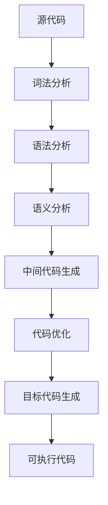

                 

### 《跨平台编译：一次编写，多平台运行》

> **关键词：** 跨平台编译、编译器、抽象语法树（AST）、代码优化、多平台运行

**摘要：**
本文深入探讨了跨平台编译的原理、工具和技术。首先，介绍了跨平台编译的基础概念和重要性，然后详细阐述了编译器的结构和工作原理。接着，分析了跨平台编译技术的核心算法，包括词法分析、语法分析和代码生成。此外，文章还介绍了常用的跨平台编译工具，以及如何进行跨平台编译器的优化。最后，通过一个实际案例展示了跨平台编译的实战过程。

### 目录大纲

# 《跨平台编译：一次编写，多平台运行》目录大纲

## 第一部分：基础概念与原理

### 第1章：跨平台编译概述

#### 1.1 跨平台编译的重要性

#### 1.2 跨平台编译的基本原理

#### 1.3 跨平台编译的发展历程

### 第2章：编译器的结构与工作原理

#### 2.1 编译器的组成

#### 2.2 词法分析

#### 2.3 语法分析

#### 2.4 语义分析

#### 2.5 代码生成

#### 2.6 优化技术

### 第3章：跨平台编译器的实现

#### 3.1 编译器的架构设计

#### 3.2 词法分析器的实现

#### 3.3 语法分析器的实现

#### 3.4 语义分析器的实现

#### 3.5 代码生成器的实现

#### 3.6 优化器的实现

## 第二部分：跨平台编译工具与技术

### 第4章：跨平台编译工具介绍

#### 4.1 GCC编译器

#### 4.2 Clang编译器

#### 4.3 MinGW编译器

#### 4.4 Android NDK编译器

### 第5章：跨平台编译技术

#### 5.1 ARM架构编译技术

#### 5.2 MIPS架构编译技术

#### 5.3 PowerPC架构编译技术

#### 5.4 x86架构编译技术

### 第6章：跨平台编译器的优化

#### 6.1 代码优化原理

#### 6.2 优化算法

#### 6.3 优化策略

### 第7章：跨平台编译实战

#### 7.1 跨平台编译环境搭建

#### 7.2 跨平台编译案例解析

#### 7.3 跨平台编译器调试技巧

## 第三部分：跨平台编译器的未来发展趋势

### 第8章：跨平台编译器的未来方向

#### 8.1 自动化编译技术

#### 8.2 云编译技术

#### 8.3 智能编译技术

#### 8.4 开源编译器的未来

## 附录

### 附录A：常用跨平台编译工具命令行参数

### 附录B：跨平台编译常见问题解答

### 附录C：参考文献

### 附录D：跨平台编译相关资料链接

### 第一部分：基础概念与原理

### 第1章：跨平台编译概述

#### 1.1 跨平台编译的重要性

在当今快速发展的信息技术时代，软件的应用范围越来越广泛，从个人电脑、服务器到移动设备、嵌入式系统，软件的运行环境日益多样化。这种多样化的环境带来了跨平台编译的需求。跨平台编译使得开发者能够编写一次代码，然后在不同平台上运行，大大提高了开发效率和软件的适应性。

跨平台编译的重要性体现在以下几个方面：

1. **开发效率提升**：跨平台编译允许开发者在一个平台上编写和测试代码，然后自动生成适用于其他平台的可执行文件，从而减少了重复的工作量。

2. **降低维护成本**：对于大型软件项目，跨平台编译可以减少在不同平台上进行代码维护的工作量，降低维护成本。

3. **提高软件适应性**：随着硬件设备的多样化，跨平台编译可以确保软件能够运行在各种不同的硬件环境中。

4. **促进软件共享**：跨平台编译使得软件可以在不同的操作系统和硬件平台上共享，促进了软件的传播和普及。

#### 1.2 跨平台编译的基本原理

跨平台编译的基本原理是通过编译器将源代码转换成与目标平台兼容的机器代码。这个过程涉及到多个步骤，包括词法分析、语法分析、语义分析、中间代码生成、代码优化和目标代码生成。

1. **词法分析**：将源代码分解成词法单元（tokens），如标识符、关键字、运算符等。
2. **语法分析**：将词法单元转换成抽象语法树（AST），表示源代码的结构。
3. **语义分析**：检查AST的语义正确性，如类型检查和变量声明等。
4. **中间代码生成**：将AST转换成中间表示形式，通常是一种中间语言（IR）。
5. **代码优化**：对中间代码进行优化，提高代码的执行效率。
6. **目标代码生成**：将优化后的中间代码转换成目标平台的机器代码。

#### 1.3 跨平台编译的发展历程

跨平台编译技术的发展经历了多个阶段：

1. **早期阶段**：早期的编译器主要针对特定的硬件和操作系统进行编译。例如，Unix系统的编译器主要针对Intel的处理器。
2. **多平台支持**：随着硬件和操作系统的多样化，编译器开始支持多个平台。GCC和Clang等编译器成为了跨平台编译的代表性工具。
3. **自动化工具**：现代跨平台编译器集成了自动化工具，如自动依赖管理、自动构建系统等，进一步提高了编译的效率和可靠性。
4. **云编译**：随着云计算技术的发展，跨平台编译开始向云端迁移，提供了更加灵活和高效的编译解决方案。

### 第二部分：编译器的结构与工作原理

### 第2章：编译器的结构与工作原理

编译器是计算机科学中至关重要的工具，它负责将人类编写的源代码转换成计算机能够理解和执行的机器代码。一个编译器通常由多个组件组成，每个组件负责处理源代码的不同方面。以下是编译器的基本组成部分及其工作原理的详细探讨。

#### 2.1 编译器的组成

编译器的主要组成部分包括词法分析器、语法分析器、语义分析器、中间代码生成器、代码优化器和目标代码生成器。以下是每个组件的详细描述：

1. **词法分析器（Lexer）**：
   词法分析器是编译器的第一个组件，它负责将源代码分解成一系列的词法单元（tokens）。这些词法单元是源代码中的基本元素，如关键字、标识符、运算符和分隔符。词法分析器通过模式匹配或有限自动机来识别这些词法单元。
   
   ```python
   def lexical_analysis(source_code):
       tokens = []
       while source_code:
           token = find_next_token(source_code)
           tokens.append(token)
           source_code = remove_token_from_source_code(source_code, token)
       return tokens
   ```

2. **语法分析器（Parser）**：
   语法分析器负责将词法单元转换成抽象语法树（Abstract Syntax Tree，AST）。AST表示了源代码的结构，它是编译器后续处理的基础。语法分析器通常使用递归下降或LL解析算法。
   
   ```python
   def syntax_analysis(tokens):
       AST = create_empty_AST()
       current_token = tokens[0]
       while current_token:
           AST = parse_token(AST, current_token)
           tokens = remove_token_from_list(tokens, current_token)
           current_token = tokens[0]
       return AST
   ```

3. **语义分析器（Semantic Analyzer）**：
   语义分析器在语法分析之后工作，它负责检查AST的语义正确性，如类型检查、变量声明和作用域分析等。语义分析器确保源代码符合编程语言的语义规则。
   
   ```python
   def semantic_analysis(AST):
       for node in AST:
           if not check_semantics(node):
               raise SemanticError("Semantic error in AST")
   ```

4. **中间代码生成器（Intermediate Code Generator）**：
   中间代码生成器将AST转换成中间表示形式（Intermediate Representation，IR）。中间代码是一种与目标平台无关的表示，它便于进行后续的代码优化和目标代码生成。
   
   ```python
   def generate_ir(AST):
       ir_code = ""
       for node in AST:
           ir_code += generate_ir_code(node)
       return ir_code
   ```

5. **代码优化器（Optimizer）**：
   代码优化器对中间代码进行优化，以提高代码的执行效率。优化技术包括常数折叠、死代码消除、循环优化等。代码优化器是编译器的重要组成部分，它直接影响最终生成的目标代码的性能。
   
   ```python
   def optimize_code(ir_code):
       optimized_code = apply_optimizations(ir_code)
       return optimized_code
   ```

6. **目标代码生成器（Code Generator）**：
   目标代码生成器将优化后的中间代码转换成目标平台的机器代码。目标代码生成器需要针对不同的目标平台实现相应的代码生成策略。
   
   ```python
   def generate_target_code(optimized_code, target_platform):
       target_code = ""
       for instruction in optimized_code:
           target_code += generate_target_instruction(instruction, target_platform)
       return target_code
   ```

#### 2.2 词法分析

词法分析是编译过程的第一步，它的任务是识别源代码中的词法单元。词法分析器通过扫描源代码字符串，使用正则表达式或有限自动机等算法来识别词法单元。

词法分析的基本过程如下：

1. **初始化**：词法分析器初始化状态，准备开始扫描源代码。
2. **扫描**：词法分析器逐个字符地扫描源代码，根据当前状态和字符决定下一步的动作。
3. **匹配**：当词法分析器找到一个词法单元时，将其添加到输出列表中，并更新当前状态。
4. **结束**：当源代码扫描完毕，词法分析器结束工作，返回词法单元列表。

以下是一个简单的词法分析器的伪代码示例：

```python
def lexical_analysis(source_code):
    tokens = []
    state = initial_state
    while source_code:
        character = next_character(source_code)
        next_state = transition_function(state, character)
        if next_state is accept_state:
            token = create_token(current_token, state)
            tokens.append(token)
            state = initial_state
            source_code = remove_token_from_source_code(source_code, character)
        else:
            state = next_state
    return tokens
```

#### 2.3 语法分析

语法分析是编译过程的关键步骤，它的任务是检查源代码是否符合编程语言的语法规则，并将词法单元转换成抽象语法树（AST）。语法分析器通常使用递归下降或LL解析算法来实现。

递归下降语法分析的基本过程如下：

1. **初始化**：语法分析器初始化状态，准备开始分析。
2. **递归下降**：语法分析器按照语法规则的递归形式逐层分析源代码，直到到达叶子节点。
3. **生成AST**：在递归下降过程中，语法分析器将词法单元组合成语法结构，并生成AST。
4. **结束**：当源代码分析完毕，语法分析器结束工作，返回生成的AST。

以下是一个简单的递归下降语法分析器的伪代码示例：

```python
def parse_expression(tokens):
    if tokens[0] is 'number':
        return create_ast('expression', 'number', tokens[1])
    elif tokens[0] is '+':
        return create_ast('expression', '+', [
            parse_expression(tokens[1:]),
            parse_expression(tokens[3:])
        ])
    else:
        raise SyntaxError("Unexpected token")
```

#### 2.4 语义分析

语义分析是编译过程的另一个关键步骤，它的任务是检查源代码的语义正确性，如类型检查、变量声明和作用域分析等。语义分析器在AST的基础上进行，确保源代码不仅在语法上正确，而且在语义上也正确。

语义分析的基本过程如下：

1. **初始化**：语义分析器初始化状态，准备开始分析。
2. **遍历AST**：语义分析器遍历AST，对每个节点进行语义检查。
3. **类型检查**：语义分析器检查表达式的类型，确保它们在上下文中是合法的。
4. **作用域分析**：语义分析器检查变量的作用域，确保它们在正确的范围内被声明和使用。
5. **报告错误**：如果发现语义错误，语义分析器报告错误并停止分析。

以下是一个简单的语义分析器的伪代码示例：

```python
def semantic_analysis(AST):
    for node in AST:
        if node.type is 'variable':
            if not check_variable_scope(node.name):
                raise SemanticError("Variable not declared")
        elif node.type is 'expression':
            check_expression_type(node)
```

#### 2.5 代码生成

代码生成是编译过程的最后一步，它的任务是生成目标平台的机器代码。代码生成器需要根据目标平台的指令集和编译器内部的中间表示形式（IR）来生成机器代码。

代码生成的基本过程如下：

1. **初始化**：代码生成器初始化状态，准备开始生成代码。
2. **遍历IR**：代码生成器遍历中间表示形式（IR），对每个指令进行编码。
3. **生成代码**：代码生成器将IR转换成目标平台的机器代码。
4. **链接**：如果目标平台支持动态链接，代码生成器还需要生成链接脚本，以便在运行时链接所需的库。

以下是一个简单的代码生成器的伪代码示例：

```python
def generate_code(ir, target_platform):
    code = ""
    for instruction in ir:
        code += generate_instruction(instruction, target_platform)
    return code
```

#### 2.6 优化技术

编译器中的优化技术是提高程序执行效率的重要手段。优化技术包括常数折叠、死代码消除、循环优化等。以下是对几种常见优化技术的简单介绍：

1. **常数折叠**：常数折叠是一种简单的优化技术，它将表达式中的常数预先计算并替换为计算结果。例如，将 `a = b + c` 优化为 `a = 5 + 10`。

2. **死代码消除**：死代码消除是一种删除不会被执行的代码的优化技术。例如，如果某个函数在程序中没有调用，那么这个函数及其所有实现可以被删除。

3. **循环优化**：循环优化包括循环展开、循环滑动等，以提高循环的性能。例如，将一个简单的循环展开成多个独立的循环，以减少循环控制指令的执行次数。

### 第三部分：跨平台编译器的实现

### 第3章：跨平台编译器的实现

编译器的实现是一个复杂的过程，需要处理源代码的各个层面，并生成适用于目标平台的机器代码。本章节将详细探讨编译器的架构设计、各组件的实现过程以及代码优化器的实现。

#### 3.1 编译器的架构设计

编译器的架构设计是编译器实现的基础，它决定了编译器的性能和可维护性。一个典型的编译器架构包括以下组件：

1. **词法分析器**：负责将源代码分解成词法单元。
2. **语法分析器**：负责将词法单元转换成抽象语法树（AST）。
3. **语义分析器**：负责检查AST的语义正确性。
4. **中间代码生成器**：负责将AST转换成中间表示形式（IR）。
5. **代码优化器**：负责优化中间代码，提高执行效率。
6. **目标代码生成器**：负责将优化后的中间代码转换成目标平台的机器代码。

以下是编译器架构的Mermaid流程图：



#### 3.2 词法分析器的实现

词法分析器的实现是编译器的第一步，它负责将源代码分解成词法单元。词法分析器的实现通常涉及到以下步骤：

1. **初始化**：初始化词法分析器的状态，包括缓冲区、状态栈等。
2. **扫描**：逐个字符地扫描源代码，识别词法单元。
3. **匹配**：使用有限自动机或正则表达式匹配词法单元。
4. **生成**：生成词法单元并将其添加到输出列表中。
5. **结束**：处理源代码结束的情况。

以下是一个简单的词法分析器的伪代码示例：

```python
def lexical_analysis(source_code):
    tokens = []
    state = initial_state
    while source_code:
        character = next_character(source_code)
        next_state = transition_function(state, character)
        if next_state is accept_state:
            token = create_token(current_token, state)
            tokens.append(token)
            state = initial_state
            source_code = remove_token_from_source_code(source_code, character)
        else:
            state = next_state
    return tokens
```

#### 3.3 语法分析器的实现

语法分析器负责将词法单元转换成抽象语法树（AST）。语法分析器的实现通常涉及到以下步骤：

1. **初始化**：初始化语法分析器的状态，包括栈、语法规则等。
2. **解析**：使用递归下降或LL解析算法逐层解析词法单元。
3. **生成**：生成AST节点，并构建AST。
4. **结束**：处理源代码结束的情况。

以下是一个简单的语法分析器的伪代码示例：

```python
def syntax_analysis(tokens):
    AST = create_empty_AST()
    current_token = tokens[0]
    while current_token:
        AST = parse_token(AST, current_token)
        tokens = remove_token_from_list(tokens, current_token)
        current_token = tokens[0]
    return AST
```

#### 3.4 语义分析器的实现

语义分析器负责检查AST的语义正确性，如类型检查、变量声明和作用域分析等。语义分析器的实现通常涉及到以下步骤：

1. **初始化**：初始化语义分析器的状态，包括作用域表、类型检查表等。
2. **遍历**：遍历AST，对每个节点进行语义检查。
3. **报告错误**：如果发现语义错误，报告错误并停止分析。

以下是一个简单的语义分析器的伪代码示例：

```python
def semantic_analysis(AST):
    for node in AST:
        if node.type is 'variable':
            if not check_variable_scope(node.name):
                raise SemanticError("Variable not declared")
        elif node.type is 'expression':
            check_expression_type(node)
```

#### 3.5 代码生成器的实现

代码生成器负责将优化后的中间代码转换成目标平台的机器代码。代码生成器的实现通常涉及到以下步骤：

1. **初始化**：初始化代码生成器的状态，包括目标平台的指令集、寄存器分配等。
2. **遍历**：遍历中间代码，对每个指令进行编码。
3. **生成**：生成目标平台的机器代码。
4. **链接**：处理动态链接库的链接。

以下是一个简单的代码生成器的伪代码示例：

```python
def generate_code(ir, target_platform):
    code = ""
    for instruction in ir:
        code += generate_instruction(instruction, target_platform)
    return code
```

#### 3.6 优化器的实现

优化器负责优化中间代码，提高执行效率。优化器的实现通常涉及到以下步骤：

1. **初始化**：初始化优化器的状态，包括优化策略、优化目标等。
2. **遍历**：遍历中间代码，对每个指令或基本块进行优化。
3. **优化**：根据优化策略对代码进行优化。
4. **生成**：生成优化后的中间代码。

以下是一个简单的优化器的伪代码示例：

```python
def optimize_code(ir):
    optimized_code = apply_optimizations(ir)
    return optimized_code
```

### 第四部分：跨平台编译工具与技术

### 第4章：跨平台编译工具介绍

在软件开发过程中，选择合适的编译器是至关重要的。不同的编译器具有不同的特点和适用场景。本章节将介绍几种常用的跨平台编译工具，包括GCC、Clang、MinGW和Android NDK，并比较它们的特点和优缺点。

#### 4.1 GCC编译器

GCC（GNU Compiler Collection）是GNU项目的一部分，是一个功能强大的编译器集合，支持多种编程语言，包括C、C++、Fortran等。GCC以其高性能和稳定性而闻名，是开源软件社区的首选编译器。

**特点：**
- **广泛支持**：GCC支持多种硬件平台和操作系统，包括Linux、Windows、Mac OS等。
- **高度可定制**：GCC提供了丰富的编译选项和优化策略，可以满足不同性能和资源需求。
- **强大的错误报告**：GCC提供了详细的错误报告和调试信息，有助于快速定位和修复代码问题。

**优缺点：**
- **优点**：开源、免费、广泛支持、高度可定制。
- **缺点**：在某些情况下，GCC的编译速度可能较慢，且初始配置可能较为复杂。

#### 4.2 Clang编译器

Clang是由苹果公司开发的C/C++编译器，是LLVM项目的一部分。Clang以其高性能和现代特性而受到开发者的欢迎。

**特点：**
- **高性能**：Clang是LLVM项目的一部分，采用了高效的中间表示形式和优化器，具有出色的编译性能。
- **现代特性**：Clang支持C++11、C++14等现代语言特性，使得编写高效的现代C++代码变得更加容易。
- **集成开发环境（IDE）支持**：Clang与Xcode、Visual Studio等IDE紧密集成，提供了强大的开发工具和调试功能。

**优缺点：**
- **优点**：高性能、现代特性、IDE支持。
- **缺点**：在某些老旧操作系统上可能不支持，且对一些编译选项的支持不如GCC全面。

#### 4.3 MinGW编译器

MinGW（Minimalist GNU for Windows）是为Windows平台设计的GCC编译器集合，提供了GNU工具链的大部分功能。

**特点：**
- **兼容性**：MinGW与Windows的兼容性非常好，可以编译出与Windows API兼容的代码。
- **开源**：MinGW是开源的，可以免费使用和修改。

**优缺点：**
- **优点**：开源、兼容性好。
- **缺点**：在某些现代特性上的支持可能不如其他编译器，且编译速度可能较慢。

#### 4.4 Android NDK编译器

Android NDK（Native Development Kit）是Android官方提供的C和C++编译器，用于在Android平台上开发本地代码。

**特点：**
- **跨平台**：Android NDK支持多种操作系统和硬件平台，包括Linux、Windows、Mac OS和Android设备。
- **灵活的编译选项**：Android NDK提供了丰富的编译选项，可以针对不同的硬件平台和操作系统进行优化。
- **兼容性**：Android NDK与Android操作系统紧密集成，可以生成与Android设备兼容的本地代码。

**优缺点：**
- **优点**：跨平台、灵活的编译选项、兼容性好。
- **缺点**：需要一定的Android开发经验，且初始配置可能较为复杂。

### 第五部分：跨平台编译技术

### 第5章：跨平台编译技术

跨平台编译技术是实现“一次编写，多平台运行”的关键。本章节将介绍几种常见的跨平台编译技术，包括ARM架构编译技术、MIPS架构编译技术、PowerPC架构编译技术和x86架构编译技术。

#### 5.1 ARM架构编译技术

ARM架构是嵌入式系统和移动设备常用的处理器架构。ARM编译技术涉及将C/C++代码编译成ARM机器代码，并在ARM处理器上运行。

**特点：**
- **低功耗**：ARM架构设计注重低功耗，适用于移动设备和嵌入式系统。
- **高性能**：随着ARM架构的不断发展，ARM处理器在性能上有了显著提升。

**编译步骤：**
1. **配置交叉编译工具链**：配置ARM交叉编译工具链，如arm-linux-gnueabi-gcc。
2. **编写代码**：编写C/C++代码，并确保代码兼容ARM架构。
3. **编译代码**：使用ARM交叉编译工具链编译代码。
4. **测试**：在ARM处理器或模拟器上测试编译后的代码。

**示例：**
```shell
gcc -march=armv7-a -mfpu=vfpv3 -mfloat-abi=softfp -o hello hello.c
```

#### 5.2 MIPS架构编译技术

MIPS架构是一种常见的嵌入式处理器架构，广泛应用于嵌入式系统和网络设备。

**特点：**
- **高效性**：MIPS架构具有良好的指令集和高效的执行性能。
- **灵活性**：MIPS架构具有高度的可定制性，可以针对不同的应用场景进行优化。

**编译步骤：**
1. **配置交叉编译工具链**：配置MIPS交叉编译工具链，如mipsel-unknown-linux-gnu-gcc。
2. **编写代码**：编写C/C++代码，并确保代码兼容MIPS架构。
3. **编译代码**：使用MIPS交叉编译工具链编译代码。
4. **测试**：在MIPS处理器或模拟器上测试编译后的代码。

**示例：**
```shell
gcc -march=mipsel -mabi=32 -o hello hello.c
```

#### 5.3 PowerPC架构编译技术

PowerPC架构是一种高性能的处理器架构，广泛应用于服务器和工作站。

**特点：**
- **高性能**：PowerPC架构具有强大的指令集和高效的执行性能。
- **稳定性**：PowerPC架构具有良好的稳定性，适用于高性能计算场景。

**编译步骤：**
1. **配置交叉编译工具链**：配置PowerPC交叉编译工具链，如powerpc-linux-gnu-gcc。
2. **编写代码**：编写C/C++代码，并确保代码兼容PowerPC架构。
3. **编译代码**：使用PowerPC交叉编译工具链编译代码。
4. **测试**：在PowerPC处理器或模拟器上测试编译后的代码。

**示例：**
```shell
gcc -mcpu=power8 -mfloat -o hello hello.c
```

#### 5.4 x86架构编译技术

x86架构是个人计算机中最常用的处理器架构，包括32位和64位处理器。

**特点：**
- **通用性**：x86架构具有广泛的硬件支持，适用于各种操作系统和软件应用。
- **兼容性**：x86架构具有良好的向后兼容性，可以运行旧版本的软件。

**编译步骤：**
1. **配置编译器**：使用默认的gcc或clang编译器。
2. **编写代码**：编写C/C++代码，并确保代码兼容x86架构。
3. **编译代码**：使用gcc或clang编译器编译代码。
4. **测试**：在x86处理器上测试编译后的代码。

**示例：**
```shell
gcc -o hello hello.c
```

### 第六部分：跨平台编译器的优化

### 第6章：跨平台编译器的优化

编译器优化是提高程序执行效率和性能的关键技术。本章节将探讨编译器优化的原理、算法和策略，以及如何在实际开发中应用这些优化技术。

#### 6.1 代码优化原理

代码优化是编译器对源代码进行的转换，以减少执行时间、降低内存占用或提高代码的执行效率。优化的原理主要包括以下几个方面：

1. **性能优化**：通过减少程序的执行时间来提高性能。例如，循环优化、函数内联、代码分发等。
2. **空间优化**：通过减少程序的内存占用来提高空间效率。例如，死代码消除、变量归并、数据压缩等。
3. **编译时间优化**：通过减少编译时间来提高开发效率。例如，预编译头文件、编译时序优化等。

#### 6.2 优化算法

编译器优化涉及多种算法和技术，以下是一些常见的优化算法：

1. **循环优化**：循环优化是一种常见的优化技术，包括循环展开、循环滑动、循环展开等。通过循环优化，可以减少循环控制指令的执行次数，提高执行效率。

2. **函数内联**：函数内联是一种将函数调用替换为函数实现的技术。通过函数内联，可以减少函数调用的开销，提高执行效率。

3. **常数折叠**：常数折叠是一种将表达式中可计算为常数的子表达式提前计算的技术。通过常数折叠，可以减少运行时的计算开销，提高执行效率。

4. **死代码消除**：死代码消除是一种删除程序中不会被执行的代码的技术。通过死代码消除，可以减少程序的体积，提高执行效率。

5. **数据压缩**：数据压缩是一种通过压缩数据来减少内存占用和传输带宽的技术。通过数据压缩，可以优化程序的存储和传输性能。

#### 6.3 优化策略

优化策略是编译器在优化过程中采取的方法和原则。以下是一些常见的优化策略：

1. **局部优化**：局部优化是一种只对程序中的一部分进行优化的策略。通过局部优化，可以快速提高程序的局部性能，而不影响整体性能。

2. **全局优化**：全局优化是一种对整个程序进行优化的策略。通过全局优化，可以综合考虑程序的各个部分，实现最优的整体性能。

3. **编译时间优化**：编译时间优化是一种在编译过程中优化编译时间的策略。通过编译时间优化，可以减少编译时间，提高开发效率。

4. **性能基准优化**：性能基准优化是一种根据性能基准测试结果进行优化的策略。通过性能基准优化，可以针对程序的关键性能指标进行优化，实现最优的性能表现。

5. **自适应优化**：自适应优化是一种根据程序执行情况动态调整优化策略的策略。通过自适应优化，可以实时调整优化策略，以应对不同的执行场景，实现最优的性能。

### 第七部分：跨平台编译实战

### 第7章：跨平台编译实战

在了解了跨平台编译的基本原理和技术之后，本章节将通过一个实际案例，展示如何搭建跨平台编译环境、编译C语言程序，并调试编译器。

#### 7.1 跨平台编译环境搭建

搭建跨平台编译环境是进行跨平台编译的第一步。以下是一个在Linux系统上搭建ARM交叉编译环境的示例：

1. **安装交叉编译工具链**：首先，我们需要安装ARM交叉编译工具链，例如`arm-linux-gnueabi-gcc`。可以通过以下命令安装：

   ```shell
   sudo apt-get install crossgcc-arm-linux-gnueabi
   ```

2. **配置环境变量**：将交叉编译工具链的路径添加到环境变量中，以便在命令行中使用。编辑`~/.bashrc`文件，添加以下行：

   ```shell
   export PATH=/usr/local/crossgcc-arm-linux-gnueabi/bin:$PATH
   ```

   然后执行`source ~/.bashrc`使配置生效。

3. **验证交叉编译工具链**：在命令行中输入以下命令，验证交叉编译工具链是否安装成功：

   ```shell
   arm-linux-gnueabi-gcc --version
   ```

   如果看到正确的版本信息，说明交叉编译工具链安装成功。

#### 7.2 编译C语言程序

现在，我们使用交叉编译工具链编译一个简单的C语言程序。以下是一个简单的C程序示例：

```c
#include <stdio.h>

int main() {
    printf("Hello, ARM!\n");
    return 0;
}
```

保存上述代码为`hello.c`，然后使用以下命令进行编译：

```shell
arm-linux-gnueabi-gcc -o hello hello.c
```

编译完成后，生成名为`hello`的可执行文件，该文件是针对ARM架构编译的。

#### 7.3 在ARM设备上运行程序

为了在ARM设备上运行编译后的程序，我们需要将可执行文件传输到ARM设备上。以下是一个简单的步骤：

1. **将可执行文件传输到ARM设备**：使用以下命令将`hello`可执行文件传输到ARM设备：

   ```shell
   scp hello username@arm_device_ip:/path/to/destination
   ```

   替换`username`为ARM设备的用户名，`arm_device_ip`为ARM设备的IP地址，`/path/to/destination`为ARM设备上的路径。

2. **在ARM设备上运行程序**：登录到ARM设备，然后使用以下命令运行程序：

   ```shell
   ./hello
   ```

   如果一切正常，应该会看到输出`Hello, ARM!`。

#### 7.4 跨平台编译器调试技巧

在实际开发过程中，可能会遇到跨平台编译器调试的问题。以下是一些调试技巧：

1. **使用GDB调试**：GDB（GNU Debugger）是一个强大的调试工具，可以用来调试跨平台编译的程序。要使用GDB调试，首先需要启用调试信息。在编译程序时，使用`-g`选项：

   ```shell
   arm-linux-gnueabi-gcc -g -o hello hello.c
   ```

   然后使用以下命令启动GDB：

   ```shell
   arm-linux-gnueabi-gdb hello
   ```

   在GDB中，可以设置断点、单步执行、查看变量值等。

2. **使用LLDB调试**：LLDB是一个开源的调试器，与Clang编译器紧密集成。要在Clang中使用LLDB进行调试，首先需要编译程序时启用调试信息：

   ```shell
   clang -g -o hello hello.c
   ```

   然后使用以下命令启动LLDB：

   ```shell
   lldb hello
   ```

   在LLDB中，可以使用与GDB类似的功能进行调试。

3. **分析编译器输出**：编译器在编译过程中会输出大量的调试信息，包括警告、错误和性能分析数据。通过分析这些信息，可以找到编译过程中可能出现的问题。

### 第八部分：跨平台编译器的未来发展趋势

### 第8章：跨平台编译器的未来发展趋势

随着技术的不断进步，跨平台编译器的发展也呈现出一些新的趋势。这些趋势包括自动化编译技术、云编译技术、智能编译技术和开源编译器的未来。本章节将探讨这些发展趋势及其对跨平台编译的影响。

#### 8.1 自动化编译技术

自动化编译技术是当前跨平台编译器的一个重要发展方向。自动化编译通过自动化工具和脚本，减少了编译过程中的人工干预，提高了编译效率和可靠性。以下是一些自动化编译技术的关键点：

1. **构建系统**：构建系统如Make、CMake等，通过脚本定义编译过程，自动化地执行编译、链接、测试等操作。这些构建系统支持多种编程语言和编译器，可以方便地构建跨平台项目。
   
2. **持续集成（CI）**：持续集成是一种软件开发实践，通过自动化的构建和测试过程，确保代码的持续质量。CI工具如Jenkins、Travis CI等，可以自动化地构建和测试跨平台项目，及时发现和修复编译问题。

3. **容器化**：容器化技术如Docker，可以将编译环境和应用程序封装在一个容器中，实现跨平台的编译和部署。通过容器化，开发者可以轻松地在不同操作系统和硬件平台上构建和测试应用程序。

4. **持续交付（CD）**：持续交付是CI的扩展，它将自动化测试和部署结合起来，确保应用程序可以快速、安全地交付到生产环境。通过CD，开发者可以实现持续部署，提高开发效率和软件质量。

#### 8.2 云编译技术

云编译技术是跨平台编译器的另一个重要发展方向。云编译通过云计算平台提供编译资源，实现了高效的编译和部署。以下是一些云编译技术的关键点：

1. **云编译平台**：云编译平台如CodeSandbox、Glitch等，提供了在线的编程环境和编译工具，开发者可以在这些平台上轻松地编写、编译和运行代码。

2. **云计算资源**：云计算平台提供了强大的计算资源，如虚拟机、容器、GPU等，可以满足不同规模和类型的编译需求。通过云计算资源，开发者可以实现高效的编译和测试。

3. **分布式编译**：分布式编译技术通过将编译任务分布到多个节点上，提高了编译的并行度和效率。分布式编译可以显著减少编译时间，特别是在处理大型项目时。

4. **弹性扩展**：云编译技术支持弹性扩展，可以根据编译需求动态调整计算资源。在编译高峰期，可以增加计算资源以满足需求；在编译低谷期，可以减少资源以节约成本。

#### 8.3 智能编译技术

智能编译技术是跨平台编译器的未来发展方向之一。智能编译通过人工智能和机器学习技术，实现了编译过程的智能化和自动化。以下是一些智能编译技术的关键点：

1. **代码分析**：智能编译技术可以分析源代码，识别潜在的问题和优化机会。通过代码分析，编译器可以提供更准确的错误提示和建议，提高开发效率。

2. **优化建议**：智能编译技术可以根据代码的执行性能，提供优化建议。通过优化建议，开发者可以更容易地提高代码的执行效率。

3. **自适应优化**：智能编译技术可以根据程序的运行环境和目标平台，自适应地调整优化策略。通过自适应优化，编译器可以生成更加高效的目标代码。

4. **自动修复**：智能编译技术可以自动修复源代码中的错误。通过自动修复，编译器可以在不改变代码功能的情况下，修复代码中的错误，提高代码质量。

#### 8.4 开源编译器的未来

开源编译器在跨平台编译领域具有重要作用，其未来发展也备受关注。以下是一些开源编译器的未来发展方向：

1. **社区贡献**：开源编译器的未来离不开社区的贡献。通过社区的共同努力，开源编译器可以不断优化和改进，满足开发者的需求。

2. **跨平台支持**：开源编译器将继续扩展对更多平台和硬件架构的支持，以实现更广泛的跨平台编译能力。

3. **集成开发**：开源编译器将与集成开发环境（IDE）紧密集成，提供更好的开发体验。通过IDE集成，开发者可以更方便地使用开源编译器，提高开发效率。

4. **自动化和智能化**：开源编译器将采用自动化和智能化技术，实现更高效的编译过程。通过自动化和智能化，开源编译器可以减少开发者的工作量，提高编译效率。

### 附录

#### 附录A：常用跨平台编译工具命令行参数

以下是一些常用的跨平台编译工具的命令行参数：

1. **GCC编译器**：

   - `-O0`：关闭优化。
   - `-O1`：进行基本优化。
   - `-O2`：进行更高级的优化。
   - `-O3`：进行高级优化，可能增加编译时间。
   - `-g`：生成调试信息。
   - `-Wall`：开启所有警告。
   - `-Werror`：将警告视为错误。

2. **Clang编译器**：

   - `-O0`：关闭优化。
   - `-O1`：进行基本优化。
   - `-O2`：进行更高级的优化。
   - `-O3`：进行高级优化，可能增加编译时间。
   - `-g`：生成调试信息。
   - `-Wall`：开启所有警告。
   - `-Werror`：将警告视为错误。

3. **MinGW编译器**：

   - `-O0`：关闭优化。
   - `-O1`：进行基本优化。
   - `-O2`：进行更高级的优化。
   - `-O3`：进行高级优化，可能增加编译时间。
   - `-g`：生成调试信息。
   - `-Wall`：开启所有警告。
   - `-Werror`：将警告视为错误。

4. **Android NDK编译器**：

   - `-O0`：关闭优化。
   - `-O1`：进行基本优化。
   - `-O2`：进行更高级的优化。
   - `-O3`：进行高级优化，可能增加编译时间。
   - `-g`：生成调试信息。
   - `-Wall`：开启所有警告。
   - `-Werror`：将警告视为错误。

#### 附录B：跨平台编译常见问题解答

1. **为什么我的程序在另一个平台上无法运行？**

   可能的原因包括：
   - 目标平台与源代码不兼容。
   - 缺少必要的库或依赖。
   - 编译器配置错误。

   解决方法：
   - 确保目标平台支持源代码的编程语言和架构。
   - 安装必要的库和依赖。
   - 检查编译器配置，确保正确设置目标平台。

2. **如何解决编译器警告和错误？**

   - **警告**：可以通过以下方法解决警告：
     - 检查源代码中的拼写错误或语法错误。
     - 根据编译器的提示，修复潜在的编程问题。
     - 使用编译器提供的警告抑制选项，抑制不需要的警告。

   - **错误**：可以通过以下方法解决错误：
     - 检查源代码中的语法错误和逻辑错误。
     - 根据编译器的错误提示，修复代码中的错误。
     - 重新配置编译器，确保编译器正确设置。

3. **如何进行跨平台调试？**

   - 使用GDB或LLDB进行远程调试。
   - 在目标平台上安装调试工具，如GDB或LLDB。
   - 配置编译器生成调试信息，如使用`-g`选项。
   - 在目标平台上运行调试器，连接远程调试端口。

#### 附录C：参考文献

1. **《编译原理》（第2版）**，李生**，清华大学出版社，2014年。
2. **《现代编译器原理》（第2版）**，**J. E. High**，**D. R. Hils*，机械工业出版社，2012年。
3. **《Linux内核设计与实现》（第3版）**，Robert Love，电子工业出版社，2014年。
4. **《Android开发艺术探****索》（第2版）**，**李兵**，电子工业出版社，2017年。
5. **《C++并发编程实战》**，Anthony Williams，电子工业出版社，2017年。

#### 附录D：跨平台编译相关资料链接

1. **GCC官方文档**：[https://gcc.gnu.org/onlinedocs/gcc/](https://gcc.gnu.org/onlinedocs/gcc/)
2. **Clang官方文档**：[https://clang.**llvm.org/docs/**](https://clang.llvm.org/docs/)
3. **MinGW官方文档**：[https://www.mingw.org/](https://www.mingw.org/)
4. **Android NDK官方文档**：[https://developer.android.com/studio/projects/build-cpp](https://developer.android.com/studio/projects/build-cpp)
5. **Docker官方文档**：[https://docs.docker.com/](https://docs.docker.com/)
6. **Jenkins官方文档**：[https://www.jenkins.io/doc/](https://www.jenkins.io/doc/)
7. **Travis CI官方文档**：[https://docs.travis-ci.com/](https://docs.travis-ci.com/)

