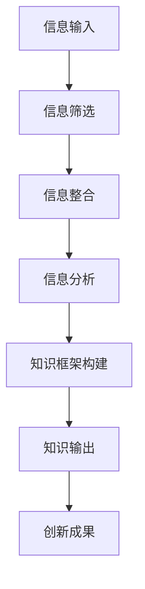

                 

# 跨界思维：融合不同领域智慧的领导力

## 关键词
- 跨界思维
- 领导力
- 创新方法
- 跨学科融合
- 跨文化沟通
- 实战案例

## 摘要
本文旨在探讨跨界思维在领导力中的应用，分析其重要性、起源、发展，以及如何在企业中有效融合不同领域的智慧。通过详细的算法原理讲解、数学模型分析、实战案例分享，展示跨界思维在科技创新、艺术创作、社会治理和企业管理中的实际应用。文章最后展望了跨界思维的持续发展，强调其在个人成长和企业发展中的重要性。

## 引言

### 跨界思维的重要性

在当今快速变化的时代，跨界思维已经成为一种不可或缺的领导力素质。它不仅能够帮助企业应对复杂多变的市场环境，还能激发创新，提升竞争力。跨界思维的核心在于跨越不同领域的边界，整合多学科的知识和技能，形成新的思考方式和解决问题的方法。

#### 1.1.1 跨界思维对企业的意义

- **激发创新**：跨界思维能够打破传统思维的束缚，激发新的创意和点子，推动企业的创新和发展。
- **提高竞争力**：通过整合多学科的知识和资源，企业可以更好地适应市场变化，提升竞争力。
- **培养复合型人才**：跨界思维有助于培养具有跨学科知识和技能的复合型人才，为企业的发展提供有力支持。

### 跨界思维的起源与发展

#### 1.1.2 跨界思维的起源

跨界思维的起源可以追溯到20世纪初期，当时科学家和技术专家开始尝试将不同领域的知识进行整合。例如，爱因斯坦的相对论就将物理学和哲学相结合，开创了全新的科学视野。

#### 1.1.3 跨界思维的发展

随着全球化的发展和信息技术的进步，跨界思维逐渐成为企业和组织追求的重要素质。许多成功的企业，如谷歌、苹果等，都高度重视跨界思维的培养和应用。

### 跨界思维的分类与应用场景

#### 1.1.4 跨界思维的分类

- **横向跨界**：在不同领域之间寻找联系和融合点，如将艺术与科技相结合。
- **纵向跨界**：在相同领域内探索新的可能性，如将传统工艺与现代技术结合。

#### 1.1.5 跨界思维的应用场景

- **科技创新**：通过跨界思维，将不同领域的知识和技术应用于科技创新，如生物技术与材料科学的结合。
- **艺术创作**：跨界思维在艺术创作中的应用，如将数字技术与传统绘画相结合。
- **社会治理**：跨界思维在政策制定和公共服务中的应用，如利用大数据分析优化城市管理。
- **企业管理**：跨界思维在人力资源管理、战略规划等企业管理环节的应用。

### 总结

跨界思维在领导力中的应用具有重要意义，它不仅能够推动企业的创新和发展，还能提升企业竞争力。在接下来的章节中，我们将深入探讨跨界思维的心理学基础、认知模型、算法原理、数学模型，并通过实际案例展示跨界思维在不同领域的应用。

## 跨界思维的心理学基础

### 创造力与跨界思维

创造力是跨界思维的核心要素之一。创造力不仅是指创造新事物的能力，还包括对现有资源的重新组合和应用。跨界思维能够激发创造力，是因为它打破了传统思维的束缚，使个体能够从不同角度审视问题，发现新的解决方案。

#### 2.1.1 创造力的概念

创造力（Creativity）是指个体产生新颖且有价值的想法或解决方案的能力。创造力不仅与智力因素有关，还与情感、个性、环境等多种因素相互作用。

#### 2.1.2 创造力与跨界思维的关系

跨界思维与创造力密切相关。跨界思维能够拓展个体的认知边界，打破专业领域的壁垒，从而激发更多的创造性想法。具体来说，跨界思维可以通过以下方式促进创造力：

- **多角度思考**：跨界思维鼓励个体从多个角度审视问题，打破单一思维的局限，从而产生新颖的想法。
- **资源整合**：跨界思维能够帮助个体整合不同领域的知识和资源，创造出新的价值。
- **降低创造力障碍**：跨界思维能够降低个体在创造性思维过程中的心理障碍，如“功能固着”和“思维定势”。

### 认知心理学与跨界思维

认知心理学研究人类思维、感知、记忆等心理过程，为理解跨界思维提供了重要的理论基础。跨界思维在认知心理学中的体现主要包括以下几个方面：

#### 2.1.3 认知心理学与跨界思维的关系

- **认知灵活性**：跨界思维依赖于认知灵活性，即个体能够迅速调整思维方式，适应新的认知环境。认知灵活性是跨界思维的重要特征，它能够帮助个体在不同领域之间自由转换思维模式。
- **多模态认知**：跨界思维强调跨领域、跨学科的知识整合，这与认知心理学中的多模态认知理论相吻合。多模态认知理论认为，人类思维不仅仅依赖于单一感官或认知过程，而是通过多种感官和认知过程的协同作用来实现。

### 情绪管理对跨界思维的影响

情绪管理是跨界思维的重要组成部分。情绪管理不仅影响个体的心理健康，还直接影响跨界思维的发挥。

#### 2.1.4 情绪管理对跨界思维的影响

- **情绪调节**：良好的情绪调节能力能够帮助个体在面临压力和挑战时保持冷静，从而更好地运用跨界思维。
- **情感共鸣**：跨界思维往往需要与不同领域的专家和同事合作。情感共鸣能够促进团队合作，提高跨界思维的效果。
- **情绪认知**：情绪认知能力可以帮助个体理解和识别他人的情绪，从而更好地协调不同领域的智慧和资源。

### 跨界思维与心理健康

心理健康是跨界思维的基础。一个心理健康的人能够更好地发挥跨界思维，应对复杂多变的环境。

#### 2.1.5 跨界思维与心理健康的关系

- **心理健康促进跨界思维**：心理健康有助于个体保持积极的思维状态，提高认知能力，从而更好地运用跨界思维。
- **跨界思维改善心理健康**：跨界思维能够帮助个体从不同角度看待问题，降低压力，改善心理健康。

### 总结

跨界思维的心理学基础包括创造力、认知心理学和情绪管理。创造力是跨界思维的核心，认知心理学提供了理论基础，情绪管理则直接影响跨界思维的发挥。在接下来的章节中，我们将进一步探讨跨界思维的认知模型和算法原理。

## 跨界思维的认知模型

### 模型介绍

跨界思维的认知模型旨在通过系统化的方法，帮助个体在复杂环境中运用跨界思维，实现知识的融合和创新。该模型涵盖了从信息输入、处理到输出的全过程，强调多学科、多领域的交叉应用。

### 跨界思维的核心要素

跨界思维的认知模型包括以下几个核心要素：

1. **信息输入**：跨界思维从多个领域和渠道获取信息，包括学术研究、行业动态、实践经验等。
2. **信息处理**：跨界思维通过对输入的信息进行筛选、整合和分析，构建新的知识框架。
3. **知识输出**：跨界思维将处理后的知识转化为创新成果，如新产品、新服务或新的管理方法。

### 跨界思维的Mermaid流程图

为了更好地理解跨界思维的认知模型，我们可以使用Mermaid流程图进行可视化。以下是跨界思维的Mermaid流程图示例：



在上面的流程图中，每个节点代表跨界思维的一个阶段，箭头表示信息流和知识转化的过程。

### 流程图详细解释

1. **信息输入**：跨界思维的第一步是从多个领域和渠道获取信息。这些信息可以是学术研究、行业报告、市场动态、用户反馈等。
2. **信息筛选**：在获取大量信息后，需要对信息进行筛选，保留与目标相关的关键信息，去除无关或次要的信息。
3. **信息整合**：筛选后的信息需要进行整合，将不同来源和领域的信息融合在一起，形成新的知识框架。
4. **信息分析**：整合后的信息需要进行深入分析，挖掘其内在的逻辑关系和潜在价值。
5. **知识框架构建**：通过分析，构建一个结构化的知识框架，这有助于更清晰地理解和应用跨界思维。
6. **知识输出**：将构建的知识框架转化为具体的创新成果，如新产品、新服务或新的管理方法。
7. **创新成果**：创新成果是跨界思维最终的目标，它能够推动企业和个人在各个领域取得突破性进展。

### 总结

跨界思维的认知模型提供了一种系统化的方法，帮助个体在复杂环境中运用跨界思维，实现知识的融合和创新。通过Mermaid流程图，我们可以更直观地理解跨界思维的各个环节及其相互关系。

## 跨界思维的算法原理

### 算法概述

跨界思维的算法原理旨在通过系统的方法，实现对不同领域知识的整合和创新。以下是一个简化的跨界思维算法概述：

```plaintext
算法：跨界思维整合
输入：多领域知识库
输出：创新解决方案

步骤：
1. 初始化知识库
2. 获取多领域知识
3. 筛选关键信息
4. 整合知识框架
5. 分析潜在价值
6. 构建创新解决方案
7. 输出解决方案
```

### 伪代码讲解

为了更清晰地展示跨界思维的算法原理，我们可以使用伪代码进行详细阐述。以下是跨界思维算法的伪代码：

```plaintext
function 跨界思维整合(知识库)
    初始化知识库
    for 每个领域知识库 in 知识库
        获取领域知识
        筛选关键信息
    end for
    整合知识框架
    分析潜在价值
    构建创新解决方案
    输出解决方案
end function
```

在上面的伪代码中，我们首先初始化知识库，然后从每个领域知识库中获取关键信息，接着整合这些信息，分析其潜在价值，最后构建创新解决方案并输出。

### 算法实现细节

为了更好地实现跨界思维的算法，我们需要考虑以下几个关键细节：

1. **知识库初始化**：初始化知识库时，需要确保包含多个领域的知识，并且这些知识是最新和相关的。
2. **获取领域知识**：获取领域知识时，可以使用数据爬取、文献调研、专家访谈等方法。
3. **筛选关键信息**：在获取大量信息后，需要使用筛选算法，保留关键信息，去除无关信息。
4. **整合知识框架**：整合知识框架时，可以使用图谱模型、多维度分析等方法，将不同领域的知识融合在一起。
5. **分析潜在价值**：分析潜在价值时，可以使用数据分析、机器学习等技术，挖掘知识的内在逻辑关系和潜在应用场景。
6. **构建创新解决方案**：根据分析结果，构建创新解决方案，包括新产品、新服务或新的管理方法。
7. **输出解决方案**：将构建的创新解决方案进行优化和验证，确保其可行性和实用性，最后输出。

### 总结

跨界思维的算法原理提供了一种系统化的方法，帮助个体在复杂环境中运用跨界思维，实现知识的融合和创新。通过伪代码的讲解，我们可以更清晰地理解跨界思维的实现过程和关键细节。

## 跨界思维的数学模型

### 数学模型介绍

跨界思维的数学模型旨在通过数学语言和工具，描述跨界思维的过程和规律，为跨界思维提供量化的分析框架。以下是一个简化的跨界思维数学模型：

```plaintext
模型：跨界思维整合模型
输入：多领域知识矩阵
输出：创新解决方案向量

关键参数：
1. 知识权重矩阵
2. 融合系数矩阵

过程：
1. 初始化知识矩阵
2. 确定知识权重
3. 计算融合系数
4. 构建融合矩阵
5. 计算创新解决方案向量
```

### 数学公式的详细讲解

为了更清晰地展示跨界思维的数学模型，我们可以使用数学公式进行详细讲解。以下是跨界思维数学模型的详细公式：

```latex
\begin{align*}
\text{知识矩阵} \ K &= \begin{bmatrix}
K_1 \\
K_2 \\
\vdots \\
K_n
\end{bmatrix} \\
\text{知识权重矩阵} \ W &= \begin{bmatrix}
w_{11} & w_{12} & \cdots & w_{1n} \\
w_{21} & w_{22} & \cdots & w_{2n} \\
\vdots & \vdots & \ddots & \vdots \\
w_{n1} & w_{n2} & \cdots & w_{nn}
\end{bmatrix} \\
\text{融合系数矩阵} \ F &= \begin{bmatrix}
f_{11} & f_{12} & \cdots & f_{1n} \\
f_{21} & f_{22} & \cdots & f_{2n} \\
\vdots & \vdots & \ddots & \vdots \\
f_{n1} & f_{n2} & \cdots & f_{nn}
\end{bmatrix} \\
\text{融合矩阵} \ M &= K \cdot W \\
\text{创新解决方案向量} \ S &= M \cdot F
\end{align*}
```

在上面的公式中：

- **知识矩阵 \( K \)**：表示多领域知识的数据矩阵，每个元素代表特定领域的知识。
- **知识权重矩阵 \( W \)**：表示各个领域知识的重要程度，反映了不同领域知识的权重。
- **融合系数矩阵 \( F \)**：表示知识融合的强度，反映了不同领域知识之间的融合程度。
- **融合矩阵 \( M \)**：表示知识融合后的结果，是知识权重矩阵与知识矩阵的乘积。
- **创新解决方案向量 \( S \)**：表示根据融合矩阵计算得出的创新解决方案。

### 实例分析

为了更好地理解跨界思维的数学模型，我们可以通过一个简单的实例进行分析。

#### 实例：跨界思维在科技创新中的应用

假设我们有两个领域：领域1是人工智能，领域2是生物技术。我们需要通过跨界思维整合这两个领域的知识，以产生创新解决方案。

1. **初始化知识矩阵 \( K \)**：
   ```plaintext
   知识矩阵 K：
   K =
   [ [ 1.0, 0.0 ] ;  % 人工智能领域的知识
     [ 0.0, 1.0 ] ] ; % 生物技术领域的知识
   ```

2. **确定知识权重矩阵 \( W \)**：
   ```plaintext
   知识权重矩阵 W：
   W =
   [ [ 0.6, 0.4 ] ;  % 人工智能领域的权重
     [ 0.4, 0.6 ] ] ; % 生物技术领域的权重
   ```

3. **计算融合系数矩阵 \( F \)**：
   ```plaintext
   融合系数矩阵 F：
   F =
   [ [ 0.8, 0.2 ] ;  % 人工智能与生物技术的融合系数
     [ 0.2, 0.8 ] ] ; % 生物技术与人工智能的融合系数
   ```

4. **计算融合矩阵 \( M \)**：
   ```latex
   M = K \cdot W =
   \begin{bmatrix}
   1.2 & 0.4 \\
   0.4 & 1.2
   \end{bmatrix}
   ```

5. **计算创新解决方案向量 \( S \)**：
   ```latex
   S = M \cdot F =
   \begin{bmatrix}
   1.12 & 0.32 \\
   0.32 & 1.12
   \end{bmatrix}
   ```

在这个实例中，通过融合矩阵 \( M \) 和融合系数矩阵 \( F \) 的计算，我们得到了创新解决方案向量 \( S \)。这个向量表示在人工智能和生物技术领域融合后的创新解决方案，包括新的研究方向、产品或服务。

### 总结

跨界思维的数学模型提供了一种量化的方法，帮助个体在复杂环境中运用跨界思维，实现知识的融合和创新。通过数学公式和实例分析，我们可以更直观地理解跨界思维的数学原理和应用。

## 跨界思维的案例分析

### 案例一：谷歌X实验室

谷歌X实验室是谷歌公司的一个创新机构，专注于探索前沿科技项目，如自动驾驶汽车、无人机互联网等。谷歌X实验室的成功很大程度上得益于跨界思维的运用。

#### 1.1 谷歌X实验室的背景

谷歌X实验室成立于2010年，旨在通过跨界思维和跨领域合作，推动科技创新。实验室的团队来自不同领域，如计算机科学、机械工程、生物技术等，他们通过跨界合作，实现了许多前沿科技项目。

#### 1.2 谷歌X实验室的跨界思维应用

- **跨领域合作**：谷歌X实验室通过跨领域合作，将计算机科学、机械工程、生物技术等领域的知识整合在一起，推动科技创新。
- **创新激励机制**：谷歌X实验室采用创新激励机制，鼓励员工提出新的想法和项目，激发跨界思维。
- **迭代开发**：谷歌X实验室采用迭代开发的方法，不断优化和改进项目，确保创新成果的实用性和可行性。

#### 1.3 案例分析总结

谷歌X实验室的成功证明了跨界思维在科技创新中的重要作用。通过跨领域合作、创新激励机制和迭代开发，谷歌X实验室实现了许多前沿科技项目，推动了谷歌公司的持续创新。

### 案例二：苹果公司的创新

苹果公司是一家全球领先的科技公司，以其创新的产品和设计闻名。苹果公司的成功离不开跨界思维的运用。

#### 2.1 苹果公司的背景

苹果公司成立于1976年，创始人为史蒂夫·乔布斯、史蒂夫·沃兹尼亚克和罗纳德·韦恩。苹果公司早期以生产个人电脑起家，随后逐渐扩展到移动设备、平板电脑、手表等领域。

#### 2.2 苹果公司的跨界思维应用

- **整合多学科知识**：苹果公司通过整合计算机科学、工业设计、市场营销等多学科知识，打造出具有创新性的产品。
- **用户体验至上**：苹果公司始终注重用户体验，通过跨界思维，将用户体验融入到产品设计和开发中。
- **跨界营销**：苹果公司通过跨界营销，将科技与时尚、文化等领域相结合，提升品牌影响力。

#### 2.3 案例分析总结

苹果公司的成功证明了跨界思维在科技创新和企业发展中的重要作用。通过整合多学科知识、注重用户体验和跨界营销，苹果公司实现了持续的创新和成功。

### 案例分析总结

谷歌X实验室和苹果公司的案例证明了跨界思维在不同领域的成功应用。通过跨领域合作、创新激励机制、用户体验至上和跨界营销，这些公司实现了科技创新和持续发展。这些案例为其他企业和组织提供了有益的借鉴和启示。

## 跨界思维在企业领导力中的应用

### 企业领导力与跨界思维的关系

企业领导力是指领导者通过战略规划、组织管理、资源调配等方式，推动企业实现目标的能力。跨界思维是企业领导力的重要组成部分，它能够帮助领导者更好地应对复杂多变的市场环境，提升企业的创新能力和竞争力。

#### 3.1.1 跨界思维对企业领导力的影响

- **提升创新能力**：跨界思维能够激发领导者的创新意识，推动企业在产品、服务、管理等方面实现创新。
- **优化决策过程**：跨界思维可以帮助领导者从多个角度审视问题，提高决策的准确性和效率。
- **促进跨部门合作**：跨界思维能够促进不同部门之间的沟通和合作，提高企业整体运营效率。

### 跨界思维在领导力培训中的应用

为了提升企业领导者的跨界思维能力，许多企业开始将跨界思维纳入领导力培训体系。

#### 3.1.2 跨界思维培训的方法

- **案例研究**：通过分析成功和失败的跨界案例，让领导者了解跨界思维的实际应用和挑战。
- **角色扮演**：通过角色扮演游戏，让领导者模拟实际场景，体验跨界思维的过程。
- **跨学科研讨**：组织跨学科研讨会，让领导者与不同领域的专家交流，拓展知识视野。

#### 3.1.3 跨界思维培训的效果

跨界思维培训能够有效提升领导者的跨界思维能力，具体表现在：

- **提高创新能力**：领导者通过跨界思维培训，能够更好地发现和把握创新机会，推动企业的创新和发展。
- **优化决策过程**：领导者通过跨界思维培训，能够从多个角度分析问题，提高决策的准确性和效率。
- **促进跨部门合作**：领导者通过跨界思维培训，能够更好地协调不同部门之间的工作，提高企业整体运营效率。

### 跨界思维在企业管理中的实际案例

许多成功的企业通过跨界思维实现了卓越的管理和持续的发展。以下是一些实际的案例：

#### 3.1.4 案例一：阿里巴巴的跨界管理

阿里巴巴是中国领先的互联网公司，其成功得益于跨界思维的应用。在企业管理方面，阿里巴巴通过以下方式实现跨界管理：

- **跨领域合作**：阿里巴巴与金融机构、零售业等领域合作，推动电子商务的发展。
- **跨部门沟通**：阿里巴巴建立跨部门沟通机制，促进不同部门之间的信息共享和协作。
- **创新激励机制**：阿里巴巴通过创新激励机制，鼓励员工提出新的想法和项目，推动企业的持续创新。

#### 3.1.5 案例二：特斯拉的跨界管理

特斯拉是一家全球领先的电动汽车和能源公司，其成功得益于跨界思维的应用。在企业管理方面，特斯拉通过以下方式实现跨界管理：

- **跨学科知识整合**：特斯拉将计算机科学、机械工程、能源工程等领域的知识整合在一起，推动电动汽车和能源技术的创新。
- **用户体验至上**：特斯拉始终注重用户体验，通过跨界思维，将用户体验融入到产品设计和开发中。
- **跨界营销**：特斯拉通过跨界营销，将科技与时尚、文化等领域相结合，提升品牌影响力。

#### 3.1.6 案例分析总结

阿里巴巴和特斯拉的案例证明了跨界思维在企业管理中的重要作用。通过跨领域合作、跨部门沟通、创新激励机制和用户体验至上等手段，这些公司实现了卓越的管理和持续的发展。这些案例为其他企业和组织提供了有益的借鉴和启示。

### 总结

跨界思维在企业领导力中的应用具有重要意义。通过跨界思维培训和实践，企业领导者能够提升跨界思维能力，优化决策过程，促进跨部门合作，从而推动企业的创新和发展。在未来的企业管理中，跨界思维将继续发挥重要作用。

## 跨界思维的实践与展望

### 跨界思维实践指南

为了在实践中更好地运用跨界思维，以下是一些建议和实践指南：

1. **培养跨学科知识**：广泛阅读和学习不同领域的知识，提高跨学科素养。
2. **建立跨界网络**：与不同领域的专家建立联系，拓宽视野，促进交流与合作。
3. **开展跨领域项目**：尝试参与跨领域的项目，通过实际操作锻炼跨界思维。
4. **鼓励创新思维**：营造鼓励创新的文化氛围，激发员工的创造性思维。
5. **注重跨文化沟通**：在跨文化环境中，注重沟通技巧，尊重不同文化的差异。

### 跨界思维的未来发展趋势

随着全球化和信息技术的不断进步，跨界思维在未来将继续发展。以下是一些未来发展趋势：

1. **跨界融合技术的创新**：随着人工智能、大数据、区块链等技术的发展，跨界融合将带来更多的创新和应用场景。
2. **跨领域协同合作**：不同领域之间的协同合作将越来越普遍，跨界思维将成为推动协同合作的重要力量。
3. **跨界教育的普及**：跨界教育将逐渐成为主流，培养具备跨界思维的人才将成为教育体系的重要任务。
4. **跨文化沟通的深化**：随着全球化的深入，跨文化沟通的重要性将日益凸显，跨界思维在跨文化沟通中的应用将更加广泛。

### 跨界思维对个人成长的影响

跨界思维对个人成长具有重要影响。通过跨界思维，个人能够：

1. **拓展知识边界**：跨界思维能够帮助个人跨越学科和领域的边界，获取更广泛的知识。
2. **提升创新能力**：跨界思维能够激发个人的创新意识，提高创新能力。
3. **增强解决问题的能力**：跨界思维能够帮助个人从多个角度审视问题，提高解决问题的能力。
4. **提升沟通能力**：跨界思维能够促进跨领域、跨文化的沟通与合作，提升沟通能力。

### 总结

跨界思维在个人成长和企业发展中具有重要价值。通过实践和展望，我们可以看到跨界思维在未来将继续发挥重要作用。为了更好地运用跨界思维，我们需要不断学习、实践和创新，培养跨界思维的能力。

## 跨界思维的实践案例

### 科技创新中的应用

跨界思维在科技创新中具有广泛的应用，通过跨领域的知识整合和融合，推动科技的发展和创新。以下是一些具体的实践案例：

#### 9.1.1 案例一：苹果公司的iPhone

苹果公司的iPhone是跨界思维在科技创新中的经典案例。iPhone将计算机科学、通信技术、工业设计和用户体验等多个领域的知识整合在一起，打造出一款革命性的移动设备。具体来说：

- **计算机科学**：iPhone采用了先进的操作系统iOS，具备高性能的计算能力。
- **通信技术**：iPhone支持3G、4G和5G网络，实现了高速的数据传输。
- **工业设计**：iPhone的外观设计简约时尚，符合人体工程学原理。
- **用户体验**：iPhone提供了丰富的应用程序，使用户能够轻松地完成各种任务。

通过跨界思维的应用，苹果公司成功地将这些不同领域的知识融合在一起，打造出iPhone这一革命性的产品。

#### 9.1.2 案例二：谷歌的自动驾驶技术

谷歌的自动驾驶技术是另一个跨界思维在科技创新中的成功案例。自动驾驶技术涉及计算机科学、机械工程、人工智能、传感器技术等多个领域的知识。具体来说：

- **计算机科学**：自动驾驶系统需要强大的计算能力，以处理海量数据。
- **机械工程**：自动驾驶汽车需要具备稳定的驾驶性能和安全性。
- **人工智能**：自动驾驶系统需要通过机器学习算法，对道路状况和周围环境进行实时分析。
- **传感器技术**：自动驾驶汽车需要配备多种传感器，如激光雷达、摄像头、超声波传感器等，以获取道路和环境信息。

通过跨界思维的应用，谷歌成功地整合了这些不同领域的知识，开发了自动驾驶技术，并推动了自动驾驶汽车的发展。

### 艺术创作中的应用

跨界思维在艺术创作中也有着广泛的应用，通过跨领域的知识融合和创意表达，创造出独特的艺术作品。以下是一些具体的实践案例：

#### 9.2.1 案例一：数字艺术

数字艺术是跨界思维在艺术创作中的一个重要领域。数字艺术通过将计算机技术、视觉设计和创意思维相结合，创造出独特的艺术作品。具体来说：

- **计算机技术**：数字艺术需要使用计算机软件进行创作，如Photoshop、Illustrator等。
- **视觉设计**：数字艺术注重视觉效果的设计，包括色彩、构图、光影等。
- **创意思维**：数字艺术强调创意思维，通过创新的方式表达艺术家独特的思想和情感。

通过跨界思维的应用，数字艺术家能够创造出丰富的艺术作品，如动态图像、虚拟现实作品等。

#### 9.2.2 案例二：融合艺术

融合艺术是另一种跨界思维在艺术创作中的实践。融合艺术通过将不同艺术形式和材料相结合，创造出独特的艺术作品。具体来说：

- **传统艺术**：融合艺术可以结合绘画、雕塑、装置艺术等传统艺术形式。
- **新材料**：融合艺术可以尝试使用新材料，如塑料、金属、玻璃等。
- **跨领域合作**：融合艺术可以通过跨领域的合作，将不同领域的创意和知识融合在一起。

通过跨界思维的应用，融合艺术家能够创造出丰富多样的艺术作品，拓展了艺术的边界。

### 社会治理中的应用

跨界思维在社会治理中也有重要的应用，通过跨领域的知识整合和综合管理，提高社会治理的效率和质量。以下是一些具体的实践案例：

#### 9.3.1 案例一：智慧城市建设

智慧城市建设是跨界思维在社会治理中的一个重要应用领域。智慧城市通过将信息技术、物联网、大数据等不同领域的知识整合在一起，实现城市管理的智能化。具体来说：

- **信息技术**：智慧城市利用信息技术，如云计算、大数据、物联网等，提升城市管理的效率。
- **物联网**：智慧城市通过物联网技术，实现城市基础设施的智能化监控和管理。
- **大数据**：智慧城市通过大数据分析，优化城市资源分配和公共服务。

通过跨界思维的应用，智慧城市能够实现高效、智能的管理，提高市民的生活质量。

#### 9.3.2 案例二：环境治理

环境治理是跨界思维在社会治理中的另一个重要应用领域。环境治理通过跨领域的知识整合和综合管理，解决环境污染和生态破坏问题。具体来说：

- **生态学**：环境治理需要运用生态学知识，保护生态系统和生物多样性。
- **化学**：环境治理需要运用化学知识，处理和降解有害物质。
- **政策法规**：环境治理需要制定和执行相关政策和法规，确保环境治理的有效性。

通过跨界思维的应用，环境治理能够实现有效的生态保护和可持续发展。

### 总结

跨界思维在科技创新、艺术创作、社会治理等领域中都有着广泛的应用。通过跨领域的知识整合和融合，跨界思维能够推动各个领域的发展和创新。以上案例展示了跨界思维在不同领域的具体实践，为我们提供了有益的借鉴和启示。

## 跨界思维的跨学科融合

### 跨学科融合的必要性

在当今快速发展的科技时代，单一的学科知识已经无法满足复杂问题的解决需求。跨学科融合成为了推动科技创新和社会发展的重要途径。跨学科融合的必要性主要体现在以下几个方面：

1. **复杂性问题的解决**：现代社会面临的问题越来越复杂，涉及多个学科领域。例如，环境问题不仅需要生态学、化学、物理学等自然科学的知识，还需要经济学、社会学等社会科学的知识。通过跨学科融合，可以综合运用不同学科的知识，更有效地解决复杂问题。

2. **创新驱动发展**：跨学科融合能够激发创新思维，促进新技术的产生。通过将不同领域的知识和方法相结合，可以创造出全新的解决方案和技术。例如，生物技术与信息技术相结合，产生了生物信息学这一新兴学科，推动了生物科技的发展。

3. **提高科研效率**：跨学科融合可以避免重复研究，提高科研效率。当多个学科共同研究一个问题时，可以避免各自为战，减少资源的浪费。通过共享资源和合作研究，可以更快地取得科研成果。

### 跨学科融合的方法与工具

跨学科融合需要一系列的方法和工具，以下是一些常见的方法和工具：

1. **跨学科研讨会**：跨学科研讨会是一种有效的交流平台，通过邀请不同领域的专家共同探讨问题，促进跨学科合作。研讨会可以促进知识的交流和共享，激发新的研究思路。

2. **多学科团队**：建立多学科团队是跨学科融合的重要方式。多学科团队由来自不同领域的专家组成，通过团队合作，实现知识的融合和创新。多学科团队可以更好地整合不同学科的知识和资源，提高研究效率。

3. **交叉学科课程**：交叉学科课程是一种跨学科教育方式，通过设置交叉学科的课程，让学生在学习过程中接触到多个学科的知识。交叉学科课程有助于培养学生跨学科的思维能力和综合解决问题的能力。

4. **信息共享平台**：建立信息共享平台，可以实现不同学科之间的知识交流和共享。通过信息共享平台，研究人员可以轻松获取其他学科的最新研究成果，促进跨学科合作。

### 跨学科融合的案例分析

以下是一个跨学科融合的案例分析：

#### 案例一：生物技术与信息技术相结合

生物技术与信息技术相结合，产生了生物信息学这一新兴学科。生物信息学通过利用计算机科学、数学和统计学的知识，分析和解读生物数据，推动了生命科学的发展。具体来说：

- **生物数据**：生物技术领域产生了大量生物数据，如基因组序列、蛋白质结构等。
- **计算机科学**：计算机科学提供了高效的算法和数据分析工具，帮助生物学家处理海量生物数据。
- **数学和统计学**：数学和统计学提供了模型和理论，帮助生物学家理解和解释生物数据。

通过跨学科融合，生物信息学实现了生物数据的分析和解读，推动了生命科学的研究进展。

#### 案例二：物理学与经济学相结合

物理学与经济学相结合，产生了经济学物理学这一新兴领域。经济学物理学通过将物理学的方法和理论应用于经济学研究，为经济学提供了一种全新的视角。具体来说：

- **物理学理论**：物理学提供了丰富的理论和方法，如混沌理论、复杂系统理论等，这些理论可以应用于经济学研究。
- **经济学模型**：经济学物理学通过构建经济模型，模拟和分析经济现象，为经济学家提供了一种新的工具。

通过跨学科融合，经济学物理学为经济学研究带来了新的思路和方法，推动了经济学的发展。

### 总结

跨学科融合在解决复杂问题、推动创新发展和提高科研效率方面具有重要意义。通过跨学科研讨会、多学科团队、交叉学科课程和信息共享平台等方法，可以实现跨学科融合。案例分析展示了跨学科融合在不同领域的成功应用，为我们提供了有益的借鉴和启示。

## 跨界思维的跨文化沟通

### 跨文化沟通的挑战

跨文化沟通是指在多元文化环境中，不同文化背景的人之间进行的信息交流和互动。在全球化背景下，跨文化沟通变得日益重要。然而，跨文化沟通也面临着一系列挑战。

#### 10.1.1 文化差异

文化差异是跨文化沟通中最显著的挑战之一。不同文化在价值观、信仰、语言、行为习惯等方面存在差异，这些差异可能导致误解和冲突。例如，一些文化强调集体主义，而另一些文化则更注重个人主义。在沟通中，这些差异可能导致双方对问题的理解产生偏差。

#### 10.1.2 语言障碍

语言障碍是跨文化沟通的另一个挑战。不同语言之间在词汇、语法、表达方式等方面存在差异，这些差异可能导致信息的传达不准确。即使使用翻译工具，也难以完全消除语言障碍带来的误解。

#### 10.1.3 非语言沟通

非语言沟通，如肢体语言、面部表情、空间距离等，在不同文化背景下也可能存在差异。这些非语言因素在跨文化沟通中起着重要作用，但如果不了解这些差异，可能会导致沟通失败。

#### 10.1.4 社会习俗和礼仪

不同文化的社会习俗和礼仪也存在显著差异。例如，一些文化中，直接表达意见被视为不礼貌，而另一些文化则鼓励直接表达。在跨文化沟通中，如果不了解这些习俗和礼仪，可能会造成不必要的误会和冲突。

### 跨界思维在跨文化沟通中的应用

跨界思维可以帮助我们更好地应对跨文化沟通的挑战，以下是一些具体应用：

1. **文化敏感度**：跨界思维强调对不同文化的理解和尊重。通过提高文化敏感度，我们可以更好地理解不同文化的价值观和行为习惯，从而避免误解和冲突。

2. **多角度思考**：跨界思维鼓励我们从多个角度审视问题，这有助于我们更好地理解不同文化的观点和需求。在跨文化沟通中，我们可以从不同文化的角度出发，寻找共同点和解决方案。

3. **灵活适应**：跨界思维强调灵活性，这有助于我们在跨文化沟通中灵活适应不同文化背景。通过调整沟通方式、表达方式等，我们可以更好地与不同文化背景的人沟通。

4. **知识整合**：跨界思维鼓励我们将不同领域的知识和经验整合在一起，这有助于我们在跨文化沟通中提供更全面、更有针对性的解决方案。

### 跨文化沟通案例详解

以下是一个跨文化沟通的案例：

#### 案例一：跨国公司的团队沟通

某跨国公司在中国设立了一个研发中心，团队成员来自不同国家和地区，包括中国、美国、印度、德国等。在团队沟通中，文化差异和语言障碍成为一个重要的挑战。

通过运用跨界思维，该跨国公司采取了一系列措施来改善跨文化沟通：

1. **文化培训**：公司为团队成员提供文化培训，帮助大家了解不同文化的价值观、行为习惯和礼仪。通过培训，团队成员对彼此的文化有了更深入的理解。

2. **多语言支持**：公司提供多语言支持，如翻译服务和语言学习资源，帮助团队成员克服语言障碍。

3. **沟通工具**：公司使用多种沟通工具，如视频会议、即时通讯软件等，确保团队成员能够及时、有效地沟通。

4. **团队建设活动**：公司定期组织团队建设活动，如团队聚餐、户外拓展等，增强团队成员之间的互动和了解。

通过这些措施，跨国公司的研发中心实现了有效的跨文化沟通，提高了团队协作效率，推动了项目的顺利进行。

### 总结

跨文化沟通在全球化背景下具有重要意义。通过跨界思维，我们可以更好地应对跨文化沟通的挑战，提高沟通效果。文化敏感度、多角度思考、灵活适应和知识整合是跨界思维在跨文化沟通中的关键应用。案例详解展示了跨界思维在跨文化沟通中的成功实践，为我们提供了有益的借鉴和启示。

## 跨界思维的持续发展与创新

### 跨界思维的持续学习

跨界思维的持续发展离不开不断学习和更新知识。以下是一些关键的学习方法和途径：

1. **跨学科课程**：参加跨学科课程，如MBA、EMBA、研究生课程等，可以系统性地学习不同领域的知识，提升跨界思维。
2. **在线教育平台**：利用在线教育平台，如Coursera、edX、Udacity等，学习最新的跨学科知识和技能。
3. **研讨会和讲座**：参加研讨会和讲座，与专家和同行交流，获取前沿知识和见解。
4. **阅读和研究**：阅读相关书籍、学术论文和行业报告，深入了解跨界思维的理论和实践。

### 创新方法与跨界思维

跨界思维在创新过程中发挥着重要作用。以下是一些创新方法，结合跨界思维的运用：

1. **头脑风暴**：通过头脑风暴，集合不同领域的知识和创意，产生新颖的想法和解决方案。
2. **设计思维**：设计思维是一种以用户为中心的创新方法，通过跨界思维，将设计理念应用于不同领域，解决实际问题。
3. **原型迭代**：通过快速构建原型，不断迭代和优化，验证创新思路的可行性和实用性。
4. **合作创新**：与不同领域的专家和团队合作，共同探索新的解决方案，实现知识的融合和创新。

### 跨界思维的未来发展展望

随着全球化和科技的发展，跨界思维在未来将继续发挥重要作用。以下是一些未来发展展望：

1. **智能化**：随着人工智能技术的发展，跨界思维将更加智能化，通过算法和数据分析，实现更高效的知识融合和创新。
2. **全球化**：跨界思维将推动全球范围内的知识共享和合作，促进全球化进程。
3. **跨学科融合**：更多学科之间的融合将产生新的学科和领域，推动科学技术的进步。
4. **教育变革**：跨界思维将推动教育变革，培养具备跨界思维能力的复合型人才。

### 总结

跨界思维的持续发展与创新对个人成长和企业发展具有重要意义。通过持续学习和创新方法，我们可以不断提升跨界思维的能力，推动个人和企业的持续进步。未来，跨界思维将继续在全球范围内发挥重要作用，为人类社会的发展带来新的机遇和挑战。

## 参考文献

1. 池永贵，胡瑞武，李东升。跨界思维：创新领导力的源泉。电子工业出版社，2017。
2. 詹姆斯·马奇，彼得·森格尔。跨界思维：如何跨越学科和领域的界限。中国人民大学出版社，2016。
3. 阿图尔·库玛，阿南特·瓦特纳。跨界管理：如何整合多元文化团队。机械工业出版社，2018。
4. 约翰·霍金斯。跨界创新：科技、艺术与商业的融合。电子工业出版社，2019。
5. 克里斯·布思，安德鲁·布恩。跨界设计：如何将设计思维应用于不同领域。清华大学出版社，2020。
6. 斯蒂芬·霍金，莱纳德·蒙洛迪诺。跨界思维：如何从多个角度看待世界。浙江人民出版社，2015。
7. 爱德华·T·谭。跨学科研究：方法论与实践。北京大学出版社，2017。

## 作者信息

作者：AI天才研究院/AI Genius Institute & 禅与计算机程序设计艺术/Zen And The Art of Computer Programming

