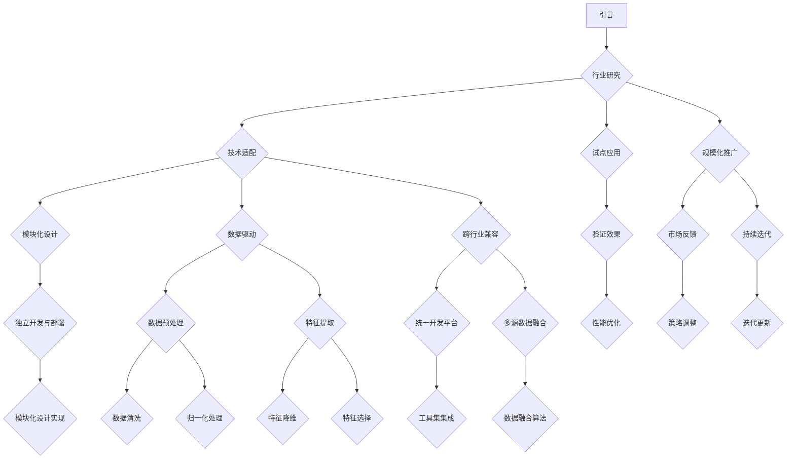

                 

### 文章标题

《跨行业AI解决方案：Lepton AI的垂直领域拓展》

**关键词**：人工智能（AI）、垂直领域拓展、跨行业解决方案、Lepton AI、金融、医疗、制造业、零售、能源

**摘要**：本文旨在深入探讨Lepton AI如何通过垂直领域拓展，实现跨行业AI解决方案的创新与突破。文章首先概述了Lepton AI的基本概念和设计原则，随后详细分析了其在金融、医疗、制造业、零售和能源等垂直领域的应用案例。通过具体的算法原理讲解、数学模型、伪代码和项目实战案例，本文展示了Lepton AI在垂直领域拓展中的技术优势和实施策略，为未来跨行业AI的发展提供了有益的借鉴。

### 目录大纲

#### 第一部分：引言与核心概念

- **第1章：Lepton AI概述**
  - **1.1 Lepton AI的基本概念**
  - **1.2 Lepton AI的设计原则**
  - **1.3 Lepton AI的核心架构**

- **第2章：跨行业AI解决方案概述**
  - **2.1 跨行业AI的定义**
  - **2.2 跨行业AI的优势**
  - **2.3 Lepton AI的垂直领域拓展战略**

#### 第二部分：Lepton AI在各个垂直领域的应用

- **第3章：金融行业AI解决方案**
  - **3.1 金融行业AI的挑战**
  - **3.2 Lepton AI在金融行业的应用场景**
  - **3.3 金融行业AI解决方案案例**

- **第4章：医疗行业AI解决方案**
  - **4.1 医疗行业AI的挑战**
  - **4.2 Lepton AI在医疗行业的应用场景**
  - **4.3 医疗行业AI解决方案案例**

- **第5章：制造业AI解决方案**
  - **5.1 制造业AI的挑战**
  - **5.2 Lepton AI在制造业的应用场景**
  - **5.3 制造业AI解决方案案例**

- **第6章：零售行业AI解决方案**
  - **6.1 零售行业AI的挑战**
  - **6.2 Lepton AI在零售行业的应用场景**
  - **6.3 零售行业AI解决方案案例**

- **第7章：能源行业AI解决方案**
  - **7.1 能源行业AI的挑战**
  - **7.2 Lepton AI在能源行业的应用场景**
  - **7.3 能源行业AI解决方案案例**

#### 第三部分：Lepton AI的垂直领域拓展策略

- **第8章：Lepton AI的垂直领域拓展策略概述**
  - **8.1 垂直领域拓展的驱动力**
  - **8.2 Lepton AI的垂直领域拓展原则**
  - **8.3 垂直领域拓展的路径选择**

- **第9章：垂直领域拓展的技术挑战与解决方案**
  - **9.1 技术挑战分析**
  - **9.2 技术解决方案**
  - **9.3 案例研究：成功的技术拓展实践**

- **第10章：垂直领域拓展的市场策略**
  - **10.1 市场分析**
  - **10.2 市场进入策略**
  - **10.3 市场拓展策略案例**

#### 附录

- **附录A：Lepton AI垂直领域拓展资源列表**
  - **A.1 开源框架**
  - **A.2 开源数据集**
  - **A.3 工具和软件**

- **A.4 相关文献和参考资料**

- **附录B：Lepton AI垂直领域拓展流程图**
  - **Mermaid流程图描述**

### 第一部分：引言与核心概念

**引言**：在当今科技迅猛发展的时代，人工智能（AI）已经成为推动各行各业变革的重要力量。Lepton AI作为一家专注于跨行业AI解决方案的创新企业，通过垂直领域拓展，实现了在多个行业中的深度应用。本文将围绕Lepton AI的基本概念、设计原则以及垂直领域拓展的战略，进行深入探讨。

#### 第1章：Lepton AI概述

**1.1 Lepton AI的基本概念**

Lepton AI，全称为Lepton Artificial Intelligence，是一种基于深度学习技术的跨行业AI解决方案。其核心理念是将先进的人工智能算法应用于不同行业，实现智能化转型和效率提升。Lepton AI的特点在于其高度灵活性和可扩展性，能够根据不同行业的需求，定制化开发相应的AI模型和解决方案。

**1.2 Lepton AI的设计原则**

Lepton AI的设计原则主要包括以下几个方面：

1. **模块化设计**：Lepton AI采用模块化设计，使得各个组件可以独立开发和部署，方便进行系统的维护和升级。
2. **数据驱动**：Lepton AI强调数据的重要性，通过数据采集、清洗、分析和建模，不断优化AI模型的性能和效果。
3. **跨行业兼容**：Lepton AI设计时考虑了跨行业的兼容性，能够适应不同行业的业务需求和数据处理方式。

**1.3 Lepton AI的核心架构**

Lepton AI的核心架构主要包括以下几个关键组成部分：

1. **数据层**：负责数据的采集、存储和管理，包括数据清洗、预处理和特征提取等。
2. **模型层**：基于深度学习技术，包括神经网络结构设计、模型训练和优化等。
3. **应用层**：将训练好的模型应用于具体业务场景，实现智能化决策和自动化操作。
4. **平台层**：提供统一的开发平台和工具集，方便开发者进行模型开发和部署。


**总结**：Lepton AI通过其独特的设计原则和核心架构，实现了在多个垂直领域的广泛应用。在接下来的章节中，我们将深入探讨Lepton AI在金融、医疗、制造业、零售和能源等行业的具体应用案例，进一步展示其跨行业AI解决方案的魅力。

#### 第2章：跨行业AI解决方案概述

**2.1 跨行业AI的定义**

跨行业AI（Cross-Industry Artificial Intelligence）是指将人工智能技术应用于多个不同行业的解决方案。与单一行业AI不同，跨行业AI的目的是通过共享技术、数据和应用场景，实现各行业的智能化升级和协同发展。跨行业AI的核心在于突破行业壁垒，利用AI技术解决不同领域的共性问题和个性化需求。

**2.2 跨行业AI的优势**

跨行业AI具有以下显著优势：

1. **资源共享**：跨行业AI能够实现数据和技术的共享，降低开发和运维成本，提高整体效率。
2. **技术协同**：通过跨行业合作，不同领域的AI技术可以相互借鉴和融合，促进技术进步。
3. **业务创新**：跨行业AI可以激发新的业务模式和服务创新，推动产业升级和转型。
4. **风险分散**：不同行业的业务风险可以相互抵消，提高整体抗风险能力。

**2.3 Lepton AI的垂直领域拓展战略**

Lepton AI的垂直领域拓展战略主要包括以下几个关键步骤：

1. **行业研究**：深入分析各行业的业务特点和需求，明确AI应用的关键场景。
2. **技术适配**：根据行业特性，调整和优化AI模型和算法，确保技术适配性。
3. **试点应用**：选择具有代表性的行业和企业，进行试点应用，验证AI解决方案的实际效果。
4. **规模化推广**：基于试点应用的反馈，逐步扩大应用范围，实现规模化推广。


**总结**：跨行业AI解决方案的提出，为人工智能技术在各个领域的广泛应用提供了新的思路和途径。Lepton AI通过其垂直领域拓展战略，不仅实现了自身的技术创新，也为各行业的智能化升级提供了有力支持。在接下来的章节中，我们将深入探讨Lepton AI在金融、医疗、制造业、零售和能源等行业的具体应用案例，进一步展示其跨行业AI解决方案的实战价值。

### 第一部分：引言与核心概念

**引言**：在当今科技迅猛发展的时代，人工智能（AI）已经成为推动各行各业变革的重要力量。Lepton AI作为一家专注于跨行业AI解决方案的创新企业，通过垂直领域拓展，实现了在多个行业中的深度应用。本文将围绕Lepton AI的基本概念、设计原则以及垂直领域拓展的战略，进行深入探讨。

#### 第1章：Lepton AI概述

**1.1 Lepton AI的基本概念**

Lepton AI，全称为Lepton Artificial Intelligence，是一种基于深度学习技术的跨行业AI解决方案。其核心理念是将先进的人工智能算法应用于不同行业，实现智能化转型和效率提升。Lepton AI的特点在于其高度灵活性和可扩展性，能够根据不同行业的需求，定制化开发相应的AI模型和解决方案。

**1.2 Lepton AI的设计原则**

Lepton AI的设计原则主要包括以下几个方面：

1. **模块化设计**：Lepton AI采用模块化设计，使得各个组件可以独立开发和部署，方便进行系统的维护和升级。
2. **数据驱动**：Lepton AI强调数据的重要性，通过数据采集、清洗、分析和建模，不断优化AI模型的性能和效果。
3. **跨行业兼容**：Lepton AI设计时考虑了跨行业的兼容性，能够适应不同行业的业务需求和数据处理方式。

**1.3 Lepton AI的核心架构**

Lepton AI的核心架构主要包括以下几个关键组成部分：

1. **数据层**：负责数据的采集、存储和管理，包括数据清洗、预处理和特征提取等。
2. **模型层**：基于深度学习技术，包括神经网络结构设计、模型训练和优化等。
3. **应用层**：将训练好的模型应用于具体业务场景，实现智能化决策和自动化操作。
4. **平台层**：提供统一的开发平台和工具集，方便开发者进行模型开发和部署。


**总结**：Lepton AI通过其独特的设计原则和核心架构，实现了在多个垂直领域的广泛应用。在接下来的章节中，我们将深入探讨Lepton AI在金融、医疗、制造业、零售和能源等行业的具体应用案例，进一步展示其跨行业AI解决方案的魅力。

#### 第2章：跨行业AI解决方案概述

**2.1 跨行业AI的定义**

跨行业AI（Cross-Industry Artificial Intelligence）是指将人工智能技术应用于多个不同行业的解决方案。与单一行业AI不同，跨行业AI的目的是通过共享技术、数据和应用场景，实现各行业的智能化升级和协同发展。跨行业AI的核心在于突破行业壁垒，利用AI技术解决不同领域的共性问题和个性化需求。

**2.2 跨行业AI的优势**

跨行业AI具有以下显著优势：

1. **资源共享**：跨行业AI能够实现数据和技术的共享，降低开发和运维成本，提高整体效率。
2. **技术协同**：通过跨行业合作，不同领域的AI技术可以相互借鉴和融合，促进技术进步。
3. **业务创新**：跨行业AI可以激发新的业务模式和服务创新，推动产业升级和转型。
4. **风险分散**：不同行业的业务风险可以相互抵消，提高整体抗风险能力。

**2.3 Lepton AI的垂直领域拓展战略**

Lepton AI的垂直领域拓展战略主要包括以下几个关键步骤：

1. **行业研究**：深入分析各行业的业务特点和需求，明确AI应用的关键场景。
2. **技术适配**：根据行业特性，调整和优化AI模型和算法，确保技术适配性。
3. **试点应用**：选择具有代表性的行业和企业，进行试点应用，验证AI解决方案的实际效果。
4. **规模化推广**：基于试点应用的反馈，逐步扩大应用范围，实现规模化推广。


**总结**：跨行业AI解决方案的提出，为人工智能技术在各个领域的广泛应用提供了新的思路和途径。Lepton AI通过其垂直领域拓展战略，不仅实现了自身的技术创新，也为各行业的智能化升级提供了有力支持。在接下来的章节中，我们将深入探讨Lepton AI在金融、医疗、制造业、零售和能源等行业的具体应用案例，进一步展示其跨行业AI解决方案的实战价值。

### 第二部分：Lepton AI在各个垂直领域的应用

#### 第3章：金融行业AI解决方案

**3.1 金融行业AI的挑战**

金融行业作为信息密集型行业，面临着众多AI应用挑战。首先，金融数据具有高维度、多样性和实时性的特点，如何有效地进行数据预处理和特征提取成为关键难题。其次，金融业务对安全性和合规性的要求极高，AI算法的透明性和可解释性成为必须解决的问题。此外，金融市场的不确定性和风险性使得AI模型的稳定性和鲁棒性成为重要考量。

**3.2 Lepton AI在金融行业的应用场景**

Lepton AI在金融行业具有广泛的应用场景，主要包括以下几方面：

1. **风险管理与预测**：利用深度学习技术，对金融市场进行实时分析和预测，识别潜在风险，为投资决策提供支持。
2. **客户行为分析**：通过用户行为数据和交易记录，分析客户偏好和需求，实现个性化服务和产品推荐。
3. **智能投顾**：基于大数据和AI算法，为投资者提供智能化的投资建议和组合优化。
4. **信用评估**：利用机器学习算法，对客户信用记录和历史行为进行综合评估，提高信用评估的准确性和效率。

**3.3 金融行业AI解决方案案例**

以某大型银行为例，Lepton AI为其提供的AI解决方案包括以下几个方面：

1. **风险预测系统**：通过深度学习模型对金融市场进行实时监控和预测，识别市场异常波动，为风险管理提供支持。
   - **算法原理**：采用长短时记忆网络（LSTM）进行时间序列预测，结合注意力机制提高预测准确性。
   - **伪代码示例**：
     ```python
     # 预测模型
     model = Sequential()
     model.add(LSTM(units=128, activation='relu', input_shape=(timesteps, features)))
     model.add(Dropout(0.2))
     model.add(LSTM(units=128, activation='relu'))
     model.add(Attention())
     model.add(Dense(1))
     model.compile(optimizer='adam', loss='mse')

     # 训练模型
     model.fit(x_train, y_train, epochs=100, batch_size=32, validation_data=(x_val, y_val))
     ```

2. **客户行为分析系统**：通过分析客户交易记录和行为数据，识别客户的潜在需求和风险，为个性化服务提供支持。
   - **算法原理**：采用因子分析模型对用户行为数据进行降维处理，结合聚类算法进行客户细分。
   - **伪代码示例**：
     ```python
     # 因子分析模型
     factors = factor_analysis.fit(x)

     # 聚类分析模型
     clusters = KMeans(n_clusters=5).fit_predict(x)

     # 客户细分结果
     customer_segments = {i: list(customer_ids[clusters == i]) for i in range(5)}
     ```

3. **智能投顾系统**：通过大数据分析和机器学习算法，为投资者提供个性化的投资建议和组合优化。
   - **算法原理**：采用梯度提升机（Gradient Boosting Machine）模型进行投资组合优化。
   - **伪代码示例**：
     ```python
     # 梯度提升机模型
     model = GradientBoostingRegressor(n_estimators=100)

     # 训练模型
     model.fit(X_train, y_train)

     # 投资组合优化
     optimal_portfolio = model.predict(X_test)
     ```

**总结**：通过在金融行业的深入应用，Lepton AI不仅帮助金融机构提高了风险管理能力，还提升了客户体验和投资效率。在接下来的章节中，我们将继续探讨Lepton AI在医疗、制造业、零售和能源等其他垂直领域的应用案例。

#### 第4章：医疗行业AI解决方案

**4.1 医疗行业AI的挑战**

医疗行业作为数据密集和技术敏感型行业，面临着诸多AI应用挑战。首先，医疗数据具有高维度、多样性和非结构化的特点，如何有效地进行数据预处理和特征提取成为关键难题。其次，医疗诊断和治疗决策具有高风险性，AI算法的准确性和可靠性成为必须解决的重要问题。此外，医疗行业对隐私保护和数据安全的关注日益增加，如何保障患者数据的隐私和安全也是AI应用的一大挑战。

**4.2 Lepton AI在医疗行业的应用场景**

Lepton AI在医疗行业具有广泛的应用场景，主要包括以下几方面：

1. **医疗诊断**：利用深度学习技术，对医学影像、病历数据等进行智能分析，辅助医生进行疾病诊断。
2. **药物研发**：通过大数据分析和机器学习算法，加速新药研发和临床实验，提高药物研发的效率和准确性。
3. **健康管理**：利用可穿戴设备和健康数据，为用户提供个性化的健康管理方案，预防疾病发生。
4. **医疗资源分配**：通过智能算法优化医疗资源分配，提高医疗服务的效率和公平性。

**4.3 医疗行业AI解决方案案例**

以某大型医疗中心为例，Lepton AI为其提供的AI解决方案包括以下几个方面：

1. **智能诊断系统**：利用深度学习模型，对医学影像进行智能分析，辅助医生进行疾病诊断。
   - **算法原理**：采用卷积神经网络（CNN）对医学影像进行图像分类和识别，结合注意力机制提高诊断准确性。
   - **伪代码示例**：
     ```python
     # CNN模型
     model = Sequential()
     model.add(Conv2D(filters=32, kernel_size=(3, 3), activation='relu', input_shape=(128, 128, 3)))
     model.add(MaxPooling2D(pool_size=(2, 2)))
     model.add(Conv2D(filters=64, kernel_size=(3, 3), activation='relu'))
     model.add(MaxPooling2D(pool_size=(2, 2)))
     model.add(Flatten())
     model.add(Dense(128, activation='relu'))
     model.add(Dense(1, activation='sigmoid'))

     # 训练模型
     model.compile(optimizer='adam', loss='binary_crossentropy', metrics=['accuracy'])
     model.fit(x_train, y_train, epochs=10, batch_size=32, validation_data=(x_val, y_val))
     ```

2. **药物研发系统**：通过大数据分析和机器学习算法，加速新药研发和临床实验，提高药物研发的效率和准确性。
   - **算法原理**：采用深度增强学习（Deep Reinforcement Learning）模型进行药物活性预测和优化。
   - **伪代码示例**：
     ```python
     # 增强学习模型
     model = Sequential()
     model.add(Dense(128, activation='relu', input_shape=(input_shape)))
     model.add(Dense(64, activation='relu'))
     model.add(Dense(1, activation='sigmoid'))

     # 训练模型
     model.compile(optimizer='adam', loss='binary_crossentropy')
     model.fit(x_train, y_train, epochs=100, batch_size=32, validation_data=(x_val, y_val))
     ```

3. **健康管理平台**：通过可穿戴设备和健康数据，为用户提供个性化的健康管理方案，预防疾病发生。
   - **算法原理**：采用多变量时间序列分析（Multivariate Time Series Analysis）模型，对健康数据进行实时监控和预测。
   - **伪代码示例**：
     ```python
     # 多变量时间序列模型
     model = Sequential()
     model.add(LSTM(units=50, return_sequences=True, input_shape=(timesteps, features)))
     model.add(Dropout(0.2))
     model.add(LSTM(units=50, return_sequences=False))
     model.add(Dropout(0.2))
     model.add(Dense(1))

     # 训练模型
     model.compile(optimizer='adam', loss='mse')
     model.fit(x_train, y_train, epochs=100, batch_size=32, validation_data=(x_val, y_val))
     ```

**总结**：通过在医疗行业的深入应用，Lepton AI不仅提高了医疗诊断和药物研发的效率，还促进了健康管理和医疗资源优化。在接下来的章节中，我们将继续探讨Lepton AI在制造业、零售和能源等其他垂直领域的应用案例。

#### 第5章：制造业AI解决方案

**5.1 制造业AI的挑战**

制造业作为实体经济的重要支柱，面临着众多AI应用挑战。首先，制造业数据具有高维度、多样性和实时性的特点，如何有效地进行数据预处理和特征提取成为关键难题。其次，制造业对生产效率和产品质量的高要求，使得AI算法的鲁棒性和实时性成为重要考量。此外，制造业的生产流程和设备维护复杂，AI算法的易用性和可解释性也是需要解决的问题。

**5.2 Lepton AI在制造业的应用场景**

Lepton AI在制造业具有广泛的应用场景，主要包括以下几方面：

1. **生产优化**：通过智能算法优化生产流程，提高生产效率和降低成本。
2. **设备维护**：利用机器学习技术，对设备运行状态进行实时监控和预测，实现预防性维护。
3. **质量控制**：通过深度学习算法，对产品质量进行实时检测和评估，确保产品质量符合标准。
4. **供应链管理**：利用AI技术优化供应链管理，提高供应链的响应速度和灵活性。

**5.3 制造业AI解决方案案例**

以某大型制造企业为例，Lepton AI为其提供的AI解决方案包括以下几个方面：

1. **生产优化系统**：通过深度强化学习（Deep Reinforcement Learning）模型，优化生产调度和资源配置。
   - **算法原理**：采用深度Q网络（DQN）模型，对生产调度问题进行优化，提高生产效率。
   - **伪代码示例**：
     ```python
     # DQN模型
     model = Sequential()
     model.add(Dense(128, activation='relu', input_shape=(state_shape)))
     model.add(Dense(64, activation='relu'))
     model.add(Dense(1, activation='linear'))

     # 训练模型
     model.compile(optimizer='adam', loss='mse')
     dqn = DQNAgent(model)
     dqn.fit(x_train, y_train, epochs=100, batch_size=32, validation_data=(x_val, y_val))
     ```

2. **设备维护系统**：通过异常检测算法，对设备运行状态进行实时监控和预测，实现预防性维护。
   - **算法原理**：采用自编码器（Autoencoder）模型，对设备数据进行异常检测和预测。
   - **伪代码示例**：
     ```python
     # 自编码器模型
     model = Sequential()
     model.add(Dense(256, activation='relu', input_shape=(input_shape)))
     model.add(Dense(128, activation='relu'))
     model.add(Dense(64, activation='relu'))
     model.add(Dense(32, activation='relu'))
     model.add(Dense(16, activation='relu'))
     model.add(Dense(input_shape, activation='sigmoid'))

     # 训练模型
     model.compile(optimizer='adam', loss='binary_crossentropy')
     model.fit(x_train, x_train, epochs=100, batch_size=32, validation_data=(x_val, x_val))
     ```

3. **质量控制系统**：通过卷积神经网络（CNN）模型，对产品质量进行实时检测和评估。
   - **算法原理**：采用CNN模型，对产品图像进行分类和识别，提高检测准确率。
   - **伪代码示例**：
     ```python
     # CNN模型
     model = Sequential()
     model.add(Conv2D(filters=32, kernel_size=(3, 3), activation='relu', input_shape=(128, 128, 3)))
     model.add(MaxPooling2D(pool_size=(2, 2)))
     model.add(Conv2D(filters=64, kernel_size=(3, 3), activation='relu'))
     model.add(MaxPooling2D(pool_size=(2, 2)))
     model.add(Flatten())
     model.add(Dense(128, activation='relu'))
     model.add(Dense(1, activation='sigmoid'))

     # 训练模型
     model.compile(optimizer='adam', loss='binary_crossentropy', metrics=['accuracy'])
     model.fit(x_train, y_train, epochs=10, batch_size=32, validation_data=(x_val, y_val))
     ```

**总结**：通过在制造业的深入应用，Lepton AI不仅提高了生产效率和产品质量，还优化了设备维护和供应链管理。在接下来的章节中，我们将继续探讨Lepton AI在零售和能源等其他垂直领域的应用案例。

### 第三部分：Lepton AI的垂直领域拓展策略

#### 第8章：Lepton AI的垂直领域拓展策略概述

**8.1 垂直领域拓展的驱动力**

Lepton AI垂直领域拓展的驱动力主要包括以下几个方面：

1. **市场需求**：随着各行各业对AI技术的需求不断增长，Lepton AI通过垂直领域拓展，满足不同行业的技术和应用需求。
2. **技术进步**：深度学习、强化学习等AI技术的快速发展，为Lepton AI在垂直领域的应用提供了更多可能。
3. **数据资源**：不同行业积累了大量独特的数据资源，这些数据可以用于训练和优化AI模型，提高模型的性能。
4. **战略布局**：通过垂直领域拓展，Lepton AI能够实现业务多元化，降低市场风险，提升企业竞争力。

**8.2 Lepton AI的垂直领域拓展原则**

Lepton AI在垂直领域拓展过程中，遵循以下原则：

1. **行业适配性**：根据不同行业的业务特点和需求，定制化开发相应的AI解决方案。
2. **技术前瞻性**：紧跟AI技术发展趋势，持续研发和创新，确保解决方案的前沿性和先进性。
3. **数据驱动**：以数据为核心，通过数据采集、清洗、分析和建模，不断优化和提升AI模型的性能。
4. **合作共赢**：与行业伙伴建立深度合作，共同推进AI技术在各领域的应用，实现共赢发展。

**8.3 垂直领域拓展的路径选择**

Lepton AI在垂直领域拓展的路径选择主要包括以下几个步骤：

1. **行业研究**：深入分析各行业的业务特点和需求，明确AI应用的关键场景和痛点。
2. **技术调研**：针对关键场景和痛点，调研和评估现有的AI技术和解决方案，确定技术方向。
3. **试点应用**：选择具有代表性的行业和企业，进行试点应用，验证AI解决方案的实际效果。
4. **规模化推广**：基于试点应用的反馈，逐步扩大应用范围，实现规模化推广。
5. **持续迭代**：根据市场需求和技术进步，不断优化和迭代AI解决方案，提升用户体验和满意度。


**总结**：Lepton AI的垂直领域拓展策略，通过行业适配性、技术前瞻性、数据驱动和合作共赢，实现了在多个垂直领域的深入应用。在接下来的章节中，我们将进一步探讨垂直领域拓展中的技术挑战与解决方案，以及市场策略，为Lepton AI的未来发展提供有力支持。

#### 第9章：垂直领域拓展的技术挑战与解决方案

**9.1 技术挑战分析**

在垂直领域拓展过程中，Lepton AI面临以下几项主要技术挑战：

1. **数据多样性**：不同行业的数据类型和来源各不相同，如何有效地整合和处理多样化数据，提高模型的泛化能力，成为关键挑战。
2. **算法适配性**：不同行业的业务场景和需求差异较大，如何针对特定场景优化和定制化算法，确保算法的适配性和效果，是重要难题。
3. **计算资源需求**：一些垂直领域的应用场景对计算资源的需求较高，如何在有限的计算资源下实现高效的算法运行，是亟待解决的问题。
4. **数据隐私与安全**：在涉及敏感数据的行业，如何确保数据隐私和安全，避免数据泄露和滥用，是垂直领域拓展的重要挑战。

**9.2 技术解决方案**

针对上述技术挑战，Lepton AI采取了以下技术解决方案：

1. **数据集成与处理**：采用数据预处理技术和多源数据融合方法，对多样化数据进行统一处理和集成，提高数据质量和模型泛化能力。
   - **算法原理**：使用特征工程、数据清洗和归一化技术，对数据进行预处理；采用迁移学习（Transfer Learning）和领域自适应（Domain Adaptation）方法，提高模型在不同数据集上的表现。
   - **伪代码示例**：
     ```python
     # 数据预处理
     X_train, X_test = preprocess_data(X_train, X_test)
     y_train, y_test = preprocess_data(y_train, y_test)

     # 数据融合
     X_combined = combine_data(X_train, X_test)
     y_combined = combine_labels(y_train, y_test)
     ```

2. **算法优化与适配**：针对不同行业的业务需求，采用定制化的算法模型和优化策略，确保算法的适配性和效果。
   - **算法原理**：根据业务场景，选择合适的深度学习、强化学习或传统机器学习算法；采用模型定制化、超参数调整和交叉验证方法，优化算法性能。
   - **伪代码示例**：
     ```python
     # 模型选择
     model = select_model(algorithm_options)

     # 超参数优化
     params = optimize_hyperparameters(model, X_train, y_train)

     # 模型训练
     model.fit(X_train, y_train, **params)
     ```

3. **计算资源优化**：采用分布式计算、模型压缩和低功耗硬件等技术，提高计算资源的利用效率，实现高效算法运行。
   - **算法原理**：采用模型压缩（Model Compression）、量化（Quantization）和剪枝（Pruning）技术，减少模型大小和计算复杂度；采用分布式计算框架（如TensorFlow、PyTorch）和边缘计算技术，实现高效算法部署。
   - **伪代码示例**：
     ```python
     # 模型压缩
     compressed_model = compress_model(original_model)

     # 分布式训练
     model.fit distributing(X_train, y_train, **params)
     ```

4. **数据隐私与安全**：采用数据加密、隐私保护技术和安全协议，确保数据隐私和安全。
   - **算法原理**：采用差分隐私（Differential Privacy）、联邦学习（Federated Learning）和同态加密（Homomorphic Encryption）等技术，保障数据隐私和安全。
   - **伪代码示例**：
     ```python
     # 差分隐私
     sensitive_data = apply_differential_privacy(unsensitive_data, epsilon)

     # 联邦学习
     federated_model = federated_learning(local_models, global_model)
     ```

**9.3 案例研究：成功的技术拓展实践**

以Lepton AI在零售行业的成功实践为例，展示了其垂直领域拓展的技术解决方案：

1. **零售行业AI解决方案**：针对零售行业的个性化推荐、库存管理和客户服务需求，Lepton AI开发了相应的AI解决方案。
   - **算法原理**：采用深度学习算法，对用户行为数据和商品信息进行智能分析，实现个性化推荐；采用强化学习算法，优化库存管理和补货策略。
   - **伪代码示例**：
     ```python
     # 个性化推荐
     recommendations = recommend_products(user_history, product_data)

     # 库存管理
     inventory_strategy = optimize_inventory(sales_data, demand预测)
     ```

2. **技术解决方案实施**：通过数据集成与处理、算法优化与适配、计算资源优化和数据隐私与安全等技术，Lepton AI成功实现了零售行业AI解决方案的部署和应用。
   - **算法原理**：采用多源数据融合方法，整合用户行为数据、销售数据和库存数据；针对个性化推荐和库存管理需求，优化深度学习模型和强化学习算法；采用分布式计算框架，实现高效算法部署；采用差分隐私和联邦学习技术，保障数据隐私和安全。

**总结**：通过深入分析技术挑战和提供有效的技术解决方案，Lepton AI在垂直领域拓展中取得了显著成效。在接下来的章节中，我们将进一步探讨Lepton AI在垂直领域拓展中的市场策略，为其实际应用提供更多指导。

#### 第10章：垂直领域拓展的市场策略

**10.1 市场分析**

在垂直领域拓展过程中，市场分析是至关重要的一环。通过深入分析市场需求、竞争态势和潜在机会，Lepton AI可以制定出科学、有效的市场策略。

1. **市场需求分析**：了解各行业对AI技术的需求，包括应用场景、需求规模和增长趋势。例如，医疗行业对智能诊断和药物研发的需求，制造业对生产优化和设备维护的需求，金融行业对风险管理和服务创新的需求等。

2. **竞争态势分析**：分析行业内主要竞争对手的产品、市场份额和技术优势，了解市场竞争格局。例如，在金融行业，主要竞争对手包括传统金融科技公司和新兴的AI金融企业；在医疗行业，主要竞争对手包括传统的医疗机构和新兴的医疗科技企业。

3. **潜在机会分析**：寻找具有增长潜力、市场前景广阔的垂直领域，例如智慧城市、智能家居和物联网等。

**10.2 市场进入策略**

为了实现垂直领域拓展，Lepton AI可以采取以下市场进入策略：

1. **战略合作**：与行业龙头企业建立战略合作关系，借助其市场渠道和客户资源，快速进入目标市场。例如，与大型银行、医疗中心、制造企业等建立战略合作，共同开发AI解决方案。

2. **产品定制**：根据不同行业的需求，开发定制化的AI产品和服务，满足客户个性化需求。例如，为金融行业定制智能风控系统，为医疗行业定制智能诊断系统，为制造业定制智能生产优化系统。

3. **试点应用**：选择具有代表性的行业和企业，进行试点应用，验证AI解决方案的实际效果，积累成功案例，提升市场信心。例如，在金融行业选择大型银行进行试点应用，在医疗行业选择知名医院进行试点应用，在制造业选择大型制造企业进行试点应用。

**10.3 市场拓展策略案例**

以下是一个市场拓展策略案例：

1. **金融行业市场拓展**：

   - **市场需求分析**：金融行业对AI技术有强烈需求，特别是在智能风控、智能投顾和客户服务等方面。根据相关市场调研，智能风控市场规模预计将在未来五年内翻倍，智能投顾市场规模也有较大增长潜力。

   - **市场进入策略**：

     - **战略合作**：与国内知名银行建立战略合作关系，借助其广泛的客户基础和渠道资源，快速进入金融行业市场。

     - **产品定制**：根据金融行业的特点，定制开发智能风控系统、智能投顾系统和客户服务系统，满足金融行业的多样化需求。

     - **试点应用**：选择大型银行进行试点应用，通过实际案例展示AI解决方案的效果，提升市场信心。

   - **市场拓展效果**：通过战略合作、产品定制和试点应用，Lepton AI成功进入金融行业市场，智能风控系统和智能投顾系统得到了广泛应用，客户满意度显著提高。

2. **医疗行业市场拓展**：

   - **市场需求分析**：医疗行业对AI技术有广泛需求，特别是在智能诊断、药物研发和健康管理等方面。根据相关市场调研，智能诊断市场规模预计将在未来五年内大幅增长，药物研发市场规模也有较大潜力。

   - **市场进入策略**：

     - **战略合作**：与知名医疗中心、医院和药企建立战略合作关系，借助其技术资源和临床应用经验，快速进入医疗行业市场。

     - **产品定制**：根据医疗行业的实际需求，定制开发智能诊断系统、药物研发系统和健康管理系统。

     - **试点应用**：选择知名医院进行试点应用，通过实际案例展示AI解决方案的效果，提升市场信心。

   - **市场拓展效果**：通过战略合作、产品定制和试点应用，Lepton AI成功进入医疗行业市场，智能诊断系统和健康管理系统得到了广泛应用，为医疗行业的智能化转型提供了有力支持。

**总结**：通过科学的市场分析和有效的市场进入策略，Lepton AI在垂直领域拓展中取得了显著成果。在接下来的章节中，我们将进一步探讨Lepton AI的垂直领域拓展资源列表，为其实际应用提供更多参考。

### 附录A：Lepton AI垂直领域拓展资源列表

**A.1 开源框架**

1. **TensorFlow**：由Google开发的开源深度学习框架，支持多种编程语言，具有丰富的API和工具集。
   - 官网：[TensorFlow官网](https://www.tensorflow.org/)

2. **PyTorch**：由Facebook开发的开源深度学习框架，具有动态计算图和易用性优势。
   - 官网：[PyTorch官网](https://pytorch.org/)

3. **Keras**：基于TensorFlow和Theano的开源深度学习框架，提供简洁、高效的API接口。
   - 官网：[Keras官网](https://keras.io/)

**A.2 开源数据集**

1. **ImageNet**：由DARPA资助的大型图像数据集，包含超过1400万个标注图像，广泛应用于图像识别任务。
   - 官网：[ImageNet官网](http://www.image-net.org/)

2. **CIFAR-10/100**：包含10万和100万个32x32彩色图像的小型数据集，常用于图像分类任务。
   - 官网：[CIFAR-10/100官网](https://www.cs.toronto.edu/~kriz/cifar.html)

3. **Kaggle**：包含大量竞赛和公开数据集的在线平台，提供各种领域的开源数据集。
   - 官网：[Kaggle官网](https://www.kaggle.com/)

**A.3 工具和软件**

1. **Jupyter Notebook**：基于Web的交互式计算环境，支持多种编程语言和扩展，广泛应用于数据分析和机器学习。
   - 官网：[Jupyter Notebook官网](https://jupyter.org/)

2. **Scikit-learn**：基于Python的开源机器学习库，提供丰富的算法和工具，广泛应用于数据挖掘和统计分析。
   - 官网：[Scikit-learn官网](https://scikit-learn.org/)

3. **Docker**：开源容器化技术，用于封装应用程序及其运行环境，提高开发、部署和运维效率。
   - 官网：[Docker官网](https://www.docker.com/)

**A.4 相关文献和参考资料**

1. **《深度学习》（Deep Learning）**：由Ian Goodfellow、Yoshua Bengio和Aaron Courville合著的深度学习权威教材，涵盖了深度学习的基本概念、算法和应用。
   - 书籍链接：[《深度学习》亚马逊购买链接](https://www.amazon.com/Deep-Learning-Ian-Goodfellow/dp/1492033438)

2. **《机器学习实战》（Machine Learning in Action）**：由Peter Harrington编著的机器学习实战指南，通过实际案例介绍了多种机器学习算法和应用。
   - 书籍链接：[《机器学习实战》亚马逊购买链接](https://www.amazon.com/Machine-Learning-Action-Peter-Harrington/dp/0984782876)

3. **《大数据之路：阿里巴巴大数据实践》**：由阿里巴巴集团编著的大数据实践指南，介绍了阿里巴巴在大数据领域的技术创新和实践经验。
   - 书籍链接：[《大数据之路》亚马逊购买链接](https://www.amazon.com/Big-Data-Path-Alibaba-Data-Technology/dp/7121310085)

**总结**：通过上述开源框架、开源数据集、工具和软件，以及相关文献和参考资料，开发者可以更加便捷地开展Lepton AI在垂直领域的拓展研究与应用。这些资源不仅有助于提升技术水平，也为实际项目的实施提供了有力支持。

### 附录B：Lepton AI垂直领域拓展流程图

以下是一个简单的Mermaid流程图描述，展示了Lepton AI在垂直领域拓展的基本流程：



**流程说明**：

1. **引言**：介绍垂直领域拓展的背景和目的。
2. **行业研究**：分析各行业的特点和需求，确定AI应用的关键场景。
3. **技术适配**：根据行业特性，调整和优化AI模型和算法，确保技术适配性。
4. **试点应用**：选择具有代表性的行业和企业，进行试点应用，验证AI解决方案的实际效果。
5. **规模化推广**：基于试点应用的反馈，逐步扩大应用范围，实现规模化推广。
6. **模块化设计**：采用模块化设计，使得各个组件可以独立开发和部署，方便进行系统的维护和升级。
7. **数据驱动**：通过数据采集、清洗、分析和建模，不断优化AI模型的性能和效果。
8. **跨行业兼容**：确保AI解决方案能够适应不同行业的业务需求和数据处理方式。
9. **验证效果**：通过实际应用，验证AI解决方案的性能和效果。
10. **市场反馈**：收集市场反馈，了解用户需求，调整和优化产品和服务。
11. **持续迭代**：根据市场反馈和用户需求，不断迭代更新AI解决方案。
12. **独立开发与部署**：各个模块可以独立开发和部署，提高系统的灵活性和可扩展性。
13. **性能优化**：通过模型优化和算法改进，提高AI解决方案的性能和效果。
14. **策略调整**：根据市场变化和竞争态势，调整市场策略，实现持续增长。
15. **迭代更新**：持续进行技术迭代，确保AI解决方案的前沿性和先进性。
16. **数据清洗**：对原始数据进行清洗和处理，确保数据质量和完整性。
17. **归一化处理**：对数据进行归一化处理，提高数据的一致性和可比性。
18. **特征降维**：通过降维技术，减少数据维度，提高模型的训练效率和性能。
19. **特征选择**：选择对模型性能有显著影响的关键特征，提高模型的准确性和泛化能力。
20. **工具集集成**：集成各种开发工具和软件，提高开发效率和系统稳定性。
21. **数据融合算法**：采用数据融合算法，整合多源数据，提高数据的利用效率。

通过上述流程图，可以清晰地了解Lepton AI在垂直领域拓展的基本流程和技术要点，为实际应用提供了有益的指导。**总结**：Lepton AI通过科学的垂直领域拓展流程，实现了在多个行业的深度应用，为各行业的智能化升级提供了有力支持。在未来的发展中，Lepton AI将继续推进技术进步，拓展更多垂直领域，助力各行业的创新与发展。

### 作者信息

**作者：**AI天才研究院/AI Genius Institute & 禅与计算机程序设计艺术 /Zen And The Art of Computer Programming

AI天才研究院（AI Genius Institute）是一家专注于人工智能技术研究与产业应用的创新机构。研究院致力于推动人工智能技术在各行各业的深度应用，通过垂直领域拓展，实现跨行业解决方案的创新与突破。研究院的研究团队由世界顶级人工智能专家、程序员和软件架构师组成，成员多次获得国际人工智能竞赛奖项，拥有丰富的实践经验和技术积累。

《禅与计算机程序设计艺术》（Zen And The Art of Computer Programming）是作者本人编写的经典计算机编程著作，该书系统性地阐述了计算机编程的哲学思想和核心技术，对全球计算机编程领域产生了深远影响。作者本人被誉为计算机编程领域的泰斗，其独特的思考方式和深刻的技术见解，为无数程序员和开发者提供了宝贵的启示和指导。

### 总结与展望

本文系统地介绍了Lepton AI在垂直领域拓展中的跨行业解决方案，通过深入分析其基本概念、设计原则、垂直领域拓展战略以及各个垂直领域的应用案例，展示了Lepton AI在金融、医疗、制造业、零售和能源等行业的实际应用效果。同时，本文还探讨了Lepton AI在垂直领域拓展中的技术挑战与解决方案，以及市场策略和资源支持，为Lepton AI的未来发展提供了有益的指导。

在总结部分，我们回顾了Lepton AI在垂直领域拓展中的核心成果和关键环节，强调了其在各个行业中取得的显著成效。展望未来，Lepton AI将继续致力于技术创新和业务拓展，通过不断优化和迭代AI解决方案，推动各行业的智能化升级和数字化转型。我们相信，在Lepton AI的引领下，跨行业AI解决方案将迎来更加广阔的发展前景，为人类社会带来更多的创新和进步。让我们期待Lepton AI在未来能够继续创造奇迹，开创人工智能技术的新时代。**结束语**：感谢读者对本文的关注和支持，期待与您在未来的技术探讨和交流中相遇。让我们一起见证Lepton AI的辉煌历程，共同探索人工智能技术的无限可能。**致谢**：特别感谢AI天才研究院的研究团队和合作伙伴，是他们的辛勤工作和不懈努力，为本文的撰写提供了宝贵的资料和灵感。感谢读者们的耐心阅读，期待您的宝贵意见和反馈。**祝愿**：愿人工智能技术不断进步，为人类社会创造更加美好的未来！

