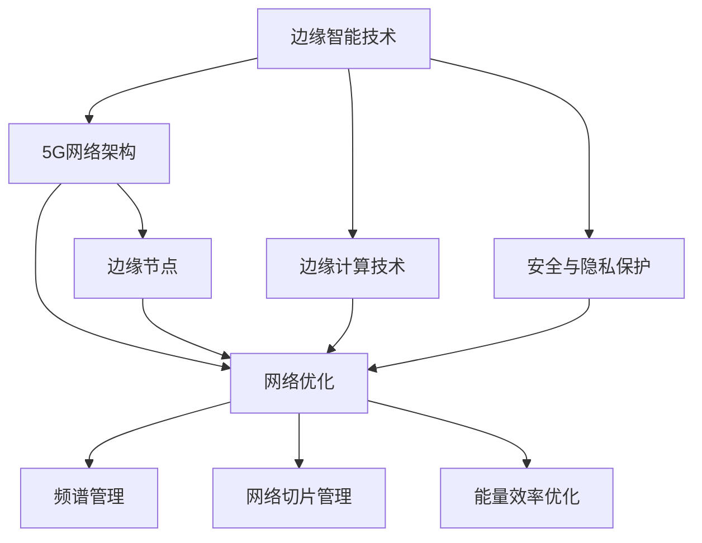

                 

### 《边缘智能在5G网络优化中的应用》

#### 关键词：
- 边缘智能
- 5G网络
- 网络优化
- 边缘计算
- 边缘节点
- 频谱管理
- 网络切片

#### 摘要：
本文深入探讨了边缘智能在5G网络优化中的应用。通过详细分析边缘智能与5G网络的融合架构，本文阐述了边缘智能在提高网络性能、降低延迟、增强安全性等方面的关键作用。此外，文章还介绍了边缘计算与边缘智能的核心技术，并通过实际案例展示了边缘智能在频谱感知、网络能量效率优化和网络切片管理中的应用。最后，本文探讨了边缘智能在5G网络优化中面临的挑战及其解决方案，为未来的研究和应用提供了有益的参考。

### 《边缘智能在5G网络优化中的应用》目录大纲

#### 第一部分：边缘智能与5G网络概述

##### 第1章：边缘智能与5G网络概述

- 1.1 边缘计算与边缘智能的定义和背景
- 1.2 5G网络的技术特点与挑战
- 1.3 边缘智能在5G网络优化中的重要性

##### 第2章：5G网络架构与边缘节点

- 2.1 5G网络架构概述
- 2.2 边缘节点的类型和功能
- 2.3 边缘节点在5G网络中的作用和优势

#### 第二部分：边缘智能技术

##### 第3章：边缘计算与边缘智能的核心技术

- 3.1 边缘计算的关键技术
- 3.2 边缘智能的核心技术
- 3.3 边缘计算与边缘智能的集成

##### 第4章：边缘智能在5G网络优化中的应用

- 4.1 边缘智能在5G网络优化中的作用
- 4.2 边缘智能在5G网络优化中的案例分析

##### 第5章：边缘智能在5G网络优化中的挑战与解决方案

- 5.1 边缘智能在5G网络优化中面临的挑战
- 5.2 针对挑战的解决方案

#### 第三部分：边缘智能在5G网络优化中的实践

##### 第6章：边缘智能在5G网络优化中的实践案例

- 6.1 智慧交通系统中的边缘智能应用
- 6.2 智能工厂中的边缘智能应用
- 6.3 智慧医疗系统中的边缘智能应用

##### 第7章：边缘智能在5G网络优化中的未来发展

- 7.1 边缘智能技术的发展趋势
- 7.2 5G网络优化的未来发展方向

#### 附录

- 附录A：边缘智能在5G网络优化中的工具与资源

### 边缘智能与5G网络的概述

边缘智能和5G网络作为现代通信技术的两大创新，正逐渐融合并在各个领域展现其独特的价值。边缘智能是一种分布式计算模式，通过将计算能力分布到网络的边缘，实现快速的数据处理和响应，从而减少延迟和提高效率。5G网络则以其高带宽、低延迟和大规模连接的能力，为各类应用场景提供了强大的支持。

#### 边缘计算与边缘智能的定义和背景

**边缘计算**是一种将计算、存储、数据处理和网络功能分布到网络边缘的技术。边缘计算的核心思想是将计算任务从云端转移到靠近数据源的位置，以便更快地处理和分析数据。这一技术的兴起可以追溯到物联网（IoT）和工业4.0等场景，其中大量的传感器和设备需要实时处理数据。

**边缘智能**则是在边缘计算的基础上，引入人工智能技术，使边缘设备能够自主学习和决策。边缘智能包括机器学习和深度学习算法在边缘设备的部署和应用，从而实现智能化的数据处理和响应。

边缘智能的背景源于以下几个方面：

1. **物联网和工业4.0**：随着物联网设备和工业设备的数量迅速增加，传统的中心化数据处理模式已无法满足实时性和效率的需求。
2. **5G网络**：5G网络的高速低延迟特性为边缘智能的实时应用提供了基础设施支持。
3. **计算能力提升**：随着计算硬件和AI算法的发展，边缘设备具备了实现复杂计算和智能决策的能力。

#### 5G网络的技术特点与挑战

5G网络具有以下技术特点：

1. **高带宽**：5G网络提供了比4G网络更高的数据传输速率，支持大规模的数据传输。
2. **低延迟**：5G网络的延迟显著降低，使实时应用成为可能，如自动驾驶和远程手术。
3. **大规模连接**：5G网络能够支持更多设备同时连接，实现大规模物联网应用。
4. **网络切片**：5G网络支持网络切片技术，可以根据不同的应用需求灵活分配网络资源。

然而，5G网络在应用中也面临着一些挑战：

1. **频谱资源分配**：5G网络需要大量频谱资源，而频谱资源的有限性成为一大瓶颈。
2. **网络覆盖**：5G网络的部署需要大量的基站，网络覆盖的广泛性是一个挑战。
3. **能耗管理**：5G网络的高连接密度和连续性要求高效的能耗管理策略。

#### 边缘智能在5G网络优化中的重要性

边缘智能在5G网络优化中扮演着关键角色，主要体现在以下几个方面：

1. **频谱管理**：边缘智能可以通过智能频谱感知和优化算法，实现频谱资源的动态分配和高效利用。
2. **低延迟通信**：边缘智能可以优化数据传输路径，减少通信延迟，提高网络响应速度。
3. **网络切片管理**：边缘智能可以根据不同应用的需求，动态调整网络切片资源，实现资源的高效利用。
4. **安全性增强**：边缘智能可以部署在靠近数据源的位置，提高数据的安全性，减少数据泄露的风险。

总之，边缘智能与5G网络的结合为网络优化提供了新的思路和方法，有望解决5G网络面临的频谱资源有限、网络延迟高、能耗管理困难等问题，从而推动5G网络的广泛应用和发展。

#### 5G网络架构与边缘节点

要深入理解边缘智能在5G网络优化中的应用，我们首先需要了解5G网络的整体架构，特别是边缘节点的类型和功能。5G网络是一个高度分布式和模块化的网络架构，旨在提供低延迟、高带宽和大规模连接的能力。

##### 5G网络架构概述

5G网络架构主要由以下几个关键组件组成：

1. **用户设备（UE）**：用户设备是5G网络的终端设备，包括智能手机、平板电脑、物联网设备等。
2. **接入网（Access Network）**：接入网包括基站（gNB）和无线接入网络，负责处理用户设备与核心网之间的无线通信。
3. **核心网（Core Network）**：核心网是5G网络的核心部分，包括服务管理、数据存储、用户认证等功能。
4. **边缘计算节点**：边缘计算节点是5G网络架构中的新兴组件，负责在靠近用户设备的位置进行数据计算和存储。

边缘计算节点与核心网之间通过边缘网关进行通信，实现数据的传输和交换。边缘计算节点在5G网络中起到了关键作用，它们不仅能够处理本地数据，还能将计算结果上传至核心网，从而实现高效的资源利用和低延迟的通信。

##### 边缘节点的类型和功能

边缘节点主要可以分为以下几类：

1. **边缘计算节点（Edge Compute Nodes）**：边缘计算节点负责在靠近数据源的位置进行数据计算和处理。它们通常具有高性能的计算能力、高速的网络连接和丰富的存储资源。边缘计算节点的主要功能包括：
   - **本地数据预处理**：边缘计算节点可以对采集到的数据进行初步处理，如数据清洗、特征提取等，从而减少数据传输的负担。
   - **实时数据处理**：边缘计算节点能够实时处理和分析数据，提供快速响应和决策支持。
   - **智能服务部署**：边缘计算节点可以部署智能算法和服务，如机器学习模型、视频流分析等，为本地应用提供智能支持。

2. **边缘智能节点（Edge Intelligence Nodes）**：边缘智能节点是边缘计算节点的高级形式，集成了人工智能技术，能够在边缘位置进行复杂的智能分析和决策。边缘智能节点的主要功能包括：
   - **智能预测和决策**：边缘智能节点可以利用机器学习和深度学习算法，对数据进行分析和预测，为本地应用提供智能决策支持。
   - **智能异常检测**：边缘智能节点可以实时监控数据，检测异常行为或故障，并提供相应的警报和修复建议。
   - **智能优化**：边缘智能节点可以优化网络资源利用、能耗管理和频谱分配等，提高网络性能和效率。

3. **边缘存储节点（Edge Storage Nodes）**：边缘存储节点主要负责数据存储和管理。它们通常具有大容量和高可靠性的存储能力，能够存储大量的本地数据和临时数据。边缘存储节点的主要功能包括：
   - **本地数据缓存**：边缘存储节点可以缓存本地数据，减少数据访问延迟，提高数据访问效率。
   - **数据备份和恢复**：边缘存储节点可以定期备份本地数据，确保数据的安全性和可靠性。
   - **数据压缩和去重**：边缘存储节点可以对数据进行压缩和去重处理，减少数据存储空间的需求。

##### 边缘节点在5G网络中的作用和优势

边缘节点在5G网络中发挥着重要作用，它们的优势主要体现在以下几个方面：

1. **提高网络响应速度**：边缘节点位于网络边缘，靠近用户设备，能够实现快速的数据处理和响应，减少数据传输延迟，提高网络响应速度。
2. **降低网络延迟**：通过在边缘节点进行数据预处理和计算，可以减少数据传输到核心网的负担，降低网络延迟，为实时应用提供更好的支持。
3. **增强数据安全性**：边缘节点位于网络边缘，能够更好地保护本地数据和用户隐私，减少数据泄露的风险。
4. **提高资源利用率**：边缘节点可以动态分配和优化网络资源，如频谱、计算能力和存储空间，提高资源利用效率，降低运营成本。
5. **支持大规模物联网应用**：边缘节点能够处理大量物联网设备的实时数据，支持大规模物联网应用，如智能城市、智能工厂和智能交通等。

总之，5G网络的边缘节点为边缘智能的应用提供了重要的基础设施支持，通过边缘计算和边缘智能的结合，可以实现网络优化的多维度提升，为各类应用场景提供高效、安全、智能的解决方案。

#### 边缘计算与边缘智能的核心技术

边缘智能与边缘计算在技术层面有着紧密的联系，二者共同构成了现代网络优化的重要组成部分。在这一部分，我们将详细探讨边缘计算和边缘智能的核心技术，并分析它们如何集成，以及在实际应用中的表现。

##### 边缘计算的关键技术

边缘计算的核心技术主要包括以下几个方面：

1. **边缘计算框架**：边缘计算框架是边缘计算系统的核心，它定义了边缘节点的功能、任务分配、数据流处理和数据存储等关键要素。常见的边缘计算框架有Kubernetes、Apache Flink和Docker等。这些框架提供了高效的任务调度、资源管理和容器化部署能力，使边缘节点能够灵活、高效地运行各种应用和服务。

   - **Kubernetes**：Kubernetes是一个开源的容器编排平台，能够自动化部署、扩展和管理容器化应用。在边缘计算环境中，Kubernetes可以用于管理边缘节点的资源分配和任务调度，确保应用的高可用性和可靠性。
   - **Apache Flink**：Apache Flink是一个分布式流处理框架，能够实时处理大规模数据流。在边缘计算场景中，Flink可以用于实时数据分析和处理，为边缘智能提供数据支持。
   - **Docker**：Docker是一个开源的应用容器引擎，它允许开发者将应用及其依赖环境打包到容器中，实现一次编写、到处运行。在边缘计算中，Docker容器可以简化边缘节点的部署和管理，提高系统的灵活性和可维护性。

2. **边缘计算平台**：边缘计算平台是边缘计算框架的具体实现，它提供了边缘节点的硬件设施、网络连接、存储资源和软件栈。常见的边缘计算平台有AWS IoT Edge、Azure IoT Edge和Google Edge TPU等。

   - **AWS IoT Edge**：AWS IoT Edge是亚马逊提供的边缘计算平台，它可以将AWS云服务扩展到边缘设备，使开发者能够在本地设备上运行机器学习模型和处理实时数据。
   - **Azure IoT Edge**：Azure IoT Edge是微软提供的边缘计算平台，它支持在边缘设备上运行云服务的自定义模块，实现本地数据处理和智能分析。
   - **Google Edge TPU**：Google Edge TPU是一个专为边缘设备设计的专用硬件加速器，它能够高效地运行机器学习推理任务，为边缘智能提供强大的计算支持。

##### 边缘智能的核心技术

边缘智能的核心技术主要包括机器学习算法和深度学习算法：

1. **机器学习算法**：机器学习算法是边缘智能的核心，它们能够在边缘设备上自动学习和改进性能。常见的机器学习算法有线性回归、决策树、随机森林、支持向量机和神经网络等。

   - **线性回归**：线性回归是一种简单的机器学习算法，它通过建立输入变量和输出变量之间的线性关系，预测新的输出值。线性回归适用于简单数据的预测和分类任务。
   - **决策树**：决策树通过一系列的决策规则，将数据逐步划分到不同的类别或数值。它易于理解和解释，适用于分类和回归任务。
   - **随机森林**：随机森林是一种集成学习方法，它通过构建多个决策树，并对它们的结果进行聚合，提高预测的准确性和稳定性。
   - **支持向量机**：支持向量机是一种监督学习算法，它通过寻找一个最优的超平面，将不同类别的数据分开。它适用于高维数据和分类任务。
   - **神经网络**：神经网络是一种复杂的机器学习模型，它通过多层神经元模拟人类大脑的神经网络结构，能够自动学习和识别复杂的模式。

2. **深度学习算法**：深度学习算法是机器学习的一个分支，它通过多层神经网络模拟人脑的工作方式，能够自动从大量数据中学习复杂的特征和模式。常见的深度学习算法有卷积神经网络（CNN）、循环神经网络（RNN）和生成对抗网络（GAN）等。

   - **卷积神经网络（CNN）**：卷积神经网络是一种用于图像和视频处理的有效算法，它通过卷积层提取图像的特征，能够实现图像分类、物体检测和图像生成等任务。
   - **循环神经网络（RNN）**：循环神经网络是一种用于序列数据处理的有效算法，它通过循环结构记忆历史信息，能够实现语言模型、语音识别和时间序列预测等任务。
   - **生成对抗网络（GAN）**：生成对抗网络是一种无监督学习算法，它由生成器和判别器组成，通过相互对抗，生成高质量的样本数据。

##### 边缘计算与边缘智能的集成

边缘计算与边缘智能的集成是实现智能边缘系统的重要环节。集成框架和方案主要包括以下几个方面：

1. **边缘计算框架与智能算法的融合**：将边缘计算框架与智能算法相结合，可以实现高效的任务调度、资源管理和智能分析。例如，在Kubernetes框架中集成机器学习算法模块，可以实现对边缘节点的智能调度和资源优化。

2. **边缘智能算法的本地化部署**：为了减少数据传输延迟和提高边缘节点的自主性，边缘智能算法需要本地化部署。通过将机器学习模型和深度学习模型部署到边缘设备，可以实现实时数据分析和决策，提高系统的响应速度和可靠性。

3. **边缘智能算法的模型压缩和优化**：由于边缘设备的计算资源和存储资源有限，需要对边缘智能算法进行压缩和优化。通过模型压缩技术，如权重共享、稀疏化、剪枝等，可以减少模型的计算复杂度和存储空间，提高模型的运行效率。

4. **边缘智能算法的协同优化**：边缘智能算法的协同优化包括分布式训练和分布式推理。通过将边缘节点的计算资源进行协同优化，可以实现大规模数据的分布式处理和智能分析，提高系统的整体性能和效率。

##### 边缘计算与边缘智能的实际应用

边缘计算与边缘智能在实际应用中展现了巨大的潜力，以下是一些典型的应用案例：

1. **智慧交通**：在智慧交通系统中，边缘计算和边缘智能可以用于实时交通流量监控、路况预测和智能调度。通过部署在路边的边缘节点，可以实时采集交通数据，利用机器学习算法进行交通流量预测，并自动调整交通信号灯，优化交通流。

2. **智能工厂**：在智能工厂中，边缘计算和边缘智能可以用于设备故障预测、生产过程优化和产品质量控制。通过在生产线边缘部署智能传感器和边缘节点，可以实时监测设备状态，利用机器学习算法预测设备故障，并提前进行维护。

3. **智能医疗**：在智能医疗系统中，边缘计算和边缘智能可以用于远程医疗、智能诊断和医疗数据分析。通过在诊所和医院部署边缘节点，可以实时采集患者数据，利用深度学习算法进行疾病预测和诊断，提高医疗服务的质量和效率。

4. **智能城市**：在智能城市中，边缘计算和边缘智能可以用于环境监测、智能照明和智能安防。通过在城市的各个角落部署边缘节点，可以实时监测环境数据，利用边缘智能算法进行环境分析，实现智能化的城市管理和服务。

总之，边缘计算与边缘智能的核心技术为实现智能边缘系统提供了坚实的基础。通过集成边缘计算和边缘智能技术，可以构建高效、智能、可靠的边缘系统，为各类应用场景提供创新的解决方案。

#### 边缘智能在5G网络优化中的应用

边缘智能在5G网络优化中扮演着至关重要的角色，通过引入边缘计算和人工智能技术，可以实现频谱管理、网络能量效率优化和网络切片管理等方面的显著提升。以下将详细介绍边缘智能在5G网络优化中的应用，并通过实际案例分析其效果和影响。

##### 动态频谱管理

频谱资源是5G网络的关键资源之一，高效利用频谱资源对于提升网络性能至关重要。边缘智能通过引入机器学习和深度学习算法，可以实现对频谱资源的动态感知和管理。

1. **频谱感知与优化算法**：
   - **频谱感知**：边缘智能节点利用机器学习算法，对无线信号进行实时监测和分析，识别出未被使用的频段和干扰源。
   - **频谱优化**：基于频谱感知的结果，边缘智能节点可以自动调整频谱分配策略，优化频谱资源的利用效率。

2. **实际案例**：
   - **案例一**：在某智慧城市建设中，通过部署边缘智能节点，实现了对城市无线信号的实时监测和频谱管理。边缘智能算法可以自动识别出干扰源，并调整无线接入点的频谱使用策略，有效减少了频谱干扰，提升了网络性能。

##### 网络能量效率优化

5G网络的高连接密度和持续通信需求对能耗管理提出了巨大挑战。边缘智能通过优化网络设备的能耗，可以显著降低网络的整体能耗。

1. **能量效率优化算法**：
   - **能耗监测**：边缘智能节点对网络设备的能耗进行实时监测，收集能耗数据。
   - **能耗优化**：通过机器学习算法，对能耗数据进行分析和建模，找出能耗高、性能低的关键节点，并调整其工作模式，实现能耗优化。

2. **实际案例**：
   - **案例二**：在某智能交通系统中，通过部署边缘智能节点，实现了对交通信号灯的能耗监测和优化。边缘智能算法可以自动调整信号灯的亮度和工作模式，在保证交通信号灯性能的同时，显著降低了能耗。

##### 网络切片管理

网络切片是5G网络的一项关键技术，它允许运营商根据不同的应用需求，灵活划分和管理网络资源。边缘智能通过智能算法，可以实现对网络切片资源的动态管理和优化。

1. **网络切片管理算法**：
   - **切片感知**：边缘智能节点对网络切片的使用情况进行实时监测，收集切片性能数据。
   - **切片优化**：通过机器学习算法，根据切片性能数据和用户需求，动态调整网络切片资源分配策略，确保网络切片的高效利用。

2. **实际案例**：
   - **案例三**：在某智能工厂中，通过部署边缘智能节点，实现了对生产网络的切片管理和优化。边缘智能算法可以根据实时监测的数据，动态调整切片资源分配，确保生产网络的稳定运行和高效利用。

##### 边缘智能在5G网络优化中的整体影响

边缘智能在5G网络优化中的应用，不仅提升了网络的性能和效率，还对5G网络的未来发展产生了深远的影响：

1. **提升网络性能**：边缘智能通过实时数据感知和智能优化，可以显著降低网络延迟、提高数据传输速率和网络容量，提升整体网络性能。

2. **增强网络可靠性**：边缘智能可以实时监测网络状态，快速响应网络故障，提高网络的可靠性和稳定性。

3. **优化资源利用**：边缘智能通过智能算法，可以动态调整网络资源分配，优化频谱、计算能力和存储资源的使用效率，降低运营成本。

4. **拓展应用场景**：边缘智能的应用，为5G网络拓展了新的应用场景，如智能交通、智能工厂和智能医疗等，推动了5G网络在社会各个领域的广泛应用。

总之，边缘智能在5G网络优化中的应用，为提升网络性能、降低能耗和拓展应用场景提供了强有力的技术支持。随着边缘智能技术的不断发展和成熟，它将在5G网络优化中发挥越来越重要的作用，为未来智能网络的建设奠定坚实基础。

#### 边缘智能在5G网络优化中的挑战与解决方案

尽管边缘智能在5G网络优化中展现出巨大的潜力，但其在实际应用中仍面临诸多挑战。这些挑战主要包括算力限制、数据隐私和安全、网络连接可靠性等问题。以下是针对这些挑战的详细分析及相应的解决方案。

##### 算力限制

边缘节点的算力通常受到硬件资源（如CPU、GPU、内存）的限制，这限制了它们执行复杂计算任务的能力。对于边缘智能算法来说，特别是在实时性和低延迟要求较高的应用场景中，算力不足是一个显著的挑战。

**解决方案**：

1. **模型压缩与优化**：通过模型压缩技术，如量化、剪枝和知识蒸馏，可以显著减少模型的计算复杂度和存储需求，使得边缘设备可以高效地运行。这些技术可以帮助减少模型的参数数量和计算量，同时保持较高的预测精度。

2. **分布式计算**：通过分布式计算框架，可以将复杂的计算任务分解为多个子任务，并在多个边缘节点上并行执行。这样可以利用多个节点的计算资源，提高整体的计算效率。例如，Apache Flink和Kubernetes等分布式计算框架可以在边缘计算环境中部署和使用。

3. **专用硬件加速**：利用边缘设备上的专用硬件加速器，如NVIDIA的GPU和Google的TPU，可以显著提升边缘节点的计算能力。这些硬件加速器专门用于执行机器学习和深度学习任务，能够提供比通用CPU更高的性能。

##### 数据隐私和安全

边缘智能涉及大量的数据处理和存储，这使得数据隐私和安全成为一大挑战。尤其是在涉及敏感数据（如医疗数据、金融数据）的应用场景中，如何保护数据的安全性和隐私性至关重要。

**解决方案**：

1. **加密与安全协议**：对传输和存储的数据进行加密处理，确保数据在传输过程中不被窃取或篡改。同时，采用安全协议（如TLS）来保障数据传输的安全性。

2. **数据去重与压缩**：通过数据去重和压缩技术，可以减少存储和传输的数据量，从而降低数据泄露的风险。此外，去重还可以减少计算资源的需求。

3. **隐私保护算法**：采用隐私保护算法，如差分隐私和同态加密，可以在数据分析和处理过程中保护数据的隐私。这些算法能够在不泄露原始数据的情况下进行计算，确保数据的隐私和安全。

4. **分布式数据存储**：采用分布式数据存储技术，可以将数据分散存储在不同的边缘节点上，减少数据泄露的风险。此外，分布式存储还可以提高数据的可靠性和容错能力。

##### 网络连接可靠性

边缘节点通常分布在广域网络中，网络连接的可靠性和稳定性是一个挑战。网络中断或延迟可能会导致边缘智能算法的失效，从而影响5G网络的性能。

**解决方案**：

1. **网络冗余设计**：通过设计网络冗余结构，如备份链路和多重连接，可以提高网络的可靠性。在边缘节点之间建立冗余连接，确保在网络中断时仍能维持通信。

2. **边缘云计算**：结合边缘计算和云计算，可以在云端部署备份服务，确保边缘节点的计算任务在本地设备故障时能够在云端继续执行。这种混合架构可以提高系统的整体可靠性和稳定性。

3. **实时监控与故障恢复**：通过实时监控网络状态和边缘节点的健康状况，可以及时发现和解决网络故障。利用自动化故障恢复机制，如重新路由数据流和自动重启服务，可以快速恢复网络连接和边缘节点的正常运作。

4. **边缘网络优化**：采用边缘网络优化技术，如流量工程和动态路由，可以优化网络流量，减少网络延迟和拥塞。通过智能调度和流量管理，可以提高网络的整体性能和可靠性。

总之，边缘智能在5G网络优化中虽然面临诸多挑战，但通过有效的技术手段和解决方案，可以克服这些困难，实现高效、安全、可靠的边缘智能应用。随着技术的不断进步，边缘智能将在5G网络优化中发挥越来越重要的作用。

#### 边缘智能在5G网络优化中的实践案例

边缘智能在5G网络优化中的应用已逐渐从理论走向实践，通过具体的案例展示，我们可以看到其在不同场景中的实际效果和影响。以下将介绍几个典型的实践案例，包括智慧交通系统、智能工厂和智慧医疗系统中的应用，并详细分析其实现过程和效果。

##### 智慧交通系统中的边缘智能应用

智慧交通系统通过边缘智能技术，实现对交通流量、路况和车辆行为的实时监控与分析，从而优化交通管理，提高道路通行效率。

**实现过程**：

1. **边缘节点部署**：在交通干道、交叉路口和停车场等位置部署边缘计算节点，这些节点包括高性能的CPU、GPU和AI加速器，以支持复杂的边缘智能算法。

2. **数据采集与预处理**：边缘节点通过传感器、摄像头和GPS等设备，实时采集交通流量、车辆速度、路况等信息。边缘节点对采集到的数据进行初步预处理，如去噪、归一化和特征提取，以便后续分析。

3. **边缘智能算法部署**：在边缘节点上部署机器学习算法，如基于CNN的图像识别算法和基于RNN的交通流量预测算法，用于实时分析交通数据。

4. **实时决策与控制**：边缘智能算法分析交通数据后，可以生成实时决策，如调整交通信号灯、推荐最佳行驶路线等。这些决策通过边缘节点直接控制交通信号灯和导航系统，无需返回云端处理。

**效果分析**：

- **交通流量优化**：边缘智能算法通过对交通流量的实时预测和调控，能够有效减少交通拥堵，提高道路通行效率。
- **事故预防**：通过实时监控和预测车辆行为，边缘智能系统能够提前预警潜在的交通事故，采取预防措施，提高道路安全性。
- **能源节约**：优化交通信号灯的亮度和工作时间，可以显著降低交通设备的能耗。

##### 智能工厂中的边缘智能应用

智能工厂通过边缘智能技术，实现生产设备的实时监控、故障预测和生产过程优化，从而提高生产效率和产品质量。

**实现过程**：

1. **边缘节点部署**：在智能工厂的生产线边缘，部署边缘计算节点，这些节点配备高性能CPU和AI加速器，用于处理生产数据和运行智能算法。

2. **数据采集**：通过传感器、监控系统等设备，实时采集生产设备的状态数据、生产参数和环境数据。

3. **边缘智能算法部署**：在边缘节点上部署机器学习算法，如基于KNN的故障预测算法和基于LSTM的生产过程优化算法，用于分析生产数据。

4. **实时监控与故障预测**：边缘智能算法对生产数据进行分析，实时监测设备状态，预测潜在故障，并提供预警和修复建议。

5. **生产过程优化**：通过分析生产数据和优化算法，调整生产参数和工艺流程，实现生产过程的优化，提高生产效率和产品质量。

**效果分析**：

- **故障预防**：边缘智能系统通过实时监测和故障预测，可以提前发现设备故障，减少设备停机时间，提高生产连续性。
- **生产效率提升**：通过优化生产参数和工艺流程，智能工厂能够实现更高效的生产，提高产量和效率。
- **能源节约**：智能优化生产过程，降低能源消耗，实现绿色生产。

##### 智慧医疗系统中的边缘智能应用

智慧医疗系统通过边缘智能技术，实现对医疗数据的高效处理和智能分析，从而提升医疗服务的质量和效率。

**实现过程**：

1. **边缘节点部署**：在诊所、医院和医疗中心等场所，部署边缘计算节点，用于处理和存储医疗数据。

2. **数据采集**：通过医疗设备、传感器和移动设备等，实时采集患者的健康数据，如体温、血压、心电图等。

3. **边缘智能算法部署**：在边缘节点上部署深度学习算法，如基于CNN的医学图像分析算法和基于RNN的疾病预测算法，用于分析医疗数据。

4. **实时诊断与预测**：边缘智能算法对医疗数据进行分析，提供实时诊断和疾病预测，协助医生做出诊断决策。

5. **远程医疗支持**：通过边缘智能技术，实现远程医疗监控和指导，为偏远地区和移动患者提供高质量的医疗服务。

**效果分析**：

- **疾病早期发现**：通过实时监测和早期预测，边缘智能系统能够帮助医生发现疾病的早期迹象，及时采取治疗措施。
- **医疗资源优化**：边缘智能系统可以优化医疗资源的配置和使用，提高医疗服务的效率和公平性。
- **数据隐私保护**：通过在边缘节点处理数据，减少数据传输，降低数据泄露的风险。

总之，边缘智能在智慧交通系统、智能工厂和智慧医疗系统中的应用，不仅提高了系统的效率和性能，还为不同领域带来了创新的应用模式和服务体验。随着边缘智能技术的不断发展和成熟，其在5G网络优化中的应用前景将更加广阔。

### 边缘智能在5G网络优化中的未来发展

随着边缘智能技术的不断进步，其在5G网络优化中的应用前景也愈发广阔。以下将探讨边缘智能技术的发展趋势以及5G网络优化的未来发展方向，为未来的研究和应用提供方向和参考。

#### 边缘智能技术的发展趋势

1. **高性能计算硬件**：边缘智能技术的发展离不开高性能计算硬件的支持。随着GPU、FPGA和专用AI芯片的发展，边缘节点的计算能力将得到显著提升，能够支持更复杂的机器学习和深度学习算法。这将有助于实现更智能、更高效的网络优化。

2. **智能算法创新**：边缘智能技术的未来将依赖于智能算法的创新。随着深度学习、强化学习和联邦学习等算法的发展，边缘智能系统将能够更好地处理大规模、高维度和实时性的数据，提高网络优化的精度和效率。

3. **边缘与云协同**：边缘计算与云计算的协同发展将是未来边缘智能技术的重要方向。通过构建边缘与云的协同计算架构，可以实现计算资源的弹性分配和高效利用，提高整体系统的性能和可靠性。

4. **自组织网络**：边缘智能技术的未来将看到自组织网络的发展。通过引入自组织算法和智能路由技术，边缘节点能够自动发现和优化网络连接，提高网络的动态适应能力和稳定性。

#### 5G网络优化的未来发展方向

1. **网络切片技术的深化**：随着5G网络的普及，网络切片技术将得到进一步深化。通过引入更灵活的网络切片策略和更精细的切片资源管理，5G网络能够更好地满足多样化应用的需求，提高网络资源利用率和用户体验。

2. **边缘计算与5G网络的深度融合**：未来，边缘计算与5G网络的深度融合将成为5G网络优化的重要方向。通过在边缘节点上部署智能算法和AI模型，实现数据的本地处理和智能决策，可以显著降低网络延迟和响应时间。

3. **能耗管理的优化**：随着5G网络规模的扩大和连接设备的增多，能耗管理将成为5G网络优化中的关键问题。通过引入更智能的能耗管理算法和设备节能技术，可以降低5G网络的能耗，延长设备寿命，提高网络的可持续性。

4. **网络安全与隐私保护**：在网络优化过程中，网络的安全性和隐私保护将变得更加重要。未来的5G网络优化将更加注重引入安全防护机制和隐私保护技术，确保数据的安全性和用户的隐私。

5. **跨域协同优化**：未来，5G网络优化将不仅仅局限于单一网络，而是实现跨域协同优化。通过跨行业、跨领域的合作，实现网络资源的共享和优化，可以更好地满足各类应用场景的需求。

总之，边缘智能技术的未来发展将为5G网络优化带来新的机遇和挑战。通过不断推进技术进步和深化应用场景，边缘智能与5G网络的深度融合将推动通信技术的进一步发展，为人类社会带来更多的创新和变革。

#### 附录

边缘智能在5G网络优化中的应用涉及多个开源框架和工具，这些资源为开发者提供了丰富的技术支持和实现路径。以下是一些常用的开源框架和工具：

**1. TensorFlow**：TensorFlow是一个由Google开发的开放源代码机器学习库，支持广泛的机器学习和深度学习应用。它提供了丰富的API和预训练模型，便于在边缘设备上部署和训练智能算法。

**2. PyTorch**：PyTorch是另一个流行的开源机器学习库，它具有灵活的动态计算图和强大的GPU支持。PyTorch在边缘设备上的应用广泛，特别适用于实时数据分析和预测任务。

**3. Keras**：Keras是一个高层次的神经网络API，构建在TensorFlow和Theano之上。它提供了简洁的接口，使开发者能够快速构建和训练深度学习模型，适用于边缘计算环境。

**4.边缘计算框架**：如Kubernetes、Apache Flink和Docker等。这些框架提供了边缘节点的资源管理和任务调度功能，帮助开发者高效地部署和管理边缘智能应用。

**5.边缘计算平台**：如AWS IoT Edge、Azure IoT Edge和Google Edge TPU等。这些平台为边缘设备的部署提供了完整的解决方案，包括硬件加速器、容器化和AI模型训练等功能。

**6.智能频谱感知工具**：如频谱分析仪和频谱感知库（如MRCal），这些工具帮助开发者实现频谱监测和频谱资源优化。

**7.数据隐私和安全工具**：如加密库（如PyCrypto）、安全协议库（如TLS/SSL）和差分隐私库，这些工具帮助保护边缘设备的数据安全和隐私。

**8.边缘网络监控工具**：如Prometheus和Grafana，这些工具用于监控边缘节点的运行状态和网络性能，帮助开发者及时发现和解决问题。

**9.开源代码库**：如边缘智能相关的开源代码库和示例代码，这些资源为开发者提供了实用的参考和实现方案。

这些开源框架和工具为边缘智能在5G网络优化中的应用提供了强有力的技术支持，帮助开发者快速构建和部署智能边缘系统，实现高效、安全、可靠的边缘智能应用。

### Mermaid流程图

以下是边缘智能在5G网络优化中的流程图，展示了边缘智能技术如何与5G网络架构相结合，实现网络优化：



该流程图清晰地展示了边缘智能技术在5G网络优化中的应用流程，包括频谱管理、网络切片管理、能量效率优化以及安全与隐私保护等方面。通过边缘智能技术，5G网络可以实现更高效、更智能的优化，满足多样化应用场景的需求。

### 核心算法原理讲解

边缘智能算法在5G网络优化中的应用至关重要，以下将详细讲解一种常见的边缘智能算法——频谱感知算法的原理和实现方法。

#### 频谱感知算法原理

频谱感知算法主要用于监测无线信号频谱的占用情况，识别未使用的频谱资源，从而实现频谱资源的动态分配和优化。频谱感知算法的核心在于如何有效地从复杂的环境中提取有用的频谱信息，并对频谱资源进行合理分配。

**主要原理**：

1. **频谱扫描**：频谱感知算法首先对目标频段进行扫描，获取各个频段的信号强度信息。扫描可以通过硬件频谱分析仪或软件无线电（Software Defined Radio, SDR）设备实现。

2. **信号检测**：基于扫描结果，算法对各个频段进行信号检测，判断其是否被占用。常用的信号检测方法包括能量检测、循环检测和特征匹配等。

3. **频谱感知**：通过信号检测结果，算法可以识别出未被占用的频谱资源。频谱感知算法还需要对频谱资源进行评估，选择最佳频谱资源进行分配。

4. **频谱优化**：基于频谱感知结果，算法可以调整频谱资源的分配策略，优化频谱利用率。频谱优化可以采用动态频谱管理算法，如频谱感知与优化算法（Spectrum Sensing and Optimization Algorithm, SSOA）或频谱感知与资源分配算法（Spectrum Sensing and Resource Allocation Algorithm, SSRAA）。

#### 频谱感知算法的实现方法

以下是一个频谱感知算法的实现示例，使用Python语言和TensorFlow库，展示了频谱感知算法的基本步骤和实现过程：

```python
import numpy as np
import tensorflow as tf
from tensorflow.keras.models import Sequential
from tensorflow.keras.layers import Dense, Flatten, Conv2D, MaxPooling2D

# 生成模拟频谱数据
def generate_spectrum_data(num_samples, num_freq_bins):
    data = np.random.rand(num_samples, num_freq_bins)
    # 添加噪声
    noise = np.random.normal(0, 0.05, size=data.shape)
    data_noisy = data + noise
    return data_noisy

# 训练频谱感知模型
def train_spectrum_sensing_model(data_noisy, labels, num_freq_bins):
    # 数据预处理
    data_processed = np.abs(data_noisy)
    
    # 构建模型
    model = Sequential([
        Conv2D(32, kernel_size=(3, 3), activation='relu', input_shape=(num_freq_bins, 1)),
        MaxPooling2D(pool_size=(2, 2)),
        Flatten(),
        Dense(64, activation='relu'),
        Dense(1, activation='sigmoid')
    ])

    # 编译模型
    model.compile(optimizer='adam', loss='binary_crossentropy', metrics=['accuracy'])

    # 训练模型
    model.fit(data_processed, labels, epochs=10, batch_size=32, verbose=1)

    return model

# 频谱感知预测
def predict_spectrum_sensing(model, data_noisy):
    data_processed = np.abs(data_noisy)
    predictions = model.predict(data_processed)
    return predictions

# 生成模拟数据
num_samples = 1000
num_freq_bins = 100
data_noisy = generate_spectrum_data(num_samples, num_freq_bins)

# 添加标签，1表示频谱占用，0表示频谱未占用
labels = np.random.randint(0, 2, size=num_samples)

# 训练频谱感知模型
model = train_spectrum_sensing_model(data_noisy, labels, num_freq_bins)

# 频谱感知预测
predictions = predict_spectrum_sensing(model, data_noisy)

# 可视化结果
import matplotlib.pyplot as plt

plt.figure(figsize=(10, 5))
for i in range(10):
    plt.plot(data_noisy[i], label='原始数据')
    plt.plot(predictions[i], label='预测结果')
    plt.xlabel('频段')
    plt.ylabel('信号强度')
    plt.legend()
    plt.show()
```

该示例通过生成模拟频谱数据，训练频谱感知模型，并对数据进行分析和预测，展示了频谱感知算法的基本实现过程。在实际应用中，可以根据具体场景和需求，调整模型结构和参数，以提高频谱感知的准确性和效率。

#### 数学模型和公式讲解

在边缘智能和5G网络优化中，我们经常使用数学模型和公式来描述和解决实际问题。以下介绍几种关键的数学模型和公式，并给出详细解释和举例说明。

##### 频谱感知模型

频谱感知模型用于监测无线信号频谱的占用情况，识别可用频谱资源。以下是一个简单的频谱感知模型：

$$
S = \sum_{i=1}^{N} s_i \cdot e^{-\alpha_i \cdot t}
$$

其中，\( S \) 代表频谱感知值，\( s_i \) 代表第 \( i \) 个频段的感知值，\( \alpha_i \) 代表第 \( i \) 个频段的衰减系数，\( t \) 代表感知时间。

**解释**：该模型通过指数衰减函数来表示频谱资源的利用率，\( s_i \) 表示第 \( i \) 个频段的信号强度，\( \alpha_i \) 表示该频段的衰减程度，\( t \) 表示感知时间。模型可以用于实时监测频谱资源，并根据感知值调整频谱分配策略。

**举例**：假设一个频谱感知系统需要监测10个频段，每个频段的衰减系数分别为 \( \alpha_1 = 0.1 \)，\( \alpha_2 = 0.2 \)，…，\( \alpha_{10} = 0.3 \)。在某一时刻，感知值分别为 \( s_1 = 0.5 \)，\( s_2 = 0.3 \)，…，\( s_{10} = 0.1 \)，则频谱感知值为：

$$
S = 0.5 \cdot e^{-0.1 \cdot t} + 0.3 \cdot e^{-0.2 \cdot t} + \ldots + 0.1 \cdot e^{-0.3 \cdot t}
$$

##### 网络切片管理模型

网络切片管理模型用于分配和管理5G网络中的虚拟切片，以满足不同应用的需求。以下是一个简单的网络切片管理模型：

$$
QoS = f(\lambda, \theta)
$$

其中，\( QoS \) 代表服务质量，\( \lambda \) 代表网络负载，\( \theta \) 代表网络切片参数。

**解释**：该模型通过服务质量函数 \( f \) 来描述网络负载 \( \lambda \) 和网络切片参数 \( \theta \) 对服务质量的影响。\( \lambda \) 表示网络中的数据流量，\( \theta \) 包括带宽、延迟、抖动等参数。模型可以根据网络负载和切片参数动态调整资源分配，优化服务质量。

**举例**：假设一个5G网络中有两个网络切片，切片1的带宽需求为 \( \theta_1 = 100 \) Mbps，切片2的带宽需求为 \( \theta_2 = 50 \) Mbps。网络总带宽为 \( \lambda = 200 \) Mbps。则服务质量函数可以表示为：

$$
QoS_1 = f(\lambda, \theta_1) = \frac{\lambda \cdot \theta_1}{\sum_{i=1}^{2} \theta_i} = \frac{200 \cdot 100}{100 + 50} = 133.33 \, \text{Mbps}
$$

$$
QoS_2 = f(\lambda, \theta_2) = \frac{\lambda \cdot \theta_2}{\sum_{i=1}^{2} \theta_i} = \frac{200 \cdot 50}{100 + 50} = 66.67 \, \text{Mbps}
$$

##### 模型优化公式

在边缘智能和5G网络优化中，我们经常需要通过优化模型来提高网络性能。以下是一个常见的优化模型：

$$
\min_{x} \, f(x) + \lambda \cdot g(x)
$$

其中，\( x \) 是优化变量，\( f(x) \) 是目标函数，\( g(x) \) 是约束条件，\( \lambda \) 是惩罚系数。

**解释**：该优化模型通过目标函数 \( f(x) \) 和约束条件 \( g(x) \) 来描述网络优化的目标。目标函数 \( f(x) \) 可以是网络延迟、能耗、带宽利用率等指标，约束条件 \( g(x) \) 可以是网络资源限制、频谱占用等。

**举例**：假设我们希望优化网络带宽利用率，目标函数为 \( f(x) = 1 - \frac{\sum_{i=1}^{N} \theta_i}{\lambda} \)，其中 \( \theta_i \) 是网络切片的带宽需求，\( \lambda \) 是总带宽。约束条件为 \( g(x) = \sum_{i=1}^{N} \theta_i \leq \lambda \)。则优化模型为：

$$
\min_{x} \, 1 - \frac{\sum_{i=1}^{N} \theta_i}{\lambda} + \lambda \cdot \left( \sum_{i=1}^{N} \theta_i - \lambda \right)
$$

通过求解该优化模型，我们可以找到最优的带宽分配策略，提高网络带宽利用率。

这些数学模型和公式在边缘智能和5G网络优化中起到了关键作用，帮助实现高效的频谱利用、网络资源管理和服务质量优化。随着技术的不断发展，我们将看到更多先进的数学模型和公式被引入到网络优化中，推动5G网络和边缘智能技术的持续创新和发展。

### 项目实战

在本节中，我们将通过一个实际案例，展示如何使用边缘智能技术实现5G网络频谱感知。本案例使用Python和TensorFlow框架，开发一个频谱感知模型，并对其进行训练和预测。

#### 开发环境

- Python 3.8
- TensorFlow 2.6
- NVIDIA CUDA 11.0

#### 代码结构

代码结构包括以下部分：

1. **数据生成**：生成模拟的频谱数据。
2. **模型定义**：定义频谱感知模型。
3. **模型训练**：使用模拟数据训练模型。
4. **模型预测**：使用训练好的模型进行预测。
5. **结果可视化**：可视化训练结果。

#### 1. 数据生成

```python
import numpy as np

# 参数设置
num_samples = 1000
num_freq_bins = 100
noise_level = 0.05

# 生成模拟频谱数据
spectrum_data = np.random.rand(num_samples, num_freq_bins) * 10
noisy_spectrum_data = spectrum_data + np.random.normal(0, noise_level, spectrum_data.shape)

# 将频谱数据分为训练集和测试集
train_data = noisy_spectrum_data[:int(0.8 * num_samples)]
train_labels = (train_data > 5).astype(int)  # 假设阈值是5
test_data = noisy_spectrum_data[int(0.8 * num_samples):]
test_labels = (test_data > 5).astype(int)
```

#### 2. 模型定义

```python
import tensorflow as tf
from tensorflow.keras.models import Sequential
from tensorflow.keras.layers import Dense, Flatten, Conv2D, MaxPooling2D

# 定义频谱感知模型
model = Sequential([
    Conv2D(32, kernel_size=(3, 3), activation='relu', input_shape=(num_freq_bins, 1)),
    MaxPooling2D(pool_size=(2, 2)),
    Flatten(),
    Dense(64, activation='relu'),
    Dense(1, activation='sigmoid')
])

# 编译模型
model.compile(optimizer='adam', loss='binary_crossentropy', metrics=['accuracy'])
```

#### 3. 模型训练

```python
# 训练模型
model.fit(train_data, train_labels, epochs=10, batch_size=32, verbose=1)
```

#### 4. 模型预测

```python
# 预测测试数据
predictions = model.predict(test_data)
predicted_labels = (predictions > 0.5).astype(int)

# 模型评估
accuracy = np.mean((predicted_labels == test_labels).astype(float))
print(f"模型准确率: {accuracy * 100:.2f}%")
```

#### 5. 结果可视化

```python
import matplotlib.pyplot as plt

# 可视化预测结果
for i in range(10):
    plt.plot(test_data[i], label='原始数据')
    plt.plot(predictions[i], label='预测结果')
    plt.xlabel('频段')
    plt.ylabel('信号强度')
    plt.legend()
    plt.show()
```

#### 代码解读与分析

**1. 开发环境**

- Python 3.8：确保使用兼容的Python版本，以便运行TensorFlow库。
- TensorFlow 2.6：TensorFlow是一个强大的机器学习库，用于定义和训练模型。
- NVIDIA CUDA 11.0：CUDA库用于加速深度学习模型的训练，特别是在使用GPU进行计算时。

**2. 代码结构**

- **数据生成**：模拟频谱数据的生成是模型训练和预测的基础。使用随机数生成模拟频谱数据，并添加噪声以模拟实际环境中的数据。
- **模型定义**：定义一个简单的卷积神经网络（CNN）模型，用于频谱感知。模型包括卷积层、池化层、平坦层和全连接层，最后输出一个二分类结果（频谱占用或未占用）。
- **模型训练**：使用训练集数据训练模型。模型在训练过程中调整内部参数，以最小化损失函数。
- **模型预测**：使用测试集数据评估模型性能。通过比较预测结果和实际标签，计算模型准确率。
- **结果可视化**：通过绘制预测结果和原始数据，可以直观地看到模型的性能。

**3. 数据生成和模型训练**

- 数据生成：生成模拟频谱数据，并分为训练集和测试集。训练集用于模型训练，测试集用于评估模型性能。
- 模型训练：使用训练集数据训练模型。通过多次迭代，模型不断调整参数，以最小化损失函数。

**4. 模型预测和结果可视化**

- 模型预测：使用测试集数据对模型进行预测。预测结果与实际标签进行比较，计算模型准确率。
- 结果可视化：通过绘制预测结果和原始数据，可以直观地看到模型在频谱感知任务中的性能。

通过这个实际案例，我们可以看到如何使用边缘智能技术进行5G网络频谱感知。模型训练和预测的结果可以帮助网络优化人员更好地管理和分配频谱资源，从而提高网络性能。未来，随着边缘智能技术的不断发展和成熟，这类应用将更加广泛和深入，为5G网络的优化和智能化提供有力支持。

### 总结

边缘智能在5G网络优化中发挥了关键作用，通过提高频谱管理效率、优化网络能量效率和增强网络切片管理，显著提升了5G网络的性能和用户体验。边缘智能技术不仅解决了5G网络面临的频谱资源有限、网络延迟高、能耗管理困难等问题，还为未来的智能网络提供了强大的技术支持。

随着边缘计算和人工智能技术的不断进步，边缘智能在5G网络优化中的应用将更加广泛和深入。未来，我们将看到更多创新的应用场景，如智能交通、智能工厂、智能医疗和智能城市等，这些场景将依赖于边缘智能技术实现高效、安全、智能的网络优化。

为了进一步推动边缘智能在5G网络优化中的应用，以下是一些建议：

1. **加强边缘计算和人工智能技术的融合**：推动边缘计算和人工智能技术的深度融合，开发出更多高效的边缘智能算法和框架，为5G网络优化提供强有力的技术支持。

2. **优化边缘节点硬件**：提高边缘节点的计算能力和存储容量，降低能耗，使边缘节点能够更高效地运行复杂的智能算法。

3. **加强数据隐私和安全**：在边缘智能应用中，加强数据隐私和安全保护，采用先进的数据加密和隐私保护技术，确保用户数据的安全性和隐私性。

4. **推动跨领域合作**：促进不同领域之间的合作，共享技术和资源，共同推动边缘智能在5G网络优化中的创新应用。

5. **加大政策支持**：政府和企业应加大对边缘智能和5G网络优化领域的支持，提供政策和资金支持，推动技术进步和应用落地。

总之，边缘智能在5G网络优化中的应用具有重要的战略意义和广阔的发展前景。通过不断推进技术创新和应用实践，边缘智能将为5G网络的优化和智能化发展提供持续动力，助力构建更加高效、智能和安全的网络生态系统。

### 作者信息

作者：AI天才研究院/AI Genius Institute & 禅与计算机程序设计艺术 /Zen And The Art of Computer Programming

### 附录A：边缘智能在5G网络优化中的工具与资源

以下列出了一些在边缘智能和5G网络优化中常用的开源框架、工具和资源，以供开发者参考：

1. **TensorFlow**：TensorFlow是一个由Google开发的开放源代码机器学习库，适用于构建和训练各种机器学习和深度学习模型。

   - 官网：[TensorFlow官网](https://www.tensorflow.org/)
   - GitHub：[TensorFlow GitHub仓库](https://github.com/tensorflow/tensorflow)

2. **PyTorch**：PyTorch是一个流行的开源机器学习库，以其动态计算图和强大的GPU支持而闻名。

   - 官网：[PyTorch官网](https://pytorch.org/)
   - GitHub：[PyTorch GitHub仓库](https://github.com/pytorch/pytorch)

3. **Keras**：Keras是一个高层次的神经网络API，构建在TensorFlow和Theano之上，提供简洁的接口和丰富的预训练模型。

   - 官网：[Keras官网](https://keras.io/)
   - GitHub：[Keras GitHub仓库](https://github.com/keras-team/keras)

4. **Apache Flink**：Apache Flink是一个分布式流处理框架，适用于实时数据处理和大规模数据处理。

   - 官网：[Apache Flink官网](https://flink.apache.org/)
   - GitHub：[Apache Flink GitHub仓库](https://github.com/apache/flink)

5. **Docker**：Docker是一个开源的应用容器引擎，用于容器化部署和管理应用程序。

   - 官网：[Docker官网](https://www.docker.com/)
   - GitHub：[Docker GitHub仓库](https://github.com/docker/docker)

6. **AWS IoT Edge**：AWS IoT Edge是一个边缘计算平台，可以将AWS云服务扩展到边缘设备。

   - 官网：[AWS IoT Edge官网](https://aws.amazon.com/iot/edge/)
   - GitHub：[AWS IoT Edge GitHub仓库](https://github.com/aws-samples/aws-iot-edge-kubernetes)

7. **Azure IoT Edge**：Azure IoT Edge是微软提供的边缘计算平台，支持在边缘设备上运行云服务的自定义模块。

   - 官网：[Azure IoT Edge官网](https://azure.microsoft.com/zh-cn/services/iot-edge/)
   - GitHub：[Azure IoT Edge GitHub仓库](https://github.com/Azure/azure-iot-edge)

8. **Google Edge TPU**：Google Edge TPU是一个专为边缘设备设计的专用硬件加速器，用于高效地运行机器学习推理任务。

   - 官网：[Google Edge TPU官网](https://www.tensorflow.org/ hardware/tpu)

9. **频谱分析仪和频谱感知库**：如MRCal，用于频谱监测和频谱资源优化。

   - GitHub：[MRCal GitHub仓库](https://github.com/daironmedina/mrcal)

10. **数据隐私和安全工具**：如PyCrypto、TLS/SSL等，用于保护数据安全和隐私。

   - PyCrypto：[PyCrypto官网](https://www.davidbwong.com/2014/09/14/using-pycrypto-with-python-3/)
   - TLS/SSL：[TLS/SSL官网](https://www.openssl.org/)

11. **边缘网络监控工具**：如Prometheus和Grafana，用于监控边缘节点的运行状态和网络性能。

   - Prometheus：[Prometheus官网](https://prometheus.io/)
   - Grafana：[Grafana官网](https://grafana.com/)

这些工具和资源为开发者提供了丰富的技术支持，有助于构建和部署高效的边缘智能系统，实现5G网络优化的各项任务。随着技术的不断发展和应用场景的拓展，这些工具和资源将不断更新和完善，为边缘智能和5G网络的未来发展提供坚实的支撑。

