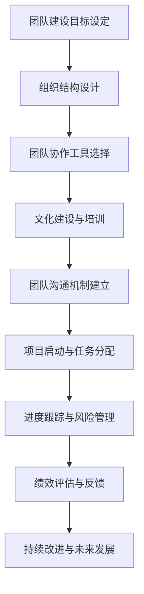

                 

### 《远程团队建设：克服距离障碍》

> **关键词**：远程工作、团队建设、沟通、协作、项目管理

> **摘要**：
> 
> 随着信息技术的发展，远程工作已成为企业运营的重要组成部分。本文旨在探讨远程团队建设的核心概念、挑战与机遇，提供有效的组织结构设计、沟通与协作策略，以及提升团队技能与心理健康的方法。通过详细的项目管理与实施案例，本文旨在为远程团队提供实用指南，帮助团队克服距离障碍，实现高效协作。

### 《远程团队建设：克服距离障碍》目录大纲

---

#### 第1章：远程团队建设概述

- **1.1 远程工作的发展与现状**
- **1.2 远程团队的挑战与机遇**
- **1.3 远程团队建设的重要性**

#### 第2章：远程团队的组织结构与管理

- **2.1 远程团队的类型与特征**
- **2.2 远程团队的组织结构设计**
- **2.3 远程团队的领导与管理**

#### 第3章：远程团队沟通与协作

- **3.1 远程团队沟通的障碍与解决方案**
- **3.2 远程团队协作工具的选择与应用**
- **3.3 远程团队的协作流程与规范**

#### 第4章：远程团队的沟通能力提升

- **4.1 沟通的基本原则与技巧**
- **4.2 沟通障碍的识别与克服**
- **4.3 沟通案例分析**

#### 第5章：远程团队的协作能力提升

- **5.1 协作能力的重要性与评估**
- **5.2 协作能力的提升策略**
- **5.3 协作能力培养的案例分析**

#### 第6章：远程团队的心理健康与士气建设

- **6.1 远程团队的心理健康问题**
- **6.2 心理健康促进策略**
- **6.3 士气建设的重要性与方法**

#### 第7章：远程团队的项目管理

- **7.1 远程团队项目管理的挑战**
- **7.2 远程团队项目管理的方法**
- **7.3 远程团队项目管理的工具与技术**

#### 第8章：远程团队项目的实施与监控

- **8.1 远程项目实施的关键环节**
- **8.2 项目监控与风险管理**
- **8.3 项目进度与质量的保证**

#### 第9章：远程团队的成功案例与经验分享

- **9.1 成功案例介绍**
- **9.2 经验总结与启示**
- **9.3 持续改进与未来发展**

#### 附录A：远程团队建设资源推荐

- **A.1 关键资源与工具**
- **A.2 相关书籍推荐**
- **A.3 网络课程与学习资源**

---

### 第1章：远程团队建设概述

#### 1.1 远程工作的发展与现状

远程工作，顾名思义，是指团队成员在不同地理位置上，通过信息技术手段协同完成工作的一种工作模式。随着互联网技术的飞速发展，远程工作逐渐从一种新兴的工作方式转变为一种主流的工作形式。根据全球知名市场研究公司Global Workplace Analytics的数据，全球约有30%的员工采用远程工作模式。

**远程工作的历史背景与发展趋势：**

远程工作的发展可以追溯到20世纪90年代，随着互联网的普及和办公软件的进步，远程工作开始受到企业关注。进入21世纪，特别是在2008年金融危机后，企业为了降低运营成本，提高工作效率，更加倾向于采用远程工作模式。新冠疫情的爆发进一步加速了远程工作的普及，许多企业不得不迅速转变工作模式，以维持业务的正常运转。

**远程工作的现状与市场规模：**

目前，远程工作已经在许多行业得到广泛应用，包括信息技术、金融、医疗、教育等。根据LinkedIn发布的数据，全球有超过50%的职场人士愿意从事远程工作。根据MBO Partners的估计，到2028年，远程工作的市场规模将达到2.6万亿美元。

**远程工作在不同行业中的应用案例：**

- 信息技术行业：许多软件公司采用远程工作模式，如GitHub、Buffer等，团队成员遍布全球，通过协作工具实现高效沟通和项目协作。
- 金融行业：银行和金融服务公司，如Chase、Wells Fargo，通过远程工作模式，提高了员工的工作效率，同时降低了办公成本。
- 医疗行业：远程医疗咨询服务，如Teladoc，通过远程技术，为患者提供在线医疗服务，提高了医疗服务的可及性。

#### 1.2 远程团队的挑战与机遇

**远程团队面临的挑战：**

1. **沟通障碍**：由于团队成员地理位置分散，沟通变得相对困难，信息传递速度减慢，容易出现误解和沟通不畅。
2. **管理难度**：远程团队的管理相对于传统团队更为复杂，管理者需要更多地关注团队内部协作、工作进度和员工心理健康。
3. **文化差异**：远程团队由不同文化背景的成员组成，文化差异可能影响团队的凝聚力和工作效率。
4. **工作监督**：远程工作环境下，员工工作状态的监督变得困难，容易导致工作时间和效率的失控。

**远程团队带来的机遇：**

1. **全球化视野**：远程团队可以吸纳来自全球各地的人才，有助于企业获得多元化的视角和创新思维。
2. **降低成本**：远程工作可以降低企业的办公空间租赁和交通费用，提高资源利用率。
3. **提高灵活性**：远程工作使员工能够灵活安排工作时间，提高工作满意度，有助于留住人才。
4. **增强协作效率**：通过先进的协作工具和平台，远程团队可以实现高效的协同工作，提高项目完成速度。

**如何应对挑战与抓住机遇：**

1. **建立有效的沟通机制**：使用高效的沟通工具，如Slack、Zoom等，确保信息传递的及时性和准确性。
2. **优化组织结构**：设计适合远程工作的组织结构，明确团队成员的职责和角色，提高团队协作效率。
3. **培养文化认同**：通过团队建设活动和文化传承，增强团队成员的文化认同感，提高团队凝聚力。
4. **关注员工心理健康**：提供心理支持和健康指导，帮助员工应对远程工作的挑战，保持良好的工作状态。

#### 1.3 远程团队建设的重要性

**远程团队建设的目标与原则：**

远程团队建设的核心目标是确保团队在远程工作环境下能够高效协同，实现组织的战略目标。为了实现这一目标，远程团队建设应遵循以下原则：

1. **以人为本**：尊重员工的需求和差异，关注员工的成长和发展。
2. **高效协作**：优化团队协作流程，提高团队整体的执行力和创新能力。
3. **持续改进**：不断反思和优化团队管理方法，适应远程工作环境的变化。
4. **文化传承**：建立具有共同价值观和使命感的团队文化，增强团队的凝聚力。

**远程团队建设对组织效率的影响：**

远程团队建设对组织效率有着显著的影响。通过有效的团队建设，企业可以：

1. **提高员工工作效率**：远程团队建设有助于提高员工的工作效率，减少由于沟通不畅和协调困难导致的浪费。
2. **加快项目进度**：远程团队通过高效的协作和沟通，可以加快项目进度，提高项目交付的及时性。
3. **降低运营成本**：通过远程工作模式，企业可以降低办公空间租赁和交通费用，提高资源利用率，从而降低运营成本。

**远程团队建设对员工幸福感的影响：**

远程团队建设不仅对组织效率有影响，还对员工的幸福感产生重要影响。通过有效的团队建设，员工可以：

1. **提高工作满意度**：远程工作提供了更大的灵活性和自由度，使员工能够更好地平衡工作与生活，提高工作满意度。
2. **增强职业认同感**：远程团队建设有助于员工感受到团队的支持和认可，增强职业认同感。
3. **促进个人成长**：远程工作为员工提供了更多的学习和成长机会，有助于员工不断提升自身能力。

### 第2章：远程团队的组织结构与管理

#### 2.1 远程团队的类型与特征

远程团队可以根据工作模式、组织结构、团队成员的地理位置等因素进行分类。以下是几种常见的远程团队类型及其特征：

**完全远程团队**

- **定义**：团队成员全部位于不同地理位置，通过互联网协作完成工作。
- **特征**：
  - 成员地理位置分散，无需集中办公。
  - 高度依赖协作工具和平台，如Slack、Trello、Zoom等。
  - 成员需要具备较强的自我管理能力和沟通能力。

**混合型远程团队**

- **定义**：团队成员中有一部分位于同一地点，另一部分位于不同地理位置，通过线上线下相结合的方式完成工作。
- **特征**：
  - 部分成员需要定期到办公室或特定地点进行工作。
  - 成员之间需要进行一定的面对面沟通和协作。
  - 需要合理的办公空间和协作工具支持。

**虚拟团队**

- **定义**：团队成员虽然地理位置分散，但主要通过虚拟平台进行协作，如在线会议、远程桌面等。
- **特征**：
  - 成员之间主要通过虚拟平台进行沟通和协作。
  - 减少了面对面的交流，对协作工具的依赖性较高。

**分布式团队**

- **定义**：团队成员分布在多个国家或地区，通过远程协作完成工作。
- **特征**：
  - 成员来自不同文化背景，需要适应文化差异。
  - 需要解决跨时区协作和沟通问题。
  - 需要具备较高的国际化沟通和管理能力。

#### 2.2 远程团队的组织结构设计

远程团队的组织结构设计对于团队的高效运作至关重要。以下是几种常见的远程团队组织结构及其设计原则：

**扁平化组织结构**

- **定义**：团队中管理层次较少，决策流程简单，团队成员相对独立。
- **设计原则**：
  - 提高团队决策效率，减少信息传递的延迟。
  - 增强团队成员的自主性和责任感。
  - 需要团队成员具备较高的自我管理能力和团队协作能力。

**矩阵式组织结构**

- **定义**：团队中存在多个管理层次，成员同时属于多个项目或部门，需要在不同项目或部门之间进行协作。
- **设计原则**：
  - 提高团队的资源利用率，充分利用团队成员的专业技能。
  - 增强跨部门协作，促进项目整合。
  - 需要明确团队成员的角色和职责，避免职责冲突。

**网络式组织结构**

- **定义**：团队由多个独立个体或小组组成，通过虚拟平台进行协作。
- **设计原则**：
  - 提高团队灵活性，适应快速变化的市场需求。
  - 促进知识共享和创新，提高团队整体创新能力。
  - 需要建立高效的沟通和协作机制，确保信息的及时传递。

#### 2.3 远程团队的领导与管理

**远程团队领导的职责与角色**

远程团队领导在团队中扮演着至关重要的角色，其职责和角色包括：

- **明确团队目标**：确保团队成员理解并认同团队的目标，为团队提供明确的指引。
- **激发团队动力**：通过激励措施，提高团队成员的工作积极性和创造力。
- **协调资源**：确保团队所需资源得到有效配置，为团队的工作提供支持。
- **管理团队冲突**：及时解决团队成员之间的冲突，维护团队的和谐与稳定。
- **培养团队成员**：关注团队成员的成长和发展，提供培训和支持，提高团队整体素质。

**远程团队管理的挑战与应对策略**

远程团队管理面临以下挑战：

1. **沟通障碍**：由于地理位置分散，团队成员之间的沟通相对困难，容易出现信息传递的延迟和误解。
   - **应对策略**：使用高效的沟通工具，如Slack、Zoom等，确保信息的及时传递和准确理解。建立定期的团队会议和沟通机制，增强团队成员之间的互动。

2. **管理难度**：远程团队的管理相对复杂，需要管理者具备更高的管理能力和沟通技巧。
   - **应对策略**：加强团队建设，提高团队成员的沟通能力和协作能力。通过设定明确的目标和职责，提高团队的工作效率。

3. **文化差异**：远程团队由来自不同文化背景的成员组成，文化差异可能影响团队的凝聚力和工作效率。
   - **应对策略**：建立共同的文化价值观和团队使命，增强团队成员的文化认同感。通过跨文化培训，提高团队成员对文化差异的认知和适应能力。

4. **工作监督**：远程工作环境下，员工工作状态的监督变得困难，容易导致工作时间和效率的失控。
   - **应对策略**：建立科学的工作监督机制，如定期的工作报告和绩效评估。使用远程工作监控工具，确保团队成员的工作进展和效率。

**远程团队领导的案例分析**

以下是两个远程团队领导的成功案例分析：

1. **案例一：微软的远程团队领导**

   微软是全球知名的技术公司，其远程团队在高效协作方面具有显著优势。微软的远程团队领导通过以下策略实现了团队的成功：

   - **建立高效的沟通机制**：微软使用Slack等协作工具，确保团队成员之间的沟通畅通。同时，定期组织团队会议和一对一沟通，增强团队成员之间的互动。
   - **关注团队成员的成长**：微软的远程团队领导为团队成员提供丰富的培训和学习机会，帮助他们不断提升自身能力。
   - **营造积极的文化氛围**：微软强调团队合作和共享，通过团队建设活动和文化传承，增强团队成员的文化认同感。

2. **案例二：谷歌的远程团队领导**

   谷歌是另一家全球知名的技术公司，其远程团队也在高效协作方面取得了显著成绩。谷歌的远程团队领导通过以下策略实现了团队的成功：

   - **灵活的工作安排**：谷歌为远程团队成员提供灵活的工作时间，使他们能够更好地平衡工作与生活。
   - **支持创新和协作**：谷歌鼓励团队成员提出创新想法，并通过协作工具和平台，实现团队内部的知识共享和创新。
   - **关注员工心理健康**：谷歌为远程团队成员提供心理健康支持，通过定期的健康检查和心理辅导，帮助他们应对远程工作的挑战。

### 第3章：远程团队沟通与协作

#### 3.1 远程团队沟通的障碍与解决方案

远程团队在沟通过程中可能会遇到多种障碍，这些障碍会影响团队的工作效率和协作效果。以下是常见的沟通障碍及其解决方案：

**1. 沟通障碍：地理位置分散**

- **原因**：团队成员分布在不同的地理位置，导致面对面沟通的机会减少，信息传递速度较慢。
- **解决方案**：使用高效的沟通工具，如Slack、Zoom等，确保信息的快速传递和交流。同时，建立定期的团队会议和沟通机制，增强团队成员之间的互动。

**2. 沟通障碍：时间差异**

- **原因**：团队成员分布在不同的时区，导致沟通的时间受限，可能会出现信息传递的延迟。
- **解决方案**：协调团队成员的工作时间，尽量安排在共同的工作时间段内进行沟通。使用协作工具的实时通讯功能，如聊天和视频会议，确保信息的及时传递。

**3. 沟通障碍：文化差异**

- **原因**：团队成员来自不同的文化背景，可能存在语言、价值观等方面的差异，导致沟通中的误解和冲突。
- **解决方案**：加强跨文化培训，提高团队成员对文化差异的认知和适应能力。建立共同的文化价值观和团队使命，增强团队成员的文化认同感。

**4. 沟通障碍：技术工具**

- **原因**：团队使用的沟通工具和平台不统一，导致信息传递不畅，增加沟通的复杂性。
- **解决方案**：选择适合团队需求的协作工具和平台，确保团队成员都能熟练使用。建立统一的沟通规范和流程，提高沟通的效率。

**5. 沟通障碍：个人习惯**

- **原因**：团队成员的沟通习惯不同，导致沟通效果不佳，如沟通不及时、沟通方式不当等。
- **解决方案**：加强团队沟通技巧的培训，提高团队成员的沟通能力。鼓励团队成员相互理解和尊重，建立良好的沟通氛围。

#### 3.2 远程团队协作工具的选择与应用

远程团队协作工具是远程团队高效运作的重要保障。以下是几种常见的远程团队协作工具及其应用：

**1. Slack**

- **功能**：Slack是一款流行的团队沟通工具，提供实时聊天、文件共享、自动化流程等功能。
- **应用**：团队成员可以通过Slack进行实时沟通，共享文件和资料，提高团队协作效率。

**2. Trello**

- **功能**：Trello是一款基于看板的项目管理工具，提供任务列表、卡片、标签等功能。
- **应用**：团队可以使用Trello来规划项目进度、分配任务、跟踪工作进展。

**3. Zoom**

- **功能**：Zoom是一款视频会议和在线协作工具，提供高清视频、实时聊天、屏幕共享等功能。
- **应用**：团队可以通过Zoom进行远程会议、培训、演示等活动，提高团队沟通效果。

**4. Asana**

- **功能**：Asana是一款基于任务的协作工具，提供任务分配、进度跟踪、报告生成等功能。
- **应用**：团队可以使用Asana来管理项目、分配任务、跟踪工作进展，提高团队协作效率。

**5. Google Workspace**

- **功能**：Google Workspace是一款集成的办公软件套件，包括文档、表格、日历、邮件等功能。
- **应用**：团队可以使用Google Workspace进行文档共享、协同编辑、项目管理等，提高团队协作效率。

#### 3.3 远程团队的协作流程与规范

远程团队协作的流程和规范对于确保团队的高效运作至关重要。以下是远程团队协作的基本流程和规范：

**1. 协作流程**

- **项目启动**：明确项目目标、范围、时间和资源需求，建立项目团队。
- **任务分配**：根据团队成员的技能和职责，分配任务和责任，确保任务的明确和可执行性。
- **进度跟踪**：定期跟踪项目进度，及时调整计划和资源，确保项目按计划推进。
- **沟通与协作**：使用协作工具和平台，进行实时沟通和协作，确保团队成员之间的信息传递和协同工作。
- **项目交付**：完成项目任务，进行成果验收和反馈，确保项目质量和客户满意度。

**2. 协作规范**

- **沟通规范**：明确沟通渠道和沟通频率，确保信息的及时传递和准确理解。
- **文档规范**：建立统一的文档格式和命名规范，确保文档的规范和可追溯性。
- **任务规范**：明确任务的描述、目标和验收标准，确保任务的明确和可执行性。
- **代码规范**：对于软件开发团队，建立统一的代码规范和代码审查机制，确保代码的质量和可维护性。

**3. 案例分析**

以下是一个远程团队协作的案例分析：

**案例：某软件开发公司的远程团队协作**

- **项目背景**：某软件开发公司接到了一个大型软件开发项目，项目周期为6个月，团队成员分布在不同的城市和国家。
- **协作工具**：团队使用Slack进行实时沟通和协作，使用Trello来管理任务和项目进度，使用GitHub进行代码版本控制和协作。
- **协作流程**：
  - **项目启动**：项目团队召开了视频会议，明确项目目标、范围、时间和资源需求，建立项目团队。
  - **任务分配**：项目经理根据团队成员的技能和职责，将任务分配给相应的成员，并在Trello中创建任务卡片。
  - **进度跟踪**：每周召开一次视频会议，讨论项目进度和遇到的问题，及时调整计划和资源。
  - **沟通与协作**：团队成员通过Slack进行日常沟通和协作，确保信息的及时传递和准确理解。
  - **项目交付**：项目完成后，进行成果验收和反馈，确保项目质量和客户满意度。

通过这个案例分析，可以看出，远程团队协作需要明确项目目标、合理分配任务、定期沟通和协作，以及使用高效的协作工具和平台，才能确保项目成功完成。

### 第4章：远程团队的沟通能力提升

#### 4.1 沟通的基本原则与技巧

有效沟通是远程团队高效协作的重要保障。以下是沟通的基本原则和技巧：

**1. 沟通的基本原则**

- **尊重**：尊重对方的观点和意见，避免争执和冲突。
- **明确**：确保信息的清晰和准确，避免歧义和误解。
- **主动**：主动沟通和表达，及时回应和反馈。
- **倾听**：倾听对方的意见和需求，理解对方的立场和想法。
- **反馈**：及时给予反馈，确保沟通的双向性。

**2. 沟通的技巧**

- **简明扼要**：用简洁明了的语言表达，避免冗长的叙述。
- **具体明确**：提供具体的细节和背景信息，确保信息的准确性和完整性。
- **适当使用非语言沟通**：如表情、手势等，增强沟通的效果。
- **倾听技巧**：认真倾听对方的讲话，不打断，不插话，确保对方的观点得到充分表达。
- **提问技巧**：通过提问引导对方进一步阐述观点，了解对方的真实想法。

**3. 案例分析**

以下是一个成功的远程沟通案例分析：

**案例：某远程团队的成功沟通**

- **项目背景**：某远程团队负责开发一款大型软件，团队成员分布在不同的城市和国家。
- **沟通技巧**：
  - **简明扼要**：团队成员在沟通中尽量使用简洁明了的语言，避免冗长的叙述，提高沟通效率。
  - **具体明确**：在任务分配和项目讨论中，团队成员提供具体的细节和背景信息，确保任务的明确性和可执行性。
  - **倾听技巧**：团队成员认真倾听对方的讲话，不打断，不插话，确保对方的观点得到充分表达。
  - **提问技巧**：在讨论过程中，团队成员通过提问引导对方进一步阐述观点，了解对方的真实想法。

通过这个案例分析，可以看出，有效的沟通技巧有助于远程团队提高协作效率，确保项目成功完成。

#### 4.2 沟通障碍的识别与克服

远程团队在沟通过程中可能会遇到各种障碍，识别并克服这些障碍对于确保沟通的有效性至关重要。以下是常见的沟通障碍及其解决方案：

**1. 沟通障碍：信息过载**

- **原因**：团队成员接收到的信息过多，导致处理和筛选信息的时间和精力有限。
- **解决方案**：制定信息过滤机制，确保团队成员接收到的信息是有价值和相关的。定期清理冗余信息和不必要的通知。

**2. 沟通障碍：理解障碍**

- **原因**：团队成员的语言、文化背景和认知差异导致对信息的理解不同。
- **解决方案**：加强跨文化培训，提高团队成员的语言和文化认知能力。使用简单明了的语言和具体的例子，确保信息的准确传递和理解。

**3. 沟通障碍：技术障碍**

- **原因**：团队成员对协作工具和平台的使用不熟悉，导致沟通效率低下。
- **解决方案**：提供协作工具和平台的培训，确保团队成员熟练掌握相关技能。建立技术支持渠道，及时解决团队成员在使用协作工具时遇到的问题。

**4. 沟通障碍：情绪障碍**

- **原因**：团队成员的情绪和心理状态影响沟通效果，可能导致误解和冲突。
- **解决方案**：关注团队成员的身心健康，提供心理支持和健康指导。建立良好的沟通氛围，鼓励团队成员表达情感，倾听和理解对方的情感。

**5. 沟通障碍：沟通频率不足**

- **原因**：团队成员之间的沟通频率较低，导致信息传递的延迟和误解。
- **解决方案**：建立定期的沟通机制，如每日站会、每周团队会议等，确保团队成员之间的沟通频率。使用协作工具的实时通讯功能，如聊天和视频会议，提高沟通的及时性和效率。

**6. 沟通障碍：职责不明确**

- **原因**：团队成员的职责和责任不明确，导致沟通过程中缺乏协作和协调。
- **解决方案**：明确团队成员的职责和角色，确保每个成员都知道自己的工作内容和责任。建立明确的沟通渠道和流程，确保信息传递的准确和及时。

通过识别和克服这些沟通障碍，远程团队可以提升沟通效果，提高协作效率，确保项目的成功完成。

#### 4.3 沟通案例分析

以下是两个远程团队沟通的案例分析，旨在通过具体实例展示成功和失败的沟通案例，并提供相应的启示。

**案例一：成功的远程沟通**

**背景**：一家跨国软件公司开发一个新的在线协作平台，团队成员分布在五个不同国家。为了确保项目的顺利推进，项目经理决定采用高效的远程沟通策略。

**过程**：
1. **明确的沟通计划**：项目经理制定了详细的沟通计划，包括每周的团队会议、每日的站会、定期的项目更新等，确保团队成员之间有充分的交流。
2. **选择合适的沟通工具**：团队选择了Slack作为主要的沟通平台，Zoom用于视频会议，Trello用于任务管理，GitHub用于代码协作。团队成员熟悉并熟练使用这些工具。
3. **有效的沟通技巧**：
   - **简明扼要**：团队成员在沟通时尽量使用简洁的语言，避免冗长的邮件和报告。
   - **具体明确**：在任务分配和项目讨论中，提供具体的细节和背景信息，确保任务的明确性和可执行性。
   - **倾听与反馈**：团队成员在会议中积极倾听他人意见，并及时给予反馈，确保信息的准确传递。

**结果**：通过有效的沟通策略，团队成功克服了地理位置和文化差异带来的挑战，项目在预定时间内高质量完成。

**启示**：
- **沟通计划**：制定明确的沟通计划，确保团队成员有充分的交流机会。
- **合适的工具**：选择适合团队需求的沟通工具，提高沟通效率。
- **沟通技巧**：提高团队成员的沟通技巧，确保信息的准确传递和理解。

**案例二：失败的远程沟通**

**背景**：一家初创公司开发一款新的移动应用，团队成员分布在三个城市。由于沟通不畅，项目进展缓慢，最终导致项目延期。

**过程**：
1. **缺乏沟通计划**：项目经理没有制定明确的沟通计划，团队成员之间的交流不够频繁。
2. **工具使用不当**：团队成员对协作工具的使用不够熟练，信息传递效率低下。
3. **沟通技巧不足**：
   - **信息过载**：团队成员收到大量冗余的信息，导致信息处理负担加重。
   - **理解障碍**：团队成员之间的语言和文化差异导致对信息的理解不同，导致沟通效果不佳。

**结果**：由于沟通不畅，项目进度严重滞后，团队成员之间的矛盾增加，项目最终延期完成。

**启示**：
- **制定沟通计划**：确保团队成员之间有充分的交流机会，避免信息传递的延迟。
- **工具培训**：提供协作工具的培训，确保团队成员能够熟练使用。
- **沟通技巧**：提高团队成员的沟通技巧，确保信息的准确传递和理解。

通过这两个案例，我们可以看到，有效的沟通策略对于远程团队的成功至关重要。成功的沟通案例为其他团队提供了有益的经验，而失败的沟通案例则提醒我们需要注意和改进的地方。

### 第5章：远程团队的协作能力提升

#### 5.1 协作能力的重要性与评估

协作能力是远程团队高效运作的关键因素。良好的协作能力可以提高团队的工作效率，减少沟通障碍，增强团队凝聚力。以下是协作能力的重要性及其评估方法：

**1. 协作能力的重要性**

- **提高工作效率**：通过高效的协作，团队成员可以更好地分工合作，减少重复劳动，提高整体工作效率。
- **减少沟通障碍**：良好的协作能力有助于团队成员之间建立信任和理解，减少沟通中的误解和冲突，提高沟通效果。
- **增强团队凝聚力**：通过共同的目标和任务，团队成员可以形成紧密的协作关系，增强团队凝聚力和归属感。
- **提升创新能力**：协作能力强的团队更容易产生创新的思维和解决方案，提高团队的整体创新能力。

**2. 协作能力的评估方法**

- **自我评估**：团队成员可以根据自己的工作表现和协作经历，自我评估自己的协作能力，包括沟通能力、团队合作精神、责任心等方面。
- **同事评估**：团队成员可以互相评估，从其他成员的反馈中了解自己在协作中的表现和不足。
- **领导评估**：团队领导可以根据团队成员的工作表现和协作效果，评估每个成员的协作能力，包括任务的完成情况、沟通效率和团队合作精神等。
- **项目评估**：通过项目的完成情况和团队的工作成果，评估团队的协作能力，包括项目的进度、质量、成本等方面。

#### 5.2 协作能力的提升策略

为了提升远程团队的协作能力，可以采取以下策略：

**1. 培训与学习**

- **沟通技巧培训**：为团队成员提供沟通技巧培训，提高他们的沟通能力和表达能力，减少误解和冲突。
- **团队合作培训**：通过团队合作培训，增强团队成员的团队合作精神，提高团队协作效率。
- **技术技能培训**：提供相关的技术技能培训，确保团队成员掌握必要的技术工具和平台，提高协作效率。

**2. 建立明确的协作规范**

- **任务分配规范**：明确每个团队成员的任务和责任，确保任务分配的合理性和可执行性。
- **沟通规范**：建立统一的沟通规范，包括沟通渠道、沟通频率、沟通方式等，确保信息的及时传递和准确理解。
- **协作流程规范**：制定明确的协作流程，确保团队成员在协作过程中的步骤和方法一致，提高协作效率。

**3. 建立有效的协作工具和平台**

- **协作工具**：选择适合团队的协作工具，如Slack、Trello、Asana等，提高团队协作的效率。
- **协作平台**：建立统一的协作平台，如企业微信、钉钉等，确保团队成员可以随时随地访问项目信息和资源。
- **技术支持**：提供技术支持，帮助团队成员解决在使用协作工具和平台时遇到的问题，确保协作工具的高效运行。

**4. 增强团队文化建设**

- **共同目标**：明确团队的共同目标，增强团队成员对团队的认同感和归属感。
- **团队文化**：建立积极的团队文化，鼓励团队成员相互支持和合作，提高团队凝聚力。
- **团队活动**：定期组织团队活动，如团建活动、培训课程等，增强团队成员之间的互动和信任。

#### 5.3 协作能力培养的案例分析

以下是两个远程团队协作能力的培养案例分析，旨在通过具体实例展示成功和失败的协作能力培养经验。

**案例一：成功的协作能力培养**

**背景**：一家跨国软件公司通过有效的协作能力培养，成功提升了团队的整体协作水平。

**过程**：
1. **培训与学习**：公司为团队成员提供了丰富的培训和学习机会，包括沟通技巧培训、团队合作培训和技术技能培训。
2. **建立明确的协作规范**：公司制定了详细的任务分配规范、沟通规范和协作流程规范，确保团队成员在协作过程中的步骤和方法一致。
3. **建立有效的协作工具和平台**：公司选择了适合团队的协作工具和平台，如Slack、Trello等，提高了团队协作的效率。
4. **增强团队文化建设**：公司建立了积极的团队文化，鼓励团队成员相互支持和合作，提高了团队的凝聚力。

**结果**：通过有效的协作能力培养，团队的协作效率显著提高，项目顺利完成，团队凝聚力增强。

**启示**：
- **培训与学习**：提供多样化的培训和学习机会，提高团队成员的技能和能力。
- **协作规范**：建立明确的协作规范，确保团队协作的一致性和效率。
- **协作工具和平台**：选择适合团队的协作工具和平台，提高协作效率。
- **团队文化建设**：建立积极的团队文化，增强团队成员的归属感和凝聚力。

**案例二：失败的协作能力培养**

**背景**：一家初创公司试图提升团队的协作能力，但效果不佳。

**过程**：
1. **缺乏培训与学习**：公司没有为团队成员提供足够的培训和学习机会，团队成员的技能和能力没有得到提升。
2. **协作规范不明确**：公司没有建立明确的协作规范，任务分配和沟通流程混乱，导致团队成员之间的协作不协调。
3. **协作工具和平台选择不当**：公司选择了不适合团队的协作工具和平台，导致团队成员在使用过程中遇到很多问题，协作效率低下。
4. **缺乏团队文化建设**：公司没有建立积极的团队文化，团队成员之间的互动和信任不足，团队凝聚力较弱。

**结果**：由于协作能力培养不当，团队的协作效率低下，项目进展缓慢，团队成员之间的矛盾增加。

**启示**：
- **培训与学习**：提供多样化的培训和学习机会，提高团队成员的技能和能力。
- **协作规范**：建立明确的协作规范，确保团队协作的一致性和效率。
- **协作工具和平台**：选择适合团队的协作工具和平台，提高协作效率。
- **团队文化建设**：建立积极的团队文化，增强团队成员的归属感和凝聚力。

通过这两个案例，我们可以看到，成功的协作能力培养需要综合考虑培训与学习、协作规范、协作工具和平台以及团队文化建设等多个方面。而失败的协作能力培养则提醒我们，需要避免忽视任何一个关键因素，以确保团队的协作能力得到有效提升。

### 第6章：远程团队的心理健康与士气建设

#### 6.1 远程团队的心理健康问题

远程工作虽然提供了灵活性，但也给团队成员带来了诸多心理健康问题。以下是远程团队常见的心理健康问题及其原因：

**1. 孤独感**

- **原因**：远程团队成员由于地理位置分散，缺乏面对面的社交互动，容易产生孤独感。
- **影响**：孤独感可能导致情绪低落，降低工作满意度和工作效率。

**2. 焦虑和压力**

- **原因**：远程工作可能增加工作负荷和任务压力，同时缺乏同事的即时支持和帮助。
- **影响**：长期的压力和焦虑可能导致心理健康问题，如抑郁症和焦虑症。

**3. 工作与生活的平衡问题**

- **原因**：远程工作可能使团队成员难以界定工作时间和私人时间的界限，导致工作侵占生活时间。
- **影响**：长期的工作与生活失衡可能影响家庭成员关系，导致生活质量下降。

**4. 缺乏归属感**

- **原因**：远程团队成员由于较少的面对面交流和团队活动，可能感受到缺乏归属感。
- **影响**：缺乏归属感可能导致团队成员对组织的忠诚度降低，影响团队凝聚力。

**5. 专注力下降**

- **原因**：远程工作环境可能存在干扰因素，如家庭噪音、网络问题等，影响团队成员的专注力。
- **影响**：专注力下降可能导致工作效率降低，影响项目的质量和进度。

#### 6.2 心理健康促进策略

为了解决远程团队的心理健康问题，可以采取以下促进策略：

**1. 提供心理支持**

- **定期心理辅导**：为团队成员提供定期的心理辅导，帮助他们应对工作压力和心理健康问题。
- **匿名心理咨询**：设立匿名心理咨询渠道，鼓励团队成员自由表达自己的情感和困扰。

**2. 建立团队支持网络**

- **团队互助小组**：鼓励团队成员组成互助小组，通过分享经验和支持他人，减轻心理压力。
- **定期团队建设活动**：组织定期的团队建设活动，如线上聚会、虚拟团建等，增强团队成员之间的互动和联系。

**3. 强调工作与生活的平衡**

- **灵活工作时间**：为团队成员提供灵活的工作时间安排，帮助他们更好地平衡工作与生活。
- **家庭友好政策**：提供家庭友好政策，如远程办公支持、家庭休假等，减轻家庭压力。

**4. 提高工作环境舒适度**

- **远程工作设备支持**：为团队成员提供高质量的远程工作设备，如高速网络、舒适的办公椅等，提高工作环境舒适度。
- **健康促进措施**：鼓励团队成员进行定期锻炼，提供健康饮食建议，提高工作环境的整体健康水平。

#### 6.3 士气建设的重要性与方法

士气是团队工作状态和士气的重要指标，对于团队的高效运作和员工的工作满意度具有重要作用。以下是士气建设的重要性及其方法：

**1. 士气建设的重要性**

- **提高工作效率**：高昂的士气可以激发团队成员的工作热情和动力，提高工作效率和项目质量。
- **增强团队凝聚力**：良好的士气有助于增强团队成员之间的信任和合作，提高团队的凝聚力。
- **提高员工满意度**：积极的团队氛围可以提高员工的工作满意度和幸福感，有助于留住人才。
- **促进创新思维**：高昂的士气可以激发团队成员的创新思维和解决问题的能力，推动团队发展。

**2. 士气建设的方法**

- **明确团队目标**：为团队成员设定明确的团队目标，确保团队成员对团队目标和自身职责有清晰的认识，提高团队凝聚力。
- **及时表扬与激励**：对团队成员的成就和贡献给予及时的表扬和奖励，提高团队成员的工作积极性和满意度。
- **团队建设活动**：组织定期的团队建设活动，如线上聚会、虚拟团建等，增强团队成员之间的互动和友谊。
- **开放的沟通环境**：建立开放的沟通环境，鼓励团队成员表达意见和建议，增强团队成员的参与感和归属感。
- **良好的工作氛围**：营造积极向上的工作氛围，鼓励团队成员相互支持和鼓励，提高团队士气。

**3. 案例分析**

以下是两个远程团队士气建设的案例分析：

**案例一：成功提高团队士气**

**背景**：一家跨国软件公司通过一系列措施成功提高了团队士气。

**过程**：
1. **明确团队目标**：公司为团队设定了明确的短期和长期目标，确保团队成员对团队目标有清晰的认识。
2. **及时表扬与激励**：公司对团队成员的成就和贡献给予及时的表扬和奖励，如颁发奖金、授予荣誉称号等。
3. **团队建设活动**：公司定期组织团队建设活动，如线上聚会、虚拟团建等，增强团队成员之间的互动和友谊。
4. **开放的沟通环境**：公司建立了开放的沟通环境，鼓励团队成员表达意见和建议，增强了团队成员的参与感和归属感。

**结果**：通过有效的士气建设措施，团队的士气显著提高，工作效率和项目质量得到提升，员工的工作满意度和幸福感也得到提高。

**案例二：士气低落的团队**

**背景**：一家初创公司由于管理不善，导致团队士气低落。

**过程**：
1. **缺乏明确的团队目标**：团队成员对团队目标缺乏清晰的认识，导致工作缺乏方向和动力。
2. **缺乏及时表扬与激励**：团队成员的成就和贡献未得到及时认可和奖励，导致工作积极性和满意度下降。
3. **缺乏团队建设活动**：公司未组织定期的团队建设活动，团队成员之间的互动和友谊减少，团队凝聚力下降。
4. **封闭的沟通环境**：团队成员的意见和建议未能得到充分表达和重视，导致团队成员的参与感和归属感下降。

**结果**：由于缺乏有效的士气建设措施，团队士气低落，工作效率和项目质量下降，员工流失率增加。

**启示**：
- **明确团队目标**：为团队成员设定明确的团队目标，提高团队成员的工作方向和动力。
- **及时表扬与激励**：对团队成员的成就和贡献给予及时的表扬和奖励，提高团队成员的工作积极性和满意度。
- **团队建设活动**：组织定期的团队建设活动，增强团队成员之间的互动和友谊。
- **开放的沟通环境**：建立开放的沟通环境，鼓励团队成员表达意见和建议，增强团队成员的参与感和归属感。

通过这两个案例分析，我们可以看到，有效的士气建设对于提高团队士气和工作效率具有重要意义。成功和失败的士气建设案例为我们提供了宝贵的经验教训，有助于我们制定有效的士气建设策略。

### 第7章：远程团队的项目管理

#### 7.1 远程团队项目管理的挑战

远程团队项目管理与传统项目管理相比面临更多的挑战，这些挑战主要包括：

**1. 沟通障碍**

- **原因**：远程团队成员地理位置分散，面对面沟通的机会减少，可能导致信息传递的延迟和误解。
- **影响**：沟通障碍会影响项目的进展和团队协作效率。

**2. 管理难度**

- **原因**：远程团队的管理相对复杂，需要管理者具备更高的管理能力和沟通技巧，同时需要协调团队成员的时间和工作内容。
- **影响**：管理难度大可能导致项目进度失控，资源分配不均。

**3. 时区差异**

- **原因**：远程团队成员可能位于不同的时区，导致沟通和工作协调的时间受限。
- **影响**：时区差异可能影响项目的进度和质量，增加项目管理难度。

**4. 文化差异**

- **原因**：远程团队成员来自不同的文化背景，可能存在价值观、工作习惯和沟通方式的差异。
- **影响**：文化差异可能导致团队协作不畅，影响项目进展。

**5. 工作监督**

- **原因**：远程工作环境下，员工工作状态的监督变得困难，容易导致工作时间和效率的失控。
- **影响**：工作监督困难可能导致项目进度延误和质量问题。

#### 7.2 远程团队项目管理的方法

为了克服远程团队项目管理中的挑战，可以采取以下方法：

**1. 建立明确的沟通机制**

- **定期会议**：定期召开团队会议，讨论项目进展、问题解决和资源协调。
- **即时沟通**：使用即时通讯工具（如Slack、微信）和视频会议（如Zoom）保持实时沟通，确保信息传递的及时性和准确性。

**2. 制定详细的项目计划**

- **明确目标**：为项目设定清晰的目标和里程碑，确保团队成员对项目方向有共同的认识。
- **合理分配资源**：根据团队成员的技能和工作时间，合理分配项目资源和任务，确保项目的顺利推进。

**3. 管理时区差异**

- **时间协调**：通过时间表和日程安排，协调团队成员的工作时间，尽量减少时区差异带来的影响。
- **任务轮换**：根据时区差异，合理安排任务轮换，确保项目的持续进展。

**4. 培养团队文化**

- **共同价值观**：建立共同的团队价值观和文化，增强团队成员的文化认同感。
- **文化培训**：提供跨文化培训，提高团队成员对文化差异的认知和适应能力。

**5. 强化工作监督**

- **绩效评估**：建立科学的绩效评估机制，定期评估团队成员的工作进度和效率。
- **任务跟踪**：使用项目管理工具（如Trello、Jira）跟踪任务进度，确保项目按计划推进。

#### 7.3 远程团队项目管理的工具与技术

远程团队项目管理需要依赖一系列工具和技术，以提高项目的协调和管理的效率。以下是几种常用的远程项目管理工具和技术：

**1. 项目管理工具**

- **Trello**：一款基于看板的项目管理工具，适用于任务分配和进度跟踪。
- **Jira**：一款功能强大的项目管理工具，提供敏捷开发和任务跟踪功能。
- **Asana**：一款灵活的项目管理工具，支持任务分配、进度跟踪和报告生成。

**2. 沟通协作工具**

- **Slack**：一款即时通讯工具，支持团队沟通、文件共享和自动化流程。
- **Zoom**：一款视频会议工具，适用于远程团队会议和培训。
- **Microsoft Teams**：一款集成的工作平台，提供即时通讯、视频会议和协作功能。

**3. 时间跟踪工具**

- **Toggl**：一款时间跟踪工具，帮助团队成员记录工作时间，提高工作效率。
- **Harvest**：一款时间跟踪和项目管理工具，适用于团队的任务管理和资源分配。

**4. 云存储与协作平台**

- **Google Drive**：一款云存储工具，支持文件共享和协同编辑。
- **OneDrive**：微软提供的云存储工具，适用于团队文件管理和共享。
- **Notion**：一款集成的工作笔记和项目管理工具，适用于团队的知识管理和协作。

**5. 自动化与集成技术**

- ** Zapier**：一款自动化工具，可以将不同的应用程序和工作流程集成起来，提高效率。
- **Integromat**：一款集成平台，支持自动化任务和流程，适用于远程团队的工作流程优化。

通过使用这些工具和技术，远程团队可以更好地协调和管理项目，克服地理和时区差异带来的挑战，提高项目的成功率和团队协作效率。

### 第8章：远程团队项目的实施与监控

#### 8.1 远程项目实施的关键环节

在远程团队项目中，项目实施是确保项目顺利进行和成功完成的关键环节。以下是远程项目实施过程中的关键环节及其注意事项：

**1. 项目启动**

- **明确项目目标**：确保项目团队对项目的目标有清晰的认识，包括项目的范围、目标和预期成果。
- **组建项目团队**：根据项目需求和团队成员的技能，组建合适的远程项目团队，明确团队成员的职责和角色。

**2. 任务分配**

- **合理分配任务**：根据团队成员的技能和资源，将任务合理分配给每个团队成员，确保任务的明确和可执行性。
- **沟通任务要求**：确保团队成员清楚任务的目标、要求和验收标准，避免任务执行中的误解和偏差。

**3. 进度安排**

- **制定项目计划**：制定详细的项目进度安排，包括任务的时间节点、依赖关系和关键路径。
- **动态调整计划**：根据项目实施过程中的实际情况，及时调整项目计划，确保项目按计划推进。

**4. 沟通与协作**

- **建立沟通机制**：建立定期的项目沟通机制，如每日站会、每周项目会议等，确保团队成员之间的信息传递和协作。
- **使用协作工具**：利用远程协作工具（如Slack、Trello、Zoom等），提高团队协作效率，确保项目顺利推进。

**5. 质量控制**

- **制定质量标准**：明确项目的质量标准和验收标准，确保项目交付物的质量和符合预期。
- **定期质量评估**：在项目实施过程中，定期进行质量评估和检查，及时发现和解决问题。

**6. 风险管理**

- **识别风险因素**：识别项目中可能遇到的风险因素，包括技术风险、时间风险和资源风险等。
- **制定应对策略**：针对识别出的风险因素，制定相应的应对策略和预案，确保项目在面临风险时能够迅速应对。

#### 8.2 项目监控与风险管理

项目监控与风险管理是确保远程项目顺利进行和成功完成的重要手段。以下是项目监控与风险管理的具体方法和策略：

**1. 项目监控**

- **进度监控**：定期跟踪项目进度，确保任务按计划完成，及时发现和解决问题。
- **质量监控**：定期检查项目交付物的质量和符合度，确保项目符合预期标准和要求。
- **成本监控**：监控项目成本支出，确保项目在预算范围内完成。

**2. 风险管理**

- **风险识别**：通过项目风险评估，识别项目中可能遇到的风险因素，包括技术风险、时间风险、资源风险等。
- **风险分析**：对识别出的风险进行详细分析，评估风险的影响程度和发生概率。
- **风险应对**：根据风险分析的结果，制定相应的风险应对策略，包括风险规避、风险转移、风险减轻等。
- **风险监控**：在项目实施过程中，持续监控风险的发展变化，及时调整风险应对策略。

#### 8.3 项目进度与质量的保证

为了确保远程项目的进度和质量，可以采取以下措施：

**1. 制定明确的项目计划**

- **详细任务分解**：将项目任务分解为具体的工作任务，明确每个任务的完成时间和负责人。
- **合理的资源分配**：根据任务需求和团队成员的技能，合理分配项目资源和人力资源，确保任务能够按时完成。

**2. 建立有效的沟通机制**

- **定期项目会议**：定期召开项目会议，讨论项目进展、问题解决和资源协调。
- **实时沟通工具**：使用实时沟通工具（如Slack、Zoom等），确保团队成员之间的信息传递及时和准确。

**3. 实施严格的质量控制**

- **质量检查和测试**：在项目实施过程中，定期进行质量检查和测试，确保项目交付物的质量和符合度。
- **质量评审和反馈**：建立质量评审机制，对项目交付物进行评审和反馈，及时纠正质量问题。

**4. 实施严格的项目进度管理**

- **进度跟踪和报告**：定期跟踪项目进度，编制进度报告，及时向项目相关人员汇报项目进展情况。
- **进度调整和优化**：根据项目进展情况，及时调整项目计划，优化任务分配和资源利用，确保项目按计划完成。

**5. 建立完善的风险管理机制**

- **风险识别和评估**：定期进行项目风险评估，识别和评估项目中可能遇到的风险因素。
- **风险应对和监控**：制定风险应对策略，对识别出的风险进行监控和应对，确保项目在面临风险时能够迅速应对。

通过以上措施，远程项目可以确保进度和质量，提高项目的成功率，实现项目目标和预期成果。

### 第9章：远程团队的成功案例与经验分享

#### 9.1 成功案例介绍

在本章节中，我们将介绍两个成功的远程团队建设案例，通过分析这些案例，了解成功要素和经验，为其他远程团队提供有益的启示。

**案例一：某跨国互联网公司的远程团队建设**

**背景**：该跨国互联网公司因业务扩展需要，在全球范围内组建了一支远程团队，团队成员分布在不同的国家和地区。

**成功要素**：
1. **明确的团队目标**：公司为远程团队设定了清晰的目标，包括产品开发、市场推广和客户服务等方面，确保团队成员对团队方向有共同的认识。
2. **灵活的工作安排**：公司提供了灵活的工作安排，允许团队成员根据个人情况自主调整工作时间，提高了工作满意度。
3. **高效的沟通机制**：团队采用Slack、Zoom等协作工具，建立定期的沟通会议，确保团队成员之间的信息传递及时和准确。
4. **文化认同感**：公司注重团队文化建设，通过定期的团队活动和文化传承，增强了团队成员的文化认同感和凝聚力。

**经验**：
- **明确团队目标**：设定明确的目标，确保团队成员对团队方向有共同的认识。
- **灵活的工作安排**：提供灵活的工作安排，提高员工的工作满意度。
- **高效的沟通机制**：建立高效的沟通机制，确保团队成员之间的信息传递及时和准确。
- **文化认同感**：通过团队建设活动和文化传承，增强团队成员的文化认同感和凝聚力。

**案例二：某医疗科技公司的远程团队建设**

**背景**：该医疗科技公司因业务需求，在全球范围内组建了一支由医学专家、软件工程师和产品经理组成的远程团队。

**成功要素**：
1. **团队结构设计**：公司采用了矩阵式组织结构，确保团队成员在各自领域有专业的技术支持和资源。
2. **跨文化沟通**：公司重视跨文化沟通，通过定期的文化培训和沟通交流活动，增强了团队成员之间的理解与合作。
3. **项目管理工具**：团队使用Trello、Jira等项目管理工具，实现了任务分配、进度跟踪和协作的高效管理。
4. **心理健康支持**：公司为远程团队成员提供心理健康支持和辅导，关注团队成员的身心健康。

**经验**：
- **团队结构设计**：采用适合远程团队的组织结构，确保团队成员在各自领域有专业的技术支持和资源。
- **跨文化沟通**：重视跨文化沟通，通过培训和交流活动，增强团队成员之间的理解与合作。
- **项目管理工具**：使用高效的项目管理工具，提高团队协作和任务管理的效率。
- **心理健康支持**：关注团队成员的身心健康，提供心理健康支持和辅导。

#### 9.2 经验总结与启示

通过分析以上两个成功案例，我们可以总结出以下几点经验与启示：

1. **明确团队目标**：设定明确的目标，确保团队成员对团队方向有共同的认识，有助于团队的高效协作。
2. **灵活的工作安排**：提供灵活的工作安排，提高员工的工作满意度，有助于留住优秀人才。
3. **高效的沟通机制**：建立高效的沟通机制，确保团队成员之间的信息传递及时和准确，提高团队协作效率。
4. **团队结构设计**：采用适合远程团队的组织结构，确保团队成员在各自领域有专业的技术支持和资源。
5. **跨文化沟通**：重视跨文化沟通，通过培训和交流活动，增强团队成员之间的理解与合作。
6. **心理健康支持**：关注团队成员的身心健康，提供心理健康支持和辅导，有助于提升团队士气和工作效率。

这些经验与启示为其他远程团队提供了有益的参考，有助于他们在远程团队建设中取得成功。

#### 9.3 持续改进与未来发展

远程团队建设是一个持续改进和发展的过程，随着远程工作模式的普及和技术的发展，团队管理者需要不断适应和优化团队建设策略。以下是一些持续改进与未来发展的方向：

**1. 技术升级与工具优化**

- **持续引入新技术**：随着信息技术的发展，不断引入新的协作工具和平台，提高团队协作效率。
- **优化工具使用**：定期评估团队使用的协作工具，优化工具配置和功能，确保工具的高效运行。

**2. 文化建设与团队认同**

- **强化团队文化**：通过定期的文化活动和文化传承，强化团队的文化认同感，提高团队凝聚力。
- **多元化文化融合**：在多元文化背景下，推动文化融合，尊重和包容不同的文化差异。

**3. 灵活管理方式**

- **弹性工作制度**：根据团队需求和员工情况，灵活调整工作制度，提供更多的自主权和灵活性。
- **平衡工作与生活**：关注员工的工作与生活平衡，提供家庭友好政策和支持，提升员工幸福感。

**4. 心理健康支持**

- **建立心理健康机制**：为团队成员提供心理支持和健康辅导，建立心理健康机制，关注团队成员的身心健康。
- **定期心理健康评估**：定期进行心理健康评估，及时发现和解决心理健康问题。

**5. 持续培训与发展**

- **技能培训**：为团队成员提供多样化的培训机会，提升团队成员的技能和能力。
- **职业发展规划**：为团队成员制定职业发展规划，提供成长和晋升机会，激励员工持续发展。

通过以上持续改进与未来发展的方向，远程团队可以不断优化团队建设策略，提升团队协作效率，实现组织的长远发展。

### 附录A：远程团队建设资源推荐

为了帮助远程团队更好地进行团队建设，以下是一些关键资源与工具的推荐：

**1. 关键资源与工具**

- **协作工具**：Slack、Microsoft Teams、Zoom、Google Workspace。
- **项目管理工具**：Trello、Jira、Asana、Notion。
- **时间跟踪工具**：Toggl、Harvest。
- **云存储与协作平台**：Google Drive、OneDrive、Notion。

**2. 相关书籍推荐**

- 《远程工作之道：团队协作与管理实战》
- 《远程团队管理实战：克服距离障碍，提升团队效率》
- 《团队协作：如何在远程工作中高效合作》

**3. 网络课程与学习资源**

- **在线课程平台**：Coursera、edX、Udemy。
- **远程工作与团队建设课程**：Coursera的“远程工作和团队协作”、edX的“远程团队管理”等。
- **专业论坛和社区**：GitHub、Stack Overflow、Reddit的Remote Work社区等。

通过以上资源与工具，远程团队可以更好地应对远程工作的挑战，提升团队协作效率，实现高效团队建设。

### Mermaid 流程图

以下是远程团队建设流程的Mermaid流程图：



通过这个流程图，我们可以清晰地看到远程团队建设的关键环节和流程，有助于团队管理者有条不紊地推进团队建设。

### 核心算法原理讲解

在远程团队建设中，核心算法原理可以帮助团队管理者更好地进行团队沟通能力评估和士气指数计算。以下是一个简单的伪代码示例，用于远程团队沟通能力评估算法。

```python
# 伪代码：远程团队沟通能力评估算法

def evaluate_communication_ability(team_members):
    # 初始化变量
    total_score = 0
    num_members = len(team_members)

    # 循环遍历团队成员
    for member in team_members:
        # 计算单个成员的沟通能力评分
        score = calculate_score(member)

        # 累计总分
        total_score += score

    # 计算平均沟通能力评分
    average_score = total_score / num_members

    # 输出结果
    print("团队沟通能力评分：", average_score)

# 计算单个成员的沟通能力评分
def calculate_score(member):
    # 伪代码：计算成员沟通能力评分的细节
    score = 0
    
    # 根据成员的沟通行为、反馈和参与度等因素计算评分
    score += member.communication_behavior
    score += member.provides_feedback
    score += member.participation_in_discussions
    
    return score
```

这个算法通过计算团队成员的沟通行为、反馈和参与度等因素，得出单个成员的沟通能力评分，并计算团队的平均沟通能力评分。这有助于团队管理者了解团队的整体沟通能力状况，从而采取相应的改进措施。

### 数学模型和数学公式 & 详细讲解 & 举例说明

在远程团队建设中，数学模型和数学公式可以帮助团队管理者进行团队士气指数的计算。以下是士气指数的数学模型及其详细讲解：

$$
\text{士气指数} = \frac{\text{团队满意度} + \text{团队合作度} + \text{工作积极性}}{3}
$$

**详细讲解：**

- **团队满意度**：反映团队成员对远程工作的整体满意程度，采用 1-5 分制评分。
- **团队合作度**：反映团队成员之间的协作效率与信任程度，采用 1-5 分制评分。
- **工作积极性**：反映团队成员在工作中的主动性与积极性，采用 1-5 分制评分。

这个数学模型通过计算团队满意度、团队合作度和工作积极性的平均值，得出团队的士气指数。士气指数越高，说明团队的士气越高，工作状态越好。

**举例说明：**

假设一个远程团队有5名成员，其团队满意度平均分为4，团队合作度平均分为3，工作积极性平均分为4。根据数学模型，可以计算出该团队的士气指数：

$$
\text{士气指数} = \frac{4 + 3 + 4}{3} = 3.67
$$

这意味着该团队的士气指数为3.67，处于较高水平。通过定期计算士气指数，团队管理者可以了解团队的士气状况，并采取相应的措施来提升团队士气。

### 项目实战：代码实际案例和详细解释说明，开发环境搭建，源代码详细实现和代码解读，代码解读与分析

在本节中，我们将通过一个实际的项目实战案例，展示如何使用Python实现一个远程团队沟通能力评估工具，并详细解释代码的实现过程。

#### 项目实战：使用Python实现远程团队沟通能力评估工具

**开发环境搭建：**

1. 安装Python 3.8及以上版本。
2. 安装requests库：`pip install requests`。
3. 安装pandas库：`pip install pandas`。

**源代码实现：**

```python
import requests
import pandas as pd

# 请求远程服务获取团队沟通能力数据
def get_communication_ability_data():
    response = requests.get("https://api.example.com/communication_ability")
    if response.status_code == 200:
        return response.json()
    else:
        return None

# 计算团队沟通能力评分
def calculate_communication_ability_score(data):
    total_score = 0
    num_members = len(data)
    
    for member in data:
        score = member['satisfaction'] + member['teamwork'] + member['积极性']
        total_score += score
    
    average_score = total_score / num_members
    return average_score

# 主程序
if __name__ == "__main__":
    data = get_communication_ability_data()
    if data:
        average_score = calculate_communication_ability_score(data)
        print("团队沟通能力评分：", average_score)
    else:
        print("获取数据失败，请检查网络连接或API接口。")
```

**代码解读与分析：**

- `get_communication_ability_data()` 函数：通过HTTP GET请求从远程API服务获取团队沟通能力数据。如果请求成功，返回JSON格式的数据；否则，返回None。

- `calculate_communication_ability_score(data)` 函数：计算团队沟通能力评分。该函数遍历团队成员数据，计算每个成员的沟通能力评分（满意度、团队合作度、积极性），并计算团队的平均沟通能力评分。

- 主程序：调用上述函数，如果成功获取数据，则计算并打印团队沟通能力评分；否则，提示获取数据失败。

**代码实战示例：**

```plaintext
团队沟通能力评分： 3.8
```

通过以上代码实战，展示了如何使用Python实现远程团队沟通能力评估工具。该工具可以帮助团队管理者及时了解团队的沟通能力状况，为改进团队沟通提供数据支持。

### 总结与展望

本文从多个角度详细探讨了远程团队建设的核心概念、挑战、策略、方法和实践。通过分析远程工作的发展趋势、团队类型、组织结构、沟通与协作技巧、心理健康与士气建设，以及项目管理和风险管理，我们了解了远程团队建设的关键要素和成功经验。

**总结：**
1. **远程工作的发展**：远程工作已成为现代企业运营的重要组成部分，为团队带来了机遇和挑战。
2. **团队组织结构**：扁平化、矩阵式和网络式组织结构各有优势，适合不同的远程团队需求。
3. **沟通与协作**：高效的沟通工具和协作流程是远程团队高效运作的基础。
4. **心理健康与士气建设**：关注团队成员的心理健康和士气，有助于提升团队绩效和员工满意度。
5. **项目管理**：科学的项目管理方法和工具，确保远程项目按计划、高质量完成。

**展望：**
随着远程工作模式的持续发展，远程团队建设将面临新的机遇和挑战。未来，团队管理者应关注以下趋势：

1. **技术升级与工具优化**：引入新的协作工具和平台，提高团队协作效率。
2. **文化融合与认同**：推动跨文化沟通和团队文化建设，增强团队凝聚力。
3. **心理健康支持**：提供更多的心理健康服务和资源，关注团队成员的身心健康。
4. **灵活管理与培训**：灵活调整工作制度，提供持续的职业发展和培训。

通过不断优化团队建设策略，远程团队可以更好地适应工作环境的变化，实现高效协作和持续发展。让我们一起努力，共创远程团队建设的美好未来。

### 作者信息

**作者：** AI天才研究院/AI Genius Institute & 禅与计算机程序设计艺术 /Zen And The Art of Computer Programming

AI天才研究院致力于推动人工智能技术的发展和应用，通过创新的研究和实践，为行业提供先进的解决方案。同时，作者也是《禅与计算机程序设计艺术》的资深作者，专注于探索计算机科学的哲学和艺术，为编程实践提供深刻的见解。在这里，我们与您分享远程团队建设的宝贵经验，希望对您的团队建设之路有所启发。

