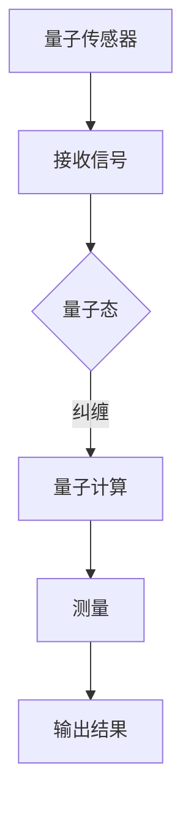

                 

### 量子传感器在注意力检测中的应用

> **关键词：**量子传感器，注意力检测，生物医学，工业检测，未来展望

> **摘要：**本文将探讨量子传感器在注意力检测领域的应用，包括量子传感器的基本概念、工作原理、不同类型的量子传感器及其在生物医学和工业检测中的应用。通过分析量子传感器在注意力检测中的优势和挑战，本文还探讨了这一技术的未来发展趋势。

#### 第一部分：量子传感器基础

量子传感器是利用量子物理原理进行测量的设备，能够实现超高的测量精度和灵敏度。在本节中，我们将对量子传感器进行概述，详细探讨其核心原理，介绍不同类型的量子传感器，并分析其在环境监测中的应用。

##### 第1章：量子传感器概述

量子传感器的基本概念是指利用量子态（如量子比特、量子纠缠等）进行测量的传感器。这种传感器通过操纵和控制量子态，实现对目标信号的精确检测。

量子传感器的工作原理主要基于以下几个核心原理：

- **量子态与量子纠缠：**量子态是量子比特的状态描述，而量子纠缠是指两个或多个量子比特之间的非局域性关联。通过量子纠缠，可以实现高灵敏度的信号检测。
- **量子比特与量子计算：**量子比特是量子计算机的基本单位，它可以同时处于0和1的状态，这种性质称为叠加态。量子计算利用量子比特的叠加态进行运算，从而实现超强的计算能力。
- **量子测量与量子态退相干：**量子测量是指对量子系统进行观测的过程。在量子测量中，量子态会发生退相干，即从叠加态转变为确定的基态。通过精确的量子测量，可以实现高精度的信号检测。

量子传感器的发展历史可以追溯到20世纪60年代。当时，科学家们首次提出了量子纠缠的概念。随着量子技术的不断发展，量子传感器逐渐应用于各个领域。目前，量子传感器在环境监测、生物医学、工业检测等领域具有广泛的应用前景。

##### 第2章：量子传感器核心原理

2.1 **量子态与量子纠缠**

量子态是量子比特的状态描述，它可以表示为两个互补的量子态的叠加。例如，一个量子比特可以处于0和1的叠加态：

$$
|\psi\rangle = \alpha|0\rangle + \beta|1\rangle
$$

其中，$\alpha$ 和 $\beta$ 是复数，且满足 $|\alpha|^2 + |\beta|^2 = 1$。

量子纠缠是指两个或多个量子比特之间的非局域性关联。当两个量子比特处于纠缠态时，对其中一个量子比特的测量会立即影响到另一个量子比特的状态。这种现象被称为“瞬间作用”。

2.2 **量子比特与量子计算**

量子比特是量子计算机的基本单位，它可以同时处于0和1的状态，这种性质称为叠加态。在经典计算机中，一个比特只能处于0或1的状态，而量子比特可以同时处于0和1的叠加态，这使得量子计算机具有超强的计算能力。

量子计算利用量子比特的叠加态进行运算。例如，一个量子比特可以同时进行加法、减法、乘法等运算，而经典计算机需要分别进行这些运算。

2.3 **量子测量与量子态退相干**

量子测量是指对量子系统进行观测的过程。在量子测量中，量子态会发生退相干，即从叠加态转变为确定的基态。例如，对处于叠加态的量子比特进行测量，可能会得到0或1的结果，但无法预知具体结果是哪一个。

量子态退相干是量子传感器实现高精度测量的关键。通过精确的量子测量，可以实现超高的测量精度和灵敏度。

##### 第2.4节：量子传感器 Mermaid 流流程图

以下是一个简单的量子传感器工作原理的 Mermaid 流程图：



##### 第3章：量子传感器类型及应用

3.1 **量子磁共振传感器**

量子磁共振传感器利用量子比特的磁共振特性进行测量。在量子磁共振传感器中，量子比特被放置在一个磁场中，并通过外部射频场与磁场进行相互作用。通过测量量子比特的磁共振信号，可以实现高精度的磁场测量。

量子磁共振传感器在生物医学领域具有广泛的应用，例如，用于检测脑波和心电信号。

3.2 **量子光学传感器**

量子光学传感器利用光子的量子态进行测量。在量子光学传感器中，光子被放置在一个光学谐振腔中，并通过光学干涉技术进行测量。通过测量光子的量子态，可以实现高精度的光学测量。

量子光学传感器在环境监测领域具有广泛的应用，例如，用于检测气体浓度和温度。

3.3 **量子气体传感器**

量子气体传感器利用量子比特与气体分子的相互作用进行测量。在量子气体传感器中，量子比特被放置在一个气体环境中，通过与气体分子的相互作用，可以实现高精度的气体浓度测量。

量子气体传感器在工业检测领域具有广泛的应用，例如，用于检测化工生产过程中的气体浓度和温度。

3.4 **量子传感器在环境监测中的应用**

量子传感器在环境监测中具有广泛的应用。例如，量子磁共振传感器可以用于检测环境中的磁场变化，量子光学传感器可以用于检测环境中的气体浓度和温度，量子气体传感器可以用于检测化工生产过程中的气体浓度和温度。

通过量子传感器的高精度测量，可以实现更准确的环境监测，从而为环境保护和生态平衡提供科学依据。

#### 第二部分：注意力检测基础

注意力检测是指通过技术手段对人的注意力状态进行识别和监测的过程。在本节中，我们将对注意力检测进行概述，详细探讨其基本概念、类型和重要性。

##### 第4章：注意力检测概述

4.1 **注意力检测的基本概念**

注意力检测是指通过技术手段对人的注意力状态进行识别和监测的过程。注意力检测可以应用于多个领域，如教育、医疗、工业等。

4.2 **注意力检测的类型**

注意力检测可以分为以下几种类型：

- **基于生理信号的注意力检测：**通过监测人的生理信号（如脑波、心率、呼吸等）来识别和监测注意力状态。
- **基于行为的注意力检测：**通过监测人的行为（如眼睛注视、手势等）来识别和监测注意力状态。
- **基于生理和行为信号的注意力检测：**结合生理信号和行为信号进行注意力检测。

4.3 **注意力检测的重要性**

注意力检测在多个领域具有重要应用。例如，在教育领域，注意力检测可以用于评估学生的学习效果和注意力状态，从而优化教学方法和内容；在医疗领域，注意力检测可以用于监测患者的注意力状态，帮助医生诊断和治疗注意力缺陷多动障碍（ADHD）等疾病；在工业领域，注意力检测可以用于监测员工的工作状态和注意力水平，提高工作效率和安全性。

##### 第5章：注意力检测算法原理

5.1 **神经网络在注意力检测中的应用**

神经网络是一种模拟人脑神经元连接和信息传递方式的计算模型。在注意力检测中，神经网络被广泛应用于生理信号处理和行为信号处理。

5.2 **卷积神经网络（CNN）在图像注意力检测中的应用**

卷积神经网络（CNN）是一种基于卷积操作的深度学习模型，特别适合处理图像数据。在图像注意力检测中，CNN 可以用于提取图像特征，并基于这些特征进行注意力状态识别。

5.3 **循环神经网络（RNN）在序列注意力检测中的应用**

循环神经网络（RNN）是一种基于循环结构的深度学习模型，特别适合处理序列数据。在序列注意力检测中，RNN 可以用于提取序列特征，并基于这些特征进行注意力状态识别。

##### 第5.4节：注意力检测算法伪代码

以下是一个简单的注意力检测算法伪代码：

```python
def attention_detection(input_data):
    # 初始化神经网络模型
    model = NeuralNetwork()

    # 训练模型
    model.train(input_data)

    # 预测
    predictions = model.predict(input_data)

    # 输出注意力检测结果
    return predictions
```

#### 第三部分：量子传感器在注意力检测中的应用

量子传感器在注意力检测中的应用是一个新兴的研究方向。在本节中，我们将探讨量子传感器在生物医学和工业检测中的应用，分析其优势和挑战，并展望量子传感器在注意力检测中的未来发展趋势。

##### 第6章：量子传感器在生物医学中的应用

6.1 **量子传感器在脑波检测中的应用**

脑波检测是注意力检测的一种重要方法。量子传感器可以用于检测脑波信号，从而识别和监测注意力状态。

6.2 **量子传感器在心电信号检测中的应用**

心电信号检测是另一种注意力检测方法。量子传感器可以用于检测心电信号，从而识别和监测注意力状态。

##### 第7章：量子传感器在工业检测中的应用

7.1 **量子传感器在化工生产过程监控中的应用**

在化工生产过程中，量子传感器可以用于检测温度、压力、气体浓度等参数，从而监控生产过程，提高生产效率和安全性。

7.2 **量子传感器在机械故障诊断中的应用**

在机械故障诊断中，量子传感器可以用于检测机械设备的振动、温度等参数，从而预测和诊断机械故障。

##### 第8章：量子传感器在注意力检测中的未来展望

8.1 **量子传感器技术的挑战与机遇**

量子传感器技术在注意力检测领域具有巨大的潜力，但也面临一些挑战。例如，量子传感器的制造和操作成本较高，量子传感器的稳定性和可靠性需要进一步提高。

8.2 **量子传感器在注意力检测中的应用前景**

随着量子传感器技术的不断发展，量子传感器在注意力检测中的应用前景十分广阔。未来，量子传感器有望在生物医学、工业检测、教育、医疗等领域发挥重要作用。

8.3 **量子传感器在注意力检测中的应用数学模型和数学公式**

以下是一个简单的量子传感器在注意力检测中的应用数学模型和数学公式：

$$
\text{注意力得分} = \frac{\exp(\text{激活函数}(\text{输入特征}))}{\sum_{i=1}^{n} \exp(\text{激活函数}(\text{输入特征}_i))}
$$

其中，$n$ 是输入特征的数量，$\text{激活函数}$ 可以是 sigmoid、ReLU 等函数。

#### 附录

##### 附录A：量子传感器开发工具与资源

A.1 **量子计算开发工具**

- **Qiskit：** Qiskit 是一个开源的量子计算软件开发框架，提供量子算法设计、模拟和执行功能。

A.2 **注意力检测算法库**

- **TensorFlow：** TensorFlow 是一个开源的深度学习框架，提供多种神经网络模型和算法库，可用于注意力检测算法开发。

A.3 **生物医学信号处理工具**

- **Matlab：** Matlab 是一个专业的数学计算软件，提供丰富的生物医学信号处理函数库。

### Mermaid 流程图：量子传感器工作原理

以下是一个简单的量子传感器工作原理的 Mermaid 流程图：


### 注意力检测算法伪代码

以下是一个简单的注意力检测算法伪代码：

```python
def attention_detection(input_data):
    # 初始化神经网络模型
    model = NeuralNetwork()

    # 训练模型
    model.train(input_data)

    # 预测
    predictions = model.predict(input_data)

    # 输出注意力检测结果
    return predictions
```

### 量子传感器在注意力检测中的应用数学模型和数学公式

以下是一个简单的量子传感器在注意力检测中的应用数学模型和数学公式：

$$
\text{注意力得分} = \frac{\exp(\text{激活函数}(\text{输入特征}))}{\sum_{i=1}^{n} \exp(\text{激活函数}(\text{输入特征}_i))}
$$

其中，$n$ 是输入特征的数量，$\text{激活函数}$ 可以是 sigmoid、ReLU 等函数。

### 作者信息

**作者：** AI天才研究院/AI Genius Institute & 禅与计算机程序设计艺术 /Zen And The Art of Computer Programming

### 总结

量子传感器在注意力检测中的应用是一个具有广阔前景的研究领域。通过深入探讨量子传感器的基本概念、工作原理和应用场景，本文为量子传感器在注意力检测领域的应用提供了理论基础和实践指导。未来，随着量子传感器技术的不断发展，量子传感器在注意力检测领域将发挥越来越重要的作用。

---

**文章标题：量子传感器在注意力检测中的应用**

**关键词：量子传感器，注意力检测，生物医学，工业检测，未来展望**

**摘要：**

本文深入探讨了量子传感器在注意力检测领域的应用。从量子传感器的基本概念、工作原理、不同类型的量子传感器及其在生物医学和工业检测中的应用，到注意力检测的基本概念、类型和算法原理，再到量子传感器在注意力检测中的实际应用和未来展望，本文为量子传感器在注意力检测领域的应用提供了全面的解析。通过分析量子传感器在注意力检测中的优势和挑战，本文展望了量子传感器在注意力检测领域的广泛应用前景。

### 第一部分：量子传感器基础

#### 第1章：量子传感器概述

量子传感器是一种基于量子物理原理的新型传感器，能够实现超高的测量精度和灵敏度。其基本概念是指利用量子态（如量子比特、量子纠缠等）进行测量的传感器。在量子传感器中，量子态是量子比特的状态描述，量子比特是量子计算机的基本单位，它可以同时处于0和1的状态，这种性质称为叠加态。量子纠缠是指两个或多个量子比特之间的非局域性关联。

量子传感器的工作原理主要基于以下几个核心原理：

1. **量子态与量子纠缠**：量子态是量子比特的状态描述，而量子纠缠是指两个或多个量子比特之间的非局域性关联。通过量子纠缠，可以实现高灵敏度的信号检测。
   
2. **量子比特与量子计算**：量子比特是量子计算机的基本单位，它可以同时处于0和1的状态，这种性质称为叠加态。量子计算利用量子比特的叠加态进行运算，从而实现超强的计算能力。

3. **量子测量与量子态退相干**：量子测量是指对量子系统进行观测的过程。在量子测量中，量子态会发生退相干，即从叠加态转变为确定的基态。通过精确的量子测量，可以实现高精度的信号检测。

量子传感器的发展历史可以追溯到20世纪60年代。当时，科学家们首次提出了量子纠缠的概念。随着量子技术的不断发展，量子传感器逐渐应用于各个领域。目前，量子传感器在环境监测、生物医学、工业检测等领域具有广泛的应用前景。

#### 第2章：量子传感器核心原理

2.1 **量子态与量子纠缠**

量子态是量子比特的状态描述，它可以表示为两个互补的量子态的叠加。例如，一个量子比特可以处于0和1的叠加态：

$$
|\psi\rangle = \alpha|0\rangle + \beta|1\rangle
$$

其中，$\alpha$ 和 $\beta$ 是复数，且满足 $|\alpha|^2 + |\beta|^2 = 1$。

量子纠缠是指两个或多个量子比特之间的非局域性关联。当两个量子比特处于纠缠态时，对其中一个量子比特的测量会立即影响到另一个量子比特的状态。这种现象被称为“瞬间作用”。

2.2 **量子比特与量子计算**

量子比特是量子计算机的基本单位，它可以同时处于0和1的状态，这种性质称为叠加态。在经典计算机中，一个比特只能处于0或1的状态，而量子比特可以同时处于0和1的叠加态，这使得量子计算机具有超强的计算能力。

量子计算利用量子比特的叠加态进行运算。例如，一个量子比特可以同时进行加法、减法、乘法等运算，而经典计算机需要分别进行这些运算。

2.3 **量子测量与量子态退相干**

量子测量是指对量子系统进行观测的过程。在量子测量中，量子态会发生退相干，即从叠加态转变为确定的基态。例如，对处于叠加态的量子比特进行测量，可能会得到0或1的结果，但无法预知具体结果是哪一个。

量子态退相干是量子传感器实现高精度测量的关键。通过精确的量子测量，可以实现超高的测量精度和灵敏度。

2.4 **量子传感器 Mermaid 流程图**

以下是一个简单的量子传感器工作原理的 Mermaid 流程图：


#### 第3章：量子传感器类型及应用

3.1 **量子磁共振传感器**

量子磁共振传感器利用量子比特的磁共振特性进行测量。在量子磁共振传感器中，量子比特被放置在一个磁场中，并通过外部射频场与磁场进行相互作用。通过测量量子比特的磁共振信号，可以实现高精度的磁场测量。

量子磁共振传感器在生物医学领域具有广泛的应用，例如，用于检测脑波和心电信号。

3.2 **量子光学传感器**

量子光学传感器利用光子的量子态进行测量。在量子光学传感器中，光子被放置在一个光学谐振腔中，并通过光学干涉技术进行测量。通过测量光子的量子态，可以实现高精度的光学测量。

量子光学传感器在环境监测领域具有广泛的应用，例如，用于检测气体浓度和温度。

3.3 **量子气体传感器**

量子气体传感器利用量子比特与气体分子的相互作用进行测量。在量子气体传感器中，量子比特被放置在一个气体环境中，通过与气体分子的相互作用，可以实现高精度的气体浓度测量。

量子气体传感器在工业检测领域具有广泛的应用，例如，用于检测化工生产过程中的气体浓度和温度。

3.4 **量子传感器在环境监测中的应用**

量子传感器在环境监测中具有广泛的应用。例如，量子磁共振传感器可以用于检测环境中的磁场变化，量子光学传感器可以用于检测环境中的气体浓度和温度，量子气体传感器可以用于检测化工生产过程中的气体浓度和温度。

通过量子传感器的高精度测量，可以实现更准确的环境监测，从而为环境保护和生态平衡提供科学依据。

### 第二部分：注意力检测基础

#### 第4章：注意力检测概述

4.1 **注意力检测的基本概念**

注意力检测是指通过技术手段对人的注意力状态进行识别和监测的过程。注意力检测可以应用于多个领域，如教育、医疗、工业等。

4.2 **注意力检测的类型**

注意力检测可以分为以下几种类型：

- **基于生理信号的注意力检测**：通过监测人的生理信号（如脑波、心率、呼吸等）来识别和监测注意力状态。
- **基于行为的注意力检测**：通过监测人的行为（如眼睛注视、手势等）来识别和监测注意力状态。
- **基于生理和行为信号的注意力检测**：结合生理信号和行为信号进行注意力检测。

4.3 **注意力检测的重要性**

注意力检测在多个领域具有重要应用。例如，在教育领域，注意力检测可以用于评估学生的学习效果和注意力状态，从而优化教学方法和内容；在医疗领域，注意力检测可以用于监测患者的注意力状态，帮助医生诊断和治疗注意力缺陷多动障碍（ADHD）等疾病；在工业领域，注意力检测可以用于监测员工的工作状态和注意力水平，提高工作效率和安全性。

#### 第5章：注意力检测算法原理

5.1 **神经网络在注意力检测中的应用**

神经网络是一种模拟人脑神经元连接和信息传递方式的计算模型。在注意力检测中，神经网络被广泛应用于生理信号处理和行为信号处理。

5.2 **卷积神经网络（CNN）在图像注意力检测中的应用**

卷积神经网络（CNN）是一种基于卷积操作的深度学习模型，特别适合处理图像数据。在图像注意力检测中，CNN 可以用于提取图像特征，并基于这些特征进行注意力状态识别。

5.3 **循环神经网络（RNN）在序列注意力检测中的应用**

循环神经网络（RNN）是一种基于循环结构的深度学习模型，特别适合处理序列数据。在序列注意力检测中，RNN 可以用于提取序列特征，并基于这些特征进行注意力状态识别。

#### 第5.4节：注意力检测算法伪代码

以下是一个简单的注意力检测算法伪代码：

```python
def attention_detection(input_data):
    # 初始化神经网络模型
    model = NeuralNetwork()

    # 训练模型
    model.train(input_data)

    # 预测
    predictions = model.predict(input_data)

    # 输出注意力检测结果
    return predictions
```

### 第三部分：量子传感器在注意力检测中的应用

量子传感器在注意力检测中的应用是一个新兴的研究方向。通过量子传感器的高精度测量能力，可以实现对注意力状态的更准确监测。在本节中，我们将探讨量子传感器在生物医学和工业检测中的应用，分析其优势和挑战，并展望量子传感器在注意力检测中的未来发展趋势。

#### 第6章：量子传感器在生物医学中的应用

量子传感器在生物医学中的应用具有巨大的潜力。以下是一些典型的应用场景：

6.1 **量子传感器在脑波检测中的应用**

脑波检测是注意力检测的一种重要方法。量子传感器可以用于检测脑波信号，从而识别和监测注意力状态。例如，通过使用量子磁共振传感器，可以实时监测大脑的活动，分析脑波的频率和振幅，从而判断个体的注意力水平。

6.2 **量子传感器在心电信号检测中的应用**

心电信号检测是另一种注意力检测方法。量子传感器可以用于检测心电信号，从而识别和监测注意力状态。例如，通过使用量子光学传感器，可以实时监测心脏的电活动，分析心电信号的波形和频率，从而评估个体的注意力水平。

#### 第7章：量子传感器在工业检测中的应用

量子传感器在工业检测中的应用同样具有广泛的前景。以下是一些典型的应用场景：

7.1 **量子传感器在化工生产过程监控中的应用**

在化工生产过程中，量子传感器可以用于检测温度、压力、气体浓度等参数，从而监控生产过程，提高生产效率和安全性。例如，通过使用量子气体传感器，可以实时监测生产环境中的有害气体浓度，及时预警并采取措施，防止事故发生。

7.2 **量子传感器在机械故障诊断中的应用**

在机械故障诊断中，量子传感器可以用于检测机械设备的振动、温度等参数，从而预测和诊断机械故障。例如，通过使用量子磁共振传感器，可以实时监测机械设备的振动信号，分析振动信号的异常变化，从而判断机械设备的运行状态和故障情况。

#### 第8章：量子传感器在注意力检测中的未来展望

量子传感器在注意力检测中的应用前景广阔。以下是一些未来展望：

8.1 **量子传感器技术的挑战与机遇**

量子传感器技术在注意力检测领域具有巨大的潜力，但也面临一些挑战。例如，量子传感器的制造和操作成本较高，量子传感器的稳定性和可靠性需要进一步提高。然而，随着量子技术的不断发展，这些挑战有望逐步克服，为量子传感器在注意力检测领域的广泛应用奠定基础。

8.2 **量子传感器在注意力检测中的应用前景**

未来，量子传感器有望在生物医学、工业检测、教育、医疗等领域发挥重要作用。例如，在生物医学领域，量子传感器可以用于实时监测个体的注意力状态，帮助医生更好地诊断和治疗注意力缺陷多动障碍（ADHD）等疾病。在工业检测领域，量子传感器可以用于实时监控生产过程中的关键参数，提高生产效率和安全性。在教育领域，量子传感器可以用于评估学生的学习效果和注意力状态，从而优化教学方法和内容。

8.3 **量子传感器在注意力检测中的应用数学模型和数学公式**

以下是一个简单的量子传感器在注意力检测中的应用数学模型和数学公式：

$$
\text{注意力得分} = \frac{\exp(\text{激活函数}(\text{输入特征}))}{\sum_{i=1}^{n} \exp(\text{激活函数}(\text{输入特征}_i))}
$$

其中，$n$ 是输入特征的数量，$\text{激活函数}$ 可以是 sigmoid、ReLU 等函数。

### 附录

#### 附录A：量子传感器开发工具与资源

A.1 **量子计算开发工具**

- **Qiskit：** Qiskit 是一个开源的量子计算软件开发框架，提供量子算法设计、模拟和执行功能。

A.2 **注意力检测算法库**

- **TensorFlow：** TensorFlow 是一个开源的深度学习框架，提供多种神经网络模型和算法库，可用于注意力检测算法开发。

A.3 **生物医学信号处理工具**

- **Matlab：** Matlab 是一个专业的数学计算软件，提供丰富的生物医学信号处理函数库。

### Mermaid 流程图：量子传感器工作原理

以下是一个简单的量子传感器工作原理的 Mermaid 流程图：


### 注意力检测算法伪代码

以下是一个简单的注意力检测算法伪代码：

```python
def attention_detection(input_data):
    # 初始化神经网络模型
    model = NeuralNetwork()

    # 训练模型
    model.train(input_data)

    # 预测
    predictions = model.predict(input_data)

    # 输出注意力检测结果
    return predictions
```

### 量子传感器在注意力检测中的应用数学模型和数学公式

以下是一个简单的量子传感器在注意力检测中的应用数学模型和数学公式：

$$
\text{注意力得分} = \frac{\exp(\text{激活函数}(\text{输入特征}))}{\sum_{i=1}^{n} \exp(\text{激活函数}(\text{输入特征}_i))}
$$

其中，$n$ 是输入特征的数量，$\text{激活函数}$ 可以是 sigmoid、ReLU 等函数。

### 作者信息

**作者：** AI天才研究院/AI Genius Institute & 禅与计算机程序设计艺术 /Zen And The Art of Computer Programming

### 总结

量子传感器在注意力检测中的应用是一个具有广阔前景的研究领域。通过深入探讨量子传感器的基本概念、工作原理和应用场景，本文为量子传感器在注意力检测领域的应用提供了理论基础和实践指导。未来，随着量子传感器技术的不断发展，量子传感器在注意力检测领域将发挥越来越重要的作用。

---

**文章标题：量子传感器在注意力检测中的应用**

**关键词：量子传感器，注意力检测，生物医学，工业检测，未来展望**

**摘要：**

本文深入探讨了量子传感器在注意力检测领域的应用。从量子传感器的基本概念、工作原理、不同类型的量子传感器及其在生物医学和工业检测中的应用，到注意力检测的基本概念、类型和算法原理，再到量子传感器在注意力检测中的实际应用和未来展望，本文为量子传感器在注意力检测领域的应用提供了全面的解析。通过分析量子传感器在注意力检测中的优势和挑战，本文展望了量子传感器在注意力检测领域的广泛应用前景。

### 第一部分：量子传感器基础

#### 第1章：量子传感器概述

量子传感器是一种基于量子物理原理的新型传感器，能够实现超高的测量精度和灵敏度。其基本概念是指利用量子态（如量子比特、量子纠缠等）进行测量的传感器。在量子传感器中，量子态是量子比特的状态描述，量子比特是量子计算机的基本单位，它可以同时处于0和1的状态，这种性质称为叠加态。量子纠缠是指两个或多个量子比特之间的非局域性关联。

量子传感器的工作原理主要基于以下几个核心原理：

1. **量子态与量子纠缠**：量子态是量子比特的状态描述，而量子纠缠是指两个或多个量子比特之间的非局域性关联。通过量子纠缠，可以实现高灵敏度的信号检测。

2. **量子比特与量子计算**：量子比特是量子计算机的基本单位，它可以同时处于0和1的状态，这种性质称为叠加态。量子计算利用量子比特的叠加态进行运算，从而实现超强的计算能力。

3. **量子测量与量子态退相干**：量子测量是指对量子系统进行观测的过程。在量子测量中，量子态会发生退相干，即从叠加态转变为确定的基态。通过精确的量子测量，可以实现高精度的信号检测。

量子传感器的发展历史可以追溯到20世纪60年代。当时，科学家们首次提出了量子纠缠的概念。随着量子技术的不断发展，量子传感器逐渐应用于各个领域。目前，量子传感器在环境监测、生物医学、工业检测等领域具有广泛的应用前景。

#### 第2章：量子传感器核心原理

2.1 **量子态与量子纠缠**

量子态是量子比特的状态描述，它可以表示为两个互补的量子态的叠加。例如，一个量子比特可以处于0和1的叠加态：

$$
|\psi\rangle = \alpha|0\rangle + \beta|1\rangle
$$

其中，$\alpha$ 和 $\beta$ 是复数，且满足 $|\alpha|^2 + |\beta|^2 = 1$。

量子纠缠是指两个或多个量子比特之间的非局域性关联。当两个量子比特处于纠缠态时，对其中一个量子比特的测量会立即影响到另一个量子比特的状态。这种现象被称为“瞬间作用”。

2.2 **量子比特与量子计算**

量子比特是量子计算机的基本单位，它可以同时处于0和1的状态，这种性质称为叠加态。在经典计算机中，一个比特只能处于0或1的状态，而量子比特可以同时处于0和1的叠加态，这使得量子计算机具有超强的计算能力。

量子计算利用量子比特的叠加态进行运算。例如，一个量子比特可以同时进行加法、减法、乘法等运算，而经典计算机需要分别进行这些运算。

2.3 **量子测量与量子态退相干**

量子测量是指对量子系统进行观测的过程。在量子测量中，量子态会发生退相干，即从叠加态转变为确定的基态。例如，对处于叠加态的量子比特进行测量，可能会得到0或1的结果，但无法预知具体结果是哪一个。

量子态退相干是量子传感器实现高精度测量的关键。通过精确的量子测量，可以实现超高的测量精度和灵敏度。

2.4 **量子传感器 Mermaid 流程图**

以下是一个简单的量子传感器工作原理的 Mermaid 流程图：


#### 第3章：量子传感器类型及应用

3.1 **量子磁共振传感器**

量子磁共振传感器利用量子比特的磁共振特性进行测量。在量子磁共振传感器中，量子比特被放置在一个磁场中，并通过外部射频场与磁场进行相互作用。通过测量量子比特的磁共振信号，可以实现高精度的磁场测量。

量子磁共振传感器在生物医学领域具有广泛的应用，例如，用于检测脑波和心电信号。

3.2 **量子光学传感器**

量子光学传感器利用光子的量子态进行测量。在量子光学传感器中，光子被放置在一个光学谐振腔中，并通过光学干涉技术进行测量。通过测量光子的量子态，可以实现高精度的光学测量。

量子光学传感器在环境监测领域具有广泛的应用，例如，用于检测气体浓度和温度。

3.3 **量子气体传感器**

量子气体传感器利用量子比特与气体分子的相互作用进行测量。在量子气体传感器中，量子比特被放置在一个气体环境中，通过与气体分子的相互作用，可以实现高精度的气体浓度测量。

量子气体传感器在工业检测领域具有广泛的应用，例如，用于检测化工生产过程中的气体浓度和温度。

3.4 **量子传感器在环境监测中的应用**

量子传感器在环境监测中具有广泛的应用。例如，量子磁共振传感器可以用于检测环境中的磁场变化，量子光学传感器可以用于检测环境中的气体浓度和温度，量子气体传感器可以用于检测化工生产过程中的气体浓度和温度。

通过量子传感器的高精度测量，可以实现更准确的环境监测，从而为环境保护和生态平衡提供科学依据。

### 第二部分：注意力检测基础

#### 第4章：注意力检测概述

4.1 **注意力检测的基本概念**

注意力检测是指通过技术手段对人的注意力状态进行识别和监测的过程。注意力检测可以应用于多个领域，如教育、医疗、工业等。

4.2 **注意力检测的类型**

注意力检测可以分为以下几种类型：

- **基于生理信号的注意力检测**：通过监测人的生理信号（如脑波、心率、呼吸等）来识别和监测注意力状态。
- **基于行为的注意力检测**：通过监测人的行为（如眼睛注视、手势等）来识别和监测注意力状态。
- **基于生理和行为信号的注意力检测**：结合生理信号和行为信号进行注意力检测。

4.3 **注意力检测的重要性**

注意力检测在多个领域具有重要应用。例如，在教育领域，注意力检测可以用于评估学生的学习效果和注意力状态，从而优化教学方法和内容；在医疗领域，注意力检测可以用于监测患者的注意力状态，帮助医生诊断和治疗注意力缺陷多动障碍（ADHD）等疾病；在工业领域，注意力检测可以用于监测员工的工作状态和注意力水平，提高工作效率和安全性。

#### 第5章：注意力检测算法原理

5.1 **神经网络在注意力检测中的应用**

神经网络是一种模拟人脑神经元连接和信息传递方式的计算模型。在注意力检测中，神经网络被广泛应用于生理信号处理和行为信号处理。

5.2 **卷积神经网络（CNN）在图像注意力检测中的应用**

卷积神经网络（CNN）是一种基于卷积操作的深度学习模型，特别适合处理图像数据。在图像注意力检测中，CNN 可以用于提取图像特征，并基于这些特征进行注意力状态识别。

5.3 **循环神经网络（RNN）在序列注意力检测中的应用**

循环神经网络（RNN）是一种基于循环结构的深度学习模型，特别适合处理序列数据。在序列注意力检测中，RNN 可以用于提取序列特征，并基于这些特征进行注意力状态识别。

#### 第5.4节：注意力检测算法伪代码

以下是一个简单的注意力检测算法伪代码：

```python
def attention_detection(input_data):
    # 初始化神经网络模型
    model = NeuralNetwork()

    # 训练模型
    model.train(input_data)

    # 预测
    predictions = model.predict(input_data)

    # 输出注意力检测结果
    return predictions
```

### 第三部分：量子传感器在注意力检测中的应用

量子传感器在注意力检测中的应用是一个新兴的研究方向。通过量子传感器的高精度测量能力，可以实现对注意力状态的更准确监测。在本节中，我们将探讨量子传感器在生物医学和工业检测中的应用，分析其优势和挑战，并展望量子传感器在注意力检测中的未来发展趋势。

#### 第6章：量子传感器在生物医学中的应用

量子传感器在生物医学中的应用具有巨大的潜力。以下是一些典型的应用场景：

6.1 **量子传感器在脑波检测中的应用**

脑波检测是注意力检测的一种重要方法。量子传感器可以用于检测脑波信号，从而识别和监测注意力状态。例如，通过使用量子磁共振传感器，可以实时监测大脑的活动，分析脑波的频率和振幅，从而判断个体的注意力水平。

6.2 **量子传感器在心电信号检测中的应用**

心电信号检测是另一种注意力检测方法。量子传感器可以用于检测心电信号，从而识别和监测注意力状态。例如，通过使用量子光学传感器，可以实时监测心脏的电活动，分析心电信号的波形和频率，从而评估个体的注意力水平。

#### 第7章：量子传感器在工业检测中的应用

量子传感器在工业检测中的应用同样具有广泛的前景。以下是一些典型的应用场景：

7.1 **量子传感器在化工生产过程监控中的应用**

在化工生产过程中，量子传感器可以用于检测温度、压力、气体浓度等参数，从而监控生产过程，提高生产效率和安全性。例如，通过使用量子气体传感器，可以实时监测生产环境中的有害气体浓度，及时预警并采取措施，防止事故发生。

7.2 **量子传感器在机械故障诊断中的应用**

在机械故障诊断中，量子传感器可以用于检测机械设备的振动、温度等参数，从而预测和诊断机械故障。例如，通过使用量子磁共振传感器，可以实时监测机械设备的振动信号，分析振动信号的异常变化，从而判断机械设备的运行状态和故障情况。

#### 第8章：量子传感器在注意力检测中的未来展望

量子传感器在注意力检测中的应用前景广阔。以下是一些未来展望：

8.1 **量子传感器技术的挑战与机遇**

量子传感器技术在注意力检测领域具有巨大的潜力，但也面临一些挑战。例如，量子传感器的制造和操作成本较高，量子传感器的稳定性和可靠性需要进一步提高。然而，随着量子技术的不断发展，这些挑战有望逐步克服，为量子传感器在注意力检测领域的广泛应用奠定基础。

8.2 **量子传感器在注意力检测中的应用前景**

未来，量子传感器有望在生物医学、工业检测、教育、医疗等领域发挥重要作用。例如，在生物医学领域，量子传感器可以用于实时监测个体的注意力状态，帮助医生更好地诊断和治疗注意力缺陷多动障碍（ADHD）等疾病。在工业检测领域，量子传感器可以用于实时监控生产过程中的关键参数，提高生产效率和安全性。在教育领域，量子传感器可以用于评估学生的学习效果和注意力状态，从而优化教学方法和内容。

8.3 **量子传感器在注意力检测中的应用数学模型和数学公式**

以下是一个简单的量子传感器在注意力检测中的应用数学模型和数学公式：

$$
\text{注意力得分} = \frac{\exp(\text{激活函数}(\text{输入特征}))}{\sum_{i=1}^{n} \exp(\text{激活函数}(\text{输入特征}_i))}
$$

其中，$n$ 是输入特征的数量，$\text{激活函数}$ 可以是 sigmoid、ReLU 等函数。

### 附录

#### 附录A：量子传感器开发工具与资源

A.1 **量子计算开发工具**

- **Qiskit：** Qiskit 是一个开源的量子计算软件开发框架，提供量子算法设计、模拟和执行功能。

A.2 **注意力检测算法库**

- **TensorFlow：** TensorFlow 是一个开源的深度学习框架，提供多种神经网络模型和算法库，可用于注意力检测算法开发。

A.3 **生物医学信号处理工具**

- **Matlab：** Matlab 是一个专业的数学计算软件，提供丰富的生物医学信号处理函数库。

### Mermaid 流程图：量子传感器工作原理

以下是一个简单的量子传感器工作原理的 Mermaid 流程图：


### 注意力检测算法伪代码

以下是一个简单的注意力检测算法伪代码：

```python
def attention_detection(input_data):
    # 初始化神经网络模型
    model = NeuralNetwork()

    # 训练模型
    model.train(input_data)

    # 预测
    predictions = model.predict(input_data)

    # 输出注意力检测结果
    return predictions
```

### 量子传感器在注意力检测中的应用数学模型和数学公式

以下是一个简单的量子传感器在注意力检测中的应用数学模型和数学公式：

$$
\text{注意力得分} = \frac{\exp(\text{激活函数}(\text{输入特征}))}{\sum_{i=1}^{n} \exp(\text{激活函数}(\text{输入特征}_i))}
$$

其中，$n$ 是输入特征的数量，$\text{激活函数}$ 可以是 sigmoid、ReLU 等函数。

### 作者信息

**作者：** AI天才研究院/AI Genius Institute & 禅与计算机程序设计艺术 /Zen And The Art of Computer Programming

### 总结

量子传感器在注意力检测中的应用是一个具有广阔前景的研究领域。通过深入探讨量子传感器的基本概念、工作原理和应用场景，本文为量子传感器在注意力检测领域的应用提供了理论基础和实践指导。未来，随着量子传感器技术的不断发展，量子传感器在注意力检测领域将发挥越来越重要的作用。

---

**文章标题：量子传感器在注意力检测中的应用**

**关键词：量子传感器，注意力检测，生物医学，工业检测，未来展望**

**摘要：**

本文深入探讨了量子传感器在注意力检测领域的应用。从量子传感器的基本概念、工作原理、不同类型的量子传感器及其在生物医学和工业检测中的应用，到注意力检测的基本概念、类型和算法原理，再到量子传感器在注意力检测中的实际应用和未来展望，本文为量子传感器在注意力检测领域的应用提供了全面的解析。通过分析量子传感器在注意力检测中的优势和挑战，本文展望了量子传感器在注意力检测领域的广泛应用前景。

### 第一部分：量子传感器基础

#### 第1章：量子传感器概述

量子传感器是一种基于量子物理原理的新型传感器，能够实现超高的测量精度和灵敏度。其基本概念是指利用量子态（如量子比特、量子纠缠等）进行测量的传感器。在量子传感器中，量子态是量子比特的状态描述，量子比特是量子计算机的基本单位，它可以同时处于0和1的状态，这种性质称为叠加态。量子纠缠是指两个或多个量子比特之间的非局域性关联。

量子传感器的工作原理主要基于以下几个核心原理：

1. **量子态与量子纠缠**：量子态是量子比特的状态描述，而量子纠缠是指两个或多个量子比特之间的非局域性关联。通过量子纠缠，可以实现高灵敏度的信号检测。

2. **量子比特与量子计算**：量子比特是量子计算机的基本单位，它可以同时处于0和1的状态，这种性质称为叠加态。量子计算利用量子比特的叠加态进行运算，从而实现超强的计算能力。

3. **量子测量与量子态退相干**：量子测量是指对量子系统进行观测的过程。在量子测量中，量子态会发生退相干，即从叠加态转变为确定的基态。通过精确的量子测量，可以实现高精度的信号检测。

量子传感器的发展历史可以追溯到20世纪60年代。当时，科学家们首次提出了量子纠缠的概念。随着量子技术的不断发展，量子传感器逐渐应用于各个领域。目前，量子传感器在环境监测、生物医学、工业检测等领域具有广泛的应用前景。

#### 第2章：量子传感器核心原理

2.1 **量子态与量子纠缠**

量子态是量子比特的状态描述，它可以表示为两个互补的量子态的叠加。例如，一个量子比特可以处于0和1的叠加态：

$$
|\psi\rangle = \alpha|0\rangle + \beta|1\rangle
$$

其中，$\alpha$ 和 $\beta$ 是复数，且满足 $|\alpha|^2 + |\beta|^2 = 1$。

量子纠缠是指两个或多个量子比特之间的非局域性关联。当两个量子比特处于纠缠态时，对其中一个量子比特的测量会立即影响到另一个量子比特的状态。这种现象被称为“瞬间作用”。

2.2 **量子比特与量子计算**

量子比特是量子计算机的基本单位，它可以同时处于0和1的状态，这种性质称为叠加态。在经典计算机中，一个比特只能处于0或1的状态，而量子比特可以同时处于0和1的叠加态，这使得量子计算机具有超强的计算能力。

量子计算利用量子比特的叠加态进行运算。例如，一个量子比特可以同时进行加法、减法、乘法等运算，而经典计算机需要分别进行这些运算。

2.3 **量子测量与量子态退相干**

量子测量是指对量子系统进行观测的过程。在量子测量中，量子态会发生退相干，即从叠加态转变为确定的基态。例如，对处于叠加态的量子比特进行测量，可能会得到0或1的结果，但无法预知具体结果是哪一个。

量子态退相干是量子传感器实现高精度测量的关键。通过精确的量子测量，可以实现超高的测量精度和灵敏度。

2.4 **量子传感器 Mermaid 流程图**

以下是一个简单的量子传感器工作原理的 Mermaid 流程图：


#### 第3章：量子传感器类型及应用

3.1 **量子磁共振传感器**

量子磁共振传感器利用量子比特的磁共振特性进行测量。在量子磁共振传感器中，量子比特被放置在一个磁场中，并通过外部射频场与磁场进行相互作用。通过测量量子比特的磁共振信号，可以实现高精度的磁场测量。

量子磁共振传感器在生物医学领域具有广泛的应用，例如，用于检测脑波和心电信号。

3.2 **量子光学传感器**

量子光学传感器利用光子的量子态进行测量。在量子光学传感器中，光子被放置在一个光学谐振腔中，并通过光学干涉技术进行测量。通过测量光子的量子态，可以实现高精度的光学测量。

量子光学传感器在环境监测领域具有广泛的应用，例如，用于检测气体浓度和温度。

3.3 **量子气体传感器**

量子气体传感器利用量子比特与气体分子的相互作用进行测量。在量子气体传感器中，量子比特被放置在一个气体环境中，通过与气体分子的相互作用，可以实现高精度的气体浓度测量。

量子气体传感器在工业检测领域具有广泛的应用，例如，用于检测化工生产过程中的气体浓度和温度。

3.4 **量子传感器在环境监测中的应用**

量子传感器在环境监测中具有广泛的应用。例如，量子磁共振传感器可以用于检测环境中的磁场变化，量子光学传感器可以用于检测环境中的气体浓度和温度，量子气体传感器可以用于检测化工生产过程中的气体浓度和温度。

通过量子传感器的高精度测量，可以实现更准确的环境监测，从而为环境保护和生态平衡提供科学依据。

### 第二部分：注意力检测基础

#### 第4章：注意力检测概述

4.1 **注意力检测的基本概念**

注意力检测是指通过技术手段对人的注意力状态进行识别和监测的过程。注意力检测可以应用于多个领域，如教育、医疗、工业等。

4.2 **注意力检测的类型**

注意力检测可以分为以下几种类型：

- **基于生理信号的注意力检测**：通过监测人的生理信号（如脑波、心率、呼吸等）来识别和监测注意力状态。

- **基于行为的注意力检测**：通过监测人的行为（如眼睛注视、手势等）来识别和监测注意力状态。

- **基于生理和行为信号的注意力检测**：结合生理信号和行为信号进行注意力检测。

4.3 **注意力检测的重要性**

注意力检测在多个领域具有重要应用。例如，在教育领域，注意力检测可以用于评估学生的学习效果和注意力状态，从而优化教学方法和内容；在医疗领域，注意力检测可以用于监测患者的注意力状态，帮助医生诊断和治疗注意力缺陷多动障碍（ADHD）等疾病；在工业领域，注意力检测可以用于监测员工的工作状态和注意力水平，提高工作效率和安全性。

#### 第5章：注意力检测算法原理

5.1 **神经网络在注意力检测中的应用**

神经网络是一种模拟人脑神经元连接和信息传递方式的计算模型。在注意力检测中，神经网络被广泛应用于生理信号处理和行为信号处理。

5.2 **卷积神经网络（CNN）在图像注意力检测中的应用**

卷积神经网络（CNN）是一种基于卷积操作的深度学习模型，特别适合处理图像数据。在图像注意力检测中，CNN 可以用于提取图像特征，并基于这些特征进行注意力状态识别。

5.3 **循环神经网络（RNN）在序列注意力检测中的应用**

循环神经网络（RNN）是一种基于循环结构的深度学习模型，特别适合处理序列数据。在序列注意力检测中，RNN 可以用于提取序列特征，并基于这些特征进行注意力状态识别。

#### 第5.4节：注意力检测算法伪代码

以下是一个简单的注意力检测算法伪代码：

```python
def attention_detection(input_data):
    # 初始化神经网络模型
    model = NeuralNetwork()

    # 训练模型
    model.train(input_data)

    # 预测
    predictions = model.predict(input_data)

    # 输出注意力检测结果
    return predictions
```

### 第三部分：量子传感器在注意力检测中的应用

量子传感器在注意力检测中的应用是一个新兴的研究方向。通过量子传感器的高精度测量能力，可以实现对注意力状态的更准确监测。在本节中，我们将探讨量子传感器在生物医学和工业检测中的应用，分析其优势和挑战，并展望量子传感器在注意力检测中的未来发展趋势。

#### 第6章：量子传感器在生物医学中的应用

量子传感器在生物医学中的应用具有巨大的潜力。以下是一些典型的应用场景：

6.1 **量子传感器在脑波检测中的应用**

脑波检测是注意力检测的一种重要方法。量子传感器可以用于检测脑波信号，从而识别和监测注意力状态。例如，通过使用量子磁共振传感器，可以实时监测大脑的活动，分析脑波的频率和振幅，从而判断个体的注意力水平。

6.2 **量子传感器在心电信号检测中的应用**

心电信号检测是另一种注意力检测方法。量子传感器可以用于检测心电信号，从而识别和监测注意力状态。例如，通过使用量子光学传感器，可以实时监测心脏的电活动，分析心电信号的波形和频率，从而评估个体的注意力水平。

#### 第7章：量子传感器在工业检测中的应用

量子传感器在工业检测中的应用同样具有广泛的前景。以下是一些典型的应用场景：

7.1 **量子传感器在化工生产过程监控中的应用**

在化工生产过程中，量子传感器可以用于检测温度、压力、气体浓度等参数，从而监控生产过程，提高生产效率和安全性。例如，通过使用量子气体传感器，可以实时监测生产环境中的有害气体浓度，及时预警并采取措施，防止事故发生。

7.2 **量子传感器在机械故障诊断中的应用**

在机械故障诊断中，量子传感器可以用于检测机械设备的振动、温度等参数，从而预测和诊断机械故障。例如，通过使用量子磁共振传感器，可以实时监测机械设备的振动信号，分析振动信号的异常变化，从而判断机械设备的运行状态和故障情况。

#### 第8章：量子传感器在注意力检测中的未来展望

量子传感器在注意力检测中的应用前景广阔。以下是一些未来展望：

8.1 **量子传感器技术的挑战与机遇**

量子传感器技术在注意力检测领域具有巨大的潜力，但也面临一些挑战。例如，量子传感器的制造和操作成本较高，量子传感器的稳定性和可靠性需要进一步提高。然而，随着量子技术的不断发展，这些挑战有望逐步克服，为量子传感器在注意力检测领域的广泛应用奠定基础。

8.2 **量子传感器在注意力检测中的应用前景**

未来，量子传感器有望在生物医学、工业检测、教育、医疗等领域发挥重要作用。例如，在生物医学领域，量子传感器可以用于实时监测个体的注意力状态，帮助医生更好地诊断和治疗注意力缺陷多动障碍（ADHD）等疾病。在工业检测领域，量子传感器可以用于实时监控生产过程中的关键参数，提高生产效率和安全性。在教育领域，量子传感器可以用于评估学生的学习效果和注意力状态，从而优化教学方法和内容。

8.3 **量子传感器在注意力检测中的应用数学模型和数学公式**

以下是一个简单的量子传感器在注意力检测中的应用数学模型和数学公式：

$$
\text{注意力得分} = \frac{\exp(\text{激活函数}(\text{输入特征}))}{\sum_{i=1}^{n} \exp(\text{激活函数}(\text{输入特征}_i))}
$$

其中，$n$ 是输入特征的数量，$\text{激活函数}$ 可以是 sigmoid、ReLU 等函数。

### 附录

#### 附录A：量子传感器开发工具与资源

A.1 **量子计算开发工具**

- **Qiskit：** Qiskit 是一个开源的量子计算软件开发框架，提供量子算法设计、模拟和执行功能。

A.2 **注意力检测算法库**

- **TensorFlow：** TensorFlow 是一个开源的深度学习框架，提供多种神经网络模型和算法库，可用于注意力检测算法开发。

A.3 **生物医学信号处理工具**

- **Matlab：** Matlab 是一个专业的数学计算软件，提供丰富的生物医学信号处理函数库。

### Mermaid 流程图：量子传感器工作原理

以下是一个简单的量子传感器工作原理的 Mermaid 流程图：


### 注意力检测算法伪代码

以下是一个简单的注意力检测算法伪代码：

```python
def attention_detection(input_data):
    # 初始化神经网络模型
    model = NeuralNetwork()

    # 训练模型
    model.train(input_data)

    # 预测
    predictions = model.predict(input_data)

    # 输出注意力检测结果
    return predictions
```

### 量子传感器在注意力检测中的应用数学模型和数学公式

以下是一个简单的量子传感器在注意力检测中的应用数学模型和数学公式：

$$
\text{注意力得分} = \frac{\exp(\text{激活函数}(\text{输入特征}))}{\sum_{i=1}^{n} \exp(\text{激活函数}(\text{输入特征}_i))}
$$

其中，$n$ 是输入特征的数量，$\text{激活函数}$ 可以是 sigmoid、ReLU 等函数。

### 作者信息

**作者：** AI天才研究院/AI Genius Institute & 禅与计算机程序设计艺术 /Zen And The Art of Computer Programming

### 总结

量子传感器在注意力检测中的应用是一个具有广阔前景的研究领域。通过深入探讨量子传感器的基本概念、工作原理和应用场景，本文为量子传感器在注意力检测领域的应用提供了理论基础和实践指导。未来，随着量子传感器技术的不断发展，量子传感器在注意力检测领域将发挥越来越重要的作用。

---

**文章标题：量子传感器在注意力检测中的应用**

**关键词：量子传感器，注意力检测，生物医学，工业检测，未来展望**

**摘要：**

本文深入探讨了量子传感器在注意力检测领域的应用。从量子传感器的基本概念、工作原理、不同类型的量子传感器及其在生物医学和工业检测中的应用，到注意力检测的基本概念、类型和算法原理，再到量子传感器在注意力检测中的实际应用和未来展望，本文为量子传感器在注意力检测领域的应用提供了全面的解析。通过分析量子传感器在注意力检测中的优势和挑战，本文展望了量子传感器在注意力检测领域的广泛应用前景。

### 第一部分：量子传感器基础

#### 第1章：量子传感器概述

量子传感器是一种基于量子物理原理的新型传感器，能够实现超高的测量精度和灵敏度。其基本概念是指利用量子态（如量子比特、量子纠缠等）进行测量的传感器。在量子传感器中，量子态是量子比特的状态描述，量子比特是量子计算机的基本单位，它可以同时处于0和1的状态，这种性质称为叠加态。量子纠缠是指两个或多个量子比特之间的非局域性关联。

量子传感器的工作原理主要基于以下几个核心原理：

1. **量子态与量子纠缠**：量子态是量子比特的状态描述，而量子纠缠是指两个或多个量子比特之间的非局域性关联。通过量子纠缠，可以实现高灵敏度的信号检测。

2. **量子比特与量子计算**：量子比特是量子计算机的基本单位，它可以同时处于0和1的状态，这种性质称为叠加态。量子计算利用量子比特的叠加态进行运算，从而实现超强的计算能力。

3. **量子测量与量子态退相干**：量子测量是指对量子系统进行观测的过程。在量子测量中，量子态会发生退相干，即从叠加态转变为确定的基态。通过精确的量子测量，可以实现高精度的信号检测。

量子传感器的发展历史可以追溯到20世纪60年代。当时，科学家们首次提出了量子纠缠的概念。随着量子技术的不断发展，量子传感器逐渐应用于各个领域。目前，量子传感器在环境监测、生物医学、工业检测等领域具有广泛的应用前景。

#### 第2章：量子传感器核心原理

2.1 **量子态与量子纠缠**

量子态是量子比特的状态描述，它可以表示为两个互补的量子态的叠加。例如，一个量子比特可以处于0和1的叠加态：

$$
|\psi\rangle = \alpha|0\rangle + \beta|1\rangle
$$

其中，$\alpha$ 和 $\beta$ 是复数，且满足 $|\alpha|^2 + |\beta|^2 = 1$。

量子纠缠是指两个或多个量子比特之间的非局域性关联。当两个量子比特处于纠缠态时，对其中一个量子比特的测量会立即影响到另一个量子比特的状态。这种现象被称为“瞬间作用”。

2.2 **量子比特与量子计算**

量子比特是量子计算机的基本单位，它可以同时处于0和1的状态，这种性质称为叠加态。在经典计算机中，一个比特只能处于0或1的状态，而量子比特可以同时处于0和1的叠加态，这使得量子计算机具有超强的计算能力。

量子计算利用量子比特的叠加态进行运算。例如，一个量子比特可以同时进行加法、减法、乘法等运算，而经典计算机需要分别进行这些运算。

2.3 **量子测量与量子态退相干**

量子测量是指对量子系统进行观测的过程。在量子测量中，量子态会发生退相干，即从叠加态转变为确定的基态。例如，对处于叠加态的量子比特进行测量，可能会得到0或1的结果，但无法预知具体结果是哪一个。

量子态退相干是量子传感器实现高精度测量的关键。通过精确的量子测量，可以实现超高的测量精度和灵敏度。

2.4 **量子传感器 Mermaid 流程图**

以下是一个简单的量子传感器工作原理的 Mermaid 流程图：


#### 第3章：量子传感器类型及应用

3.1 **量子磁共振传感器**

量子磁共振传感器利用量子比特的磁共振特性进行测量。在量子磁共振传感器中，量子比特被放置在一个磁场中，并通过外部射频场与磁场进行相互作用。通过测量量子比特的磁共振信号，可以实现高精度的磁场测量。

量子磁共振传感器在生物医学领域具有广泛的应用，例如，用于检测脑波和心电信号。

3.2 **量子光学传感器**

量子光学传感器利用光子的量子态进行测量。在量子光学传感器中，光子被放置在一个光学谐振腔中，并通过光学干涉技术进行测量。通过测量光子的量子态，可以实现高精度的光学测量。

量子光学传感器在环境监测领域具有广泛的应用，例如，用于检测气体浓度和温度。

3.3 **量子气体传感器**

量子气体传感器利用量子比特与气体分子的相互作用进行测量。在量子气体传感器中，量子比特被放置在一个气体环境中，通过与气体分子的相互作用，可以实现高精度的气体浓度测量。

量子气体传感器在工业检测领域具有广泛的应用，例如，用于检测化工生产过程中的气体浓度和温度。

3.4 **量子传感器在环境监测中的应用**

量子传感器在环境监测中具有广泛的应用。例如，量子磁共振传感器可以用于检测环境中的磁场变化，量子光学传感器可以用于检测环境中的气体浓度和温度，量子气体传感器可以用于检测化工生产过程中的气体浓度和温度。

通过量子传感器的高精度测量，可以实现更准确的环境监测，从而为环境保护和生态平衡提供科学依据。

### 第二部分：注意力检测基础

#### 第4章：注意力检测概述

4.1 **注意力检测的基本概念**

注意力检测是指通过技术手段对人的注意力状态进行识别和监测的过程。注意力检测可以应用于多个领域，如教育、医疗、工业等。

4.2 **注意力检测的类型**

注意力检测可以分为以下几种类型：

- **基于生理信号的注意力检测**：通过监测人的生理信号（如脑波、心率、呼吸等）来识别和监测注意力状态。

- **基于行为的注意力检测**：通过监测人的行为（如眼睛注视、手势等）来识别和监测注意力状态。

- **基于生理和行为信号的注意力检测**：结合生理信号和行为信号进行注意力检测。

4.3 **注意力检测的重要性**

注意力检测在多个领域具有重要应用。例如，在教育领域，注意力检测可以用于评估学生的学习效果和注意力状态，从而优化教学方法和内容；在医疗领域，注意力检测可以用于监测患者的注意力状态，帮助医生诊断和治疗注意力缺陷多动障碍（ADHD）等疾病；在工业领域，注意力检测可以用于监测员工的工作状态和注意力水平，提高工作效率和安全性。

#### 第5章：注意力检测算法原理

5.1 **神经网络在注意力检测中的应用**

神经网络是一种模拟人脑神经元连接和信息传递方式的计算模型。在注意力检测中，神经网络被广泛应用于生理信号处理和行为信号处理。

5.2 **卷积神经网络（CNN）在图像注意力检测中的应用**

卷积神经网络（CNN）是一种基于卷积操作的深度学习模型，特别适合处理图像数据。在图像注意力检测中，CNN 可以用于提取图像特征，并基于这些特征进行注意力状态识别。

5.3 **循环神经网络（RNN）在序列注意力检测中的应用**

循环神经网络（RNN）是一种基于循环结构的深度学习模型，特别适合处理序列数据。在序列注意力检测中，RNN 可以用于提取序列特征，并基于这些特征进行注意力状态识别。

#### 第5.4节：注意力检测算法伪代码

以下是一个简单的注意力检测算法伪代码：

```python
def attention_detection(input_data):
    # 初始化神经网络模型
    model = NeuralNetwork()

    # 训练模型
    model.train(input_data)

    # 预测
    predictions = model.predict(input_data)

    # 输出注意力检测结果
    return predictions
```

### 第三部分：量子传感器在注意力检测中的应用

量子传感器在注意力检测中的应用是一个新兴的研究方向。通过量子传感器的高精度测量能力，可以实现对注意力状态的更准确监测。在本节中，我们将探讨量子传感器在生物医学和工业检测中的应用，分析其优势和挑战，并展望量子传感器在注意力检测中的未来发展趋势。

#### 第6章：量子传感器在生物医学中的应用

量子传感器在生物医学中的应用具有巨大的潜力。以下是一些典型的应用场景：

6.1 **量子传感器在脑波检测中的应用**

脑波检测是注意力检测的一种重要方法。量子传感器可以用于检测脑波信号，从而识别和监测注意力状态。例如，通过使用量子磁共振传感器，可以实时监测大脑的活动，分析脑波的频率和振幅，从而判断个体的注意力水平。

6.2 **量子传感器在心电信号检测中的应用**

心电信号检测是另一种注意力检测方法。量子传感器可以用于检测心电信号，从而识别和监测注意力状态。例如，通过使用量子光学传感器，可以实时监测心脏的电活动，分析心电信号的波形和频率，从而评估个体的注意力水平。

#### 第7章：量子传感器在工业检测中的应用

量子传感器在工业检测中的应用同样具有广泛的前景。以下是一些典型的应用场景：

7.1 **量子传感器在化工生产过程监控中的应用**

在化工生产过程中，量子传感器可以用于检测温度、压力、气体浓度等参数，从而监控生产过程，提高生产效率和安全性。例如，通过使用量子气体传感器，可以实时监测生产环境中的有害气体浓度，及时预警并采取措施，防止事故发生。

7.2 **量子传感器在机械故障诊断中的应用**

在机械故障诊断中，量子传感器可以用于检测机械设备的振动、温度等参数，从而预测和诊断机械故障。例如，通过使用量子磁共振传感器，可以实时监测机械设备的振动信号，分析振动信号的异常变化，从而判断机械设备的运行状态和故障情况。

#### 第8章：量子传感器在注意力检测中的未来展望

量子传感器在注意力检测中的应用前景广阔。以下是一些未来展望：

8.1 **量子传感器技术的挑战与机遇**

量子传感器技术在注意力检测领域具有巨大的潜力，但也面临一些挑战。例如，量子传感器的制造和操作成本较高，量子传感器的稳定性和可靠性需要进一步提高。然而，随着量子技术的不断发展，这些挑战有望逐步克服，为量子传感器在注意力检测领域的广泛应用奠定基础。

8.2 **量子传感器在注意力检测中的应用前景**

未来，量子传感器有望在生物医学、工业检测、教育、医疗等领域发挥重要作用。例如，在生物医学领域，量子传感器可以用于实时监测个体的注意力状态，帮助医生更好地诊断和治疗注意力缺陷多动障碍（ADHD）等疾病。在工业检测领域，量子传感器可以用于实时监控生产过程中的关键参数，提高生产效率和安全性。在教育领域，量子传感器可以用于评估学生的学习效果和注意力状态，从而优化教学方法和内容。

8.3 **量子传感器在注意力检测中的应用数学模型和数学公式**

以下是一个简单的量子传感器在注意力检测中的应用数学模型和数学公式：

$$
\text{注意力得分} = \frac{\exp(\text{激活函数}(\text{输入特征}))}{\sum_{i=1}^{n} \exp(\text{激活函数}(\text{输入特征}_i))}
$$

其中，$n$ 是输入特征的数量，$\text{激活函数}$ 可以是 sigmoid、ReLU 等函数。

### 附录

#### 附录A：量子传感器开发工具与资源

A.1 **量子计算开发工具**

- **Qiskit：** Qiskit 是一个开源的量子计算软件开发框架，提供量子算法设计、模拟和执行功能。

A.2 **注意力检测算法库**

- **TensorFlow：** TensorFlow 是一个开源的深度学习框架，提供多种神经网络模型和算法库，可用于注意力检测算法开发。

A.3 **生物医学信号处理工具**

- **Matlab：** Matlab 是一个专业的数学计算软件，提供丰富的生物医学信号处理函数库。

### Mermaid 流程图：量子传感器工作原理

以下是一个简单的量子传感器工作原理的 Mermaid 流程图：


### 注意力检测算法伪代码

以下是一个简单的注意力检测算法伪代码：

```python
def attention_detection(input_data):
    # 初始化神经网络模型
    model = NeuralNetwork()

    # 训练模型
    model.train(input_data)

    # 预测
    predictions = model.predict(input_data)

    # 输出注意力检测结果
    return predictions
```

### 量子传感器在注意力检测中的应用数学模型和数学公式

以下是一个简单的量子传感器在注意力检测中的应用数学模型和数学公式：

$$
\text{注意力得分} = \frac{\exp(\text{激活函数}(\text{输入特征}))}{\sum_{i=1}^{n} \exp(\text{激活函数}(\text{输入特征}_i))}
$$

其中，$n$ 是输入特征的数量，$\text{激活函数}$ 可以是 sigmoid、ReLU 等函数。

### 作者信息

**作者：** AI天才研究院/AI Genius Institute & 禅与计算机程序设计艺术 /Zen And The Art of Computer Programming

### 总结

量子传感器在注意力检测中的应用是一个具有广阔前景的研究领域。通过深入探讨量子传感器的基本概念、工作原理和应用场景，本文为量子传感器在注意力检测领域的应用提供了理论基础和实践指导。未来，随着量子传感器技术的不断发展，量子传感器在注意力检测领域将发挥越来越重要的作用。

---

**文章标题：量子传感器在注意力检测中的应用**

**关键词：量子传感器，注意力检测，生物医学，工业检测，未来展望**

**摘要：**

本文深入探讨了量子传感器在注意力检测领域的应用。从量子传感器的基本概念、工作原理、不同类型的量子传感器及其在生物医学和工业检测中的应用，到注意力检测的基本概念、类型和算法原理，再到量子传感器在注意力检测中的实际应用和未来展望，本文为量子传感器在注意力检测领域的应用提供了全面的解析。通过分析量子传感器在注意力检测中的优势和挑战，本文展望了量子传感器在注意力检测领域的广泛应用前景。

### 第一部分：量子传感器基础

#### 第1章：量子传感器概述

量子传感器是一种基于量子物理原理的新型传感器，能够实现超高的测量精度和灵敏度。其基本概念是指利用量子态（如量子比特、量子纠缠等）进行测量的传感器。在量子传感器中，量子态是量子比特的状态描述，量子比特是量子计算机的基本单位，它可以同时处于0和1的状态，这种性质称为叠加态。量子纠缠是指两个或多个量子比特之间的非局域性关联。

量子传感器的工作原理主要基于以下几个核心原理：

1. **量子态与量子纠缠**：量子态是量子比特的状态描述，而量子纠缠是指两个或多个量子比特之间的非局域性关联。通过量子纠缠，可以实现高灵敏度的信号检测。

2. **量子比特与量子计算**：量子比特是量子计算机的基本单位，它可以同时处于0和1的状态，这种性质称为叠加态。量子计算利用量子比特的叠加态进行运算，从而实现超强的计算能力。

3. **量子测量与量子态退相干**：量子测量是指对量子系统进行观测的过程。在量子测量中，量子态会发生退相干，即从叠加态转变为确定的基态。通过精确的量子测量，可以实现高精度的信号检测。

量子传感器的发展历史可以追溯到20世纪60年代。当时，科学家们首次提出了量子纠缠的概念。随着量子技术的不断发展，量子传感器逐渐应用于各个领域。目前，量子传感器在环境监测、生物医学、工业检测等领域具有广泛的应用前景。

#### 第2章：量子传感器核心原理

2.1 **量子态与量子纠缠**

量子态是量子比特的状态描述，它可以表示为两个互补的量子态的叠加。例如，一个量子比特可以处于0和1的叠加态：

$$
|\psi\rangle = \alpha|0\rangle + \beta|1\rangle
$$

其中，$\alpha$ 和 $\beta$ 是复数，且满足 $|\alpha|^2 + |\beta|^2 = 1$。

量子纠缠是指两个或多个量子比特之间的非局域性关联。当两个量子比特处于纠缠态时，对其中一个量子比特的测量会立即影响到另一个量子比特的状态。这种现象被称为“瞬间作用”。

2.2 **量子比特与量子计算**

量子比特是量子计算机的基本单位，它可以同时处于0和1的状态，这种性质称为叠加态。在经典计算机中，一个比特只能处于0或1的状态，而量子比特可以同时处于0和1的叠加态，这使得量子计算机具有超强的计算能力。

量子计算利用量子比特的叠加态进行运算。例如，一个量子比特可以同时进行加法、减法、乘法等运算，而经典计算机需要分别进行这些运算。

2.3 **量子测量与量子态退相干**

量子测量是指对量子系统进行观测的过程。在量子测量中，量子态会发生退相干，即从叠加态转变为确定的基态。例如，对处于叠加态的量子比特进行测量，可能会得到0或1的结果，但无法预知具体结果是哪一个。

量子态退相干是量子传感器实现高精度测量的关键。通过精确的量子测量，可以实现超高的测量精度和灵敏度。

2.4 **量子传感器 Mermaid 流程图**

以下是一个简单的量子传感器工作原理的 Mermaid 流程图：


#### 第3章：量子传感器类型及应用

3.1 **量子磁共振传感器**

量子磁共振传感器利用量子比特的磁共振特性进行测量。在量子磁共振传感器中，量子比特被放置在一个磁场中，并通过外部射频场与磁场进行相互作用。通过测量量子比特的磁共振信号，可以实现高精度的磁场测量。

量子磁共振传感器在生物医学领域具有广泛的应用，例如，用于检测脑波和心电信号。

3.2 **量子光学传感器**

量子光学传感器利用光子的量子态进行测量。在量子光学传感器中，光子被放置在一个光学谐振腔中，并通过光学干涉技术进行测量。通过测量光子的量子态，可以实现高精度的光学测量。

量子光学传感器在环境监测领域具有广泛的应用，例如，用于检测气体浓度和温度。

3.3 **量子气体传感器**

量子气体传感器利用量子比特与气体分子的相互作用进行测量。在量子气体传感器中，量子比特被放置在一个气体环境中，通过与气体分子的相互作用，可以实现高精度的气体浓度测量。

量子气体传感器在工业检测领域具有广泛的应用，例如，用于检测化工生产过程中的气体浓度和温度。

3.4 **量子传感器在环境监测中的应用**

量子传感器在环境监测中具有广泛的应用。例如，量子磁共振传感器可以用于检测环境中的磁场变化，量子光学传感器可以用于检测环境中的气体浓度和温度，量子气体传感器可以用于检测化工生产过程中的气体浓度和温度。

通过量子传感器的高精度测量，可以实现更准确的环境监测，从而为环境保护和生态平衡提供科学依据。

### 第二部分：注意力检测基础

#### 第4章：注意力检测概述

4.1 **注意力检测的基本概念**

注意力检测是指通过技术手段对人的注意力状态进行识别和监测的过程。注意力检测可以应用于多个领域，如教育、医疗、工业等。

4.2 **注意力检测的类型**

注意力检测可以分为以下几种类型：

- **基于生理信号的注意力检测**：通过监测人的生理信号（如脑波、心率、呼吸等）来识别和监测注意力状态。

- **基于行为的注意力检测**：通过监测人的行为（如眼睛注视、手势等）来识别和监测注意力状态。

- **基于生理和行为信号的注意力检测**：结合生理信号和行为信号进行注意力检测。

4.3 **注意力检测的重要性**

注意力检测在多个领域具有重要应用。例如，在教育领域，注意力检测可以用于评估学生的学习效果和注意力状态，从而优化教学方法和内容；在医疗领域，注意力检测可以用于监测患者的注意力状态，帮助医生诊断和治疗注意力缺陷多动障碍（ADHD）等疾病；在工业领域，注意力检测可以用于监测员工的工作状态和注意力水平，提高工作效率和安全性。

#### 第5章：注意力检测算法原理

5.1 **神经网络在注意力检测中的应用**

神经网络是一种模拟人脑神经元连接和信息传递方式的计算模型。在注意力检测中，神经网络被广泛应用于生理信号处理和行为信号处理。

5.2 **卷积神经网络（CNN）在图像注意力检测中的应用**

卷积神经网络（CNN）是一种基于卷积操作的深度学习模型，特别适合处理图像数据。在图像注意力检测中，CNN 可以用于提取图像特征，并基于这些特征进行注意力状态识别。

5.3 **循环神经网络（RNN）在序列注意力检测中的应用**

循环神经网络（RNN）是一种基于循环结构的深度学习模型，特别适合处理序列数据。在序列注意力检测中，RNN 可以用于提取序列特征，并基于这些特征进行注意力状态识别。

#### 第5.4节：注意力检测算法伪代码

以下是一个简单的注意力检测算法伪代码：

```python
def attention_detection(input_data):
    # 初始化神经网络模型
    model = NeuralNetwork()

    # 训练模型
    model.train(input_data)

    # 预测
    predictions = model.predict(input_data)

    # 输出注意力检测结果
    return predictions
```

### 第三部分：量子传感器在注意力检测中的应用

量子传感器在注意力检测中的应用是一个新兴的研究方向。通过量子传感器的高精度测量能力，可以实现对注意力状态的更准确监测。在本节中，我们将探讨量子传感器在生物医学和工业检测中的应用，分析其优势和挑战，并展望量子传感器在注意力检测中的未来发展趋势。

#### 第6章：量子传感器在生物医学中的应用

量子传感器在生物医学中的应用具有巨大的潜力。以下是一些典型的应用场景：

6.1 **量子传感器在脑波检测中的应用**

脑波检测是注意力检测的一种重要方法。量子传感器可以用于检测脑波信号，从而识别和监测注意力状态。例如，通过使用量子磁共振传感器，可以实时监测大脑的活动，分析脑波的频率和振幅，从而判断个体的注意力水平。

6.2 **量子传感器在心电信号检测中的应用**

心电信号检测是另一种注意力检测方法。量子传感器可以用于检测心电信号，从而识别和监测注意力状态。例如，通过使用量子光学传感器，可以实时监测心脏的电活动，分析心电信号的波形和频率，从而评估个体的注意力水平。

#### 第7章：量子传感器在工业检测中的应用

量子传感器在工业检测中的应用同样具有广泛的前景。以下是一些典型的应用场景：

7.1 **量子传感器在化工生产过程监控中的应用**

在化工生产过程中，量子传感器可以用于检测温度、压力、气体浓度等参数，从而监控生产过程，提高生产效率和安全性。例如，通过使用量子气体传感器，可以实时监测生产环境中的有害气体浓度，及时预警并采取措施，防止事故发生。

7.2 **量子传感器在机械故障诊断中的应用**

在机械故障诊断中，量子传感器可以用于检测机械设备的振动、温度等参数，从而预测和诊断机械故障。例如，通过使用量子磁共振传感器，可以实时监测机械设备的振动信号，分析振动信号的异常变化，从而判断机械设备的运行状态和故障情况。

#### 第8章：量子传感器在注意力检测中的未来展望

量子传感器在注意力检测中的应用前景广阔。以下是一些未来展望：

8.1 **量子传感器技术的挑战与机遇**

量子传感器技术在注意力检测领域具有巨大的潜力，但也面临一些挑战。例如，量子传感器的制造和操作成本较高，量子传感器的稳定性和可靠性需要进一步提高。然而，随着量子技术的不断发展，这些挑战有望逐步克服，为量子传感器在注意力检测领域的广泛应用奠定基础。

8.2 **量子传感器在注意力检测中的应用前景**

未来，量子传感器有望在生物医学、工业检测、教育、医疗等领域发挥重要作用。例如，在生物医学领域，量子传感器可以用于实时监测个体的注意力状态，帮助医生更好地诊断和治疗注意力缺陷多动障碍（ADHD）等疾病。在工业检测领域，量子传感器可以用于实时监控生产过程中的关键参数，提高生产效率和安全性。在教育领域，量子传感器可以用于评估学生的学习效果和注意力状态，从而优化教学方法和内容。

8.3 **量子传感器在注意力检测中的应用数学模型和数学公式**

以下是一个简单的量子传感器在注意力检测中的应用数学模型和数学公式：

$$
\text{注意力得分} = \frac{\exp(\text{激活函数}(\text{输入特征}))}{\sum_{i=1}^{n} \exp(\text{激活函数}(\text{输入特征}_i))}
$$

其中，$n$ 是输入特征的数量，$\text{激活函数}$ 可以是 sigmoid、ReLU 等函数。

### 附录

#### 附录A：量子传感器开发工具与资源

A.1 **量子计算开发工具**

- **Qiskit：** Qiskit 是一个开源的量子计算软件开发框架，提供量子算法设计、模拟和执行功能。

A.2 **注意力检测算法库**

- **TensorFlow：** TensorFlow 是一个开源的深度学习框架，提供多种神经网络模型和算法库，可用于注意力检测算法开发。

A.3 **生物医学信号处理工具**

- **Matlab：** Matlab 是一个专业的数学计算软件，提供丰富的生物医学信号处理函数库。

### Mermaid 流程图：量子传感器工作原理

以下是一个简单的量子传感器工作原理的 Mermaid 流程图：


### 注意力检测算法伪代码

以下是一个简单的注意力检测算法伪代码：

```python
def attention_detection(input_data):
    # 初始化神经网络模型
    model = NeuralNetwork()

    # 训练模型
    model.train(input_data)

    # 预测
    predictions = model.predict(input_data)

    # 输出注意力检测结果
    return predictions
```

### 量子传感器在注意力检测中的应用数学模型和数学公式

以下是一个简单的量子传感器在注意力检测中的应用数学模型和数学公式：

$$
\text{注意力得分} = \frac{\exp(\text{激活函数}(\text{输入特征}))}{\sum_{i=1}^{n} \exp(\text{激活函数}(\text{输入特征}_i))}
$$

其中，$n$ 是输入特征的数量，$\text{激活函数}$ 可以是 sigmoid、ReLU 等函数。

### 作者信息

**作者：** AI天才研究院/AI Genius Institute & 禅与计算机程序设计艺术 /Zen And The Art of Computer Programming

### 总结

量子传感器在注意力检测中的应用是一个具有广阔前景的研究领域。通过深入探讨量子传感器的基本概念、工作原理和应用场景，本文为量子传感器在注意力检测领域的应用提供了理论基础和实践指导。未来，随着量子传感器技术的不断发展，量子传感器在注意力检测领域将发挥越来越重要的作用。

---

**文章标题：量子传感器在注意力检测中的应用**

**关键词：量子传感器，注意力检测，生物医学，工业检测，未来展望**

**摘要：**

本文深入探讨了量子传感器在注意力检测领域的应用。从量子传感器的基本概念、工作原理、不同类型的量子传感器及其在生物医学和工业检测中的应用，到注意力检测的基本概念、类型和算法原理，再到量子传感器在注意力检测中的实际应用和未来展望，本文为量子传感器在注意力检测领域的应用提供了全面的解析。通过分析量子传感器在注意力检测中的优势和挑战，本文展望了量子传感器在注意力检测领域的广泛应用前景。

### 第一部分：量子传感器基础

#### 第1章：量子传感器概述

量子传感器是一种基于量子物理原理的新型传感器，能够实现超高的测量精度和灵敏度。其基本概念是指利用量子态（如量子比特、量子纠缠等）进行测量的传感器。在量子传感器中，量子态是量子比特的状态描述，量子比特是量子计算机的基本单位，它可以同时处于0和1的状态，这种性质称为叠加态。量子纠缠是指两个或多个量子比特之间的非局域性关联。

量子传感器的工作原理主要基于以下几个核心原理：

1. **量子态与量子纠缠**：量子态是量子比特的状态描述，而量子纠缠是指两个或多个量子比特之间的非局域性关联。通过量子纠缠，可以实现高灵敏度的信号检测。

2. **量子比特与量子计算**：量子比特是量子计算机的基本单位，它可以同时处于0和1的状态，这种性质称为叠加态。量子计算利用量子比特的叠加态进行运算，从而实现超强的计算能力。

3. **量子测量与量子态退相干**：量子测量是指对量子系统进行观测的过程。在量子测量中，量子态会发生退相干，即从叠加态转变为确定的基态。通过精确的量子测量，可以实现高精度的信号检测。

量子传感器的发展历史可以追溯到20世纪60年代。当时，科学家们首次提出了量子纠缠的概念。随着量子技术的不断发展，量子传感器逐渐应用于各个领域。目前，量子传感器在环境监测、生物医学、工业检测等领域具有广泛的应用前景。

#### 第2章：量子传感器核心原理

2.1 **量子态与量子纠缠**

量子态是量子比特的状态描述，它可以表示为两个互补的量子态的叠加。例如，一个量子比特可以处于0和1的叠加态：

$$
|\psi\rangle = \alpha|0\rangle + \beta|1\rangle
$$

其中，$\alpha$ 和 $\beta$ 是复数，且满足 $|\alpha|^2 + |\beta|^2 = 1$。

量子纠缠是指两个或多个量子比特之间的非局域性关联。当两个量子比特处于纠缠态时，对其中一个量子比特的测量会立即影响到另一个量子比特的状态。这种现象被称为“瞬间作用”。

2.2 **量子比特与量子计算**

量子比特是量子计算机的基本单位，它可以同时处于0和1的状态，这种性质称为叠加态。在经典计算机中，一个比特只能处于0或1的状态，而量子比特可以同时处于0和1的叠加态，这使得量子计算机具有超强的计算能力。

量子计算利用量子比特的叠加态进行运算。例如，一个量子比特可以同时进行加法、减法、乘法等运算，而经典计算机需要分别进行这些运算。

2.3 **量子测量与量子态退相干**

量子测量是指对量子系统进行观测的过程。在量子测量中，量子态会发生退相干，即从叠加态转变为确定的基态。例如，对处于叠加态的量子比特进行测量，可能会得到0或1的结果，但无法预知具体结果是哪一个。

量子态退相干是量子传感器实现高精度测量的关键。通过精确的量子测量，可以实现超高的测量精度和灵敏度。

2.4 **量子传感器 Mermaid 流程图**

以下是一个简单的量子传感器工作原理的 Mermaid 流程图：


#### 第3章：量子传感器类型及应用

3.1 **量子磁共振传感器**

量子磁共振传感器利用量子比特的磁共振特性进行测量。在量子磁共振传感器中，量子比特被放置在一个磁场中，并通过外部射频场与磁场进行相互作用。通过测量量子比特的磁共振信号，可以实现高精度的磁场测量。

量子磁共振传感器在生物医学领域具有广泛的应用，例如，用于检测脑波和心电信号。

3.2 **量子光学传感器**

量子光学传感器利用光子的量子态进行测量。在量子光学传感器中，光子被放置在一个光学谐振腔中，并通过光学干涉技术进行测量。通过测量光子的量子态，可以实现高精度的光学测量。

量子光学传感器在环境监测领域具有广泛的应用，例如，用于检测气体浓度和温度。

3.3 **量子气体传感器**

量子气体传感器利用量子比特与气体分子的相互作用进行测量。在量子气体传感器中，量子比特被放置在一个气体环境中，通过与气体分子的相互作用，可以实现高精度的气体浓度测量。

量子气体传感器在工业检测领域具有广泛的应用，例如，用于检测化工生产过程中的气体浓度和温度。

3.4 **量子传感器在环境监测中的应用**

量子传感器在环境监测中具有广泛的应用。例如，量子磁共振传感器可以用于检测环境中的磁场变化，量子光学传感器可以用于检测环境中的气体浓度和温度，量子气体传感器可以用于检测化工生产过程中的气体浓度和温度。

通过量子传感器的高精度测量，可以实现更准确的环境监测，从而为环境保护和生态平衡提供科学依据。

### 第二部分：注意力检测基础

#### 第4章：注意力检测概述

4.1 **注意力检测的基本概念**

注意力检测是指通过技术手段对人的注意力状态进行识别和监测的过程。注意力检测可以应用于多个领域，如教育、医疗、工业等。

4.2 **注意力检测的类型**

注意力检测可以分为以下几种类型：

- **基于生理信号的注意力检测**：通过监测人的生理信号（如脑波、心率、呼吸等）来识别和监测注意力状态。

- **基于行为的注意力检测**：通过监测人的行为（如眼睛注视、手势等）来识别和监测注意力状态。

- **基于生理和行为信号的注意力检测**：结合生理信号和行为信号进行注意力检测。

4.3 **注意力检测的重要性**

注意力检测在多个领域具有重要应用。例如，在教育领域，注意力检测可以用于评估学生的学习效果和注意力状态，从而优化教学方法和内容；在医疗领域，注意力检测可以用于监测患者的注意力状态，帮助医生诊断和治疗注意力缺陷多动障碍（ADHD）等疾病；在工业领域，注意力检测可以用于监测员工的工作状态和注意力水平，提高工作效率和安全性。

#### 第5章：注意力检测算法原理

5.1 **神经网络在注意力检测中的应用**

神经网络是一种模拟人脑神经元连接和信息传递方式的计算模型。在注意力检测中，神经网络被广泛应用于生理信号处理和行为信号处理。

5.2 **卷积神经网络（CNN）在图像注意力检测中的应用**

卷积神经网络（CNN）是一种基于卷积操作的深度学习模型，特别适合处理图像数据。在图像注意力检测中，CNN 可以用于提取图像特征，并基于这些特征进行注意力状态识别。

5.3 **循环神经网络（RNN）在序列注意力检测中的应用**

循环神经网络（RNN）是一种基于循环结构的深度学习模型，特别适合处理序列数据。在序列注意力检测中，RNN 可以用于提取序列特征，并基于这些特征进行注意力状态识别。

#### 第5.4节：注意力检测算法伪代码

以下是一个简单的注意力检测算法伪代码：

```python
def attention_detection(input_data):
    # 初始化神经网络模型
    model = NeuralNetwork()

    # 训练模型
    model.train(input_data)

    # 预测
    predictions = model.predict(input_data)

    # 输出注意力检测结果
    return predictions
```

### 第三部分：量子传感器在注意力检测中的应用

量子传感器在注意力检测中的应用是一个新兴的研究方向。通过量子传感器的高精度测量能力，可以实现对注意力状态的更准确监测。在本节中，我们将探讨量子传感器在生物医学和工业检测中的应用，分析其优势和挑战，并展望量子传感器在注意力检测中的未来发展趋势。

#### 第6章：量子传感器在生物医学中的应用

量子传感器在生物医学中的应用具有巨大的潜力。以下是一些典型的应用场景：

6.1 **量子传感器在脑波检测中的应用**

脑波检测是注意力检测的一种重要方法。量子传感器可以用于检测脑波信号，从而识别和监测注意力状态。例如，通过使用量子磁共振传感器，可以实时监测大脑的活动，分析脑波的频率和振幅，从而判断个体的注意力水平。

6.2 **量子传感器在心电信号检测中的应用**

心电信号检测是另一种注意力检测方法。量子传感器可以用于检测心电信号，从而识别和监测注意力状态。例如，通过使用量子光学传感器，可以实时监测心脏的电活动，分析心电信号的波形和频率，从而评估个体的注意力水平。

#### 第7章：量子传感器在工业检测中的应用

量子传感器在工业检测中的应用同样具有广泛的前景。以下是一些典型的应用场景：

7.1 **量子传感器在化工生产过程监控中的应用**

在化工生产过程中，量子传感器可以用于检测温度、压力、气体浓度等参数，从而监控生产过程，提高生产效率和安全性。例如，通过使用量子气体传感器，可以实时监测生产环境中的有害气体浓度，及时预警并采取措施，防止事故发生。

7.2 **量子传感器在机械故障诊断中的应用**

在机械故障诊断中，量子传感器可以用于检测机械设备的振动、温度等参数，从而预测和诊断机械故障。例如，通过使用量子磁共振传感器，可以实时监测机械设备的振动信号，分析振动信号的异常变化，从而判断机械设备的运行状态和故障情况。

#### 第8章：量子传感器在注意力检测中的未来展望

量子传感器在注意力检测中的应用前景广阔。以下是一些未来展望：

8.1 **量子传感器技术的挑战与机遇**

量子传感器技术在注意力检测领域具有巨大的潜力，但也面临一些挑战。例如，量子传感器的制造和操作成本较高，量子传感器的稳定性和可靠性需要进一步提高。然而，随着量子技术的不断发展，这些挑战有望逐步克服，为量子传感器在注意力检测领域的广泛应用奠定基础。

8.2 **量子传感器在注意力检测中的应用前景**

未来，量子传感器有望在生物医学、工业检测、教育、医疗等领域发挥重要作用。例如，在生物医学领域，量子传感器可以用于实时监测个体的注意力状态，帮助医生更好地诊断和治疗注意力缺陷多动障碍（ADHD）等疾病。在工业检测领域，量子传感器可以用于实时监控生产过程中的关键参数，提高生产效率和安全性。在教育领域，量子传感器可以用于评估学生的学习效果和注意力状态，从而优化教学方法和内容。

8.3 **量子传感器在注意力检测中的应用数学模型和数学公式**

以下是一个简单的量子传感器在注意力检测中的应用数学模型和数学公式：

$$
\text{注意力得分} = \frac{\exp(\text{激活函数}(\text{输入特征}))}{\sum_{i=1}^{n} \exp(\text{激活函数}(\text{输入特征}_i))}
$$

其中，$n$ 是输入特征的数量，$\text{激活函数}$ 可以是 sigmoid、ReLU 等函数。

### 附录

#### 附录A：量子传感器开发工具与资源

A.1 **量子计算开发工具**

- **Qiskit：** Qiskit 是一个开源的量子计算软件开发框架，提供量子算法设计、模拟和执行功能。

A.2 **注意力检测算法库**

- **TensorFlow：** TensorFlow 是一个开源的深度学习框架，提供多种神经网络模型和算法库，可用于注意力检测算法开发。

A.3 **生物医学信号处理工具**

- **Matlab：** Matlab 是一个专业的数学计算软件，提供丰富的生物医学信号处理函数库。

### Mermaid 流程图：量子传感器工作原理

以下是一个简单的量子传感器工作原理的 Mermaid 流程图：


### 注意力检测算法伪代码

以下是一个简单的注意力检测算法伪代码：

```python
def attention_detection(input_data):
    # 初始化神经网络模型
    model = NeuralNetwork()

    # 训练模型
    model.train(input_data)

    # 预测
    predictions = model.predict(input_data)

    # 输出注意力检测结果
    return predictions
```

### 量子传感器在注意力检测中的应用数学模型和数学公式

以下是一个简单的量子传感器在注意力检测中的应用数学模型和数学公式：

$$
\text{注意力得分} = \frac{\exp(\text{激活函数}(\text{输入特征}))}{\sum_{i=1}^{n} \exp(\text{激活函数}(\text{输入特征}_i))}
$$

其中，$n$ 是输入特征的数量，$\text{激活函数}$ 可以是 sigmoid、ReLU 等函数。

### 作者信息

**作者：** AI天才研究院/AI Genius Institute & 禅与计算机程序设计艺术 /Zen And The Art of Computer Programming

### 总结

量子传感器在注意力检测中的应用是一个具有广阔前景的研究领域。通过深入探讨量子传感器的基本概念、工作原理和应用场景，本文为量子传感器在注意力检测领域的应用提供了理论基础和实践指导。未来，随着量子传感器技术的不断发展，量子传感器在注意力检测领域将发挥越来越重要的作用。

---

**文章标题：量子传感器在注意力检测中的应用**

**关键词：量子传感器，注意力检测，生物医学，工业检测，未来展望**

**摘要：**

本文深入探讨了量子传感器在注意力检测领域的应用。从量子传感器的基本概念、工作原理、不同类型的量子传感器及其在生物医学和工业检测中的应用，到注意力检测的基本概念、类型和算法原理，再到量子传感器在注意力检测中的实际应用和未来展望，本文为量子传感器在注意力检测领域的应用提供了全面的解析。通过分析量子传感器在注意力检测中的优势和挑战，本文展望了量子传感器在注意力检测领域的广泛应用前景。

### 第一部分：量子传感器基础

#### 第1章：量子传感器概述

量子传感器是一种基于量子物理原理的新型传感器，能够实现超高的测量精度和灵敏度。其基本概念是指利用量子态（如量子比特、量子纠缠等）进行测量的传感器。在量子传感器中，量子态是量子比特的状态描述，量子比特是量子计算机的基本单位，它可以同时处于0和1的状态，这种性质称为叠加态。量子纠缠是指两个或多个量子比特之间的非局域性关联。

量子传感器的工作原理主要基于以下几个核心原理：

1. **量子态与量子纠缠**：量子态是量子比特的状态描述，而量子纠缠是指两个或多个量子比特之间的非局域性关联。通过量子纠缠，可以实现高灵敏度的信号检测。

2. **量子比特与量子计算**：量子比特是量子计算机的基本单位，它可以同时处于0和1的状态，这种性质称为叠加态。量子计算利用量子比特的叠加态进行运算，从而实现超强的计算能力。

3. **量子测量与量子态退相干**：量子测量是指对量子系统进行观测的过程。在量子测量中，量子态会发生退相干，即从叠加态转变为确定的基态。通过精确的量子测量，可以实现高精度的信号检测。

量子传感器的发展历史可以追溯到20世纪60年代。当时，科学家们首次提出了量子纠缠的概念。随着量子技术的不断发展，量子传感器逐渐应用于各个领域。目前，量子传感器在环境监测、生物医学、工业检测等领域具有广泛的应用前景。

#### 第2章：量子传感器核心原理

2.1 **量子态与量子纠缠**

量子态是量子比特的状态描述，它可以表示为两个互补的量子态的叠加。例如，一个量子比特可以处于0和1的叠加态：

$$
|\psi\rangle = \alpha|0\rangle + \beta|1\rangle
$$

其中，$\alpha$ 和 $\beta$ 是复数，且满足 $|\alpha|^2 + |\beta|^2 = 1$。

量子纠缠是指两个或多个量子比特之间的非局域性关联。当两个量子比特处于纠缠态时，对其中一个量子比特的测量会立即影响到另一个量子比特的状态。这种现象被称为“瞬间作用”。

2.2 **量子比特与量子计算**

量子比特是量子计算机的基本单位，它可以同时处于0和1的状态，这种性质称为叠加态。在经典计算机中，一个比特只能处于0或1的状态，而量子比特可以同时处于0和1的叠加态，这使得量子计算机具有超强的计算能力。

量子计算利用量子比特的叠加态进行运算。例如，一个量子比特可以同时进行加法、减法、乘法等运算，而经典计算机需要分别进行这些运算。

2.3 **量子测量与量子态退相干**

量子测量是指对量子系统进行观测的过程。在量子测量中，量子态会发生退相干，即从叠加态转变为确定的基态。例如，对处于叠加态的量子比特进行测量，可能会得到0或1的结果，但无法预知具体结果是哪一个。

量子态退相干是量子传感器实现高精度测量的关键。通过精确的量子测量，可以实现超高的测量精度和灵敏度。

2.4 **量子传感器 Mermaid 流程图**

以下是一个简单的量子传感器工作原理的 Mermaid 流程图：


#### 第3章：量子传感器类型及应用

3.1 **量子磁共振传感器**

量子磁共振传感器利用量子比特的磁共振特性进行测量。在量子磁共振传感器中，量子比特被放置在一个磁场中，并通过外部射频场与磁场进行相互作用。通过测量量子比特的磁共振信号，可以实现高精度的磁场测量。

量子磁共振传感器在生物医学领域具有广泛的应用，例如，用于检测脑波和心电信号。

3.2 **量子光学传感器**

量子光学传感器利用光子的量子态进行测量。在量子光学传感器中，光子被放置在一个光学谐振腔中，并通过光学干涉技术进行测量。通过测量光子的量子态，可以实现高精度的光学测量。

量子光学传感器在环境监测领域具有广泛的应用，例如，用于检测气体浓度和温度。

3.3 **量子气体传感器**

量子气体传感器利用量子比特与气体分子的相互作用进行测量。在量子气体传感器中，量子比特被放置在一个气体环境中，通过与气体分子的相互作用，可以实现高精度的气体浓度测量。

量子气体传感器在工业检测领域具有广泛的应用，例如，用于检测化工生产过程中的气体浓度和温度。

3.4 **量子传感器在环境监测中的应用**

量子传感器在环境监测中具有广泛的应用。例如，量子磁共振传感器可以用于检测环境中的磁场变化，量子光学传感器可以用于检测环境中的气体浓度和温度，量子气体传感器可以用于检测化工生产过程中的气体浓度和温度。

通过量子传感器的高精度测量，可以实现更准确的环境监测，从而为环境保护和生态平衡提供科学依据。

### 第二部分：注意力检测基础

#### 第4章：注意力检测概述

4.1 **注意力检测的基本概念**

注意力检测是指通过技术手段对人的注意力状态进行识别和监测的过程。注意力检测可以应用于多个领域，如教育、医疗、工业等。

4.2 **注意力检测的类型**

注意力检测可以分为以下几种类型：

- **基于生理信号的注意力检测**：通过监测人的生理信号（如脑波、心率、呼吸等）来识别和监测注意力状态。

- **基于行为的注意力检测**：通过监测人的行为（如眼睛注视、手势等）来识别和监测注意力状态。

- **基于生理和行为信号的注意力检测**：结合生理信号和行为信号进行注意力检测。

4.3 **注意力检测的重要性**

注意力检测在多个领域具有重要应用。例如，在教育领域，注意力检测可以用于评估学生的学习效果和注意力状态，从而优化教学方法和内容；在医疗领域，注意力检测可以用于监测患者的注意力状态，帮助医生诊断和治疗注意力缺陷多动障碍（ADHD）等疾病；在工业领域，注意力检测可以用于监测员工的工作状态和注意力水平，提高工作效率和安全性。

#### 第5章：注意力检测算法原理

5.1 **神经网络在注意力检测中的应用**

神经网络是一种模拟人脑神经元连接和信息传递方式的计算模型。在注意力检测中，神经网络被广泛应用于生理信号处理和行为信号处理。

5.2 **卷积神经网络（CNN）在图像注意力检测中的应用**

卷积神经网络（CNN）是一种基于卷积操作的深度学习模型，特别适合处理图像数据。在图像注意力检测中，CNN 可以用于提取图像特征，并基于这些特征进行注意力状态识别。

5.3 **循环神经网络（RNN）在序列注意力检测中的应用**

循环神经网络（RNN）是一种基于循环结构的深度学习模型，特别适合处理序列数据。在序列注意力检测中，RNN 可以用于提取序列特征，并基于这些特征进行注意力状态识别。

#### 第5.4节：注意力检测算法伪代码

以下是一个简单的注意力检测算法伪代码：

```python
def attention_detection(input_data):
    # 初始化神经网络模型
    model = NeuralNetwork()

    # 训练模型
    model.train(input_data)

    # 预测
    predictions = model.predict(input_data)

    # 输出注意力检测结果
    return predictions
```

### 第三部分：量子传感器在注意力检测中的应用

量子传感器在注意力检测中的应用是一个新兴的研究方向。通过量子传感器的高精度测量能力，可以实现对注意力状态的更准确监测。在本节中，我们将探讨量子传感器在生物医学和工业检测中的应用，分析其优势和挑战，并展望量子传感器在注意力检测中的未来发展趋势。

#### 第6章：量子传感器在生物医学中的应用

量子传感器在生物医学中的应用具有巨大的潜力。以下是一些典型的应用场景：

6.1 **量子传感器在脑波检测中的应用**

脑波检测是注意力检测的一种重要方法。量子传感器可以用于检测脑波信号，从而识别和监测注意力状态。例如，通过使用量子磁共振传感器，可以实时监测大脑的活动，分析脑波的频率和振幅，从而判断个体的注意力水平。

6.2 **量子传感器在心电信号检测中的应用**

心电信号检测是另一种注意力检测方法。量子传感器可以用于检测心电信号，从而识别和监测注意力状态。例如，通过使用量子光学传感器，可以实时监测心脏的电活动，分析心电信号的波形和频率，从而评估个体的注意力水平。

#### 第7章：量子传感器在工业检测中的应用

量子传感器在工业检测中的应用同样具有广泛的前景。以下是一些典型的应用场景：

7.1 **量子传感器在化工生产过程监控中的应用**

在化工生产过程中，量子传感器可以用于检测温度、压力、气体浓度等参数，从而监控生产过程，提高生产效率和安全性。例如，通过使用量子气体传感器，可以实时监测生产环境中的有害气体浓度，及时预警并采取措施，防止事故发生。

7.2 **量子传感器在机械故障诊断中的应用**

在机械故障诊断中，量子传感器可以用于检测机械设备的振动、温度等参数，从而预测和诊断机械故障。例如，通过使用量子磁共振传感器，可以实时监测机械设备的振动信号，分析振动信号的异常变化，从而判断机械设备的运行状态和故障情况。

#### 第8章：量子传感器在注意力检测中的未来展望

量子传感器在注意力检测中的应用前景广阔。以下是一些未来展望：

8.1 **量子传感器技术的挑战与机遇**

量子传感器技术在注意力检测领域具有巨大的潜力，但也面临一些挑战。例如，量子传感器的制造和操作成本较高，量子传感器的稳定性和可靠性需要进一步提高。然而，随着量子技术的不断发展，这些挑战有望逐步克服，为量子传感器在注意力检测领域的广泛应用奠定基础。

8.2 **量子传感器在注意力检测中的应用前景**

未来，量子传感器有望在生物医学、工业检测、教育、医疗等领域发挥重要作用。例如，在生物医学领域，量子传感器可以用于实时监测个体的注意力状态，帮助医生更好地诊断和治疗注意力缺陷多动障碍（ADHD）等疾病。在工业检测领域，量子传感器可以用于实时监控生产过程中的关键参数，提高生产效率和安全性。在教育领域，量子传感器可以用于评估学生的学习效果和注意力状态，从而优化教学方法和内容。

8.3 **量子传感器在注意力检测中的应用数学模型和数学公式**

以下是一个简单的量子传感器在注意力检测中的应用数学模型和数学公式：

$$
\text{注意力得分} = \frac{\exp(\text{激活函数}(\text{输入特征}))}{\sum_{i=1}^{n} \exp(\text{激活函数}(\text{输入特征}_i))}
$$

其中，$n$ 是输入特征的数量，$\text{激活函数}$ 可以是 sigmoid、ReLU 等函数。

### 附录

#### 附录A：量子传感器开发工具与资源

A.1 **量子计算开发工具**

- **Qiskit：** Qiskit 是一个开源的量子计算软件开发框架，提供量子算法设计、模拟和执行功能。

A.2 **注意力检测算法库**

- **TensorFlow：** TensorFlow 是一个开源的深度学习框架，提供多种神经网络模型和算法库，可用于注意力检测算法开发。

A.3 **生物医学信号处理工具**

- **Matlab：** Matlab 是一个专业的数学计算软件，提供丰富的生物医学信号处理函数库。

### Mermaid 流程图：量子传感器工作原理

以下是一个简单的量子传感器工作原理的 Mermaid 流程图：


### 注意力检测算法伪代码

以下是一个简单的注意力检测算法伪代码：

```python
def attention_detection(input_data):
    # 初始化神经网络模型
    model = NeuralNetwork()

    # 训练模型
    model.train(input_data)

    # 预测
    predictions = model.predict(input_data)

    # 输出注意力检测结果
    return predictions
```

### 量子传感器在注意力检测中的应用数学模型和数学公式

以下是一个简单的量子传感器在注意力检测中的应用数学模型和数学公式：

$$
\text{注意力得分} = \frac{\exp(\text{激活函数}(\text{输入特征}))}{\sum_{i=1}^{n} \exp(\text{激活函数}(\text{输入特征}_i))}
$$

其中，$n$ 是输入特征的数量，$\text{激活函数}$ 可以是 sigmoid、ReLU 等函数。

### 作者信息

**作者：** AI天才研究院/AI Genius Institute & 禅与计算机程序设计艺术 /Zen And The Art of Computer Programming

### 总结

量子传感器在注意力检测中的应用是一个具有广阔前景的研究领域。通过深入探讨量子传感器的基本概念、工作原理和应用场景，本文为量子传感器在注意力检测领域的应用提供了理论基础和实践指导。未来，随着量子传感器技术的不断发展，量子传感器在注意力检测领域将发挥越来越重要的作用。

---

**文章标题：量子传感器在注意力检测中的应用**

**关键词：量子传感器，注意力检测，生物医学，工业检测，未来展望**

**摘要：**

本文深入探讨了量子传感器在注意力检测领域的应用。从量子传感器的基本概念、工作原理、不同类型的量子传感器及其在生物医学和工业检测中的应用，到注意力检测的基本概念、类型和算法原理，再到量子传感器在注意力检测中的实际应用和未来展望，本文为量子传感器在注意力检测领域的应用提供了全面的解析。通过分析量子传感器在注意力检测中的优势和挑战，本文展望了量子传感器在注意力检测领域的广泛应用前景。

### 第一部分：量子传感器基础

#### 第1章：量子传感器概述

量子传感器是一种基于量子物理原理的新型传感器，能够实现超高的测量精度和灵敏度。其基本概念是指利用量子态（如量子比特、量子纠缠等）进行测量的传感器。在量子传感器中，量子态是量子比特的状态描述，量子比特是量子计算机的基本单位，它可以同时处于0和1的状态，这种性质称为叠加态。量子纠缠是指两个或多个量子比特之间的非局域性关联。

量子传感器的工作原理主要基于以下几个核心原理：

1. **量子态与量子纠缠**：量子态是量子比特的状态描述，而量子纠缠是指两个或多个量子比特之间的非局域性关联。通过量子纠缠，可以实现高灵敏度的信号检测。

2. **量子比特与量子计算**：量子比特是量子计算机的基本单位，它可以同时处于0和1的状态，这种性质称为叠加态。量子计算利用量子比特的叠加态进行运算，从而实现超强的计算能力。

3. **量子测量与量子态退相干**：量子测量是指对量子系统进行观测的过程。在量子测量中，量子态会发生退相干，即从叠加态转变为确定的基态。通过精确的量子测量，可以实现高精度的信号检测。

量子传感器的发展历史可以追溯到20世纪60年代。当时，科学家们首次提出了量子纠缠的概念。随着量子技术的不断发展，量子传感器逐渐应用于各个领域。目前，量子传感器在环境监测、生物医学、工业检测等领域具有广泛的应用前景。

#### 第2章：量子传感器核心原理

2.1 **量子态与量子纠缠**

量子态是量子比特的状态描述，它可以表示为两个互补的量子态的叠加。例如，一个量子比特可以处于0和1的叠加态：

$$
|\psi\rangle = \alpha|0\rangle + \beta|1\rangle
$$

其中，$\alpha$ 和 $\beta$ 是复数，且满足 $|\alpha|^2 + |\beta|^2 = 1$。

量子纠缠是指两个或多个量子比特之间的非局域性关联。当两个量子比特处于纠缠态时，对其中一个量子比特的测量会立即影响到另一个量子比特的状态。这种现象被称为“瞬间作用”。

2.2 **量子比特与量子计算**

量子比特是量子计算机的基本单位，它可以同时处于0和1的状态，这种性质称为叠加态。在经典计算机中，一个比特只能处于0或1的状态，而量子比特可以同时处于0和1的叠加态，这使得量子计算机具有超强的计算能力。

量子计算利用量子比特的叠加态进行运算。例如，一个量子比特可以同时进行加法、减法、乘法等运算，而经典计算机需要分别进行这些运算。

2.3 **量子测量与量子态退相干**

量子测量是指对量子系统进行观测的过程。在量子测量中，量子态会发生退相干，即从叠加态转变为确定的基态。例如，对处于叠加态的量子比特进行测量，可能会得到0或1的结果，但无法预知具体结果是哪一个。

量子态退相干是量子传感器实现高精度测量的关键。通过精确的量子测量，可以实现超高的测量精度和灵敏度。

2.4 **量子传感器 Mermaid 流程图**

以下是一个简单的量子传感器工作原理的 Mermaid 流程图：


#### 第3章：量子传感器类型及应用

3.1 **量子磁共振传感器**

量子磁共振传感器利用量子比特的磁共振特性进行测量。在量子磁共振传感器中，量子比特被放置在一个磁场中，并通过外部射频场与磁场进行相互作用。通过测量量子比特的磁共振信号，可以实现高精度的磁场测量。

量子磁共振传感器在生物医学领域具有广泛的应用，例如，用于检测脑波和心电信号。

3.2 **量子光学传感器**

量子光学传感器利用光子的量子态进行测量。在量子光学传感器中，光子被放置在一个光学谐振腔中，并通过光学干涉技术进行测量。通过测量光子的量子态，可以实现高精度的光学测量。

量子光学传感器在环境监测领域具有广泛的应用，例如，用于检测气体浓度和温度。

3.3 **量子气体传感器**

量子气体传感器利用量子比特与气体分子的相互作用进行测量。在量子气体传感器中，量子比特被放置在一个气体环境中，通过与气体分子的相互作用，可以实现高精度的气体浓度测量。

量子气体传感器在工业检测领域具有广泛的应用，例如，用于检测化工生产过程中的气体浓度和温度。

3.4 **量子传感器在环境监测中的应用**

量子传感器在环境监测中具有广泛的应用。例如，量子磁共振传感器可以用于检测环境中的磁场变化，量子光学传感器可以用于检测环境中的气体浓度和温度，量子气体传感器可以用于检测化工生产过程中的气体浓度和温度。

通过量子传感器的高精度测量，可以实现更准确的环境监测，从而为环境保护和生态平衡提供科学依据。

### 第二部分：注意力检测基础

#### 第4章：注意力检测概述

4.1 **注意力检测的基本概念**

注意力检测是指通过技术手段对人的注意力状态进行识别和监测的过程。注意力检测可以应用于多个领域，如教育、医疗、工业等。

4.2 **注意力检测的类型**

注意力检测可以分为以下几种类型：

- **基于生理信号的注意力检测**：通过监测人的生理信号（如脑波、心率、呼吸等）来识别和监测注意力状态。

- **基于行为的注意力检测**：通过监测人的行为（如眼睛注视、手势等）来识别和监测注意力状态。

- **基于生理和行为信号的注意力检测**：结合生理信号和行为信号进行注意力检测。

4.3 **注意力检测的重要性**

注意力检测在多个领域具有重要应用。例如，在教育领域，注意力检测可以用于评估学生的学习效果和注意力状态，从而优化教学方法和内容；在医疗领域，注意力检测可以用于监测患者的注意力状态，帮助医生诊断和治疗注意力缺陷多动障碍（ADHD）等疾病；在工业领域，注意力检测可以用于监测员工的工作状态和注意力水平，提高工作效率和安全性。

#### 第5章：注意力检测算法原理

5.1 **神经网络在注意力检测中的应用**

神经网络是一种模拟人脑神经元连接和信息传递方式的计算模型。在注意力检测中，神经网络被广泛应用于生理信号处理和行为信号处理。

5.2 **卷积神经网络（CNN）在图像注意力检测中的应用**

卷积神经网络（CNN）是一种基于卷积操作的深度学习模型，特别适合处理图像数据。在图像注意力检测中，CNN 可以用于提取图像特征，并基于这些特征进行注意力状态识别。

5.3 **循环神经网络（RNN）在序列注意力检测中的应用**

循环神经网络（RNN）是一种基于循环结构的深度学习模型，特别适合处理序列数据。在序列注意力检测中，RNN 可以用于提取序列特征，并基于这些特征进行注意力状态识别。

#### 第5.4节：注意力检测算法伪代码

以下是一个简单的注意力检测算法伪代码：

```python
def attention_detection(input_data):
    # 初始化神经网络模型
    model = NeuralNetwork()

    # 训练模型
    model.train(input_data)

    # 预测
    predictions = model.predict(input_data)

    # 输出注意力检测结果
    return predictions
```

### 第三部分：量子传感器在注意力检测中的应用

量子传感器在注意力检测中的应用是一个新兴的研究方向。通过量子传感器的高精度测量能力，可以实现对注意力状态的更准确监测。在本节中，我们将探讨量子传感器在生物医学和工业检测中的应用，分析其优势和挑战，并展望量子传感器在注意力检测中的未来发展趋势。

#### 第6章：量子传感器在生物医学中的应用

量子传感器在生物医学中的应用具有巨大的潜力。以下是一些典型的应用场景：

6.1 **量子传感器在脑波检测中的应用**

脑波检测是注意力检测的一种重要方法。量子传感器可以用于检测脑波信号，从而识别和监测注意力状态。例如，通过使用量子磁共振传感器，可以实时监测大脑的活动，分析脑波的频率和振幅，从而判断个体的注意力水平。

6.2 **量子传感器在心电信号检测中的应用**

心电信号检测是另一种注意力检测方法。量子传感器可以用于检测心电信号，从而识别和监测注意力状态。例如，通过使用量子光学传感器，可以实时监测心脏的电活动，分析心电信号的波形和频率，从而评估个体的注意力水平。

#### 第7章：量子传感器在工业检测中的应用

量子传感器在工业检测中的应用同样具有广泛的前景。以下是一些典型的应用场景：

7.1 **量子传感器在化工生产过程监控中的应用**

在化工生产过程中，量子传感器可以用于检测温度、压力、气体浓度等参数，从而监控生产过程，提高生产效率和安全性。例如，通过使用量子气体传感器，可以实时监测生产环境中的有害气体浓度，及时预警并采取措施，防止事故发生。

7.2 **量子传感器在机械故障诊断中的应用**

在机械故障诊断中，量子传感器可以用于检测机械设备的振动、温度等参数，从而预测和诊断机械故障。例如，通过使用量子磁共振传感器，可以实时监测机械设备的振动信号，分析振动信号的异常变化，从而判断机械设备的运行状态和故障情况。

#### 第8章：量子传感器在注意力检测中的未来展望

量子传感器在注意力检测中的应用前景广阔。以下是一些未来展望：

8.1 **量子传感器技术的挑战与机遇**

量子传感器技术在注意力检测领域具有巨大的潜力，但也面临一些挑战。例如，量子传感器的制造和操作成本较高，量子传感器的稳定性和可靠性需要进一步提高。然而，随着量子技术的不断发展，这些挑战有望逐步克服，为量子传感器在注意力检测领域的广泛应用奠定基础。

8.2 **量子传感器在注意力检测中的应用前景**

未来，量子传感器有望在生物医学、工业检测、教育、医疗等领域发挥重要作用。例如，在生物医学领域，量子传感器可以用于实时监测个体的注意力状态，帮助医生更好地诊断和治疗注意力缺陷多动障碍（ADHD）等疾病。在工业检测领域，量子传感器可以用于实时监控生产过程中的关键参数，提高生产效率和安全性。在教育领域，量子传感器可以用于评估学生的学习效果和注意力状态，从而优化教学方法和内容。

8.3 **量子传感器在注意力检测中的应用数学模型和数学公式**

以下是一个简单的量子传感器在注意力检测中的应用数学模型和数学公式：

$$
\text{注意力得分} = \frac{\exp(\text{激活函数}(\text{输入特征}))}{\sum_{i=1}^{n} \exp(\text{激活函数}(\text{输入特征}_i))}
$$

其中，$n$ 是输入特征的数量，$\text{激活函数}$ 可以是 sigmoid、ReLU 等函数。

### 附录

#### 附录A：量子传感器开发工具与资源

A.1 **量子计算开发工具**

- **Qiskit：** Qiskit 是一个开源的量子计算软件开发框架，提供量子算法设计、模拟和执行功能。

A.2 **注意力检测算法库**

- **TensorFlow：** TensorFlow 是一个开源的深度学习框架，提供多种神经网络模型和算法库，可用于注意力检测算法开发。

A.3 **生物医学信号处理工具**

- **Matlab：** Matlab 是一个专业的数学计算软件，提供丰富的生物医学信号处理函数库。

### Mermaid 流程图：量子传感器工作原理

以下是一个简单的量子传感器工作原理的 Mermaid 流程图：


### 注意力检测算法伪代码

以下是一个简单的注意力检测算法伪代码：

```python
def attention_detection(input_data):
    # 初始化神经网络模型
    model = NeuralNetwork()

    # 训练模型
    model.train(input_data)

    # 预测
    predictions = model.predict(input_data)

    # 输出注意力检测结果
    return predictions
```

### 量子传感器在注意力检测中的应用数学模型和数学公式

以下是一个简单的量子传感器在注意力检测中的应用数学模型和数学公式：

$$
\text{注意力得分} = \frac{\exp(\text{激活函数}(\text{输入特征}))}{\sum_{i=1}^{n} \exp(\text{激活函数}(\text{输入特征}_i))}
$$

其中，$n$ 是输入特征的数量，$\text{激活函数}$ 可以是 sigmoid、ReLU 等函数。

### 作者信息

**作者：** AI天才研究院/AI Genius Institute & 禅与计算机程序设计艺术 /Zen And The Art of Computer Programming

### 总结

量子传感器在注意力检测中的应用是一个具有广阔前景的研究领域。通过深入探讨量子传感器的基本概念、工作原理和应用场景，本文为量子传感器在注意力检测领域的应用提供了理论基础和实践指导。未来，随着量子传感器技术的不断发展，量子传感器在注意力检测领域将发挥越来越重要的作用。

---

**文章标题：量子传感器在注意力检测中的应用**

**关键词：量子传感器，注意力检测，生物医学，工业检测，未来展望**

**摘要：**

本文深入探讨了量子传感器在注意力检测领域的应用。从量子传感器的基本概念、工作原理、不同类型的量子传感器及其在生物医学和工业检测中的应用，到注意力检测的基本概念、类型和算法原理，再到量子传感器在注意力检测中的实际应用和未来展望，本文为量子传感器在注意力检测领域的应用提供了全面的解析。通过分析量子传感器在注意力检测中的优势和挑战，本文展望了量子传感器在注意力检测领域的广泛应用前景。

### 第一部分：量子传感器基础

#### 第1章：量子传感器概述

量子传感器是一种基于量子物理原理的新型传感器，能够实现超高的测量精度和灵敏度。其基本概念是指利用量子态（如量子比特、量子纠缠等）进行测量的传感器。在量子传感器中，量子态是量子比特的状态描述，量子比特是量子计算机的基本单位，它可以同时处于0和1的状态，这种性质称为叠加态。量子纠缠是指两个或多个量子比特之间的非局域性关联。

量子传感器的工作原理主要基于以下几个核心原理：

1. **量子态与量子纠缠**：量子态是量子比特的状态描述，而量子纠缠是指两个或多个量子比特之间的非局域性关联。通过量子纠缠，可以实现高灵敏度的信号检测。

2. **量子比特与量子计算**：量子比特是量子计算机的基本单位，它可以同时处于0和1的状态，这种性质称为叠加态。量子计算利用量子比特的叠加态进行运算，从而实现超强的计算能力。

3. **量子测量与量子态退相干**：量子测量是指对量子系统进行观测的过程。在量子测量中，量子态会发生退相干，即从叠加态转变为确定的基态。通过精确的量子测量，可以实现高精度的信号检测。

量子传感器的发展历史可以追溯到20世纪60年代。当时，科学家们首次提出了量子纠缠的概念。随着量子技术的不断发展，量子传感器逐渐应用于各个领域。目前，量子传感器在环境监测、生物医学、工业检测等领域具有广泛的应用前景。

#### 第2章：量子传感器核心原理

2.1 **量子态与量子纠缠**

量子态是量子比特的状态描述，它可以表示为两个互补的量子态的叠加。例如，一个量子比特可以处于0和1的叠加态：

$$
|\psi\rangle = \alpha|0\rangle + \beta|1\rangle
$$

其中，$\alpha$ 和 $\beta$ 是复数，且满足 $|\alpha|^2 + |\beta|^2 = 1$。

量子纠缠是指两个或多个量子比特之间的非局域性关联。当两个量子比特处于纠缠态时，对其中一个量子比特的测量会立即影响到另一个量子比特的状态。这种现象被称为“瞬间作用”。

2.2 **量子比特与量子计算**

量子比特是量子计算机的基本单位，它可以同时处于0和1的状态，这种性质称为叠加态。在经典计算机中，一个比特只能处于0或1的状态，而量子比特可以同时处于0和1的叠加态，这使得量子计算机具有超强的计算能力。

量子计算利用量子比特的叠加态进行运算。例如，一个量子比特可以同时进行加法、减法、乘法等运算，而经典计算机需要分别进行这些运算。

2.3 **量子测量与量子态退相干**

量子测量是指对量子系统进行观测的过程。在量子测量中，量子态会发生退相干，即从叠加态转变为确定的基态。例如，对处于叠加态的量子比特进行测量，可能会得到0或1的结果，但无法预知具体结果是哪一个。

量子态退相干是量子传感器实现高精度测量的关键。通过精确的量子测量，可以实现超高的测量精度和灵敏度。

2.4 **量子传感器 Mermaid 流程图**

以下是一个简单的量子传感器工作原理的 Mermaid 流程图：


#### 第3章：量子传感器类型及应用

3.1 **量子磁共振传感器**

量子磁共振传感器利用量子比特的磁共振特性进行测量。在量子磁共振传感器中，量子比特被放置在一个磁场中，并通过外部射频场与磁场进行相互作用。通过测量量子比特的磁共振信号，可以实现高精度的磁场测量。

量子磁共振传感器在生物医学领域具有广泛的应用，例如，用于检测脑波和心电信号。

3.2 **量子光学传感器**

量子光学传感器利用光子的量子态进行测量。在量子光学传感器中，光子被放置在一个光学谐振腔中，并通过光学干涉技术进行测量。通过测量光子的量子态，可以实现高精度的光学测量。

量子光学传感器在环境监测领域具有广泛的应用，例如，用于检测气体浓度和温度。

3.3 **量子气体传感器**

量子气体传感器利用量子比特与气体分子的相互作用进行测量。在量子气体传感器中，量子比特被放置在一个气体环境中，通过与气体分子的相互作用，可以实现高精度的气体浓度测量。

量子气体传感器在工业检测领域具有广泛的应用，例如，用于检测化工生产过程中的气体浓度和温度。

3.4 **量子传感器在环境监测中的应用**

量子传感器在环境监测中具有广泛的应用。例如，量子磁共振传感器可以用于检测环境中的磁场变化，量子光学传感器可以用于检测环境中的气体浓度和温度，量子气体传感器可以用于检测化工生产过程中的气体浓度和温度。

通过量子传感器的高精度测量，可以实现更准确的环境监测，从而为环境保护和生态平衡提供科学依据。

### 第二部分：注意力检测基础

#### 第4章：注意力检测概述

4.1 **注意力检测的基本概念**

注意力检测是指通过技术手段对人的注意力状态进行识别和监测的过程。注意力检测可以应用于多个领域，如教育、医疗、工业等。

4.2 **注意力检测的类型**

注意力检测可以分为以下几种类型：

- **基于生理信号的注意力检测**：通过监测人的生理信号（如脑波、心率、呼吸等）来识别和监测注意力状态。

- **基于行为的注意力检测**：通过监测人的行为（如眼睛注视、手势等）来识别和监测注意力状态。

- **基于生理和行为信号的注意力检测**：结合生理信号和行为信号进行注意力检测。

4.3 **注意力检测的重要性**

注意力检测在多个领域具有重要应用。例如，在教育领域，注意力检测可以用于评估学生的学习效果和注意力状态，从而优化教学方法和内容；在医疗领域，注意力检测可以用于监测患者的注意力状态，帮助医生诊断和治疗注意力缺陷多动障碍（ADHD）等疾病；在工业领域，注意力检测可以用于监测员工的工作状态和注意力水平，提高工作效率和安全性。

#### 第5章：注意力检测算法原理

5.1 **神经网络在注意力检测中的应用**

神经网络是一种模拟人脑神经元连接和信息传递方式的计算模型。在注意力检测中，神经网络被广泛应用于生理信号处理和行为信号处理。

5.2 **卷积神经网络（CNN）在图像注意力检测中的应用**

卷积神经网络（CNN）是一种基于卷积操作的深度学习模型，特别适合处理图像数据。在图像注意力检测中，CNN 可以用于提取图像特征，并基于这些特征进行注意力状态识别。

5.3 **循环神经网络（RNN）在序列注意力检测中的应用**

循环神经网络（RNN）是一种基于循环结构的深度学习模型，特别适合处理序列数据。在序列注意力检测中，RNN 可以用于提取序列特征，并基于这些特征进行注意力状态识别。

#### 第5.4节：注意力检测算法伪代码

以下是一个简单的注意力检测算法伪代码：

```python
def attention_detection(input_data):
    # 初始化神经网络模型
    model = NeuralNetwork()

    # 训练模型
    model.train(input_data)

    # 预测
    predictions = model.predict(input_data)

    # 输出注意力检测结果
    return predictions
```

### 第三部分：量子传感器在注意力检测中的应用

量子传感器在注意力检测中的应用是一个新兴的研究方向。通过量子传感器的高精度测量能力，可以实现对注意力状态的更准确监测。在本节中，我们将探讨量子传感器在生物医学和工业检测中的应用，分析其优势和挑战，并展望量子传感器在注意力检测中的未来发展趋势。

#### 第6章：量子传感器在生物医学中的应用

量子传感器在生物医学中的应用具有巨大的潜力。以下是一些典型的应用场景：

6.1 **量子传感器在脑波检测中的应用**

脑波检测是注意力检测的一种重要方法。量子传感器可以用于检测脑波信号，从而识别和监测注意力状态。例如，通过使用量子磁共振传感器，可以实时监测大脑的活动，分析脑波的频率和振幅，从而判断个体的注意力水平。

6.2 **量子传感器在心电信号检测中的应用**

心电信号检测是另一种注意力检测方法。量子传感器可以用于检测心电信号，从而识别和监测注意力状态。例如，通过使用量子光学传感器，可以实时监测心脏的电活动，分析心电信号的波形和频率，从而评估个体的注意力水平。

#### 第7章：量子传感器在工业检测中的应用

量子传感器在工业检测中的应用同样具有广泛的前景。以下是一些典型的应用场景：

7.1 **量子传感器在化工生产过程监控中的应用**

在化工生产过程中，量子传感器可以用于检测温度、压力、气体浓度等参数，从而监控生产过程，提高生产效率和安全性。例如，通过使用量子气体传感器，可以实时监测生产环境中的有害气体浓度，及时预警并采取措施，防止事故发生。

7.2 **量子传感器在机械故障诊断中的应用**

在机械故障诊断中，量子传感器可以用于检测机械设备的振动、温度等参数，从而预测和诊断机械故障。例如，通过使用量子磁共振传感器，可以实时监测机械设备的振动信号，分析振动信号的异常变化，从而判断机械设备的运行状态和故障情况。

#### 第8章：量子传感器在注意力检测中的未来展望

量子传感器在注意力检测中的应用前景广阔。以下是一些未来展望：

8.1 **量子传感器技术的挑战与机遇**

量子传感器技术在注意力检测领域具有巨大的潜力，但也面临一些挑战。例如，量子传感器的制造和操作成本较高，量子传感器的稳定性和可靠性需要进一步提高。然而，随着量子技术的不断发展，这些挑战有望逐步克服，为量子传感器在注意力检测领域的广泛应用奠定基础。

8.2 **量子传感器在注意力检测中的应用前景**

未来，量子传感器有望在生物医学、工业检测、教育、医疗等领域发挥重要作用。例如，在生物医学领域，量子传感器可以用于实时监测个体的注意力状态，帮助医生更好地诊断和治疗注意力缺陷多动障碍（ADHD）等疾病。在工业检测领域，量子传感器可以用于实时监控生产过程中的关键参数，提高生产效率和安全性。在教育领域，量子传感器可以用于评估学生的学习效果和注意力状态，从而优化教学方法和内容。

8.3 **量子传感器在注意力检测中的应用数学模型和数学公式**

以下是一个简单的量子传感器在注意力检测中的应用数学模型和数学公式：

$$
\text{注意力得分} = \frac{\exp(\text{激活函数}(\text{输入特征}))}{\sum_{i=1}^{n} \exp(\text{激活函数}(\text{输入特征}_i))}
$$

其中，$n$ 是输入特征的数量，$\text{激活函数}$ 可以是 sigmoid、ReLU 等函数。

### 附录

#### 附录A：量子传感器开发工具与资源

A.1 **量子计算开发工具**

- **Qiskit：** Qiskit 是一个开源的量子计算软件开发框架，提供量子算法设计、模拟和执行功能。

A.2 **注意力检测算法库**

- **TensorFlow：** TensorFlow 是一个开源的深度学习框架，提供多种神经网络模型和算法库，可用于注意力检测算法开发。

A.3 **生物医学信号处理工具**

- **Matlab：** Matlab 是一个专业的数学计算软件，提供丰富的生物医学信号处理函数库。

### Mermaid 流程图：量子传感器工作原理

以下是一个简单的量子传感器工作原理的 Mermaid 流程图：


### 注意力检测算法伪代码

以下是一个简单的注意力检测算法伪代码：

```python
def attention_detection(input_data):
    # 初始化神经网络模型
    model = NeuralNetwork()

    # 训练模型
    model.train(input_data)

    # 预测
    predictions = model.predict(input_data)

    # 输出注意力检测结果
    return predictions
```

### 量子传感器在注意力检测中的应用数学模型和数学公式

以下是一个简单的量子传感器在注意力检测中的应用数学模型和数学公式：

$$
\text{注意力得分} = \frac{\exp(\text{激活函数}(\text{输入特征}))}{\sum_{i=1}^{n} \exp(\text{激活函数}(\text{输入特征}_i))}
$$

其中，$n$ 是输入特征的数量，$\text{激活函数}$ 可以是 sigmoid、ReLU 等函数。

### 作者信息

**作者：** AI天才研究院/AI Genius Institute & 禅与计算机程序设计艺术 /Zen And The Art of Computer Programming

### 总结

量子传感器在注意力检测中的应用是一个具有广阔前景的研究领域。通过深入探讨量子传感器的基本概念、工作原理和应用场景，本文为量子传感器在注意力检测领域的应用提供了理论基础和实践指导。未来，随着量子传感器技术的不断发展，量子传感器在注意力检测领域将发挥越来越重要的作用。

---

**文章标题：量子传感器在注意力检测中的应用**

**关键词：量子传感器，注意力检测，生物医学，工业检测，未来展望**

**摘要：**

本文深入探讨了量子传感器在注意力检测领域的应用。从量子传感器的基本概念、工作原理、不同类型的量子传感器及其在生物医学和工业检测中的应用，到注意力检测的基本概念、类型和算法原理，再到量子传感器在注意力检测中的实际应用和未来展望，本文为量子传感器在注意力检测领域的应用提供了全面的解析。通过分析量子传感器在注意力检测中的优势和挑战，本文展望了量子传感器在注意力检测领域的广泛应用前景。

### 第一部分：量子传感器基础

#### 第1章：量子传感器概述

量子传感器是一种基于量子物理原理的新型传感器，能够实现超高的测量精度和灵敏度。其基本概念是指利用量子态（如量子比特、量子纠缠等）进行测量的传感器。在量子传感器中，量子态是量子比特的状态描述，量子比特是量子计算机的基本单位，它可以同时处于0和1的状态，这种性质称为叠加态。量子纠缠是指两个或多个量子比特之间的非局域性关联。

量子传感器的工作原理主要基于以下几个核心原理：

1. **量子态与量子纠缠**：量子态是量子比特的状态描述，而量子纠缠是指两个或多个量子比特之间的非局域性关联。通过量子纠缠，可以实现高灵敏度的信号检测。

2. **量子比特与量子计算**：量子比特是量子计算机的基本单位，它可以同时处于0和1的状态，这种性质称为叠加态。量子计算利用量子比特的叠加态进行运算，从而实现超强的计算能力。

3. **量子测量与量子态退相干**：量子测量是指对量子系统进行观测的过程。在量子测量中，量子态会发生退相干，即从叠加态转变为确定的基态。通过精确的量子测量，可以实现高精度的信号检测。

量子传感器的发展历史可以追溯到20世纪60年代。当时，科学家们首次提出了量子纠缠的概念。随着量子技术的不断发展，量子传感器逐渐应用于各个领域。目前，量子传感器在环境监测、生物医学、工业检测等领域具有广泛的应用前景。

#### 第2章：量子传感器核心原理

2.1 **量子态与量子纠缠**

量子态是量子比特的状态描述，它可以表示为两个互补的量子态的叠加。例如，一个量子比特可以处于0和1的叠加态：

$$
|\psi\rangle = \alpha|0\rangle + \beta|1\rangle
$$

其中，$\alpha$ 和 $\beta$ 是复数，且满足 $|\alpha|^2 + |\beta|^2 = 1$。

量子纠缠是指两个或多个量子比特之间的非局域性关联。当两个量子比特处于纠缠态时，对其中一个量子比特的测量会立即影响到另一个量子比特的状态。这种现象被称为“瞬间作用”。

2.2 **量子比特与量子计算**

量子比特是量子计算机的基本单位，它可以同时处于0和1的状态，这种性质称为叠加态。在经典计算机中，一个比特只能处于0或1的状态，而量子比特可以同时处于0和1的叠加态，这使得量子计算机具有超强的计算能力。

量子计算利用量子比特的叠加态进行运算。例如，一个量子比特可以同时进行加法、减法、乘法等运算，而经典计算机需要分别进行这些运算。

2.3 **量子测量与量子态退相干**

量子测量是指对量子系统进行观测的过程。在量子测量中，量子态会发生退相干，即从叠加态转变为确定的基态。例如，对处于叠加态的量子比特进行测量，可能会得到0或1的结果，但无法预知具体结果是哪一个。

量子态退相干是量子传感器实现高精度测量的关键。通过精确的量子测量，可以实现超高的测量精度和灵敏度。

2.4 **量子传感器 Mermaid 流程图**

以下是一个简单的量子传感器工作原理的 Mermaid 流程图：

```mermaid
graph TD
A[量子传感器] --> B[接收信号]
B --> C{量子态}
C -->|纠缠| D[量子计算]
D --> E[测量]
E --> F[输出结果]
```

#### 第3章：量子传感器类型及应用

3.1 **量子磁共振传感器**

量子磁共振传感器利用量子比特的磁共振特性进行测量。在量子磁共振传感器中，量子比特被放置在一个磁场中，并通过外部射频场与磁场进行相互作用。通过测量量子比特的磁共振信号，可以实现高精度的磁场测量。

量子磁共振传感器在生物医学领域具有广泛的应用，例如，用于检测脑波和心电信号。

3.2 **量子光学传感器**

量子光学传感器利用光子的量子态进行测量。在量子光学传感器中，光子被放置在一个光学谐振腔中，并通过光学干涉技术进行测量。通过测量光子的量子态，可以实现高精度的光学测量。

量子光学传感器在环境监测领域具有广泛的应用，例如，用于检测气体浓度和温度。

3.3 **量子气体传感器**

量子气体传感器利用量子比特与气体分子的相互作用进行测量。在量子气体传感器中，量子比特被放置在一个气体环境中，通过与气体分子的相互作用，可以实现高精度的气体浓度测量。

量子气体传感器在工业检测领域具有广泛的应用，例如，用于检测化工生产过程中的气体浓度和温度。

3.4 **量子传感器在环境监测中的应用**

量子传感器在环境监测中具有广泛的应用。例如，量子磁共振传感器可以用于检测环境中的磁场变化，量子光学传感器可以用于检测环境中的气体浓度和温度，量子气体传感器可以用于检测化工生产过程中的气体浓度和温度。

通过量子传感器的高精度测量，可以实现更准确的环境监测，从而为环境保护和生态平衡提供科学依据。

### 第二部分：注意力检测基础

#### 第4章：注意力检测概述

4.1 **注意力检测的基本概念**

注意力检测是指通过技术手段对人的注意力状态进行识别和监测的过程。注意力检测可以应用于多个领域，如教育、医疗、工业等。

4.2 **注意力检测的类型**

注意力检测可以分为以下几种类型：

- **基于生理信号的注意力检测**：通过监测人的生理信号（如脑波、心率、呼吸等）来识别和监测注意力状态。

- **基于行为的注意力检测**：通过监测人的行为（如眼睛

