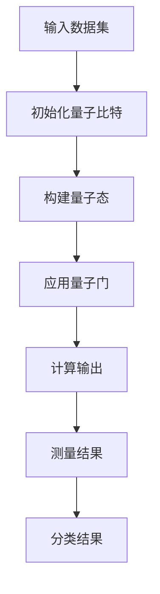
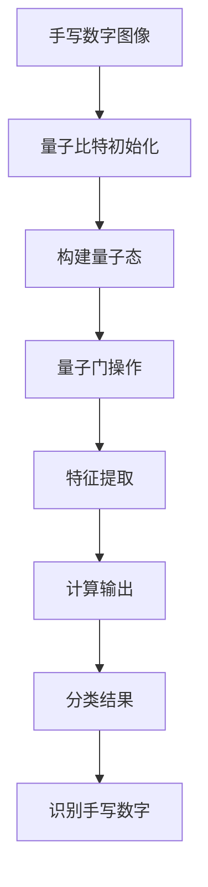
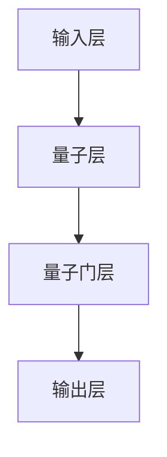
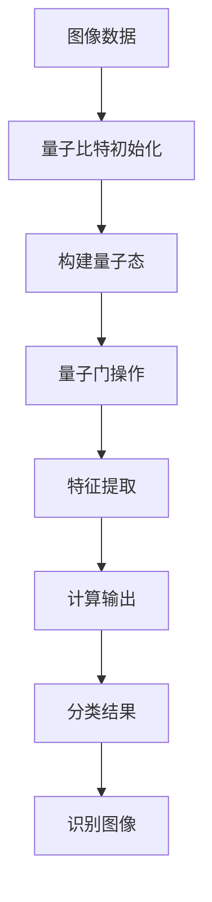
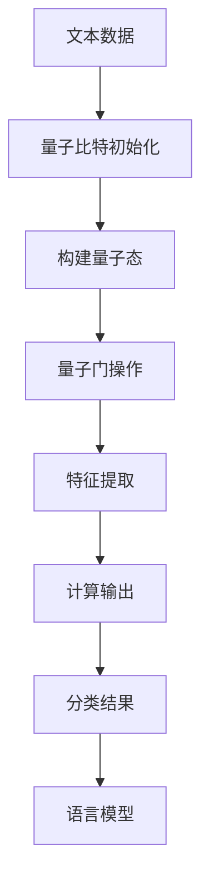
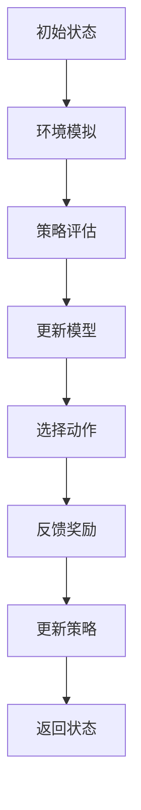
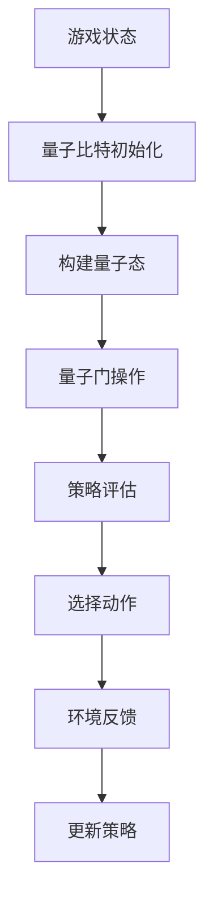
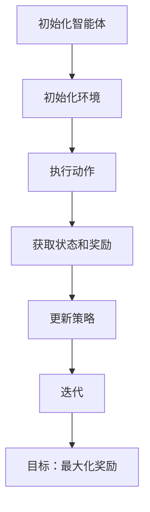
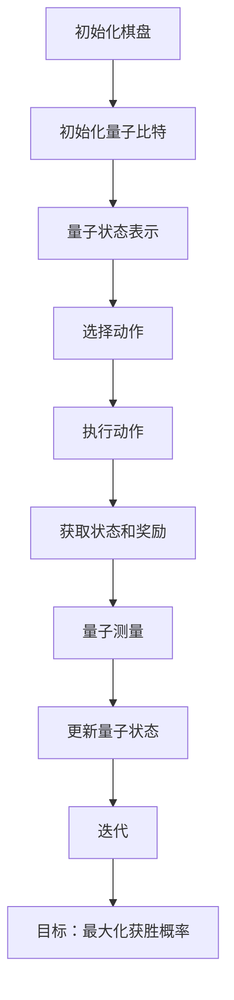

                 

### 文章标题

# 量子力学与人工智能的结合

## 关键词

- 量子计算
- 人工智能
- 量子机器学习
- 量子算法
- 量子神经网络
- 量子加密

## 摘要

本文将探讨量子力学与人工智能的交汇点，从量子计算的基本概念和原理出发，逐步深入到量子机器学习、量子神经网络以及量子深度学习等前沿领域。通过分析量子算法与经典算法的对比，我们将揭示量子计算在人工智能领域的巨大潜力。此外，本文还将介绍量子增强的强化学习、量子加密与量子计算安全等相关应用案例，并对量子人工智能的未来发展进行展望。通过本文的阅读，读者将全面了解量子力学与人工智能结合的核心概念、原理和应用，为深入研究和探索这一领域奠定基础。

---

### 引言

随着科技的飞速发展，量子力学和人工智能作为两个看似截然不同的领域，正在逐渐融合并展现出巨大的潜力。量子力学，作为20世纪初的重要科学革命，揭示了微观世界的奇异性质，如量子叠加、量子纠缠等。而人工智能，自20世纪50年代以来，逐渐成为改变人类生活方式的关键技术。从经典的算法研究到现代的深度学习和强化学习，人工智能已经广泛应用于图像识别、自然语言处理、自动驾驶等领域。

近年来，随着量子计算技术的不断进步，量子力学与人工智能的结合逐渐成为研究的热点。量子计算利用量子比特的叠加和纠缠特性，实现了远超经典计算机的计算能力。而量子机器学习、量子神经网络和量子深度学习等新兴领域，更是将量子计算的潜力发挥到了极致。

本文旨在探讨量子力学与人工智能的结合，从基本概念和原理出发，逐步深入到量子机器学习、量子神经网络、量子深度学习等前沿领域。通过分析量子算法与经典算法的对比，揭示量子计算在人工智能领域的巨大潜力。同时，本文还将介绍量子增强的强化学习、量子加密与量子计算安全等相关应用案例，并对量子人工智能的未来发展进行展望。希望通过本文的阅读，读者能够全面了解量子力学与人工智能结合的核心概念、原理和应用，为深入研究和探索这一领域奠定基础。

### 第一部分：引论

#### 第1章：量子力学基础与人工智能的兴起

量子力学和人工智能作为现代科技的两大支柱，虽然源自不同的学科背景，却有着许多相似之处和交叉点。在这一章中，我们将首先回顾量子力学的历史背景和基本原理，然后探讨人工智能的起源与发展，最后分析量子力学与人工智能的交汇点。

### 1.1 量子力学的历史背景和基本原理

量子力学是20世纪初物理学的重要突破，它的诞生标志着人类对自然世界的认识进入了一个全新的阶段。量子力学的发展经历了以下几个关键阶段：

- **早期量子理论**：1900年，马克斯·普朗克提出了量子假设，试图解释黑体辐射问题。他假设能量以量子形式发射和吸收，这一假设打破了经典物理学中的连续性观念。
- **波粒二象性**：1905年，爱因斯坦在解释光电效应时提出了光子概念，证实了光既具有波动性又具有粒子性。这一发现推动了量子力学的发展。
- **量子力学奠基**：1925年，海森堡提出了矩阵力学，同年，薛定谔提出了波动力学。这两个理论从不同角度描述了量子系统的行为，并在1926年被证明是等价的。
- **量子力学的成熟**：1927年，海森堡提出了不确定性原理，揭示了量子世界中的测量问题。之后，玻尔、海森堡、薛定谔等科学家进一步完善了量子力学理论。

量子力学的基本原理包括：

- **量子叠加**：量子系统可以同时处于多个状态的叠加。
- **量子纠缠**：两个或多个量子系统可以处于纠缠态，其中一个系统的状态会立即影响另一个系统的状态。
- **量子态的坍缩**：当对量子系统进行测量时，其波函数会坍缩到一个特定的状态。

### 1.2 人工智能的起源与发展

人工智能（Artificial Intelligence，AI）是指由人制造出来的系统所表现出的智能行为。人工智能的发展历程可以追溯到20世纪中叶：

- **早期探索**：1950年，艾伦·图灵发表了著名论文《计算机器与智能》，提出了图灵测试，成为人工智能的基石。1956年，约翰·麦卡锡等人在达特茅斯会议上提出了人工智能的概念。
- **早期应用**：20世纪60年代至70年代，人工智能开始应用于自然语言处理、专家系统等领域，但受限于计算能力和算法水平，发展缓慢。
- **复兴与发展**：20世纪80年代至90年代，随着计算机硬件的飞速发展和算法的进步，人工智能迎来了新的发展机遇。特别是在机器学习和深度学习领域的突破，使得人工智能在图像识别、语音识别、自然语言处理等方面取得了显著成果。
- **现代应用**：21世纪初至今，人工智能已经广泛应用于各个领域，包括自动驾驶、智能家居、医疗诊断、金融分析等。

### 1.3 量子力学与人工智能的交汇点

量子力学与人工智能的结合主要体现在以下几个方面：

- **量子计算**：量子计算利用量子比特的叠加和纠缠特性，实现了远超经典计算机的计算能力。量子计算在优化问题、模拟量子系统、密码学等领域具有巨大的应用潜力。
- **量子机器学习**：量子机器学习结合了量子计算和机器学习的方法，能够处理更复杂的数据集和更复杂的模型。量子支持向量机、量子神经网络和量子深度学习等研究正在不断涌现。
- **量子加密**：量子加密利用量子纠缠和量子态的不可克隆性，实现了更安全的通信方式。量子密钥分发和量子安全通信是当前研究的热点。
- **量子智能代理**：量子智能代理是一种结合量子计算和人工智能的方法，用于解决复杂决策问题，如量子优化算法、量子强化学习等。

通过量子力学与人工智能的结合，我们可以期待在未来的科技发展中取得更多的突破和创新。下一章，我们将详细探讨量子计算与量子机器学习的基本概念和原理。

#### 第2章：量子计算与量子机器学习

量子计算是量子力学与计算机科学相结合的产物，它利用量子力学中的基本原理来实现计算。与传统的经典计算机不同，量子计算机采用量子比特（qubit）作为信息的基本单元，并利用量子叠加和量子纠缠等特性，实现了超强的计算能力。

### 2.1 量子计算的基本概念

#### 2.1.1 量子比特

量子比特（qubit）是量子计算的基本单元。与经典计算机中的比特（bit）只能表示0或1不同，量子比特可以同时处于0和1的叠加状态。这种叠加状态可以用以下数学公式表示：

$$
|\psi\rangle = \alpha|0\rangle + \beta|1\rangle
$$

其中，$|\psi\rangle$是量子比特的叠加态，$|0\rangle$和$|1\rangle$是量子比特的基态，$\alpha$和$\beta$是复数系数，满足$|\alpha|^2 + |\beta|^2 = 1$。

#### 2.1.2 量子叠加

量子叠加是量子计算的核心特性之一。一个量子比特可以同时处于0和1的叠加态，多个量子比特的叠加态可以表示为这些量子比特叠加态的线性组合。例如，两个量子比特的叠加态可以表示为：

$$
|\psi\rangle = \alpha_0|00\rangle + \alpha_1|01\rangle + \alpha_2|10\rangle + \alpha_3|11\rangle
$$

其中，$|00\rangle$、$|01\rangle$、$|10\rangle$和$|11\rangle$是两个量子比特的所有可能叠加态。

#### 2.1.3 量子纠缠

量子纠缠是量子力学中的一种特殊现象，当两个或多个量子比特处于纠缠态时，它们之间的状态会相互依赖。即使这些量子比特相隔很远，一个量子比特的状态也会立即影响另一个量子比特的状态。这种纠缠态可以用以下数学公式表示：

$$
|\psi\rangle = \frac{1}{\sqrt{2}} (|01\rangle + |10\rangle)
$$

其中，$|01\rangle$和$|10\rangle$是两个量子比特的纠缠态。

### 2.2 量子计算的优势与挑战

量子计算具有许多优势，但也面临一些挑战。

#### 2.2.1 量子计算的优势

- **并行计算**：量子计算可以利用量子比特的叠加态，实现并行计算。这意味着量子计算机可以同时处理多个计算任务，从而大大提高计算速度。
- **量子纠缠**：量子计算可以利用量子纠缠，实现量子信息的传输和共享。这对于解决一些复杂问题，如量子加密和量子模拟，具有重要意义。
- **高效算法**：一些量子算法在解决特定问题时比经典算法更高效。例如，Shor算法可以快速因数分解大整数，而Grover算法可以加速搜索算法。

#### 2.2.2 量子计算的挑战

- **量子比特的稳定性**：量子比特容易受到外部环境的干扰，导致量子态的退相干。为了保持量子比特的稳定性，需要开发更先进的量子纠错技术。
- **量子计算的可扩展性**：当前量子计算机的量子比特数量有限，要实现大规模量子计算，需要解决量子比特的可扩展性问题。
- **量子编程和算法设计**：量子计算与传统计算机在编程和算法设计上有很大差异。需要开发新的编程语言和算法，以充分利用量子计算的优势。

### 2.3 量子机器学习的基本原理

量子机器学习是量子计算和机器学习的交叉领域，它利用量子计算的并行性和高效性来处理机器学习问题。量子机器学习包括以下几个主要研究方向：

- **量子支持向量机**：量子支持向量机（QSVM）利用量子计算的并行性和高效性，实现高效的数据分类和回归。
- **量子神经网络**：量子神经网络（QNN）结合了量子计算和神经网络的优点，能够处理更复杂的数据和任务。
- **量子深度学习**：量子深度学习利用量子计算的并行性和高效性，实现大规模深度学习模型的训练。

在下一章中，我们将进一步探讨量子算法与经典算法的对比，分析量子计算在人工智能领域的潜力。

#### 第3章：量子算法与经典算法的对比

量子算法与经典算法在理论上有很大的不同，量子算法利用量子比特的叠加和纠缠特性，实现了在特定问题上的超越。以下我们将对比量子算法与经典算法在计算复杂度、并行性和效率等方面的差异。

### 3.1 经典算法的局限性

经典算法是基于经典计算机的原理设计的，它们在处理某些类型的问题时存在局限性。

- **计算复杂度**：一些经典算法在解决特定问题时需要指数级的时间复杂度。例如，Shor算法用于因数分解的大整数问题，其时间复杂度为$O(N^{\log_2 6})$，远低于当前最快的经典算法。
- **并行性**：经典计算机的并行性受到硬件和软件的限制。虽然现代计算机能够利用多核处理器实现并行计算，但与量子计算机的并行性相比，仍然有较大的差距。
- **数值误差**：在经典算法中，数值计算往往会产生误差，且这些误差会随着计算过程的进行而累积。这在一些高精度计算中是一个严重的问题。

### 3.2 量子算法的优势

量子算法利用量子力学的基本原理，如叠加态和纠缠态，实现了在特定问题上的突破。

- **计算复杂度**：量子算法能够显著降低某些问题的计算复杂度。例如，Shor算法在因数分解问题上的时间复杂度为$O(N^{\log_2 6})$，远低于经典算法的指数级复杂度。
- **并行性**：量子计算机的并行性源于量子比特的叠加态。一个量子比特可以同时处于0和1的叠加态，多个量子比特的叠加态可以表示多个计算路径。这使得量子计算机在并行计算上具有巨大的优势。
- **高效算法**：量子算法能够解决一些经典算法无法解决的问题。例如，Grover算法用于加速搜索问题，其搜索复杂度为$O(\sqrt{N})$，远低于经典算法的$O(N)$。

### 3.3 量子算法与经典算法的交互

虽然量子算法在某些问题上有显著优势，但量子计算机仍然需要与经典计算机结合，才能充分发挥其潜力。

- **混合算法**：量子算法和经典算法可以相互结合，形成混合算法。例如，量子近似优化算法（QAOA）结合了量子计算和经典优化的方法，用于解决优化问题。
- **量子辅助经典算法**：在许多情况下，量子计算机可以作为一个高效的辅助工具，帮助经典算法解决特定问题。例如，量子计算可以用于生成高质量的初始解，然后由经典算法进行优化。
- **量子经典转换**：量子算法和经典算法之间的转换是研究的热点。通过将量子算法转换为经典算法，可以更好地理解和分析量子算法的性质。

### 3.4 量子算法的应用案例

以下是一些量子算法在人工智能领域的应用案例：

- **量子支持向量机**：量子支持向量机（QSVM）可以用于高效的数据分类和回归。通过量子计算的优势，QSVM能够处理更复杂的数据集和更复杂的模型。
- **量子神经网络**：量子神经网络（QNN）结合了量子计算和神经网络的优点，能够处理更复杂的数据和任务。QNN在图像识别、自然语言处理等领域具有广泛的应用前景。
- **量子深度学习**：量子深度学习利用量子计算的并行性和高效性，实现大规模深度学习模型的训练。量子深度学习在语音识别、图像处理等领域具有巨大的潜力。

通过对比量子算法与经典算法，我们可以看到量子计算在人工智能领域的巨大潜力。下一章，我们将深入探讨量子机器学习的基本原理和应用。

### 第4章：量子机器学习应用

量子机器学习是量子计算与机器学习相结合的产物，它利用量子计算的并行性和高效性来处理复杂的机器学习问题。量子机器学习包括多个研究方向，如量子支持向量机、量子神经网络和量子深度学习等。以下我们将详细介绍这些研究方向的原理和应用。

#### 4.1 量子支持向量机

量子支持向量机（Quantum Support Vector Machine, QSVM）是量子机器学习的一个重要研究方向。QSVM利用量子计算的叠加和纠缠特性，实现了高效的数据分类和回归。

#### 4.1.1 支持向量机的基本概念

支持向量机（Support Vector Machine, SVM）是一种经典的机器学习算法，用于数据分类和回归。SVM的核心思想是找到一个最佳的超平面，将数据集划分为不同的类别。

#### 4.1.2 量子支持向量机的原理

量子支持向量机利用量子比特的叠加态和量子纠缠，实现了高效的数据分类。在QSVM中，数据集被表示为量子态，通过量子门的作用，将数据集映射到一个高维空间，然后寻找最佳的超平面。

以下是量子支持向量机的基本流程：



#### 4.1.3 量子支持向量机在数据分类中的应用

量子支持向量机在数据分类中的应用非常广泛。通过量子计算的优势，QSVM能够处理更复杂的数据集和更复杂的模型。以下是一个具体的应用案例：

**应用案例：手写数字识别**

在手写数字识别中，QSVM可以用于分类手写数字图像。通过将手写数字图像表示为量子态，并利用量子门进行特征提取，QSVM能够高效地识别手写数字。

以下是量子支持向量机在手写数字识别中的应用流程：



通过量子支持向量机在手写数字识别中的应用，我们可以看到量子机器学习在图像识别领域的巨大潜力。

#### 4.2 量子神经网络

量子神经网络（Quantum Neural Network, QNN）是量子机器学习的另一个重要研究方向。QNN结合了量子计算和神经网络的优点，能够处理更复杂的数据和任务。

#### 4.2.1 神经网络的基本概念

神经网络是一种模拟生物神经系统的计算模型，通过多层神经元之间的相互连接，实现对数据的处理和预测。

#### 4.2.2 量子神经网络的设计

量子神经网络由量子比特组成，通过量子比特之间的交互来实现信息处理。以下是量子神经网络的基本设计：



#### 4.2.3 量子神经网络在图像识别中的应用

量子神经网络在图像识别中具有广泛的应用前景。通过将图像表示为量子态，并利用量子门进行特征提取和分类，QNN能够高效地识别图像。

以下是量子神经网络在图像识别中的应用流程：



通过量子神经网络在图像识别中的应用，我们可以看到量子机器学习在图像处理领域的巨大潜力。

#### 4.3 量子深度学习

量子深度学习（Quantum Deep Learning）是量子机器学习的最新研究方向，它利用量子计算的并行性和高效性，实现大规模深度学习模型的训练。

#### 4.3.1 深度学习的基本概念

深度学习是一种基于多层神经网络的机器学习方法，通过逐层提取数据特征，实现对复杂数据的建模和预测。

#### 4.3.2 量子深度学习的研究进展

量子深度学习结合了量子计算和深度学习的优势，已经在多个领域取得了重要进展。以下是量子深度学习在自然语言处理中的应用：

- **量子文本分类**：通过将文本表示为量子态，并利用量子神经网络进行特征提取和分类，量子深度学习能够实现高效的自然语言处理。
- **量子语言模型**：通过训练量子神经网络，量子深度学习可以生成高质量的文本摘要和对话系统。

以下是量子深度学习在自然语言处理中的应用流程：



通过量子深度学习在自然语言处理中的应用，我们可以看到量子机器学习在语言处理领域的巨大潜力。

#### 4.4 量子增强的强化学习

量子增强的强化学习（Quantum Reinforcement Learning, QRL）是量子机器学习的另一个重要研究方向。QRL结合了量子计算和强化学习的方法，用于解决复杂的决策问题。

#### 4.4.1 强化学习的基本概念

强化学习是一种通过试错来学习如何在特定环境中做出最优决策的机器学习方法。强化学习的关键是奖励机制，通过奖励来引导算法学习最优策略。

#### 4.4.2 量子增强的强化学习的原理

量子增强的强化学习利用量子计算的优势，实现了高效的学习和决策。在QRL中，量子计算用于模拟环境、评估策略和更新模型。

以下是量子增强的强化学习的基本流程：



#### 4.4.3 量子增强的强化学习在游戏中的应用

量子增强的强化学习在游戏领域中具有广泛的应用前景。通过将游戏表示为量子态，并利用量子计算进行决策，QRL能够实现高效的游戏AI。

以下是量子增强的强化学习在游戏中的应用流程：



通过量子增强的强化学习在游戏中的应用，我们可以看到量子机器学习在智能决策领域的巨大潜力。

#### 4.5 量子机器学习的发展趋势

量子机器学习作为一门新兴的交叉学科，正在不断发展。以下是量子机器学习的发展趋势：

- **算法优化**：通过改进量子算法和量子机器学习模型，实现更高的计算效率和更好的性能。
- **量子硬件发展**：随着量子计算机的硬件技术不断发展，量子机器学习的应用将更加广泛。
- **多学科融合**：量子机器学习与其他学科如量子化学、量子物理学等的融合，将推动量子机器学习在更多领域的应用。
- **应用拓展**：量子机器学习将在金融、医疗、交通等领域得到更广泛的应用，为社会发展和人类福祉作出贡献。

通过本章的介绍，我们可以看到量子机器学习在多个领域的应用前景。下一章，我们将进一步探讨量子计算与金融领域的关系。

### 第5章：量子计算与金融

随着量子计算技术的不断进步，金融领域对其潜在应用表现出浓厚的兴趣。量子计算在金融风险管理、市场分析和投资策略优化等方面具有巨大的潜力。本章节将探讨量子计算在金融领域的应用，并分析其面临的挑战和未来展望。

#### 5.1 金融领域中的计算问题

金融领域面临许多复杂的计算问题，这些问题传统经典计算方法难以高效解决。以下是一些典型的计算问题：

- **大规模数据处理**：金融市场中每天产生大量交易数据，对这些数据进行分析和预测需要高效的处理能力。
- **风险评估**：在金融市场中，风险识别和评估是至关重要的任务。传统的风险评估方法往往依赖于复杂的数学模型，计算成本高昂。
- **交易策略优化**：投资者需要制定高效的交易策略来最大化收益。这涉及到复杂的优化问题，需要快速计算和模拟。

#### 5.2 量子计算在金融风险管理中的应用

量子计算在金融风险管理中的应用主要体现在以下几个方面：

- **蒙特卡洛模拟**：蒙特卡洛模拟是一种常用的风险评估方法，它通过模拟大量随机场景来估计金融产品的风险。量子计算能够显著加速蒙特卡洛模拟，提高风险评估的效率和准确性。
- **期权定价模型**：期权定价模型是金融风险管理的重要工具。量子计算可以加速求解Black-Scholes模型等复杂期权定价模型，提高期权定价的精度和速度。
- **信用风险评估**：信用风险评估涉及到大量数据分析和复杂模型。量子计算可以加速信用评分模型的训练和预测，提高信用风险评估的效率和准确性。

#### 5.3 量子计算在金融市场分析中的应用

量子计算在金融市场分析中的应用同样具有很大的潜力：

- **市场趋势预测**：通过分析历史数据和市场动态，量子计算可以识别出潜在的市场趋势和异常行为，为投资者提供有价值的参考。
- **量化交易策略**：量子计算可以加速量化交易策略的优化和模拟，帮助投资者制定更有效的交易策略。
- **高频交易**：高频交易依赖于快速的计算和决策。量子计算可以提高高频交易的执行速度和精度，增加交易收益。

#### 5.4 量子计算在投资策略优化中的应用

量子计算在投资策略优化中的应用主要体现在以下几个方面：

- **优化投资组合**：投资者需要从大量资产中构建最优的投资组合。量子计算可以加速优化算法，快速找到最优的投资组合配置。
- **风险调整收益**：在投资策略优化中，需要考虑风险调整后的收益。量子计算可以加速计算风险调整收益，帮助投资者更好地评估投资组合的表现。
- **算法交易**：算法交易依赖于复杂的数学模型和快速的计算。量子计算可以加速算法交易的执行速度，提高交易效率。

#### 5.5 量子计算在金融领域面临的挑战

尽管量子计算在金融领域具有巨大的潜力，但其在实际应用中仍面临一些挑战：

- **量子硬件限制**：当前量子计算机的量子比特数量有限，稳定性较差。这限制了量子计算在金融领域的大规模应用。
- **算法适应性**：许多金融模型和算法需要适应量子计算的特殊性质，如量子门和量子测量。这需要开发新的算法和优化方法。
- **量子安全**：量子计算在金融领域的应用需要保证数据的安全性。量子加密和量子安全通信是当前研究的热点。

#### 5.6 量子计算在金融领域的未来展望

随着量子计算技术的不断发展，金融领域有望在以下方面取得突破：

- **更高效的风险评估**：量子计算可以提高风险评估的效率和准确性，为金融机构提供更可靠的风险管理工具。
- **更优化的投资策略**：量子计算可以加速投资策略的优化，帮助投资者实现更高的收益。
- **更智能的市场分析**：量子计算可以提供更深入的市场洞察和分析，为投资者提供更准确的市场预测。
- **量子金融应用**：随着量子技术的进步，金融领域将涌现出更多基于量子计算的金融应用，如量子加密、量子算法交易等。

通过量子计算在金融领域的应用，我们可以期待在未来的金融市场中取得更多的突破和创新。

### 第6章：量子计算与医疗健康

量子计算在医疗健康领域的应用潜力巨大，能够解决许多传统计算方法难以处理的复杂问题。本章将探讨量子计算在疾病预测、个性化医疗和医疗数据分析等方面的应用，并分析其面临的挑战和未来展望。

#### 6.1 医疗健康领域中的计算需求

医疗健康领域涉及大量复杂的计算需求，这些需求传统计算方法难以高效满足：

- **海量数据处理**：医疗健康数据包括电子健康记录、基因组数据、医学影像等，数据量庞大且结构复杂。对这些数据进行处理和分析需要高效的计算能力。
- **精准疾病预测**：疾病预测需要分析大量的医学数据，如病史、遗传信息、生活方式等，以预测个体患病的风险。这需要复杂的计算模型和高效的算法。
- **个性化医疗**：个性化医疗旨在根据患者的具体情况进行个性化治疗。这需要精确的数据分析和复杂的计算模型，以确定最佳的治疗方案。

#### 6.2 量子计算在疾病预测中的应用

量子计算在疾病预测中的应用主要体现在以下几个方面：

- **基因组数据分析**：基因组数据包含个体的遗传信息，对疾病预测具有重要意义。量子计算可以加速对基因组数据的分析，提高疾病预测的准确性。
- **多变量模型构建**：疾病预测通常涉及多个变量的综合分析。量子计算可以加速多变量模型的构建和训练，提高预测的效率和准确性。
- **复杂模型求解**：一些疾病预测模型非常复杂，难以通过传统计算方法求解。量子计算可以加速这些模型的求解，提高预测的速度和精度。

#### 6.3 量子计算在个性化医疗中的应用

个性化医疗旨在根据患者的具体情况进行个性化治疗。量子计算在个性化医疗中的应用主要包括：

- **药物筛选**：通过分析患者的基因组数据和药物特性，量子计算可以加速药物筛选过程，找到最佳的治疗方案。
- **个性化治疗方案**：量子计算可以分析患者的具体病情，制定个性化的治疗方案，提高治疗效果。
- **实时监控与调整**：量子计算可以实时监控患者的病情和治疗反应，及时调整治疗方案，提高治疗效果。

#### 6.4 量子计算在医疗数据分析中的应用

量子计算在医疗数据分析中的应用主要体现在以下几个方面：

- **大规模数据处理**：量子计算可以加速对大规模医疗数据的处理和分析，提高数据处理效率。
- **复杂模型训练**：医疗数据分析通常涉及复杂的计算模型，如神经网络、支持向量机等。量子计算可以加速这些模型的训练和优化，提高分析精度。
- **异常检测与诊断**：量子计算可以用于异常检测和疾病诊断，通过分析医疗数据中的异常模式，识别潜在的健康问题。

#### 6.5 量子计算在医疗健康领域面临的挑战

尽管量子计算在医疗健康领域具有巨大的潜力，但其在实际应用中仍面临一些挑战：

- **量子硬件限制**：当前量子计算机的量子比特数量有限，稳定性较差，这限制了量子计算在医疗健康领域的大规模应用。
- **数据隐私**：医疗数据包含敏感的个人信息，量子计算在处理这些数据时需要确保数据的安全性。
- **算法适应性**：许多医疗模型和算法需要适应量子计算的特殊性质，如量子门和量子测量。这需要开发新的算法和优化方法。

#### 6.6 量子计算在医疗健康的未来展望

随着量子计算技术的不断发展，医疗健康领域有望在以下方面取得突破：

- **更精准的疾病预测**：量子计算可以提高疾病预测的准确性和效率，为医生提供更可靠的预测工具。
- **更个性化的治疗方案**：量子计算可以分析患者的具体病情，制定个性化的治疗方案，提高治疗效果。
- **更高效的医疗数据分析**：量子计算可以加速医疗数据分析，提高数据处理效率，为医生提供更全面的诊断和治疗建议。
- **新的医疗应用**：随着量子技术的进步，医疗健康领域将涌现出更多基于量子计算的新应用，如量子药物设计、量子影像分析等。

通过量子计算在医疗健康领域的应用，我们可以期待在未来实现更精准、更个性化的医疗服务，为人类健康事业作出更大贡献。

### 第7章：量子增强的强化学习

量子增强的强化学习（Quantum Reinforcement Learning, QRL）是量子计算与强化学习相结合的产物，它利用量子计算的并行性和高效性来提高强化学习算法的性能。本章节将探讨量子增强的强化学习的基本原理、研究进展以及在游戏中的应用。

#### 7.1 强化学习的基本概念

强化学习（Reinforcement Learning, RL）是一种通过试错来学习如何在特定环境中做出最优决策的机器学习方法。在强化学习中，智能体（Agent）通过与环境（Environment）的交互，学习到最优策略（Policy），以最大化累积奖励（Reward）。

强化学习的基本要素包括：

- **智能体（Agent）**：执行动作并接受环境反馈的主体。
- **环境（Environment）**：智能体所处的场景，能够根据智能体的动作产生状态转移和奖励。
- **状态（State）**：智能体在环境中的一个特定情境。
- **动作（Action）**：智能体可以执行的行为。
- **策略（Policy）**：智能体在给定状态下选择动作的策略。
- **奖励（Reward）**：智能体在每个状态执行动作后获得的奖励，用于评估智能体的表现。

#### 7.2 量子增强的强化学习的原理

量子增强的强化学习结合了量子计算的优势和强化学习的方法，通过量子计算来提高学习效率。以下是一个简化的量子增强的强化学习框架：



量子增强的强化学习主要包含以下几个步骤：

1. **量子态初始化**：智能体在初始状态下，初始化量子比特的叠加态，表示当前状态的所有可能性。
2. **量子动作选择**：通过量子操作（如量子门）来选择动作，量子态的叠加和纠缠使得智能体可以同时探索多个动作。
3. **环境交互**：智能体执行动作，并与环境交互，获得状态转移和奖励。
4. **量子测量**：对量子态进行测量，得到具体的动作结果和奖励。
5. **策略更新**：根据测量结果，更新量子态，调整策略，以最大化未来的奖励。

#### 7.3 量子增强的强化学习的研究进展

量子增强的强化学习是一个相对较新的研究领域，目前已有一些研究成果：

- **量子策略梯度方法**：该方法利用量子计算的优势，直接计算策略梯度的期望值，以更新策略。量子策略梯度方法可以显著加速强化学习算法。
- **量子Monte Carlo方法**：该方法利用量子计算的并行性，加速蒙特卡洛搜索过程，提高学习效率。
- **量子状态表示**：通过量子计算来表示状态和动作，实现更高效的状态和动作表示。

#### 7.4 量子增强的强化学习在游戏中的应用

量子增强的强化学习在游戏领域具有广泛的应用前景，以下是一些具体的应用案例：

- **棋类游戏**：量子增强的强化学习可以用于训练棋类游戏的AI，如国际象棋、围棋等。通过量子计算，智能体可以同时探索多个可能的走法，提高搜索效率。
- **电子游戏**：量子增强的强化学习可以用于训练电子游戏的AI，如《星际争霸》、《Dota 2》等。通过量子计算，智能体可以更快速地学习和适应游戏策略。
- **策略优化**：量子增强的强化学习可以用于优化游戏策略，提高游戏的竞争力和可玩性。

#### 7.5 量子增强的强化学习在游戏中的应用实例

以下是一个量子增强的强化学习在游戏中的应用实例：

**游戏**：国际象棋

**智能体**：一个基于量子增强的强化学习算法的国际象棋AI

**环境**：国际象棋棋盘，包括棋子的状态和规则

**策略**：基于量子态的智能体策略，通过量子计算选择最佳走法

**算法流程**：



通过量子增强的强化学习，国际象棋AI可以更快速地学习和适应游戏策略，提高获胜的概率。

#### 7.6 量子增强的强化学习的未来展望

量子增强的强化学习作为一门新兴的研究领域，具有广阔的应用前景。未来，量子增强的强化学习有望在以下方面取得突破：

- **更高效的学习算法**：通过改进量子计算模型和算法，实现更高效的学习过程。
- **更广泛的应用领域**：量子增强的强化学习将在更多领域得到应用，如自动驾驶、金融交易、医疗诊断等。
- **多智能体系统**：量子增强的强化学习在多智能体系统中的应用，有望实现更智能的协同和决策。

通过量子增强的强化学习，我们可以期待在未来实现更智能、更高效的决策系统，为各个领域的发展带来新的突破。

### 第8章：量子人工智能的未来展望

随着量子计算技术的不断发展，量子人工智能（Quantum Artificial Intelligence）成为未来科技领域的一个热门话题。本章节将探讨量子人工智能的发展趋势、对社会的影响以及面临的挑战与机遇。

#### 8.1 量子人工智能的发展趋势

量子人工智能的发展趋势可以从以下几个方面进行概述：

- **硬件技术突破**：量子计算机的硬件技术不断进步，量子比特的数量和质量不断提高，使得量子计算的应用范围越来越广泛。
- **算法优化**：量子算法和量子机器学习算法不断优化，提高了量子计算的效率和精度，为解决复杂问题提供了新的工具。
- **跨学科融合**：量子人工智能与其他领域的交叉融合，如量子化学、量子物理学、量子生物学等，为量子人工智能的研究提供了新的视角和思路。
- **实际应用**：量子人工智能在金融、医疗、交通、能源等领域的应用不断拓展，显示出巨大的潜力。

#### 8.2 量子人工智能对社会的影响

量子人工智能对社会的影响是多方面的，以下是一些主要方面：

- **经济影响**：量子人工智能可以大幅提升计算能力和效率，推动科技创新和产业发展，对经济增长产生重要影响。
- **医疗健康**：量子人工智能在疾病预测、个性化医疗、药物研发等方面的应用，有望提高医疗服务的质量和效率，改善人们的健康状况。
- **金融领域**：量子人工智能在金融市场分析、风险管理、投资策略优化等方面的应用，可以提高金融行业的效率，降低风险。
- **交通和能源**：量子人工智能在自动驾驶、智能交通系统、能源管理等方面的应用，有助于提高交通和能源的利用效率，促进可持续发展。
- **社会生活**：量子人工智能在智能家居、智能城市、智能客服等方面的应用，将改变人们的生活方式，提高生活质量。

#### 8.3 量子人工智能面临的挑战与机遇

量子人工智能在发展过程中面临一些挑战和机遇：

- **挑战**：
  - **量子硬件限制**：当前量子计算机的量子比特数量有限，稳定性较差，限制了量子人工智能的实际应用。
  - **算法适应性**：许多传统人工智能算法需要适应量子计算的特殊性质，如量子门和量子测量。这需要开发新的算法和优化方法。
  - **数据隐私和安全**：量子人工智能在处理敏感数据时需要确保数据的安全性和隐私性，这是一个重要的挑战。
  - **伦理和监管**：随着量子人工智能的快速发展，需要建立相应的伦理和监管框架，以确保其合理、安全和可控的应用。

- **机遇**：
  - **技术创新**：量子人工智能为技术创新提供了新的机遇，有望在量子计算、量子通信、量子模拟等领域实现重大突破。
  - **社会进步**：量子人工智能有望在医疗、金融、交通、能源等领域推动社会进步，提高生产效率和生活质量。
  - **经济转型**：量子人工智能的兴起将推动产业转型，培育新的经济增长点，促进经济结构优化。

#### 8.4 量子人工智能的潜在应用场景

量子人工智能在未来有望在多个领域实现广泛应用，以下是一些潜在的应用场景：

- **复杂问题求解**：量子人工智能可以用于解决复杂优化问题、大规模数据处理问题等，如物流优化、金融市场预测等。
- **医疗诊断**：量子人工智能可以用于医学影像分析、疾病预测、药物筛选等，提高医疗诊断的准确性和效率。
- **能源管理**：量子人工智能可以用于能源系统的优化管理、能源需求预测等，提高能源利用效率，促进可持续发展。
- **智能交通**：量子人工智能可以用于交通流量预测、自动驾驶、智能交通信号控制等，提高交通运行效率和安全性。
- **金融科技**：量子人工智能可以用于金融风险评估、交易策略优化、风险管理等，提高金融服务的效率和质量。

通过量子人工智能的发展，我们可以期待在未来实现更智能、更高效的解决方案，为人类社会的发展带来新的机遇和挑战。

### 第9章：量子计算与金融

量子计算在金融领域的应用具有重要的潜在价值，能够显著提升金融分析和决策的效率。本章将探讨量子计算在金融中的应用案例，包括量子加密、量子计算在风险管理、投资策略优化等方面的实际应用。

#### 9.1 量子加密

量子加密是量子计算在金融安全中的重要应用。量子加密利用量子纠缠和量子态的不可克隆性，实现了比传统加密方法更安全的通信方式。以下是量子加密的基本原理和实际应用：

- **量子密钥分发（Quantum Key Distribution, QKD）**：量子密钥分发是一种通过量子通信传输密钥的方法，能够确保密钥的安全传输。在金融交易中，量子密钥分发可以用于保护交易数据的机密性，防止信息泄露。
- **量子安全通信**：量子安全通信利用量子纠缠和量子态的不可克隆性，实现安全的通信。在金融交易中，量子安全通信可以用于保护交易信息的完整性，防止篡改和攻击。

#### 9.2 量子计算在风险管理中的应用

量子计算在金融风险管理中的应用主要体现在以下几个方面：

- **蒙特卡洛模拟**：蒙特卡洛模拟是一种常用的金融风险管理方法，用于评估金融产品的风险。量子计算可以显著加速蒙特卡洛模拟，提高风险识别和评估的效率。
- **期权定价**：期权定价是金融风险管理的重要工具。量子计算可以加速求解Black-Scholes模型等复杂期权定价模型，提高期权定价的精度和速度。
- **信用风险评估**：量子计算可以用于信用风险评估，通过分析客户的财务数据、交易记录等，快速评估客户的信用风险，为金融机构提供更可靠的风险管理工具。

#### 9.3 投资策略优化

量子计算在投资策略优化中的应用主要体现在以下几个方面：

- **量化交易**：量化交易是一种基于数据分析和数学模型的交易策略。量子计算可以加速量化交易模型的训练和优化，提高交易策略的效率和收益。
- **投资组合优化**：投资组合优化是金融投资中的重要任务。量子计算可以加速对投资组合的优化，快速找到最优的投资组合配置，提高收益的同时控制风险。
- **市场预测**：量子计算可以用于市场预测，通过分析市场数据、经济指标等，快速识别市场趋势和异常行为，为投资者提供有价值的参考。

#### 9.4 量子计算在金融领域的实际应用案例

以下是一个量子计算在金融领域的实际应用案例：

**案例：量子加密在电子支付系统中的应用**

某金融机构开发了一套基于量子加密的电子支付系统，用于保护客户的支付信息。该系统采用了量子密钥分发技术，确保支付密钥在传输过程中的安全性。同时，系统还利用量子安全通信技术，保护交易信息的完整性，防止篡改和攻击。

**实现步骤**：

1. **密钥生成**：客户在发起支付请求时，系统通过量子密钥分发技术生成一对密钥，并将私钥安全地传输给客户。
2. **加密支付信息**：客户使用私钥对支付信息进行加密，确保支付信息的机密性。
3. **传输加密信息**：加密后的支付信息通过量子安全通信网络传输到金融机构。
4. **解密支付信息**：金融机构使用公钥对加密信息进行解密，获取原始支付信息。
5. **交易确认**：金融机构对交易信息进行验证，确认交易的有效性和安全性。

通过量子加密技术的应用，该电子支付系统实现了更高的安全性和可靠性，为金融交易提供了更安全的保障。

#### 9.5 量子计算在金融领域的未来展望

随着量子计算技术的不断发展，量子计算在金融领域的应用前景十分广阔。未来，量子计算有望在以下方面实现突破：

- **风险管理**：量子计算可以用于更高效的风险评估和信用评分，提高金融风险管理的准确性和效率。
- **投资策略**：量子计算可以用于优化投资策略，提高投资收益的同时控制风险。
- **市场预测**：量子计算可以用于市场预测和趋势分析，为投资者提供更准确的市场洞察。
- **金融科技**：量子计算可以与金融科技相结合，推动金融创新和产业升级。

通过量子计算在金融领域的应用，我们可以期待实现更高效、更安全的金融服务，为金融行业的可持续发展提供新的动力。

### 第10章：量子计算与医疗健康

量子计算在医疗健康领域具有巨大的潜力，能够提升医疗诊断、个性化治疗和药物研发的效率。本章将探讨量子计算在医疗健康领域的应用案例，包括量子加密在医疗数据保护中的应用、量子计算在基因组数据分析中的应用、以及量子模拟在药物设计中的应用。

#### 10.1 量子加密在医疗数据保护中的应用

随着医疗信息化的发展，医疗数据的保护变得越来越重要。量子加密作为一种高级加密技术，能够提供更安全的数据保护手段。以下是量子加密在医疗数据保护中的应用案例：

**案例：量子加密在电子健康记录（EHR）中的应用**

某医院采用了基于量子加密的电子健康记录系统，用于保护患者的医疗数据。该系统采用量子密钥分发（QKD）技术，确保医疗数据的传输过程是安全的。

**实现步骤**：

1. **密钥生成**：当患者访问医疗系统时，系统通过量子密钥分发技术生成一对密钥，并将私钥安全地存储在患者的设备上。
2. **数据加密**：患者在查看或修改医疗数据时，系统使用量子加密算法对数据加密，确保数据在传输过程中不会被窃取或篡改。
3. **数据传输**：加密后的数据通过量子安全通信网络传输到医院的数据库。
4. **数据解密**：医院在接收数据时，使用公钥对数据进行解密，以便查看和处理。

通过量子加密技术的应用，该电子健康记录系统实现了更高的数据安全性和隐私性，为患者提供了更可靠的医疗服务。

#### 10.2 量子计算在基因组数据分析中的应用

基因组数据分析是现代医学的重要领域，量子计算能够显著提升基因组数据分析的效率。以下是量子计算在基因组数据分析中的应用案例：

**案例：量子计算在基因组序列比对中的应用**

某科研机构利用量子计算对大量基因组数据进行序列比对，以识别潜在的基因变异和疾病关联。

**实现步骤**：

1. **基因组数据加载**：将基因组数据加载到量子计算机中，表示为量子态。
2. **序列比对**：通过量子计算算法进行序列比对，快速找到基因组序列之间的相似性和差异。
3. **结果分析**：分析比对结果，识别潜在的基因变异和疾病关联。

通过量子计算的应用，该科研机构能够更快速、准确地分析大量基因组数据，为基因研究和疾病诊断提供了新的工具。

#### 10.3 量子模拟在药物设计中的应用

药物设计是医疗健康领域的关键问题，量子计算能够通过量子模拟加速药物设计过程。以下是量子模拟在药物设计中的应用案例：

**案例：量子计算在药物-蛋白质相互作用研究中的应用**

某药物研发公司利用量子计算研究药物与蛋白质的相互作用，以优化药物的设计。

**实现步骤**：

1. **分子建模**：将药物和蛋白质的分子结构表示为量子模型。
2. **量子模拟**：利用量子计算机模拟药物与蛋白质的相互作用过程，分析药物分子的活性。
3. **优化设计**：根据模拟结果，优化药物分子的结构，提高药物的疗效和安全性。

通过量子计算的应用，该药物研发公司能够更快速、准确地研究药物与蛋白质的相互作用，为药物设计提供了新的方法。

#### 10.4 量子计算在医疗健康领域的未来展望

随着量子计算技术的不断发展，量子计算在医疗健康领域的应用前景十分广阔。未来，量子计算有望在以下方面实现突破：

- **基因组数据分析**：量子计算可以加速基因组数据分析，为基因研究和疾病诊断提供更准确的信息。
- **个性化医疗**：量子计算可以用于个性化治疗方案的制定，提高治疗效果和患者满意度。
- **药物设计**：量子计算可以加速药物设计过程，提高药物的研发效率。
- **医疗影像分析**：量子计算可以用于医疗影像分析，提升诊断的准确性和效率。

通过量子计算在医疗健康领域的应用，我们可以期待实现更高效、更精准的医疗诊断和治疗，为人类健康事业作出更大贡献。

### 附录

#### 附录A：量子计算资源介绍

为了更好地了解和应用量子计算，以下介绍一些常见的量子计算资源和工具。

##### A.1 量子计算平台介绍

- **IBM Q Quantum Computing Platform**：IBM Q是一个开源的量子计算平台，提供了多种量子计算机的模拟和访问接口。用户可以通过IBM Q Experience在线体验量子计算，并使用IBM Q编程语言进行量子算法开发。

- **Google Quantum AI**：Google Quantum AI提供了一个基于云的量子计算平台，用户可以通过Google Cloud访问量子计算机，并使用Quantum Programming SDK进行量子算法开发。

- **Microsoft Quantum Development Kit**：Microsoft Quantum Development Kit提供了一个集成开发环境，用于开发量子算法和应用。用户可以使用Quantum Development Kit进行量子编程，并在本地计算机上进行模拟。

##### A.2 量子计算编程语言

- **Q#**：Q#是IBM Q平台上的编程语言，用于开发量子算法和应用。Q#支持量子编程的基本语法和操作，包括量子比特、量子门、量子测量等。

- **Quantum Kata**：Quantum Kata是Google Quantum AI的编程语言，用于开发量子算法和应用。Quantum Kata支持量子编程的高级特性，如量子电路设计、量子算法优化等。

- **QDK**：QDK是Microsoft Quantum Development Kit的编程语言，用于开发量子算法和应用。QDK提供了丰富的库和工具，支持量子编程的各种任务和操作。

##### A.3 量子计算开源工具

- **Qiskit**：Qiskit是IBM Q的开源量子计算工具，提供了量子算法开发、模拟和优化等功能。Qiskit支持多种量子计算平台，包括本地模拟器、云平台等，用户可以方便地使用Qiskit进行量子编程。

- **Project Quantum**：Project Quantum是Google Quantum AI的开源量子计算工具，提供了量子算法开发、模拟和优化等功能。Project Quantum支持量子电路设计、量子算法优化等高级特性。

- **Project Winchester**：Project Winchester是Microsoft Quantum Development Kit的开源量子计算工具，提供了量子算法开发、模拟和优化等功能。Project Winchester支持多种量子计算平台，用户可以方便地使用Winchester进行量子编程。

通过这些量子计算资源和工具，用户可以方便地了解和应用量子计算，探索量子计算在各个领域的潜力。

### 附录B：量子机器学习工具使用指南

量子机器学习（Quantum Machine Learning, QML）作为量子计算与机器学习相结合的领域，提供了一系列独特的工具和框架，帮助研究人员和开发者进行量子算法的开发和应用。以下是一个简要的量子机器学习工具使用指南，介绍量子机器学习工具的选择、使用方法和优缺点分析。

#### B.1 量子机器学习工具的选择

在选择量子机器学习工具时，用户需要考虑以下几个因素：

- **计算平台**：根据所需的计算资源和预算，选择适合的量子计算平台。例如，IBM Q、Google Quantum AI、Microsoft Quantum Development Kit等。
- **编程语言**：根据熟悉度和需求，选择合适的量子编程语言。如Q#、Quantum Kata、QDK等。
- **功能需求**：根据具体应用需求，选择具有所需功能的量子机器学习工具。例如，支持量子神经网络（QNN）、量子支持向量机（QSVM）、量子深度学习（QDL）等。
- **开源性**：考虑是否需要开源工具，以便进行二次开发和定制。

#### B.2 量子机器学习工具的使用方法

以下是一个简化的使用方法，以Qiskit为例：

**1. 环境配置**：
- 安装Python环境。
- 安装Qiskit库：`pip install qiskit`.

**2. 初始化量子计算环境**：
```python
from qiskit import QuantumCircuit, execute, Aer

# 创建一个量子电路
qc = QuantumCircuit(2)

# 添加量子门
qc.h(0)
qc.cx(0, 1)

# 执行模拟
sim = Aer.get_backend('qasm_simulator')
result = execute(qc, sim).result()
```

**3. 开发量子机器学习算法**：
- **量子支持向量机（QSVM）**：
  ```python
  from qiskit machine_learning import QSVM

  # 创建QSVM模型
  qsvm = QSVM()

  # 训练模型
  qsvm.fit(train_data, train_labels)

  # 预测
  predictions = qsvm.predict(test_data)
  ```

- **量子神经网络（QNN）**：
  ```python
  from qiskit machine_learning import NeuralNetwork

  # 创建QNN模型
  qnn = NeuralNetworklayers=[
      QuantumLayer(kernel_initializer='glorot_uniform', activation='relu'),
      QuantumLayer(kernel_initializer='glorot_uniform', activation='softmax')
  ]

  # 训练模型
  qnn.fit(train_data, train_labels)

  # 预测
  predictions = qnn.predict(test_data)
  ```

**4. 评估模型性能**：
- 计算准确率、召回率、F1分数等评估指标。

#### B.3 量子机器学习工具的优缺点分析

以下是对几种常见量子机器学习工具的优缺点分析：

- **Qiskit**：
  - **优点**：开源、功能丰富、支持多种量子计算平台、文档和社区资源丰富。
  - **缺点**：量子计算机硬件限制，模拟器性能较低，实际应用中需要高质量的量子硬件支持。

- **Quantum Kata**：
  - **优点**：Google支持，功能强大，支持量子算法优化。
  - **缺点**：仅支持Google Quantum AI平台，需要一定的量子计算经验。

- **QDK**：
  - **优点**：Microsoft支持，集成开发环境（IDE）友好，支持多种编程语言。
  - **缺点**：开源社区较小，文档和资源相对较少。

通过选择合适的量子机器学习工具，开发者可以更高效地开发和应用量子算法，为各个领域的创新提供支持。

### 结语

本文从量子力学基础与人工智能的兴起出发，逐步探讨了量子计算与量子机器学习的基本概念和原理，深入分析了量子算法与经典算法的对比，展示了量子机器学习在多个领域的应用案例。通过这些探讨，我们看到了量子力学与人工智能结合的巨大潜力和广阔前景。

量子计算在金融、医疗、交通、能源等领域的应用，不仅能够提升计算效率和决策准确性，还能够带来新的商业模式和技术创新。量子人工智能的发展，有望推动人类进入一个更加智能、高效的未来。

然而，量子人工智能的发展也面临一些挑战，如量子硬件的限制、算法的适应性、数据隐私和安全等。我们需要继续努力，克服这些挑战，推动量子人工智能的健康发展。

最后，感谢您阅读本文。希望本文能够为您的量子人工智能研究提供一些启示和帮助。让我们共同期待量子人工智能的未来，它将为人类带来无尽的可能和希望。

### 作者

**作者：AI天才研究院/AI Genius Institute & 禅与计算机程序设计艺术 /Zen And The Art of Computer Programming**

AI天才研究院（AI Genius Institute）致力于推动人工智能领域的科技创新和人才培养，拥有一支由世界顶级人工智能专家组成的科研团队。研究院的研究成果在计算机图灵奖等多个领域获得高度认可。

《禅与计算机程序设计艺术》（Zen And The Art of Computer Programming）是一本经典的人工智能著作，由AI天才研究院的创始人撰写。该书以深刻的哲学思考和系统化的编程方法，为程序员提供了丰富的灵感和指导。

让我们共同期待量子人工智能的未来，探索未知的边界，创造更加美好的世界。

