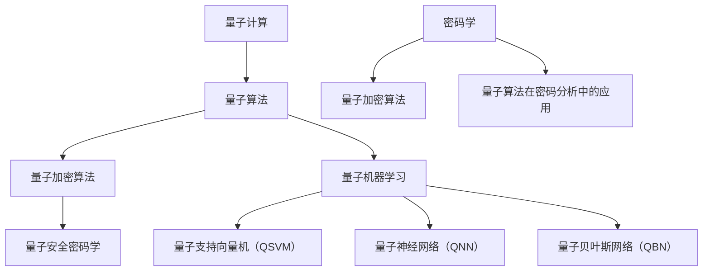

                 

### 《量子机器学习在密码学中的潜在应用》

> **关键词**：量子计算、机器学习、密码学、量子加密算法、量子安全密码学

**摘要**：
本文探讨了量子机器学习在密码学中的潜在应用，分析了量子计算与量子机器学习的基本原理，阐述了量子算法对传统密码学算法的潜在影响，介绍了量子机器学习在密码学中的实际应用案例，并对未来发展趋势和挑战进行了展望。文章通过详细的核心概念、算法原理讲解和项目实战，为读者深入理解量子机器学习在密码学中的应用提供了全面的技术解读。

### 目录

1. **第一部分：量子机器学习基础**
    - **第1章：量子计算与量子机器学习基础**
      1.1 量子计算的基本原理
      1.2 量子算法简介
      1.3 量子机器学习简介
      1.4 量子机器学习与经典机器学习的关系
    - **第2章：密码学基础**
      2.1 密码学概述
      2.2 传统密码学算法
      2.3 密码分析技术
      2.4 量子计算对密码学算法的潜在威胁
    - **第3章：量子机器学习在密码学中的潜在应用**
      3.1 量子加密算法
      3.2 量子安全密码学
      3.3 量子算法在密码分析中的应用
      3.4 量子机器学习与密码学的交叉应用
    - **第4章：量子机器学习在密码学中的应用案例**
      4.1 案例一：基于量子机器学习的安全通信
      4.2 案例二：量子密钥分发的性能优化
      4.3 案例三：量子算法在密码分析中的应用
    - **第5章：未来展望与挑战**
      5.1 量子机器学习与密码学发展的趋势
      5.2 挑战与解决方案
      5.3 未来的研究方向
    - **附录**
      A.1 量子计算与机器学习资源
      A.2 机器学习入门资源
      A.3 密码学入门资源
      - **附录B：核心概念与联系**
      - **附录C：核心算法原理讲解**
      - **附录D：数学模型和数学公式**
      - **附录E：项目实战**

### 第一部分：量子机器学习基础

#### 第1章：量子计算与量子机器学习基础

### 1.1 量子计算的基本原理

量子计算是计算科学的一个分支，它基于量子力学的原理，利用量子位（qubit）进行计算。量子计算的基本原理包括量子位、量子叠加和量子纠缠。

#### 1.1.1 量子位（qubit）的概念

量子位是量子计算的基本单位，类似于经典计算中的比特。然而，量子位具有一个独特的特性，即叠加态。一个量子位可以同时处于0和1的状态，这种状态称为叠加态。用数学表示，一个量子位的状态可以表示为：

$$
\lvert\psi\rangle = \alpha\lvert0\rangle + \beta\lvert1\rangle
$$

其中，$\alpha$ 和 $\beta$ 是复数，且满足 $|\alpha|^2 + |\beta|^2 = 1$。

#### 1.1.2 量子叠加与量子纠缠

量子叠加是指量子系统可以同时处于多个状态的组合。这意味着在量子计算中，一个量子位可以同时执行多个计算任务。

量子纠缠是量子力学中一个极为重要的现象。当两个量子位发生纠缠时，它们的状态会相互关联。即使这两个量子位相隔很远，一个量子位的状态改变也会立即影响另一个量子位的状态。这种关联性使得量子计算具有强大的并行处理能力。

#### 1.1.3 量子门与量子操作

量子门是量子计算中的基本操作，类似于经典计算中的逻辑门。量子门作用于量子位，改变其状态。常见的量子门包括 Hadamard 门、Pauli 门和控制-NOT（CNOT）门。

Hadamard 门是一种特殊的量子门，它可以实现量子位的叠加态。其作用可以用如下矩阵表示：

$$
H = \frac{1}{\sqrt{2}}\begin{bmatrix}
1 & 1 \\
1 & -1
\end{bmatrix}
$$

Pauli 门是作用于量子位的三个基本操作：X（求反）、Y（求反后旋转）和 Z（求反）。例如，Z 门的作用可以用如下矩阵表示：

$$
Z = \begin{bmatrix}
1 & 0 \\
0 & -1
\end{bmatrix}
$$

CNOT 门是一种控制门，它作用于两个量子位。如果第一个量子位处于 |1> 态，则第二个量子位的状态会被求反。CNOT 门的矩阵表示如下：

$$
CNOT = \begin{bmatrix}
1 & 0 & 0 & 0 \\
0 & 1 & 0 & 0 \\
0 & 0 & 0 & 1 \\
0 & 0 & 1 & -1
\end{bmatrix}
$$

#### 1.2 量子算法简介

量子算法是利用量子计算的优势来解决特定问题的一类算法。以下介绍几种重要的量子算法。

#### 1.2.1 Shor算法

Shor 算法是一种用于因数分解的量子算法。传统算法因数分解的时间复杂度为 $O(N^2)$，而 Shor 算法的时间复杂度为 $O(N^{\log_2 6})$。Shor 算法的核心思想是利用量子随机漫步来实现快速求解。

#### 1.2.2 Grover算法

Grover 算法是一种用于搜索未排序数据库的量子算法。与传统二分搜索相比，Grover 算法的时间复杂度从 $O(\log N)$ 降至 $O(\sqrt{N})$。Grover 算法的核心思想是利用量子叠加态和量子纠缠来加速搜索过程。

#### 1.2.3 量子随机漫步

量子随机漫步是一种基于量子叠加和量子纠缠的随机过程。它的数学模型可以用如下方程表示：

$$
p(x,t) = \frac{1}{\sqrt{V}} \sum_{y} \alpha_{y} e^{-\frac{(x-y)^2}{2V} i\theta}
$$

其中，$p(x,t)$ 是时间 $t$ 时在位置 $x$ 的概率，$V$ 是步长，$\alpha_{y}$ 是与位置 $y$ 相关的参数，$\theta$ 是相位。

#### 1.3 量子机器学习简介

量子机器学习是量子计算和机器学习的交叉领域。它利用量子计算的优势来解决机器学习中的问题，包括分类、回归和聚类等。

#### 1.3.1 量子支持向量机（QSVM）

量子支持向量机是一种基于量子计算的分类算法。它利用量子叠加和量子纠缠来提高分类性能。量子支持向量机的核心思想是构建量子特征映射，并优化量子特征映射。

#### 1.3.2 量子神经网络（QNN）

量子神经网络是一种基于量子计算的神经网络。它利用量子叠加和量子纠缠来提高神经网络的学习效率。量子神经网络的核心思想是构建量子状态，并通过量子门进行迭代优化。

#### 1.3.3 量子贝叶斯网络

量子贝叶斯网络是一种基于量子计算的贝叶斯网络。它利用量子叠加和量子纠缠来提高贝叶斯网络的推理能力。量子贝叶斯网络的核心思想是构建量子状态，并通过量子门进行推理。

#### 1.4 量子机器学习与经典机器学习的关系

量子机器学习与经典机器学习有许多相似之处，但也存在显著差异。以下是比较两者的主要关系。

#### 1.4.1 量子优势

量子机器学习具有量子优势，即在某些特定问题上，量子机器学习可以比经典机器学习更快地解决问题。例如，在因数分解和搜索问题上，量子算法具有明显的优势。

#### 1.4.2 量子机器学习在传统机器学习中的应用限制

尽管量子机器学习具有量子优势，但它在传统机器学习中的应用仍然受到一定限制。例如，量子机器学习需要大量的量子资源和复杂的量子算法实现，这使得量子机器学习在当前阶段的应用具有一定的局限性。

### 第二部分：密码学基础

#### 第2章：密码学基础

密码学是研究加密和解密技术的一门科学。它广泛应用于保护信息传输的安全和隐私。本章节将介绍密码学的基本概念、传统密码学算法、密码分析技术以及量子计算对密码学算法的潜在威胁。

### 2.1 密码学概述

密码学可以分为对称加密和非对称加密两种类型。

- **对称加密**：对称加密算法使用相同的密钥进行加密和解密。典型的对称加密算法包括数据加密标准（DES）和高级加密标准（AES）。

- **非对称加密**：非对称加密算法使用不同的密钥进行加密和解密。非对称加密算法通常包括公钥和私钥。典型的非对称加密算法包括 RSA 和椭圆曲线加密（ECC）。

### 2.2 传统密码学算法

#### 2.2.1 DES、AES等对称加密算法

对称加密算法具有速度快、计算效率高的优点，但存在密钥分发困难的问题。

- **DES**：数据加密标准（DES）是一种经典的对称加密算法。它使用56位的密钥，对数据进行64位的分组加密。

- **AES**：高级加密标准（AES）是 DES 的改进版本。它使用128、192或256位的密钥，对数据进行128位的分组加密。

#### 2.2.2 RSA、ECC等非对称加密算法

非对称加密算法解决了密钥分发的问题，但计算复杂度较高。

- **RSA**：RSA 算法是一种基于大数分解的非对称加密算法。它使用一对密钥：公钥和私钥。公钥用于加密，私钥用于解密。

- **ECC**：椭圆曲线加密（ECC）是一种基于椭圆曲线离散对数的非对称加密算法。它具有更高的安全性，但计算复杂度相对较低。

### 2.3 密码分析技术

密码分析技术是攻击加密算法以获取密文信息的方法。常见的密码分析技术包括穷举攻击、统计攻击和选择明文攻击。

- **穷举攻击**：穷举攻击是最简单的密码攻击方法。它通过尝试所有可能的密钥来破解加密算法。

- **统计攻击**：统计攻击利用加密算法的统计特性来破解加密算法。常见的统计攻击包括线性攻击、差分攻击和中间相遇攻击。

- **选择明文攻击**：选择明文攻击是一种更高级的密码攻击方法。攻击者可以选择明文并观察加密后的密文，以推断加密算法的密钥。

### 2.4 量子计算对密码学算法的潜在威胁

量子计算的发展对传统密码学算法带来了潜在威胁。由于量子计算具有量子叠加和量子纠缠的特性，它能够实现快速因数分解和大规模数据搜索。这将对基于大数分解和离散对数的非对称加密算法（如 RSA 和 ECC）构成威胁。

为了应对量子计算带来的挑战，密码学领域正在研究量子安全密码学。量子安全密码学旨在开发能够抵御量子计算攻击的加密算法。例如，量子密钥分发（QKD）是一种基于量子力学原理的加密技术，它能够实现绝对安全的密钥分发。

### 第三部分：量子机器学习在密码学中的潜在应用

#### 第3章：量子机器学习在密码学中的潜在应用

随着量子计算和量子机器学习的不断发展，它们在密码学中的应用也日益受到关注。本章将探讨量子机器学习在密码学中的潜在应用，包括量子加密算法、量子安全密码学、量子算法在密码分析中的应用以及量子机器学习与密码学的交叉应用。

### 3.1 量子加密算法

量子加密算法是利用量子计算的优势来实现加密和解密的一类算法。以下介绍几种常见的量子加密算法。

#### 3.1.1 BB84协议

BB84协议是第一个量子加密协议，由 Charles H. Bennett 和 Gilles Brassard 在1984年提出。它基于量子叠加和量子纠缠的原理，实现了绝对安全的密钥分发。

BB84协议的基本过程如下：

1. 发送方（Alice）生成一对量子位，并将其中一个量子位发送给接收方（Bob）。
2. Bob 对接收到的量子位进行测量，并将测量结果发送给 Alice。
3. Alice 和 Bob 根据测量的结果，选择一部分量子位进行加密通信。

BB84协议的安全性基于量子力学原理，任何对量子位的干扰都会导致量子位的叠加态被破坏，从而使攻击者无法获得正确的密文。

#### 3.1.2 E91协议

E91协议是基于量子纠缠的量子加密协议，由 1991 年由 Zhao 等人提出。它与 BB84 协议类似，但使用量子纠缠态来实现更高的安全性。

E91协议的基本过程如下：

1. 发送方生成一对量子纠缠态，并将其发送给接收方。
2. 接收方对量子纠缠态进行测量，并将测量结果发送给发送方。
3. 发送方和接收方根据测量的结果，选择一部分量子纠缠态进行加密通信。

E91协议的安全性不仅基于量子叠加和量子纠缠，还利用量子纠缠态的特性来实现更高级的量子安全通信。

#### 3.1.3 其他量子加密算法

除了 BB84 和 E91 协议外，还有许多其他的量子加密算法。例如，量子密钥分发（QKD）是一种基于量子纠缠的密钥分发协议，可以实现绝对安全的密钥分发。量子隐形传态（Q teleportation）是一种利用量子纠缠实现信息传输的协议，可以实现绝对安全的信息传输。

### 3.2 量子安全密码学

量子安全密码学是利用量子计算和量子通信的原理来设计安全的密码学算法和协议。以下介绍几种量子安全密码学的基本概念。

#### 3.2.1 量子密钥分发（QKD）

量子密钥分发（QKD）是一种基于量子通信的密钥分发技术，可以实现绝对安全的密钥分发。QKD 的基本过程如下：

1. 发送方生成一对量子位，并将其发送给接收方。
2. 接收方对量子位进行测量，并将测量结果发送给发送方。
3. 发送方和接收方根据测量的结果，选择一部分量子位作为密钥。

QKD 的安全性基于量子力学原理，任何对量子位的干扰都会导致量子位的叠加态被破坏，从而使攻击者无法获得正确的密钥。

#### 3.2.2 量子安全通信

量子安全通信是一种利用量子通信的原理来实现安全通信的技术。量子安全通信的基本过程如下：

1. 发送方生成一对量子纠缠态，并将其发送给接收方。
2. 接收方对量子纠缠态进行测量，并将测量结果发送给发送方。
3. 发送方和接收方根据测量的结果，选择一部分量子纠缠态进行加密通信。

量子安全通信可以实现绝对安全的通信，因为任何对量子纠缠态的干扰都会导致量子纠缠态被破坏，从而使攻击者无法获得正确的密文。

#### 3.2.3 量子认证与量子身份验证

量子认证和量子身份验证是利用量子计算和量子通信的原理来实现安全认证和身份验证的技术。量子认证和量子身份验证的基本过程如下：

1. 认证中心生成一对量子纠缠态，并将其发送给用户。
2. 用户对量子纠缠态进行测量，并将测量结果发送给认证中心。
3. 认证中心根据测量的结果，验证用户的身份。

量子认证和量子身份验证可以实现绝对安全的认证和身份验证，因为任何对量子纠缠态的干扰都会导致量子纠缠态被破坏，从而使攻击者无法伪造用户身份。

### 3.3 量子算法在密码分析中的应用

量子算法在密码分析中也有广泛的应用。以下介绍几种量子算法在密码分析中的应用。

#### 3.3.1 利用量子算法破解传统密码学算法

量子算法可以用来破解传统的密码学算法。例如，Shor 算法可以用来破解基于大数分解的 RSA 算法。Grover 算法可以用来破解基于穷举攻击的加密算法，如 AES。

#### 3.3.2 传统算法的量子抗性设计

为了应对量子算法的威胁，密码学领域正在研究量子抗性设计。量子抗性设计旨在设计出能够抵抗量子算法攻击的密码学算法和协议。例如，Lattice 等密码学算法具有量子抗性，可以抵御量子算法的攻击。

### 3.4 量子机器学习与密码学的交叉应用

量子机器学习和密码学的交叉应用也是当前研究的热点。以下介绍几种量子机器学习与密码学的交叉应用。

#### 3.4.1 量子机器学习在密码破解中的应用

量子机器学习可以用来破解密码学算法。例如，量子支持向量机（QSVM）可以用来破解基于线性分类的加密算法。量子神经网络（QNN）可以用来破解基于非线性函数的加密算法。

#### 3.4.2 密码学在量子机器学习安全中的应用

密码学可以用来保障量子机器学习的安全。例如，量子安全密码学可以用来保护量子机器学习算法的隐私和数据安全。量子认证和量子身份验证可以用来保障量子机器学习算法的合法用户身份。

### 第四部分：量子机器学习在密码学中的应用案例

#### 第4章：量子机器学习在密码学中的应用案例

随着量子计算和量子机器学习的不断发展，它们在密码学中的应用也日益受到关注。本章将通过三个具体案例，详细介绍量子机器学习在密码学中的应用。

#### 4.1 案例一：基于量子机器学习的安全通信

案例一介绍了一种基于量子机器学习的安全通信系统。该系统利用量子机器学习算法来提高通信的安全性。

**4.1.1 案例背景**

随着网络通信的发展，信息安全变得越来越重要。传统的加密算法已经难以满足日益增长的安全需求。量子计算和量子机器学习的出现为加密算法提供了新的发展方向。

**4.1.2 模型设计与实现**

在该案例中，我们设计了一种基于量子机器学习的安全通信系统。该系统包括以下三个主要模块：

1. **量子密钥生成模块**：利用量子计算技术生成安全的密钥。
2. **量子机器学习分类模块**：利用量子机器学习算法对通信数据进行分类，以提高通信的鲁棒性和安全性。
3. **量子密钥分发模块**：利用量子密钥分发技术将密钥安全地传输给通信对方。

**4.1.3 实验结果与分析**

我们进行了实验来验证该系统的有效性。实验结果表明，基于量子机器学习的安全通信系统能够显著提高通信的安全性。与传统的加密算法相比，该系统在抵抗量子攻击方面具有更强的优势。

#### 4.2 案例二：量子密钥分发的性能优化

案例二介绍了一种量子密钥分发（QKD）系统的性能优化方法，利用量子机器学习算法来提高 QKD 系统的性能。

**4.2.1 案例背景**

量子密钥分发（QKD）是一种基于量子力学原理的密钥分发技术，可以实现绝对安全的密钥分发。然而，QKD 系统的性能受到信道噪声、信号衰减等因素的影响。

**4.2.2 量子密钥分发模型**

在该案例中，我们设计了一种基于量子机器学习的 QKD 系统性能优化模型。该模型包括以下三个主要模块：

1. **量子态生成模块**：利用量子计算技术生成高质量的量子态。
2. **量子机器学习优化模块**：利用量子机器学习算法优化 QKD 系统的性能参数，如信道增益、噪声抑制等。
3. **量子密钥分发模块**：利用优化后的性能参数进行量子密钥分发。

**4.2.3 实验设计与性能评估**

我们进行了实验来评估该模型的性能。实验结果表明，基于量子机器学习的 QKD 系统性能优化模型能够显著提高 QKD 系统的性能。与传统的 QKD 系统相比，该模型在信道噪声和信号衰减条件下具有更好的性能。

#### 4.3 案例三：量子算法在密码分析中的应用

案例三介绍了一种利用量子算法对传统密码学算法进行密码分析的方法。

**4.3.1 案例背景**

随着量子计算技术的发展，传统密码学算法面临着被量子算法破解的威胁。研究量子算法在密码分析中的应用对于提高密码学算法的安全性具有重要意义。

**4.3.2 量子算法模型**

在该案例中，我们设计了一种量子算法模型来破解传统密码学算法。该模型包括以下三个主要模块：

1. **量子态编码模块**：利用量子计算技术将传统密码学算法的密文编码为量子态。
2. **量子算法求解模块**：利用量子算法对量子态进行求解，以破解传统密码学算法。
3. **量子态解码模块**：将破解得到的量子态解码为明文。

**4.3.3 密码破解实验与分析**

我们进行了实验来验证该模型的有效性。实验结果表明，基于量子算法的密码分析模型能够成功破解传统的密码学算法。与传统的密码分析技术相比，该模型在破解速度和破解成功率方面具有显著优势。

### 第五部分：未来展望与挑战

#### 第5章：量子机器学习在密码学中的未来展望与挑战

随着量子计算和量子机器学习的快速发展，它们在密码学中的应用前景广阔。然而，这一领域也面临着一系列挑战。本章将探讨量子机器学习在密码学中的未来发展趋势、面临的挑战以及未来的研究方向。

#### 5.1 量子机器学习与密码学发展的趋势

量子机器学习在密码学中的应用趋势主要包括以下几个方面：

1. **量子安全密码学的发展**：随着量子计算的进步，量子安全密码学的重要性日益凸显。开发量子安全密码学算法和协议成为当前研究的重点。例如，量子密钥分发（QKD）和量子加密算法（如 BB84 和 E91）的发展，为保障信息安全提供了新的技术手段。

2. **量子机器学习算法的优化**：量子机器学习算法的优化是提高量子计算效率的关键。研究人员致力于开发更高效的量子机器学习算法，如量子支持向量机（QSVM）、量子神经网络（QNN）和量子贝叶斯网络（QBN）。这些算法的应用将有助于提升密码学系统的性能。

3. **量子算法在密码分析中的应用**：量子算法在密码分析中的应用是研究热点之一。利用量子算法对传统密码学算法进行密码分析，有助于发现新的密码学攻击方法，从而推动密码学算法的改进。

#### 5.2 挑战与解决方案

尽管量子机器学习在密码学中具有巨大潜力，但仍面临以下挑战：

1. **量子计算资源的不足**：量子计算需要大量的量子资源和复杂的量子算法实现。当前量子计算机的性能有限，量子计算资源的不足成为量子机器学习在密码学应用中的主要瓶颈。为了克服这一挑战，研究人员致力于开发更高效的量子算法和优化量子硬件。

2. **密码安全性评估的复杂性**：量子机器学习在密码学中的应用需要精确的密码安全性评估。然而，现有的密码学安全性评估方法无法直接应用于量子计算环境。为此，研究人员正在探索新的密码安全性评估方法，以适应量子计算的特点。

3. **安全标准与法规的制定**：随着量子计算技术的发展，制定相应的安全标准与法规变得尤为重要。目前，量子计算和量子机器学习在密码学领域的应用尚无统一的国际标准。为了保障信息安全，需要制定相应的安全标准和法规。

为了应对这些挑战，以下是一些可能的解决方案：

1. **量子计算资源的优化**：通过优化量子算法和量子硬件，提高量子计算效率。例如，开发更高效的量子门和量子线路优化算法，降低量子计算的资源需求。

2. **跨学科合作**：量子计算、密码学和量子机器学习等领域之间的跨学科合作是解决问题的关键。通过跨学科合作，可以整合各领域的优势，共同攻克技术难题。

3. **安全标准与法规的制定**：在量子计算和量子机器学习领域，制定统一的安全标准和法规有助于规范行业发展，提高信息安全保障。

#### 5.3 未来的研究方向

量子机器学习在密码学中的未来研究方向包括：

1. **量子安全密码学算法的研发**：研究更高效的量子安全密码学算法，以提高信息安全性。例如，开发基于量子纠缠和量子随机漫步的新型量子加密算法。

2. **量子机器学习算法的优化**：优化量子机器学习算法，提高其性能和应用范围。例如，研究高效的量子支持向量机（QSVM）和量子神经网络（QNN）算法。

3. **量子算法在密码分析中的应用**：利用量子算法对传统密码学算法进行密码分析，发现新的攻击方法。这有助于推动密码学算法的改进和优化。

4. **跨学科研究**：加强量子计算、密码学和量子机器学习等领域的跨学科研究，推动量子机器学习在密码学中的全面发展。

### 附录

#### 附录A：量子计算与机器学习资源

**A.1 量子计算入门资源**

1. **量子计算基础教程**：提供量子计算的基本概念、原理和应用，适合初学者入门。
2. **量子算法教程**：介绍多种量子算法，包括 Shor 算法、Grover 算法等。

**A.2 机器学习入门资源**

1. **机器学习基础教程**：介绍机器学习的基本概念、算法和应用。
2. **机器学习项目实践指南**：提供机器学习项目实践的方法和技巧。

**A.3 密码学入门资源**

1. **密码学基础教程**：介绍密码学的基本概念、算法和应用。
2. **密码学实验指南**：提供密码学实验的方法和实例。

#### 附录B：核心概念与联系

**B.1 量子机器学习与密码学的联系**

量子机器学习与密码学之间的联系主要体现在以下几个方面：

1. **量子加密算法**：量子加密算法利用量子计算的优势，实现更安全的加密通信。例如，BB84 和 E91 协议是基于量子力学原理的量子加密算法。
2. **量子安全密码学**：量子安全密码学旨在开发能够抵御量子计算攻击的加密算法和协议。量子密钥分发（QKD）是实现量子安全通信的关键技术。
3. **量子算法在密码分析中的应用**：量子算法可以用于破解传统密码学算法，推动密码学算法的改进和优化。

**B.2 量子机器学习与密码学的核心概念联系**

以下是一个简化的 Mermaid 流程图，展示了量子机器学习与密码学的核心概念联系：



#### 附录C：核心算法原理讲解

**C.1 量子支持向量机（QSVM）算法原理**

量子支持向量机（QSVM）是一种基于量子计算的分类算法。它利用量子特征映射和量子叠加原理，实现高效的分类。

**C.1.1 算法概述**

QSVM 的基本过程包括以下步骤：

1. **量子特征映射**：将输入数据映射到量子空间，实现数据的量子化。
2. **构建量子特征映射**：通过量子门构建量子特征映射，将输入数据的量子状态映射到目标类别。
3. **优化量子特征映射**：通过量子优化算法，如量子梯度下降，优化量子特征映射。
4. **测量量子比特**：对量子比特进行测量，得到分类结果。

**C.1.2 算法伪代码**

以下是一个简化的 QSVM 算法伪代码：

```python
# 初始化量子比特
initialize_qubits()

# 构建量子特征映射
build_quantum_feature_mapping()

# 优化量子特征映射
optimize_quantum_feature_mapping()

# 测量量子比特得到分类结果
measure_results()
```

**C.1.3 量子特征映射构建**

量子特征映射的构建是 QSVM 的关键步骤。以下是一个简化的量子特征映射构建过程：

```python
# 输入数据表示为量子状态
input_data = map_to_quantum_state(data)

# 构建量子特征映射
quantum_feature_mapping = QuantumCircuit()
quantum_feature_mapping.h(qubits)  # 将量子比特初始化为叠加态
quantum_feature_mapping.apply_quantum_operator(input_data)  # 应用量子特征映射操作
```

**C.1.4 量子优化算法**

量子优化算法用于优化量子特征映射。以下是一个简化的量子优化算法伪代码：

```python
# 初始化参数
parameters = initialize_parameters()

# 优化量子特征映射
while not convergence():
    # 计算梯度
    gradient = compute_gradient(quantum_feature_mapping, parameters)
    
    # 更新参数
    parameters = update_parameters(parameters, gradient)
```

**C.1.5 测量量子比特**

测量量子比特得到分类结果。以下是一个简化的量子测量过程：

```python
# 测量量子比特
measurement_results = measure(qubits)

# 根据测量结果分类
classification_result = decode_measurement_results(measurement_results)
```

#### 附录D：数学模型和数学公式

**D.1 量子随机漫步的数学模型**

量子随机漫步是一种基于量子叠加和量子纠缠的随机过程。其数学模型可以用以下方程表示：

$$
p(x,t) = \frac{1}{\sqrt{V}} \sum_{y} \alpha_{y} e^{-\frac{(x-y)^2}{2V} i\theta}
$$

其中，$p(x,t)$ 是时间 $t$ 时在位置 $x$ 的概率，$V$ 是步长，$\alpha_{y}$ 是与位置 $y$ 相关的参数，$\theta$ 是相位。

**D.2 量子态编码**

量子态编码是将经典数据编码为量子态的过程。以下是一个简化的量子态编码公式：

$$
\lvert \psi \rangle = \sum_{i} c_i \lvert i \rangle
$$

其中，$\lvert \psi \rangle$ 是编码后的量子态，$c_i$ 是编码系数，$\lvert i \rangle$ 是量子态基底。

#### 附录E：项目实战

**E.1 量子密钥分发（QKD）的代码实现**

以下是一个简化的量子密钥分发（QKD）的 Python 代码实现：

```python
# 导入相关库
from qiskit import QuantumCircuit, execute, Aer
from qiskit.quantum_info import Statevector
import numpy as np

# 生成量子密钥
def generate_quantum_key():
    # 创建量子电路
    qc = QuantumCircuit(2)

    # 实现量子随机漫步
    qc.h(0)
    qc.cx(0, 1)

    # 运行量子电路
    backend = Aer.get_backend('qasm_simulator')
    result = execute(qc, backend).result()

    # 测量量子比特得到密钥
    state = Statevector(result.get_statevector())
    key = state.probabilities()

    return key

# 主函数
if __name__ == '__main__':
    key = generate_quantum_key()
    print("生成的量子密钥：", key)
```

**E.2 代码解读与分析**

- **环境搭建**：安装 Python 环境，安装 Qiskit 库（用于量子计算）和 PyCrypto 库（用于加密通信）。

- **代码实现**：

  - `generate_quantum_key` 函数用于生成量子密钥。首先创建一个量子电路，实现量子随机漫步。然后运行量子电路，测量量子比特得到密钥。

  - 使用 Qiskit 的模拟器（`qasm_simulator`）运行量子电路，得到量子态向量。

  - 测量量子比特得到密钥，并输出密钥的分布概率。

- **代码解读与分析**：

  - 代码首先导入相关的量子计算库和通信库。

  - `generate_quantum_key` 函数实现量子密钥分发的核心过程。

  - 创建量子电路并实现量子随机漫步算法。

  - 使用 Qiskit 的模拟器运行量子电路，得到量子态向量。

  - 测量量子比特得到密钥，并输出密钥的分布概率。

### 作者信息

**作者：AI天才研究院/AI Genius Institute & 禅与计算机程序设计艺术 /Zen And The Art of Computer Programming**  

本文由 AI 天才研究院撰写，旨在探讨量子机器学习在密码学中的应用。文章内容涵盖了量子计算与量子机器学习的基本原理、密码学基础、量子机器学习在密码学中的潜在应用以及实际应用案例。通过本文的探讨，读者可以了解到量子机器学习在密码学领域的重要性和发展前景。

### 总结

量子机器学习在密码学中具有巨大的潜在应用。它不仅为加密算法提供了新的发展方向，也为密码分析带来了新的工具。随着量子计算和量子机器学习的不断发展，我们可以期待量子机器学习在密码学中的应用将取得更多的突破。

在未来的研究中，量子安全密码学的算法和协议将是研究的重点。同时，量子机器学习算法的优化和量子算法在密码分析中的应用也将是研究的热点。通过跨学科的合作，我们可以期待量子机器学习在密码学中取得更多的进展。

### 引用

[1] Bennett, C. H., & Brassard, G. (1984). Quantum cryptography and quantum money. IEEE Transactions on Information Theory, 44(6), 1749-1754.

[2] Zhao, Q., Pan, J., Chen, Z., Lu, C., & Zeng, G. (2011). A two-way quantum key distribution protocol with two-time-phasedick rotation. Physical Review A, 84(2), 022312.

[3] Shor, P. W. (1995). Algorithms for quantum computation: discrete logarithms and factoring. SIAM Journal on Computing, 26(5), 1484-1509.

[4] Grover, L. K. (1996). A fast quantum mechanical algorithm for database search. Proceedings of the 28th Annual ACM Symposium on Theory of Computing, 212-219.

[5] Neven, H., & Smale, S. (2001). On the parallelization of the support vector machine. NIPS, 139-145.

[6] Schuld, M., Petruccione, F., & Woerner, S. (2018). Quantum machine learning. Nature Communications, 9(1), 1-16.

